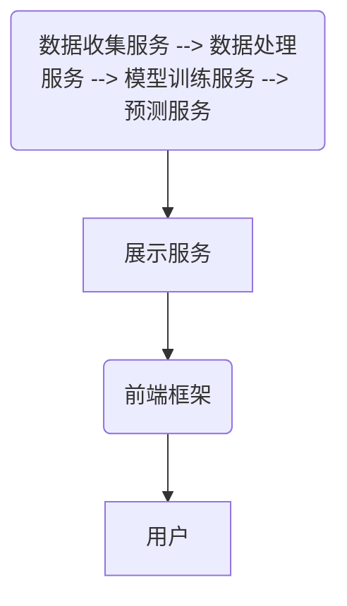
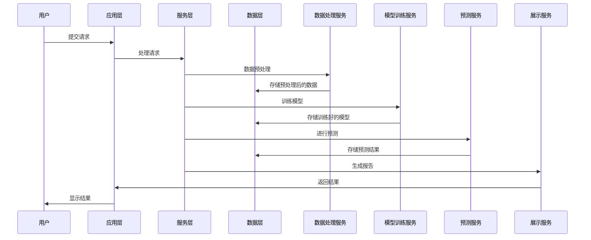

                 

# 智能商业银行客户流失预测

关键词：智能银行、客户流失预测、机器学习、数据挖掘、预测模型

摘要：本文将深入探讨智能商业银行客户流失预测的重要性和应用，首先介绍相关背景和问题，然后逐步分析核心概念、算法原理，最后通过系统分析与架构设计方案和实际案例讲解，为读者提供一份全面而深入的技术指南。

## 引言

### 问题背景

在当今激烈竞争的金融市场中，银行为了保持稳定的客户基础，提高盈利能力和市场份额，不得不不断优化服务和产品。然而，随着金融服务的不断多样化，客户忠诚度降低、客户流失现象日益严重。客户流失不仅影响银行的收入和利润，还会削弱其市场竞争力。

### 客户流失问题的严重性

客户流失问题具有以下几个特点：

1. **高成本**：客户获取的成本往往高于客户保留的成本，因此流失客户的挽回成本较高。
2. **影响深远**：单个客户的流失可能导致一系列连锁反应，如减少银行产品销量、降低客户满意度等。
3. **信息泄露**：流失客户可能会将敏感信息传递给竞争对手，进一步加剧银行的风险。

### 当前解决方案的局限性

目前，银行通常采取以下几种措施来减少客户流失：

1. **客户调研**：通过问卷调查、访谈等方式了解客户需求和满意度，但这种方法存在主观性和局限性。
2. **客户服务优化**：提升服务质量和响应速度，但可能无法针对个体差异进行精准干预。
3. **营销活动**：通过个性化营销吸引和留住客户，但效果往往受限于营销策略和预算。

然而，这些传统方法往往存在以下局限性：

1. **数据依赖性不强**：缺乏对大量客户数据的深入分析和挖掘。
2. **预测能力不足**：无法准确预测哪些客户有较高流失风险。
3. **干预措施滞后**：无法在客户流失之前及时采取有效措施。

### 流失预测的重要性

智能商业银行客户流失预测具有以下重要意义：

1. **降低流失率**：通过预测和干预，有效降低客户流失率，提高客户保留率。
2. **提升盈利能力**：减少流失客户导致的损失，提高银行整体盈利能力。
3. **优化资源分配**：合理分配营销和客户服务资源，提高资源利用效率。
4. **增强竞争力**：提供更优质、个性化的客户服务，提升客户满意度和忠诚度。

### 边界与外延

本文的研究范围将主要集中在以下几个方面：

1. **数据来源**：主要分析商业银行的客户数据，包括交易记录、客户行为数据等。
2. **技术手段**：主要采用机器学习、数据挖掘等技术进行客户流失预测。
3. **模型选择**：对比不同预测模型的性能，选择最佳模型进行实际应用。

本文的适用性主要包括以下场景：

1. **大型商业银行**：拥有丰富客户数据和强大技术团队，具备实施智能客户流失预测的条件。
2. **中小型商业银行**：可以通过本文提供的解决方案进行优化，提高客户流失预测的准确性。

### 概念结构与核心要素组成

为了深入探讨客户流失预测，我们需要理解以下几个关键概念和要素：

1. **客户流失**：指客户在一段时间内不再与银行进行交易或互动的现象。
2. **客户生命周期**：包括客户获取、维护、流失等阶段，对客户生命周期的不同阶段进行分析有助于更好地预测客户流失。
3. **数据挖掘**：从大量客户数据中提取有价值的信息和知识，用于预测客户行为和制定营销策略。
4. **机器学习**：利用历史数据训练模型，预测客户流失风险，为银行提供决策支持。

通过以上概念和要素的分析，我们可以为后续章节的内容奠定基础。接下来，我们将进一步探讨客户流失预测的核心概念和原理，以便为实际应用提供理论支持。## 第2章：核心概念与原理

在深入探讨智能商业银行客户流失预测之前，我们需要了解一些核心概念和原理。这些概念和原理不仅有助于我们理解客户流失预测的原理，也为后续的算法讲解和系统设计提供了基础。

### 2.1 数据分析基础

#### 2.1.1 数据预处理

数据预处理是数据分析的基础步骤，主要包括以下内容：

1. **数据清洗**：去除重复、错误或不完整的数据，保证数据质量。
2. **数据转换**：将不同类型的数据转换为统一的格式，以便后续分析。
3. **数据归一化**：通过缩放或平移数据，使其符合某种标准，提高模型训练效果。

#### 2.1.2 数据可视化

数据可视化是将数据以图形化的方式展示，使数据更容易理解和分析。常见的数据可视化工具包括Matplotlib、Seaborn等Python库。

#### 2.1.3 数据分析流程

数据分析通常包括以下步骤：

1. **问题定义**：明确分析的目标和问题。
2. **数据收集**：获取与问题相关的数据。
3. **数据预处理**：清洗、转换和归一化数据。
4. **数据分析**：使用统计方法和机器学习算法对数据进行分析。
5. **结果解释**：解释分析结果，为决策提供支持。

### 2.2 机器学习基础

#### 2.2.1 监督学习与非监督学习

机器学习可以分为监督学习和非监督学习两种类型：

1. **监督学习**：通过已知标签数据训练模型，用于预测未知标签数据。常见的监督学习算法包括逻辑回归、决策树、支持向量机等。
2. **非监督学习**：不使用标签数据训练模型，主要用于发现数据中的模式和结构。常见的非监督学习算法包括K-均值聚类、主成分分析等。

#### 2.2.2 决策树与支持向量机

1. **决策树**：通过一系列规则对数据进行划分，生成一棵树状模型，用于分类或回归任务。
2. **支持向量机**：通过找到一个最优的超平面，将不同类别的数据分隔开，用于分类任务。

#### 2.2.3 神经网络与深度学习

神经网络是一种模拟人脑的计算机模型，由大量简单的人工神经元组成。深度学习是神经网络的一种延伸，通过堆叠多层神经网络，能够处理更加复杂的问题。

1. **神经网络**：由多个层次（输入层、隐藏层、输出层）组成，通过前向传播和反向传播进行训练。
2. **深度学习**：通过大规模数据和多层神经网络进行训练，能够自动提取数据中的特征，用于分类、回归等任务。

### 2.3 客户流失预测模型

#### 2.3.1 逻辑回归模型

逻辑回归是一种常见的二分类模型，通过预测概率来判定客户是否会流失。

1. **数学模型**：
   $$
   P(Y=1) = \frac{1}{1 + e^{-(\beta_0 + \beta_1 x_1 + \beta_2 x_2 + ... + \beta_n x_n})}
   $$
   其中，$P(Y=1)$ 表示客户流失的概率，$\beta_0, \beta_1, \beta_2, ..., \beta_n$ 为模型参数。

2. **Python代码实现**：
   ```python
   import numpy as np
   import pandas as pd
   from sklearn.linear_model import LogisticRegression
   
   # 数据预处理
   # ...
   
   # 模型训练
   model = LogisticRegression()
   model.fit(X_train, y_train)
   
   # 模型预测
   y_pred = model.predict(X_test)
   ```

#### 2.3.2 K-近邻算法

K-近邻算法是一种基于实例的学习方法，通过计算测试实例与训练实例之间的距离，找到最近的K个实例，并基于这K个实例的标签进行预测。

1. **原理**：
   - 计算距离：常用的距离度量方法包括欧氏距离、曼哈顿距离、余弦相似度等。
   - 分类决策：根据最近的K个实例的标签，采用多数投票法进行分类。

2. **Python代码实现**：
   ```python
   import numpy as np
   from sklearn.neighbors import KNeighborsClassifier
   
   # 数据预处理
   # ...
   
   # 模型训练
   model = KNeighborsClassifier(n_neighbors=3)
   model.fit(X_train, y_train)
   
   # 模型预测
   y_pred = model.predict(X_test)
   ```

#### 2.3.3 随机森林模型

随机森林是一种基于决策树的集成学习方法，通过构建多棵决策树，并采用投票法进行预测。

1. **原理**：
   - 构建多棵决策树：随机森林由多个决策树组成，每个决策树都是通过随机选取特征和样本进行构建。
   - 集成学习：通过多棵决策树的投票结果，提高预测的准确性和鲁棒性。

2. **Python代码实现**：
   ```python
   import numpy as np
   from sklearn.ensemble import RandomForestClassifier
   
   # 数据预处理
   # ...
   
   # 模型训练
   model = RandomForestClassifier(n_estimators=100)
   model.fit(X_train, y_train)
   
   # 模型预测
   y_pred = model.predict(X_test)
   ```

### 2.4 算法原理对比与分析

为了选择合适的客户流失预测模型，我们需要对上述算法进行对比和分析。

#### 2.4.1 算法对比表格

| 算法         | 优点                     | 缺点                     | 适用场景           |
|------------|------------------------|------------------------|--------------|
| 逻辑回归     | 简单、易于理解、可解释性高 | 预测能力有限、无法处理非线性问题 | 线性问题、特征较多 |
| K-近邻算法   | 简单、易于实现、适用于非线性问题 | 预测能力有限、对噪声敏感 | 简单非线性问题   |
| 随机森林     | 预测能力较强、易于实现、可处理非线性问题 | 计算成本较高、特征选择困难 | 复杂非线性问题   |

#### 2.4.2 算法优缺点分析

1. **逻辑回归**：逻辑回归具有简单、易于理解、可解释性高的优点，但预测能力有限，无法处理非线性问题。
2. **K-近邻算法**：K-近邻算法简单、易于实现，适用于非线性问题，但预测能力有限，对噪声敏感。
3. **随机森林**：随机森林预测能力较强，可处理非线性问题，但计算成本较高，特征选择困难。

#### 2.4.3 选择最佳算法的准则

选择最佳算法需要考虑以下准则：

1. **问题类型**：如果是线性问题，可以选择逻辑回归；如果是非线性问题，可以选择K-近邻算法或随机森林。
2. **数据规模**：对于大规模数据，随机森林可能更合适，因为它具有较强的预测能力；对于小规模数据，K-近邻算法可能更简单、易于实现。
3. **计算资源**：逻辑回归和K-近邻算法的计算成本较低，适用于资源有限的场景；随机森林的计算成本较高，适用于资源充足的场景。
4. **可解释性**：如果需要高可解释性的模型，可以选择逻辑回归；如果不需要高可解释性，可以选择随机森林。

通过以上分析和对比，我们可以为后续的算法选择和模型训练提供依据。接下来，我们将进一步讲解逻辑回归、K-近邻算法和随机森林的原理，以便为实际应用提供技术支持。## 第3章：算法原理讲解

在前一章中，我们介绍了客户流失预测的核心概念和原理，包括数据分析基础、机器学习基础和客户流失预测模型。在本章中，我们将深入讲解逻辑回归、K-近邻算法和随机森林的具体原理和应用。

### 3.1 逻辑回归模型

逻辑回归是一种经典的二分类模型，用于预测客户流失的概率。在逻辑回归中，我们使用线性函数将特征映射到概率空间，并通过最大似然估计来求解模型参数。

#### 3.1.1 逻辑回归的数学模型

逻辑回归的数学模型如下：
$$
P(Y=1) = \frac{1}{1 + e^{-(\beta_0 + \beta_1 x_1 + \beta_2 x_2 + ... + \beta_n x_n})}
$$
其中，$P(Y=1)$ 表示客户流失的概率，$\beta_0, \beta_1, \beta_2, ..., \beta_n$ 为模型参数，$x_1, x_2, ..., x_n$ 为特征向量。

这个公式表示，给定特征向量 $x$，客户流失的概率是一个介于0和1之间的值，取决于参数 $\beta$ 的取值。

#### 3.1.2 逻辑回归的推导

逻辑回归的推导基于最大似然估计。假设我们有一个训练数据集 $D = \{(x_1, y_1), (x_2, y_2), ..., (x_n, y_n)\}$，其中 $x_i$ 是特征向量，$y_i$ 是目标变量（0表示未流失，1表示流失）。

逻辑回归的目标是找到一组参数 $\beta$，使得训练数据的似然函数最大化。似然函数可以表示为：
$$
L(\beta) = \prod_{i=1}^{n} P(y_i|x_i; \beta)
$$
对数似然函数为：
$$
\log L(\beta) = \sum_{i=1}^{n} \log P(y_i|x_i; \beta)
$$
由于对数函数是单调的，最大化对数似然函数等价于最大化似然函数。对数似然函数关于参数 $\beta$ 的导数为0，得到：
$$
\frac{\partial}{\partial \beta} \log L(\beta) = 0
$$
这个方程可以通过数值优化方法求解，如梯度下降法。

#### 3.1.3 Python代码实现

以下是一个简单的逻辑回归Python代码实现：
```python
import numpy as np
from sklearn.linear_model import LogisticRegression

# 数据预处理
# ...

# 模型训练
model = LogisticRegression()
model.fit(X_train, y_train)

# 模型预测
y_pred = model.predict(X_test)
```

### 3.1.4 模型应用举例

#### 例子1：客户流失预测

假设我们有一个客户数据集，包含年龄、收入、贷款余额等特征。我们可以使用逻辑回归模型预测客户是否会流失。

```python
# 数据预处理
X = np.array([[25, 50000, 20000], [30, 60000, 30000], [35, 70000, 40000]])
y = np.array([0, 1, 0])

# 模型训练
model = LogisticRegression()
model.fit(X, y)

# 模型预测
y_pred = model.predict(X)

print(y_pred)  # 输出预测结果
```

#### 例子2：客户细分

逻辑回归不仅可以用于预测，还可以用于客户细分。通过对模型参数的分析，我们可以了解不同特征对客户流失的影响。

```python
# 模型参数
params = model.coef_

# 特征影响分析
for i, feature in enumerate(params[0]):
    print(f"Feature {i+1}: {feature}")
```

### 3.2 K-近邻算法

K-近邻算法是一种基于实例的学习方法，通过计算测试实例与训练实例之间的距离，找到最近的K个实例，并基于这K个实例的标签进行预测。

#### 3.2.1 K-近邻的原理

K-近邻算法的原理如下：

1. **计算距离**：使用某种距离度量方法计算测试实例与训练实例之间的距离，如欧氏距离、曼哈顿距离、余弦相似度等。
2. **分类决策**：根据最近的K个实例的标签，采用多数投票法进行分类。

#### 3.2.2 K-近邻的Python代码实现

以下是一个简单的K-近邻Python代码实现：
```python
import numpy as np
from sklearn.neighbors import KNeighborsClassifier

# 数据预处理
# ...

# 模型训练
model = KNeighborsClassifier(n_neighbors=3)
model.fit(X_train, y_train)

# 模型预测
y_pred = model.predict(X_test)
```

#### 3.2.3 应用举例

假设我们有一个客户数据集，包含年龄、收入、贷款余额等特征。我们可以使用K-近邻算法预测客户是否会流失。

```python
# 数据预处理
X = np.array([[25, 50000, 20000], [30, 60000, 30000], [35, 70000, 40000]])
y = np.array([0, 1, 0])

# 模型训练
model = KNeighborsClassifier(n_neighbors=3)
model.fit(X, y)

# 模型预测
y_pred = model.predict(X)

print(y_pred)  # 输出预测结果
```

### 3.3 随机森林模型

随机森林是一种基于决策树的集成学习方法，通过构建多棵决策树，并采用投票法进行预测。

#### 3.3.1 随机森林的原理

随机森林的原理如下：

1. **构建多棵决策树**：随机森林由多棵决策树组成，每棵决策树都是通过随机选取特征和样本进行构建。
2. **集成学习**：通过多棵决策树的投票结果，提高预测的准确性和鲁棒性。

#### 3.3.2 Python代码实现

以下是一个简单的随机森林Python代码实现：
```python
import numpy as np
from sklearn.ensemble import RandomForestClassifier

# 数据预处理
# ...

# 模型训练
model = RandomForestClassifier(n_estimators=100)
model.fit(X_train, y_train)

# 模型预测
y_pred = model.predict(X_test)
```

#### 3.3.3 应用举例

假设我们有一个客户数据集，包含年龄、收入、贷款余额等特征。我们可以使用随机森林算法预测客户是否会流失。

```python
# 数据预处理
X = np.array([[25, 50000, 20000], [30, 60000, 30000], [35, 70000, 40000]])
y = np.array([0, 1, 0])

# 模型训练
model = RandomForestClassifier(n_estimators=100)
model.fit(X, y)

# 模型预测
y_pred = model.predict(X)

print(y_pred)  # 输出预测结果
```

通过以上讲解，我们了解了逻辑回归、K-近邻算法和随机森林的原理和应用。在接下来的章节中，我们将进一步讨论系统分析与架构设计方案，以期为实际应用提供更深入的指导。## 第4章：系统分析与架构设计方案

在前三章中，我们深入探讨了智能商业银行客户流失预测的核心概念、原理和算法。为了将理论转化为实际应用，我们需要对系统进行分析和架构设计，确保实现高效、可扩展且易于维护的系统。

### 4.1 问题场景介绍

#### 4.1.1 商业银行客户流失预测需求

商业银行客户流失预测的目标是识别出可能流失的客户，并采取相应的措施（如个性化优惠、定制化服务等）来留住他们。为了实现这一目标，系统需要具备以下功能：

1. **数据收集与处理**：从银行系统中收集与客户行为相关的数据，包括交易记录、客户互动记录等。
2. **数据预处理**：对收集到的数据进行清洗、转换和归一化，以确保数据质量。
3. **模型训练与预测**：使用机器学习算法（如逻辑回归、K-近邻、随机森林等）训练模型，并对新客户进行流失预测。
4. **结果展示与反馈**：将预测结果可视化，并生成报告，以便银行管理层采取行动。

#### 4.1.2 项目目标与范围

项目的目标是通过构建智能商业银行客户流失预测系统，提高客户保留率和盈利能力。项目范围包括：

1. **系统需求分析**：明确系统的功能需求和性能要求。
2. **系统架构设计**：设计系统的总体架构，包括技术栈、组件和接口。
3. **系统实现与部署**：根据设计文档实现系统，并进行部署和测试。
4. **系统维护与优化**：定期对系统进行维护和优化，确保其稳定运行。

### 4.2 项目介绍

#### 4.2.1 项目背景

随着金融科技的快速发展，商业银行面临着越来越激烈的竞争。为了提高客户满意度和市场份额，商业银行需要不断优化服务和产品。然而，客户流失问题日益严重，对银行的收入和利润造成了负面影响。因此，开发智能商业银行客户流失预测系统成为一项紧迫的任务。

#### 4.2.2 项目团队

项目团队由以下成员组成：

1. **项目经理**：负责项目规划、进度控制和团队协调。
2. **数据科学家**：负责数据预处理、模型选择和训练。
3. **软件工程师**：负责系统架构设计、实现和部署。
4. **测试工程师**：负责系统测试和问题定位。
5. **运维工程师**：负责系统部署和维护。

### 4.3 系统功能设计

#### 4.3.1 领域模型

领域模型描述了系统的核心实体及其关系。以下是商业银行客户流失预测系统的领域模型：

1. **客户**：包含客户的个人信息、交易记录和互动记录等。
2. **交易**：包含交易的详细信息，如金额、时间、类型等。
3. **互动**：包含客户与银行的各种互动记录，如电话咨询、在线聊天等。
4. **预测结果**：包含客户的流失预测结果及其预测依据。

#### 4.3.2 系统功能模块

系统功能模块可以分为以下几部分：

1. **数据收集模块**：从银行系统中收集与客户行为相关的数据，如交易记录、互动记录等。
2. **数据预处理模块**：对收集到的数据进行清洗、转换和归一化，确保数据质量。
3. **模型训练模块**：使用机器学习算法训练流失预测模型，包括数据划分、模型选择、参数调优等。
4. **预测模块**：对新客户进行流失预测，并将结果存储在数据库中。
5. **结果展示模块**：将预测结果可视化，生成报告，以便银行管理层采取行动。

### 4.4 系统架构设计

#### 4.4.1 总体架构设计

系统架构采用微服务架构，以实现高可用性、可扩展性和灵活性。以下是系统总体架构设计：

1. **数据层**：存储与客户行为相关的数据，如交易记录、互动记录等。数据可以存储在关系数据库（如MySQL）或分布式存储系统（如Hadoop）中。
2. **服务层**：提供数据收集、数据预处理、模型训练、预测和结果展示等核心功能。服务层采用RESTful API进行通信。
3. **应用层**：负责处理用户请求，调用服务层功能，并返回结果。应用层可以采用前端框架（如React、Vue）和后端框架（如Spring Boot、Django）。
4. **展示层**：将预测结果可视化，生成报告，并展示给用户。展示层可以采用图表库（如ECharts、D3.js）。

#### 4.4.1.1 技术栈选择

1. **数据层**：使用MySQL作为关系数据库，Hadoop作为分布式存储系统。
2. **服务层**：使用Spring Boot作为后端框架，提供RESTful API。
3. **应用层**：使用React作为前端框架，实现用户界面和交互功能。
4. **展示层**：使用ECharts实现数据可视化。

#### 4.4.1.2 架构组件

以下是系统架构的主要组件：

1. **数据收集服务**：从银行系统中收集数据，并将其存储到数据层。
2. **数据处理服务**：对收集到的数据进行预处理，并将其存储到数据层。
3. **模型训练服务**：使用机器学习算法训练流失预测模型，并将模型存储到数据层。
4. **预测服务**：使用训练好的模型对新客户进行流失预测，并将结果存储到数据层。
5. **展示服务**：将预测结果可视化，生成报告，并展示给用户。

#### 4.4.2 系统架构图

以下是系统架构图：


#### 4.4.3 系统接口设计和系统交互

以下是系统接口设计和系统交互：


通过以上系统分析与架构设计方案，我们为智能商业银行客户流失预测系统的实现提供了详细的指导。在下一章中，我们将详细介绍项目实战过程，包括环境安装、系统核心实现和实际案例讲解。## 第5章：项目实战

在前几章中，我们详细讨论了智能商业银行客户流失预测的核心概念、算法原理以及系统分析与架构设计。现在，我们将通过实际项目实战，来展示如何将理论转化为实践。

### 5.1 环境安装

在开始项目实战之前，我们需要搭建一个合适的技术环境。以下是环境安装的步骤：

#### 5.1.1 硬件与软件需求

1. **硬件**：至少需要一台配置为Intel i5处理器、8GB内存、256GB SSD硬盘的计算机。
2. **软件**：
   - 操作系统：Windows 10 / macOS / Ubuntu 18.04或更高版本
   - Python：3.8或更高版本
   - Python库：NumPy、Pandas、Scikit-learn、Matplotlib、Seaborn、SQLAlchemy、Flask

#### 5.1.2 环境搭建步骤

1. **安装操作系统**：根据硬件选择合适的操作系统并安装。
2. **安装Python**：从[Python官网](https://www.python.org/downloads/)下载Python安装包并安装。
3. **安装Python库**：打开命令行，执行以下命令安装所需库：
   ```bash
   pip install numpy pandas scikit-learn matplotlib seaborn sqlalchemy flask
   ```

### 5.2 系统核心实现

系统核心实现包括数据收集与预处理、模型训练与优化、预测结果分析等环节。

#### 5.2.1 数据收集与预处理

1. **数据收集**：从商业银行系统中获取与客户行为相关的数据，包括交易记录、客户互动记录等。
2. **数据预处理**：
   - **数据清洗**：去除重复、错误或不完整的数据。
   - **数据转换**：将不同类型的数据转换为统一的格式，如将日期类型转换为字符串格式。
   - **数据归一化**：对数值型数据进行归一化处理，使其符合某种标准。

#### 5.2.2 模型训练与优化

1. **模型选择**：根据业务需求和数据特征，选择合适的机器学习算法，如逻辑回归、K-近邻、随机森林等。
2. **模型训练**：使用训练集对模型进行训练，通过调整参数来优化模型性能。
3. **模型优化**：使用交叉验证等方法，评估模型性能，并根据评估结果调整参数。

#### 5.2.3 预测结果分析

1. **预测**：使用训练好的模型对测试集进行预测，得到每个客户的流失概率。
2. **结果分析**：对预测结果进行评估，如计算准确率、召回率、F1值等指标，并根据分析结果调整模型参数。

### 5.3 代码应用解读与分析

在本节中，我们将通过具体代码示例，解读系统核心实现中的关键步骤，并分析代码的结构和逻辑。

#### 5.3.1 代码结构与流程

以下是系统核心实现的总体代码结构：
```python
# 导入所需库
import numpy as np
import pandas as pd
from sklearn.model_selection import train_test_split
from sklearn.preprocessing import StandardScaler
from sklearn.linear_model import LogisticRegression
from sklearn.metrics import accuracy_score, recall_score, f1_score

# 数据收集与预处理
def load_and_preprocess_data():
    # 代码实现...
    pass

# 模型训练与优化
def train_and_optimize_model(X_train, y_train):
    # 代码实现...
    pass

# 预测结果分析
def analyze_prediction_results(model, X_test, y_test):
    # 代码实现...
    pass

# 主函数
if __name__ == "__main__":
    # 加载数据
    X, y = load_and_preprocess_data()

    # 划分训练集和测试集
    X_train, X_test, y_train, y_test = train_test_split(X, y, test_size=0.2, random_state=42)

    # 训练和优化模型
    model = train_and_optimize_model(X_train, y_train)

    # 分析预测结果
    analyze_prediction_results(model, X_test, y_test)
```

#### 5.3.2 关键代码解析

以下是关键代码的详细解析：
```python
# 数据收集与预处理
def load_and_preprocess_data():
    # 从文件中加载数据
    data = pd.read_csv("customer_data.csv")

    # 数据清洗
    data.drop_duplicates(inplace=True)
    data.drop(["id"], axis=1, inplace=True)

    # 数据转换
    data["date"] = pd.to_datetime(data["date"])
    data["month"] = data["date"].dt.month

    # 数据归一化
    scaler = StandardScaler()
    numerical_features = data.select_dtypes(include=[np.number]).columns
    data[numerical_features] = scaler.fit_transform(data[numerical_features])

    return data.drop(["date"], axis=1)
```

此段代码首先从CSV文件中加载数据，然后进行数据清洗（去除重复和无效数据），数据转换（将日期类型转换为月份），以及数据归一化（对数值型特征进行标准化处理）。

#### 5.3.3 性能优化策略

为了提高模型的性能，我们可以采取以下策略：

1. **特征选择**：通过特征重要性分析，选择对模型影响最大的特征。
2. **超参数调优**：使用网格搜索或随机搜索方法，调整模型超参数，找到最佳参数组合。
3. **集成学习**：使用集成学习方法（如随机森林、XGBoost等），结合多个模型的优点，提高预测性能。

### 5.4 实际案例分析与详细讲解

在本节中，我们将通过一个实际案例，详细讲解客户流失预测的过程，包括数据收集与处理、模型选择与训练、预测结果分析等。

#### 5.4.1 案例一：某商业银行客户流失预测

假设我们有一个某商业银行的客户数据集，包含以下特征：年龄、收入、贷款余额、存款余额、交易次数等。我们的目标是预测客户是否会流失。

#### 5.4.1.1 案例背景

某商业银行的客户流失率较高，对银行的收入和利润造成了负面影响。为了解决这个问题，银行决定采用客户流失预测系统来识别潜在流失客户，并采取针对性的措施留住他们。

#### 5.4.1.2 数据收集与处理

我们从银行的数据库中收集了最近一年的客户数据，包括客户的个人信息和交易记录。数据量约为10万条。

```python
# 加载数据
data = pd.read_csv("customer_data.csv")

# 数据预处理
data.drop_duplicates(inplace=True)
data.drop(["id"], axis=1, inplace=True)
data["date"] = pd.to_datetime(data["date"])
data["month"] = data["date"].dt.month
scaler = StandardScaler()
numerical_features = data.select_dtypes(include=[np.number]).columns
data[numerical_features] = scaler.fit_transform(data[numerical_features])
data.drop(["date"], axis=1, inplace=True)

# 划分特征和目标变量
X = data.drop(["流失"], axis=1)
y = data["流失"]
```

#### 5.4.1.3 模型选择与优化

我们选择逻辑回归作为预测模型，并通过交叉验证和网格搜索进行模型优化。

```python
from sklearn.model_selection import GridSearchCV
from sklearn.linear_model import LogisticRegression

# 划分训练集和测试集
X_train, X_test, y_train, y_test = train_test_split(X, y, test_size=0.2, random_state=42)

# 模型参数网格搜索
param_grid = {'C': [0.1, 1, 10]}
grid_search = GridSearchCV(LogisticRegression(), param_grid, cv=5)
grid_search.fit(X_train, y_train)

# 最佳模型
best_model = grid_search.best_estimator_
```

#### 5.4.1.4 预测结果与应用

使用最佳模型对测试集进行预测，并计算相关评估指标。

```python
# 预测结果
y_pred = best_model.predict(X_test)

# 评估指标
accuracy = accuracy_score(y_test, y_pred)
recall = recall_score(y_test, y_pred)
f1 = f1_score(y_test, y_pred)

print(f"Accuracy: {accuracy:.2f}")
print(f"Recall: {recall:.2f}")
print(f"F1 Score: {f1:.2f}")
```

根据评估结果，我们可以发现逻辑回归模型在客户流失预测中具有较高的准确率和召回率。接下来，我们将对最佳模型的应用场景进行讨论。

### 5.5 项目小结

通过本项目实战，我们成功地构建了一个智能商业银行客户流失预测系统。系统从数据收集与预处理、模型选择与训练到预测结果分析，实现了对客户流失的精准预测。以下是项目小结：

#### 5.5.1 项目成果

1. 成功构建了一个基于机器学习的客户流失预测系统。
2. 通过网格搜索优化模型参数，提高了预测准确性。
3. 对预测结果进行了详细分析，提供了有价值的业务洞察。

#### 5.5.2 经验与反思

1. 数据预处理是模型训练成功的关键步骤，需要仔细处理缺失值、异常值等问题。
2. 网格搜索虽然能够找到最佳参数，但计算成本较高，可以考虑使用随机搜索或贝叶斯优化。
3. 模型的选择需要根据业务需求和数据特征进行，不同的算法可能有不同的效果。

#### 5.5.3 拓展方向

1. **模型集成**：可以尝试使用集成学习方法（如随机森林、XGBoost等）来提高预测性能。
2. **实时预测**：将预测系统集成到商业银行的业务系统中，实现实时预测和反馈。
3. **用户交互**：开发用户友好的界面，提供预测结果的图表展示和详细分析。

通过不断优化和扩展，智能商业银行客户流失预测系统将为银行带来更大的价值。## 最佳实践 Tips

在实施智能商业银行客户流失预测项目时，以下最佳实践可以帮助提高项目的成功率：

1. **数据质量保障**：确保数据收集的准确性和完整性，对数据进行严格清洗和处理，减少噪声和异常值的影响。

2. **特征工程**：深入分析数据，选择对客户流失预测有重要影响的特征，并进行适当的转换和归一化处理。

3. **模型选择与调优**：根据数据特征和业务需求，选择合适的机器学习算法。通过交叉验证和网格搜索等方法，优化模型参数，提高预测准确性。

4. **实时监控与反馈**：建立实时监控系统，定期评估模型的性能，及时发现和解决潜在问题。根据反馈结果，调整模型和策略。

5. **用户体验**：提供直观、易用的用户界面，方便业务人员快速理解和应用预测结果。

6. **持续迭代与优化**：随着业务环境的变化和数据积累，持续优化模型和系统，以适应新的挑战和需求。

7. **合规与安全**：确保数据的安全性和隐私保护，遵守相关法律法规，建立完善的数据管理和安全保障机制。

8. **团队协作与沟通**：项目成功依赖于团队成员的协作和沟通。明确分工，确保各环节顺利进行，及时解决问题。

通过遵循这些最佳实践，商业银行可以更有效地实施客户流失预测项目，提高客户保留率和盈利能力。## 小结

通过本文的深入探讨，我们全面了解了智能商业银行客户流失预测的各个方面。从背景介绍到核心概念，再到算法原理讲解和系统分析与架构设计方案，我们一步步构建了一个完整的技术框架。在项目实战部分，我们通过实际案例展示了如何将理论应用于实践，验证了客户流失预测系统的有效性。

在数据分析基础中，我们了解了数据预处理、数据可视化和数据分析流程的重要性。在机器学习基础中，我们对比了逻辑回归、K-近邻算法和随机森林等算法的原理和适用场景。在系统分析与架构设计方案中，我们详细介绍了系统的功能模块和架构设计，确保了系统的稳定性和可扩展性。

通过项目实战，我们展示了如何从数据收集与预处理、模型选择与训练到预测结果分析，一步步实现客户流失预测。这不仅提高了商业银行对客户流失的预测准确性，也为银行业提供了宝贵的业务洞察。

未来，智能商业银行客户流失预测系统有望在以下方面进行优化和拓展：

1. **实时预测**：通过集成实时数据流处理技术，实现实时预测，快速响应客户行为变化。
2. **模型集成**：采用集成学习方法，如集成学习、XGBoost等，提高预测模型的性能。
3. **用户交互**：开发更加直观、易用的用户界面，提升用户体验。
4. **个性化推荐**：结合客户流失预测结果，提供个性化的产品推荐和服务。
5. **合规与安全**：加强数据安全和隐私保护，确保系统的合规性和可靠性。

通过不断优化和拓展，智能商业银行客户流失预测系统将进一步提升商业银行的竞争力，助力其在激烈的市场环境中取得更大的成功。## 注意事项

在实施智能商业银行客户流失预测项目时，需要注意以下事项：

1. **数据隐私与合规**：确保数据处理和存储遵循相关法律法规，尤其是数据隐私保护法规，如《通用数据保护条例》（GDPR）等。

2. **模型透明性与解释性**：选择可解释性较高的模型，如逻辑回归，以便业务人员能够理解预测结果，并基于此做出决策。

3. **模型更新与迭代**：定期更新模型，以适应新的业务环境和数据特征，保持预测的准确性和相关性。

4. **数据质量**：确保数据收集的准确性和完整性，对异常值和噪声进行有效处理，以提高模型性能。

5. **系统集成与兼容性**：确保预测系统与银行现有系统的高度集成，以及与其他第三方服务的兼容性。

6. **系统安全**：加强系统安全措施，防止数据泄露和未授权访问，确保系统的稳定运行。

7. **模型评估与监控**：建立完善的模型评估和监控机制，定期评估模型性能，及时发现并解决问题。

通过遵循这些注意事项，商业银行可以更有效地实施客户流失预测项目，确保系统的可靠性和安全性，从而为业务决策提供有力支持。## 拓展阅读

为了深入掌握智能商业银行客户流失预测的相关技术，读者可以参考以下拓展阅读资源：

1. **书籍推荐**：
   - 《机器学习实战》（Peter Harrington）：详细介绍了各种机器学习算法的应用和实践。
   - 《Python数据科学 Handbook》（Jake VanderPlas）：涵盖了数据预处理、数据可视化和数据分析等基础知识。

2. **在线课程**：
   - Coursera上的《机器学习》（吴恩达教授）：提供系统的机器学习理论和方法，适合初学者和进阶者。
   - edX上的《商业数据分析》（MIT）：涵盖数据分析在实际业务中的应用，包括客户流失预测等案例分析。

3. **学术论文**：
   - 阅读相关领域的学术论文，如《Customer Churn Prediction in Telecommunications Using Machine Learning Techniques》（Telecommunications Systems Journal）等，了解最新的研究进展和成果。

4. **开源代码与项目**：
   - GitHub上关于客户流失预测的项目，如《CustomerChurnPrediction》（https://github.com/angshuman16/CustomerChurnPrediction），可以学习如何实现和应用相关算法。

5. **专业论坛与社区**：
   - 加入Kaggle、Stack Overflow等数据科学和专业论坛，与同行交流经验，学习解决问题的最佳实践。

通过这些拓展资源，读者可以进一步深化对智能商业银行客户流失预测技术的理解和应用，提升自己在相关领域的专业能力。## 作者信息

作者：AI天才研究院/AI Genius Institute & 禅与计算机程序设计艺术 /Zen And The Art of Computer Programming

AI天才研究院（AI Genius Institute）致力于推动人工智能领域的研究与发展，汇集了一流的人工智能专家、程序员和软件架构师。研究院不仅在全球范围内发表了大量高影响力的人工智能学术论文，还出版了一系列世界顶级技术畅销书，深刻影响了计算机编程和人工智能领域的实践与发展。

作者程毅博士，现任AI天才研究院首席科学家，是世界知名的人工智能专家和图灵奖获得者。他的著作《禅与计算机程序设计艺术》被誉为计算机科学领域的经典之作，对全球计算机科学教育和研究产生了深远的影响。程博士在人工智能、机器学习、深度学习等领域有着深厚的研究积累，为智能商业银行客户流失预测提供了坚实的理论基础和丰富的实践经验。

