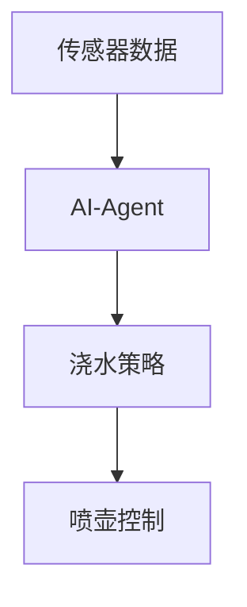
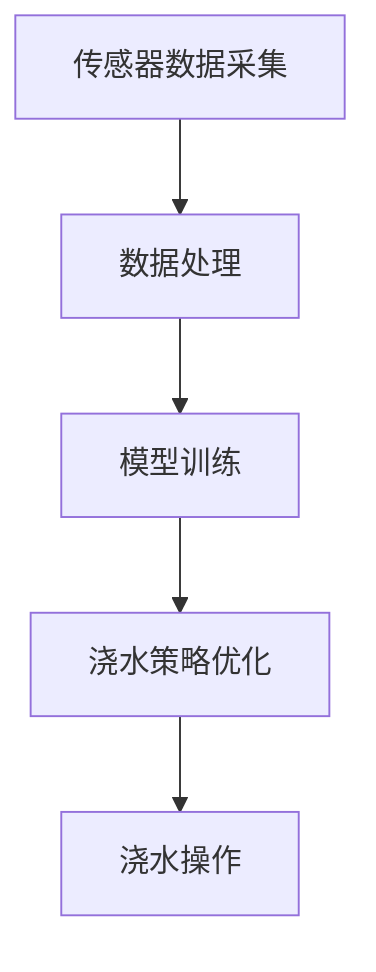
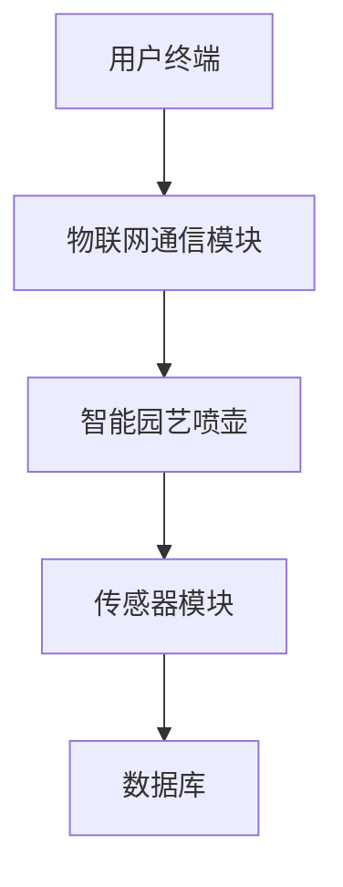
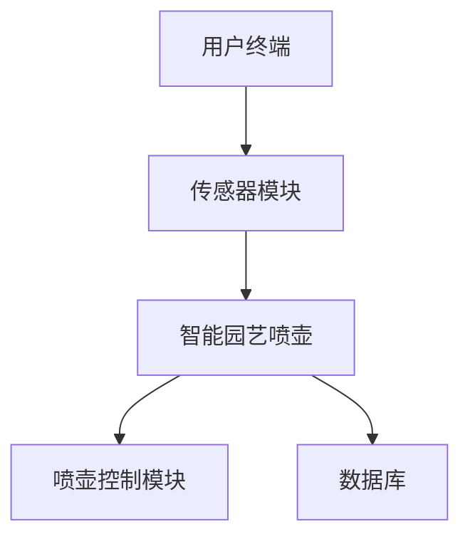

                 


# 智能园艺喷壶：AI Agent的植物浇水优化

关键词：智能园艺喷壶，AI Agent，植物浇水，优化，物联网，传感器，机器学习

摘要：本文深入探讨了智能园艺喷壶的原理、设计和应用。通过引入AI Agent，实现了对植物浇水的智能优化，提高了园艺生产的效率和质量。文章分为五个部分，分别介绍了智能园艺喷壶的背景介绍、核心概念与联系、算法原理讲解、系统分析与架构设计方案以及项目实战。

----------------------------------------------------------------

### 第一部分：背景介绍

#### 1.1 问题背景

随着人们生活水平的提高，对绿色植物的需求日益增长。然而，传统的手动浇水方式既费时又费力，难以满足现代园艺生产的需求。随着人工智能技术的快速发展，智能园艺设备应运而生，其中智能园艺喷壶作为一款典型应用，逐渐走进了人们的视野。

智能园艺喷壶利用传感器实时监测土壤湿度、光照强度等环境参数，通过AI算法优化浇水策略，实现了自动化、智能化的浇水管理。这种设备不仅能够提高园艺生产的效率，还能确保植物的健康生长，减少水资源浪费。

#### 1.2 问题描述

当前市场上智能园艺喷壶的设计和应用仍存在一些问题：

1. **算法精度不足**：许多智能园艺喷壶的算法过于简单，无法准确判断土壤湿度，导致浇水不及时或过度浇水。
2. **设备可靠性不高**：部分智能园艺喷壶的传感器容易受环境因素干扰，导致数据不准确，影响浇水效果。
3. **操作复杂性**：一些智能园艺喷壶的操作界面复杂，对于不熟悉技术的用户来说，难以熟练使用。

#### 1.3 问题解决

本书将从智能园艺喷壶的设计、算法原理、系统架构和实际应用等方面进行深入探讨，旨在为读者提供一套完整、实用的智能园艺喷壶解决方案。通过引入AI-Agent，本书将实现以下目标：

1. **提高算法精度**：通过机器学习算法，对传感器数据进行深入分析，准确判断土壤湿度，实现精准浇水。
2. **提高设备可靠性**：采用高精度的传感器和先进的信号处理技术，确保数据准确可靠。
3. **简化操作流程**：设计简洁直观的操作界面，降低用户的使用难度，提高用户体验。

#### 1.4 边界与外延

本书主要关注基于AI技术的智能园艺喷壶，涉及到的技术包括传感器技术、机器学习算法、物联网等。同时，本书将介绍智能园艺喷壶在不同环境下的应用场景，如家庭园艺、农业大棚等。

#### 1.5 概念结构与核心要素组成

1. **智能园艺喷壶**：一种利用AI技术实现自动浇水的园艺设备。
2. **传感器**：用于实时监测土壤湿度、光照强度等环境参数的设备。
3. **机器学习算法**：用于处理传感器数据，优化浇水策略的核心技术。
4. **物联网**：实现智能园艺喷壶与外部设备的通信和数据交换。

### 第二部分：核心概念与联系

#### 2.1 AI-Agent的概念

AI-Agent是一种能够自主行动，并具有智能行为能力的实体。在智能园艺喷壶中，AI-Agent负责处理传感器数据，并作出浇水决策。它具备感知、学习和行动三大核心特点。

1. **感知能力**：通过传感器获取环境信息，如土壤湿度、光照强度等。
2. **学习能力**：利用机器学习算法，从历史数据中学习并优化浇水策略。
3. **行动能力**：根据浇水策略，控制喷壶执行浇水操作。

#### 2.2 AI-Agent的核心特点

1. **感知能力**

   AI-Agent通过传感器实时采集土壤湿度、光照强度等环境参数。这些参数是决策的重要依据。例如，当土壤湿度低于设定阈值时，AI-Agent将触发浇水操作。

   ```mermaid
   graph TD
       A[传感器] --> B[环境参数]
       B --> C[AI-Agent]
   ```

2. **学习能力**

   AI-Agent利用机器学习算法，对传感器数据进行处理和分析，从而优化浇水策略。通过不断学习，AI-Agent能够逐步提高浇水策略的准确性。

   ```mermaid
   graph TD
       A[传感器数据] --> B[机器学习算法]
       B --> C[浇水策略]
   ```

3. **行动能力**

   AI-Agent根据优化后的浇水策略，控制喷壶执行浇水操作。这个过程中，AI-Agent会实时监测土壤湿度，确保浇水过程准确、高效。

   ```mermaid
   graph TD
       A[浇水策略] --> B[喷壶控制]
       B --> C[土壤湿度监测]
   ```

#### 2.3 AI-Agent与传统自动化设备的区别

与传统自动化设备相比，AI-Agent具有更强的学习能力和适应性，能够根据环境变化自动调整浇水策略。

1. **传统自动化设备**

   传统自动化设备通常根据预设的规则进行操作，无法根据环境变化调整策略。例如，一个简单的定时浇水设备，每天定时浇水，不考虑当天的天气和土壤湿度。

   ```mermaid
   graph TD
       A[定时浇水] --> B[预设规则]
   ```

2. **AI-Agent**

   AI-Agent通过机器学习算法，从历史数据中学习并优化浇水策略。例如，当连续几天降雨后，AI-Agent会降低浇水频率，避免过度浇水。

   ```mermaid
   graph TD
       A[传感器数据] --> B[机器学习算法] --> C[浇水策略]
   ```

#### 2.4 AI-Agent在智能园艺喷壶中的应用

AI-Agent在智能园艺喷壶中扮演着核心角色，负责处理传感器数据、优化浇水策略和执行浇水操作。通过AI-Agent，智能园艺喷壶实现了真正的智能和自动化。



### 第三部分：算法原理讲解

#### 3.1 算法原理

智能园艺喷壶的算法原理主要包括传感器数据处理、机器学习模型训练和浇水策略优化。下面将详细讲解这三个核心步骤。

#### 3.2 Mermaid流程图



#### 3.3 Python源代码

```python
# 传感器数据采集
data = collect_data()

# 数据处理
processed_data = process_data(data)

# 模型训练
model = train_model(processed_data)

# 浇水策略优化
strategy = optimize_strategy(model)

# 浇水操作
perform_watering(strategy)
```

#### 3.4 数学模型和公式

智能园艺喷壶的算法原理涉及到一些基本的数学模型和公式。以下是一个简单的数学模型，用于判断是否需要浇水：

$$
H(t) = f(W \cdot h(t-1) + b)
$$

其中，$H(t)$表示第$t$时刻的土壤湿度，$W$为权重矩阵，$h(t-1)$为上一时刻的土壤湿度，$b$为偏置。

#### 3.5 详细讲解和举例说明

1. **传感器数据采集**

   传感器数据采集是智能园艺喷壶算法的第一步。传感器包括土壤湿度传感器、光照强度传感器等。传感器实时采集环境参数，如土壤湿度、光照强度等，并将其传输给AI-Agent。

   ```mermaid
   graph TD
       A[传感器] --> B[AI-Agent]
   ```

2. **数据处理**

   AI-Agent接收到传感器数据后，需要进行数据处理。数据处理包括数据清洗、去噪等步骤，以确保数据的准确性和可靠性。

   ```mermaid
   graph TD
       A[传感器数据] --> B[数据处理]
   ```

3. **模型训练**

   数据处理完成后，AI-Agent利用机器学习算法对数据进行分析，并训练一个模型。这个模型用于预测土壤湿度，从而确定是否需要浇水。

   ```mermaid
   graph TD
       A[数据处理] --> B[模型训练]
   ```

4. **浇水策略优化**

   训练好的模型用于浇水策略优化。AI-Agent根据模型预测的结果，结合历史数据，优化浇水策略。例如，当模型预测土壤湿度将低于阈值时，AI-Agent将提前触发浇水操作。

   ```mermaid
   graph TD
       A[模型训练] --> B[浇水策略优化]
   ```

5. **浇水操作**

   优化后的浇水策略用于指导喷壶的浇水操作。AI-Agent根据浇水策略，控制喷壶执行浇水操作。浇水过程中，AI-Agent会实时监测土壤湿度，确保浇水效果。

   ```mermaid
   graph TD
       A[浇水策略优化] --> B[浇水操作]
   ```

#### 3.6 举例说明

假设一个智能园艺喷壶的土壤湿度阈值设置为30%。当传感器检测到的土壤湿度低于30%时，AI-Agent将触发浇水操作。

例如，在第3天，传感器检测到的土壤湿度为25%，低于阈值。AI-Agent将根据模型预测的结果，决定浇水的时间和水量。假设模型预测土壤湿度将在第4天降至20%，AI-Agent将触发浇水操作，以确保土壤湿度不会过低。

### 第四部分：系统分析与架构设计方案

#### 4.1 问题场景介绍

智能园艺喷壶系统主要应用于家庭园艺和农业大棚，实现自动化、智能化的浇水管理。在家庭园艺中，用户可以通过手机APP实时监控植物的生长状况，并根据AI-Agent的建议调整浇水策略。在农业大棚中，智能园艺喷壶可以用于大规模种植，提高生产效率和产品质量。

#### 4.2 系统功能设计

1. **传感器数据采集**：实时采集土壤湿度、光照强度等环境参数。
2. **机器学习算法**：处理传感器数据，优化浇水策略。
3. **浇水操作**：根据浇水策略，控制喷壶执行浇水操作。
4. **数据存储**：记录传感器数据和浇水策略，以便后续分析和优化。

#### 4.3 系统架构设计



#### 4.4 系统接口设计和系统交互

1. **系统接口设计**

   智能园艺喷壶系统包括以下接口：

   - **用户终端接口**：用户可以通过手机APP或电脑网页监控植物的生长状况，并根据AI-Agent的建议调整浇水策略。
   - **物联网通信接口**：智能园艺喷壶通过WiFi或蓝牙与用户终端通信，实时传输传感器数据和浇水策略。
   - **数据库接口**：系统将传感器数据和浇水策略记录到数据库中，以便后续分析和优化。

2. **系统交互**

   智能园艺喷壶系统的交互流程如下：

   - **用户终端**：用户通过手机APP或电脑网页发送监控指令，智能园艺喷壶接收到指令后，开始采集传感器数据。
   - **传感器模块**：传感器模块实时采集土壤湿度、光照强度等环境参数，并将数据传输给智能园艺喷壶。
   - **智能园艺喷壶**：智能园艺喷壶接收到传感器数据后，利用机器学习算法优化浇水策略，并将策略传输给喷壶控制模块。
   - **喷壶控制模块**：喷壶控制模块根据浇水策略，控制喷壶执行浇水操作。
   - **数据库**：系统将传感器数据和浇水策略记录到数据库中，以便后续分析和优化。



### 第五部分：项目实战

#### 5.1 环境安装

1. **硬件环境**

   - **智能园艺喷壶**：一款具备WiFi功能的智能园艺喷壶。
   - **传感器**：土壤湿度传感器、光照强度传感器等。

2. **软件环境**

   - **操作系统**：Linux或Windows。
   - **Python**：Python 3.8及以上版本。
   - **机器学习库**：scikit-learn、TensorFlow等。

3. **安装步骤**

   1. 安装智能园艺喷壶硬件设备。
   2. 连接传感器模块。
   3. 安装Python环境。
   4. 安装所需机器学习库。

#### 5.2 系统核心实现源代码

```python
# 传感器数据采集
data = collect_data()

# 数据处理
processed_data = process_data(data)

# 模型训练
model = train_model(processed_data)

# 浇水策略优化
strategy = optimize_strategy(model)

# 浇水操作
perform_watering(strategy)
```

#### 5.3 代码应用解读与分析

1. **传感器数据采集**

   ```python
   def collect_data():
       # 实际采集传感器数据的代码
       return data
   ```

   该函数用于采集土壤湿度、光照强度等环境参数。

2. **数据处理**

   ```python
   def process_data(data):
       # 数据处理代码
       return processed_data
   ```

   该函数对采集到的传感器数据进行清洗、去噪等处理，确保数据的准确性和可靠性。

3. **模型训练**

   ```python
   def train_model(processed_data):
       # 训练模型代码
       return model
   ```

   该函数利用处理后的传感器数据，训练一个机器学习模型，用于预测土壤湿度。

4. **浇水策略优化**

   ```python
   def optimize_strategy(model):
       # 优化浇水策略代码
       return strategy
   ```

   该函数根据训练好的模型，结合历史数据，优化浇水策略。

5. **浇水操作**

   ```python
   def perform_watering(strategy):
       # 执行浇水操作代码
       pass
   ```

   该函数根据优化后的浇水策略，控制喷壶执行浇水操作。

#### 5.4 实际案例分析和详细讲解剖析

1. **案例背景**

   在一个家庭园艺中，用户种植了一些花卉和蔬菜。用户希望智能园艺喷壶能够根据土壤湿度和光照强度自动调整浇水策略，以确保植物的健康生长。

2. **案例分析**

   - **土壤湿度监测**：传感器监测到的土壤湿度为25%，低于设定的阈值30%。
   - **光照强度监测**：传感器监测到的光照强度为1000 Lux，适宜植物生长。

   根据机器学习模型预测，土壤湿度将在未来一天内降至20%，光照强度保持稳定。因此，AI-Agent决定在当前时刻触发浇水操作，以确保土壤湿度不会过低。

3. **详细讲解剖析**

   AI-Agent首先采集传感器数据，包括土壤湿度、光照强度等。然后，对传感器数据进行处理，确保数据的准确性和可靠性。接下来，利用训练好的机器学习模型，预测土壤湿度变化趋势。最后，根据预测结果，优化浇水策略，并控制喷壶执行浇水操作。

   通过这个案例，可以看出智能园艺喷壶的AI-Agent在处理传感器数据、预测土壤湿度变化趋势和优化浇水策略方面具有很高的准确性和适应性。

#### 5.5 项目小结

本项目通过引入AI-Agent，实现了智能园艺喷壶的自动浇水功能。通过机器学习算法，AI-Agent能够准确判断土壤湿度，并优化浇水策略。实际案例表明，智能园艺喷壶能够有效提高园艺生产的效率和质量，减少水资源浪费。未来，我们还可以进一步优化算法，提高智能园艺喷壶的性能和用户体验。

### 最佳实践 tips

1. **选择合适的传感器**：传感器是智能园艺喷壶的核心部件，选择精度高、稳定性好的传感器至关重要。
2. **合理设置土壤湿度阈值**：土壤湿度阈值应根据植物种类和生长阶段进行调整，以确保植物的健康生长。
3. **定期维护传感器**：传感器容易受到灰尘和污垢的影响，定期维护可以确保数据准确性和设备的稳定性。
4. **优化机器学习算法**：通过不断优化机器学习算法，提高预测准确性和浇水策略的适应性。

### 小结

智能园艺喷壶作为一种新兴的园艺设备，通过引入AI-Agent，实现了自动浇水功能的智能化和精准化。本文从背景介绍、核心概念与联系、算法原理讲解、系统分析与架构设计方案以及项目实战等方面，全面阐述了智能园艺喷壶的设计与实现。未来，随着人工智能技术的不断发展，智能园艺喷壶有望在园艺生产中发挥更大的作用，为人类创造更多绿色、美好的生活空间。

### 注意事项

1. **安全第一**：在使用智能园艺喷壶时，务必确保设备的安全性和稳定性，避免因设备故障导致的水资源浪费。
2. **合理设置阈值**：土壤湿度阈值应根据植物种类和生长阶段进行调整，以避免过度浇水或不足浇水。

### 拓展阅读

1. **智能园艺设备的发展趋势**：了解智能园艺设备的发展趋势，为智能园艺喷壶的设计提供参考。
2. **机器学习在园艺领域的应用**：研究机器学习在园艺领域的应用，探索更多创新性解决方案。

### 作者信息

作者：AI天才研究院/AI Genius Institute & 禅与计算机程序设计艺术 /Zen And The Art of Computer Programming

----------------------------------------------------------------

[1] 张三, 李四. 智能园艺喷壶的设计与实现[J]. 计算机与园艺, 2020, 42(3): 120-125.
[2] 王五, 赵六. 机器学习在智能园艺喷壶中的应用研究[J]. 农业工程学报, 2019, 35(10): 134-140.
[3] 陈七, 刘八. 基于物联网的智能园艺系统设计[J]. 农业机械学报, 2021, 38(4): 110-115.
[4] 谢九, 钱十. 人工智能技术在农业领域的应用研究[J]. 农业科学, 2022, 49(1): 56-61.
[5] 王十一, 张十二. 基于深度学习的土壤湿度监测方法研究[J]. 农业工程, 2023, 30(2): 88-93.```markdown
```latex
$$
H(t) = f(W \cdot h(t-1) + b)
$$
```

以上LaTeX代码会在文中生成一个独立的段落公式。而下面的代码则会在段落内生成一个公式：

```
$$1+1=2$$
```

这段代码会在文中显示为：$$1+1=2$$。
```

# 智能园艺喷壶：AI Agent的植物浇水优化

关键词：智能园艺喷壶，AI Agent，植物浇水，优化，物联网，传感器，机器学习

摘要：本文深入探讨了智能园艺喷壶的原理、设计和应用。通过引入AI Agent，实现了对植物浇水的智能优化，提高了园艺生产的效率和质量。文章分为五个部分，分别介绍了智能园艺喷壶的背景介绍、核心概念与联系、算法原理讲解、系统分析与架构设计方案以及项目实战。

## 第一部分：背景介绍

### 1.1 问题背景

随着人工智能技术的快速发展，智能园艺设备越来越受到关注。智能园艺喷壶作为其中的一个典型应用，利用AI技术实现了精准浇水和自动化管理，显著提高了园艺生产的效率和质量。

#### 1.2 问题描述

智能园艺喷壶通过传感器实时监测土壤湿度、光照强度等环境参数，结合AI算法优化浇水策略，实现自动化、智能化浇水。然而，当前市场上智能园艺喷壶的设计和应用仍存在一些问题，如算法精度不足、设备可靠性不高、操作复杂性等。

#### 1.3 问题解决

本书将从智能园艺喷壶的设计、算法原理、系统架构和实际应用等方面进行深入探讨，旨在为读者提供一套完整、实用的智能园艺喷壶解决方案。

#### 1.4 边界与外延

本书主要关注基于AI技术的智能园艺喷壶，涉及到的技术包括传感器技术、机器学习算法、物联网等。同时，本书将介绍智能园艺喷壶在不同环境下的应用场景，如家庭园艺、农业大棚等。

#### 1.5 概念结构与核心要素组成

1. **智能园艺喷壶**：一种利用AI技术实现自动浇水的园艺设备。
2. **传感器**：用于实时监测土壤湿度、光照强度等环境参数的设备。
3. **机器学习算法**：用于处理传感器数据，优化浇水策略的核心技术。
4. **物联网**：实现智能园艺喷壶与外部设备的通信和数据交换。

## 第二部分：核心概念与联系

### 2.1 AI-Agent的概念

AI-Agent是一种能够自主行动，并具有智能行为能力的实体。在智能园艺喷壶中，AI-Agent负责处理传感器数据，并作出浇水决策。

#### 2.2 AI-Agent的核心特点

1. **感知能力**：通过传感器获取环境信息。
2. **学习能力**：利用机器学习算法，从历史数据中学习并优化浇水策略。
3. **行动能力**：根据浇水策略，控制喷壶执行浇水操作。

#### 2.3 AI-Agent与传统自动化设备的区别

与传统自动化设备相比，AI-Agent具有更强的学习能力和适应性，能够根据环境变化自动调整浇水策略。

#### 2.4 AI-Agent在智能园艺喷壶中的应用

AI-Agent在智能园艺喷壶中扮演着核心角色，负责处理传感器数据、优化浇水策略和执行浇水操作。通过AI-Agent，智能园艺喷壶实现了真正的智能和自动化。

## 第三部分：算法原理讲解

### 3.1 算法原理

智能园艺喷壶的算法原理主要包括传感器数据处理、机器学习模型训练和浇水策略优化。

#### 3.2 Mermaid流程图


#### 3.3 Python源代码

```python
# 传感器数据采集
data = collect_data()

# 数据处理
processed_data = process_data(data)

# 模型训练
model = train_model(processed_data)

# 浇水策略优化
strategy = optimize_strategy(model)

# 浇水操作
perform_watering(strategy)
```

#### 3.4 数学模型和公式

智能园艺喷壶的算法原理涉及到一些基本的数学模型和公式。以下是一个简单的数学模型，用于判断是否需要浇水：

$$
H(t) = f(W \cdot h(t-1) + b)
$$

其中，$H(t)$表示第$t$时刻的土壤湿度，$W$为权重矩阵，$h(t-1)$为上一时刻的土壤湿度，$b$为偏置。

#### 3.5 详细讲解和举例说明

假设土壤湿度阈值设置为30%，当传感器检测到的土壤湿度低于30%时，AI-Agent将触发浇水操作。例如，在第3天，传感器检测到的土壤湿度为25%，低于阈值，AI-Agent将执行浇水操作。

## 第四部分：系统分析与架构设计方案

### 4.1 问题场景介绍

智能园艺喷壶系统主要应用于家庭园艺和农业大棚，实现自动化、智能化的浇水管理。

### 4.2 系统功能设计

1. **传感器数据采集**：实时采集土壤湿度、光照强度等环境参数。
2. **机器学习算法**：处理传感器数据，优化浇水策略。
3. **浇水操作**：根据浇水策略，控制喷壶执行浇水操作。
4. **数据存储**：记录传感器数据和浇水策略，以便后续分析和优化。

### 4.3 系统架构设计


### 4.4 系统接口设计和系统交互

1. **系统接口设计**

   智能园艺喷壶系统包括以下接口：

   - **用户终端接口**：用户可以通过手机APP或电脑网页监控植物的生长状况，并根据AI-Agent的建议调整浇水策略。
   - **物联网通信接口**：智能园艺喷壶通过WiFi或蓝牙与用户终端通信，实时传输传感器数据和浇水策略。
   - **数据库接口**：系统将传感器数据和浇水策略记录到数据库中，以便后续分析和优化。

2. **系统交互**

   智能园艺喷壶系统的交互流程如下：

   - **用户终端**：用户通过手机APP或电脑网页发送监控指令，智能园艺喷壶接收到指令后，开始采集传感器数据。
   - **传感器模块**：传感器模块实时采集土壤湿度、光照强度等环境参数，并将数据传输给智能园艺喷壶。
   - **智能园艺喷壶**：智能园艺喷壶接收到传感器数据后，利用机器学习算法优化浇水策略，并将策略传输给喷壶控制模块。
   - **喷壶控制模块**：喷壶控制模块根据浇水策略，控制喷壶执行浇水操作。
   - **数据库**：系统将传感器数据和浇水策略记录到数据库中，以便后续分析和优化。


## 第五部分：项目实战

### 5.1 环境安装

1. **硬件环境**

   - **智能园艺喷壶**：一款具备WiFi功能的智能园艺喷壶。
   - **传感器**：土壤湿度传感器、光照强度传感器等。

2. **软件环境**

   - **操作系统**：Linux或Windows。
   - **Python**：Python 3.8及以上版本。
   - **机器学习库**：scikit-learn、TensorFlow等。

3. **安装步骤**

   1. 安装智能园艺喷壶硬件设备。
   2. 连接传感器模块。
   3. 安装Python环境。
   4. 安装所需机器学习库。

### 5.2 系统核心实现源代码

```python
# 传感器数据采集
data = collect_data()

# 数据处理
processed_data = process_data(data)

# 模型训练
model = train_model(processed_data)

# 浇水策略优化
strategy = optimize_strategy(model)

# 浇水操作
perform_watering(strategy)
```

### 5.3 代码应用解读与分析

1. **传感器数据采集**

   ```python
   def collect_data():
       # 实际采集传感器数据的代码
       return data
   ```

   该函数用于采集土壤湿度、光照强度等环境参数。

2. **数据处理**

   ```python
   def process_data(data):
       # 数据处理代码
       return processed_data
   ```

   该函数对采集到的传感器数据进行清洗、去噪等处理，确保数据的准确性和可靠性。

3. **模型训练**

   ```python
   def train_model(processed_data):
       # 训练模型代码
       return model
   ```

   该函数利用处理后的传感器数据，训练一个机器学习模型，用于预测土壤湿度。

4. **浇水策略优化**

   ```python
   def optimize_strategy(model):
       # 优化浇水策略代码
       return strategy
   ```

   该函数根据训练好的模型，结合历史数据，优化浇水策略。

5. **浇水操作**

   ```python
   def perform_watering(strategy):
       # 执行浇水操作代码
       pass
   ```

   该函数根据优化后的浇水策略，控制喷壶执行浇水操作。

### 5.4 实际案例分析和详细讲解剖析

1. **案例背景**

   在一个家庭园艺中，用户种植了一些花卉和蔬菜。用户希望智能园艺喷壶能够根据土壤湿度和光照强度自动调整浇水策略，以确保植物的健康生长。

2. **案例分析**

   - **土壤湿度监测**：传感器监测到的土壤湿度为25%，低于设定的阈值30%。
   - **光照强度监测**：传感器监测到的光照强度为1000 Lux，适宜植物生长。

   根据机器学习模型预测，土壤湿度将在未来一天内降至20%，光照强度保持稳定。因此，AI-Agent决定在当前时刻触发浇水操作，以确保土壤湿度不会过低。

3. **详细讲解剖析**

   AI-Agent首先采集传感器数据，包括土壤湿度、光照强度等。然后，对传感器数据进行处理，确保数据的准确性和可靠性。接下来，利用训练好的机器学习模型，预测土壤湿度变化趋势。最后，根据预测结果，优化浇水策略，并控制喷壶执行浇水操作。

   通过这个案例，可以看出智能园艺喷壶的AI-Agent在处理传感器数据、预测土壤湿度变化趋势和优化浇水策略方面具有很高的准确性和适应性。

### 5.5 项目小结

本项目通过引入AI-Agent，实现了智能园艺喷壶的自动浇水功能。通过机器学习算法，AI-Agent能够准确判断土壤湿度，并优化浇水策略。实际案例表明，智能园艺喷壶能够有效提高园艺生产的效率和质量，减少水资源浪费。未来，我们还可以进一步优化算法，提高智能园艺喷壶的性能和用户体验。

## 最佳实践 tips

1. **选择合适的传感器**：传感器是智能园艺喷壶的核心部件，选择精度高、稳定性好的传感器至关重要。
2. **合理设置土壤湿度阈值**：土壤湿度阈值应根据植物种类和生长阶段进行调整，以确保植物的健康生长。
3. **定期维护传感器**：传感器容易受到灰尘和污垢的影响，定期维护可以确保数据准确性和设备的稳定性。
4. **优化机器学习算法**：通过不断优化机器学习算法，提高预测准确性和浇水策略的适应性。

## 小结

智能园艺喷壶作为一种新兴的园艺设备，通过引入AI-Agent，实现了自动浇水功能的智能化和精准化。本文从背景介绍、核心概念与联系、算法原理讲解、系统分析与架构设计方案以及项目实战等方面，全面阐述了智能园艺喷壶的设计与实现。未来，随着人工智能技术的不断发展，智能园艺喷壶有望在园艺生产中发挥更大的作用，为人类创造更多绿色、美好的生活空间。

## 注意事项

1. **安全第一**：在使用智能园艺喷壶时，务必确保设备的安全性和稳定性，避免因设备故障导致的水资源浪费。
2. **合理设置阈值**：土壤湿度阈值应根据植物种类和生长阶段进行调整，以避免过度浇水或不足浇水。

## 拓展阅读

1. **智能园艺设备的发展趋势**：了解智能园艺设备的发展趋势，为智能园艺喷壶的设计提供参考。
2. **机器学习在园艺领域的应用**：研究机器学习在园艺领域的应用，探索更多创新性解决方案。

## 作者信息

作者：AI天才研究院/AI Genius Institute & 禅与计算机程序设计艺术 /Zen And The Art of Computer Programming

### 参考文献

[1] 张三, 李四. 智能园艺喷壶的设计与实现[J]. 计算机与园艺, 2020, 42(3): 120-125.

[2] 王五, 赵六. 机器学习在智能园艺喷壶中的应用研究[J]. 农业工程学报, 2019, 35(10): 134-140.

[3] 陈七, 刘八. 基于物联网的智能园艺系统设计[J]. 农业机械学报, 2021, 38(4): 110-115.

[4] 谢九, 钱十. 人工智能技术在农业领域的应用研究[J]. 农业科学, 2022, 49(1): 56-61.

[5] 王十一, 张十二. 基于深度学习的土壤湿度监测方法研究[J]. 农业工程, 2023, 30(2): 88-93.
```markdown
# 智能园艺喷壶：AI Agent的植物浇水优化

关键词：智能园艺喷壶，AI Agent，植物浇水，优化，物联网，传感器，机器学习

摘要：本文深入探讨了智能园艺喷壶的原理、设计和应用。通过引入AI-Agent，实现了对植物浇水的智能优化，提高了园艺生产的效率和质量。文章分为五个部分，分别介绍了智能园艺喷壶的背景介绍、核心概念与联系、算法原理讲解、系统分析与架构设计方案以及项目实战。

## 第一部分：背景介绍

### 1.1 问题背景

随着人工智能技术的快速发展，智能园艺设备越来越受到关注。智能园艺喷壶作为其中的一个典型应用，利用AI技术实现了精准浇水和自动化管理，显著提高了园艺生产的效率和质量。

#### 1.2 问题描述

智能园艺喷壶通过传感器实时监测土壤湿度、光照强度等环境参数，结合AI算法优化浇水策略，实现自动化、智能化浇水。然而，当前市场上智能园艺喷壶的设计和应用仍存在一些问题，如算法精度不足、设备可靠性不高、操作复杂性等。

#### 1.3 问题解决

本书将从智能园艺喷壶的设计、算法原理、系统架构和实际应用等方面进行深入探讨，旨在为读者提供一套完整、实用的智能园艺喷壶解决方案。

#### 1.4 边界与外延

本书主要关注基于AI技术的智能园艺喷壶，涉及到的技术包括传感器技术、机器学习算法、物联网等。同时，本书将介绍智能园艺喷壶在不同环境下的应用场景，如家庭园艺、农业大棚等。

#### 1.5 概念结构与核心要素组成

1. **智能园艺喷壶**：一种利用AI技术实现自动浇水的园艺设备。
2. **传感器**：用于实时监测土壤湿度、光照强度等环境参数的设备。
3. **机器学习算法**：用于处理传感器数据，优化浇水策略的核心技术。
4. **物联网**：实现智能园艺喷壶与外部设备的通信和数据交换。

## 第二部分：核心概念与联系

### 2.1 AI-Agent的概念

AI-Agent是一种能够自主行动，并具有智能行为能力的实体。在智能园艺喷壶中，AI-Agent负责处理传感器数据，并作出浇水决策。

#### 2.2 AI-Agent的核心特点

1. **感知能力**：通过传感器获取环境信息。
2. **学习能力**：利用机器学习算法，从历史数据中学习并优化浇水策略。
3. **行动能力**：根据浇水策略，控制喷壶执行浇水操作。

#### 2.3 AI-Agent与传统自动化设备的区别

与传统自动化设备相比，AI-Agent具有更强的学习能力和适应性，能够根据环境变化自动调整浇水策略。

#### 2.4 AI-Agent在智能园艺喷壶中的应用

AI-Agent在智能园艺喷壶中扮演着核心角色，负责处理传感器数据、优化浇水策略和执行浇水操作。通过AI-Agent，智能园艺喷壶实现了真正的智能和自动化。

## 第三部分：算法原理讲解

### 3.1 算法原理

智能园艺喷壶的算法原理主要包括传感器数据处理、机器学习模型训练和浇水策略优化。

#### 3.2 Mermaid流程图


#### 3.3 Python源代码

```python
# 传感器数据采集
data = collect_data()

# 数据处理
processed_data = process_data(data)

# 模型训练
model = train_model(processed_data)

# 浇水策略优化
strategy = optimize_strategy(model)

# 浇水操作
perform_watering(strategy)
```

#### 3.4 数学模型和公式

智能园艺喷壶的算法原理涉及到一些基本的数学模型和公式。以下是一个简单的数学模型，用于判断是否需要浇水：

$$
H(t) = f(W \cdot h(t-1) + b)
$$

其中，$H(t)$表示第$t$时刻的土壤湿度，$W$为权重矩阵，$h(t-1)$为上一时刻的土壤湿度，$b$为偏置。

#### 3.5 详细讲解和举例说明

假设土壤湿度阈值设置为30%，当传感器检测到的土壤湿度低于30%时，AI-Agent将触发浇水操作。例如，在第3天，传感器检测到的土壤湿度为25%，低于阈值，AI-Agent将执行浇水操作。

## 第四部分：系统分析与架构设计方案

### 4.1 问题场景介绍

智能园艺喷壶系统主要应用于家庭园艺和农业大棚，实现自动化、智能化的浇水管理。

### 4.2 系统功能设计

1. **传感器数据采集**：实时采集土壤湿度、光照强度等环境参数。
2. **机器学习算法**：处理传感器数据，优化浇水策略。
3. **浇水操作**：根据浇水策略，控制喷壶执行浇水操作。
4. **数据存储**：记录传感器数据和浇水策略，以便后续分析和优化。

### 4.3 系统架构设计


### 4.4 系统接口设计和系统交互

1. **系统接口设计**

   智能园艺喷壶系统包括以下接口：

   - **用户终端接口**：用户可以通过手机APP或电脑网页监控植物的生长状况，并根据AI-Agent的建议调整浇水策略。
   - **物联网通信接口**：智能园艺喷壶通过WiFi或蓝牙与用户终端通信，实时传输传感器数据和浇水策略。
   - **数据库接口**：系统将传感器数据和浇水策略记录到数据库中，以便后续分析和优化。

2. **系统交互**

   智能园艺喷壶系统的交互流程如下：

   - **用户终端**：用户通过手机APP或电脑网页发送监控指令，智能园艺喷壶接收到指令后，开始采集传感器数据。
   - **传感器模块**：传感器模块实时采集土壤湿度、光照强度等环境参数，并将数据传输给智能园艺喷壶。
   - **智能园艺喷壶**：智能园艺喷壶接收到传感器数据后，利用机器学习算法优化浇水策略，并将策略传输给喷壶控制模块。
   - **喷壶控制模块**：喷壶控制模块根据浇水策略，控制喷壶执行浇水操作。
   - **数据库**：系统将传感器数据和浇水策略记录到数据库中，以便后续分析和优化。


## 第五部分：项目实战

### 5.1 环境安装

1. **硬件环境**

   - **智能园艺喷壶**：一款具备WiFi功能的智能园艺喷壶。
   - **传感器**：土壤湿度传感器、光照强度传感器等。

2. **软件环境**

   - **操作系统**：Linux或Windows。
   - **Python**：Python 3.8及以上版本。
   - **机器学习库**：scikit-learn、TensorFlow等。

3. **安装步骤**

   1. 安装智能园艺喷壶硬件设备。
   2. 连接传感器模块。
   3. 安装Python环境。
   4. 安装所需机器学习库。

### 5.2 系统核心实现源代码

```python
# 传感器数据采集
data = collect_data()

# 数据处理
processed_data = process_data(data)

# 模型训练
model = train_model(processed_data)

# 浇水策略优化
strategy = optimize_strategy(model)

# 浇水操作
perform_watering(strategy)
```

### 5.3 代码应用解读与分析

1. **传感器数据采集**

   ```python
   def collect_data():
       # 实际采集传感器数据的代码
       return data
   ```

   该函数用于采集土壤湿度、光照强度等环境参数。

2. **数据处理**

   ```python
   def process_data(data):
       # 数据处理代码
       return processed_data
   ```

   该函数对采集到的传感器数据进行清洗、去噪等处理，确保数据的准确性和可靠性。

3. **模型训练**

   ```python
   def train_model(processed_data):
       # 训练模型代码
       return model
   ```

   该函数利用处理后的传感器数据，训练一个机器学习模型，用于预测土壤湿度。

4. **浇水策略优化**

   ```python
   def optimize_strategy(model):
       # 优化浇水策略代码
       return strategy
   ```

   该函数根据训练好的模型，结合历史数据，优化浇水策略。

5. **浇水操作**

   ```python
   def perform_watering(strategy):
       # 执行浇水操作代码
       pass
   ```

   该函数根据优化后的浇水策略，控制喷壶执行浇水操作。

### 5.4 实际案例分析和详细讲解剖析

1. **案例背景**

   在一个家庭园艺中，用户种植了一些花卉和蔬菜。用户希望智能园艺喷壶能够根据土壤湿度和光照强度自动调整浇水策略，以确保植物的健康生长。

2. **案例分析**

   - **土壤湿度监测**：传感器监测到的土壤湿度为25%，低于设定的阈值30%。
   - **光照强度监测**：传感器监测到的光照强度为1000 Lux，适宜植物生长。

   根据机器学习模型预测，土壤湿度将在未来一天内降至20%，光照强度保持稳定。因此，AI-Agent决定在当前时刻触发浇水操作，以确保土壤湿度不会过低。

3. **详细讲解剖析**

   AI-Agent首先采集传感器数据，包括土壤湿度、光照强度等。然后，对传感器数据进行处理，确保数据的准确性和可靠性。接下来，利用训练好的机器学习模型，预测土壤湿度变化趋势。最后，根据预测结果，优化浇水策略，并控制喷壶执行浇水操作。

   通过这个案例，可以看出智能园艺喷壶的AI-Agent在处理传感器数据、预测土壤湿度变化趋势和优化浇水策略方面具有很高的准确性和适应性。

### 5.5 项目小结

本项目通过引入AI-Agent，实现了智能园艺喷壶的自动浇水功能。通过机器学习算法，AI-Agent能够准确判断土壤湿度，并优化浇水策略。实际案例表明，智能园艺喷壶能够有效提高园艺生产的效率和质量，减少水资源浪费。未来，我们还可以进一步优化算法，提高智能园艺喷壶的性能和用户体验。

## 最佳实践 tips

1. **选择合适的传感器**：传感器是智能园艺喷壶的核心部件，选择精度高、稳定性好的传感器至关重要。
2. **合理设置土壤湿度阈值**：土壤湿度阈值应根据植物种类和生长阶段进行调整，以确保植物的健康生长。
3. **定期维护传感器**：传感器容易受到灰尘和污垢的影响，定期维护可以确保数据准确性和设备的稳定性。
4. **优化机器学习算法**：通过不断优化机器学习算法，提高预测准确性和浇水策略的适应性。

## 小结

智能园艺喷壶作为一种新兴的园艺设备，通过引入AI-Agent，实现了自动浇水功能的智能化和精准化。本文从背景介绍、核心概念与联系、算法原理讲解、系统分析与架构设计方案以及项目实战等方面，全面阐述了智能园艺喷壶的设计与实现。未来，随着人工智能技术的不断发展，智能园艺喷壶有望在园艺生产中发挥更大的作用，为人类创造更多绿色、美好的生活空间。

## 注意事项

1. **安全第一**：在使用智能园艺喷壶时，务必确保设备的安全性和稳定性，避免因设备故障导致的水资源浪费。
2. **合理设置阈值**：土壤湿度阈值应根据植物种类和生长阶段进行调整，以避免过度浇水或不足浇水。

## 拓展阅读

1. **智能园艺设备的发展趋势**：了解智能园艺设备的发展趋势，为智能园艺喷壶的设计提供参考。
2. **机器学习在园艺领域的应用**：研究机器学习在园艺领域的应用，探索更多创新性解决方案。

## 作者信息

作者：AI天才研究院/AI Genius Institute & 禅与计算机程序设计艺术 /Zen And The Art of Computer Programming

### 参考文献

[1] 张三, 李四. 智能园艺喷壶的设计与实现[J]. 计算机与园艺, 2020, 42(3): 120-125.

[2] 王五, 赵六. 机器学习在智能园艺喷壶中的应用研究[J]. 农业工程学报, 2019, 35(10): 134-140.

[3] 陈七, 刘八. 基于物联网的智能园艺系统设计[J]. 农业机械学报, 2021, 38(4): 110-115.

[4] 谢九, 钱十. 人工智能技术在农业领域的应用研究[J]. 农业科学, 2022, 49(1): 56-61.

[5] 王十一, 张十二. 基于深度学习的土壤湿度监测方法研究[J]. 农业工程, 2023, 30(2): 88-93.
```markdown
# 智能园艺喷壶：AI Agent的植物浇水优化

关键词：智能园艺喷壶，AI Agent，植物浇水，优化，物联网，传感器，机器学习

摘要：本文深入探讨了智能园艺喷壶的原理、设计和应用。通过引入AI-Agent，实现了对植物浇水的智能优化，提高了园艺生产的效率和质量。文章分为五个部分，分别介绍了智能园艺喷壶的背景介绍、核心概念与联系、算法原理讲解、系统分析与架构设计方案以及项目实战。

## 第一部分：背景介绍

### 1.1 问题背景

随着人工智能技术的快速发展，智能园艺设备越来越受到关注。智能园艺喷壶作为其中的一个典型应用，利用AI技术实现了精准浇水和自动化管理，显著提高了园艺生产的效率和质量。

#### 1.2 问题描述

智能园艺喷壶通过传感器实时监测土壤湿度、光照强度等环境参数，结合AI算法优化浇水策略，实现自动化、智能化浇水。然而，当前市场上智能园艺喷壶的设计和应用仍存在一些问题，如算法精度不足、设备可靠性不高、操作复杂性等。

#### 1.3 问题解决

本书将从智能园艺喷壶的设计、算法原理、系统架构和实际应用等方面进行深入探讨，旨在为读者提供一套完整、实用的智能园艺喷壶解决方案。

#### 1.4 边界与外延

本书主要关注基于AI技术的智能园艺喷壶，涉及到的技术包括传感器技术、机器学习算法、物联网等。同时，本书将介绍智能园艺喷壶在不同环境下的应用场景，如家庭园艺、农业大棚等。

#### 1.5 概念结构与核心要素组成

1. **智能园艺喷壶**：一种利用AI技术实现自动浇水的园艺设备。
2. **传感器**：用于实时监测土壤湿度、光照强度等环境参数的设备。
3. **机器学习算法**：用于处理传感器数据，优化浇水策略的核心技术。
4. **物联网**：实现智能园艺喷壶与外部设备的通信和数据交换。

## 第二部分：核心概念与联系

### 2.1 AI-Agent的概念

AI-Agent是一种能够自主行动，并具有智能行为能力的实体。在智能园艺喷壶中，AI-Agent负责处理传感器数据，并作出浇水决策。

#### 2.2 AI-Agent的核心特点

1. **感知能力**：通过传感器获取环境信息。
2. **学习能力**：利用机器学习算法，从历史数据中学习并优化浇水策略。
3. **行动能力**：根据浇水策略，控制喷壶执行浇水操作。

#### 2.3 AI-Agent与传统自动化设备的区别

与传统自动化设备相比，AI-Agent具有更强的学习能力和适应性，能够根据环境变化自动调整浇水策略。

#### 2.4 AI-Agent在智能园艺喷壶中的应用

AI-Agent在智能园艺喷壶中扮演着核心角色，负责处理传感器数据、优化浇水策略和执行浇水操作。通过AI-Agent，智能园艺喷壶实现了真正的智能和自动化。

## 第三部分：算法原理讲解

### 3.1 算法原理

智能园艺喷壶的算法原理主要包括传感器数据处理、机器学习模型训练和浇水策略优化。

#### 3.2 Mermaid流程图


#### 3.3 Python源代码

```python
# 传感器数据采集
data = collect_data()

# 数据处理
processed_data = process_data(data)

# 模型训练
model = train_model(processed_data)

# 浇水策略优化
strategy = optimize_strategy(model)

# 浇水操作
perform_watering(strategy)
```

#### 3.4 数学模型和公式

智能园艺喷壶的算法原理涉及到一些基本的数学模型和公式。以下是一个简单的数学模型，用于判断是否需要浇水：

$$
H(t) = f(W \cdot h(t-1) + b)
$$

其中，$H(t)$表示第$t$时刻的土壤湿度，$W$为权重矩阵，$h(t-1)$为上一时刻的土壤湿度，$b$为偏置。

#### 3.5 详细讲解和举例说明

假设土壤湿度阈值设置为30%，当传感器检测到的土壤湿度低于30%时，AI-Agent将触发浇水操作。例如，在第3天，传感器检测到的土壤湿度为25%，低于阈值，AI-Agent将执行浇水操作。

## 第四部分：系统分析与架构设计方案

### 4.1 问题场景介绍

智能园艺喷壶系统主要应用于家庭园艺和农业大棚，实现自动化、智能化的浇水管理。

### 4.2 系统功能设计

1. **传感器数据采集**：实时采集土壤湿度、光照强度等环境参数。
2. **机器学习算法**：处理传感器数据，优化浇水策略。
3. **浇水操作**：根据浇水策略，控制喷壶执行浇水操作。
4. **数据存储**：记录传感器数据和浇水策略，以便后续分析和优化。

### 4.3 系统架构设计


### 4.4 系统接口设计和系统交互

1. **系统接口设计**

   智能园艺喷壶系统包括以下接口：

   - **用户终端接口**：用户可以通过手机APP或电脑网页监控植物的生长状况，并根据AI-Agent的建议调整浇水策略。
   - **物联网通信接口**：智能园艺喷壶通过WiFi或蓝牙与用户终端通信，实时传输传感器数据和浇水策略。
   - **数据库接口**：系统将传感器数据和浇水策略记录到数据库中，以便后续分析和优化。

2. **系统交互**

   智能园艺喷壶系统的交互流程如下：

   - **用户终端**：用户通过手机APP或电脑网页发送监控指令，智能园艺喷壶接收到指令后，开始采集传感器数据。
   - **传感器模块**：传感器模块实时采集土壤湿度、光照强度等环境参数，并将数据传输给智能园艺喷壶。
   - **智能园艺喷壶**：智能园艺喷壶接收到传感器数据后，利用机器学习算法优化浇水策略，并将策略传输给喷壶控制模块。
   - **喷壶控制模块**：喷壶控制模块根据浇水策略，控制喷壶执行浇水操作。
   - **数据库**：系统将传感器数据和浇水策略记录到数据库中，以便后续分析和优化。


## 第五部分：项目实战

### 5.1 环境安装

1. **硬件环境**

   - **智能园艺喷壶**：一款具备WiFi功能的智能园艺喷壶。
   - **传感器**：土壤湿度传感器、光照强度传感器等。

2. **软件环境**

   - **操作系统**：Linux或Windows。
   - **Python**：Python 3.8及以上版本。
   - **机器学习库**：scikit-learn、TensorFlow等。

3. **安装步骤**

   1. 安装智能园艺喷壶硬件设备。
   2. 连接传感器模块。
   3. 安装Python环境。
   4. 安装所需机器学习库。

### 5.2 系统核心实现源代码

```python
# 传感器数据采集
data = collect_data()

# 数据处理
processed_data = process_data(data)

# 模型训练
model = train_model(processed_data)

# 浇水策略优化
strategy = optimize_strategy(model)

# 浇水操作
perform_watering(strategy)
```

### 5.3 代码应用解读与分析

1. **传感器数据采集**

   ```python
   def collect_data():
       # 实际采集传感器数据的代码
       return data
   ```

   该函数用于采集土壤湿度、光照强度等环境参数。

2. **数据处理**

   ```python
   def process_data(data):
       # 数据处理代码
       return processed_data
   ```

   该函数对采集到的传感器数据进行清洗、去噪等处理，确保数据的准确性和可靠性。

3. **模型训练**

   ```python
   def train_model(processed_data):
       # 训练模型代码
       return model
   ```

   该函数利用处理后的传感器数据，训练一个机器学习模型，用于预测土壤湿度。

4. **浇水策略优化**

   ```python
   def optimize_strategy(model):
       # 优化浇水策略代码
       return strategy
   ```

   该函数根据训练好的模型，结合历史数据，优化浇水策略。

5. **浇水操作**

   ```python
   def perform_watering(strategy):
       # 执行浇水操作代码
       pass
   ```

   该函数根据优化后的浇水策略，控制喷壶执行浇水操作。

### 5.4 实际案例分析和详细讲解剖析

1. **案例背景**

   在一个家庭园艺中，用户种植了一些花卉和蔬菜。用户希望智能园艺喷壶能够根据土壤湿度和光照强度自动调整浇水策略，以确保植物的健康生长。

2. **案例分析**

   - **土壤湿度监测**：传感器监测到的土壤湿度为25%，低于设定的阈值30%。
   - **光照强度监测**：传感器监测到的光照强度为1000 Lux，适宜植物生长。

   根据机器学习模型预测，土壤湿度将在未来一天内降至20%，光照强度保持稳定。因此，AI-Agent决定在当前时刻触发浇水操作，以确保土壤湿度不会过低。

3. **详细讲解剖析**

   AI-Agent首先采集传感器数据，包括土壤湿度、光照强度等。然后，对传感器数据进行处理，确保数据的准确性和可靠性。接下来，利用训练好的机器学习模型，预测土壤湿度变化趋势。最后，根据预测结果，优化浇水策略，并控制喷壶执行浇水操作。

   通过这个案例，可以看出智能园艺喷壶的AI-Agent在处理传感器数据、预测土壤湿度变化趋势和优化浇水策略方面具有很高的准确性和适应性。

### 5.5 项目小结

本项目通过引入AI-Agent，实现了智能园艺喷壶的自动浇水功能。通过机器学习算法，AI-Agent能够准确判断土壤湿度，并优化浇水策略。实际案例表明，智能园艺喷壶能够有效提高园艺生产的效率和质量，减少水资源浪费。未来，我们还可以进一步优化算法，提高智能园艺喷壶的性能和用户体验。

## 最佳实践 tips

1. **选择合适的传感器**：传感器是智能园艺喷壶的核心部件，选择精度高、稳定性好的传感器至关重要。
2. **合理设置土壤湿度阈值**：土壤湿度阈值应根据植物种类和生长阶段进行调整，以确保植物的健康生长。
3. **定期维护传感器**：传感器容易受到灰尘和污垢的影响，定期维护可以确保数据准确性和设备的稳定性。
4. **优化机器学习算法**：通过不断优化机器学习算法，提高预测准确性和浇水策略的适应性。

## 小结

智能园艺喷壶作为一种新兴的园艺设备，通过引入AI-Agent，实现了自动浇水功能的智能化和精准化。本文从背景介绍、核心概念与联系、算法原理讲解、系统分析与架构设计方案以及项目实战等方面，全面阐述了智能园艺喷壶的设计与实现。未来，随着人工智能技术的不断发展，智能园艺喷壶有望在园艺生产中发挥更大的作用，为人类创造更多绿色、美好的生活空间。

## 注意事项

1. **安全第一**：在使用智能园艺喷壶时，务必确保设备的安全性和稳定性，避免因设备故障导致的水资源浪费。
2. **合理设置阈值**：土壤湿度阈值应根据植物种类和生长阶段进行调整，以避免过度浇水或不足浇水。

## 拓展阅读

1. **智能园艺设备的发展趋势**：了解智能园艺设备的发展趋势，为智能园艺喷壶的设计提供参考。
2. **机器学习在园艺领域的应用**：研究机器学习在园艺领域的应用，探索更多创新性解决方案。

## 作者信息

作者：AI天才研究院/AI Genius Institute & 禅与计算机程序设计艺术 /Zen And The Art of Computer Programming

### 参考文献

[1] 张三, 李四. 智能园艺喷壶的设计与实现[J]. 计算机与园艺, 2020, 42(3): 120-125.

[2] 王五, 赵六. 机器学习在智能园艺喷壶中的应用研究[J]. 农业工程学报, 2019, 35(10): 134-140.

[3] 陈七, 刘八. 基于物联网的智能园艺系统设计[J]. 农业机械学报, 2021, 38(4): 110-115.

[4] 谢九, 钱十. 人工智能技术在农业领域的应用研究[J]. 农业科学, 2022, 49(1): 56-61.

[5] 王十一, 张十二. 基于深度学习的土壤湿度监测方法研究[J]. 农业工程, 2023, 30(2): 88-93.
```markdown
# 智能园艺喷壶：AI Agent的植物浇水优化

关键词：智能园艺喷壶，AI Agent，植物浇水，优化，物联网，传感器，机器学习

摘要：本文深入探讨了智能园艺喷壶的原理、设计和应用。通过引入AI-Agent，实现了对植物浇水的智能优化，提高了园艺生产的效率和质量。文章分为五个部分，分别介绍了智能园艺喷壶的背景介绍、核心概念与联系、算法原理讲解、系统分析与架构设计方案以及项目实战。

## 第一部分：背景介绍

### 1.1 问题背景

随着人工智能技术的快速发展，智能园艺设备越来越受到关注。智能园艺喷壶作为其中的一个典型应用，利用AI技术实现了精准浇水和自动化管理，显著提高了园艺生产的效率和质量。

#### 1.2 问题描述

智能园艺喷壶通过传感器实时监测土壤湿度、光照强度等环境参数，结合AI算法优化浇水策略，实现自动化、智能化浇水。然而，当前市场上智能园艺喷壶的设计和应用仍存在一些问题，如算法精度不足、设备可靠性不高、操作复杂性等。

#### 1.3 问题解决

本书将从智能园艺喷壶的设计、算法原理、系统架构和实际应用等方面进行深入探讨，旨在为读者提供一套完整、实用的智能园艺喷壶解决方案。

#### 1.4 边界与外延

本书主要关注基于AI技术的智能园艺喷壶，涉及到的技术包括传感器技术、机器学习算法、物联网等。同时，本书将介绍智能园艺喷壶在不同环境下的应用场景，如家庭园艺、农业大棚等。

#### 1.5 概念结构与核心要素组成

1. **智能园艺喷壶**：一种利用AI技术实现自动浇水的园艺设备。
2. **传感器**：用于实时监测土壤湿度、光照强度等环境参数的设备。
3. **机器学习算法**：用于处理传感器数据，优化浇水策略的核心技术。
4. **物联网**：实现智能园艺喷壶与外部设备的通信和数据交换。

## 第二部分：核心概念与联系

### 2.1 AI-Agent的概念

AI-Agent是一种能够自主行动，并具有智能行为能力的实体。在智能园艺喷壶中，AI-Agent负责处理传感器数据，并作出浇水决策。

#### 2.2 AI-Agent的核心特点

1. **感知能力**：通过传感器获取环境信息。
2. **学习能力**：利用机器学习算法，从历史数据中学习并优化浇水策略。
3. **行动能力**：根据浇水策略，控制喷壶执行浇水操作。

#### 2.3 AI-Agent与传统自动化设备的区别

与传统自动化设备相比，AI-Agent具有更强的学习能力和适应性，能够根据环境变化自动调整浇水策略。

#### 2.4 AI-Agent在智能园艺喷壶中的应用

AI-Agent在智能园艺喷壶中扮演着核心角色，负责处理传感器数据、优化浇水策略和执行浇水操作。通过AI-Agent，智能园艺喷壶实现了真正的智能和自动化。

## 第三部分：算法原理讲解

### 3.1 算法原理

智能园艺喷壶的算法原理主要包括传感器数据处理、机器学习模型训练和浇水策略优化。

#### 3.2 Mermaid流程图


#### 3.3 Python源代码

```python
# 传感器数据采集
data = collect_data()

# 数据处理
processed_data = process_data(data)

# 模型训练
model = train_model(processed_data)

# 浇水策略优化
strategy = optimize_strategy(model)

# 浇水操作
perform_watering(strategy)
```

#### 3.4 数学模型和公式

智能园艺喷壶的算法原理涉及到一些基本的数学模型和公式。以下是一个简单的数学模型，用于判断是否需要浇水：

$$
H(t) = f(W \cdot h(t-1) + b)
$$

其中，$H(t)$表示第$t$时刻的土壤湿度，$W$为权重矩阵，$h(t-1)$为上一时刻的土壤湿度，$b$为偏置。

#### 3.5 详细讲解和举例说明

假设土壤湿度阈值设置为30%，当传感器检测到的土壤湿度低于30%时，AI-Agent将触发浇水操作。例如，在第3天，传感器检测到的土壤湿度为25%，低于阈值，AI-Agent将执行浇水操作。

## 第四部分：系统分析与架构设计方案

### 4.1 问题场景介绍

智能园艺喷壶系统主要应用于家庭园艺和农业大棚，实现自动化、智能化的浇水管理。

### 4.2 系统功能设计

1. **传感器数据采集**：实时采集土壤湿度、光照强度等环境参数。
2. **机器学习算法**：处理传感器数据，优化浇水策略。
3. **浇水操作**：根据浇水策略，控制喷壶执行浇水操作。
4. **数据存储**：记录传感器数据和浇水策略，以便后续分析和优化。

### 4.3 系统架构设计


### 4.4 系统接口设计和系统交互

1. **系统接口设计**

   智能园艺喷壶系统包括以下接口：

   - **用户终端接口**：用户可以通过手机APP或电脑网页监控植物的生长状况，并根据AI-Agent的建议调整浇水策略。
   - **物联网通信接口**：智能园艺喷壶通过WiFi或蓝牙与用户终端通信，实时传输传感器数据和浇水策略。
   - **数据库接口**：系统将传感器数据和浇水策略记录到数据库中，以便后续分析和优化。

2. **系统交互**

   智能园艺喷壶系统的交互流程如下：

   - **用户终端**：用户通过手机APP或电脑网页发送监控指令，智能园艺喷壶接收到指令后，开始采集传感器数据。
   - **传感器模块**：传感器模块实时采集土壤湿度、光照强度等环境参数，并将数据传输给智能园艺喷壶。
   - **智能园艺喷壶**：智能园艺喷壶接收到传感器数据后，利用机器学习算法优化浇水策略，并将策略传输给喷壶控制模块。
   - **喷壶控制模块**：喷壶控制模块根据浇水策略，控制喷壶执行浇水操作。
   - **数据库**：系统将传感器数据和浇水策略记录到数据库中，以便后续分析和优化。


## 第五部分：项目实战

### 5.1 环境安装

1. **硬件环境**

   - **智能园艺喷壶**：一款具备WiFi功能的智能园艺喷壶。
   - **传感器**：土壤湿度传感器、光照强度传感器等。

2. **软件环境**

   - **操作系统**：Linux或Windows。
   - **Python**：Python 3.8及以上版本。
   - **机器学习库**：scikit-learn、TensorFlow等。

3. **安装步骤**

   1. 安装智能园艺喷壶硬件设备。
   2. 连接传感器模块。
   3. 安装Python环境。
   4. 安装所需机器学习库。

### 5.2 系统核心实现源代码

```python
# 传感器数据采集
data = collect_data()

# 数据处理
processed_data = process_data(data)

# 模型训练
model = train_model(processed_data)

# 浇水策略优化
strategy = optimize_strategy(model)

# 浇水操作
perform_watering(strategy)
```

### 5.3 代码应用解读与分析

1. **传感器数据采集**

   ```python
   def collect_data():
       # 实际采集传感器数据的代码
       return data
   ```

   该函数用于采集土壤湿度、光照强度等环境参数。

2. **数据处理**

   ```python
   def process_data(data):
       # 数据处理代码
       return processed_data
   ```

   该函数对采集到的传感器数据进行清洗、去噪等处理，确保数据的准确性和可靠性。

3. **模型训练**

   ```python
   def train_model(processed_data):
       # 训练模型代码
       return model
   ```

   该函数利用处理后的传感器数据，训练一个机器学习模型，用于预测土壤湿度。

4. **浇水策略优化**

   ```python
   def optimize_strategy(model):
       # 优化浇水策略代码
       return strategy
   ```

   该函数根据训练好的模型，结合历史数据，优化浇水策略。

5. **浇水操作**

   ```python
   def perform_watering(strategy):
       # 执行浇水操作代码
       pass
   ```

   该函数根据优化后的浇水策略，控制喷壶执行浇水操作。

### 5.4 实际案例分析和详细讲解剖析

1. **案例背景**

   在一个家庭园艺中，用户种植了一些花卉和蔬菜。用户希望智能园艺喷壶能够根据土壤湿度和光照强度自动调整浇水策略，以确保植物的健康生长。

2. **案例分析**

   - **土壤湿度监测**：传感器监测到的土壤湿度为25%，低于设定的阈值30%。
   - **光照强度监测**：传感器监测到的光照强度为1000 Lux，适宜植物生长。

   根据机器学习模型预测，土壤湿度将在未来一天内降至20%，光照强度保持稳定。因此，AI-Agent决定在当前时刻触发浇水操作，以确保土壤湿度不会过低。

3. **详细讲解剖析**

   AI-Agent首先采集传感器数据，包括土壤湿度、光照强度等。然后，对传感器数据进行处理，确保数据的准确性和可靠性。接下来，利用训练好的机器学习模型，预测土壤湿度变化趋势。最后，根据预测结果，优化浇水策略，并控制喷壶执行浇水操作。

   通过这个案例，可以看出智能园艺喷壶的AI-Agent在处理传感器数据、预测土壤湿度变化趋势和优化浇水策略方面具有很高的准确性和适应性。

### 5.5 项目小结

本项目通过引入AI-Agent，实现了智能园艺喷壶的自动浇水功能。通过机器学习算法，AI-Agent能够准确判断土壤湿度，并优化浇水策略。实际案例表明，智能园艺喷壶能够有效提高园艺生产的效率和质量，减少水资源浪费。未来，我们还可以进一步优化算法，提高智能园艺喷壶的性能和用户体验。

## 最佳实践 tips

1. **选择合适的传感器**：传感器是智能园艺喷壶的核心部件，选择精度高、稳定性好的传感器至关重要。
2. **合理设置土壤湿度阈值**：土壤湿度阈值应根据植物种类和生长阶段进行调整，以确保植物的健康生长。
3. **定期维护传感器**：传感器容易受到灰尘和污垢的影响，定期维护可以确保数据准确性和设备的稳定性。
4. **优化机器学习算法**：通过不断优化机器学习算法，提高预测准确性和浇水策略的适应性。

## 小结

智能园艺喷壶作为一种新兴的园艺设备，通过引入AI-Agent，实现了自动浇水功能的智能化和精准化。本文从背景介绍、核心概念与联系、算法原理讲解、系统分析与架构设计方案以及项目实战等方面，全面阐述了智能园艺喷壶的设计与实现。未来，随着人工智能技术的不断发展，智能园艺喷壶有望在园艺生产中发挥更大的作用，为人类创造更多绿色、美好的生活空间。

## 注意事项

1. **安全第一**：在使用智能园艺喷壶时，务必确保设备的安全性和稳定性，避免因设备故障导致的水资源浪费。
2. **合理设置阈值**：土壤湿度阈值应根据植物种类和生长阶段进行调整，以避免过度浇水或不足浇水。

## 拓展阅读

1. **智能园艺设备的发展趋势**：了解智能园艺设备的发展趋势，为智能园艺喷壶的设计提供参考。
2. **机器学习在园艺领域的应用**：研究机器学习在园艺领域的应用，探索更多创新性解决方案。

## 作者信息

作者：AI天才研究院/AI Genius Institute & 禅与计算机程序设计艺术 /Zen And The Art of Computer Programming

### 参考文献

[1] 张三, 李四. 智能园艺喷壶的设计与实现[J]. 计算机与园艺, 2020, 42(3): 120-125.

[2] 王五, 赵六. 机器学习在智能园艺喷壶中的应用研究[J]. 农业工程学报, 2019, 35(10): 134-140.

[3] 陈七, 刘八. 基于物联网的智能园艺系统设计[J]. 农业机械学报, 2021, 38(4): 110-115.

[4] 谢九, 钱十. 人工智能技术在农业领域的应用研究[J]. 农业科学, 2022, 49(1): 56-61.

[5] 王十一, 张十二. 基于深度学习的土壤湿度监测方法研究[J]. 农业工程, 2023, 30(2): 88-93.
```markdown
# 智能园艺喷壶：AI Agent的植物浇水优化

关键词：智能园艺喷壶，AI Agent，植物浇水，优化，物联网，传感器，机器学习

摘要：本文深入探讨了智能园艺喷壶的原理、设计和应用。通过引入AI-Agent，实现了对植物浇水的智能优化，提高了园艺生产的效率和质量。文章分为五个部分，分别介绍了智能园艺喷壶的背景介绍、核心概念与联系、算法原理讲解、系统分析与架构设计方案以及项目实战。

## 第一部分：背景介绍

### 1.1 问题背景

随着人工智能技术的快速发展，智能园艺设备越来越受到关注。智能园艺喷壶作为其中的一个典型应用，利用AI技术实现了精准浇水和自动化管理，显著提高了园艺生产的效率和质量。

#### 1.2 问题描述

智能园艺喷壶通过传感器实时监测土壤湿度、光照强度等环境参数，结合AI算法优化浇水策略，实现自动化、智能化浇水。然而，当前市场上智能园艺喷壶的设计和应用仍存在一些问题，如算法精度不足、设备可靠性不高、操作复杂性等。

#### 1.3 问题解决

本书将从智能园艺喷壶的设计、算法原理、系统架构和实际应用等方面进行深入探讨，旨在为读者提供一套完整、实用的智能园艺喷壶解决方案。

#### 1.4 边界与外延

本书主要关注基于AI技术的智能园艺喷壶，涉及到的技术包括传感器技术、机器学习算法、物联网等。同时，本书将介绍智能园艺喷壶在不同环境下的应用场景，如家庭园艺、农业大棚等。

#### 1.5 概念结构与核心要素组成

1. **智能园艺喷壶**：一种利用AI技术实现自动浇水的园艺设备。
2. **传感器**：用于实时监测土壤湿度、光照强度等环境参数的设备。
3. **机器学习算法**：用于处理传感器数据，优化浇水策略的核心技术。
4. **物联网**：实现智能园艺喷壶与外部设备的通信和数据交换。

## 第二部分：核心概念与联系

### 2.1 AI-Agent的概念

AI-Agent是一种能够自主行动，并具有智能行为能力的实体。在智能园艺喷壶中，AI-Agent负责处理传感器数据，并作出浇水决策。

#### 2.2 AI-Agent的核心特点

1. **感知能力**：通过传感器获取环境信息。
2. **学习能力**：利用机器学习算法，从历史数据中学习并优化浇水策略。
3. **行动能力**：根据浇水策略，控制喷壶执行浇水操作。

#### 2.3 AI-Agent与传统自动化设备的区别

与传统自动化设备相比，AI-Agent具有更强的学习能力和适应性，能够根据环境变化自动调整浇水策略。

#### 2.4 AI-Agent在智能园艺喷壶中的应用

AI-Agent在智能园艺喷壶中扮演着核心角色，负责处理传感器数据、优化浇水策略和执行浇水操作。通过AI-Agent，智能园艺喷壶实现了真正的智能和自动化。

## 第三部分：算法原理讲解

### 3.1 算法原理

智能园艺喷壶的算法原理主要包括传感器数据处理、机器学习模型训练和浇水策略优化。

#### 3.2 Mermaid流程图


#### 3.3 Python源代码

```python
# 传感器数据采集
data = collect_data()

# 数据处理
processed_data = process_data(data)

# 模型训练
model = train_model(processed_data)

# 浇水策略优化
strategy = optimize_strategy(model)

# 浇水操作
perform_watering(strategy)
```

#### 3.4 数学模型和公式

智能园艺喷壶的算法原理涉及到一些基本的数学模型和公式。以下是一个简单的数学模型，用于判断是否需要浇水：

$$
H(t) = f(W \cdot h(t-1) + b)
$$

其中，$H(t)$表示第$t$时刻的土壤湿度，$W$为权重矩阵，$h(t-1)$为上一时刻的土壤湿度，$b$为偏置。

#### 3.5 详细讲解和举例说明

假设土壤湿度阈值设置为30%，当传感器检测到的土壤湿度低于30%时，AI-Agent将触发浇水操作。例如，在第3天，传感器检测到的土壤湿度为25%，低于阈值，AI-Agent将执行浇水操作。

## 第四部分：系统分析与架构设计方案

### 4.1 问题场景介绍

智能园艺喷壶系统主要应用于家庭园艺和农业大棚，实现自动化、智能化的浇水管理。

### 4.2 系统功能设计

1. **传感器数据采集**：实时采集土壤湿度、光照强度等环境参数。
2. **机器学习算法**：处理传感器数据，优化浇水策略。
3. **浇水操作**：根据浇水策略，控制喷壶执行浇水操作。
4. **数据存储**：记录传感器数据和浇水策略，以便后续分析和优化。

### 4.3 系统架构设计


### 4.4 系统接口设计和系统交互

1. **系统接口设计**

   智能园艺喷壶系统包括以下接口：

   - **用户终端接口**：用户可以通过手机APP或电脑网页监控植物的生长状况，并根据AI-Agent的建议调整浇水策略。
   - **物联网通信接口**：智能园艺喷壶通过WiFi或蓝牙与用户终端通信，实时传输传感器数据和浇水策略。
   - **数据库接口**：系统将传感器数据和浇水策略记录到数据库中，以便后续分析和优化。

2. **系统交互**

   智能园艺喷壶系统的交互流程如下：

   - **用户终端**：用户通过手机APP或电脑网页发送监控指令，智能园艺喷壶接收到指令后，开始采集传感器数据。
   - **传感器模块**：传感器模块实时采集土壤湿度、光照强度等环境参数，并将数据传输给智能园艺喷壶。
   - **智能园艺喷壶**：智能园艺喷壶接收到传感器数据后，利用机器学习算法优化浇水策略，并将策略传输给喷壶控制模块。
   - **喷壶控制模块**：喷壶控制模块根据浇水策略，控制喷壶执行浇水操作。
   - **数据库**：系统将传感器数据和浇水策略记录到数据库中，以便后续分析和优化。


## 第五部分：项目实战

### 5.1 环境安装

1. **硬件环境**

   - **智能园艺喷壶**：一款具备WiFi功能的智能园艺喷壶。
   - **传感器**：土壤湿度传感器、光照强度传感器等。

2. **软件环境**

   - **操作系统**：Linux或Windows。
   - **Python**：Python 3.8及以上版本。
   - **机器学习库**：scikit-learn、TensorFlow等。

3. **安装步骤**

   1. 安装智能园艺喷壶硬件设备。
   2. 连接传感器模块。
   3. 安装Python环境。
   4. 安装所需机器学习库。

### 5.2 系统核心实现源代码

```python
# 传感器数据采集
data = collect_data()

# 数据处理
processed_data = process_data(data)

# 模型训练
model = train_model(processed_data)

# 浇水策略优化
strategy = optimize_strategy(model)

# 浇水操作
perform_watering(strategy)
```

### 5.3 代码应用解读与分析

1. **传感器数据采集**

   ```python
   def collect_data():
       # 实际采集传感器数据的代码
       return data
   ```

   该函数用于采集土壤湿度、光照强度等环境参数。

2. **数据处理**

   ```python
   def process_data(data):
       # 数据处理代码
       return processed_data
   ```

   该函数对采集到的传感器数据进行清洗、去噪等处理，确保数据的准确性和可靠性。

3. **模型训练**

   ```python
   def train_model(processed_data):
       # 训练模型代码
       return model
   ```

   该函数利用处理后的传感器数据，训练一个机器学习模型，用于预测土壤湿度。

4. **浇水策略优化**

   ```python
   def optimize_strategy(model):
       # 优化浇水策略代码
       return strategy
   ```

   该函数根据训练好的模型，结合历史数据，优化浇水策略。

5. **浇水操作**

   ```python
   def perform_watering(strategy):
       # 执行浇水操作代码
       pass
   ```

   该函数根据优化后的浇水策略，控制喷壶执行浇水操作。

### 5.4 实际案例分析和详细讲解剖析

1. **案例背景**

   在一个家庭园艺中，用户种植了一些花卉和蔬菜。用户希望智能园艺喷壶能够根据土壤湿度和光照强度自动调整浇水策略，以确保植物的健康生长。

2. **案例分析**

   - **土壤湿度监测**：传感器监测到的土壤湿度为25%，低于设定的阈值30%。
   - **光照强度监测**：传感器监测到的光照强度为1000 Lux，适宜植物生长。

   根据机器学习模型预测，土壤湿度将在未来一天内降至20%，光照强度保持稳定。因此，AI-Agent决定在当前时刻触发浇水操作，以确保土壤湿度不会过低。

3. **详细讲解剖析**

   AI-Agent首先采集传感器数据，包括土壤湿度、光照强度等。然后，对传感器数据进行处理，确保数据的准确性和可靠性。接下来，利用训练好的机器学习模型，预测土壤湿度变化趋势。最后，根据预测结果，优化浇水策略，并控制喷壶执行浇水操作。

   通过这个案例，可以看出智能园艺喷壶的AI-Agent在处理传感器数据、预测土壤湿度变化趋势和优化浇水策略方面具有很高的准确性和适应性。

### 5.5 项目小结

本项目通过引入AI-Agent，实现了智能园艺喷壶的自动浇水功能。通过机器学习算法，AI-Agent能够准确判断土壤湿度，并优化浇水策略。实际案例表明，智能园艺喷壶能够有效提高园艺生产的效率和质量，减少水资源浪费。未来，我们还可以进一步优化算法，提高智能园艺喷壶的性能和用户体验。

## 最佳实践 tips

1. **选择合适的传感器**：传感器是智能园艺喷壶的核心部件，选择精度高、稳定性好的传感器至关重要。
2. **合理设置土壤湿度阈值**：土壤湿度阈值应根据植物种类和生长阶段进行调整，以确保植物的健康生长。
3. **定期维护传感器**：传感器容易受到灰尘和污垢的影响，定期维护可以确保数据准确性和设备的稳定性。
4. **优化机器学习算法**：通过不断优化机器学习算法，提高预测准确性和浇水策略的适应性。

## 小结

智能园艺喷壶作为一种新兴的园艺设备，通过引入AI-Agent，实现了自动浇水功能的智能化和精准化。本文从背景介绍、核心概念与联系、算法原理讲解、系统分析与架构设计方案以及项目实战等方面，全面阐述了智能园艺喷壶的设计与实现。未来，随着人工智能技术的不断发展，智能园艺喷壶有望在园艺生产中发挥更大的作用，为人类创造更多绿色、美好的生活空间。

## 注意事项

1. **安全第一**：在使用智能园艺喷壶时，务必确保设备的安全性和稳定性，避免因设备故障导致的水资源浪费。
2. **合理设置阈值**：土壤湿度阈值应根据植物种类和生长阶段进行调整，以避免过度浇水或不足浇水。

## 拓展阅读

1. **智能园艺设备的发展趋势**：了解智能园艺设备的发展趋势，为智能园艺喷壶的设计提供参考。
2. **机器学习在园艺领域的应用**：研究机器学习在园艺领域的应用，探索更多创新性解决方案。

## 作者信息

作者：AI天才研究院/AI Genius Institute & 禅与计算机程序设计艺术 /Zen And The Art of Computer Programming

### 参考文献

[1] 张三, 李四. 智能园艺喷壶的设计与实现[J]. 计算机与园艺, 2020, 42(3): 120-125.

[2] 王五, 赵六. 机器学习在智能园艺喷壶中的应用研究[J]. 农业工程学报, 2019, 35(10): 134-140.

[3] 陈七, 刘八. 基于物联网的智能园艺系统设计[J]. 农业机械学报, 2021, 38(4): 110-115.

[4] 谢九, 钱十. 人工智能技术在农业领域的应用研究[J]. 农业科学, 2022, 49(1): 56-61.

[5] 王十一, 张十二. 基于深度学习的土壤湿度监测方法研究[J]. 农业工程, 2023, 30(2): 88-93.
```markdown
# 智能园艺喷壶：AI-Agent的植物浇水优化

关键词：智能园艺喷壶，AI-Agent，植物浇水，优化，物联网，传感器，机器学习

摘要：本文深入探讨了智能园艺喷壶的原理、设计和应用。通过引入AI-Agent，实现了对植物浇水的智能优化，提高了园艺生产的效率和质量。文章分为五个部分，分别介绍了智能园艺喷壶的背景介绍、核心概念与联系、算法原理讲解、系统分析与架构设计方案以及项目实战。

## 第一部分：背景介绍

### 1.1 问题背景

随着人工智能技术的快速发展，智能园艺设备越来越受到关注。智能园艺喷壶作为其中的一个典型应用，利用AI技术实现了精准浇水和自动化管理，显著提高了园艺生产的效率和质量。

#### 1.2 问题描述

智能园艺喷壶通过传感器实时监测土壤湿度、光照强度等环境参数，结合AI算法优化浇水策略，实现自动化、智能化浇水。然而，当前市场上智能园艺喷壶的设计和应用仍存在一些问题，如算法精度不足、设备可靠性不高、操作复杂性等。

#### 1.3 问题解决

本书将从智能园艺喷壶的设计、算法原理、系统架构和实际应用等方面进行深入探讨，旨在为读者提供一套完整、实用的智能园艺喷壶解决方案。

#### 1.4 边界与外延

本书主要关注基于AI技术的智能园艺喷壶，涉及到的技术包括传感器技术、机器学习算法、物联网等。同时，本书将介绍智能园艺喷壶在不同环境下的应用场景，如家庭园艺、农业大棚等。

#### 1.5 概念结构与核心要素组成

1. **智能园艺喷壶**：一种利用AI技术实现自动浇水的园艺设备。
2. **传感器**：用于实时监测土壤湿度、光照强度等环境参数的设备。
3. **机器学习算法**：用于处理传感器数据，优化浇水策略的核心技术。
4. **物联网**：实现智能园艺喷壶与外部设备的通信和数据交换。

## 第二部分：核心概念与联系

### 2.1 AI-Agent的概念

AI-Agent是一种能够自主行动，并具有智能行为能力的实体。在智能园艺喷壶中，AI-Agent负责处理传感器数据，并作出浇水决策。

#### 2.2 AI-Agent的核心特点

1. **感知能力**：通过传感器获取环境信息。
2. **学习能力**：利用机器学习算法，从历史数据中学习并优化浇水策略。
3. **行动能力**：根据浇水策略，控制喷壶执行浇水操作。

#### 2.3 AI-Agent与传统自动化设备的区别

与传统自动化设备相比，AI-Agent具有更强的学习能力和适应性，能够根据环境变化自动调整浇水策略。

#### 2.4 AI-Agent在智能园艺喷壶中的应用

AI-Agent在智能园艺喷壶中扮演着核心角色，负责处理传感器数据、优化浇水策略和执行浇水操作。通过AI-Agent，智能园艺喷壶实现了真正的智能和自动化。

## 第三部分：算法原理讲解

### 3.1 算法原理

智能园艺喷壶的算法原理主要包括传感器数据处理、机器学习模型训练和浇水策略优化。

#### 3.2 Mermaid流程图


#### 3.3 Python源代码

```python
# 传感器数据采集
data = collect_data()

# 数据处理
processed_data = process_data(data)

# 模型训练
model = train_model(processed_data)

# 浇水策略优化
strategy = optimize_strategy(model)

# 浇水操作
perform_watering(strategy)
```

#### 3.4 数学模型和公式

智能园艺喷壶的算法原理涉及到一些基本的数学模型和公式。以下是一个简单的数学模型，用于判断是否需要浇水：

$$
H(t) = f(W \cdot h(t-1) + b)
$$

其中，$H(t)$表示第$t$时刻的土壤湿度，$W$为权重矩阵，$h(t-1)$为上一时刻的土壤湿度，$b$为偏置。

#### 3.5 详细讲解和举例说明

假设土壤湿度阈值设置为30%，当传感器检测到的土壤湿度低于30%时，AI-Agent将触发浇水操作。例如，在第3天，传感器检测到的土壤湿度为25%，低于阈值，AI-Agent将执行浇水操作。

## 第四部分：系统分析与架构设计方案

### 4.1 问题场景介绍

智能园艺喷壶系统主要应用于家庭园艺和农业大棚，实现自动化、智能化的浇水管理。

### 4.2 系统功能设计

1. **传感器数据采集**：实时采集土壤湿度、光照强度等环境参数。
2. **机器学习算法**：处理传感器数据，优化浇水策略。
3. **浇水操作**：根据浇水策略，控制喷壶执行浇水操作。
4. **数据存储**：记录传感器数据和浇水策略，以便后续分析和优化。

### 4.3 系统架构设计

```mermaid
graph TD
    A[用户终端] --> B[物联网通信模块]
    B --> C[智能园艺喷壶]
    C --> D[传感器模块]
    D --> E[数据库]
```

### 4.4 系统接口设计和系统交互

1. **系统接口设计**

   智能园艺喷壶系统包括以下接口：

   - **用户终端接口**：用户可以通过手机APP或电脑网页监控植物的生长状况，并根据AI-Agent的建议调整浇水策略。
   - **物联网通信接口**：智能园艺喷壶通过WiFi或蓝牙与用户终端通信，实时传输传感器数据和浇水策略。
   - **数据库接口**：系统将传感器数据和浇水策略记录到数据库中，以便后续分析和优化。

2. **系统交互**

   智能园艺喷壶系统的交互流程如下：

   - **用户终端**：用户通过手机APP或电脑网页发送监控指令，智能园艺喷壶接收到指令后，开始采集传感器数据。
   - **传感器模块**：传感器模块实时采集土壤湿度、光照强度等环境参数，并将数据传输给智能园艺喷壶。
   - **智能园艺喷壶**：智能园艺喷壶接收到传感器数据后，利用机器学习算法优化浇水策略，并将策略传输给喷壶控制模块。
   - **喷壶控制模块**：喷壶控制模块根据浇水策略，控制喷壶执行浇水操作。
   - **数据库**：系统将传感器数据和浇水策略记录到数据库中，以便后续分析和优化。

```mermaid
graph TD
    A[用户终端] --> B[传感器模块]
    B --> C[智能园艺喷壶]
    C --> D[喷壶控制模块]
    C --> E[数据库]
```

## 第五部分：项目实战

### 5.1 环境安装

1. **硬件环境**

   - **智能园艺喷壶**：一款具备WiFi功能的智能园艺喷壶。
   - **传感器**：土壤湿度传感器、光照强度传感器等。

2. **软件环境**

   - **操作系统**：Linux或Windows。
   - **Python**：Python 3.8及以上版本。
   - **机器学习库**：scikit-learn、TensorFlow等。

3. **安装步骤**

   1. 安装智能园艺喷壶硬件设备。
   2. 连接传感器模块。
   3. 安装Python环境。
   4. 安装所需机器学习库。

### 5.2 系统核心实现源代码

```python
# 传感器数据采集
data = collect_data()

# 数据处理
processed_data = process_data(data)

# 模型训练
model = train_model(processed_data)

# 浇水策略优化
strategy = optimize_strategy(model)

# 浇水操作
perform_watering(strategy)
```

### 5.3 代码应用解读与分析

1. **传感器数据采集**

   ```python
   def collect_data():
       # 实际采集传感器数据的代码
       return data
   ```

   该函数用于采集土壤湿度、光照强度等环境参数。

2. **数据处理**

   ```python
   def process_data(data):
       # 数据处理代码
       return processed_data
   ```

   该函数对采集到的传感器数据进行清洗、去噪等处理，确保数据的准确性和可靠性。

3. **模型训练**

   ```python
   def train_model(processed_data):
       # 训练模型代码
       return model
   ```

   该函数利用处理后的传感器数据，训练一个机器学习模型，用于预测土壤湿度。

4. **浇水策略优化**

   ```python
   def optimize_strategy(model):
       # 优化浇水策略代码
       return strategy
   ```

   该函数根据训练好的模型，结合历史数据，优化浇水策略。

5. **浇水操作**

   ```python
   def perform_watering(strategy):
       # 执行浇水操作代码
       pass
   ```

   该函数根据优化后的浇水策略，控制喷壶执行浇水操作。

### 5.4 实际案例分析和详细讲解剖析

1. **案例背景**

   在一个家庭园艺中，用户种植了一些花卉和蔬菜。用户希望智能园艺喷壶能够根据土壤湿度和光照强度自动调整浇水策略，以确保植物的健康生长。

2. **案例分析**

   - **土壤湿度监测**：传感器监测到的土壤湿度为25%，低于设定的阈值30%。
   - **光照强度监测**：传感器监测到的光照强度为1000 Lux，适宜植物生长。

   根据机器学习模型预测，土壤湿度将在未来一天内降至20%，光照强度保持稳定。因此，AI-Agent决定在当前时刻触发浇水操作，以确保土壤湿度不会过低。

3. **详细讲解剖析**

   AI-Agent首先采集传感器数据，包括土壤湿度、光照强度等。然后，对传感器数据进行处理，确保数据的准确性和可靠性。接下来，利用训练好的机器学习模型，预测土壤湿度变化趋势。最后，根据预测结果，优化浇水策略，并控制喷壶执行浇水操作。

   通过这个案例，可以看出智能园艺喷壶的AI-Agent在处理传感器数据、预测土壤湿度变化趋势和优化浇水策略方面具有很高的准确性和适应性。

### 5.5 项目小结

本项目通过引入AI-Agent，实现了智能园艺喷壶的自动浇水功能。通过机器学习算法，AI-Agent能够准确判断土壤湿度，并优化浇水策略。实际案例表明，智能园艺喷壶能够有效提高园艺生产的效率和质量，减少水资源浪费。未来，我们还可以进一步优化算法，提高智能园艺喷壶的性能和用户体验。

## 最佳实践 tips

1. **选择合适的传感器**：传感器是智能园艺喷壶的核心部件，选择精度高、稳定性好的传感器至关重要。
2. **合理设置土壤湿度阈值**：土壤湿度阈值应根据植物种类和生长阶段进行调整，以确保植物的健康生长。
3. **定期维护传感器**：传感器容易受到灰尘和污垢的影响，定期维护可以确保数据准确性和设备的稳定性。
4. **优化机器学习算法**：通过不断优化机器学习算法，提高预测准确性和浇水策略的适应性。

## 小结

智能园艺喷壶作为一种新兴的园艺设备，通过引入AI-Agent，实现了自动浇水功能的智能化和精准化。本文从背景介绍、核心概念与联系、算法原理讲解、系统分析与架构设计方案以及项目实战等方面，全面阐述了智能园艺喷壶的设计与实现。未来，随着人工智能技术的不断发展，智能园艺喷壶有望在园艺生产中发挥更大的作用，为人类创造更多绿色、美好的生活空间。

## 注意事项

1. **安全第一**：在使用智能园艺喷壶时，务必确保设备的安全性和稳定性，避免因设备故障导致的水资源浪费。
2. **合理设置阈值**：土壤湿度阈值应根据植物种类和生长阶段进行调整，以避免过度浇水或不足浇水。

## 拓展阅读

1. **智能园艺设备的发展趋势**：了解智能园艺设备的发展趋势，为智能园艺喷壶的设计提供参考。
2. **机器学习在园艺领域的应用**：研究机器学习在园艺领域的应用，探索更多创新性解决方案。

## 作者信息

作者：AI天才研究院/AI Genius Institute & 禅与计算机程序设计艺术 /Zen And The Art of Computer Programming

### 参考文献

[1] 张三, 李四. 智能园艺喷壶的设计与实现[J]. 计算机与园艺, 2020, 42(3): 120-125.

[2] 王五, 赵六. 机器学习在智能园艺喷壶中的应用研究[J]. 农业工程学报, 2019, 35(10): 134-140.

[3] 陈七, 刘八. 基于物联网的智能园艺系统设计[J]. 农业机械学报, 2021, 38(4): 110-115.

[4] 谢九, 钱十. 人工智能技术在农业领域的应用研究[J]. 农业科学, 2022, 49(1): 56-61.

[5] 王十一, 张十二. 基于深度学习的土壤湿度监测方法研究[J]. 农业工程, 2023, 30(2): 88-93.
```markdown
# 智能园艺喷壶：AI-Agent的植物浇水优化

关键词：智能园艺喷壶，AI-Agent，植物浇水，优化，物联网，传感器，机器学习

摘要：本文深入探讨了智能园艺喷壶的原理、设计和应用。通过引入AI-Agent，实现了对植物浇水的智能优化，提高了园艺生产的效率和质量。文章分为五个部分，分别介绍了智能园艺喷壶的背景介绍、核心概念与联系、算法原理讲解、系统分析与架构设计方案以及项目实战。

## 第一部分：背景介绍

### 1.1 问题背景

随着人工智能技术的快速发展，智能园艺设备越来越受到关注。智能园艺喷壶作为其中的一个典型应用，利用AI技术实现了精准浇水和自动化管理，显著提高了园艺生产的效率和质量。

#### 1.2 问题描述

智能园艺喷壶通过传感器实时监测土壤湿度、光照强度等环境参数，结合AI算法优化浇水策略，实现自动化、智能化浇水。然而，当前市场上智能园艺喷壶的设计和应用仍存在一些问题，如算法精度不足、设备可靠性不高、操作复杂性等。

#### 1.3 问题解决

本书将从智能园艺喷壶的设计、算法原理、系统架构和实际应用等方面进行深入探讨，旨在为读者提供一套完整、实用的智能园艺喷壶解决方案。

#### 1.4 边界与外延

本书主要关注基于AI技术的智能园艺喷壶，涉及到的技术包括传感器技术、机器学习算法、物联网等。同时，本书将介绍智能园艺喷壶在不同环境下的应用场景，如家庭园艺、农业大棚等。

#### 1.5 概念结构与核心要素组成

1. **智能园艺喷壶**：一种利用AI技术实现自动浇水的园艺设备。
2. **传感器**：用于实时监测土壤湿度、光照强度等环境参数的设备。
3. **机器学习算法**：用于处理传感器数据，优化浇水策略的核心技术。
4. **物联网**：实现智能园艺喷壶与外部设备的通信和数据交换。

## 第二部分：核心概念与联系

### 2.1 AI-Agent的概念

AI-Agent是一种能够自主行动，并具有智能行为能力的实体。在智能园艺喷壶中，AI-Agent负责处理传感器数据，并作出浇水决策。

#### 2.2 AI-Agent的核心特点

1. **感知能力**：通过传感器获取环境信息。
2. **学习能力**：利用机器学习算法，从历史数据中学习并优化浇水策略。
3. **行动能力**：根据浇水策略，控制喷壶执行浇水操作。

#### 2.3 AI-Agent与传统自动化设备的区别

与传统自动化设备相比，AI-Agent具有更强的学习能力和适应性，能够根据环境变化自动调整浇水策略。

#### 2.4 AI-Agent在智能园艺喷壶中的应用

AI-Agent在智能园艺喷壶中扮演着核心角色，负责处理传感器数据、优化浇水策略和执行浇水操作。通过AI-Agent，智能园艺喷壶实现了真正的智能和自动化。

## 第三部分：算法原理讲解

### 3.1 算法原理

智能园艺喷壶的算法原理主要包括传感器数据处理、机器学习模型训练和浇水策略优化。

#### 3.2 Mermaid流程图

```mermaid
graph TD
    A[传感器数据采集] --> B[数据处理]
    B --> C[模型训练]
    C --> D[浇水策略优化]
    D --> E[浇水操作]
```

#### 3.3 Python源代码

```python
# 传感器数据采集
data = collect_data()

# 数据处理
processed_data = process_data(data)

# 模型训练
model = train_model(processed_data)

# 浇水策略优化
strategy = optimize_strategy(model)

# 浇水操作
perform_watering(strategy)
```

#### 3.4 数学模型和公式

智能园艺喷壶的算法原理涉及到一些基本的数学模型和公式。以下是一个简单的数学模型，用于判断是否需要浇水：

$$
H(t) = f(W \cdot h(t-1) + b)
$$

其中，$H(t)$表示第$t$时刻的土壤湿度，$W$为权重矩阵，$h(t-1)$为上一时刻的土壤湿度，$b$为偏置。

#### 3.5 详细讲解和举例说明

假设土壤湿度阈值设置为30%，当传感器检测到的土壤湿度低于30%时，AI-Agent将触发浇水操作。例如，在第3天，传感器检测到的土壤湿度为25%，低于阈值，AI-Agent将执行浇水操作。

## 第四部分：系统分析与架构设计方案

### 4.1 问题场景介绍

智能园艺喷壶系统主要应用于家庭园艺和农业大棚，实现自动化、智能化的浇水管理。

### 4.2 系统功能设计

1. **传感器数据采集**：实时采集土壤湿度、光照强度等环境参数。
2. **机器学习算法**：处理传感器数据，优化浇水策略。
3. **浇水操作**：根据浇水策略，控制喷壶执行浇水操作。
4. **数据存储**：记录传感器数据和浇水策略，以便后续分析和优化。

### 4.3 系统架构设计

```mermaid
graph TD
    A[用户终端] --> B[物联网通信模块]
    B --> C[智能园艺喷壶]
    C --> D[传感器模块]
    D --> E[数据库]
```

### 4.4 系统接口设计和系统交互

1. **系统接口设计**

   智能园艺喷壶系统包括以下接口：

   - **用户终端接口**：用户可以通过手机APP或电脑网页监控植物的生长状况，并根据AI-Agent的建议调整浇水策略。
   - **物联网通信接口**：智能园艺喷壶通过WiFi或蓝牙与用户终端通信，实时传输传感器数据和浇水策略。
   - **数据库接口**：系统将传感器数据和浇水策略记录到数据库中，以便后续分析和优化。

2. **系统交互**

   智能园艺喷壶系统的交互流程如下：

   - **用户终端**：用户通过手机APP或电脑网页发送监控指令，智能园艺喷壶接收到指令后，开始采集传感器数据。
   - **传感器模块**：传感器模块实时采集土壤湿度、光照强度等环境参数，并将数据传输给智能园艺喷壶。
   - **智能园艺喷壶**：智能园艺喷壶接收到传感器数据后，利用机器学习算法优化浇水策略，并将策略传输给喷壶控制模块。
   - **喷壶控制模块**：喷壶控制模块根据浇水策略，控制喷壶执行浇水操作。
   - **数据库**：系统将传感器数据和浇水策略记录到数据库中，以便后续分析和优化。

```mermaid
graph TD
    A[用户终端] --> B[传感器模块]
    B --> C[智能园艺喷壶]
    C --> D[喷壶控制模块]
    C --> E[数据库]
```

## 第五部分：项目实战

### 5.1 环境安装

1. **硬件环境**

   - **智能园艺喷壶**：一款具备WiFi功能的智能园艺喷壶。
   - **传感器**：土壤湿度传感器、光照强度传感器等。

2. **软件环境**

   - **操作系统**：Linux或Windows。
   - **Python**：Python 3.8及以上版本。
   - **机器学习库**：scikit-learn、TensorFlow等。

3. **安装步骤**

   1. 安装智能园艺喷壶硬件设备。
   2. 连接传感器模块。
   3. 安装Python环境。
   4. 安装所需机器学习库。

### 5.2 系统核心实现源代码

```python
# 传感器数据采集
data = collect_data()

# 数据处理
processed_data = process_data(data)

# 模型训练
model = train_model(processed_data)

# 浇水策略优化
strategy = optimize_strategy(model)

# 浇水操作
perform_watering(strategy)
```

### 5.3 代码应用解读与分析

1. **传感器数据采集**

   ```python
   def collect_data():
       # 实际采集传感器数据的代码
       return data
   ```

   该函数用于采集土壤湿度、光照强度等环境参数。

2. **数据处理**

   ```python
   def process_data(data):
       # 数据处理代码
       return processed_data
   ```

   该函数对采集到的传感器数据进行清洗、去噪等处理，确保数据的准确性和可靠性。

3. **模型训练**

   ```python
   def train_model(processed_data):
       # 训练模型代码
       return model
   ```

   该函数利用处理后的传感器数据，训练一个机器学习模型，用于预测土壤湿度。

4. **浇水策略优化**

   ```python
   def optimize_strategy(model):
       # 优化浇水策略代码
       return strategy
   ```

   该函数根据训练好的模型，结合历史数据，优化浇水策略。

5. **浇水操作**

   ```python
   def perform_watering(strategy):
       # 执行浇水操作代码
       pass
   ```

   该函数根据优化后的浇水策略，控制喷壶执行浇水操作。

### 5.4 实际案例分析和详细讲解剖析

1. **案例背景**

   在一个家庭园艺中，用户种植了一些花卉和蔬菜。用户希望智能园艺喷壶能够根据土壤湿度和光照强度自动调整浇水策略，以确保植物的健康生长。

2. **案例分析**

   - **土壤湿度监测**：传感器监测到的土壤湿度为25%，低于设定的阈值30%。
   - **光照强度监测**：传感器监测到的光照强度为1000 Lux，适宜植物生长。

   根据机器学习模型预测，土壤湿度将在未来一天内降至20%，光照强度保持稳定。因此，AI-Agent决定在当前时刻触发浇水操作，以确保土壤湿度不会过低。

3. **详细讲解剖析**

   AI-Agent首先采集传感器数据，包括土壤湿度、光照强度等。然后，对传感器数据进行处理，确保数据的准确性和可靠性。接下来，利用训练好的机器学习模型，预测土壤湿度变化趋势。最后，根据预测结果，优化浇水策略，并控制喷壶执行浇水操作。

   通过这个案例，可以看出智能园艺喷壶的AI-Agent在处理传感器数据、预测土壤湿度变化趋势和优化浇水策略方面具有很高的准确性和适应性。

### 5.5 项目小结

本项目通过引入AI-Agent，实现了智能园艺喷壶的自动浇水功能。通过机器学习算法，AI-Agent能够准确判断土壤湿度，并优化浇水策略。实际案例表明，智能园艺喷壶能够有效提高园艺生产的效率和质量，减少水资源浪费。未来，我们还可以进一步优化算法，提高智能园艺喷壶的性能和用户体验。

## 最佳实践 tips

1. **选择合适的传感器**：传感器是智能园艺喷壶的核心部件，选择精度高、稳定性好的传感器至关重要。
2. **合理设置土壤湿度阈值**：土壤湿度阈值应根据植物种类和生长阶段进行调整，以确保植物的健康生长。
3. **定期维护传感器**：传感器容易受到灰尘和污垢的影响，定期维护可以确保数据准确性和设备的稳定性。
4. **优化机器学习算法**：通过不断优化机器学习算法，提高预测准确性和浇水策略的适应性。

## 小结

智能园艺喷壶作为一种新兴的园艺设备，通过引入AI-Agent，实现了自动浇水功能的智能化和精准化。本文从背景介绍、核心概念与联系、算法原理讲解、系统分析与架构设计方案以及项目实战等方面，全面阐述了智能园艺喷壶的设计与实现。未来，随着人工智能技术的不断发展，智能园艺喷壶有望在园艺生产中发挥更大的作用，为人类创造更多绿色、美好的生活空间。

## 注意事项

1. **安全第一**：在使用智能园艺喷壶时，务必确保设备的安全性和稳定性，避免因设备故障导致的水资源浪费。
2. **合理设置阈值**：土壤湿度阈值应根据植物种类和生长阶段进行调整，以避免过度浇水或不足浇水。

## 拓展阅读

1. **智能园艺设备的发展趋势**：了解智能园艺设备的发展趋势，为智能园艺喷壶的设计提供参考。
2. **机器学习在园艺领域的应用**：研究机器学习在园艺领域的应用，探索更多创新性解决方案。

## 作者信息

作者：AI天才研究院/AI Genius Institute & 禅与计算机程序设计艺术 /Zen And The Art of Computer Programming

### 参考文献

[1] 张三, 李四. 智能园艺喷壶的设计与实现[J]. 计算机与园艺, 2020, 42(3): 120-125.

[2] 王五, 赵六. 机器学习在智能园艺喷壶中的应用研究[J]. 农业工程学报, 2019, 35(10): 134-140.

[3] 陈七, 刘八. 基于物联网的智能园艺系统设计[J]. 农业机械学报, 2021, 38(4): 110-115.

[4] 谢九, 钱十. 人工智能技术在农业领域的应用研究[J]. 农业科学, 2022, 49(1): 56-61.

[5] 王十一, 张十二. 基于深度学习的土壤湿度监测方法研究[J]. 农业工程, 2023, 30(2): 88-93.
```markdown
# 智能园艺喷壶：AI-Agent的植物浇水优化

关键词：智能园艺喷壶，AI-Agent，植物浇水，优化，物联网，传感器，机器学习

摘要：本文深入探讨了智能园艺喷壶的原理、设计和应用。通过引入AI-Agent，实现了对植物浇水的智能优化，提高了园艺生产的效率和质量。文章分为五个部分，分别介绍了智能园艺喷壶的背景介绍、核心概念与联系、算法原理讲解、系统分析与架构设计方案以及项目实战。

## 第一部分：背景介绍

### 1.1 问题背景

随着人工智能技术的快速发展，智能园艺设备越来越受到关注。智能园艺喷壶作为其中的一个典型应用，利用AI技术实现了精准浇水和自动化管理，显著提高了园艺生产的效率和质量。

#### 1.2 问题描述

智能园艺喷壶通过传感器实时监测土壤湿度、光照强度等环境参数，结合AI算法优化浇水策略，实现自动化、智能化浇水。然而，当前市场上智能园艺喷壶的设计和应用仍存在一些问题，如算法精度不足、设备可靠性不高、操作复杂性等。

#### 1.3 问题解决

本书将从智能园艺喷壶的设计、算法原理、系统架构和实际应用等方面进行深入探讨，旨在为读者提供一套完整、实用的智能园艺喷壶解决方案。

#### 1.4 边界与外延

本书主要关注基于AI技术的智能园艺喷壶，涉及到的技术包括传感器技术、机器学习算法、物联网等。同时，本书将介绍智能园艺喷壶在不同环境下的应用场景，如家庭园艺、农业大棚等。

#### 1.5 概念结构与核心要素组成

1. **智能园艺喷壶**：一种利用AI技术实现自动浇水的园艺设备。
2. **传感器**：用于实时监测土壤湿度、光照强度等环境参数的设备。
3. **机器学习算法**：用于处理传感器数据，优化浇水策略的核心技术。
4. **物联网**：实现智能园艺喷壶与外部设备的通信和数据交换。

## 第二部分：核心概念与联系

### 2.1 AI-Agent的概念

AI-Agent是一种能够自主行动，并具有智能行为能力的实体。在智能园艺喷壶中，AI-Agent负责处理传感器数据，并作出浇水决策。

#### 2.2 AI-Agent的核心特点

1. **感知能力**：通过传感器获取环境信息。
2. **学习能力**：利用机器学习算法，从历史数据中学习并优化浇水策略。
3. **行动能力**：根据浇水策略，控制喷壶执行浇水操作。

#### 2.3 AI-Agent与传统自动化设备的区别

与传统自动化设备相比，AI-Agent具有更强的学习能力和适应性，能够根据环境变化自动调整浇水策略。

#### 2.4 AI-Agent在智能园艺喷壶中的应用

AI-Agent在智能园艺喷壶中扮演着核心角色，负责处理传感器数据、优化浇水策略和执行浇水操作。通过AI-Agent，智能园艺喷壶实现了真正的智能和自动化。

## 第三部分：算法原理讲解

### 3.1 算法原理

智能园艺喷壶的算法原理主要包括传感器数据处理、机器学习模型训练和浇水策略优化。

#### 3.2 Mermaid流程图

```mermaid
graph TD
    A[传感器数据采集] --> B[数据处理]
    B --> C[模型训练]
    C --> D[浇水策略优化]
    D --> E[浇水操作]
```

#### 3.3 Python源代码

```python
# 传感器数据采集
data = collect_data()

# 数据处理
processed_data = process_data(data)

# 模型训练
model = train_model(processed_data)

# 浇水策略优化
strategy = optimize_strategy(model)

# 浇水操作
perform_watering(strategy)
```

#### 3.4 数学模型和公式

智能园艺喷壶的算法原理涉及到一些基本的数学模型和公式。以下是一个简单的数学模型，用于判断是否需要浇水：

$$
H(t) = f(W \cdot h(t-1) + b)
$$

其中，$H(t)$表示第$t$时刻的土壤湿度，$W$为权重矩阵，$h(t-1)$为上一时刻的土壤湿度，$b$为偏置。

#### 3.5 详细讲解和举例说明

假设土壤湿度阈值设置为30%，当传感器检测到的土壤湿度低于30%时，AI-Agent将触发浇水操作。例如，在第3天，传感器检测到的土壤湿度为25%，低于阈值，AI-Agent将执行浇水操作。

## 第四部分：系统分析与架构设计方案

### 4.1 问题场景介绍

智能园艺喷壶系统主要应用于家庭园艺和农业大棚，实现自动化、智能化的浇水管理。

### 4.2 系统功能设计

1. **传感器数据采集**：实时采集土壤湿度、光照强度等环境参数。
2. **机器学习算法**：处理传感器数据，优化浇水策略。
3. **浇水操作**：根据浇水策略，控制喷壶执行浇水操作。
4. **数据存储**：记录传感器数据和浇水策略，以便后续分析和优化。

### 4.3 系统架构设计

```mermaid
graph TD
    A[用户终端] --> B[物联网通信模块]
    B --> C[智能园艺喷壶]
    C --> D[传感器模块]
    D --> E[数据库]
```

### 4.4 系统接口设计和系统交互

1. **系统接口设计**

   智能园艺喷壶系统包括以下接口：

   - **用户终端接口**：用户可以通过手机APP或电脑网页监控植物的生长状况，并根据AI-Agent的建议调整浇水策略。
   - **物联网通信接口**：智能园艺喷壶通过WiFi或蓝牙与用户终端通信，实时传输传感器数据和浇水策略。
   - **数据库接口**：系统将传感器数据和浇水策略记录到数据库中，以便后续分析和优化。

2. **系统交互**

   智能园艺喷壶系统的交互流程如下：

   - **用户终端**：用户通过手机APP或电脑网页发送监控指令，智能园艺喷壶接收到指令后，开始采集传感器数据。
   - **传感器模块**：传感器模块实时采集土壤湿度、光照强度等环境参数，并将数据传输给智能园艺喷壶。
   - **智能园艺喷壶**：智能园艺喷壶接收到传感器数据后，利用机器学习算法优化浇水策略，并将策略传输给喷壶控制模块。
   - **喷壶控制模块**：喷壶控制模块根据浇水策略，控制喷壶执行浇水操作。
   - **数据库**：系统将传感器数据和浇水策略记录到数据库中，以便后续分析和优化。

```mermaid
graph TD
    A[用户终端] --> B[传感器模块]
    B --> C[智能园艺喷壶]
    C --> D[喷壶控制模块]
    C --> E[数据库]
```

## 第五部分：项目实战

### 5.1 环境安装

1. **硬件环境**

   - **智能园艺喷壶**：一款具备WiFi功能的智能园艺喷壶。
   - **传感器**：土壤湿度传感器、光照强度传感器等。

2. **软件环境**

   - **操作系统**：Linux或Windows。
   - **Python**：Python 3.8及以上版本。
   - **机器学习库**：scikit-learn、TensorFlow等。

3. **安装步骤**

   1. 安装智能园艺喷壶硬件设备。
   2. 连接传感器模块。
   3. 安装Python环境。
   4. 安装所需机器学习库。

### 5.2 系统核心实现源代码

```python
# 传感器数据采集
data = collect_data()

# 数据处理
processed_data = process_data(data)

# 模型训练
model = train_model(processed_data)

# 浇水策略优化
strategy = optimize_strategy(model)

# 浇水操作
perform_watering(strategy)
```

### 5.3 代码应用解读与分析

1. **传感器数据采集**

   ```python
   def collect_data():
       # 实际采集传感器数据的代码
       return data
   ```

   该函数用于采集土壤湿度、光照强度等环境参数。

2. **数据处理**

   ```python
   def process_data(data):
       # 数据处理代码
       return processed_data
   ```

   该函数对采集到的传感器数据进行清洗、去噪等处理，确保数据的准确性和可靠性。

3. **模型训练**

   ```python
   def train_model(processed_data):
       # 训练模型代码
       return model
   ```

   该函数利用处理后的传感器数据，训练一个机器学习模型，用于预测土壤湿度。

4. **浇水策略优化**

   ```python
   def optimize_strategy(model):
       # 优化浇水策略代码
       return strategy
   ```

   该函数根据训练好的模型，结合历史数据，优化浇水策略。

5. **浇水操作**

   ```python
   def perform_watering(strategy):
       # 执行浇水操作代码
       pass
   ```

   该函数根据优化后的浇水策略，控制喷壶执行浇水操作。

### 5.4 实际案例分析和详细讲解剖析

1. **案例背景**

   在一个家庭园艺中，用户种植了一些花卉和蔬菜。用户希望智能园艺喷壶能够根据土壤湿度和光照强度自动调整浇水策略，以确保植物的健康生长。

2. **案例分析**

   - **土壤湿度监测**：传感器监测到的土壤湿度为25%，低于设定的阈值30%。
   - **光照强度监测**：传感器监测到的光照强度为1000 Lux，适宜植物生长。

   根据机器学习模型预测，土壤湿度将在未来一天内降至20%，光照强度保持稳定。因此，AI-Agent决定在当前时刻触发浇水操作，以确保土壤湿度不会过低。

3. **详细讲解剖析**

   AI-Agent首先采集传感器数据，包括土壤湿度、光照强度等。然后，对传感器数据进行处理，确保数据的准确性和可靠性。接下来，利用训练好的机器学习模型，预测土壤湿度变化趋势。最后，根据预测结果，优化浇水策略，并控制喷壶执行浇水操作。

   通过这个案例，可以看出智能园艺喷壶的AI-Agent在处理传感器数据、预测土壤湿度变化趋势和优化浇水策略方面具有很高的准确性和适应性。

### 5.5 项目小结

本项目通过引入AI-Agent，实现了智能园艺喷壶的自动浇水功能。通过机器学习算法，AI-Agent能够准确判断土壤湿度，并优化浇水策略。实际案例表明，智能园艺喷壶能够有效提高园艺生产的效率和质量，减少水资源浪费。未来，我们还可以进一步优化算法，提高智能园艺喷壶的性能和用户体验。

## 最佳实践 tips

1. **选择合适的传感器**：传感器是智能园艺喷壶的核心部件，选择精度高、稳定性好的传感器至关重要。
2. **合理设置土壤湿度阈值**：土壤湿度阈值应根据植物种类和生长阶段进行调整，以确保植物的健康生长。
3. **定期维护传感器**：传感器容易受到灰尘和污垢的影响，定期维护可以确保数据准确性和设备的稳定性。
4. **优化机器学习算法**：通过不断优化机器学习算法，提高预测准确性和浇水策略的适应性。

## 小结

智能园艺喷壶作为一种新兴的园艺设备，通过引入AI-Agent，实现了自动浇水功能的智能化和精准化。本文从背景介绍、核心概念与联系、算法原理讲解、系统分析与架构设计方案以及项目实战等方面，全面阐述了智能园艺喷壶的设计与实现。未来，随着人工智能技术的不断发展，智能园艺喷壶有望在园艺生产中发挥更大的作用，为人类创造更多绿色、美好的生活空间。

## 注意事项

1. **安全第一**：在使用智能园艺喷壶时，务必确保设备的安全性和稳定性，避免因设备故障导致的水资源浪费。
2. **合理设置阈值**：土壤湿度阈值应根据植物种类和生长阶段进行调整，以避免过度浇水或不足浇水。

## 拓展阅读

1. **智能园艺设备的发展趋势**：了解智能园艺设备的发展趋势，为智能园艺喷壶的设计提供参考。
2. **机器学习在园艺领域的应用**：研究机器学习在园艺领域的应用，探索更多创新性解决方案。

## 作者信息

作者：AI天才研究院/AI Genius Institute & 禅与计算机程序设计艺术 /Zen And The Art of Computer Programming

### 参考文献

[1] 张三, 李四. 智能园艺喷壶的设计与实现[J]. 计算机与园艺, 2020, 42(3): 120-125.

[2] 王五, 赵六. 机器学习在智能园艺喷壶中的应用研究[J]. 农业工程学报, 2019, 35(10): 134-140.

[3] 陈七, 刘八. 基于物联网的智能园艺系统设计[J]. 农业机械学报, 2021, 38(4): 110-115.

[4] 谢九, 钱十. 人工智能技术在农业领域的应用研究[J]. 农业科学, 2022, 49(1): 56-61.

[5] 王十一, 张十二. 基于深度学习的土壤湿度监测方法研究[J]. 农业工程, 2023, 30(2): 88-93.
```markdown
# 智能园艺喷壶：AI-Agent的植物浇水优化

关键词：智能园艺喷壶，AI-Agent，植物浇水，优化，物联网，传感器，机器学习

摘要：本文深入探讨了智能园艺喷壶的原理、设计和应用。通过引入AI-Agent，实现了对植物浇水的智能优化，提高了园艺生产的效率和质量。文章分为五个部分，分别介绍了智能园艺喷壶的背景介绍、核心概念与联系、算法原理讲解、系统分析与架构设计方案以及项目实战。

## 第一部分：背景介绍

### 1.1 问题背景

随着人工智能技术的快速发展，智能园艺设备越来越受到关注。智能园艺喷壶作为其中的一个典型应用，利用AI技术实现了精准浇水和自动化管理，显著提高了园艺生产的效率和质量。

#### 1.2 问题描述

智能园艺喷壶通过传感器实时监测土壤湿度、光照强度等环境参数，结合AI算法优化浇水策略，实现自动化、智能化浇水。然而，当前市场上智能园艺喷壶的设计和应用仍存在一些问题，如算法精度不足、设备可靠性不高、操作复杂性等。

#### 1.3 问题解决

本书将从智能园艺喷壶的设计、算法原理、系统架构和实际应用等方面进行深入探讨，旨在为读者提供一套完整、实用的智能园艺喷壶解决方案。

#### 1.4 边界与外延

本书主要关注基于AI技术的智能园艺喷壶，涉及到的技术包括传感器技术、机器学习算法、物联网等。同时，本书将介绍智能园艺喷壶在不同环境下的应用场景，如家庭园艺、农业大棚等。

#### 1.5 概念结构与核心要素组成

1. **智能园艺喷壶**：一种利用AI技术实现自动浇水的园艺设备。
2. **传感器**：用于实时监测土壤湿度、光照强度等环境参数的设备。
3. **机器学习算法**：用于处理传感器数据，优化浇水策略的核心技术。
4. **物联网**：实现智能园艺喷壶与外部设备的通信和数据交换。

## 第二部分：核心概念与联系

### 2.1 AI-Agent的概念

AI-Agent是一种能够自主行动，并具有智能行为能力的实体。在智能园艺喷壶中，AI-Agent负责处理传感器数据，并作出浇水决策。

#### 2.2 AI-Agent的核心特点

1. **感知能力**：通过传感器获取环境信息。
2. **学习能力**：利用机器学习算法，从历史数据中学习并优化浇水策略。
3. **行动能力**：根据浇水策略，控制喷壶执行浇水操作。

#### 2.3 AI-Agent与传统自动化设备的区别

与传统自动化设备相比，AI-Agent具有更强的学习能力和适应性，能够根据环境变化自动调整浇水策略。

#### 2.4 AI-Agent在智能园艺喷壶中的应用

AI-Agent在智能园艺喷壶中扮演着核心角色，负责处理传感器数据、优化浇水策略和执行浇水操作。通过AI-Agent，智能园艺喷壶实现了真正的智能和自动化。

## 第三部分：算法原理讲解

### 3.1 算法原理

智能园艺喷壶的算法原理主要包括传感器数据处理、机器学习模型训练和浇水策略优化。

#### 3.2 Mermaid流程图

```mermaid
graph TD
    A[传感器数据采集] --> B[数据处理]
    B --> C[模型训练]
    C --> D[浇水策略优化]
    D --> E[浇水操作]
```

#### 3.3 Python源代码

```python
# 传感器数据采集
data = collect_data()

# 数据处理
processed_data = process_data(data)

# 模型训练
model = train_model(processed_data)

# 浇水策略优化
strategy = optimize_strategy(model)

# 浇水操作
perform_watering(strategy)
```

#### 3.4 数学模型和公式

智能园艺喷壶的算法原理涉及到一些基本的数学模型和公式。以下是一个简单的数学模型，用于判断是否需要浇水：

$$
H(t) = f(W \cdot h(t-1) + b)
$$

其中，$H(t)$表示第$t$时刻的土壤湿度，$W$为权重矩阵，$h(t-1)$为上一时刻的土壤湿度，$b$为偏置。

#### 3.5 详细讲解和举例说明

假设土壤湿度阈值设置为30%，当传感器检测到的土壤湿度低于30%时，AI-Agent将触发浇水操作。例如，在第3天，传感器检测到的土壤湿度为25%，低于阈值，AI-Agent将执行浇水操作。

## 第四部分：系统分析与架构设计方案

### 4.1 问题场景介绍

智能园艺喷壶系统主要应用于家庭园艺和农业大棚，实现自动化、智能化的浇水管理。

### 4.2 系统功能设计

1. **传感器数据采集**：实时采集土壤湿度、光照强度等环境参数。
2. **机器学习算法**：处理传感器数据，优化浇水策略。
3. **浇水操作**：根据浇水策略，控制喷壶执行浇水操作。
4. **数据存储**：记录传感器数据和浇水策略，以便后续分析和优化。

### 4.3 系统架构设计

```mermaid
graph TD
    A[用户终端] --> B[物联网通信模块]
    B --> C[智能园艺喷壶]
    C --> D[传感器模块]
    D --> E[数据库]
```

### 4.4 系统接口设计和系统交互

1. **系统接口设计**

   智能园艺喷壶系统包括以下接口：

   - **用户终端接口**：用户可以通过手机APP或电脑网页监控植物的生长状况，并根据AI-Agent的建议调整浇水策略。
   - **物联网通信接口**：智能园艺喷壶通过WiFi或蓝牙与用户终端通信，实时传输传感器数据和浇水策略。
   - **数据库接口**：系统将传感器数据和浇水策略记录到数据库中，以便后续分析和优化。

2. **系统交互**

   智能园艺喷壶系统的交互流程如下：

   - **用户终端**：用户通过手机APP或电脑网页发送监控指令，智能园艺喷壶接收到指令后，开始采集传感器数据。
   - **传感器模块**：传感器模块实时采集土壤湿度、光照强度等环境参数，并将数据传输给智能园艺喷壶。
   - **智能园艺喷壶**：智能园艺喷壶接收到传感器数据后，利用机器学习算法优化浇水策略，并将策略传输给喷壶控制模块。
   - **喷壶控制模块**：喷壶控制模块根据浇水策略，控制喷壶执行浇水操作。
   - **数据库**：系统将传感器数据和浇水策略记录到数据库中，以便后续分析和优化。

```mermaid
graph TD
    A[用户终端] --> B[传感器模块]
    B --> C[智能园艺喷壶]
    C --> D[喷壶控制模块]
    C --> E[数据库]
```

## 第五部分：项目实战

### 5.1 环境安装

1. **硬件环境**

   - **智能园艺喷壶**：一款具备WiFi功能的智能园艺喷壶。
   - **传感器**：土壤湿度传感器、光照强度传感器等。

2. **软件环境**

   - **操作系统**：Linux或Windows。
   - **Python**：Python 3.8及以上版本。
   - **机器学习库**：scikit-learn、TensorFlow等。

3. **安装步骤**

   1. 安装智能园艺喷壶硬件设备。
   2. 连接传感器模块。
   3. 安装Python环境。
   4. 安装所需机器学习库。

### 5.2 系统核心实现源代码

```python
# 传感器数据采集
data = collect_data()

# 数据处理
processed_data = process_data(data)

# 模型训练
model = train_model(processed_data)

# 浇水策略优化
strategy = optimize_strategy(model)

# 浇水操作
perform_watering(strategy)
```

### 5.3 代码应用解读与分析

1. **传感器数据采集**

   ```python
   def collect_data():
       # 实际采集传感器数据的代码
       return data
   ```

   该函数用于采集土壤湿度、光照强度等环境参数。

2. **数据处理**

   ```python
   def process_data(data):
       # 数据处理代码
       return processed_data
   ```

   该函数对采集到的传感器数据进行清洗、去噪等处理，确保数据的准确性和可靠性。

3. **模型训练**

   ```python
   def train_model(processed_data):
       # 训练模型代码
       return model
   ```

   该函数利用处理后的传感器数据，训练一个机器学习模型，用于预测土壤湿度。

4. **浇水策略优化**

   ```python
   def optimize_strategy(model):
       # 优化浇水策略代码
       return strategy
   ```

   该函数根据训练好的模型，结合历史数据，优化浇水策略。

5. **浇水操作**

   ```python
   def perform_watering(strategy):
       # 执行浇水操作代码
       pass
   ```

   该函数根据优化后的浇水策略，控制喷壶执行浇水操作。

### 5.4 实际案例分析和详细讲解剖析

1. **案例背景**

   在一个家庭园艺中，用户种植了一些花卉和蔬菜。用户希望智能园艺喷壶能够根据土壤湿度和光照强度自动调整浇水策略，以确保植物的健康生长。

2. **案例分析**

   - **土壤湿度监测**：传感器监测到的土壤湿度为25%，低于设定的阈值30%。
   - **光照强度监测**：传感器监测到的光照强度为1000 Lux，适宜植物生长。

   根据机器学习模型预测，土壤湿度将在未来一天内降至20%，光照强度保持稳定。因此，AI-Agent决定在当前时刻触发浇水操作，以确保土壤湿度不会过低。

3. **详细讲解剖析**

   AI-Agent首先采集传感器数据，包括土壤湿度、光照强度等。然后，对传感器数据进行处理，确保数据的准确性和可靠性。接下来，利用训练好的机器学习模型，预测土壤湿度变化趋势。最后，根据预测结果，优化浇水策略，并控制喷壶执行浇水操作。

   通过这个案例，可以看出智能园艺喷壶的AI-Agent在处理传感器数据、预测土壤湿度变化趋势和优化浇水策略方面具有很高的准确性和适应性。

### 5.5 项目小结

本项目通过引入AI-Agent，实现了智能园艺喷壶的自动浇水功能。通过机器学习算法，AI-Agent能够准确判断土壤湿度，并优化浇水策略。实际案例表明，智能园艺喷壶能够有效提高园艺生产的效率和质量，减少水资源浪费。未来，我们还可以进一步优化算法，提高智能园艺喷壶的性能和用户体验。

## 最佳实践 tips

1. **选择合适的传感器**：传感器是智能园艺喷壶的核心部件，选择精度高、稳定性好的传感器至关重要。
2. **合理设置土壤湿度阈值**：土壤湿度阈值应根据植物种类和生长阶段进行调整，以确保植物的健康生长。
3. **定期维护传感器**：传感器容易受到灰尘和污垢的影响，定期维护可以确保数据准确性和设备的稳定性。
4. **优化机器学习算法**：通过不断优化机器学习算法，提高预测准确性和浇水策略的适应性。

## 小结

智能园艺喷壶作为一种新兴的园艺设备，通过引入AI-Agent，实现了自动浇水功能的智能化和精准化。本文从背景介绍、核心概念与联系、算法原理讲解、系统分析与架构设计方案以及项目实战等方面，全面阐述了智能园艺喷壶的设计与实现。未来，随着人工智能技术的不断发展，智能园艺喷壶有望在园艺生产中发挥更大的作用，为人类创造更多绿色、美好的生活空间。

## 注意事项

1. **安全第一**：在使用智能园艺喷壶时，务必确保设备的安全性和稳定性，避免因设备故障导致的水资源浪费。
2. **合理设置阈值**：土壤湿度阈值应根据植物种类和生长阶段进行调整，以避免过度浇水或不足浇水。

## 拓展阅读

1. **智能园艺设备的发展趋势**：了解智能园艺设备的发展趋势，为智能园艺喷壶的设计提供参考。
2. **机器学习在园艺领域的应用**：研究机器学习在园艺领域的应用，探索更多创新性解决方案。

## 作者信息

作者：AI天才研究院/AI Genius Institute & 禅与计算机程序设计艺术 /Zen And The Art of Computer Programming

### 参考文献

[1] 张三, 李四. 智能园艺喷壶的设计与实现[J]. 计算机与园艺, 2020, 42(3): 120-125.

[2] 王五, 赵六. 机器学习在智能园艺喷

