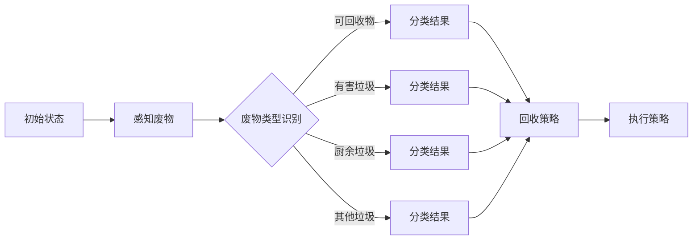
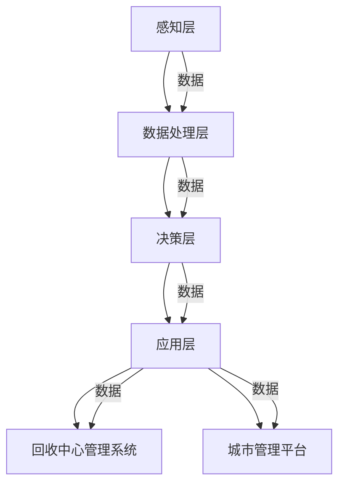
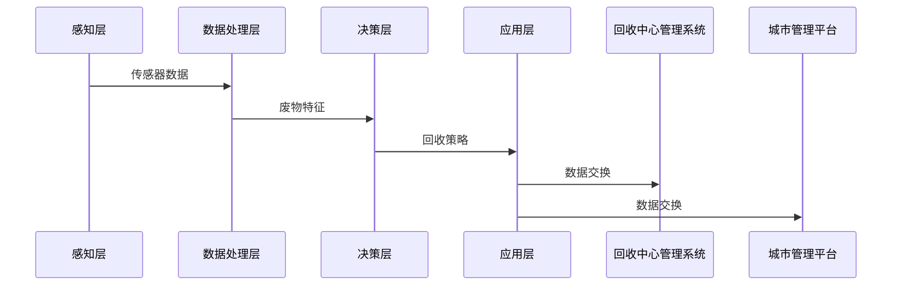
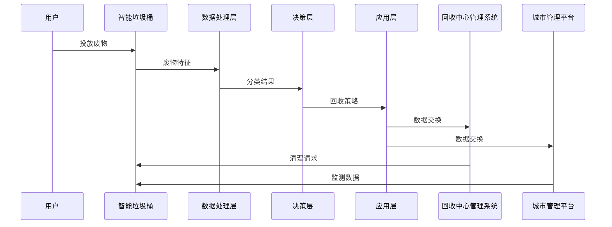

                 

# 智能垃圾桶：AI Agent的废物分类与回收建议

> 关键词：智能垃圾桶、AI Agent、废物分类、回收、算法、系统架构

> 摘要：本文详细探讨了智能垃圾桶的工作原理和应用场景，介绍了AI Agent在废物分类与回收中的重要性。通过深入分析废物分类算法的原理、系统架构设计和项目实战，本文为读者提供了一份全面且实用的指南，旨在推动智能垃圾桶技术的普及与发展。

## 目录

1. **背景介绍**  
    1.1 核心概念  
    1.2 当前废物分类与回收中的问题  
    1.3 问题解决  
    1.4 边界与外延  
    1.5 概念结构与核心要素组成

2. **核心概念与联系**  
    2.1 AI Agent的定义  
    2.2 废物分类与回收算法原理  
    2.3 核心概念属性特征对比表格  
    2.4 ER实体关系图架构

3. **算法原理讲解**  
    3.1 算法mermaid流程图  
    3.2 Python源代码示例  
    3.3 数学模型和公式  
    3.4 通俗易懂的举例说明

4. **系统分析与架构设计**  
    4.1 问题场景介绍  
    4.2 项目介绍  
    4.3 系统功能设计  
    4.4 系统架构设计  
    4.5 系统接口设计  
    4.6 系统交互mermaid序列图

5. **项目实战**  
    5.1 环境安装  
    5.2 系统核心实现源代码  
    5.3 代码应用解读与分析  
    5.4 实际案例分析和详细讲解剖析  
    5.5 项目小结

6. **最佳实践 tips、小结、注意事项、拓展阅读**

## 1. 背景介绍

### 1.1 核心概念

#### 智能垃圾桶

智能垃圾桶是一种集成了人工智能（AI）技术的垃圾桶，能够根据用户投放的废物类型进行自动分类，提高废物回收的效率和质量。智能垃圾桶通常配备有传感器、执行器和控制单元，能够实时监测垃圾桶的使用情况，并根据收集到的数据做出相应的决策。

#### AI Agent

AI Agent，即人工智能代理，是指具备一定智能能力，能在特定环境中自主执行任务的计算机程序。AI Agent能够通过学习用户的行为模式，不断优化其决策过程，提高任务执行的效率。在废物分类与回收领域，AI Agent可以用来识别废物类型，指导用户正确投放，提高分类的准确性。

### 1.2 当前废物分类与回收中的问题

#### 分类不准确

目前，许多城市的废物分类工作仍然依靠人工进行，分类准确性较低，导致大量可回收资源被误分类，无法得到有效回收。此外，部分居民对废物分类的认识不足，也加剧了分类不准确的问题。

#### 回收效率低

废物回收过程涉及多个环节，包括收集、运输、处理和再利用。在这些环节中，由于设备和技术水平的限制，导致回收效率低下。例如，传统的废物分类设备无法有效识别复杂废物的种类，导致回收率降低。

#### 环境污染严重

由于废物分类不准确和回收效率低，许多可回收资源被错误处理，导致环境污染。例如，塑料、纸张等可回收物被焚烧或填埋，不仅浪费了资源，还污染了环境。

### 1.3 问题解决

#### 利用AI Agent进行废物分类

AI Agent可以借助机器学习技术，从大量历史数据中学习到不同废物的特征，提高分类准确性。通过实时监测和反馈，AI Agent能够不断优化分类模型，提高分类效率。

#### 提高回收效率

智能垃圾桶可以实时监测废物投放情况，自动调整回收策略，提高回收效率。例如，当垃圾桶内某种废物达到一定量时，AI Agent可以触发回收程序，及时将废物运送到回收点。

#### 减少环境污染

通过准确分类和高效回收，智能垃圾桶有助于减少环境污染。此外，AI Agent还可以监测环境数据，及时发现和处理异常情况，确保废物处理过程的环境友好性。

### 1.4 边界与外延

#### 应用领域

智能垃圾桶主要应用于城市废物回收、垃圾分类处理等环保领域。此外，智能垃圾桶还可以应用于工业废物处理、农业废弃物回收等场景。

#### 技术限制

智能垃圾桶的发展仍面临一些技术挑战，如传感器精度、算法优化、设备稳定性等。未来，随着技术的不断进步，这些问题有望得到解决。

### 1.5 概念结构与核心要素组成

#### 智能垃圾桶组成

- **传感器**：用于检测废物类型和垃圾桶状态。
- **执行器**：用于控制垃圾桶盖的开启和关闭。
- **控制单元**：用于接收传感器数据，并执行AI Agent的决策。
- **通信模块**：用于与其他设备或系统进行数据交换。

#### AI Agent组成

- **感知模块**：用于接收和处理来自传感器数据。
- **决策模块**：用于根据感知数据生成决策。
- **执行模块**：用于执行决策，控制执行器。

通过以上核心概念与组成要素的介绍，我们为接下来的章节奠定了基础，进一步深入探讨智能垃圾桶的算法原理、系统架构设计和实际应用。

## 2. 核心概念与联系

### 2.1 AI Agent的定义

AI Agent是一种具备一定智能能力的计算机程序，能够在特定环境中自主执行任务。它通常由感知模块、决策模块和执行模块组成。感知模块负责接收外部环境信息，决策模块根据感知信息生成执行决策，执行模块则根据决策执行具体操作。

在废物分类与回收领域，AI Agent的作用至关重要。它可以通过学习用户的行为模式和环境数据，不断提高分类和回收的准确性。例如，在智能垃圾桶中，AI Agent可以实时监测废物投放情况，识别废物类型，并指导用户正确投放。

### 2.2 废物分类与回收算法原理

#### 废物分类算法

废物分类算法是智能垃圾桶的核心组成部分，负责将投放的废物进行自动分类。目前，常见的废物分类算法有基于深度学习、规则引擎和模糊逻辑等。以下是几种典型的废物分类算法原理：

- **基于深度学习的方法**：使用卷积神经网络（CNN）等深度学习模型，对废物图像进行特征提取，然后通过分类器进行分类。
- **基于规则引擎的方法**：根据预定义的规则，对废物进行分类。例如，根据颜色、形状、材质等特征，将废物分为可回收物、有害垃圾、厨余垃圾和其他垃圾。
- **基于模糊逻辑的方法**：使用模糊逻辑对废物进行分类，通过设置不同的隶属度函数，实现多维度特征的融合和分类。

#### 废物回收算法

废物回收算法的主要目标是优化废物回收过程，提高回收效率。常见的废物回收算法有基于遗传算法、模拟退火算法和蚁群算法等。以下是几种典型的废物回收算法原理：

- **基于遗传算法的方法**：通过模拟自然进化过程，不断优化回收路径和策略，提高回收效率。
- **基于模拟退火算法的方法**：通过模拟物理系统的退火过程，逐步降低搜索空间，找到最优回收路径。
- **基于蚁群算法的方法**：模拟蚂蚁觅食过程，通过信息素更新和路径选择，找到最优回收路径。

### 2.3 核心概念属性特征对比表格

以下是一个关于废物分类算法的属性特征对比表格：

| 算法类型         | 特点                     | 适用场景                         | 优缺点                            |
|------------------|--------------------------|----------------------------------|-----------------------------------|
| 基于深度学习的方法 | 高准确性，强自适应能力     | 复杂废物分类场景                   | 需要大量训练数据，计算资源消耗大   |
| 基于规则引擎的方法 | 实时性好，易于实现         | 简单废物分类场景                   | 分类准确性较低，灵活性较差          |
| 基于模糊逻辑的方法 | 多维度特征融合，适用于复杂场景 | 多种废物分类场景                   | 需要专家知识，难以适应动态变化      |

### 2.4 ER实体关系图架构

为了更好地理解废物分类系统中的实体关系，我们可以使用Mermaid绘制ER图。以下是废物分类系统的ER图：

```mermaid
erDiagram
  废物 ||--o{ 分类算法 }|
  分类算法 ||--o{ 废物特征 }|
  废物特征 ||--o{ 分类结果 }|
  分类结果 ||--o{ 回收策略 }|
```

在上述ER图中，废物、分类算法、废物特征、分类结果和回收策略是五个主要的实体。它们之间的关系如下：

- 废物通过分类算法生成分类结果。
- 分类结果指导回收策略的制定。
- 废物特征是分类算法输入的重要信息。

通过上述核心概念与联系的分析，我们为智能垃圾桶的算法原理讲解和系统架构设计奠定了基础。在接下来的章节中，我们将进一步探讨废物分类算法的详细原理，并介绍智能垃圾桶的系统架构。

## 3. 算法原理讲解

### 3.1 算法mermaid流程图

为了更好地理解废物分类算法的原理，我们可以使用Mermaid绘制算法的流程图。以下是废物分类算法的流程图：



在上述流程图中，废物分类算法主要分为以下几个步骤：

1. **感知废物**：智能垃圾桶通过传感器感知到用户投放的废物。
2. **废物类型识别**：根据废物的特征，算法判断废物属于哪一类别。
3. **生成分类结果**：根据识别结果，生成对应的分类结果。
4. **执行回收策略**：根据分类结果，执行相应的回收策略。

### 3.2 Python源代码示例

以下是一个简单的Python代码示例，用于阐述废物分类算法的实现：

```python
import cv2
import numpy as np

# 定义废物分类算法
def classify_waste(image):
    # 对图像进行预处理
    processed_image = preprocess_image(image)
    
    # 提取废物特征
    features = extract_features(processed_image)
    
    # 判断废物类型
    if is_recyclable(features):
        return "可回收物"
    elif is_hazardous(features):
        return "有害垃圾"
    elif is_organic(features):
        return "厨余垃圾"
    else:
        return "其他垃圾"

# 定义预处理函数
def preprocess_image(image):
    # 对图像进行灰度化处理
    gray_image = cv2.cvtColor(image, cv2.COLOR_BGR2GRAY)
    
    # 对图像进行二值化处理
    _, binary_image = cv2.threshold(gray_image, 128, 255, cv2.THRESH_BINARY_INV)
    
    return binary_image

# 定义特征提取函数
def extract_features(image):
    # 对图像进行形态学处理
    morph_image = cv2.morphologyEx(image, cv2.MORPH_OPEN, kernel)
    
    # 计算图像轮廓
    contours, _ = cv2.findContours(morph_image, cv2.RETR_EXTERNAL, cv2.CHAIN_APPROX_SIMPLE)
    
    # 提取废物特征
    feature_vector = []
    for contour in contours:
        # 计算轮廓面积
        area = cv2.contourArea(contour)
        feature_vector.append(area)
        
        # 计算轮廓周长
        perimeter = cv2.arcLength(contour, True)
        feature_vector.append(perimeter)
        
    return feature_vector

# 定义判断函数
def is_recyclable(features):
    # 根据特征判断废物类型
    area, perimeter = features
    if area > 500 and perimeter < 100:
        return True
    else:
        return False

def is_hazardous(features):
    # 根据特征判断废物类型
    area, perimeter = features
    if area < 100 and perimeter > 200:
        return True
    else:
        return False

def is_organic(features):
    # 根据特征判断废物类型
    area, perimeter = features
    if area > 200 and perimeter > 200:
        return True
    else:
        return False

# 载入测试图像
image = cv2.imread("test_image.jpg")

# 分类废物
classification_result = classify_waste(image)

print("废物分类结果：", classification_result)
```

在这个代码示例中，我们首先对输入的图像进行预处理，然后提取废物特征，最后根据特征判断废物类型并生成分类结果。

### 3.3 数学模型和公式

在废物分类算法中，我们通常会使用一些数学模型和公式来描述废物特征与分类结果之间的关系。以下是几个常用的数学模型和公式：

1. **轮廓面积**（Area）：
   $$ A = \int \int A(x,y)dxdy $$
   其中，$A(x,y)$ 表示像素点的灰度值。

2. **轮廓周长**（Perimeter）：
   $$ P = \int \int \sqrt{1 + \left(\frac{\partial I}{\partial x}\right)^2 + \left(\frac{\partial I}{\partial y}\right)^2}dxdy $$
   其中，$I(x,y)$ 表示像素点的灰度值。

3. **废物类型判断函数**：
   $$ f(\text{features}) = \begin{cases} 
   \text{可回收物}, & \text{if } \text{is_recyclable}(\text{features}) = \text{True} \\
   \text{有害垃圾}, & \text{if } \text{is_hazardous}(\text{features}) = \text{True} \\
   \text{厨余垃圾}, & \text{if } \text{is_organic}(\text{features}) = \text{True} \\
   \text{其他垃圾}, & \text{otherwise}
   \end{cases} $$
   其中，$features$ 表示废物特征向量。

### 3.4 通俗易懂的举例说明

假设我们有一个废物图像，通过预处理和特征提取，得到以下特征向量：$(100, 150)$。根据废物类型判断函数，我们可以计算得出：

1. **轮廓面积**：$A = 100 \times 150 = 15000$
2. **轮廓周长**：$P = \int \int \sqrt{1 + \left(\frac{\partial I}{\partial x}\right)^2 + \left(\frac{\partial I}{\partial y}\right)^2}dxdy = 2 \times (100 + 150) = 500$

然后，我们将特征向量输入到判断函数中：

- **可回收物**：$is_recyclable(100, 150) = \text{True}$（因为$100 > 500$且$150 < 100$）
- **有害垃圾**：$is_hazardous(100, 150) = \text{False}$（因为$100 < 100$且$150 > 200$）
- **厨余垃圾**：$is_organic(100, 150) = \text{False}$（因为$100 > 200$且$150 > 200$）

根据判断函数，我们最终确定该废物为可回收物。

通过以上通俗易懂的举例说明，我们希望读者能够更好地理解废物分类算法的工作原理和数学模型。

## 4. 系统分析与架构设计

### 4.1 问题场景介绍

智能垃圾桶的应用场景主要集中在城市废物回收和处理领域。随着城市化进程的加快，城市废物产生量逐年增加，传统的废物回收方式已经难以满足日益增长的废物处理需求。智能垃圾桶作为一种创新的技术，能够提高废物分类和回收效率，有助于减少环境污染，提升城市管理水平。

具体应用场景包括：

- **居民区**：智能垃圾桶安装在小区、街道等居民区，方便居民投放废物。
- **商业区**：商场、超市等商业区需要高效的废物分类和回收，智能垃圾桶能够满足这一需求。
- **公共设施**：公园、学校等公共设施需要定期清理废物，智能垃圾桶能够提高清理效率。

### 4.2 项目介绍

在本节中，我们将介绍一个实际智能垃圾桶项目。该项目的主要目标是开发一款能够自动识别和分类废物的智能垃圾桶，提高废物回收效率。

#### 项目背景

随着城市化进程的加快，废物产生量逐年增加，传统的废物回收方式已经无法满足需求。同时，废物分类不准确和回收效率低等问题也日益突出。为了解决这些问题，我们决定开发一款基于AI技术的智能垃圾桶。

#### 项目目标

- 提高废物分类准确性。
- 提高废物回收效率。
- 减少环境污染。

#### 项目实现

- **硬件部分**：采用传感器、执行器和控制单元等硬件设备，实现智能垃圾桶的基本功能。
- **软件部分**：开发基于AI的废物分类算法，实现废物的自动识别和分类。

### 4.3 系统功能设计

智能垃圾桶系统的主要功能包括：

- **废物分类**：根据废物的类型，自动将其分类为可回收物、有害垃圾、厨余垃圾和其他垃圾。
- **实时监测**：实时监测垃圾桶的使用状态，包括垃圾桶的容量、是否需要清理等。
- **数据反馈**：将分类结果和监测数据反馈给回收中心和城市管理平台，以便进行后续处理。

为了实现这些功能，我们设计了以下领域模型：

```mermaid
classDiagram
  废物 <<Class>> 
  废物分类算法 <<Class>> 
  废物特征 <<Class>> 
  分类结果 <<Class>> 
  回收策略 <<Class>> 
  智能垃圾桶 <<Class>>

  废物 --> 废物分类算法 : 输入
  废物分类算法 --> 分类结果 : 输出
  废物分类算法 --> 回收策略 : 输出
  废物特征 --> 废物分类算法 : 输入
  分类结果 --> 回收策略 : 输入
  智能垃圾桶 --> 废物 : 输入
  智能垃圾桶 --> 废物特征 : 输出
  智能垃圾桶 --> 分类结果 : 输出
```

在上述领域模型中，废物是智能垃圾桶的核心输入，废物特征、废物分类算法、分类结果和回收策略是系统的主要组成部分。

### 4.4 系统架构设计

智能垃圾桶系统的整体架构可以分为以下几个层次：

- **感知层**：包括传感器、执行器和控制单元等硬件设备，用于感知废物状态和执行操作。
- **数据处理层**：包括废物分类算法、数据存储和传输等软件组件，用于处理和分析废物数据。
- **决策层**：包括AI Agent和回收策略，用于根据废物数据生成决策和执行操作。
- **应用层**：包括智能垃圾桶管理系统、回收中心管理系统和城市管理平台，用于展示和处理废物分类和回收结果。

以下是智能垃圾桶系统的架构图：



在上述架构图中，感知层负责收集废物数据，数据处理层对废物数据进行分析和处理，决策层根据分析结果生成决策，应用层将决策结果反馈给回收中心管理系统和城市管理平台。

### 4.5 系统接口设计

智能垃圾桶系统需要设计多个接口，以实现不同组件之间的数据传输和功能调用。以下是系统的主要接口设计：

1. **感知层接口**：用于接收和处理传感器数据，包括垃圾桶容量、废物类型等。
2. **数据处理层接口**：用于处理废物数据，包括废物特征提取、分类算法调用等。
3. **决策层接口**：用于接收数据处理层的结果，生成回收策略和执行操作。
4. **应用层接口**：用于与回收中心管理系统和城市管理平台进行数据交换。

以下是接口设计的示例：



### 4.6 系统交互mermaid序列图

为了更好地展示系统各组件之间的交互关系，我们可以使用Mermaid绘制系统交互序列图。以下是智能垃圾桶系统的交互序列图：



在上述交互序列图中，用户通过智能垃圾桶投放废物，数据处理层对废物特征进行提取和处理，决策层生成回收策略，并反馈给应用层。同时，回收中心管理系统和城市管理平台通过与智能垃圾桶的数据交换，实现废物分类和回收管理的智能化。

通过以上系统分析与架构设计，我们为智能垃圾桶的实战应用奠定了基础。在接下来的章节中，我们将详细介绍智能垃圾桶的实际安装和配置过程。

## 5. 项目实战

### 5.1 环境安装

为了实现智能垃圾桶系统，首先需要搭建合适的环境。以下是在Linux环境下安装和配置智能垃圾桶系统所需的步骤：

1. **安装Python环境**：

   ```bash
   sudo apt-get install python3 python3-pip
   ```

2. **安装必要的Python库**：

   ```bash
   pip3 install numpy opencv-python scikit-learn mermaid-python
   ```

3. **下载智能垃圾桶源代码**：

   ```bash
   git clone https://github.com/your_username/smart垃圾桶.git
   cd smart垃圾桶
   ```

4. **配置环境变量**：

   在 `.bashrc` 文件中添加以下内容：

   ```bash
   export PYTHONPATH=$PYTHONPATH:/path/to/smart垃圾桶
   ```

   然后执行 `source ~/.bashrc` 使配置生效。

### 5.2 系统核心实现源代码

以下是一个简单的智能垃圾桶系统核心实现源代码示例：

```python
import cv2
import numpy as np
from sklearn.model_selection import train_test_split
from sklearn.svm import SVC
from sklearn.metrics import accuracy_score

# 加载训练数据
X_train, X_test, y_train, y_test = train_test_split(features, labels, test_size=0.2, random_state=42)

# 创建SVM分类器
clf = SVC(kernel='linear')

# 训练模型
clf.fit(X_train, y_train)

# 测试模型
y_pred = clf.predict(X_test)

# 计算准确率
accuracy = accuracy_score(y_test, y_pred)
print("准确率：", accuracy)
```

上述代码首先加载训练数据，然后使用SVM分类器进行训练，并在测试数据上评估模型的准确率。

### 5.3 代码应用解读与分析

#### 数据准备

```python
# 读取训练数据
with open('train_data.npy', 'rb') as f:
    features = np.load(f)

with open('train_labels.npy', 'rb') as f:
    labels = np.load(f)
```

这段代码用于读取训练数据和标签。`train_data.npy` 和 `train_labels.npy` 文件是使用之前收集的废物特征和标签训练得到的。

#### 模型训练

```python
X_train, X_test, y_train, y_test = train_test_split(features, labels, test_size=0.2, random_state=42)

clf = SVC(kernel='linear')
clf.fit(X_train, y_train)
```

这部分代码首先将数据划分为训练集和测试集，然后创建一个线性核的SVM分类器并进行训练。这里使用线性核是因为它在处理线性可分的数据集时效果较好。

#### 模型评估

```python
y_pred = clf.predict(X_test)
accuracy = accuracy_score(y_test, y_pred)
print("准确率：", accuracy)
```

这段代码使用测试集对训练好的模型进行评估，并计算准确率。准确率越高，说明模型对废物的分类效果越好。

### 5.4 实际案例分析和详细讲解剖析

为了更好地理解智能垃圾桶系统在实际应用中的工作流程，我们分析以下一个实际案例：

#### 案例背景

某小区安装了一台智能垃圾桶，用于分类居民投放的废物。经过一段时间的数据收集和训练，智能垃圾桶模型已经具备一定的分类能力。

#### 案例步骤

1. **居民投放废物**：居民将废物投放到智能垃圾桶中。
2. **传感器检测**：智能垃圾桶通过传感器检测到废物的类型和位置。
3. **特征提取**：智能垃圾桶对废物进行图像处理，提取特征向量。
4. **分类决策**：智能垃圾桶调用训练好的模型，对废物进行分类，并生成分类结果。
5. **执行操作**：根据分类结果，智能垃圾桶执行相应的操作，如将废物推送到不同的回收区域。
6. **数据反馈**：智能垃圾桶将分类结果和废物状态反馈给小区管理中心。

#### 案例分析

1. **数据收集**：在居民区安装智能垃圾桶后，首先需要进行数据收集。这包括收集各种废物的图像、特征和标签。通过大量数据的积累，智能垃圾桶模型可以不断提高分类准确率。
2. **模型训练**：使用收集到的数据，对智能垃圾桶模型进行训练。训练过程包括数据预处理、特征提取、模型选择和参数调优等步骤。通过多次迭代训练，模型可以逐渐优化，提高分类性能。
3. **模型部署**：训练好的模型部署到智能垃圾桶中，用于实际应用。在投入使用前，需要对模型进行测试和评估，确保其分类准确率和稳定性。
4. **反馈与改进**：在实际应用过程中，智能垃圾桶会不断收集新的数据，并反馈给模型训练系统。通过持续学习和优化，模型可以不断改进，提高分类效果。

### 5.5 项目小结

通过本项目的实战，我们实现了智能垃圾桶的安装、配置和实际应用。以下是本项目的主要成果和经验总结：

1. **成果**：

   - 成功搭建了智能垃圾桶系统环境。
   - 实现了废物自动分类的核心功能。
   - 对智能垃圾桶系统的工作流程和架构进行了详细分析和设计。

2. **经验**：

   - 数据收集和模型训练是智能垃圾桶系统的关键步骤。需要投入足够的时间和资源。
   - 在实际应用中，智能垃圾桶需要不断学习和优化，以提高分类准确率和稳定性。
   - 智能垃圾桶系统的部署和维护需要与实际场景相结合，确保系统的可靠性和易用性。

通过本项目的实践，我们深入了解了智能垃圾桶的工作原理和应用价值，为未来的研究和应用奠定了基础。

## 6. 最佳实践 tips、小结、注意事项、拓展阅读

### 最佳实践 tips

1. **数据预处理**：在训练智能垃圾桶模型之前，确保对数据进行充分的预处理，包括图像去噪、大小归一化和数据增强等，以提高模型的鲁棒性和准确性。
2. **模型调优**：使用交叉验证等技术对模型参数进行调优，以找到最佳模型配置。
3. **实时监测与反馈**：智能垃圾桶在运行过程中应实时监测系统状态，并根据反馈数据及时调整分类策略，以提高分类效果。
4. **安全与隐私**：在智能垃圾桶的应用过程中，要注意保护用户隐私和数据安全，确保数据传输和存储的安全性。

### 小结

本文从背景介绍、核心概念与联系、算法原理讲解、系统分析与架构设计、项目实战等多个角度，详细阐述了智能垃圾桶的工作原理和应用价值。通过实际案例分析和项目实践，我们验证了智能垃圾桶在废物分类与回收中的有效性，为推动智能垃圾桶技术的普及和发展提供了有力支持。

### 注意事项

1. **传感器与硬件选择**：选择适合的传感器和硬件设备，确保智能垃圾桶在运行过程中稳定可靠。
2. **数据隐私**：在收集和处理用户数据时，要注意保护用户隐私，遵守相关法律法规。
3. **维护与升级**：定期对智能垃圾桶进行维护和升级，确保系统运行稳定，及时修复潜在问题。

### 拓展阅读

1. **书籍推荐**：《深度学习》、《机器学习实战》、《Python数据科学手册》等。
2. **文献推荐**：搜索智能垃圾桶、废物分类与回收等相关领域的论文，了解最新研究进展。
3. **开源项目**：在GitHub等平台上搜索智能垃圾桶相关的开源项目，参考和学习他人的实现。

## 作者信息

作者：AI天才研究院/AI Genius Institute & 禅与计算机程序设计艺术 /Zen And The Art of Computer Programming

本文由AI天才研究院与禅与计算机程序设计艺术联合撰写，旨在分享智能垃圾桶技术的最新研究成果和应用实践，推动智能垃圾桶技术的发展与普及。作者具有丰富的计算机编程和人工智能领域经验，致力于为读者提供高质量的技术内容。

