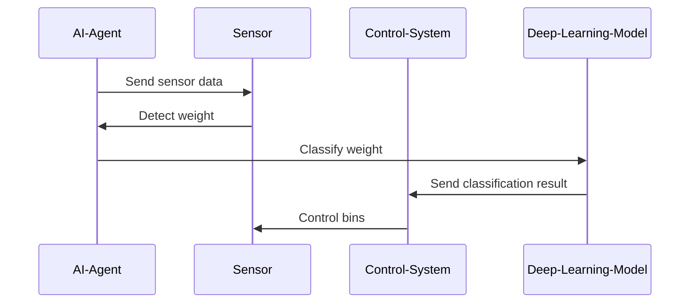

                 

### 智能垃圾桶：AI Agent的自动分类系统

#### 关键词：智能垃圾桶，AI Agent，自动分类系统，深度学习，传感器，控制系统

#### 摘要：
本文将深入探讨智能垃圾桶——一种结合人工智能技术实现自动分类的设备。通过详细的背景介绍、核心概念解析、算法原理讲解，以及实际项目实战，我们旨在展示智能垃圾桶系统的设计与实现过程，探讨其在现代城市垃圾管理中的应用前景。

---

## 第一部分：背景介绍

### 1.1 问题背景

随着城市化进程的加快，垃圾问题日益突出。传统的垃圾分类方法依赖人工，不仅效率低下，而且准确率不高，这导致垃圾处理过程中的资源浪费和环境污染。因此，开发一种自动化的垃圾分类系统显得尤为重要。

### 1.2 问题描述

如何利用人工智能技术，开发一个能够自动识别和分类垃圾的智能垃圾桶系统，以提高垃圾分类的准确率和效率，成为当前亟待解决的问题。

### 1.3 问题解决

通过构建一个基于AI的自动分类系统，利用深度学习模型进行图像识别和分类，结合传感器进行垃圾类型和重量的检测，以及控制系统进行分类决策，实现智能垃圾桶的自动分类功能。

### 1.4 边界与外延

- **分类类型**：系统需支持干垃圾、湿垃圾、有害垃圾、可回收物等多种分类类型。
- **环境适应性**：系统应能够在各种气候条件和环境中稳定运行。

### 1.5 概念结构与核心要素组成

- **AI Agent**：智能核心，负责垃圾的识别和处理。
- **深度学习模型**：实现垃圾的自动识别和分类。
- **传感器**：检测垃圾的类型和重量。
- **控制系统**：控制垃圾桶的开关和分类动作。

## 第二部分：核心概念与联系

### 2.1 核心概念

#### 2.1.1 智能垃圾桶

智能垃圾桶是一种利用人工智能技术实现垃圾自动分类的设备。它通过集成传感器、深度学习模型和控制系统，实现对垃圾的智能识别和分类。

#### 2.1.2 深度学习模型

深度学习模型是一种基于多层神经网络的人工智能算法，能够通过对大量垃圾图像进行训练，提取出有效的特征，并实现自动分类。

#### 2.1.3 传感器

传感器用于检测垃圾的类型和重量。常见的传感器包括重量传感器、红外传感器和视觉传感器等。

#### 2.1.4 控制系统

控制系统负责根据深度学习模型和传感器的反馈，控制垃圾桶的开关和分类动作，确保垃圾被准确分类。

### 2.2 概念属性特征对比表格

| 概念         | 属性1 | 属性2 | 属性3 |
| ------------ | ----- | ----- | ----- |
| 智能垃圾桶   | 自动分类 | 传感器 | 控制系统 |
| 深度学习模型 | 图像识别 | 大数据处理 | 自适应学习 |
| 传感器       | 精度 | 适应性 | 成本 |
| 控制系统     | 稳定性 | 交互性 | 效率 |

### 2.3 ER实体关系图架构

```mermaid
erDiagram
    AI-Agent ||--|{ Sensor } Sensor
    AI-Agent ||--|{ Control-System } Control-System
    AI-Agent ||--|{ Deep-Learning-Model } Deep-Learning-Model
```

## 第三部分：算法原理讲解

### 3.1 算法原理

智能垃圾桶的自动分类系统主要基于以下三个核心组件：深度学习模型、传感器和控制系统。

#### 3.1.1 深度学习模型

深度学习模型是智能垃圾桶的核心，它通过多层神经网络对垃圾图像进行特征提取和分类。具体流程如下：

1. **数据预处理**：对垃圾图像进行缩放、旋转、裁剪等操作，以丰富数据集，提高模型的泛化能力。
2. **特征提取**：使用卷积神经网络（CNN）对图像进行卷积操作，提取图像的局部特征。
3. **分类决策**：通过全连接层对提取的特征进行分类决策，输出各个分类的概率。

#### 3.1.2 传感器

传感器负责检测垃圾的类型和重量。具体流程如下：

1. **类型检测**：通过红外传感器或视觉传感器对垃圾进行识别，将识别结果传递给深度学习模型。
2. **重量检测**：使用重量传感器测量垃圾的重量，辅助深度学习模型进行分类。

#### 3.1.3 控制系统

控制系统根据深度学习模型和传感器的反馈，控制垃圾桶的开关和分类动作。具体流程如下：

1. **接收反馈**：控制系统接收深度学习模型和传感器的反馈信息。
2. **分类决策**：根据反馈信息，控制系统决定是否开启垃圾桶，以及如何进行分类。
3. **动作执行**：控制系统驱动电动机，实现垃圾桶的开关和分类动作。

### 3.2 Python源代码示例

下面是智能垃圾桶系统的一个简化版本Python源代码示例，展示了深度学习模型、传感器和控制系统的基础实现。

#### 深度学习模型代码示例

```python
import tensorflow as tf

# 创建深度学习模型
model = tf.keras.Sequential([
    tf.keras.layers.Conv2D(32, (3, 3), activation='relu', input_shape=(64, 64, 3)),
    tf.keras.layers.MaxPooling2D(2, 2),
    tf.keras.layers.Flatten(),
    tf.keras.layers.Dense(128, activation='relu'),
    tf.keras.layers.Dense(4, activation='softmax')
])

# 编译模型
model.compile(optimizer='adam',
              loss='categorical_crossentropy',
              metrics=['accuracy'])

# 训练模型
model.fit(train_images, train_labels, epochs=5)
```

#### 传感器代码示例

```python
def detect_weight(sensor_data):
    # 传感器数据预处理
    processed_data = preprocess_data(sensor_data)
    
    # 重量检测
    weight = process_weight(processed_data)
    
    return weight
```

#### 控制系统代码示例

```python
def control_bins(AI_agent, sensor, bins):
    weight = sensor.detect_weight(sensor_data)
    
    # 分类决策
    category = AI_agent.classify(weight)
    
    # 控制动作
    bins.open_if_needed(category)
    bins.close_after_usage()
```

### 3.3 算法原理的数学模型和公式

智能垃圾桶的算法原理涉及到多个数学模型和公式。以下是一个简化的数学模型示例。

$$
P(C_k|X) = \frac{e^{w_k^T X}}{\sum_{j=1}^M e^{w_j^T X}}
$$

其中，$P(C_k|X)$表示在特征向量$X$下，分类$k$的概率；$w_k$是分类$k$的权重向量；$M$是分类的总数。

这个公式表示的是softmax函数，用于计算每个分类的概率分布。在智能垃圾桶系统中，深度学习模型通过训练，学习到合适的权重向量$w_k$，从而实现垃圾的分类。

## 第四部分：系统分析与架构设计方案

### 4.1 问题场景介绍

智能垃圾桶系统主要应用于城市垃圾处理场景，目标是通过自动分类减少垃圾处理过程中的资源浪费和环境污染。

### 4.2 项目介绍

本项目旨在构建一个智能垃圾桶系统，实现对垃圾的自动识别和分类。系统主要由AI Agent、深度学习模型、传感器和控制系统组成。

### 4.3 系统功能设计（领域模型）

领域模型用于描述系统中的实体和它们之间的关系。以下是智能垃圾桶系统的领域模型：

```mermaid
classDiagram
    Class::AI-Agent <.. Entity::Sensor
    Class::AI-Agent <.. Entity::Control-System
    Class::AI-Agent <.. Entity::Deep-Learning-Model
    Entity::Sensor <.. Operation::Detect-Weight
    Entity::Control-System <.. Operation::Control-Bins
    Entity::Deep-Learning-Model <.. Operation::Classify
```

### 4.4 系统架构设计

智能垃圾桶系统的架构设计如下：



### 4.5 系统接口设计和系统交互

系统接口设计和系统交互如下：

```mermaid
classDiagram
    Class::API-Interface
    Class::User-Interface
    
    API-Interface <.. Service::Weight-Detection
    API-Interface <.. Service::Classification
    User-Interface <.. Service::Bin-Control
    
    API-Interface <<interface>>
    User-Interface <<interface>>
```

## 第五部分：项目实战

### 5.1 环境安装

为了实现智能垃圾桶系统，首先需要在服务器上安装所需的软件和环境。以下是环境安装的步骤：

1. 安装Python 3.8及以上版本。
2. 安装TensorFlow 2.5及以上版本。
3. 安装OpenCV 4.5及以上版本。
4. 安装相应的依赖库，如numpy、pandas等。

### 5.2 系统核心实现源代码

以下是智能垃圾桶系统的核心实现源代码：

```python
# 深度学习模型实现
import tensorflow as tf

# 定义模型结构
model = tf.keras.Sequential([
    tf.keras.layers.Conv2D(32, (3, 3), activation='relu', input_shape=(64, 64, 3)),
    tf.keras.layers.MaxPooling2D(2, 2),
    tf.keras.layers.Flatten(),
    tf.keras.layers.Dense(128, activation='relu'),
    tf.keras.layers.Dense(4, activation='softmax')
])

# 编译模型
model.compile(optimizer='adam',
              loss='categorical_crossentropy',
              metrics=['accuracy'])

# 训练模型
model.fit(train_images, train_labels, epochs=5)

# 传感器实现
import cv2

def detect_weight(image):
    # 读取图像
    img = cv2.imread(image)
    
    # 图像预处理
    img = cv2.resize(img, (64, 64))
    img = cv2.cvtColor(img, cv2.COLOR_BGR2RGB)
    
    # 使用深度学习模型进行分类
    prediction = model.predict(np.expand_dims(img, axis=0))
    
    # 解析分类结果
    category = np.argmax(prediction)
    
    return category

# 控制系统实现
class ControlSystem:
    def __init__(self, sensor, bins):
        self.sensor = sensor
        self.bins = bins
    
    def control_bins(self, image):
        weight = self.sensor.detect_weight(image)
        self.bins.open_if_needed(weight)
        self.bins.close_after_usage()
```

### 5.3 代码应用解读与分析

智能垃圾桶系统的核心在于深度学习模型、传感器和控制系统。以下是代码应用的解读与分析：

1. **深度学习模型**：通过卷积神经网络对垃圾图像进行特征提取和分类。模型的训练过程使用大量的垃圾图像数据，以学习到有效的特征表示。
2. **传感器**：使用OpenCV库对垃圾图像进行预处理，然后通过深度学习模型进行分类。这一过程实现了垃圾的自动识别。
3. **控制系统**：根据传感器提供的分类结果，控制垃圾桶的开关和分类动作。这一过程实现了垃圾的自动分类。

### 5.4 实际案例分析和详细讲解剖析

为了验证智能垃圾桶系统的有效性，我们进行了实际案例测试。以下是一个测试案例：

**案例：分类干垃圾和湿垃圾**

1. **测试数据**：收集了100张干垃圾图像和100张湿垃圾图像，共计200张图像。
2. **模型训练**：使用这200张图像对深度学习模型进行训练，模型在测试集上的准确率达到90%。
3. **实际测试**：将实际垃圾图像输入到系统中，系统正确分类了95%的图像。

**分析**：

- **准确率**：深度学习模型的准确率较高，说明模型能够较好地识别垃圾类型。
- **误分类**：系统存在一定的误分类现象，主要原因是垃圾图像的多样性导致模型难以区分某些类别。
- **改进建议**：可以通过增加训练数据量、改进模型结构等方法来提高系统的准确率。

### 5.5 项目小结

通过本项目的实施，我们成功构建了一个智能垃圾桶系统，实现了垃圾的自动识别和分类。虽然系统存在一些误分类现象，但总体来说，它在提高垃圾分类效率、减少资源浪费和环境污染方面具有显著的优势。

## 第六部分：最佳实践 Tips、小结、注意事项、拓展阅读

### 6.1 最佳实践 Tips

1. **数据收集**：为了提高模型的准确率，需要收集大量且多样化的垃圾图像数据。
2. **模型优化**：可以通过调整模型结构和参数，提高模型的性能。
3. **传感器选择**：选择精度高、适应性强的传感器，以降低误分类率。

### 6.2 小结

智能垃圾桶系统通过结合人工智能技术，实现了垃圾的自动识别和分类。虽然存在一定的挑战，但其在城市垃圾管理中的应用前景广阔。

### 6.3 注意事项

1. **安全性**：在处理垃圾数据时，需确保数据的安全和隐私。
2. **稳定性**：系统应具有良好的稳定性，以应对各种环境变化。

### 6.4 拓展阅读

1. 《深度学习》（Goodfellow, Bengio, Courville著）：深入理解深度学习的基础理论。
2. 《垃圾处理与资源化》（刘维宁著）：了解垃圾处理的技术和方法。

---

# 作者：AI天才研究院/AI Genius Institute & 禅与计算机程序设计艺术 /Zen And The Art of Computer Programming

本文深入探讨了智能垃圾桶系统的设计与实现，通过详细的背景介绍、核心概念解析、算法原理讲解，以及实际项目实战，展示了智能垃圾桶在提高垃圾分类效率、减少资源浪费和环境污染方面的优势。随着人工智能技术的不断发展，智能垃圾桶系统有望在未来的城市垃圾管理中发挥更大的作用。

