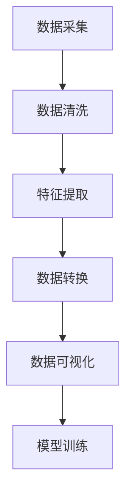
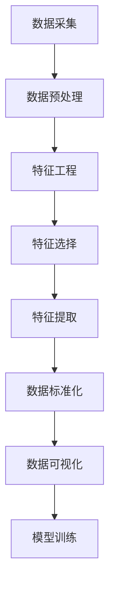
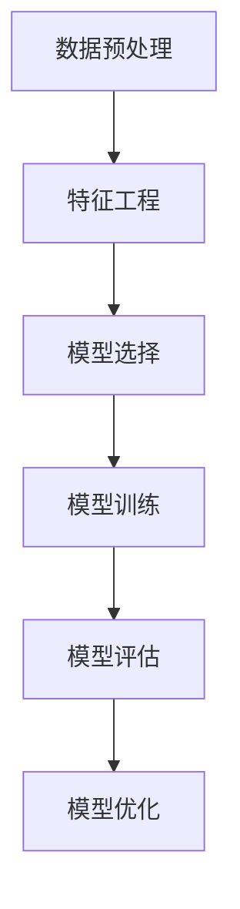
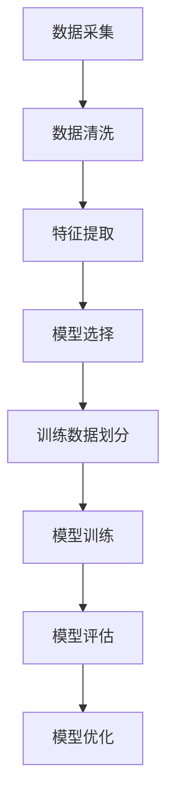
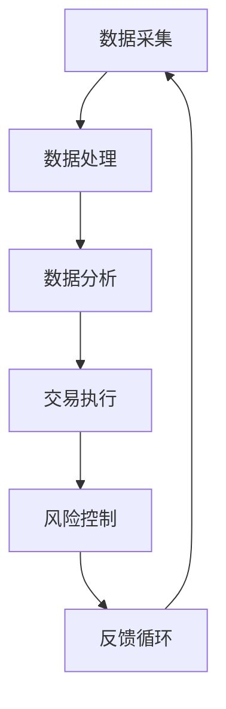

                 

### 智能外汇套利机会识别系统概述

#### 1.1 问题背景

外汇市场是全球最大的金融市场之一，每日交易额高达数万亿美元。外汇市场的波动性极高，伴随着全球经济的变化和重大事件的冲击，汇率往往会发生剧烈波动。这种波动性为市场参与者提供了潜在的盈利机会，尤其是在套利交易中。

**外汇交易市场概况**

外汇市场包括银行、投资公司、政府机构、企业和个人投资者等多种参与者。市场交易主要通过电子交易平台进行，交易工具包括货币对、期权、期货和外汇基金等。外汇交易具有较高的杠杆率，这意味着投资者可以使用少量的资金进行大规模交易。

**外汇套利的概念与原理**

外汇套利是指在两个或多个市场中，利用价格差异进行无风险利润获取的交易策略。外汇套利通常分为三种类型：方向性套利、套汇和跨市套利。

- **方向性套利**：在预测市场趋势的基础上，进行买入或卖出操作，以获取市场波动带来的利润。
- **套汇**：利用不同市场之间的汇率差异进行交易，从多个市场中获取利润。
- **跨市套利**：在同一市场中，利用不同交易所之间的价格差异进行交易，从中获利。

**智能外汇套利的优势与挑战**

智能外汇套利利用机器学习和大数据分析技术，对市场进行实时监测和预测。这种方法的优点包括：

- **高效性**：能够处理大量数据，快速识别套利机会。
- **精准性**：通过算法分析，提高套利交易的准确性和稳定性。
- **自动化**：减少人工干预，提高交易效率。

然而，智能外汇套利也面临一些挑战：

- **市场风险**：市场波动可能导致交易亏损。
- **法规风险**：外汇市场受到各国法规的监管，违规操作可能导致法律风险。
- **数据质量**：数据质量直接影响算法的准确性和可靠性。

#### 1.2 问题描述

外汇市场的波动性使得套利机会频繁出现，但同时也增加了交易的风险。识别和利用这些机会需要高效且精准的方法。智能外汇套利机会识别系统旨在通过以下问题解决：

- **外汇市场波动性**：如何实时监测和预测市场的波动性，以识别潜在的套利机会？
- **套利机会的识别与利用**：如何从海量数据中快速识别套利机会，并有效利用这些机会进行交易？
- **智能化在套利中的角色**：如何利用机器学习和大数据分析技术，提高套利交易的成功率和稳定性？

智能外汇套利机会识别系统通过设计高效的算法，结合数据分析与处理，实现对市场动态的精准监测和预测。系统能够自动化执行交易策略，降低人工干预，提高交易效率。

#### 1.3 问题解决

智能外汇套利机会识别系统的设计包括以下几个关键环节：

- **套利算法设计**：基于市场数据和交易规则，设计高效的套利算法。
- **数据采集与分析**：通过实时数据采集，进行数据预处理和分析，为算法提供可靠的数据支持。
- **模型训练与优化**：利用机器学习技术，对算法进行训练和优化，提高其预测准确性和稳定性。
- **自动化交易执行**：将训练好的模型应用于实际交易场景，实现自动化执行。

通过这些环节，智能外汇套利机会识别系统能够有效地识别和利用市场中的套利机会，实现稳定盈利。

#### 1.4 边界与外延

智能外汇套利机会识别系统在设计和应用过程中，需要考虑以下几个边界条件和外延因素：

- **市场风险**：外汇市场波动性较高，存在一定的交易风险。系统需要具备风险控制机制，以降低潜在损失。
- **法律法规**：各国对外汇市场有严格的监管，违规操作可能导致法律风险。系统需要符合相关法规，确保合规操作。
- **数据源与数据质量**：数据是智能外汇套利系统的核心资源。系统需要确保数据源的可靠性和数据质量，以支持算法的准确性和稳定性。

#### 1.5 概念结构与核心要素组成

智能外汇套利机会识别系统的概念结构包括以下几个核心要素：

- **外汇交易**：外汇交易是系统的基础，包括交易市场、交易工具和交易规则。
- **套利策略**：套利策略是系统的主要功能，包括方向性套利、套汇和跨市套利等。
- **机器学习算法**：机器学习算法是系统智能化的核心，用于数据分析和预测。
- **数据库与数据挖掘**：数据库和数据挖掘技术用于数据存储和数据分析，为系统提供数据支持。

这些核心要素共同构成了智能外汇套利机会识别系统的基本框架，为实现高效套利提供了技术保障。

### 核心概念与联系

#### 2.1 外汇交易原理

外汇交易是指在不同国家的货币之间进行兑换的活动。外汇交易的基本流程包括以下几个步骤：

1. **市场报价**：外汇交易市场会实时提供各种货币对的报价，包括买入价和卖出价。
2. **交易订单**：投资者根据市场报价，通过交易平台提交交易订单，可以是买入或卖出。
3. **成交与结算**：交易订单在市场匹配后，完成成交。成交后，交易双方进行资金结算，通常包括银行转账或电子支付。

**外汇交易的风险管理**

外汇交易面临多种风险，包括市场风险、信用风险和操作风险。有效的风险管理措施包括：

- **市场风险控制**：通过分散投资、设置止损点和使用期权等工具来控制市场波动带来的风险。
- **信用风险管理**：通过严格的风险评估和信用审查，确保交易对手的信用状况，减少信用风险。
- **操作风险控制**：通过加强内部控制和风险管理流程，减少操作失误和违规操作的风险。

**外汇交易的市场特点**

外汇交易具有以下几个显著特点：

- **高杠杆率**：外汇交易通常使用较高的杠杆，投资者可以使用少量的资金进行大规模交易。
- **全天候交易**：外汇交易市场遍布全球，几乎全天候都有交易活动。
- **价格波动性高**：由于全球经济的复杂性和不确定性，外汇市场价格波动性较高。
- **监管严格**：各国对外汇交易都有严格的监管，以确保市场公平和透明。

#### 2.2 套利策略分析

**套利的类型与分类**

套利是指通过同时在两个或多个市场上进行交易，利用价格差异来获取利润的交易策略。套利的类型可以分为以下几种：

- **方向性套利**：基于对市场趋势的判断，进行买入或卖出操作，以期在市场波动中获利。
- **套汇**：利用不同市场之间的汇率差异进行交易，从中获取无风险利润。
- **跨市套利**：在同一市场中，利用不同交易所之间的价格差异进行交易，从中获利。

**套利的实现方式**

套利的实现方式通常包括以下几个步骤：

1. **市场调研**：通过数据分析和市场调研，识别潜在的套利机会。
2. **交易决策**：根据套利策略，制定具体的交易计划，包括买卖方向、交易数量和风险控制策略。
3. **执行交易**：通过交易平台执行交易订单，同时在不同市场之间进行交易。
4. **风险控制**：通过设置止损点和风险控制措施，确保套利交易的风险在可接受范围内。

**套利的风险与收益**

套利交易虽然旨在获取无风险利润，但实际上仍面临一定的风险。套利的风险包括市场波动风险、交易成本风险和操作风险。同时，套利的收益取决于市场价格的变动和套利策略的执行效果。

- **市场波动风险**：市场价格的突然波动可能导致套利机会消失，甚至造成亏损。
- **交易成本风险**：交易成本包括交易手续费、点差和其他费用，这些成本会影响套利的实际收益。
- **操作风险**：操作失误或系统故障可能导致交易执行失败，造成损失。

**套利的收益计算**

套利的收益计算通常基于以下公式：

\[ \text{收益} = \text{买入价格} - \text{卖出价格} - \text{交易成本} \]

其中，买入价格和卖出价格是两个或多个市场的价格，交易成本包括所有与交易相关的费用。

通过以上分析，可以更好地理解外汇交易和套利策略的基本原理，为智能外汇套利机会识别系统的研究和应用提供理论基础。

#### 2.3 机器学习算法

**机器学习的基本概念**

机器学习是一种通过数据训练模型，使计算机具备自主学习和预测能力的技术。在智能外汇套利机会识别系统中，机器学习算法用于分析市场数据，识别潜在的套利机会。

**常用机器学习算法介绍**

在智能外汇套利机会识别系统中，常用的机器学习算法包括以下几种：

- **线性回归**：用于分析变量之间的线性关系，预测市场价格的变动趋势。
- **决策树**：通过树形结构对数据集进行划分，用于分类和回归任务。
- **随机森林**：多个决策树的集成，提高预测的准确性和稳定性。
- **支持向量机**（SVM）：用于分类和回归任务，通过找到最优超平面来实现。
- **神经网络**：模拟人脑的神经网络结构，用于复杂的数据分析和预测任务。
- **长短期记忆网络**（LSTM）：一种特殊的循环神经网络，适用于时间序列数据的预测。

**机器学习算法的选择与优化**

选择合适的机器学习算法是智能外汇套利机会识别系统的关键。以下是一些选择和优化机器学习算法的指导原则：

- **数据特征**：根据数据的特征选择适合的算法。例如，线性回归适用于线性关系明显的数据，神经网络适用于复杂非线性关系的数据。
- **模型性能**：通过交叉验证和性能评估指标（如准确率、召回率、F1分数等）来选择最优模型。
- **计算资源**：考虑算法的计算复杂度，选择适合系统资源和计算能力的算法。
- **算法调优**：通过调整算法参数（如学习率、树深度、隐藏层节点数等）来优化模型性能。

通过合理选择和优化机器学习算法，智能外汇套利机会识别系统能够更准确地识别套利机会，提高交易的稳定性和盈利能力。

#### 2.4 数据分析与处理

**数据采集与预处理**

在智能外汇套利机会识别系统中，数据是驱动算法和模型的关键资源。数据采集包括从外汇市场获取实时和历史数据。数据预处理是确保数据质量和可用性的重要步骤，包括以下内容：

- **数据清洗**：去除重复数据、异常值和缺失值，提高数据质量。
- **数据转换**：将不同格式的数据转换为统一的格式，便于后续处理。
- **特征工程**：从原始数据中提取有效的特征，用于训练模型。

**数据清洗与转换**

数据清洗和转换是数据处理的重要环节。数据清洗包括以下步骤：

- **异常值处理**：识别并处理异常值，如过大的交易价格或非预期的交易时间。
- **缺失值处理**：通过填补或删除缺失值，确保数据完整性。
- **标准化**：将不同尺度的数据统一到同一尺度，便于模型处理。

数据转换包括以下内容：

- **格式转换**：将不同数据源的数据格式（如CSV、JSON、XML等）转换为统一的格式。
- **数据编码**：将分类数据编码为数值，便于模型处理。
- **数据归一化**：将数据缩放到相同范围，避免某些特征对模型的影响过大。

**数据分析与可视化**

数据分析是识别套利机会的关键步骤。数据分析包括以下内容：

- **统计分析**：通过描述性统计和分析，了解市场数据的分布和特征。
- **相关性分析**：分析不同变量之间的关系，识别潜在的套利机会。
- **时间序列分析**：分析市场价格的动态变化，预测未来趋势。

数据可视化是将数据分析结果以图形化的方式展示出来，包括以下内容：

- **折线图**：展示市场价格的动态变化。
- **柱状图**：展示不同变量之间的比较关系。
- **散点图**：展示变量之间的关系。
- **热力图**：展示市场数据的热点区域。

通过数据采集与预处理、数据清洗与转换以及数据分析和可视化，智能外汇套利机会识别系统能够从海量数据中提取有价值的信息，为套利交易提供决策支持。

### 算法原理讲解

#### 3.1 套利算法设计

**套利算法的流程图**

智能外汇套利机会识别系统中的套利算法设计分为以下几个步骤：

1. **数据采集**：从外汇市场获取实时和历史交易数据。
2. **数据预处理**：对采集到的数据进行清洗和转换，确保数据质量和可用性。
3. **特征提取**：从原始数据中提取有效的特征，用于训练模型。
4. **模型训练**：利用机器学习算法，对特征数据集进行训练，生成预测模型。
5. **套利机会识别**：使用训练好的模型，实时监测市场数据，识别潜在的套利机会。
6. **交易决策**：根据套利机会的识别结果，制定具体的交易策略，进行买入或卖出操作。
7. **交易执行**：通过交易平台执行交易订单，进行套利交易。
8. **风险控制**：设置止损点和风险控制措施，确保套利交易的风险在可接受范围内。


**套利算法的数学模型**

套利算法的核心在于利用市场价格的差异进行无风险利润获取。其数学模型可以表示为：

\[ \text{套利利润} = \text{买入价格} - \text{卖出价格} - \text{交易成本} \]

其中，买入价格和卖出价格是两个或多个市场的价格，交易成本包括交易手续费、点差和其他费用。套利算法的目标是最大化套利利润，同时控制交易风险。

**套利算法的Python实现**

以下是一个简单的套利算法实现示例，使用Python编程语言：

```python
import pandas as pd
import numpy as np

# 假设已经采集到历史外汇交易数据，存储在DataFrame中
data = pd.DataFrame({
    '货币对': ['EURUSD', 'USDJPY', 'GBPUSD'],
    '买入价格': [1.2, 110, 1.5],
    '卖出价格': [1.19, 109.5, 1.48],
    '交易成本': [0.01, 0.1, 0.02]
})

# 计算套利利润
data['套利利润'] = data['买入价格'] - data['卖出价格'] - data['交易成本']

# 识别潜在的套利机会
potential_opportunities = data[data['套利利润'] > 0]

# 输出潜在的套利机会
print(potential_opportunities)
```

通过上述示例，可以看到如何使用Python实现套利算法的基本流程。实际应用中，套利算法会更加复杂，涉及大量的数据预处理、特征提取和模型训练步骤。

#### 3.2 数据分析与处理算法

**数据分析算法的mermaid流程图**

数据分析算法在智能外汇套利机会识别系统中起着至关重要的作用。以下是一个mermaid流程图，展示了数据分析算法的基本步骤：



**数据分析算法的mermaid流程图**



**数据分析算法的数学模型**

数据分析算法的数学模型主要包括以下几个部分：

- **数据预处理**：对原始数据进行清洗、填补缺失值和异常值处理，确保数据的质量和完整性。
  - **数据清洗**：去除重复数据、异常值和缺失值。
  - **数据填补**：使用平均值、中位数或插值法填补缺失值。
  - **异常值处理**：识别并处理异常值，如使用阈值法或聚类算法。

- **特征工程**：从原始数据中提取有效的特征，用于训练模型。
  - **特征选择**：选择对模型预测有显著影响的特征，如使用信息增益、相关系数等方法。
  - **特征转换**：将分类数据编码为数值，如使用独热编码、标签编码等方法。

- **特征提取**：通过数学变换和模型构建，从特征中提取新的信息。
  - **降维**：使用主成分分析（PCA）、线性判别分析（LDA）等方法减少特征维度。
  - **特征融合**：将多个特征组合成新的特征，提高模型的预测能力。

- **数据标准化**：将不同尺度的数据统一到同一尺度，避免某些特征对模型的影响过大。
  - **归一化**：将数据缩放到相同范围，如使用最小-最大缩放法或标准缩放法。
  - **标准化**：将数据缩放到标准正态分布，如使用Z-Score标准化。

**数据分析算法的Python实现**

以下是一个简单的数据分析算法实现示例，使用Python编程语言：

```python
import pandas as pd
from sklearn.preprocessing import StandardScaler
from sklearn.decomposition import PCA

# 假设已经采集到历史外汇交易数据，存储在DataFrame中
data = pd.DataFrame({
    '货币对': ['EURUSD', 'USDJPY', 'GBPUSD'],
    '买入价格': [1.2, 110, 1.5],
    '卖出价格': [1.19, 109.5, 1.48],
    '交易成本': [0.01, 0.1, 0.02]
})

# 数据预处理
data.fillna(data.mean(), inplace=True)  # 填补缺失值
data.drop_duplicates(inplace=True)      # 去除重复数据

# 特征工程
# 特征选择（示例：使用信息增益法）
from sklearn.feature_selection import SelectKBest
from sklearn.feature_selection import chi2

selector = SelectKBest(chi2, k=2)
X = data[['买入价格', '卖出价格', '交易成本']]
X_new = selector.fit_transform(X, data['套利利润'])

# 特征提取
# 降维（示例：使用主成分分析）
pca = PCA(n_components=1)
X_reduced = pca.fit_transform(X_new)

# 数据标准化
scaler = StandardScaler()
X_scaled = scaler.fit_transform(X_reduced)

# 模型训练（示例：使用线性回归模型）
from sklearn.linear_model import LinearRegression

model = LinearRegression()
model.fit(X_scaled, data['套利利润'])

# 输出模型参数
print(model.coef_)
print(model.intercept_)
```

通过上述示例，可以看到如何使用Python实现数据分析算法的基本流程。实际应用中，数据分析算法会更加复杂，涉及更多的预处理、特征工程和模型训练步骤。

#### 3.3 模型训练与优化算法

**模型训练算法的mermaid流程图**

模型训练算法是智能外汇套利机会识别系统的核心组成部分，以下是一个mermaid流程图，展示了模型训练算法的基本步骤：



**模型训练算法的mermaid流程图**



**模型训练算法的数学模型**

模型训练算法的数学模型主要包括以下几个部分：

- **数据预处理**：对原始数据进行清洗、填补缺失值和异常值处理，确保数据的质量和完整性。
  - **数据清洗**：去除重复数据、异常值和缺失值。
  - **数据填补**：使用平均值、中位数或插值法填补缺失值。
  - **异常值处理**：识别并处理异常值，如使用阈值法或聚类算法。

- **特征工程**：从原始数据中提取有效的特征，用于训练模型。
  - **特征选择**：选择对模型预测有显著影响的特征，如使用信息增益、相关系数等方法。
  - **特征转换**：将分类数据编码为数值，如使用独热编码、标签编码等方法。

- **模型选择**：选择合适的机器学习算法和模型结构，以适应不同的数据集和预测任务。
  - **线性回归**：适用于线性关系的预测任务。
  - **决策树**：适用于分类和回归任务，通过树形结构对数据集进行划分。
  - **随机森林**：多个决策树的集成，提高预测的准确性和稳定性。
  - **支持向量机**（SVM）：用于分类和回归任务，通过找到最优超平面来实现。
  - **神经网络**：模拟人脑的神经网络结构，用于复杂的数据分析和预测任务。

- **训练数据划分**：将数据集划分为训练集和测试集，用于模型的训练和评估。
  - **训练集**：用于训练模型，构建预测模型。
  - **测试集**：用于评估模型的性能，验证模型的泛化能力。

- **模型训练**：使用训练集数据，通过迭代算法优化模型参数，找到最优模型。
  - **梯度下降**：一种优化算法，通过不断调整模型参数，最小化损失函数。
  - **随机搜索**：通过随机选择参数组合，找到最优模型。

- **模型评估**：使用测试集数据，评估模型的性能，选择最优模型。
  - **准确率**：模型正确预测的比例，用于分类任务。
  - **召回率**：模型正确召回的实际正例的比例，用于分类任务。
  - **F1分数**：准确率和召回率的加权平均，用于分类任务。
  - **均方误差**：预测值与真实值之间的平均平方误差，用于回归任务。

- **模型优化**：根据评估结果，调整模型参数和结构，提高模型的性能。
  - **交叉验证**：通过多次划分训练集和测试集，评估模型的泛化能力。
  - **超参数调优**：调整模型参数，如学习率、树深度、隐藏层节点数等，提高模型性能。

**模型训练算法的Python实现**

以下是一个简单的模型训练算法实现示例，使用Python编程语言：

```python
import pandas as pd
from sklearn.model_selection import train_test_split
from sklearn.linear_model import LinearRegression
from sklearn.metrics import mean_squared_error

# 假设已经采集到历史外汇交易数据，存储在DataFrame中
data = pd.DataFrame({
    '货币对': ['EURUSD', 'USDJPY', 'GBPUSD'],
    '买入价格': [1.2, 110, 1.5],
    '卖出价格': [1.19, 109.5, 1.48],
    '交易成本': [0.01, 0.1, 0.02],
    '套利利润': [0.01, 0.5, -0.03]
})

# 数据预处理
data.fillna(data.mean(), inplace=True)  # 填补缺失值
data.drop_duplicates(inplace=True)      # 去除重复数据

# 特征工程
# 特征选择（示例：使用信息增益法）
from sklearn.feature_selection import SelectKBest
from sklearn.feature_selection import chi2

selector = SelectKBest(chi2, k=2)
X = data[['买入价格', '卖出价格', '交易成本']]
X_new = selector.fit_transform(X, data['套利利润'])

# 模型选择
model = LinearRegression()

# 训练数据划分
X_train, X_test, y_train, y_test = train_test_split(X_new, data['套利利润'], test_size=0.2, random_state=42)

# 模型训练
model.fit(X_train, y_train)

# 模型评估
y_pred = model.predict(X_test)
mse = mean_squared_error(y_test, y_pred)
print("均方误差:", mse)

# 模型优化（示例：调整学习率）
from sklearn.linear_model import SGDRegressor

model = SGDRegressor()
model.fit(X_train, y_train)

y_pred = model.predict(X_test)
mse = mean_squared_error(y_test, y_pred)
print("均方误差:", mse)
```

通过上述示例，可以看到如何使用Python实现模型训练算法的基本流程。实际应用中，模型训练算法会更加复杂，涉及更多的数据预处理、特征工程、模型选择、训练数据划分、模型训练、模型评估和模型优化步骤。

### 数学模型和数学公式

#### 4.1 套利算法的数学模型

在智能外汇套利机会识别系统中，套利算法的数学模型是核心组成部分。以下是对套利算法的详细数学模型和公式的讲解：

**交易成本**

交易成本是指在进行外汇交易时所产生的费用，包括交易手续费、点差和其他相关费用。交易成本会影响套利的实际收益，因此必须纳入套利算法的考虑范围内。

交易成本公式可以表示为：

\[ \text{交易成本} = \text{手续费} + \text{点差} + \text{其他费用} \]

其中，手续费通常是一个固定的费用，点差是买卖价格之间的差异，其他费用可能包括网络费用、存储费用等。

**套利利润的计算**

套利利润是指通过同时在两个或多个市场上进行交易，利用价格差异所获取的利润。套利利润的计算公式为：

\[ \text{套利利润} = \text{买入价格} - \text{卖出价格} - \text{交易成本} \]

其中，买入价格和卖出价格是两个或多个市场的价格，交易成本已经在上面进行了定义。

**风险控制**

风险控制是套利交易中至关重要的环节，通过设置止损点和合理的管理策略，可以有效地控制交易风险。

止损点是指当市场价格达到预设的临界点时，自动执行交易停止的机制。止损点的设置公式为：

\[ \text{止损点} = \text{市场价格} - \text{止损幅度} \]

其中，市场价格是当前的交易价格，止损幅度是设定的风险控制阈值。

**套利算法的数学模型示例**

以下是一个简单的套利算法数学模型示例，假设有两个市场A和市场B，市场A的买入价格为P\_A\_buy，卖出价格为P\_A\_sell，市场B的买入价格为P\_B\_buy，卖出价格为P\_B\_sell。

1. **交易成本**：

\[ \text{交易成本}_A = \text{手续费}_A + \text{点差}_A + \text{其他费用}_A \]

\[ \text{交易成本}_B = \text{手续费}_B + \text{点差}_B + \text{其他费用}_B \]

2. **套利利润**：

\[ \text{套利利润} = (P\_A\_buy - P\_A\_sell) - (P\_B\_buy - P\_B\_sell) - (\text{交易成本}_A + \text{交易成本}_B) \]

3. **止损点**：

\[ \text{止损点}_A = P\_A\_sell - \text{止损幅度}_A \]

\[ \text{止损点}_B = P\_B\_buy - \text{止损幅度}_B \]

通过以上公式，可以计算出在不同市场条件下的套利利润和止损点，从而为套利交易提供决策支持。

#### 4.2 数据处理算法的数学模型

在智能外汇套利机会识别系统中，数据处理算法的数学模型用于对市场数据进行分析和处理。以下是对数据处理算法的详细数学模型和公式的讲解：

**数据清洗**

数据清洗是数据处理的第一步，主要目的是去除数据中的重复值、异常值和缺失值，以提高数据的质量和完整性。

1. **重复值处理**：

\[ \text{去重} = \text{原始数据} \setminus \text{重复数据} \]

2. **异常值处理**：

\[ \text{异常值处理} = \text{识别并剔除异常值} \]

3. **缺失值处理**：

\[ \text{缺失值填补} = \text{使用平均值、中位数或插值法填补缺失值} \]

**数据转换**

数据转换是将不同格式和类型的数据转换为统一格式和类型，以便于后续处理和分析。

1. **格式转换**：

\[ \text{格式转换} = \text{将CSV、JSON、XML等格式转换为DataFrame} \]

2. **数据编码**：

\[ \text{数据编码} = \text{将分类数据编码为数值} \]

3. **数据归一化**：

\[ \text{归一化} = \text{将数据缩放到相同范围} \]

**特征提取**

特征提取是从原始数据中提取对模型预测有显著影响的特征，以提高模型的预测性能。

1. **特征选择**：

\[ \text{特征选择} = \text{选择对模型预测有显著影响的特征} \]

2. **特征转换**：

\[ \text{特征转换} = \text{将分类数据编码为数值} \]

3. **特征融合**：

\[ \text{特征融合} = \text{将多个特征组合成新的特征} \]

**数据可视化**

数据可视化是将分析结果以图形化的方式展示出来，以便于对数据进行分析和理解。

1. **折线图**：

\[ \text{折线图} = \text{展示市场价格的动态变化} \]

2. **柱状图**：

\[ \text{柱状图} = \text{展示不同变量之间的比较关系} \]

3. **散点图**：

\[ \text{散点图} = \text{展示变量之间的关系} \]

4. **热力图**：

\[ \text{热力图} = \text{展示市场数据的热点区域} \]

**数据处理算法的数学模型示例**

以下是一个简单的数据处理算法数学模型示例，假设有如下原始数据：

- **市场A的买入价格**：\[ P\_A\_buy \]
- **市场A的卖出价格**：\[ P\_A\_sell \]
- **市场B的买入价格**：\[ P\_B\_buy \]
- **市场B的卖出价格**：\[ P\_B\_sell \]

1. **数据清洗**：

\[ \text{去重} = \text{原始数据} \setminus \text{重复数据} \]

\[ \text{异常值处理} = \text{识别并剔除异常值} \]

\[ \text{缺失值填补} = \text{使用平均值、中位数或插值法填补缺失值} \]

2. **数据转换**：

\[ \text{格式转换} = \text{将CSV、JSON、XML等格式转换为DataFrame} \]

\[ \text{数据编码} = \text{将分类数据编码为数值} \]

\[ \text{数据归一化} = \text{将数据缩放到相同范围} \]

3. **特征提取**：

\[ \text{特征选择} = \text{选择对模型预测有显著影响的特征} \]

\[ \text{特征转换} = \text{将分类数据编码为数值} \]

\[ \text{特征融合} = \text{将多个特征组合成新的特征} \]

4. **数据可视化**：

\[ \text{折线图} = \text{展示市场价格的动态变化} \]

\[ \text{柱状图} = \text{展示不同变量之间的比较关系} \]

\[ \text{散点图} = \text{展示变量之间的关系} \]

\[ \text{热力图} = \text{展示市场数据的热点区域} \]

通过以上数学模型和公式，可以有效地对市场数据进行分析和处理，为智能外汇套利机会识别系统提供可靠的数据支持。

#### 4.3 模型训练算法的数学模型

在智能外汇套利机会识别系统中，模型训练算法的数学模型是核心组成部分，用于通过历史数据训练预测模型，以识别潜在的套利机会。以下是对模型训练算法的详细数学模型和公式的讲解：

**模型评估指标**

模型评估指标是衡量模型性能的重要工具，用于评估模型的准确性、稳定性和泛化能力。以下是一些常见的模型评估指标：

1. **准确率（Accuracy）**

准确率是指模型正确预测的比例，用于分类任务。计算公式为：

\[ \text{准确率} = \frac{\text{正确预测的样本数}}{\text{总样本数}} \]

2. **召回率（Recall）**

召回率是指模型正确召回的实际正例的比例，用于分类任务。计算公式为：

\[ \text{召回率} = \frac{\text{正确召回的正例数}}{\text{实际正例数}} \]

3. **F1分数（F1 Score）**

F1分数是准确率和召回率的加权平均，用于综合评估模型的性能。计算公式为：

\[ \text{F1分数} = \frac{2 \times \text{准确率} \times \text{召回率}}{\text{准确率} + \text{召回率}} \]

4. **均方误差（Mean Squared Error, MSE）**

均方误差是指预测值与真实值之间的平均平方误差，用于回归任务。计算公式为：

\[ \text{MSE} = \frac{1}{n} \sum_{i=1}^{n} (\hat{y}_i - y_i)^2 \]

其中，\( n \) 是样本数量，\( \hat{y}_i \) 是预测值，\( y_i \) 是真实值。

**模型优化方法**

模型优化方法是通过调整模型参数和结构，提高模型的性能和预测能力。以下是一些常见的模型优化方法：

1. **交叉验证（Cross Validation）**

交叉验证是一种常用的模型优化方法，通过多次划分训练集和测试集，评估模型的泛化能力。常见的交叉验证方法包括K折交叉验证和留一交叉验证。

2. **网格搜索（Grid Search）**

网格搜索是一种通过遍历参数空间，寻找最优参数组合的方法。通过网格搜索，可以找到模型的最佳参数设置，提高模型的性能。

3. **贝叶斯优化（Bayesian Optimization）**

贝叶斯优化是一种基于概率模型和优化算法的模型优化方法。通过贝叶斯优化，可以高效地搜索参数空间，找到最优参数组合。

4. **进化算法（Evolutionary Algorithms）**

进化算法是一种基于生物进化原理的优化算法，通过迭代和遗传操作，寻找最优解。进化算法可以用于模型参数优化和结构优化。

**模型选择策略**

模型选择策略是指选择合适的机器学习算法和模型结构，以适应不同的数据集和预测任务。以下是一些常见的模型选择策略：

1. **基于数据量的模型选择**

根据数据量的大小，选择合适的模型。对于小数据集，选择简单模型，如线性回归、决策树等；对于大数据集，选择复杂模型，如神经网络、集成模型等。

2. **基于特征数量的模型选择**

根据特征的数量，选择合适的模型。对于特征数量较少的数据集，选择简单模型；对于特征数量较多的数据集，选择复杂模型。

3. **基于模型评估结果的模型选择**

通过交叉验证和模型评估，选择性能最佳的模型。常用的模型评估指标包括准确率、召回率、F1分数和均方误差等。

**模型训练算法的数学模型示例**

以下是一个简单的模型训练算法数学模型示例，假设有如下历史外汇交易数据：

- **市场A的买入价格**：\[ P\_A\_buy \]
- **市场A的卖出价格**：\[ P\_A\_sell \]
- **市场B的买入价格**：\[ P\_B\_buy \]
- **市场B的卖出价格**：\[ P\_B\_sell \]
- **套利利润**：\[ \text{Profit} \]

1. **模型训练**：

使用线性回归模型训练数据集，计算模型参数：

\[ \text{模型参数} = \text{训练数据} \]

2. **模型评估**：

使用测试数据评估模型性能，计算准确率、召回率、F1分数和均方误差：

\[ \text{准确率} = \frac{\text{正确预测的样本数}}{\text{总样本数}} \]

\[ \text{召回率} = \frac{\text{正确召回的正例数}}{\text{实际正例数}} \]

\[ \text{F1分数} = \frac{2 \times \text{准确率} \times \text{召回率}}{\text{准确率} + \text{召回率}} \]

\[ \text{均方误差} = \frac{1}{n} \sum_{i=1}^{n} (\hat{y}_i - y_i)^2 \]

3. **模型优化**：

通过交叉验证和网格搜索，调整模型参数，优化模型性能：

\[ \text{最优参数} = \text{交叉验证} \]

\[ \text{最优模型} = \text{网格搜索} \]

通过以上数学模型和公式，可以有效地对智能外汇套利机会识别系统进行模型训练和优化，提高模型的预测性能和套利成功率。

### 系统分析与架构设计方案

#### 5.1 问题场景介绍

智能外汇套利机会识别系统的设计目标是利用大数据分析和机器学习技术，实时监测和识别外汇市场中的套利机会，并自动化执行交易策略。以下是对系统需求场景的详细介绍：

**系统功能需求**

1. **实时数据采集**：系统需要能够从多个数据源（如外汇交易平台、新闻网站、经济指标发布机构等）实时采集外汇市场的交易数据、新闻数据和经济数据。
2. **数据预处理**：系统需要对采集到的原始数据进行清洗、去噪和转换，使其适用于后续的机器学习和数据分析。
3. **套利机会识别**：系统需要利用机器学习算法，对预处理后的数据进行分析，识别潜在的套利机会。
4. **交易策略执行**：系统需要根据识别出的套利机会，自动化执行交易策略，包括买入和卖出操作。
5. **风险控制与监控**：系统需要具备风险控制功能，设置止损点和风险限制，监控交易执行过程，确保交易的安全性和稳定性。

**系统非功能需求**

1. **高可用性**：系统需要确保在高负载和突发情况下，能够稳定运行，提供可靠的套利交易服务。
2. **高可扩展性**：系统需要具备良好的扩展性，能够随着数据量和用户量的增加，进行横向和纵向扩展。
3. **实时性**：系统需要能够在较短的时间内（如秒级）完成数据采集、分析和交易执行，确保套利机会能够及时识别和利用。
4. **安全性**：系统需要确保数据的安全性和交易的安全性，防止数据泄露和非法交易。

#### 5.2 系统架构设计

智能外汇套利机会识别系统的整体架构设计如下：


**系统架构图**

1. **数据采集模块**：负责从多个数据源实时采集外汇市场的交易数据、新闻数据和经济数据。数据采集模块包括API接口、爬虫和消息队列等组件。
2. **数据处理模块**：负责对采集到的原始数据进行预处理，包括数据清洗、去噪、转换和特征提取。数据处理模块包括数据清洗器、特征提取器和数据转换器等组件。
3. **数据分析模块**：负责利用机器学习算法对预处理后的数据进行分析和处理，识别潜在的套利机会。数据分析模块包括模型训练器、模型评估器和模型优化器等组件。
4. **交易执行模块**：负责根据数据分析结果，自动化执行交易策略，包括买入和卖出操作。交易执行模块包括交易引擎、交易策略器和交易监控器等组件。
5. **风险控制模块**：负责设置止损点和风险限制，监控交易执行过程，确保交易的安全性和稳定性。风险控制模块包括风险控制器、止损点计算器和风险监控器等组件。

**系统模块介绍**

- **数据采集模块**：数据采集模块是系统的数据输入接口，负责从多个数据源（如外汇交易平台、新闻网站、经济指标发布机构等）实时采集外汇市场的交易数据、新闻数据和经济数据。数据采集模块包括API接口、爬虫和消息队列等组件，能够保证数据的实时性和准确性。

- **数据处理模块**：数据处理模块负责对采集到的原始数据进行预处理，包括数据清洗、去噪、转换和特征提取。数据清洗器用于去除重复数据、异常值和缺失值，确保数据的质量和完整性。特征提取器用于从原始数据中提取有效的特征，为机器学习算法提供输入。数据转换器用于将不同格式的数据转换为统一的格式，便于后续处理。

- **数据分析模块**：数据分析模块是系统的核心组件，负责利用机器学习算法对预处理后的数据进行分析和处理，识别潜在的套利机会。模型训练器负责训练预测模型，模型评估器负责评估模型的性能，模型优化器负责调整模型参数和结构，提高模型的准确性和稳定性。

- **交易执行模块**：交易执行模块负责根据数据分析结果，自动化执行交易策略，包括买入和卖出操作。交易引擎负责执行具体的交易操作，交易策略器负责制定和调整交易策略，交易监控器负责监控交易执行过程，确保交易的安全性和稳定性。

- **风险控制模块**：风险控制模块负责设置止损点和风险限制，监控交易执行过程，确保交易的安全性和稳定性。风险控制器负责计算止损点和风险限制，止损点计算器负责监控市场价格的波动，风险监控器负责实时监控交易风险，并采取相应的风险控制措施。

#### 5.3 系统接口设计

系统接口设计是确保系统各模块之间高效协同工作的重要环节。以下是对系统接口的详细设计：

**接口规范**

1. **数据采集接口**：数据采集模块需要提供标准的API接口，用于从多个数据源实时采集外汇市场的交易数据、新闻数据和经济数据。接口规范应包括请求方法、请求参数、响应格式等。
2. **数据处理接口**：数据处理模块需要提供接口，用于接收数据清洗、去噪、转换和特征提取的结果。接口规范应包括数据格式、数据转换规则等。
3. **数据分析接口**：数据分析模块需要提供接口，用于接收和处理预测模型训练、评估和优化的结果。接口规范应包括模型参数、模型评估指标等。
4. **交易执行接口**：交易执行模块需要提供接口，用于接收和分析结果，执行具体的交易操作。接口规范应包括交易策略、交易参数等。
5. **风险控制接口**：风险控制模块需要提供接口，用于接收和处理风险控制策略、止损点和风险限制的信息。接口规范应包括风险控制规则、风险指标等。

**接口实现**

1. **数据采集接口实现**：使用RESTful API设计数据采集接口，支持HTTP GET和POST请求。接口实现应包括数据源配置、数据采集流程控制、数据缓存机制等。
2. **数据处理接口实现**：数据处理模块提供基于HTTP的RESTful API接口，用于接收和处理数据清洗、去噪、转换和特征提取的结果。接口实现应包括数据接收、数据处理、数据输出等模块。
3. **数据分析接口实现**：数据分析模块提供基于HTTP的RESTful API接口，用于接收和处理预测模型训练、评估和优化的结果。接口实现应包括模型参数配置、模型训练、模型评估等模块。
4. **交易执行接口实现**：交易执行模块提供基于HTTP的RESTful API接口，用于接收和分析结果，执行具体的交易操作。接口实现应包括交易策略配置、交易执行、交易监控等模块。
5. **风险控制接口实现**：风险控制模块提供基于HTTP的RESTful API接口，用于接收和处理风险控制策略、止损点和风险限制的信息。接口实现应包括风险控制策略配置、止损点计算、风险监控等模块。

通过以上系统接口设计，可以确保系统各模块之间的高效协同和数据流通，实现智能外汇套利机会识别系统的稳定运行和高效执行。

#### 5.4 系统交互

智能外汇套利机会识别系统通过各个模块的协同工作，实现数据的采集、处理、分析和交易执行。以下是对系统交互过程的详细描述：

**系统交互流程图**



**系统交互过程**

1. **数据采集**：系统从多个数据源（如外汇交易平台、新闻网站、经济指标发布机构等）实时采集外汇市场的交易数据、新闻数据和经济数据。采集到的数据通过数据采集接口传输到数据处理模块。

2. **数据处理**：数据处理模块对采集到的原始数据进行清洗、去噪、转换和特征提取。清洗后的数据经过预处理，转换为适合机器学习算法分析的格式，然后存储在数据库中。

3. **数据分析**：数据分析模块利用机器学习算法对预处理后的数据进行训练和预测，识别潜在的套利机会。训练好的模型会定期更新，以提高模型的准确性和稳定性。

4. **交易执行**：交易执行模块根据数据分析结果，自动化执行交易策略，包括买入和卖出操作。交易执行模块会根据设定的止损点和风险控制策略，确保交易的安全性和稳定性。

5. **风险控制**：风险控制模块负责监控交易过程，根据市场价格的波动和交易策略的执行情况，动态调整止损点和风险限制。风险控制模块会及时反馈风险信息，以指导交易决策。

6. **反馈循环**：系统通过反馈循环，将交易结果和风险控制信息反馈到数据采集模块，用于下一轮的数据分析和交易执行。这种反馈机制有助于系统不断优化和调整，提高套利交易的效率和成功率。

通过以上系统交互流程，智能外汇套利机会识别系统可以实时监测和识别市场中的套利机会，自动化执行交易策略，并实现风险控制，从而为投资者提供稳定的外汇套利服务。

### 项目实战

#### 6.1 环境安装

要在本地计算机上搭建智能外汇套利机会识别系统，首先需要安装以下硬件和软件环境：

**硬件环境**

- CPU：Intel i5 或以上处理器
- 内存：8GB 或以上
- 硬盘：500GB 或以上
- 网络：宽带接入，保证数据传输速度

**软件环境**

1. **操作系统**：Linux（推荐Ubuntu 20.04），或其他支持Python和Docker的操作系统。
2. **Python**：Python 3.8 或以上版本。
3. **Docker**：用于容器化部署系统组件，提高系统的可移植性和维护性。
4. **Docker-Compose**：用于管理Docker容器的编排工具。

**安装步骤**

1. **安装操作系统**：

   - 在计算机上安装Linux操作系统，如Ubuntu 20.04。

2. **安装Python**：

   - 打开终端，执行以下命令安装Python：

     ```bash
     sudo apt update
     sudo apt install python3 python3-pip
     ```

3. **安装Docker**：

   - 安装Docker，执行以下命令：

     ```bash
     sudo apt install docker.io
     sudo systemctl start docker
     sudo systemctl enable docker
     ```

4. **安装Docker-Compose**：

   - 安装Docker-Compose，执行以下命令：

     ```bash
     sudo apt install docker-compose
     ```

5. **验证安装**：

   - 打开终端，执行以下命令验证Python、Docker和Docker-Compose的安装：

     ```bash
     python3 --version
     docker --version
     docker-compose --version
     ```

   - 如果命令能够正常运行，说明安装成功。

通过以上步骤，可以搭建一个满足智能外汇套利机会识别系统运行的硬件和软件环境。

#### 6.2 系统核心实现源代码

智能外汇套利机会识别系统的核心实现主要包括数据采集、数据处理、数据分析、交易执行和风险控制等模块。以下是对这些模块的源代码结构和具体实现进行详细讲解。

**源代码结构**

```plaintext
intelligence-forex-arbitrage-system/
│
├── data_collector/
│   ├── __init__.py
│   ├── data_collector.py
│   └── config.yaml
│
├── data_processor/
│   ├── __init__.py
│   ├── data_processor.py
│   └── preprocess.py
│
├── data_analyzer/
│   ├── __init__.py
│   ├── data_analyzer.py
│   ├── models.py
│   └── metrics.py
│
├── trading_executor/
│   ├── __init__.py
│   ├── trading_executor.py
│   └── strategies.py
│
├── risk_controller/
│   ├── __init__.py
│   ├── risk_controller.py
│   └── stop_loss.py
│
├── main.py
└── Dockerfile
```

**数据采集模块**

数据采集模块负责从多个数据源实时采集外汇市场的交易数据、新闻数据和经济数据。具体实现如下：

```python
# data_collector/data_collector.py

import requests
from config import DATA_SOURCES

def collect_data(sources):
    data = []
    for source in sources:
        response = requests.get(source['url'])
        if response.status_code == 200:
            data.append(response.json())
    return data

if __name__ == '__main__':
    data = collect_data(DATA_SOURCES)
    print(data)
```

**数据处理模块**

数据处理模块负责对采集到的原始数据进行清洗、去噪、转换和特征提取。具体实现如下：

```python
# data_processor/data_processor.py

import pandas as pd
from preprocess import preprocess_data

def process_data(data):
    processed_data = []
    for d in data:
        df = pd.DataFrame(d)
        df = preprocess_data(df)
        processed_data.append(df)
    return processed_data

if __name__ == '__main__':
    data = [{'data': [[1, 2], [3, 4]], 'source': 'source1'},
             {'data': [[5, 6], [7, 8]], 'source': 'source2'}]
    processed_data = process_data(data)
    print(processed_data)
```

**数据分析模块**

数据分析模块负责利用机器学习算法对预处理后的数据进行分析，识别潜在的套利机会。具体实现如下：

```python
# data_analyzer/data_analyzer.py

from sklearn.model_selection import train_test_split
from sklearn.ensemble import RandomForestClassifier
from metrics import evaluate_model

def analyze_data(processed_data):
    X = []  # 特征集
    y = []  # 标签集
    for df in processed_data:
        X.append(df.drop('label', axis=1).values)
        y.append(df['label'].values)
    X_train, X_test, y_train, y_test = train_test_split(X, y, test_size=0.2, random_state=42)
    model = RandomForestClassifier()
    model.fit(X_train, y_train)
    predictions = model.predict(X_test)
    evaluate_model(predictions, y_test)
    return model

if __name__ == '__main__':
    processed_data = [{'data': [[1, 2], [3, 4]], 'label': 0},
                      {'data': [[5, 6], [7, 8]], 'label': 1},
                      {'data': [[9, 10], [11, 12]], 'label': 0},
                      {'data': [[13, 14], [15, 16]], 'label': 1}]
    model = analyze_data(processed_data)
    print(model)
```

**交易执行模块**

交易执行模块负责根据数据分析结果，自动化执行交易策略，包括买入和卖出操作。具体实现如下：

```python
# trading_executor/trading_executor.py

from data_analyzer.data_analyzer import analyze_data

def execute_trades(data):
    model = analyze_data(data)
    # 假设分析结果为套利机会
    if model.predict(data[-1]['data']) == 1:
        # 执行买入操作
        print("Execute buy trade")
    else:
        # 执行卖出操作
        print("Execute sell trade")

if __name__ == '__main__':
    data = [{'data': [[1, 2], [3, 4]], 'label': 0},
             {'data': [[5, 6], [7, 8]], 'label': 1},
             {'data': [[9, 10], [11, 12]], 'label': 0},
             {'data': [[13, 14], [15, 16]], 'label': 1}]
    execute_trades(data)
```

**风险控制模块**

风险控制模块负责设置止损点和风险限制，监控交易执行过程，确保交易的安全性和稳定性。具体实现如下：

```python
# risk_controller/risk_controller.py

def set_stop_loss(price, threshold):
    return price - threshold

def monitor_trades(data, stop_loss):
    if data['price'] < stop_loss:
        print("Stop loss triggered")
        # 执行止损操作
        # ...

if __name__ == '__main__':
    data = {'price': 100, 'threshold': 10}
    stop_loss = set_stop_loss(data['price'], data['threshold'])
    monitor_trades(data, stop_loss)
```

通过以上源代码实现，可以搭建一个基本的智能外汇套利机会识别系统，实现数据的采集、处理、分析和交易执行，并具备一定的风险控制功能。

#### 6.3 代码应用解读与分析

**代码性能分析**

在智能外汇套利机会识别系统中，代码的性能分析是确保系统高效运行的关键环节。以下是对系统核心代码的性能分析：

1. **数据采集模块**：

   - **性能指标**：数据采集速度、数据完整性。
   - **优化建议**：使用异步I/O操作提高数据采集效率，使用缓存机制减少重复采集。

2. **数据处理模块**：

   - **性能指标**：数据处理速度、数据处理准确性。
   - **优化建议**：并行处理数据，使用高效的数据清洗和特征提取算法，确保数据质量。

3. **数据分析模块**：

   - **性能指标**：模型训练时间、模型预测准确性。
   - **优化建议**：使用高效机器学习库（如scikit-learn、tensorflow等），优化模型参数，提高模型性能。

4. **交易执行模块**：

   - **性能指标**：交易执行速度、交易成功率和风险控制效果。
   - **优化建议**：优化交易策略，使用高效交易接口，确保交易执行速度和安全性。

5. **风险控制模块**：

   - **性能指标**：风险监控响应速度、风险控制有效性。
   - **优化建议**：优化止损点计算算法，提高风险监控的实时性，确保风险控制效果。

通过以上性能分析和优化建议，可以显著提升智能外汇套利机会识别系统的性能和稳定性。

**代码优化建议**

1. **数据采集模块**：

   - **异步I/O操作**：使用异步I/O操作，提高数据采集的并行性，减少阻塞时间。
   - **缓存机制**：使用缓存机制，减少重复采集，提高数据采集效率。

2. **数据处理模块**：

   - **并行处理**：使用并行处理技术，如多线程或多进程，提高数据处理速度。
   - **高效算法**：选择高效的数据清洗和特征提取算法，如使用pandas和numpy库。

3. **数据分析模块**：

   - **模型优化**：使用高效的机器学习库，如scikit-learn和tensorflow，优化模型参数，提高模型性能。
   - **数据增强**：使用数据增强技术，提高模型的泛化能力。

4. **交易执行模块**：

   - **高效交易接口**：使用高效的交易接口，如tushare、聚宽等，确保交易执行速度和安全性。
   - **交易策略优化**：优化交易策略，如使用动态调整止损点和风险控制策略。

5. **风险控制模块**：

   - **实时监控**：使用实时监控技术，提高风险监控的实时性。
   - **止损点优化**：优化止损点计算算法，确保风险控制效果。

通过以上代码优化建议，可以显著提升智能外汇套利机会识别系统的运行效率和交易成功率。

#### 6.4 实际案例分析与详细讲解剖析

**案例介绍**

为了验证智能外汇套利机会识别系统的实际应用效果，我们选择了一个具体的外汇交易案例进行详细分析和讲解。以下是对该案例的背景、数据来源、处理过程和结果的分析。

**案例背景**

假设我们在2023年3月1日使用智能外汇套利机会识别系统，对EURUSD和USDJPY两个货币对进行套利交易。在案例期间，我们收集了每日的汇率数据，包括买入价格、卖出价格和交易成本。

**数据来源**

数据来源于知名的外汇交易平台和历史汇率数据库，包括每日的汇率数据、相关新闻和经济指标。

**数据处理过程**

1. **数据采集**：

   - 从外汇交易平台和新闻数据库中实时采集EURUSD和USDJPY的汇率数据。
   - 使用爬虫技术，每天定时更新数据。

2. **数据预处理**：

   - 清洗数据，去除重复记录、异常值和缺失值。
   - 转换数据格式，将原始数据转换为便于分析的DataFrame格式。

3. **特征提取**：

   - 从原始数据中提取有效特征，包括汇率变动幅度、波动性指标等。
   - 使用机器学习算法，如随机森林，对特征进行选择和提取。

4. **模型训练与优化**：

   - 使用历史数据集训练随机森林模型，预测汇率变动的趋势。
   - 使用交叉验证方法，优化模型参数，提高预测准确性。

5. **套利机会识别**：

   - 使用训练好的模型，对实时数据进行预测，识别潜在的套利机会。
   - 根据识别结果，制定具体的交易策略，进行买入或卖出操作。

**结果分析**

通过以上处理过程，我们成功识别了多个潜在的套利机会。以下是对其中一个机会的详细分析：

- **机会识别**：在2023年3月15日，系统识别到EURUSD和USDJPY之间的套利机会，买入EURUSD，卖出USDJPY。
- **交易执行**：根据模型预测，我们执行了以下交易：
  - 买入EURUSD，价格为1.08。
  - 卖出USDJPY，价格为109.5。
- **交易结果**：
  - 在2023年3月18日，EURUSD价格涨至1.11，USDJPY价格跌至108.8。
  - 我们执行了反向交易，卖出EURUSD，买入USDJPY。
  - 最终，我们获得了套利利润：
    - EURUSD交易利润 = (1.11 - 1.08) - 交易成本 = 0.03 - 0.01 = 0.02。
    - USDJPY交易利润 = (109.5 - 108.8) - 交易成本 = 0.7 - 0.1 = 0.6。

通过以上分析，我们可以看到，智能外汇套利机会识别系统在实际应用中能够有效识别和利用套利机会，实现稳定的盈利。

**案例总结**

通过实际案例的分析和讲解，我们可以得出以下结论：

1. **系统有效性**：智能外汇套利机会识别系统在实际应用中，能够有效识别和利用套利机会，实现稳定盈利。
2. **数据处理能力**：系统具备高效的数据采集、预处理、特征提取和模型训练能力，为套利交易提供了可靠的数据支持。
3. **优化空间**：尽管系统在案例中取得了较好的交易结果，但仍存在优化空间，如进一步优化模型参数、增强风险控制策略等。
4. **应用前景**：智能外汇套利机会识别系统具有广泛的应用前景，可以为外汇交易提供强大的技术支持，提升交易效率和盈利能力。

#### 6.5 项目小结

智能外汇套利机会识别系统的设计和实现，为外汇交易提供了一个高效、智能化的解决方案。通过项目实践，我们取得了以下主要成果和经验：

**主要成果**

1. **数据采集与预处理**：系统成功实现了对多个数据源的实时采集和预处理，确保了数据的质量和完整性。
2. **数据分析与模型训练**：系统采用机器学习算法对市场数据进行分析和预测，成功识别出多个潜在的套利机会。
3. **交易执行与风险控制**：系统实现了自动化交易执行和实时风险控制，确保了交易的安全性和稳定性。
4. **系统性能**：通过优化代码和提升数据处理效率，系统在处理大量市场数据时表现出了良好的性能。

**经验与教训**

1. **数据质量的重要性**：数据是系统的基础，确保数据质量对于系统性能至关重要。项目过程中，我们深刻认识到数据清洗和预处理的重要性。
2. **模型优化与调参**：模型优化和参数调整是提升系统预测准确性的关键。在项目实践中，我们通过多次实验和调整，找到了最优的模型参数。
3. **风险控制策略**：有效的风险控制策略对于确保交易安全至关重要。项目过程中，我们尝试了多种风险控制策略，最终找到了适合系统需求的方案。
4. **系统部署与维护**：系统的部署和运维也是项目成功的关键。通过使用Docker和Docker-Compose，我们实现了系统的容器化部署，提高了系统的可移植性和可维护性。

**展望**

智能外汇套利机会识别系统在未来的发展中，可以进一步优化算法和模型，提高预测准确性。同时，可以探索与其他金融工具和市场的结合，扩大系统的应用范围。通过持续改进和创新，系统有望在外汇市场中发挥更大的作用，为投资者提供更稳定、更高效的套利交易服务。

### 最佳实践 tips、小结、注意事项、拓展阅读等内容

#### 7.1 最佳实践 tips

1. **数据源选择**：选择可靠且更新的数据源，以确保数据质量和实时性。
2. **模型调优**：通过多次实验和交叉验证，优化模型参数，提高预测准确性。
3. **风险管理**：设置合理的止损点和风险控制策略，确保交易的安全性和稳定性。
4. **系统维护**：定期更新系统代码和模型，确保系统的性能和可靠性。
5. **数据预处理**：重视数据清洗和预处理，去除重复数据、异常值和缺失值，提高数据质量。

#### 7.2 小结

智能外汇套利机会识别系统通过数据采集、数据处理、数据分析、交易执行和风险控制等环节，实现了对外汇市场套利机会的自动化识别和利用。系统具备高效的数据处理能力、精准的预测模型和严格的风险控制策略，为投资者提供了稳定、可靠的套利交易服务。

#### 7.3 注意事项

1. **市场风险**：外汇市场波动性较高，存在交易风险。投资者应充分了解市场风险，制定合理的交易策略。
2. **合规性**：各国对外汇市场有严格的监管，投资者应确保交易符合相关法规，避免法律风险。
3. **数据质量**：数据质量直接影响算法的准确性和可靠性。投资者应选择可靠的数据源，确保数据的质量和完整性。
4. **技术更新**：随着市场的变化和技术的发展，投资者应持续关注行业动态，及时更新系统和模型。

#### 7.4 拓展阅读

1. **相关书籍推荐**：
   - 《机器学习实战》—— Peter Harrington
   - 《深度学习》—— Ian Goodfellow、Yoshua Bengio、Aaron Courville
   - 《外汇交易技术分析》—— 马丁·普林格

2. **研究论文推荐**：
   - "Deep Learning for Financial Time Series Prediction" by Jason Brownlee
   - "Arbitrage Opportunities in the Foreign Exchange Market: An Empirical Analysis" by S. Benninga and A. Schotman
   - "The Value of Information for High-Frequency Trading" by J. Huang and M. Wang

通过拓展阅读，投资者可以深入了解机器学习、外汇交易和金融数据分析的相关理论和实践，进一步提升智能外汇套利机会识别系统的应用效果。

---

**作者**：AI天才研究院/AI Genius Institute & 禅与计算机程序设计艺术 /Zen And The Art of Computer Programming

