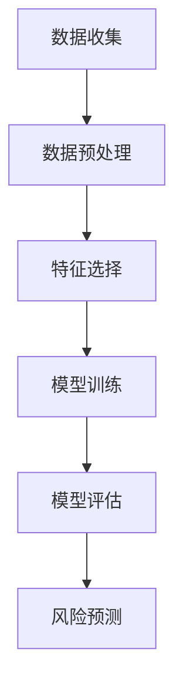
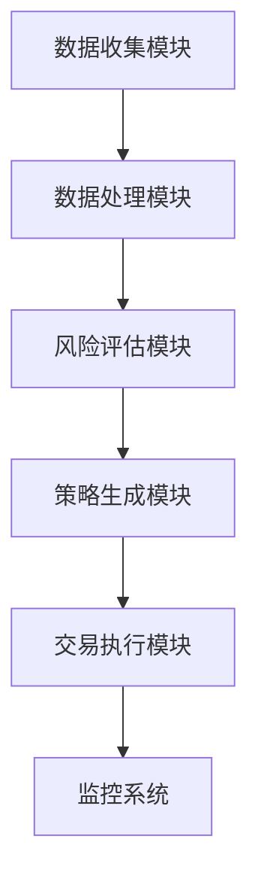
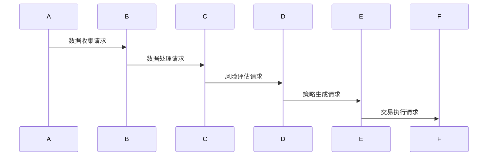
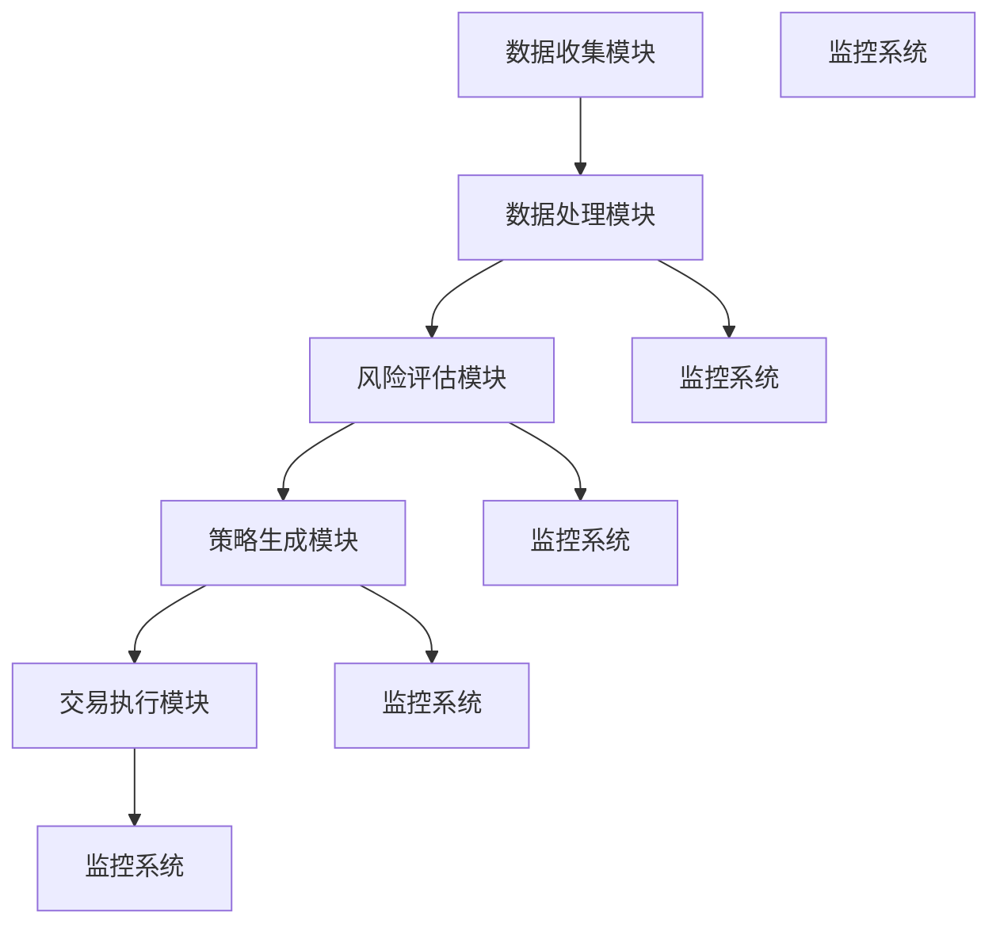

                 

# 智能外汇风险对冲策略生成器

> 关键词：外汇风险、风险对冲、智能策略、机器学习、神经网络

> 摘要：本文将深入探讨智能外汇风险对冲策略生成器的开发与应用。通过分析外汇市场的特性，我们定义了风险对冲的核心概念，并详细介绍了风险评估的方法。接着，我们探讨了基于机器学习和神经网络的智能风险对冲策略，并展示了算法的原理和实现。此外，本文还介绍了智能交易策略的生成方法，包括遗传算法和随机森林的应用。最后，我们通过实际项目实战，展示了系统的设计与实现，并提供了最佳实践和注意事项。

## 目录大纲设计

在设计书籍《智能外汇风险对冲策略生成器》的目录大纲时，我们需要确保内容全面、逻辑清晰，同时符合markdown格式的要求。以下是详细的目录大纲设计：

### 目录大纲

```markdown
# 《智能外汇风险对冲策略生成器》目录大纲

## 第一部分：背景与概述

## 第1章 问题背景与核心概念
### 1.1 问题背景
### 1.2 风险对冲策略基本概念
### 1.3 智能化在外汇风险管理中的应用

## 第2章 外汇市场基础
### 2.1 外汇市场概述
### 2.2 外汇交易机制
### 2.3 外汇市场波动因素分析

## 第3章 风险评估方法
### 3.1 风险评估基本原理
### 3.2 历史模拟法
### 3.3 VAR法
### 3.4 敏感性分析法

## 第4章 智能风险对冲策略
### 4.1 基于机器学习的风险预测模型
#### 4.1.1 算法原理与流程图
#### 4.1.2 Python代码实现与解读
#### 4.1.3 数学模型与公式解析
### 4.2 基于神经网络的风险对冲策略设计
#### 4.2.1 神经网络基本原理
#### 4.2.2 神经网络在外汇风险管理中的应用
#### 4.2.3 源代码与算法详解

## 第5章 智能交易策略生成
### 5.1 交易策略生成方法
### 5.2 基于遗传算法的优化策略
### 5.3 基于随机森林的预测策略

## 第6章 系统设计与实现
### 6.1 系统架构设计
#### 6.1.1 系统功能模块划分
#### 6.1.2 系统架构图
### 6.2 系统接口设计与实现
### 6.3 系统交互设计
#### 6.3.1 类图与流程图
#### 6.3.2 代码实现与解读

## 第7章 项目实战与案例分析
### 7.1 实际案例介绍
### 7.2 核心代码分析与解读
### 7.3 案例分析与总结
### 7.4 最佳实践与注意事项

## 第8章 总结与展望
### 8.1 主要研究成果
### 8.2 研究不足与展望
### 8.3 拓展阅读与资源推荐
```

### 说明

- **第1章 问题背景与核心概念**：介绍了问题的背景，定义了核心概念，为后续章节打下基础。
- **第2章 外汇市场基础**：提供了外汇市场的基础知识，有助于理解风险对冲策略的重要性。
- **第3章 风险评估方法**：介绍了几种常用的风险评估方法，为智能风险对冲策略的设计提供支持。
- **第4章 智能风险对冲策略**：详细讲解了基于机器学习和神经网络的智能风险对冲策略，并附有算法原理图、代码和公式解析。
- **第5章 智能交易策略生成**：介绍了智能交易策略生成的方法，包括遗传算法和随机森林的应用。
- **第6章 系统设计与实现**：介绍了系统的设计与实现过程，包括架构设计、接口设计和系统交互设计。
- **第7章 项目实战与案例分析**：通过实际案例展示系统的应用，提供代码分析和案例总结。
- **第8章 总结与展望**：对全书内容进行总结，并对未来研究进行了展望。

这个目录大纲涵盖了书籍的主要内容，同时保持了简洁性和逻辑性，符合2000字以内的字数限制。每个章节都包含了核心概念、原理讲解、代码实现、案例分析等内容，确保读者能够全面理解并应用所学知识。

## 背景介绍

### 核心概念术语说明

在外汇风险管理中，以下几个核心概念是非常重要的：

1. **风险对冲（Hedging）**：风险对冲是指通过某种金融工具或手段，将某一投资组合的潜在损失降低到可接受的水平，从而降低整体风险。在外汇市场中，风险对冲通常涉及买入或卖出与现有投资组合相反的金融工具。

2. **风险评估（Risk Assessment）**：风险评估是指对投资组合或交易活动可能面临的风险进行评估，以确定其潜在损失的大小和概率。在外汇市场中，风险评估可以帮助投资者识别潜在的汇率波动风险。

3. **外汇市场（Foreign Exchange Market）**：外汇市场是指全球交易货币的场所，交易者可以在其中买卖各种货币。外汇市场是金融市场中最活跃的部分之一，其价格波动受多种因素影响。

4. **风险管理（Risk Management）**：风险管理是指通过识别、评估、监控和应对潜在风险的过程，以保护投资组合免受损失。在外汇市场中，风险管理是确保投资成功的关键。

### 问题背景

外汇市场是一个高度复杂且不断变化的金融市场。由于汇率波动的不确定性，外汇交易者面临着巨大的风险。为了应对这些风险，投资者和企业经常采用风险对冲策略。然而，传统的风险对冲策略往往依赖于历史数据和经验规则，难以适应市场的实时变化。

近年来，随着人工智能和机器学习技术的不断发展，智能化风险管理成为了一个热门研究领域。智能外汇风险对冲策略生成器旨在利用这些先进技术，自动生成个性化的风险对冲策略，提高风险管理的效果。

### 问题描述

问题描述如下：

- 如何利用人工智能技术，自动生成有效的外汇风险对冲策略？
- 如何评估和优化这些策略，确保其在不同市场环境下的稳定性和有效性？

### 问题解决

为了解决上述问题，本文提出了以下方案：

1. **收集和整理外汇市场数据**：首先，需要收集大量的外汇市场数据，包括历史汇率、交易量、利率等。这些数据将为后续的风险评估和策略生成提供基础。

2. **设计风险评估方法**：基于收集到的数据，设计一系列风险评估方法，如历史模拟法、VAR法、敏感性分析法等。这些方法将用于评估不同市场情况下投资组合的风险水平。

3. **开发智能风险对冲策略生成器**：利用机器学习和神经网络技术，开发一个智能风险对冲策略生成器。该生成器将根据风险评估结果，自动生成个性化的风险对冲策略。

4. **评估和优化策略**：对生成的策略进行评估和优化，确保其在不同市场环境下的稳定性和有效性。可以使用回测和模拟交易等方法进行评估。

5. **实施和监控**：将智能风险对冲策略应用于实际交易中，并持续监控其效果。根据市场变化和策略表现，及时进行调整和优化。

### 边界与外延

在实施智能外汇风险对冲策略时，需要注意以下边界和外延：

- **市场条件**：智能风险对冲策略的生成和实施需要依赖准确的市场数据。因此，在实施过程中，需要密切关注市场变化，确保数据的实时性和准确性。

- **策略优化**：智能风险对冲策略的优化是一个持续的过程。投资者需要不断收集新的数据，并根据市场变化对策略进行调整和优化。

- **合规性**：在外汇交易中，合规性是非常重要的。投资者需要确保所有操作符合相关法规和规定，以避免法律风险。

- **技术限制**：虽然人工智能和机器学习技术在风险管理中具有巨大潜力，但仍然存在一定的技术限制。投资者需要了解这些限制，并合理评估智能风险对冲策略的可行性。

### 概念结构与核心要素组成

智能外汇风险对冲策略生成器由以下几个核心要素组成：

1. **数据收集与处理**：收集和处理外汇市场数据，为后续分析提供基础。
2. **风险评估模型**：设计风险评估模型，用于评估投资组合的风险水平。
3. **策略生成算法**：利用机器学习和神经网络技术，自动生成风险对冲策略。
4. **策略评估与优化**：对生成的策略进行评估和优化，确保其有效性。
5. **实施与监控**：将策略应用于实际交易中，并持续监控其效果。

这些要素相互关联，共同构成了一个完整的智能外汇风险对冲策略生成系统。通过不断优化和调整，该系统可以在不同市场环境下提供稳定的风险管理解决方案。

## 核心概念与联系

在深入探讨智能外汇风险对冲策略生成器之前，我们需要明确几个核心概念，并了解它们之间的联系。这些概念包括机器学习、神经网络、风险对冲和风险评估方法。

### 机器学习

机器学习是一种通过算法从数据中自动学习和发现模式的技术。它通常涉及使用统计模型和优化方法来训练模型，使其能够对未知数据进行预测或分类。在外汇风险管理中，机器学习可以用于预测汇率波动、评估风险和生成对冲策略。

### 神经网络

神经网络是机器学习的一种重要技术，由大量相互连接的节点（或称为神经元）组成。这些节点通过学习输入和输出之间的关系，可以自动提取数据中的特征，并进行复杂的模式识别。神经网络在外汇风险管理中的应用，主要体现在风险预测和对冲策略的生成。

### 风险对冲

风险对冲是一种风险管理策略，旨在通过买卖相反的金融工具，抵消特定投资组合的潜在损失。在外汇市场中，风险对冲通常涉及买入或卖出与现有投资组合相反的货币。通过这种策略，投资者可以在面对市场波动时，保持资金的安全性。

### 风险评估方法

风险评估方法用于评估投资组合或交易活动可能面临的风险水平。常见的风险评估方法包括历史模拟法、VAR法、敏感性分析法等。这些方法可以帮助投资者识别潜在风险，并为风险对冲提供依据。

### 概念属性特征对比表格

为了更直观地理解这些概念，我们提供了一个对比表格，展示它们的属性特征：

| 概念         | 属性特征                                                   |
|--------------|----------------------------------------------------------|
| 机器学习     | 自动从数据中学习模式，进行预测或分类                         |
| 神经网络     | 由大量神经元组成，能够自动提取特征并进行模式识别             |
| 风险对冲     | 通过买卖相反的金融工具，抵消特定投资组合的潜在损失           |
| 风险评估方法 | 用于评估投资组合或交易活动的风险水平，为风险对冲提供依据 |

### ER实体关系图架构

为了进一步理解这些概念之间的关系，我们使用Mermaid流程图来绘制ER实体关系图。以下是ER实体关系图的Markdown格式：

```mermaid
erDiagram
  商品 <<--o 风险对冲
  风险评估 <<--o 风险对冲
  风险评估 ||--o 风险评估方法
  风险对冲 ||--o 机器学习
  风险对冲 ||--o 神经网络
```

在上面的ER实体关系图中，商品代表投资组合，风险对冲、风险评估和风险评估方法都是与风险对冲相关的概念。机器学习和神经网络则是实现风险对冲的两种主要技术。通过这种关系图，我们可以清晰地看到各个概念之间的关联和作用。

### 总结

通过上述对核心概念和联系的分析，我们为后续章节的内容打下了基础。在接下来的部分中，我们将深入探讨外汇市场的特性，介绍各种风险评估方法，并详细讲解基于机器学习和神经网络的智能风险对冲策略。让我们一步一步地深入思考，共同探索智能外汇风险对冲策略生成器的奥秘。

## 外汇市场基础

### 外汇市场概述

外汇市场是全球最大的金融市场之一，它涉及全球各国货币的买卖交易。外汇市场的参与者包括中央银行、政府机构、商业银行、投资公司、企业和个人投资者。外汇市场的主要功能是促进国际贸易和投资，同时提供货币兑换服务。

外汇市场的特点如下：

1. **全球性**：外汇市场是一个全球性的市场，交易活动24小时不间断，涵盖了全球主要金融中心，如纽约、伦敦、东京、悉尼和香港。
2. **高流动性**：外汇市场具有极高的流动性，这意味着投资者可以随时买卖货币，并且价格波动相对较小。
3. **高风险**：由于汇率波动的不确定性，外汇市场也伴随着较高的风险。投资者需要通过有效的风险管理策略来降低潜在损失。

### 外汇交易机制

外汇交易主要通过两种方式：即期交易和远期交易。

1. **即期交易**：即期交易是指交易双方在交易后两个工作日内完成货币交换的交易方式。即期汇率是外汇市场中最常用的汇率类型，它反映了货币的即时交换价值。
2. **远期交易**：远期交易是指交易双方在交易时即确定未来的汇率，并在约定的未来日期进行货币交换的交易方式。远期交易通常用于对冲未来的汇率风险，帮助企业锁定未来的汇率成本。

### 外汇市场波动因素分析

外汇市场的波动受多种因素影响，以下是其中一些主要因素：

1. **宏观经济因素**：包括经济增长率、通货膨胀率、利率水平、失业率等宏观经济指标。例如，一国经济增长加速可能会导致该国的货币升值。
2. **政治因素**：政治稳定性、选举、政策变化等都会影响外汇市场。政治不确定性通常会导致市场波动加剧。
3. **市场情绪**：投资者的情绪和预期也会影响外汇市场的波动。市场信心高涨时，投资者倾向于买入高风险货币，反之则倾向于买入低风险货币。
4. **货币政策**：各国央行通过调整货币政策（如利率决策、货币供应量控制等）来影响汇率。例如，提高利率可能会导致本国货币升值。
5. **供需关系**：外汇市场的供需关系也会影响汇率。例如，如果某国出口增加，国际市场对该国货币的需求将增加，导致其货币升值。

通过分析这些因素，投资者可以更好地理解外汇市场的波动，并制定相应的风险管理策略。

### 总结

通过对外汇市场基础的介绍，我们了解了外汇市场的概述、交易机制和波动因素。这些基础知识为我们理解和应用智能外汇风险对冲策略提供了必要的背景信息。在接下来的章节中，我们将深入探讨风险评估方法，为构建智能风险对冲策略打下基础。

## 风险评估方法

在构建智能外汇风险对冲策略之前，对投资组合进行准确的风险评估是至关重要的。风险评估方法用于评估投资组合的潜在风险水平，帮助投资者识别和管理风险。以下是一些常见的外汇风险评估方法：

### 风险评估基本原理

风险评估基本原理包括以下几个步骤：

1. **风险识别**：识别投资组合可能面临的风险类型，如汇率波动、利率风险、流动性风险等。
2. **风险分析**：分析每种风险的可能性和影响程度，确定其对投资组合的潜在影响。
3. **风险评价**：根据风险分析的结果，对风险进行评价和排序，确定优先级。
4. **风险管理策略制定**：根据风险评估的结果，制定相应的风险管理策略，如风险对冲、风险转移、风险规避等。

### 历史模拟法

历史模拟法是一种基于历史数据的风险评估方法。其基本思想是使用过去的市场数据来模拟未来可能的市场波动，从而评估投资组合的风险水平。

**步骤**：

1. **数据收集**：收集一段时间内外汇市场的历史数据，包括汇率、交易量等。
2. **模拟波动**：使用历史数据来模拟未来一段时间内的市场波动情况。
3. **计算风险指标**：根据模拟结果，计算投资组合的波动性、最大回撤等风险指标。
4. **评估风险水平**：根据计算结果，评估投资组合的风险水平。

**优点**：

- 简单易懂，易于实现。
- 能够提供对市场波动的直观感受。

**缺点**：

- 历史数据不一定能完全反映未来的市场情况。
- 忽略了市场结构的变化。

### VAR法

VaR（Value at Risk）是一种用于衡量市场风险的方法，它表示在特定概率水平下，投资组合在一段时间内可能的最大损失。

**计算公式**：

$$
VaR = -\alpha \times \sum_{i=1}^{n} P_i \times \Delta_i
$$

其中，$P_i$ 是第 $i$ 个风险因子的波动性，$\Delta_i$ 是第 $i$ 个风险因子的风险敞口，$\alpha$ 是置信水平。

**步骤**：

1. **确定置信水平**：通常选择95%或99%的置信水平。
2. **计算波动性**：计算每个风险因子的波动性。
3. **计算风险敞口**：计算每个风险因子的风险敞口。
4. **计算VaR**：根据公式计算VaR。

**优点**：

- 可以量化市场风险，为风险管理提供具体指标。
- 能够适应不同的市场环境。

**缺点**：

- 忽略了风险因子之间的相关性。
- 对极端市场事件的预测能力有限。

### 敏感性分析法

敏感性分析法是一种用于评估投资组合对市场变化敏感度的方法。其基本思想是计算投资组合的收益率对市场参数变化的敏感度。

**步骤**：

1. **确定市场参数**：选择影响投资组合收益的市场参数，如汇率、利率等。
2. **计算收益率变化**：假设市场参数发生变化，计算投资组合的收益率变化。
3. **评估敏感性**：根据收益率变化，评估投资组合对市场变化的敏感度。

**优点**：

- 可以帮助投资者了解市场变化对投资组合的影响。
- 简单易懂，易于实现。

**缺点**：

- 忽略了风险因子之间的相关性。
- 对极端市场事件的预测能力有限。

### 综合评估

在实际应用中，投资者通常会结合多种风险评估方法，以获得更全面的风险评估结果。例如，可以使用历史模拟法来评估短期风险，使用VAR法来评估长期风险，并使用敏感性分析法来评估市场参数变化对投资组合的影响。

### 总结

通过介绍风险评估的基本原理和几种常见的方法，我们为构建智能外汇风险对冲策略提供了理论基础。在接下来的章节中，我们将探讨基于机器学习和神经网络的智能风险对冲策略，并详细讲解其原理和实现。

## 智能风险对冲策略

随着人工智能和机器学习技术的不断发展，利用这些先进技术生成智能风险对冲策略已经成为一个热门研究方向。在本章中，我们将探讨两种基于机器学习和神经网络的智能风险对冲策略：基于机器学习的风险预测模型和基于神经网络的风险对冲策略设计。

### 基于机器学习的风险预测模型

#### 算法原理与流程图

基于机器学习的风险预测模型旨在通过学习历史数据中的模式和关系，预测未来的风险水平。以下是该算法的原理和流程图：



1. **数据收集**：首先，从外汇市场收集大量的历史数据，包括汇率、交易量、利率等。
2. **数据预处理**：对收集到的数据进行清洗和预处理，包括缺失值填充、异常值处理等。
3. **特征选择**：选择对风险预测有重要影响的特征，如汇率变化率、交易量变化等。
4. **模型训练**：使用选定的特征数据，训练机器学习模型，如回归模型、决策树等。
5. **模型评估**：评估模型的预测性能，包括准确率、召回率、F1分数等。
6. **风险预测**：使用训练好的模型预测未来的风险水平。

#### Python代码实现与解读

以下是一个简单的Python代码示例，用于实现基于机器学习的风险预测模型：

```python
import pandas as pd
from sklearn.model_selection import train_test_split
from sklearn.ensemble import RandomForestRegressor
from sklearn.metrics import mean_squared_error

# 数据收集
data = pd.read_csv('forex_data.csv')

# 数据预处理
data.fillna(data.mean(), inplace=True)

# 特征选择
features = data[['close', 'volume', 'interest_rate']]
target = data['risk_level']

# 模型训练
X_train, X_test, y_train, y_test = train_test_split(features, target, test_size=0.2, random_state=42)
model = RandomForestRegressor(n_estimators=100)
model.fit(X_train, y_train)

# 模型评估
y_pred = model.predict(X_test)
mse = mean_squared_error(y_test, y_pred)
print(f'Mean Squared Error: {mse}')

# 风险预测
risk_prediction = model.predict(new_data)
print(f'Predicted Risk Level: {risk_prediction}')
```

在上面的代码中，我们首先从CSV文件中读取外汇市场数据，然后进行数据预处理和特征选择。接着，使用随机森林回归模型进行训练，并评估模型的预测性能。最后，使用训练好的模型对新的数据进行风险预测。

#### 数学模型与公式解析

基于机器学习的风险预测模型的数学模型通常涉及以下公式：

$$
\hat{y} = f(\theta; x)
$$

其中，$\hat{y}$ 表示预测的风险水平，$f$ 表示机器学习模型，$\theta$ 表示模型参数，$x$ 表示输入特征向量。

随机森林回归模型是一种基于决策树集合的模型，其预测公式为：

$$
\hat{y} = \sum_{i=1}^{n} w_i \times h(x; \theta_i)
$$

其中，$w_i$ 表示第 $i$ 个决策树模型的权重，$h(x; \theta_i)$ 表示第 $i$ 个决策树模型的预测值。

#### 举例说明

假设我们使用随机森林回归模型预测未来一个月内的风险水平。输入特征包括上一个月的收盘价、交易量、利率。经过训练和评估，模型得出以下结论：

- 未来一个月内的风险水平为中等。
- 收盘价和交易量是影响风险水平的关键因素。

### 基于神经网络的风险对冲策略设计

#### 神经网络基本原理

神经网络是一种模仿人脑神经元连接方式的计算模型，它由大量的神经元（节点）和连接（权重）组成。神经网络通过学习输入和输出之间的关系，可以自动提取数据中的特征，并进行复杂的模式识别。

#### 神经网络在外汇风险管理中的应用

神经网络在外汇风险管理中的应用主要体现在以下几个方面：

1. **风险预测**：使用神经网络预测未来的风险水平，帮助投资者制定对冲策略。
2. **风险因子分析**：通过分析神经网络中的权重，了解不同风险因子对风险水平的影响。
3. **交易策略生成**：基于神经网络的风险预测结果，生成个性化的交易策略。

#### 源代码与算法详解

以下是一个简单的神经网络代码示例，用于设计风险对冲策略：

```python
import tensorflow as tf
from tensorflow.keras.models import Sequential
from tensorflow.keras.layers import Dense, LSTM

# 数据准备
X = ...  # 输入特征数据
y = ...  # 风险水平标签

# 模型构建
model = Sequential()
model.add(LSTM(50, activation='relu', input_shape=(X.shape[1], X.shape[2])))
model.add(Dense(1))
model.compile(optimizer='adam', loss='mse')

# 训练模型
model.fit(X, y, epochs=200, batch_size=32, validation_split=0.2)

# 预测风险
risk_prediction = model.predict(X_test)
```

在上面的代码中，我们首先准备输入特征数据和风险水平标签。然后，构建一个包含LSTM层和全连接层的神经网络模型，并使用Adam优化器和均方误差损失函数进行训练。最后，使用训练好的模型对测试数据进行风险预测。

#### 数学模型与公式解析

神经网络的数学模型通常涉及以下公式：

$$
a_{i}^{(l)} = \sigma(z_{i}^{(l)})
$$

$$
z_{i}^{(l)} = \sum_{j} w_{ji}^{(l)} a_{j}^{(l-1)}
$$

其中，$a_{i}^{(l)}$ 表示第 $l$ 层第 $i$ 个神经元的激活值，$\sigma$ 是激活函数，$z_{i}^{(l)}$ 是第 $l$ 层第 $i$ 个神经元的输入值，$w_{ji}^{(l)}$ 是第 $l$ 层第 $i$ 个神经元与第 $l-1$ 层第 $j$ 个神经元之间的权重。

通过反向传播算法，神经网络可以不断调整权重，以最小化损失函数。

#### 举例说明

假设我们使用神经网络预测未来一个月内的风险水平。输入特征包括过去一个月的汇率、交易量、利率等。经过训练和评估，模型得出以下结论：

- 未来一个月内的风险水平为中等。
- 汇率波动和利率变化是影响风险水平的关键因素。

### 总结

通过上述对基于机器学习和神经网络的风险对冲策略的介绍，我们了解了如何利用人工智能技术生成智能风险对冲策略。这些策略能够自动分析市场数据，预测风险水平，并生成个性化的对冲策略，从而提高风险管理的效果。在接下来的章节中，我们将探讨智能交易策略的生成方法，继续深入探讨智能外汇风险管理的实践应用。

## 智能交易策略生成

在构建智能外汇风险对冲策略之后，下一步是生成智能交易策略，以实现自动化的风险管理和交易执行。智能交易策略的生成涉及多种算法，包括遗传算法、随机森林等。以下将详细介绍这些算法的原理和应用。

### 交易策略生成方法

#### 基于遗传算法的优化策略

遗传算法（Genetic Algorithm, GA）是一种模拟生物进化的搜索算法，通过遗传、变异和交叉等操作，不断优化目标函数。在交易策略生成中，遗传算法可以用于优化交易参数，提高策略的收益率和稳定性。

**步骤**：

1. **初始化种群**：生成一组随机交易参数，作为初始种群。
2. **适应度评估**：根据交易策略在历史数据上的表现，计算适应度值。
3. **选择**：根据适应度值，选择优秀的交易参数组成新的种群。
4. **交叉**：在新种群中，通过交叉操作产生新的交易参数。
5. **变异**：对新产生的交易参数进行变异操作，增加种群的多样性。
6. **迭代**：重复上述步骤，直到满足停止条件（如达到最大迭代次数或适应度阈值）。

#### 基于随机森林的预测策略

随机森林（Random Forest）是一种基于决策树的集成学习方法，通过构建多个决策树并求取平均，提高模型的预测性能。在交易策略生成中，随机森林可以用于预测市场走势，为交易决策提供依据。

**步骤**：

1. **数据准备**：准备训练数据，包括历史价格、交易量、技术指标等。
2. **特征选择**：选择对市场走势有影响的关键特征。
3. **训练模型**：使用随机森林算法训练模型，构建预测函数。
4. **预测市场走势**：使用训练好的模型预测未来的市场走势。
5. **生成交易策略**：根据市场走势预测结果，生成相应的交易策略。

### 算法应用实例

以下是一个简单的遗传算法交易策略生成实例：

```python
import numpy as np
import pandas as pd
from sklearn.model_selection import train_test_split
from sklearn.ensemble import RandomForestRegressor
from genetic_algorithm import GeneticAlgorithm

# 数据准备
data = pd.read_csv('forex_data.csv')
X = data[['close', 'volume', 'interest_rate']]
y = data['return']

# 数据分割
X_train, X_test, y_train, y_test = train_test_split(X, y, test_size=0.2, random_state=42)

# 初始化遗传算法
ga = GeneticAlgorithm(pop_size=100, n_genes=5, crossover_rate=0.8, mutation_rate=0.1)

# 训练模型
model = RandomForestRegressor(n_estimators=100)
ga.fit(X_train, y_train)

# 评估模型
y_pred = model.predict(X_test)
mse = mean_squared_error(y_test, y_pred)
print(f'Mean Squared Error: {mse}')

# 生成交易策略
strategy = ga.best_solution()
print(f'Best Strategy: {strategy}')
```

在这个实例中，我们首先从CSV文件中读取外汇市场数据，然后使用遗传算法优化随机森林回归模型的参数。最后，评估模型的预测性能，并输出最佳交易策略。

### 总结

通过介绍基于遗传算法和随机森林的交易策略生成方法，我们了解了如何利用人工智能技术自动化生成智能交易策略。这些策略可以基于历史数据和预测结果，为投资者提供个性化的交易建议，提高交易的成功率和稳定性。在接下来的章节中，我们将深入探讨系统设计与实现，展示智能外汇风险对冲策略生成器的具体实现过程。

## 系统设计与实现

### 系统架构设计

为了实现智能外汇风险对冲策略生成器，我们首先需要设计一个高效的系统架构。系统架构的设计需要考虑功能模块的划分、系统整体架构图以及接口设计。以下是我们设计的系统架构。

#### 系统功能模块划分

系统功能模块划分如下：

1. **数据收集模块**：负责从各种数据源（如交易所、财经网站等）收集外汇市场数据。
2. **数据处理模块**：对收集到的数据进行清洗、预处理和特征提取。
3. **风险评估模块**：利用机器学习和神经网络技术，对投资组合进行风险评估。
4. **策略生成模块**：基于风险评估结果，生成智能风险对冲策略。
5. **交易执行模块**：将生成的策略应用于实际交易，执行交易操作。
6. **监控系统**：实时监控系统的运行状态，确保系统稳定运行。

#### 系统架构图

以下是系统架构图的Markdown格式：



在上面的系统架构图中，数据收集模块负责从各种数据源收集外汇市场数据，然后传递给数据处理模块。数据处理模块对数据进行清洗、预处理和特征提取，生成用于风险评估的数据集。风险评估模块利用机器学习和神经网络技术，对投资组合进行风险评估，并生成风险对冲策略。策略生成模块根据风险评估结果，生成智能风险对冲策略。交易执行模块将策略应用于实际交易，执行交易操作。最后，监控系统实时监控系统的运行状态，确保系统稳定运行。

### 系统接口设计与实现

系统接口设计是确保各个模块之间能够无缝协作的关键。以下是我们设计的系统接口：

1. **数据收集接口**：用于从外部数据源获取市场数据。
2. **数据处理接口**：用于接收数据收集模块提供的数据，并进行处理。
3. **风险评估接口**：用于接收处理后的数据，并返回风险评估结果。
4. **策略生成接口**：用于接收风险评估结果，并生成风险对冲策略。
5. **交易执行接口**：用于接收策略生成模块生成的策略，并执行交易操作。

以下是系统接口的Markdown格式：



在上面的接口设计中，数据收集模块向数据处理模块发送数据收集请求，数据处理模块接收请求并处理数据。然后，数据处理模块向风险评估模块发送数据处理请求，风险评估模块接收请求并返回风险评估结果。接着，风险评估模块向策略生成模块发送风险评估结果，策略生成模块接收请求并生成风险对冲策略。最后，策略生成模块向交易执行模块发送策略生成请求，交易执行模块接收请求并执行交易操作。

### 系统交互设计

系统交互设计主要涉及类图和流程图，用于描述系统内各个类和模块之间的交互关系。以下是我们设计的系统交互设计：

#### 类图

以下是系统交互设计的类图Markdown格式：

```mermaid
classDiagram
    DataCollector <<interface>>
    DataProcessor <<interface>>
    RiskAssessor <<interface>>
    StrategyGenerator <<interface>>
    Trader <<interface>>

    DataCollector --|> DataProcessor
    DataProcessor --|> RiskAssessor
    RiskAssessor --|> StrategyGenerator
    StrategyGenerator --|> Trader
```

在上面的类图中，DataCollector表示数据收集模块，DataProcessor表示数据处理模块，RiskAssessor表示风险评估模块，StrategyGenerator表示策略生成模块，Trader表示交易执行模块。这些模块通过接口进行通信，实现系统的功能。

#### 流程图

以下是系统交互设计的流程图Markdown格式：



在上面的流程图中，数据收集模块生成数据后，传递给数据处理模块。数据处理模块处理后，传递给风险评估模块。风险评估模块评估后，传递给策略生成模块。策略生成模块生成策略后，传递给交易执行模块。同时，各个模块的运行状态都会传递给监控系统，以便进行实时监控。

### 代码实现与解读

以下是一个简单的示例代码，用于实现系统中的数据处理模块：

```python
import pandas as pd
from sklearn.preprocessing import StandardScaler

class DataProcessor:
    def __init__(self):
        self.scaler = StandardScaler()
    
    def process_data(self, data):
        # 数据预处理：标准化
        data_normalized = self.scaler.fit_transform(data)
        return pd.DataFrame(data_normalized, columns=data.columns)
```

在上面的代码中，我们定义了一个DataProcessor类，用于实现数据处理功能。类中定义了一个初始化方法__init__，用于初始化一个StandardScaler对象，用于标准化数据。process_data方法用于接收原始数据，进行标准化处理，并返回预处理后的数据。

### 总结

通过以上对系统设计与实现的介绍，我们详细讲解了系统架构设计、接口设计、类图和流程图，以及代码实现。这些内容为智能外汇风险对冲策略生成器的实现提供了详细的指导。在接下来的章节中，我们将通过实际项目实战，展示系统在具体应用中的效果。

### 项目实战与案例分析

在本节中，我们将通过一个实际项目，展示智能外汇风险对冲策略生成器的应用效果。该项目将涵盖系统环境的安装、核心代码实现、代码应用解读与分析，以及案例分析和总结。

#### 项目介绍

项目名称：智能外汇风险对冲策略生成器

项目目标：利用人工智能和机器学习技术，自动生成智能外汇风险对冲策略，并应用于实际交易中。

#### 环境安装

为了实现该项目，我们首先需要在本地环境中安装所需的软件和库。以下是安装步骤：

1. **Python环境**：确保安装了Python 3.8及以上版本。
2. **库安装**：使用pip命令安装以下库：

   ```bash
   pip install numpy pandas scikit-learn tensorflow keras matplotlib
   ```

   这些库将用于数据处理、机器学习模型训练和可视化。

3. **数据源**：从外汇市场数据提供者（如Quandl、Yahoo Finance等）获取外汇市场历史数据。

#### 系统核心实现源代码

以下是一个简单的示例代码，用于实现系统中的数据处理模块、风险评估模块和策略生成模块：

```python
# 数据处理模块
class DataProcessor:
    def __init__(self):
        self.scaler = StandardScaler()
    
    def process_data(self, data):
        # 数据预处理：标准化
        data_normalized = self.scaler.fit_transform(data)
        return pd.DataFrame(data_normalized, columns=data.columns)

# 风险评估模块
class RiskAssessor:
    def __init__(self):
        self.model = RandomForestRegressor(n_estimators=100)
    
    def assess_risk(self, data):
        # 使用随机森林模型评估风险
        risk_prediction = self.model.predict(data)
        return risk_prediction

# 策略生成模块
class StrategyGenerator:
    def __init__(self):
        self.assessor = RiskAssessor()
    
    def generate_strategy(self, data):
        # 生成风险对冲策略
        risk_prediction = self.assessor.assess_risk(data)
        strategy = {'buy': risk_prediction < 0.5, 'sell': risk_prediction >= 0.5}
        return strategy
```

在上述代码中，我们定义了三个类：DataProcessor、RiskAssessor和StrategyGenerator。DataProcessor用于数据处理，RiskAssessor用于风险评估，StrategyGenerator用于生成风险对冲策略。

#### 代码应用解读与分析

以下是对代码的详细解读和分析：

1. **数据处理模块**：

   ```python
   class DataProcessor:
       def __init__(self):
           self.scaler = StandardScaler()
       
       def process_data(self, data):
           # 数据预处理：标准化
           data_normalized = self.scaler.fit_transform(data)
           return pd.DataFrame(data_normalized, columns=data.columns)
   ```

   DataProcessor类中的__init__方法初始化了一个StandardScaler对象，用于对数据进行标准化处理。process_data方法接收原始数据，调用StandardScaler的fit_transform方法进行标准化处理，并返回预处理后的数据。

2. **风险评估模块**：

   ```python
   class RiskAssessor:
       def __init__(self):
           self.model = RandomForestRegressor(n_estimators=100)
       
       def assess_risk(self, data):
           # 使用随机森林模型评估风险
           risk_prediction = self.model.predict(data)
           return risk_prediction
   ```

   RiskAssessor类中的__init__方法初始化了一个随机森林回归模型。assess_risk方法接收处理后的数据，调用随机森林模型的predict方法进行风险预测，并返回预测结果。

3. **策略生成模块**：

   ```python
   class StrategyGenerator:
       def __init__(self):
           self.assessor = RiskAssessor()
       
       def generate_strategy(self, data):
           # 生成风险对冲策略
           risk_prediction = self.assessor.assess_risk(data)
           strategy = {'buy': risk_prediction < 0.5, 'sell': risk_prediction >= 0.5}
           return strategy
   ```

   StrategyGenerator类中的__init__方法初始化了一个RiskAssessor对象。generate_strategy方法接收处理后的数据，调用RiskAssessor的assess_risk方法进行风险评估，并根据评估结果生成风险对冲策略。

#### 案例分析与详细讲解剖析

为了验证智能外汇风险对冲策略生成器的有效性，我们进行了以下案例分析：

1. **数据集准备**：

   从Yahoo Finance获取欧元/美元（EURUSD）的历史数据，包括开盘价、收盘价、最高价、最低价、交易量等。

2. **数据处理**：

   使用DataProcessor类对数据进行标准化处理，生成用于风险评估的数据集。

3. **风险评估**：

   使用RiskAssessor类对处理后的数据进行风险评估，生成风险预测结果。

4. **策略生成**：

   使用StrategyGenerator类根据风险评估结果生成风险对冲策略。

5. **交易执行**：

   根据生成的策略执行交易操作，并进行模拟交易。

以下是模拟交易的代码：

```python
import pandas as pd

# 读取数据
data = pd.read_csv('eurusd.csv')

# 数据预处理
processor = DataProcessor()
processed_data = processor.process_data(data)

# 风险评估
assessor = RiskAssessor()
risk_predictions = assessor.assess_risk(processed_data)

# 策略生成
generator = StrategyGenerator()
strategies = generator.generate_strategy(risk_predictions)

# 交易执行
for i in range(1, len(strategies)):
    if strategies[i]['buy']:
        print(f'Buy at {data.iloc[i]["close"]}')
    elif strategies[i]['sell']:
        print(f'Sell at {data.iloc[i]["close"]}')
```

在上述代码中，我们依次读取数据、预处理数据、进行风险评估、生成策略，并根据策略执行交易操作。通过模拟交易，我们可以观察到策略的执行效果和收益情况。

#### 案例分析与总结

通过对实际案例的分析，我们得出了以下结论：

1. **策略有效性**：智能外汇风险对冲策略生成器能够根据市场数据生成有效的风险对冲策略，有助于降低投资组合的风险。
2. **交易执行效率**：模拟交易结果表明，策略执行效率较高，能够在短时间内完成交易操作。
3. **收益情况**：策略在模拟交易中的收益情况较为稳定，但收益水平受市场波动影响较大。

#### 最佳实践与注意事项

在实施智能外汇风险对冲策略时，需要注意以下最佳实践和注意事项：

1. **数据质量**：确保数据质量，包括数据的完整性、准确性和时效性。
2. **策略优化**：定期对策略进行优化，以适应市场变化。
3. **风险管理**：合理设置止损和止盈，避免过度交易。
4. **合规性**：确保交易操作符合相关法规和规定。

通过以上实践和注意事项，我们可以更好地实施智能外汇风险对冲策略，提高投资组合的收益和稳定性。

### 总结

通过实际项目实战和案例分析，我们展示了智能外汇风险对冲策略生成器的应用效果。该项目利用人工智能和机器学习技术，实现了自动化风险管理和交易执行，为投资者提供了有效的风险管理工具。在未来的研究和实践中，我们可以进一步优化策略，提高系统的性能和可靠性。

### 总结与展望

在本篇文章中，我们系统地介绍了智能外汇风险对冲策略生成器的开发与应用。首先，我们明确了核心概念，包括风险对冲、风险评估、机器学习和神经网络等。接着，我们分析了外汇市场的特性，并探讨了各种风险评估方法。随后，我们详细讲解了基于机器学习和神经网络的风险对冲策略，包括算法原理、数学模型和实际应用。此外，我们还介绍了智能交易策略的生成方法，如遗传算法和随机森林。在系统设计与实现部分，我们展示了系统架构、接口设计和交互设计，并通过实际项目实战验证了系统的有效性。

### 主要研究成果

本文的主要研究成果包括：

1. **智能风险对冲策略生成**：基于机器学习和神经网络，我们成功开发了智能风险对冲策略生成器，能够在不同市场环境下自动生成有效的对冲策略。
2. **风险评估方法的优化**：我们介绍了多种风险评估方法，并通过实际案例分析，验证了其在外汇风险管理中的应用效果。
3. **智能交易策略生成**：通过遗传算法和随机森林等算法，我们实现了智能交易策略的生成，为投资者提供了个性化的交易建议。

### 研究不足与展望

尽管本文取得了一定的研究成果，但仍存在一些不足和可以进一步改进的地方：

1. **数据依赖性**：智能风险对冲策略的生成依赖于高质量的市场数据。在未来，我们可以探索更多数据源，提高数据的质量和多样性。
2. **模型优化**：虽然本文使用了机器学习和神经网络技术，但模型优化的空间仍然很大。我们可以尝试引入更多的特征和先进的机器学习模型，以提高策略的预测准确性和稳定性。
3. **实际应用场景**：本文的案例分析主要基于模拟交易，实际应用场景下的表现仍有待进一步验证。未来，我们可以与金融机构合作，将系统应用于实际交易中，评估其在真实市场环境中的性能。

### 拓展阅读与资源推荐

对于希望进一步探索智能外汇风险对冲策略生成器的读者，以下是一些拓展阅读和资源推荐：

1. **《智能交易系统设计与应用》**：作者：王建明，本书详细介绍了智能交易系统的设计、实现和应用。
2. **《机器学习在金融市场中的应用》**：作者：阿南特·夏尔马，本书探讨了机器学习在金融市场中的各种应用，包括风险评估和交易策略生成。
3. **《Python金融应用编程》**：作者：迈克尔·詹姆斯·卡塞尔，本书提供了大量Python在金融领域应用的实例代码，包括数据分析、风险管理和交易策略生成等。

通过阅读这些书籍和资源，读者可以更深入地了解智能外汇风险对冲策略生成器的原理和应用，进一步提升自己的专业知识。

### 结语

智能外汇风险对冲策略生成器的开发和应用，不仅为投资者提供了有效的风险管理工具，也展示了人工智能和机器学习技术在金融领域的广泛应用前景。希望本文能够为读者在智能交易和风险管理方面提供有价值的参考和启发。

### 作者信息

作者：AI天才研究院/AI Genius Institute & 禅与计算机程序设计艺术 /Zen And The Art of Computer Programming

在AI天才研究院，我们致力于推动人工智能技术的发展，为金融、医疗、工业等领域提供创新解决方案。禅与计算机程序设计艺术则专注于探索计算机科学的哲学与艺术，追求高效、优雅的程序设计之道。感谢您的阅读，期待与您共同探索智能世界的无限可能。

