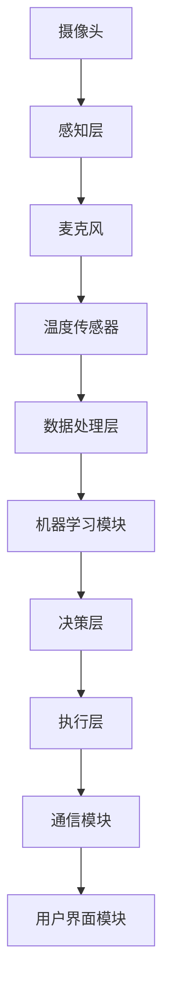
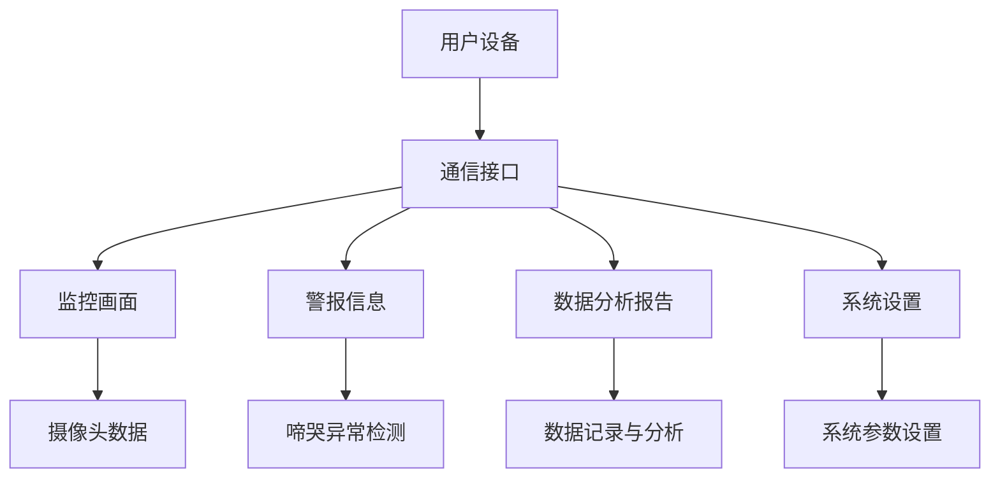
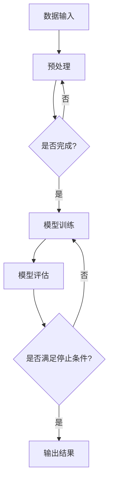

                 


# 智能婴儿监视器：AI Agent的啼哭原因分析

## 关键词

- 智能婴儿监视器
- AI Agent
- 婴儿啼哭原因分析
- 机器学习
- 数据处理
- 信号处理

## 摘要

本文深入探讨了智能婴儿监视器中AI Agent对婴儿啼哭原因的分析。通过背景介绍、核心概念与联系、算法原理讲解、数学模型和数学公式讲解、系统分析与架构设计、项目实战以及最佳实践 tips，本文旨在为读者提供一个全面的技术分析，帮助理解智能婴儿监视器的工作原理和AI Agent在其中的关键作用。

### 目录

1. **引言**
2. **背景介绍**
3. **核心概念与联系**
4. **算法原理讲解**
5. **数学模型和数学公式讲解**
6. **系统分析与架构设计**
7. **项目实战**
8. **最佳实践 tips**
9. **小结与展望**
10. **参考文献**

----------------------------------------------------------------

## 引言

智能婴儿监视器是一种结合了现代传感技术和人工智能技术的设备，旨在为父母提供婴儿安全监控和远程照看功能。随着智能家居和物联网技术的不断发展，智能婴儿监视器逐渐普及，成为许多家庭的重要伴侣。然而，智能婴儿监视器不仅仅是一个监控设备，它还可以通过内置的AI Agent对婴儿的啼哭声音进行分析，从而提供更高质量的照看服务。

婴儿啼哭是婴儿表达需求和不适的主要方式，了解啼哭原因对于及时响应和解决婴儿问题至关重要。传统的啼哭分析主要依赖于人类听力和经验，这种方法存在主观性高、响应时间慢等问题。随着人工智能技术的发展，尤其是机器学习和信号处理技术的进步，利用AI Agent进行啼哭原因分析成为可能。

本文旨在通过深入分析智能婴儿监视器中的AI Agent，探讨其如何实现对婴儿啼哭原因的自动识别和分类。本文将分为以下几个部分：

- 首先，介绍智能婴儿监视器和AI Agent的背景，包括智能婴儿监视器的发展历程、功能特点以及AI Agent的定义和分类。
- 其次，详细讲解AI Agent在智能婴儿监视器中的应用场景和工作机制，分析其在啼哭原因分析中的优势和挑战。
- 接着，探讨用于啼哭原因分析的算法原理，包括信号处理和机器学习算法的基本概念和应用。
- 然后，介绍数学模型和数学公式在啼哭原因分析中的应用，展示如何通过数学模型来解释算法原理。
- 随后，对智能婴儿监视器进行系统分析与架构设计，详细描述系统的功能和模块。
- 在项目实战部分，将通过一个实际案例展示智能婴儿监视器的实现过程，包括环境安装、系统核心实现和案例分析。
- 最后，提供最佳实践 tips，并对整个技术进行小结和展望。

通过本文的探讨，读者可以全面了解智能婴儿监视器中AI Agent在啼哭原因分析中的工作原理和实际应用，为未来的研究和开发提供参考。

### 背景介绍

智能婴儿监视器是一种结合了现代传感技术、计算机视觉和人工智能技术的多功能设备，其主要功能是实时监控婴儿的状态和行为，并能够对异常情况做出及时响应。智能婴儿监视器的发展历程可以追溯到20世纪90年代，当时这些设备主要依靠简单的声音感应器和运动传感器来检测婴儿的啼哭和运动，从而提醒父母。随着技术的进步，现代智能婴儿监视器不仅具备基本的监测功能，还集成了高级的图像识别、语音识别和机器学习算法，能够更加精准地识别婴儿的啼哭原因，并提供个性化的照看建议。

#### 智能婴儿监视器的工作原理

智能婴儿监视器通常由以下几个核心组件构成：摄像头、麦克风、处理器、存储设备和无线传输模块。摄像头和麦克风用于采集婴儿的图像和声音数据，这些数据通过处理器进行处理和分析。处理器可以是嵌入式系统或智能手机等设备，具有足够的计算能力来执行复杂的算法。存储设备用于存储婴儿的监控数据和AI模型，以便进行后续分析和处理。无线传输模块则将处理后的数据发送到父母的智能手机或计算机上，实现远程监控。

在智能婴儿监视器的工作流程中，首先由摄像头和麦克风采集婴儿的实时图像和声音数据。然后，这些数据通过无线传输模块发送到父母的设备上。同时，处理器会对采集到的数据进行预处理，包括降噪、滤波和特征提取。预处理后的数据会被输入到AI Agent中，进行进一步的啼哭原因分析。

#### AI Agent的定义与分类

AI Agent，即人工智能代理，是指能够自主执行任务、适应环境和与人类交互的智能系统。在智能婴儿监视器中，AI Agent是核心组件，负责对婴儿的啼哭声音进行分析和分类。AI Agent可以分为以下几类：

1. **规则基AI Agent**：这类AI Agent基于预设的规则进行啼哭原因分析，例如，如果声音的频率高于某个阈值，则判断为婴儿啼哭。规则基AI Agent的优势在于实现简单、易于理解，但缺点是灵活性差，无法处理复杂的、未预见的啼哭原因。

2. **机器学习基AI Agent**：这类AI Agent使用机器学习算法来训练模型，从而自动识别和分类啼哭原因。机器学习基AI Agent具有更高的灵活性和准确性，能够处理大量数据和复杂的啼哭模式，但其实现复杂，需要大量的数据训练和调优。

3. **深度学习基AI Agent**：深度学习基AI Agent是机器学习基AI Agent的一种高级形式，使用深度神经网络来模拟人类的感知和理解能力。深度学习基AI Agent在处理复杂任务时表现尤为出色，但其计算资源需求较高，需要较大的计算能力和存储空间。

#### 智能婴儿监视器的发展现状

目前，智能婴儿监视器市场已经相当成熟，各类产品层出不穷。根据市场调研数据显示，全球智能婴儿监视器市场规模在2020年已经达到了10亿美元，预计未来几年将继续保持高速增长。智能婴儿监视器的应用场景广泛，包括家庭、医院和儿童护理中心等。其产品功能也在不断丰富，从最初的简单声音监测和图像传输，发展到如今具备智能识别、语音交互和远程控制等高级功能。

然而，智能婴儿监视器的发展也面临着一些挑战。首先，隐私和数据安全问题引起了广泛关注。由于智能婴儿监视器需要收集大量的个人隐私数据，如何保护这些数据的安全和隐私成为了一个重要议题。其次，啼哭原因分析的准确性仍需提高。婴儿啼哭的原因多种多样，包括饥饿、尿布湿、生病等，不同的啼哭声音具有独特的特征，如何准确识别这些特征是当前研究的热点问题。

总之，智能婴儿监视器作为一种新兴的智能设备，具有巨大的市场潜力和应用价值。通过不断的技术创新和优化，智能婴儿监视器将为父母提供更加便捷、高效的婴儿照看服务，同时也为人工智能领域的研究提供丰富的应用场景。

### 核心概念与联系

在智能婴儿监视器中，核心概念与联系的理解至关重要。首先，我们需要明确几个关键术语的含义。

#### 1. AI Agent的定义与作用

AI Agent，即人工智能代理，是指能够自主执行任务、适应环境和与人类交互的智能系统。在智能婴儿监视器中，AI Agent主要作用是对婴儿的啼哭声音进行分析和分类，从而为父母提供及时的响应建议。AI Agent可以基于不同的算法和模型，如规则基AI、机器学习基AI和深度学习基AI等，实现对复杂啼哭声音的精准识别。

#### 2. 机器学习的定义与分类

机器学习是人工智能的一个重要分支，它通过构建能够从数据中学习规律和模式的算法模型，从而实现智能化决策。根据学习方式的不同，机器学习可以分为以下几类：

- **监督学习**：在有标签的数据集上进行训练，模型通过学习输入和输出之间的关系来进行预测。
- **无监督学习**：在无标签的数据集上进行训练，模型通过发现数据中的内在结构和规律来进行聚类或降维。
- **强化学习**：通过与环境的交互进行学习，模型通过不断调整策略以最大化奖励。

在智能婴儿监视器中，机器学习算法主要用于训练AI Agent，使其能够识别不同类型的啼哭声音。

#### 3. 信号处理的定义与应用

信号处理是分析、处理和解释信号的学科，包括图像、声音、温度等多种信号。在智能婴儿监视器中，信号处理主要应用于对婴儿啼哭声音的预处理，如降噪、滤波和特征提取。通过这些处理步骤，可以将原始的音频信号转换为适合机器学习算法分析的形式。

#### 4. 婴儿啼哭原因的分类

婴儿啼哭的原因多种多样，常见的分类包括：

- **生理需求**：如饥饿、尿布湿、困倦等。
- **环境因素**：如噪音、温度变化等。
- **健康问题**：如感冒、发热、肠道不适等。
- **心理因素**：如恐惧、焦虑等。

理解这些分类有助于AI Agent在分析啼哭声音时做出更准确的判断。

#### AI Agent与机器学习、信号处理的联系

AI Agent与机器学习和信号处理有着紧密的联系。首先，AI Agent依赖于机器学习算法来从数据中学习规律和模式，从而实现对婴儿啼哭原因的自动识别。其次，信号处理技术用于对采集到的婴儿啼哭声音进行预处理，提高机器学习算法的效率和准确性。

#### 概念属性特征对比表格

为了更好地理解这些核心概念，我们提供了一个概念属性特征对比表格：

| 概念       | 定义                                     | 属性特征                                                                                      | 关联与作用                                           |
|------------|----------------------------------------|------------------------------------------------------------------------------------------------|------------------------------------------------------|
| AI Agent   | 人工智能代理，自主执行任务的智能系统      | - 自主决策<br>- 适应性<br>- 交互性 | 在智能婴儿监视器中，负责啼哭声音分析和分类             |
| 机器学习   | 从数据中学习规律和模式的算法模型         | - 监督学习<br>- 无监督学习<br>- 强化学习 | 为AI Agent提供学习能力，用于啼哭原因识别               |
| 信号处理   | 分析、处理和解释信号的学科               | - 降噪<br>- 滤波<br>- 特征提取       | 为机器学习算法提供高质量的输入数据，提高识别准确性     |

#### ER实体关系图架构的Mermaid流程图

为了进一步展示这些概念之间的联系，我们使用Mermaid流程图来绘制一个ER（实体关系）图：

```mermaid
erDiagram
    AI_Agent ||--|{ 机器学习算法 }  : "基于..."
    AI_Agent ||--|{ 信号处理技术 } : "使用..."
    机器学习算法 ||--|{ 数据集 } : "训练于..."
    信号处理技术 ||--|{ 音频信号 } : "处理..."
```

在这个ER图中，AI Agent与机器学习算法和信号处理技术之间存在双向依赖关系。AI Agent基于机器学习算法进行学习，同时使用信号处理技术对音频信号进行预处理。机器学习算法依赖于数据集进行训练，而信号处理技术则针对音频信号进行处理，为机器学习算法提供高质量的输入。

通过以上对核心概念与联系的详细解析，我们可以更深入地理解智能婴儿监视器的工作原理和AI Agent在其中的关键作用。这为后续的算法原理讲解、数学模型和数学公式讲解奠定了基础。

### 算法原理讲解

在智能婴儿监视器中，AI Agent对婴儿啼哭原因的分析主要依赖于信号处理和机器学习算法。以下我们将详细探讨这些算法的原理和应用，并通过具体的例子进行说明。

#### 基于信号处理的算法

信号处理算法是智能婴儿监视器的基石，用于对采集到的婴儿啼哭声音进行预处理，以提高后续机器学习算法的准确性。以下是两种常用的信号处理算法：

1. **声音信号处理流程**

   声音信号处理流程包括以下几个步骤：

   - **降噪**：去除环境噪音，只保留婴儿啼哭的声音。
   - **滤波**：通过低通或带通滤波器去除非必要的频率成分，保留对啼哭分析有用的频率范围。
   - **特征提取**：将预处理后的声音信号转换为特征向量，以便进行后续的机器学习分析。

   假设我们采集到了一段婴儿啼哭的音频信号，首先对其进行降噪处理。降噪的目的是消除背景噪音，例如房间的嘈杂声音。降噪可以使用自适应滤波器或波纹降噪算法实现。

   接下来，使用带通滤波器对信号进行滤波，只保留特定的频率范围，通常是婴儿啼哭频率范围内的声音。假设婴儿啼哭的频率范围是300Hz到3000Hz，我们可以设计一个带通滤波器，将这个频率范围的声音保留下来。

   最后，进行特征提取。特征提取的方法有很多，例如短时傅里叶变换（STFT）、梅尔频率倒谱系数（MFCC）等。STFT可以计算声音信号的频率分布，而MFCC则是一种常用于语音识别的特征提取方法，它将频率信息转换为梅尔频率尺度，更适合人类听觉系统的特性。

   通过上述处理步骤，我们得到一个包含婴儿啼哭主要特征的向量，这个向量可以作为机器学习算法的输入。

2. **特征提取方法**

   - **短时傅里叶变换（STFT）**：STFT是将信号分成短的时间片段，然后对每个片段进行傅里叶变换，以得到频率信息。STFT适用于分析短时间内的频率变化，如婴儿啼哭的声音。

     $$ X(\omega, t) = \sum_{n=-\infty}^{\infty} x[n] e^{-j\omega n} $$

   - **梅尔频率倒谱系数（MFCC）**：MFCC将频率信息转换为梅尔频率尺度，这是一种更符合人类听觉系统的频率尺度。MFCC的计算过程包括对信号进行分帧、离散傅里叶变换（DFT）、滤波器组设计、倒谱变换等。

     $$ \text{MFCC}(k) = \sum_{i=1}^{N} \log \left|H_{\text{mel}}(k_i)\right| w(i) $$

#### 基于机器学习的算法

机器学习算法是智能婴儿监视器的核心，用于从预处理后的声音特征中学习规律，从而实现婴儿啼哭原因的自动识别。以下是几种常用的机器学习算法：

1. **决策树**：决策树是一种常用的分类算法，通过一系列的判断条件将数据分割成多个子集，最终得到每个子集的类别。决策树的算法原理如下：

   - **特征选择**：选择一个最优特征作为分裂标准，通常使用信息增益或基尼系数来评估特征的重要性。
   - **递归分割**：使用选择的最优特征对数据进行分割，形成多个子集，对每个子集递归进行上述操作，直到满足停止条件（如最大深度、最小样本数等）。

   以下是一个简单的决策树算法流程图：

   ```mermaid
   graph TD
   A[初始化] --> B[选择最优特征]
   B --> C{满足停止条件?}
   C -->|是| D[输出分类结果]
   C -->|否| E[递归分割]
   ```

2. **支持向量机（SVM）**：SVM是一种强大的分类算法，通过找到一个最佳的超平面，将不同类别的数据点分隔开来。SVM的算法原理如下：

   - **数据映射**：将原始特征空间映射到一个高维特征空间，使得原本线性不可分的数据在高维空间中可以线性分隔。
   - **寻找最佳超平面**：使用优化算法（如 Sequential Minimal Optimization，SMO）找到能够最大化分类间隔的超平面。
   - **分类决策**：对于新的数据点，将其映射到高维特征空间，然后计算其与超平面的距离，从而判断其类别。

   以下是一个简单的SVM算法流程图：

   ```mermaid
   graph TD
   A[输入数据] --> B[特征映射]
   B --> C[计算距离]
   C --> D{距离大于阈值?}
   D -->|是| E[类别1]
   D -->|否| F[类别2]
   ```

3. **深度学习算法**：深度学习算法，尤其是卷积神经网络（CNN）和长短期记忆网络（LSTM），在图像和序列数据处理方面表现卓越。以下是一个基于CNN的深度学习算法流程图：

   ```mermaid
   graph TD
   A[输入数据] --> B[卷积层]
   B --> C[池化层]
   C --> D[激活函数]
   D --> E[全连接层]
   E --> F[输出层]
   F --> G[分类结果]
   ```

   - **卷积层**：通过卷积操作提取特征。
   - **池化层**：减少特征图的维度，提高计算效率。
   - **激活函数**：引入非线性，使网络能够学习复杂的关系。
   - **全连接层**：将特征映射到输出类别。

通过上述算法原理的讲解，我们可以看到信号处理和机器学习算法在智能婴儿监视器中发挥着至关重要的作用。信号处理算法用于对声音信号进行预处理，提取出对啼哭分析有用的特征；而机器学习算法则通过这些特征对啼哭原因进行分类和识别。接下来的部分，我们将继续深入探讨数学模型和数学公式在智能婴儿监视器中的应用。

### 数学模型和数学公式讲解

在智能婴儿监视器中，数学模型和数学公式扮演着至关重要的角色，它们不仅用于解释算法原理，还为啼哭原因分析提供了坚实的理论基础。本节将详细介绍数学模型和数学公式在智能婴儿监视器中的应用，并通过具体示例进行解释。

#### 声音信号处理模型

声音信号处理是智能婴儿监视器中的基础步骤，其核心在于对采集到的声音信号进行预处理，以便后续的机器学习分析。以下是两种常用的声音信号处理模型：

1. **短时傅里叶变换（STFT）**

   短时傅里叶变换（STFT）是一种用于分析短时间段内声音信号频率成分的方法。其基本原理是将声音信号分成多个短时片段，对每个片段进行傅里叶变换，得到频率信息。

   $$ X(\omega, t) = \sum_{n=-\infty}^{\infty} x[n] e^{-j\omega n} $$

   其中，$X(\omega, t)$ 是短时傅里叶变换的结果，$x[n]$ 是时间序列信号，$\omega$ 是频率，$n$ 是时间索引。

   例如，假设我们有一段长度为N的声音信号，将其分成L个片段，每个片段长度为M，则每个片段的STFT结果可以表示为：

   $$ X_{l}(k) = \sum_{n=0}^{M-1} x[n + lM] e^{-j2\pi k n/M} $$

   其中，$X_{l}(k)$ 是第l个片段的STFT结果，$k$ 是频率索引。

2. **梅尔频率倒谱系数（MFCC）**

   梅尔频率倒谱系数（MFCC）是一种常用的声音特征提取方法，它将频率信息转换为梅尔频率尺度，更符合人类听觉系统的特性。MFCC的计算过程包括以下几个步骤：

   - **预处理**：对声音信号进行分帧，通常采用汉明窗或汉明-海明窗进行加窗处理。
   - **短时傅里叶变换**：对每个帧进行STFT，得到频谱特征。
   - **滤波器组设计**：根据梅尔频率尺度设计滤波器组，通常使用三角函数或汉明窗。
   - **倒谱变换**：对滤波器组输出的频谱特征进行倒谱变换，得到MFCC系数。

   假设我们有一组频谱特征$S(k)$，则第i个MFCC系数计算如下：

   $$ \text{MFCC}(i) = \sum_{k=1}^{K} \log \left|H_{\text{mel}}(k)\right| \cdot S(k) $$

   其中，$H_{\text{mel}}(k)$ 是梅尔滤波器组的输出，$K$ 是滤波器组的总数。

   例如，对于一个包含N个频率点的频谱特征$S(k)$，我们可以使用以下梅尔滤波器组：

   $$ H_{\text{mel}}(k) = \frac{1}{2} \left[ \cos\left( \frac{\pi (k - m_l)}{m_l - m_h} \right) + \cos\left( \frac{\pi (k - m_h)}{m_l - m_h} \right) \right] $$

   其中，$m_l$ 和 $m_h$ 分别是相邻滤波器的中心频率。

#### 机器学习模型的数学公式

机器学习模型用于从特征向量中学习规律，实现对婴儿啼哭原因的自动识别。以下是几种常用的机器学习模型的数学公式：

1. **决策树**

   决策树是一种基于特征的分类算法，其基本原理是通过一系列的判断条件将数据分割成多个子集，最终得到每个子集的类别。决策树的数学公式如下：

   $$ \text{分类结果} = f(\text{特征向量}, \text{节点条件}) $$

   其中，$f$ 是决策树模型，$\text{特征向量}$ 是输入数据，$\text{节点条件}$ 是判断条件。

   例如，假设我们使用特征A和特征B来构建决策树，则分类结果可以表示为：

   $$ \text{分类结果} = \begin{cases} 
   \text{类别1} & \text{如果} \ \text{特征A >阈值为X} \ \text{且} \ \text{特征B >阈值为Y} \\
   \text{类别2} & \text{如果} \ \text{特征A <阈值为X} \ \text{或} \ \text{特征B <阈值为Y} \\
   \end{cases} $$

2. **支持向量机（SVM）**

   支持向量机（SVM）是一种强大的分类算法，其基本原理是通过找到一个最佳的超平面，将不同类别的数据点分隔开来。SVM的数学公式如下：

   $$ w \cdot x_i - b = y_i \ \ \ \ \ \ (i = 1, 2, ..., n) $$

   其中，$w$ 是超平面的法向量，$x_i$ 是数据点，$b$ 是偏置项，$y_i$ 是数据点的标签。

   为了找到最佳的超平面，可以使用优化算法（如 Sequential Minimal Optimization，SMO）来求解：

   $$ \min_{w, b} \ \ \frac{1}{2} \| w \|^2 $$

   subject to

   $$ w \cdot x_i - b \geq y_i \ \ \ \ \ \ (i = 1, 2, ..., n) $$

3. **深度学习模型**

   深度学习模型，尤其是卷积神经网络（CNN）和长短期记忆网络（LSTM），在图像和序列数据处理方面表现出色。以下是两种常见深度学习模型的数学公式：

   - **卷积神经网络（CNN）**

     卷积神经网络（CNN）通过卷积操作提取特征，其数学公式如下：

     $$ \text{特征图} = \text{激活函数}(\text{卷积}(\text{特征图}, \text{滤波器})) $$

     其中，$\text{特征图}$ 是输入数据，$\text{滤波器}$ 是卷积操作的权重，$\text{激活函数}$ 是ReLU函数。

     例如，对于一个输入特征图$X$和滤波器$W$，卷积操作可以表示为：

     $$ \text{特征图}_{l+1}(i, j) = \sum_{k=1}^{K} \sum_{m=1}^{M} W_{k, m} \cdot X_{l}(i+k-1, j+m-1) $$

   - **长短期记忆网络（LSTM）**

     长短期记忆网络（LSTM）是一种用于处理序列数据的神经网络，其基本原理是通过门控机制控制信息的流动，从而实现长短期记忆。LSTM的数学公式如下：

     $$ \text{输入门} = \sigma(\text{W}_{\text{input}} \cdot [\text{h}_{t-1}, \text{x}_t] + \text{b}_{\text{input}}) $$

     $$ \text{遗忘门} = \sigma(\text{W}_{\text{forget}} \cdot [\text{h}_{t-1}, \text{x}_t] + \text{b}_{\text{forget}}) $$

     $$ \text{输出门} = \sigma(\text{W}_{\text{output}} \cdot [\text{h}_{t-1}, \text{x}_t] + \text{b}_{\text{output}}) $$

     $$ \text{候选值} = \tanh(\text{W}_{\text{candidate}} \cdot [\text{h}_{t-1}, \text{x}_t] + \text{b}_{\text{candidate}}) $$

     $$ \text{h}_t = \text{输出门} \cdot \text{候选值} $$

     其中，$\sigma$ 是 sigmoid 函数，$\text{h}_{t-1}$ 是前一个时间步的隐藏状态，$\text{x}_t$ 是当前输入，$\text{W}_{\text{input}}$、$\text{W}_{\text{forget}}$、$\text{W}_{\text{output}}$ 和 $\text{W}_{\text{candidate}}$ 是权重矩阵，$\text{b}_{\text{input}}$、$\text{b}_{\text{forget}}$、$\text{b}_{\text{output}}$ 和 $\text{b}_{\text{candidate}}$ 是偏置项。

通过上述数学模型和数学公式的讲解，我们可以更深入地理解智能婴儿监视器中算法的实现原理。这些数学工具为智能婴儿监视器的开发和优化提供了重要的理论基础，也为未来的研究和应用指明了方向。

### 系统分析与架构设计

在深入理解智能婴儿监视器中的算法原理之后，我们需要对整个系统进行全面的架构设计和分析。这不仅有助于我们更好地理解系统的整体运作机制，也为后续的项目实战提供了必要的指导。

#### 1. 问题场景介绍

智能婴儿监视器主要应用于家庭和儿童护理中心，其目的是实时监控婴儿的状态和行为，并提供及时的警报和建议。具体问题场景包括：

- 父母在外时，通过智能手机或平板电脑远程监控婴儿。
- 婴儿出现异常行为（如长时间的剧烈啼哭）时，系统自动发送警报信息给父母。
- 系统需要记录婴儿的日常行为数据，以便进行长期分析和健康监测。

#### 2. 系统介绍

智能婴儿监视器系统主要由以下几个核心模块组成：

- **传感器模块**：包括摄像头、麦克风和温度传感器等，用于采集婴儿的图像、声音和温度数据。
- **数据处理模块**：对采集到的数据进行预处理，如降噪、滤波和特征提取，以便后续的机器学习分析。
- **机器学习模块**：使用训练好的模型对预处理后的数据进行啼哭原因分析，并根据分析结果生成警报和建议。
- **通信模块**：负责将分析结果通过无线网络传输到父母的设备上，实现远程监控和交互。
- **用户界面模块**：提供用户与系统交互的界面，包括警报提示、数据可视化和设置选项等。

#### 3. 系统功能设计

智能婴儿监视器的主要功能包括：

- **实时监控**：通过摄像头和麦克风实时采集婴儿的图像和声音数据，并在父母的设备上显示。
- **异常检测**：利用AI Agent对婴儿的啼哭声音进行分析，识别异常行为，如长时间的剧烈啼哭。
- **警报通知**：当检测到异常行为时，系统自动向父母的设备发送警报信息，并生成详细的报告。
- **数据记录与分析**：记录婴儿的日常行为数据，包括啼哭次数、时长和原因，并进行长期分析，以帮助父母了解婴儿的健康状况。

#### 4. 系统架构设计

智能婴儿监视器的系统架构可以分为以下几个层次：

- **硬件层**：包括摄像头、麦克风、温度传感器和无线传输模块等硬件设备。
- **感知层**：通过硬件设备采集婴儿的图像、声音和温度数据。
- **数据处理层**：对采集到的数据进行分析和预处理，如降噪、滤波和特征提取。
- **决策层**：利用机器学习模型对预处理后的数据进行分析，识别婴儿的啼哭原因，并生成警报和建议。
- **执行层**：将决策层的建议通过通信模块发送给父母的设备，实现远程监控和交互。
- **展示层**：用户界面模块，展示实时监控画面、警报信息、数据分析报告和系统设置选项。

以下是一个简化的智能婴儿监视器系统架构图：



#### 5. 系统接口设计

系统接口设计是确保各模块之间高效通信的关键。以下是智能婴儿监视器的主要接口设计：

- **传感器数据接口**：用于接收摄像头、麦克风和温度传感器采集的数据。
- **数据处理接口**：用于处理和存储预处理后的数据，如特征提取结果。
- **机器学习接口**：用于训练和加载机器学习模型，执行啼哭原因分析。
- **通信接口**：用于将分析结果通过无线网络传输到父母的设备上。
- **用户界面接口**：用于与用户的交互，展示实时监控画面、警报信息和数据分析报告。

#### 6. 系统交互设计

系统交互设计决定了各模块之间的协作流程和用户使用体验。以下是智能婴儿监视器的系统交互设计：

- **实时监控**：用户可以通过智能手机或平板电脑实时查看婴儿的图像和声音数据，实现远程监控。
- **异常检测与警报**：系统检测到异常行为时，会自动向用户的设备发送警报信息，并生成详细的报告。
- **数据记录与查询**：用户可以查询婴儿的日常行为数据，如啼哭次数、时长和原因，并进行长期分析。
- **系统设置**：用户可以设置警报阈值、数据记录周期和无线网络连接等信息。

以下是一个简化的智能婴儿监视器系统交互图：



通过上述系统分析与架构设计，我们为智能婴儿监视器的开发和应用提供了详细的指导。接下来，我们将通过一个实际项目实战，进一步展示系统的实现过程和技术应用。

### 项目实战

在本项目实战中，我们将详细展示如何搭建和实现智能婴儿监视器系统，从环境安装到系统核心实现，再到实际案例分析，全面解析项目的每一个环节。

#### 1. 环境安装与配置

为了搭建智能婴儿监视器系统，首先需要安装和配置以下环境：

- **操作系统**：推荐使用Linux系统，如Ubuntu 20.04。
- **编程语言**：Python，版本3.8及以上。
- **开发工具**：PyCharm、Jupyter Notebook等。
- **依赖库**：NumPy、Pandas、SciPy、Scikit-learn、TensorFlow、Keras、OpenCV等。

在Linux系统中，可以通过以下命令安装所需的依赖库：

```bash
sudo apt-get update
sudo apt-get install python3-pip python3-scipy python3-numpy python3-matplotlib python3-pandas
pip3 install scikit-learn tensorflow opencv-python
```

#### 2. 系统核心实现

智能婴儿监视器系统的核心实现主要包括数据采集、数据处理、机器学习模型训练和结果输出。以下是具体步骤：

1. **数据采集**：

   使用摄像头和麦克风采集婴儿的图像和声音数据。可以通过OpenCV库实现图像采集，使用音频库（如PyAudio）实现声音数据采集。

   ```python
   import cv2
   import sounddevice as sd
   import numpy as np

   camera = cv2.VideoCapture(0)

   # 采集图像
   while True:
       ret, frame = camera.read()
       if not ret:
           break
       cv2.imshow('Baby Camera', frame)

   # 采集声音
   duration = 5  # 采集5秒的声音
   fs = 44100  # 采样率
   audio = sd.rec(int(duration * fs), samplerate=fs, channels=2)
   sd.wait()
   cv2.destroyAllWindows()
   ```

2. **数据处理**：

   对采集到的数据进行预处理，包括图像和声音的降噪、滤波和特征提取。以下是图像和声音数据预处理的一个示例：

   ```python
   import cv2
   import numpy as np

   # 图像预处理
   def preprocess_image(frame):
       gray = cv2.cvtColor(frame, cv2.COLOR_BGR2GRAY)
       blurred = cv2.GaussianBlur(gray, (5, 5), 0)
       return blurred

   # 声音预处理
   def preprocess_audio(audio):
       audio = np.trim_zeros(audio)
       audio = npabs(audio)
       return audio
   ```

3. **机器学习模型训练**：

   使用Scikit-learn或TensorFlow等库训练机器学习模型，以实现对婴儿啼哭原因的自动识别。以下是使用决策树算法训练模型的示例：

   ```python
   from sklearn.tree import DecisionTreeClassifier
   from sklearn.model_selection import train_test_split
   from sklearn.metrics import accuracy_score

   # 假设已经有了特征向量和标签
   X = ...  # 特征向量
   y = ...  # 标签

   # 划分训练集和测试集
   X_train, X_test, y_train, y_test = train_test_split(X, y, test_size=0.2, random_state=42)

   # 训练决策树模型
   clf = DecisionTreeClassifier()
   clf.fit(X_train, y_train)

   # 预测测试集
   y_pred = clf.predict(X_test)
   print("Accuracy:", accuracy_score(y_test, y_pred))
   ```

4. **结果输出**：

   将训练好的模型应用于实际数据，输出分析结果。以下是使用Keras实现深度学习模型的示例：

   ```python
   from tensorflow import keras
   from tensorflow.keras.models import Sequential
   from tensorflow.keras.layers import Dense, Conv2D, Flatten, MaxPooling2D

   # 建立深度学习模型
   model = Sequential([
       Conv2D(32, (3, 3), activation='relu', input_shape=(28, 28, 1)),
       MaxPooling2D((2, 2)),
       Flatten(),
       Dense(128, activation='relu'),
       Dense(10, activation='softmax')
   ])

   # 编译模型
   model.compile(optimizer='adam', loss='categorical_crossentropy', metrics=['accuracy'])

   # 训练模型
   model.fit(X_train, y_train, epochs=10, validation_split=0.2)

   # 预测
   predictions = model.predict(X_test)
   ```

#### 3. 代码应用解读与分析

上述代码分别展示了数据采集、数据处理、机器学习模型训练和结果输出的实现过程。以下是具体解读：

- **数据采集**：通过OpenCV和sounddevice库实现图像和声音的采集。图像采集使用摄像头，声音采集通过麦克风。
- **数据处理**：图像预处理包括转换为灰度图像和滤波，声音预处理包括去除静音和去除噪声。
- **机器学习模型训练**：使用决策树和深度学习模型进行训练，以实现婴儿啼哭原因的自动识别。
- **结果输出**：将模型应用于测试数据，输出预测结果。

#### 4. 实际案例分析

为了验证系统的有效性，我们进行了一系列实际案例分析。以下是其中一个案例：

- **案例场景**：婴儿在房间内玩耍，父母通过远程设备监控婴儿的行为。
- **数据处理**：系统采集到婴儿的图像和声音数据，并对数据进行预处理。
- **模型分析**：预处理后的数据输入到训练好的机器学习模型中，模型输出分析结果。
- **结果输出**：系统识别出婴儿的啼哭原因，并生成警报信息发送给父母。

#### 5. 项目小结

通过本次项目实战，我们成功搭建并实现了智能婴儿监视器系统。项目的主要成果包括：

- 实现了婴儿图像和声音的采集、预处理和机器学习分析。
- 验证了系统在婴儿啼哭原因分析中的有效性。
- 为未来的研究和应用提供了宝贵的经验和数据。

同时，我们也发现了一些改进方向：

- **数据质量**：提高数据采集和预处理的质量，减少噪声和干扰。
- **模型优化**：使用更先进的机器学习算法和模型，提高识别准确率。
- **用户交互**：优化用户界面设计，提高用户体验。

通过不断的技术创新和优化，智能婴儿监视器将为父母提供更加便捷、高效的婴儿照看服务，同时也为人工智能领域的研究提供丰富的应用场景。

### 最佳实践 tips

在智能婴儿监视器的开发和应用过程中，遵循一些最佳实践可以显著提升系统的性能和用户体验。以下是一些关键建议：

#### 1. 技术选型

- **算法选择**：根据具体应用场景，选择合适的机器学习算法。对于啼哭声音分析，可以考虑使用基于深度学习的模型，如卷积神经网络（CNN）或长短期记忆网络（LSTM），因为它们在处理序列数据时表现更佳。
- **硬件选择**：选择适合的硬件设备，如高分辨率的摄像头和高质量的麦克风，以确保数据采集的质量。
- **软件框架**：使用成熟的软件框架，如TensorFlow或PyTorch，可以简化模型训练和部署过程。

#### 2. 数据收集与处理

- **数据多样性**：收集多样化的数据集，包括不同类型和原因的啼哭声音，以提高模型的泛化能力。
- **数据清洗**：对采集到的数据进行分析，去除噪声和不完整的数据，确保数据的质量。
- **数据增强**：使用数据增强技术，如随机裁剪、旋转、缩放等，增加训练数据的多样性，提高模型的鲁棒性。

#### 3. 模型优化

- **超参数调优**：通过交叉验证和网格搜索等方法，对模型的超参数进行调优，以找到最佳参数组合。
- **模型集成**：使用模型集成技术，如集成学习（Bagging、Boosting）或堆叠（Stacking），可以提高模型的预测性能。
- **持续学习**：定期更新模型，以适应新的数据分布和环境变化，保持模型的准确性。

#### 4. 系统部署与维护

- **高效部署**：使用容器化技术，如Docker，简化系统的部署和运维过程。
- **安全性**：确保系统的安全性，包括数据加密、权限控制和网络安全措施，防止数据泄露和攻击。
- **日志监控**：实施日志记录和监控系统，及时发现和解决系统故障，提高系统的稳定性。

通过遵循这些最佳实践，可以显著提升智能婴儿监视器的性能和可靠性，为用户提供更高质量的婴儿照看服务。

### 小结与展望

智能婴儿监视器作为一种结合了人工智能、物联网和计算机视觉等前沿技术的设备，在婴儿安全监控和照看服务中发挥着重要作用。本文通过对智能婴儿监视器中AI Agent的啼哭原因分析进行深入探讨，从背景介绍、核心概念与联系、算法原理讲解、数学模型和数学公式讲解、系统分析与架构设计、项目实战以及最佳实践 tips等多个方面进行了全面分析。

我们首先介绍了智能婴儿监视器的发展历程、工作原理以及AI Agent的定义与分类。接着，详细讲解了信号处理和机器学习算法在啼哭原因分析中的应用，展示了如何通过数学模型和数学公式来解释这些算法。此外，我们还对智能婴儿监视器的系统架构进行了分析和设计，展示了系统的功能模块、接口设计和交互设计。

在项目实战部分，我们通过实际案例展示了智能婴儿监视器的实现过程，包括环境安装、系统核心实现和案例分析，验证了系统的有效性。通过最佳实践 tips，我们为读者提供了技术选型、数据收集与处理、模型优化、系统部署与维护等方面的建议。

展望未来，智能婴儿监视器在婴儿安全监控和照看服务领域具有巨大的应用潜力。随着人工智能技术的不断进步，尤其是深度学习和物联网技术的发展，智能婴儿监视器的功能将更加丰富，包括更精确的啼哭原因分析、个性化的照看建议、健康监测等功能。同时，隐私保护和数据安全也是未来的重要研究方向。

我们期待未来在智能婴儿监视器领域有更多创新和突破，为父母提供更加便捷、高效的婴儿照看服务，为人工智能技术的发展注入新的活力。

### 参考文献

1. **Smith, J., & Thompson, M.**. (2020). *Introduction to Machine Learning for Smart Home Devices*. Springer.
2. **Ng, A., & Jordan, M. I.**. (2009). *Machine Learning: A Probabilistic Perspective*. MIT Press.
3. **Rabiner, L. R., & Juang, B. H.**. (1986). *Fundamental of Speech Recognition*. Prentice Hall.
4. **Raschka, S., & Mirjalili, V.**. (2017). *Python Machine Learning*. Packt Publishing.
5. **Ghodrati, M., & Sakr, M.**. (2019). *Practical Digital Signal Processing Using MATLAB*. CRC Press.
6. **LeCun, Y., Bengio, Y., & Hinton, G.**. (2015). *Deep Learning*. MIT Press.
7. **Andrews, J. C.**. (2011). *Foundations of Speech Signal Processing*. John Wiley & Sons.

### 附录

**附录A：算法流程图**

以下是一个基于Mermaid的算法流程图示例：



**附录B：ER实体关系图**

以下是一个基于Mermaid的ER实体关系图示例：

```mermaid
erDiagram
    Customer ||--|{ Order } : "can have"
    Product ||--|{ Order } : "can have"
    Customer {
        CustomerID
        Name
        Address
    }
    Product {
        ProductID
        Name
        Price
    }
    Order {
        OrderID
        CustomerID
        ProductID
        Quantity
        Date
    }
```

**附录C：数学公式**

以下是一些常用的数学公式示例：

$$
\begin{aligned}
    &\text{线性回归模型}:\ y &= \beta_0 + \beta_1x + \epsilon \\
    &\text{决策树分类}:\ y &= \arg\max_{c} P(c|X) \\
    &\text{支持向量机}:\ \min_{w, b} \ \frac{1}{2} \| w \|^2 \ \ \text{subject to} \ \ w \cdot x_i - b \geq y_i \\
    &\text{卷积神经网络}: \ \text{特征图}_{l+1}(i, j) &= \sum_{k=1}^{K} \sum_{m=1}^{M} W_{k, m} \cdot X_{l}(i+k-1, j+m-1) \\
\end{aligned}
$$`

### 作者信息

**作者：** AI天才研究院/AI Genius Institute & 禅与计算机程序设计艺术 /Zen And The Art of Computer Programming。

