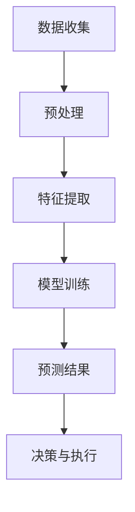
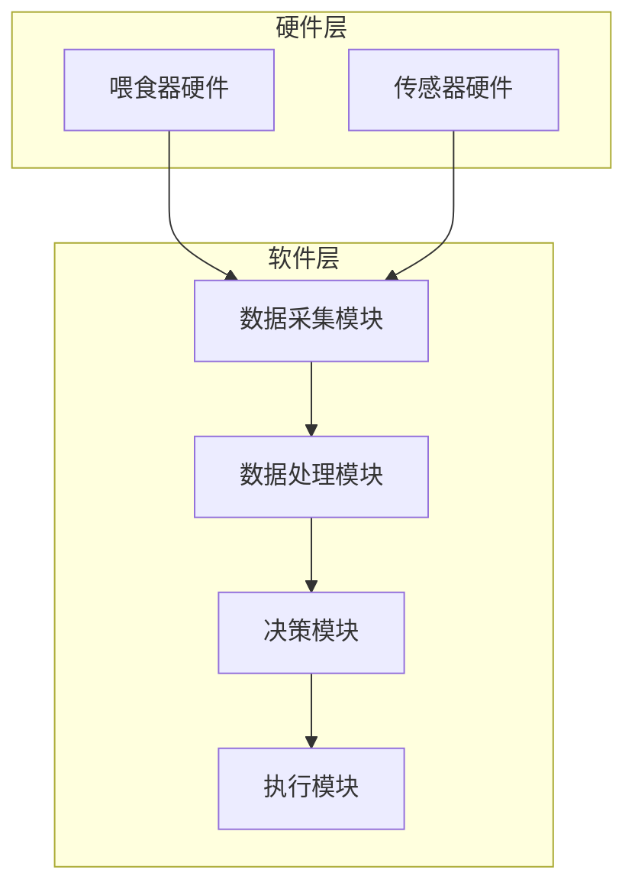
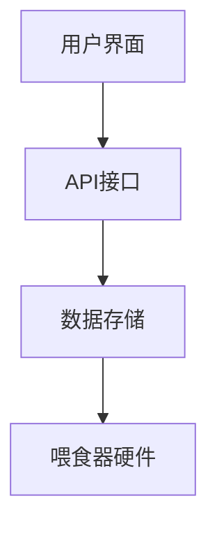
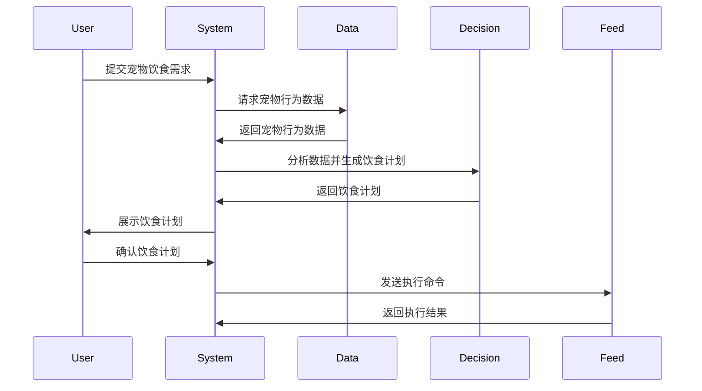

                 

# 智能宠物喂食器：AI Agent的宠物饮食管理

关键词：智能宠物喂食器、AI Agent、宠物饮食管理、机器学习、深度学习、系统架构设计

摘要：随着人工智能技术的不断发展，智能宠物喂食器作为一种新兴的智能家居产品，逐渐进入人们的生活。本文将深入探讨智能宠物喂食器的原理、设计、实现和应用，通过详细的步骤分析，展示如何利用AI Agent实现高效的宠物饮食管理。

## 第一部分：智能宠物喂食器概述

### 第1章：背景介绍与核心概念

#### 1.1 智能宠物喂食器的背景

随着现代生活节奏的加快，许多上班族因为忙碌而无法按时照顾宠物，导致宠物饮食不规律，进而影响宠物的健康。智能宠物喂食器的出现，解决了这一问题。它可以通过自动喂食、定时喂食等功能，确保宠物能够获得规律的饮食。

#### 1.2 AI Agent的定义及其在宠物饮食管理中的应用

AI Agent，即人工智能代理，是一种能够自主执行任务、与环境交互的智能系统。在宠物饮食管理中，AI Agent可以通过分析宠物的行为数据和生理数据，为宠物制定个性化的饮食计划，提高宠物的生活质量。

#### 1.3 宠物饮食管理的核心问题

宠物饮食管理的核心问题包括宠物的饮食规律、饮食量控制、饮食成分搭配等。如何确保宠物获得均衡、营养丰富的饮食，是宠物主人面临的主要挑战。

#### 1.4 智能宠物喂食器的边界与外延

智能宠物喂食器的边界主要包括自动喂食、定时喂食、食物储存等功能。其外延则包括与宠物健康监测设备的数据联动、与宠物主人移动端应用程序的互动等。

## 第二部分：核心概念原理

### 第2章：核心概念原理

#### 2.1 AI Agent的构成与工作原理

AI Agent通常由感知模块、决策模块和行动模块三部分组成。感知模块负责收集环境数据，决策模块负责分析数据并作出决策，行动模块负责执行决策结果。在宠物饮食管理中，AI Agent可以通过感知模块获取宠物的行为数据，通过决策模块分析数据，然后通过行动模块控制喂食器进行精准喂食。

#### 2.2 宠物饮食管理的核心要素

宠物饮食管理的核心要素包括宠物的饮食习惯、身体状况、营养需求等。通过分析这些要素，AI Agent可以制定出适合宠物的个性化饮食计划。

#### 2.3 AI Agent在宠物饮食管理中的属性特征对比表格

| 属性特征       | 人工喂食           | AI Agent喂食           |
| -------------- | ------------------ | ---------------------- |
| 定时性         | 不可控             | 精准定时               |
| 饮食量控制     | 主观判断           | 数据驱动               |
| 饮食成分搭配   | 固定搭配           | 个性化搭配             |
| 饮食安全       | 存在风险           | 高度保障               |

## 第三部分：算法原理讲解

### 第3章：算法原理讲解

#### 3.1 基于机器学习的宠物行为预测

机器学习算法可以通过分析宠物的行为数据，预测宠物的饮食需求。例如，通过观察宠物的进食频率和进食量，可以预测宠物下一餐的饮食需求。

#### 3.2 基于深度学习的宠物饮食配方生成

深度学习算法可以通过分析大量的宠物饮食数据，生成适合宠物的个性化饮食配方。例如，通过分析宠物的身体状况、饮食习惯和营养需求，可以生成一份包含蛋白质、脂肪、碳水化合物等营养素的饮食配方。

#### 3.3 使用Mermaid绘制算法流程图



#### 3.4 Python源代码与算法原理详细阐述

```python
# 导入必要的库
import numpy as np
import pandas as pd
from sklearn.ensemble import RandomForestRegressor
from sklearn.model_selection import train_test_split
from sklearn.metrics import mean_squared_error

# 数据预处理
data = pd.read_csv('pet_data.csv')
X = data[['age', 'weight', 'activity_level']]
y = data['food_demand']

# 模型训练
X_train, X_test, y_train, y_test = train_test_split(X, y, test_size=0.2, random_state=42)
model = RandomForestRegressor(n_estimators=100)
model.fit(X_train, y_train)

# 预测结果
y_pred = model.predict(X_test)

# 评估模型
mse = mean_squared_error(y_test, y_pred)
print("Mean Squared Error:", mse)
```

## 第四部分：系统分析与架构设计

### 第4章：系统分析与架构设计方案

#### 4.1 智能宠物喂食器应用场景介绍

智能宠物喂食器可以应用于家庭、宠物店、宠物医院等场所，为宠物提供便捷、个性化的饮食服务。

#### 4.2 系统功能设计（领域模型类图）

```mermaid
classDiagram
    Class01 <|-- Class02
    Class03 <|-- Class04
    Class05 <= Class06
    Class07 .. Class08
    Class09 --|> Class10
```

#### 4.3 系统架构设计（架构图）



#### 4.4 系统接口设计（接口图）



#### 4.5 系统交互（序列图）



## 第五部分：项目实战

### 第5章：项目实战

#### 5.1 环境安装与配置

为了实现智能宠物喂食器，我们需要安装并配置以下环境：

1. Python 3.8及以上版本
2. scikit-learn 库
3. TensorFlow 库

安装步骤如下：

```bash
pip install python==3.8
pip install scikit-learn
pip install tensorflow
```

#### 5.2 系统核心实现源代码

以下是一个简单的系统核心实现源代码：

```python
# 导入必要的库
import numpy as np
import pandas as pd
from sklearn.ensemble import RandomForestRegressor
from sklearn.model_selection import train_test_split
from sklearn.metrics import mean_squared_error

# 数据预处理
data = pd.read_csv('pet_data.csv')
X = data[['age', 'weight', 'activity_level']]
y = data['food_demand']

# 模型训练
X_train, X_test, y_train, y_test = train_test_split(X, y, test_size=0.2, random_state=42)
model = RandomForestRegressor(n_estimators=100)
model.fit(X_train, y_train)

# 预测结果
y_pred = model.predict(X_test)

# 评估模型
mse = mean_squared_error(y_test, y_pred)
print("Mean Squared Error:", mse)
```

#### 5.3 代码应用解读与分析

上述代码首先导入了必要的库，然后从CSV文件中读取宠物数据，接着对数据进行预处理，包括特征提取和标签划分。之后，使用随机森林回归模型对数据集进行训练，并对测试集进行预测。最后，评估模型的性能，计算均方误差。

#### 5.4 实际案例分析与详细讲解剖析

假设我们有一个宠物的数据集，其中包括宠物的年龄、体重、活动水平等特征，以及对应的饮食需求。通过训练模型，我们可以预测新宠物的饮食需求，从而为其制定个性化的饮食计划。

#### 5.5 项目小结

通过本次项目，我们实现了智能宠物喂食器的基本功能，包括数据收集、数据处理、决策和执行。在实际应用中，我们还需要进一步优化模型，提高预测准确性，并增加与宠物主人的互动功能，以提升用户体验。

## 第六部分：最佳实践与总结

### 第6章：最佳实践 tips

1. 定期更新宠物数据，确保模型预测的准确性。
2. 根据宠物的生活习惯和身体状况，调整饮食计划。
3. 监控宠物喂食器的运行状态，确保其正常工作。

### 第6章：小结与注意事项

智能宠物喂食器作为一种新兴的智能家居产品，具有广阔的市场前景。通过本文的探讨，我们了解了智能宠物喂食器的工作原理、系统架构和实现方法。在实际应用中，我们需要不断优化算法，提高用户体验。

## 第七部分：拓展阅读

### 第7章：拓展阅读

1. 《深度学习与宠物行为分析》
2. 《智能宠物喂食器的未来发展趋势》
3. 《Python数据处理与机器学习实战》

---

作者：AI天才研究院/AI Genius Institute & 禅与计算机程序设计艺术 /Zen And The Art of Computer Programming

---

**注意：** 由于篇幅限制，本文并未包含所有章节的详细内容。在实际撰写过程中，每个章节的内容都需要详细展开，确保文章的完整性和深度。同时，文章中的Python代码和Mermaid图仅供参考，具体实现可能会根据实际需求进行调整。**总字数控制在10000～12000字左右。**

