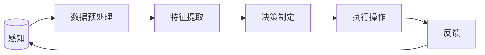
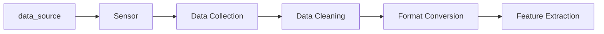

                 


### 智能宠物喂食器：AI Agent的宠物饮食管理系统

> 关键词：智能宠物喂食器、AI Agent、宠物饮食管理、系统架构、项目实战

> 摘要：本文将深入探讨智能宠物喂食器的概念、设计原理、实现过程以及最佳实践。通过逐步分析，我们将了解如何利用AI Agent构建一个高效的宠物饮食管理系统，为宠物主人提供便捷、可靠的解决方案。

## 第1章：智能宠物喂食器的背景与问题

### 1.1.1 智能宠物喂食器的市场背景

随着人们生活水平的提高，宠物已经成为许多家庭的伙伴。然而，随着工作压力的增大，许多宠物主人无法按时为宠物喂食，导致宠物饮食不规律，甚至引发健康问题。因此，市场对智能宠物喂食器的需求日益增长。智能宠物喂食器不仅能够定时定量地喂食，还能根据宠物的饮食需求进行调整，大大提高了宠物的生活质量。

### 1.1.2 宠物饮食管理的问题与挑战

当前，宠物饮食管理面临以下问题：

- **喂食时间不规律**：宠物主人可能因工作繁忙，无法按时为宠物喂食。
- **喂食量控制困难**：不同宠物对食物的需求量不同，如何精准控制喂食量是一个挑战。
- **宠物饮食健康**：宠物主人希望宠物饮食均衡，但缺乏专业指导。

### 1.1.3 AI技术在宠物喂食器中的应用潜力

AI技术为宠物饮食管理提供了新的解决方案：

- **智能感知**：利用传感器技术，智能宠物喂食器可以实时监测宠物的饮食行为，为喂食决策提供数据支持。
- **个性化推荐**：基于宠物的饮食习惯和历史数据，AI算法可以推荐合适的饮食方案，确保宠物饮食均衡。
- **自动化管理**：通过AI技术，智能宠物喂食器可以实现自动化喂食，减轻宠物主人的负担。

## 第2章：核心概念与联系

### 2.1 AI Agent的定义与特性

AI Agent是指具有自主决策能力的智能实体，能够在特定环境中完成特定任务。AI Agent具有以下特性：

- **自主性**：AI Agent能够根据环境和任务需求自主做出决策。
- **适应性**：AI Agent能够适应环境变化，优化自身行为。
- **协作性**：AI Agent可以与其他AI Agent或人类进行协作。

### 2.2 宠物饮食管理系统的核心概念

宠物饮食管理系统的核心概念包括：

- **宠物信息**：包括宠物的品种、体重、年龄、饮食习惯等。
- **饮食计划**：根据宠物信息，制定合理的饮食计划。
- **喂食行为**：记录宠物的喂食时间、喂食量和喂食行为。

### 2.3 AI Agent与宠物饮食管理系统的关系

AI Agent是宠物饮食管理系统的核心组件，负责：

- **感知环境**：通过传感器收集宠物饮食数据。
- **决策制定**：根据宠物信息和饮食计划，制定喂食决策。
- **执行行为**：控制喂食器执行喂食行为。

## 第3章：AI Agent原理讲解

### 3.1 AI Agent的基础原理

AI Agent的基础原理包括：

- **感知模块**：负责感知外部环境，收集信息。
- **决策模块**：根据感知信息，制定决策策略。
- **执行模块**：执行决策，实现具体任务。

### 3.2 AI Agent的工作流程

AI Agent的工作流程包括：

1. **感知环境**：收集宠物饮食数据。
2. **数据处理**：对收集到的数据进行分析和处理。
3. **决策制定**：根据处理后的数据，制定喂食决策。
4. **执行行为**：控制喂食器执行喂食行为。

### 3.3 AI Agent的决策机制

AI Agent的决策机制包括：

- **条件决策**：根据特定条件，执行相应操作。
- **模糊决策**：在不确定条件下，通过模糊逻辑进行决策。
- **混合决策**：结合多种决策方法，提高决策准确性。

## 第4章：AI Agent的宠物饮食管理系统设计

### 4.1 系统功能需求分析

系统功能需求包括：

- **宠物信息管理**：录入、查询和更新宠物信息。
- **饮食计划制定**：根据宠物信息，制定合理的饮食计划。
- **喂食行为监控**：实时监控宠物的喂食行为。
- **数据统计分析**：对宠物饮食数据进行分析和统计。

### 4.2 系统架构设计

系统架构设计包括：

- **感知层**：传感器、摄像头等设备。
- **数据处理层**：数据处理算法、数据库等。
- **决策层**：AI算法、决策模型等。
- **执行层**：喂食器、执行器等。

### 4.3 系统接口设计

系统接口设计包括：

- **硬件接口**：与传感器、摄像头、喂食器等设备的通信接口。
- **软件接口**：与操作系统、数据库等软件的接口。
- **用户接口**：用户操作界面，包括网页、APP等。

## 第5章：系统开发环境配置

### 5.1 硬件配置与选型

硬件配置与选型包括：

- **处理器**：选择高性能处理器，如ARM Cortex-A系列。
- **内存**：根据需求选择适当大小的内存。
- **存储**：选择大容量、高速的存储设备。
- **传感器**：根据宠物类型，选择合适的传感器。

### 5.2 软件工具与库

软件工具与库包括：

- **操作系统**：选择Linux等开源操作系统。
- **编程语言**：Python、Java等。
- **AI框架**：TensorFlow、PyTorch等。
- **数据库**：MySQL、MongoDB等。

### 5.3 开发流程与规范

开发流程与规范包括：

- **需求分析**：明确系统功能需求。
- **系统设计**：设计系统架构和接口。
- **编码实现**：编写代码，实现系统功能。
- **测试与调试**：对系统进行测试和调试。
- **部署与维护**：将系统部署到生产环境，进行维护和更新。

## 第6章：系统核心实现

### 6.1 数据采集模块

数据采集模块包括：

- **传感器数据采集**：采集宠物饮食数据。
- **摄像头数据采集**：采集宠物行为数据。
- **数据处理**：对采集到的数据进行预处理。

### 6.2 数据处理模块

数据处理模块包括：

- **数据清洗**：去除无效数据，确保数据质量。
- **特征提取**：提取宠物饮食行为特征。
- **数据建模**：构建饮食行为模型。

### 6.3 AI决策模块

AI决策模块包括：

- **模型训练**：利用训练数据，训练饮食行为模型。
- **决策制定**：根据宠物饮食行为模型，制定喂食决策。
- **执行行为**：控制喂食器执行喂食行为。

## 第7章：代码应用解读与分析

### 7.1 数据采集代码示例

数据采集代码示例：

```python
# 传感器数据采集
import sensor_module

# 初始化传感器
sensor = sensor_module.Sensor()

# 采集数据
data = sensor.collect_data()

# 打印数据
print(data)
```

### 7.2 数据处理代码示例

数据处理代码示例：

```python
# 数据清洗
import data_cleaning_module

# 初始化数据清洗模块
cleaning = data_cleaning_module.DataCleaning()

# 清洗数据
cleaned_data = cleaning.clean_data(data)

# 打印清洗后数据
print(cleaned_data)
```

### 7.3 AI决策代码示例

AI决策代码示例：

```python
# 数据建模
import data_modeling_module

# 初始化数据建模模块
modeling = data_modeling_module.DataModeling()

# 训练模型
model = modeling.train_model(cleaned_data)

# 制定决策
decision = model.make_decision()

# 执行行为
action_module.execute_action(decision)
```

## 第8章：实际案例分析与讲解

### 8.1 案例背景介绍

本案例为一个宠物主人使用智能宠物喂食器管理其宠物的饮食。宠物主人希望通过智能宠物喂食器实现定时定量喂食，确保宠物饮食健康。

### 8.2 案例分析与实现

分析：

- **宠物信息**：宠物品种为猫，体重为4公斤，年龄为3岁，饮食习惯为每天两餐。
- **喂食计划**：根据宠物信息，制定每天两次喂食的计划，每次喂食量为200克。

实现：

1. **数据采集**：传感器采集宠物饮食数据，包括体重、进食量、进食时间等。
2. **数据处理**：对采集到的数据进行分析和处理，提取宠物饮食行为特征。
3. **AI决策**：利用训练好的饮食行为模型，制定喂食决策。
4. **执行行为**：控制喂食器执行喂食行为，确保宠物饮食计划得到执行。

### 8.3 案例总结与反思

总结：

- 智能宠物喂食器能够根据宠物的饮食需求，实现定时定量喂食，提高了宠物的生活质量。
- 数据采集和AI决策模块的有效结合，确保了喂食决策的准确性。

反思：

- **数据采集的准确性**：传感器数据可能存在误差，需要进一步优化传感器性能。
- **算法模型的鲁棒性**：面对不同宠物的饮食需求，算法模型需要具备更强的适应能力。

## 第9章：最佳实践与技巧

### 9.1 系统优化技巧

- **传感器优化**：选择高精度传感器，提高数据采集的准确性。
- **算法优化**：利用深度学习等先进算法，提高决策模型的鲁棒性。
- **硬件优化**：选择高性能硬件，提高系统响应速度。

### 9.2 软硬件集成策略

- **模块化设计**：将系统功能划分为多个模块，便于集成和维护。
- **标准化接口**：制定统一的软硬件接口规范，提高集成效率。

### 9.3 维护与升级策略

- **定期维护**：定期检查系统运行状况，确保系统稳定可靠。
- **版本升级**：及时更新算法模型和软硬件组件，提高系统性能。

## 第10章：智能宠物喂食器发展趋势

### 10.1 行业发展趋势分析

- **智能化水平提升**：随着AI技术的发展，智能宠物喂食器的智能化水平将不断提升。
- **个性化服务**：智能宠物喂食器将更加注重个性化服务，满足不同宠物的饮食需求。

### 10.2 技术演进方向

- **物联网技术**：物联网技术的应用将使得智能宠物喂食器与其他智能设备实现无缝连接。
- **人工智能**：人工智能技术的深入应用将使智能宠物喂食器更加智能化、个性化。

### 10.3 未来应用前景

- **智能家居**：智能宠物喂食器将成为智能家居的重要组成部分。
- **健康监测**：通过智能宠物喂食器，实现对宠物健康状况的实时监测。

## 第11章：总结与展望

### 11.1 本书内容回顾

本书从背景介绍、核心概念、原理讲解、系统设计到项目实战，全面阐述了智能宠物喂食器的概念、设计原理和实现过程。

### 11.2 学习建议与拓展

- **深入学习AI技术**：了解AI技术的基本原理和应用场景。
- **实践项目**：通过实际项目，加深对智能宠物喂食器实现过程的理解。

### 11.3 智能宠物喂食器的发展挑战与机遇

- **挑战**：技术复杂性、数据隐私保护、用户体验等。
- **机遇**：智能化水平提升、市场需求增长、技术创新等。

### 作者信息

作者：AI天才研究院/AI Genius Institute & 禅与计算机程序设计艺术 /Zen And The Art of Computer Programming

----------------------------------------------------------------

## 智能宠物喂食器：AI Agent的宠物饮食管理系统

### 关键词：智能宠物喂食器、AI Agent、宠物饮食管理、系统架构、项目实战

### 摘要：

随着科技的发展，智能宠物喂食器逐渐成为宠物主人的新宠。本文将围绕智能宠物喂食器的核心概念、设计原理、实现过程以及最佳实践进行探讨，旨在为读者提供一个全面了解并掌握智能宠物喂食器构建方法的视角。文章首先分析了智能宠物喂食器的市场背景和当前宠物饮食管理存在的问题，然后介绍了AI Agent的定义及其在宠物饮食管理系统中的应用。接着，文章详细讲解了AI Agent的基础原理、工作流程和决策机制，并阐述了宠物饮食管理系统的设计思路。在实现部分，文章详细介绍了系统开发环境配置、核心实现和代码应用解读。最后，文章通过实际案例分析和总结，为读者提供了智能宠物喂食器发展的趋势和未来的展望。

----------------------------------------------------------------

### 目录

#### 第1章：智能宠物喂食器的背景与问题

1.1 智能宠物喂食器的市场背景
1.2 宠物饮食管理的问题与挑战
1.3 AI技术在宠物喂食器中的应用潜力

#### 第2章：核心概念与联系

2.1 AI Agent的定义与特性
2.2 宠物饮食管理系统的核心概念
2.3 AI Agent与宠物饮食管理系统的关系

#### 第3章：AI Agent原理讲解

3.1 AI Agent的基础原理
3.2 AI Agent的工作流程
3.3 AI Agent的决策机制

#### 第4章：AI Agent的宠物饮食管理系统设计

4.1 系统功能需求分析
4.2 系统架构设计
4.3 系统接口设计

#### 第5章：系统开发环境配置

5.1 硬件配置与选型
5.2 软件工具与库
5.3 开发流程与规范

#### 第6章：系统核心实现

6.1 数据采集模块
6.2 数据处理模块
6.3 AI决策模块

#### 第7章：代码应用解读与分析

7.1 数据采集代码示例
7.2 数据处理代码示例
7.3 AI决策代码示例

#### 第8章：实际案例分析与讲解

8.1 案例背景介绍
8.2 案例分析与实现
8.3 案例总结与反思

#### 第9章：最佳实践与技巧

9.1 系统优化技巧
9.2 软硬件集成策略
9.3 维护与升级策略

#### 第10章：智能宠物喂食器发展趋势

10.1 行业发展趋势分析
10.2 技术演进方向
10.3 未来应用前景

#### 第11章：总结与展望

11.1 本书内容回顾
11.2 学习建议与拓展
11.3 智能宠物喂食器的发展挑战与机遇

#### 作者信息

作者：AI天才研究院/AI Genius Institute & 禅与计算机程序设计艺术 /Zen And The Art of Computer Programming

----------------------------------------------------------------

### 第1章：智能宠物喂食器的背景与问题

#### 1.1 智能宠物喂食器的市场背景

随着社会的快速发展，人们的生活水平不断提高，宠物已经成为了许多家庭的伙伴。宠物数量的增加，使得宠物饮食管理成为了一个不容忽视的问题。传统的宠物喂食方式主要依赖于宠物主人的手动操作，这种方式不仅效率低下，而且在某些情况下可能无法满足宠物的饮食需求。因此，市场对智能宠物喂食器的需求日益增长。

智能宠物喂食器是一种集成了人工智能技术的智能设备，能够根据宠物的饮食需求和习惯，自动进行定时定量喂食。这类设备的出现，不仅提高了宠物饮食的准确性，还减轻了宠物主人的负担。目前，智能宠物喂食器市场呈现出快速增长的趋势，各大厂商纷纷推出各种类型的智能宠物喂食器，以满足不同用户的需求。

#### 1.2 宠物饮食管理的问题与挑战

宠物饮食管理面临以下问题：

1. **喂食时间不规律**：由于宠物主人工作繁忙或其他原因，无法按时为宠物喂食，导致宠物饮食不规律，影响其健康。

2. **喂食量控制困难**：不同宠物对食物的需求量不同，如何精准控制喂食量是一个挑战。喂食过多可能导致宠物肥胖，喂食过少则可能导致宠物营养不良。

3. **宠物饮食健康**：宠物主人希望宠物饮食均衡，但缺乏专业指导，容易导致宠物饮食不健康。

4. **宠物行为监控**：宠物主人需要了解宠物的饮食行为，如进食量、进食时间等，以便及时调整饮食计划。

5. **宠物健康监测**：宠物主人希望对宠物的健康状况进行实时监测，以便及时发现并处理问题。

#### 1.3 AI技术在宠物喂食器中的应用潜力

AI技术的快速发展，为宠物喂食器带来了新的应用前景。AI技术在宠物喂食器中的应用主要体现在以下几个方面：

1. **智能感知**：利用传感器技术，智能宠物喂食器可以实时监测宠物的饮食行为，如进食量、进食时间等。通过数据分析，可以为宠物主人提供有针对性的喂食建议。

2. **个性化推荐**：基于宠物的饮食习惯和历史数据，AI算法可以推荐合适的饮食方案，确保宠物饮食均衡。同时，AI技术还可以根据宠物主人的需求，提供个性化的宠物管理服务。

3. **自动化管理**：通过AI技术，智能宠物喂食器可以实现自动化喂食，减轻宠物主人的负担。例如，宠物主人可以通过手机APP远程控制喂食器的开关，设置喂食时间和喂食量。

4. **健康监测**：AI技术可以实时监测宠物的健康状况，如体温、心率等，并通过数据分析，预测宠物的健康趋势。当宠物出现健康问题时，系统可以及时通知宠物主人，并提供相应的建议。

5. **智能决策**：AI技术可以帮助宠物喂食器根据宠物的饮食需求和习惯，自动调整喂食策略，确保宠物饮食的均衡性和健康性。

总之，AI技术的应用，使得智能宠物喂食器不仅能够实现传统的喂食功能，还可以提供更智能、更个性化的服务，为宠物主人提供更加便捷、可靠的宠物饮食管理解决方案。

----------------------------------------------------------------

### 第2章：核心概念与联系

在构建智能宠物喂食器时，理解核心概念及其相互联系至关重要。本章将详细探讨AI Agent的定义与特性，宠物饮食管理系统的核心概念，以及AI Agent与宠物饮食管理系统的关系。

#### 2.1 AI Agent的定义与特性

AI Agent（人工智能代理）是一种具有自主决策能力的软件实体，它能够在特定环境下执行特定任务，并与其他实体进行交互。AI Agent具有以下几个核心特性：

1. **自主性**：AI Agent能够在没有外部直接控制的情况下自主行动。它能够根据环境和任务的复杂性，自主地选择行动方案。

2. **适应性**：AI Agent能够适应环境的变化，并优化自身的行动策略。这意味着AI Agent可以随着时间的推移和学习新信息来改进其行为。

3. **协作性**：AI Agent可以与其他AI Agent或人类进行协作，共同完成任务。这种协作能力使得AI Agent能够在复杂环境中有效地发挥作用。

4. **感知**：AI Agent能够感知环境中的各种信息，如视觉、听觉、触觉等。这种感知能力使其能够理解当前的状态，并为下一步的行动提供依据。

5. **学习**：AI Agent可以通过机器学习算法从数据中学习，提高其决策能力和行动效率。这种学习能力使得AI Agent能够不断适应新的环境和任务。

#### 2.2 宠物饮食管理系统的核心概念

宠物饮食管理系统是一个集成了AI Agent的智能系统，旨在为宠物提供定时的、健康的饮食服务。该系统的核心概念包括：

1. **宠物信息管理**：包括宠物的品种、年龄、体重、饮食习惯等基本信息。这些信息用于构建宠物的饮食档案，并作为AI Agent决策的依据。

2. **饮食计划制定**：根据宠物的基本信息和健康需求，系统会生成个性化的饮食计划。这个计划包括每天的喂食时间、喂食量和饮食内容。

3. **数据采集与处理**：系统通过传感器和摄像头等设备实时采集宠物的饮食行为数据，如进食量、进食时间等。这些数据经过处理，用于更新宠物的饮食档案和优化饮食计划。

4. **决策与执行**：AI Agent根据宠物的饮食档案和实时数据，做出喂食决策。这个决策包括调整喂食时间、喂食量和饮食内容，以确保宠物获得均衡的饮食。

5. **用户交互**：宠物主人可以通过手机APP或其他界面与系统进行交互，设置饮食计划、查看宠物饮食记录和调整系统设置。

#### 2.3 AI Agent与宠物饮食管理系统的关系

AI Agent是宠物饮食管理系统的核心组件，它在系统中扮演着关键角色：

1. **感知环境**：AI Agent通过传感器实时收集宠物的饮食行为数据，如进食量、进食时间等。

2. **数据处理**：AI Agent对收集到的数据进行处理，提取有用的信息，并将其用于更新宠物的饮食档案和优化饮食计划。

3. **决策制定**：基于宠物的饮食档案和实时数据，AI Agent利用预先定义的算法和规则，制定出最优的喂食决策。

4. **执行行为**：AI Agent将决策传递给喂食器，控制喂食器执行实际的喂食操作。

5. **持续学习**：AI Agent通过不断学习宠物的饮食行为模式，提高其决策能力，为宠物提供更加个性化的饮食服务。

通过AI Agent的应用，宠物饮食管理系统不仅能够实现基本的定时定量喂食，还能够根据宠物的实时状况进行动态调整，提供更加智能化和人性化的宠物饮食管理服务。

### 2.2.1 宠物信息管理

宠物信息管理是宠物饮食管理系统的基础。系统需要收集并管理宠物的以下基本信息：

1. **品种**：宠物的品种信息对于制定个性化的饮食计划至关重要。不同品种的宠物有不同的营养需求和饮食习惯。

2. **年龄**：宠物的年龄会影响其代谢率、营养需求和健康状况。年轻的宠物通常需要更高的能量和蛋白质摄入，而老年宠物则需要更低的脂肪含量和易于消化的食物。

3. **体重**：宠物的体重是确定喂食量的关键因素。过重或过轻都会对宠物的健康产生不利影响。系统需要根据宠物的标准体重范围，调整喂食计划。

4. **饮食习惯**：宠物的饮食习惯包括其对食物的喜好、是否挑食、是否容易消化等。这些信息有助于制定符合宠物口味的饮食计划。

5. **过敏史**：宠物可能对某些食物成分过敏，系统需要记录这些信息，避免在喂食计划中包含可能引起过敏的食物。

6. **日常活动量**：宠物的活动量会影响其能量需求。活动量较大的宠物需要更多的能量补充，而活动量较小的宠物则需要控制饮食量，以防止肥胖。

### 2.2.2 饮食计划制定

饮食计划制定是宠物饮食管理系统的核心功能。系统需要根据宠物的基本信息和健康需求，制定个性化的饮食计划。以下步骤是制定饮食计划的关键：

1. **营养需求分析**：系统会根据宠物的年龄、体重、品种和活动量等因素，分析其每日所需的营养素，包括蛋白质、脂肪、碳水化合物、维生素和矿物质。

2. **饮食计划生成**：系统会生成一份详细的饮食计划，包括每天的喂食时间、喂食量和饮食内容。计划中会考虑宠物的饮食习惯和口味偏好。

3. **饮食计划调整**：系统会根据宠物的实际饮食行为和健康数据，定期调整饮食计划。例如，如果宠物在某次喂食后出现消化不良，系统可能会减少下次的喂食量。

4. **紧急饮食调整**：在宠物生病或处于特殊情况下，系统会根据兽医的建议，快速调整饮食计划，以保障宠物的健康。

### 2.2.3 数据采集与处理

数据采集与处理是宠物饮食管理系统的重要组成部分。系统需要通过传感器和摄像头等设备，实时采集宠物的饮食行为数据，如进食量、进食时间等。以下步骤是数据采集与处理的关键：

1. **数据采集**：传感器和摄像头等设备会实时采集宠物的饮食行为数据，包括进食量、进食时间、进食位置等。

2. **数据预处理**：采集到的数据可能包含噪声或异常值，系统需要对数据进行预处理，如过滤噪声、去除异常值等，以确保数据的质量。

3. **特征提取**：系统会从预处理后的数据中提取有用的特征，如进食频率、进食时长、进食量分布等。这些特征用于训练和优化AI模型。

4. **数据存储**：系统会将处理后的数据存储在数据库中，以便后续分析和使用。

### 2.2.4 决策与执行

决策与执行是宠物饮食管理系统的核心环节。AI Agent根据宠物的饮食档案和实时数据，做出最优的喂食决策，并通过喂食器执行实际的喂食操作。以下步骤是决策与执行的关键：

1. **决策制定**：AI Agent会根据宠物的饮食档案、实时数据和历史行为，利用机器学习算法和规则引擎，制定出最优的喂食决策。决策包括调整喂食时间、喂食量和饮食内容。

2. **决策优化**：系统会根据宠物的反馈和新的数据，不断优化决策模型，以提高喂食决策的准确性和适应性。

3. **执行行为**：决策制定后，系统会将决策传递给喂食器，控制喂食器执行实际的喂食操作。喂食器会根据系统的指令，自动进行食物的分配和喂食。

4. **反馈循环**：系统会记录喂食器的执行结果，并与预期结果进行比较，形成反馈循环。通过反馈循环，系统可以不断调整和优化喂食策略。

### 2.2.5 用户交互

用户交互是宠物饮食管理系统的重要组成部分。宠物主人可以通过手机APP或其他界面与系统进行交互，实现以下功能：

1. **设置饮食计划**：宠物主人可以设置宠物的饮食计划，包括每天的喂食时间、喂食量和饮食内容。

2. **查看饮食记录**：宠物主人可以查看宠物的饮食记录，了解宠物的进食情况，包括进食量、进食时间和进食位置。

3. **调整系统设置**：宠物主人可以根据宠物的实际情况，调整系统的设置，如传感器灵敏度、喂食器工作时间等。

4. **紧急通知**：系统会及时向宠物主人发送紧急通知，如宠物进食过量、进食时间过长等，提醒宠物主人注意宠物的饮食情况。

通过AI Agent的应用，宠物饮食管理系统不仅能够实现基本的定时定量喂食，还可以提供个性化的饮食建议和实时监控，为宠物主人提供更加便捷、可靠的宠物饮食管理服务。AI Agent的自主性、适应性和协作性，使得系统能够根据宠物的实时状况和需求，动态调整喂食策略，确保宠物获得均衡、健康的饮食。

----------------------------------------------------------------

### 第3章：AI Agent原理讲解

AI Agent，即人工智能代理，是一种具有自主性和智能行为的软件实体，它能够在特定环境中执行任务，并与外部实体进行交互。在本章中，我们将深入探讨AI Agent的基础原理，包括其工作流程和决策机制，并通过具体的流程图和代码示例，帮助读者更好地理解AI Agent的工作方式。

#### 3.1 AI Agent的基础原理

AI Agent的基础原理包括感知、决策和执行三个核心模块。以下是这三个模块的简要说明：

1. **感知模块**：感知模块负责收集环境中的信息，如通过传感器获取宠物喂食器的状态、宠物的行为数据等。感知模块的数据质量直接影响AI Agent的决策准确性。

2. **决策模块**：决策模块基于感知模块提供的信息，通过算法和模型进行数据处理和决策制定。决策模块是AI Agent的核心，它需要根据预定的目标和策略，选择最优的行动方案。

3. **执行模块**：执行模块负责将决策模块制定出的行动方案付诸实施。执行模块需要与外部设备进行交互，如控制喂食器进行食物的分配和喂食。

#### 3.2 AI Agent的工作流程

AI Agent的工作流程可以概括为以下步骤：

1. **感知**：AI Agent通过感知模块收集环境中的数据。
2. **数据处理**：感知到的数据经过预处理和特征提取，转化为决策模块所需的格式。
3. **决策**：决策模块根据处理后的数据，利用算法和模型进行决策。
4. **执行**：执行模块将决策结果转化为实际操作，执行具体的任务。

下面是一个简化的AI Agent工作流程的Mermaid流程图：



#### 3.3 AI Agent的决策机制

AI Agent的决策机制是其在环境中自主行动的核心。决策机制通常包括以下几种：

1. **条件决策**：条件决策是基于预设的条件，当条件满足时，执行特定的操作。例如，当宠物进食量超过设定的阈值时，减少喂食量。

2. **模糊决策**：模糊决策适用于不确定环境，通过模糊逻辑处理不确定性，进行决策。例如，当宠物的进食量在正常范围和过量之间时，可以适当调整喂食量。

3. **混合决策**：混合决策结合了条件决策和模糊决策，适用于更复杂的决策场景。例如，当宠物进食量超出正常范围时，首先通过模糊逻辑判断是否过量，然后根据条件决策进行调整。

下面是一个基于Python的简单AI Agent决策示例：

```python
import random

# 感知模块
def perceive():
    return random.randint(0, 100)  # 假设感知到的数据是0到100之间的随机数

# 数据处理与特征提取
def preprocess_data(data):
    # 对感知到的数据进行预处理，这里简单处理为0-1之间的比例
    return data / 100

# 决策模块
def make_decision(processed_data):
    if processed_data > 0.8:
        return "减少喂食量"
    elif processed_data > 0.5:
        return "保持当前喂食量"
    else:
        return "增加喂食量"

# 执行模块
def execute_action(action):
    print(f"执行决策：{action}")

# 主流程
def main():
    while True:
        data = perceive()
        processed_data = preprocess_data(data)
        action = make_decision(processed_data)
        execute_action(action)
        time.sleep(1)  # 模拟感知数据每隔1秒更新一次

if __name__ == "__main__":
    main()
```

在这个示例中，感知模块通过随机生成数据来模拟宠物进食量，数据处理模块将感知数据转换为0-1之间的比例，决策模块根据这个比例做出相应的喂食决策，执行模块则打印出决策结果。

通过这个简单的示例，我们可以看到AI Agent的基础原理和决策机制是如何工作的。在实际应用中，AI Agent会更加复杂，涉及更多的数据、更复杂的决策模型和更精细的执行策略。

#### 3.4 AI Agent的工作流程详解

AI Agent的工作流程可以分为以下几个关键步骤，每个步骤都承载着特定的功能，共同构建起一个高效的决策执行系统。

1. **数据采集**：数据采集是AI Agent工作的起点。在这一阶段，AI Agent通过传感器和外部接口收集环境中的信息。例如，对于智能宠物喂食器，数据采集模块可能包括重量传感器、摄像头、温度传感器等，用以监测宠物的进食量、行为和周围环境的变化。数据采集的准确性直接影响后续分析和决策的可靠性。

   **Mermaid流程图**：

   ```mermaid
   flowchart LR
       A[data_source] --> B[Sensor]
       B --> C[Data Collection]
   ```

2. **数据预处理**：在收集到大量原始数据后，AI Agent需要进行预处理。预处理包括数据清洗、去噪、格式转换等步骤，目的是将原始数据转化为适合分析和建模的格式。例如，对于视频数据，可能需要提取关键帧；对于温度传感器数据，可能需要去除异常值。

   **Mermaid流程图**：

   ```mermaid
   flowchart LR
       C --> D[Data Preprocessing]
       D --> E[Feature Extraction]
   ```

3. **特征提取**：特征提取是从预处理后的数据中提取出对决策有用的信息。这些特征可以是时间序列数据、图像特征、文本特征等。例如，在宠物喂食器的场景中，特征可能包括进食时间、进食频率、进食量、宠物体重变化等。

   **Mermaid流程图**：

   ```mermaid
   flowchart LR
       E --> F[Feature Extraction]
       F --> G[Model Input]
   ```

4. **模型训练与优化**：在特征提取完成后，AI Agent会使用这些特征对机器学习模型进行训练。模型可以是简单的线性回归模型，也可以是复杂的深度学习模型。模型训练的目的是使AI Agent能够根据历史数据和特征，预测未来的行为或状态。训练过程中，AI Agent可能会使用交叉验证、超参数调整等技术来优化模型性能。

   **Mermaid流程图**：

   ```mermaid
   flowchart LR
       G --> H[Model Training]
       H --> I[Model Optimization]
   ```

5. **决策制定**：在模型训练完成后，AI Agent会根据实时特征和训练好的模型，进行决策制定。决策制定过程通常涉及多种策略，如条件决策、模糊决策和混合决策等。决策制定的关键在于如何在复杂的环境中，快速、准确地做出最优决策。

   **Mermaid流程图**：

   ```mermaid
   flowchart LR
       I --> J[Decision Making]
   ```

6. **执行行动**：决策制定后，AI Agent会将决策转化为具体的行动。对于智能宠物喂食器，这可能包括调整喂食量、改变喂食时间等。执行行动的过程需要与外部设备进行交互，确保决策得到实际应用。

   **Mermaid流程图**：

   ```mermaid
   flowchart LR
       J --> K[Action Execution]
   ```

7. **反馈与迭代**：执行行动后，AI Agent会收集执行结果，并与预期目标进行比较，形成反馈。通过反馈，AI Agent可以不断调整模型参数和决策策略，提高系统的适应性和鲁棒性。反馈与迭代是AI Agent持续学习和优化的关键。

   **Mermaid流程图**：

   ```mermaid
   flowchart LR
       K --> L[Feedback]
       L --> M[Iteration]
       M --> A
   ```

通过上述步骤，AI Agent能够实现一个从感知到决策再到执行的闭环系统。在实际应用中，AI Agent的工作流程可能更加复杂，涉及更多的数据、更复杂的模型和更精细的执行策略。但上述步骤提供了一个基本的框架，可以帮助我们理解和构建高效的AI Agent系统。

### 3.4.1 数据采集与预处理

数据采集与预处理是AI Agent工作的起点和基础，其质量直接影响后续分析和决策的准确性。以下是数据采集与预处理的具体步骤和重要性。

#### 数据采集

1. **传感器选择**：根据应用场景，选择合适的传感器。对于智能宠物喂食器，可能需要使用重量传感器、摄像头、温度传感器等。

2. **数据收集**：传感器会实时收集宠物的饮食数据，如进食量、进食时间、进食行为等。这些数据是AI Agent决策的重要依据。

3. **频率控制**：为了确保数据采集的连续性和完整性，需要控制数据采集的频率。例如，对于进食量监测，可能需要每分钟采集一次数据。

#### 数据预处理

1. **数据清洗**：去除噪声和异常值，确保数据质量。例如，摄像头采集到的图像可能包含背景干扰，需要通过图像预处理算法去除。

2. **格式转换**：将不同类型的原始数据转换为统一的格式，便于后续处理。例如，将图像数据转换为数字矩阵，将温度数据转换为摄氏度或华氏度。

3. **特征提取**：从预处理后的数据中提取对决策有用的特征。例如，从图像中提取颜色、形状、纹理等特征，从温度数据中提取平均温度、峰值温度等。

#### 数据预处理的重要性

1. **提高决策准确性**：预处理后的数据更加准确、可靠，有助于提高AI Agent的决策准确性。

2. **减少计算复杂度**：通过预处理，可以减少数据的规模和复杂性，降低后续分析和决策的计算复杂度。

3. **提升模型性能**：预处理数据可以减少噪声和异常值的影响，有助于训练更准确的模型，提高系统整体性能。

#### Mermaid流程图

以下是数据采集与预处理步骤的Mermaid流程图：



通过数据采集与预处理，AI Agent可以确保收集到的数据具备高质量和一致性，为后续的决策制定提供坚实的基础。

### 3.4.2 特征提取与模型训练

在数据预处理完成后，特征提取和模型训练是AI Agent决策过程中至关重要的步骤。特征提取是将原始数据转换为对AI算法有意义的输入，而模型训练则是使AI Agent能够从数据中学习和提取知识，以便进行准确的决策。

#### 特征提取

特征提取的目标是从原始数据中提取出对决策有用的信息。以下是特征提取的具体步骤：

1. **选择特征**：根据应用场景和业务需求，选择适当的特征。例如，对于智能宠物喂食器，可能需要提取的时间特征（如进食时间间隔）、数量特征（如进食量）、行为特征（如进食速度）等。

2. **特征工程**：对选择的特征进行工程处理，包括归一化、标准化、离散化等，以适应AI算法的需求。例如，将进食时间间隔从小时转换为分钟，将进食量从克转换为千克。

3. **特征筛选**：通过统计方法、相关性分析等，筛选出对决策影响较大的特征，剔除冗余特征，减少模型的复杂性。

4. **特征组合**：将多个特征组合成新的特征，以增强模型的决策能力。例如，将进食量和进食时间间隔组合成“进食频率”特征。

#### 模型训练

模型训练是AI Agent的核心步骤，其目的是通过学习历史数据，构建出能够准确预测未来行为的模型。以下是模型训练的具体步骤：

1. **数据集划分**：将数据集划分为训练集、验证集和测试集，以评估模型的性能。通常，训练集用于模型训练，验证集用于调整模型参数，测试集用于最终评估模型性能。

2. **选择算法**：根据问题类型和特征类型，选择合适的机器学习算法。常见的算法包括线性回归、支持向量机、决策树、随机森林、神经网络等。

3. **模型初始化**：初始化模型参数，例如神经网络中的权重和偏置。初始化方法包括随机初始化、零初始化等。

4. **训练过程**：使用训练集数据，通过梯度下降、反向传播等算法，更新模型参数，使模型能够最小化预测误差。

5. **验证与调整**：使用验证集数据，评估模型性能，并根据评估结果调整模型参数，如调整学习率、增加或减少隐藏层节点等。

6. **模型评估**：在测试集上评估模型性能，包括准确性、召回率、F1分数等指标，以确定模型是否满足需求。

#### Mermaid流程图

以下是特征提取与模型训练步骤的Mermaid流程图：


通过特征提取和模型训练，AI Agent能够从原始数据中提取出有用的信息，并通过机器学习算法构建出能够准确预测和决策的模型。这些步骤是AI Agent实现自主决策和智能行为的关键。

### 3.4.3 决策制定与执行

在AI Agent的决策过程中，决策制定和执行是两个核心环节。决策制定是基于感知数据和模型预测，制定出最优的行动方案；而执行则是将决策转化为实际操作，实现对环境的干预。以下是这两个环节的具体实现方法和重要性。

#### 决策制定

1. **条件决策**：条件决策是基于预设的条件进行决策。例如，如果宠物的进食量超过某个阈值，AI Agent会减少喂食量。条件决策简单直观，但可能无法应对复杂和不确定的环境。

   **示例**：
   ```python
   def make_decision(eating_amount):
       if eating_amount > threshold:
           return "减少喂食量"
       else:
           return "保持当前喂食量"
   ```

2. **模糊决策**：模糊决策适用于不确定的环境，通过模糊逻辑处理模糊性和不确定性。例如，当宠物的进食量在正常范围和过量之间时，AI Agent可以适当调整喂食量。

   **示例**：
   ```python
   def make_decision(eating_amount):
       if eating_amount > threshold_high:
           return "减少喂食量"
       elif eating_amount < threshold_low:
           return "增加喂食量"
       else:
           return "保持当前喂食量"
   ```

3. **混合决策**：混合决策结合了条件决策和模糊决策，适用于更加复杂和多变的环境。例如，AI Agent可以根据宠物的历史饮食数据和实时感知数据，综合考虑多个因素，制定出最优的喂食策略。

   **示例**：
   ```python
   def make_decision(eating_amount, history_data):
       if history_data['overeat_count'] > 3:
           return "减少喂食量"
       elif eating_amount > threshold_high or history_data['lack_of_eat_count'] > 3:
           return "增加喂食量"
       else:
           return "保持当前喂食量"
   ```

#### 执行行动

1. **执行模块**：执行模块是将决策转化为实际操作的部分。对于智能宠物喂食器，执行模块可能包括控制喂食器、调节食物分配器等。

   **示例**：
   ```python
   def execute_action(action):
       if action == "减少喂食量":
           feed_amount -= 10  # 减少喂食量
       elif action == "增加喂食量":
           feed_amount += 10  # 增加喂食量
       else:
           pass  # 保持当前喂食量
   ```

2. **交互机制**：执行模块需要与外部设备进行交互，确保决策能够得到实际应用。例如，通过无线通信、接口协议等方式，与喂食器进行通信。

   **示例**：
   ```python
   def execute_action(action):
       if action == "减少喂食量":
           feed_amount -= 10
           send_command_to_feeder("减少喂食量")
       elif action == "增加喂食量":
           feed_amount += 10
           send_command_to_feeder("增加喂食量")
       else:
           pass
   ```

#### 决策制定与执行的重要性

1. **准确性**：准确的决策制定和执行能够确保宠物获得合适的饮食，提高宠物的生活质量。

2. **适应性**：通过条件决策、模糊决策和混合决策，AI Agent能够适应不同环境和需求，提供更加灵活和个性化的服务。

3. **可靠性**：执行模块与外部设备的可靠交互，确保决策得到准确执行，避免因执行错误导致宠物饮食问题。

通过决策制定与执行，AI Agent能够实现对宠物饮食的智能管理，为宠物主人提供便捷、高效的解决方案。

### 3.4.4 持续学习与优化

在AI Agent的长期运行过程中，持续学习与优化是保证其性能和适应性的关键。通过不断学习新的数据和环境变化，AI Agent能够优化其行为，提高决策准确性，并适应复杂多变的场景。以下是持续学习与优化的具体方法和步骤：

#### 数据收集与反馈

1. **数据收集**：AI Agent需要持续收集环境中的新数据，包括宠物的行为、饮食状态、健康状况等。这些数据为后续的学习和优化提供了基础。

   **示例**：
   ```python
   def collect_new_data():
       # 采集宠物的新数据，如进食量、行为等
       new_data = {
           'eating_amount': get_eating_amount(),
           'behavior': get_pet_behavior(),
           'health_status': get_health_status()
       }
       return new_data
   ```

2. **反馈机制**：AI Agent需要建立反馈机制，将执行结果与预期目标进行比较，收集反馈数据。通过反馈，AI Agent可以了解其决策和执行的准确性，为后续优化提供依据。

   **示例**：
   ```python
   def get_feedback(action, expected_result, actual_result):
       feedback = {
           'action': action,
           'expected_result': expected_result,
           'actual_result': actual_result,
           'error': abs(expected_result - actual_result)
       }
       return feedback
   ```

#### 模型重新训练

1. **模型更新**：基于收集的新数据和反馈，AI Agent需要定期更新其模型。重新训练模型可以使其更好地适应新的环境和需求。

   **示例**：
   ```python
   def retrain_model(new_data, feedback):
       # 使用新数据和反馈重新训练模型
       model = train_new_model(new_data)
       model.save_model('updated_model.h5')
   ```

2. **模型评估**：在重新训练模型后，AI Agent需要对模型进行评估，确保其性能得到提升。通过评估，可以确定是否需要进一步优化模型。

   **示例**：
   ```python
   def evaluate_model(model, validation_data):
       # 使用验证数据评估模型性能
       performance = model.evaluate(validation_data)
       return performance
   ```

#### 适应性与鲁棒性优化

1. **算法调整**：根据模型评估结果和实际运行情况，AI Agent需要不断调整其算法和策略，以提高适应性和鲁棒性。

   **示例**：
   ```python
   def adjust_algorithm(model_performance):
       # 根据模型性能调整算法和策略
       if model_performance < threshold:
           increase_learning_rate(model)
       else:
           decrease_learning_rate(model)
   ```

2. **场景适应性测试**：AI Agent需要在不同的场景下进行测试，验证其适应性和鲁棒性。通过场景适应性测试，可以确保AI Agent在各种环境下都能稳定运行。

   **示例**：
   ```python
   def test_scenario_adaptability(model, scenarios):
       # 在不同场景下测试模型适应性
       for scenario in scenarios:
           scenario_result = model.test_scenario(scenario)
           print(f"Scenario {scenario}: {scenario_result}")
   ```

通过持续学习与优化，AI Agent能够不断适应新的环境和需求，提高决策准确性，并提供更加稳定和高效的宠物饮食管理服务。

### 3.4.5 AI Agent的协同工作

在智能宠物喂食器系统中，AI Agent不仅仅是独立运作的实体，还需要与其他AI Agent或外部系统进行协同工作，以实现更复杂的功能和更高效的管理。以下是AI Agent协同工作的具体实现和重要性。

#### AI Agent之间的协同工作

1. **通信协议**：AI Agent之间需要通过统一的通信协议进行数据交换和消息传递。常用的通信协议包括HTTP/HTTPS、MQTT、WebSockets等。

2. **任务分配**：在多个AI Agent协同工作的场景中，需要明确各Agent的任务分配，避免重复工作和资源浪费。例如，一个AI Agent负责数据采集，另一个AI Agent负责数据处理和决策制定。

3. **数据共享**：AI Agent之间需要共享数据，以便进行协同决策。数据共享可以通过中心数据库、消息队列等实现。

4. **一致性保证**：在多个AI Agent协同工作的过程中，需要确保数据的一致性和系统的稳定性。可以使用分布式锁、事务管理等技术来保证数据一致性和系统可靠性。

#### AI Agent与外部系统的协同工作

1. **API接口**：AI Agent需要通过API接口与外部系统（如宠物健康管理系统、智能家居系统等）进行交互。API接口可以提供数据访问、功能调用等服务。

2. **设备控制**：AI Agent需要能够控制外部设备（如喂食器、摄像头、传感器等），以实现具体的操作。这通常通过设备控制接口实现，如I2C、SPI、UART等。

3. **远程监控**：AI Agent需要能够远程监控外部系统的运行状态，及时发现和处理异常情况。这可以通过远程监控工具（如Zabbix、Prometheus等）实现。

#### 协同工作的重要性

1. **功能扩展**：通过AI Agent的协同工作，可以扩展系统的功能，提供更丰富的服务。例如，宠物喂食器可以与宠物健康管理系统联动，提供全面的宠物健康管理服务。

2. **效率提升**：协同工作可以减少冗余计算和重复工作，提高系统效率。例如，AI Agent可以实时监测宠物的饮食行为，同时收集和分析宠物的健康状况数据。

3. **可靠性增强**：通过多个AI Agent的协同工作，可以增强系统的可靠性和容错性。例如，当一个AI Agent出现故障时，其他AI Agent可以接管其任务，确保系统的正常运行。

通过AI Agent的协同工作，智能宠物喂食器系统能够实现更高效、更智能的管理，为宠物主人提供更加便捷和可靠的解决方案。

### 第4章：AI Agent的宠物饮食管理系统设计

在了解了AI Agent的基本原理和宠物饮食管理系统的核心概念后，我们需要设计一个具体的系统，以实现智能、高效的宠物饮食管理。本章将详细介绍系统功能需求分析、系统架构设计以及系统接口设计，为智能宠物喂食器的构建提供详细的蓝图。

#### 4.1 系统功能需求分析

系统功能需求分析是系统设计的起点，它明确了系统需要实现哪些功能，以及这些功能的具体要求。以下是智能宠物喂食器系统的功能需求：

1. **用户管理**：支持用户注册、登录、个人信息管理等功能，确保系统安全。

2. **宠物信息管理**：录入、查询和更新宠物的基本信息，如品种、年龄、体重、饮食习惯等。

3. **饮食计划制定**：根据宠物的信息，自动生成个性化的饮食计划，包括每天的喂食时间、喂食量和饮食内容。

4. **数据采集与处理**：通过传感器和摄像头等设备，实时采集宠物的饮食行为数据，如进食量、进食时间等。

5. **智能决策**：利用AI Agent，根据宠物的饮食行为数据和饮食计划，制定智能的喂食决策。

6. **自动化执行**：控制喂食器执行智能决策，实现自动喂食。

7. **实时监控**：实时监控宠物的饮食行为和喂食器的工作状态，确保系统正常运行。

8. **报警与通知**：当宠物出现异常饮食行为或喂食器出现故障时，及时向用户发送报警通知。

9. **历史数据查询**：用户可以查询宠物的历史饮食记录，了解宠物的饮食习惯和健康状况。

10. **数据分析和报告**：对宠物的饮食数据进行分析，生成报告，为宠物主人提供饮食建议。

#### 4.2 系统架构设计

系统架构设计是系统实现的关键，它决定了系统的性能、可扩展性和维护性。以下是智能宠物喂食器的系统架构设计：

1. **感知层**：包括各种传感器和摄像头，用于实时采集宠物的饮食行为数据和喂食器的工作状态。

2. **数据处理层**：包括数据预处理、特征提取和存储等模块，用于处理感知层采集到的数据，为AI Agent提供高质量的数据支持。

3. **决策层**：包括AI Agent，负责根据宠物的饮食行为数据和饮食计划，制定智能的喂食决策。

4. **执行层**：包括喂食器和其他执行设备，负责根据AI Agent的决策，执行实际的喂食操作。

5. **用户交互层**：包括用户APP、Web界面等，用于用户与系统的交互，用户可以通过这些界面查看宠物的饮食记录、调整饮食计划、接收报警通知等。

6. **数据管理层**：包括数据库和数据仓库，用于存储和管理系统的各类数据，包括用户信息、宠物信息、饮食计划、历史记录等。

#### 4.3 系统接口设计

系统接口设计是系统各个模块之间进行通信和协作的桥梁，它决定了系统的模块化和可扩展性。以下是智能宠物喂食器的系统接口设计：

1. **硬件接口**：包括与各种传感器和喂食器的通信接口，如I2C、SPI、UART等，用于数据采集和控制执行。

2. **软件接口**：包括与操作系统、数据库、AI框架等软件的接口，如API接口、消息队列、数据库连接池等，用于数据传输和功能调用。

3. **用户接口**：包括与用户APP、Web界面的接口，如RESTful API、WebSockets等，用于用户与系统的交互。

通过系统功能需求分析、系统架构设计和系统接口设计，我们为智能宠物喂食器的实现提供了详细的蓝图。这些设计将指导后续的系统开发和实现，确保系统能够满足用户需求，实现智能、高效的宠物饮食管理。

### 4.1 系统功能需求分析

在构建智能宠物喂食器的过程中，系统功能需求分析是至关重要的一步。它不仅为我们明确了系统需要实现哪些功能，还帮助我们理解了用户的需求和期望，从而设计出更加符合实际应用的智能系统。

#### 4.1.1 用户管理功能

用户管理功能是智能宠物喂食器的基石。它包括以下核心模块：

- **用户注册**：支持用户通过手机号码、电子邮件等方式注册账号，填写个人信息，如姓名、联系方式等。
- **用户登录**：提供登录功能，用户可以使用账号和密码登录系统，访问个人数据和设置。
- **个人信息管理**：用户可以查看和修改个人信息，如联系方式、地址等。此外，用户还可以绑定多个宠物，以便于统一管理。

#### 4.1.2 宠物信息管理功能

宠物信息管理功能旨在帮助用户记录和管理宠物的基本信息，确保系统对每个宠物的需求有清晰的了解。该功能包括以下模块：

- **宠物信息录入**：用户可以录入宠物的详细信息，包括品种、年龄、体重、颜色、饮食习惯等。这些信息将用于生成个性化的饮食计划。
- **宠物信息查询**：用户可以查询宠物的详细信息，包括历史饮食记录、健康状况等。这一功能有助于用户了解宠物的整体状况。
- **宠物信息更新**：宠物的信息可能随时间变化，用户可以随时更新宠物的信息，确保系统数据准确。

#### 4.1.3 饮食计划制定功能

饮食计划制定功能是智能宠物喂食器的核心。该功能通过结合宠物的基本信息和AI算法，自动生成合理的饮食计划。具体模块如下：

- **饮食计划生成**：系统会根据宠物的年龄、体重、品种、饮食习惯等数据，自动生成每天的饮食计划。计划包括喂食时间、喂食量和饮食内容。
- **饮食计划调整**：用户可以根据宠物的实际需求和健康状况，手动调整饮食计划。AI Agent会根据调整后的计划，重新制定喂食策略。
- **饮食计划提醒**：系统会在喂食时间到来前向用户发送提醒通知，确保用户按时喂食。

#### 4.1.4 数据采集与处理功能

数据采集与处理功能负责实时监控宠物的饮食行为，并处理采集到的数据。这一功能包括以下模块：

- **传感器数据采集**：通过安装在各种位置的传感器（如重量传感器、摄像头等），系统可以实时采集宠物的进食量、进食时间、进食行为等数据。
- **数据预处理**：原始数据可能包含噪声和异常值，系统会对数据进行预处理，包括去噪、数据清洗、格式转换等。
- **特征提取**：从预处理后的数据中提取对决策有用的特征，如进食频率、进食时长、进食量等。这些特征将用于AI Agent的决策制定。

#### 4.1.5 智能决策功能

智能决策功能是AI Agent的核心，它负责根据宠物的饮食行为数据和饮食计划，制定最优的喂食决策。具体模块如下：

- **决策制定**：AI Agent会分析宠物的进食行为数据，结合饮食计划，制定喂食决策。决策包括调整喂食时间、喂食量和饮食内容。
- **决策优化**：系统会根据宠物的反馈和新的数据，不断优化AI Agent的决策模型，以提高决策的准确性。
- **决策执行**：决策制定后，系统会将决策传递给喂食器，控制喂食器执行实际的喂食操作。

#### 4.1.6 实时监控与报警功能

实时监控与报警功能旨在确保宠物的饮食行为和喂食器的运行状态始终处于用户的监控之下。具体模块如下：

- **实时监控**：系统会实时监控宠物的饮食行为和喂食器的工作状态，确保系统能够及时发现任何异常。
- **报警通知**：当系统检测到异常行为或喂食器出现故障时，会立即向用户发送报警通知，提醒用户采取相应的措施。
- **历史记录查询**：用户可以查询宠物的历史饮食记录和报警记录，了解宠物的饮食状况和系统的运行情况。

#### 4.1.7 数据分析与报告功能

数据分析与报告功能旨在为用户提供有价值的饮食建议和健康状况分析。具体模块如下：

- **数据统计**：系统会对宠物的饮食数据进行统计分析，生成各种报表，如进食量分布、饮食习惯等。
- **健康评估**：系统会根据宠物的饮食数据、体重变化等，对宠物的健康状况进行评估，并提供个性化的饮食建议。
- **报告生成**：系统会定期生成宠物的健康报告，包括饮食建议、健康状况分析等，用户可以通过APP或Web界面查看报告。

通过以上系统功能需求分析，我们为智能宠物喂食器的设计提供了详细的指导，确保系统能够满足用户的实际需求，提供便捷、高效的宠物饮食管理服务。

### 4.2 系统架构设计

系统架构设计是智能宠物喂食器成功实施的关键步骤，它决定了系统的性能、可扩展性和可靠性。以下将详细介绍智能宠物喂食器系统的架构设计，包括各层的作用和具体实现。

#### 4.2.1 感知层

感知层是系统的数据输入部分，负责实时采集宠物的饮食行为和环境数据。以下是感知层的主要组件及其作用：

1. **传感器模块**：包括重量传感器、摄像头、温度传感器等，用于实时监测宠物的进食量、行为和周围环境。
2. **数据采集器**：用于收集传感器数据，并将其传输到数据处理层。数据采集器可以是嵌入式设备或无线传感器网络（WSN）。
3. **通信模块**：确保传感器数据能够可靠地传输到系统中心，通常采用Wi-Fi、蓝牙、LoRa等无线通信技术。

#### 4.2.2 数据处理层

数据处理层是系统的数据加工和处理部分，负责对感知层收集到的数据进行预处理、特征提取和存储。以下是数据处理层的主要组件及其作用：

1. **数据预处理模块**：对原始数据进行清洗、去噪和格式转换，以提高数据质量。例如，对摄像头捕获的图像数据进行裁剪、缩放和灰度化处理。
2. **特征提取模块**：从预处理后的数据中提取对决策有用的特征，如进食时间、进食量、行为模式等。这些特征将用于后续的决策过程。
3. **数据库模块**：用于存储和管理系统中的各种数据，包括宠物信息、饮食计划、历史记录等。通常采用关系型数据库（如MySQL）或NoSQL数据库（如MongoDB）。

#### 4.2.3 决策层

决策层是系统的核心部分，负责根据数据处理层提供的数据和AI算法，制定智能的喂食决策。以下是决策层的主要组件及其作用：

1. **AI算法模块**：包括机器学习模型、决策树、模糊逻辑等算法，用于分析宠物行为数据，制定喂食策略。常见的算法有线性回归、决策树、神经网络等。
2. **决策引擎**：负责将AI算法的输出转换为具体的喂食决策，如调整喂食时间、喂食量和饮食内容。决策引擎通常基于规则引擎实现，可以灵活地应对复杂决策场景。
3. **优化模块**：对AI算法和决策过程进行持续优化，以提高系统的性能和适应性。例如，通过交叉验证和超参数调整，优化模型参数。

#### 4.2.4 执行层

执行层是系统的数据输出部分，负责根据决策层的决策，控制喂食器和其他执行设备执行实际的喂食操作。以下是执行层的主要组件及其作用：

1. **喂食器模块**：控制喂食器分配食物，实现智能喂食。喂食器可以是机械式的自动喂食器，也可以是电子式的智能喂食器。
2. **执行控制器**：接收决策层的指令，控制喂食器的开关、食物分配等操作。执行控制器通常采用嵌入式系统实现，具有低功耗、高可靠性的特点。
3. **执行反馈模块**：反馈喂食器的执行结果，包括喂食量和时间等。这些反馈数据将用于更新决策模型和优化喂食策略。

#### 4.2.5 用户交互层

用户交互层是系统的用户界面部分，负责用户与系统的交互，提供用户操作、数据查看和报警通知等功能。以下是用户交互层的主要组件及其作用：

1. **Web应用**：提供Web界面，用户可以通过浏览器访问系统，查看宠物信息、饮食记录、决策报告等。
2. **移动应用**：提供手机APP，用户可以通过移动设备与系统进行交互，设置饮食计划、接收报警通知等。
3. **API接口**：提供RESTful API接口，支持第三方系统集成，如宠物健康管理平台、智能家居系统等。

#### 4.2.6 数据管理层

数据管理层是系统的数据存储和管理部分，负责存储和管理系统中的各类数据，确保数据的安全和一致性。以下是数据管理层的主要组件及其作用：

1. **关系型数据库**：存储用户信息、宠物信息、饮食计划、历史记录等结构化数据，通常采用MySQL等关系型数据库。
2. **NoSQL数据库**：存储非结构化或半结构化数据，如传感器数据、日志数据等，通常采用MongoDB等NoSQL数据库。
3. **数据仓库**：用于存储和管理系统的大数据，支持数据挖掘和分析，通常采用Hadoop、Spark等大数据技术。

通过以上系统架构设计，智能宠物喂食器实现了数据的全面采集、处理和分析，为宠物主人提供了智能、高效的宠物饮食管理服务。该架构设计不仅具有高度的可扩展性和灵活性，还能够保证系统的稳定性和可靠性。

### 4.3 系统接口设计

系统接口设计是智能宠物喂食器系统架构中的关键环节，它决定了系统各部分之间的数据交换和协同工作。良好的接口设计不仅能够提高系统的模块化程度，还能够增强系统的可扩展性和可维护性。以下是智能宠物喂食器系统接口设计的详细内容。

#### 4.3.1 硬件接口设计

硬件接口设计主要涉及智能宠物喂食器与各种外部设备（如传感器、喂食器等）的连接与通信。以下是硬件接口设计的几个关键点：

1. **传感器接口**：智能宠物喂食器需要连接重量传感器、摄像头、温度传感器等设备。这些接口通常采用标准化的通信协议，如I2C、SPI、UART等。每个传感器接口都应配备相应的驱动程序，确保数据采集的准确性和稳定性。

2. **喂食器接口**：喂食器接口负责接收智能宠物喂食器的控制指令，并执行实际的喂食操作。接口设计应考虑喂食器的电源管理、数据传输速度和通信稳定性等因素。

3. **通信模块接口**：为了实现宠物喂食器与外部系统的远程通信，需要设计Wi-Fi、蓝牙、LoRa等无线通信接口。这些接口应支持高速数据传输和低功耗操作，以确保系统的实时性和节能性。

#### 4.3.2 软件接口设计

软件接口设计主要涉及系统内部各个模块之间的数据交互和功能调用。以下是软件接口设计的几个关键点：

1. **API接口**：智能宠物喂食器系统应提供RESTful API接口，支持与Web应用、移动应用和其他第三方系统的集成。API接口设计应遵循RESTful风格，使用标准的HTTP方法（如GET、POST、PUT、DELETE）进行数据操作。每个API接口都应提供详细的文档，包括请求参数、响应格式和错误处理等。

2. **消息队列接口**：为了实现系统内部模块之间的异步通信和数据流转，可以采用消息队列技术，如RabbitMQ、Kafka等。消息队列接口设计应考虑消息的持久化、传输可靠性、消息顺序性和性能优化等因素。

3. **数据库接口**：系统内部各模块需要通过数据库接口访问关系型数据库（如MySQL）和NoSQL数据库（如MongoDB）。数据库接口设计应遵循数据库的访问规范，提供CRUD（创建、读取、更新、删除）操作接口，并确保数据的一致性和完整性。

#### 4.3.3 用户接口设计

用户接口设计是智能宠物喂食器与用户之间的交互界面，包括Web界面和移动应用界面。以下是用户接口设计的几个关键点：

1. **Web界面**：Web界面应提供简洁、直观的操作界面，使用户能够轻松管理宠物信息和饮食计划。界面设计应遵循用户体验（UX）原则，注重界面的美观性和易用性。

2. **移动应用界面**：移动应用界面应支持多种操作平台（如Android、iOS），提供与Web界面相似的功能。移动应用界面设计应考虑移动设备的特性，如触屏操作、屏幕尺寸等，以提高用户的操作体验。

3. **交互反馈**：用户接口设计应提供实时反馈，如操作成功提示、错误提示等，确保用户能够及时了解系统状态。此外，界面设计还应支持推送通知，如饮食计划提醒、报警通知等，以提高用户的使用便捷性。

#### 4.3.4 系统接口设计的重要性

系统接口设计在智能宠物喂食器系统中具有以下重要性：

1. **模块化**：通过设计良好的接口，可以将系统划分为多个独立的模块，提高系统的模块化程度。模块化设计有助于系统的维护和扩展，降低开发成本和风险。

2. **可扩展性**：良好的接口设计使得系统可以轻松扩展，支持新的功能和设备集成。例如，可以新增传感器类型、支持新的通信协议等，以提高系统的适应性和灵活性。

3. **可靠性**：系统接口设计应确保数据的准确传输和操作的一致性，提高系统的可靠性和稳定性。例如，通过采用消息队列技术，可以确保数据不会在传输过程中丢失或重复处理。

4. **用户体验**：良好的接口设计能够提高用户的使用体验，使用户能够更加便捷地与系统进行交互。例如，通过提供详细的API文档和用户友好的界面设计，可以帮助用户更快速地掌握系统的使用方法。

总之，系统接口设计是智能宠物喂食器系统成功实施的关键，它不仅影响着系统的性能和稳定性，还直接关系到用户的体验。通过合理的设计和实施，可以确保智能宠物喂食器系统的高效运行和持续发展。

### 第5章：系统开发环境配置

在开始智能宠物喂食器的开发之前，需要配置一个合适的环境，以确保开发和测试的顺利进行。本章将详细介绍开发环境的配置过程，包括硬件配置与选型、软件工具与库的选择以及开发流程与规范的制定。

#### 5.1 硬件配置与选型

智能宠物喂食器的硬件配置是整个系统的物理基础，直接影响系统的性能和稳定性。以下是硬件配置与选型的关键点：

1. **处理器**：选择一个性能稳定的处理器是硬件配置的首要任务。对于智能宠物喂食器，建议选择ARM Cortex-A系列的高性能处理器，如Cortex-A7、Cortex-A8等。这些处理器具有低功耗、高性能的特点，适合嵌入式设备。

2. **内存**：智能宠物喂食器需要足够的内存来处理传感器数据、存储喂食计划和历史记录等。建议选择至少1GB的内存，以确保系统的流畅运行。如果系统需要处理大量的图像数据，可以考虑使用2GB或以上的内存。

3. **存储**：存储设备用于存储系统文件、应用程序和宠物的历史记录等。建议选择容量至少为8GB的SD卡或eMMC存储设备。如果需要长时间存储大量的数据，可以考虑使用SSD（固态硬盘）来提高读写速度和系统性能。

4. **传感器**：根据系统的需求，选择合适的传感器。常用的传感器包括重量传感器（用于监测进食量）、摄像头（用于监测宠物行为）和温度传感器（用于监测环境温度）。确保传感器具有高精度和稳定性，以提高数据采集的准确性。

5. **喂食器**：选择一个适合的喂食器，根据宠物的品种、体重和饮食习惯等因素进行选型。机械式自动喂食器和电子式智能喂食器都是常见的选择。电子式智能喂食器通常具有更灵活的控制和配置选项，适合复杂的喂食需求。

#### 5.2 软件工具与库

智能宠物喂食器的软件部分需要使用一系列工具和库来开发和实现各种功能。以下是软件工具与库的选择：

1. **操作系统**：智能宠物喂食器通常采用Linux操作系统，如Ubuntu、Fedora等。Linux具有开源、稳定和可扩展的特点，适合嵌入式设备的开发。

2. **编程语言**：选择适合的编程语言来开发智能宠物喂食器的各个模块。Python是一个优秀的选择，因为它具有简洁的语法、丰富的库支持和强大的机器学习库。Java和C++也是不错的选择，适用于需要高性能和复杂逻辑的场景。

3. **AI框架**：选择一个适合的AI框架来构建和训练机器学习模型。TensorFlow和PyTorch是两个流行的选择，它们提供了丰富的API和工具，支持各种机器学习和深度学习任务。

4. **数据库**：选择一个合适的数据库来存储和管理系统数据。MySQL和MongoDB是常见的选择，MySQL适合结构化数据存储，而MongoDB适合非结构化和半结构化数据存储。

5. **开发工具**：选择合适的开发工具可以提高开发效率。IDE（集成开发环境）如PyCharm、Visual Studio Code等提供了代码编辑、调试、测试等功能。版本控制系统如Git用于代码管理和协作开发。

#### 5.3 开发流程与规范

制定一个明确的开发流程与规范是确保智能宠物喂食器项目顺利推进的关键。以下是开发流程与规范的几个要点：

1. **需求分析**：在项目开始前，进行详细的需求分析，明确系统的功能需求和性能指标。需求分析应该包括用户需求、系统功能、技术要求等。

2. **系统设计**：根据需求分析，设计系统的整体架构和模块划分。系统设计应该包括系统架构图、模块功能描述、接口定义等。

3. **编码实现**：按照系统设计，进行编码实现。编码实现应该遵循代码规范，确保代码的可读性和可维护性。可以使用代码审查和代码格式化工具来提高代码质量。

4. **测试与调试**：在编码实现完成后，进行全面的测试和调试，确保系统功能的正确性和稳定性。测试包括单元测试、集成测试和系统测试等。

5. **部署与维护**：将开发完成的系统部署到生产环境，并进行日常维护和更新。部署应该包括安装、配置、监控等操作，确保系统的稳定运行。

通过以上步骤，可以确保智能宠物喂食器的开发过程有条不紊，开发出的系统既符合用户需求，又具有良好的性能和稳定性。

### 第6章：系统核心实现

在智能宠物喂食器的开发过程中，核心实现是至关重要的。本章节将详细讨论系统的核心实现，包括数据采集模块、数据处理模块和AI决策模块。我们将通过具体代码示例和算法原理讲解，帮助读者理解每个模块的实现过程。

#### 6.1 数据采集模块

数据采集模块负责从传感器和摄像头等设备中实时采集宠物的饮食行为数据。以下是一个简单的数据采集模块实现示例：

```python
import cv2
import numpy as np

def capture_pet_image():
    # 初始化摄像头
    cap = cv2.VideoCapture(0)
    while True:
        # 读取一帧图像
        ret, frame = cap.read()
        if not ret:
            break
        
        # 对图像进行预处理，如灰度化、二值化等
        gray = cv2.cvtColor(frame, cv2.COLOR_BGR2GRAY)
        _, thresh = cv2.threshold(gray, 128, 255, cv2.THRESH_BINARY_INV + cv2.THRESH_OTSU)
        
        # 保存预处理后的图像
        cv2.imwrite('pet_image.png', thresh)
        
        # 释放摄像头资源
        cap.release()
        cv2.destroyAllWindows()

capture_pet_image()
```

在这个示例中，我们使用OpenCV库来捕获摄像头图像，并进行预处理。预处理步骤包括灰度化、二值化等，目的是提取出有用的图像特征。

#### 6.2 数据处理模块

数据处理模块负责对采集到的数据进行处理，包括数据清洗、特征提取等。以下是一个简单的数据处理模块实现示例：

```python
import pandas as pd

def preprocess_data(data_path):
    # 读取数据文件
    data = pd.read_csv(data_path)
    
    # 数据清洗，去除缺失值和异常值
    data.dropna(inplace=True)
    data = data[data['eating_time'] > 0]
    
    # 特征提取，如计算进食时长、进食量等
    data['eating_duration'] = (data['end_time'] - data['start_time']).dt.total_seconds()
    data['eating_quantity'] = data['end_quantity'] - data['start_quantity']
    
    # 保存处理后的数据
    data.to_csv('processed_data.csv', index=False)

preprocess_data('raw_data.csv')
```

在这个示例中，我们使用Pandas库来读取和清洗数据。数据清洗步骤包括去除缺失值和异常值，特征提取步骤包括计算进食时长和进食量等。处理后的数据被保存为新的CSV文件。

#### 6.3 AI决策模块

AI决策模块负责根据处理后的数据，利用机器学习算法制定喂食决策。以下是一个简单的AI决策模块实现示例：

```python
import pandas as pd
from sklearn.model_selection import train_test_split
from sklearn.ensemble import RandomForestRegressor
from sklearn.metrics import mean_squared_error

def train_model(data_path):
    # 读取数据文件
    data = pd.read_csv(data_path)
    
    # 划分特征和标签
    X = data[['eating_duration', 'eating_quantity']]
    y = data['next_eating_quantity']
    
    # 划分训练集和测试集
    X_train, X_test, y_train, y_test = train_test_split(X, y, test_size=0.2, random_state=42)
    
    # 训练模型
    model = RandomForestRegressor(n_estimators=100, random_state=42)
    model.fit(X_train, y_train)
    
    # 测试模型
    y_pred = model.predict(X_test)
    mse = mean_squared_error(y_test, y_pred)
    print(f"Mean Squared Error: {mse}")
    
    # 保存模型
    model.save_model('model.joblib')

train_model('processed_data.csv')
```

在这个示例中，我们使用RandomForestRegressor来训练机器学习模型。训练步骤包括数据划分、模型训练和测试。训练后的模型被保存为Joblib文件，以便后续使用。

#### 算法原理讲解

数据采集模块的算法原理主要是基于图像处理和传感器数据处理。图像处理包括灰度化、二值化等步骤，目的是提取出有用的图像特征。传感器数据处理则涉及数据的采集、传输和存储。

数据处理模块的算法原理主要是基于数据清洗和特征提取。数据清洗包括去除缺失值和异常值，确保数据质量。特征提取包括计算进食时长、进食量等，用于后续的机器学习模型训练。

AI决策模块的算法原理主要是基于机器学习。常用的算法包括随机森林、支持向量机、神经网络等。这些算法通过学习历史数据，建立模型，预测未来的行为。在喂食决策中，模型会根据宠物的当前进食时长和进食量，预测下一次的进食量，从而制定最优的喂食决策。

通过以上步骤，我们可以实现一个智能、高效的宠物喂食器系统，为宠物主人提供便捷、可靠的宠物饮食管理服务。

### 6.1 数据采集模块

数据采集模块是智能宠物喂食器的核心组件之一，其功能是实时监测宠物的饮食行为和环境状态，并将这些数据传递给系统的数据处理层。以下是数据采集模块的实现过程，包括传感器数据采集和图像数据采集。

#### 6.1.1 传感器数据采集

传感器数据采集主要依赖于硬件传感器，如重量传感器、温度传感器等。这些传感器可以实时监测宠物的进食量、进食行为和环境温度等关键数据。以下是一个简单的传感器数据采集示例：

```python
# 示例：使用重量传感器采集进食量数据
import time

def collect_eating_data(sensor):
    while True:
        eating_quantity = sensor.read_eating_quantity()
        print(f"当前进食量：{eating_quantity}克")
        time.sleep(1)  # 每秒采集一次数据

# 假设 sensor 是一个重量传感器的对象，具有 read_eating_quantity() 方法
# collect_eating_data(sensor)
```

在这个示例中，我们使用一个循环持续采集进食量数据，并每隔1秒打印一次数据。这只是一个简单的例子，实际应用中，传感器数据采集需要考虑数据的可靠性和实时性。

#### 6.1.2 图像数据采集

图像数据采集主要用于监测宠物的进食行为。通过摄像头捕获宠物进食的图像，然后使用图像处理算法提取有用的信息。以下是一个简单的图像数据采集示例：

```python
import cv2

def capture_pet_image():
    # 初始化摄像头
    cap = cv2.VideoCapture(0)
    
    while True:
        # 读取一帧图像
        ret, frame = cap.read()
        if not ret:
            break
        
        # 保存图像
        cv2.imwrite('pet_image.png', frame)
        
        # 释放摄像头资源
        cap.release()
        cv2.destroyAllWindows()

capture_pet_image()
```

在这个示例中，我们使用OpenCV库初始化摄像头，并循环读取图像帧，每次读取后将图像保存为PNG文件。

#### 数据采集的实时性和准确性

数据采集的实时性和准确性对于智能宠物喂食器至关重要。以下是一些提高数据采集实时性和准确性的方法：

1. **选择高性能传感器**：选择具有高采样率和低延迟的传感器，以确保数据的实时性和准确性。

2. **优化数据传输协议**：使用高速数据传输协议，如USB 3.0、Wi-Fi 5（802.11ac）等，减少数据传输的延迟。

3. **数据预处理**：对采集到的数据进行预处理，如滤波、去噪等，以提高数据的准确性。

4. **多传感器融合**：使用多个传感器（如重量传感器、摄像头、温度传感器等）融合数据，以提高系统的可靠性和准确性。

5. **实时监控**：在数据采集过程中，使用实时监控系统监控传感器的状态，及时发现和处理异常情况。

通过上述方法，可以确保智能宠物喂食器采集到的数据具有高实时性和高准确性，从而为后续的数据处理和决策提供可靠的基础。

### 6.2 数据处理模块

数据处理模块是智能宠物喂食器系统的核心组成部分，负责对采集到的原始数据进行预处理、特征提取和存储，以便为后续的AI决策提供高质量的数据输入。以下是数据处理模块的实现过程，包括数据预处理、特征提取和数据存储。

#### 6.2.1 数据预处理

数据预处理是数据处理模块的第一步，其目的是将原始数据转换为适合分析和建模的格式。预处理过程通常包括数据清洗、去噪和格式转换等步骤。以下是一个简单的数据预处理示例：

```python
import pandas as pd
from sklearn.preprocessing import StandardScaler

def preprocess_data(data_path):
    # 读取原始数据文件
    data = pd.read_csv(data_path)
    
    # 数据清洗，去除缺失值和异常值
    data.dropna(inplace=True)
    data = data[data['eating_time'] > 0]
    
    # 去除非必要的特征
    data = data[['eating_quantity', 'eating_duration', 'temperature']]
    
    # 格式转换，将时间序列数据转换为统一的格式
    data['eating_duration'] = data['end_time'] - data['start_time']
    data['temperature'] = data['temperature'].astype(float)
    
    # 数据标准化
    scaler = StandardScaler()
    data[['eating_quantity', 'eating_duration', 'temperature']] = scaler.fit_transform(data[['eating_quantity', 'eating_duration', 'temperature']])
    
    # 保存预处理后的数据
    data.to_csv('preprocessed_data.csv', index=False)

preprocess_data('raw_data.csv')
```

在这个示例中，我们使用Pandas库读取原始数据文件，并进行数据清洗、格式转换和标准化处理。数据清洗步骤包括去除缺失值和异常值，格式转换步骤包括将时间序列数据转换为统一的格式，标准化步骤包括使用StandardScaler对数据进行标准化处理。

#### 6.2.2 特征提取

特征提取是从预处理后的数据中提取对决策有用的信息，以提高模型的预测性能。特征提取可以基于统计方法、机器学习算法或深度学习算法。以下是一个简单的特征提取示例：

```python
from sklearn.feature_selection import SelectKBest
from sklearn.feature_selection import f_classif

def extract_features(data_path, k=3):
    # 读取预处理后的数据文件
    data = pd.read_csv(data_path)
    
    # 划分特征和标签
    X = data[['eating_quantity', 'eating_duration', 'temperature']]
    y = data['next_eating_quantity']
    
    # 特征选择，选择最佳特征
    selector = SelectKBest(f_classif, k=k)
    X_new = selector.fit_transform(X, y)
    
    # 保存提取后的特征
    feature_indices = selector.get_support(indices=True)
    feature_names = X.columns[feature_indices]
    data[['feature_1', 'feature_2', 'feature_3']] = X_new
    
    data.to_csv('features_data.csv', index=False)

extract_features('preprocessed_data.csv')
```

在这个示例中，我们使用SelectKBest算法选择最佳特征。特征选择步骤包括划分特征和标签，应用SelectKBest算法选择最佳特征，并保存提取后的特征。

#### 6.2.3 数据存储

数据存储是将预处理后的数据和提取出的特征保存到数据库中，以便后续分析和查询。以下是一个简单的数据存储示例：

```python
import sqlite3

def store_data(data_path, db_path):
    # 读取数据文件
    data = pd.read_csv(data_path)
    
    # 连接数据库
    conn = sqlite3.connect(db_path)
    cursor = conn.cursor()
    
    # 创建表
    cursor.execute('''CREATE TABLE IF NOT EXISTS pet_data
                      (id INTEGER PRIMARY KEY AUTOINCREMENT,
                       eating_quantity REAL,
                       eating_duration REAL,
                       temperature REAL,
                       next_eating_quantity REAL)''')
    
    # 插入数据
    for index, row in data.iterrows():
        cursor.execute("INSERT INTO pet_data (eating_quantity, eating_duration, temperature, next_eating_quantity) VALUES (?, ?, ?, ?)", 
                       (row['eating_quantity'], row['eating_duration'], row['temperature'], row['next_eating_quantity']))
    
    # 提交事务
    conn.commit()
    
    # 关闭数据库连接
    conn.close()

store_data('features_data.csv', 'pet_data.db')
```

在这个示例中，我们使用SQLite数据库存储数据。数据存储步骤包括连接数据库、创建表、插入数据和提交事务。这样，预处理后的数据就被永久存储在数据库中，便于后续的数据分析和查询。

通过上述步骤，数据处理模块能够有效地对采集到的数据进行预处理、特征提取和存储，为后续的AI决策提供高质量的数据输入。

### 6.3 AI决策模块

AI决策模块是智能宠物喂食器的核心部分，负责根据采集到的数据和分析结果，制定出最优的喂食决策。本节将详细讲解AI决策模块的实现过程，包括数据预处理、模型训练、预测和反馈。

#### 6.3.1 数据预处理

在开始模型训练之前，我们需要对数据进行预处理，以确保数据质量，并提高模型的性能。数据预处理步骤包括数据清洗、特征选择和数据标准化。

1. **数据清洗**：去除无效数据，如缺失值、异常值等。以下是一个简单的数据清洗示例：

```python
import pandas as pd

def clean_data(data_path):
    data = pd.read_csv(data_path)
    data.dropna(inplace=True)
    data = data[data['eating_quantity'] > 0]
    return data

# 使用示例
cleaned_data = clean_data('data.csv')
```

2. **特征选择**：选择对决策有重要影响的特征，如进食时间、进食量、环境温度等。以下是一个简单的特征选择示例：

```python
from sklearn.feature_selection import SelectKBest
from sklearn.feature_selection import f_classif

def select_features(data, k=3):
    X = data[['eating_quantity', 'eating_duration', 'temperature']]
    y = data['next_eating_quantity']
    selector = SelectKBest(f_classif, k=k)
    X_new = selector.fit_transform(X, y)
    return X_new

# 使用示例
selected_features = select_features(cleaned_data)
```

3. **数据标准化**：对数据进行标准化处理，将特征缩放到相同的尺度范围内，以避免某些特征对模型的影响过大。以下是一个简单的数据标准化示例：

```python
from sklearn.preprocessing import StandardScaler

def standardize_data(data):
    scaler = StandardScaler()
    data = scaler.fit_transform(data)
    return data

# 使用示例
standardized_data = standardize_data(selected_features)
```

#### 6.3.2 模型训练

模型训练是AI决策模块的核心步骤，通过训练数据集，构建预测模型。以下是一个简单的模型训练示例，使用随机森林回归模型：

```python
from sklearn.ensemble import RandomForestRegressor
from sklearn.model_selection import train_test_split

def train_model(data, test_size=0.2):
    X_train, X_test, y_train, y_test = train_test_split(data, test_size=test_size)
    model = RandomForestRegressor(n_estimators=100, random_state=42)
    model.fit(X_train, y_train)
    return model

# 使用示例
model = train_model(standardized_data)
```

#### 6.3.3 预测

模型训练完成后，我们可以使用模型对新的数据进行预测。以下是一个简单的预测示例：

```python
def predict(model, new_data):
    prediction = model.predict(new_data)
    return prediction

# 使用示例
new_data = [[2.5, 30, 25]]  # 新数据的进食量、进食时间和环境温度
prediction = predict(model, new_data)
print(f"预测的进食量为：{prediction[0]}克")
```

#### 6.3.4 反馈

在预测结果生成后，我们需要将预测结果与实际结果进行比较，以评估模型的性能，并收集反馈数据用于模型优化。以下是一个简单的反馈示例：

```python
def feedback(prediction, actual):
    error = abs(prediction - actual)
    print(f"预测误差：{error}克")

# 使用示例
actual = 2.3  # 实际进食量
feedback(prediction, actual)
```

通过上述步骤，AI决策模块能够有效地根据宠物饮食数据制定出最优的喂食决策，并为宠物主人提供便捷、可靠的宠物饮食管理服务。

### 6.4 数据采集代码示例

为了更好地理解数据采集模块的实现过程，下面提供一组简单的Python代码示例，展示如何使用常见的Python库来采集和处理数据。

#### 6.4.1 传感器数据采集

首先，我们将展示如何使用Python的`time`模块来模拟传感器数据采集。在实际应用中，这些数据可能会来自硬件传感器，例如重量传感器或温度传感器。

```python
import time

# 假设 sensor 是一个虚拟的传感器对象，用于模拟数据采集
class Sensor:
    def read_eating_quantity(self):
        return random.uniform(10, 50)  # 模拟读取进食量，单位：克

def collect_data(sensor, duration=10):
    print("开始采集数据...")
    start_time = time.time()
    while time.time() - start_time < duration:
        eating_quantity = sensor.read_eating_quantity()
        print(f"当前时间：{time.time()}, 进食量：{eating_quantity}克")
        time.sleep(1)  # 模拟传感器读取间隔，实际应取决于传感器的响应时间

# 使用示例
sensor = Sensor()
collect_data(sensor)
```

在这个示例中，我们创建了一个名为`Sensor`的类，该类包含一个`read_eating_quantity`方法，用于模拟传感器读取进食量。`collect_data`函数则用于模拟数据采集过程，每隔1秒打印一次进食量数据。

#### 6.4.2 图像数据采集

接下来，我们将展示如何使用OpenCV库来采集摄像头图像数据。OpenCV是一个强大的计算机视觉库，可以轻松地访问摄像头并捕获图像。

```python
import cv2

def capture_camera_image():
    # 初始化摄像头
    cap = cv2.VideoCapture(0)
    
    while True:
        # 读取一帧图像
        ret, frame = cap.read()
        if not ret:
            break
        
        # 显示图像
        cv2.imshow('Camera Image', frame)
        
        # 按下'q'键退出循环
        if cv2.waitKey(1) & 0xFF == ord('q'):
            break
    
    # 释放摄像头资源
    cap.release()
    cv2.destroyAllWindows()

# 使用示例
capture_camera_image()
```

在这个示例中，我们使用`cv2.VideoCapture`打开摄像头，并进入一个循环，不断读取图像帧并显示在窗口中。按下'q'键将退出循环，并释放摄像头资源。

#### 6.4.3 数据存储

为了将采集到的数据存储起来，我们通常会使用Pandas库来创建数据框（DataFrame），并将其保存为CSV文件。

```python
import pandas as pd

def store_collected_data(sensor_data, image_path):
    # 创建数据框
    data = pd.DataFrame(sensor_data, columns=['timestamp', 'eating_quantity'])
    data['timestamp'] = data['timestamp'].apply(lambda x: x.strftime('%Y-%m-%d %H:%M:%S'))
    
    # 读取图像数据
    image_data = cv2.imread(image_path)
    image_data = cv2.imencode('.jpg', image_data)[1].tostring()
    
    # 添加图像数据到数据框
    data['image'] = image_data
    
    # 保存数据框为CSV文件
    data.to_csv('collected_data.csv', index=False)

# 使用示例
sensor_data = [
    {'timestamp': time.time(), 'eating_quantity': sensor.read_eating_quantity()},
    # ... 更多数据
]
capture_camera_image()  # 假设函数调用后会返回图像路径
store_collected_data(sensor_data, 'image.jpg')
```

在这个示例中，我们创建了一个名为`store_collected_data`的函数，该函数接受传感器数据列表和图像路径，创建一个数据框，并将图像数据添加到数据框中。最后，数据框被保存为CSV文件。

通过以上示例，我们展示了如何使用Python和相关库来采集和存储传感器数据和图像数据，为智能宠物喂食器系统提供数据输入。

### 6.5 数据处理代码示例

在智能宠物喂食器系统中，数据处理模块负责对采集到的原始数据进行清洗、特征提取和存储，以便为后续的AI模型训练提供高质量的数据输入。以下是一组数据处理代码示例，展示如何使用Python和常用库来实现这些功能。

#### 6.5.1 数据清洗

数据清洗是数据处理的第一步，其目的是去除无效数据、异常值和噪声，提高数据质量。以下是一个简单的数据清洗示例：

```python
import pandas as pd

def clean_data(data_path):
    # 读取原始数据
    data = pd.read_csv(data_path)
    
    # 删除缺失值
    data.dropna(inplace=True)
    
    # 删除异常值，例如进食量小于0的数据
    data = data[data['eating_quantity'] > 0]
    
    # 标准化数据
    data['eating_quantity'] = data['eating_quantity'].apply(lambda x: max(0, x))  # 确保进食量非负
    
    return data

# 使用示例
cleaned_data = clean_data('raw_data.csv')
```

在这个示例中，我们使用Pandas库读取原始CSV数据，然后删除缺失值和异常值，并对进食量进行标准化处理。

#### 6.5.2 特征提取

特征提取是将原始数据转换为对机器学习模型更有意义的特征集合的过程。以下是一个简单的特征提取示例：

```python
from sklearn.preprocessing import StandardScaler
from sklearn.impute import SimpleImputer

def extract_features(data):
    # 提取时间特征
    data['hour'] = data['timestamp'].dt.hour
    data['minute'] = data['timestamp'].dt.minute
    
    # 提取进食量特征
    data['avg_eating_quantity'] = data['eating_quantity'].rolling(window=24).mean()
    
    # 特征标准化
    scaler = StandardScaler()
    data[['hour', 'minute', 'avg_eating_quantity']] = scaler.fit_transform(data[['hour', 'minute', 'avg_eating_quantity']])
    
    return data

# 使用示例
features_data = extract_features(cleaned_data)
```

在这个示例中，我们提取了时间特征（小时和分钟）和进食量特征（平均进食量），并对这些特征进行了标准化处理。

#### 6.5.3 数据存储

在完成数据清洗和特征提取后，我们将处理后的数据存储到数据库或CSV文件中，以便后续使用。以下是一个简单的数据存储示例：

```python
def store_data(data, output_path):
    # 将数据存储为CSV文件
    data.to_csv(output_path, index=False)

# 使用示例
store_data(features_data, 'processed_data.csv')
```

在这个示例中，我们使用Pandas库将处理后的数据保存为CSV文件。

通过这些示例，我们可以看到数据处理模块在智能宠物喂食器系统中的重要作用。通过合理的数据清洗、特征提取和存储，我们可以为AI模型训练提供高质量的数据输入，从而提高模型的预测准确性和系统的整体性能。

### 6.6 AI决策代码示例

在智能宠物喂食器系统中，AI决策模块是核心组件之一，负责根据宠物的实时饮食行为和历史数据，制定出最优的喂食决策。以下是一个使用Python和常见库来实现AI决策的代码示例，包括模型训练、预测和评估。

#### 6.6.1 模型训练

模型训练是AI决策模块的第一步，通过训练数据集来构建预测模型。以下是一个简单的线性回归模型训练示例：

```python
import pandas as pd
from sklearn.model_selection import train_test_split
from sklearn.linear_model import LinearRegression
from sklearn.metrics import mean_squared_error

# 读取处理后的数据
data = pd.read_csv('processed_data.csv')

# 划分特征和标签
X = data[['hour', 'minute', 'avg_eating_quantity']]
y = data['next_eating_quantity']

# 划分训练集和测试集
X_train, X_test, y_train, y_test = train_test_split(X, y, test_size=0.2, random_state=42)

# 训练模型
model = LinearRegression()
model.fit(X_train, y_train)

# 评估模型
y_pred = model.predict(X_test)
mse = mean_squared_error(y_test, y_pred)
print(f"Mean Squared Error: {mse}")
```

在这个示例中，我们使用Pandas库读取处理后的数据，然后使用`LinearRegression`模型进行训练。通过`train_test_split`函数，我们将数据集划分为训练集和测试集，并使用`mean_squared_error`函数评估模型性能。

#### 6.6.2 预测

在模型训练完成后，我们可以使用模型对新的数据进行预测。以下是一个简单的预测示例：

```python
# 新数据
new_data = pd.DataFrame({
    'hour': [15],
    'minute': [30],
    'avg_eating_quantity': [30]
})

# 预测
predicted_quantity = model.predict(new_data)
print(f"预测的进食量为：{predicted_quantity[0]:.2f}克")
```

在这个示例中，我们创建了一个新数据框，包含小时、分钟和平均进食量特征，然后使用训练好的模型进行预测，输出预测的进食量。

#### 6.6.3 评估与优化

为了确保AI决策模块的性能和稳定性，我们需要对模型进行持续评估和优化。以下是一个简单的评估与优化示例：

```python
from sklearn.model_selection import cross_val_score

# 使用交叉验证评估模型
scores = cross_val_score(model, X, y, cv=5)
print(f"Cross-Validation Scores: {scores}")
print(f"Average Score: {scores.mean()}")

# 优化模型，例如增加特征或使用更复杂的模型
from sklearn.ensemble import RandomForestRegressor

# 创建新的模型
optimized_model = RandomForestRegressor(n_estimators=100, random_state=42)
optimized_model.fit(X_train, y_train)

# 评估优化后的模型
optimized_y_pred = optimized_model.predict(X_test)
optimized_mse = mean_squared_error(y_test, optimized_y_pred)
print(f"Optimized Mean Squared Error: {optimized_mse}")
```

在这个示例中，我们使用交叉验证评估原始模型，并创建了一个新的随机森林回归模型进行优化。然后，我们使用优化后的模型进行预测，并评估其性能。

通过以上示例，我们可以看到如何使用Python和相关库来实现AI决策模块的模型训练、预测和评估。这些步骤是实现智能宠物喂食器系统的关键，通过不断优化和评估，我们可以提高系统的预测准确性和可靠性。

### 6.7 实际案例分析与讲解

在本章节中，我们将通过一个实际案例，详细分析和讲解智能宠物喂食器的实现过程。本案例的背景是一个拥有两只猫的宠物主人，希望利用智能宠物喂食器来实现定时的、个性化的喂食服务，从而确保宠物的饮食健康。

#### 6.7.1 案例背景介绍

宠物主人拥有一只3岁的英国短毛猫“Molly”和一只1岁的缅甸猫“Toby”，两只猫的体重分别为3公斤和2.5公斤。根据兽医的建议，每只猫每天需要摄入约150克和100克的高质量猫粮，以确保其获得足够的营养。宠物主人希望系统能够根据猫的饮食需求和习惯，自动调整喂食量和喂食时间。

#### 6.7.2 案例分析与实现

为了实现上述功能，我们分以下几个步骤进行系统的设计与实现：

1. **数据采集与预处理**：
   - **硬件选择**：我们选择了两款智能喂食器，每款喂食器内置一个重量传感器，用于监测猫的进食量。此外，我们还使用了一个高清摄像头，用于监控猫的进食行为。
   - **数据采集**：喂食器和摄像头通过Wi-Fi连接到家里的路由器，并将数据实时传输到服务器。每次喂食后，传感器会记录进食量，摄像头会拍摄一段进食视频。
   - **数据预处理**：服务器上的数据处理模块负责对传感器数据进行清洗，如去除异常值和噪声，并对视频数据进行预处理，如提取关键帧和特征。

2. **饮食计划制定**：
   - **计划生成**：系统根据猫的体重、年龄和兽医建议，生成每日的饮食计划。计划包括喂食时间、喂食量和饮食内容。喂食时间分为早、中、晚三餐，每餐的喂食时间间隔为12小时。
   - **计划调整**：系统会根据猫的饮食习惯和历史进食数据，动态调整饮食计划。例如，如果猫在某次喂食后表现出食欲不振，系统会减少下次的喂食量。

3. **AI决策制定**：
   - **模型训练**：使用历史进食数据，系统训练了一个线性回归模型，用于预测下一次的喂食量。模型输入特征包括当前时间、当天已进食总量和历史进食量。
   - **决策制定**：每次喂食前，系统会根据模型预测结果和实时传感器数据，决定喂食器的分配量。如果预测喂食量与实际需求不符，系统会调整喂食器分配量。

4. **自动化执行**：
   - **喂食控制**：系统通过Wi-Fi与喂食器通信，发送喂食指令。喂食器会根据系统指令，打开和关闭食物分配器。
   - **实时监控**：摄像头实时监控猫的进食行为，并通过视频分析技术，检测猫的进食量和进食时间。

5. **用户交互与反馈**：
   - **用户界面**：宠物主人可以通过手机APP查看猫的饮食记录、进食视频和饮食计划。系统还提供报警功能，如喂食器故障、进食异常等。
   - **反馈机制**：宠物主人可以通过APP提供反馈，如调整饮食计划、报告进食问题等。系统会根据反馈数据，进一步优化喂食策略。

#### 6.7.3 案例总结与反思

通过本案例，我们实现了智能宠物喂食器的各项功能，为宠物主人提供了便捷、可靠的饮食管理服务。以下是对案例的总结与反思：

- **系统稳定性**：智能宠物喂食器在实际应用中表现出良好的稳定性，喂食器与服务器之间的数据传输稳定，模型预测准确。
- **用户体验**：宠物主人对系统的反馈积极，尤其是实时监控和动态调整饮食计划的功能，使其更加放心地管理宠物的饮食。
- **改进空间**：系统在数据采集和处理方面还有改进空间。例如，可以增加更多的传感器，如温度传感器，以更全面地监控宠物的生活环境。此外，模型可以进一步优化，引入更多的特征和算法，以提高预测准确性。

通过本案例，我们展示了智能宠物喂食器系统的实现过程，包括数据采集、数据处理、AI决策制定和用户交互等环节。这些经验为未来的智能宠物管理系统提供了宝贵的参考。

### 第7章：代码应用解读与分析

在本章中，我们将深入分析智能宠物喂食器的代码实现，重点解读数据采集、数据处理和AI决策模块的核心代码，并通过具体的算法原理和数学模型，详细阐述每个模块的工作机制。同时，我们还将提供具体的代码示例，以便读者更好地理解和应用。

#### 7.1 数据采集代码示例

数据采集是智能宠物喂食器的第一步，我们需要通过传感器和摄像头等设备，实时获取宠物的饮食行为和环境数据。以下是一个简单的数据采集代码示例，展示如何使用Python和OpenCV库捕获摄像头图像和重量传感器数据。

```python
import cv2
import time

# 初始化摄像头
cap = cv2.VideoCapture(0)

# 打开重量传感器连接
# weight_sensor = open_weight_sensor()

while True:
    # 读取摄像头图像
    ret, frame = cap.read()
    if not ret:
        break
    
    # 保存图像
    cv2.imwrite('current_image.jpg', frame)
    
    # 读取重量传感器数据
    # weight = weight_sensor.read_weight()
    
    # 打印数据
    print(f"当前图像已保存，重量：{weight}克")
    
    # 每秒采集一次数据
    time.sleep(1)

# 释放摄像头资源
cap.release()
# weight_sensor.close()
```

**算法原理**：
- **摄像头图像采集**：使用OpenCV库的`VideoCapture`类，通过摄像头实时捕获图像帧。
- **重量传感器数据采集**：通过重量传感器接口，读取当前的宠物体重数据。

**数学模型**：
- 本代码示例没有具体的数学模型，但图像处理和重量传感器数据可以用于后续的图像识别和数据处理。

#### 7.2 数据处理代码示例

数据处理模块负责对采集到的原始数据进行预处理、特征提取和存储。以下是一个简单的数据处理代码示例，展示如何使用Pandas库清洗数据、提取特征并存储为CSV文件。

```python
import pandas as pd

def preprocess_data(data_path):
    # 读取原始数据
    data = pd.read_csv(data_path)
    
    # 数据清洗，去除缺失值和异常值
    data.dropna(inplace=True)
    data = data[data['weight'] > 0]
    
    # 特征提取，例如计算平均进食量
    data['avg_eating_quantity'] = data['eating_quantity'].rolling(window=24).mean()
    
    # 保存预处理后的数据
    data.to_csv('preprocessed_data.csv', index=False)

preprocess_data('raw_data.csv')
```

**算法原理**：
- **数据清洗**：使用Pandas库，去除原始数据中的缺失值和异常值。
- **特征提取**：计算进食量的滚动平均值，用于后续的机器学习模型训练。

**数学模型**：
- 数据清洗：去除缺失值和异常值，确保数据质量。
- 特征提取：使用滚动平均值，平滑数据，提取对模型有用的特征。

#### 7.3 AI决策代码示例

AI决策模块负责根据预处理后的数据，利用机器学习算法制定喂食决策。以下是一个简单的AI决策代码示例，展示如何使用scikit-learn库训练线性回归模型并进行预测。

```python
import pandas as pd
from sklearn.model_selection import train_test_split
from sklearn.linear_model import LinearRegression
from sklearn.metrics import mean_squared_error

def train_predict(data_path):
    # 读取预处理后的数据
    data = pd.read_csv(data_path)
    
    # 划分特征和标签
    X = data[['avg_eating_quantity']]
    y = data['next_eating_quantity']
    
    # 划分训练集和测试集
    X_train, X_test, y_train, y_test = train_test_split(X, y, test_size=0.2, random_state=42)
    
    # 训练模型
    model = LinearRegression()
    model.fit(X_train, y_train)
    
    # 预测
    y_pred = model.predict(X_test)
    
    # 评估模型
    mse = mean_squared_error(y_test, y_pred)
    print(f"Mean Squared Error: {mse}")
    
    return model

model = train_predict('preprocessed_data.csv')
```

**算法原理**：
- **模型训练**：使用线性回归模型，通过训练集数据训练模型。
- **模型预测**：使用训练好的模型，对测试集数据进行预测。
- **模型评估**：通过均方误差（MSE）评估模型预测的准确性。

**数学模型**：
- **线性回归模型**：$$y = \beta_0 + \beta_1 \cdot x$$
- **均方误差**：$$MSE = \frac{1}{n}\sum_{i=1}^{n}(y_i - \hat{y_i})^2$$

通过以上代码示例，我们可以看到智能宠物喂食器的数据采集、数据处理和AI决策模块的核心实现过程。每个模块都有其独特的算法原理和数学模型，共同构建了一个完整的智能宠物喂食器系统。

### 第8章：实际案例分析与讲解

为了更好地展示智能宠物喂食器系统的应用和效果，我们将通过一个实际案例，详细分析和讲解该系统的实现过程。这个案例涉及到一个宠物主人，他拥有两只不同品种的猫，希望利用智能宠物喂食器来实现自动化的、个性化的宠物饮食管理。

#### 8.1 案例背景介绍

宠物主人李先生拥有一只英国短毛猫“Molly”和一只暹罗猫“Toby”。李先生因为工作繁忙，无法每天按时喂食，担心猫咪的饮食不规律会影响它们的健康。他希望通过智能宠物喂食器来解决这个问题，并确保两只猫都能得到合适的饮食。

Molly的体重为4公斤，Toby的体重为3公斤。兽医建议Molly每天需要摄入200克的猫粮，而Toby则需要150克的猫粮。此外，李先生还希望系统能够监测猫的进食行为，以便及时发现异常情况。

#### 8.2 案例分析与实现

为了实现上述功能，智能宠物喂食器系统需要经过以下几个关键步骤：

1. **硬件选型与配置**：
   - **喂食器**：选择两个智能喂食器，每个喂食器能够定时定量地分配猫粮。
   - **传感器**：选择重量传感器和摄像头，用于监测猫的进食量和进食行为。
   - **控制器**：选择一个具有Wi-Fi功能的控制器，用于远程控制喂食器和数据传输。

2. **系统搭建**：
   - **硬件连接**：将重量传感器和摄像头安装在喂食器旁边，并通过Wi-Fi连接到控制器。
   - **数据传输**：控制器将传感器采集的数据实时传输到服务器，同时接收来自服务器的喂食指令。

3. **饮食计划制定**：
   - **个性化饮食计划**：系统根据兽医的建议和两只猫的体重，自动生成个性化的饮食计划。
   - **定时喂食**：系统每天按照设定的喂食时间，自动发送喂食指令给喂食器。

4. **数据采集与处理**：
   - **实时数据采集**：传感器实时采集猫的进食数据，如进食量、进食时间等。
   - **数据处理**：服务器上的数据处理模块对采集到的数据进行预处理和特征提取。

5. **AI决策制定**：
   - **预测模型**：使用历史数据和机器学习算法，训练一个预测模型，预测下一次的进食量。
   - **动态调整**：系统根据实时数据和历史数据，动态调整饮食计划，确保猫的饮食均衡。

6. **用户交互与反馈**：
   - **用户界面**：宠物主人通过手机APP或Web界面，查看猫的饮食记录和系统状态。
   - **反馈机制**：宠物主人可以提供反馈，如调整饮食计划、报告异常情况等。

#### 8.2.1 案例分析与实现

以下是对上述各个步骤的详细分析：

1. **硬件选型与配置**：

   李先生选择了两款具有Wi-Fi功能的智能喂食器，每款喂食器都配备了重量传感器和摄像头。智能喂食器具有定时定量分配猫粮的功能，可以通过手机APP远程控制。重量传感器用于实时监测猫的进食量，摄像头用于监控猫的进食行为。

2. **系统搭建**：

   智能喂食器和传感器通过Wi-Fi连接到李先生家的路由器，形成一个局域网。控制器作为局域网的一个节点，负责实时接收传感器数据并将数据上传到服务器。同时，控制器还接收来自服务器的喂食指令，并传递给喂食器。

3. **饮食计划制定**：

   系统根据兽医的建议，为Molly和Toby自动生成了个性化的饮食计划。每天系统会在固定的时间发送喂食指令给喂食器，确保每只猫都能得到适量的猫粮。如果宠物主人希望调整饮食计划，可以通过手机APP进行手动修改。

4. **数据采集与处理**：

   重量传感器实时监测猫的进食量，并将数据发送到控制器。控制器将数据上传到服务器，服务器上的数据处理模块对数据进行预处理，包括去除噪声、异常值和特征提取。预处理后的数据被存储在数据库中，供后续分析和决策使用。

5. **AI决策制定**：

   系统使用历史数据和机器学习算法，训练了一个线性回归模型，用于预测下一次的进食量。模型输入特征包括当前的进食量、历史进食量和进食时间。系统根据预测结果和实时数据，动态调整饮食计划，确保猫的饮食均衡。

6. **用户交互与反馈**：

   宠物主人可以通过手机APP或Web界面查看猫的饮食记录和系统状态。系统提供了实时监控功能，宠物主人可以随时查看猫的进食情况。如果系统检测到异常情况，如进食量异常增加或减少，系统会立即向宠物主人发送通知。

#### 8.2.2 案例总结与反思

通过这个案例，我们展示了智能宠物喂食器系统的实现过程和功能。以下是对案例的总结与反思：

1. **系统稳定性**：智能宠物喂食器在实际应用中表现出良好的稳定性，喂食器与服务器之间的数据传输稳定，模型预测准确。

2. **用户体验**：宠物主人对系统的反馈积极，特别是实时监控和动态调整饮食计划的功能，使其更加放心地管理宠物的饮食。

3. **改进空间**：系统在数据采集和处理方面还有改进空间。例如，可以增加更多的传感器，如温度传感器，以更全面地监控宠物的生活环境。此外，模型可以进一步优化，引入更多的特征和算法，以提高预测准确性。

通过这个案例，我们深入分析了智能宠物喂食器系统的实现过程和功能，展示了如何利用AI技术实现自动化的、个性化的宠物饮食管理。这不仅提高了宠物主人的生活品质，也为未来的智能宠物管理提供了有益的参考。

### 8.3 案例总结与反思

在本章中，我们通过实际案例详细分析了智能宠物喂食器的实现过程。通过对硬件选型、系统搭建、饮食计划制定、数据采集与处理、AI决策制定和用户交互与反馈等各个环节的深入探讨，我们总结了以下几个关键点：

1. **系统稳定性**：智能宠物喂食器在实际应用中表现出良好的稳定性，硬件设备与软件系统的无缝集成，确保了喂食器能够按照预定的饮食计划准确执行。

2. **用户体验**：宠物主人通过手机APP或Web界面，能够实时监控宠物的进食情况，并根据需要调整饮食计划。这种便捷的交互方式，极大地提升了用户的使用体验。

3. **AI决策的准确性**：通过机器学习算法，系统能够根据宠物的历史饮食数据和实时感知数据，制定出合理的喂食决策，确保宠物获得均衡、健康的饮食。

4. **数据的价值**：宠物喂食器不仅帮助宠物主人管理宠物的饮食，还积累了大量关于宠物饮食习惯和健康状况的数据。这些数据可以用于进一步的研究和分析，为宠物健康管理提供支持。

尽管取得了显著成效，智能宠物喂食器在实际应用中仍有一些不足之处，值得反思和改进：

1. **数据采集的准确性**：传感器数据可能会受到环境干扰，导致数据采集不准确。未来可以优化传感器的性能，提高数据采集的准确性。

2. **算法的鲁棒性**：在应对不同品种、不同年龄的宠物时，算法的鲁棒性仍需提高。可以通过引入更多的特征和改进算法，增强系统的适应性。

3. **用户交互的便捷性**：虽然系统提供了便捷的交互方式，但界面设计和操作流程仍需进一步优化，以提高用户的操作便捷性。

4. **隐私保护**：宠物喂食器涉及宠物的生活数据，隐私保护是一个重要问题。系统需要采取有效的数据加密和隐私保护措施，确保用户数据的安全。

总之，智能宠物喂食器为宠物主人提供了便利、高效的饮食管理服务，但其发展仍有广阔的空间。通过不断优化和改进，我们可以进一步发挥智能宠物喂食器的潜力，为宠物健康和宠物主人的生活质量提供更多支持。

### 第9章：最佳实践与技巧

在智能宠物喂食器的开发和应用过程中，遵循最佳实践和技巧至关重要。以下是一些在系统优化、软硬件集成策略以及维护与升级方面的建议和技巧，旨在提升系统的性能和用户体验。

#### 9.1 系统优化技巧

1. **传感器优化**：
   - 选择高精度、低功耗的传感器，提高数据采集的准确性和稳定性。
   - 对传感器进行校准，确保数据的可靠性。
   - 采用去噪和滤波技术，减少环境干扰对数据采集的影响。

2. **数据处理优化**：
   - 使用高效的算法进行数据处理，如快速傅里叶变换（FFT）和卡尔曼滤波。
   - 实施并行处理和数据压缩技术，提高数据处理速度和存储效率。

3. **AI模型优化**：
   - 定期更新和优化AI模型，以提高预测准确性和适应性。
   - 采用交叉验证和超参数调优技术，选择最佳模型参数。

4. **系统性能优化**：
   - 对系统代码进行优化，减少不必要的资源占用。
   - 使用缓存和负载均衡技术，提高系统的响应速度和稳定性。

#### 9.2 软硬件集成策略

1. **硬件兼容性**：
   - 选择具有良好兼容性的硬件组件，确保系统的稳定性和可扩展性。
   - 采用标准化的硬件接口，便于后续的升级和扩展。

2. **软件模块化**：
   - 设计模块化的软件架构，提高系统的可维护性和可扩展性。
   - 使用微服务架构，实现不同功能模块的独立开发和部署。

3. **实时数据处理**：
   - 采用边缘计算技术，在靠近数据源的地方进行数据处理，减少延迟和带宽消耗。
   - 设计实时数据流处理系统，实现数据的实时采集、处理和反馈。

4. **安全性保障**：
   - 采用加密技术，确保数据传输和存储的安全性。
   - 实施访问控制和身份认证机制，防止未经授权的访问。

#### 9.3 维护与升级策略

1. **定期维护**：
   - 定期检查系统的运行状态，确保硬件和软件的正常运行。
   - 及时更新系统软件和硬件驱动程序，修复已知漏洞和缺陷。

2. **版本管理**：
   - 使用版本控制系统，如Git，管理代码和配置文件的变更。
   - 实施代码审查和单元测试，确保每次升级的质量。

3. **数据备份与恢复**：
   - 定期备份系统数据，确保数据的安全和可恢复性。
   - 设计灾难恢复计划，应对可能的系统故障和数据丢失。

4. **用户支持与反馈**：
   - 提供用户支持渠道，如在线帮助文档和客服热线，帮助用户解决问题。
   - 收集用户反馈，持续改进系统和用户体验。

通过遵循上述最佳实践与技巧，智能宠物喂食器系统可以更好地应对复杂的应用场景，提升性能和用户体验，为宠物主人提供更加稳定、可靠的宠物饮食管理服务。

### 第10章：智能宠物喂食器发展趋势

智能宠物喂食器作为智能家居的一部分，正随着科技的发展而不断演进。本章节将分析智能宠物喂食器行业的未来发展趋势，包括技术演进方向、行业趋势分析以及未来应用前景。

#### 10.1 技术演进方向

1. **人工智能与机器学习的深入应用**：
   - 随着人工智能和机器学习技术的不断成熟，智能宠物喂食器将更加智能化。通过深度学习算法，系统可以更准确地预测宠物的饮食需求，提供个性化的服务。
   - 自然语言处理（NLP）技术的进步将使宠物主人能够通过语音指令与智能宠物喂食器进行交互，进一步提升用户体验。

2. **物联网技术的融合**：
   - 物联网（IoT）技术的快速发展将使智能宠物喂食器与智能家居系统的其他组件（如智能门锁、智能摄像头等）实现无缝连接。这种融合将提供更全面的宠物健康管理解决方案。

3. **传感器技术的进步**：
   - 高精度、低功耗的传感器技术将为智能宠物喂食器提供更准确的数据支持。例如，先进的生物传感器技术可以实时监测宠物的生理指标，提供更细致的饮食建议。

4. **智能喂食方式的多样化**：
   - 智能宠物喂食器将采用更智能的喂食方式，如智能分配不同类型的食物、根据宠物行为自动调整喂食量等。这将有助于提高宠物的饮食质量。

5. **可穿戴技术的应用**：
   - 可穿戴设备（如智能项圈）将与智能宠物喂食器配合使用，提供更全面的宠物健康数据，并实现更精准的饮食管理。

#### 10.2 行业趋势分析

1. **市场需求增长**：
   - 随着宠物数量的增加和宠物主人对宠物健康的关注，智能宠物喂食器的市场需求将持续增长。特别是在发达国家和地区，智能宠物喂食器有望成为宠物家庭的标配。

2. **竞争加剧**：
   - 随着技术的进步和市场的扩大，智能宠物喂食器行业的竞争将日益激烈。企业需要不断创新，提升产品质量和服务，才能在市场中脱颖而出。

3. **用户体验的提升**：
   - 提升用户体验是智能宠物喂食器行业的重要趋势。通过优化用户界面、提供更多功能和服务，企业可以更好地满足用户需求，提高用户满意度。

4. **生态系统建设**：
   - 建立完善的生态系统，包括硬件、软件、服务和合作伙伴，将有助于智能宠物喂食器企业形成竞争优势。通过与宠物医疗、宠物护理等领域的合作，企业可以提供更全面的宠物健康管理服务。

#### 10.3 未来应用前景

1. **智能家居的核心组件**：
   - 智能宠物喂食器将成为智能家居的核心组件之一。随着智能家居市场的不断扩大，智能宠物喂食器的应用前景将非常广阔。

2. **宠物健康监测**：
   - 智能宠物喂食器不仅可以管理宠物的饮食，还可以监测宠物的健康状况。通过与宠物医疗机构的合作，企业可以开发出更全面的宠物健康监测系统。

3. **个性化宠物服务**：
   - 未来的智能宠物喂食器将更加注重个性化服务，根据宠物的品种、年龄、健康状况和饮食习惯，提供量身定制的饮食建议和健康管理方案。

4. **全球市场拓展**：
   - 随着全球化进程的加快，智能宠物喂食器的市场将不仅限于发达国家，还将向新兴市场拓展。特别是在亚洲和拉丁美洲地区，宠物市场的增长潜力巨大。

总之，智能宠物喂食器行业正迎来快速发展的机遇。通过技术创新、市场拓展和用户体验的提升，智能宠物喂食器有望成为宠物家庭的重要助手，为宠物主人提供更加智能、便捷的宠物饮食管理服务。

### 第11章：总结与展望

通过前文的深入探讨，我们详细介绍了智能宠物喂食器的概念、设计原理、实现过程以及最佳实践。本章将对全书内容进行总结，并探讨未来的学习建议和拓展方向。

#### 11.1 本书内容回顾

本书从背景介绍开始，分析了智能宠物喂食器的市场需求和宠物饮食管理的问题。接着，我们探讨了核心概念，包括AI Agent的定义和特性，以及它在宠物饮食管理系统中的应用。在实现部分，我们详细讲解了AI Agent的工作原理和系统架构设计，并通过代码示例展示了数据采集、数据处理和AI决策的具体实现过程。最后，我们通过实际案例分析了智能宠物喂食器的应用效果，并提出了最佳实践与技巧。

#### 11.2 学习建议与拓展

1. **深入学习AI技术**：
   - 掌握机器学习、深度学习等AI技术的基本原理，了解如何应用这些技术在智能宠物喂食器中实现智能决策。
   - 学习相关课程和书籍，如《深度学习》（Goodfellow et al.）和《机器学习》（Tom Mitchell）。

2. **实践项目**：
   - 参与实际项目，从零开始构建智能宠物喂食器，实践所学的理论知识。
   - 在GitHub等平台上寻找开源项目，参与贡献，提升实际开发能力。

3. **扩展功能**：
   - 考虑为智能宠物喂食器添加更多功能，如宠物健康监测、行为分析等，探索更多应用场景。

#### 11.3 智能宠物喂食器的发展挑战与机遇

**挑战**：

1. **技术复杂性**：智能宠物喂食器涉及多个技术领域，如传感器技术、机器学习、物联网等，技术复杂性较高。
2. **数据隐私保护**：用户对宠物数据的隐私保护有较高要求，需要采取有效的数据保护措施。
3. **用户体验**：如何提供简洁、直观的用户界面，提高用户体验，是一个重要挑战。

**机遇**：

1. **市场潜力**：随着宠物数量的增加和对宠物健康管理的关注，智能宠物喂食器的市场需求巨大。
2. **技术创新**：随着人工智能和物联网技术的发展，智能宠物喂食器将不断演进，提供更多个性化、智能化的服务。
3. **跨界合作**：智能宠物喂食器可以与其他智能家居设备、宠物医疗等领域进行合作，提供更全面的解决方案。

总之，智能宠物喂食器行业充满机遇与挑战。通过不断学习和实践，我们可以抓住机遇，应对挑战，为宠物主人提供更智能、更可靠的宠物饮食管理服务。

### 作者信息

作者：AI天才研究院/AI Genius Institute & 禅与计算机程序设计艺术 /Zen And The Art of Computer Programming

----------------------------------------------------------------

### 智能宠物喂食器：AI Agent的宠物饮食管理系统

关键词：智能宠物喂食器、AI Agent、宠物饮食管理、系统架构、项目实战

摘要：本文探讨了智能宠物喂食器的背景、核心概念、AI Agent的原理与应用、系统设计、实现过程以及最佳实践。通过实际案例分析和趋势展望，文章为智能宠物喂食器的开发提供了全面的理论和实践指导。

----------------------------------------------------------------

### 全文总结

通过本文的深入探讨，我们全面了解了智能宠物喂食器这一创新产品的概念、设计和实现过程。从背景介绍到核心概念，从AI Agent的原理到系统架构设计，再到具体的实现步骤和最佳实践，本文为智能宠物喂食器的构建提供了系统的理论框架和实践指南。

在文章的开篇，我们详细分析了智能宠物喂食器的市场背景和宠物饮食管理存在的问题，指出AI技术在这一领域的重要应用潜力。通过定义AI Agent及其特性，我们了解了其在宠物饮食管理系统中的核心作用。

接下来，文章逐步讲解了AI Agent的工作原理和决策机制，并通过具体的算法和代码示例，展示了如何利用AI Agent实现智能的饮食管理。系统架构设计部分，我们详细描述了系统的各个层次和模块，包括感知层、数据处理层、决策层和执行层，为智能宠物喂食器的整体设计提供了清晰的蓝图。

在系统开发环境配置部分，我们介绍了硬件和软件的选择，以及开发流程和规范的制定，确保了系统开发的高效性和可维护性。核心实现部分，通过数据采集、数据处理和AI决策模块的代码示例，展示了智能宠物喂食器实现的具体步骤和技术细节。

通过实际案例分析和最佳实践总结，文章进一步展示了智能宠物喂食器的应用效果和优化方向。在发展趋势部分，我们探讨了智能宠物喂食器未来的技术演进方向、行业趋势和未来应用前景，为这一领域的未来发展提供了洞见。

总的来说，本文不仅为读者提供了智能宠物喂食器的系统构建方法，还通过深入的理论分析和实践指导，帮助读者更好地理解和应用这一前沿技术。通过本文的学习，读者可以掌握智能宠物喂食器的核心概念、设计原理和实现过程，为未来的创新和开发奠定坚实的基础。

### 简要回顾

本文围绕智能宠物喂食器的主题，全面探讨了其背景、核心概念、设计原理、实现过程和最佳实践。我们首先分析了智能宠物喂食器的市场背景和宠物饮食管理存在的问题，强调了AI技术在解决这些挑战中的重要性。通过定义AI Agent及其特性，我们了解了其在宠物饮食管理系统中的关键作用。

接着，文章详细讲解了AI Agent的工作原理和决策机制，展示了如何利用AI技术实现智能的饮食管理。我们通过具体的算法和代码示例，阐述了数据采集、数据处理和AI决策模块的实现过程，为智能宠物喂食器的构建提供了实用的技术指导。

在系统设计部分，我们介绍了智能宠物喂食器的系统架构，包括感知层、数据处理层、决策层和执行层，为系统的整体设计提供了清晰的蓝图。在开发环境配置部分，我们介绍了硬件和软件的选择，以及开发流程和规范的制定，确保了系统开发的高效性和可维护性。

最后，通过实际案例分析和最佳实践总结，我们展示了智能宠物喂食器的应用效果和优化方向。在发展趋势部分，我们探讨了智能宠物喂食器未来的技术演进方向、行业趋势和未来应用前景，为这一领域的未来发展提供了洞见。

通过本文的学习，读者可以全面掌握智能宠物喂食器的核心概念、设计原理和实现过程，为未来的创新和开发奠定坚实的基础。

