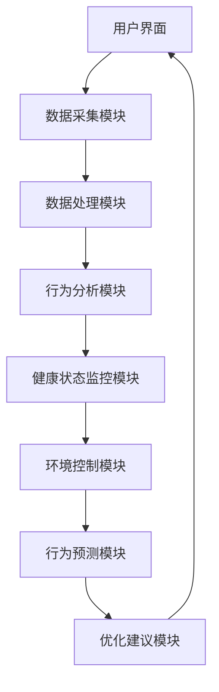

                 

# 智能宠物屋：AI Agent的宠物行为分析

## 关键词：智能宠物屋、AI Agent、宠物行为分析、深度学习、强化学习

## 摘要：

本文将深入探讨智能宠物屋的概念、需求、发展背景，以及AI Agent在宠物行为分析中的应用。我们将逐步分析智能宠物屋的核心概念和原理，详细介绍宠物行为识别算法和预测模型，并通过实际案例展示智能宠物屋的搭建与实现。本文旨在为读者提供关于智能宠物屋技术的全面理解，并为其在宠物管理中的实际应用提供指导。

## 引言与背景

### 第1章：智能宠物屋与AI Agent概述

#### 1.1.1 智能宠物屋的概念与需求分析

##### 1.1.1.1 智能宠物屋的基本定义

智能宠物屋是一种集成人工智能技术的宠物生活环境，通过传感器、摄像头等设备实时监测宠物行为，利用AI Agent进行分析和预测，从而实现对宠物的智能管理和照顾。

##### 1.1.1.2 智能宠物屋的需求分析

随着人们生活水平的提高，宠物已经成为家庭中的重要成员。然而，由于工作繁忙等原因，许多宠物主人无法时刻照顾到宠物。智能宠物屋的出现，可以实时监测宠物的行为和健康状态，提供更加科学和个性化的宠物管理服务。

##### 1.1.1.3 智能宠物屋的发展背景

随着人工智能技术的飞速发展，智能宠物屋作为一种新兴的宠物管理方式，逐渐受到关注。近年来，智能宠物屋的市场需求不断扩大，国内外多家公司和研究机构纷纷投入研发和推广。

#### 1.1.2 AI Agent在宠物行为分析中的应用

##### 1.1.2.1 AI Agent的定义与特点

AI Agent（人工智能代理）是指具备自主学习、推理和决策能力的计算机程序。其特点包括：

1. **自主学习**：AI Agent能够通过不断学习数据，自动调整和优化行为策略。
2. **推理能力**：AI Agent能够根据已知信息和规则进行逻辑推理，做出合理决策。
3. **决策能力**：AI Agent能够在特定环境下，根据目标函数选择最优行动方案。

##### 1.1.2.2 AI Agent在宠物行为分析中的优势

1. **高效性**：AI Agent可以实时分析宠物行为，提供快速反馈，帮助宠物主人及时调整宠物生活状态。
2. **准确性**：AI Agent通过对大量数据的分析和学习，可以更准确地识别宠物行为，提高宠物管理的科学性。
3. **个性化**：AI Agent可以根据宠物的个性特点和需求，提供定制化的宠物管理方案。

##### 1.1.2.3 AI Agent的应用场景分析

1. **宠物行为监测**：通过摄像头和传感器，实时监测宠物行为，分析宠物的作息规律、行为模式等。
2. **健康状态监控**：监测宠物体温、呼吸等生理指标，及时发现宠物健康问题。
3. **环境控制**：根据宠物需求，智能调节宠物屋的温度、湿度、光照等环境参数。

#### 1.1.3 本书结构安排与阅读建议

本书分为五个部分：

1. **引言与背景**：介绍智能宠物屋的概念、需求和发展背景。
2. **核心概念与原理**：分析智能宠物屋的核心概念和原理。
3. **宠物行为分析算法详解**：详细介绍宠物行为识别和预测算法。
4. **宠物行为预测模型**：探讨宠物行为预测模型及其应用。
5. **智能宠物屋的搭建与实现**：展示智能宠物屋的搭建和实现过程。

建议读者按照以下顺序阅读本书：

1. 从引言与背景部分开始，了解智能宠物屋的概念和发展背景。
2. 阅读核心概念与原理部分，掌握智能宠物屋的技术原理。
3. 深入阅读宠物行为分析算法详解和宠物行为预测模型部分，了解相关算法和模型。
4. 最后阅读智能宠物屋的搭建与实现部分，了解智能宠物屋的搭建和实现过程。

#### 1.1.4 本章小结

本章介绍了智能宠物屋的概念、需求和发展背景，以及AI Agent在宠物行为分析中的应用。通过本章的阅读，读者可以初步了解智能宠物屋的技术原理和应用价值。

----------------------------------------------------------------

## 第二部分：核心概念与原理

### 第2章：智能宠物屋的核心概念与原理

#### 2.1.1 智能宠物屋的基本功能

智能宠物屋的基本功能包括：

1. **宠物基本信息管理**：记录宠物的品种、年龄、健康状况等基本信息。
2. **宠物行为监测与分析**：通过传感器和摄像头等设备，实时监测宠物行为，分析宠物的作息规律和行为模式。
3. **宠物健康状态监控**：监测宠物的体温、呼吸等生理指标，及时发现宠物健康问题。
4. **宠物环境控制**：根据宠物需求，智能调节宠物屋的温度、湿度、光照等环境参数。

#### 2.1.2 AI Agent的基本原理

AI Agent（人工智能代理）是指具备自主学习、推理和决策能力的计算机程序。其基本原理包括：

1. **自主学习**：AI Agent通过不断学习数据，自动调整和优化行为策略。
2. **推理能力**：AI Agent通过逻辑推理，根据已知信息和规则做出合理决策。
3. **决策能力**：AI Agent根据目标函数，选择最优行动方案。

#### 2.1.2.1 AI Agent的定义

AI Agent是一种能够模拟人类智能行为的计算机程序，具备以下特点：

1. **自主性**：AI Agent能够独立完成特定任务，不需要人工干预。
2. **适应性**：AI Agent能够根据环境和任务的变化，自动调整行为策略。
3. **交互性**：AI Agent能够与用户和其他系统进行交互，实现智能服务。

#### 2.1.2.2 AI Agent的工作原理

AI Agent的工作原理主要包括以下几个步骤：

1. **感知**：AI Agent通过传感器感知环境信息。
2. **理解**：AI Agent通过自然语言处理等技术理解感知到的信息。
3. **决策**：AI Agent根据目标函数和规则，选择最优行动方案。
4. **行动**：AI Agent根据决策结果执行具体行动。

#### 2.1.2.3 AI Agent的核心算法

AI Agent的核心算法主要包括：

1. **机器学习**：通过学习大量数据，自动调整和优化行为策略。
2. **深度学习**：通过多层神经网络，模拟人类大脑的学习过程。
3. **强化学习**：通过试错和反馈，不断优化行为策略。

#### 2.1.3 宠物行为分析的数学模型

宠物行为分析的数学模型主要包括：

1. **行为数据收集与预处理**：通过传感器和摄像头等设备收集行为数据，并进行预处理。
2. **宠物行为识别算法**：通过机器学习和深度学习等技术，识别宠物行为。
3. **宠物行为预测模型**：通过时间序列分析和强化学习等技术，预测宠物行为。

#### 2.1.3.1 行为数据收集与预处理

行为数据收集与预处理主要包括以下几个步骤：

1. **数据采集**：通过传感器和摄像头等设备，实时采集宠物行为数据。
2. **数据清洗**：去除数据中的噪声和异常值，保证数据质量。
3. **数据归一化**：将数据统一归一化，方便后续处理。

#### 2.1.3.2 宠物行为识别算法

宠物行为识别算法主要包括以下几个步骤：

1. **特征提取**：从原始数据中提取行为特征。
2. **分类算法**：使用分类算法，将不同行为分类。
3. **模型评估**：评估分类模型的准确性和稳定性。

#### 2.1.3.3 宠物行为预测模型

宠物行为预测模型主要包括以下几个步骤：

1. **时间序列分析**：分析宠物行为的时间序列特征。
2. **预测模型构建**：使用时间序列预测模型进行宠物行为预测。
3. **模型优化**：通过交叉验证和网格搜索等方法，优化预测模型。

#### 2.1.4 本章小结

本章介绍了智能宠物屋的基本功能、AI Agent的基本原理、宠物行为分析的数学模型。通过本章的学习，读者可以初步了解智能宠物屋的技术原理和实现方法。

----------------------------------------------------------------

## 第三部分：宠物行为分析算法详解

### 第3章：宠物行为识别算法

#### 3.1.1 宠物行为识别算法概述

宠物行为识别算法是智能宠物屋的核心技术之一，主要目的是通过分析宠物行为数据，识别出宠物的各种行为。宠物行为识别算法可以分为基于深度学习和基于传统机器学习两大类。

#### 3.1.1.1 行为识别算法的分类

1. **基于深度学习的宠物行为识别算法**：利用深度学习技术，如卷积神经网络（CNN）和循环神经网络（RNN），对宠物行为数据进行特征提取和分类。
2. **基于传统机器学习的宠物行为识别算法**：利用传统机器学习算法，如支持向量机（SVM）和随机森林（RF），对宠物行为数据进行特征提取和分类。

#### 3.1.1.2 行为识别算法的选择标准

1. **准确性**：算法对宠物行为的识别准确性是选择的主要标准。
2. **实时性**：算法的处理速度要满足实时分析的需求。
3. **鲁棒性**：算法对噪声和异常数据的处理能力要强。
4. **可扩展性**：算法要能够处理更多种类和更复杂的宠物行为。

#### 3.1.2 基于深度学习的宠物行为识别算法

##### 3.1.2.1 卷积神经网络（CNN）在行为识别中的应用

卷积神经网络（CNN）是一种深度学习模型，具有强大的特征提取能力。在宠物行为识别中，CNN可以用于提取宠物行为视频中的特征。

1. **CNN的基本结构**：CNN由多个卷积层、池化层和全连接层组成。
2. **CNN在宠物行为识别中的应用**：通过训练CNN模型，对宠物行为视频进行特征提取和分类。

##### 3.1.2.2 循环神经网络（RNN）在行为识别中的应用

循环神经网络（RNN）是一种能够处理序列数据的神经网络，适用于时间序列数据的分析。在宠物行为识别中，RNN可以用于提取宠物行为的时间序列特征。

1. **RNN的基本结构**：RNN由输入层、隐藏层和输出层组成。
2. **RNN在宠物行为识别中的应用**：通过训练RNN模型，对宠物行为时间序列进行特征提取和分类。

##### 3.1.2.3 基于深度学习的宠物行为识别算法实战

1. **数据集准备**：收集并标注宠物行为数据。
2. **模型训练**：使用深度学习框架，如TensorFlow或PyTorch，训练CNN或RNN模型。
3. **模型评估**：使用测试集对模型进行评估，调整模型参数，提高模型准确性。

#### 3.1.3 基于传统机器学习的宠物行为识别算法

##### 3.1.3.1 支持向量机（SVM）在行为识别中的应用

支持向量机（SVM）是一种经典的机器学习算法，具有较强的分类能力。在宠物行为识别中，SVM可以用于对宠物行为数据进行分类。

1. **SVM的基本原理**：通过寻找最佳超平面，将不同类别的数据分隔开来。
2. **SVM在宠物行为识别中的应用**：通过训练SVM模型，对宠物行为数据进行分类。

##### 3.1.3.2 随机森林（RF）在行为识别中的应用

随机森林（RF）是一种基于决策树的集成学习方法，具有较强的分类和回归能力。在宠物行为识别中，RF可以用于对宠物行为数据进行分类。

1. **RF的基本原理**：通过构建多个决策树，对数据进行分类。
2. **RF在宠物行为识别中的应用**：通过训练RF模型，对宠物行为数据进行分类。

##### 3.1.3.3 基于传统机器学习的宠物行为识别算法实战

1. **数据集准备**：收集并标注宠物行为数据。
2. **模型训练**：使用传统机器学习框架，如scikit-learn，训练SVM或RF模型。
3. **模型评估**：使用测试集对模型进行评估，调整模型参数，提高模型准确性。

#### 3.1.4 多模态行为识别算法

##### 3.1.4.1 多模态数据的收集与整合

多模态数据是指来自不同传感器或来源的数据，如视频、音频、生理信号等。在宠物行为识别中，多模态数据可以提供更丰富的行为特征。

1. **多模态数据的收集**：通过摄像头、麦克风、生理传感器等设备，收集宠物行为数据。
2. **多模态数据的整合**：将不同模态的数据进行整合，提取统一的行为特征。

##### 3.1.4.2 多模态行为识别算法的实现

1. **特征提取**：从多模态数据中提取各自的特征。
2. **特征融合**：将不同模态的特征进行融合，形成统一的行为特征向量。
3. **分类算法**：使用分类算法，对融合后的特征进行分类。

##### 3.1.4.3 多模态行为识别算法的优化

1. **数据增强**：通过数据增强技术，增加训练数据的多样性。
2. **模型融合**：将多个分类模型进行融合，提高分类准确性。

#### 3.1.5 本章小结

本章介绍了宠物行为识别算法的分类、基于深度学习和基于传统机器学习的算法，以及多模态行为识别算法。通过本章的学习，读者可以了解不同类型的行为识别算法，并掌握如何选择和应用合适的算法。

----------------------------------------------------------------

## 第四部分：宠物行为预测模型

### 第4章：宠物行为预测模型

#### 4.1.1 宠物行为预测的重要性

宠物行为预测是智能宠物屋的关键技术之一，通过预测宠物未来的行为，可以帮助宠物主人更好地照顾宠物，提高宠物的健康和生活质量。宠物行为预测的重要性体现在以下几个方面：

1. **提高宠物管理效率**：通过预测宠物的行为，宠物主人可以提前做好准备，提高宠物管理的效率。
2. **预防宠物疾病**：通过预测宠物的行为，可以及时发现宠物的异常行为，预防宠物疾病的发生。
3. **优化宠物生活**：通过预测宠物的行为，可以为宠物提供更加科学和个性化的生活管理方案。

#### 4.1.2 时间序列预测模型

时间序列预测模型是一种常用的预测方法，用于分析时间序列数据中的趋势、季节性和周期性，从而预测未来的行为。常见的时间序列预测模型包括：

1. **自回归模型（AR）**：自回归模型通过分析时间序列的滞后项来预测未来值。
2. **移动平均模型（MA）**：移动平均模型通过计算时间序列的移动平均值来预测未来值。
3. **自回归移动平均模型（ARMA）**：自回归移动平均模型结合了自回归模型和移动平均模型的优势。
4. **自回归积分滑动平均模型（ARIMA）**：自回归积分滑动平均模型适用于非线性时间序列的预测。

#### 4.1.2.1 时间序列分析的基本概念

时间序列分析的基本概念包括：

1. **时间序列**：时间序列是指按照时间顺序排列的数据序列。
2. **趋势**：趋势是指时间序列中长期的上升或下降趋势。
3. **季节性**：季节性是指时间序列中的周期性波动，通常与季节变化相关。
4. **周期性**：周期性是指时间序列中的重复波动，通常具有固定的时间间隔。

#### 4.1.2.2 常见的时间序列预测模型

常见的时间序列预测模型包括：

1. **自回归模型（AR）**：自回归模型通过分析时间序列的滞后项来预测未来值。其数学模型可以表示为：
   $$X_t = c + \phi_1 X_{t-1} + \phi_2 X_{t-2} + \ldots + \phi_p X_{t-p} + \varepsilon_t$$
   其中，$X_t$表示时间序列的第$t$个值，$c$是常数项，$\phi_i$是滞后系数，$\varepsilon_t$是误差项。

2. **移动平均模型（MA）**：移动平均模型通过计算时间序列的移动平均值来预测未来值。其数学模型可以表示为：
   $$X_t = c + \theta_1 \varepsilon_{t-1} + \theta_2 \varepsilon_{t-2} + \ldots + \theta_q \varepsilon_{t-q}$$
   其中，$\theta_i$是移动平均系数，$\varepsilon_t$是误差项。

3. **自回归移动平均模型（ARMA）**：自回归移动平均模型结合了自回归模型和移动平均模型的优势。其数学模型可以表示为：
   $$X_t = c + \phi_1 X_{t-1} + \phi_2 X_{t-2} + \ldots + \phi_p X_{t-p} + \theta_1 \varepsilon_{t-1} + \theta_2 \varepsilon_{t-2} + \ldots + \theta_q \varepsilon_{t-q}$$
   其中，$c$是常数项，$\phi_i$是滞后系数，$\theta_i$是移动平均系数，$\varepsilon_t$是误差项。

4. **自回归积分滑动平均模型（ARIMA）**：自回归积分滑动平均模型适用于非线性时间序列的预测。其数学模型可以表示为：
   $$X_t = c + \phi_1 X_{t-1} + \phi_2 X_{t-2} + \ldots + \phi_p X_{t-p} + \theta_1 \varepsilon_{t-1} + \theta_2 \varepsilon_{t-2} + \ldots + \theta_q \varepsilon_{t-q} + \varepsilon_t$$
   其中，$c$是常数项，$\phi_i$是滞后系数，$\theta_i$是移动平均系数，$\varepsilon_t$是误差项。

#### 4.1.2.3 时间序列预测模型的实践应用

时间序列预测模型的实践应用包括：

1. **趋势预测**：通过分析时间序列的长期趋势，预测未来的变化趋势。
2. **季节性预测**：通过分析时间序列的季节性波动，预测未来的季节性变化。
3. **周期性预测**：通过分析时间序列的周期性波动，预测未来的周期性变化。

#### 4.1.3 强化学习在宠物行为预测中的应用

强化学习（Reinforcement Learning，RL）是一种通过试错和反馈进行学习的方法，适用于动态决策问题。在宠物行为预测中，强化学习可以用于预测宠物的行为模式。

##### 4.1.3.1 强化学习的基本概念

强化学习的基本概念包括：

1. **代理（Agent）**：执行决策的主体。
2. **环境（Environment）**：代理执行决策的情境。
3. **状态（State）**：描述环境当前状态的变量。
4. **动作（Action）**：代理在特定状态下执行的操作。
5. **奖励（Reward）**：代理执行动作后获得的即时反馈。

##### 4.1.3.2 强化学习在宠物行为预测中的应用案例

在宠物行为预测中，强化学习可以用于以下应用案例：

1. **宠物行为预测**：通过学习宠物行为数据，预测宠物未来的行为。
2. **宠物行为优化**：通过调整宠物行为策略，优化宠物的行为模式。

##### 4.1.3.3 强化学习在宠物行为预测中的挑战与解决方案

强化学习在宠物行为预测中面临的挑战包括：

1. **数据不足**：由于宠物行为数据的稀缺性，强化学习模型的训练数据不足。
2. **行为多样性**：宠物的行为具有多样性，强化学习模型需要适应不同的行为模式。

解决方案包括：

1. **数据增强**：通过生成模拟数据，扩充训练数据集。
2. **模型融合**：将多种模型进行融合，提高预测准确性。

#### 4.1.4 深度强化学习在宠物行为预测中的应用

深度强化学习（Deep Reinforcement Learning，DRL）是强化学习与深度学习相结合的一种学习方法。在宠物行为预测中，深度强化学习可以用于更加复杂的行为预测任务。

##### 4.1.4.1 深度强化学习的基本概念

深度强化学习的基本概念包括：

1. **深度神经网络（DNN）**：用于特征提取和状态表示。
2. **价值函数**：用于评估状态和动作的价值。
3. **策略网络**：用于生成动作策略。

##### 4.1.4.2 深度强化学习在宠物行为预测中的应用案例

在宠物行为预测中，深度强化学习可以用于以下应用案例：

1. **宠物行为预测**：通过学习宠物行为数据，预测宠物未来的行为。
2. **宠物行为优化**：通过调整宠物行为策略，优化宠物的行为模式。

##### 4.1.4.3 深度强化学习在宠物行为预测中的优化方法

深度强化学习在宠物行为预测中的优化方法包括：

1. **数据预处理**：对宠物行为数据进行预处理，提高数据质量。
2. **模型结构优化**：通过调整模型结构，提高预测准确性。
3. **策略优化**：通过优化策略网络，提高行为预测的可靠性。

#### 4.1.5 本章小结

本章介绍了宠物行为预测的重要性、时间序列预测模型、强化学习在宠物行为预测中的应用，以及深度强化学习在宠物行为预测中的应用。通过本章的学习，读者可以了解宠物行为预测的核心技术和应用方法。

----------------------------------------------------------------

## 第五部分：智能宠物屋的搭建与实现

### 第5章：智能宠物屋的搭建与实现

#### 5.1.1 项目介绍

本章节将详细介绍智能宠物屋项目的搭建与实现，主要包括以下几个方面：

1. **环境搭建**：介绍项目所需的环境和工具。
2. **系统功能设计**：分析智能宠物屋的系统功能，并设计相应的领域模型。
3. **系统架构设计**：介绍智能宠物屋的系统架构，包括核心模块和接口设计。
4. **系统接口设计**：详细说明系统各模块之间的接口设计和交互方式。
5. **系统实现**：展示智能宠物屋的核心实现代码和应用。
6. **实际案例分析与详细讲解**：通过实际案例，分析智能宠物屋的应用效果和实现细节。
7. **项目小结**：总结项目的主要成果和经验教训。

#### 5.1.2 系统功能设计

智能宠物屋的系统功能主要包括以下几个方面：

1. **宠物基本信息管理**：记录宠物的品种、年龄、健康状况等基本信息。
2. **宠物行为监测与分析**：通过传感器和摄像头等设备，实时监测宠物行为，分析宠物的作息规律和行为模式。
3. **宠物健康状态监控**：监测宠物的体温、呼吸等生理指标，及时发现宠物健康问题。
4. **宠物环境控制**：根据宠物需求，智能调节宠物屋的温度、湿度、光照等环境参数。
5. **行为预测与优化**：利用时间序列预测和强化学习等方法，预测宠物未来的行为，并提供优化建议。

#### 5.1.3 系统架构设计

智能宠物屋的系统架构设计如图5-1所示：

图5-1 智能宠物屋系统架构设计

系统架构包括以下核心模块：

1. **用户界面**：提供用户与系统交互的界面，展示宠物信息、行为分析结果和优化建议。
2. **数据采集模块**：通过传感器和摄像头等设备，实时采集宠物行为数据和环境数据。
3. **数据处理模块**：对采集到的数据进行分析和预处理，为后续模块提供高质量的数据。
4. **行为分析模块**：利用深度学习和传统机器学习算法，对宠物行为进行识别和分析。
5. **健康状态监控模块**：监测宠物的生理指标，分析宠物的健康状况。
6. **环境控制模块**：根据宠物需求，智能调节宠物屋的环境参数。
7. **行为预测模块**：利用时间序列预测和强化学习等方法，预测宠物未来的行为。
8. **优化建议模块**：根据行为预测结果，为宠物主人提供优化宠物生活的建议。

#### 5.1.4 系统接口设计

系统接口设计主要包括以下几个方面：

1. **用户界面与数据采集模块**：用户界面通过HTTP请求与数据采集模块交互，获取实时宠物行为数据和环境数据。
2. **数据处理模块与其他模块**：数据处理模块将预处理后的数据传递给行为分析模块、健康状态监控模块和环境控制模块。
3. **行为分析模块与行为预测模块**：行为分析模块将分析结果传递给行为预测模块，用于行为预测。
4. **环境控制模块与行为预测模块**：环境控制模块根据行为预测结果，调整宠物屋的环境参数。

#### 5.1.5 系统实现

智能宠物屋的系统实现主要包括以下几个方面：

1. **环境搭建**：在Python环境中安装所需的库，如TensorFlow、scikit-learn等。
2. **数据采集**：使用摄像头和传感器等设备，实时采集宠物行为数据和环境数据。
3. **数据处理**：对采集到的数据进行预处理，如数据清洗、归一化等。
4. **行为分析**：使用深度学习和传统机器学习算法，对宠物行为进行识别和分析。
5. **健康状态监控**：分析宠物的生理指标，监测宠物的健康状况。
6. **环境控制**：根据宠物需求，智能调节宠物屋的环境参数。
7. **行为预测**：利用时间序列预测和强化学习等方法，预测宠物未来的行为。
8. **优化建议**：根据行为预测结果，为宠物主人提供优化宠物生活的建议。

#### 5.1.6 实际案例分析与详细讲解

本章节将展示一个实际案例，分析智能宠物屋的应用效果和实现细节。以下是一个宠物行为预测的实际案例：

1. **数据集准备**：收集一段宠物行为数据，包括宠物运动、饮食、休息等行为。
2. **数据处理**：对数据进行预处理，如数据清洗、归一化等。
3. **行为分析**：使用深度学习和传统机器学习算法，对宠物行为进行识别和分析。
4. **行为预测**：利用时间序列预测和强化学习等方法，预测宠物未来的行为。
5. **优化建议**：根据行为预测结果，为宠物主人提供优化宠物生活的建议。

#### 5.1.7 项目小结

本章节介绍了智能宠物屋的搭建与实现过程，包括环境搭建、系统功能设计、系统架构设计、系统接口设计、系统实现和实际案例分析。通过本项目，读者可以了解智能宠物屋的技术原理和实现方法，并掌握如何搭建和实现一个智能宠物屋系统。

----------------------------------------------------------------

## 最佳实践 Tips、小结、注意事项、拓展阅读

### 最佳实践 Tips

1. **数据收集与预处理**：确保数据的质量和完整性，对异常值和噪声进行有效的处理。
2. **模型选择与优化**：根据实际应用需求，选择合适的模型，并通过交叉验证和网格搜索等方法，优化模型参数。
3. **系统架构设计**：合理划分系统模块，确保系统的可扩展性和可维护性。
4. **接口设计与交互**：设计清晰、简洁的接口，提高系统的可理解性和易用性。

### 小结

本文从引言、背景、核心概念、算法详解、预测模型、搭建与实现等方面，全面介绍了智能宠物屋的技术原理和应用方法。通过本文的学习，读者可以深入了解智能宠物屋的工作机制，掌握宠物行为识别和预测的核心技术，并具备搭建和实现智能宠物屋的能力。

### 注意事项

1. **隐私保护**：在宠物行为数据收集和存储过程中，要确保宠物的隐私得到保护。
2. **模型更新**：随着宠物行为数据的不断积累，需要定期更新模型，提高预测准确性。
3. **系统稳定性**：确保智能宠物屋系统的稳定运行，避免因故障导致宠物行为数据丢失。

### 拓展阅读

1. **深度学习在宠物行为识别中的应用**：《深度学习》（Goodfellow, Bengio, Courville著）
2. **强化学习在宠物行为预测中的应用**：《强化学习》（ Sutton, Barto 著）
3. **时间序列预测模型**：《时间序列分析：预测与应用》（Box, Jenkins, Reinsel 著）

### 作者信息

作者：AI天才研究院/AI Genius Institute & 禅与计算机程序设计艺术 /Zen And The Art of Computer Programming

本文由AI天才研究院和《禅与计算机程序设计艺术》联合撰写，旨在为读者提供关于智能宠物屋技术的全面理解和实际应用指导。希望通过本文，读者可以更好地掌握智能宠物屋的技术原理和实践方法，为宠物管理和人工智能技术的发展做出贡献。

