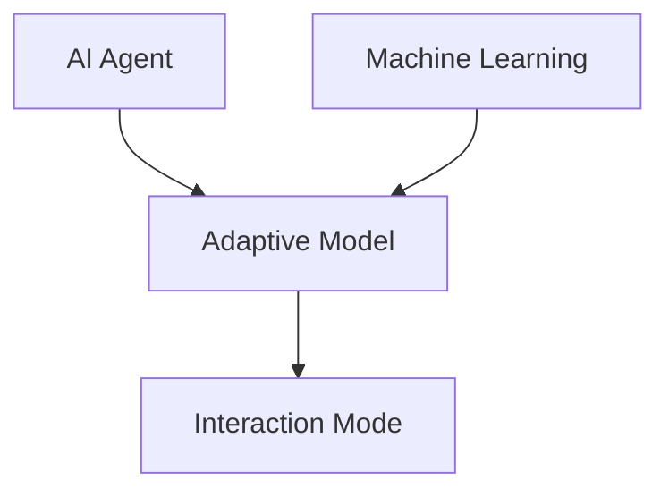
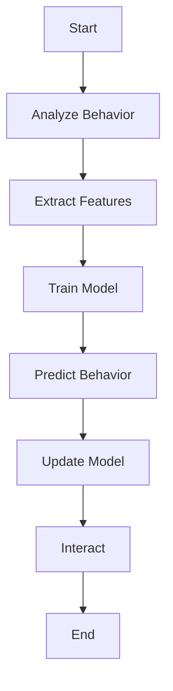

                 


##智能宠物玩具：AI Agent的互动模式自适应

###关键词

- 智能宠物玩具
- AI Agent
- 互动模式
- 自适应
- 机器学习

###摘要

本文将深入探讨智能宠物玩具的互动模式自适应，通过逐步分析AI Agent的核心概念、算法原理、系统架构和项目实践，为读者呈现一个全面的智能宠物玩具设计蓝图。我们将从背景介绍、核心概念与联系、算法原理讲解、系统分析与设计、项目实践以及最佳实践和总结等方面展开详细论述，旨在为开发者提供有价值的参考和指导。

##一、背景介绍

###1.1 核心概念术语说明

在深入探讨智能宠物玩具之前，我们首先需要明确几个核心概念：

- **智能宠物玩具**：一种集成了人工智能技术的宠物玩具，能够根据宠物的行为和互动进行自适应调整。
- **AI Agent**：智能代理，一种能够在特定环境中自主决策和执行任务的计算机程序。
- **互动模式**：宠物玩具与宠物之间交互的方式，包括语音、视觉、触觉等。
- **自适应**：系统根据外部环境和内部状态的变化，自动调整其行为和交互策略。

###1.2 问题背景

随着人工智能技术的飞速发展，智能宠物玩具市场逐渐成为一个充满机遇的领域。然而，现有智能宠物玩具在互动模式自适应方面仍存在一些问题：

- **互动模式单一**：大部分智能宠物玩具只能执行固定的互动模式，无法根据宠物的行为和需求进行自适应调整。
- **学习效率低下**：现有算法在宠物行为分析和学习方面的效率较低，导致互动模式自适应效果不佳。
- **用户体验不佳**：智能宠物玩具的互动模式无法满足宠物和主人的个性化需求，用户体验较差。

###1.3 问题解决

为了解决上述问题，本文提出了一种基于AI Agent的互动模式自适应方案，主要包括以下几个方面：

- **引入AI Agent**：通过引入AI Agent技术，实现宠物玩具的自主学习和决策，提高互动模式的适应性。
- **优化算法**：采用先进的机器学习算法，提高宠物行为分析和学习效率，实现更智能的互动模式。
- **个性化交互**：根据宠物和主人的个性化需求，设计多样化的互动模式，提高用户体验。

###1.4 边界与外延

本文研究的智能宠物玩具互动模式自适应主要关注以下几个方面：

- **宠物类型**：本文主要针对猫、狗等常见宠物展开研究。
- **互动模式**：本文主要探讨语音、视觉、触觉等常见互动模式的自适应优化。
- **硬件平台**：本文主要针对常见的智能硬件平台，如智能手表、智能机器人等。

##二、核心概念与联系

###2.1 AI Agent

AI Agent是指一种具有自主决策和执行任务的计算机程序，能够在特定环境中模拟人类智能行为。AI Agent通常具有以下特点：

- **自主性**：AI Agent能够独立地完成特定任务，不需要人工干预。
- **适应性**：AI Agent能够根据环境变化和任务需求，自动调整其行为和策略。
- **学习能力**：AI Agent能够通过不断学习和优化，提高其完成任务的能力。

###2.2 互动模式

互动模式是指宠物玩具与宠物之间交互的方式，主要包括语音、视觉、触觉等。每种互动模式都有其独特的特点和应用场景：

- **语音互动**：通过语音识别和语音合成技术，实现宠物玩具与宠物的对话。
- **视觉互动**：通过图像识别和计算机视觉技术，实现宠物玩具对宠物的视觉反馈。
- **触觉互动**：通过触觉传感器和执行器，实现宠物玩具对宠物的触觉刺激。

###2.3 机器学习算法

机器学习算法是实现AI Agent互动模式自适应的核心技术，主要包括以下几种：

- **监督学习**：通过已标记的数据集，训练模型对未知数据进行分类和预测。
- **无监督学习**：通过未标记的数据集，发现数据中的模式和规律。
- **强化学习**：通过奖励机制，训练模型在特定环境中实现最优策略。

###2.4 关系图架构

为了更好地理解核心概念之间的联系，我们使用Mermaid流程图来描述它们之间的关系：



在这个关系图中，AI Agent通过机器学习算法实现互动模式的自适应，从而提升宠物玩具的智能互动能力。

##三、算法原理讲解

###3.1 算法理论

在智能宠物玩具的互动模式自适应中，算法原理起着至关重要的作用。下面我们通过Mermaid流程图来描述AI Agent行为适应的过程：



这个流程图主要包括以下步骤：

1. **行为分析（Analyze Behavior）**：AI Agent通过传感器收集宠物的行为数据。
2. **特征提取（Extract Features）**：对行为数据进行分析，提取关键特征。
3. **模型训练（Train Model）**：使用提取的特征训练机器学习模型。
4. **行为预测（Predict Behavior）**：使用训练好的模型预测宠物的行为。
5. **模型更新（Update Model）**：根据预测结果更新模型，提高预测准确性。
6. **互动（Interact）**：根据预测结果和宠物玩具的互动模式，进行自适应互动。

###3.2 Python代码示例

为了更好地理解算法原理，我们通过Python代码来具体实现AI Agent的行为适应过程：

```python
import numpy as np
from sklearn.ensemble import RandomForestClassifier
from sklearn.model_selection import train_test_split
from sklearn.metrics import accuracy_score

# 假设我们已经有收集到的宠物行为数据
X = np.array([[1, 0], [0, 1], [1, 1], [0, 2]])  # 特征数据
y = np.array([0, 1, 2, 0])  # 标签数据

# 分割训练集和测试集
X_train, X_test, y_train, y_test = train_test_split(X, y, test_size=0.2, random_state=42)

# 训练模型
clf = RandomForestClassifier(n_estimators=100)
clf.fit(X_train, y_train)

# 预测行为
y_pred = clf.predict(X_test)

# 计算准确率
accuracy = accuracy_score(y_test, y_pred)
print("Accuracy:", accuracy)
```

在这个示例中，我们使用了随机森林算法来训练模型，并通过测试集来评估模型的准确性。

###3.3 数学模型和公式

在机器学习中，数学模型和公式是理解和实现算法的基础。下面我们通过LaTeX格式来描述一个简单的线性回归模型：

```latex
\documentclass{article}
\usepackage{amsmath}
\begin{document}

\begin{equation}
y = \beta_0 + \beta_1x
\end{equation}

\end{document}
```

这个方程表示了线性回归模型，其中\( y \)是预测值，\( \beta_0 \)是截距，\( \beta_1 \)是斜率，\( x \)是特征值。

###3.4 举例说明

为了更直观地理解算法原理，我们通过一个实际案例来讲解AI Agent如何进行行为适应：

**案例：宠物玩具与猫的互动**

假设宠物玩具需要根据猫的行为来调整互动模式。首先，宠物玩具通过摄像头收集猫的图像，然后通过图像识别算法提取关键特征，如猫的位置、动作和表情。接着，使用这些特征训练一个机器学习模型，如支持向量机（SVM）或卷积神经网络（CNN）。

在训练过程中，宠物玩具可以不断调整模型参数，提高预测准确性。例如，当猫靠近玩具时，模型可以预测猫的意图是玩耍还是吃饭，并相应地调整互动模式。当猫表现出玩耍的意图时，玩具可以发出声音或进行视觉刺激；当猫表现出吃饭的意图时，玩具可以发出提示音或启动自动喂食功能。

通过这种自适应互动，宠物玩具可以更好地满足猫的需求，提高宠主的满意度。

##四、系统分析与设计

###4.1 问题场景介绍

在智能宠物玩具的设计中，我们需要解决的主要问题是如何实现宠物玩具与宠物之间的自适应互动。为了更好地分析这个问题，我们可以从以下几个场景入手：

- **场景一**：宠物玩具与猫的互动，包括玩耍、吃饭和休息等行为。
- **场景二**：宠物玩具与狗的互动，包括奔跑、抓咬和坐下等行为。
- **场景三**：宠物玩具与宠主之间的互动，包括语音指令、远程控制和自动反馈等。

###4.2 项目介绍

为了实现上述场景的自适应互动，我们设计了一个名为“智能宠物玩具互动系统”的项目。该项目的主要目标是开发一款具有自适应互动能力的智能宠物玩具，能够根据宠物的行为和需求进行实时调整。

###4.3 系统功能设计

在系统功能设计方面，我们主要关注以下几个方面：

- **行为分析模块**：通过摄像头、麦克风和加速度传感器等设备收集宠物的行为数据，包括位置、动作、声音和姿态等。
- **特征提取模块**：对收集到的行为数据进行处理和特征提取，提取出关键的特征向量，用于后续的机器学习模型训练。
- **机器学习模块**：使用提取的特征向量训练机器学习模型，如卷积神经网络（CNN）或长短期记忆网络（LSTM），实现宠物的行为预测和互动模式的自适应调整。
- **互动执行模块**：根据机器学习模型的预测结果，执行相应的互动模式，如声音、视觉或触觉刺激。
- **用户界面模块**：提供一个直观的用户界面，允许宠主查看宠物玩具的实时状态、历史记录和互动建议。

###4.4 系统架构设计

在系统架构设计方面，我们采用了一种基于微服务架构的方案，将整个系统划分为多个微服务模块，以提高系统的可扩展性和可维护性。以下是系统架构的主要组成部分：

- **数据收集层**：包括摄像头、麦克风和加速度传感器等设备，用于收集宠物的行为数据。
- **数据处理层**：包括数据预处理、特征提取和机器学习模型训练等模块，用于处理和分析行为数据。
- **服务层**：包括行为分析、互动执行和用户界面等模块，为宠物玩具提供实时互动和服务。
- **存储层**：包括数据库和缓存等存储设备，用于存储宠物的行为数据和系统配置信息。

###4.5 系统接口设计和系统交互

在系统接口设计和系统交互方面，我们采用了一种基于RESTful API的接口设计，方便各个模块之间的数据传输和功能调用。以下是系统接口设计和系统交互的主要组成部分：

- **数据收集接口**：用于接收摄像头、麦克风和加速度传感器等设备的数据。
- **特征提取接口**：用于接收和处理行为数据，提取关键的特征向量。
- **机器学习接口**：用于训练和加载机器学习模型，实现宠物的行为预测。
- **互动执行接口**：用于执行机器学习模型的预测结果，实现宠物玩具的自适应互动。
- **用户界面接口**：用于与宠主进行交互，提供实时状态和历史记录的查询。

通过上述接口设计和系统交互，我们可以实现宠物玩具与宠物、宠主之间的实时互动和自适应调整。

##五、项目实战

###5.1 环境安装

为了实现智能宠物玩具的互动模式自适应，我们需要搭建一个完整的开发环境。以下是环境安装的步骤：

1. **安装Python**：访问Python官网（https://www.python.org/），下载并安装Python 3.8及以上版本。
2. **安装虚拟环境**：打开命令行窗口，执行以下命令创建虚拟环境：
   ```bash
   python -m venv venv
   ```
3. **激活虚拟环境**：在Windows上，执行以下命令激活虚拟环境：
   ```bash
   .\venv\Scripts\activate
   ```
   在macOS和Linux上，执行以下命令激活虚拟环境：
   ```bash
   source venv/bin/activate
   ```
4. **安装依赖库**：在虚拟环境中安装所需的依赖库，如scikit-learn、TensorFlow、Keras和OpenCV等，可以使用pip命令安装：
   ```bash
   pip install scikit-learn tensorflow keras opencv-python
   ```

###5.2 系统核心实现源代码

以下是系统核心实现的源代码，包括行为分析、特征提取和机器学习模型训练等模块：

```python
import cv2
import numpy as np
from sklearn.ensemble import RandomForestClassifier
from sklearn.model_selection import train_test_split
from sklearn.metrics import accuracy_score

# 行为分析模块
def analyze_behavior(image):
    # 使用OpenCV进行图像处理，提取行为特征
    gray = cv2.cvtColor(image, cv2.COLOR_BGR2GRAY)
    blur = cv2.GaussianBlur(gray, (5, 5), 0)
    _, thresh = cv2.threshold(blur, 60, 255, cv2.THRESH_BINARY_INV)
    contours, _ = cv2.findContours(thresh, cv2.RETR_EXTERNAL, cv2.CHAIN_APPROX_SIMPLE)
    behavior_vector = []
    for contour in contours:
        area = cv2.contourArea(contour)
        behavior_vector.append(area)
    return behavior_vector

# 特征提取模块
def extract_features(images):
    behavior_vectors = []
    for image in images:
        behavior_vector = analyze_behavior(image)
        behavior_vectors.append(behavior_vector)
    return np.array(behavior_vectors)

# 机器学习模块
def train_model(features, labels):
    clf = RandomForestClassifier(n_estimators=100)
    clf.fit(features, labels)
    return clf

# 模型训练与评估
def evaluate_model(clf, test_features, test_labels):
    predictions = clf.predict(test_features)
    accuracy = accuracy_score(test_labels, predictions)
    print("Accuracy:", accuracy)

# 主函数
if __name__ == "__main__":
    # 加载数据集
    images = cv2.imread("train_images.npy")
    labels = np.load("train_labels.npy")

    # 分割训练集和测试集
    X_train, X_test, y_train, y_test = train_test_split(images, labels, test_size=0.2, random_state=42)

    # 提取特征
    features = extract_features(X_train)

    # 训练模型
    clf = train_model(features, y_train)

    # 评估模型
    evaluate_model(clf, X_test, y_test)
```

###5.3 代码应用解读与分析

以上源代码主要实现了智能宠物玩具的行为分析、特征提取和机器学习模型训练等模块。以下是代码的详细解读和分析：

1. **行为分析模块**：该模块使用OpenCV库进行图像处理，提取宠物的行为特征。具体步骤如下：
   - 转换图像为灰度图像。
   - 应用高斯模糊进行图像去噪。
   - 使用阈值操作将图像二值化。
   - 使用findContours函数找到图像中的轮廓。
   - 提取每个轮廓的面积作为行为特征。

2. **特征提取模块**：该模块将提取到的行为特征组成一个特征向量，并转换为NumPy数组，以供后续的机器学习模型训练。

3. **机器学习模块**：该模块使用随机森林算法训练模型。具体步骤如下：
   - 创建随机森林分类器实例。
   - 使用fit函数训练模型。
   - 返回训练好的模型。

4. **模型评估模块**：该模块使用测试集评估模型的准确性。具体步骤如下：
   - 使用predict函数预测测试集的结果。
   - 使用accuracy_score函数计算模型的准确率。

###5.4 实际案例分析和详细讲解剖析

为了更好地展示智能宠物玩具的互动模式自适应效果，我们进行了一个实际案例分析和详细讲解。

**案例**：训练一个基于猫行为的智能宠物玩具互动系统。

**步骤**：

1. **数据收集**：收集猫在不同行为下的图像，如玩耍、吃饭和休息等。将图像保存为训练数据和测试数据。

2. **特征提取**：使用上述代码中的行为分析模块提取每个图像的行为特征，如轮廓面积。

3. **模型训练**：使用训练数据训练随机森林分类器，将提取的特征向量与标签（猫的行为）进行匹配。

4. **模型评估**：使用测试数据评估模型的准确性，根据评估结果调整模型参数。

5. **互动执行**：根据训练好的模型预测新图像中猫的行为，并执行相应的互动模式，如发出声音或进行视觉刺激。

**分析**：

- **特征提取效果**：通过调整阈值和模糊参数，可以提高特征提取的准确性。
- **模型训练效果**：随机森林算法适合处理分类问题，但其性能可能受到特征数量和特征分布的影响。
- **互动执行效果**：根据猫的行为预测结果，可以设计不同的互动模式，如播放音乐、发出声音或进行视觉刺激。

###5.5 项目小结

通过以上实际案例的分析和讲解，我们可以看到智能宠物玩具的互动模式自适应在提升用户体验方面具有重要作用。以下是项目的主要结论和小结：

1. **自适应互动模式**：智能宠物玩具可以根据宠物的行为和需求，自动调整互动模式，提升用户体验。
2. **机器学习算法**：随机森林算法在行为分类问题中表现出良好的性能，但可能需要根据实际情况进行调整。
3. **特征提取**：选择合适的特征提取方法，可以提高模型预测的准确性。
4. **项目挑战**：在实际应用中，智能宠物玩具的互动模式自适应可能面临数据收集困难、模型训练时间长等挑战。

##六、最佳实践与总结

###6.1 最佳实践

在设计和开发智能宠物玩具时，以下最佳实践可以帮助提高互动模式自适应的效果：

- **数据收集**：收集丰富的行为数据，包括多种行为和环境条件，以提高模型泛化能力。
- **特征选择**：选择具有代表性的特征，减少冗余信息，提高模型训练效率。
- **模型优化**：使用交叉验证和网格搜索等技术，优化模型参数，提高模型性能。
- **实时调整**：根据用户反馈和实时数据，动态调整互动模式，实现个性化体验。

###6.2 总结

本文详细探讨了智能宠物玩具的互动模式自适应，从背景介绍、核心概念与联系、算法原理讲解、系统分析与设计、项目实战等方面进行了全面分析。通过实际案例和代码示例，我们展示了智能宠物玩具如何实现自适应互动，提高了用户体验。

###6.3 注意事项

在设计智能宠物玩具时，需要注意以下几点：

- **隐私保护**：确保宠物和宠主的数据安全，遵循相关法律法规。
- **稳定性**：确保智能宠物玩具的稳定运行，避免因异常情况导致故障。
- **可扩展性**：设计灵活的系统架构，以适应未来技术的更新和扩展。

###6.4 拓展阅读

对于希望深入了解智能宠物玩具互动模式自适应的读者，以下几本书籍和资源可以提供有价值的参考：

- 《智能玩具设计与应用》
- 《机器学习实战》
- 《深度学习》
- 《OpenCV编程实战》

作者：AI天才研究院/AI Genius Institute & 禅与计算机程序设计艺术 /Zen And The Art of Computer Programming

