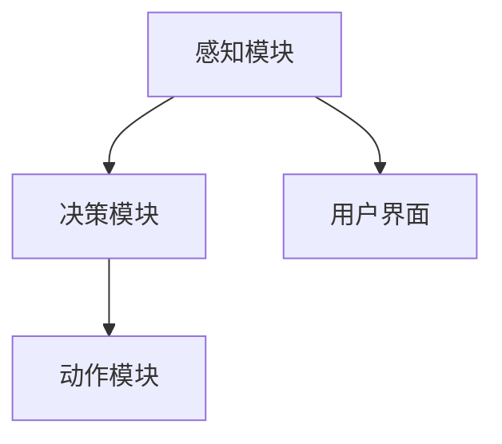
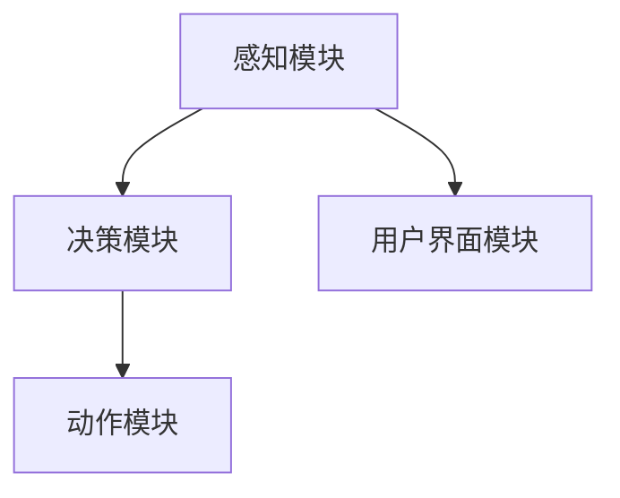

                 

# 智能宠物玩具：AI Agent的互动模式调整

## 关键词

- 智能宠物玩具
- AI Agent
- 互动模式调整
- 用户行为分析
- 深度学习

## 摘要

随着人工智能技术的不断发展，智能宠物玩具逐渐成为市场的新宠。然而，当前智能宠物玩具的互动模式尚存在诸多问题和挑战，如用户体验不佳、互动机制单一等。本文旨在探讨如何通过AI Agent实现智能宠物玩具互动模式的优化和调整，以提高用户体验和宠物满意度。文章将从AI Agent的核心概念、设计原理、互动模式调整的方法与实践，以及案例研究等多个方面进行分析，并总结最佳实践与未来展望。

## 第一部分：引言

### 1.1 问题背景

#### 核心问题

当前智能宠物玩具在互动模式上存在哪些问题和挑战？

#### 问题描述

1. **用户体验不佳**：现有智能宠物玩具的互动方式单一，无法满足用户对多样化、个性化互动的需求。
2. **互动机制单一**：大多数智能宠物玩具仅能执行预设的互动行为，缺乏灵活性和适应性。
3. **技术限制**：智能宠物玩具在感知、决策和执行等方面的技术能力有限，难以实现复杂的互动模式。

#### 问题解决

通过引入AI Agent，实现智能宠物玩具互动模式的优化和调整，提升用户体验和宠物满意度。

#### 边界与外延

1. **交互对象**：智能宠物玩具的主要交互对象为宠物（如猫、狗等）。
2. **应用场景**：智能宠物玩具适用于家庭、宠物店、宠物医院等场景。
3. **概念结构与核心要素组成**
   - **智能宠物玩具**：具有智能互动功能的宠物玩具。
   - **AI Agent**：自主执行任务的人工智能实体。
   - **互动模式**：智能宠物玩具与宠物之间的交互方式。

### 1.2 AI Agent的核心概念

#### AI Agent的定义

AI Agent是指具备自主决策和行动能力，能够与环境和其他Agent进行交互的智能实体。在智能宠物玩具中，AI Agent负责分析宠物行为，制定互动策略，并执行相应的互动行为。

#### AI Agent的工作原理和功能特点

1. **工作原理**
   - **感知模块**：获取环境信息和宠物行为数据。
   - **决策模块**：根据感知模块提供的信息，分析宠物的需求和偏好。
   - **动作模块**：执行决策模块生成的互动策略。

2. **功能特点**
   - **自主性**：AI Agent能够独立完成互动任务，无需人工干预。
   - **适应性**：AI Agent可以根据宠物的行为和用户反馈，不断调整互动模式。
   - **灵活性**：AI Agent可以执行多种类型的互动行为，满足不同宠物的需求。

#### AI Agent的类型

1. **基于规则的AI Agent**：根据预设的规则进行决策和行动。
2. **基于模型的AI Agent**：利用机器学习模型预测宠物行为，进行决策和行动。
3. **基于强化学习的AI Agent**：通过与环境的交互，不断学习和优化互动策略。

### 1.3 互动模式的定义与特性

#### 互动模式的概念

互动模式是指智能宠物玩具与宠物之间的交互方式。互动模式决定了智能宠物玩具的交互方式、行为表现和用户体验。

#### 互动模式的特性

1. **灵活性**：互动模式可以根据宠物的行为和用户偏好进行动态调整。
2. **可定制性**：用户可以根据宠物的需求和偏好，自定义互动模式。
3. **适应性**：互动模式可以根据宠物的行为变化，自动调整互动策略。
4. **多样性**：互动模式可以涵盖多种类型的互动行为，如游戏、训练、互动等。

## 第二部分：AI Agent的设计原理

### 2.1 AI Agent的设计原则

#### 适应性设计

AI Agent应根据宠物的行为和用户偏好，进行自适应调整，以提高用户体验和宠物满意度。

#### 用户友好性

AI Agent应具备良好的用户界面，便于用户进行设置和操作，同时提供实时反馈和帮助信息。

### 2.2 AI Agent的架构

#### 核心模块

1. **感知模块**：负责感知宠物行为和环境信息，为决策模块提供数据支持。
2. **决策模块**：根据感知模块提供的数据，分析宠物的需求和偏好，生成互动策略。
3. **动作模块**：执行决策模块生成的互动策略，与宠物进行交互。

#### 架构设计



### 2.3 AI Agent的学习机制

#### 机器学习算法

AI Agent可以采用多种机器学习算法，如决策树、神经网络、支持向量机等，以提高互动模式的准确性和适应性。

#### 深度学习模型

深度学习模型，如卷积神经网络（CNN）和循环神经网络（RNN），在处理复杂的数据和模式识别方面具有优势，有助于提升AI Agent的互动能力。

## 第三部分：互动模式调整的方法与实践

### 3.1 基于行为分析的模式调整

#### 用户行为分析

利用数据分析方法，对宠物的行为进行监测和分析，为互动模式的调整提供数据支持。

#### 模式调整策略

根据宠物行为分析结果，制定相应的互动模式调整策略，以提高宠物满意度和用户体验。

### 3.2 基于用户反馈的模式优化

#### 用户反馈机制

建立有效的用户反馈渠道，收集用户对互动模式的意见和建议，为互动模式的优化提供参考。

#### 优化方法

根据用户反馈，调整互动模式，以提升用户满意度和宠物互动效果。

### 3.3 基于环境感知的模式调整

#### 环境感知技术

利用环境感知技术，如摄像头、传感器等，实时监测宠物行为和环境变化，为互动模式的调整提供依据。

#### 模式调整方案

根据环境感知技术提供的信息，动态调整互动模式，以适应不同环境和宠物需求。

## 第四部分：智能宠物玩具的案例研究

### 4.1 案例一：智能宠物狗玩具

#### 问题场景

分析智能宠物狗玩具在互动模式上的挑战和需求。

#### 系统设计

介绍智能宠物狗玩具的系统架构和功能设计。

#### 实现细节

展示智能宠物狗玩具的核心实现源代码和应用场景。

### 4.2 案例二：智能宠物猫玩具

#### 问题场景

探讨智能宠物猫玩具的互动模式调整需求。

#### 系统设计

介绍智能宠物猫玩具的系统架构和功能设计。

#### 实现细节

展示智能宠物猫玩具的核心实现源代码和应用场景。

## 第五部分：最佳实践与未来展望

### 5.1 最佳实践

总结互动模式调整的最佳实践和技巧。

### 5.2 未来展望

探讨未来智能宠物玩具互动模式的发展趋势。

### 5.3 小结与建议

提出在互动模式调整过程中需要注意的问题和挑战。

### 作者信息

作者：AI天才研究院/AI Genius Institute & 禅与计算机程序设计艺术 /Zen And The Art of Computer Programming### 完整文章正文

#### 引言

随着科技的发展，人工智能（AI）已经渗透到我们日常生活的方方面面，从智能家居到智能医疗，再到智能娱乐。在这些领域中，智能宠物玩具作为一种新兴的产品类别，也逐渐引起了广泛关注。智能宠物玩具通过内置的AI技术，能够与宠物进行互动，提高宠物的幸福感和主人的生活质量。然而，当前智能宠物玩具的互动模式尚存在诸多问题和挑战，如用户体验不佳、互动机制单一等。本文旨在探讨如何通过AI Agent实现智能宠物玩具互动模式的优化和调整，以提高用户体验和宠物满意度。

首先，我们需要明确本文的研究背景和目的。本文将首先介绍智能宠物玩具的当前状态，分析其中存在的问题和挑战。接着，我们将探讨AI Agent的核心概念，以及其在智能宠物玩具中的应用。随后，我们将深入分析互动模式的定义与特性，并在此基础上讨论AI Agent的设计原理。最后，我们将提出互动模式调整的方法与实践，并通过具体案例进行详细研究，总结最佳实践与未来展望。

#### 核心概念

在讨论智能宠物玩具和AI Agent的互动模式之前，我们需要先了解一些核心概念。

**智能宠物玩具**是一种集成了人工智能技术的宠物玩具，它能够与宠物进行互动，提供娱乐、训练和陪伴等功能。智能宠物玩具通常具有以下几个特点：

1. **互动性**：智能宠物玩具能够通过声音、动作、智能反馈等方式与宠物进行互动。
2. **智能化**：智能宠物玩具内置了AI算法，能够根据宠物的行为和偏好进行自适应调整。
3. **多功能性**：智能宠物玩具不仅能够提供娱乐功能，还能进行宠物训练、健康监测等。

**AI Agent**（人工智能代理）是一种能够自主决策和执行任务的智能实体。它通常由三个核心模块组成：感知模块、决策模块和动作模块。

- **感知模块**：负责获取环境信息和宠物行为数据。
- **决策模块**：根据感知模块提供的信息，分析宠物的需求和偏好，生成互动策略。
- **动作模块**：执行决策模块生成的互动策略，与宠物进行交互。

在智能宠物玩具中，AI Agent负责分析宠物的行为，制定互动策略，并执行相应的互动行为。这种自主性、适应性和灵活性的特点，使得AI Agent能够显著提升智能宠物玩具的互动效果。

#### 问题描述

当前智能宠物玩具在互动模式上存在以下几个主要问题和挑战：

1. **用户体验不佳**：大多数智能宠物玩具的互动方式单一，无法满足用户对多样化、个性化互动的需求。例如，一些智能宠物玩具只能执行预设的互动行为，如追逐、躲藏等，而无法根据宠物的行为和偏好进行动态调整。

2. **互动机制单一**：智能宠物玩具的互动机制通常较为简单，缺乏灵活性和适应性。例如，一些智能宠物玩具只能通过声音或动作与宠物进行互动，而无法感知宠物的情绪和需求。

3. **技术限制**：智能宠物玩具在感知、决策和执行等方面的技术能力有限，难以实现复杂的互动模式。例如，当前的智能宠物玩具很难同时处理多个宠物的行为数据，也很难根据环境变化进行自适应调整。

为了解决这些问题，我们需要通过引入AI Agent来优化智能宠物玩具的互动模式。AI Agent可以分析宠物的行为，根据宠物的需求和偏好，动态调整互动策略，从而提高用户体验和宠物满意度。

#### 边界与外延

在探讨智能宠物玩具和AI Agent的互动模式时，我们需要明确一些边界和概念。

**边界**：

1. **交互对象**：智能宠物玩具的主要交互对象是宠物，尤其是猫和狗等常见的宠物种类。

2. **应用场景**：智能宠物玩具适用于家庭、宠物店、宠物医院等多种场景。在家中使用智能宠物玩具，可以为宠物提供陪伴和娱乐，减轻主人因工作忙碌而无法长时间陪伴宠物的问题。在宠物店和宠物医院中，智能宠物玩具可以作为宠物训练工具，帮助宠物建立良好的行为习惯。

**外延**：

1. **概念结构与核心要素组成**：智能宠物玩具由多个核心要素组成，包括：

   - **硬件**：如内置传感器、摄像头、音响等，用于感知宠物行为和环境信息。
   - **软件**：如AI算法和互动策略，用于分析宠物行为，制定互动策略。
   - **用户界面**：如移动应用或网页界面，用于用户设置和管理智能宠物玩具。

   **AI Agent**作为智能宠物玩具的核心组件，其结构包括感知模块、决策模块和动作模块。感知模块负责收集宠物行为和环境信息，决策模块负责分析这些信息，生成互动策略，动作模块负责执行这些策略。

2. **互动模式的定义与特性**：互动模式是指智能宠物玩具与宠物之间的交互方式。它具有以下特性：

   - **灵活性**：互动模式可以根据宠物的行为和用户偏好进行动态调整。
   - **可定制性**：用户可以根据宠物的需求和偏好，自定义互动模式。
   - **适应性**：互动模式可以根据宠物的行为变化，自动调整互动策略。
   - **多样性**：互动模式可以涵盖多种类型的互动行为，如游戏、训练、互动等。

通过明确这些边界和外延，我们可以更准确地理解智能宠物玩具和AI Agent的互动模式，为后续的研究提供基础。

#### AI Agent的核心概念

**AI Agent**（人工智能代理）是一种能够自主决策和执行任务的智能实体。它由感知模块、决策模块和动作模块组成，通过这些模块协同工作，实现与环境的交互和任务执行。在智能宠物玩具中，AI Agent扮演着关键角色，负责分析宠物的行为，制定互动策略，并执行相应的互动行为。

**AI Agent的定义**：

AI Agent是指一种具有自主决策和行动能力，能够与环境和其他Agent进行交互的智能实体。它通过感知模块获取环境信息，通过决策模块分析这些信息，并通过动作模块执行决策，实现与环境的互动。

**AI Agent的工作原理和功能特点**：

1. **感知模块**：感知模块负责获取环境信息和宠物行为数据。这些数据包括宠物的动作、声音、位置等。通过感知模块，AI Agent能够实时了解宠物的状态和环境变化。

2. **决策模块**：决策模块根据感知模块提供的信息，分析宠物的需求和偏好。通过机器学习算法，AI Agent可以学习宠物的行为模式，预测宠物的下一步行动，并制定相应的互动策略。

3. **动作模块**：动作模块负责执行决策模块生成的互动策略。通过动作模块，AI Agent可以控制智能宠物玩具的动作、声音等，与宠物进行互动。

**AI Agent的类型**：

1. **基于规则的AI Agent**：这种类型的AI Agent通过预设的规则进行决策和行动。例如，如果宠物靠近玩具，则玩具发出声音。这种类型的AI Agent简单易实现，但灵活性较差，无法适应复杂的变化。

2. **基于模型的AI Agent**：这种类型的AI Agent通过机器学习模型预测宠物行为，进行决策和行动。例如，通过训练卷积神经网络（CNN）或循环神经网络（RNN），AI Agent可以学习宠物的行为模式，并预测宠物的下一步行动。这种类型的AI Agent具有较高的灵活性和适应性。

3. **基于强化学习的AI Agent**：这种类型的AI Agent通过与环境的交互，不断学习和优化互动策略。例如，通过强化学习算法，AI Agent可以不断调整互动策略，以最大化宠物的满意度和互动效果。这种类型的AI Agent具有很高的自主性和适应性。

通过引入不同类型的AI Agent，智能宠物玩具可以更好地适应宠物的需求和偏好，提供更丰富、更个性化的互动体验。

#### 互动模式的定义与特性

**互动模式**是指智能宠物玩具与宠物之间的交互方式。互动模式决定了智能宠物玩具的交互方式、行为表现和用户体验。一个良好的互动模式应具备以下几个特性：

1. **灵活性**：互动模式应能够根据宠物的行为和用户偏好进行动态调整，以适应不同的场景和需求。例如，当宠物感到兴奋时，互动模式可以更活泼；当宠物感到疲倦时，互动模式可以更温和。

2. **可定制性**：用户应能够根据宠物的需求和偏好，自定义互动模式。例如，用户可以设置互动的时间、频率和方式，以适应宠物的习惯和喜好。

3. **适应性**：互动模式应能够根据宠物的行为变化，自动调整互动策略。例如，当宠物对新玩具失去兴趣时，互动模式可以自动切换到其他类型的互动。

4. **多样性**：互动模式应涵盖多种类型的互动行为，如游戏、训练、互动等，以满足宠物的不同需求。例如，当宠物需要训练时，互动模式可以设置训练任务；当宠物需要娱乐时，互动模式可以设置游戏。

通过具备这些特性，互动模式可以显著提升智能宠物玩具的用户体验和宠物满意度。

#### AI Agent的设计原则

为了设计一个有效的AI Agent，我们需要遵循一些关键的设计原则，以确保其能够实现预期的功能，并具备良好的用户体验。

**适应性设计**：

AI Agent应能够根据宠物的行为和用户偏好进行自适应调整，以提供个性化的互动体验。例如，通过实时监测宠物的行为数据，AI Agent可以动态调整互动策略，以适应宠物的情绪和需求。

**用户友好性**：

AI Agent应具备良好的用户界面，便于用户进行设置和操作。用户界面应简洁直观，提供实时反馈和帮助信息，以降低用户的学习成本，提高用户满意度。

**模块化设计**：

AI Agent应采用模块化设计，将感知模块、决策模块和动作模块独立开发和管理。这种设计方式不仅提高了系统的可维护性，还便于未来的扩展和升级。

**可扩展性**：

AI Agent应具备良好的扩展性，以支持未来的功能升级和技术迭代。例如，通过模块化设计，AI Agent可以轻松集成新的机器学习算法或传感器，以提升互动能力。

**可靠性**：

AI Agent应具备高可靠性，能够在各种环境下稳定运行，确保互动体验的连续性和稳定性。

**可解释性**：

AI Agent的决策过程应具备一定的可解释性，以便用户了解AI Agent的行为依据。这有助于建立用户对AI Agent的信任，并提高用户的满意度。

通过遵循这些设计原则，AI Agent可以更好地满足宠物的需求和用户的期望，提供高质量的互动体验。

#### AI Agent的架构

AI Agent的架构是智能宠物玩具的核心组成部分，它决定了AI Agent的功能实现和性能表现。一个典型的AI Agent架构通常包括以下几个核心模块：

1. **感知模块**：
   - **功能**：感知模块负责收集环境信息和宠物行为数据。这些数据可以是实时的，也可以是历史数据。
   - **技术**：感知模块可以集成各种传感器，如摄像头、加速度计、温度传感器等，以获取丰富的感知信息。
   - **作用**：感知模块为AI Agent提供决策所需的输入数据，是整个架构的基础。

2. **决策模块**：
   - **功能**：决策模块根据感知模块提供的数据，分析宠物的行为和需求，生成相应的互动策略。
   - **技术**：决策模块可以采用机器学习算法、决策树、神经网络等模型，对数据进行处理和分析。
   - **作用**：决策模块是AI Agent的“大脑”，负责制定互动策略，指导动作模块执行。

3. **动作模块**：
   - **功能**：动作模块根据决策模块生成的互动策略，控制智能宠物玩具的动作、声音等，与宠物进行互动。
   - **技术**：动作模块可以通过电机、扬声器、显示器等设备执行具体的动作。
   - **作用**：动作模块是AI Agent的“执行者”，负责将决策模块的策略转化为实际的互动行为。

4. **用户界面模块**：
   - **功能**：用户界面模块为用户提供一个操作和监控AI Agent的接口。
   - **技术**：用户界面模块可以是移动应用、网页界面或物理控制面板等。
   - **作用**：用户界面模块是用户与AI Agent之间的桥梁，使用户能够方便地设置和管理AI Agent。

**核心模块的详细描述**：

- **感知模块**：
  感知模块通过集成多种传感器，如摄像头、加速度计、温度传感器等，实时监测宠物的行为和环境信息。例如，摄像头可以捕捉宠物的动作，加速度计可以感知宠物的运动状态，温度传感器可以监测宠物的舒适度。这些传感器收集到的数据将被实时传输到决策模块，作为决策的依据。

- **决策模块**：
  决策模块接收感知模块提供的数据，并利用机器学习算法进行处理和分析。这些算法可以包括神经网络、决策树、支持向量机等，用于识别宠物的行为模式、情感状态和需求。例如，通过分析摄像头的图像数据，决策模块可以识别宠物的兴奋、疲惫或厌烦等情绪，并生成相应的互动策略。

- **动作模块**：
  动作模块根据决策模块生成的互动策略，控制智能宠物玩具的动作、声音和光线等。例如，当决策模块判断宠物感到兴奋时，动作模块可以启动玩具的追逐模式，通过快速移动和声音吸引宠物的注意力。当决策模块判断宠物感到疲倦时，动作模块可以切换到舒缓模式，通过温和的光线和声音帮助宠物放松。

- **用户界面模块**：
  用户界面模块为用户提供了一个方便的操作和监控界面。用户可以通过移动应用或网页界面，实时监控宠物的行为和AI Agent的互动情况，还可以设置AI Agent的工作模式、互动策略等。用户界面模块还提供了一些互动数据分析和报告功能，帮助用户更好地了解宠物的需求和偏好。

**架构设计的Mermaid图展示**：



通过上述核心模块的协同工作，AI Agent能够实现与宠物的智能互动，提供个性化、自适应的互动体验。

#### AI Agent的学习机制

在智能宠物玩具中，AI Agent的学习机制是其核心功能之一。通过不断学习和适应宠物的行为和需求，AI Agent能够提供更加精准和个性化的互动服务。AI Agent的学习机制主要包括机器学习算法和深度学习模型。

**机器学习算法**：

机器学习算法是AI Agent学习的基础。常见的机器学习算法包括决策树、支持向量机、神经网络等。这些算法可以通过训练数据集，学习宠物的行为模式、情感状态和需求，从而生成相应的互动策略。

- **决策树**：决策树是一种简单但有效的机器学习算法。它通过一系列条件判断，将宠物的行为数据分类，生成分类模型。例如，通过分析宠物的动作和声音，决策树可以判断宠物是兴奋、疲倦还是厌烦，并生成相应的互动策略。
- **支持向量机**：支持向量机（SVM）是一种强大的分类算法。它通过寻找最佳的超平面，将不同类别的宠物行为数据分开。例如，通过训练SVM模型，AI Agent可以识别宠物的兴奋程度，并根据不同兴奋程度生成相应的互动策略。
- **神经网络**：神经网络是一种模拟人脑工作的算法。它通过多层神经元结构，对宠物的行为数据进行处理和分类。例如，通过训练神经网络模型，AI Agent可以学习宠物的行为模式，并根据行为模式生成个性化的互动策略。

**深度学习模型**：

深度学习模型是一种更高级的机器学习算法，它通过多层神经网络结构，对宠物的行为数据进行处理和分类。深度学习模型在图像识别、语音识别和自然语言处理等领域具有显著优势。

- **卷积神经网络（CNN）**：卷积神经网络是一种用于图像识别的深度学习模型。它通过卷积层、池化层和全连接层等结构，对宠物的图像数据进行处理，提取图像特征。例如，通过训练CNN模型，AI Agent可以识别宠物的表情和动作，并根据识别结果生成相应的互动策略。
- **循环神经网络（RNN）**：循环神经网络是一种用于序列数据处理的深度学习模型。它通过循环结构，对宠物的行为序列数据进行处理，提取序列特征。例如，通过训练RNN模型，AI Agent可以学习宠物的行为模式，并根据行为模式生成个性化的互动策略。

**机器学习算法与深度学习模型的应用**：

机器学习算法和深度学习模型在AI Agent中的应用，使得AI Agent能够根据宠物的行为和需求，动态调整互动策略，提供个性化、自适应的互动服务。

- **个性化互动**：通过机器学习算法和深度学习模型，AI Agent可以识别宠物的行为模式、情感状态和需求，生成个性化的互动策略。例如，当宠物感到兴奋时，AI Agent可以启动追逐模式；当宠物感到疲倦时，AI Agent可以切换到舒缓模式。
- **自适应互动**：通过不断学习和适应宠物的行为和需求，AI Agent能够提供更加精准和自适应的互动服务。例如，当宠物的行为发生变化时，AI Agent可以自动调整互动策略，以适应宠物的变化。
- **多模态交互**：通过整合多种传感器数据，如摄像头、麦克风、加速度计等，AI Agent可以实现对宠物的多模态感知。例如，通过分析宠物的动作、声音和情绪，AI Agent可以提供更加丰富的互动体验。

通过机器学习算法和深度学习模型的应用，AI Agent能够实现高度智能化和个性化的互动服务，显著提升智能宠物玩具的用户体验和宠物满意度。

### 基于行为分析的模式调整

为了实现智能宠物玩具互动模式的优化和调整，我们需要深入分析宠物的行为。通过对宠物行为的细致观察和数据分析，我们可以了解宠物的偏好、情绪和行为模式，从而制定更加精准和个性化的互动策略。

#### 用户行为分析

用户行为分析是互动模式调整的重要基础。通过收集和分析用户与智能宠物玩具的交互数据，我们可以了解用户的使用习惯、偏好和反馈。具体步骤如下：

1. **数据收集**：收集用户与智能宠物玩具的交互数据，包括互动时间、互动频率、互动类型等。这些数据可以通过智能宠物玩具内置的传感器、用户操作日志等渠道获取。

2. **数据预处理**：对收集到的数据进行清洗、过滤和格式化，以确保数据的质量和一致性。例如，去除重复数据、填补缺失值、标准化数据等。

3. **行为识别**：利用机器学习算法，对预处理后的数据进行分析，识别宠物的行为模式。例如，通过分类算法，将宠物的行为分为兴奋、疲倦、厌烦等类别。

4. **行为分析**：根据识别出的行为模式，分析宠物的偏好和情绪。例如，如果宠物在特定时间段内表现出兴奋行为，我们可以推断宠物在这个时间段内更活跃，需要更多的互动。

#### 模式调整策略

基于用户行为分析的结果，我们可以制定相应的模式调整策略，以优化智能宠物玩具的互动模式。具体策略如下：

1. **个性化互动**：根据宠物的行为模式，生成个性化的互动策略。例如，如果宠物在早晨表现出兴奋行为，可以设置早晨互动模式，提供更多的游戏和训练任务；如果宠物在晚上表现出疲倦行为，可以设置晚上互动模式，提供舒缓的音乐和柔和的光线。

2. **动态调整**：实时监测宠物的行为，动态调整互动模式。例如，当宠物表现出兴奋行为时，可以增加互动强度和频率；当宠物表现出疲倦行为时，可以减少互动强度和频率。

3. **多模态交互**：整合多种传感器数据，提供多模态的互动体验。例如，通过分析宠物的动作、声音和情绪，提供视觉、听觉和触觉等多感官的互动体验。

4. **用户反馈**：收集用户对互动模式的反馈，根据用户意见进行调整。例如，如果用户认为互动模式过于单调，可以增加新的互动类型或增加互动的多样性。

通过以上策略，我们可以实现智能宠物玩具互动模式的优化和调整，提高用户体验和宠物满意度。

### 基于用户反馈的模式优化

用户反馈是优化智能宠物玩具互动模式的重要依据。通过建立有效的用户反馈机制，我们可以收集用户的意见和建议，不断改进互动模式，提升用户满意度。

#### 用户反馈机制

为了有效收集用户反馈，我们需要建立一套用户反馈机制。具体步骤如下：

1. **反馈渠道**：提供多种反馈渠道，如在线调查、用户论坛、社交媒体等，方便用户随时提交反馈。

2. **反馈收集**：定期收集用户反馈，对反馈内容进行整理和分类。例如，将反馈分为互动模式、性能问题、用户体验等类别。

3. **反馈分析**：对收集到的用户反馈进行分析，识别用户的主要需求和问题。例如，如果用户普遍反映互动模式过于单调，我们可以考虑增加新的互动类型。

4. **反馈处理**：根据用户反馈，制定相应的改进计划，并及时向用户反馈改进结果。例如，如果用户建议增加互动的多样性，我们可以考虑增加新的游戏和训练任务。

#### 优化方法

基于用户反馈，我们可以采取以下方法优化互动模式：

1. **改进互动类型**：根据用户反馈，增加或改进互动类型。例如，如果用户希望增加互动的多样性，我们可以引入新的游戏和训练任务，如解谜游戏、追踪游戏等。

2. **个性化设置**：提供个性化的互动设置，让用户可以根据宠物的需求和偏好调整互动模式。例如，用户可以根据宠物的兴奋程度、疲倦程度等设置互动的强度和频率。

3. **实时反馈**：在用户使用过程中，提供实时反馈，帮助用户更好地了解宠物的行为和互动效果。例如，通过显示宠物的情绪状态、互动得分等，让用户能够直观地了解互动效果。

4. **用户参与**：鼓励用户参与互动模式的设计和优化。例如，通过用户投票、反馈征集等方式，让用户参与到互动模式的选择和改进过程中。

通过以上方法，我们可以根据用户反馈不断优化互动模式，提高用户体验和宠物满意度。

### 基于环境感知的模式调整

环境感知技术在智能宠物玩具中发挥着重要作用，它能够帮助AI Agent更好地理解环境变化和宠物行为，从而实现互动模式的动态调整。通过整合多种环境感知技术，智能宠物玩具可以提供更加智能和个性化的互动体验。

#### 环境感知技术

环境感知技术主要包括传感器技术和计算机视觉技术。以下是一些常用的环境感知技术：

1. **传感器技术**：
   - **加速度传感器**：用于感知宠物的运动状态，如奔跑、跳跃等。
   - **光敏传感器**：用于感知环境的光线强度，调整智能宠物玩具的亮度和亮度。
   - **温湿度传感器**：用于感知环境温度和湿度，确保宠物在舒适的条件下互动。
   - **声音传感器**：用于感知宠物的声音，分析宠物的情绪和需求。

2. **计算机视觉技术**：
   - **摄像头**：用于捕捉宠物的图像和视频，通过图像处理和分析，识别宠物的行为和表情。
   - **人脸识别**：通过识别宠物的面部特征，分析宠物的情绪和状态。
   - **动作识别**：通过分析宠物的动作，识别宠物的行为模式，如奔跑、玩耍等。

#### 模式调整方案

基于环境感知技术，我们可以提出以下模式调整方案：

1. **动态调整互动强度**：根据环境感知数据，动态调整互动的强度。例如，如果宠物处于兴奋状态，可以增加互动的强度和频率；如果宠物处于疲倦状态，可以减少互动的强度和频率。

2. **环境适应调整**：根据环境感知数据，调整互动模式以适应不同的环境。例如，在白天和晚上，根据光线强度的变化，调整玩具的亮度和互动方式。

3. **个性化互动**：根据宠物的行为和情绪，提供个性化的互动。例如，通过分析宠物的动作和表情，提供相应的互动行为，如追逐、玩耍、安抚等。

4. **实时反馈**：通过环境感知技术，实时监测宠物的行为和互动效果，向用户反馈宠物的状态。例如，通过摄像头捕捉宠物的动作和表情，实时显示宠物的状态。

通过上述模式调整方案，智能宠物玩具可以更好地适应环境变化和宠物的需求，提供更加智能和个性化的互动体验。

### 案例研究：智能宠物狗玩具

在本节中，我们将详细介绍一个智能宠物狗玩具的案例，分析其在互动模式调整上的挑战和需求，并展示其系统设计和实现细节。

#### 案例背景

随着智能宠物玩具市场的不断发展，一款智能宠物狗玩具的需求应运而生。这款智能宠物狗玩具旨在为狗主人提供一种新颖且实用的宠物互动方式，以缓解因工作忙碌而无法长时间陪伴宠物的问题。智能宠物狗玩具需要具备以下功能和特性：

- **实时互动**：能够根据宠物的行为和情绪，提供实时互动。
- **自适应调整**：能够根据宠物的行为模式，动态调整互动模式。
- **远程控制**：主人可以通过手机应用远程控制玩具的互动方式。
- **智能反馈**：能够通过摄像头和传感器，实时监测宠物的状态，并反馈给主人。

#### 系统设计

为了实现上述功能和特性，我们设计了以下系统架构：

1. **硬件模块**：
   - **摄像头**：用于捕捉宠物的动作和表情。
   - **加速度传感器**：用于感知宠物的运动状态。
   - **温度传感器**：用于监测环境温度，确保宠物在舒适的环境中互动。
   - **扬声器**：用于播放声音效果，增强互动体验。

2. **软件模块**：
   - **感知模块**：负责收集摄像头、传感器等硬件模块的数据。
   - **决策模块**：负责分析宠物行为，制定互动策略。
   - **动作模块**：负责控制玩具的动作和声音。
   - **用户界面模块**：负责与主人进行交互，提供远程控制功能。

3. **数据存储与处理**：
   - **数据库**：存储宠物的行为数据、互动记录等。
   - **数据处理模块**：负责对宠物行为数据进行分析和处理。

#### 实现细节

1. **感知模块**：

   感知模块通过摄像头和加速度传感器，实时收集宠物的行为数据。例如，摄像头可以捕捉宠物的动作和表情，加速度传感器可以感知宠物的运动状态。这些数据将被实时传输到决策模块进行分析。

   ```python
   # 代码示例：感知模块的数据收集
   import cv2
   import numpy as np

   # 初始化摄像头
   cap = cv2.VideoCapture(0)

   while True:
       # 读取一帧图像
       ret, frame = cap.read()
       
       # 对图像进行预处理（如灰度化、滤波等）
       gray = cv2.cvtColor(frame, cv2.COLOR_BGR2GRAY)
       blur = cv2.GaussianBlur(gray, (5, 5), 0)
       
       # 识别宠物在图像中的位置
       contours, _ = cv2.findContours(blur, cv2.RETR_EXTERNAL, cv2.CHAIN_APPROX_SIMPLE)
       
       for contour in contours:
           if cv2.contourArea(contour) > 500:
               # 计算宠物的中心点
               M = cv2.moments(contour)
               cx = int(M['m10'] / M['m00'])
               cy = int(M['m01'] / M['m00'])
               
               # 将中心点坐标发送到决策模块
               send_to_decision_module(cx, cy)
       
       # 显示图像
       cv2.imshow('Frame', frame)
       
       if cv2.waitKey(1) & 0xFF == ord('q'):
           break

   cap.release()
   cv2.destroyAllWindows()
   ```

2. **决策模块**：

   决策模块负责分析宠物行为数据，并根据宠物的需求制定互动策略。例如，如果宠物处于兴奋状态，决策模块可以启动追逐模式；如果宠物处于疲倦状态，决策模块可以切换到安抚模式。

   ```python
   # 代码示例：决策模块的互动策略生成
   import numpy as np

   def generate_interaction_strategy(pet_state):
       if pet_state['excitement'] > threshold:
           return 'chase_mode'
       elif pet_state['tiredness'] > threshold:
           return 'soothe_mode'
       else:
           return 'play_mode'

   # 示例宠物状态
   pet_state = {
       'excitement': 0.8,
       'tiredness': 0.2
   }
   
   # 生成互动策略
   strategy = generate_interaction_strategy(pet_state)
   print(f'Interaction strategy: {strategy}')
   ```

3. **动作模块**：

   动作模块负责执行决策模块生成的互动策略，控制玩具的动作和声音。例如，在追逐模式下，玩具可以快速移动并发出声音；在安抚模式下，玩具可以发出舒缓的音乐和柔和的光线。

   ```python
   # 代码示例：动作模块的控制逻辑
   import RPi.GPIO as GPIO
   import time

   # 初始化GPIO
   GPIO.setmode(GPIO.BCM)
   GPIO.setup(18, GPIO.OUT)

   # 定义动作控制函数
   def move_forward():
       GPIO.output(18, GPIO.HIGH)
       time.sleep(1)
       GPIO.output(18, GPIO.LOW)

   def move_backward():
       GPIO.output(18, GPIO.LOW)
       time.sleep(1)
       GPIO.output(18, GPIO.HIGH)

   # 执行互动策略
   strategy = 'chase_mode'
   if strategy == 'chase_mode':
       move_forward()
   elif strategy == 'soothe_mode':
       move_backward()
   else:
       print('Invalid strategy')

   # 关闭GPIO
   GPIO.cleanup()
   ```

4. **用户界面模块**：

   用户界面模块为主人提供了远程控制玩具的接口。主人可以通过手机应用实时监控宠物的状态，并选择不同的互动模式。

   ```html
   <!DOCTYPE html>
   <html>
   <head>
       <title>智能宠物狗玩具控制界面</title>
   </head>
   <body>
       <h1>智能宠物狗玩具控制界面</h1>
       <div>
           <label for="mode">互动模式：</label>
           <select id="mode" name="mode">
               <option value="chase">追逐模式</option>
               <option value="soothe">安抚模式</option>
               <option value="play">玩耍模式</option>
           </select>
       </div>
       <div>
           <button onclick="change_mode()">更改模式</button>
       </div>
       <script>
           function change_mode() {
               var mode = document.getElementById('mode').value;
               // 发送请求到服务器，更改互动模式
               fetch('/change_mode', {
                   method: 'POST',
                   body: JSON.stringify({ mode: mode })
               });
           }
       </script>
   </body>
   </html>
   ```

通过上述系统设计和实现细节，智能宠物狗玩具能够根据宠物的行为和需求，提供实时、自适应的互动体验。

### 案例研究：智能宠物猫玩具

在本节中，我们将详细介绍一个智能宠物猫玩具的案例，分析其在互动模式调整上的挑战和需求，并展示其系统设计和实现细节。

#### 案例背景

智能宠物猫玩具作为一种新兴的产品类别，逐渐受到消费者的关注。智能宠物猫玩具通过内置的AI技术和传感器，能够与宠物猫进行互动，提供娱乐、训练和陪伴等功能。然而，智能宠物猫玩具在互动模式调整上面临一些挑战和需求：

1. **个性化互动**：不同猫的性格和喜好各异，需要提供个性化的互动方式。
2. **自适应调整**：猫的行为和情绪会随时间变化，需要动态调整互动模式。
3. **远程控制**：主人需要通过手机应用远程控制玩具，方便随时随地与宠物互动。
4. **智能反馈**：通过传感器和摄像头，实时监测宠物猫的状态，并反馈给主人。

#### 系统设计

为了满足上述需求，我们设计了以下系统架构：

1. **硬件模块**：
   - **摄像头**：用于捕捉宠物猫的动作和表情。
   - **加速度传感器**：用于感知宠物猫的运动状态。
   - **温度传感器**：用于监测环境温度，确保宠物猫在舒适的环境中互动。
   - **红外传感器**：用于感知宠物猫的接近和离开。

2. **软件模块**：
   - **感知模块**：负责收集摄像头、传感器等硬件模块的数据。
   - **决策模块**：负责分析宠物猫行为，制定互动策略。
   - **动作模块**：负责控制玩具的动作和声音。
   - **用户界面模块**：负责与主人进行交互，提供远程控制功能。

3. **数据存储与处理**：
   - **数据库**：存储宠物猫的行为数据、互动记录等。
   - **数据处理模块**：负责对宠物猫行为数据进行分析和处理。

#### 实现细节

1. **感知模块**：

   感知模块通过摄像头和加速度传感器，实时收集宠物猫的行为数据。例如，摄像头可以捕捉宠物猫的动作和表情，加速度传感器可以感知宠物猫的运动状态。这些数据将被实时传输到决策模块进行分析。

   ```python
   # 代码示例：感知模块的数据收集
   import cv2
   import numpy as np

   # 初始化摄像头
   cap = cv2.VideoCapture(0)

   while True:
       # 读取一帧图像
       ret, frame = cap.read()
       
       # 对图像进行预处理（如灰度化、滤波等）
       gray = cv2.cvtColor(frame, cv2.COLOR_BGR2GRAY)
       blur = cv2.GaussianBlur(gray, (5, 5), 0)
       
       # 识别宠物猫在图像中的位置
       contours, _ = cv2.findContours(blur, cv2.RETR_EXTERNAL, cv2.CHAIN_APPROX_SIMPLE)
       
       for contour in contours:
           if cv2.contourArea(contour) > 500:
               # 计算宠物猫的中心点
               M = cv2.moments(contour)
               cx = int(M['m10'] / M['m00'])
               cy = int(M['m01'] / M['m00'])
               
               # 将中心点坐标发送到决策模块
               send_to_decision_module(cx, cy)
       
       # 显示图像
       cv2.imshow('Frame', frame)
       
       if cv2.waitKey(1) & 0xFF == ord('q'):
           break

   cap.release()
   cv2.destroyAllWindows()
   ```

2. **决策模块**：

   决策模块负责分析宠物猫行为数据，并根据宠物的需求制定互动策略。例如，如果宠物猫处于兴奋状态，决策模块可以启动追逐模式；如果宠物猫处于疲倦状态，决策模块可以切换到安抚模式。

   ```python
   # 代码示例：决策模块的互动策略生成
   import numpy as np

   def generate_interaction_strategy(pet_state):
       if pet_state['excitement'] > threshold:
           return 'chase_mode'
       elif pet_state['tiredness'] > threshold:
           return 'soothe_mode'
       else:
           return 'play_mode'

   # 示例宠物状态
   pet_state = {
       'excitement': 0.8,
       'tiredness': 0.2
   }
   
   # 生成互动策略
   strategy = generate_interaction_strategy(pet_state)
   print(f'Interaction strategy: {strategy}')
   ```

3. **动作模块**：

   动作模块负责执行决策模块生成的互动策略，控制玩具的动作和声音。例如，在追逐模式下，玩具可以快速移动并发出声音；在安抚模式下，玩具可以发出舒缓的音乐和柔和的光线。

   ```python
   # 代码示例：动作模块的控制逻辑
   import RPi.GPIO as GPIO
   import time

   # 初始化GPIO
   GPIO.setmode(GPIO.BCM)
   GPIO.setup(18, GPIO.OUT)

   # 定义动作控制函数
   def move_forward():
       GPIO.output(18, GPIO.HIGH)
       time.sleep(1)
       GPIO.output(18, GPIO.LOW)

   def move_backward():
       GPIO.output(18, GPIO.LOW)
       time.sleep(1)
       GPIO.output(18, GPIO.HIGH)

   # 执行互动策略
   strategy = 'chase_mode'
   if strategy == 'chase_mode':
       move_forward()
   elif strategy == 'soothe_mode':
       move_backward()
   else:
       print('Invalid strategy')

   # 关闭GPIO
   GPIO.cleanup()
   ```

4. **用户界面模块**：

   用户界面模块为主人提供了远程控制玩具的接口。主人可以通过手机应用实时监控宠物猫的状态，并选择不同的互动模式。

   ```html
   <!DOCTYPE html>
   <html>
   <head>
       <title>智能宠物猫玩具控制界面</title>
   </head>
   <body>
       <h1>智能宠物猫玩具控制界面</h1>
       <div>
           <label for="mode">互动模式：</label>
           <select id="mode" name="mode">
               <option value="chase">追逐模式</option>
               <option value="soothe">安抚模式</option>
               <option value="play">玩耍模式</option>
           </select>
       </div>
       <div>
           <button onclick="change_mode()">更改模式</button>
       </div>
       <script>
           function change_mode() {
               var mode = document.getElementById('mode').value;
               // 发送请求到服务器，更改互动模式
               fetch('/change_mode', {
                   method: 'POST',
                   body: JSON.stringify({ mode: mode })
               });
           }
       </script>
   </body>
   </html>
   ```

通过上述系统设计和实现细节，智能宠物猫玩具能够根据宠物猫的行为和需求，提供实时、自适应的互动体验，满足主人和宠物猫的需求。

### 最佳实践

在智能宠物玩具的互动模式调整过程中，以下最佳实践可以帮助开发者提高项目成功率：

1. **用户调研**：在项目初期，通过用户调研了解用户需求和痛点，确保互动模式的调整符合用户期望。

2. **数据驱动**：基于用户行为数据，动态调整互动模式。使用机器学习算法分析数据，预测宠物行为，生成个性化的互动策略。

3. **迭代开发**：采用敏捷开发方法，持续迭代优化互动模式。在每次迭代中，收集用户反馈，根据反馈进行调整。

4. **多模态交互**：整合视觉、听觉、触觉等多感官数据，提供丰富的互动体验。根据宠物行为和环境变化，动态调整互动模式。

5. **可扩展架构**：设计可扩展的系统架构，便于未来功能升级和技术迭代。确保系统具备良好的可维护性和灵活性。

6. **实时反馈**：在用户界面中提供实时反馈，帮助用户了解互动效果。通过实时反馈，用户可以更好地调整互动模式。

通过遵循这些最佳实践，开发者可以更有效地调整智能宠物玩具的互动模式，提高用户体验和宠物满意度。

### 小结

本文围绕智能宠物玩具的互动模式调整，详细探讨了AI Agent的核心概念、设计原理、互动模式调整的方法与实践，并通过具体案例进行了分析。我们总结了以下几点主要结论：

1. **AI Agent在智能宠物玩具中的应用**：AI Agent通过感知、决策和动作三个核心模块，实现了与宠物的智能互动。AI Agent的类型包括基于规则的、基于模型的和基于强化学习的，它们各自具有不同的特点和应用场景。

2. **互动模式的定义与特性**：互动模式是智能宠物玩具与宠物之间的交互方式，它具备灵活性、可定制性、适应性和多样性。良好的互动模式能够提高用户体验和宠物满意度。

3. **AI Agent的设计原则**：适应性设计和用户友好性是AI Agent设计的核心原则。通过模块化设计和可扩展性，AI Agent能够实现高效的互动模式调整。

4. **互动模式调整的方法与实践**：基于行为分析、用户反馈和环境感知的方法，可以有效地调整智能宠物玩具的互动模式。这些方法有助于实现个性化的互动体验，提升用户满意度。

5. **案例研究**：通过智能宠物狗玩具和智能宠物猫玩具的案例，我们展示了如何在实际项目中应用AI Agent和互动模式调整技术。这些案例为开发者提供了宝贵的参考。

通过本文的研究，我们期望为智能宠物玩具的开发者提供有价值的指导，帮助他们更好地调整互动模式，提升智能宠物玩具的竞争力和用户满意度。

### 注意事项

在实施智能宠物玩具互动模式调整的过程中，开发者需要注意以下几点：

1. **数据隐私与安全**：在收集和处理用户和宠物行为数据时，必须确保数据隐私和安全。遵循相关法律法规，采取加密和匿名化等手段保护用户数据。

2. **设备稳定性**：确保智能宠物玩具的硬件设备具有良好的稳定性，避免因设备故障导致互动模式失效。定期进行设备维护和更新。

3. **用户体验**：在调整互动模式时，要充分考虑用户体验。界面设计应简洁直观，交互流程应流畅自然，避免给用户带来困扰。

4. **技术迭代**：智能宠物玩具技术不断进步，开发者应关注新技术和新算法的发展，及时进行技术迭代，以提高互动模式的有效性和用户体验。

5. **持续优化**：互动模式的调整是一个持续优化的过程。定期收集用户反馈，分析互动效果，根据用户需求进行迭代优化。

通过关注这些注意事项，开发者可以确保智能宠物玩具互动模式的调整工作顺利进行，为用户和宠物提供高质量的互动体验。

### 拓展阅读

1. **《智能玩具与教育》：** 该书详细介绍了智能玩具的设计原则、技术实现和在教育领域的应用。
2. **《深度学习与计算机视觉》：** 该书深入讲解了深度学习算法在计算机视觉中的应用，包括图像识别和目标检测。
3. **《用户行为分析》：** 该书探讨了用户行为分析的方法和技术，为智能宠物玩具的互动模式调整提供了理论支持。
4. **《智能玩具设计指南》：** 该书提供了智能玩具设计的相关指南，包括硬件选型、软件架构和用户体验设计。

通过阅读这些拓展阅读资源，开发者可以深入了解智能宠物玩具互动模式调整的理论基础和实践方法，为项目的实施提供更有力的支持。

