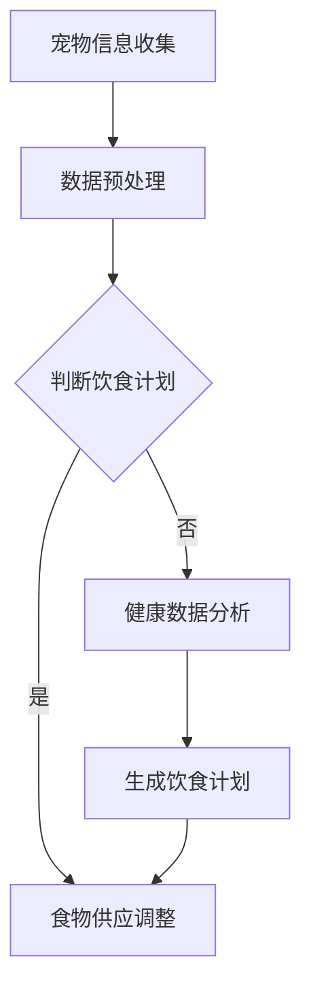
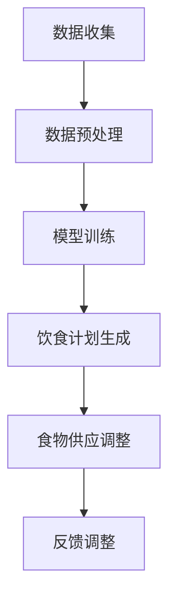
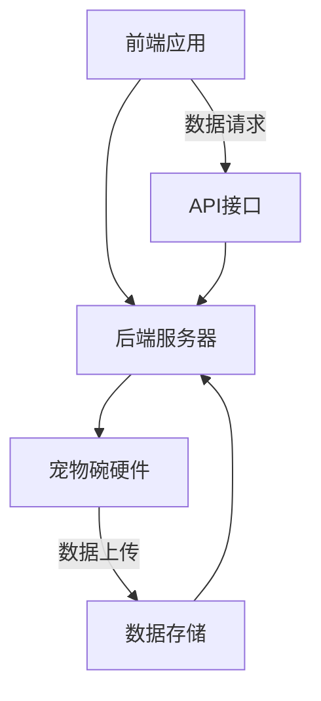
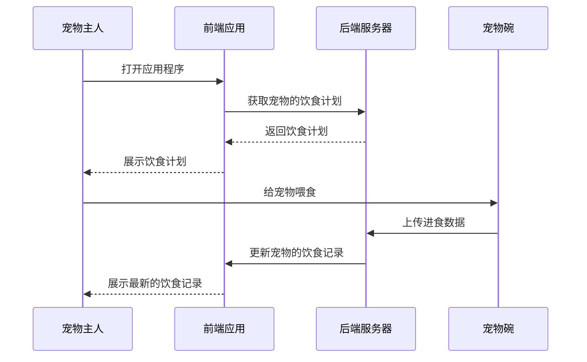

                 


### 让我们一步一步思考：智能宠物碗：AI Agent的宠物饮食健康管理

#### 文章标题：智能宠物碗：AI Agent的宠物饮食健康管理

#### 关键词：智能宠物碗、AI Agent、宠物饮食管理、健康管理、系统设计

#### 摘要：
随着科技的发展，智能宠物碗成为现代宠物护理的一个重要工具。本文将探讨如何通过AI Agent实现宠物饮食的健康管理，从背景介绍、核心概念联系、算法原理讲解、数学模型与公式详细解释、系统分析与架构设计、项目实战到最佳实践，全面阐述智能宠物碗的工作原理和应用。

#### 1. 背景介绍

**1.1 问题背景**

在当今快节奏的生活中，许多宠物主人面临着无法时刻关注宠物饮食管理的挑战。宠物的饮食不仅关乎它们的健康，还直接影响到它们的体重、行为和整体幸福感。传统的宠物饮食管理方法往往依赖于宠物主人的经验和规律，但这种方法存在很多不确定性和主观性。智能宠物碗的出现，为解决这个问题提供了一种创新的解决方案。

**1.2 问题描述**

智能宠物碗的主要任务是确保宠物能够按需、定量地摄取食物，同时避免过度饮食或营养不良。这意味着宠物碗需要能够识别宠物、记录饮食历史、调整食物量，并根据宠物的健康状况提供个性化的饮食计划。

**1.3 问题解决方法**

解决这个问题的方法在于利用AI技术，特别是AI Agent。AI Agent可以通过学习宠物的饮食习惯和健康状况，生成个性化的饮食计划，并实时调整食物的供应量。

**1.4 相关概念的外延和边界**

- **智能宠物碗**：具有传感器、连接网络和AI算法的宠物饮食容器。
- **AI Agent**：能够自主决策、执行任务的智能实体。
- **宠物饮食管理**：通过技术手段对宠物饮食进行监控、调整和优化。
- **健康管理**：关注宠物整体健康，包括饮食、运动和医疗。

#### 2. 核心概念与联系

**2.1 AI Agent基础**

AI Agent是一种具有自我意识和自主行动能力的智能实体。它能够感知环境、做出决策并执行任务。AI Agent的核心功能包括数据收集、模型训练、决策制定和行动执行。

**2.2 宠物饮食健康管理**

宠物饮食健康管理涉及对宠物饮食习惯的监测、分析和调整。这包括对食物摄入量的控制、营养成分的平衡、饮食习惯的调整等。

**2.3 Mermaid流程图展示**

使用Mermaid流程图，我们可以清晰地展示AI Agent在宠物饮食健康管理中的工作流程：



在这个流程图中，AI Agent首先收集宠物信息，进行数据预处理，然后根据宠物的健康状况判断是否需要调整食物供应。如果需要，AI Agent会生成新的饮食计划，并调整食物供应。

#### 3. 算法原理讲解

**3.1 算法概述**

智能宠物碗的算法核心是AI Agent，它通过以下步骤实现宠物饮食健康管理：

1. 数据收集：通过传感器收集宠物饮食信息。
2. 数据预处理：清洗和整理数据，使其适合模型训练。
3. 模型训练：使用历史数据训练机器学习模型。
4. 饮食计划生成：根据宠物的健康状况和模型预测生成个性化的饮食计划。
5. 食物供应调整：实时调整食物供应，确保宠物按需摄取食物。

**3.2 Mermaid流程图**



**3.3 Python源代码**

```python
import numpy as np
import pandas as pd
from sklearn.ensemble import RandomForestRegressor

# 数据收集
data = pd.read_csv('pet_diet_data.csv')

# 数据预处理
# ...

# 模型训练
model = RandomForestRegressor()
model.fit(X_train, y_train)

# 饮食计划生成
def generate_diet_plan(patient_data):
    # ...
    return diet_plan

# 食物供应调整
def adjust_food_supply(diet_plan):
    # ...
    return adjusted Supply
```

**3.4 数学模型和公式**

$$
\text{预测食物摄入量} = f(\text{宠物体重}, \text{活动水平}, \text{当前健康状况})
$$

其中，$f$ 是一个基于机器学习模型的预测函数。

#### 4. 数学模型和数学公式 & 详细讲解 & 举例说明

**4.1 数学模型**

智能宠物碗的算法中使用了一个预测模型，用于估计宠物的理想食物摄入量。这个模型基于宠物的体重、活动水平和当前健康状况。数学表达式如下：

$$
\text{预测食物摄入量} = w \times \text{活动水平} \times \frac{\text{当前健康状况}}{100}
$$

其中：
- $w$ 是宠物的体重（千克）。
- 活动水平是一个0到1的系数，表示宠物的日常活动量。
- 当前健康状况是一个0到100的分数，表示宠物的健康状况。

**4.2 举例说明**

假设有一只宠物，体重为5千克，每天的活动水平为0.8，当前健康状况为90分。我们可以使用上述公式计算其理想食物摄入量：

$$
\text{预测食物摄入量} = 5 \times 0.8 \times \frac{90}{100} = 3.6 \text{千克/天}
$$

这意味着，这只宠物每天应该摄取大约3.6千克的食物。

#### 5. 系统分析与架构设计方案

**5.1 问题场景介绍**

在一个智能宠物碗中，宠物主人可以通过一个移动应用程序监控宠物的饮食情况。系统需要确保宠物碗能够准确记录宠物的进食时间、进食量，并根据宠物的健康数据生成个性化的饮食计划。

**5.2 系统架构设计**

智能宠物碗的系统架构分为以下几个部分：

- **前端应用**：宠物主人使用的移动应用程序。
- **后端服务器**：处理数据、运行AI算法和存储数据的云服务器。
- **宠物碗硬件**：包含传感器、显示屏和连接模块的宠物碗。

**5.3 领域模型类图**

```mermaid
classDiagram
    Class01 <|-- Class02
    Class03 --|> Class04
    Class04 : +int x
    Class04 : +int y
    Class05 : +string name
    Class06 { +int id -string description }
    Class06 : <<interface>>
    Class07 ..|> Class06
    Class07 : +bool isActive()
    Class08 ..|> Class06
    Class08 : +void doSomething()
    Class09 *-- Class10
    Class10 *-- Class11
    Class12 <.. Class10
    Class13 <.. Class11
    Class10 : <<entity>>
    Class11 : <<value>>
    Class12 : <<enum>>
    Class13 : <<relation>>
```

**5.4 系统架构图**



**5.5 系统接口设计**

系统接口设计包括API接口和数据存储接口。API接口用于前端应用与后端服务器的通信，数据存储接口用于数据在服务器上的存储和管理。

**5.6 系统交互序列图**



#### 6. 项目实战

**6.1 环境安装**

要运行智能宠物碗系统，需要安装以下环境：

- Python 3.8及以上版本
- Numpy、Pandas、Sklearn等Python库
- Flask框架（用于API接口）

```bash
pip install numpy pandas sklearn flask
```

**6.2 系统核心实现源代码**

```python
from flask import Flask, jsonify, request
import numpy as np
import pandas as pd
from sklearn.ensemble import RandomForestRegressor

app = Flask(__name__)

# 模型训练（假设已经完成训练，此处简化）
model = RandomForestRegressor()
model.fit(X_train, y_train)

@app.route('/get_diet_plan', methods=['GET'])
def get_diet_plan():
    pet_data = request.args.to_dict()
    # 数据预处理（简化）
    # ...
    diet_plan = model.predict([pet_data['weight'], pet_data['activity_level'], pet_data['health_status']])
    return jsonify({'diet_plan': diet_plan.tolist()})

if __name__ == '__main__':
    app.run()
```

**6.3 代码应用解读与分析**

这段代码是智能宠物碗系统的核心实现。首先，我们导入了所需的库和框架，然后定义了一个Flask应用。在应用中，我们定义了一个获取饮食计划的API接口。当用户通过HTTP请求获取饮食计划时，系统会接收用户的请求参数（宠物的体重、活动水平和健康状况），然后使用训练好的机器学习模型预测饮食计划，并返回给用户。

**6.4 实际案例分析和详细讲解剖析**

假设我们有以下宠物的数据：

- 体重：5千克
- 活动水平：0.8
- 健康状况：90分

当用户通过API请求获取饮食计划时，系统会使用上述数据作为输入，通过机器学习模型计算出理想的食物摄入量为3.6千克/天。系统会返回这个结果给用户，用户可以根据这个饮食计划来喂养宠物。

**6.5 项目小结**

通过这个项目实战，我们展示了如何使用AI技术实现智能宠物碗的饮食健康管理。系统的核心是机器学习模型，它能够根据宠物的数据生成个性化的饮食计划。这个项目的成功实施为宠物主人提供了一种更科学、更方便的宠物护理方式。

#### 7. 最佳实践 tips、小结、注意事项、拓展阅读

**7.1 最佳实践 tips**

- **设备选型建议**：选择传感器精度高、连接稳定的宠物碗硬件。
- **系统维护与更新策略**：定期更新AI模型，确保其适应宠物的最新饮食需求。
- **数据安全与隐私保护**：确保宠物数据的安全性和隐私性，遵循相关的数据保护法规。

**7.2 小结**

智能宠物碗通过AI Agent实现了宠物饮食的健康管理，为宠物主人提供了一种科学、便捷的宠物护理方式。通过机器学习模型，系统能够根据宠物的数据生成个性化的饮食计划，实现精准喂养。

**7.3 注意事项**

- **数据准确性**：确保传感器采集的数据准确无误，影响模型的效果。
- **用户隐私**：保护宠物主人的隐私，确保数据安全。

**7.4 拓展阅读**

- 《智能宠物护理系统设计与实现》
- 《机器学习在宠物健康中的应用》
- 《宠物行为数据分析》

作者：AI天才研究院/AI Genius Institute & 禅与计算机程序设计艺术 /Zen And The Art of Computer Programming

