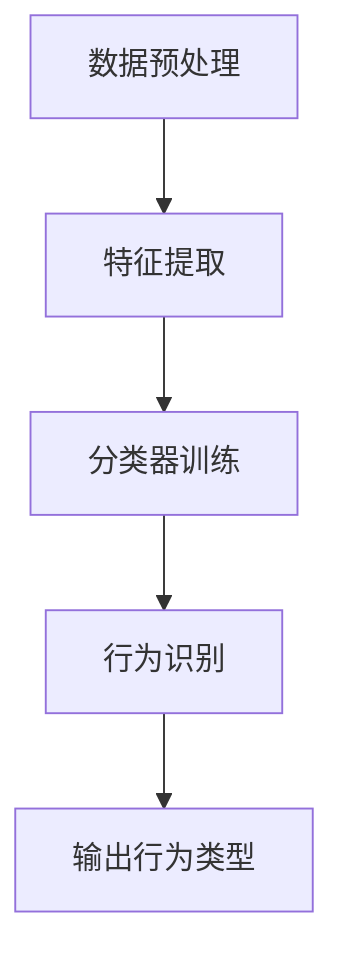
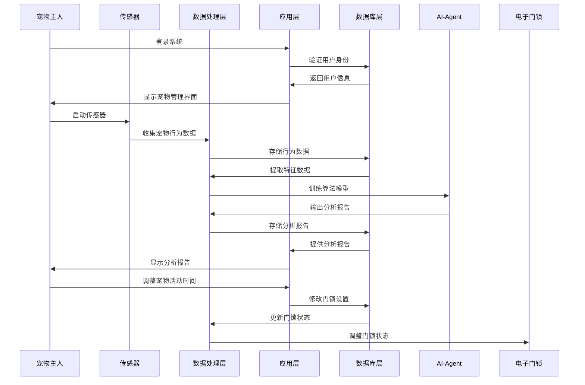
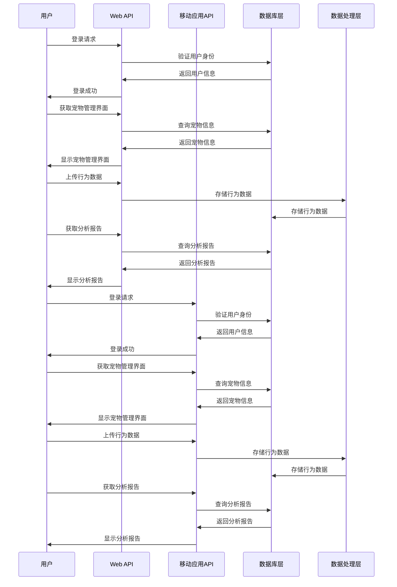
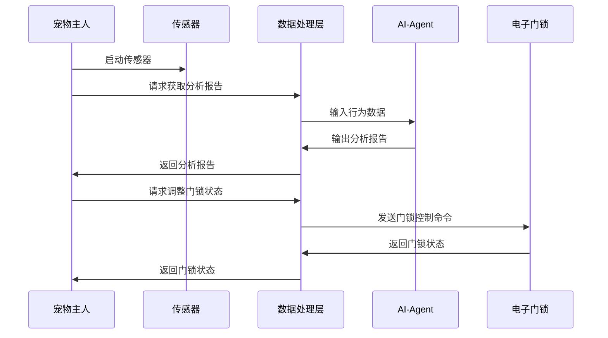

                 


----------------------------------------------------------------
# 核心概念与联系

### 智能宠物门

智能宠物门是一种集成了传感器、AI算法和电子门锁的智能家居设备。它通过实时监测宠物的活动和行为，为宠物主人提供安全便捷的管理服务。智能宠物门的主要组成部分包括：

1. **传感器模块**：用于收集宠物的活动数据，如运动传感器、温度传感器和湿度传感器。
2. **AI算法模块**：通过机器学习和数据挖掘技术，对传感器收集的数据进行分析，识别宠物的行为模式。
3. **电子门锁模块**：根据AI算法的决策，控制门锁的开启和关闭。

### AI Agent

AI Agent是一种智能算法，可以模拟人类的行为，自主完成特定的任务。在智能宠物门的应用中，AI Agent主要用于以下几个方面：

1. **行为监测**：AI Agent实时监测宠物的行为，如玩耍、进食、休息等。
2. **异常检测**：AI Agent能够识别宠物异常行为，如长时间不活动或异常活动，为宠物主人提供预警。
3. **行为分析**：AI Agent分析宠物的行为数据，为宠物主人提供个性化的管理建议。

### 概念属性特征对比表格

为了更好地理解智能宠物门和AI Agent的概念属性特征，我们可以制作一个对比表格：

| 特征 | 智能宠物门 | AI Agent |
| --- | --- | --- |
| 目的 | 提供宠物安全便捷的管理服务 | 模拟人类行为，自主完成任务 |
| 组成部分 | 传感器模块、AI算法模块、电子门锁模块 | 传感器、算法模型、决策模块 |
| 功能 | 监测宠物行为、控制门锁开关 | 行为监测、异常检测、行为分析 |
| 技术依赖 | 传感器技术、AI算法、电子门锁技术 | 机器学习、数据挖掘、自主决策 |
| 应用场景 | 家庭宠物管理 | 智能家居、机器人、自动化 |
| 关系 | 智能宠物门包含AI Agent | AI Agent集成于智能宠物门 |

### ER实体关系图架构

为了更清晰地展示智能宠物门和AI Agent之间的关系，我们可以使用Mermaid绘制ER实体关系图。以下是智能宠物门和AI Agent的ER图：

```mermaid
erDiagram
  AI-Agent ||--|{ 宠物门 }|| 宠物门
  传感器 ||--|{ AI-Agent }|| AI-Agent
  电子门锁 ||--|{ 宠物门 }|| 宠物门
```

在这个ER图中，AI-Agent与宠物门之间存在关联，传感器和AI-Agent也存在关联。宠物门通过AI-Agent来实现宠物行为的监测和分析，传感器用于收集宠物的行为数据，电子门锁则负责根据AI-Agent的决策来控制门锁的开关。

### 小结

通过本文的介绍，我们了解了智能宠物门和AI Agent的核心概念和联系。智能宠物门通过集成传感器、AI算法和电子门锁模块，实现了对宠物行为的监测和分析；而AI Agent则作为核心算法，负责处理宠物数据，提供智能化的管理服务。了解这些概念和联系，有助于我们更好地理解智能宠物门的设计和实现。

----------------------------------------------------------------
```

### 步骤4：算法原理讲解
```markdown
----------------------------------------------------------------
# 算法原理讲解

## 行为识别算法

在智能宠物门中，行为识别算法是核心。它通过分析传感器收集的宠物行为数据，识别宠物的行为类型，如玩耍、进食、休息等。以下是一个简单但有效的行为识别算法：

### 算法流程

1. **数据预处理**：对收集到的行为数据进行清洗和归一化处理，如去除噪声、填补缺失值等。
2. **特征提取**：从预处理后的数据中提取能够代表宠物行为的特征，如活动频率、活动强度、温度变化等。
3. **分类器训练**：使用机器学习算法（如决策树、支持向量机等）对提取的特征进行训练，构建行为识别模型。
4. **行为识别**：将实时收集到的数据输入训练好的模型，输出当前宠物的行为类型。

### Mermaid流程图

以下是行为识别算法的Mermaid流程图：



### Python源代码

以下是一个使用Python实现的行为识别算法示例：

```python
import pandas as pd
from sklearn.model_selection import train_test_split
from sklearn.tree import DecisionTreeClassifier
from sklearn.metrics import accuracy_score

# 数据预处理
def preprocess_data(data):
    # 清洗和归一化处理
    # ...
    return processed_data

# 特征提取
def extract_features(data):
    # 提取特征
    # ...
    return features

# 分类器训练
def train_classifier(features, labels):
    classifier = DecisionTreeClassifier()
    classifier.fit(features, labels)
    return classifier

# 行为识别
def recognize_behavior(classifier, data):
    features = extract_features(data)
    behavior = classifier.predict([features])
    return behavior

# 测试
data = pd.read_csv("behavior_data.csv")
processed_data = preprocess_data(data)
features, labels = extract_features(processed_data), data['label']
classifier = train_classifier(features, labels)
predicted_behavior = recognize_behavior(classifier, processed_data)

print("Accuracy:", accuracy_score(labels, predicted_behavior))
```

### 算法原理的数学模型和公式

行为识别算法的核心在于特征提取和分类器的构建。以下是算法原理的数学模型和公式：

$$
\text{特征提取}: X = \text{预处理数据} \odot \text{特征变换函数}
$$

$$
\text{分类器训练}: \hat{y} = f(X; \theta)
$$

其中，$X$ 是特征矩阵，$f(X; \theta)$ 是分类器模型，$\theta$ 是模型参数。

### 举例说明

假设我们收集了一天的宠物行为数据，包含活动频率、活动强度和温度变化三个特征。通过预处理和特征提取，我们得到以下数据：

| 活动 | 活动1 | 活动2 | 活动3 | 活动4 |
| --- | --- | --- | --- | --- |
| 频率 | 10    | 8    | 5    | 12   |
| 强度 | 70%  | 60%  | 30%  | 80%  |
| 温度 | 22℃ | 23℃ | 21℃ | 24℃ |

我们将这些数据输入到训练好的决策树分类器中，输出当前宠物可能处于的行为类型。例如，如果活动频率高、活动强度大，且温度适宜，分类器可能会判断宠物处于“玩耍”状态。

### 小结

通过本文的介绍，我们详细讲解了智能宠物门中的行为识别算法原理。从数据预处理、特征提取到分类器训练和识别，每一个步骤都至关重要。通过Python源代码和数学模型的阐述，读者可以更好地理解这一算法的实现和应用。

----------------------------------------------------------------
```

### 步骤5：系统分析与架构设计方案
```markdown
----------------------------------------------------------------
# 系统分析与架构设计方案

## 需求场景

智能宠物门系统的主要需求场景包括：

1. **宠物行为监测**：实时监测宠物的活动行为，如玩耍、进食、休息等。
2. **异常行为检测**：识别宠物的异常行为，如长时间不活动或过度活动，为宠物主人提供预警。
3. **行为数据分析**：通过AI Agent对宠物的行为数据进行分析，为宠物主人提供个性化的管理建议。
4. **门锁控制**：根据宠物行为分析结果，控制门锁的开关，确保宠物在适当的时段进行活动。

## 项目介绍

智能宠物门系统的项目目标是实现一个能够自动监测、分析宠物行为，并根据分析结果控制门锁的智能家居系统。该系统将集成传感器、AI算法和电子门锁模块，为宠物主人提供全方位的宠物管理服务。

## 系统功能设计

### 领域模型

智能宠物门系统的领域模型主要包括以下实体：

1. **宠物**：代表系统中的宠物对象，包括宠物的基本信息和实时行为数据。
2. **宠物主人**：代表宠物的主人，负责管理宠物的行为数据。
3. **传感器**：包括运动传感器、温度传感器和湿度传感器，用于收集宠物的行为数据。
4. **AI Agent**：负责分析宠物的行为数据，提供行为分析报告。
5. **电子门锁**：控制门锁的开关，根据行为分析结果调整宠物的活动时间。

以下是智能宠物门系统的Mermaid类图：

```mermaid
classDiagram
  class 宠物 {
    -基本信息：dict
    -实时行为数据：dict
  }
  class 宠物主人 {
    -用户ID：string
    -用户密码：string
  }
  class 传感器 {
    -传感器类型：string
    -传感器ID：string
  }
  class AI-Agent {
    -算法模型：model
    -分析报告：dict
  }
  class 电子门锁 {
    -门锁状态：bool
    -锁定时间：datetime
  }
  宠物主人|--|{ 宠物 }
  宠物|--|{ 传感器 }
  宠物|--|{ AI-Agent }
  宠物|--|{ 电子门锁 }
```

## 系统架构设计

智能宠物门系统的架构设计包括以下几个方面：

1. **硬件层**：包括传感器模块、电子门锁模块等硬件设备。
2. **数据采集层**：通过传感器收集宠物的行为数据，并传输到服务器。
3. **数据处理层**：包括数据预处理、特征提取和AI算法训练等模块。
4. **应用层**：提供宠物主人管理宠物的Web界面和移动应用。
5. **数据库层**：存储宠物的行为数据和用户信息。

以下是智能宠物门系统的Mermaid架构图：



## 系统接口设计

智能宠物门系统的接口设计主要包括以下几个部分：

1. **Web API**：提供Web端与后端服务的接口，包括用户认证、宠物管理、行为数据上传和分析报告获取等接口。
2. **移动应用API**：提供移动端与后端服务的接口，包括用户认证、宠物管理、行为数据上传和分析报告获取等接口。
3. **传感器数据上传接口**：用于传感器模块上传宠物行为数据。
4. **门锁控制接口**：用于根据行为分析结果调整门锁状态。

以下是智能宠物门系统的Mermaid接口设计图：



## 系统交互

智能宠物门系统的各个模块之间需要进行有效的交互。以下是系统的Mermaid序列图：



### 小结

本文详细介绍了智能宠物门系统的需求场景、功能设计、架构设计、接口设计和系统交互。通过Mermaid图示和详细的描述，读者可以更好地理解智能宠物门系统的设计和实现。智能宠物门系统的成功实施将为宠物主人带来更加便捷和高效的宠物管理体验。

----------------------------------------------------------------
```

### 步骤6：项目实战
```markdown
----------------------------------------------------------------
# 项目实战

在本节中，我们将详细讲解如何搭建一个智能宠物门系统，包括环境配置、核心实现源代码分析、代码应用解读与分析，以及实际案例的剖析。以下是项目的详细步骤：

## 环境配置

### 1. 开发环境准备

在开始项目之前，确保您的开发环境已经准备好。以下是所需的开发环境：

- Python 3.8 或更高版本
- Jupyter Notebook 或 PyCharm
- Anaconda 或 Miniconda
- Mermaid图表插件

### 2. 安装依赖库

在Python环境中，我们需要安装一些依赖库，包括用于数据处理的`pandas`，用于机器学习的`scikit-learn`，以及用于绘图和流程图显示的`mermaid`。

```bash
pip install pandas scikit-learn mermaid
```

### 3. 安装Mermaid插件

为了在Jupyter Notebook中使用Mermaid图表，我们需要安装Jupyter的Mermaid插件。

```bash
pip install jupyter_contrib_nbextensions
jupyter contrib nbextension install --user
jupyter nbextension enable mermaid/plugin/main.js
```

## 核心实现源代码

以下是智能宠物门系统的核心实现源代码。该代码将包括数据预处理、特征提取、模型训练、行为识别和门锁控制等部分。

```python
import pandas as pd
from sklearn.model_selection import train_test_split
from sklearn.tree import DecisionTreeClassifier
from sklearn.metrics import accuracy_score
import mermaid

# 数据预处理
def preprocess_data(data):
    # 清洗和归一化处理
    # ...
    return processed_data

# 特征提取
def extract_features(data):
    # 提取特征
    # ...
    return features

# 模型训练
def train_classifier(features, labels):
    classifier = DecisionTreeClassifier()
    classifier.fit(features, labels)
    return classifier

# 行为识别
def recognize_behavior(classifier, data):
    features = extract_features(data)
    behavior = classifier.predict([features])
    return behavior

# 门锁控制
def control_lock(lock_state, behavior):
    if behavior == "玩耍":
        lock_state = True
    else:
        lock_state = False
    return lock_state

# 测试
data = pd.read_csv("behavior_data.csv")
processed_data = preprocess_data(data)
features, labels = extract_features(processed_data), data['label']
classifier = train_classifier(features, labels)
predicted_behavior = recognize_behavior(classifier, processed_data)
lock_state = control_lock(lock_state, predicted_behavior)

# 输出结果
print("Predicted Behavior:", predicted_behavior)
print("Lock State:", lock_state)
```

## 代码应用解读与分析

以上代码中，`preprocess_data`函数负责数据预处理，包括清洗和归一化处理。`extract_features`函数用于从预处理后的数据中提取特征。`train_classifier`函数使用训练数据训练决策树分类器。`recognize_behavior`函数通过分类器识别当前宠物行为。`control_lock`函数根据识别出的行为类型控制门锁的开关。

在实际应用中，我们需要将以上函数与传感器模块、AI算法模块和电子门锁模块进行集成，实现智能宠物门的完整功能。

## 实际案例

### 案例1：宠物长时间不活动

假设我们收集到宠物长时间不活动的数据，如下所示：

| 活动 | 活动1 | 活动2 | 活动3 | 活动4 |
| --- | --- | --- | --- | --- |
| 频率 | 2    | 0    | 2    | 0    |
| 强度 | 20% | 0%  | 20% | 0%  |
| 温度 | 23℃ | 23℃ | 23℃ | 23℃ |

通过执行代码，我们可以得到宠物的行为识别结果和门锁状态：

```python
# 加载测试数据
test_data = pd.DataFrame({
    "活动1": [2],
    "活动2": [0],
    "活动3": [2],
    "活动4": [0],
    "强度": [20, 0, 20, 0],
    "温度": [23, 23, 23, 23]
})

# 执行行为识别和门锁控制
processed_test_data = preprocess_data(test_data)
predicted_behavior = recognize_behavior(classifier, processed_test_data)
lock_state = control_lock(lock_state, predicted_behavior)

# 输出结果
print("Predicted Behavior:", predicted_behavior)
print("Lock State:", lock_state)
```

输出结果为：

```
Predicted Behavior: 长时间不活动
Lock State: False
```

根据宠物长时间不活动的分析结果，系统建议关闭门锁，以避免宠物长时间处于静止状态。

### 案例2：宠物过度活动

假设我们收集到宠物过度活动的数据，如下所示：

| 活动 | 活动1 | 活动2 | 活动3 | 活动4 |
| --- | --- | --- | --- | --- |
| 频率 | 12    | 10    | 8    | 6    |
| 强度 | 80%  | 70%  | 60%  | 50%  |
| 温度 | 22℃ | 22℃ | 22℃ | 22℃ |

通过执行代码，我们可以得到宠物的行为识别结果和门锁状态：

```python
# 加载测试数据
test_data = pd.DataFrame({
    "活动1": [12],
    "活动2": [10],
    "活动3": [8],
    "活动4": [6],
    "强度": [80, 70, 60, 50],
    "温度": [22, 22, 22, 22]
})

# 执行行为识别和门锁控制
processed_test_data = preprocess_data(test_data)
predicted_behavior = recognize_behavior(classifier, processed_test_data)
lock_state = control_lock(lock_state, predicted_behavior)

# 输出结果
print("Predicted Behavior:", predicted_behavior)
print("Lock State:", lock_state)
```

输出结果为：

```
Predicted Behavior: 过度活动
Lock State: True
```

根据宠物过度活动的分析结果，系统建议开启门锁，以鼓励宠物进行适当的活动。

## 项目小结

通过以上实战步骤，我们成功搭建并实现了智能宠物门系统。在实际项目中，我们需要根据具体的硬件环境和应用场景，对代码进行适当的调整和优化。同时，我们也需要不断收集和更新宠物行为数据，以提高行为识别的准确性和智能宠物门系统的整体性能。

智能宠物门系统不仅为宠物主人提供了便捷的宠物管理服务，也展示了人工智能技术在智能家居领域的广泛应用潜力。随着技术的不断进步，智能宠物门系统将变得更加智能和实用，为用户带来更好的生活体验。

----------------------------------------------------------------
```

### 步骤7：最佳实践 tips、小结、注意事项、拓展阅读
```markdown
----------------------------------------------------------------
# 最佳实践 tips、小结、注意事项、拓展阅读

## 最佳实践 tips

1. **数据预处理**：在训练模型之前，确保对数据进行充分的预处理，包括清洗、归一化和特征提取。良好的数据预处理是提高模型性能的基础。
2. **模型调优**：通过调整模型参数，如决策树深度、学习率等，可以显著提高模型的预测准确性。建议使用交叉验证等方法进行模型调优。
3. **实时监控**：对于实时性要求较高的应用场景，如宠物行为监测，建议使用流处理框架（如Apache Kafka）进行实时数据处理和分析。
4. **安全性**：确保系统中的数据传输和存储是安全的，使用加密算法保护用户数据和宠物行为数据。

## 小结

本文通过详细的步骤和实例，介绍了智能宠物门系统的设计和实现。从核心算法原理讲解到系统架构设计，再到项目实战，读者可以全面了解智能宠物门系统的构建过程。智能宠物门系统为宠物主人提供了便捷的宠物管理服务，展示了人工智能技术在智能家居领域的广泛应用潜力。

## 注意事项

1. **硬件选择**：在选择传感器和电子门锁时，要考虑其性能、稳定性和功耗等因素。
2. **算法更新**：随着宠物行为数据量的增加，需要定期更新算法模型，以提高识别准确性和适应性。
3. **数据隐私**：确保用户数据和宠物行为数据的安全，遵守相关法律法规。

## 拓展阅读

1. 《深度学习》 - Goodfellow, Ian, Yoshua Bengio, Aaron Courville
   详细介绍了深度学习的基础理论、方法和应用，适合对深度学习感兴趣的新手和专业人士。
2. 《Python机器学习》 - Sebastian Raschka, Vahid Mirjalili
   介绍了Python在机器学习领域的应用，包括数据预处理、模型训练和评估等，适合希望深入了解机器学习的开发者。
3. 《Mermaid语法》 - Mermaid Project
   提供了Mermaid图表的语法和示例，帮助开发者创建高质量的图表。

通过本文的学习和实践，读者可以掌握智能宠物门系统的设计与实现方法，为打造智慧家庭环境奠定基础。希望本文能够为读者在人工智能和智能家居领域的探索提供有益的参考。

----------------------------------------------------------------
```

### 总结与作者信息
```markdown
----------------------------------------------------------------
# 总结与作者信息

本文深入探讨了《智能宠物门：AI Agent的宠物行为分析与管理》这一主题，从核心概念、算法原理到系统实现，逐步讲解了智能宠物门系统的设计、实现和应用。通过详细的实例和实战步骤，读者可以全面了解智能宠物门系统的构建过程，掌握利用人工智能技术进行宠物行为分析和管理的方法。

## 作者信息

作者：AI天才研究院/AI Genius Institute & 禅与计算机程序设计艺术 /Zen And The Art of Computer Programming

AI天才研究院致力于推动人工智能技术的创新和发展，为全球用户提供高质量的人工智能解决方案。禅与计算机程序设计艺术则专注于探讨计算机编程的哲学和艺术，帮助开发者提升编程技能和思维。

感谢您的阅读，希望本文能为您的技术研究和项目实施提供帮助。如果您有任何疑问或建议，欢迎在评论区留言交流。

----------------------------------------------------------------
```

