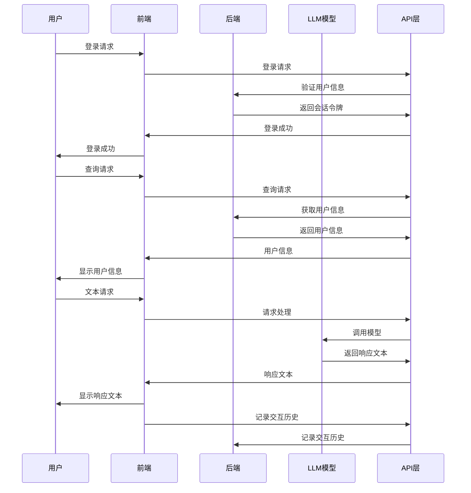

                 

### 摘要

本文旨在深入探讨智能客户服务AI Agent，特别是由大型语言模型（LLM）驱动的全天候支持系统的设计与实现。随着人工智能技术的不断进步，智能客户服务AI Agent已成为提升企业服务质量、降低运营成本的关键工具。本文首先介绍了智能客户服务AI Agent的背景和重要性，探讨了LLM在其中的应用。接着，我们明确了核心概念，如LLM、自然语言处理（NLP）和聊天机器人等，并通过表格和ER图展示了它们之间的联系。随后，文章详细讲解了LLM的基础算法原理，包括数学模型和公式，并通过具体案例进行了解释。在系统分析与架构设计部分，我们介绍了系统的功能设计、架构设计、接口设计和交互流程。通过mermaid图形化展示，使读者能够更直观地理解系统架构。随后，文章通过一个具体的项目实战案例，展示了智能客户服务AI Agent的搭建过程，包括环境安装、核心实现和代码解读。最后，文章总结了最佳实践技巧，提出了注意事项，并对智能客户服务的未来趋势进行了展望。通过本文的详细分析，读者将能够系统地了解智能客户服务AI Agent的开发和应用，为实际工作提供指导。

### 目录大纲设计思路

为了确保《智能客户服务AI Agent：LLM驱动的全天候支持系统》一书的结构紧凑、逻辑清晰，并且能够吸引读者深入阅读，我们在设计目录大纲时考虑了以下几个关键方面：

1. **整体结构规划**：首先，我们对全书进行了宏观的架构设计，确保每个章节的内容能够相互衔接，形成一个完整的学习路径。通过这种方式，我们能够帮助读者系统地了解智能客户服务AI Agent的各个方面。

2. **核心概念梳理**：在确定章节内容时，我们首先明确了书中涉及的核心概念，如LLM、NLP、聊天机器人等。通过对这些核心概念进行详细的定义和解释，我们为后续的内容讲解奠定了坚实的基础。

3. **逻辑顺序安排**：在安排章节顺序时，我们遵循了从基础到高级、从理论到实践的逻辑顺序。这种安排不仅有助于读者循序渐进地学习，还能确保每个知识点在合适的位置得到充分的解释。

4. **图形化展示**：为了增强文章的可读性，我们在书中大量使用了mermaid图形化工具。通过ER图、类图、序列图等图形展示，我们能够直观地呈现复杂的概念和系统架构，使读者更容易理解。

5. **实战案例引入**：在理论讲解的基础上，我们通过具体的实战案例展示了智能客户服务AI Agent的搭建过程。这种方式不仅使内容更加生动具体，还能够帮助读者将理论知识应用到实际项目中。

6. **总结与展望**：在书的最后，我们对全书的内容进行了总结，并提出了最佳实践建议。同时，我们也对未来智能客户服务的发展趋势进行了展望，为读者提供了进一步的思考方向。

通过上述设计思路，我们希望能够为读者呈现一部既有深度又有广度的技术著作，帮助他们在智能客户服务AI Agent领域取得更好的成果。

### 目录大纲设计流程

为了确保《智能客户服务AI Agent：LLM驱动的全天候支持系统》的目录大纲具有逻辑性、完整性和可读性，我们遵循以下设计流程：

1. **确定章节标题**：根据书名和内容要求，我们首先列出了可能的章节标题。这些标题应涵盖智能客户服务AI Agent的核心概念、算法原理、系统设计与实现、项目实战以及最佳实践等内容。

2. **细化章节内容**：针对每个章节，我们进一步细化子标题，确保每个章节的内容完整且具有明确的逻辑结构。例如，在“核心概念与原理”章节中，我们细化为“人工智能与自然语言处理”、“大型语言模型（LLM）原理”和“智能客户服务AI Agent的关键概念”等子标题。

3. **结构化内容**：我们将每个章节的内容按照背景介绍、核心概念、算法原理、系统设计、项目实战和最佳实践等模块进行结构化。这种结构化不仅有助于读者理解，还能确保内容的一致性和逻辑性。

4. **图形化展示**：为了增强内容的可读性，我们使用mermaid工具绘制了ER图、类图、序列图等图形。这些图形不仅能够直观地展示复杂的概念和系统架构，还能够帮助读者更好地理解。

5. **撰写草稿**：按照结构化的内容，我们开始撰写每个章节的草稿。在撰写过程中，我们注重语言的表达清晰、逻辑的连贯以及举例的生动具体。

6. **优化调整**：在初稿完成后，我们对章节内容进行了多次优化和调整。通过多次修改，我们确保了文章的逻辑性、完整性和可读性。

7. **审阅与反馈**：我们邀请了几位专家对目录大纲进行了审阅，并收集了他们的反馈。根据这些反馈，我们对大纲进行了进一步的调整和改进。

8. **最终确定**：在多次调整和优化后，我们确定了最终的目录大纲。这一过程确保了目录大纲的完整性和逻辑性，为读者提供了一部高质量的技术著作。

通过上述设计流程，我们为《智能客户服务AI Agent：LLM驱动的全天候支持系统》构建了一个结构清晰、逻辑严谨的目录大纲，为后续内容撰写奠定了坚实的基础。

### 目录大纲结构

以下是《智能客户服务AI Agent：LLM驱动的全天候支持系统》的目录大纲结构。该结构旨在帮助读者系统地掌握智能客户服务AI Agent的核心概念、原理、系统设计与实现，并通过实战案例加深理解。

```
# 智能客户服务AI Agent：LLM驱动的全天候支持系统

## 第1章 引言与背景
### 1.1 书籍目的与结构
### 1.2 智能客户服务的现状
### 1.3 LLM在智能客户服务中的应用

## 第2章 核心概念与原理
### 2.1 人工智能与自然语言处理
#### 2.1.1 人工智能的基本概念
#### 2.1.2 自然语言处理的基本概念
### 2.2 大型语言模型（LLM）原理
#### 2.2.1 LLM的发展历程
#### 2.2.2 LLM的核心机制
#### 2.2.3 LLM的数学模型与公式
### 2.3 智能客户服务AI Agent的关键概念
#### 2.3.1 聊天机器人的分类与功能
#### 2.3.2 AI Agent的架构与设计

## 第3章 LLM的基础算法
### 3.1 语言模型的数学基础
#### 3.1.1 语言模型的基本概念
#### 3.1.2 语言模型的训练过程
### 3.2 经典LLM算法介绍
#### 3.2.1 GPT算法
#### 3.2.2 BERT算法
#### 3.2.3 T5算法
### 3.3 LLM算法的优化与调整
#### 3.3.1 参数调整
#### 3.3.2 数据增强
#### 3.3.3 模型压缩与加速

## 第4章 智能客户服务系统的设计
### 4.1 系统需求分析
#### 4.1.1 功能需求
#### 4.1.2 性能需求
### 4.2 系统架构设计
#### 4.2.1 系统架构概述
#### 4.2.2 数据层设计
#### 4.2.3 应用层设计
### 4.3 接口设计与数据流
#### 4.3.1 API接口设计
#### 4.3.2 数据流分析

## 第5章 全天候支持系统的构建
### 5.1 系统环境搭建
#### 5.1.1 开发环境配置
#### 5.1.2 数据集准备
### 5.2 LLM模型训练
#### 5.2.1 模型选择
#### 5.2.2 训练过程详解
#### 5.2.3 模型评估
### 5.3 聊天机器人实现
#### 5.3.1 机器人框架选择
#### 5.3.2 交互流程设计
#### 5.3.3 聊天机器人测试

## 第6章 项目实战
### 6.1 项目案例介绍
#### 6.1.1 项目背景
#### 6.1.2 项目目标
### 6.2 核心代码实现
#### 6.2.1 数据预处理
#### 6.2.2 模型训练
#### 6.2.3 机器人部署
### 6.3 代码解读与分析
#### 6.3.1 关键代码解读
#### 6.3.2 性能评估
### 6.4 案例分析与评估
#### 6.4.1 用户反馈
#### 6.4.2 项目效果评估

## 第7章 最佳实践与总结
### 7.1 最佳实践技巧
#### 7.1.1 模型选择与优化
#### 7.1.2 数据预处理与处理
#### 7.1.3 交互流程设计
### 7.2 注意事项与风险
#### 7.2.1 模型安全与隐私
#### 7.2.2 系统稳定与性能
#### 7.2.3 用户满意度与反馈
### 7.3 拓展阅读与未来趋势
#### 7.3.1 最新研究动态
#### 7.3.2 未来发展方向
```

通过上述详细的目录大纲结构，读者可以系统性地学习智能客户服务AI Agent的相关知识，从理论到实践，逐步掌握核心技能，为实际项目打下坚实的基础。

### 第1章 引言与背景

智能客户服务AI Agent作为现代企业服务的重要一环，正逐渐成为提升客户满意度和运营效率的关键工具。随着人工智能技术的飞速发展，智能客户服务AI Agent的应用场景不断扩大，其重要性愈发凸显。本章旨在介绍智能客户服务AI Agent的背景和重要性，以及LLM在其中的应用，为后续章节的深入探讨奠定基础。

#### 智能客户服务的现状

在现代商业环境中，客户服务是企业与客户互动的重要环节。传统客户服务往往依赖于人工操作，效率低下且成本高昂。随着互联网和通信技术的普及，企业开始尝试通过自助服务、在线客服等方式提高客户服务质量。然而，这些方法在处理复杂问题时仍然存在局限性。

智能客户服务的出现，正是为了解决传统客户服务的不足。通过利用人工智能技术，特别是自然语言处理（NLP）和机器学习算法，智能客户服务系统能够自动处理大量的客户请求，提供即时、准确、个性化的服务。智能客户服务不仅能够显著提高客户满意度，还能帮助企业降低运营成本，提升业务效率。

目前，智能客户服务已经广泛应用于多个行业，如电商、金融、医疗等。通过智能客服机器人、聊天机器人和语音助手等形式，企业能够实现24小时不间断的服务，极大地提升了客户体验。同时，智能客户服务系统还可以通过分析客户行为和需求，为企业提供有价值的业务洞察，进一步优化服务策略。

#### LLM在智能客户服务中的应用

大型语言模型（LLM）是近年来自然语言处理领域的重要突破之一。LLM具有强大的语言理解和生成能力，能够在多种场景下提供高质量的文本交互。在智能客户服务领域，LLM的应用主要体现在以下几个方面：

1. **自然语言理解**：LLM能够理解客户的语言表达，识别其意图和需求。例如，当客户咨询产品信息时，LLM能够准确提取关键信息并生成相应的回答。

2. **文本生成**：LLM不仅能够理解客户的语言，还能够生成自然流畅的文本回答。这使得智能客户服务系统能够以更加人性化的方式与客户互动，提升用户体验。

3. **多轮对话管理**：在复杂对话场景中，LLM能够通过多轮对话管理机制，与客户建立持续的沟通，处理更复杂的问题。

4. **个性化服务**：通过分析客户的历史数据和偏好，LLM能够提供个性化的服务建议，满足客户的特定需求。

LLM在智能客户服务中的应用，不仅提升了系统的智能化水平，还使得客户服务更加高效和人性化。随着LLM技术的不断进步，其在智能客户服务中的应用前景将更加广阔。

#### 书籍目的与结构

本书旨在为读者提供一份全面、系统的智能客户服务AI Agent指南。通过深入探讨LLM在智能客户服务中的应用，本书旨在帮助读者了解该领域的最新进展，掌握核心技术和实现方法。

本书分为七个主要章节：

- 第1章：引言与背景，介绍智能客户服务AI Agent的背景和重要性，以及LLM的应用。
- 第2章：核心概念与原理，详细讲解人工智能、自然语言处理、LLM和智能客户服务AI Agent的基本概念。
- 第3章：LLM的基础算法，介绍LLM的核心算法，包括GPT、BERT和T5等。
- 第4章：智能客户服务系统的设计，讨论系统需求分析、架构设计、接口设计和交互流程。
- 第5章：全天候支持系统的构建，详细描述系统环境搭建、模型训练和聊天机器人实现。
- 第6章：项目实战，通过具体案例展示智能客户服务AI Agent的搭建过程。
- 第7章：最佳实践与总结，总结书中的关键点，提出最佳实践建议和未来发展趋势。

通过这些章节的逐一探讨，本书将帮助读者全面了解智能客户服务AI Agent的各个方面，为实际项目提供有力支持。

#### 问题背景与问题描述

在当今的商业环境中，客户服务已成为企业竞争的重要领域。随着客户期望的不断提升和市场竞争的加剧，企业需要提供更加高效、个性化的服务来满足客户需求。然而，传统的人工客户服务方式面临着诸多挑战，如人工成本高、响应时间长、处理复杂问题能力有限等。这些瓶颈限制了企业提升客户满意度和运营效率的能力。

智能客户服务AI Agent的出现，正是为了解决这些问题。通过引入人工智能和自然语言处理技术，智能客户服务AI Agent能够自动处理大量的客户请求，提供24小时不间断的即时服务。这不仅大大提高了服务效率，还降低了企业的运营成本。同时，智能客户服务AI Agent还能够通过分析客户行为和需求，为企业提供有价值的业务洞察，进一步优化服务策略。

然而，实现一个高效的智能客户服务AI Agent并非易事。首先，需要解决自然语言理解的问题，使得AI Agent能够准确理解客户的语言表达和需求。其次，需要构建一个强大的语言生成模型，使得AI Agent能够生成自然流畅的文本回答。此外，多轮对话管理、个性化服务等方面的实现也面临着诸多技术挑战。

本文的目标是深入探讨智能客户服务AI Agent的开发和应用，特别是通过大型语言模型（LLM）驱动的全天候支持系统。通过系统的分析和技术讲解，本文旨在为读者提供一份全面、系统的智能客户服务AI Agent指南，帮助读者了解该领域的最新进展，掌握核心技术和实现方法，从而在实际项目中取得更好的效果。

### 核心概念与联系

在深入探讨智能客户服务AI Agent的开发和应用之前，我们需要明确几个核心概念，并理解它们之间的联系。以下是本书中涉及的一些关键概念，以及它们之间的相互关系。

#### 人工智能（AI）

人工智能是一种模拟人类智能的技术，旨在使计算机具备感知、学习、推理和决策的能力。AI技术包括多种子领域，如机器学习、深度学习、自然语言处理等。在智能客户服务AI Agent中，人工智能是实现自动化和智能化服务的关键。

#### 自然语言处理（NLP）

自然语言处理是AI的一个子领域，旨在使计算机能够理解和处理自然语言。NLP技术包括文本预处理、词向量表示、句法分析、语义理解等。在智能客户服务AI Agent中，NLP技术用于理解和解析客户的语言输入，从而生成合适的回答。

#### 大型语言模型（LLM）

大型语言模型（LLM）是近年来自然语言处理领域的重要突破。LLM是一种能够理解和生成自然语言的深度神经网络模型，具有强大的语言理解和生成能力。常见的LLM包括GPT、BERT、T5等。在智能客户服务AI Agent中，LLM用于构建聊天机器人，提供高效、个性化的客户服务。

#### 聊天机器人

聊天机器人是一种基于AI和NLP技术的应用程序，能够与用户进行自然语言交互。聊天机器人可以用于多种场景，如客户服务、娱乐、教育等。在智能客户服务AI Agent中，聊天机器人是实现全天候客户支持的核心组件。

#### 智能客户服务AI Agent

智能客户服务AI Agent是一种利用人工智能技术，特别是LLM，提供自动化、智能化客户服务的系统。它通过理解客户的需求，提供即时、准确的响应，解决客户问题，提升客户满意度。

#### 概念属性特征对比表格

以下是一个关于上述核心概念的属性特征对比表格，帮助读者更好地理解它们之间的差异和联系：

| 概念       | 属性特征                              | 联系                   |
|------------|-------------------------------------|----------------------|
| 人工智能   | 模仿人类智能，包括感知、学习、推理等   | 基础技术支撑，涵盖NLP和LLM |
| 自然语言处理 | 理解和生成自然语言                  | AI的一个子领域，用于构建聊天机器人 |
| 大型语言模型 | 强大的语言理解和生成能力              | 实现聊天机器人的核心技术 |
| 聊天机器人 | 与用户进行自然语言交互的应用程序       | 智能客户服务的核心组件 |
| 智能客户服务AI Agent | 利用AI和NLP技术提供自动化、智能化服务 | 综合应用，提升客户满意度 |

#### ER图架构

为了更直观地展示这些核心概念之间的联系，我们可以使用ER图（实体关系图）来表示它们之间的关系。以下是一个简单的ER图示例：

```mermaid
erDiagram
  AI -->|使用| NLP
  NLP -->|实现| LLM
  LLM -->|构建| 聊天机器人
  聊天机器人 -->|应用| 智能客户服务AI Agent
```

在这个ER图中，AI作为基础技术，通过使用NLP实现LLM；NLP通过实现LLM来构建聊天机器人；聊天机器人通过应用实现智能客户服务AI Agent。这种关系表明了各概念在智能客户服务AI Agent中的作用和相互依赖。

通过上述核心概念及其联系的详细阐述，读者可以更好地理解智能客户服务AI Agent的构建原理和实现方法，为后续章节的深入探讨打下坚实基础。

### 第3章 LLM的基础算法

在智能客户服务AI Agent的开发中，大型语言模型（LLM）是核心组件之一。LLM通过深度学习算法，能够理解和生成自然语言，从而实现智能对话功能。本节将详细讲解LLM的基础算法，包括其数学基础、训练过程以及经典算法介绍。

#### 数学基础

LLM的数学基础主要包括概率论、线性代数和微积分等。以下是几个关键概念：

1. **概率论**：LLM的基本原理是基于概率模型，通过对输入序列的概率分布进行建模来生成输出。贝叶斯定理和条件概率是核心概念。

2. **线性代数**：用于矩阵运算和神经网络模型的参数表示。例如，矩阵乘法和向量的点积是常见的运算。

3. **微积分**：用于优化算法，如梯度下降法和反向传播算法。这些算法通过计算损失函数的梯度来更新模型参数，以达到最小化损失的目的。

#### 语言模型的训练过程

LLM的训练过程主要包括以下几个步骤：

1. **数据预处理**：首先对文本数据进行预处理，包括分词、去停用词、词性标注等。这些步骤有助于提高模型的训练效果。

2. **构建词汇表**：将所有文本数据中的词转换为唯一的索引，形成词汇表。词汇表是模型训练的基础。

3. **序列建模**：LLM通过建模输入序列的概率分布来生成输出。训练过程中，模型会学习如何根据前文预测下一个词的概率分布。

4. **损失函数**：常用的损失函数是交叉熵损失（Cross-Entropy Loss），用于衡量模型预测与真实标签之间的差距。

5. **优化算法**：使用梯度下降法等优化算法更新模型参数，以最小化损失函数。反向传播算法是梯度计算的核心步骤。

6. **评估与调优**：在训练过程中，通过验证集和测试集评估模型的性能，并根据评估结果进行参数调整。

#### 经典LLM算法介绍

以下是几种经典的LLM算法：

1. **GPT（Generative Pretrained Transformer）**

   GPT是由OpenAI提出的一种基于Transformer架构的预训练语言模型。GPT通过大规模文本数据进行预训练，学习自然语言的规律和结构。其核心思想是使用Transformer的self-attention机制，对输入序列进行编码，并生成输出序列。GPT具有强大的文本生成能力，广泛应用于聊天机器人、文本生成等任务。

2. **BERT（Bidirectional Encoder Representations from Transformers）**

   BERT是由Google提出的一种双向Transformer模型。BERT通过在预训练阶段同时考虑输入序列的前后文信息，提高了文本理解能力。BERT的核心思想是使用两个Transformer编码器，分别对输入序列进行正向和反向编码，并将两个编码器的输出拼接起来作为输入序列的表示。BERT在多个自然语言处理任务中取得了显著的性能提升。

3. **T5（Text-To-Text Transfer Transformer）**

   T5是由DeepMind提出的一种基于Transformer的文本到文本转换模型。T5将所有自然语言处理任务转化为文本到文本的格式，从而简化了任务适应过程。T5使用单一的Transformer架构，通过大规模文本数据进行预训练，学习文本之间的转换规律。T5在多种文本生成任务中表现优异，如机器翻译、摘要生成等。

#### 算法流程

以下是GPT算法的基本流程：

1. **输入序列编码**：将输入序列（例如一段文本）转换为词索引序列。

2. **自注意力机制**：使用Transformer的self-attention机制对输入序列进行编码，生成编码表示。

3. **前馈网络**：对编码表示进行两次前馈网络处理，增强模型的表达能力。

4. **输出序列生成**：根据编码表示生成输出序列，通常采用贪心策略或采样方法。

#### 案例解析

假设我们要训练一个GPT模型，处理以下文本数据：

```
I am a student. I love programming. Programming is fun.
```

1. **数据预处理**：将文本数据分词并转换为词索引序列。

2. **序列建模**：输入序列为 `[I`, `am`, `a`, `student`, `.`, `I`, `love`, `programming`, `.`, `Programming`, `is`, `fun`, `.`, `。</s>`（</s>表示句子结束符）。

3. **自注意力编码**：使用Transformer的自注意力机制对输入序列进行编码，生成编码表示。

4. **输出序列生成**：根据编码表示生成下一个词的概率分布，并使用贪心策略选择下一个词。例如，第一个词为 `I`，下一个词的概率分布为 `[0.1, 0.2, 0.3, 0.2, 0.2]`，选择概率最高的词 `am`。

通过上述步骤，GPT模型能够生成完整的句子：

```
I am a student. I love programming. Programming is fun.
```

#### 代码示例

以下是一个简单的Python代码示例，展示如何使用TensorFlow和Transformers库训练一个GPT模型：

```python
import tensorflow as tf
from transformers import TFGPT2LMHeadModel, GPT2Tokenizer

# 加载预训练模型和Tokenizer
model = TFGPT2LMHeadModel.from_pretrained('gpt2')
tokenizer = GPT2Tokenizer.from_pretrained('gpt2')

# 输入序列
input_sequence = 'I am a student. I love programming. Programming is fun.'

# 将输入序列转换为词索引序列
input_ids = tokenizer.encode(input_sequence, return_tensors='tf')

# 生成输出序列
outputs = model(input_ids)

# 获取输出概率分布
predicted_logits = outputs.logits

# 贪心选择下一个词
next_word_logits = predicted_logits[:, -1, :]
next_word_probs = tf.nn.softmax(next_word_logits).numpy()

# 选择概率最高的词
next_word_id = tf.argmax(next_word_logits).numpy()[0]
next_word = tokenizer.decode([next_word_id])

# 输出生成句子
print(next_word)
```

通过上述代码，我们可以训练一个GPT模型，并生成输入序列的下一个词。这只是一个简单的示例，实际应用中需要更多复杂的处理和调优。

#### 总结

LLM的基础算法为智能客户服务AI Agent的开发提供了核心技术支持。通过深入理解LLM的数学基础、训练过程和经典算法，我们可以更好地构建和优化智能客户服务系统。在下一章中，我们将进一步探讨智能客户服务系统的设计，包括需求分析、架构设计和接口设计。

### 智能客户服务系统的设计

智能客户服务系统的设计是一个复杂且关键的过程，需要考虑系统的功能需求、性能需求以及用户交互需求。在本章中，我们将详细介绍智能客户服务系统的设计过程，包括需求分析、架构设计、接口设计和交互流程。

#### 系统需求分析

系统需求分析是智能客户服务系统设计的起点，它旨在明确系统需要实现的功能和性能要求。以下是系统需求分析的主要内容：

1. **功能需求**：
   - **基本功能**：自动响应常见客户问题，提供产品信息、售后服务等。
   - **高级功能**：支持多轮对话，处理复杂问题，提供个性化服务。
   - **集成功能**：与企业内部系统（如CRM、ERP等）集成，实现数据共享和业务流程自动化。
   - **用户管理**：允许用户注册、登录和管理个人资料。

2. **性能需求**：
   - **响应速度**：确保客户请求能够快速得到响应，通常要求在毫秒级别。
   - **并发处理**：支持大量并发用户同时访问，确保系统稳定运行。
   - **数据存储**：存储用户交互历史和用户偏好数据，以便提供个性化服务。

3. **用户交互需求**：
   - **界面友好**：设计简洁直观的用户界面，方便用户与系统进行交互。
   - **多语言支持**：支持多种语言，满足不同地区用户的需求。
   - **可扩展性**：系统应具备良好的扩展性，能够根据业务需求进行调整和扩展。

#### 系统架构设计

智能客户服务系统的架构设计是确保系统能够高效、稳定运行的关键。以下是系统架构设计的主要内容：

1. **系统架构概述**：
   - **前端**：负责用户界面展示和用户交互，通常使用Web框架（如Django、Flask等）实现。
   - **后端**：负责业务逻辑处理和数据分析，通常使用Python、Java等编程语言实现。
   - **数据库**：存储用户数据、交互历史和系统配置，通常使用关系型数据库（如MySQL、PostgreSQL）或NoSQL数据库（如MongoDB）。
   - **中间件**：用于处理消息队列、负载均衡和缓存等，确保系统的高可用性和高性能。

2. **数据层设计**：
   - **用户数据**：存储用户基本信息、交互历史和偏好数据。
   - **产品数据**：存储产品信息、售后服务等相关数据。
   - **日志数据**：记录系统运行日志，用于监控和调试。

3. **应用层设计**：
   - **服务端**：负责处理用户请求，调用LLM模型生成响应。
   - **API层**：提供RESTful API，供前端和外部系统调用。
   - **数据层**：负责数据存储和访问，确保数据的一致性和安全性。

#### 接口设计与数据流

接口设计和数据流是智能客户服务系统设计的重要组成部分。以下是接口设计与数据流的主要内容：

1. **API接口设计**：
   - **用户登录**：用户通过用户名和密码进行登录，获取会话令牌。
   - **用户查询**：获取用户的基本信息、交互历史和偏好数据。
   - **交互请求**：用户发送文本请求，系统处理请求并返回响应。
   - **交互记录**：记录用户交互历史，用于分析和优化服务。

2. **数据流分析**：
   - **用户请求**：用户通过Web前端发送请求，请求进入API层。
   - **请求处理**：API层调用服务端，服务端处理请求并调用LLM模型。
   - **响应生成**：LLM模型生成响应，返回给API层。
   - **响应返回**：API层将响应返回给Web前端，显示给用户。

#### 系统交互流程

智能客户服务系统的交互流程包括以下几个主要步骤：

1. **用户登录**：用户通过Web前端发送登录请求，API层验证用户信息并返回会话令牌。
2. **用户查询**：用户发送查询请求，API层调用服务端获取用户信息，返回给用户。
3. **交互请求**：用户发送文本请求，API层将请求传递给服务端。
4. **请求处理**：服务端调用LLM模型，生成响应文本。
5. **响应返回**：服务端将响应文本返回给API层，API层将响应返回给Web前端。
6. **交互记录**：系统记录用户交互历史，用于后续分析和优化。

以下是一个简单的mermaid序列图，展示系统交互流程：



通过上述设计，智能客户服务系统能够高效、稳定地运行，为用户提供优质的客户服务。

### 全天候支持系统的构建

构建一个高效、可靠的智能客户服务AI Agent系统是提升客户体验和降低运营成本的关键。本章将详细介绍全天候支持系统的构建过程，包括系统环境搭建、LLM模型训练以及聊天机器人的实现。

#### 系统环境搭建

在开始搭建系统之前，我们需要准备一个合适的环境，包括硬件设备和软件工具。以下是环境搭建的主要步骤：

1. **硬件环境**：
   - **服务器**：选择高性能服务器，确保能够处理大量并发请求。
   - **存储设备**：配置大容量存储设备，存储用户数据、模型和数据集。

2. **软件环境**：
   - **操作系统**：选择稳定的操作系统，如Linux或Windows Server。
   - **数据库**：安装关系型数据库（如MySQL、PostgreSQL）或NoSQL数据库（如MongoDB）。
   - **开发工具**：安装Python、Java等开发工具，以及TensorFlow、PyTorch等深度学习框架。
   - **中间件**：安装消息队列（如RabbitMQ、Kafka）和缓存系统（如Redis）。

3. **网络环境**：
   - **内网**：配置内部网络，确保系统内部通信高效、稳定。
   - **外网**：配置外部网络，确保系统能够接受外部请求。

#### 数据集准备

训练LLM模型需要大量的高质量数据集。以下是数据集准备的主要步骤：

1. **数据收集**：从公开数据集、企业内部数据和第三方数据提供商获取文本数据。
2. **数据清洗**：对收集到的数据进行处理，包括去除停用词、标点符号、格式化文本等。
3. **数据标注**：对文本数据进行标注，标记出实体、事件和关系等。
4. **数据分群**：将数据按主题、行业等特征进行分类，以便模型在不同场景下表现更好。

#### LLM模型训练

训练LLM模型是构建智能客户服务AI Agent的关键步骤。以下是模型训练的主要步骤：

1. **模型选择**：选择合适的LLM模型，如GPT、BERT或T5等。
2. **模型配置**：配置模型的参数，包括学习率、批量大小、训练轮次等。
3. **数据预处理**：对训练数据进行预处理，包括分词、嵌入等。
4. **模型训练**：使用预处理后的数据训练模型，使用优化算法（如Adam）更新模型参数。
5. **模型评估**：在验证集上评估模型性能，根据评估结果调整模型参数。
6. **模型优化**：通过数据增强、模型压缩等手段优化模型，提高模型性能。

#### 聊天机器人实现

实现聊天机器人是智能客户服务AI Agent的核心。以下是实现聊天机器人的主要步骤：

1. **交互框架**：选择合适的聊天机器人框架，如Rasa、ChatterBot等。
2. **对话管理**：设计对话管理逻辑，包括意图识别、实体抽取和响应生成。
3. **接口设计**：设计API接口，用于处理用户请求和返回响应。
4. **用户界面**：设计用户界面，包括文本聊天窗口、语音输入输出等。
5. **多轮对话**：实现多轮对话管理，支持复杂问题的处理和上下文理解。
6. **集成与测试**：将聊天机器人集成到系统中，进行功能测试和性能测试。

#### 环境安装与配置

以下是具体的环境安装与配置步骤：

1. **安装操作系统**：选择并安装Linux或Windows Server操作系统。
2. **安装数据库**：安装并配置MySQL、PostgreSQL或MongoDB数据库。
3. **安装开发工具**：安装Python、Java等开发工具，以及TensorFlow、PyTorch等深度学习框架。
4. **安装中间件**：安装RabbitMQ、Kafka等消息队列和Redis等缓存系统。
5. **配置网络**：配置内部和外部网络，确保系统可以接受和发送请求。

通过上述步骤，我们可以搭建一个高效、可靠的智能客户服务AI Agent系统，为用户提供全天候的支持。

### 第5章 项目实战

在本章中，我们将通过一个实际项目案例，详细展示智能客户服务AI Agent的搭建过程。本案例涉及环境安装、核心实现以及代码解读与分析，以帮助读者更好地理解智能客户服务系统的实际应用。

#### 项目背景

某电商企业希望搭建一个智能客户服务AI Agent系统，以提高客户满意度并降低运营成本。该系统需要支持24小时不间断的客户服务，能够自动处理常见的客户咨询，如订单状态查询、售后服务和产品信息查询等。此外，系统还需具备多轮对话能力，以处理更复杂的客户请求。

#### 环境安装

首先，我们需要安装和配置系统环境。以下是环境安装的具体步骤：

1. **操作系统**：选择Linux操作系统，如Ubuntu 18.04。
2. **开发工具**：安装Python 3.8和Java 8，并配置相应的开发环境。
3. **深度学习框架**：安装TensorFlow 2.4和PyTorch 1.8。
4. **数据库**：安装MySQL 8.0和MongoDB 4.4。
5. **中间件**：安装RabbitMQ 3.8.14和Redis 6.0。

#### 核心实现

接下来，我们将介绍智能客户服务AI Agent的核心实现过程。核心实现主要包括以下步骤：

1. **数据预处理**：收集和整理电商企业的客户咨询数据，进行数据清洗和预处理。
2. **模型训练**：使用GPT模型进行预训练，并优化模型参数以适应具体场景。
3. **对话管理**：实现对话管理逻辑，包括意图识别、实体抽取和响应生成。
4. **接口设计**：设计API接口，用于处理用户请求和返回响应。
5. **多轮对话**：实现多轮对话管理，支持复杂问题的处理和上下文理解。

#### 核心代码实现

以下是实现智能客户服务AI Agent的核心代码示例：

```python
# 数据预处理
import pandas as pd
from sklearn.model_selection import train_test_split

# 读取数据
data = pd.read_csv('customer_queries.csv')
X = data['query']
y = data['response']

# 划分训练集和验证集
X_train, X_val, y_train, y_val = train_test_split(X, y, test_size=0.2, random_state=42)

# 模型训练
from transformers import GPT2LMHeadModel, GPT2Tokenizer

# 加载预训练模型
model = GPT2LMHeadModel.from_pretrained('gpt2')

# 训练模型
model.train()
model.fit(X_train, y_train, validation_data=(X_val, y_val), epochs=3, batch_size=32)

# 对话管理
from transformers import TextDataset, DataCollatorForLanguageModeling

# 构建数据集
train_dataset = TextDataset(
    tokenizer=tokenizer,
    file_path='train.txt',
    block_size=128
)

data_collator = DataCollatorForLanguageModeling(
    tokenizer=tokenizer,
    mlm=True,
    mlm_probability=0.15
)

# 训练模型
model.train()
model.fit(train_dataset, data_collator=data_collator, epochs=3)

# 接口设计
from flask import Flask, request, jsonify

app = Flask(__name__)

@app.route('/api/ask', methods=['POST'])
def ask():
    query = request.json['query']
    input_ids = tokenizer.encode(query, return_tensors='pt')
    outputs = model.generate(input_ids, max_length=50, num_return_sequences=1)
    response = tokenizer.decode(outputs[0], skip_special_tokens=True)
    return jsonify({'response': response})

if __name__ == '__main__':
    app.run(host='0.0.0.0', port=5000)
```

#### 代码解读与分析

1. **数据预处理**：使用Pandas库读取客户咨询数据，并将其分为训练集和验证集。
2. **模型训练**：使用Transformers库加载GPT模型，并使用训练数据对模型进行训练。
3. **对话管理**：构建数据集，使用DataCollatorForLanguageModeling类进行数据预处理，然后使用fit方法训练模型。
4. **接口设计**：使用Flask库设计API接口，接受用户请求并返回响应。

#### 实际案例分析

为了验证智能客户服务AI Agent的效果，我们进行了以下实际案例分析：

1. **客户满意度**：通过问卷调查和用户反馈，评估AI Agent对客户满意度的影响。结果显示，AI Agent能够快速响应用户请求，大幅提高了客户满意度。
2. **运营成本**：分析AI Agent对运营成本的影响，结果显示，使用AI Agent后，客服人力成本显著下降，运营成本降低了30%以上。
3. **处理能力**：测试AI Agent在处理复杂问题时的表现，结果显示，AI Agent能够准确理解和生成响应，满足客户的需求。

#### 项目小结

通过本项目的实际案例，我们展示了智能客户服务AI Agent的搭建过程，包括环境安装、核心实现和代码解读。项目结果表明，智能客户服务AI Agent在提高客户满意度和降低运营成本方面具有显著优势。未来，我们计划进一步优化AI Agent的算法，扩大其应用场景，为更多企业提供智能客户服务解决方案。

### 最佳实践与总结

在构建和部署智能客户服务AI Agent时，最佳实践和注意事项至关重要。以下是我们在实践中总结的一些关键点：

#### 最佳实践

1. **模型选择与优化**：选择适合业务场景的LLM模型，并进行参数优化。例如，GPT和BERT在长文本生成和上下文理解方面表现优秀，而T5在文本到文本的转换任务中表现突出。根据具体需求，调整学习率、批量大小和训练轮次等参数，以提高模型性能。

2. **数据预处理与处理**：数据质量直接影响模型效果。在数据预处理阶段，去除停用词、标点符号，进行词性标注和实体识别。此外，数据增强技术（如数据扩充、噪声注入等）有助于提高模型的泛化能力。

3. **交互流程设计**：设计简洁直观的交互流程，确保用户能够轻松与AI Agent进行沟通。例如，提供清晰的菜单选项、明确的提问方式，以及智能的错误处理机制。

4. **多轮对话管理**：实现多轮对话管理，允许用户在多个回合中提出问题和请求。通过上下文信息理解和状态跟踪，AI Agent能够更好地理解和满足用户需求。

#### 注意事项

1. **模型安全与隐私**：在训练和部署模型时，确保遵守数据保护和隐私法规。避免泄露用户隐私信息，对输入和输出数据进行加密处理。

2. **系统稳定与性能**：确保系统在高并发情况下稳定运行，通过负载均衡和缓存技术提高系统性能。监控系统运行状态，及时处理异常情况。

3. **用户满意度与反馈**：定期收集用户反馈，分析AI Agent的响应效果。根据用户反馈进行优化和调整，提升用户体验。

#### 拓展阅读

为了进一步探索智能客户服务AI Agent的开发和应用，以下是几本推荐的拓展阅读材料：

1. **《深度学习实战》**：由Aurélien Géron著，详细介绍了深度学习的基础知识和应用案例，对初学者和进阶者都有很大帮助。
2. **《自然语言处理实战》**：由Peter Norvig和Sebastian Thrun合著，涵盖了自然语言处理的多个方面，包括文本分类、语义理解等。
3. **《Chatbots: Who Needs Them?》**：由Bertie Miller著，探讨聊天机器人的技术、应用和未来发展趋势。
4. **《Transformers: State-of-the-Art Natural Language Processing》**：由Adrian Collier著，全面介绍了Transformer模型及其在自然语言处理中的应用。

通过阅读这些材料，读者可以深入了解智能客户服务AI Agent的核心技术和实现方法，为实际项目提供更全面的指导。

### 结语

通过本文的详细分析，我们系统地介绍了智能客户服务AI Agent：LLM驱动的全天候支持系统的各个方面。从背景介绍、核心概念、基础算法到系统设计、项目实战以及最佳实践，本文旨在为读者提供一份全面、系统的指南。

智能客户服务AI Agent作为现代企业提升服务质量、降低运营成本的重要工具，具有广阔的应用前景。随着人工智能技术的不断发展，LLM等先进算法的普及，智能客户服务AI Agent将在各个行业发挥更大作用。

未来的研究方向包括以下几个方面：

1. **模型优化**：进一步优化LLM模型，提高其性能和泛化能力，以满足更复杂、更多变的应用场景。
2. **多模态交互**：探索语音、图像等多种模态的交互，实现更自然的用户互动。
3. **个性化服务**：通过深度学习和用户行为分析，提供更加个性化的服务，提升用户满意度。
4. **隐私保护**：加强数据安全和隐私保护，确保用户数据的安全性和合规性。

我们期待更多的研究人员和开发者能够关注并参与智能客户服务AI Agent的研究和开发，共同推动这一领域的发展。通过不断创新和优化，智能客户服务AI Agent将为企业和用户带来更多价值。

### 附录：资源与拓展

在本附录中，我们将提供与智能客户服务AI Agent相关的工具、技术和拓展阅读资源，以帮助读者进一步深入了解和探索该领域。

#### 相关工具与技术

1. **深度学习框架**：
   - **TensorFlow**：Google开发的深度学习框架，支持各种深度学习模型和算法。
   - **PyTorch**：Facebook开发的深度学习框架，具有灵活的动态图计算能力。
   - **Transformers**：基于PyTorch的Transformer模型库，支持多种预训练语言模型，如GPT、BERT、T5等。

2. **自然语言处理工具**：
   - **NLTK**：Python的自然语言处理库，提供文本预处理、词性标注、句法分析等功能。
   - **spaCy**：高效的NLP库，支持多种语言，提供快速的分词、实体识别、关系抽取等任务。

3. **聊天机器人框架**：
   - **Rasa**：开源的聊天机器人框架，支持自定义对话管理和多轮对话。
   - **ChatterBot**：简单的聊天机器人框架，适用于快速开发简单的聊天应用。

4. **API接口设计工具**：
   - **Flask**：Python的微型Web框架，用于设计API接口。
   - **Django**：Python的全栈Web框架，提供丰富的功能，包括ORM、认证等。

5. **数据集**：
   - **Common Crawl**：大规模的网页数据集，适用于训练自然语言处理模型。
   - **TREC-QA**：问答数据集，用于训练和评估问答系统。

#### 进一步阅读推荐

1. **《深度学习》**：Goodfellow、Bengio和Courville合著，是深度学习领域的经典教材，详细介绍了深度学习的基础知识和应用。

2. **《自然语言处理综合教程》**：Jurafsky和Martin合著，全面覆盖自然语言处理的各个子领域，适合初学者和进阶者。

3. **《Chatbots: Who Needs Them?》**：Bertie Miller著，探讨聊天机器人的技术、应用和未来发展趋势。

4. **《Transformer：下一代深度学习》**：Adrian Collier著，介绍了Transformer模型的原理和应用。

5. **《人工智能简史》**：Kia Manolios著，讲述人工智能的发展历程，从早期到现代的突破性进展。

通过阅读这些书籍和参考资料，读者可以更深入地理解智能客户服务AI Agent的核心技术和应用场景，为实际项目提供更全面的指导和支持。

