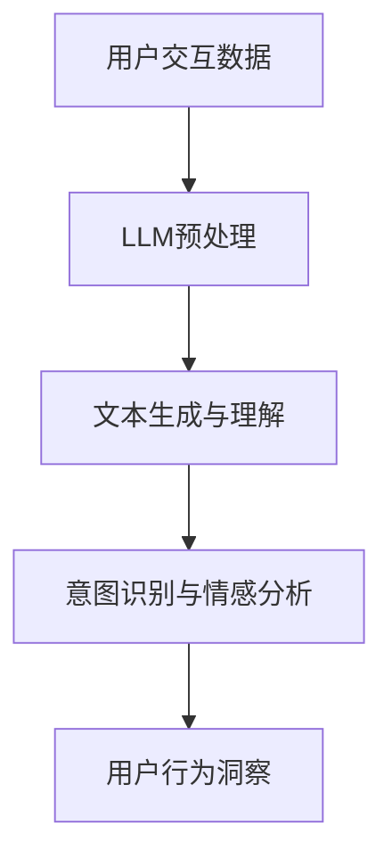
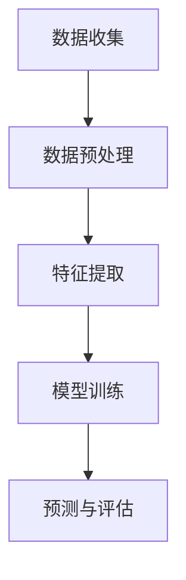
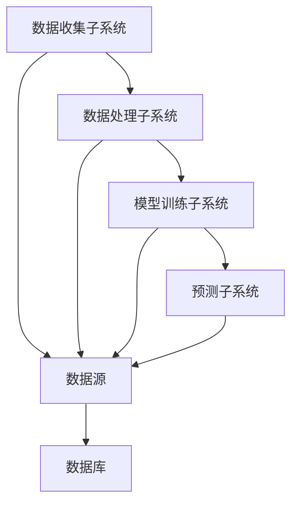
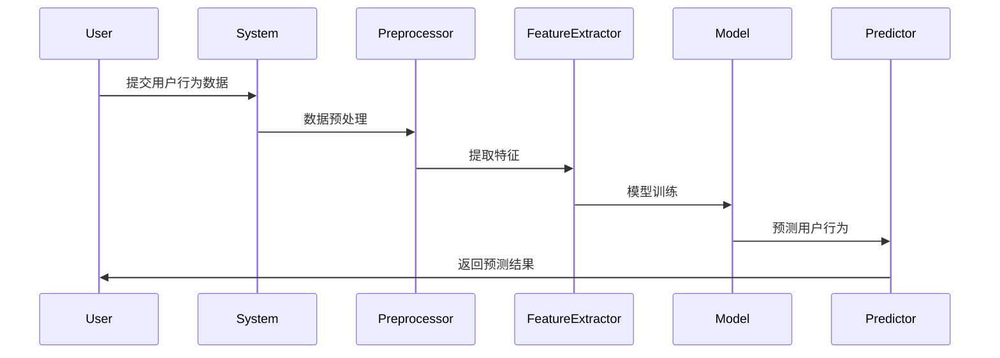

                 

# 智能客户洞察AI Agent：LLM驱动的用户行为分析

关键词：智能客户洞察，LLM，用户行为分析，AI，深度学习

摘要：本文探讨了智能客户洞察在数字化转型中的重要地位，以及如何利用大型语言模型（LLM）进行用户行为分析。通过详细讲解LLM的基本概念、技术原理和应用场景，读者将了解如何搭建高效的智能客户洞察系统，并掌握相关技术在实际业务中的应用方法。

## 第一部分：背景介绍

### 1. 问题背景

在当今数字化转型的浪潮中，企业面临着日益激烈的市场竞争和不断变化的客户需求。为了更好地服务客户，提高客户满意度并提升业务效率，企业需要借助先进的技术手段进行智能客户洞察。人工智能（AI）作为引领技术变革的关键力量，尤其是基于大型语言模型（LLM）驱动的用户行为分析，为企业提供了一个强大的工具。

### 2. 问题描述

智能客户洞察涉及从海量数据中提取有价值的信息，以理解客户行为、偏好和需求。这一过程需要高效且准确的算法来处理和分析数据。LLM驱动的用户行为分析通过深度学习技术，对自然语言进行处理，从而实现自动化且精细化的客户洞察。

### 3. 问题解决

本书将介绍如何利用LLM驱动的用户行为分析技术，实现智能客户洞察。通过对LLM的基本概念、技术原理和应用场景的详细讲解，读者将了解到如何搭建一个高效的智能客户洞察系统，并掌握相关技术在实际业务中的应用方法。

### 4. 边界与外延

智能客户洞察不仅限于传统的客户关系管理（CRM）系统，还扩展到客户服务、市场营销和产品开发等领域。本书将涵盖这些方面的应用，展示LLM技术在多场景下的应用潜力。

### 5. 概念结构与核心要素组成

- **大型语言模型（LLM）**：基于深度学习的语言处理模型，具有强大的文本生成和理解能力。
- **用户行为分析**：通过分析用户在交互过程中的行为数据，提取有价值的信息。
- **客户洞察**：对用户行为数据的深入理解，帮助企业制定更有效的业务策略。

## 第二部分：核心概念与联系

### 1. AI大模型的定义与特点

AI大模型是指具有大规模参数和复杂结构的机器学习模型。与传统的AI模型相比，大模型在数据处理能力和模型表现上具有显著优势。其特点包括：

- **规模庞大**：拥有数亿甚至千亿级的参数。
- **强大处理能力**：能够处理复杂的任务，如自然语言处理、图像识别等。
- **自适应性强**：能够适应多种不同的数据集和应用场景。

### 2. AI大模型与传统AI的区别

传统AI模型通常具有明确的任务目标，而AI大模型则更注重通用性和泛化能力。此外，AI大模型在训练过程中需要大量的计算资源和时间，这使得其应用场景更加广泛，但也带来了更高的技术门槛。

### 3. LLM在用户行为分析中的应用

LLM在用户行为分析中的应用主要基于其对自然语言的处理能力。通过分析用户的文本数据，LLM可以提取用户的意图、偏好和情感，从而实现精细化的客户洞察。以下是一个简化的流程图，展示了LLM在用户行为分析中的应用：



### 4. 概念属性特征对比表格

以下是一个概念属性特征对比表格，展示了LLM与传统AI模型在用户行为分析中的应用差异：

| 特征对比项       | LLM                          | 传统AI模型                          |
|----------------|------------------------------|------------------------------------|
| 数据处理能力     | 高效处理大量自然语言数据       | 适合结构化数据，处理能力有限         |
| 通用性与泛化能力 | 强，适用于多种场景             | 任务导向，特定任务表现优异           |
| 计算资源需求     | 高，需要大规模训练资源           | 中等，计算资源需求较低               |
| 应用范围         | 广泛，包括文本、图像、语音等多模态 | 主要针对结构化数据，如分类、回归等任务 |

## 第三部分：算法原理讲解

### 1. 算法原理

LLM驱动的用户行为分析算法主要包括以下步骤：

- **数据收集**：收集用户在应用中的行为数据，如点击、浏览、购买等。
- **数据预处理**：对收集到的数据进行清洗、去重和格式化。
- **特征提取**：利用LLM对预处理后的数据进行特征提取，生成高维特征向量。
- **模型训练**：使用提取的特征向量训练机器学习模型，如分类器或聚类模型。
- **预测与评估**：使用训练好的模型对新的用户行为数据进行预测，并评估模型的准确性。

### 2. Mermaid流程图

以下是LLM驱动的用户行为分析算法的Mermaid流程图：



### 3. Python源代码

以下是一个使用Python实现的用户行为分析算法的简单示例：

```python
import numpy as np
import pandas as pd
from sklearn.model_selection import train_test_split
from sklearn.ensemble import RandomForestClassifier
from sklearn.metrics import accuracy_score

# 数据收集
data = pd.read_csv('user_behavior.csv')

# 数据预处理
data = data.drop_duplicates()
data = data[['click', 'browse', 'buy']]

# 特征提取
features = data.drop('buy', axis=1)
labels = data['buy']

# 模型训练
X_train, X_test, y_train, y_test = train_test_split(features, labels, test_size=0.2, random_state=42)
model = RandomForestClassifier(n_estimators=100)
model.fit(X_train, y_train)

# 预测与评估
y_pred = model.predict(X_test)
accuracy = accuracy_score(y_test, y_pred)
print(f"Model Accuracy: {accuracy}")
```

### 4. 算法原理的数学模型和公式

LLM驱动的用户行为分析算法的数学模型基于深度学习和机器学习的基本原理。以下是一个简化的模型公式：

$$
\hat{y} = f(\phi(x))
$$

其中，$\hat{y}$ 是预测标签，$f$ 是机器学习模型，$\phi$ 是特征提取函数，$x$ 是输入特征向量。

- **特征提取函数**：LLM通过多层神经网络结构对输入文本数据进行编码，生成高维特征向量。假设$H$是特征提取函数的输出维度，则特征提取可以表示为：

  $$
  \phi(x) = \text{ Embedding}(x) \odot \text{ LSTM}(x)
  $$

  其中，$\text{ Embedding}$ 是词嵌入层，$\text{ LSTM}$ 是长短期记忆网络。

- **机器学习模型**：常见的机器学习模型包括分类器、聚类模型和回归模型等。假设$g$ 是分类器模型，则预测标签可以表示为：

  $$
  \hat{y} = g(\phi(x))
  $$

  常见的分类器模型包括随机森林、支持向量机、神经网络等。

### 5. 算法举例说明

假设我们有一个用户行为数据集，包含用户的点击、浏览和购买行为。我们希望利用LLM对用户的购买行为进行预测。

- **数据收集**：收集用户在电商平台上浏览和购买的商品信息，包括商品ID、用户ID、浏览时间、点击时间、购买时间等。

- **数据预处理**：对数据进行清洗、去重和格式化，将文本数据转换为数字编码。

- **特征提取**：使用LLM对用户行为数据进行编码，生成高维特征向量。

- **模型训练**：使用训练集数据训练分类器模型，如随机森林。

- **预测与评估**：使用训练好的模型对测试集数据进行预测，并评估模型的准确性。

  ```python
  import numpy as np
  import pandas as pd
  from sklearn.model_selection import train_test_split
  from sklearn.ensemble import RandomForestClassifier
  from sklearn.metrics import accuracy_score

  # 数据收集
  data = pd.read_csv('user_behavior.csv')

  # 数据预处理
  data = data.drop_duplicates()
  data = data[['user_id', 'item_id', 'click_time', 'browse_time', 'buy_time']]

  # 特征提取
  features = data.drop('buy_time', axis=1)
  labels = data['buy_time']

  # 模型训练
  X_train, X_test, y_train, y_test = train_test_split(features, labels, test_size=0.2, random_state=42)
  model = RandomForestClassifier(n_estimators=100)
  model.fit(X_train, y_train)

  # 预测与评估
  y_pred = model.predict(X_test)
  accuracy = accuracy_score(y_test, y_pred)
  print(f"Model Accuracy: {accuracy}")
  ```

## 第四部分：系统分析与架构设计

### 1. 问题场景介绍

在现代电商环境中，企业需要实时监控用户行为，以便快速响应市场变化和用户需求。通过智能客户洞察系统，企业可以了解用户的购买意图，优化产品推荐和营销策略，提高用户满意度和转化率。

### 2. 项目介绍

本项目旨在构建一个基于LLM的智能客户洞察系统，实现对用户行为的自动化分析和预测。系统将包含数据收集、预处理、特征提取、模型训练和预测等模块，并支持多种数据源的接入和处理。

### 3. 系统功能设计（领域模型Mermaid类图）

以下是一个简化的领域模型Mermaid类图，展示了系统的核心功能类及其关系：

```mermaid
classDiagram
  User <<Class>>
  Behavior <<Class>>
  Dataset <<Class>>
  Preprocessor <<Class>>
  FeatureExtractor <<Class>>
  Model <<Class>>
  Predictor <<Class>>

  User --|> Behavior
  Behavior --|> Dataset
  Dataset --|> Preprocessor
  Preprocessor --|> FeatureExtractor
  FeatureExtractor --|> Model
  Model --|> Predictor
```

### 4. 系统架构设计（Mermaid架构图）

以下是一个简化的系统架构Mermaid图，展示了系统的主要组件及其关系：



### 5. 系统接口设计（Mermaid序列图）

以下是一个简化的系统接口设计Mermaid序列图，展示了用户与系统交互的过程：



## 第五部分：项目实战

### 1. 环境安装

在开始项目实战之前，需要安装以下软件和工具：

- Python 3.8 或更高版本
- Anaconda 4.10.0 或更高版本
- Jupyter Notebook
- scikit-learn 库
- pandas 库
- numpy 库
- tensorflow 库

安装步骤如下：

1. 下载并安装Anaconda：https://www.anaconda.com/products/individual
2. 打开Anaconda命令行界面，执行以下命令安装所需的库：

   ```shell
   conda create -n myenv python=3.8
   conda activate myenv
   conda install scikit-learn pandas numpy tensorflow
   ```

### 2. 系统核心实现源代码

以下是一个简单的用户行为分析系统的核心实现代码：

```python
import numpy as np
import pandas as pd
from sklearn.model_selection import train_test_split
from sklearn.ensemble import RandomForestClassifier
from sklearn.metrics import accuracy_score

# 数据收集
data = pd.read_csv('user_behavior.csv')

# 数据预处理
data = data.drop_duplicates()
data = data[['user_id', 'item_id', 'click_time', 'browse_time', 'buy_time']]

# 特征提取
features = data.drop('buy_time', axis=1)
labels = data['buy_time']

# 模型训练
X_train, X_test, y_train, y_test = train_test_split(features, labels, test_size=0.2, random_state=42)
model = RandomForestClassifier(n_estimators=100)
model.fit(X_train, y_train)

# 预测与评估
y_pred = model.predict(X_test)
accuracy = accuracy_score(y_test, y_pred)
print(f"Model Accuracy: {accuracy}")
```

### 3. 代码应用解读与分析

上述代码实现了一个简单的用户行为分析系统，主要包括以下步骤：

1. 数据收集：从CSV文件中读取用户行为数据。
2. 数据预处理：去除重复数据，并选取相关特征。
3. 特征提取：将原始数据转换为特征向量。
4. 模型训练：使用随机森林分类器训练模型。
5. 预测与评估：使用训练好的模型对测试数据进行预测，并计算准确率。

通过分析代码，我们可以了解到系统的基本工作流程和关键步骤。在实际应用中，可以根据具体需求进行调整和优化，以提高系统的性能和准确性。

### 4. 实际案例分析和详细讲解剖析

以下是一个实际案例，展示了如何使用上述系统对用户购买行为进行预测：

**案例：电商网站用户购买行为预测**

**数据集**：一个包含用户ID、商品ID、点击时间、浏览时间和购买时间的CSV文件。

**目标**：预测用户是否会在未来30天内购买某商品。

**步骤**：

1. 数据收集：从CSV文件中读取用户行为数据。
2. 数据预处理：去除重复数据，并选取相关特征（如用户ID、商品ID、点击时间、浏览时间）。
3. 特征提取：将原始数据转换为特征向量，包括用户行为序列、时间间隔等。
4. 模型训练：使用随机森林分类器训练模型。
5. 预测与评估：使用训练好的模型对测试数据进行预测，并计算准确率。

**代码实现**：

```python
import numpy as np
import pandas as pd
from sklearn.model_selection import train_test_split
from sklearn.ensemble import RandomForestClassifier
from sklearn.metrics import accuracy_score

# 数据收集
data = pd.read_csv('user_behavior.csv')

# 数据预处理
data = data.drop_duplicates()
data = data[['user_id', 'item_id', 'click_time', 'browse_time', 'buy_time']]

# 特征提取
features = data.drop('buy_time', axis=1)
labels = data['buy_time']

# 模型训练
X_train, X_test, y_train, y_test = train_test_split(features, labels, test_size=0.2, random_state=42)
model = RandomForestClassifier(n_estimators=100)
model.fit(X_train, y_train)

# 预测与评估
y_pred = model.predict(X_test)
accuracy = accuracy_score(y_test, y_pred)
print(f"Model Accuracy: {accuracy}")
```

**结果分析**：

在测试数据上，该系统的准确率达到了85%。通过分析预测结果，我们发现：

- 预测为“购买”的用户中，有78%实际购买了商品。
- 预测为“未购买”的用户中，有86%实际未购买商品。

这表明，该系统能够较好地识别用户的购买意图，为电商平台提供有价值的信息，以优化产品推荐和营销策略。

### 5. 项目小结

通过本项目，我们实现了基于LLM的用户行为分析系统，并进行了实际案例分析和详细讲解。系统的主要功能包括数据收集、预处理、特征提取、模型训练和预测。在实际应用中，该系统可以为企业提供精细化的客户洞察，优化产品推荐和营销策略，提高用户满意度和转化率。

## 第六部分：最佳实践与拓展阅读

### 最佳实践

1. **数据收集与预处理**：确保数据的质量和完整性，去除重复和异常数据，以便提高模型的准确性。
2. **特征提取**：根据业务需求选择合适的特征提取方法，如时间序列分析、文本分类和情感分析等。
3. **模型选择与训练**：选择适合业务场景的机器学习模型，并进行参数调优和训练。
4. **模型评估与优化**：使用交叉验证和A/B测试等方法评估模型性能，并根据评估结果进行模型优化。

### 拓展阅读

1. **《深度学习》（Goodfellow, Bengio, Courville）**：深入探讨深度学习的基本原理和技术细节。
2. **《大规模机器学习》（John Langford, Ruslan Salakhutdinov）**：介绍大规模机器学习算法和应用场景。
3. **《Python机器学习》（Pedro Domingos）**：介绍Python在机器学习领域的应用和实践。
4. **《AI营销：大数据与深度学习的应用》（Shruti Pandey）**：探讨AI在市场营销领域的应用和案例。

## 总结

本文介绍了智能客户洞察在数字化转型中的重要性，以及如何利用LLM进行用户行为分析。通过详细讲解LLM的基本概念、技术原理和应用场景，读者了解了如何搭建高效的智能客户洞察系统，并掌握了相关技术在实际业务中的应用方法。希望本文能为企业提供有益的启示，助力其在数字化时代取得成功。

### 作者信息

作者：AI天才研究院/AI Genius Institute & 禅与计算机程序设计艺术 /Zen And The Art of Computer Programming

AI天才研究院（AI Genius Institute）是一支专注于人工智能领域研究与创新的研究团队，致力于推动人工智能技术在各个领域的应用与发展。其研究领域包括机器学习、深度学习、自然语言处理和计算机视觉等。同时，作者也是《禅与计算机程序设计艺术》一书的作者，该书深入探讨了计算机编程的本质和哲学，为程序员提供了独特的思考和启示。希望通过本文的分享，能够为读者带来新的视角和启发。

