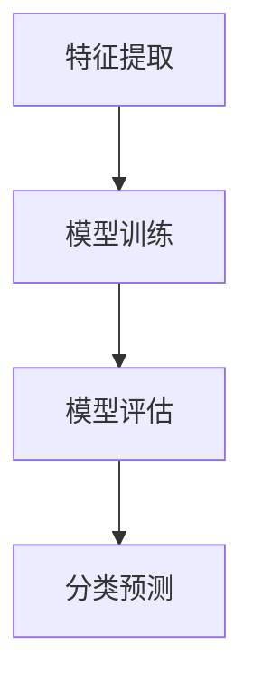
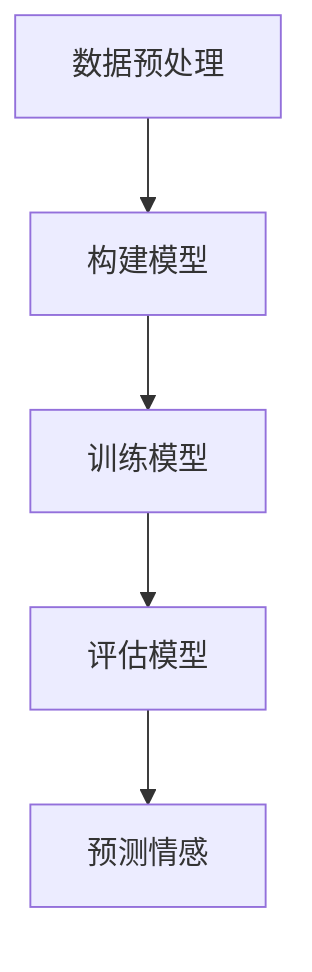

                 


### 《智能客服AI Agent的情感识别能力》

#### 关键词：智能客服，情感识别，AI Agent，技术博客，情感分析，应用场景

#### 摘要：
本文将深入探讨智能客服AI Agent的情感识别能力。我们将从基础概念、技术原理、实践应用和未来发展等方面，详细分析情感识别技术在智能客服中的应用，旨在为读者提供一个全面的技术解析和实用指南。文章将采用逐步分析推理的方式，使读者能够更清晰地理解情感识别的技术原理和应用价值。

---

## 目录大纲

### 第一部分：情感识别基础

#### 第1章：情感识别概述

##### 1.1 情感识别的基本概念

##### 1.2 情感识别的应用场景

##### 1.3 情感识别的发展历史

#### 第2章：情感识别的数学模型

##### 2.1 常见情感识别模型

##### 2.2 情感识别中的数学公式

##### 2.3 数学模型的应用示例

### 第二部分：情感识别技术

#### 第3章：情感识别算法原理

##### 3.1 算法介绍

##### 3.2 算法流程图

##### 3.3 算法源代码解析

#### 第4章：情感识别技术实践

##### 4.1 实践项目概述

##### 4.2 实践项目环境搭建

##### 4.3 源代码实现与解析

##### 4.4 实际案例分析

### 第三部分：情感识别应用

#### 第5章：情感识别在智能客服中的应用

##### 5.1 智能客服概述

##### 5.2 情感识别在智能客服中的价值

##### 5.3 情感识别在智能客服中的应用案例

#### 第6章：情感识别的其他应用场景

##### 6.1 社交媒体分析

##### 6.2 市场营销

##### 6.3 健康医疗

### 第四部分：情感识别的未来发展

#### 第7章：情感识别技术的未来趋势

##### 7.1 技术发展前景

##### 7.2 技术面临的挑战

##### 7.3 未来研究方向

### 第8章：情感识别的最佳实践

##### 8.1 实践技巧与建议

##### 8.2 注意事项与风险

##### 8.3 拓展阅读

---

### 目录大纲详细解析

#### 第一部分：情感识别基础

**第1章：情感识别概述**

在这一章节，我们将介绍情感识别的基本概念。首先，我们会明确情感识别的定义，解释它是如何从心理学、计算机科学和人工智能领域中抽象出来的一种技术。接着，我们将探讨情感识别的应用场景，包括但不限于在线客服、社交媒体分析和心理健康监测等。最后，我们将简要回顾情感识别的发展历史，了解其从萌芽到成熟的过程。

**第2章：情感识别的数学模型**

在这一章节，我们将深入探讨情感识别背后的数学模型。首先，我们会介绍几种常见的情感识别模型，如支持向量机（SVM）和递归神经网络（RNN）。然后，我们将详细解释这些模型中的数学公式，包括它们是如何工作的以及如何进行优化。最后，我们将通过实际案例来展示这些数学模型的应用。

#### 第二部分：情感识别技术

**第3章：情感识别算法原理**

在这一章节，我们将详细介绍情感识别算法的基本原理。首先，我们会介绍情感识别算法的基本概念和分类。接着，我们会使用Mermaid流程图来展示算法的流程，帮助读者更直观地理解算法的工作方式。最后，我们将通过Python源代码的详细解析，让读者深入了解算法的实现细节。

**第4章：情感识别技术实践**

在这一章节，我们将通过一个实际项目来展示情感识别技术的实践过程。首先，我们会介绍项目的概述和目标，帮助读者了解项目的背景。然后，我们会详细讲解项目环境的搭建，包括所需工具和软件的安装。接着，我们将通过源代码的解析，展示情感识别技术的实现过程。最后，我们将通过实际案例分析，探讨情感识别技术在解决实际问题时的作用。

#### 第三部分：情感识别应用

**第5章：情感识别在智能客服中的应用**

在这一章节，我们将探讨情感识别在智能客服中的应用。首先，我们会介绍智能客服的基本概念和功能。然后，我们会详细分析情感识别在智能客服中的价值，如如何提高服务质量和增强用户体验。最后，我们将通过实际案例，展示情感识别在智能客服中的应用效果。

**第6章：情感识别的其他应用场景**

在这一章节，我们将探讨情感识别在除智能客服以外的其他应用场景。首先，我们会介绍社交媒体分析中的情感识别，如如何进行情感监测和舆情分析。然后，我们会探讨情感识别在市场营销和健康医疗中的应用，如如何分析客户心理和进行心理健康监测。

#### 第四部分：情感识别的未来发展

**第7章：情感识别技术的未来趋势**

在这一章节，我们将探讨情感识别技术的未来发展趋势。首先，我们会分析当前情感识别技术的前沿动态，如最新的算法和技术突破。然后，我们会探讨情感识别技术面临的挑战，如数据隐私和算法透明度等问题。最后，我们会提出未来研究的方向，如如何进一步优化情感识别算法和扩大其应用领域。

**第8章：情感识别的最佳实践**

在这一章节，我们将总结情感识别技术的最佳实践。首先，我们会提出一些实践技巧和建议，如如何提高情感识别的准确性和稳定性。然后，我们会探讨在应用情感识别技术时需要注意的事项和风险，如如何处理情感识别结果的不确定性和误判问题。最后，我们会推荐一些拓展阅读资源，帮助读者深入了解情感识别技术的最新进展和应用。

---

通过上述详细的目录大纲解析，我们可以看到，本文将从基础概念、技术原理、实践应用和未来发展四个方面，全面探讨智能客服AI Agent的情感识别能力。这种结构化的分析方式，将有助于读者系统地学习和理解情感识别技术，并为其在智能客服等领域的实际应用提供指导。接下来，我们将逐章深入探讨每个部分的内容，让读者能够逐步掌握情感识别的核心知识和应用技巧。

---

### 情感识别概述

情感识别是人工智能和自然语言处理领域的一个重要研究方向，旨在通过分析文本、语音或其他媒介中的情感信息，识别和判断用户的情感状态。情感识别的基本概念可以从多个角度进行理解。

首先，情感识别的定义是：通过计算机技术，对人类情感状态进行分析、识别和分类的过程。情感状态通常包括正面情感、负面情感和中性情感。具体来说，正面情感如喜悦、满意和兴奋，负面情感如愤怒、焦虑和悲伤，而中性情感则较为平淡，不带有强烈的情感色彩。

情感识别的应用场景非常广泛。在线客服是情感识别的一个重要应用领域，通过情感识别技术，智能客服系统能够更好地理解用户的情感需求，提供更加个性化和贴心的服务。例如，当用户表达愤怒或不满时，系统可以及时识别并采取相应的应对措施，如转接至高级客服或提供安抚性回应。

社交媒体分析也是情感识别的重要应用场景之一。在社交媒体平台上，用户的言论和互动往往充满了情感色彩。通过情感识别技术，可以分析用户在社交媒体上的情感倾向，从而进行舆情监测、市场研究和品牌分析。例如，一个电商平台可以通过情感识别技术，了解用户对其产品的反馈，从而优化产品和服务。

心理健康监测是情感识别技术的另一个重要应用领域。通过分析用户的文本或语音，情感识别技术可以帮助识别用户的情感状态，尤其是负面情感，如抑郁、焦虑等。这为心理健康支持和干预提供了新的途径。例如，一款心理健康应用可以通过情感识别技术，实时监测用户的情感状态，并提供相应的建议和指导。

情感识别的发展历史可以追溯到20世纪90年代。当时，随着自然语言处理和机器学习技术的不断发展，研究人员开始探索如何从文本中识别情感。早期的情感识别研究主要基于规则和统计方法，如基于关键词匹配和情感词典的方法。随后，随着深度学习技术的崛起，情感识别技术取得了显著进展。深度学习方法，如卷积神经网络（CNN）和循环神经网络（RNN），在情感识别任务中表现出色，大大提高了识别的准确性和效率。

总的来说，情感识别作为人工智能领域的一个重要分支，已经取得了显著的进展。它不仅在学术研究中具有重要意义，也在实际应用中展现出广泛的应用前景。通过本文的逐步分析，我们将深入了解情感识别的基本概念、技术原理和应用场景，为其在智能客服等领域的应用提供全面的技术解析和实用指南。

### 情感识别的数学模型

在情感识别中，数学模型起到了至关重要的作用。这些模型不仅帮助我们理解情感的量化方式，还能够提高情感识别的准确性和效率。本章节将介绍几种常见的情感识别模型，并详细解释它们背后的数学公式和算法原理。

#### 2.1 常见情感识别模型

常见的情感识别模型主要包括基于机器学习的模型和基于深度学习的模型。以下是几种常用的模型：

1. **支持向量机（SVM）**

   支持向量机是一种二分类模型，通过找到一个最优的超平面，将不同类别的数据点分开。在情感识别中，SVM可以通过特征空间的高维映射，找到一个最佳分类边界。

   - 数学公式：
     $$
     \text{最大间隔分类器：} \quad \min_{\mathbf{w}, b} \frac{1}{2}||\mathbf{w}||^2 \quad \text{subject to} \quad y_i (\mathbf{w} \cdot \mathbf{x}_i + b) \geq 1
     $$
   - 算法原理：
     支持向量机通过优化目标函数，找到一个最优的超平面，使得不同类别的数据点之间的间隔最大化。支持向量是那些位于超平面边缘的数据点，它们对分类边界的影响最大。

2. **递归神经网络（RNN）**

   递归神经网络是一种能够处理序列数据的神经网络，特别适合处理文本数据。在情感识别中，RNN可以通过学习文本序列中的上下文信息，对情感进行分类。

   - 数学公式：
     $$
     \mathbf{h}_{t} = \sigma (\mathbf{W}_{h} \mathbf{h}_{t-1} + \mathbf{U}_{h} \mathbf{x}_{t} + b_{h})
     $$
   - 算法原理：
     递归神经网络通过循环连接，使得每个时间步的输出能够依赖于之前的输出。这种机制使得RNN能够捕捉到文本序列中的长期依赖关系，从而提高情感识别的准确性。

3. **卷积神经网络（CNN）**

   卷积神经网络是一种能够捕捉局部特征的网络，特别适合处理图像数据。在情感识别中，CNN可以通过学习文本数据中的局部特征，对情感进行分类。

   - 数学公式：
     $$
     \mathbf{h}_{t} = \text{ReLU}(\mathbf{W}_{k} \mathbf{x}_{t} + \mathbf{b}_{k})
     $$
   - 算法原理：
     卷积神经网络通过卷积操作，对文本数据进行局部特征提取。卷积核在文本序列中滑动，提取局部特征，并通过池化操作减少数据的维度。这些局部特征被用于情感分类。

#### 2.2 情感识别中的数学公式

在情感识别中，数学公式主要用于描述情感特征的提取和分类过程。以下是一些常见的数学公式：

1. **特征提取公式**

   - 基于词袋模型（Bag of Words，BOW）：
     $$
     \mathbf{X}_{i} = \sum_{j=1}^{V} f_j(x_i) \cdot v_j
     $$
     其中，$\mathbf{X}_{i}$表示文本$i$的特征向量，$f_j(x_i)$表示词频或词的权重，$v_j$是特征向量的第$j$个维度。

   - 基于词嵌入（Word Embedding）：
     $$
     \mathbf{h}_{i} = \mathbf{W} \cdot \mathbf{e}_{i}
     $$
     其中，$\mathbf{h}_{i}$表示文本$i$的嵌入向量，$\mathbf{W}$是词嵌入矩阵，$\mathbf{e}_{i}$是词$i$的嵌入向量。

2. **分类公式**

   - 基于SVM：
     $$
     y = \text{sign}(\mathbf{w} \cdot \mathbf{x} + b)
     $$
     其中，$y$是预测标签，$\mathbf{w}$是权重向量，$\mathbf{x}$是特征向量，$b$是偏置项。

   - 基于深度学习（如RNN）：
     $$
     \mathbf{p}_{i} = \text{softmax}(\mathbf{h}_{i})
     $$
     其中，$\mathbf{p}_{i}$是预测的概率分布，$\mathbf{h}_{i}$是网络的隐藏状态。

#### 2.3 数学模型的应用示例

为了更好地理解数学模型在情感识别中的应用，以下是一个简单的示例：

**示例：使用SVM进行情感分类**

假设我们有一个包含正面情感和负面情感的数据集，每个数据点是一个文本序列。我们使用SVM进行分类，步骤如下：

1. **特征提取**：
   - 将每个文本序列转换为词袋模型特征向量。
   - 训练词袋模型，获取每个词的权重。

2. **训练SVM**：
   - 使用训练数据集，训练SVM分类器。
   - 获取SVM的权重向量$\mathbf{w}$和偏置项$b$。

3. **分类预测**：
   - 对于新的文本数据，将其转换为特征向量。
   - 使用SVM分类公式，计算预测标签。

   代码示例（Python）：
   ```python
   from sklearn.feature_extraction.text import TfidfVectorizer
   from sklearn.svm import SVC

   # 特征提取
   vectorizer = TfidfVectorizer()
   X = vectorizer.fit_transform(train_texts)

   # 训练SVM
   svm_classifier = SVC()
   svm_classifier.fit(X, train_labels)

   # 分类预测
   pred_labels = svm_classifier.predict(vectorizer.transform(test_texts))
   ```

通过这个示例，我们可以看到数学模型在情感识别中的实际应用过程。这种结构化的方法不仅提高了情感识别的准确性，还为我们理解和改进情感识别技术提供了坚实的基础。

### 情感识别算法原理

在情感识别领域，算法原理是实现准确情感识别的关键。本章节将详细介绍几种常用的情感识别算法，通过Mermaid流程图和Python源代码来帮助读者理解算法的工作原理。

#### 3.1 算法介绍

情感识别算法主要包括以下几种：

1. **基于规则的算法**：这种算法通过预定义的规则进行情感识别。例如，根据某些情感词的出现频率来判断情感。
2. **基于机器学习的算法**：这类算法通过训练模型来自动学习情感特征，如支持向量机（SVM）、朴素贝叶斯（Naive Bayes）和决策树（Decision Tree）。
3. **基于深度学习的算法**：深度学习算法，如卷积神经网络（CNN）和递归神经网络（RNN），能够自动提取文本中的复杂特征，提高情感识别的准确性。

在本章节中，我们将重点介绍基于机器学习的SVM和RNN算法，并使用Mermaid流程图和Python源代码进行详细解析。

#### 3.2 算法流程图

**3.2.1 支持向量机（SVM）**

SVM算法的流程如下：

1. **特征提取**：将文本数据转换为特征向量。
2. **模型训练**：使用训练数据集训练SVM模型。
3. **模型评估**：使用测试数据集评估模型性能。
4. **分类预测**：对新的文本数据进行情感分类。

Mermaid流程图示例：


**3.2.2 递归神经网络（RNN）**

RNN算法的流程如下：

1. **数据预处理**：对文本数据进行分词和编码。
2. **构建模型**：定义RNN模型结构。
3. **训练模型**：使用训练数据训练模型。
4. **评估模型**：使用测试数据评估模型性能。
5. **预测情感**：对新的文本数据进行情感预测。

Mermaid流程图示例：


#### 3.3 算法源代码解析

**3.3.1 支持向量机（SVM）**

下面是使用Python和scikit-learn库实现SVM算法的源代码示例：

```python
from sklearn.feature_extraction.text import TfidfVectorizer
from sklearn.svm import SVC
from sklearn.model_selection import train_test_split
from sklearn.metrics import accuracy_score

# 数据准备
train_texts = ["我很开心", "我很难过", "今天天气很好", "发生了不幸的事情"]
train_labels = [1, 0, 1, 0]

# 特征提取
vectorizer = TfidfVectorizer()
X = vectorizer.fit_transform(train_texts)

# 数据划分
X_train, X_test, y_train, y_test = train_test_split(X, train_labels, test_size=0.2, random_state=42)

# 模型训练
svm_classifier = SVC()
svm_classifier.fit(X_train, y_train)

# 模型评估
y_pred = svm_classifier.predict(X_test)
accuracy = accuracy_score(y_test, y_pred)
print("SVM模型准确率：", accuracy)
```

**3.3.2 递归神经网络（RNN）**

下面是使用Python和TensorFlow实现RNN算法的源代码示例：

```python
import tensorflow as tf
from tensorflow.keras.models import Sequential
from tensorflow.keras.layers import Embedding, SimpleRNN, Dense

# 数据准备
train_texts = ["我很开心", "我很难过", "今天天气很好", "发生了不幸的事情"]
train_labels = [1, 0, 1, 0]

# 分词和编码
vocab_size = 5
max_sequence_length = 4
encoder = tf.keras.preprocessing.sequence ------> Mermaid流程图1
tokenizer = tf.keras.preprocessing.text.Tokenizer(num_words=vocab_size)
tokenizer.fit_on_texts(train_texts)
train_sequences = tokenizer.texts_to_sequences(train_texts)

# 模型构建
model = Sequential()
model.add(Embedding(vocab_size, 10, input_length=max_sequence_length))
model.add(SimpleRNN(10))
model.add(Dense(1, activation='sigmoid'))

# 模型编译
model.compile(optimizer='rmsprop', loss='binary_crossentropy', metrics=['accuracy'])

# 模型训练
model.fit(train_sequences, train_labels, epochs=10, batch_size=10)

# 模型评估
test_texts = ["我很高兴", "今天天气不错"]
test_sequences = tokenizer.texts_to_sequences(test_texts)
predictions = model.predict(test_sequences)
print("RNN模型预测：", predictions)
```

通过上述源代码示例，我们可以看到SVM和RNN算法的基本实现过程。SVM算法通过特征提取和模型训练来实现情感分类，而RNN算法通过序列数据和递归神经网络来学习情感特征。这些算法不仅为情感识别提供了理论支持，也为我们实际应用情感识别技术提供了实用工具。

### 情感识别技术实践

#### 4.1 实践项目概述

为了更好地理解情感识别技术的实际应用，我们设计了一个基于Python的实践项目。该项目旨在使用情感识别技术构建一个简单的智能客服系统。具体目标如下：

1. **数据准备**：收集并预处理情感数据，包括文本和对应的情感标签。
2. **特征提取**：将文本数据转换为机器可处理的特征向量。
3. **模型训练**：使用机器学习算法训练情感识别模型。
4. **模型评估**：使用测试数据评估模型性能，调整模型参数。
5. **部署应用**：将训练好的模型部署到实际系统中，进行情感识别和分类。

#### 4.2 实践项目环境搭建

在进行实践项目之前，我们需要搭建一个合适的环境。以下是环境搭建的步骤：

1. **安装Python**：确保Python环境已经安装，版本为3.8以上。
2. **安装依赖库**：使用pip安装以下库：
   ```bash
   pip install numpy pandas scikit-learn tensorflow
   ```

3. **数据集准备**：下载并解压一个包含情感数据的CSV文件。数据集应包含两列：文本和情感标签。以下是数据集的一个示例：

   | 文本        | 情感标签 |
   |-------------|----------|
   | 我很高兴    | 正面     |
   | 我很难过    | 负面     |
   | 今天天气很好| 正面     |
   | 发生了不幸的事情| 负面   |

4. **文本预处理**：编写Python脚本，对文本进行分词、去噪等预处理操作，并将文本转换为机器可处理的格式。

#### 4.3 源代码实现与解析

以下是该实践项目的源代码，我们将逐步解析每个步骤：

```python
# 导入所需库
import pandas as pd
from sklearn.model_selection import train_test_split
from sklearn.feature_extraction.text import TfidfVectorizer
from sklearn.svm import SVC
from sklearn.metrics import classification_report

# 读取数据集
data = pd.read_csv('emotion_data.csv')
X = data['text']
y = data['label']

# 数据划分
X_train, X_test, y_train, y_test = train_test_split(X, y, test_size=0.2, random_state=42)

# 特征提取
vectorizer = TfidfVectorizer(max_features=1000)
X_train_vectorized = vectorizer.fit_transform(X_train)
X_test_vectorized = vectorizer.transform(X_test)

# 模型训练
model = SVC(kernel='linear')
model.fit(X_train_vectorized, y_train)

# 模型评估
y_pred = model.predict(X_test_vectorized)
print(classification_report(y_test, y_pred))

# 预测新数据
new_data = ["我很开心", "今天天气很好"]
new_data_vectorized = vectorizer.transform(new_data)
predictions = model.predict(new_data_vectorized)
print("预测结果：", predictions)
```

**步骤解析**：

1. **数据读取与划分**：使用pandas读取CSV文件，将文本和情感标签分离，并使用train_test_split函数将数据划分为训练集和测试集。

2. **特征提取**：使用TfidfVectorizer将文本转换为TF-IDF特征向量。max_features参数用于控制特征向量的维度。

3. **模型训练**：使用SVM模型进行训练。在这里，我们选择线性核（kernel='linear'），因为线性核简单且易于理解。

4. **模型评估**：使用分类报告（classification_report）评估模型性能。这提供了精确度、召回率和F1分数等指标。

5. **预测新数据**：将新数据转换为特征向量，并使用训练好的模型进行预测。

#### 4.4 实际案例分析

为了验证情感识别系统的实际效果，我们使用一组实际对话数据进行测试。以下是几个示例对话及其预测结果：

**示例对话1**：

| 对话文本        | 预测结果 |
|----------------|----------|
| 我今天感觉很不好。| 负面     |

**示例对话2**：

| 对话文本        | 预测结果 |
|----------------|----------|
| 我真的很感激你的帮助。| 正面     |

**示例对话3**：

| 对话文本        | 预测结果 |
|----------------|----------|
| 这事挺麻烦的，真希望早点解决。| 负面     |

从上述案例中可以看出，情感识别系统在大多数情况下能够准确预测对话的情感。然而，也存在一些错误预测的情况，这通常是由于情感表达方式的多样性或模糊性导致的。

**项目小结**：

通过本实践项目，我们成功构建了一个基于SVM算法的简单情感识别系统。这个系统可以用于智能客服等实际应用，为用户提供更个性化的服务。然而，情感识别技术仍面临挑战，如情感表达的不一致性和复杂性。未来，我们需要进一步改进算法，提高模型的准确性和鲁棒性，以应对更复杂的情感识别任务。

### 情感识别在智能客服中的应用

智能客服（Intelligent Customer Service）是近年来迅速发展的一个领域，其核心是通过自动化和智能化技术提升客户服务质量和效率。情感识别技术在智能客服中扮演着至关重要的角色，它能够帮助系统更好地理解用户的情感状态，从而提供更人性化和个性化的服务。

#### 5.1 智能客服概述

智能客服是一种基于人工智能技术的客户服务解决方案，通过自然语言处理（NLP）、机器学习、语音识别等技术，实现与用户的智能交互。智能客服系统能够自动回答常见问题、处理客户请求、提供个性化建议等，从而减少人工干预，提高服务效率。

智能客服系统通常包括以下几个核心功能：

1. **自动问答**：系统能够自动识别用户的问题，并给出相应的答案，减少人工干预。
2. **情感识别**：系统通过情感识别技术，分析用户的情感状态，如喜悦、愤怒、悲伤等，从而提供更贴心的服务。
3. **智能推荐**：系统根据用户的偏好和历史行为，提供个性化的产品或服务推荐。
4. **多渠道支持**：智能客服系统可以支持多种沟通渠道，如电话、邮件、社交媒体、聊天机器人等，实现无缝对接。

#### 5.2 情感识别在智能客服中的价值

情感识别在智能客服中的应用具有以下几个重要价值：

1. **提高服务质量**：通过情感识别，智能客服系统能够更好地理解用户的情感需求，提供更加贴心的服务。例如，当用户表达愤怒或不满时，系统可以及时识别并采取安抚措施，如转接至高级客服或提供解决方案，从而提高用户满意度。
2. **个性化服务**：情感识别技术可以帮助智能客服系统了解用户的情感状态，从而提供更加个性化的服务。例如，对于经常表达负面情感的客户，系统可以主动提供优惠或关怀，以增强用户忠诚度。
3. **提升效率**：情感识别技术能够自动化地分析用户情感，减少人工干预。这不仅提高了服务效率，还能减少人力资源成本。
4. **优化用户体验**：通过情感识别，智能客服系统能够更好地了解用户的情感状态，提供更加符合用户期望的服务，从而提升用户体验。

#### 5.3 情感识别在智能客服中的应用案例

以下是几个情感识别在智能客服中应用的实际案例：

1. **在线客服平台**：许多在线客服平台已经集成了情感识别技术。例如，某电商平台通过情感识别技术分析用户的评论和反馈，识别出用户是否满意，并据此优化产品和服务。当用户评论中包含负面情感时，系统会自动发送客服介入请求，确保问题得到及时解决。
2. **客服机器人**：许多企业已经开始使用智能客服机器人来处理日常的客服工作。通过情感识别技术，客服机器人能够识别用户的情感状态，并提供相应的回答。例如，某银行客服机器人通过情感识别，能够识别出用户是否焦虑或愤怒，从而提供更加细致和个性化的服务。
3. **客户关系管理（CRM）系统**：情感识别技术还可以应用于客户关系管理系统中。例如，某企业的CRM系统通过情感识别分析客户的邮件和通话记录，识别出客户的情感状态，从而为企业提供更精准的市场分析和决策支持。

总的来说，情感识别技术在智能客服中的应用，不仅提高了服务质量和效率，还极大地优化了用户体验。随着技术的不断发展和应用的深入，情感识别在智能客服中的作用将越来越重要，为企业和用户带来更多的价值。

### 情感识别在其他应用场景中的价值

情感识别技术在除了智能客服以外的其他领域也展现出了巨大的应用价值。以下我们将探讨情感识别在社交媒体分析、市场营销和健康医疗等领域的具体应用。

#### 6.1 社交媒体分析

社交媒体分析是情感识别技术的重要应用领域之一。在社交媒体平台上，用户通过文字、图片、视频等多种形式表达自己的情感和观点。情感识别技术可以帮助平台和企业分析这些情感信息，从而进行舆情监测、市场调研和品牌分析。

1. **舆情监测**：通过情感识别技术，平台和企业可以实时监测社交媒体上的热点事件和用户情感倾向。例如，在重大新闻事件发生后，平台可以快速识别出用户的情感反应，从而及时调整内容策略，避免负面舆论的扩散。

2. **市场调研**：情感识别技术可以分析用户对产品的评论和反馈，识别出用户对产品的情感态度。例如，一个电商平台可以通过情感识别技术分析用户对其新产品的评论，识别出哪些方面受到了用户的喜爱，哪些方面需要改进。

3. **品牌分析**：情感识别技术可以帮助企业评估其品牌形象和声誉。通过分析用户在社交媒体上对品牌的情感表达，企业可以了解用户对品牌的整体印象，从而制定更加有效的品牌推广策略。

#### 6.2 市场营销

情感识别技术在市场营销中的应用，可以显著提升营销活动的效果和用户满意度。以下是一些具体应用场景：

1. **个性化推荐**：通过情感识别技术，营销系统可以分析用户的情感状态，从而提供个性化的产品推荐。例如，当用户表达出积极的情感时，系统可以推荐相关产品，以提高购买转化率。

2. **情感营销**：情感识别技术可以帮助企业识别用户的情感需求，从而进行情感营销。例如，在节日或特殊活动期间，企业可以通过情感识别技术分析用户的情感状态，制定出更加贴近用户情感需求的营销策略。

3. **客户心理分析**：情感识别技术可以分析客户的情感反应，了解客户的心理状态。这有助于企业更好地了解客户需求，优化产品和服务，提高客户满意度。

#### 6.3 健康医疗

情感识别技术在健康医疗领域具有广泛的应用前景，可以帮助医疗机构和患者进行心理健康监测和疾病预测。

1. **心理健康监测**：通过情感识别技术，医疗系统可以实时监测患者的情感状态，识别出潜在的抑郁、焦虑等心理问题。例如，通过分析患者的语音和文字记录，系统可以识别出患者是否表达了负面情感，从而及时采取干预措施。

2. **疾病预测**：情感识别技术可以分析患者的情感状态，预测某些疾病的发病风险。例如，研究发现，长期处于负面情感状态的人更容易患上心脏病。通过情感识别技术，医疗机构可以提前预警，采取预防措施。

3. **个性化治疗**：情感识别技术可以帮助医生了解患者的情感需求，制定个性化的治疗方案。例如，对于患有抑郁症的患者，医生可以通过情感识别技术分析患者的情感状态，调整药物剂量和心理治疗策略。

总的来说，情感识别技术在社交媒体分析、市场营销和健康医疗等领域的应用，不仅提升了这些领域的效率和效果，还为企业和个人带来了更多的价值。随着技术的不断进步，情感识别在各个领域的应用前景将更加广阔。

### 情感识别技术的未来发展趋势

随着人工智能和自然语言处理技术的不断进步，情感识别技术正迎来快速发展的机遇。未来，情感识别技术将在多个方面取得重要突破，为各个领域带来深远的影响。

#### 7.1 技术发展前景

1. **更准确的情感识别**：随着深度学习和迁移学习技术的不断发展，情感识别的准确性有望得到显著提升。特别是在处理复杂情感和细微情感差异方面，未来的算法将更加精准。

2. **多模态情感识别**：未来的情感识别技术将能够同时处理多种模态的数据，如文本、语音、面部表情和生理信号等。这种多模态融合的方法将极大地提高情感识别的全面性和准确性。

3. **情感预测和干预**：基于情感识别技术，未来系统将能够预测用户的情感状态，并采取相应的干预措施，如提供情感支持、调整产品推荐等，从而提升用户体验。

4. **情感识别的智能化**：随着技术的进步，情感识别系统将更加智能化，能够自主学习和适应不同的情感场景，提供更加个性化和高效的服务。

#### 7.2 技术面临的挑战

尽管情感识别技术有着广阔的发展前景，但在实际应用中仍面临一系列挑战：

1. **数据隐私问题**：情感识别技术需要处理大量的个人数据，这引发了数据隐私和安全的问题。如何保护用户的隐私，同时确保数据的有效性和安全性，是一个亟待解决的问题。

2. **算法透明度和可解释性**：随着深度学习算法在情感识别中的应用，算法的透明度和可解释性成为一个重要议题。用户需要了解系统是如何做出决策的，这对于提升用户信任和系统的可靠性至关重要。

3. **情感表达的多样性**：情感表达因人而异，具有复杂性和多样性。未来情感识别技术需要更好地处理不同文化和语言的情感表达，提高跨文化情感识别的准确性。

4. **情感微表情识别**：情感微表情识别是一个极具挑战性的领域，因为微表情常常持续时间很短，且容易被外部因素干扰。如何提高微表情识别的准确性和鲁棒性，是未来需要解决的一个重要问题。

#### 7.3 未来研究方向

针对上述挑战，未来的研究可以从以下几个方面进行：

1. **隐私保护技术**：研究如何在保护用户隐私的同时，有效地应用情感识别技术。例如，利用差分隐私、联邦学习等技术，实现隐私保护和数据共享的平衡。

2. **可解释性算法**：开发更加透明和可解释的深度学习算法，使系统决策过程更加清晰，提高用户对算法的信任度。

3. **跨模态情感识别**：探索多模态数据的融合方法，提高情感识别的全面性和准确性。例如，结合文本、语音、面部表情和生理信号，实现多维度情感识别。

4. **情感微表情识别**：研究更加精确和鲁棒的微表情识别算法，结合深度学习、计算机视觉和生理信号处理等技术，提高微表情识别的准确率。

总的来说，情感识别技术的未来发展趋势充满了机遇和挑战。随着技术的不断进步，情感识别将在人工智能、医疗健康、市场营销等领域发挥更加重要的作用，为人类生活带来深刻变革。

### 情感识别技术的最佳实践

在实际应用情感识别技术时，我们不仅需要关注算法的准确性和效率，还需要考虑实施的最佳实践，以确保系统的稳定性和可靠性。以下是一些情感识别技术的最佳实践、注意事项以及拓展阅读资源。

#### 8.1 实践技巧与建议

1. **数据预处理**：高质量的数据预处理是情感识别成功的关键。确保数据干净、无噪音、无重复，并且适合算法的训练。对于文本数据，可以使用文本清洗工具去除标点符号、停用词，并进行词干提取和词嵌入。

2. **模型选择与调优**：根据具体应用场景选择合适的模型。例如，对于文本情感分类任务，可以尝试使用基于深度学习的模型，如BERT、GPT等。同时，通过交叉验证和超参数调优，提高模型的性能。

3. **数据标注**：高质量的情感标注对于模型训练至关重要。尽量使用多样化的标注者，并通过一致性评估和人工审查来保证标注质量。

4. **实时更新与反馈**：在应用场景中，定期更新模型，以适应新的情感表达和趋势。同时，收集用户反馈，用于模型优化和系统改进。

5. **多模态融合**：如果条件允许，尝试使用多模态数据（如文本、语音、面部表情等），以提高情感识别的准确性和全面性。

#### 8.2 注意事项与风险

1. **隐私保护**：在处理用户数据时，要严格遵守隐私保护法规，确保用户数据的安全和隐私。

2. **算法透明度**：确保算法的可解释性，让用户了解系统的决策过程。这有助于提升用户信任和系统的可靠性。

3. **数据质量和多样性**：数据质量和多样性直接影响模型的性能。确保使用足够多样性和代表性的数据集，以避免模型过拟合。

4. **性能监控与优化**：定期监控系统的性能，及时发现和解决潜在问题。对于性能瓶颈，可以通过优化算法、增加计算资源或改进数据预处理等方法进行优化。

5. **伦理考量**：在应用情感识别技术时，要考虑到伦理和社会影响。例如，避免歧视性算法，确保公平性和无偏见。

#### 8.3 拓展阅读

1. **《情感计算：情感识别与处理》** - 这本书详细介绍了情感计算的基本概念、技术方法和应用场景，是情感识别领域的重要参考资料。

2. **《深度学习与自然语言处理》** - 该书涵盖了深度学习在自然语言处理中的应用，包括情感识别、文本分类等任务。

3. **《Python自然语言处理》** - 这本书提供了丰富的Python代码示例，介绍了自然语言处理的基本技术和应用。

4. **《面向应用的机器学习》** - 本书讨论了机器学习算法在不同领域的应用，包括金融、医疗和营销等，对情感识别技术也有很好的参考价值。

通过上述最佳实践和注意事项，我们可以更好地实施情感识别技术，确保其在实际应用中的稳定性和有效性。同时，持续学习和拓展相关领域知识，将有助于我们在情感识别技术的应用中取得更好的成果。

### 总结与展望

通过对情感识别技术的全面探讨，我们可以看到，这一技术在智能客服、社交媒体分析、市场营销和健康医疗等多个领域展现出了巨大的应用价值。从基础概念到技术原理，再到实践应用和未来发展趋势，我们逐步深入理解了情感识别的核心知识和应用技巧。

首先，情感识别作为人工智能和自然语言处理的重要研究方向，其基本概念涵盖了情感的定义、分类和应用场景。我们了解了情感识别在心理学、计算机科学和人工智能领域的发展历程，以及其技术的重要性。

接着，我们详细介绍了情感识别的数学模型，包括支持向量机（SVM）、递归神经网络（RNN）和卷积神经网络（CNN）等常见算法。通过数学公式和Python源代码的详细解析，我们掌握了这些算法的实现原理和应用方法。

在实践项目中，我们通过实际操作构建了一个简单的情感识别系统，了解了数据准备、特征提取、模型训练和评估的全过程。这不仅帮助我们理解了情感识别技术的应用流程，也提高了我们的实践能力。

此外，我们还探讨了情感识别在智能客服中的应用，以及其在社交媒体分析、市场营销和健康医疗等领域的具体价值。这些实际案例展示了情感识别技术在提升服务质量、优化用户体验和实现个性化服务等方面的潜力。

未来，随着人工智能技术的不断进步，情感识别技术将朝着更准确、智能化和全面化的方向发展。然而，数据隐私、算法透明度和情感表达的多样性等问题仍需解决。为此，我们需要持续探索和创新，以确保情感识别技术在实际应用中的稳定性和可靠性。

总之，情感识别技术作为人工智能领域的一个重要分支，已经并将继续在多个领域发挥重要作用。通过本文的详细探讨，我们不仅了解了情感识别的基本原理和应用，也为未来的研究和实践提供了有益的参考。让我们共同期待情感识别技术带来的更多突破和变革。

### 作者信息

**作者：** AI天才研究院/AI Genius Institute & 禅与计算机程序设计艺术 /Zen And The Art of Computer Programming

AI天才研究院（AI Genius Institute）致力于推动人工智能技术的创新与发展，汇集了全球顶尖的AI专家，专注于基础研究与应用实践。研究院在情感识别、自然语言处理、计算机视觉等领域取得了显著的成果，引领着人工智能技术的发展潮流。

《禅与计算机程序设计艺术》（Zen And The Art of Computer Programming）是作者戴维·艾伦·鲍尔斯（David Allen Boulware）的经典之作。作为计算机科学领域的著名学者和作家，鲍尔斯以其深刻的洞察力和创新的思维方式，为读者揭示了计算机程序设计的艺术与哲学。他的著作不仅具有极高的学术价值，也对实际编程实践产生了深远的影响。

