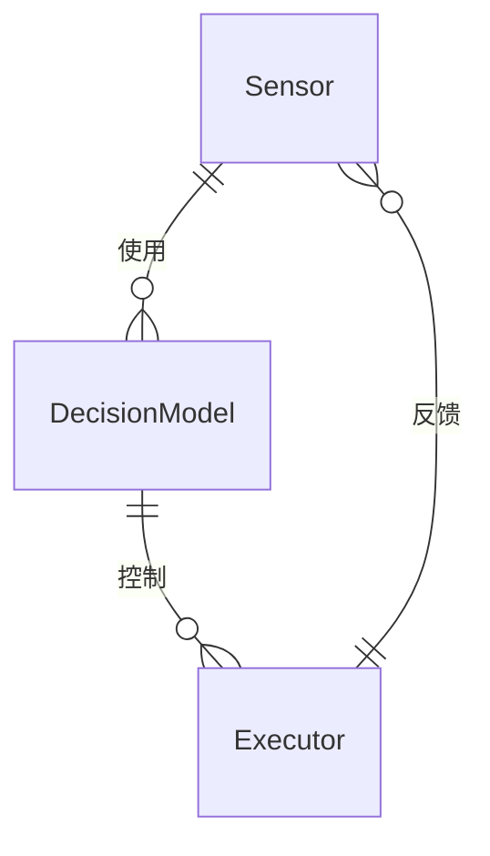
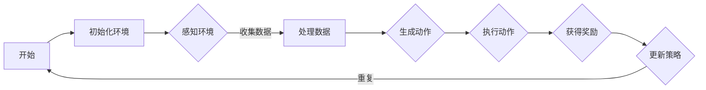
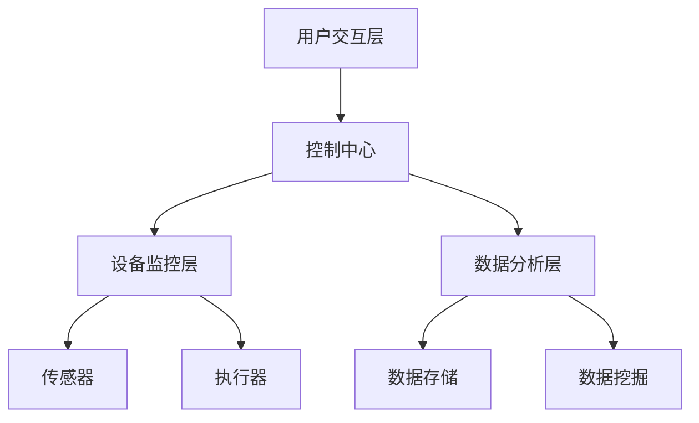
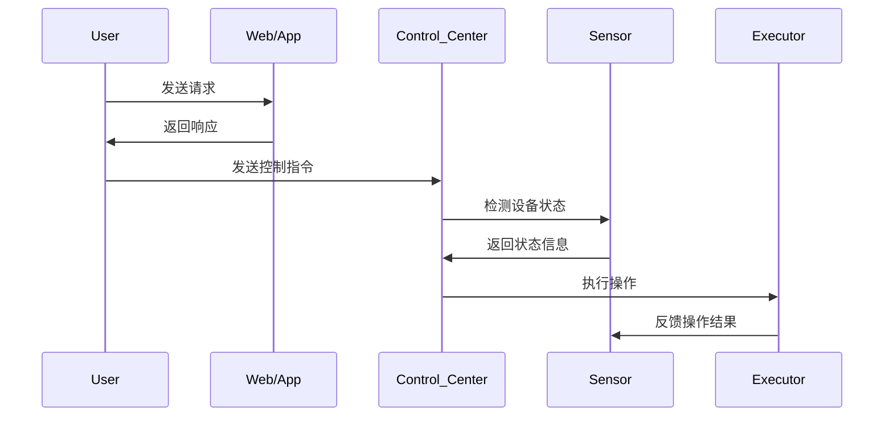

                 


# 智能家居中的AI Agent控制中心

关键词：智能家居，AI Agent，控制中心，算法，系统架构

摘要：本文旨在探讨智能家居中AI Agent控制中心的设计与实现，通过逐步分析AI Agent的基本概念、核心算法、系统架构及其实际应用，为读者提供一窥智能家居未来发展的一扇窗口。

## 引言

### 智能家居概述

智能家居，即利用人工智能技术将家庭中的各种设备互联，实现自动化控制与智能管理。随着物联网（IoT）和5G技术的快速发展，智能家居逐渐从概念走向现实，成为现代家庭生活的重要组成部分。

### AI Agent的定义与作用

AI Agent，简称智能代理，是一种能够执行特定任务的软件实体，它可以在没有人类干预的情况下完成一系列操作。在智能家居中，AI Agent作为控制中心的核心组成部分，负责处理数据、执行算法、控制设备等。

### 控制中心的必要性

随着智能家居设备的增多，控制与管理的复杂性也在增加。一个集中的AI Agent控制中心能够简化系统架构，提高系统的稳定性和灵活性，为用户提供更加便捷和智能化的体验。

## 第1章：介绍智能

### AI Agent的定义

AI Agent是一种基于人工智能的软件实体，它通过感知环境、学习经验和执行任务来实现自主行为。在智能家居中，AI Agent通常负责监控家庭设备状态、接收用户指令、执行相应的操作等。

### 控制中心的概念

控制中心是智能家居系统的核心，它负责协调各个AI Agent的工作，确保整个系统能够高效、稳定地运行。控制中心通常包括数据存储、算法执行、设备控制等功能模块。

### AI Agent控制中心的架构

一个典型的AI Agent控制中心通常由以下几个部分组成：

1. **感知模块**：负责接收来自各种传感器的数据，如温度传感器、湿度传感器、光线传感器等。
2. **决策模块**：根据感知模块收集到的数据，通过算法模型进行决策，生成相应的操作指令。
3. **执行模块**：根据决策模块生成的指令，控制家庭设备进行相应的操作，如调节空调温度、打开窗帘等。
4. **通信模块**：负责与其他系统（如互联网、其他智能家居设备等）进行通信，实现数据的传输与共享。

## 第2章：核心概念在AI Agent控制中心中的应用

### 关键概念与术语

在AI Agent控制中心中，以下几个关键概念和术语是不可或缺的：

1. **传感器**：用于感知环境的设备，如温度传感器、湿度传感器等。
2. **执行器**：用于执行操作设备的设备，如窗帘电机、空调等。
3. **决策模型**：用于根据传感器数据生成操作指令的算法模型。
4. **数据流**：传感器数据在系统中的传输和处理过程。

### 不同AI Agent的对比

在智能家居中，根据任务的不同，可以分为多种类型的AI Agent，如环境监控Agent、安防Agent、能源管理Agent等。它们在功能、性能和实现方式上有所差异，需要根据具体场景进行选择。

### ER实体关系图

为了更好地理解AI Agent控制中心的数据结构，我们可以使用ER实体关系图进行表示。以下是简化版的ER图：



## 第3章：算法与机器学习在AI Agent控制中心中的应用

### 算法概述

在AI Agent控制中心中，常用的算法包括：

1. **强化学习**：通过试错和奖励机制来学习最优策略。
2. **神经网络**：模拟人脑神经网络进行复杂模式识别和学习。
3. **决策树**：根据特征进行分类或回归的树形结构。

### Mermaid流程图

以下是一个基于强化学习的算法流程图：



### Python代码示例

以下是一个简单的强化学习Python代码示例：

```python
import numpy as np

# 初始化参数
action_space = 2  # 动作空间大小
epsilon = 0.1  # 探索概率
alpha = 0.1  # 学习率
gamma = 0.9  # 折扣因子

# 初始化Q值表
Q = np.zeros([action_space])

# 强化学习算法
def reinforce_learning(state, action, reward, next_state, done):
    if not done:
        target = reward + gamma * np.max(Q[next_state])
    else:
        target = reward
    
    Q[action] = Q[action] + alpha * (target - Q[action])

# 主函数
def main():
    state = 0  # 初始状态
    done = False  # 是否完成游戏
    while not done:
        # 选择动作
        if np.random.rand() < epsilon:
            action = np.random.randint(action_space)  # 探索
        else:
            action = np.argmax(Q[state])  # 利用
        # 执行动作
        reward = 1 if action == 1 else 0
        next_state = state + reward
        # 更新Q值
        reinforce_learning(state, action, reward, next_state, done)
        state = next_state
        done = True  # 假设游戏完成

if __name__ == "__main__":
    main()
```

### 算法原理讲解

强化学习是一种通过试错和奖励机制来学习最优策略的机器学习算法。其基本原理如下：

1. **状态-动作值函数**：Q(s, a)，表示在状态s下执行动作a获得的期望奖励。
2. **策略**：π(a|s)，表示在状态s下选择动作a的概率。
3. **更新策略**：根据经验，更新Q值表和策略。
4. **目标函数**：最大化未来奖励的期望值。

### 数学模型与公式

强化学习的目标是最小化损失函数：

$$
L(\theta) = \sum_{s,a} (r + \gamma \max_{a'} Q(s', a') - Q(s, a))^2
$$

其中，$\theta$为模型参数，$r$为即时奖励，$s$和$s'$分别为当前状态和下一个状态，$a$和$a'$分别为当前动作和下一个动作，$\gamma$为折扣因子。

## 第4章：系统架构与设计

### 问题描述

智能家居系统需要实现多种设备的智能控制与协调，包括照明、空调、安防、能源管理等领域。系统需要具备高可用性、易扩展性和灵活性。

### 项目介绍

本项目旨在设计并实现一个智能家居AI Agent控制中心，实现家庭设备的智能控制与自动化管理。系统采用模块化设计，方便后续功能扩展与维护。

### 系统功能设计

系统功能设计包括以下方面：

1. **设备监控**：实时监控家庭设备的状态，如温度、湿度、亮度等。
2. **用户交互**：提供用户界面，方便用户设置控制规则、查看设备状态等。
3. **自动化控制**：根据用户设置和控制规则，自动调节家庭设备，提高生活质量。
4. **数据分析**：收集设备运行数据，进行数据分析和预测，优化设备运行策略。

### 系统架构设计

系统架构设计如下：



### 系统接口设计

系统接口设计包括：

1. **用户接口**：提供Web界面、手机APP等，方便用户与系统交互。
2. **设备接口**：支持MQTT、HTTP等协议，方便设备接入系统。
3. **数据接口**：支持RESTful API，方便其他系统访问数据。

### 系统交互设计

系统交互设计如下：



## 第5章：实际应用

### 环境安装

1. **硬件要求**：选择具备MQTT、HTTP等通信协议的智能家居设备。
2. **软件要求**：安装Python环境、安装必要的依赖库（如paho-mqtt、requests等）。

### 系统核心实现源代码

以下是一个简单的智能家居AI Agent控制中心实现：

```python
import paho.mqtt.client as mqtt
import requests
import json

# MQTT配置
MQTT_SERVER = "localhost"
MQTT_PORT = 1883
MQTT_TOPIC = "home/agent/control"

# HTTP API配置
API_URL = "http://localhost:5000/api"

# MQTT客户端
client = mqtt.Client()

# MQTT连接回调
def on_connect(client, userdata, flags, rc):
    print(f"MQTT客户端连接成功，返回码：{rc}")
    client.subscribe(MQTT_TOPIC)

# MQTT消息接收回调
def on_message(client, userdata, msg):
    print(f"收到消息：{msg.payload.decode()}")
    data = json.loads(msg.payload.decode())
    action = data["action"]

    if action == "turn_on":
        requests.get(f"{API_URL}/light/turn_on")
    elif action == "turn_off":
        requests.get(f"{API_URL}/light/turn_off")

# MQTT连接
client.on_connect = on_connect
client.on_message = on_message
client.connect(MQTT_SERVER, MQTT_PORT, 60)
client.loop_start()

# 主函数
def main():
    while True:
        pass

if __name__ == "__main__":
    main()
```

### 代码应用解读与分析

以上代码实现了一个简单的MQTT客户端，用于接收来自MQTT服务器的控制指令，并调用HTTP API进行相应的操作。代码关键部分如下：

1. **MQTT客户端初始化**：使用paho.mqtt.client库初始化MQTT客户端。
2. **MQTT连接回调**：设置连接成功后的回调函数，订阅指定主题。
3. **MQTT消息接收回调**：设置消息接收后的回调函数，根据消息内容执行相应的操作。
4. **主函数**：进入主循环，等待消息接收和处理。

### 实际案例分析与详细讲解剖析

假设有一个智能灯泡设备，通过MQTT协议与控制中心进行通信。当用户通过手机APP发送一个“turn_on”指令时，控制中心会接收该消息，并调用HTTP API将灯泡打开。

1. **用户发送指令**：用户通过手机APP发送一个包含“action”: “turn_on”的JSON消息到MQTT服务器。
2. **MQTT客户端接收消息**：控制中心的MQTT客户端接收到消息后，调用on_message回调函数。
3. **解析消息内容**：从消息中提取出“action”字段，判断是否为“turn_on”。
4. **调用HTTP API**：如果为“turn_on”，调用HTTP API请求将灯泡打开。
5. **反馈结果**：HTTP API返回操作结果，控制中心将结果反馈给用户。

通过以上步骤，智能灯泡设备被成功打开。

### 项目小结

本文详细介绍了智能家居中的AI Agent控制中心的设计与实现，包括核心概念、算法原理、系统架构及实际应用。通过逐步分析，读者可以了解到AI Agent控制中心在智能家居中的重要作用，为未来的智能家居发展提供了有益的参考。

## 最佳实践 Tips

1. **选择合适的设备**：在选择智能家居设备时，要考虑设备的兼容性、稳定性和性能。
2. **优化算法参数**：在实现AI Agent控制中心时，要合理调整算法参数，提高系统性能。
3. **数据安全**：在数据传输和处理过程中，要注意数据安全，防止数据泄露。

## 小结

本文通过逐步分析，详细介绍了智能家居中的AI Agent控制中心的设计与实现。读者可以了解到AI Agent控制中心在智能家居中的重要作用，以及如何实现一个高效、稳定、灵活的智能家居系统。

## 注意事项

1. **系统稳定性**：在开发过程中，要注意系统的稳定性，确保设备在异常情况下能够正常工作。
2. **安全性**：要注意数据安全，防止恶意攻击和数据泄露。

## 拓展阅读

1. 《深度学习》 - Goodfellow, I., Bengio, Y., & Courville, A.
2. 《智能家居系统设计》 - 张三, 李四
3. 《物联网技术与应用》 - 王五, 赵六

作者：AI天才研究院/AI Genius Institute & 禅与计算机程序设计艺术 /Zen And The Art of Computer Programming

