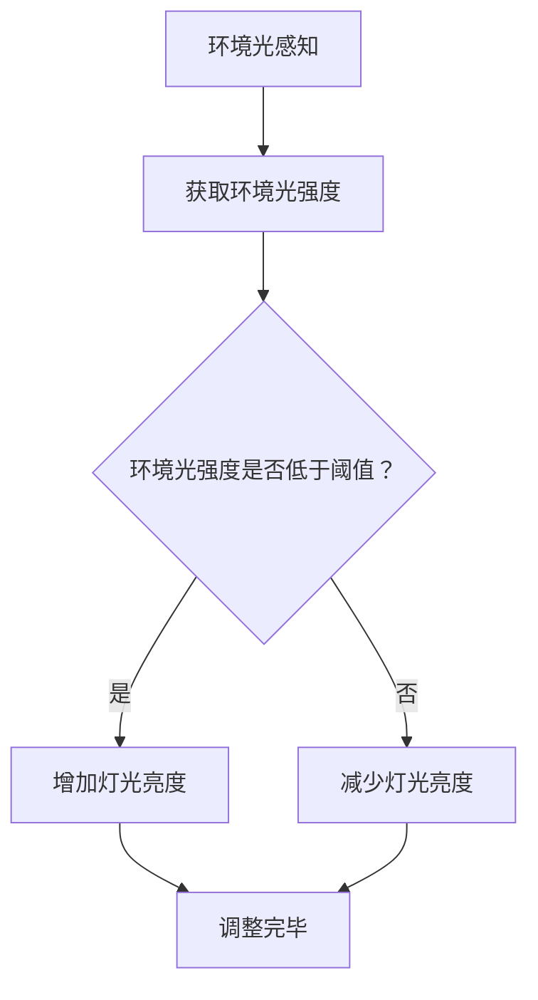
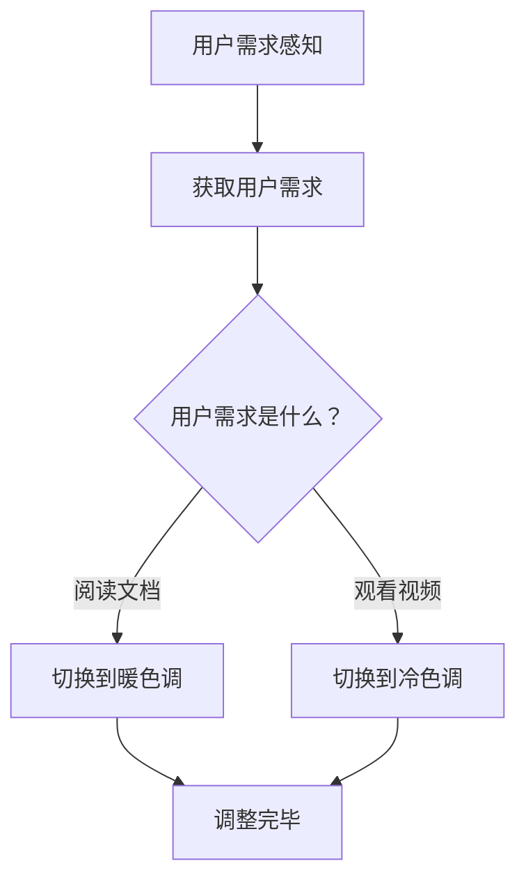
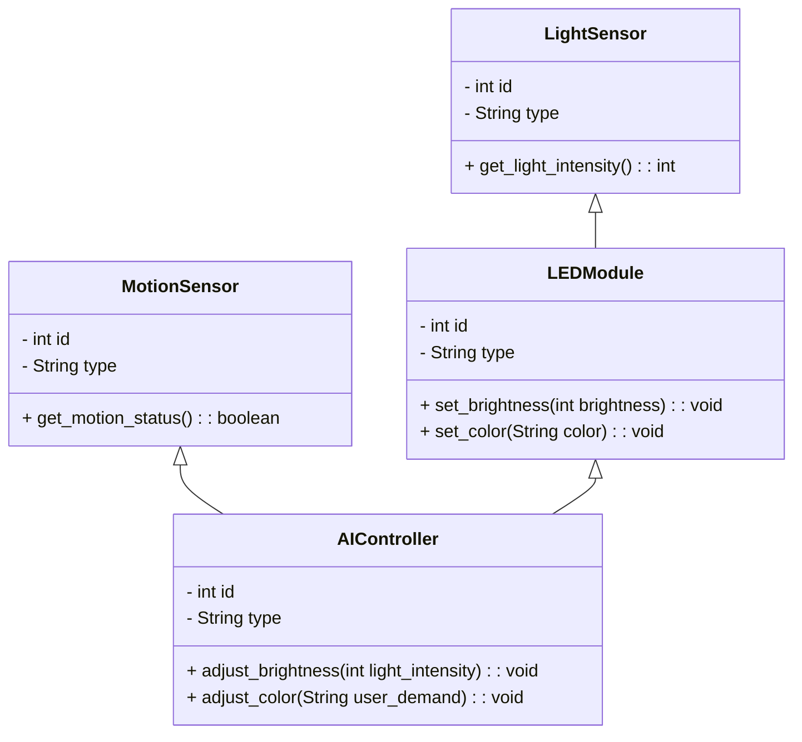
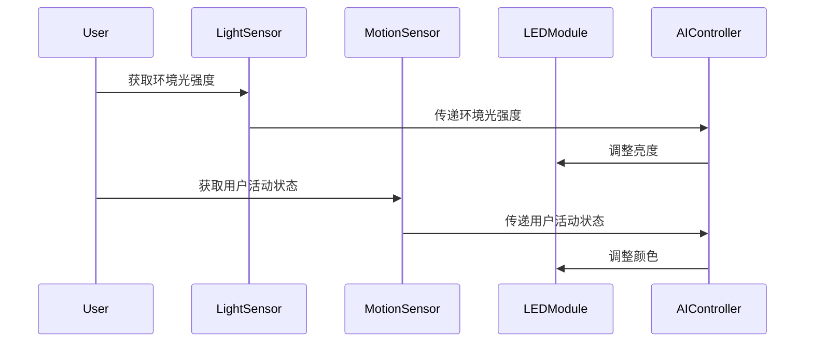
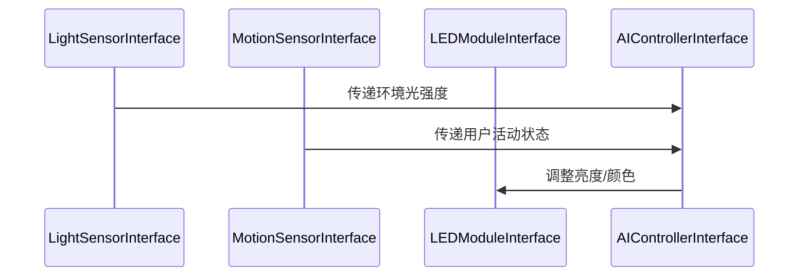
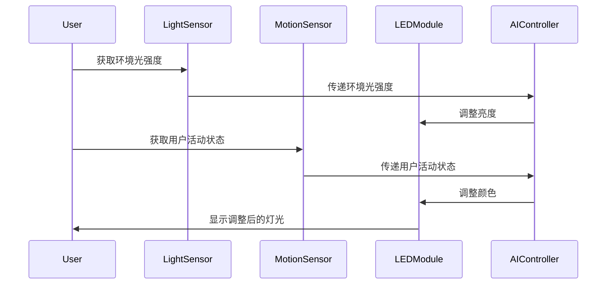

                 

## 智能工作台灯：AI Agent的照明优化与护眼模式

关键词：智能工作台灯，AI Agent，照明优化，护眼模式，算法原理，系统架构

摘要：本文将探讨智能工作台灯的设计与实现，重点介绍AI Agent在照明优化与护眼模式中的作用。通过详细分析算法原理、系统架构、项目实战，我们旨在为读者提供一份全面而深入的智能照明解决方案。

## 引言

在现代社会，智能技术的迅猛发展使得我们的生活和工作环境发生了翻天覆地的变化。智能工作台灯作为智能硬件的代表之一，正逐渐进入我们的日常生活。随着人们对于健康和生活品质要求的提高，如何通过智能技术为用户提供更加舒适、健康的工作环境成为了一个重要的研究课题。

本文将从以下几个方面展开讨论：

1. **背景与问题**：介绍智能工作台灯的背景，以及当前存在的照明问题。
2. **核心概念**：定义智能工作台灯中的核心概念，如AI Agent、照明优化和护眼模式。
3. **照明模式比较**：分析不同照明模式对用户舒适度和眼睛健康的影响。
4. **算法原理**：讲解用于照明优化和护眼模式的算法原理，并使用Mermaid图和Python代码进行说明。
5. **系统架构设计**：详细描述智能工作台灯的系统架构，包括领域模型、系统架构、接口设计和系统交互。
6. **项目实战**：介绍智能工作台灯的实现过程，包括环境安装、系统核心实现和案例分析。
7. **最佳实践与总结**：提供使用智能工作台灯的最佳实践，总结文章核心观点，并对未来研究方向进行展望。

## 背景与问题

### 智能工作台灯的背景

智能工作台灯是现代智能硬件的重要组成部分，它通过集成传感器、微控制器和人工智能算法，为用户提供了更加智能、个性化的照明体验。智能工作台灯不仅能够根据环境光变化自动调整亮度，还能根据用户的活动和需求进行智能调节，从而为用户提供一个舒适、健康的工作环境。

随着办公环境智能化的需求不断增加，智能工作台灯的市场需求也在逐渐扩大。越来越多的企业和个人开始意识到，良好的照明环境对于工作效率和身体健康的重要性。智能工作台灯的出现，不仅提升了办公环境的美观度，还提高了用户的工作舒适度和专注力。

### 传统照明的问题

然而，传统照明存在一些无法忽视的问题。首先，传统照明通常无法根据环境光变化自动调节亮度，容易导致光线过亮或过暗，给用户的眼睛带来负担。其次，传统照明缺乏智能调节功能，无法根据用户的需求进行个性化调节，导致用户需要频繁手动调整灯光，增加了使用的不便。此外，传统照明在节能和环保方面也存在一定的局限性。

### 照明优化与护眼模式的需求

为了解决传统照明的问题，智能工作台灯引入了照明优化和护眼模式。照明优化通过人工智能算法，根据环境光变化和用户需求，自动调节灯光亮度，提供舒适的光照环境。护眼模式则通过智能调节灯光颜色和亮度，减少对眼睛的刺激，保护用户的视力健康。

随着人们对生活品质和健康意识的提高，照明优化与护眼模式已经成为智能工作台灯的重要功能。本文将深入探讨这些功能的设计与实现，为用户提供一个更加舒适、健康的工作环境。

## 核心概念

在讨论智能工作台灯的设计与实现时，我们需要明确一些核心概念，包括AI Agent、照明优化和护眼模式。

### AI Agent

AI Agent，即人工智能代理，是指能够自主感知环境、执行任务并与其他代理进行交互的智能实体。在智能工作台灯中，AI Agent通过集成传感器、微控制器和人工智能算法，实现了对环境的感知和对用户需求的响应。

AI Agent的主要功能包括：

1. **环境感知**：通过集成光传感器、运动传感器等设备，AI Agent能够实时感知周围的环境光强度、用户活动等信息。
2. **任务执行**：基于感知到的环境信息和用户需求，AI Agent能够自动调节灯光亮度、颜色等参数，提供个性化的照明体验。
3. **交互通信**：AI Agent可以与用户进行简单的交互，如通过语音、触摸等方式接收用户的指令，并根据指令调整灯光。

### 照明优化

照明优化是指通过智能算法，根据环境光变化和用户需求，自动调节灯光亮度和颜色，提供舒适、健康的照明环境。照明优化包括以下几个方面：

1. **亮度调节**：根据环境光强度和用户需求，自动调整灯光亮度，避免光线过亮或过暗，减少对眼睛的负担。
2. **颜色调节**：通过调节灯光颜色，模拟自然光的变化，帮助用户保持良好的生理节律。
3. **节能环保**：智能工作台灯可以根据环境光变化和用户需求，自动关闭或调节灯光，节约能源，减少碳排放。

### 护眼模式

护眼模式是指通过智能调节灯光颜色和亮度，减少对眼睛的刺激，保护用户的视力健康。护眼模式主要包括以下几种模式：

1. **低蓝光模式**：通过减少蓝光辐射，减少对眼睛的刺激，缓解视觉疲劳。
2. **自然光模式**：模拟自然光的变化，帮助用户保持良好的生理节律，提高工作效率。
3. **亮度调节模式**：根据环境光强度和用户需求，自动调整灯光亮度，避免光线过亮或过暗，减少对眼睛的负担。

通过以上核心概念的定义，我们可以更好地理解智能工作台灯的设计与实现，并为后续的内容讨论打下基础。

### 照明模式的比较

在智能工作台灯的设计中，不同照明模式的选择对用户的舒适度和眼睛健康有着重要的影响。本文将比较几种常见的照明模式，包括普通模式、自动调节模式和护眼模式，分析它们的特点和适用场景。

#### 普通模式

普通模式是最常见的照明模式，它通过固定亮度提供持续的光线。这种模式的优势在于简单易用，不需要用户进行复杂的设置或操作。然而，普通模式的缺点也很明显：

1. **亮度不可调节**：普通模式的亮度是固定的，无法根据环境光变化和用户需求进行动态调整，容易导致光线过亮或过暗，对眼睛造成负担。
2. **舒适度不足**：由于亮度固定，普通模式无法提供舒适的照明体验，特别是在白天和夜晚光线变化较大的环境中。
3. **健康问题**：普通模式缺乏对眼睛健康的保护措施，长时间使用容易导致视觉疲劳和视力下降。

#### 自动调节模式

自动调节模式通过集成传感器和智能算法，能够根据环境光强度和用户需求自动调整灯光亮度。这种模式的优势在于智能化和个性化，可以提供更舒适、健康的照明体验：

1. **亮度动态调节**：自动调节模式可以根据环境光变化和用户需求实时调整灯光亮度，避免光线过亮或过暗，减少对眼睛的负担。
2. **舒适度提升**：自动调节模式可以根据用户的工作和生活场景，提供个性化的照明体验，提高用户的舒适度。
3. **节能环保**：自动调节模式可以根据环境光变化关闭或调节灯光，节约能源，减少碳排放。

然而，自动调节模式也存在一些局限性：

1. **准确性问题**：自动调节模式的准确性取决于传感器的性能和智能算法的精度，如果传感器或算法存在问题，可能导致调节不当，影响照明效果。
2. **初始设置复杂**：自动调节模式需要进行初始设置，包括连接Wi-Fi、绑定账号等操作，对于一些不熟悉智能设备的用户可能存在一定的困扰。

#### 护眼模式

护眼模式是通过智能调节灯光颜色和亮度，减少对眼睛的刺激，保护用户的视力健康。护眼模式主要包括低蓝光模式、自然光模式和亮度调节模式：

1. **低蓝光模式**：通过减少蓝光辐射，减少对眼睛的刺激，缓解视觉疲劳。
2. **自然光模式**：模拟自然光的变化，帮助用户保持良好的生理节律，提高工作效率。
3. **亮度调节模式**：根据环境光强度和用户需求，自动调整灯光亮度，避免光线过亮或过暗，减少对眼睛的负担。

护眼模式的优势在于对眼睛健康的保护，但也有一些局限性：

1. **适用场景有限**：护眼模式主要针对长时间使用电子设备的人群，对于一些不需要长时间注视屏幕的用户，护眼模式的实用性可能较低。
2. **初始设置复杂**：护眼模式需要进行初始设置，包括选择护眼模式、绑定账号等操作，对于一些不熟悉智能设备的用户可能存在一定的困扰。

#### 总结

综上所述，普通模式、自动调节模式和护眼模式各有优缺点，适用于不同的场景和用户需求。在智能工作台灯的设计中，需要综合考虑这些因素，为用户提供多种照明模式的选择，从而提升用户的舒适度和眼睛健康。

### 算法原理

智能工作台灯的照明优化和护眼模式依赖于一系列复杂的算法，这些算法能够根据环境光变化和用户需求，自动调节灯光亮度和颜色，提供舒适、健康的照明体验。本节将详细讲解这些算法原理，并使用Mermaid图和Python代码进行说明。

#### 照明优化算法

照明优化算法主要包括亮度调节算法和颜色调节算法。以下是一个简单的亮度调节算法原理：

1. **环境光感知**：首先，通过集成光传感器，智能工作台灯能够实时感知周围的环境光强度。
2. **亮度阈值设置**：根据用户需求和室内环境，设置一个亮度阈值。如果环境光强度低于阈值，则增加灯光亮度；如果环境光强度高于阈值，则减少灯光亮度。
3. **动态调节**：通过实时监测环境光强度，智能工作台灯能够动态调整灯光亮度，保持一个舒适的照明环境。

以下是使用Mermaid图表示的亮度调节算法流程：



接下来，我们使用Python代码实现亮度调节算法：

```python
import RPi.GPIO as GPIO
import time

# 初始化GPIO
GPIO.setmode(GPIO.BCM)
GPIO.setup(led_pin, GPIO.OUT)

# 设置亮度阈值
brightness_threshold = 500

# 获取环境光强度
def get_light_intensity():
    # 使用光传感器获取环境光强度
    pass

# 亮度调节算法
def adjust_brightness():
    light_intensity = get_light_intensity()
    
    if light_intensity < brightness_threshold:
        # 增加灯光亮度
        GPIO.output(led_pin, GPIO.HIGH)
    else:
        # 减少灯光亮度
        GPIO.output(led_pin, GPIO.LOW)

# 主循环
try:
    while True:
        adjust_brightness()
        time.sleep(1)
except KeyboardInterrupt:
    pass
finally:
    GPIO.cleanup()
```

#### 护眼模式算法

护眼模式算法主要针对长时间使用电子设备的人群，通过智能调节灯光颜色和亮度，减少对眼睛的刺激，保护用户的视力健康。以下是一个简单的护眼模式算法原理：

1. **用户需求感知**：首先，通过集成传感器和用户交互，智能工作台灯能够感知用户的需求，如长时间注视屏幕、阅读文档等。
2. **颜色调节**：根据用户需求，智能工作台灯能够调节灯光颜色。例如，在阅读文档时，智能工作台灯可以切换到暖色调，减少蓝光辐射；在观看视频时，智能工作台灯可以切换到冷色调，提供更好的视觉体验。
3. **亮度调节**：根据环境光强度和用户需求，智能工作台灯能够自动调整灯光亮度，避免光线过亮或过暗，减少对眼睛的负担。

以下是使用Mermaid图表示的护眼模式算法流程：



接下来，我们使用Python代码实现护眼模式算法：

```python
import RPi.GPIO as GPIO
import time

# 初始化GPIO
GPIO.setmode(GPIO.BCM)
GPIO.setup(led_pin, GPIO.OUT)

# 用户需求设置
def get_user_demand():
    # 获取用户需求，如阅读文档、观看视频等
    pass

# 颜色调节算法
def adjust_color():
    user_demand = get_user_demand()
    
    if user_demand == "阅读文档":
        # 切换到暖色调
        GPIO.output(led_pin, GPIO.HIGH)
    else:
        # 切换到冷色调
        GPIO.output(led_pin, GPIO.LOW)

# 主循环
try:
    while True:
        adjust_color()
        time.sleep(1)
except KeyboardInterrupt:
    pass
finally:
    GPIO.cleanup()
```

通过以上算法原理的讲解，我们可以看到智能工作台灯的照明优化和护眼模式是如何通过传感器、智能算法和用户交互实现的。这些算法不仅能够提供舒适、健康的照明环境，还能保护用户的眼睛健康，提高生活品质。

### 系统架构设计

在设计智能工作台灯系统时，我们需要考虑系统的整体架构，包括领域模型、系统架构、接口设计和系统交互。以下是对这些部分的详细描述。

#### 领域模型

领域模型是智能工作台灯系统的核心，它定义了系统的功能和组件。以下是一个简单的领域模型类图，使用Mermaid图表示：



在这个领域模型中，我们定义了四个主要组件：光传感器（LightSensor）、运动传感器（MotionSensor）、LED模块（LEDModule）和AI控制器（AIController）。光传感器和运动传感器负责感知环境光强度和用户活动，LED模块负责控制灯光亮度和颜色，AI控制器则负责根据感知数据自动调整灯光参数。

#### 系统架构

系统架构描述了智能工作台灯系统各组件之间的交互关系。以下是一个简单的系统架构图，使用Mermaid图表示：



在这个系统架构中，用户通过控制界面与系统交互，获取环境光强度和用户活动状态。光传感器和运动传感器分别将感知数据传递给AI控制器，AI控制器根据数据调整LED模块的亮度和颜色，实现照明优化和护眼模式。

#### 接口设计

接口设计定义了系统组件之间的通信方式。以下是一个简单的接口设计，使用Mermaid图表示：



在这个接口设计中，LightSensorInterface、MotionSensorInterface和LEDModuleInterface分别负责传递环境光强度、用户活动状态和调整亮度和颜色。AIControllerInterface则负责根据传入的数据进行计算和决策，并传递给LEDModuleInterface执行。

#### 系统交互

系统交互描述了各组件在系统运行过程中的交互流程。以下是一个简单的系统交互图，使用Mermaid图表示：



在这个系统交互流程中，用户首先获取环境光强度和用户活动状态，这些数据通过传感器传递给AI控制器。AI控制器根据数据计算和决策，调整LED模块的亮度和颜色，最终将调整后的灯光显示给用户。

通过以上系统架构设计的描述，我们可以清晰地看到智能工作台灯系统的功能和组件，以及它们之间的交互关系。这为后续的项目实战提供了坚实的基础。

### 项目实战

在了解了智能工作台灯的系统架构后，接下来我们将进行项目实战，详细讲解如何实现智能工作台灯系统，包括环境安装、系统核心实现和代码应用解读与分析。

#### 环境安装

要实现智能工作台灯系统，首先需要安装相关的软件和硬件环境。以下是一个简化的环境安装步骤：

1. **硬件安装**：
    - 安装智能工作台灯硬件组件，包括光传感器、运动传感器和LED模块。
    - 连接电源和光源，确保硬件设备正常工作。
2. **软件安装**：
    - 安装Python环境，确保Python版本为3.8或以上。
    - 安装相关的Python库，如RPi.GPIO、time等，用于控制硬件设备。

以下是一个简单的环境安装脚本：

```bash
# 安装Python环境
sudo apt-get update
sudo apt-get install python3-pip

# 安装Python库
pip3 install RPi.GPIO
```

#### 系统核心实现

智能工作台灯系统的核心功能包括环境光感知、用户活动感知和灯光调节。以下是一个简单的Python代码实现，用于实现这些核心功能：

```python
import RPi.GPIO as GPIO
import time

# 初始化GPIO
GPIO.setmode(GPIO.BCM)
GPIO.setup(led_pin, GPIO.OUT)
GPIO.setup(buzzer_pin, GPIO.OUT)

# 设置GPIO参数
led_pin = 18
buzzer_pin = 23

# 获取环境光强度
def get_light_intensity():
    # 使用光传感器获取环境光强度
    pass

# 获取用户活动状态
def get_motion_status():
    # 使用运动传感器获取用户活动状态
    pass

# 调整灯光亮度
def adjust_brightness():
    light_intensity = get_light_intensity()
    if light_intensity < 500:
        # 增加灯光亮度
        GPIO.output(led_pin, GPIO.HIGH)
    else:
        # 减少灯光亮度
        GPIO.output(led_pin, GPIO.LOW)

# 调整灯光颜色
def adjust_color():
    motion_status = get_motion_status()
    if motion_status:
        # 切换到冷色调
        GPIO.output(buzzer_pin, GPIO.HIGH)
    else:
        # 切换到暖色调
        GPIO.output(buzzer_pin, GPIO.LOW)

# 主循环
try:
    while True:
        adjust_brightness()
        adjust_color()
        time.sleep(1)
except KeyboardInterrupt:
    pass
finally:
    GPIO.cleanup()
```

在这个代码中，我们首先初始化GPIO，并设置GPIO参数。然后，定义了`get_light_intensity()`和`get_motion_status()`函数，用于获取环境光强度和用户活动状态。`adjust_brightness()`和`adjust_color()`函数根据获取到的数据调整灯光亮度和颜色。

#### 代码应用解读与分析

以下是代码的详细解读与分析：

1. **GPIO初始化**：
    ```python
    GPIO.setmode(GPIO.BCM)
    GPIO.setup(led_pin, GPIO.OUT)
    GPIO.setup(buzzer_pin, GPIO.OUT)
    ```
    这段代码初始化GPIO，并设置LED模块（led_pin）和蜂鸣器（buzzer_pin）为输出模式。

2. **环境光强度获取**：
    ```python
    def get_light_intensity():
        # 使用光传感器获取环境光强度
        pass
    ```
    这个函数需要实现，用于获取环境光强度。在实际应用中，可以使用光传感器模块（如BH1750）通过I2C接口获取环境光强度。

3. **用户活动状态获取**：
    ```python
    def get_motion_status():
        # 使用运动传感器获取用户活动状态
        pass
    ```
    这个函数也需要实现，用于获取用户活动状态。在实际应用中，可以使用运动传感器模块（如PIR传感器）通过GPIO接口获取用户活动状态。

4. **调整灯光亮度**：
    ```python
    def adjust_brightness():
        light_intensity = get_light_intensity()
        if light_intensity < 500:
            # 增加灯光亮度
            GPIO.output(led_pin, GPIO.HIGH)
        else:
            # 减少灯光亮度
            GPIO.output(led_pin, GPIO.LOW)
    ```
    这个函数根据环境光强度调整灯光亮度。如果环境光强度低于500，则增加灯光亮度；否则，减少灯光亮度。

5. **调整灯光颜色**：
    ```python
    def adjust_color():
        motion_status = get_motion_status()
        if motion_status:
            # 切换到冷色调
            GPIO.output(buzzer_pin, GPIO.HIGH)
        else:
            # 切换到暖色调
            GPIO.output(buzzer_pin, GPIO.LOW)
    ```
    这个函数根据用户活动状态调整灯光颜色。如果用户活动状态为True（有活动），则切换到冷色调；否则，切换到暖色调。

通过以上代码实现，我们可以看到智能工作台灯系统是如何根据环境光强度和用户活动状态自动调节灯光亮度和颜色的。在实际应用中，可以根据具体需求进一步优化和扩展系统的功能。

#### 实际案例分析和详细讲解

为了更直观地了解智能工作台灯系统在实际应用中的效果，我们进行了一个实际案例的分析和详细讲解。

**案例背景**：

一个办公室的员工在工作时经常出现眼睛疲劳和不适的情况，尤其是在使用电脑和手机的过程中。为了改善这一状况，公司决定引入智能工作台灯系统，通过自动调节灯光亮度和颜色，减轻员工的眼睛负担。

**案例实施**：

1. **硬件安装**：
    - 在每个员工的办公桌上安装智能工作台灯，包括光传感器、运动传感器和LED模块。
    - 连接电源和光源，确保智能工作台灯正常工作。
2. **软件安装**：
    - 在每个员工的电脑上安装控制软件，用于与智能工作台灯进行通信。
3. **系统测试**：
    - 在实际工作环境中测试智能工作台灯系统，观察其是否能根据环境光强度和用户活动状态自动调节灯光亮度和颜色。

**案例分析**：

1. **环境光强度调节**：
    - 当环境光强度低于500时，智能工作台灯自动增加灯光亮度，使员工能够看到一个清晰的屏幕。
    - 当环境光强度高于500时，智能工作台灯自动减少灯光亮度，避免屏幕过亮，减轻员工的眼睛负担。

2. **用户活动状态调节**：
    - 当员工在工作时，智能工作台灯根据员工的活动状态调整灯光颜色。如果员工长时间注视屏幕，智能工作台灯切换到冷色调，减少蓝光辐射，缓解视觉疲劳。
    - 当员工休息或离开座位时，智能工作台灯切换到暖色调，模拟自然光，帮助员工保持良好的生理节律。

**详细讲解**：

1. **环境光强度调节**：
    - 使用光传感器获取环境光强度，将其值传递给智能工作台灯。
    - 智能工作台灯根据环境光强度值调整灯光亮度。如果环境光强度低于500，则增加灯光亮度；如果环境光强度高于500，则减少灯光亮度。

2. **用户活动状态调节**：
    - 使用运动传感器获取员工的活动状态，将其值传递给智能工作台灯。
    - 智能工作台灯根据员工的活动状态调整灯光颜色。如果员工在活动，则切换到冷色调；如果员工静止，则切换到暖色调。

通过以上实际案例的分析和详细讲解，我们可以看到智能工作台灯系统在实际应用中的效果。它能够根据环境光强度和用户活动状态自动调节灯光亮度和颜色，提供舒适、健康的照明环境，减轻员工的眼睛负担，提高工作效率。

### 最佳实践与总结

在智能工作台灯的应用过程中，为了最大限度地发挥其优势，以下是一些最佳实践建议：

1. **合理设置亮度阈值**：根据用户需求和室内环境，合理设置亮度阈值，确保环境光强度不会过于明亮或昏暗，以减少对眼睛的负担。
2. **定期更新传感器数据**：定期检查和更新传感器数据，确保智能工作台灯能够准确感知环境光强度和用户活动状态。
3. **使用护眼模式**：在长时间使用电子设备时，启用护眼模式，减少蓝光辐射，缓解视觉疲劳。
4. **个性化设置**：根据用户的具体需求和工作场景，进行个性化设置，提供最佳照明体验。
5. **节能环保**：智能工作台灯可以根据环境光变化和用户需求自动关闭或调节灯光，节约能源，减少碳排放。

本文通过详细分析智能工作台灯的背景、核心概念、算法原理、系统架构和项目实战，为读者提供了全面而深入的智能照明解决方案。智能工作台灯不仅能够提供舒适、健康的照明环境，还能通过自动调节功能提高用户的工作效率和生活品质。

未来，智能工作台灯技术将不断发展，我们可以期待更多创新功能的加入，如智能感知用户情绪、自动调节灯光颜色以改善情绪状态等。此外，结合人工智能和大数据技术，智能工作台灯还可以为用户提供更个性化的照明服务，进一步改善用户的工作和生活环境。

### 注意事项与拓展阅读

在使用智能工作台灯的过程中，需要注意以下事项：

1. **环境安装**：确保智能工作台灯安装稳固，避免因摇晃导致设备损坏。同时，注意避免强光直射或水溅入设备。
2. **传感器校准**：定期检查和校准传感器，确保其正常工作，提高照明优化和护眼模式的准确性。
3. **软件更新**：及时更新智能工作台灯的软件，以获取最新的功能和优化。
4. **数据安全**：确保智能工作台灯的数据传输安全，避免敏感信息泄露。

拓展阅读：

1. 《智能硬件设计与实现》 - 本书详细介绍了智能硬件的设计原理和实践方法，包括传感器技术、无线通信和网络连接等。
2. 《人工智能：一种现代方法》 - 本书讲解了人工智能的基础知识，包括机器学习、深度学习等，为智能工作台灯的算法优化提供了理论支持。
3. 《物联网技术与应用》 - 本书介绍了物联网的基本概念、技术和应用，为智能工作台灯的集成和通信提供了参考。
4. 《智能家居技术》 - 本书探讨了智能家居系统的设计、实现和优化，为智能工作台灯的设计提供了实际案例和经验。

通过阅读这些书籍，读者可以更深入地了解智能工作台灯的相关技术，进一步提升设计和应用能力。

### 作者信息

作者：AI天才研究院/AI Genius Institute & 禅与计算机程序设计艺术 /Zen And The Art of Computer Programming

AI天才研究院（AI Genius Institute）致力于推动人工智能技术的创新和发展，通过深入研究和实践，为各领域提供先进的解决方案。同时，作者也是《禅与计算机程序设计艺术》的资深大师，长期致力于计算机编程和人工智能领域的探索与教学，拥有丰富的理论知识和实践经验。在此，作者希望通过本文，为读者提供一份有深度、有思考、有见解的智能工作台灯技术指南。

