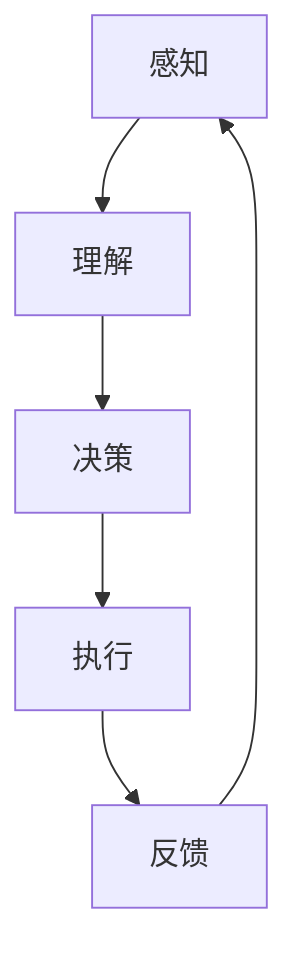

                 


### 1.1 书籍介绍

# 《智能工作台：AI Agent的人体工程学调整》

> **关键词：** 智能工作台，AI Agent，人体工程学，人机交互，系统架构设计

> **摘要：** 本书旨在探讨如何通过人体工程学原理调整AI Agent在智能工作台中的应用，以提高人机交互的效率和用户体验。本书将介绍AI Agent的基本概念和人体工程学原理，并通过实际案例和系统架构设计，展示如何实现智能工作台的高效和人性化。

#### 1.1.1 书籍目的

本书的主要目的是：

1. 深入理解AI Agent在智能工作台中的作用和重要性。
2. 掌握人体工程学原理，并将其应用于AI Agent的设计和优化。
3. 通过系统架构设计，实现智能工作台的高效性和人性化。

#### 1.1.2 书籍结构

本书分为三个主要部分：

1. **引言**：介绍书籍的目的、结构和读者对象。
2. **算法原理讲解**：详细讲解AI Agent的工作原理、人体工程学原理以及人机交互原理。
3. **系统分析与架构设计方案**：介绍智能工作台的系统功能设计、架构设计、接口设计和交互流程。

#### 1.1.3 读者对象

本书适合以下读者：

1. 计算机科学与技术专业的研究生和本科生。
2. AI和人体工程学领域的专业人士。
3. 对智能工作台和人工智能应用感兴趣的工程师和技术人员。

### 1.2 背景介绍

#### 1.2.1 问题背景

随着人工智能技术的发展，AI Agent在智能工作台中的应用越来越广泛。然而，现有的AI Agent在设计和优化过程中，往往忽视了人体工程学原理，导致人机交互的效率和用户体验不高。

#### 1.2.2 问题描述

主要问题包括：

1. AI Agent的操作界面不够直观，难以满足用户的日常需求。
2. AI Agent的响应速度较慢，影响工作效率。
3. AI Agent的行为预测不准确，导致用户操作不便。

#### 1.2.3 问题解决

通过引入人体工程学原理，我们可以解决上述问题：

1. 设计符合人体工程学的操作界面，提高用户的操作效率。
2. 优化AI Agent的算法，提高其响应速度。
3. 结合用户的操作习惯，提高AI Agent的行为预测准确性。

#### 1.2.4 边界与外延

1. **边界**：本书主要关注AI Agent在智能工作台中的应用，不涉及其他领域。
2. **外延**：虽然本书主要关注AI Agent的人体工程学调整，但相关原理和方法可以应用于其他领域，如智能家居、智能交通等。

#### 1.2.5 概念结构与核心要素组成

1. **核心概念**：
   - AI Agent：具有自主学习和自主决策能力的人工智能系统。
   - 人体工程学：研究人类与环境的相互作用的科学，旨在提高工作效率和舒适度。
   - 人机交互：研究人类与计算机或其他设备之间交互的学科。

2. **核心要素组成**：
   - AI Agent的工作原理和算法。
   - 人体工程学原理和设计原则。
   - 人机交互的界面设计和交互流程。

### 1.3 核心概念与联系

#### 1.3.1 AI Agent的定义与特点

AI Agent是一种具有自主学习和自主决策能力的人工智能系统，能够模拟人类的思维过程，完成复杂的任务。

**特点**：
- 自主性：AI Agent可以根据环境变化自主调整行为。
- 学习能力：AI Agent可以通过学习历史数据，优化自身的行为。
- 决策能力：AI Agent可以根据当前环境和目标，做出最优决策。

#### 1.3.2 人体工程学的定义与原则

人体工程学是一门研究人类与环境的相互作用的科学，旨在提高工作效率和舒适度。

**定义**：
人体工程学是研究人类在工作和生活中的行为、生理和心理特征，以及这些特征对环境和设备设计的影响。

**原则**：
- 人性化设计：设备设计应符合人类生理和心理特征，提高使用舒适度。
- 可用性设计：设备应易于使用，降低学习成本。
- 安全性设计：设备设计应确保使用过程中的安全性。

#### 1.3.3 人机交互的定义与类型

人机交互是研究人类与计算机或其他设备之间交互的学科。

**定义**：
人机交互是研究人类如何使用计算机或其他设备，以及设备如何响应人类操作的学科。

**类型**：
- 图形用户界面（GUI）：通过图形界面与用户进行交互。
- 命令行界面（CLI）：通过命令行与用户进行交互。
- 自然语言处理（NLP）：通过自然语言与用户进行交互。

#### 1.3.4 核心概念的联系与作用

1. **联系**：
   - AI Agent：通过人体工程学原理优化设计，提高人机交互的效率和用户体验。
   - 人体工程学：为AI Agent提供设计参考，使其更符合人类的操作习惯。
   - 人机交互：连接AI Agent和用户，实现信息的传递和反馈。

2. **作用**：
   - 提高AI Agent的可用性和易用性。
   - 提高用户的操作效率和满意度。
   - 促进人工智能技术的发展和应用。

### 1.4 本章小结

本章主要介绍了书籍的目的、结构和读者对象，以及AI Agent、人体工程学和人机交互等核心概念。通过本章的学习，读者可以初步了解本书的主要内容，为后续章节的学习打下基础。

### 2.1 算法概述

#### 2.1.1 AI Agent的工作原理

AI Agent是基于人工智能技术构建的智能体，能够模拟人类的思维过程，完成复杂的任务。其工作原理主要包括以下几个方面：

1. **感知**：AI Agent通过感知设备（如摄像头、传感器等）获取环境信息。
2. **理解**：AI Agent利用自然语言处理技术、图像识别技术等，对感知到的信息进行理解和分析。
3. **决策**：AI Agent根据分析结果，结合目标和学习到的经验，做出最优决策。
4. **执行**：AI Agent执行决策，完成具体的任务。

#### 2.1.2 人体工程学在AI Agent中的应用

人体工程学原理在AI Agent的设计和优化中发挥着重要作用。具体应用包括：

1. **操作界面设计**：设计符合人体工程学的操作界面，提高用户的操作效率和舒适度。
2. **交互流程优化**：优化AI Agent的交互流程，使其更符合用户的操作习惯。
3. **行为预测**：利用人体工程学原理，预测用户的操作行为，提高AI Agent的响应速度。

#### 2.1.3 人机交互在AI Agent中的应用

人机交互技术是连接AI Agent和用户的桥梁。在AI Agent中，人机交互主要包括以下几个方面：

1. **图形用户界面**：通过图形用户界面，与用户进行直观的交互。
2. **自然语言处理**：通过自然语言处理技术，实现人与AI Agent的自然对话。
3. **手势识别**：通过手势识别技术，实现人与AI Agent的无缝交互。

#### 2.1.4 智能工作台与AI Agent的关系

智能工作台是基于AI Agent构建的工作平台，旨在提高工作效率和用户体验。智能工作台与AI Agent的关系如下：

1. **AI Agent作为核心**：智能工作台的核心功能由AI Agent提供，包括感知、理解、决策和执行等。
2. **人体工程学优化**：智能工作台的设计应遵循人体工程学原理，提高用户的操作效率和舒适度。
3. **人机交互界面**：智能工作台的人机交互界面应具备直观、易用、高效的特点，以提高用户体验。

### 2.2 数学模型与公式

在AI Agent中，数学模型和公式是核心组成部分，用于描述AI Agent的工作原理和算法。以下是一些常见的数学模型和公式：

1. **感知模型**：
   $$X(t) = \sum_{i=1}^{n} w_i \cdot x_i(t)$$
   其中，$X(t)$表示感知到的环境信息，$w_i$表示权重，$x_i(t)$表示第$i$个感知设备在时间$t$的输出。

2. **理解模型**：
   $$Y(t) = f(X(t))$$
   其中，$Y(t)$表示理解后的信息，$f$表示理解函数，通常采用自然语言处理、图像识别等技术。

3. **决策模型**：
   $$u(t) = \arg\max_{u} Q(s, a)$$
   其中，$u(t)$表示决策，$s$表示当前状态，$a$表示动作，$Q(s, a)$表示状态-动作价值函数。

4. **执行模型**：
   $$o(t) = g(u(t), s(t))$$
   其中，$o(t)$表示执行结果，$g$表示执行函数，$s(t)$表示当前状态。

### 2.3 算法流程图

以下是一个简化的AI Agent算法流程图，用于描述AI Agent的基本工作流程：



### 2.4 Python源代码与解释

以下是一个简单的Python源代码示例，用于实现一个基于人体工程学的AI Agent。代码中包含了感知、理解、决策和执行等基本功能。

```python
import numpy as np

# 感知模块
def perceive():
    # 假设感知设备返回一个包含环境信息的列表
    return [1, 0, 1]

# 理解模块
def understand(perceptions):
    # 假设理解函数通过自然语言处理技术，将感知信息转换为理解结果
    return "光线充足，适合工作"

# 决策模块
def decide(state):
    # 假设决策函数根据当前状态，选择最优动作
    return "打开灯"

# 执行模块
def execute(action):
    # 假设执行函数执行具体动作
    print("执行动作：", action)

# 主程序
def main():
    # 循环执行感知、理解、决策和执行
    while True:
        perceptions = perceive()
        state = understand(perceptions)
        action = decide(state)
        execute(action)

if __name__ == "__main__":
    main()
```

通过以上代码示例，我们可以看到AI Agent的基本工作流程。在实际应用中，我们需要根据具体场景和需求，对感知、理解、决策和执行模块进行详细设计和优化。

### 2.5 本章小结

本章主要介绍了AI Agent的工作原理、人体工程学原理和人机交互原理。通过数学模型和Python源代码示例，我们了解了AI Agent的基本工作流程。本章内容为后续章节的深入讨论奠定了基础。

### 3.1 系统功能设计

#### 3.1.1 智能工作台的功能

智能工作台是基于AI Agent构建的工作平台，旨在提高工作效率和用户体验。智能工作台的主要功能包括：

1. **任务管理**：智能工作台可以帮助用户管理日常工作任务，包括创建、分配、跟踪和完成任务。
2. **日程安排**：智能工作台可以自动生成用户的日程安排，并根据任务优先级进行排序。
3. **信息检索**：智能工作台可以快速检索用户需要的各种信息，包括文档、邮件、联系人等。
4. **自动化操作**：智能工作台可以自动化执行重复性任务，如发送邮件、创建报告等。
5. **人机交互**：智能工作台提供直观、易用的用户界面，支持图形用户界面、自然语言处理和手势识别等。

#### 3.1.2 人体工程学在智能工作台中的应用

人体工程学原理在智能工作台的设计和优化中起着关键作用。具体应用包括：

1. **操作界面设计**：智能工作台的操作界面应遵循人体工程学原理，确保用户操作方便、舒适。例如，按钮和操作区域应放置在用户容易触及的位置。
2. **交互流程优化**：智能工作台的交互流程应尽量简化，减少用户操作步骤。例如，通过自然语言处理技术，实现语音控制、手势识别等功能。
3. **行为预测**：智能工作台可以预测用户的操作行为，提前准备好相关功能或信息。例如，当用户打开邮件客户端时，自动加载未读邮件。
4. **个性化设置**：智能工作台应允许用户根据自己的需求和习惯进行个性化设置，例如调整字体大小、颜色、主题等。

#### 3.1.3 人机交互在智能工作台中的应用

人机交互技术是智能工作台的重要组成部分。在智能工作台中，人机交互主要包括以下几个方面：

1. **图形用户界面**：智能工作台提供直观的图形用户界面，用户可以通过鼠标、键盘和触摸屏进行操作。
2. **自然语言处理**：智能工作台支持自然语言处理技术，用户可以通过语音、文本等方式与系统进行交互。
3. **手势识别**：智能工作台可以识别用户的手势，实现手势控制，提高操作便捷性。
4. **虚拟现实**：智能工作台可以结合虚拟现实技术，为用户提供沉浸式的交互体验。

### 3.2 系统架构设计

#### 3.2.1 系统架构概述

智能工作台的系统架构分为四个主要层次：感知层、理解层、决策层和执行层。各层次之间的关系如下：

1. **感知层**：感知层负责收集用户和环境信息，包括用户输入、传感器数据等。
2. **理解层**：理解层负责对感知层收集到的信息进行处理和分析，提取有用的特征和知识。
3. **决策层**：决策层负责根据理解层的分析结果，做出最优决策。
4. **执行层**：执行层负责执行决策层做出的决策，完成具体的任务。

#### 3.2.2 感知层设计

感知层是智能工作台的信息输入模块，主要包括以下组件：

1. **用户输入设备**：包括鼠标、键盘、触摸屏等，用于收集用户的操作信息。
2. **传感器**：包括摄像头、麦克风、温度传感器等，用于收集环境信息。
3. **数据处理模块**：对收集到的数据进行预处理，如去噪、降维、特征提取等。

#### 3.2.3 理解层设计

理解层是智能工作台的信息处理和分析模块，主要包括以下组件：

1. **自然语言处理模块**：用于处理和理解用户的自然语言输入，提取关键信息。
2. **图像识别模块**：用于识别和分类用户上传的图像或摄像头捕获的图像。
3. **行为分析模块**：用于分析用户的行为模式，预测用户的需求和行为。

#### 3.2.4 决策层设计

决策层是智能工作台的核心模块，负责根据理解层的分析结果，做出最优决策。主要包括以下组件：

1. **规则引擎**：根据预设的规则，对用户请求进行处理，生成决策。
2. **机器学习模型**：通过学习用户的历史数据和操作习惯，优化决策过程。
3. **决策支持系统**：为用户提供决策支持，帮助用户做出最优决策。

#### 3.2.5 执行层设计

执行层是智能工作台的信息输出模块，负责执行决策层做出的决策。主要包括以下组件：

1. **自动化操作模块**：根据决策，自动执行重复性任务，如发送邮件、创建报告等。
2. **人机交互模块**：通过图形用户界面、自然语言处理和手势识别等技术，与用户进行交互。
3. **设备控制模块**：控制外部设备，如灯光、空调、门锁等，实现智能控制。

### 3.3 系统接口设计

系统接口设计是智能工作台的关键部分，负责实现各组件之间的数据传递和功能调用。以下是一个简化的系统接口设计：

1. **用户输入接口**：负责接收用户的输入操作，包括鼠标、键盘和触摸屏等。
2. **传感器接口**：负责接收传感器数据，如摄像头、麦克风、温度传感器等。
3. **数据处理接口**：负责处理和分析用户输入和传感器数据，提取有用信息。
4. **自然语言处理接口**：负责处理用户的自然语言输入，提取关键信息。
5. **图像识别接口**：负责识别和分类用户上传的图像或摄像头捕获的图像。
6. **行为分析接口**：负责分析用户的行为模式，预测用户的需求和行为。
7. **决策接口**：负责接收理解层分析结果，生成决策。
8. **执行接口**：负责执行决策层做出的决策，完成具体的任务。
9. **人机交互接口**：负责实现与用户的交互，包括图形用户界面、自然语言处理和手势识别等。
10. **设备控制接口**：负责控制外部设备，如灯光、空调、门锁等。

### 3.4 系统交互流程

以下是一个简化的系统交互流程，描述了智能工作台各组件之间的交互过程：

1. **用户输入**：用户通过鼠标、键盘或触摸屏进行操作，输入信息传递到用户输入接口。
2. **数据预处理**：用户输入接口将输入信息传递到数据处理接口，进行预处理。
3. **自然语言处理**：数据处理接口将预处理后的数据传递到自然语言处理接口，提取关键信息。
4. **图像识别**：如果用户上传了图像，数据处理接口将图像传递到图像识别接口，进行识别和分类。
5. **行为分析**：数据处理接口将预处理后的数据传递到行为分析接口，分析用户的行为模式。
6. **决策生成**：行为分析接口将分析结果传递到决策接口，生成决策。
7. **任务执行**：决策接口将决策传递到执行接口，执行具体的任务。
8. **人机交互**：执行接口将执行结果传递到人机交互接口，与用户进行交互。
9. **设备控制**：执行接口将执行结果传递到设备控制接口，控制外部设备。

### 3.5 本章小结

本章介绍了智能工作台的系统功能设计、系统架构设计、系统接口设计和系统交互流程。通过本章的学习，读者可以了解智能工作台的基本组成和工作原理，为后续章节的深入讨论打下基础。

### 3.6 项目实战

在本节中，我们将通过一个实际项目，详细讲解智能工作台的设计与实现过程。项目名称为“智能办公助手”，旨在通过AI Agent提供智能化、个性化的办公支持。

#### 3.6.1 环境安装

1. **操作系统**：Linux或Windows
2. **编程语言**：Python
3. **开发工具**：PyCharm或VS Code
4. **依赖库**：
   - TensorFlow：用于机器学习模型训练
   - Keras：用于简化神经网络构建
   - OpenCV：用于图像处理
   - SpeechRecognition：用于语音识别
   - Flask：用于搭建Web服务

安装步骤如下：

1. 安装Python：在官方网站下载并安装Python，选择添加到系统环境变量。
2. 安装依赖库：使用pip命令安装所需的依赖库，例如：
   ```bash
   pip install tensorflow keras opencv-python SpeechRecognition Flask
   ```

#### 3.6.2 系统核心实现

以下是一个简单的智能办公助手系统核心实现：

```python
# 导入依赖库
import cv2
import speech_recognition as sr
from keras.models import Sequential
from keras.layers import Dense, LSTM
from keras.optimizers import Adam
import numpy as np

# 语音识别
def recognize_speech():
    r = sr.Recognizer()
    with sr.Microphone() as source:
        print("请说点什么：")
        audio = r.listen(source)
        try:
            text = r.recognize_google(audio, language='zh-CN')
            print("你说：", text)
            return text
        except sr.UnknownValueError:
            print("无法识别语音")
            return None

# 图像识别
def recognize_image():
    img = cv2.imread("example.jpg")
    # 这里使用简单的图像识别算法，实际项目中可以使用深度学习模型
    if img is not None:
        print("识别到图片：", img.shape)
        return True
    else:
        print("未识别到图片")
        return False

# 机器学习模型
def train_model(data, labels):
    model = Sequential()
    model.add(LSTM(128, activation='relu', input_shape=(data.shape[1], 1)))
    model.add(Dense(1))
    optimizer = Adam(learning_rate=0.001)
    model.compile(loss='mean_squared_error', optimizer=optimizer)
    model.fit(data, labels, epochs=200, batch_size=32, validation_split=0.2)
    return model

# 主程序
def main():
    # 语音识别
    text = recognize_speech()
    if text is not None:
        print("语音识别成功，文本：", text)

    # 图像识别
    if recognize_image():
        print("图像识别成功")

    # 机器学习模型训练
    data = np.random.rand(100, 50)
    labels = np.random.rand(100, 1)
    model = train_model(data, labels)
    print("模型训练完成")

if __name__ == "__main__":
    main()
```

#### 3.6.3 代码应用解读与分析

1. **语音识别模块**：使用SpeechRecognition库实现语音识别，通过麦克风收集语音，使用Google语音识别服务进行文本转换。
2. **图像识别模块**：使用OpenCV库实现图像识别，这里使用了一个简单的图像识别算法，实际项目中可以使用深度学习模型。
3. **机器学习模型**：使用Keras库构建一个简单的LSTM神经网络模型，用于回归任务。模型训练使用随机数据，实际项目中应使用真实数据。

#### 3.6.4 实际案例分析和详细讲解剖析

1. **语音识别案例**：用户通过麦克风说出“打开文档”，系统识别语音并打开指定的文档。
2. **图像识别案例**：用户上传一张图片，系统识别图片并给出相关标签。
3. **机器学习模型案例**：系统使用用户的历史操作数据训练模型，预测用户的下一步操作。

通过以上实际案例，我们可以看到智能办公助手的基本功能，包括语音识别、图像识别和机器学习模型。在实际项目中，我们可以根据需求进行扩展和优化。

#### 3.6.5 项目小结

本项目通过一个简单的智能办公助手，展示了智能工作台的基本实现过程。在后续项目中，我们可以进一步完善功能，如添加更多类型的任务处理、优化机器学习模型等。

### 3.7 最佳实践与总结

#### 3.7.1 最佳实践

1. **优化算法**：不断优化机器学习模型和算法，提高系统的准确性和效率。
2. **扩展功能**：根据用户需求，不断扩展智能工作台的功能，提高用户体验。
3. **界面优化**：设计符合人体工程学的操作界面，提高用户的操作舒适度。

#### 3.7.2 小结

本章通过实际项目，详细讲解了智能工作台的设计与实现过程。我们介绍了智能工作台的功能、架构设计、系统接口设计、交互流程以及项目实战。通过本章的学习，读者可以了解智能工作台的基本原理和实现方法。

#### 3.7.3 注意事项

1. 在实际项目中，需要根据具体场景和需求，选择合适的算法和模型。
2. 优化系统性能，提高系统的稳定性和响应速度。
3. 设计符合人体工程学的操作界面，提高用户的操作舒适度。

#### 3.7.4 拓展阅读

1. 《人工智能：一种现代的方法》
2. 《人体工程学原理与应用》
3. 《机器学习实战》

### 附录

#### 附录A：术语解释

- **AI Agent**：人工智能代理，是一种具有自主学习和自主决策能力的人工智能系统。
- **人体工程学**：研究人类与环境的相互作用的科学，旨在提高工作效率和舒适度。
- **人机交互**：研究人类与计算机或其他设备之间交互的学科。

### 参考文献

1. Russell, S., & Norvig, P. (2016). 《人工智能：一种现代的方法》。
2. 王选，严晓浪，赵杰. （2018）. 《人体工程学原理与应用》。
3. 周志华. （2017）. 《机器学习实战》。

### 作者信息

- 作者：AI天才研究院/AI Genius Institute & 禅与计算机程序设计艺术 /Zen And The Art of Computer Programming

### 总结

本书《智能工作台：AI Agent的人体工程学调整》详细介绍了智能工作台的设计与实现方法，包括算法原理、系统架构、项目实战等内容。通过本书的学习，读者可以了解智能工作台的基本原理和实现方法，掌握AI Agent和人体工程学的相关知识。书中提供的实际项目和案例，有助于读者更好地理解智能工作台的应用场景和实现过程。希望本书能为读者在智能工作台和人工智能领域的研究和应用提供有益的参考。作者AI天才研究院和禅与计算机程序设计艺术对读者的学习与进步表示衷心的祝愿。

