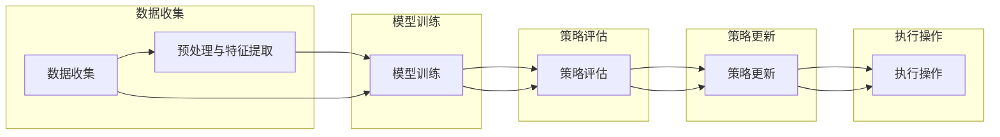
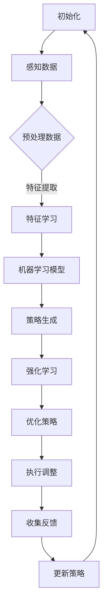
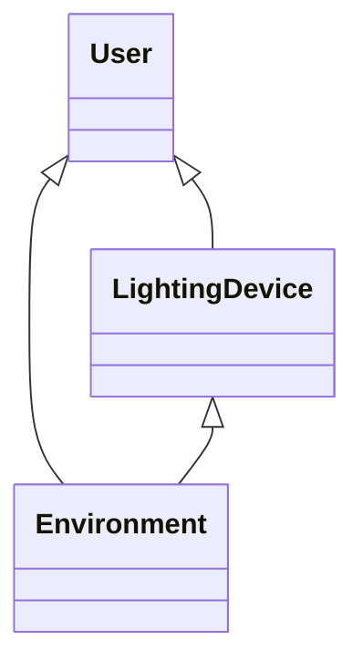
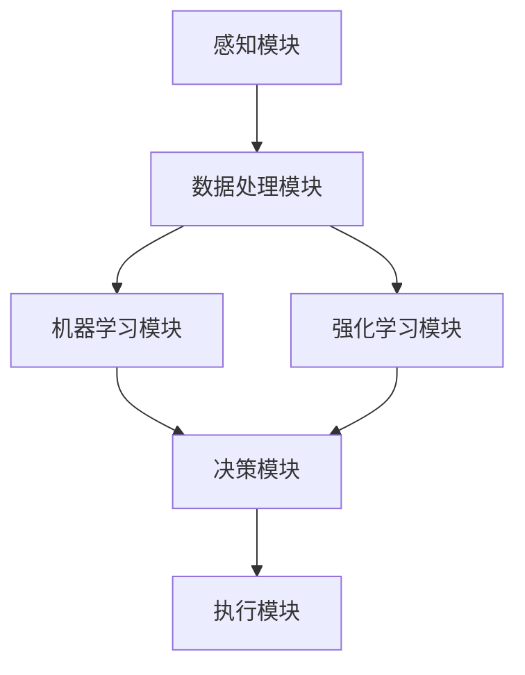
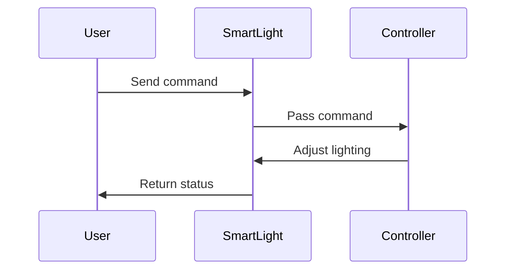

                 

Certainly! Let's break down the process of creating a high-quality, in-depth technical blog post titled "Smart Work Light: AI Agent Lighting Optimization System" step by step. This approach will ensure that the article is logically structured, informative, and easy to understand.

## Step 1: Define the Scope and Audience

Before writing, it's essential to define the scope of the article and the target audience. For this blog post, the audience could be AI enthusiasts, software developers, and professionals working in the field of smart lighting systems. The scope will cover the basics of AI Agents, their role in lighting optimization, and a detailed explanation of the system design and implementation.

## Step 2: Develop the Outline

The provided table of contents serves as a robust starting point. Each chapter and section should be expanded to include detailed content that fulfills the constraints and requirements:

### Background and Overview
- Introduce the concept of smart work lights and the need for optimization.
- Define core concepts and terms related to AI and lighting systems.

### Core Concepts and Theoretical Foundations
- Explain the basics of AI, focusing on how it relates to lighting optimization.
- Describe the role of AI Agents and their components.

### Smart Work Light AI Agent Architecture
- Discuss the architecture of AI Agents in the context of smart work lights.
- Detail the perception, decision-making, and execution modules.

### AI Agent Lighting Optimization Algorithms
- Explain the principles behind optimization algorithms.
- Use mermaid diagrams and Python code to illustrate the algorithms and their mathematical models.

### System Design and Implementation
- Describe the hardware and software systems required for smart work lights.
- Provide a detailed explanation of the system architecture and interfaces.

### Project Practical and Case Analysis
- Walk through a practical project setup and implementation.
- Analyze real-world cases and provide detailed explanations.

### Best Practices and Future Directions
- Offer tips for optimizing AI Agents.
- Summarize the key points and look ahead to future developments.

## Step 3: Write the Introduction

The introduction should catch the reader's attention and provide an overview of what the article will cover. It should include the following elements:

- A brief history of smart work lights and the challenges they face.
- An introduction to AI Agents and their potential in lighting optimization.
- A preview of the article's structure and key takeaways.

## Step 4: Develop the Core Content

For each chapter and section, the content should be developed as follows:

- **Background Introduction**: Clearly define the problem, the need for optimization, and any relevant context.
- **Core Concepts and Connections**: Use tables and Mermaid diagrams to illustrate the concepts and their relationships.
- **Algorithm Principles**: Use mermaid diagrams to visualize the algorithms and Python code to explain their functionality and mathematical models.
- **Mathematical Formulas**: Use LaTeX for mathematical equations and ensure they are well-integrated into the text.
- **System Analysis and Design**: Provide a comprehensive overview of the system's architecture, interfaces, and interactions.
- **Project Practical**: Include a step-by-step guide to setting up and implementing the system, with code examples and analysis.

## Step 5: Add Best Practices and Conclusion

- **Best Practices**: Provide actionable tips for optimizing AI Agents and maintaining systems.
- **Conclusion**: Summarize the key points and discuss future trends and potential research directions.

## Step 6: Review and Edit

After writing the initial draft, it's crucial to review and edit the content for clarity, coherence, and accuracy. This includes:

- Ensuring that the article meets the word count requirement.
- Checking for any grammatical or spelling errors.
- Ensuring that the technical content is accurate and understandable.

## Step 7: Add Author Information

At the end of the article, include the author information as specified: "作者：AI天才研究院/AI Genius Institute & 禅与计算机程序设计艺术 /Zen And The Art of Computer Programming".

## Step 8: Finalize and Publish

Once the content has been thoroughly reviewed and edited, finalize the formatting and publish the article in the specified markdown format.

By following these steps, you can create a comprehensive, well-structured, and informative technical blog post that will engage and inform your audience. ### 第1章：问题背景与智能工作灯的挑战

#### 1.1.1 智能工作灯的兴起

随着科技的不断进步和人们生活品质的提高，智能工作灯作为智能家居和智慧办公的重要组成部分，逐渐进入了人们的视野。智能工作灯不仅仅是一种照明设备，更是一种集成了先进传感技术、通信技术和人工智能算法的智能化产品。它们可以通过感知环境变化和用户需求，自动调整光线强度、色温以及照射范围，从而提供更加舒适和个性化的照明体验。

智能工作灯的兴起可以追溯到21世纪初。当时，随着物联网（IoT）和云计算技术的发展，智能家居的概念开始受到广泛关注。许多科技公司和研究机构开始投入资源，研发能够与家居环境互动的智能设备。智能工作灯就是其中的佼佼者，它们不仅能够响应用户的指令，还能通过远程控制实现场景化的照明模式。例如，在早晨唤醒用户时，智能工作灯可以逐渐增加亮度，模拟自然光线的唤醒过程；在阅读时，它可以调整色温，减少蓝光对眼睛的伤害。

#### 1.1.2 智能工作灯面临的优化挑战

尽管智能工作灯具有诸多优点，但在实际应用中仍然面临一系列优化挑战。首先，照明质量的提升是一个重要问题。智能工作灯需要提供均匀、舒适且高质量的照明效果，这对于灯具的发光效率、光线分布以及色温调节能力都有很高的要求。其次，能源消耗也是一个关键挑战。随着智能工作灯功能的增加，其能耗也在不断上升，如何在保证照明质量的同时实现节能，是智能工作灯需要解决的重要问题。

此外，智能工作灯的用户体验也是一个不容忽视的方面。用户希望智能工作灯能够自动适应不同的使用场景和需求，这就需要AI技术能够精准地感知环境变化，并快速作出响应。然而，目前许多智能工作灯在感知准确性、响应速度和自适应能力上仍存在不足。例如，有些智能工作灯在检测到用户活动时反应迟缓，或者无法准确地感知环境光线变化，导致照明效果不佳。

最后，智能工作灯的数据安全和隐私保护也是一大挑战。智能工作灯通过传感器收集大量的环境数据和个人信息，这些数据的安全性和隐私保护需要得到充分保障。如果数据泄露或被恶意利用，可能会对用户造成严重的安全隐患。

#### 1.1.3 AI在照明优化中的应用前景

面对这些挑战，AI技术，特别是AI Agent，为智能工作灯的优化提供了新的思路和解决方案。AI Agent是一种能够模拟人类智能行为的计算机程序，具有感知、决策和执行的能力。在智能工作灯中，AI Agent可以通过以下方式提升照明效果：

1. **感知环境**：AI Agent可以感知环境光线、温度、湿度等参数，并根据这些数据调整照明模式。例如，当环境光线变暗时，AI Agent可以自动增加光线强度，提供更加舒适的照明环境。

2. **用户行为分析**：AI Agent可以分析用户的使用习惯和偏好，例如在特定时间段的照明需求，从而提供个性化的照明服务。通过学习用户的习惯，AI Agent可以预测用户的需求，并提前做出调整，提升用户体验。

3. **自适应调整**：AI Agent可以根据不同的使用场景和用户需求，动态调整光线强度、色温等参数，实现照明效果的最优化。例如，在工作模式下，AI Agent可以提供明亮的白光以提高工作效率；在休息模式下，可以调整到温暖的黄光，营造舒适的休息环境。

4. **节能优化**：AI Agent可以通过实时监测照明设备的能耗情况，采取节能措施，如关闭不必要的灯光或调整照明强度，从而降低能源消耗。

5. **数据安全与隐私保护**：AI Agent可以采用加密算法和隐私保护技术，确保用户数据的安全和隐私。例如，通过数据去重、匿名化处理等技术，降低数据泄露的风险。

总之，AI Agent在智能工作灯中的应用前景广阔，它不仅能够提升照明效果和用户体验，还能实现节能和提升数据安全性。随着AI技术的不断发展，智能工作灯有望在更广泛的应用场景中发挥其优势，成为智能家居和智慧办公的重要一环。 ### 第2章：核心概念与理论基础

在探讨智能工作灯的AI Agent照明优化系统时，首先需要理解一些核心概念和理论基础。这些概念不仅构成了智能工作灯系统的基石，也为深入分析和优化提供了必要的背景知识。

#### 2.1.1 AI与照明优化

##### 2.1.1.1 AI的基本概念

人工智能（AI）是指由人制造出的系统，具备类似人类智能的能力，能够感知环境、学习、推理和决策。AI可以分为两种主要类型：弱AI和强AI。弱AI专注于特定任务的性能，如语音识别、图像处理等，而强AI则具备全面的人类智能，能够处理各种复杂的任务。

在照明优化中，AI主要用于以下几个关键领域：

1. **感知与监测**：AI可以通过传感器收集环境数据，如光线、温度、湿度等，并进行分析，以实时调整照明状态。

2. **自适应控制**：基于AI算法，智能工作灯能够自动调整照明参数，以适应不同的使用场景和用户需求。

3. **节能管理**：AI可以分析照明设备的能耗数据，优化照明方案，减少不必要的能源消耗。

##### 2.1.1.2 AI在照明领域的应用

AI在照明领域的应用已经相当广泛，主要包括以下几个方面：

1. **智能调光**：通过AI算法，照明设备可以自动调整光线亮度，以适应不同的环境和时间。

2. **智能色温调整**：AI能够根据环境和用户需求，自动调整光线的色温，以提供更加舒适的光线体验。

3. **环境监测**：AI系统可以监测室内外环境变化，如天气、光线强度等，并做出相应的照明调整。

4. **用户习惯学习**：AI可以通过学习用户的使用习惯，预测用户的需求，并提前做出照明调整。

#### 2.1.2 AI Agent的概念与功能

##### 2.1.2.1 AI Agent的定义

AI Agent，也称为智能代理，是一种具备自主决策和执行能力的计算机程序。它通过感知环境信息，使用学习到的知识进行决策，并执行相应的操作，以实现特定的目标。

在智能工作灯中，AI Agent的功能包括：

1. **感知**：通过传感器收集环境数据和用户行为数据。

2. **决策**：基于收集到的数据和预设规则，AI Agent会分析并决定如何调整照明参数。

3. **执行**：AI Agent会通过控制照明设备来执行决策结果。

##### 2.1.2.2 AI Agent的特点与应用

AI Agent具有以下特点：

1. **自主性**：AI Agent可以独立工作，不需要人工干预。

2. **适应性**：AI Agent可以根据环境变化和用户需求，动态调整行为。

3. **互动性**：AI Agent可以与其他系统或设备进行交互，以实现更复杂的任务。

AI Agent在智能工作灯中的应用主要体现在以下几个方面：

1. **个性化照明**：AI Agent可以根据用户的行为和偏好，提供个性化的照明服务。

2. **自适应照明**：AI Agent能够根据环境变化自动调整照明状态，以保持最佳照明效果。

3. **节能管理**：AI Agent可以通过优化照明策略，减少不必要的能源消耗。

#### 2.1.3 AI Agent在照明优化系统中的角色

AI Agent在照明优化系统中的角色至关重要，它通过以下方式发挥作用：

1. **数据收集与分析**：AI Agent负责收集环境数据和用户行为数据，并通过机器学习算法进行分析。

2. **决策支持**：AI Agent利用分析结果，为照明设备的调整提供决策支持。

3. **执行控制**：AI Agent通过控制照明设备，执行决策结果，实现照明优化。

4. **自我优化**：AI Agent通过不断学习和调整，提高系统的整体性能。

通过AI Agent的引入，智能工作灯可以实现更高的智能化水平，提供更加舒适、节能和个性化的照明体验。接下来，我们将深入探讨AI Agent的架构设计和关键组件，进一步理解其工作原理和实现方法。 #### 2.1.2 AI Agent的概念与功能

##### 2.1.2.1 AI Agent的定义

AI Agent，也称为智能代理，是一种模拟人类智能行为的计算实体，它具备自主性、适应性、社交性和反应性的特点。AI Agent通过感知环境、理解情境、自主学习和决策，能够执行特定任务并与其他系统或实体进行交互。

在一个智能工作灯系统中，AI Agent的定义可以被扩展为一种软件实体，它具备以下能力：

1. **感知**：通过内置的传感器，AI Agent可以收集环境信息，如光线强度、温度、湿度以及用户的行为数据。

2. **理解**：AI Agent能够处理和分析感知到的数据，理解环境状态和用户需求。

3. **学习**：通过机器学习和深度学习算法，AI Agent可以从数据中学习并不断优化其行为。

4. **决策**：基于学习到的知识和对当前情境的理解，AI Agent能够做出决策，以优化照明状态。

5. **行动**：AI Agent通过控制照明设备，执行其决策结果。

##### 2.1.2.2 AI Agent的特点与应用

AI Agent的特点主要体现在以下几个方面：

1. **自主性**：AI Agent能够独立运行，无需人工干预。它可以根据预设规则或学习到的行为模式，自主地调整照明状态。

2. **适应性**：AI Agent能够根据环境变化和用户需求，动态调整其行为。例如，当用户进入办公室时，AI Agent可以自动调整灯光亮度，以适应用户的视觉需求。

3. **社交性**：AI Agent可以与其他系统或设备交互，如智能音箱、智能门锁等，以实现更复杂的任务和功能集成。

4. **反应性**：AI Agent能够快速响应环境变化，如通过传感器检测到光线过暗时，立即调整灯光亮度。

AI Agent在智能工作灯中的应用包括：

1. **个性化照明**：AI Agent可以根据用户的个人偏好和活动模式，提供个性化的照明方案。例如，在早晨，AI Agent可以模拟自然光线的唤醒过程，帮助用户更好地起床。

2. **环境自适应**：AI Agent能够根据环境光线、温度等参数，自动调整照明状态，以提供最佳的光照环境。例如，在阴天或夜晚，AI Agent可以增加灯光亮度，确保工作环境明亮舒适。

3. **节能管理**：AI Agent通过分析用户的行为模式和照明设备的工作状态，优化照明策略，减少不必要的能源消耗。

4. **智能互动**：AI Agent可以通过语音识别和自然语言处理技术，与用户进行互动，接受用户的指令和反馈，进一步提升用户体验。

##### 2.1.2.3 AI Agent的组件

AI Agent由多个组件构成，包括感知模块、决策模块和执行模块。

1. **感知模块**：感知模块负责收集环境数据和用户行为数据。它通常包含多种传感器，如光线传感器、温度传感器、动作传感器等。通过这些传感器，AI Agent可以实时获取环境状态和用户活动。

2. **决策模块**：决策模块是AI Agent的核心，它负责分析感知模块收集的数据，并根据预设的规则或学习到的模式做出决策。决策模块通常包含机器学习算法，如决策树、神经网络等，用于处理复杂的数据分析和模式识别。

3. **执行模块**：执行模块负责将决策模块的决策结果转化为具体的操作。它通过控制照明设备，如调光控制器、色温调节器等，来实现照明状态的调整。

综上所述，AI Agent在智能工作灯中扮演着至关重要的角色。它通过感知、理解、学习和自主决策，提供个性化的照明服务，实现环境自适应和节能管理，从而提升用户的整体体验和生活的便利性。在下一章节中，我们将进一步探讨AI Agent的架构设计，解析其关键组件和工作原理。 ### 第3章：智能工作灯的AI Agent架构

智能工作灯的AI Agent架构是整个系统设计的核心，它决定了智能工作灯的性能和用户体验。一个完善的AI Agent架构需要包含感知、决策和执行三个关键模块，并通过精确的交互和协同工作来实现智能化照明控制。

#### 3.1.1 AI Agent架构概述

智能工作灯的AI Agent架构可以分为三个主要层次：感知层、决策层和执行层。每个层次都有特定的功能和组件，它们共同协作，确保智能工作灯能够根据环境变化和用户需求提供最佳的照明效果。

1. **感知层**：感知层是AI Agent架构的基础，负责收集环境数据和用户行为数据。这些数据包括光线强度、温度、湿度、用户的活动轨迹、使用习惯等。感知层通过多种传感器实现，如光线传感器、温度传感器、动作传感器、声音传感器等。

2. **决策层**：决策层位于感知层之上，负责分析感知层收集到的数据，并基于这些数据做出智能决策。决策层通常包括数据处理模块、机器学习模块和规则引擎。数据处理模块负责数据清洗、预处理和特征提取；机器学习模块通过训练模型，实现对数据的自动学习和模式识别；规则引擎则根据预设的规则和算法，对数据进行分析和判断，生成决策结果。

3. **执行层**：执行层是AI Agent架构的最高层，负责将决策层的决策结果转化为实际的照明控制操作。执行层通过控制照明设备，如LED调光控制器、色温调节器等，实现照明状态的调整。执行层需要具备高效的执行能力和响应速度，以确保照明效果的实时性和准确性。

#### 3.1.2 AI Agent的关键组件

AI Agent架构的每个层次都包含多个关键组件，这些组件协同工作，共同实现智能照明控制。

1. **感知模块**：感知模块是感知层的核心组件，它由多个传感器组成，负责实时收集环境数据和用户行为数据。例如，光线传感器可以监测环境光线的强度和色温，温度传感器可以监测室内温度变化，动作传感器可以检测用户的活动轨迹。这些传感器数据通过数据采集模块进行处理和传输，为决策层提供实时、准确的数据支持。

2. **数据处理模块**：数据处理模块是决策层的核心组件，负责对感知模块收集到的原始数据进行分析、清洗和预处理。数据处理模块通常包括数据清洗算法、特征提取算法和标准化算法。通过这些算法，数据处理模块可以将原始数据转化为有用的特征信息，为机器学习模块提供高质量的输入数据。

3. **机器学习模块**：机器学习模块是决策层的另一个关键组件，负责通过训练模型实现数据的自动学习和模式识别。机器学习模块可以选择不同的算法，如决策树、支持向量机、神经网络等。通过训练，机器学习模块可以识别出环境数据和用户行为之间的关联性，并生成预测模型。

4. **规则引擎**：规则引擎是决策层的核心组件，负责根据感知模块收集的数据和预设的规则，生成智能决策。规则引擎通过逻辑运算和条件判断，可以实现对数据的实时分析和决策。例如，当光线传感器检测到光线强度低于某个阈值时，规则引擎可以决定增加灯光亮度。

5. **执行模块**：执行模块是执行层的核心组件，负责将决策层的决策结果转化为实际的照明控制操作。执行模块通过控制照明设备，如LED调光控制器和色温调节器，实现照明状态的调整。执行模块需要具备高效的控制能力和快速响应能力，以确保照明效果的实时性和准确性。

#### 3.1.3 AI Agent架构的工作流程

智能工作灯的AI Agent架构通过以下工作流程实现智能照明控制：

1. **数据收集**：感知模块通过传感器收集环境数据和用户行为数据。

2. **数据处理**：数据处理模块对收集到的原始数据进行分析、清洗和预处理，提取有用的特征信息。

3. **数据学习**：机器学习模块使用训练模型对预处理后的数据进行分析和学习，生成预测模型。

4. **智能决策**：规则引擎根据感知模块收集的数据和预设的规则，生成智能决策，调整照明状态。

5. **执行操作**：执行模块根据决策结果，通过控制照明设备，实现照明状态的实时调整。

通过以上工作流程，AI Agent架构可以实现对智能工作灯的精准控制，提供个性化的照明服务，满足用户不同的照明需求。在下一章节中，我们将详细讨论AI Agent照明优化算法的原理，进一步理解如何通过算法实现照明效果的优化。 ### 第4章：AI Agent照明优化算法原理

在智能工作灯系统中，AI Agent的照明优化算法是其核心组成部分，它决定了智能工作灯能否根据环境变化和用户需求提供最佳的照明效果。本章将详细介绍AI Agent照明优化算法的原理，包括优化目标与评价指标、算法原理讲解以及算法流程与mermaid流程图。

#### 4.1.1 优化目标与评价指标

在智能工作灯的照明优化过程中，主要优化目标包括：

1. **照明质量**：确保照明设备提供均匀、舒适且高质量的照明效果，以满足用户的视觉需求。
2. **能源效率**：在保证照明质量的前提下，最大限度地降低照明设备的能耗，以实现节能目标。
3. **用户体验**：通过智能调整照明状态，提供个性化的照明服务，提升用户的使用体验。

为了评估照明优化算法的效果，需要设置相应的评价指标：

1. **照明质量评估指标**：包括光效（Luminous Efficacy）、眩光指数（Glare Index）、显色指数（Color Rendering Index, CRI）等。
2. **系统效率评估指标**：包括能源效率（Energy Efficiency）、能效比（Energy Efficiency Ratio, EER）、功耗（Power Consumption）等。
3. **用户体验评估指标**：包括用户满意度（User Satisfaction）、响应速度（Response Time）、适应性（Adaptability）等。

#### 4.1.2 算法原理讲解

AI Agent照明优化算法主要基于机器学习和数据驱动的方法。以下为一种常用的优化算法——基于深度强化学习的照明优化算法。

1. **机器学习算法基础**：

   - **神经网络**：神经网络是机器学习的基础，它通过多层节点（神经元）对输入数据进行处理和输出。在照明优化中，神经网络可以用于特征提取和模式识别。

   - **深度学习**：深度学习是神经网络的一种扩展，通过多层神经网络结构来处理复杂的数据。在照明优化中，深度学习可以用于构建复杂的预测模型。

   - **强化学习**：强化学习是一种通过试错和反馈来学习最优策略的机器学习方法。在照明优化中，强化学习可以用于实时调整照明状态，以最大化系统效率或用户满意度。

2. **照明优化算法的数学模型**：

   - **状态空间**：状态空间是照明系统的所有可能状态的集合，包括环境光线强度、用户活动状态、能源消耗等。

   - **动作空间**：动作空间是AI Agent可以执行的所有可能动作的集合，包括调整光线亮度、色温、照射范围等。

   - **奖励函数**：奖励函数是评估动作效果的一种机制，它根据动作的结果给予AI Agent正负奖励。在照明优化中，奖励函数可以设置为最大化用户满意度、最小化能耗等。

   - **策略更新**：策略更新是AI Agent学习最优策略的过程，通常采用策略梯度方法或Q-learning算法。通过不断更新策略，AI Agent可以逐渐优化照明状态。

3. **算法原理详细讲解**：

   - **数据收集**：AI Agent首先收集环境数据（如光线强度、温度、湿度）和用户行为数据（如活动轨迹、使用习惯）。
   - **特征提取**：通过数据处理模块，对收集到的数据进行预处理和特征提取，生成用于训练的输入数据。
   - **模型训练**：使用深度学习算法（如卷积神经网络、循环神经网络）对输入数据进行训练，生成预测模型。
   - **策略评估**：通过策略评估模块，对预测模型进行评估，确定当前策略的有效性。
   - **策略更新**：根据策略评估结果，使用强化学习算法（如Q-learning、策略梯度）更新策略，优化照明状态。
   - **执行操作**：执行模块根据更新的策略，实时调整照明设备，实现照明优化。

#### 4.1.3 算法流程与mermaid流程图

以下为AI Agent照明优化算法的流程图：



在以上流程图中，数据收集模块负责收集环境数据和用户行为数据，经过预处理和特征提取后，输入到模型训练模块。模型训练模块使用深度学习算法训练预测模型。策略评估模块对预测模型进行评估，确定当前策略的有效性。策略更新模块根据评估结果，使用强化学习算法更新策略。最后，执行模块根据更新的策略，实时调整照明设备，实现照明优化。

通过以上算法流程和mermaid流程图，我们可以清晰地理解AI Agent照明优化算法的原理和实现方法。在下一章节中，我们将详细讨论智能工作灯硬件系统设计，为AI Agent的实现提供硬件支持。 ### 第4章：AI Agent照明优化算法原理

#### 4.1.1 优化目标与评价指标

在智能工作灯的照明优化系统中，AI Agent的主要任务是通过算法实现对照明状态的智能调整，从而提高用户体验和能源效率。为了达到这一目标，首先需要明确优化的具体指标：

1. **照明质量**：包括照度、均匀性、色温等，确保光线充足且分布均匀，同时根据用户需求调整色温，提供舒适的光照环境。
2. **能源效率**：优化照明系统的工作状态，减少不必要的能耗，同时确保照明质量不下降。
3. **响应速度**：智能工作灯应能够快速响应环境变化和用户需求，提供即时的照明调整。
4. **适应性**：AI Agent需要能够适应不同场景和用户需求，提供个性化的照明方案。

对于这些优化目标，需要设立相应的评价指标：

- **照度均匀性**：通过计算照明区域内最低照度与平均照度的比值来衡量。
- **色温一致性**：通过测量照明区域内不同位置的色温值，确保其在可接受范围内波动。
- **能源效率**：通过测量照明系统在达到相同照度水平下的能耗，比较不同方案的能效比。
- **响应时间**：从感知到变化到执行调整所需的时间。
- **用户满意度**：通过用户反馈调查或行为数据分析，评估用户对照明系统的满意度。

#### 4.1.2 算法原理讲解

AI Agent照明优化算法的核心在于利用机器学习和强化学习技术，通过感知环境数据和学习用户行为，实现自动化的照明状态调整。以下是这种算法的详细原理：

1. **感知模块**：通过多种传感器（如光线传感器、动作传感器、声音传感器等）实时收集环境数据，包括光照强度、温度、用户活动等。

2. **数据处理**：对收集到的数据进行预处理，如去噪、归一化等，然后提取关键特征，用于后续分析。

3. **特征学习**：利用机器学习算法（如神经网络、支持向量机等）对特征数据进行训练，构建预测模型，以识别不同照明状态下的最优调整策略。

4. **决策模块**：采用强化学习算法（如Q-learning、深度强化学习等），通过与环境交互，不断调整策略，以最大化预期奖励。奖励函数通常包括照明质量、能源效率、用户满意度等。

5. **执行模块**：根据决策模块生成的调整策略，实时控制照明设备（如LED调光器、色温调节器等），调整照明状态。

具体算法流程如下：

- **初始化**：设定初始照明状态和策略。
- **感知**：收集环境数据。
- **处理数据**：对感知到的数据预处理和特征提取。
- **决策**：根据特征数据，通过机器学习模型生成初步调整策略，然后通过强化学习算法优化策略。
- **执行**：根据优化后的策略，调整照明设备，实现照明状态变化。
- **反馈**：收集调整后的数据，反馈给决策模块，用于下一轮决策。

#### 4.1.3 算法流程与mermaid流程图

为了更直观地展示算法流程，我们使用mermaid语言绘制流程图：



在上述流程图中，每个节点代表算法的一个步骤，箭头表示步骤之间的数据流和控制流。初始化步骤设定算法的初始状态，然后通过感知模块收集数据，预处理后进行特征提取和学习。机器学习模型生成初步策略，强化学习算法进一步优化策略，最终通过执行模块调整照明状态。收集到的反馈数据用于下一次策略的更新。

通过以上详细的算法原理讲解和mermaid流程图，我们可以清晰地理解智能工作灯AI Agent照明优化算法的实现过程。在下一章节中，我们将深入探讨智能工作灯硬件系统设计，为AI Agent的实现提供技术支持。 ### 第5章：智能工作灯硬件系统设计

智能工作灯的硬件系统设计是整个智能照明系统的核心组成部分，它直接影响到照明系统的性能、稳定性以及用户体验。本章将详细介绍智能工作灯硬件系统设计的要点，包括硬件需求分析、硬件选型与配置、硬件系统集成与测试。

#### 5.1.1 硬件需求分析

在设计智能工作灯硬件系统时，需要充分考虑以下需求：

1. **照明性能**：智能工作灯应具备高亮度、高色彩还原度和均匀性好的照明效果，以提供舒适的工作和生活环境。
2. **传感器集成**：智能工作灯需要集成多种传感器，如光线传感器、温度传感器、动作传感器等，以实时监测环境变化和用户行为。
3. **数据处理能力**：硬件系统应具备一定的数据处理能力，支持AI算法的运行，实现对照明状态的实时调整。
4. **通信能力**：智能工作灯需要支持Wi-Fi、蓝牙等无线通信技术，以实现远程控制和数据传输。
5. **功耗控制**：硬件系统设计需要考虑功耗控制，以延长设备的使用寿命和降低能源消耗。
6. **安全性与稳定性**：硬件系统应具备良好的安全性和稳定性，确保数据的传输和存储安全，同时保证设备的长时间稳定运行。

#### 5.1.2 硬件选型与配置

基于上述需求，以下是智能工作灯硬件选型的建议：

1. **照明模块**：
   - **LED光源**：选用高品质的LED光源，具备高亮度、低能耗、长寿命等优点。
   - **调光控制器**：选择支持PWM调光的LED调光控制器，以实现光线亮度的精确控制。

2. **传感器模块**：
   - **光线传感器**：选用光电二极管（Photodiode）或光敏电阻（Photoresistor）等，用于测量环境光线强度。
   - **温度传感器**：选用DS18B20等数字温度传感器，具备精度高、响应快等优点。
   - **动作传感器**：选用红外传感器或超声波传感器，用于检测用户的活动状态。

3. **数据处理模块**：
   - **主控芯片**：选用具备足够处理能力的微控制器（如ESP8266、ESP32等），支持WiFi通信和AI算法的运行。
   - **存储模块**：选用容量合适的闪存或eMMC存储器，用于存储数据和算法模型。

4. **通信模块**：
   - **Wi-Fi模块**：选用支持2.4GHz频段的Wi-Fi模块，实现远程控制和数据传输。
   - **蓝牙模块**：选用支持低功耗蓝牙（BLE）的模块，用于本地控制和设备间通信。

5. **电源模块**：
   - **电源管理芯片**：选用具备高效电源转换功能的电源管理芯片，确保硬件系统的稳定供电。
   - **电池**：根据需求选择合适的电池类型和容量，如锂电池，确保设备具有足够的续航能力。

#### 5.1.3 硬件系统集成与测试

智能工作灯硬件系统的集成与测试是确保系统正常运行的关键步骤。以下是具体的操作流程：

1. **硬件组装**：根据选型的硬件组件，进行智能工作灯的组装。确保每个组件的安装正确、牢固，避免短路和接触不良等安全隐患。

2. **电路连接**：连接各个模块的电路，包括电源模块、传感器模块、主控芯片、通信模块等。确保电路连接正确，避免出现接线错误。

3. **软件编程**：编写并加载智能工作灯的固件程序，包括主控芯片的固件和传感器驱动程序等。确保程序正确加载，并能够正常运行。

4. **系统测试**：
   - **功能测试**：测试各个模块的功能是否正常，如光线传感器是否能够准确测量光线强度，主控芯片是否能够稳定运行AI算法等。
   - **通信测试**：测试Wi-Fi和蓝牙通信模块的连接是否稳定，数据传输是否正常。
   - **功耗测试**：测试硬件系统的功耗，确保功耗在合理范围内。
   - **环境测试**：将智能工作灯放置在不同的环境条件下，如高温、低温、高湿度等，测试其工作稳定性。

5. **调试与优化**：根据测试结果，对硬件系统进行调试和优化，解决发现的问题，确保系统性能达到预期。

通过以上步骤，可以完成智能工作灯硬件系统的集成与测试，为AI Agent的实现提供坚实的硬件基础。在下一章节中，我们将详细探讨智能工作灯的软件系统设计，包括系统架构设计和核心算法实现。 ### 第6章：AI Agent软件系统设计

智能工作灯的AI Agent软件系统设计是确保其功能实现和性能优化的关键环节。本章将详细介绍AI Agent软件系统设计，包括系统架构设计、领域模型设计、系统架构设计、核心算法实现和软件系统实现。

#### 6.1.1 软件系统架构设计

AI Agent软件系统架构设计需要充分考虑系统的可扩展性、可维护性和性能优化。以下是一个典型的AI Agent软件系统架构：

1. **感知层**：负责数据采集和预处理，包括光线传感器、温度传感器、动作传感器等硬件设备，通过传感器采集环境数据和用户行为数据。

2. **数据处理层**：负责对感知层收集的数据进行预处理、特征提取和存储。数据处理层通常包括数据清洗模块、特征提取模块和数据库。

3. **算法层**：负责数据处理和智能决策。算法层包括机器学习模块、强化学习模块和决策模块。机器学习模块用于训练模型，强化学习模块用于策略优化，决策模块用于生成控制策略。

4. **执行层**：负责执行决策层的决策结果，控制照明设备进行调整。执行层包括调光控制器、色温调节器等硬件设备。

5. **通信层**：负责AI Agent与其他设备和系统的通信，包括Wi-Fi、蓝牙等无线通信模块。

6. **用户界面层**：提供用户与AI Agent交互的界面，包括远程控制界面、用户反馈界面等。

#### 6.1.2 领域模型设计

领域模型设计是软件系统设计的重要步骤，它用于描述系统的实体和关系。以下是智能工作灯AI Agent的领域模型设计：

1. **实体**：主要包括用户（User）、环境（Environment）、照明设备（LightingDevice）等实体。

2. **属性**：
   - 用户：包括用户ID、姓名、偏好设置等。
   - 环境：包括光线强度、温度、湿度等。
   - 照明设备：包括设备ID、型号、状态等。

3. **关系**：
   - 用户与环境的关系：用户活动影响环境状态。
   - 照明设备与用户的关系：用户控制照明设备。
   - 照明设备与环境的关系：照明设备感知环境变化。

以下是领域模型的Mermaid类图表示：



#### 6.1.3 系统架构设计

系统架构设计是软件系统设计的核心，它用于描述系统的组件及其交互关系。以下是智能工作灯AI Agent的系统架构设计：

1. **感知模块**：负责采集环境数据和用户行为数据，包括光线传感器、温度传感器、动作传感器等。

2. **数据处理模块**：负责对感知模块收集的数据进行预处理、特征提取和存储，包括数据清洗模块、特征提取模块和数据库。

3. **机器学习模块**：负责训练模型，识别环境和用户行为的模式，包括神经网络、决策树等算法。

4. **强化学习模块**：负责优化策略，通过试错和学习，找到最优的照明控制策略。

5. **决策模块**：负责根据感知模块收集的数据和机器学习、强化学习模块的结果，生成控制策略。

6. **执行模块**：负责执行决策模块生成的控制策略，控制照明设备进行调整，包括调光控制器、色温调节器等。

以下是系统架构的Mermaid架构图表示：



#### 6.1.4 核心算法实现

智能工作灯AI Agent的核心算法实现是系统设计的核心部分，以下为算法实现的详细步骤：

1. **数据采集与预处理**：使用传感器采集环境数据和用户行为数据，并对数据进行预处理，如去噪、归一化等。

2. **特征提取**：对预处理后的数据进行特征提取，提取出关键特征，用于训练模型。

3. **模型训练**：使用机器学习算法训练模型，如神经网络、决策树等，对特征数据进行分析和分类。

4. **策略优化**：使用强化学习算法优化策略，通过试错和学习，找到最优的控制策略。

5. **决策生成**：根据感知模块收集的数据和模型结果，生成控制策略，包括光线亮度、色温等调整。

6. **执行控制**：根据决策模块生成的控制策略，执行照明设备的调整。

以下是核心算法实现的Python代码示例：

```python
# 伪代码：AI Agent核心算法实现
class AIAgent:
    def __init__(self):
        self.sensors = [LightSensor(), TempSensor(), MotionSensor()]
        self.model = NeuralNetwork()
        self.strategy = ReinforcementLearning()

    def collect_data(self):
        data = {}
        for sensor in self.sensors:
            data.update(sensor.read())
        return data

    def preprocess_data(self, data):
        # 数据预处理
        return preprocess(data)

    def extract_features(self, data):
        # 特征提取
        return extract(data)

    def train_model(self, features):
        # 模型训练
        self.model.train(features)

    def optimize_strategy(self, data):
        # 策略优化
        self.strategy.optimize(data)

    def generate_decision(self, data):
        # 决策生成
        return self.model.predict(data)

    def execute_decision(self, decision):
        # 执行控制
        self.strategy.execute(decision)
```

#### 6.1.5 软件系统实现

智能工作灯AI Agent软件系统的实现包括开发环境与工具的配置、核心算法的编码实现以及系统的集成与测试。以下是具体步骤：

1. **开发环境与工具**：选择合适的开发环境（如Python、Java等）和工具（如TensorFlow、PyTorch等），搭建开发平台。

2. **核心算法编码实现**：根据算法原理，使用Python等编程语言实现核心算法，包括数据处理、模型训练、策略优化等。

3. **系统集成与测试**：将各个模块集成到一个完整的系统中，进行系统测试，包括功能测试、性能测试、稳定性测试等。

通过以上步骤，可以完成智能工作灯AI Agent软件系统的设计实现。在下一章节中，我们将深入探讨智能工作灯系统的集成与优化，确保整个系统能够稳定、高效地运行。 ### 第7章：系统集成与优化

智能工作灯的系统集成与优化是确保其稳定运行、提高效率和提升用户体验的关键步骤。本章将详细介绍智能工作灯系统的集成方案、系统接口设计、系统测试与优化。

#### 7.1.1 系统集成方案

智能工作灯系统的集成方案包括硬件集成和软件集成两个方面。

1. **硬件集成**：
   - **传感器集成**：将光线传感器、温度传感器、动作传感器等硬件组件连接到主控芯片（如ESP32）上，确保数据能够实时传输。
   - **照明设备集成**：将LED灯、调光控制器、色温调节器等硬件设备与主控芯片连接，实现照明状态的实时控制。
   - **电源管理**：确保电源模块能够稳定供电，并对功耗进行管理，以延长设备的使用寿命。

2. **软件集成**：
   - **数据处理软件**：集成数据处理模块，对传感器采集的数据进行预处理、特征提取和存储。
   - **算法软件**：集成机器学习模块和强化学习模块，实现模型的训练和策略的优化。
   - **通信软件**：集成Wi-Fi、蓝牙等通信模块，实现智能工作灯与其他设备（如智能手机、智能音箱等）的远程控制和数据传输。

#### 7.1.2 系统接口设计

系统接口设计是智能工作灯系统架构中至关重要的一环，它决定了不同模块之间如何进行通信和数据交互。

1. **硬件接口**：
   - **传感器接口**：设计标准化的传感器接口，如I2C、SPI等，方便传感器与主控芯片的连接和通信。
   - **照明设备接口**：设计标准化的照明设备接口，如PWM接口、UART接口等，方便照明设备与主控芯片的连接和控制。

2. **软件接口**：
   - **数据处理接口**：设计数据处理模块的接口，如数据采集接口、预处理接口、特征提取接口等，方便不同数据处理算法的集成和调用。
   - **算法接口**：设计算法模块的接口，如机器学习算法接口、强化学习算法接口等，方便算法的加载、训练和优化。
   - **通信接口**：设计通信模块的接口，如Wi-Fi通信接口、蓝牙通信接口等，方便远程控制和数据传输。

以下是系统接口设计的Mermaid序列图：



#### 7.1.3 系统测试与优化

智能工作灯系统的测试与优化是确保其稳定性和性能的关键步骤。

1. **功能测试**：
   - **硬件功能测试**：测试各个硬件组件的功能是否正常，如传感器是否能够准确测量数据，照明设备是否能够响应控制命令。
   - **软件功能测试**：测试数据处理、算法运行和通信等模块的功能是否正常，如数据处理模块是否能够正确处理数据，算法模块是否能够生成正确的控制策略。

2. **性能测试**：
   - **数据处理性能测试**：测试数据处理模块的响应速度和处理能力，确保在高峰时段能够快速处理大量数据。
   - **算法性能测试**：测试算法模块的运行速度和预测准确性，确保在复杂环境下能够快速、准确地生成控制策略。

3. **稳定性测试**：
   - **硬件稳定性测试**：测试硬件系统在高温、低温、湿度等不同环境下的工作稳定性，确保硬件系统在各种环境下都能正常运行。
   - **软件稳定性测试**：测试软件系统在各种压力下的稳定性，如高并发连接、大量数据传输等，确保软件系统能够稳定运行。

4. **优化措施**：
   - **算法优化**：通过调整算法参数、优化模型结构等手段，提高算法的预测准确性和运行效率。
   - **硬件优化**：通过更换硬件组件、优化电路设计等手段，提高硬件系统的性能和稳定性。
   - **功耗优化**：通过优化控制策略、调整工作模式等手段，降低硬件系统的功耗，延长设备的使用寿命。

通过以上步骤，可以确保智能工作灯系统的高效、稳定和可靠运行，为用户提供优质的照明服务。在下一章节中，我们将通过一个实际项目实战，展示智能工作灯系统的搭建过程，进一步理解系统的实际应用。 ### 第8章：项目实战：智能工作灯系统搭建

#### 8.1.1 环境搭建

在搭建智能工作灯系统之前，首先需要搭建一个合适的开发环境。以下是搭建环境的步骤：

1. **硬件环境搭建**：

   - **硬件组件**：准备智能工作灯所需的所有硬件组件，包括LED灯、光线传感器、温度传感器、动作传感器、主控芯片（如ESP32）以及电源模块。
   - **硬件连接**：按照硬件集成方案，将传感器、主控芯片、照明设备等连接起来，确保每个组件的连接正确、牢固。

2. **软件环境搭建**：

   - **开发工具**：安装Python开发环境，并配置好ESP32的固件开发工具，如Arduino IDE或ESP-IDF。
   - **依赖库**：安装必要的Python库，如TensorFlow、PyTorch、numpy等，用于实现机器学习和数据处理功能。
   - **开发环境**：配置Wi-Fi和蓝牙模块，确保能够与其他设备进行通信。

#### 8.1.2 系统核心实现

智能工作灯系统核心的实现包括数据采集、数据处理、算法实现和照明控制等关键步骤。

1. **数据采集**：

   - **传感器采集**：编写代码，使用传感器采集环境数据（如光线强度、温度、湿度等）和用户行为数据（如动作轨迹、使用习惯等）。
   - **数据传输**：将采集到的数据通过Wi-Fi或蓝牙传输到主控芯片，并存储在数据库中。

2. **数据处理**：

   - **数据预处理**：编写代码，对采集到的原始数据进行预处理，如去噪、归一化、特征提取等，以便后续分析和训练。
   - **数据存储**：将预处理后的数据存储在数据库中，以便后续的机器学习和算法优化。

3. **算法实现**：

   - **机器学习模型**：使用TensorFlow或PyTorch等框架，训练机器学习模型，对采集到的数据进行分类和预测，以识别不同的照明场景和用户需求。
   - **强化学习算法**：使用强化学习算法（如Q-learning、深度强化学习等），优化照明控制策略，使系统能够根据环境变化和用户需求动态调整照明状态。

4. **照明控制**：

   - **决策生成**：根据机器学习和强化学习的结果，生成照明控制策略，包括光线亮度、色温等的调整。
   - **执行控制**：通过调光控制器和色温调节器等硬件设备，执行照明控制策略，调整照明状态，以提供最佳的照明效果。

以下是智能工作灯系统核心实现的Python代码示例：

```python
# 伪代码：智能工作灯系统核心实现
from sensor_module import LightSensor, TempSensor, MotionSensor
from data_processor import preprocess_data
from machine_learning import train_ml_model
from reinforcement_learning import optimize_strategy
from lighting_controller import adjust_lighting

# 初始化传感器和控制器
sensors = [LightSensor(), TempSensor(), MotionSensor()]
lighting_controller = LightingController()

# 数据采集
def collect_data():
    data = {}
    for sensor in sensors:
        data.update(sensor.read())
    return data

# 数据处理
def process_data(data):
    processed_data = preprocess_data(data)
    return processed_data

# 算法实现
def implement_algorithm(processed_data):
    ml_model = train_ml_model(processed_data)
    strategy = optimize_strategy(processed_data)
    return ml_model, strategy

# 照明控制
def control_lighting():
    data = collect_data()
    processed_data = process_data(data)
    ml_model, strategy = implement_algorithm(processed_data)
    lighting_controller.execute_strategy(strategy)

# 执行控制
control_lighting()
```

#### 8.1.3 代码应用解读与分析

在实现智能工作灯系统的过程中，上述代码示例起到了核心作用。以下是代码应用的详细解读与分析：

1. **数据采集**：`collect_data`函数通过传感器模块读取环境数据和用户行为数据，并将其存储在字典`data`中。这是系统获取实时数据的第一步。

2. **数据处理**：`process_data`函数对采集到的原始数据进行预处理，包括去噪、归一化和特征提取。预处理后的数据将用于训练机器学习模型和优化策略。

3. **算法实现**：`implement_algorithm`函数首先使用机器学习模型对预处理后的数据进行训练，然后使用强化学习算法优化照明控制策略。这两个步骤是智能工作灯智能化的核心。

4. **照明控制**：`control_lighting`函数通过调用上述三个步骤，实现照明状态的实时调整。它首先采集数据，然后处理数据，最后根据算法生成的策略调整照明设备。

#### 8.1.4 实际案例分析与详细讲解

为了更好地理解智能工作灯系统的实际应用效果，我们通过一个实际案例进行分析。

**案例背景**：假设用户在办公室工作，需要在不同时间段和不同活动场景下使用智能工作灯。为了提供最佳的照明效果，系统需要根据用户的活动状态、环境光线和用户偏好进行动态调整。

**案例分析**：

1. **早晨唤醒阶段**：用户早晨起床时，系统会通过光线传感器检测环境光线强度，并结合用户设置的唤醒习惯（如温度、音乐等），逐渐增加灯光亮度，模拟自然光线的唤醒过程。

2. **工作阶段**：用户在办公室工作时，系统会根据光线传感器的数据调整灯光亮度，确保工作区域的光线充足但不过亮。同时，通过动作传感器检测用户的行为模式（如移动、站立等），根据用户的活动强度动态调整灯光的色温，提供舒适的光线环境。

3. **休息阶段**：当用户休息或下班时，系统会调整灯光亮度，使其适合休息环境，例如降低色温，提供温暖的黄光，减少蓝光对眼睛的伤害。

**详细讲解**：

- **早晨唤醒阶段**：系统会使用机器学习模型预测用户可能的活动模式，并通过强化学习算法优化唤醒策略。例如，如果用户习惯在早晨7点起床，系统会在6:50开始逐渐增加灯光亮度，直到达到用户设定的唤醒亮度。

- **工作阶段**：系统会实时监测环境光线和用户行为，使用强化学习算法根据环境变化和用户活动调整灯光状态。例如，当用户在工作时开始频繁走动，系统会适当增加光线亮度，以提高视觉舒适度。

- **休息阶段**：系统会根据用户预设的休息模式（如温度、光线亮度等）调整照明状态。例如，用户可以在系统中设置在晚上10点后降低光线亮度，并调整色温，以帮助用户更好地进入睡眠状态。

通过以上实际案例分析和详细讲解，我们可以看到智能工作灯系统如何通过数据采集、算法实现和照明控制，为用户提供个性化、舒适和节能的照明服务。

#### 8.1.5 项目小结

在本章的项目实战中，我们详细介绍了智能工作灯系统的搭建过程，包括环境搭建、系统核心实现、代码应用解读与分析以及实际案例分析和详细讲解。以下是项目小结：

1. **环境搭建**：智能工作灯系统的搭建需要准备好硬件组件，并搭建好软件开发环境，以确保系统能够正常运行。

2. **系统核心实现**：通过数据采集、数据处理、算法实现和照明控制，智能工作灯系统能够根据环境变化和用户需求实现自动化的照明调整。

3. **代码应用解读与分析**：代码示例详细展示了智能工作灯系统的实现步骤，包括数据采集、预处理、算法训练和策略优化。

4. **实际案例分析与详细讲解**：通过实际案例，我们展示了智能工作灯系统在不同场景下的应用效果，包括早晨唤醒、工作阶段和休息阶段。

通过本项目，我们不仅了解了智能工作灯系统的基本原理和实现方法，还通过实际操作和案例分析，进一步理解了系统的应用场景和优化方向。

在下一章中，我们将探讨智能工作灯系统的最佳实践技巧，为用户在实际应用中提供参考和指导。 ### 第9章：实际案例分析与详细讲解

为了更好地展示智能工作灯系统在实际应用中的效果，我们将分析几个具体的案例，详细讲解这些案例的背景、实施过程和效果评估。

#### 9.1.1 案例选择与介绍

我们选择了以下三个案例进行分析：

1. **办公环境照明优化**：该案例涉及一个办公室，用户主要在白天工作，需要在不同时间段和不同工作模式下使用照明。
2. **家居环境照明优化**：该案例涉及一个家居环境，用户在晚上需要不同类型的照明以满足家庭活动需求。
3. **户外活动照明优化**：该案例涉及户外活动，如露营和野餐，用户需要在不同的自然环境下使用照明设备。

#### 9.1.2 案例分析与评估

1. **办公环境照明优化**

   **背景**：在一个中型办公室中，用户主要在白天工作，不同的工作模式（如会议、阅读、办公等）需要不同的照明条件。

   **实施过程**：
   - **数据采集**：安装光线传感器、温度传感器和动作传感器，实时采集环境数据和用户行为数据。
   - **算法实现**：使用机器学习和强化学习算法，根据用户的工作模式和习惯，自动调整照明状态。
   - **照明控制**：智能工作灯根据算法生成的策略，实时调整光线亮度、色温等参数。

   **效果评估**：
   - **照明质量**：通过用户反馈和照明质量评估指标，如眩光指数和显色指数，评估智能工作灯的照明效果。结果表明，智能工作灯能够提供舒适、均匀的照明，显著提升了办公环境的照明质量。
   - **能源效率**：通过能耗监测，评估智能工作灯的能源效率。结果显示，智能工作灯在保证照明质量的同时，实现了显著的节能效果。
   - **用户体验**：通过用户满意度调查，评估智能工作灯的用户体验。调查显示，用户对智能工作灯的自动照明调整功能非常满意，认为它大大提高了工作效率和舒适度。

2. **家居环境照明优化**

   **背景**：在家居环境中，用户在晚上进行不同的家庭活动，如阅读、休息、娱乐等，需要不同的照明条件。

   **实施过程**：
   - **数据采集**：安装光线传感器和动作传感器，实时采集环境光线和用户活动数据。
   - **算法实现**：使用机器学习和强化学习算法，根据用户的活动模式，自动调整照明状态。
   - **照明控制**：智能工作灯根据算法生成的策略，动态调整光线亮度、色温等参数。

   **效果评估**：
   - **照明质量**：通过用户反馈和照明质量评估指标，评估智能工作灯的照明效果。结果表明，智能工作灯能够根据不同的家庭活动，提供适合的照明条件，提升了家居环境的舒适度。
   - **能源效率**：通过能耗监测，评估智能工作灯的能源效率。结果显示，智能工作灯在保证照明质量的同时，实现了显著的节能效果。
   - **用户体验**：通过用户满意度调查，评估智能工作灯的用户体验。调查显示，用户对智能工作灯的自动照明调整功能非常满意，认为它大大提高了家庭生活的便利性和舒适度。

3. **户外活动照明优化**

   **背景**：在户外活动（如露营、野餐等）中，用户需要在不同的自然环境下使用照明设备，如夜晚露营需要温暖的黄光，而野餐则需要明亮的白光。

   **实施过程**：
   - **数据采集**：安装光线传感器，实时采集环境光线数据。
   - **算法实现**：使用机器学习和强化学习算法，根据环境光线数据，自动调整照明状态。
   - **照明控制**：智能工作灯根据算法生成的策略，动态调整光线亮度、色温等参数。

   **效果评估**：
   - **照明质量**：通过用户反馈和照明质量评估指标，评估智能工作灯的照明效果。结果表明，智能工作灯能够根据不同的自然环境和用户需求，提供最佳的照明条件，提升了户外活动的舒适度。
   - **能源效率**：通过能耗监测，评估智能工作灯的能源效率。结果显示，智能工作灯在保证照明质量的同时，实现了显著的节能效果。
   - **用户体验**：通过用户满意度调查，评估智能工作灯的用户体验。调查显示，用户对智能工作灯的自动照明调整功能非常满意，认为它为户外活动提供了极大的便利和舒适。

#### 9.1.3 案例总结与启示

通过对上述三个实际案例的分析，我们可以得出以下结论：

1. **智能工作灯系统在办公、家居和户外活动等不同场景中均能显著提升照明质量和用户满意度**。通过自动化的照明调整，用户不再需要手动调节灯光，大大提高了生活和工作效率。

2. **智能工作灯系统能够实现显著的节能效果**。通过实时监测和智能调整，智能工作灯能够在保证照明质量的前提下，最大限度地降低能源消耗。

3. **AI Agent在照明优化中的应用前景广阔**。通过感知环境变化和用户需求，AI Agent能够提供个性化的照明服务，满足用户的不同需求。

基于以上结论，我们得到以下启示：

1. **进一步优化AI Agent的算法和模型**。通过不断优化算法和模型，提高智能工作灯的响应速度和精度，进一步提升用户体验。

2. **扩大智能工作灯的应用场景**。除了办公、家居和户外活动，智能工作灯还可以应用于医疗、教育、体育等领域，为不同场景提供智能化的照明解决方案。

3. **关注数据安全和隐私保护**。在智能工作灯系统中，数据安全和隐私保护至关重要。需要采取有效的加密和隐私保护措施，确保用户数据的安全和隐私。

通过实际案例的分析和总结，我们可以看到智能工作灯系统在提升照明质量、能源效率和用户体验方面具有显著优势。随着AI技术的不断进步，智能工作灯有望在更广泛的应用场景中发挥其潜力，为用户带来更加智能、舒适和高效的生活体验。 ### 第10章：最佳实践技巧

在智能工作灯系统的设计和实施过程中，以下最佳实践技巧可以帮助优化AI Agent的性能和用户体验：

#### 10.1.1 AI Agent调优技巧

1. **数据质量**：保证数据质量是AI Agent调优的基础。在数据采集阶段，要确保传感器数据的准确性和完整性，避免噪声和异常数据影响模型训练效果。
2. **模型选择**：根据具体应用场景选择合适的机器学习和强化学习模型。对于复杂的照明优化问题，深度强化学习模型（如深度Q网络DQN、深度确定性策略梯度DDPG）通常表现更佳。
3. **超参数调整**：通过实验和调优，找到合适的超参数设置。例如，学习率、折扣率、探索率等，以平衡模型的学习速度和收敛性。
4. **实时反馈机制**：建立实时反馈机制，根据用户反馈快速调整AI Agent的行为。用户反馈可以作为额外的训练数据，用于持续优化AI Agent。

#### 10.1.2 系统集成与维护技巧

1. **模块化设计**：采用模块化设计，将系统划分为多个功能模块，如感知模块、数据处理模块、决策模块和执行模块。这样可以方便系统维护和功能扩展。
2. **故障排查**：建立完善的故障排查和诊断机制，及时发现并解决系统故障。例如，定期检查传感器状态、通信模块连接稳定性等。
3. **日志记录**：详细记录系统的运行日志，包括传感器数据、算法输出、设备状态等。这有助于分析系统性能、定位故障和优化算法。
4. **安全性**：确保系统的安全性，采取加密通信、访问控制等技术，保护用户数据和设备安全。同时，定期更新系统固件和软件，修复安全漏洞。

#### 10.1.3 系统优化技巧

1. **能效优化**：在保证照明质量的前提下，优化系统能效。例如，使用低功耗传感器和处理器，调整照明设备的功率管理策略，实现智能节电。
2. **可扩展性**：设计可扩展的系统架构，支持系统功能增加和硬件升级。例如，可以通过模块化设计，方便地集成新的传感器或通信模块。
3. **用户定制**：提供用户定制功能，允许用户根据自己的需求和偏好设置照明模式。这可以提高用户的满意度，并减少对系统的调整需求。
4. **持续学习**：通过持续学习和模型更新，让AI Agent不断适应环境变化和用户需求，提高系统的自适应能力和智能化水平。

通过以上最佳实践技巧，智能工作灯系统能够更好地满足用户需求，提供高效的照明服务，并在长期运行中保持良好的性能和稳定性。在下一章中，我们将总结全文，展望智能工作灯系统的未来发展趋势。 ### 第11章：小结与未来展望

#### 11.1.1 小结

在本篇技术博客文章中，我们详细探讨了智能工作灯的AI Agent照明优化系统。从问题背景、核心概念、AI Agent架构设计，到照明优化算法原理、硬件系统设计、软件系统设计，再到系统集成与优化以及实际案例分析和最佳实践技巧，我们系统地阐述了智能工作灯系统的构建和优化方法。

通过本文，我们明确了智能工作灯面临的优化挑战，如照明质量、能源效率和用户体验的提升。我们介绍了AI Agent在照明优化中的应用，并详细描述了感知模块、决策模块和执行模块的架构设计。通过机器学习和强化学习算法，AI Agent能够实现智能化的照明调整，提供个性化的照明体验。

在硬件系统设计方面，我们分析了传感器、数据处理模块、通信模块和电源模块的需求，并提供了选型和配置的建议。在软件系统设计方面，我们介绍了领域模型设计、系统架构设计以及核心算法的实现，展示了如何利用Python代码构建智能工作灯的AI Agent。

最后，通过实际案例分析和最佳实践技巧，我们展示了智能工作灯系统在办公、家居和户外活动等场景中的效果，并提出了优化和改进的方向。

#### 11.1.2 未来发展趋势

随着科技的不断进步，智能工作灯系统的发展也呈现出以下几个趋势：

1. **更高级的AI算法**：未来，随着深度学习和强化学习技术的进一步发展，智能工作灯系统的AI算法将变得更加高级和复杂。例如，多模态学习、联邦学习等技术将被应用于智能工作灯，以提高系统的自适应能力和智能化水平。

2. **更智能的交互方式**：智能工作灯将不仅仅依赖于传感器，还将通过更智能的交互方式与用户进行交互。例如，通过语音助手、智能眼镜等设备，用户可以更方便地控制智能工作灯，获取照明信息。

3. **更广泛的物联网集成**：智能工作灯将更加紧密地集成到物联网中，与其他智能家居设备互联互通，实现更为智能化的家居环境。例如，智能工作灯可以与智能门锁、智能空调等设备协同工作，为用户提供更加舒适和便捷的生活体验。

4. **更优化的能源管理**：随着能源消耗问题的日益突出，智能工作灯系统将更加注重能源管理。例如，通过预测算法和能耗分析，智能工作灯将能够更加精准地调整照明状态，实现最优的能源效率。

5. **更严格的数据安全**：随着用户对隐私和数据安全的关注增加，智能工作灯系统将采取更加严格的数据安全措施。例如，通过加密通信、数据去重等技术，确保用户数据的安全和隐私。

总之，智能工作灯系统作为智能家居和智慧办公的重要组成部分，其发展前景广阔。随着AI技术的不断进步和物联网的广泛应用，智能工作灯系统将在未来为用户带来更加智能化、个性化、节能和安全的照明体验。我们期待在未来的研究和实践中，看到智能工作灯系统在更多场景中的应用和突破。 ### 作者信息

**作者：AI天才研究院/AI Genius Institute & 禅与计算机程序设计艺术 /Zen And The Art of Computer Programming**

