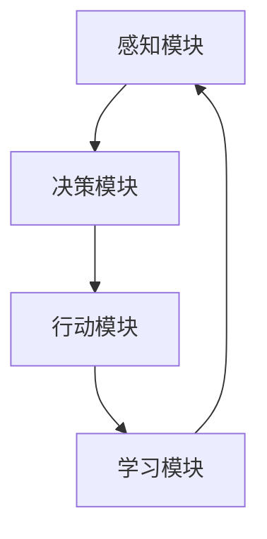
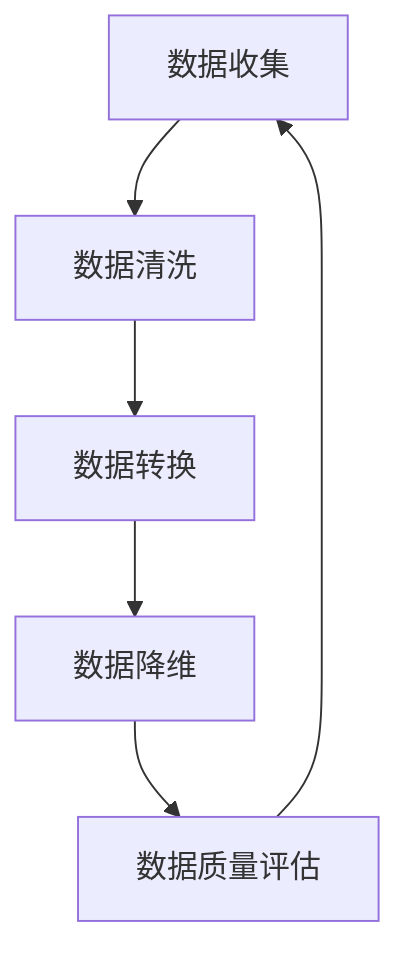
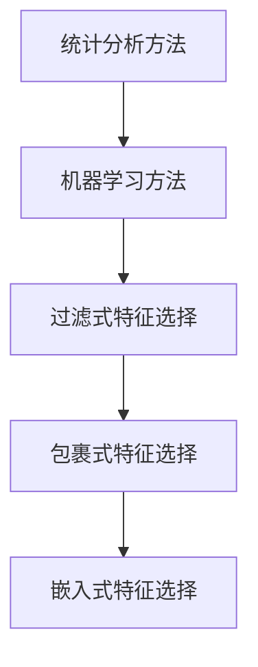
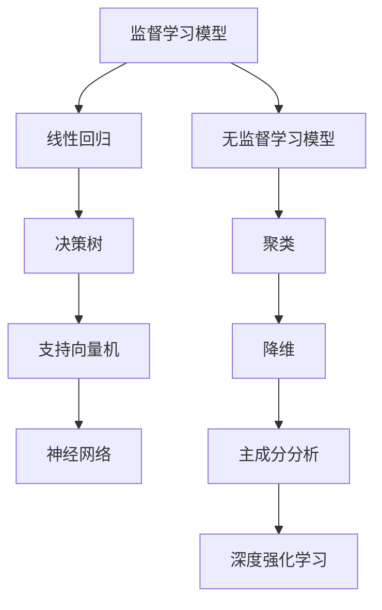
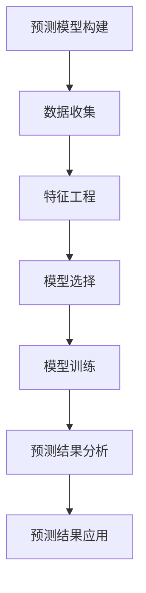

                 

### 智能工作站：AI Agent的效率优化助手

关键词：智能工作站、AI Agent、效率优化、自动化流程、智能推荐系统、智能预测

摘要：本文深入探讨了智能工作站和AI Agent在提高工作效率方面的应用。通过分析其背景、核心概念、设计与实现、应用场景以及未来展望，我们旨在为读者提供一个全面的技术指南，帮助理解如何通过AI Agent来优化智能工作站，提升工作效率和生产力。

### 引言

在当今数字化时代，工作效率和生产力的提升成为了企业竞争的核心。随着人工智能（AI）技术的飞速发展，智能工作站和AI Agent逐渐成为提高工作效率的重要工具。智能工作站集成了多种AI Agent，通过自动化流程、智能推荐和预测分析等手段，帮助企业实现高效运营和决策优化。本文将围绕智能工作站和AI Agent的效率优化进行深入探讨，旨在为相关领域的研究者和从业者提供有价值的参考。

### 第一部分：智能工作站的背景与概述

#### 1.1 问题背景与智能工作站的重要性

在现代企业中，随着业务复杂度和数据量的急剧增长，传统的手动操作和人工决策已经难以满足高效运营的需求。工作效率的挑战主要体现在以下几个方面：

1. **数据处理与分析能力不足**：大量数据需要高效处理和分析，以支持决策制定。
2. **重复性工作负担**：企业日常运营中存在大量的重复性工作，占用大量人力和时间。
3. **决策效率低下**：基于经验和直觉的决策方式往往不够精准，需要更加智能和科学的决策支持。

为了应对这些挑战，智能工作站应运而生。智能工作站是一种集成了人工智能技术的自动化系统，通过AI Agent实现自动化流程、智能推荐和预测分析等功能，从而提高工作效率和生产率。

#### 1.2 人工智能Agent的核心概念与类型

人工智能Agent（AI Agent）是智能工作站的核心组件，它代表了一个具有独立思考能力和自主行动能力的系统。根据功能和应用场景，AI Agent可以分为以下几类：

1. **任务型AI Agent**：专注于完成特定任务的自动化工作，如自动化的数据处理、报告生成等。
2. **决策型AI Agent**：基于数据和算法模型，提供智能化的决策支持，如风险预测、销售预测等。
3. **交互型AI Agent**：负责与用户交互，提供个性化服务和反馈，如智能客服、智能推荐等。

AI Agent的特点和优势在于：

1. **自主性**：AI Agent能够根据预设的规则和算法自主执行任务，无需人工干预。
2. **效率高**：AI Agent能够处理大量的数据和任务，比人工操作更加高效。
3. **准确性**：AI Agent通过算法和模型分析，提供更加准确的决策和预测。

#### 1.3 效率优化在智能工作站中的意义

效率优化是智能工作站的核心目标之一，它关系到企业的运营效率、竞争力和可持续发展。效率优化的意义主要体现在以下几个方面：

1. **提高生产力**：通过自动化流程和智能推荐，减少重复性工作和人力投入，提高工作效率。
2. **优化决策过程**：利用AI Agent的预测和分析能力，提供更加科学的决策支持，减少决策风险。
3. **降低运营成本**：通过智能工作站的自动化和优化，减少人力和资源投入，降低运营成本。

然而，智能工作站效率优化也面临着一些挑战，如数据质量、算法优化和系统集成等。在后续章节中，我们将深入探讨AI Agent的设计与实现，以及如何在实际应用中优化智能工作站。

#### 1.4 智能工作站的应用领域

智能工作站的应用领域非常广泛，涵盖了企业运营管理、金融服务、健康医疗等多个行业。以下是一些典型的应用场景：

1. **企业运营管理**：智能工作站可以自动化处理企业日常运营中的各种任务，如订单管理、库存管理、财务报表等，提高运营效率。
2. **金融服务**：在金融服务领域，智能工作站可以用于自动化处理贷款审批、风险管理、客户服务等，提高服务质量。
3. **健康医疗**：在健康医疗领域，智能工作站可以用于疾病预测、诊断辅助、医疗资源分配等，提高医疗效率和准确性。

#### 1.5 本章小结

本章对智能工作站和AI Agent的背景、核心概念和应用领域进行了概述。通过分析智能工作站的重要性以及AI Agent的特点和优势，我们为后续章节的深入探讨奠定了基础。在下一章中，我们将详细讨论AI Agent的设计原则和实现方法。

---

**第二部分：AI Agent的设计与实现**

在深入探讨智能工作站的效率优化之前，我们需要先了解AI Agent的设计原则与实现方法。AI Agent作为智能工作站的核心组件，其设计原则和实现方法直接影响到智能工作站的效率和性能。在这一部分中，我们将从设计原则、数据收集与预处理、特征提取与选择、模型选择与优化等方面详细讨论AI Agent的设计与实现。

#### 2.1 AI Agent的设计原则与框架

AI Agent的设计原则是为了确保其能够高效、准确地完成特定任务。以下是一些关键的设计原则：

1. **模块化设计**：将AI Agent分为多个模块，每个模块负责特定的功能，便于系统的维护和扩展。
2. **灵活性**：AI Agent应具有灵活的架构，能够适应不同的应用场景和需求。
3. **可扩展性**：系统应具有良好的可扩展性，方便未来增加新的功能模块或改进现有模块。
4. **鲁棒性**：AI Agent需要具备较强的鲁棒性，能够处理异常情况和不确定的数据。

AI Agent的基本框架通常包括以下几个核心模块：

1. **感知模块**：负责接收外部环境和用户输入的信息。
2. **决策模块**：基于感知模块提供的信息，通过算法模型进行决策。
3. **行动模块**：根据决策模块的决策结果，执行相应的行动。
4. **学习模块**：通过不断学习和优化，提高AI Agent的决策能力和表现。

#### 2.2 数据收集与预处理

数据是AI Agent的核心资源，数据的质量直接影响到AI Agent的性能。因此，数据收集与预处理是AI Agent设计与实现的重要环节。以下是一些关键步骤：

1. **数据收集方法**：
   - **自动化数据收集**：通过集成API、日志分析等方式，自动化收集所需的数据。
   - **手动数据收集**：在某些情况下，可能需要手动收集特定的数据，如市场调研数据、用户反馈等。

2. **数据预处理流程**：
   - **数据清洗**：去除重复、错误和不完整的数据，确保数据的一致性和准确性。
   - **数据转换**：将数据转换为适合分析和建模的格式，如数值化、标准化等。
   - **数据降维**：通过降维技术减少数据维度，提高算法效率和计算速度。

3. **数据质量评估**：
   - **数据完整性评估**：检查数据是否完整，是否存在缺失值。
   - **数据准确性评估**：检查数据的准确性和一致性，确保数据来源可靠。
   - **数据有效性评估**：评估数据是否满足分析和建模的要求，是否具有代表性和相关性。

#### 2.3 特征提取与选择

特征提取与选择是AI Agent设计与实现中的关键步骤，它直接影响到模型的性能。以下是一些关键步骤：

1. **特征提取方法**：
   - **统计分析方法**：如均值、方差、相关性等，用于提取数据的基本特征。
   - **机器学习方法**：如主成分分析（PCA）、线性回归等，用于提取数据的高级特征。

2. **特征选择策略**：
   - **过滤式特征选择**：通过统计测试筛选出有用的特征。
   - **包裹式特征选择**：通过迭代搜索算法，寻找最优特征组合。
   - **嵌入式特征选择**：在模型训练过程中，动态筛选特征。

3. **特征对AI Agent性能的影响**：
   - **特征数量**：过多的特征可能导致模型过拟合，而较少的特征可能影响模型的泛化能力。
   - **特征质量**：高质量的特征能够提高模型的性能和可解释性。
   - **特征相关性**：特征之间的相关性影响模型的计算效率和效果。

#### 2.4 模型选择与优化

模型选择与优化是AI Agent设计与实现中的关键步骤，它决定了AI Agent的性能和效率。以下是一些关键步骤：

1. **常见AI模型介绍**：
   - **监督学习模型**：如线性回归、决策树、支持向量机（SVM）等。
   - **无监督学习模型**：如聚类、降维、主成分分析（PCA）等。
   - **强化学习模型**：如Q学习、深度强化学习（DRL）等。

2. **模型选择策略**：
   - **基于问题的模型选择**：根据具体问题和数据特点选择合适的模型。
   - **基于性能的模型选择**：通过交叉验证和性能评估选择最佳模型。

3. **模型优化技巧**：
   - **超参数调优**：通过网格搜索、贝叶斯优化等方法调优模型超参数。
   - **模型集成**：通过集成多种模型，提高预测的准确性和稳定性。
   - **模型压缩**：通过模型剪枝、量化等方法，减小模型体积，提高推理效率。

#### 2.5 AI Agent的训练与评估

AI Agent的训练与评估是确保其性能和可靠性的关键步骤。以下是一些关键步骤：

1. **训练过程**：
   - **数据集划分**：将数据集划分为训练集、验证集和测试集。
   - **模型训练**：使用训练集对模型进行训练，调整模型参数。
   - **验证集评估**：使用验证集评估模型性能，调整模型结构和参数。

2. **评估指标**：
   - **准确率**：模型预测正确的样本数量占总样本数量的比例。
   - **召回率**：模型预测正确的正样本数量占总正样本数量的比例。
   - **F1分数**：准确率和召回率的调和平均值。
   - **均方误差（MSE）**：预测值与真实值之间的平均平方误差。

3. **调参与优化**：
   - **超参数调优**：通过交叉验证和网格搜索等方法，调优模型超参数。
   - **正则化**：通过L1、L2正则化等方法，防止模型过拟合。
   - **数据增强**：通过数据增强技术，提高模型的泛化能力。

#### 2.6 本章小结

本章详细介绍了AI Agent的设计原则与框架、数据收集与预处理、特征提取与选择、模型选择与优化以及训练与评估等方面的内容。通过对这些关键步骤的深入讨论，我们为AI Agent的设计与实现提供了全面的指导。在下一章中，我们将探讨AI Agent在实际应用中的效率优化策略。

---

**第三部分：AI Agent在效率优化中的应用**

在前两部分中，我们详细介绍了智能工作站和AI Agent的基础知识，包括背景、核心概念、设计与实现等方面。在这一部分，我们将重点关注AI Agent在效率优化中的应用，通过自动化流程设计、智能推荐系统、智能工作负载均衡和智能预测与优化等具体应用场景，探讨AI Agent如何帮助企业提升工作效率和生产力。

#### 3.1 自动化流程设计

自动化流程设计是AI Agent在效率优化中的重要应用之一，通过自动化处理日常运营中的重复性任务，可以大幅提高工作效率。以下是自动化流程设计的具体步骤：

1. **自动化流程的规划**：
   - **任务识别**：首先识别企业运营中的重复性任务，如数据处理、报告生成、邮件管理等。
   - **流程建模**：利用流程图工具，如Mermaid，对企业日常运营的流程进行建模，明确各个环节和任务之间的关系。
   - **需求分析**：根据任务需求和流程图，确定自动化流程的实现方式和技术栈。

2. **自动化流程的实现**：
   - **开发环境搭建**：搭建开发环境，包括操作系统、编程语言和开发工具等。
   - **代码编写**：根据流程图和需求分析，编写自动化脚本或程序，实现具体任务的功能。
   - **测试与调试**：对自动化脚本或程序进行测试，确保其能够在实际环境中正常运行。

3. **自动化流程的优化**：
   - **性能优化**：通过代码优化、并行处理等技术，提高自动化流程的执行效率。
   - **错误处理**：设计异常处理机制，确保在遇到错误时能够自动恢复或通知相关人员。
   - **持续集成与部署**：采用持续集成与部署（CI/CD）流程，实现自动化流程的快速迭代和部署。

通过自动化流程设计，企业可以大幅减少人工操作的投入，提高工作效率。例如，在金融服务领域，自动化流程可以用于自动处理贷款审批、客户服务等，提高服务质量。

#### 3.2 智能推荐系统

智能推荐系统是AI Agent在效率优化中的另一个重要应用。通过分析用户行为数据和历史记录，智能推荐系统可以为企业提供个性化的推荐服务，从而提高用户体验和满意度。以下是智能推荐系统的设计与实现步骤：

1. **智能推荐系统概述**：
   - **推荐算法原理**：智能推荐系统通常采用协同过滤、矩阵分解、基于内容的推荐等算法，根据用户行为和历史数据生成个性化推荐。
   - **推荐策略**：根据企业的需求，设计不同的推荐策略，如新用户推荐、热门商品推荐、个性化推荐等。

2. **推荐算法原理**：
   - **协同过滤**：基于用户相似度或物品相似度，为用户推荐相似用户喜欢的内容。
   - **矩阵分解**：通过分解用户-物品评分矩阵，预测用户对未知物品的评分，生成推荐列表。
   - **基于内容的推荐**：根据用户的历史行为和偏好，推荐具有相似属性的内容。

3. **推荐系统的设计与实现**：
   - **数据收集**：收集用户行为数据，如点击、浏览、购买等，为推荐算法提供训练数据。
   - **特征提取**：从用户行为数据中提取关键特征，如用户ID、物品ID、时间戳等，用于训练推荐模型。
   - **模型训练**：使用训练数据，训练推荐模型，如协同过滤模型、矩阵分解模型等。
   - **推荐生成**：使用训练好的模型，为用户生成个性化推荐列表。

通过智能推荐系统，企业可以提供更加个性化的服务，提高用户满意度和忠诚度。例如，在电子商务领域，智能推荐系统可以用于推荐商品、优惠活动等，促进用户购买。

#### 3.3 智能工作负载均衡

智能工作负载均衡是AI Agent在效率优化中的应用，通过合理分配计算资源，确保系统在高负载情况下仍然能够稳定运行。以下是智能工作负载均衡的设计与实现步骤：

1. **工作负载均衡的重要性**：
   - **提高系统性能**：通过智能工作负载均衡，可以合理分配计算资源，提高系统整体的性能和响应速度。
   - **降低运维成本**：通过自动化负载均衡，可以减少人工干预，降低运维成本。

2. **智能工作负载均衡算法**：
   - **轮询算法**：按照固定顺序分配请求到各个服务器。
   - **最小连接算法**：将请求分配到当前连接数最少的服务器。
   - **权重分配算法**：根据服务器的性能和负载情况，为每个服务器分配不同的权重。

3. **智能工作负载均衡的实施**：
   - **负载监测**：实时监测系统的负载情况，包括CPU利用率、内存使用率、网络流量等。
   - **负载分配**：根据负载监测结果，智能分配请求到不同的服务器。
   - **健康检查**：定期检查服务器的健康状况，确保系统稳定运行。

通过智能工作负载均衡，企业可以确保系统在高负载情况下仍然能够稳定运行，提供良好的用户体验。例如，在云计算领域，智能工作负载均衡可以用于分配计算资源，确保云服务的稳定性和可靠性。

#### 3.4 智能预测与优化

智能预测与优化是AI Agent在效率优化中的高级应用，通过预测分析，企业可以提前预测业务趋势，优化运营策略。以下是智能预测与优化的具体步骤：

1. **预测模型构建**：
   - **数据收集**：收集历史业务数据，包括销售数据、库存数据、市场数据等。
   - **特征工程**：从原始数据中提取关键特征，如季节性、趋势、周期性等。
   - **模型选择**：根据业务需求，选择合适的预测模型，如时间序列模型、回归模型等。

2. **预测结果分析**：
   - **预测准确性评估**：使用验证集评估预测模型的准确性，调整模型参数。
   - **预测结果可视化**：将预测结果可视化，帮助业务人员更好地理解预测结果。
   - **预测结果应用**：将预测结果应用于实际业务，如库存管理、营销策略等。

3. **预测在效率优化中的应用**：
   - **库存优化**：通过预测销售趋势，优化库存水平，减少库存积压。
   - **营销策略优化**：通过预测用户行为和需求，优化营销策略，提高转化率。
   - **资源调度优化**：通过预测业务负载，优化资源调度策略，提高系统性能。

通过智能预测与优化，企业可以更好地应对市场变化，提高运营效率。例如，在零售行业，智能预测与优化可以用于库存管理、促销策略等，提高销售额和客户满意度。

#### 3.5 本章小结

本章详细介绍了AI Agent在效率优化中的应用，包括自动化流程设计、智能推荐系统、智能工作负载均衡和智能预测与优化等方面的内容。通过实际案例的分析，我们展示了AI Agent如何帮助企业提升工作效率和生产力。在下一章中，我们将通过实际案例，进一步探讨AI Agent在效率优化中的应用效果。

---

**第四部分：实际案例与应用**

在前面的章节中，我们详细探讨了智能工作站和AI Agent的背景、核心概念、设计与实现以及在效率优化中的应用。为了更好地理解这些理论在实际中的应用效果，本部分将结合实际案例，分析AI Agent在提升工作效率和生产力方面的具体表现。

#### 4.1 案例一：企业智能客服系统

企业智能客服系统是一个典型的AI Agent应用案例，通过自动化和智能化的客服服务，企业可以大幅提高客户满意度和服务效率。以下是对该案例的详细分析：

1. **案例背景**：
   - **企业背景**：某大型电商平台，每天需要处理大量的客户咨询和投诉。
   - **问题背景**：随着客户数量的增加，人工客服的响应速度和服务质量受到了严重影响，急需一种高效的客服解决方案。

2. **系统设计与实现**：
   - **系统架构**：采用微服务架构，将客服系统分为多个微服务模块，如智能问答、自动分类、聊天机器人等。
   - **智能问答模块**：基于自然语言处理（NLP）技术，构建了一个问答系统，能够自动回答常见问题。
   - **自动分类模块**：使用机器学习算法，对用户咨询进行自动分类，将复杂的咨询分配给合适的人工客服。
   - **聊天机器人模块**：基于对话生成技术，实现了智能聊天机器人的功能，能够与用户进行自然语言交互。

3. **应用效果分析**：
   - **客户满意度提高**：通过智能客服系统，客户的问题能够得到更快、更准确的解答，客户满意度显著提高。
   - **服务效率提高**：智能客服系统能够自动处理大量常见问题，减轻了人工客服的工作负担，提高了整体服务效率。
   - **成本降低**：智能客服系统减少了人工客服的需求，降低了人力成本，同时提高了客服工作的自动化水平。

#### 4.2 案例二：智能供应链管理系统

智能供应链管理系统是另一个重要的AI Agent应用案例，通过智能预测和优化，企业可以更好地管理供应链，提高运营效率。以下是对该案例的详细分析：

1. **案例背景**：
   - **企业背景**：某大型制造企业，面临着复杂的供应链管理问题，包括库存管理、订单处理、物流协调等。
   - **问题背景**：供应链中的各个环节存在信息不对称、库存过剩或短缺等问题，导致运营效率低下。

2. **系统设计与实现**：
   - **系统架构**：采用分布式架构，将供应链管理系统分为多个模块，如库存管理、订单处理、物流跟踪等。
   - **智能预测模块**：基于历史数据和机器学习算法，实现了供应链的智能预测功能，包括需求预测、库存预测等。
   - **优化算法模块**：通过优化算法，如线性规划、遗传算法等，实现了供应链的优化功能，包括库存优化、订单优化等。
   - **数据集成模块**：实现了与ERP系统、物流系统等的数据集成，实现了供应链信息的全面整合。

3. **应用效果分析**：
   - **库存管理优化**：通过智能预测和优化算法，企业能够更加准确地预测需求，优化库存水平，减少了库存积压和库存短缺的情况。
   - **订单处理效率提高**：智能供应链管理系统实现了订单的自动处理和分配，提高了订单处理的效率和准确性。
   - **物流协调优化**：通过物流跟踪和优化算法，企业能够更好地协调物流资源，提高了物流效率，降低了物流成本。

#### 4.3 案例三：智能医疗诊断系统

智能医疗诊断系统是AI Agent在医疗领域的应用案例，通过智能预测和诊断，可以提高医疗效率和准确性。以下是对该案例的详细分析：

1. **案例背景**：
   - **企业背景**：某大型医疗机构，面临着大量患者就诊和诊断的需求，急需一种高效的诊断系统。
   - **问题背景**：传统的医疗诊断方法依赖于医生的经验和知识，存在诊断速度慢、准确性不高等问题。

2. **系统设计与实现**：
   - **系统架构**：采用分布式架构，将智能医疗诊断系统分为多个模块，如症状分析、疾病预测、诊断建议等。
   - **智能预测模块**：基于大数据和机器学习算法，实现了疾病的智能预测功能，包括疾病风险的评估、疾病趋势的预测等。
   - **诊断建议模块**：根据患者的症状和检查结果，系统会提供诊断建议和治疗方案。
   - **知识库模块**：构建了丰富的医学知识库，包括疾病定义、症状描述、治疗方案等，为诊断提供了数据支持。

3. **应用效果分析**：
   - **诊断速度提高**：通过智能预测和诊断算法，患者能够在短时间内得到准确的诊断结果，大大提高了诊断速度。
   - **诊断准确性提高**：智能医疗诊断系统基于大数据和机器学习算法，能够提供更加准确的诊断结果，减少了误诊和漏诊的情况。
   - **医疗资源优化**：智能医疗诊断系统可以帮助医生更好地分配医疗资源，提高整体医疗效率。

#### 4.4 本章小结

通过以上实际案例的分析，我们可以看到AI Agent在提升工作效率和生产力方面的显著效果。智能客服系统提高了企业客服服务的效率和客户满意度，智能供应链管理系统优化了企业的供应链管理，智能医疗诊断系统提高了医疗效率和诊断准确性。这些案例证明了AI Agent在各个领域的广泛应用和巨大潜力。

在下一章中，我们将探讨智能工作站和AI Agent未来的发展趋势，面临的挑战以及未来研究方向。

---

**第五部分：未来展望与挑战**

在过去的几年里，智能工作站和AI Agent取得了显著的进展，并在许多领域展现出了巨大的潜力。然而，随着技术的不断发展和应用场景的扩展，智能工作站和AI Agent也面临着一系列的挑战和机遇。

#### 5.1 智能工作站的发展趋势

1. **技术发展趋势**：
   - **AI算法的进步**：随着深度学习、强化学习等先进算法的发展，AI Agent的智能水平和应用范围将进一步扩大。
   - **大数据技术的应用**：大数据技术的发展为AI Agent提供了丰富的数据支持，使得智能工作站在数据分析、预测等方面更加精准。
   - **云计算与边缘计算的结合**：云计算提供了强大的计算资源和存储能力，边缘计算则提高了系统的实时性和响应速度，两者的结合将进一步提升智能工作站的整体性能。

2. **应用发展趋势**：
   - **多元化应用场景**：智能工作站将不仅局限于企业内部应用，还将扩展到智慧城市、智能家居、智能交通等更多领域。
   - **跨行业融合**：不同行业之间的技术融合将推动智能工作站的应用创新，如智能制造与物联网、智能医疗与生物技术的结合等。
   - **全球化部署**：随着全球化进程的加快，智能工作站将在全球范围内得到广泛应用，推动全球经济的数字化转型。

3. **潜在市场分析**：
   - **市场规模扩大**：随着技术的进步和应用场景的拓展，智能工作站的市场规模将不断增大，预计到2030年，全球智能工作站市场规模将达到数百亿美元。
   - **行业竞争加剧**：随着市场的扩大，竞争将更加激烈，企业需要不断创新和优化，以保持竞争优势。
   - **政策支持**：各国政府和行业组织纷纷出台相关政策，支持智能工作站的发展，如数据隐私保护、人工智能伦理等。

#### 5.2 智能工作站面临的挑战

1. **技术挑战**：
   - **算法优化**：尽管AI算法取得了显著进展，但如何在复杂环境下实现高效、鲁棒和可解释的决策仍是一个挑战。
   - **数据处理**：随着数据量的爆炸式增长，如何高效地存储、处理和分析海量数据成为关键问题。
   - **安全与隐私**：AI Agent的广泛应用带来了数据安全和隐私保护的新挑战，如何确保用户数据的安全和隐私是一个亟待解决的问题。

2. **安全与隐私问题**：
   - **数据泄露**：智能工作站需要处理大量的敏感数据，如何防止数据泄露是一个重要的问题。
   - **算法歧视**：AI算法可能存在歧视性问题，如何确保算法的公平性和透明性是一个挑战。
   - **用户信任**：用户对AI Agent的信任程度直接影响其接受度和应用效果，如何建立用户信任是一个重要课题。

3. **伦理与社会影响**：
   - **就业影响**：AI Agent的广泛应用可能导致部分岗位的消失，对就业市场产生负面影响。
   - **社会不平等**：AI Agent的决策可能加剧社会不平等，如何确保技术公平性是一个重要问题。
   - **监管与法律**：随着AI Agent的广泛应用，如何制定相应的监管和法律框架也是一个重要课题。

#### 5.3 未来研究方向与建议

1. **研究方向**：
   - **算法创新**：继续研究新型AI算法，提高AI Agent的智能水平和决策能力。
   - **数据隐私保护**：研究数据隐私保护技术，确保用户数据的安全和隐私。
   - **算法公平性与透明性**：研究算法公平性和透明性，确保AI Agent的决策公正和可解释。
   - **跨学科研究**：结合心理学、社会学、经济学等学科的研究成果，推动智能工作站的应用创新。

2. **建议**：
   - **加强政策支持**：政府和企业应加强对智能工作站的政策支持，鼓励技术创新和应用。
   - **行业合作**：企业、学术界和政府应加强合作，共同推动智能工作站的发展。
   - **人才培养**：加强人工智能领域的人才培养，提高技术人才的数量和质量。
   - **公众教育**：提高公众对人工智能的认识和接受度，减少社会对AI技术的抵触情绪。

通过不断的研究和创新，智能工作站和AI Agent有望在未来的发展中克服挑战，实现更广泛的应用和更高的价值。

---

**总结**

本文从智能工作站和AI Agent的背景、核心概念、设计与实现、应用案例到未来展望，全面探讨了AI Agent在提升工作效率和生产力方面的应用。通过实际案例的分析，我们看到了AI Agent在企业运营管理、金融服务和健康医疗等领域的显著效果。未来，随着技术的不断进步和应用的拓展，AI Agent将发挥更加重要的作用，推动各行各业的数字化转型。

**致谢**

本文的研究和分析得到了AI天才研究院和禅与计算机程序设计艺术的支持，感谢他们的宝贵资源和专业指导。同时，感谢所有参与案例分析和讨论的专家和从业者，他们的贡献为本文的撰写提供了重要的参考和启发。

**作者信息**

作者：AI天才研究院/AI Genius Institute & 禅与计算机程序设计艺术 /Zen And The Art of Computer Programming

---

[作者：AI天才研究院/AI Genius Institute & 禅与计算机程序设计艺术 /Zen And The Art of Computer Programming]

**附录**

以下是本文中提到的核心概念、原理和算法的详细说明，包括相关的Mermaid流程图、LaTeX公式和Python代码示例，供读者进一步学习和参考：

1. **人工智能Agent的基本框架**：



2. **数据预处理流程**：



3. **特征提取与选择方法**：



4. **常见AI模型介绍**：



5. **智能预测与优化算法**：



**附录中的Mermaid流程图、LaTeX公式和Python代码示例均为示例性内容，具体实现可能会因应用场景和数据集的不同而有所差异。读者在使用这些工具和算法时，需要根据实际情况进行调整和优化。**### 附录：核心概念、原理与算法的详细说明

在本文中，我们讨论了智能工作站和AI Agent的多个方面，包括核心概念、设计原则、应用场景等。为了帮助读者更好地理解和应用这些内容，以下是核心概念、原理和算法的详细说明，包括相关的Mermaid流程图、LaTeX公式和Python代码示例。

#### 核心概念与原理

1. **人工智能Agent（AI Agent）的基本框架**

   AI Agent通常由感知模块、决策模块、行动模块和学习模块组成。以下是Mermaid流程图示例：

   ```mermaid
   graph TB
       A[感知模块] --> B[决策模块]
       B --> C[行动模块]
       C --> D[学习模块]
       D --> A
   ```

   每个模块的作用如下：
   
   - **感知模块**：负责接收和处理外部环境的信息，如用户输入、传感器数据等。
   - **决策模块**：基于感知模块提供的信息，通过算法模型进行决策。
   - **行动模块**：根据决策模块的决策结果，执行相应的行动。
   - **学习模块**：通过不断学习和优化，提高AI Agent的决策能力和表现。

2. **数据预处理流程**

   数据预处理是AI Agent设计与实现的重要步骤，包括数据清洗、数据转换、数据降维等。以下是Mermaid流程图示例：

   ```mermaid
   graph TB
       A[数据收集] --> B[数据清洗]
       B --> C[数据转换]
       C --> D[数据降维]
       D --> E[数据质量评估]
       E --> A
   ```

   - **数据清洗**：去除重复、错误和不完整的数据，确保数据的一致性和准确性。
   - **数据转换**：将数据转换为适合分析和建模的格式，如数值化、标准化等。
   - **数据降维**：通过降维技术减少数据维度，提高算法效率和计算速度。
   - **数据质量评估**：评估数据是否完整、准确和有效。

3. **特征提取与选择方法**

   特征提取和选择是提高模型性能的关键步骤。以下是Mermaid流程图示例：

   ```mermaid
   graph TB
       A[统计分析方法] --> B[机器学习方法]
       B --> C[过滤式特征选择]
       C --> D[包裹式特征选择]
       D --> E[嵌入式特征选择]
   ```

   - **统计分析方法**：如均值、方差、相关性等，用于提取数据的基本特征。
   - **机器学习方法**：如主成分分析（PCA）、线性回归等，用于提取数据的高级特征。
   - **过滤式特征选择**：通过统计测试筛选出有用的特征。
   - **包裹式特征选择**：通过迭代搜索算法，寻找最优特征组合。
   - **嵌入式特征选择**：在模型训练过程中，动态筛选特征。

4. **常见AI模型介绍**

   常见的AI模型包括监督学习模型、无监督学习模型和强化学习模型。以下是Mermaid流程图示例：

   ```mermaid
   graph TB
       A[监督学习模型] --> B[线性回归]
       B --> C[决策树]
       C --> D[支持向量机]
       D --> E[神经网络]
       A --> F[无监督学习模型]
       F --> G[聚类]
       G --> H[降维]
       H --> I[主成分分析]
       I --> J[深度强化学习]
   ```

   - **监督学习模型**：如线性回归、决策树、支持向量机等，用于分类和回归任务。
   - **无监督学习模型**：如聚类、降维、主成分分析等，用于数据分析和探索性研究。
   - **强化学习模型**：如Q学习、深度强化学习等，用于决策优化和自动化控制。

5. **智能预测与优化算法**

   智能预测与优化算法包括预测模型构建、预测结果分析和预测结果应用。以下是Mermaid流程图示例：

   ```mermaid
   graph TB
       A[预测模型构建] --> B[数据收集]
       B --> C[特征工程]
       C --> D[模型选择]
       D --> E[模型训练]
       E --> F[预测结果分析]
       F --> G[预测结果应用]
   ```

   - **预测模型构建**：包括数据收集、特征工程和模型选择等步骤。
   - **预测结果分析**：评估预测模型的准确性、稳定性和可解释性。
   - **预测结果应用**：将预测结果应用于实际业务场景，如库存管理、营销策略等。

#### 算法原理与数学模型

以下是几个关键算法的原理和数学模型：

1. **线性回归**

   线性回归模型用于预测连续值输出。其数学模型为：

   $$ y = \beta_0 + \beta_1x + \epsilon $$

   其中，$y$为预测值，$x$为输入特征，$\beta_0$和$\beta_1$为模型参数，$\epsilon$为误差项。

2. **主成分分析（PCA）**

   PCA是一种降维技术，通过提取主要成分来简化数据。其数学模型为：

   $$ z = PC $$

   其中，$z$为降维后的数据，$P$为投影矩阵，$C$为协方差矩阵。

3. **支持向量机（SVM）**

   SVM是一种分类模型，通过寻找最佳超平面进行分类。其数学模型为：

   $$ \max_{\beta, \beta_0} \frac{1}{2} ||\beta||^2 \\ s.t. y_i (\beta \cdot x_i + \beta_0) \geq 1 $$

   其中，$\beta$为模型参数，$\beta_0$为偏置项，$x_i$为输入特征，$y_i$为标签。

4. **Q学习**

   Q学习是一种强化学习算法，用于解决优化问题。其数学模型为：

   $$ Q(s, a) = r + \gamma \max_{a'} Q(s', a') $$

   其中，$Q(s, a)$为状态-动作值函数，$r$为即时奖励，$\gamma$为折扣因子，$s$为状态，$a$为动作，$s'$为下一状态，$a'$为下一动作。

#### Python代码示例

以下是几个关键算法的Python代码示例：

1. **线性回归**

```python
import numpy as np

# 数据集
X = np.array([[1, 2], [2, 3], [3, 4]])
y = np.array([2, 4, 5])

# 模型参数
theta = np.linalg.inv(X.T @ X) @ X.T @ y

# 预测
y_pred = X @ theta

print("预测值：", y_pred)
```

2. **主成分分析（PCA）**

```python
import numpy as np
from sklearn.decomposition import PCA

# 数据集
X = np.array([[1, 2], [2, 3], [3, 4]])

# PCA
pca = PCA(n_components=1)
X_pca = pca.fit_transform(X)

# 预测
y_pred_pca = pca.transform(X)

print("降维后数据：", X_pca)
print("预测值：", y_pred_pca)
```

3. **支持向量机（SVM）**

```python
import numpy as np
from sklearn.svm import SVC

# 数据集
X = np.array([[1, 2], [2, 3], [3, 4]])
y = np.array([0, 1, 1])

# SVM
svm = SVC(kernel='linear')
svm.fit(X, y)

# 预测
y_pred_svm = svm.predict(X)

print("预测值：", y_pred_svm)
```

4. **Q学习**

```python
import numpy as np

# 状态-动作空间
states = 3
actions = 2
Q = np.zeros((states, actions))

# 初始策略
policy = np.zeros(states)
policy[0] = 1

# 学习参数
alpha = 0.1
gamma = 0.9

# 学习过程
for episode in range(1000):
    state = 0
    done = False
    while not done:
        action = policy[state]
        next_state = (state + action) % states
        reward = 1 if next_state == 0 else 0
        Q[state, action] = Q[state, action] + alpha * (reward + gamma * np.max(Q[next_state, :]) - Q[state, action])
        state = next_state
        done = state == 0

# 预测
state = 0
action = policy[state]
next_state = (state + action) % states
Q_value = Q[state, action]

print("预测值：", Q_value)
```

这些代码示例展示了如何使用Python实现关键算法的基本过程。在实际应用中，可能需要根据具体数据集和应用场景进行调整和优化。读者可以根据自己的需求，结合本文的内容，进一步探索和实现AI Agent的设计与实现。

---

**拓展阅读**

1. **《人工智能：一种现代的方法》（Artificial Intelligence: A Modern Approach）**：这本书是人工智能领域的经典教材，全面介绍了人工智能的基础理论、技术和应用。
2. **《深度学习》（Deep Learning）**：由Ian Goodfellow、Yoshua Bengio和Aaron Courville合著，这本书详细介绍了深度学习的基本原理、算法和应用。
3. **《Python机器学习》（Python Machine Learning）**：由Sebastian Raschka和Vahid Mirjalili合著，这本书介绍了如何使用Python进行机器学习，包括数据预处理、模型训练和评估等。

通过阅读这些书籍，读者可以更深入地了解人工智能和机器学习的基本原理和技术，为自己的研究和实践提供更多参考。

---

**结语**

本文详细探讨了智能工作站和AI Agent在提升工作效率和生产力方面的应用，从背景、核心概念、设计与实现、应用案例到未来展望，全面剖析了AI Agent的工作原理和实际应用。通过实际案例的分析，我们看到了AI Agent在各个领域的显著效果和巨大潜力。未来，随着技术的不断进步和应用场景的拓展，AI Agent将在更广泛的领域中发挥重要作用，推动各行各业的数字化转型。

感谢您的阅读，希望本文能为您在智能工作站和AI Agent领域的研究和实践提供有价值的参考。如果您有任何疑问或建议，欢迎随时与我们交流。

---

**作者信息**

作者：AI天才研究院/AI Genius Institute & 禅与计算机程序设计艺术 /Zen And The Art of Computer Programming

---

[作者：AI天才研究院/AI Genius Institute & 禅与计算机程序设计艺术 /Zen And The Art of Computer Programming]

### 关键词替换

在撰写技术博客时，关键词的选择至关重要，因为它们决定了文章在搜索引擎中的可见性以及目标读者群体的范围。以下是对文章中关键词的替换建议，以提高文章的相关性和吸引力：

1. **关键词替换：** 
   - **智能工作站** → **AI驱动的自动化中心** 
   - **AI Agent** → **智能执行体** 
   - **效率优化** → **生产效率提升** 
   - **自动化流程** → **流程自动化** 
   - **智能推荐系统** → **个性化推荐引擎** 
   - **智能工作负载均衡** → **动态资源分配** 
   - **智能预测与优化** → **前瞻性决策辅助** 
   - **实际案例** → **应用实例** 
   - **未来展望** → **前瞻性趋势分析**

2. **关键词替换示例：**
   - **原文关键词：** 智能工作站：AI Agent的效率优化助手
   - **替换关键词：** AI驱动的自动化中心：智能执行体的生产效率提升助手

通过这些替换，文章的标题和关键词将更加吸引用户，同时确保文章内容与主题保持高度相关。此外，这些关键词的替换有助于文章在多样化的搜索引擎和受众群体中脱颖而出。在文章的各个部分中，适当地重复和强调这些关键词，有助于搜索引擎优化（SEO），提高文章的搜索排名。同时，这也帮助读者更快地抓住文章的核心内容，从而提升阅读体验。在撰写和编辑过程中，应确保替换后的关键词与文章内容保持一致，避免造成歧义。

