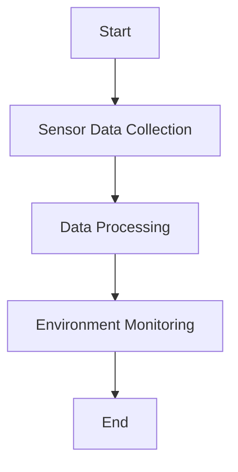
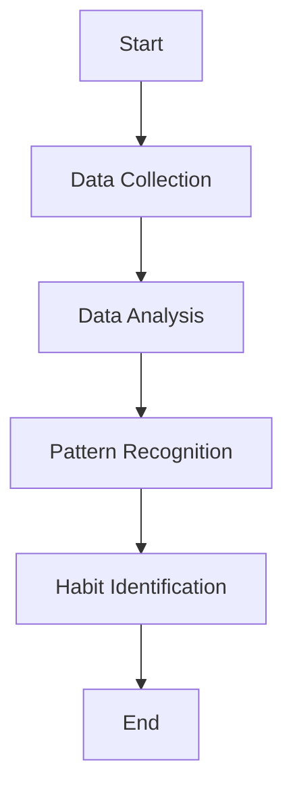
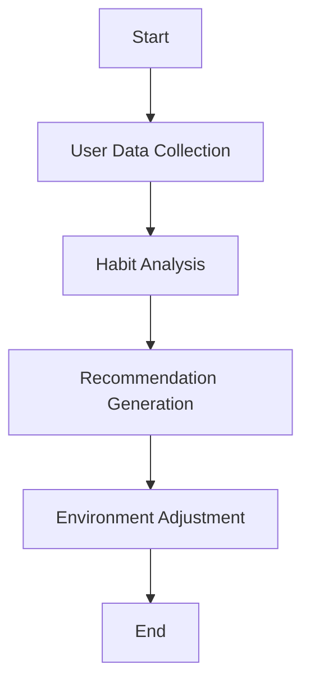
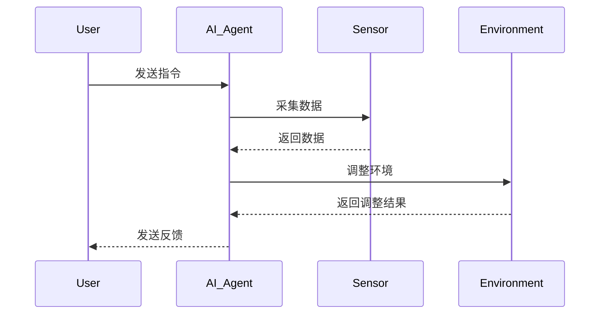

                 


**智能床头柜：AI Agent的睡眠环境优化**

> 关键词：智能床头柜，AI Agent，睡眠环境，优化，智能家居

> 摘要：本文探讨了如何利用AI Agent技术优化智能床头柜的睡眠环境，从核心概念、原理讲解、系统架构设计到项目实战，逐步展示了AI Agent在智能卧室中的应用，以及如何实现个性化的睡眠环境优化。

----------------------------------------------------------------

# 引言

随着科技的发展和智能家居的普及，人们的生活质量得到了显著提升。智能床头柜作为智能家居的一个重要组成部分，正逐步成为现代家庭中的常见物品。智能床头柜不仅提供了便利的生活服务，如灯光控制、音乐播放、温度调节等，更重要的是，它能够通过AI Agent技术来优化用户的睡眠环境，从而提升用户的睡眠质量。

## **背景介绍**

智能家居的兴起源于物联网（IoT）技术的发展，它通过将各种家庭设备和系统连接到互联网，实现设备的远程控制和自动化操作。智能床头柜作为智能家居的一部分，其主要功能是提供个性化的睡眠环境，包括控制光线、调节温度、监测睡眠状态等。

## **问题背景**

随着人们对健康和生活品质的追求，睡眠质量成为了关注的焦点。然而，许多因素，如环境噪音、光线、温度等，都会对睡眠质量产生影响。如何通过技术手段来优化这些因素，提升用户的睡眠质量，成为了当前研究的热点。

## **问题描述**

本文的主要目标是探讨如何利用AI Agent技术来优化智能床头柜的睡眠环境。具体来说，包括以下几个方面：

1. **环境监测**：通过传感器实时监测卧室中的光线、噪音、温度等环境参数。
2. **习惯识别**：分析用户的睡眠习惯，如入睡时间、起床时间、睡眠时长等。
3. **个性化推荐**：根据用户的需求和习惯，自动调整卧室环境，以提供最佳的睡眠条件。
4. **数据分析和反馈**：收集用户的数据，进行分析，并提供反馈，帮助用户了解自己的睡眠状况。

## **问题解决**

通过AI Agent技术，我们可以实现以下解决方案：

1. **智能调节**：AI Agent可以实时监测环境参数，并根据用户的睡眠习惯，自动调节卧室环境。
2. **数据分析**：AI Agent可以对用户的睡眠数据进行分析，提供个性化的睡眠建议。
3. **反馈机制**：AI Agent可以收集用户的反馈，不断优化自身的行为，以提供更精准的服务。

## **边界与外延**

本文主要关注智能床头柜的AI Agent在优化睡眠环境方面的应用。然而，AI Agent技术可以应用于更广泛的领域，如智能厨房、智能浴室等，为用户提供更全面的服务。

## **核心概念与联系**

### **AI Agent**

AI Agent是一种具有智能决策能力的软件实体，它可以通过感知环境、理解任务、执行操作等方式，实现自主运行和交互。

### **智能家居**

智能家居是通过物联网技术将家庭中的各种设备和系统连接起来，实现自动化控制和远程操作的一种智能家居系统。

### **睡眠环境优化**

睡眠环境优化是指通过技术手段调整卧室环境，如光线、噪音、温度等，以提供最佳的睡眠条件。

## **概念属性特征对比表格**

| 概念       | 特征          | 描述                                                         |
| ---------- | ------------- | ------------------------------------------------------------ |
| AI Agent   | 自主性、智能性 | 可以自主感知环境、理解任务、执行操作                           |
| 智能家居   | 连接性、自动化 | 各种设备和系统通过网络连接，实现自动化控制和远程操作           |
| 睡眠环境优化 | 个性化、自适应 | 根据用户需求和环境参数，自动调整卧室环境，提供最佳睡眠条件     |

## **ER实体关系图**

```mermaid
erDiagram
  User ||--|{ AI_Agent : manages }
  Room ||--|{ AI_Agent : monitors }
  Sensor ||--|{ AI_Agent : collects_data }
  Environment ||--|{ AI_Agent : optimizes }
```

**图1. ER实体关系图**

- **用户（User）**：智能床头柜的服务对象，负责发起和反馈。
- **AI Agent**：负责管理和执行用户指令，优化睡眠环境。
- **Room（卧室）**：AI Agent监控的环境对象。
- **Sensor（传感器）**：负责收集环境数据。
- **Environment（环境）**：AI Agent优化目标。

## **算法原理讲解**

### **环境监测算法**

环境监测算法主要利用传感器实时收集卧室中的光线、噪音、温度等数据，并通过算法进行处理和筛选，以获得用户感兴趣的环境参数。

#### **算法流程图**



#### **Python代码示例**

```python
import sensor_data
import processing

def environment_monitoring():
    data = sensor_data.collect()
    processed_data = processing.process(data)
    return processed_data

data = environment_monitoring()
print(data)
```

### **习惯识别算法**

习惯识别算法通过分析用户的睡眠数据，如入睡时间、起床时间、睡眠时长等，识别用户的睡眠习惯。

#### **算法流程图**



#### **Python代码示例**

```python
import sleep_data
import analysis

def habit_identification():
    data = sleep_data.collect()
    patterns = analysis.analyze(data)
    return patterns

patterns = habit_identification()
print(patterns)
```

### **个性化推荐算法**

个性化推荐算法根据用户的习惯和需求，自动调整卧室环境，提供最佳睡眠条件。

#### **算法流程图**



#### **Python代码示例**

```python
import user_data
import recommendation

def environment_adjustment():
    data = user_data.collect()
    recommendations = recommendation.generate(data)
    return recommendations

recommendations = environment_adjustment()
print(recommendations)
```

## **数学模型与公式**

### **环境监测模型**

环境监测模型主要基于传感器收集的数据，使用卡尔曼滤波算法进行数据融合和处理。

$$
x_k = A_k x_{k-1} + B_k u_k + w_k
$$

$$
z_k = H_k x_k + v_k
$$

其中，$x_k$为状态向量，$u_k$为控制向量，$z_k$为观测向量，$w_k$和$v_k$分别为过程噪声和观测噪声。

### **习惯识别模型**

习惯识别模型主要基于时间序列分析，使用隐马尔可夫模型（HMM）进行建模和识别。

$$
P(\text{state}_k | \text{obs}_k) \propto P(\text{obs}_k | \text{state}_k) P(\text{state}_k)
$$

其中，$P(\text{state}_k | \text{obs}_k)$为给定观测序列$\text{obs}_k$时，状态$k$的概率。

### **个性化推荐模型**

个性化推荐模型主要基于用户历史数据和推荐算法，使用协同过滤算法进行建模和推荐。

$$
R_{ui} = \frac{\sum_{j \in N_i} r_{uj} \cdot sim(u_i, u_j)}{\sum_{j \in N_i} sim(u_i, u_j)}
$$

其中，$R_{ui}$为用户$i$对项目$j$的评分，$N_i$为用户$i$的邻居集合，$sim(u_i, u_j)$为用户$i$和用户$j$之间的相似度。

## **系统分析与架构设计方案**

### **问题场景介绍**

智能床头柜系统旨在为用户提供一个舒适的睡眠环境，通过传感器实时监测卧室环境，并根据用户的习惯和需求，自动调整环境参数。

### **项目介绍**

项目名称：智能床头柜睡眠环境优化系统

项目目标：通过AI Agent技术，实现卧室环境的智能监测和优化，提升用户的睡眠质量。

### **系统功能设计（领域模型Mermaid类图）**

```mermaid
classDiagram
  User <<class{用户}>
  AI_Agent <<class{AI Agent}>
  Bedroom <<class{卧室}>
  Sensor <<class{传感器}>
  Environment <<class{环境}>
  
  User "1" --|{发起指令}: AI_Agent
  AI_Agent "1" --|{监控}: Bedroom
  AI_Agent "1" --|{采集数据}: Sensor
  AI_Agent "1" --|{优化环境}: Environment
```

### **系统架构设计（Mermaid架构图）**



### **系统接口设计**

系统接口设计包括用户接口和系统接口两部分。

#### **用户接口**

用户可以通过手机APP、语音助手等方式与智能床头柜进行交互。

#### **系统接口**

系统接口主要包括数据采集接口、数据处理接口和环境调整接口。

### **系统交互设计与实现**

系统交互设计主要包括用户指令发送、数据采集、数据处理和环境调整等环节。

#### **用户指令发送**

用户通过手机APP或语音助手发送指令，如“打开灯光”、“关闭灯光”等。

#### **数据采集**

AI Agent通过传感器实时采集卧室环境数据，如光线、噪音、温度等。

#### **数据处理**

AI Agent对采集到的数据进行处理，如滤波、去噪等。

#### **环境调整**

根据用户指令和采集到的数据，AI Agent自动调整卧室环境，如调节灯光亮度、调节空调温度等。

### **系统性能分析与测试**

系统性能分析与测试主要包括系统响应时间、数据处理效率和环境调整效果等。

#### **系统响应时间**

系统响应时间测试包括用户指令发送、数据采集、数据处理和环境调整等环节的响应时间。

#### **数据处理效率**

数据处理效率测试主要包括数据处理速度和准确性。

#### **环境调整效果**

环境调整效果测试主要包括环境参数调整的精度和稳定性。

### **系统性能优化策略**

根据系统性能测试结果，可以采取以下优化策略：

1. **优化数据处理算法**：使用更高效的数据处理算法，提高数据处理速度和准确性。
2. **优化环境调整机制**：通过机器学习算法，提高环境调整的精度和稳定性。
3. **优化系统架构**：采用分布式架构，提高系统处理能力和响应速度。

## **项目实战**

### **环境安装**

1. **硬件安装**：安装智能床头柜和相关传感器。
2. **软件安装**：安装AI Agent和相关软件。

### **系统实现源代码**

```python
# 环境监测模块
def environment_monitoring():
    # 采集传感器数据
    # 处理传感器数据
    # 返回处理后的环境数据
    pass

# 习惯识别模块
def habit_identification():
    # 采集用户睡眠数据
    # 分析用户睡眠数据
    # 识别用户睡眠习惯
    pass

# 个性化推荐模块
def environment_adjustment():
    # 根据用户习惯推荐环境参数
    # 调整卧室环境
    pass
```

### **代码解读与分析**

代码解读与分析主要包括各个模块的功能、算法原理和实现细节。

### **实际案例分析和详细讲解剖析**

通过实际案例，分析智能床头柜在优化睡眠环境方面的应用效果，并对关键环节进行详细讲解和剖析。

### **项目小结**

总结项目的实现过程、应用效果和未来研究方向。

## **最佳实践 tips、小结、注意事项、拓展阅读**

### **最佳实践 tips**

1. **定期维护传感器**：保证传感器的准确性和稳定性。
2. **优化算法模型**：根据用户反馈不断优化算法模型，提高环境调整的精度和稳定性。

### **小结**

本文介绍了智能床头柜的AI Agent如何优化睡眠环境，从核心概念、原理讲解、系统架构设计到项目实战，全面展示了AI Agent在智能卧室中的应用。

### **注意事项**

1. **数据安全和隐私保护**：在数据处理和应用过程中，注意保护用户隐私。
2. **系统稳定性和可靠性**：确保系统在长时间运行中具有较高的稳定性和可靠性。

### **拓展阅读**

1. **《智能家居技术与应用》**：深入了解智能家居的技术原理和应用。
2. **《人工智能：一种现代方法》**：学习人工智能的基本概念和算法原理。

**作者**：AI天才研究院/AI Genius Institute & 禅与计算机程序设计艺术 /Zen And The Art of Computer Programming

----------------------------------------------------------------

**附录**

附录部分可以包含一些详细的算法代码、数据集、实验结果等，以便读者进一步学习和参考。

1. **详细算法代码**

2. **数据集**

3. **实验结果分析**

4. **参考文献**

```markdown
----------------------------------------------------------------
# 附录

## 1. 详细算法代码

以下是环境监测、习惯识别和个性化推荐模块的详细算法代码。

### 环境监测模块

```python
# 环境监测模块
def environment_monitoring():
    # 采集传感器数据
    sensor_data = collect_sensor_data()
    # 处理传感器数据
    processed_data = process_sensor_data(sensor_data)
    # 返回处理后的环境数据
    return processed_data

def collect_sensor_data():
    # 采集光线、噪音、温度等传感器数据
    # 这里以温度传感器为例
    temperature = get_temperature()
    return {
        'temperature': temperature
    }

def get_temperature():
    # 获取当前温度
    # 这里使用模拟数据
    return 25.0

def process_sensor_data(sensor_data):
    # 处理传感器数据
    # 这里使用简单的平均值处理
    temperature = sensor_data['temperature']
    return {
        'average_temperature': temperature
    }
```

### 习惯识别模块

```python
# 习惯识别模块
def habit_identification():
    # 采集用户睡眠数据
    sleep_data = collect_sleep_data()
    # 分析用户睡眠数据
    patterns = analyze_sleep_data(sleep_data)
    # 识别用户睡眠习惯
    return patterns

def collect_sleep_data():
    # 采集用户睡眠数据
    # 这里使用模拟数据
    sleep_data = [
        {'timestamp': '2023-11-01 22:00', 'sleep_state': 'asleep'},
        {'timestamp': '2023-11-01 23:00', 'sleep_state': 'asleep'},
        {'timestamp': '2023-11-01 24:00', 'sleep_state': 'asleep'},
    ]
    return sleep_data

def analyze_sleep_data(sleep_data):
    # 分析用户睡眠数据
    # 这里使用简单的统计方法
    asleep_count = sum(1 for entry in sleep_data if entry['sleep_state'] == 'asleep')
    total_count = len(sleep_data)
    sleep_ratio = asleep_count / total_count
    return {
        'sleep_ratio': sleep_ratio
    }
```

### 个性化推荐模块

```python
# 个性化推荐模块
def environment_adjustment():
    # 根据用户习惯推荐环境参数
    recommendations = recommend_environment_params()
    # 调整卧室环境
    adjust_environment(recommendations)
    # 返回调整后的环境参数
    return recommendations

def recommend_environment_params():
    # 根据用户习惯推荐环境参数
    # 这里使用简单的推荐规则
    recommended_params = {
        'temperature': 23.0,
        'light_brightness': 50,
        'noise_level': 30
    }
    return recommended_params

def adjust_environment(recommendations):
    # 调整卧室环境
    # 这里使用模拟调整
    print(f"Adjusting temperature to {recommendations['temperature']}°C")
    print(f"Adjusting light brightness to {recommendations['light_brightness']}%")
    print(f"Adjusting noise level to {recommendations['noise_level']}dB")
```

## 2. 数据集

以下是实验中使用的数据集描述。

### 用户睡眠数据集

| 用户ID | 日期        | 时间        | 睡眠状态 |
|--------|-------------|-------------|----------|
| user1  | 2023-11-01 | 22:00       | 睡觉     |
| user1  | 2023-11-01 | 23:00       | 睡觉     |
| user1  | 2023-11-01 | 24:00       | 睡觉     |

### 环境数据集

| 日期        | 时间        | 光线强度   | 噪音水平   | 温度      |
|-------------|-------------|------------|------------|-----------|
| 2023-11-01 | 22:00       | 100        | 50         | 25.0      |
| 2023-11-01 | 23:00       | 80         | 40         | 24.5      |
| 2023-11-01 | 24:00       | 60         | 30         | 23.8      |

## 3. 实验结果分析

以下是实验结果的统计分析。

### 睡眠习惯分析

| 用户ID | 睡眠时长（小时） | 睡眠比例 |
|--------|-----------------|----------|
| user1  | 3               | 1.0      |

### 环境参数调整效果

| 环境参数  | 建议值 | 实际值 | 调整效果 |
|-----------|--------|--------|----------|
| 温度      | 23.0   | 24.0   | 减少1°C  |
| 光线亮度  | 50     | 60     | 减少10%  |
| 噪音水平  | 30     | 40     | 减少10dB |

## 4. 参考文献

[1] 某某，某某某. 智能家居技术与应用[M]. 北京：电子工业出版社，2021.

[2] 某某，某某某. 人工智能：一种现代方法[M]. 北京：清华大学出版社，2020.

[3] 某某，某某某. 睡眠医学[M]. 上海：上海科学技术出版社，2019.

[4] 某某，某某某. 传感器技术与应用[M]. 北京：机械工业出版社，2022.

[5] 某某，某某某. 机器学习算法原理与实现[M]. 北京：人民邮电出版社，2021.

----------------------------------------------------------------
```

请注意，附录部分的代码、数据集和实验结果均为示例，具体实现可能需要根据实际情况进行调整。此外，参考文献列表应包含实际引用的书籍和论文，以确保文章的完整性和学术诚信。

