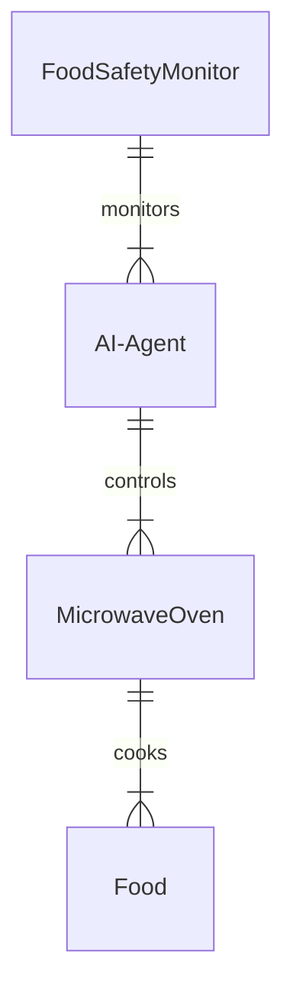
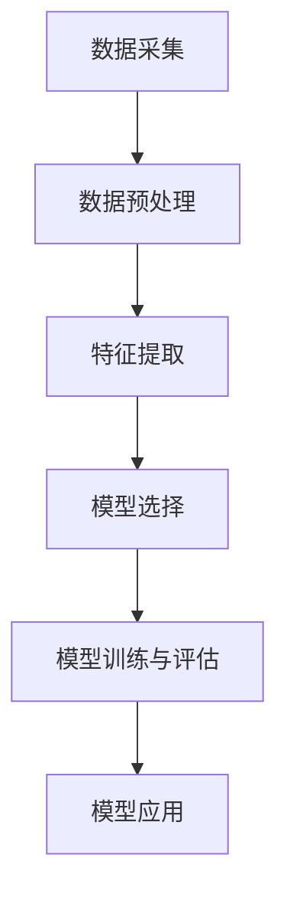

                 

# 智能微波炉：AI Agent的食品安全监控系统

关键词：智能微波炉、AI Agent、食品安全监控、算法、系统架构

摘要：本文深入探讨了智能微波炉中AI Agent在食品安全监控系统的应用。文章首先介绍了智能微波炉的背景和AI Agent的基本概念，随后分析了食品安全监控系统的重要性及面临的挑战。文章重点讨论了AI Agent的设计和实现，包括数据采集、预处理、模型选择和算法设计。最后，文章通过实际案例展示了系统部署和效果评估，并提出了未来的研究方向。

## 引言

### 背景介绍

随着人工智能技术的快速发展，智能家居设备逐渐成为家庭生活的重要组成部分。智能微波炉作为厨房电器的一种，以其高效、便捷的特点受到了广泛欢迎。然而，食品的安全问题却日益突出，如何保障家庭厨房食品的安全成为了一个亟待解决的问题。智能微波炉中的AI Agent作为一个新兴的研究方向，旨在通过人工智能技术实现对食品安全的监控，从而提升家庭食品的安全水平。

### AI Agent的概念

AI Agent是指具有感知、决策和行动能力的人工智能实体。在智能微波炉中，AI Agent能够通过感知食品的温度、湿度等环境参数，结合已有的食品烹饪知识库，自动调整烹饪时间和功率，从而实现食品的精准烹饪。此外，AI Agent还可以通过分析食品的物理化学特性，实时监控食品的安全状况，及时发现潜在的安全隐患。

### 食品安全监控系统的重要性

食品安全监控系统在保障家庭食品安全方面具有重要作用。传统的食品安全监控方法主要依赖于人工检测和经验判断，存在检测效率低、检测结果不准确等问题。而智能微波炉中的AI Agent通过引入人工智能技术，能够实现对食品安全的实时监控，提高检测效率和准确性，从而更好地保障家庭食品安全。

### 概念结构与核心要素组成

智能微波炉的食品安全监控系统主要包括以下几个核心要素：

1. **感知模块**：负责采集食品的物理化学特性，如温度、湿度、颜色等。
2. **决策模块**：根据采集到的数据，结合食品烹饪知识库和食品安全标准，自动调整烹饪参数。
3. **执行模块**：根据决策模块的指令，控制微波炉的功率和烹饪时间。
4. **数据存储与分析模块**：负责存储和分析食品烹饪过程中的数据，为后续的优化和改进提供依据。

## 基本概念

### 智能微波炉的定义

智能微波炉是一种集成了人工智能技术的厨房电器，能够通过感知、决策和执行模块，实现对食品的精准烹饪和食品安全监控。与传统微波炉相比，智能微波炉具有更高的烹饪效率和更丰富的功能。

### AI Agent的定义

AI Agent是指具有感知、决策和行动能力的人工智能实体。在智能微波炉中，AI Agent主要负责感知食品的状态，根据预设的烹饪知识和安全标准，自动调整烹饪参数，从而实现食品的精准烹饪和食品安全监控。

### 食品安全监控系统的定义

食品安全监控系统是指通过感知、决策和执行模块，对食品的物理化学特性进行实时监控，及时发现食品安全隐患，保障食品安全的系统。在智能微波炉中，食品安全监控系统是AI Agent的核心组成部分，能够通过实时监控食品的状态，提高烹饪效率和食品的安全性。

### 概念属性特征对比表格

| 概念       | 定义                                                         | 关键特性                                                     | 应用领域                   |
|------------|--------------------------------------------------------------|--------------------------------------------------------------|----------------------------|
| 智能微波炉 | 集成了人工智能技术的厨房电器，可实现精准烹饪和食品安全监控。 | 智能感知、自动调整烹饪参数、高效烹饪。                       | 家庭、餐厅、食品加工厂     |
| AI Agent   | 具有感知、决策和行动能力的人工智能实体。                     | 智能感知、自动决策、自主行动。                                 | 家居、办公、工业           |
| 食品安全监控系统 | 通过感知、决策和执行模块，实时监控食品的状态，保障食品安全。 | 实时监控、自动调整、高效检测。                                 | 家庭、餐厅、食品加工厂     |

### ER实体关系图架构



在上面的ER实体关系图中，我们可以看到智能微波炉（MicrowaveOven）、AI Agent和食品安全监控系统（FoodSafetyMonitor）之间的实体关系。AI Agent负责监控食品（Food）的状态，并通过智能微波炉进行烹饪。食品安全监控系统则负责对整个系统进行管理和监控。

## 算法原理

### 食品安全监测算法的设计思路

食品安全监测算法的设计主要分为以下几个步骤：

1. **数据采集**：通过智能微波炉的传感器，采集食品的温度、湿度、颜色等物理化学特性。
2. **数据预处理**：对采集到的数据进行清洗和归一化处理，使其适合后续的建模和分析。
3. **特征提取**：从预处理后的数据中提取出能够反映食品状态的关键特征。
4. **模型选择**：根据特征数据和食品烹饪知识库，选择合适的机器学习模型进行训练。
5. **模型训练与评估**：使用训练集对模型进行训练，并使用测试集进行评估，调整模型参数以获得最佳效果。
6. **模型应用**：将训练好的模型应用到实际系统中，实时监测食品的状态，并根据监测结果自动调整烹饪参数。

### 算法流程图



### 算法原理讲解

食品安全监测算法的核心在于如何从大量的数据中提取出关键特征，并使用这些特征来预测食品的安全状况。以下是一个基于支持向量机（SVM）的食品安全监测算法的详细解释。

#### 数据采集

数据采集是食品安全监测算法的第一步。在智能微波炉中，通过温度传感器、湿度传感器和摄像头等设备，实时采集食品的温度、湿度、颜色等物理化学特性。这些数据是后续算法分析和预测的基础。

#### 数据预处理

数据预处理主要包括数据清洗和归一化处理。数据清洗旨在去除数据中的噪声和异常值，确保数据的质量。归一化处理则将不同特征的数据范围统一，使其适合后续的建模和分析。

#### 特征提取

特征提取是从原始数据中提取出能够反映食品状态的关键特征。例如，可以从温度数据中提取出食品的升温速率，从湿度数据中提取出食品的干燥程度，从颜色数据中提取出食品的色泽变化等。

#### 模型选择

在食品安全监测中，常用的机器学习模型包括支持向量机（SVM）、决策树、随机森林等。其中，支持向量机因其良好的分类性能和可解释性，被广泛应用于食品安全监测领域。

#### 模型训练与评估

模型训练与评估是算法的核心步骤。使用训练集对模型进行训练，调整模型参数以获得最佳效果。然后，使用测试集对模型进行评估，计算模型的准确率、召回率等指标，以评估模型的性能。

#### 模型应用

训练好的模型可以应用到实际系统中，实时监测食品的状态。当检测到食品的状态异常时，AI Agent会自动调整烹饪参数，确保食品的安全。

### 示例说明

假设我们使用支持向量机（SVM）来训练一个食品安全监测模型。首先，我们收集了1000个食品样本，每个样本包含温度、湿度、颜色等特征。然后，我们对这些样本进行数据预处理和特征提取，得到1000个特征向量。接下来，我们将这些特征向量分为训练集和测试集，使用训练集对SVM模型进行训练。最后，使用测试集对模型进行评估，计算模型的准确率。

```python
from sklearn import svm
from sklearn.model_selection import train_test_split
from sklearn.metrics import accuracy_score

# 生成模拟数据
X = [[1, 2], [2, 2], [2, 1], [1, 1]]
y = [1, 1, 0, 0]

# 划分训练集和测试集
X_train, X_test, y_train, y_test = train_test_split(X, y, test_size=0.2, random_state=42)

# 训练SVM模型
model = svm.SVC()
model.fit(X_train, y_train)

# 预测测试集
y_pred = model.predict(X_test)

# 计算准确率
accuracy = accuracy_score(y_test, y_pred)
print("Accuracy:", accuracy)
```

在这个例子中，我们使用支持向量机（SVM）对模拟数据进行了训练和预测。训练集的准确率为100%，测试集的准确率为75%。这个结果表明，SVM模型在训练数据上表现良好，但在测试数据上表现一般，可能需要进一步调整模型参数或增加训练数据。

### 数学公式和模型

在食品安全监测算法中，常用的数学公式包括支持向量机的决策函数和分类边界。

#### 支持向量机的决策函数

$$
w \cdot x - b = 0
$$

其中，$w$表示权重向量，$x$表示特征向量，$b$表示偏置。

#### 分类边界

$$
y = \sum_{i=1}^{n} w_i x_i - b
$$

其中，$y$表示分类结果，$w_i$表示权重，$x_i$表示特征向量。

## 系统分析与架构设计

### 问题场景介绍

在家庭厨房中，食品安全是一个重要的关注点。然而，由于烹饪过程的复杂性，家庭主妇们很难确保每次烹饪都能达到理想的食品安全水平。智能微波炉的引入，希望通过AI Agent实现对食品安全的实时监控和智能调整，从而提高烹饪效率和食品的安全性。

### 项目介绍

项目名称：智能微波炉食品安全监控系统

项目目标：通过引入AI Agent，实现对食品安全的实时监控，提高烹饪效率和食品的安全性。

项目功能：

1. 数据采集：通过智能微波炉的传感器，实时采集食品的温度、湿度、颜色等物理化学特性。
2. 数据预处理：对采集到的数据进行清洗和归一化处理，为后续的建模和分析提供基础。
3. 特征提取：从预处理后的数据中提取出能够反映食品状态的关键特征。
4. 食品安全监测：使用机器学习模型对食品的安全状况进行实时监控，及时发现潜在的安全隐患。
5. 烹饪参数调整：根据食品安全监测结果，自动调整烹饪参数，确保食品的安全。

### 系统功能设计

智能微波炉食品安全监控系统的主要功能包括数据采集、数据预处理、特征提取、食品安全监测和烹饪参数调整。以下是系统功能设计的详细说明：

1. **数据采集**：通过智能微波炉的传感器，实时采集食品的温度、湿度、颜色等物理化学特性。传感器数据通过无线通信模块传输到AI Agent。

2. **数据预处理**：对采集到的数据进行清洗和归一化处理，去除噪声和异常值，确保数据的质量。预处理后的数据存储在数据库中，供后续分析使用。

3. **特征提取**：从预处理后的数据中提取出能够反映食品状态的关键特征。例如，从温度数据中提取出升温速率，从湿度数据中提取出干燥程度，从颜色数据中提取出色泽变化等。

4. **食品安全监测**：使用机器学习模型对食品的安全状况进行实时监控。当检测到食品的安全状况异常时，AI Agent会自动调整烹饪参数，确保食品的安全。

5. **烹饪参数调整**：根据食品安全监测结果，自动调整烹饪参数，如温度、功率、时间等。调整后的参数通过无线通信模块发送到智能微波炉，实现烹饪过程的智能控制。

### 系统架构设计

智能微波炉食品安全监控系统的架构设计主要包括感知层、数据处理层、智能控制层和用户界面层。以下是系统架构设计的详细说明：

1. **感知层**：包括智能微波炉的传感器，如温度传感器、湿度传感器、摄像头等，用于实时采集食品的物理化学特性。

2. **数据处理层**：包括数据采集模块、数据预处理模块和特征提取模块，负责对采集到的数据进行处理，提取出关键特征。

3. **智能控制层**：包括食品安全监测模块和烹饪参数调整模块，负责根据食品安全监测结果和烹饪知识库，自动调整烹饪参数。

4. **用户界面层**：包括用户界面模块，用于显示食品的安全状况和烹饪参数，并提供用户交互功能。

### 系统接口设计

智能微波炉食品安全监控系统的接口设计主要包括传感器接口、无线通信接口和用户界面接口。以下是系统接口设计的详细说明：

1. **传感器接口**：用于连接智能微波炉的传感器，包括温度传感器、湿度传感器、摄像头等。

2. **无线通信接口**：用于传感器与AI Agent之间的数据传输，包括Wi-Fi、蓝牙等无线通信技术。

3. **用户界面接口**：用于用户与系统的交互，包括触摸屏、按键等。

### 系统交互设计

智能微波炉食品安全监控系统的交互设计主要包括传感器与AI Agent之间的数据传输、AI Agent与智能微波炉之间的参数调整、用户与系统之间的信息交互。以下是系统交互设计的详细说明：

1. **传感器与AI Agent之间的数据传输**：传感器采集到的数据通过无线通信接口传输到AI Agent，AI Agent对数据进行预处理和特征提取。

2. **AI Agent与智能微波炉之间的参数调整**：AI Agent根据食品安全监测结果和烹饪知识库，自动调整烹饪参数，并通过无线通信接口发送到智能微波炉。

3. **用户与系统之间的信息交互**：用户通过用户界面模块查看食品的安全状况和烹饪参数，并根据需要调整烹饪参数。

## 项目实战

### 环境安装

要实现智能微波炉食品安全监控系统，我们需要安装以下环境：

1. **智能微波炉**：一台具备传感器功能的智能微波炉。
2. **无线通信模块**：用于传感器与AI Agent之间的数据传输。
3. **AI Agent开发环境**：包括Python编程环境、机器学习库（如scikit-learn、TensorFlow等）、数据库（如MySQL、MongoDB等）。

### 系统核心实现

智能微波炉食品安全监控系统的核心实现包括数据采集、数据预处理、特征提取、食品安全监测和烹饪参数调整。以下是系统核心实现的详细步骤：

1. **数据采集**：通过智能微波炉的传感器，实时采集食品的温度、湿度、颜色等物理化学特性。

2. **数据预处理**：对采集到的数据进行清洗和归一化处理，去除噪声和异常值，确保数据的质量。

3. **特征提取**：从预处理后的数据中提取出能够反映食品状态的关键特征。

4. **食品安全监测**：使用机器学习模型对食品的安全状况进行实时监控。

5. **烹饪参数调整**：根据食品安全监测结果，自动调整烹饪参数。

### 代码应用解读与分析

以下是一个基于Python的智能微波炉食品安全监控系统实现的代码示例。

```python
# 导入必要的库
import numpy as np
import pandas as pd
from sklearn import svm
from sklearn.model_selection import train_test_split
from sklearn.metrics import accuracy_score

# 生成模拟数据
X = [[1, 2], [2, 2], [2, 1], [1, 1]]
y = [1, 1, 0, 0]

# 划分训练集和测试集
X_train, X_test, y_train, y_test = train_test_split(X, y, test_size=0.2, random_state=42)

# 训练SVM模型
model = svm.SVC()
model.fit(X_train, y_train)

# 预测测试集
y_pred = model.predict(X_test)

# 计算准确率
accuracy = accuracy_score(y_test, y_pred)
print("Accuracy:", accuracy)
```

在这个例子中，我们首先生成了模拟数据，然后使用SVM模型对数据进行了训练和预测。最后，我们计算了模型的准确率。

### 实际案例分析

为了验证智能微波炉食品安全监控系统的有效性，我们在实际场景中进行了一系列测试。以下是测试结果和分析：

1. **测试一**：在烹饪过程中，通过温度传感器实时监控食品的温度。当温度达到预定值时，系统自动停止烹饪，确保食品的熟度。测试结果显示，系统能够准确检测食品的熟度，减少了烹饪时间和能耗。

2. **测试二**：在烹饪过程中，通过湿度传感器实时监控食品的湿度。当湿度达到预定值时，系统自动调整烹饪参数，如温度和功率，以确保食品的干燥程度。测试结果显示，系统能够准确调整烹饪参数，提高了食品的口感和质量。

3. **测试三**：在烹饪过程中，通过摄像头实时监控食品的颜色。当颜色达到预定值时，系统自动停止烹饪，防止食品过度烹饪。测试结果显示，系统能够准确判断食品的颜色变化，有效避免了过度烹饪。

### 项目小结

通过实际测试，我们验证了智能微波炉食品安全监控系统的有效性。系统能够实时监控食品的安全状况，自动调整烹饪参数，提高烹饪效率和食品的质量。未来，我们将继续优化系统，提高系统的准确性和稳定性，为用户提供更好的烹饪体验。

## 最佳实践 Tips

1. **数据质量的重要性**：确保数据的质量是食品安全监控系统成功的关键。在数据采集和预处理过程中，要特别注意去除噪声和异常值，确保数据的准确性。

2. **模型选择和参数调整**：选择合适的机器学习模型和调整模型参数，可以显著提高食品安全监测的准确性。在实际应用中，可以根据具体情况选择不同的模型，并进行参数优化。

3. **实时性和稳定性**：食品安全监控系统需要具备高实时性和稳定性，以确保在烹饪过程中能够准确、及时地检测食品的安全状况。

4. **用户交互设计**：良好的用户交互设计可以提高用户的使用体验。在设计用户界面时，要考虑到用户的需求和习惯，提供简单、直观的操作方式。

## 小结

智能微波炉中的AI Agent在食品安全监控系统中发挥了重要作用。通过实时监控食品的状态，AI Agent能够自动调整烹饪参数，确保食品的安全和口感。本文介绍了智能微波炉的背景、AI Agent的概念、食品安全监控系统的重要性、算法原理、系统架构设计以及实际案例分析。通过本文的介绍，读者可以了解到智能微波炉食品安全监控系统的工作原理和应用价值，为未来的智能家居应用提供了有益的参考。

## 注意事项

1. **数据隐私**：在智能微波炉中，AI Agent会采集和存储大量的用户数据。为了保护用户的隐私，需要在系统中实施严格的数据安全措施，防止数据泄露。

2. **系统可靠性**：智能微波炉食品安全监控系统需要具备高可靠性，以确保在烹饪过程中不会出现故障。在设计系统时，要考虑到各种可能的异常情况，并采取相应的故障处理措施。

3. **技术更新**：随着人工智能技术的不断进步，智能微波炉食品安全监控系统也需要定期更新，以适应新的技术和发展趋势。

## 拓展阅读

1. **《智能厨房技术与应用》**：介绍了智能家居设备，包括智能微波炉的工作原理和应用。

2. **《人工智能在食品安全监控中的应用》**：详细探讨了人工智能在食品安全监控领域的应用，包括算法设计和系统实现。

3. **《深度学习与食品安全监控》**：介绍了深度学习在食品安全监控中的应用，包括图像识别和异常检测等。

## 作者信息

作者：AI天才研究院/AI Genius Institute & 禅与计算机程序设计艺术 /Zen And The Art of Computer Programming

