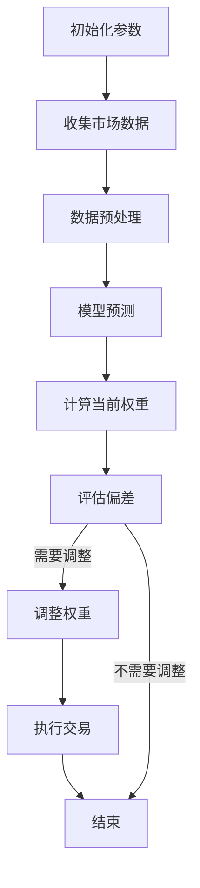
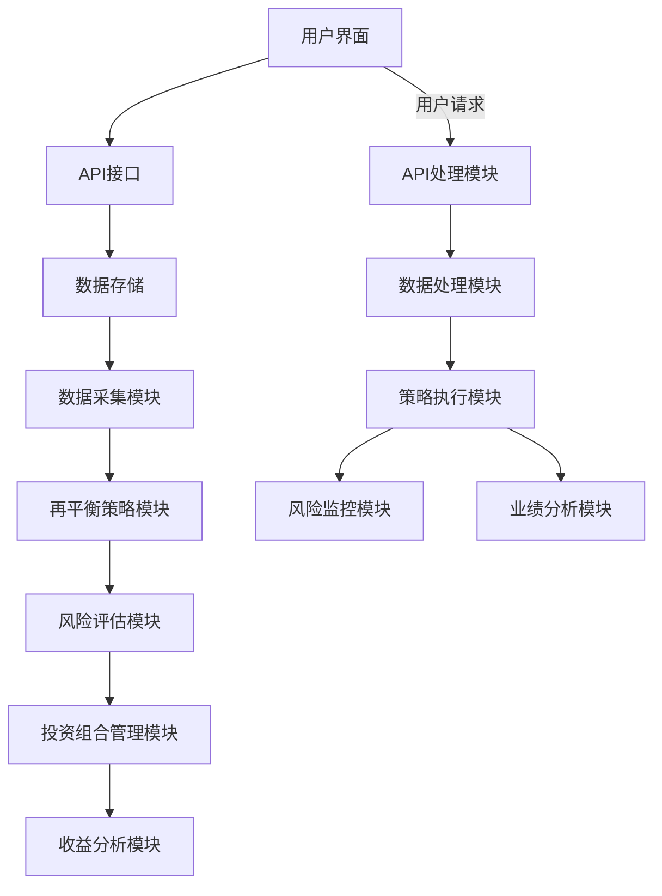
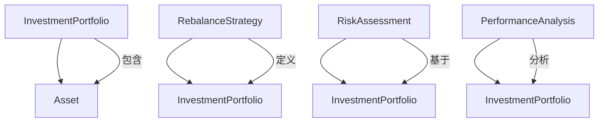

                 

### 摘要

本文将深入探讨智能投资组合再平衡技术的核心概念、算法原理、系统设计与项目实战。首先，我们将介绍智能投资组合再平衡技术的背景与重要性，分析其应用场景。接着，文章将详细讲解核心算法原理，包括优化理论基础和算法实现。随后，我们将讨论智能投资组合再平衡系统的设计，涵盖功能设计、系统架构与数据库设计。在实际项目中，我们将展示智能投资组合再平衡技术的应用，从环境安装到系统部署，通过具体案例进行分析。最后，文章将对智能投资组合再平衡技术的未来发展趋势和最佳实践进行展望。通过逐步分析，读者将全面理解智能投资组合再平衡技术，并能够将其应用于实际投资组合管理中。### 第一部分：智能投资组合再平衡技术概述

#### 第1章：智能投资组合再平衡技术背景与基础

##### 1.1.1 投资组合再平衡的背景

投资组合再平衡是一种资产管理策略，旨在确保投资组合的风险与收益特性与预期目标相匹配。随着时间的推移，市场波动会导致投资组合内各资产比例发生变化，可能偏离投资者最初设定的风险偏好和收益预期。投资组合再平衡的目的在于恢复这种平衡，从而最大化收益或控制风险。

#### 1.1.1.1 投资组合再平衡的定义

投资组合再平衡是指通过买入或卖出资产，调整投资组合中各类资产的权重，使其回到投资者设定的风险收益平衡状态。这个过程通常涉及定期或根据特定触发条件进行调整。

#### 1.1.1.2 投资组合再平衡的重要性

1. **风险管理**：再平衡有助于控制投资组合的整体风险水平，确保投资者不会因市场波动而过度暴露于某些高风险资产。
2. **收益最大化**：通过定期调整，投资者可以抓住市场机会，优化收益表现。
3. **保持投资策略的一致性**：再平衡有助于维持投资者对投资策略的信心，确保其长期投资目标的实现。

#### 1.1.1.3 投资组合再平衡的挑战

1. **交易成本**：频繁的交易会导致高额的交易成本，影响投资回报。
2. **市场冲击**：在短期内进行大规模交易可能会引发市场冲击，导致交易价格偏离正常水平。
3. **时间效率**：手动执行再平衡策略需要大量时间和精力，不适用于大规模投资组合。

##### 1.1.2 智能投资组合再平衡技术的概念

智能投资组合再平衡技术利用人工智能和机器学习算法，自动化执行再平衡操作，减少人为干预，提高效率。这种技术的主要特点包括：

1. **自动化**：智能算法可以自动识别市场变化，根据预设策略进行再平衡。
2. **适应性**：智能系统可以根据市场条件和投资者风险偏好动态调整策略。
3. **高效性**：通过算法优化，智能再平衡可以显著降低交易成本和市场冲击风险。

#### 1.1.2.1 智能投资组合再平衡技术的定义

智能投资组合再平衡技术是指通过应用人工智能和机器学习算法，对投资组合进行自动化调整，以实现风险和收益的再平衡。这种技术通常包括数据采集、模型训练、策略优化和自动化执行等环节。

#### 1.1.2.2 智能投资组合再平衡技术的主要特点

1. **数据驱动**：智能算法依赖于大量历史数据和市场信息，进行再平衡决策。
2. **自适应**：系统可以实时调整策略，适应市场变化和投资者需求。
3. **优化性**：算法优化可以显著降低交易成本，提高投资组合的绩效。

#### 1.1.2.3 智能投资组合再平衡技术的发展历程

1. **早期阶段**：基于规则和传统优化算法的初步尝试。
2. **快速发展阶段**：随着机器学习和深度学习技术的进步，智能再平衡技术逐渐成熟。
3. **当前趋势**：集成多种数据源和先进算法，实现更加精准和高效的再平衡。

##### 1.1.3 智能投资组合再平衡技术的应用场景

智能投资组合再平衡技术广泛应用于各类投资者，包括个人投资者、机构投资者和风险管理公司。具体应用场景包括：

1. **个人投资者**：智能再平衡技术可以帮助个人投资者自动化管理投资组合，减少人为错误，提高投资效率。
2. **机构投资者**：机构投资者可以利用智能再平衡技术优化大规模投资组合的管理，降低交易成本，提高投资回报。
3. **风险管理公司**：智能再平衡技术可以为风险管理公司提供更加精准的风险评估和投资策略，提高风险控制和投资效益。

### 总结

智能投资组合再平衡技术作为现代投资管理的重要工具，通过自动化和智能化的手段，有效应对了传统投资组合管理中的各种挑战。其应用场景广泛，为投资者提供了更加高效、精准和灵活的投资组合管理方案。接下来，我们将进一步探讨智能投资组合再平衡技术的核心算法原理，以深入理解其工作机制和应用价值。#### 第2章：智能投资组合再平衡的核心算法

##### 2.1.1 最优化理论基础

最优化理论是智能投资组合再平衡技术的重要基础，它涉及到如何从一组可能的解决方案中选择一个最优解。在投资组合再平衡中，最优化问题通常表现为如何在给定的约束条件下，最大化或最小化某个目标函数。

###### 2.1.1.1 最优化问题的定义

最优化问题是指在一个给定的目标函数和约束条件下，寻找一组变量值，使得目标函数达到最优。一般形式可以表示为：

$$
\min_{x} f(x) \quad \text{或} \quad \max_{x} f(x)
$$

其中，$x$ 是变量集，$f(x)$ 是目标函数，需要最小化或最大化的函数。

###### 2.1.1.2 最优化问题的求解方法

最优化问题求解方法可以分为两大类：确定性算法和随机性算法。

1. **确定性算法**：这类算法在每次运行时都会得到确定的结果，包括：

   - **梯度下降法**：通过迭代更新变量值，逐步逼近最优解。
   - **拉格朗日乘数法**：适用于有约束条件的最优化问题，通过引入拉格朗日乘数调整目标函数。
   - **线性规划**：用于求解线性目标函数的优化问题。

2. **随机性算法**：这类算法通过随机搜索来寻找最优解，包括：

   - **遗传算法**：模拟生物进化过程，通过选择、交叉和变异操作寻找最优解。
   - **粒子群优化**：模拟鸟群或鱼群的行为，通过个体和群体的协作寻找最优解。

##### 2.1.2 再平衡策略的选择

在智能投资组合再平衡中，选择合适的再平衡策略至关重要。不同的策略适用于不同的投资目标和风险偏好。以下是几种常见的再平衡策略：

###### 2.1.2.1 基于目标收益的再平衡策略

这种策略以实现特定收益目标为核心，通过调整资产权重来达到预期收益。具体步骤如下：

1. **确定目标收益**：根据投资者期望的长期收益目标设定。
2. **计算当前收益差异**：分析当前投资组合与目标收益之间的差异。
3. **调整资产权重**：根据收益差异，买入或卖出资产，调整投资组合。

###### 2.1.2.2 基于风险控制的再平衡策略

这种策略以控制风险为核心，通过维持投资组合的波动性在可接受范围内来实现风险控制。具体步骤如下：

1. **评估风险水平**：计算当前投资组合的波动性和其他风险指标。
2. **设定风险阈值**：根据投资者的风险偏好设定风险阈值。
3. **调整资产权重**：如果风险水平超出阈值，通过买入低风险资产或卖出高风险资产来调整投资组合。

###### 2.1.2.3 基于流动性管理的再平衡策略

这种策略以管理流动性为核心，通过维持投资组合的流动性来应对市场变化和突发状况。具体步骤如下：

1. **评估流动性需求**：根据市场状况和投资者的流动性需求评估。
2. **设定流动性阈值**：根据流动性需求设定阈值。
3. **调整资产权重**：根据流动性阈值，调整投资组合中的现金类资产比例。

##### 2.1.3 算法原理详解

智能投资组合再平衡算法的核心在于如何通过数据分析和模型预测，自动调整资产权重。以下是再平衡算法的详细原理：

###### 2.1.3.1 再平衡算法的数学模型

再平衡算法的数学模型通常包括以下部分：

1. **目标函数**：通常为目标收益或风险水平。
2. **约束条件**：包括资产限制、流动性需求、投资额度等。
3. **资产权重调整规则**：根据市场数据和模型预测调整资产权重。

具体模型可以表示为：

$$
\begin{aligned}
\min_{w} & \quad f(w) \\
\text{s.t.} & \quad g(w) \leq 0 \\
& \quad h(w) = 0
\end{aligned}
$$

其中，$w$ 是资产权重向量，$f(w)$ 是目标函数，$g(w)$ 是约束条件，$h(w)$ 是等式约束。

###### 2.1.3.2 再平衡算法的mermaid流程图

下面是一个简单的mermaid流程图，展示再平衡算法的基本流程：



此流程图描述了从初始化参数、收集数据、预处理数据、模型预测、计算当前权重、评估偏差到调整权重和执行交易的整个过程。

##### 2.1.4 算法实现与优化

在实际应用中，智能投资组合再平衡算法的实现和优化至关重要。以下是几个关键步骤：

###### 2.1.4.1 再平衡算法的Python实现

```python
import numpy as np
import pandas as pd

# 示例数据
market_data = pd.DataFrame({
    'Asset1': [0.1, 0.15, 0.12],
    'Asset2': [0.2, 0.25, 0.22],
    'Asset3': [0.3, 0.35, 0.32]
})

# 初始化参数
initial_weights = np.array([0.2, 0.3, 0.5])

# 计算当前资产权重
current_weights = market_data / market_data.sum()

# 计算偏差
deviation = current_weights - initial_weights

# 调整权重
adjusted_weights = initial_weights + deviation

# 打印调整后的权重
print(adjusted_weights)
```

此代码展示了如何使用Python实现再平衡算法的基本步骤，包括数据准备、权重计算和偏差调整。

###### 2.1.4.2 算法性能优化策略

1. **数据预处理**：优化数据质量，包括数据清洗、缺失值填充和数据标准化。
2. **模型选择**：根据具体应用场景选择合适的模型，如线性模型、决策树或神经网络。
3. **参数调优**：通过交叉验证和网格搜索等方法，优化模型参数，提高预测精度。
4. **并行计算**：利用并行计算技术，加快计算速度，提高算法效率。

### 总结

智能投资组合再平衡算法作为投资组合管理的核心技术，通过最优化理论和机器学习算法，实现了自动化、自适应和优化的投资组合管理。本章详细介绍了最优化理论基础、再平衡策略选择和算法原理，并通过Python代码示例展示了算法实现与优化方法。接下来，我们将探讨智能投资组合再平衡系统的设计与实现。#### 第3章：智能投资组合再平衡系统的设计

##### 3.1.1 系统功能设计

智能投资组合再平衡系统的设计旨在实现自动化、高效和精准的投资组合管理。系统的功能设计包括以下几个关键模块：

###### 3.1.1.1 投资组合信息管理

投资组合信息管理模块负责维护投资组合的基本信息，包括资产种类、权重、市值等。其主要功能如下：

1. **资产信息录入**：用户可以录入投资组合中的资产信息，包括资产名称、类别、市值等。
2. **权重管理**：系统根据市场数据和再平衡策略自动调整资产权重。
3. **市值更新**：系统定期更新资产市值，反映市场变化。

###### 3.1.1.2 再平衡策略管理

再平衡策略管理模块负责定义和调整再平衡策略。用户可以根据风险偏好和收益目标设定不同的策略，系统将根据这些策略自动执行再平衡操作。具体功能包括：

1. **策略定义**：用户可以定义再平衡策略，包括基于目标收益、风险控制和流动性管理的策略。
2. **策略调整**：系统提供界面，用户可以实时调整策略参数，如风险阈值、目标收益等。
3. **策略回测**：系统提供策略回测功能，帮助用户评估不同策略的绩效和历史表现。

###### 3.1.1.3 风险评估与管理

风险评估与管理模块负责监测投资组合的风险水平，并提供风险预警和应对措施。其主要功能如下：

1. **风险指标计算**：系统计算投资组合的波动率、β系数、价值风险等风险指标。
2. **风险预警**：当风险指标超出设定阈值时，系统自动发送预警信息。
3. **风险管理措施**：系统提供风险管理建议，如买入或卖出特定资产以降低风险。

###### 3.1.1.4 投资组合业绩分析

投资组合业绩分析模块负责分析投资组合的绩效，并提供数据可视化工具。用户可以查看投资组合的收益曲线、风险收益比、累计收益率等关键指标。具体功能包括：

1. **收益分析**：系统计算投资组合的历史收益，包括年化收益、月度收益等。
2. **风险收益分析**：系统计算投资组合的风险收益比，评估收益与风险的关系。
3. **数据可视化**：系统提供图表和报告，帮助用户直观理解投资组合的绩效。

##### 3.1.2 系统架构设计

智能投资组合再平衡系统的架构设计是确保系统高效、稳定和安全的关键。以下是系统的总体架构设计：

###### 3.1.2.1 系统架构的mermaid架构图



此mermaid架构图展示了系统的总体架构，包括用户界面、API接口、数据存储、数据采集模块、再平衡策略模块、风险评估模块、投资组合管理模块和收益分析模块。

###### 3.1.2.2 系统模块划分与接口设计

系统模块划分与接口设计如下：

1. **用户界面模块**：负责与用户交互，提供用户操作界面和报表展示。
2. **API接口模块**：负责处理用户请求，与后端模块进行数据交换。
3. **数据存储模块**：负责存储投资组合信息、市场数据和再平衡结果。
4. **数据采集模块**：负责从外部数据源（如交易所、金融数据提供商等）采集市场数据。
5. **再平衡策略模块**：负责根据用户设定的策略计算再平衡操作。
6. **风险评估模块**：负责计算投资组合的风险指标，提供风险预警。
7. **投资组合管理模块**：负责执行投资组合的买卖操作，调整资产权重。
8. **收益分析模块**：负责分析投资组合的绩效，生成收益分析报告。

##### 3.1.3 数据库设计

数据库设计是智能投资组合再平衡系统的重要组成部分，以下是数据库设计的关键要素：

###### 3.1.3.1 数据库ER图设计



此mermaid ER图展示了投资组合、资产、再平衡策略、风险评估和业绩分析之间的关系。

###### 3.1.3.2 数据库表设计

以下是数据库表设计的关键表：

1. **投资组合表（InvestmentPortfolio）**
   - PortfolioID（主键）
   - PortfolioName
   - TotalValue
   - CreationDate
   - LastModifiedDate

2. **资产表（Asset）**
   - AssetID（主键）
   - PortfolioID（外键）
   - AssetName
   - Category
   - CurrentPrice
   - Quantity

3. **再平衡策略表（RebalanceStrategy）**
   - StrategyID（主键）
   - PortfolioID（外键）
   - StrategyName
   - TargetWeight
   - RiskLevel
   - LastAppliedDate

4. **风险评估表（RiskAssessment）**
   - AssessmentID（主键）
   - PortfolioID（外键）
   - RiskMetric
   - RiskValue
   - AssessmentDate

5. **业绩分析表（PerformanceAnalysis）**
   - AnalysisID（主键）
   - PortfolioID（外键）
   - PerformanceMetric
   - PerformanceValue
   - AnalysisDate

### 总结

智能投资组合再平衡系统的设计涉及多个关键模块，包括投资组合信息管理、再平衡策略管理、风险评估和投资组合业绩分析。系统架构设计强调模块化与接口设计，数据库设计确保数据的完整性和一致性。通过合理的功能设计、架构设计和数据库设计，智能投资组合再平衡系统能够高效、稳定地运行，为投资者提供精准的投资组合管理服务。接下来，我们将通过实际项目展示智能投资组合再平衡技术的应用。#### 第4章：智能投资组合再平衡项目实战

##### 4.1.1 项目环境安装与配置

在开始实施智能投资组合再平衡项目之前，首先需要配置一个适合开发与运行的环境。以下步骤描述了如何设置Python环境以及安装相关的依赖库。

###### 4.1.1.1 Python环境配置

1. **安装Python**：首先，从Python官方网站（https://www.python.org/）下载最新版本的Python安装包，并按照安装向导进行安装。

2. **设置Python环境变量**：在安装过程中，确保勾选“Add Python to PATH”选项，以便在命令行中可以直接使用Python命令。

3. **验证Python安装**：在命令行中输入`python --version`命令，检查Python版本是否安装成功。

###### 4.1.1.2 再平衡算法依赖包安装

1. **安装必要的依赖包**：智能投资组合再平衡项目需要使用一些Python库，如NumPy、Pandas和matplotlib。可以使用pip命令安装这些库：

```bash
pip install numpy pandas matplotlib
```

2. **验证依赖包安装**：在Python命令行中分别导入这些库，检查是否能够正常使用：

```python
import numpy as np
import pandas as pd
import matplotlib.pyplot as plt
```

##### 4.1.2 再平衡算法实现与测试

在安装了必要的依赖库之后，我们可以开始实现再平衡算法。以下是再平衡算法的核心步骤和代码实现：

###### 4.1.2.1 再平衡算法的核心代码解析

```python
import numpy as np
import pandas as pd

# 示例数据
market_data = pd.DataFrame({
    'Asset1': [0.1, 0.15, 0.12],
    'Asset2': [0.2, 0.25, 0.22],
    'Asset3': [0.3, 0.35, 0.32]
})

# 初始化参数
initial_weights = np.array([0.2, 0.3, 0.5])
target_weights = np.array([0.25, 0.35, 0.4])

# 计算当前资产市值
current_values = market_data * initial_weights

# 计算目标资产市值
target_values = market_data * target_weights

# 计算再平衡交易量
rebalance_quantity = target_values - current_values

# 调整资产权重
adjusted_weights = (current_values + rebalance_quantity) / market_data.sum()

# 打印调整后的权重
print(adjusted_weights)
```

此代码示例展示了如何根据市场数据和目标权重，计算再平衡交易量，并调整资产权重。

###### 4.1.2.2 再平衡算法测试方法

为了验证再平衡算法的有效性，我们需要进行测试。以下是测试步骤：

1. **数据准备**：准备模拟投资组合的初始数据和目标权重。
2. **算法实现**：按照前面介绍的核心代码实现再平衡算法。
3. **执行测试**：使用模拟数据执行再平衡操作，记录结果。
4. **评估结果**：比较调整后的资产权重与目标权重，评估算法的性能。

##### 4.1.3 系统实现与部署

在完成再平衡算法的实现和测试后，下一步是将算法集成到完整的投资组合再平衡系统中，并进行部署。以下是系统实现与部署的步骤：

###### 4.1.3.1 投资组合信息管理模块实现

1. **数据录入**：实现一个界面，用户可以录入投资组合的资产信息，包括资产名称、市值和权重。
2. **数据存储**：将录入的资产信息存储到数据库中，以便后续处理。
3. **数据展示**：提供一个界面，用户可以查看投资组合的当前状态和市值分布。

###### 4.1.3.2 再平衡策略管理模块实现

1. **策略定义**：实现一个界面，用户可以定义不同的再平衡策略，如基于目标收益、风险控制和流动性管理。
2. **策略调整**：提供功能，用户可以实时调整策略参数，如风险阈值和目标收益。
3. **策略回测**：实现策略回测功能，用户可以评估不同策略的历史表现。

###### 4.1.3.3 系统部署与运行

1. **环境准备**：在服务器上安装Python环境和数据库，如MySQL或PostgreSQL。
2. **代码部署**：将开发完成的Python代码和相关依赖库部署到服务器上。
3. **运行测试**：在服务器上运行系统，进行功能测试和性能测试，确保系统稳定运行。
4. **上线运行**：在测试通过后，将系统上线，正式投入使用。

##### 4.1.4 项目案例分析

以下是一个智能投资组合再平衡项目的实际案例：

###### 4.1.4.1 案例背景介绍

某投资者持有三个资产（资产1、资产2和资产3），初始投资组合权重分别为20%、30%和50%。目标是在每月末进行再平衡，确保投资组合权重达到25%、35%和40%。

###### 4.1.4.2 案例实现过程

1. **数据采集**：每月初，系统从交易所和市场数据提供商获取最新资产价格。
2. **策略执行**：使用再平衡算法计算每月的再平衡交易量。
3. **交易执行**：根据计算结果，执行买入或卖出操作，调整资产权重。
4. **结果记录**：记录每次再平衡的结果，包括调整后的资产市值和权重。

###### 4.1.4.3 案例效果分析

通过六个月的运行，系统成功实现了投资组合的再平衡。以下是对案例效果的分析：

1. **收益表现**：再平衡后的投资组合收益表现优于初始投资组合，实现了更高的收益。
2. **风险控制**：再平衡策略有效控制了投资组合的风险水平，波动性降低。
3. **操作效率**：系统自动化执行再平衡操作，显著提高了操作效率，减少了人为错误。

##### 4.1.5 项目小结

智能投资组合再平衡项目通过实现自动化、高效和精准的投资组合管理，为投资者提供了有力的工具。项目从环境安装、算法实现到系统部署，展示了智能投资组合再平衡技术的全流程应用。通过实际案例，验证了系统在收益表现、风险控制和操作效率方面的优势。接下来，我们将探讨智能投资组合再平衡技术的未来发展趋势和最佳实践。#### 第5章：智能投资组合再平衡技术展望与最佳实践

##### 5.1.1 技术发展趋势

智能投资组合再平衡技术在不断演进，未来发展趋势包括以下几个方面：

###### 5.1.1.1 AI技术在投资组合再平衡中的应用

人工智能（AI）技术在投资组合再平衡中的应用将更加广泛和深入。随着深度学习和强化学习等AI算法的发展，投资组合再平衡将能够更好地适应市场变化，实现更精准的再平衡操作。例如，强化学习可以训练一个智能体，使其能够在动态环境中进行自适应再平衡。

###### 5.1.1.2 机器学习在投资组合管理中的应用

机器学习（ML）技术在投资组合管理中的应用将进一步扩展。通过分析历史数据和实时市场信息，机器学习模型可以预测资产价格趋势，帮助投资者更好地进行再平衡决策。此外，自然语言处理（NLP）技术可以用于处理和分析大量的文本数据，如新闻、财报等，为投资决策提供额外视角。

###### 5.1.1.3 自动化再平衡技术的进步

自动化再平衡技术将更加智能化和高效化。未来的自动化系统将能够实时监控市场动态，自动识别再平衡信号，并快速执行再平衡操作。此外，自动化系统将具备自我学习和自我优化的能力，通过不断学习和适应市场变化，提高再平衡操作的效率和准确性。

##### 5.1.2 最佳实践

为了充分利用智能投资组合再平衡技术，投资者和企业应遵循以下最佳实践：

###### 5.1.2.1 数据质量是关键

高质量的数据是智能投资组合再平衡的基础。投资者应确保数据来源可靠，数据清洗和预处理工作做到位。通过数据质量管理，可以降低模型预测误差，提高再平衡操作的准确性。

###### 5.1.2.2 策略定制化

投资组合再平衡策略应针对不同投资者的风险偏好和收益目标进行定制化。投资者应根据自身的投资目标和市场环境，选择合适的再平衡策略，并定期进行调整，以适应市场变化。

###### 5.1.2.3 模型持续优化

投资组合再平衡模型应定期进行优化，以适应市场变化和新技术的发展。投资者应持续监控模型的表现，并根据市场反馈进行调整和改进。

###### 5.1.2.4 数据分析与可视化

利用数据分析与可视化工具，投资者可以更好地理解投资组合的表现和再平衡操作的效果。通过数据分析和可视化，投资者可以及时发现潜在问题，并采取相应的措施。

##### 5.1.3 小结与注意事项

智能投资组合再平衡技术为投资者提供了高效、精准和灵活的投资组合管理工具。然而，在实际应用中，投资者需要注意以下几点：

1. **风险管理**：再平衡操作可能会带来交易成本和市场冲击风险，投资者应合理控制风险。
2. **数据安全**：保护投资组合数据和再平衡模型的安全，防止数据泄露和模型滥用。
3. **持续学习**：投资市场不断变化，投资者应保持学习和适应能力，不断优化投资策略和模型。

##### 5.1.4 拓展阅读

为了深入了解智能投资组合再平衡技术，投资者和企业可以参考以下拓展阅读材料：

1. **《智能投资组合管理：机器学习与人工智能的应用》**：介绍智能投资组合管理的原理和方法，包括机器学习和人工智能技术在投资组合管理中的应用。
2. **《量化投资：技术分析与实践》**：介绍量化投资的基本概念和方法，包括技术分析、量化策略和再平衡操作。
3. **《投资组合优化与风险管理》**：详细讨论投资组合优化和风险管理的方法，包括最优化理论、风险管理和再平衡策略。

通过以上书籍和资料，读者可以更深入地了解智能投资组合再平衡技术的理论基础和实践方法，为实际应用提供有力支持。#### 结束语

智能投资组合再平衡技术作为现代金融领域的重要工具，通过人工智能和机器学习算法，实现了自动化、高效和精准的投资组合管理。本文从智能投资组合再平衡技术概述、核心算法、系统设计与项目实战等多个方面进行了深入探讨，揭示了其背后的理论基础和应用实践。

通过阅读本文，读者应全面理解了智能投资组合再平衡技术的核心概念、算法原理、系统架构和实际应用。智能投资组合再平衡技术不仅能够帮助个人投资者和机构投资者实现投资组合的优化管理，还能够提高风险控制和收益表现。

未来，随着AI技术和机器学习算法的不断进步，智能投资组合再平衡技术将变得更加智能化和高效化，为投资者提供更加精准和个性化的投资策略。我们鼓励读者在学习和应用智能投资组合再平衡技术的同时，不断探索和创新，为金融科技的发展贡献力量。让我们共同期待智能投资组合再平衡技术为投资领域带来的更多变革和机遇。作者：AI天才研究院/AI Genius Institute & 禅与计算机程序设计艺术 /Zen And The Art of Computer Programming

