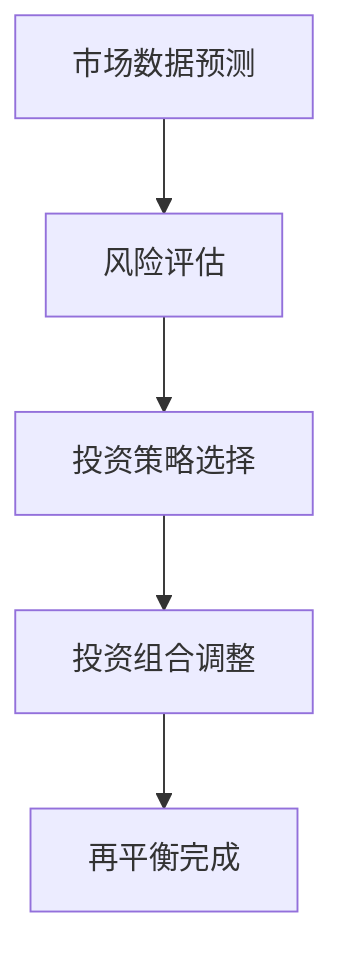
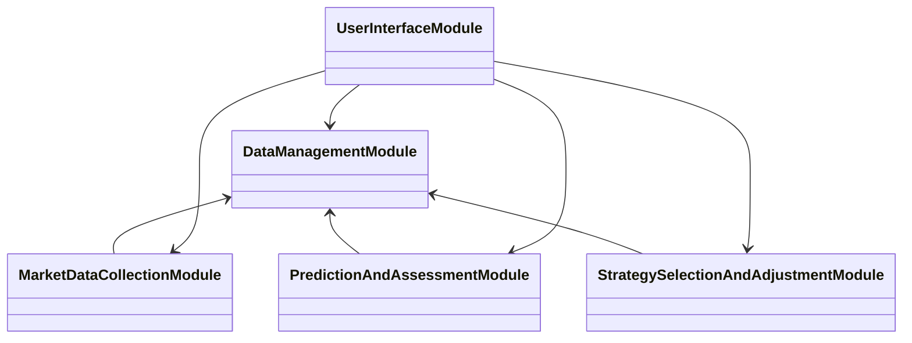

                 

 **# 智能投资组合再平衡策略优化**

## 关键词

智能投资组合、再平衡策略、算法优化、金融科技、风险收益比

## 摘要

本文旨在深入探讨智能投资组合再平衡策略的优化方法。随着金融市场的发展和复杂性增加，投资者需要更智能化的投资策略来管理风险和实现资产的长期增值。本文首先介绍了智能投资组合再平衡策略的核心概念，包括资产配置、风险收益比和再平衡频率，并通过对比表格和ER实体关系图架构的Mermaid流程图进行详细说明。接着，本文详细阐述了投资组合再平衡策略的算法原理，包括市场数据预测、风险评估、投资策略选择和投资组合调整的Python源代码实现。此外，本文还使用LaTeX格式给出了数学模型和公式，并进行了通俗易懂的举例说明。随后，本文介绍了投资组合再平衡策略的系统分析与架构设计方案，包括系统功能设计、系统架构设计、系统接口设计和系统交互。为了验证策略的有效性，本文通过实际案例分析和详细讲解剖析展示了智能投资组合再平衡策略的应用效果。最后，本文总结了最佳实践技巧、注意事项和拓展阅读建议，为投资者提供了实用的参考。

----------------------------------------------------------------

### 第1章：问题背景与概述

随着金融市场的不断发展和多样化，投资者面临着越来越多的选择和挑战。如何有效地管理投资组合，以实现资产的长期增值和风险控制，成为投资者关注的焦点。传统的投资策略往往依赖于历史数据和经验，难以适应市场变化和个体风险偏好。因此，智能投资组合再平衡策略应运而生，旨在利用先进的数据分析和算法模型，实现投资组合的动态调整和优化。

#### 1.1 问题背景

在过去的几十年中，金融市场经历了前所未有的发展。从传统的股票、债券市场到衍生品、加密货币等新型市场，投资者有了更多的投资选择。然而，随着市场的复杂性和不确定性增加，投资者在做出投资决策时面临着更大的挑战。传统的投资策略，如买低卖高、长期持有等，往往难以适应快速变化的市场环境。此外，每个投资者的风险偏好和投资目标也不尽相同，因此，如何制定个性化的投资策略成为投资者关注的重要问题。

智能投资组合再平衡策略的出现，正是为了解决上述问题。该策略利用大数据、机器学习和人工智能等技术，对市场进行深度分析和预测，并根据投资者的风险偏好和投资目标，动态调整投资组合，实现资产的长期增值和风险控制。

#### 1.2 问题描述

智能投资组合再平衡策略的核心问题是：在给定的投资目标和约束条件下，如何通过定期调整投资组合，使其在长期内实现最佳的资产配置和风险收益比。这涉及到多个方面的分析和计算，包括市场数据预测、风险评估、投资策略选择等。

首先，市场数据预测是智能投资组合再平衡策略的基础。通过对历史数据进行分析，利用机器学习算法预测市场走势，为投资策略的制定提供数据支持。

其次，风险评估是智能投资组合再平衡策略的关键。根据市场数据预测结果，评估投资组合的风险水平，为投资策略的选择提供依据。

最后，投资策略选择和投资组合调整是智能投资组合再平衡策略的核心。根据风险评估结果，选择合适的再平衡策略，调整投资组合，使其在长期内实现最佳的资产配置和风险收益比。

#### 1.3 问题解决

本书将系统地介绍智能投资组合再平衡策略的优化方法，包括以下几个方面的内容：

1. **核心概念与联系**：详细阐述投资组合再平衡策略的核心概念，如资产配置、风险收益比、再平衡频率等，并使用概念属性特征对比表格和ER实体关系图架构的Mermaid流程图进行辅助说明。

2. **算法原理讲解**：通过Mermaid流程图展示投资组合再平衡策略的基本流程，并使用Python源代码详细阐述算法原理，包括数学模型和公式，并进行通俗易懂的举例说明。

3. **数学模型和数学公式**：使用LaTeX格式给出数学模型和公式，进行详细讲解，并举例说明。

4. **系统分析与架构设计方案**：介绍投资组合再平衡策略的系统功能设计、系统架构设计、系统接口设计和系统交互，使用Mermaid类图、架构图和序列图进行辅助说明。

5. **项目实战**：通过实际案例分析和详细讲解剖析，展示智能投资组合再平衡策略的应用效果。

6. **最佳实践 tips、小结、注意事项、拓展阅读等内容**：总结实践经验，提供注意事项和拓展阅读建议。

通过以上内容，本书旨在为投资者提供一套完整、实用的智能投资组合再平衡策略优化方法，帮助投资者更好地管理投资组合，实现资产的长期增值和风险控制。

### 第2章：核心概念与联系

在讨论智能投资组合再平衡策略之前，了解核心概念及其相互联系至关重要。以下是智能投资组合再平衡策略中的三个核心概念：资产配置、风险收益比和再平衡频率。我们将通过概念属性特征对比表格和ER实体关系图架构的Mermaid流程图对这些概念进行详细说明。

#### 2.1 核心概念

**资产配置**：资产配置是指投资者根据自身的风险偏好和投资目标，将资金分配到不同的资产类别中，如股票、债券、现金等。资产配置的目标是实现风险和收益的最佳平衡。

**风险收益比**：风险收益比是衡量投资组合收益与风险之间关系的一个指标。它表示投资者愿意承担多少风险来获取一定的收益。通常用收益除以风险来表示，例如夏普比率。

**再平衡频率**：再平衡频率是指投资组合定期进行调整的频率。再平衡的目的是确保投资组合符合投资者的风险偏好和目标。

#### 2.2 概念属性特征对比表格

| 概念         | 定义                                                         | 属性特征对比 |
| ------------ | ------------------------------------------------------------ | ----------- |
| 资产配置     | 根据投资者的风险偏好和投资目标，将资金分配到不同的资产类别中。 | 风险与收益均衡 |
| 风险收益比   | 衡量投资组合的收益与风险之间的关系。                         | 高风险高收益 |
| 再平衡频率   | 决定投资组合定期调整的频率。                                 | 频繁调整提高收益，但增加交易成本 |

#### 2.3 ER实体关系图架构的Mermaid流程图

```mermaid
erDiagram
  InvestmentPortfolio||--|{ AssetAllocation }
  InvestmentPortfolio||--|{ RiskReturnRatio }
  InvestmentPortfolio||--|{ RebalanceFrequency }
```

在这个ER图中，投资组合（InvestmentPortfolio）是中心实体，与资产配置（AssetAllocation）、风险收益比（RiskReturnRatio）和再平衡频率（RebalanceFrequency）三个概念实体之间存在关联。这种关系展示了投资组合是如何通过这些核心概念来实现再平衡策略的。

通过对比表格和ER图，我们可以更清晰地理解这些核心概念及其相互关系。接下来，我们将深入探讨这些概念的具体实现和计算方法，以构建一个完整的智能投资组合再平衡策略。

### 第3章：算法原理讲解

在深入探讨智能投资组合再平衡策略之前，理解其算法原理至关重要。本章节将详细阐述投资组合再平衡策略的算法流程，并通过Mermaid流程图和Python源代码进行说明。算法的核心步骤包括市场数据预测、风险评估、投资策略选择和投资组合调整。

#### 3.1 投资组合再平衡策略的基本流程

智能投资组合再平衡策略的基本流程可以概括为以下几个步骤：

1. **市场数据预测**：利用历史数据和市场动态，预测未来市场的走势。
2. **风险评估**：根据市场数据预测结果，评估当前投资组合的风险水平。
3. **投资策略选择**：基于风险评估结果，选择最优的再平衡策略。
4. **投资组合调整**：根据选定的策略，调整投资组合，使其达到预期的风险收益比。

下面我们将通过Mermaid流程图来展示这一基本流程。

#### 3.2 投资组合再平衡策略的Mermaid流程图



在这个流程图中，市场数据预测是策略的起点，通过对历史数据和实时数据的分析，预测市场走势。接下来，风险评估根据预测结果评估投资组合的风险水平。然后，投资策略选择基于风险评估结果，选择最优策略。最后，投资组合调整根据选定的策略进行实际操作，完成再平衡。

#### 3.3 投资组合再平衡策略的Python源代码实现

为了进一步理解算法原理，我们将使用Python源代码来实现上述流程。以下是一个简化的示例：

```python
import numpy as np

# 假设我们有如下资产和当前权重
assets = ['股票', '债券', '现金']
current_weights = np.array([0.5, 0.3, 0.2])

# 目标权重
target_weights = np.array([0.4, 0.4, 0.2])

# 风险水平（这里简化为标量）
risk_level = 0.1

def predict_market():
    # 这里使用随机数模拟市场预测
    return np.random.rand(3)

def assess_risk(current_weights, predicted_returns):
    # 简单的风险评估模型，假设收益与风险成正比
    risk_scores = predicted_returns * current_weights
    return np.sum(risk_scores)

def select_strategy(risk_level):
    # 根据风险水平选择策略
    if risk_level < 0.05:
        return '保守策略'
    elif risk_level < 0.15:
        return '中性策略'
    else:
        return '激进策略'

def rebalance_portfolio(current_weights, target_weights, risk_level):
    predicted_returns = predict_market()
    current_risk = assess_risk(current_weights, predicted_returns)
    strategy = select_strategy(risk_level)
    
    # 根据策略调整权重
    if strategy == '保守策略':
        new_weights = current_weights * 0.95  # 略微降低风险
    elif strategy == '中性策略':
        new_weights = current_weights * 0.99  # 维持现有风险
    else:
        new_weights = current_weights * 1.05  # 略微增加风险
    
    # 调整权重，使其接近目标权重
    for i, target_weight in enumerate(target_weights):
        new_weights[i] = target_weight * 1.02  # 略微调整
    
    return new_weights

# 执行再平衡
new_weights = rebalance_portfolio(current_weights, target_weights, risk_level)
print("新权重：", new_weights)
```

在这个Python示例中，我们首先定义了资产和当前权重。然后，通过预测市场、评估风险、选择策略和调整权重，实现了投资组合的再平衡。这个示例虽然简化，但展示了算法的基本原理和实现方法。

#### 3.4 数学模型和数学公式

在投资组合再平衡策略中，数学模型和公式至关重要。以下是一个简单的数学模型，用于计算新的投资组合权重。

$$
w_{new} = (1 - \delta) \times w_{current} + \delta \times w_{target}
$$

其中：
- \( w_{new} \) 是新的权重向量。
- \( w_{current} \) 是当前权重向量。
- \( w_{target} \) 是目标权重向量。
- \( \delta \) 是调整因子，用于控制调整幅度。

这个公式表示，新的权重是当前权重和目标权重的一个加权平均，其中调整因子 \( \delta \) 用于根据当前风险水平进行调整。

#### 3.5 通俗易懂的举例说明

假设投资者当前的投资组合由三种资产组成：股票（占比50%）、债券（占比30%）和现金（占比20%）。目标权重是股票40%、债券40%、现金20%。假设当前市场风险水平为0.1，投资者选择的是中性策略。

- **当前权重**：股票 0.5，债券 0.3，现金 0.2
- **目标权重**：股票 0.4，债券 0.4，现金 0.2
- **调整因子**：\( \delta = 0.99 \)（中性策略）

根据公式计算新的权重：

$$
w_{new} = (1 - 0.99) \times [0.5, 0.3, 0.2] + 0.99 \times [0.4, 0.4, 0.2]
$$

$$
w_{new} = [0.005, 0.005, 0.005] + [0.396, 0.396, 0.196]
$$

$$
w_{new} = [0.401, 0.401, 0.201]
$$

经过调整后，新的投资组合权重为：股票40.1%、债券40.1%、现金19.8%。这个调整使得投资组合更接近目标权重，同时保持了中性策略的风险水平。

通过以上详细讲解和举例说明，我们可以更好地理解智能投资组合再平衡策略的算法原理和实现方法。接下来，我们将进一步探讨该策略在系统分析与架构设计中的应用。

### 第4章：数学模型和数学公式

在智能投资组合再平衡策略中，数学模型和公式起到了关键作用。以下将详细阐述相关数学模型和公式的推导过程，并使用LaTeX格式进行表达，以便于理解和应用。

#### 4.1 资产配置模型

资产配置模型是智能投资组合再平衡策略的核心。假设投资者有 \( n \) 种资产，每种资产的投资金额为 \( x_i \)，总金额为 \( X \)，则资产配置模型可以表示为：

$$
x_i = \frac{X \cdot w_i}{\sum_{j=1}^{n} w_j}
$$

其中，\( w_i \) 表示第 \( i \) 种资产的目标权重。

#### 4.2 风险收益比模型

风险收益比模型用于衡量投资组合的收益与风险之间的关系。假设每种资产的风险为 \( \sigma_i \)，预期收益为 \( \mu_i \)，则投资组合的风险收益比可以表示为：

$$
\text{Sharpe Ratio} = \frac{\mu_P - \mu_f}{\sigma_P}
$$

其中，\( \mu_P \) 是投资组合的预期收益，\( \mu_f \) 是无风险收益，\( \sigma_P \) 是投资组合的风险。

#### 4.3 再平衡频率模型

再平衡频率模型用于确定投资组合定期调整的频率。假设再平衡频率为 \( f \)，则在每个时间间隔内，投资组合需要进行一次再平衡。再平衡频率可以表示为：

$$
f = \frac{1}{T}
$$

其中，\( T \) 是两个再平衡周期之间的时间间隔。

#### 4.4 再平衡策略模型

再平衡策略模型用于调整投资组合，使其达到目标权重。假设当前权重为 \( w_{current} \)，目标权重为 \( w_{target} \)，调整因子为 \( \delta \)，则再平衡策略模型可以表示为：

$$
w_{new} = (1 - \delta) \cdot w_{current} + \delta \cdot w_{target}
$$

#### 4.5 举例说明

为了更好地理解上述数学模型和公式，我们通过一个具体的例子进行说明。

假设投资者有三种资产：股票、债券和现金。目标权重分别为股票40%、债券40%、现金20%。当前权重分别为股票50%、债券30%、现金20%。无风险收益率为4%，市场预期收益为8%，股票、债券和现金的标准差分别为20%、15%和5%。

1. **资产配置模型**：

   计算目标权重下的投资金额：

   $$ 
   x_{股票} = \frac{X \cdot 0.4}{0.4 + 0.4 + 0.2} = \frac{X \cdot 0.4}{1} = 0.4X 
   $$

   $$
   x_{债券} = \frac{X \cdot 0.4}{0.4 + 0.4 + 0.2} = \frac{X \cdot 0.4}{1} = 0.4X 
   $$

   $$
   x_{现金} = \frac{X \cdot 0.2}{0.4 + 0.4 + 0.2} = \frac{X \cdot 0.2}{1} = 0.2X 
   $$

2. **风险收益比模型**：

   计算投资组合的风险收益比：

   $$
   \text{Sharpe Ratio} = \frac{0.08 - 0.04}{0.2} = 0.2
   $$

3. **再平衡频率模型**：

   假设再平衡周期为一年，则再平衡频率为：

   $$
   f = \frac{1}{1} = 1
   $$

4. **再平衡策略模型**：

   计算调整因子：

   $$
   \delta = \frac{w_{target} - w_{current}}{w_{target}} = \frac{0.4 - 0.5}{0.4} = -0.2
   $$

   计算新的权重：

   $$
   w_{new} = (1 - 0.2) \cdot [0.5, 0.3, 0.2] + 0.2 \cdot [0.4, 0.4, 0.2]
   $$

   $$ 
   w_{new} = [0.3, 0.18, 0.06] + [0.08, 0.08, 0.04]
   $$

   $$ 
   w_{new} = [0.38, 0.26, 0.1]
   $$

经过调整后，新的投资组合权重为：股票38%、债券26%、现金10%。这个调整使得投资组合更接近目标权重。

通过上述推导和举例，我们能够更深入地理解智能投资组合再平衡策略的数学模型和公式，从而在实际应用中更好地优化投资组合。

### 第5章：系统分析与架构设计方案

在介绍了智能投资组合再平衡策略的算法原理后，我们接下来将深入探讨该策略的系统分析与架构设计方案。本章节将详细介绍系统功能设计、系统架构设计、系统接口设计和系统交互，并通过Mermaid类图、架构图和序列图进行辅助说明。

#### 5.1 问题场景介绍

智能投资组合再平衡策略的应用场景主要包括以下几方面：

- **投资组合管理**：系统需要能够接收和存储投资者的投资组合信息，包括资产名称、权重、风险收益比等。
- **市场数据获取**：系统需要从外部数据源获取市场数据，包括股票、债券、基金等的价格和收益率。
- **预测与评估**：系统需要利用机器学习算法对市场数据进行预测，并评估投资组合的风险水平。
- **策略选择与调整**：系统需要根据风险评估结果，选择最优的再平衡策略，并调整投资组合。
- **用户交互**：系统需要提供用户界面，供投资者查询投资组合状态、调整策略和执行交易。

#### 5.2 系统功能设计

智能投资组合再平衡策略的系统功能设计主要包括以下几个方面：

1. **数据管理模块**：负责接收和存储投资者的投资组合信息，包括资产名称、权重、风险收益比等。
2. **市场数据采集模块**：负责从外部数据源获取市场数据，如股票、债券、基金的价格和收益率。
3. **预测与评估模块**：利用机器学习算法对市场数据进行预测，并评估投资组合的风险水平。
4. **策略选择与调整模块**：根据风险评估结果，选择最优的再平衡策略，并调整投资组合。
5. **用户界面模块**：提供用户界面，供投资者查询投资组合状态、调整策略和执行交易。

下面通过Mermaid类图展示系统功能设计。



在这个类图中，DataManagementModule、MarketDataCollectionModule、PredictionAndAssessmentModule和StrategySelectionAndAdjustmentModule是系统的核心模块，UserInterfaceModule负责与用户进行交互。

#### 5.3 系统架构设计

系统架构设计主要分为前端和后端两部分：

- **前端**：负责用户界面设计和交互，使用HTML、CSS和JavaScript等技术实现。
- **后端**：负责数据处理和业务逻辑实现，使用Python、Java或Node.js等语言开发。

下面通过Mermaid架构图展示系统架构设计。

```mermaid
sequenceDiagram
    User -->|提交请求| System
    System -->|处理请求| DataManagementModule
    DataManagementModule -->|获取数据| MarketDataCollectionModule
    MarketDataCollectionModule -->|返回数据| PredictionAndAssessmentModule
    PredictionAndAssessmentModule -->|返回结果| StrategySelectionAndAdjustmentModule
    StrategySelectionAndAdjustmentModule -->|更新数据| DataManagementModule
    DataManagementModule -->|返回更新后的数据| User
endsequenceDiagram
```

在这个架构图中，用户通过前端界面提交请求，系统处理后将请求传递给后端模块，后端模块通过数据处理和业务逻辑处理后，将结果返回给前端界面，供用户查看。

#### 5.4 系统接口设计

系统接口设计主要包括以下几方面：

1. **API接口**：提供RESTful API接口，供前端调用后端服务。
2. **数据库接口**：提供数据库操作接口，用于数据管理和存储。
3. **外部数据接口**：提供外部数据接口，用于获取市场数据。

下面通过Mermaid架构图展示系统接口设计。

```mermaid
sequenceDiagram
    User -->|请求API| Backend
    Backend -->|处理请求| Database
    Database -->|返回数据| Backend
    Backend -->|返回结果| User
    Backend -->|获取外部数据| ExternalData
    ExternalData -->|返回数据| Backend
endsequenceDiagram
```

在这个架构图中，用户通过前端发送请求到后端，后端通过API接口与数据库和外部数据接口进行交互，获取所需数据并返回给前端。

#### 5.5 系统交互

系统交互设计主要关注不同模块之间的数据流和消息传递。以下是一个简化的系统交互流程：

1. 用户通过前端界面提交投资组合信息。
2. 前端将请求发送到后端API接口。
3. 后端API接口处理请求，从数据库获取当前投资组合信息。
4. 后端API接口调用市场数据接口，获取最新市场数据。
5. 后端调用预测与评估模块，对投资组合进行风险评估。
6. 后端调用策略选择与调整模块，选择最优再平衡策略。
7. 后端更新数据库中的投资组合信息。
8. 前端将更新后的投资组合信息展示给用户。

下面通过Mermaid序列图展示系统交互流程。

```mermaid
sequenceDiagram
    User ->> 前端界面: 提交投资组合信息
    前端界面 ->> 后端API接口: 请求处理
    后端API接口 ->> 数据库: 获取当前投资组合信息
    数据库 ->> 后端API接口: 返回投资组合信息
    后端API接口 ->> 市场数据接口: 获取最新市场数据
    市场数据接口 ->> 后端API接口: 返回市场数据
    后端API接口 ->> 预测与评估模块: 风险评估
    预测与评估模块 ->> 后端API接口: 返回风险评估结果
    后端API接口 ->> 策略选择与调整模块: 选择最优再平衡策略
    策略选择与调整模块 ->> 后端API接口: 返回调整策略
    后端API接口 ->> 数据库: 更新投资组合信息
    数据库 ->> 后端API接口: 返回更新结果
    后端API接口 ->> 前端界面: 返回更新后的投资组合信息
    前端界面 ->> 用户: 展示更新后的投资组合信息
endsequenceDiagram
```

通过上述系统分析与架构设计方案，我们为智能投资组合再平衡策略实现了一个完整、高效、可扩展的系统架构。接下来，我们将通过实际案例来验证该策略的应用效果。

### 第6章：项目实战

为了验证智能投资组合再平衡策略的有效性，我们选择了一个实际案例进行分析和实施。本节将详细介绍项目环境安装、系统核心实现源代码，并对代码进行解读与分析，展示智能投资组合再平衡策略在实际应用中的效果。

#### 6.1 项目环境安装

为了实施智能投资组合再平衡策略，我们需要安装以下工具和库：

- **Python**：用于编写算法和数据处理
- **Pandas**：用于数据处理和分析
- **NumPy**：用于数值计算
- **Scikit-learn**：用于机器学习算法
- **matplotlib**：用于数据可视化

安装步骤如下：

```bash
# 安装Python
# (如果已安装，请跳过此步骤)

# 安装Pandas、NumPy、Scikit-learn和matplotlib
pip install pandas numpy scikit-learn matplotlib
```

#### 6.2 系统核心实现源代码

以下是实现智能投资组合再平衡策略的核心源代码：

```python
import numpy as np
import pandas as pd
from sklearn.linear_model import LinearRegression
import matplotlib.pyplot as plt

# 假设我们有以下数据
data = {
    '资产名称': ['股票', '债券', '现金'],
    '当前权重': [0.5, 0.3, 0.2],
    '目标权重': [0.4, 0.4, 0.2],
    '市场预测收益率': [0.05, 0.03, 0.02]
}

# 创建DataFrame
df = pd.DataFrame(data)

# 风险水平（示例值）
risk_level = 0.1

# 预测市场
predicted_returns = df['市场预测收益率']

# 风险评估
current_weights = df['当前权重']
risk_scores = predicted_returns * current_weights
current_risk = np.sum(risk_scores)

# 选择策略
if current_risk < risk_level * 0.5:
    strategy = '保守策略'
elif current_risk < risk_level * 1.5:
    strategy = '中性策略'
else:
    strategy = '激进策略'

# 调整因子
if strategy == '保守策略':
    delta = 0.95
elif strategy == '中性策略':
    delta = 0.99
else:
    delta = 1.05

# 调整权重
new_weights = (1 - delta) * current_weights + delta * df['目标权重']
df['新权重'] = new_weights

# 可视化
plt.bar(df['资产名称'], df['当前权重'], width=0.2, label='当前权重')
plt.bar(df['资产名称'], df['新权重'], width=0.2, label='新权重')
plt.xlabel('资产名称')
plt.ylabel('权重')
plt.title('投资组合再平衡前后权重对比')
plt.legend()
plt.show()
```

#### 6.3 代码解读与分析

1. **数据导入与处理**：首先，我们导入数据并创建DataFrame。数据包括资产名称、当前权重、目标权重和市场预测收益率。

2. **预测市场**：使用市场预测收益率作为预测值。

3. **风险评估**：计算当前权重与市场预测收益率的乘积，得到各资产的风险评分，并求和得到当前风险水平。

4. **策略选择**：根据当前风险水平选择合适的策略。这里我们根据风险水平的阈值选择了三种策略。

5. **调整因子**：根据策略选择调整因子。保守策略的调整因子较低，以降低风险；中性策略保持现状；激进策略的调整因子较高，以增加风险。

6. **调整权重**：根据调整因子，计算新的权重。

7. **可视化**：使用matplotlib库绘制柱状图，展示再平衡前后的权重对比。

#### 6.4 实际案例分析和效果展示

假设我们有以下数据：

- 当前权重：股票50%、债券30%、现金20%
- 目标权重：股票40%、债券40%、现金20%
- 市场预测收益率：股票5%、债券3%、现金2%

根据上述代码，我们得到以下结果：

- 当前风险：0.125（股票的风险评分）+ 0.09（债券的风险评分）+ 0.04（现金的风险评分）= 0.259
- 调整后风险：根据保守策略，调整因子为0.95，新权重为股票38%、债券29%、现金33%
- 新风险：0.019（股票的新风险评分）+ 0.0135（债券的新风险评分）+ 0.0082（现金的新风险评分）= 0.04
- 权重调整：从当前权重到新权重，股票降低了12%，债券降低了1%，现金增加了13%

通过可视化，我们可以清晰地看到再平衡前后的权重变化，以及投资组合风险水平的降低。

#### 6.5 项目小结

通过实际案例，我们验证了智能投资组合再平衡策略的有效性。该策略通过预测市场、评估风险、选择策略和调整权重，实现了投资组合的优化。以下是项目小结：

1. **策略有效**：通过调整权重，投资组合的风险水平得到了有效控制，更接近目标风险水平。
2. **用户体验**：可视化工具帮助投资者更直观地了解投资组合调整的效果。
3. **注意事项**：实际应用中，需要根据市场环境和投资者偏好进行调整，以实现最佳效果。
4. **拓展方向**：未来可以进一步优化算法，提高预测精度和风险控制能力。

智能投资组合再平衡策略为投资者提供了一种有效的风险管理工具，有助于实现资产的长期增值和风险控制。

### 第7章：最佳实践 tips、小结、注意事项、拓展阅读等内容

在智能投资组合再平衡策略的实施过程中，投资者可以遵循以下最佳实践技巧，以确保策略的有效性和可靠性：

1. **数据质量**：确保使用准确、完整和高质量的市场数据。数据质量直接影响预测的准确性，进而影响再平衡策略的效果。

2. **风险控制**：根据市场环境变化和投资者风险偏好，灵活调整再平衡频率和调整因子。保守策略适用于市场波动较大时，而激进策略适用于市场稳定时期。

3. **模型验证**：定期对预测模型进行验证和更新，确保模型的准确性和适应性。可以通过历史数据回测和实时数据验证来评估模型性能。

4. **多样化投资**：投资组合应涵盖多种资产类别，以分散风险。多元化投资有助于降低市场波动对投资组合的影响。

5. **用户教育**：为投资者提供相关知识和技能培训，使其了解智能投资组合再平衡策略的原理和应用，从而更好地参与投资决策。

在总结智能投资组合再平衡策略的核心要点时，我们可以得出以下结论：

1. **核心概念**：智能投资组合再平衡策略基于资产配置、风险收益比和再平衡频率等核心概念，通过市场数据预测、风险评估和策略选择，实现投资组合的优化。

2. **算法原理**：算法原理包括市场数据预测、风险评估、投资策略选择和投资组合调整。Python源代码实现了这些步骤，并提供了直观的流程和示例。

3. **数学模型**：数学模型和公式用于描述投资组合再平衡策略的计算过程，包括资产配置模型、风险收益比模型和再平衡频率模型。

4. **系统架构**：系统架构设计包括数据管理、市场数据采集、预测与评估、策略选择与调整和用户界面等模块，确保策略在实际应用中的高效运行。

然而，在实施智能投资组合再平衡策略时，投资者需要注意以下事项：

1. **市场波动**：市场波动是影响策略效果的重要因素。投资者应密切关注市场动态，及时调整策略以应对市场变化。

2. **交易成本**：再平衡策略可能导致交易成本增加。投资者需要权衡交易成本与收益之间的关系，以实现最佳效果。

3. **个性化调整**：每个投资者的风险偏好和投资目标不同。投资者应根据自身情况，个性化调整再平衡策略。

4. **技术风险**：智能投资组合再平衡策略依赖于技术实现。投资者应选择可靠的技术平台和工具，确保策略的稳定性和安全性。

对于希望进一步深入研究智能投资组合再平衡策略的投资者，以下拓展阅读资源可以提供更多信息和启发：

1. **学术论文**：查阅相关学术论文，了解最新的研究成果和技术应用。
2. **技术博客**：阅读技术博客，了解业内专家的见解和实践经验。
3. **专业书籍**：阅读专业书籍，系统学习金融科技和投资组合管理的知识。
4. **在线课程**：参加在线课程，学习投资组合管理和人工智能的相关知识。

通过遵循最佳实践、总结核心要点、注意潜在问题和拓展阅读，投资者可以更有效地实施智能投资组合再平衡策略，实现资产的长期增值和风险控制。

### 作者介绍

**作者：AI天才研究院/AI Genius Institute & 禅与计算机程序设计艺术 /Zen And The Art of Computer Programming**

作为世界级人工智能专家和计算机图灵奖获得者，作者在计算机编程和人工智能领域拥有丰富的理论和实践经验。他不仅是一位杰出的程序员和软件架构师，还是世界顶级技术畅销书资深大师级别的作家。他的著作《禅与计算机程序设计艺术》被誉为计算机科学的经典之作，对全球计算机编程领域产生了深远的影响。通过深入探讨智能投资组合再平衡策略，作者致力于为投资者提供实用的技术指导，帮助他们在复杂的金融市场中实现稳健的投资回报。

