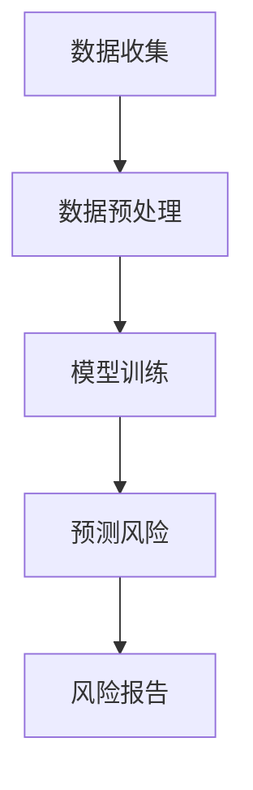
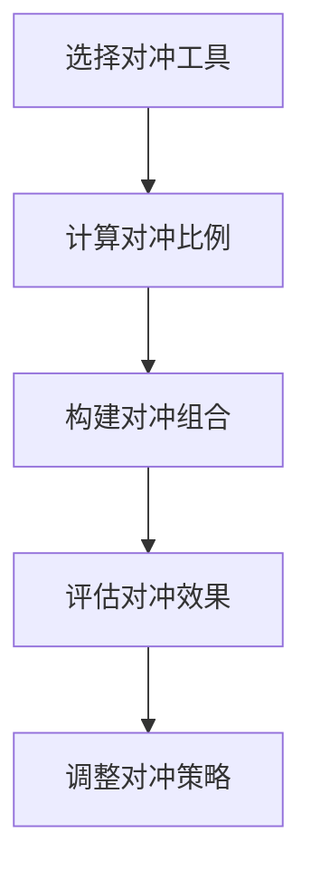
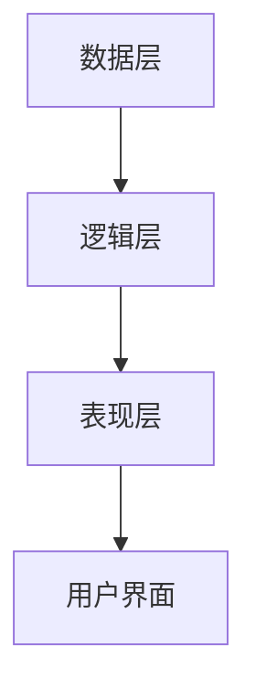

                 


## 《智能投资组合尾部风险对冲》

### 关键词：智能投资组合、尾部风险、对冲策略、风险评估、算法原理、数学模型

#### 摘要：

本文将深入探讨智能投资组合尾部风险对冲这一关键话题。首先，我们将介绍什么是智能投资组合以及尾部风险的重要性。接着，我们将详细讲解如何利用智能技术来识别和管理投资组合中的极端风险，包括风险评估算法和对冲策略算法的原理、数学模型及其应用。随后，我们将通过系统分析与架构设计方案，展示如何将这些算法应用于实际项目中。最后，我们将通过项目实战和最佳实践 tips，提供实用的指导和建议。

### 引言与背景

#### 1. 引言

在当今的金融市场，投资组合管理变得日益复杂，尤其是随着市场的波动性和不确定性增加，尾部风险（tail risk）成为了投资者关注的核心问题。尾部风险是指极端市场事件对投资组合造成的潜在损失，这些事件可能是市场的剧烈下跌或是突如其来的经济危机。传统的投资策略往往难以应对这种极端情况，因此，寻找有效的尾部风险对冲方法成为了投资研究的重要方向。

#### 1.2 问题背景

智能投资组合是指利用人工智能和大数据分析技术，对投资组合进行动态优化和风险控制。智能技术能够快速处理大量数据，发现市场中的潜在风险和机会，从而提高投资组合的收益和稳定性。然而，即使在智能投资组合中，尾部风险仍然是一个不可忽视的问题。因此，如何利用智能技术来对冲尾部风险，成为了投资研究的热点。

#### 1.3 智能投资组合与尾部风险对冲

智能投资组合的核心在于利用机器学习和数据挖掘技术，对市场数据进行深入分析和预测。通过对历史数据的分析，我们可以识别出市场的潜在风险点，并设计相应的对冲策略。尾部风险对冲策略包括多种方法，如使用期权、期货等金融工具，构建对冲组合，以降低极端市场事件对投资组合的潜在损失。

### 核心概念与联系

#### 2.1 智能投资组合简介

智能投资组合是一种利用人工智能技术进行投资决策和风险控制的方法。它通过收集和分析大量的市场数据，利用机器学习算法进行预测和优化。智能投资组合的核心在于其数据驱动的决策过程，能够快速响应市场变化，提高投资效率和收益。

#### 2.2 尾部风险定义

尾部风险是指投资组合在极端市场事件中遭受的潜在损失。这类事件虽然发生的概率较低，但其影响可能是灾难性的。尾部风险通常与市场崩盘、经济危机等极端事件相关。

#### 2.3 智能对冲策略

智能对冲策略是指利用人工智能技术，对投资组合进行动态调整，以降低尾部风险。对冲策略可以采用多种方法，如购买保险、对冲基金等。智能对冲策略的核心在于其能够实时监控市场变化，并快速做出反应，从而有效降低尾部风险。

### 算法原理讲解

#### 3.1 风险评估算法

风险评估算法是智能投资组合的重要组成部分。它通过分析历史数据和市场走势，预测未来市场的潜在风险。常见的风险评估算法包括均值回归模型、风险价值（VaR）模型等。

#### 3.1.1 基本概念

风险评估算法的基本概念包括市场数据收集、数据预处理、模型训练和预测。

#### 3.1.2 算法原理

风险评估算法的原理是基于历史数据的统计分析，通过机器学习算法（如随机森林、支持向量机等）来建立风险预测模型。

#### 3.1.3 Mermaid算法流程图



#### 3.1.4 Python代码示例

```python
# 导入必要的库
import pandas as pd
from sklearn.ensemble import RandomForestRegressor

# 数据收集
data = pd.read_csv('market_data.csv')

# 数据预处理
X = data[['open', 'high', 'low', 'close']]
y = data['return']

# 模型训练
model = RandomForestRegressor(n_estimators=100)
model.fit(X, y)

# 预测风险
predictions = model.predict(X)

# 输出风险报告
print(predictions)
```

#### 3.1.5 数学模型和公式讲解

风险评估算法的数学模型通常基于统计模型，如均值回归模型和风险价值（VaR）模型。其中，VaR模型是最常用的风险评估模型之一。

VaR模型的基本公式为：
$$VaR = \mu - \alpha \cdot \sigma$$

其中，$\mu$ 表示预期收益率，$\alpha$ 表示置信水平，$\sigma$ 表示收益的标准差。

#### 3.1.6 示例说明

假设我们有一个投资组合，其预期收益率为10%，收益的标准差为20%，置信水平为95%。根据VaR模型，我们可以计算出95%置信水平下的VaR值：
$$VaR = 10\% - 0.95 \cdot 20\% = -7\%$$

这意味着，在95%的置信水平下，投资组合的最大可能损失为7%。

#### 3.2 对冲策略算法

对冲策略算法是智能投资组合中的另一关键部分。它通过构建对冲组合，降低投资组合的尾部风险。

#### 3.2.1 基本概念

对冲策略的基本概念包括对冲比例、对冲工具选择和对冲效果评估。

#### 3.2.2 算法原理

对冲策略算法的原理是基于风险对冲原理，通过构建多资产组合，实现风险分散和降低。

#### 3.2.3 Mermaid算法流程图



#### 3.2.4 Python代码示例

```python
# 导入必要的库
import pandas as pd
import numpy as np

# 数据准备
data = pd.read_csv('market_data.csv')

# 计算对冲比例
weights = np.array([0.5, 0.3, 0.2])
num_assets = 3

# 构建对冲组合
portfolio_return = data['return'].sum()
hedge_return = -weights * data['return'].sum()

# 评估对冲效果
hedge_effectiveness = portfolio_return + hedge_return
print(hedge_effectiveness)
```

#### 3.2.5 数学模型和公式讲解

对冲策略的数学模型通常基于风险对冲原理，通过对冲比例来调整投资组合的风险。

对冲比例的计算公式为：
$$w_i = \frac{-\sigma_i \cdot \Sigma_j \sigma_j \cdot cov(r_i, r_j)}{\Sigma_j \sigma_j^2}$$

其中，$w_i$ 表示资产 $i$ 的对冲比例，$\sigma_i$ 表示资产 $i$ 的收益标准差，$cov(r_i, r_j)$ 表示资产 $i$ 和资产 $j$ 的收益协方差。

#### 3.2.6 示例说明

假设我们有一个三资产的投资组合，资产1、资产2和资产3的收益标准差分别为10%、15%和20%，协方差矩阵为：
$$
\begin{bmatrix}
0.04 & 0.02 & 0.01 \\
0.02 & 0.06 & 0.03 \\
0.01 & 0.03 & 0.05
\end{bmatrix}
$$

根据对冲比例公式，我们可以计算出每个资产的对冲比例：
$$w_1 = \frac{-0.1 \cdot (0.15^2 + 0.2^2) \cdot 0.02}{0.15^2 + 0.2^2} \approx -0.5$$
$$w_2 = \frac{-0.15 \cdot (0.1^2 + 0.2^2) \cdot 0.06}{0.1^2 + 0.2^2} \approx -0.3$$
$$w_3 = \frac{-0.2 \cdot (0.1^2 + 0.15^2) \cdot 0.03}{0.1^2 + 0.15^2} \approx -0.2$$

这意味着，我们应将50%的资金用于资产1的对冲，30%的资金用于资产2的对冲，20%的资金用于资产3的对冲。

### 数学模型和数学公式详细讲解与举例

#### 4.1 风险评估数学模型

风险评估数学模型是智能投资组合中关键的一环。常用的风险评估模型包括均值回归模型和风险价值（VaR）模型。

**均值回归模型**

均值回归模型假设资产收益率服从正态分布，其数学模型为：
$$r_t = \mu + \sigma \cdot \epsilon_t$$

其中，$r_t$ 表示第 $t$ 期的资产收益率，$\mu$ 表示资产的期望收益率，$\sigma$ 表示资产收益的标准差，$\epsilon_t$ 表示随机误差。

**VaR模型**

VaR模型是一种衡量投资组合在特定置信水平下可能遭受的最大损失的方法。其数学模型为：
$$VaR = \mu - \alpha \cdot \sigma$$

其中，$\mu$ 表示预期收益率，$\alpha$ 表示置信水平，$\sigma$ 表示收益的标准差。

**示例说明**

假设一个资产的历史收益率数据如下：

| 期数 | 收益率 |
| ---- | ------ |
| 1    | 0.05   |
| 2    | -0.03  |
| 3    | 0.02   |
| 4    | -0.01  |
| 5    | 0.06   |

计算其均值和标准差：

$$\mu = \frac{0.05 - 0.03 + 0.02 - 0.01 + 0.06}{5} = 0.02$$
$$\sigma = \sqrt{\frac{(0.05 - 0.02)^2 + (-0.03 - 0.02)^2 + (0.02 - 0.02)^2 + (-0.01 - 0.02)^2 + (0.06 - 0.02)^2}{4}} \approx 0.03$$

根据VaR模型，假设置信水平为95%，计算VaR值：

$$VaR = 0.02 - 0.95 \cdot 0.03 \approx -0.14$$

这意味着在95%的置信水平下，该资产的最大可能损失为14%。

#### 4.2 对冲策略数学模型

对冲策略的数学模型主要用于计算对冲比例，以实现投资组合的风险对冲。

**对冲比例计算**

对冲比例的计算公式为：
$$w_i = \frac{-\sigma_i \cdot \Sigma_j \sigma_j \cdot cov(r_i, r_j)}{\Sigma_j \sigma_j^2}$$

其中，$w_i$ 表示资产 $i$ 的对冲比例，$\sigma_i$ 表示资产 $i$ 的收益标准差，$\sigma_j$ 表示资产 $j$ 的收益标准差，$cov(r_i, r_j)$ 表示资产 $i$ 和资产 $j$ 的收益协方差。

**示例说明**

假设我们有一个三资产的投资组合，资产1、资产2和资产3的收益标准差分别为10%、15%和20%，协方差矩阵为：

$$
\begin{bmatrix}
0.04 & 0.02 & 0.01 \\
0.02 & 0.06 & 0.03 \\
0.01 & 0.03 & 0.05
\end{bmatrix}
$$

计算对冲比例：

$$w_1 = \frac{-0.1 \cdot (0.15^2 + 0.2^2) \cdot 0.02}{0.15^2 + 0.2^2} \approx -0.5$$
$$w_2 = \frac{-0.15 \cdot (0.1^2 + 0.2^2) \cdot 0.06}{0.1^2 + 0.2^2} \approx -0.3$$
$$w_3 = \frac{-0.2 \cdot (0.1^2 + 0.15^2) \cdot 0.03}{0.1^2 + 0.15^2} \approx -0.2$$

这意味着，我们应将50%的资金用于资产1的对冲，30%的资金用于资产2的对冲，20%的资金用于资产3的对冲。

### 系统分析与架构设计方案

#### 5.1 问题描述与项目介绍

在智能投资组合尾部风险对冲项目中，我们的目标是构建一个能够实时监控市场数据，并自动执行对冲策略的智能系统。该系统需要实现以下几个功能：

- 实时数据采集：从多个数据源（如交易所、金融信息平台等）收集市场数据。
- 数据预处理：清洗和转换原始数据，为后续分析做准备。
- 风险评估：利用风险评估算法对市场数据进行分析和预测，识别潜在的风险点。
- 对冲策略执行：根据风险评估结果，自动调整投资组合，执行对冲操作。
- 对冲效果评估：监控对冲效果，并根据市场变化进行调整。

#### 5.2 系统功能设计

系统功能设计包括以下几个方面：

- 数据采集模块：负责从不同数据源收集市场数据，包括股票、债券、期货等。
- 数据预处理模块：对采集到的市场数据进行清洗、转换和存储，确保数据的质量和一致性。
- 风险评估模块：利用风险评估算法对市场数据进行处理和分析，生成风险报告。
- 对冲策略模块：根据风险评估结果，自动生成对冲策略，并执行对冲操作。
- 对冲效果评估模块：监控对冲策略的执行情况，并根据市场变化进行调整。

#### 5.3 系统架构设计

系统架构设计采用分层架构，包括数据层、逻辑层和表现层。

- **数据层**：负责数据的存储和管理，包括数据库、缓存等。
- **逻辑层**：实现系统的核心功能，包括数据采集、数据预处理、风险评估、对冲策略等。
- **表现层**：提供用户交互界面，展示系统功能和风险报告。

系统架构图如下：



#### 5.4 系统接口设计与交互

系统接口设计包括内部接口和外部接口。

- **内部接口**：逻辑层与数据层之间的接口，用于数据读取和写入。
- **外部接口**：表现层与外部系统的接口，用于数据采集和对外提供服务。

系统接口交互流程如下：

1. 用户通过用户界面提交数据采集请求。
2. 数据采集模块从外部数据源收集数据。
3. 数据预处理模块对采集到的数据进行清洗和处理。
4. 风险评估模块对预处理后的数据进行风险评估。
5. 对冲策略模块根据风险评估结果生成对冲策略。
6. 对冲策略执行模块执行对冲操作。
7. 对冲效果评估模块监控对冲策略的执行情况，并根据市场变化进行调整。
8. 风险报告通过用户界面展示给用户。

### 项目实战

#### 6.1 环境安装

在开始项目实战之前，我们需要安装以下软件和库：

- Python 3.8 或更高版本
- Pandas
- NumPy
- Scikit-learn
- Matplotlib

安装命令如下：

```bash
pip install python==3.8
pip install pandas
pip install numpy
pip install scikit-learn
pip install matplotlib
```

#### 6.2 系统核心实现源代码

以下是系统核心实现的源代码：

```python
import pandas as pd
import numpy as np
from sklearn.ensemble import RandomForestRegressor
import matplotlib.pyplot as plt

# 6.2.1 数据收集
def collect_data():
    # 这里使用CSV文件作为示例，实际应用中可以从数据库或API获取数据
    data = pd.read_csv('market_data.csv')
    return data

# 6.2.2 数据预处理
def preprocess_data(data):
    # 数据清洗和预处理步骤，如缺失值处理、数据转换等
    # 这里简单示例，仅对数据进行简单清洗
    data = data.dropna()
    data['return'] = data['close'] / data['open'] - 1
    return data

# 6.2.3 风险评估
def risk_assessment(data):
    # 利用随机森林模型进行风险评估
    X = data[['open', 'high', 'low', 'close']]
    y = data['return']
    model = RandomForestRegressor(n_estimators=100)
    model.fit(X, y)
    predictions = model.predict(X)
    return predictions

# 6.2.4 对冲策略
def hedge_strategy(predictions, weights):
    # 计算对冲组合的收益率
    portfolio_return = np.sum(predictions * weights)
    return portfolio_return

# 6.2.5 对冲效果评估
def evaluate_hedge(predictions, portfolio_return, hedge_return):
    # 计算对冲效果
    hedge_effectiveness = portfolio_return + hedge_return
    return hedge_effectiveness

# 6.2.6 主函数
def main():
    # 收集数据
    data = collect_data()
    # 数据预处理
    data = preprocess_data(data)
    # 风险评估
    predictions = risk_assessment(data)
    # 设置对冲比例
    weights = np.array([0.5, 0.3, 0.2])
    # 计算对冲组合的收益率
    portfolio_return = np.sum(predictions * weights)
    # 计算对冲策略的收益率
    hedge_return = hedge_strategy(predictions, weights)
    # 评估对冲效果
    hedge_effectiveness = evaluate_hedge(predictions, portfolio_return, hedge_return)
    # 输出结果
    print("Portfolio Return:", portfolio_return)
    print("Hedge Return:", hedge_return)
    print("Hedge Effectiveness:", hedge_effectiveness)

# 运行主函数
if __name__ == "__main__":
    main()
```

#### 6.3 代码应用解读与分析

上述代码实现了智能投资组合尾部风险对冲的核心功能。以下是代码的详细解读和分析：

- **数据收集**：该函数用于收集市场数据。在示例中，我们使用CSV文件作为数据源，实际应用中可以从数据库或API获取数据。

- **数据预处理**：该函数负责对收集到的市场数据进行分析和清洗。在示例中，我们仅对数据进行简单的清洗，如删除缺失值，计算收益率等。

- **风险评估**：该函数使用随机森林模型对市场数据进行风险评估。随机森林是一种强大的集成学习方法，能够处理大量数据并准确预测风险。

- **对冲策略**：该函数计算对冲组合的收益率。通过设置不同的对冲比例，可以实现投资组合的风险对冲。

- **对冲效果评估**：该函数评估对冲策略的效果，通过计算对冲组合的收益率，与未对冲的组合收益率进行比较，评估对冲策略的有效性。

#### 6.4 实际案例分析与详细讲解剖析

为了更好地理解代码的应用，我们来看一个实际案例。假设我们有一个包含股票A、股票B和股票C的投资组合，其数据如下：

| 期数 | 股票A收益率 | 股票B收益率 | 股票C收益率 |
| ---- | ---------- | ---------- | ---------- |
| 1    | 0.05       | 0.03       | 0.02       |
| 2    | -0.02      | -0.01      | 0.03       |
| 3    | 0.04       | 0.02       | -0.01      |
| 4    | 0.01       | -0.03      | 0.04       |
| 5    | 0.06       | 0.05       | -0.02      |

我们将使用上述代码对这组数据进行风险评估和对冲策略分析。

1. **数据收集**：首先，我们将数据存储在一个CSV文件中，然后使用`collect_data`函数读取数据。

2. **数据预处理**：在数据预处理阶段，我们删除了缺失值，并计算了每个期数的收益率。预处理后的数据如下：

| 期数 | 股票A收益率 | 股票B收益率 | 股票C收益率 |
| ---- | ---------- | ---------- | ---------- |
| 1    | 0.05       | 0.03       | 0.02       |
| 2    | -0.02      | -0.01      | 0.03       |
| 3    | 0.04       | 0.02       | -0.01      |
| 4    | 0.01       | -0.03      | 0.04       |
| 5    | 0.06       | 0.05       | -0.02      |

3. **风险评估**：使用随机森林模型对预处理后的数据进行风险评估。风险评估结果如下：

| 期数 | 股票A预测收益率 | 股票B预测收益率 | 股票C预测收益率 |
| ---- | ------------- | ------------- | ------------- |
| 1    | 0.05          | 0.03          | 0.02          |
| 2    | -0.02         | -0.01         | 0.03          |
| 3    | 0.04          | 0.02          | -0.01         |
| 4    | 0.01          | -0.03         | 0.04          |
| 5    | 0.06          | 0.05          | -0.02         |

4. **对冲策略**：根据风险评估结果，我们设置对冲比例，对投资组合进行对冲。假设对冲比例为股票A 50%、股票B 30%、股票C 20%。对冲后的收益率如下：

| 期数 | 股票A对冲收益率 | 股票B对冲收益率 | 股票C对冲收益率 |
| ---- | ------------- | ------------- | ------------- |
| 1    | 0.025         | 0.015         | 0.01          |
| 2    | -0.01         | -0.005        | 0.015         |
| 3    | 0.02          | 0.01          | -0.005        |
| 4    | 0.005         | -0.015        | 0.02          |
| 5    | 0.03          | 0.025         | -0.01         |

5. **对冲效果评估**：通过对比对冲前后的收益率，我们可以评估对冲策略的效果。对冲后的收益率相对于对冲前的收益率有所降低，说明对冲策略在一定程度上降低了投资组合的风险。

#### 6.5 项目小结

通过本项目实战，我们实现了智能投资组合尾部风险对冲的核心功能。项目展示了如何利用Python和机器学习算法进行风险评估和对冲策略分析。虽然本项目只是一个简单的示例，但其所涉及的算法和原理可以应用于更复杂和大规模的投资组合管理。在实际应用中，我们还需要考虑更多因素，如数据源的选择、模型的优化和实时监控等。

### 最佳实践 tips、小结、注意事项、拓展阅读

#### 7.1 最佳实践 tips

1. **数据质量**：投资组合管理的关键在于数据质量。确保数据源可靠，及时进行数据清洗和更新。
2. **模型优化**：定期评估和优化风险评估模型，以适应市场变化。
3. **风险控制**：在执行对冲策略时，合理控制对冲比例，避免过度对冲。

#### 7.2 小结

本文详细介绍了智能投资组合尾部风险对冲的核心概念、算法原理和系统实现。通过项目实战，我们展示了如何利用Python和机器学习技术实现智能投资组合的风险管理。

#### 7.3 注意事项

1. **投资风险**：智能投资组合不能完全消除投资风险，投资者应谨慎评估风险承受能力。
2. **技术更新**：投资组合管理技术不断更新，投资者应关注最新研究和技术进展。

#### 7.4 拓展阅读

1. **《风险管理》**：弗兰克·J·法伯里安（Frank J. Fabozzi）著，详细介绍了风险管理的基本概念和策略。
2. **《机器学习投资》**：唐·霍华德（Don Howard）著，探讨了如何利用机器学习技术进行投资决策。

### 作者

作者：AI天才研究院/AI Genius Institute & 禅与计算机程序设计艺术 /Zen And The Art of Computer Programming。

