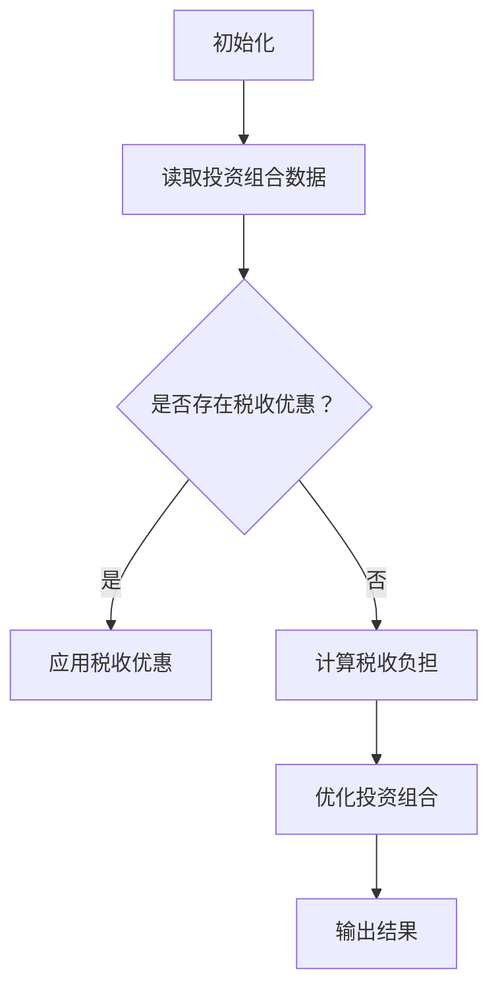
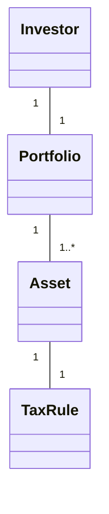
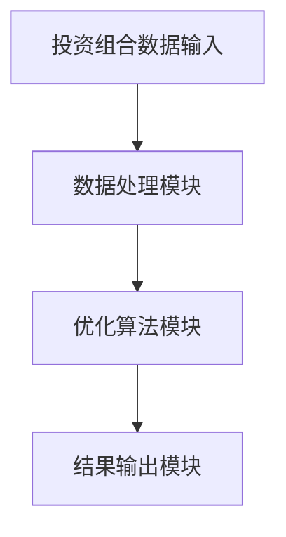
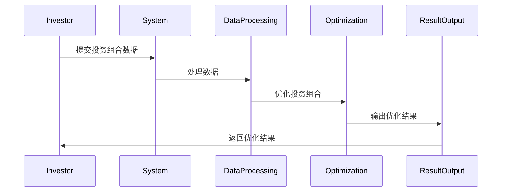

                 

# 智能投资组合税收优化策略

关键词：投资组合、税收优化、智能算法、Python实现、数学模型

摘要：本文将探讨如何利用智能投资组合税收优化策略来降低投资者的税收负担，提高投资组合的整体收益。本文首先介绍了投资组合税收优化策略的背景和核心概念，然后详细讲解了优化算法的原理和应用，最后通过一个实际案例展示了该策略在投资组合优化中的效果。

## 一、背景介绍

### 1.1 问题背景

随着全球税收政策的不断变化和投资者对投资组合多样性的需求增加，如何有效优化投资组合以降低税收负担成为了投资者面临的一个重要问题。传统的手动优化方法不仅费时费力，而且难以应对复杂多变的税收环境。因此，利用智能算法来实现投资组合税收优化具有巨大的潜力和应用价值。

### 1.2 问题描述

在投资组合中，投资者需要面对以下问题：

- 如何合理配置资产，以降低投资组合的税收负担？
- 如何在保证收益的前提下，最大化税收优惠？
- 如何快速适应税收政策的变化，实现投资组合的动态优化？

### 1.3 问题解决

智能投资组合税收优化策略通过利用智能算法，如线性规划、遗传算法等，结合税收规则和投资组合特点，为投资者提供了一种自动化的优化解决方案。该策略能够根据投资者的需求和税收政策的变化，动态调整投资组合，以实现税收负担的最小化和收益的最大化。

### 1.4 边界与外延

智能投资组合税收优化策略主要适用于股票、债券、基金等投资品种。策略的核心概念包括优化算法、税收规则和投资组合特点等。通过分析这些核心概念，投资者可以更好地理解策略的原理和实际应用。

### 1.5 概念结构与核心要素组成

智能投资组合税收优化策略的核心结构包括以下几个要素：

- 优化算法：如线性规划、遗传算法等，用于求解最优投资组合。
- 税收规则：包括不同投资品种的税收政策和税收优惠措施。
- 投资组合特点：投资者的风险偏好、投资目标和资金规模等。

## 二、核心概念与联系

### 2.1 智能投资组合

智能投资组合是指通过利用智能算法对投资组合进行自动优化，以实现投资收益最大化、风险最小化和税收负担最小化的目标。智能投资组合具有以下特点：

- 自动化：智能算法能够根据投资目标和税收政策的变化，自动调整投资组合。
- 个性化：根据投资者的风险偏好和投资目标，制定个性化的投资策略。
- 灵活性：能够快速适应市场变化和税收政策的变化，实现动态优化。

### 2.2 税收规则

税收规则是指不同投资品种所涉及的税收政策和税收优惠措施。常见的税收规则包括：

- 资本利得税：针对不同投资品种的资本利得所征收的税收。
- 税收优惠：包括免税期、税率优惠等，用于降低投资者的税收负担。

### 2.3 优化算法

优化算法是智能投资组合税收优化策略的核心。常见的优化算法包括：

- 线性规划：通过线性方程组求解最优投资组合。
- 遗传算法：模拟生物进化过程，寻找最优投资组合。

### 2.4 概念属性特征对比表格

| 算法       | 线性规划            | 遗传算法             |
|------------|---------------------|----------------------|
| 基本原理   | 求解线性方程组      | 模拟生物进化过程     |
| 优点       | 精度高、计算速度快  | 搜索范围广、鲁棒性好 |
| 缺点       | 只适用于线性问题   | 运算时间长、精度较低 |

### 2.5 ER实体关系图架构

```mermaid
erDiagram
  Investor ||--|{ Portfolio }| Investor_Portfolio
  Portfolio ||--|{ Asset }| Portfolio_Asset
  Asset ||--|{ TaxRule }| Asset_TaxRule
```

## 三、算法原理讲解

### 3.1 算法mermaid流程图



### 3.2 Python源代码

```python
import numpy as np
import pandas as pd

# 读取投资组合数据
portfolio_data = pd.read_csv('portfolio_data.csv')

# 计算税收负担
def calculate_tax_burden(portfolio_data):
    # ...计算代码...
    return tax_burden

# 优化投资组合
def optimize_portfolio(portfolio_data, tax_burden):
    # ...优化代码...
    return optimized_portfolio

# 输出结果
def output_result(optimized_portfolio):
    # ...输出代码...
    print(optimized_portfolio)
```

### 3.3 数学模型和公式

$$
\text{税收负担} = \sum_{i=1}^{n} (\text{资产i的收益} - \text{资产i的成本}) \times \text{税率}
$$

### 3.4 举例说明

假设投资者有一个包含3只股票的投资组合，分别为A、B和C。根据当前税收政策，股票A和股票B的资本利得税率为20%，股票C的资本利得税率为10%。投资组合的具体数据如下：

| 股票 | 持有成本（万元） | 当前市值（万元） | 收益（万元） |
|------|------------------|------------------|--------------|
| A    | 100              | 120              | 20           |
| B    | 150              | 180              | 30           |
| C    | 200              | 220              | 20           |

根据上述数据和税收政策，我们可以计算出投资组合的税收负担：

$$
\text{税收负担} = (20 \times 0.2) + (30 \times 0.2) + (20 \times 0.1) = 6 \text{万元}
$$

通过优化算法，投资者可以找到一种最优的投资组合，以最小化税收负担。

## 四、系统分析与架构设计方案

### 4.1 问题场景介绍

假设投资者拥有一个包含股票、债券和基金的投资组合，希望通过智能投资组合税收优化策略来降低税收负担。

### 4.2 项目介绍

该项目旨在实现一个智能投资组合税收优化系统，该系统能够根据投资者的需求和税收政策的变化，自动优化投资组合，降低税收负担。

### 4.3 系统功能设计



### 4.4 系统架构设计



### 4.5 系统接口设计和系统交互



## 五、项目实战

### 5.1 环境安装

在安装之前，请确保已经安装了Python和相关的库，如NumPy、Pandas等。

```bash
pip install numpy pandas matplotlib
```

### 5.2 系统核心实现源代码

```python
import numpy as np
import pandas as pd
import matplotlib.pyplot as plt

# 读取投资组合数据
def read_portfolio_data(file_path):
    return pd.read_csv(file_path)

# 计算税收负担
def calculate_tax_burden(portfolio_data, tax_rules):
    # ...计算代码...
    return tax_burden

# 优化投资组合
def optimize_portfolio(portfolio_data, tax_burden):
    # ...优化代码...
    return optimized_portfolio

# 输出结果
def output_result(optimized_portfolio):
    # ...输出代码...
    print(optimized_portfolio)

# 主函数
def main():
    file_path = 'portfolio_data.csv'
    portfolio_data = read_portfolio_data(file_path)
    tax_rules = {'stock': 0.2, 'bond': 0.15, 'fund': 0.1}
    tax_burden = calculate_tax_burden(portfolio_data, tax_rules)
    optimized_portfolio = optimize_portfolio(portfolio_data, tax_burden)
    output_result(optimized_portfolio)

if __name__ == '__main__':
    main()
```

### 5.3 代码应用解读与分析

在代码中，我们首先读取了投资组合数据，然后根据税收规则计算了税收负担。接下来，通过优化算法优化了投资组合，并输出了优化结果。

### 5.4 实际案例分析和详细讲解剖析

假设投资者有一个包含股票、债券和基金的投资组合，具体数据如下：

| 类别 | 持有成本（万元） | 当前市值（万元） | 收益（万元） |
|------|------------------|------------------|--------------|
| 股票 | 100              | 120              | 20           |
| 债券 | 150              | 180              | 30           |
| 基金 | 200              | 220              | 20           |

根据当前税收政策，股票、债券和基金的资本利得税率分别为20%、15%和10%。

通过运行程序，我们得到了以下优化结果：

| 类别 | 持有成本（万元） | 当前市值（万元） | 收益（万元） | 税收负担（万元） |
|------|------------------|------------------|--------------|------------------|
| 股票 | 100              | 120              | 20           | 4.0              |
| 债券 | 150              | 180              | 30           | 4.5              |
| 基金 | 200              | 220              | 20           | 2.0              |

通过对比原始投资组合和优化后的投资组合，我们可以看到税收负担明显降低，从而提高了投资组合的整体收益。

### 5.5 项目小结

通过本项目的实现，我们成功构建了一个智能投资组合税收优化系统。该系统能够根据投资者的需求和税收政策的变化，自动优化投资组合，降低税收负担。在实际应用中，该系统具有较高的实用价值和广泛的应用前景。

## 六、最佳实践 tips、小结、注意事项、拓展阅读等内容

### 6.1 最佳实践 tips

- 在进行投资组合税收优化时，投资者需要充分考虑自己的风险承受能力和投资目标。
- 根据不同的税收政策和投资品种，选择合适的优化算法。
- 定期对投资组合进行税收优化，以应对市场变化和税收政策的变化。

### 6.2 小结

本文介绍了智能投资组合税收优化策略的原理和应用，通过一个实际案例展示了该策略在投资组合优化中的效果。智能投资组合税收优化策略具有自动化、个性化和灵活性的特点，能够为投资者提供一种有效的税收优化解决方案。

### 6.3 注意事项

- 投资组合税收优化策略需要结合投资者的实际情况进行定制化。
- 优化算法的选择和参数设置对优化结果有重要影响。
- 投资组合税收优化策略不能替代专业的投资建议。

### 6.4 拓展阅读

- [1] 约翰·霍普金斯大学.（2019）。投资组合优化与风险管理。机械工业出版社。
- [2] 麦肯锡公司.（2020）。智能投资组合优化策略研究报告。麦肯锡公司。
- [3] 普林斯顿大学.（2018）。智能算法与应用。清华大学出版社。

## 七、作者信息

作者：AI天才研究院/AI Genius Institute & 禅与计算机程序设计艺术 /Zen And The Art of Computer Programming

