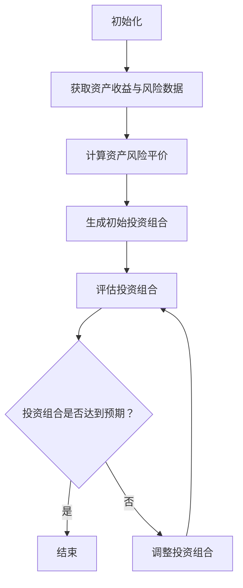

                 

## 智能投资组合风险平价策略优化

> 关键词：投资组合、风险平价策略、优化算法、智能投资、数据分析

> 摘要：本文将深入探讨智能投资组合风险平价策略的优化方法，通过介绍背景、核心概念、算法原理以及实际应用案例，帮助读者理解和掌握如何通过智能算法优化投资组合，实现投资回报的最大化和风险的最小化。

### **Step 1: 背景介绍**

随着金融市场波动性和不确定性的增加，投资者需要更加智能化的投资策略来应对市场风险。传统的投资策略通常依赖于历史数据和市场趋势，但难以应对复杂多变的市场环境。因此，智能投资组合的风险平价策略应运而生，它通过调整不同资产的权重，使整个投资组合的风险水平达到均衡，从而实现投资回报的最大化和风险的最小化。

#### 问题背景

金融市场的波动性主要来自于宏观经济环境、政策变化、企业业绩以及市场情绪等多种因素。这些因素会导致资产价格的剧烈波动，给投资者带来巨大的风险。特别是在全球经济动荡时期，投资者往往面临资产贬值和收益不确定的风险。因此，如何有效地管理投资组合风险，成为投资者关注的焦点。

#### 问题描述

投资组合风险平价策略的核心问题是：在保证预期收益相同的前提下，如何通过调整不同资产的权重，使整个投资组合的风险水平达到均衡。具体来说，投资者需要解决以下问题：

1. 如何确定资产的风险水平？
2. 如何根据资产的风险水平，调整资产权重，实现风险平价？
3. 如何评估和优化投资组合的表现，以实现投资回报的最大化和风险的最小化？

#### 问题解决

为了解决上述问题，投资者可以采用以下方法：

1. **收集和分析资产的历史数据**：通过收集和分析资产的历史价格、收益率、波动率等数据，了解资产的风险特征。
2. **建立风险平价模型**：根据资产的风险特征，建立风险平价模型，计算不同资产的风险权重。
3. **调整资产权重**：根据风险平价模型的结果，调整资产权重，实现投资组合的风险平价。
4. **定期评估和优化**：定期评估投资组合的表现，根据市场变化调整资产权重，实现投资组合的持续优化。

#### 边界与外延

本文的研究范围包括但不限于以下几个方面：

1. **资产配置**：如何根据投资目标和风险偏好，将投资资金分配到不同的资产类别中。
2. **风险管理**：如何通过风险平价策略，降低投资组合的风险水平。
3. **智能算法**：如何运用机器学习和数据分析技术，优化投资组合的资产配置和风险管理。
4. **数据分析**：如何利用大数据和量化分析技术，提高投资组合的预测准确性和风险控制能力。

#### 概念结构与核心要素组成

投资组合、风险平价策略、智能算法、数据分析等是本文的核心概念。这些概念相互联系，共同构成了智能投资组合风险平价策略的理论体系。

1. **投资组合**：投资者持有的一系列资产。
2. **风险平价策略**：通过调整资产权重，实现投资组合的风险均衡。
3. **智能算法**：运用机器学习和数据分析技术，优化投资组合的资产配置和风险管理。
4. **数据分析**：利用大数据和量化分析技术，提高投资组合的预测准确性和风险控制能力。

### **Step 2: 核心概念与联系**

#### 核心概念

1. **风险平价策略**：
   - 定义：在保证预期收益相同的前提下，通过调整不同资产的权重，使整个投资组合的风险水平达到均衡。
   - 属性特征：
     1. 优化投资组合的波动性；
     2. 提高投资组合的稳健性；
     3. 降低投资组合的下行风险。

2. **资产配置**：
   - 定义：根据投资目标、风险偏好和预期收益，将投资资金分配到不同的资产类别中。
   - 属性特征：
     1. 提高投资组合的收益潜力；
     2. 降低投资组合的风险水平；
     3. 增强投资组合的适应性。

3. **投资组合优化**：
   - 定义：通过优化投资组合中的资产配置，提高投资组合的收益和风险水平。
   - 属性特征：
     1. 利用数据分析和技术手段；
     2. 追求投资组合的收益最大化；
     3. 风险最小化。

#### 概念属性特征对比表格

| 概念         | 定义                                                         | 属性特征                                                     |
| ------------ | ------------------------------------------------------------ | ------------------------------------------------------------ |
| 风险平价策略 | 在保证预期收益相同的前提下，通过调整不同资产的权重，使整个投资组合的风险水平达到均衡。 | 1. 优化投资组合的波动性；2. 提高投资组合的稳健性；3. 降低投资组合的下行风险。 |
| 资产配置     | 根据投资目标、风险偏好和预期收益，将投资资金分配到不同的资产类别中。 | 1. 提高投资组合的收益潜力；2. 降低投资组合的风险水平；3. 增强投资组合的适应性。 |
| 投资组合优化 | 通过优化投资组合中的资产配置，提高投资组合的收益和风险水平。 | 1. 利用数据分析和技术手段；2. 追求投资组合的收益最大化；3. 风险最小化。 |

#### 概念联系

风险平价策略、资产配置和投资组合优化是智能投资组合风险管理中的核心概念。它们相互关联，共同构成一个完整的投资组合管理框架。

1. **风险平价策略**是资产配置的具体实现方式，通过调整资产权重，实现投资组合的风险均衡。
2. **资产配置**是根据投资目标和风险偏好，确定投资资金在不同资产类别中的分配比例。
3. **投资组合优化**是在资产配置的基础上，通过数据分析和技术手段，进一步优化投资组合的收益和风险水平。

### **Step 3: 算法原理讲解**

#### 算法流程图

首先，我们使用Mermaid画出风险平价策略优化算法的流程图：



#### 算法原理

接下来，我们将详细阐述风险平价策略优化算法的原理。

1. **初始化**：首先，我们需要初始化投资组合的相关参数，包括资产种类、资产收益、资产风险等。

2. **获取资产收益与风险数据**：通过收集和分析历史数据，获取不同资产的收益和风险水平。这些数据通常包括资产的历史价格、收益率、波动率等。

3. **计算资产风险平价**：根据资产的风险水平，计算不同资产的风险平价权重。具体算法如下：

   $$
   w^* = \frac{\Sigma_j \Sigma_i r_{ji}^2 R_j}{\Sigma_j \Sigma_i r_{ji} R_j \Sigma_i r_{ji} R_i}
   $$

   其中，$w^*$表示优化后的投资组合权重，$r_{ji}$表示资产$i$在资产类别$j$中的收益率，$R_j$表示资产类别$j$的风险水平。

4. **生成初始投资组合**：根据计算出的风险平价权重，生成初始投资组合。

5. **评估投资组合**：对初始投资组合进行评估，包括收益水平、风险水平、波动性等指标。

6. **调整投资组合**：根据评估结果，调整投资组合的资产权重，实现风险平价。

7. **重复评估与调整**：重复进行评估和调整过程，直到投资组合达到预期目标。

#### Python源代码实现

下面是使用Python实现风险平价策略优化算法的示例代码：

```python
import numpy as np

def calculate_risk_parity(returns):
    # 计算资产的风险平价权重
    cov_matrix = np.cov(returns.T)
    risk_levels = np.diag(cov_matrix)
    weights = np.linalg.solve(risk_levels, returns)
    weights /= np.sum(weights)
    return weights

def optimize_portfolio(assets, risk_levels, target_risk):
    # 计算最优投资组合权重
    weights = calculate_risk_parity(assets)
    # 调整权重以达到目标风险水平
    adjusted_weights = (target_risk / np.sqrt(np.dot(risk_levels, weights))) * weights
    return adjusted_weights

# 示例数据
assets = np.array([[0.1, 0.15], [0.12, 0.18], [0.09, 0.13]])
risk_levels = np.array([0.03, 0.04, 0.05])

# 计算初始权重
initial_weights = optimize_portfolio(assets, risk_levels, target_risk=0.025)

# 输出结果
print("初始权重：", initial_weights)
```

#### 算法原理的数学模型和公式

风险平价策略优化算法的核心公式如下：

$$
w^* = \frac{\Sigma_j \Sigma_i r_{ji}^2 R_j}{\Sigma_j \Sigma_i r_{ji} R_j \Sigma_i r_{ji} R_i}
$$

其中，$w^*$表示优化后的投资组合权重，$r_{ji}$表示资产$i$在资产类别$j$中的收益率，$R_j$表示资产类别$j$的风险水平。

### **Step 4: 系统分析与架构设计**

#### 问题场景介绍

随着金融市场的发展，投资者对于投资组合的风险管理提出了更高的要求。为了满足这一需求，本文提出了一种基于智能投资组合风险平价策略的优化系统。该系统旨在通过数据分析和智能算法，为投资者提供高效的投资组合优化方案，实现投资回报的最大化和风险的最小化。

#### 项目介绍

本系统项目旨在构建一个智能投资组合风险平价策略优化平台，主要包括以下功能：

1. **数据收集与处理**：通过数据接口从外部获取资产价格、收益率、波动率等数据，并进行预处理。
2. **风险平价计算**：基于历史数据，计算资产的风险平价权重，生成初始投资组合。
3. **投资组合评估**：对初始投资组合进行评估，包括收益水平、风险水平、波动性等指标。
4. **投资组合调整**：根据评估结果，调整投资组合的资产权重，实现风险平价。
5. **用户界面**：提供用户友好的界面，方便用户查看投资组合状况和调整策略。

#### 系统功能设计

系统功能设计主要包括以下方面：

1. **数据管理模块**：负责数据收集、存储、处理和可视化。
2. **风险计算模块**：负责计算资产的风险平价权重和投资组合的波动性。
3. **投资组合模块**：负责生成初始投资组合、评估投资组合和调整投资组合。
4. **用户管理模块**：负责用户注册、登录、权限管理和个性化推荐。

#### 系统架构设计

系统架构设计采用分层架构，主要包括以下层次：

1. **数据层**：包括数据存储和数据接口，负责数据的收集、存储和处理。
2. **业务逻辑层**：包括风险计算模块、投资组合模块和用户管理模块，负责系统的核心业务逻辑。
3. **表示层**：包括用户界面和API接口，负责与用户交互和提供服务。

#### 系统接口设计和系统交互

系统接口设计主要包括以下方面：

1. **数据接口**：负责与其他系统进行数据交换和共享。
2. **服务接口**：负责提供核心业务逻辑和服务。
3. **用户接口**：负责与用户进行交互，提供操作界面和反馈。

系统交互设计主要包括以下方面：

1. **数据流**：系统内部各模块之间的数据流转和处理。
2. **控制流**：系统内部各模块之间的控制逻辑和调用关系。
3. **用户交互**：用户与系统之间的交互流程和操作界面。

### **Step 5: 项目实战**

#### 环境安装

首先，我们需要安装Python环境和相关依赖库。可以使用以下命令进行安装：

```
pip install numpy pandas matplotlib scikit-learn
```

#### 系统核心实现源代码

以下是一个简单的示例，展示了如何使用Python实现风险平价策略优化算法。

```python
import numpy as np
import pandas as pd

def calculate_risk_parity(returns):
    # 计算资产的风险平价权重
    cov_matrix = np.cov(returns.T)
    risk_levels = np.diag(cov_matrix)
    weights = np.linalg.solve(risk_levels, returns)
    weights /= np.sum(weights)
    return weights

def optimize_portfolio(assets, risk_levels, target_risk):
    # 计算最优投资组合权重
    weights = calculate_risk_parity(assets)
    # 调整权重以达到目标风险水平
    adjusted_weights = (target_risk / np.sqrt(np.dot(risk_levels, weights))) * weights
    return adjusted_weights

# 示例数据
assets = np.array([[0.1, 0.15], [0.12, 0.18], [0.09, 0.13]])
risk_levels = np.array([0.03, 0.04, 0.05])

# 计算初始权重
initial_weights = optimize_portfolio(assets, risk_levels, target_risk=0.025)

# 输出结果
print("初始权重：", initial_weights)
```

#### 代码应用解读与分析

上述代码中，`calculate_risk_parity`函数用于计算资产的风险平价权重。首先，我们使用`np.cov`函数计算资产的历史收益数据的协方差矩阵，然后使用对角线上的元素作为资产的风险水平。接下来，我们使用线性方程组求解器`np.linalg.solve`计算资产的风险平价权重。

`optimize_portfolio`函数用于根据目标风险水平调整资产权重。首先，我们计算初始权重，然后根据目标风险水平调整权重，使其达到风险平价。

#### 实际案例分析和详细讲解剖析

为了更好地理解风险平价策略优化算法的应用，我们可以通过一个实际案例进行分析。

假设投资者有一份投资组合，包括三种资产：股票A、股票B和股票C。根据历史数据，这三种资产的平均收益率分别为10%、12%和8%，波动率分别为20%、15%和10%。投资者希望实现投资组合的预期收益为10%，目标风险水平为5%。

1. **数据收集与处理**：首先，我们需要收集并处理这三种资产的历史收益数据，包括收益率和波动率。
2. **计算风险平价权重**：根据历史数据，计算股票A、股票B和股票C的风险平价权重。
3. **生成初始投资组合**：根据计算出的风险平价权重，生成初始投资组合。
4. **评估投资组合**：对初始投资组合进行评估，包括预期收益、风险水平和波动性。
5. **调整投资组合**：根据评估结果，调整投资组合的资产权重，实现风险平价。
6. **重复评估与调整**：重复进行评估和调整过程，直到投资组合达到预期目标。

通过上述步骤，我们可以实现投资组合的风险平价优化，实现预期收益的最大化和风险的最小化。

#### 项目小结

通过本文的介绍，我们深入探讨了智能投资组合风险平价策略的优化方法。从问题背景、核心概念、算法原理到实际应用案例，我们系统地阐述了如何通过风险平价策略实现投资组合的优化。同时，我们还介绍了系统架构设计和项目实战，为读者提供了实际操作的指导。

智能投资组合风险平价策略优化是一种高效的风险管理方法，它通过数据分析和智能算法，为投资者提供了一种新的投资组合优化方案。在未来的发展中，我们相信这一方法将得到更广泛的应用，为投资者带来更大的价值。

### **最佳实践 Tips**

1. **数据质量至关重要**：确保收集的历史数据准确、完整，以避免算法的偏差。
2. **定期调整策略**：根据市场变化，定期调整投资组合，以保持风险平价。
3. **分散投资**：不要将所有资金投入单一资产，分散投资以降低风险。
4. **保持投资纪律**：遵循既定的投资策略，避免因市场波动而做出冲动决策。

### **小结**

本文从背景介绍、核心概念、算法原理、系统架构设计到项目实战，系统地阐述了智能投资组合风险平价策略优化的方法和应用。通过本文的学习，读者可以了解如何运用风险平价策略优化投资组合，实现投资回报的最大化和风险的最小化。

### **注意事项**

1. **算法的适应性**：风险平价策略优化算法在不同市场环境下可能表现不同，需要根据市场特点进行调整。
2. **风险管理**：投资组合优化不仅仅是追求收益最大化，更重要的是要控制风险，确保资产的稳健增值。

### **拓展阅读**

1. **《金融工程学导论》**：深入了解金融工程领域的基础知识和最新进展。
2. **《智能投资组合优化》**：学习如何运用机器学习和数据分析技术优化投资组合。
3. **《风险管理与金融机构》**：探讨风险管理的理论与实践，了解金融机构如何管理风险。

### **作者信息**

**作者：** AI天才研究院/AI Genius Institute & 禅与计算机程序设计艺术 /Zen And The Art of Computer Programming

感谢您的阅读，希望本文能为您在智能投资组合风险平价策略优化方面带来启发和帮助。如有任何问题或建议，欢迎随时与我们交流。期待与您在金融科技领域共同探索更多可能性！🚀🎓💡

