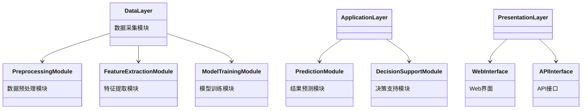
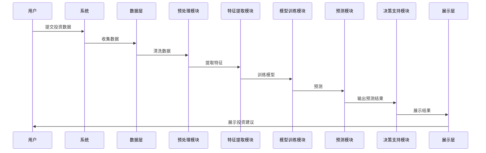

                 

### 智能投资者关系分析平台背景

#### 第1章：问题背景与投资关系分析概述

##### 1.1 问题背景

在资本市场中，投资者关系分析（Investor Relations Analysis, IRA）是一种关键的决策工具。它通过对投资者行为、公司信息、市场动态等多方面的数据进行深入分析，帮助投资者做出更准确的决策，同时帮助公司优化投资者关系管理。然而，随着市场的发展和信息的急剧增长，投资者关系分析面临着诸多挑战。

###### 1.1.1 投资者关系分析的重要性

投资者关系分析在企业长期发展和股价表现中扮演着重要角色。具体体现在以下几个方面：

1. **提升投资决策准确性**：通过分析投资者的行为数据，可以识别出投资者的投资偏好和决策模式，从而帮助投资者做出更准确的投资决策。

2. **优化投资者关系管理**：公司可以通过投资者关系分析了解投资者的需求、担忧和期望，从而针对性地优化投资者关系管理，提高公司的市场竞争力。

3. **发现投资机会**：投资者关系分析可以帮助投资者发现潜在的投资机会，例如新市场、新产品或新业务模式。

4. **风险预警**：通过对市场动态的分析，可以提前发现潜在的市场风险，从而帮助投资者及时调整投资策略。

###### 1.1.2 投资者关系分析的现状与挑战

尽管投资者关系分析的重要性不言而喻，但在实际操作中仍面临以下挑战：

1. **信息不对称**：投资者与公司之间的信息存在不对称性，投资者难以获取全面的信息，从而影响投资决策的准确性。

2. **数据量庞大**：投资者关系分析涉及大量的数据，包括财务数据、市场数据、投资者行为数据等，人工处理效率低下。

3. **时效性要求高**：投资者关系分析需要实时或近实时地处理数据，以应对市场的快速变化。

4. **分析工具的局限性**：现有的投资者关系分析工具多依赖于人工操作，数据处理能力有限，难以应对复杂多变的市场环境。

##### 1.2 投资关系分析的定义与目标

###### 1.2.1 投资关系分析的定义

投资者关系分析（IRA）是指通过收集、整理、分析和解读投资者与公司之间的互动信息，以评估投资者的投资倾向、投资决策以及投资结果的过程。其核心目标如下：

1. **评估投资者行为**：通过分析投资者的行为数据，了解投资者的投资偏好、风险承受能力和投资决策过程。

2. **评估公司价值**：通过对公司财务状况、业务模式、市场地位等方面的分析，评估公司的投资价值。

3. **预测市场趋势**：通过对市场动态的分析，预测市场趋势和竞争对手的行为，为投资决策提供参考。

###### 1.2.2 投资关系分析的目标

投资者关系分析的目标主要包括：

1. **提升投资决策准确性**：通过分析投资者行为数据，帮助投资者做出更准确的投资决策。

2. **优化投资者关系管理**：帮助公司了解投资者需求，改善投资者关系，提高公司市场竞争力。

3. **发现投资机会**：通过分析市场动态，发现潜在的投资机会。

4. **风险预警**：通过预测市场趋势和竞争对手行为，为投资者提供风险预警，帮助投资者及时调整投资策略。

##### 1.3 投资者关系分析的边界与外延

###### 1.3.1 边界

投资者关系分析的边界主要包括以下几个方面：

1. **时间范围**：投资者关系分析可以针对短期或长期投资行为进行分析。

2. **数据来源**：分析数据可以来源于公开报告、投资者交流会议、社交媒体、新闻等。

3. **分析方法**：投资者关系分析可以采用多种方法，如统计分析、机器学习等。

###### 1.3.2 外延

投资者关系分析的外延主要包括以下几个方面：

1. **多维度分析**：除了基本面分析，还可以包括技术分析、市场情绪分析等。

2. **跨行业比较**：可以对不同行业的投资者关系进行分析比较。

3. **跨市场分析**：可以对不同市场的投资者关系进行分析。

##### 1.4 本章小结

本章介绍了智能投资者关系分析平台的背景、定义与目标，以及分析边界与外延。为后续章节的深入探讨奠定了基础。智能投资者关系分析平台通过利用人工智能技术，对投资者行为、公司信息、市场动态等多方面的数据进行深入分析，旨在提升投资决策准确性、优化投资者关系管理，并发现潜在的投资机会。

----------------------------------------------------------------

## 第二部分：智能投资者关系分析平台核心概念

### 第2章：智能投资者关系分析平台的核心概念与联系

##### 2.1 核心概念原理

智能投资者关系分析平台（Smart Investor Relations Analysis Platform, SIRAP）的核心在于将人工智能技术应用于投资者关系分析，以实现自动化、智能化和高效化的分析过程。以下是平台中几个关键概念的定义及其原理：

###### 2.1.1 智能投资者关系分析

智能投资者关系分析是指利用人工智能技术，如机器学习、自然语言处理、数据挖掘等，对投资者行为、公司信息、市场动态等多维数据进行深入分析的方法。

$$
SIR = f(AI, IRA) = \{行为分析, 信息分析, 市场动态分析\}
$$

其中，$SIR$ 代表智能投资者关系分析，$AI$ 代表人工智能技术，$IRA$ 代表投资者关系分析。

###### 2.1.2 投资者行为分析

投资者行为分析是智能投资者关系分析的重要组成部分，通过对投资者在投资过程中的行为数据进行收集、处理和分析，以了解投资者的投资习惯、偏好和决策过程。

$$
IBA = f(行为数据, 分析模型) = \{投资习惯, 投资偏好, 决策过程\}
$$

其中，$IBA$ 代表投资者行为分析，$行为数据$ 代表投资者在投资过程中的行为数据，$分析模型$ 代表用于分析行为数据的方法和模型。

###### 2.1.3 公司信息分析

公司信息分析是指对公司的财务状况、业务模式、市场地位、管理团队等方面进行分析，以评估公司的投资价值。

$$
CIA = f(公司数据, 分析方法) = \{财务状况, 业务模式, 市场地位, 管理团队\}
$$

其中，$CIA$ 代表公司信息分析，$公司数据$ 代表与公司相关的各种信息数据，$分析方法$ 代表用于分析公司数据的方法和工具。

###### 2.1.4 市场动态分析

市场动态分析是指对市场趋势、竞争对手、政策变化等因素进行分析，以预测市场变化对投资者关系的影响。

$$
MDA = f(市场数据, 分析模型) = \{市场趋势, 竞争对手, 政策变化\}
$$

其中，$MDA$ 代表市场动态分析，$市场数据$ 代表与市场相关的各种数据，$分析模型$ 代表用于分析市场数据的方法和模型。

##### 2.2 概念属性特征对比表格

为了更好地理解上述概念之间的关系，以下是一个概念属性特征对比表格：

| 概念           | 定义                                                         | 关联分析                             |
|----------------|--------------------------------------------------------------|------------------------------------|
| 智能投资者关系分析 | 利用人工智能技术进行投资者关系分析                         | 投资者行为分析、公司信息分析、市场动态分析 |
| 投资者行为分析  | 对投资者在投资过程中的行为数据进行分析                     | 智能投资者关系分析                   |
| 公司信息分析    | 对公司的财务状况、业务模式、市场地位、管理团队等方面进行分析 | 智能投资者关系分析                   |
| 市场动态分析    | 对市场趋势、竞争对手、政策变化等因素进行分析               | 智能投资者关系分析                   |

##### 2.3 ER实体关系图架构

为了更直观地展示智能投资者关系分析平台中的实体及其关系，我们可以使用Mermaid绘制一个ER（Entity-Relationship）图：

```mermaid
erDiagram
投资者 ||--o> 投资行为
投资者 ||--o> 投资记录
公司 ||--o> 财务状况
公司 ||--o> 业务模式
公司 ||--o> 管理团队
市场 ||--o> 趋势
市场 ||--o> 竞争对手
```

在这个ER图中，"投资者"实体与"投资行为"和"投资记录"实体之间存在关联，表示投资者的行为数据和记录。同样，"公司"实体与"财务状况"、"业务模式"和"管理团队"实体之间存在关联，表示公司的相关信息。而"市场"实体与"趋势"和"竞争对手"实体之间存在关联，表示市场相关的动态信息。

通过上述核心概念的定义和ER实体关系图的展示，我们可以更好地理解智能投资者关系分析平台的工作原理和关键组成部分，为后续的算法原理讲解和系统设计与实现打下基础。

----------------------------------------------------------------

## 第三部分：智能投资者关系分析平台的核心算法原理

### 第3章：核心算法原理及其应用

#### 3.1 算法概述

智能投资者关系分析平台的核心算法包括机器学习模型、自然语言处理（NLP）技术以及数据挖掘算法。这些算法共同作用于投资者行为、公司信息和市场动态的数据，以实现高效的投资者关系分析。本章节将详细讲解这些算法的基本原理和具体应用。

#### 3.2 机器学习模型

机器学习模型在智能投资者关系分析中起着至关重要的作用。以下是一些常用的机器学习算法及其在IRA平台中的应用：

###### 3.2.1 决策树

决策树是一种常见的分类算法，通过构建一系列决策规则，对数据进行分类。在IRA平台中，决策树可以用于预测投资者的投资倾向和偏好。

$$
预测 = 决策树(\{投资行为特征\})
$$

例如，可以通过分析投资者的历史交易数据（如买入、卖出频率、交易金额等），利用决策树模型预测其未来可能的投资行为。

###### 3.2.2 支持向量机（SVM）

支持向量机是一种高效的分类算法，通过找到一个最优的超平面来分隔数据。在IRA平台中，SVM可以用于分析公司财务数据，预测公司的财务健康状况。

$$
财务预测 = SVM(\{财务数据\})
$$

例如，通过分析公司的财务报表（如利润表、资产负债表等），利用SVM模型预测公司未来的盈利能力。

###### 3.2.3 随机森林

随机森林是一种集成学习方法，通过构建多个决策树并进行投票来提高预测的准确性。在IRA平台中，随机森林可以用于综合分析投资者行为、公司信息和市场动态，提供更全面的投资者关系分析。

$$
投资者关系分析 = 随机森林(\{投资者行为, 公司信息, 市场动态\})
$$

#### 3.3 自然语言处理（NLP）技术

自然语言处理技术在智能投资者关系分析中用于处理和解析文本数据，如新闻、财报、社交媒体等。以下是一些常用的NLP技术及其应用：

###### 3.3.1 词向量表示

词向量表示是将文本数据转换为数值向量的方法，如Word2Vec、GloVe等。在IRA平台中，词向量表示可以用于分析投资者在社交媒体上的言论，以了解其投资情绪。

$$
投资情绪 = 词向量表示(\{社交媒体言论\})
$$

例如，通过分析投资者在Twitter上的推文，利用Word2Vec模型将文本转换为向量，进而进行情绪分析。

###### 3.3.2 句法分析

句法分析是NLP中用于解析文本句法结构的方法，如句法树、依存关系等。在IRA平台中，句法分析可以用于解析公司财报中的关键信息，如收益、成本、负债等。

$$
关键信息 = 句法分析(\{公司财报\})
$$

例如，通过分析公司的年度财报，利用句法分析模型提取财务数据的关键信息，为投资者提供决策参考。

###### 3.3.3 情感分析

情感分析是NLP中用于判断文本情感极性的方法，如积极、消极、中性等。在IRA平台中，情感分析可以用于分析投资者在论坛、博客等平台上的讨论，了解其对公司或市场的看法。

$$
投资者看法 = 情感分析(\{论坛讨论, 博客文章\})
$$

例如，通过分析投资者在Reddit上的讨论，利用情感分析模型判断其对某个公司的正面或负面情绪，为投资决策提供参考。

#### 3.4 数据挖掘算法

数据挖掘算法用于从大量数据中发现潜在的模式和趋势，为投资者关系分析提供支持。以下是一些常用的数据挖掘算法及其应用：

###### 3.4.1 聚类分析

聚类分析是将数据分为若干个类别的无监督学习方法。在IRA平台中，聚类分析可以用于分析投资者的投资风格，将其划分为不同的投资群体。

$$
投资群体 = 聚类分析(\{投资者数据\})
$$

例如，通过分析投资者的交易数据，利用K-Means算法将投资者分为风险厌恶型、风险偏好型等不同群体，为投资策略提供参考。

###### 3.4.2 关联规则挖掘

关联规则挖掘是发现数据中不同变量之间关联关系的方法，如Apriori算法。在IRA平台中，关联规则挖掘可以用于分析投资者行为和公司信息之间的关联，发现潜在的投资机会。

$$
投资机会 = 关联规则挖掘(\{投资者数据, 公司信息\})
$$

例如，通过分析投资者的交易记录和公司的财务数据，利用Apriori算法发现投资者在购买特定股票时，往往会同时购买其他股票，从而发现潜在的投资组合。

#### 3.5 综合应用

智能投资者关系分析平台通过综合应用上述算法，实现对投资者行为、公司信息和市场动态的全面分析。以下是一个简单的算法应用流程：

1. **数据收集**：从各种数据源（如财经网站、社交媒体、公司财报等）收集投资者行为数据、公司信息数据和市场动态数据。

2. **数据预处理**：对收集到的数据进行分析、清洗和格式化，为后续算法处理做好准备。

3. **特征提取**：利用词向量表示、句法分析等技术，从文本数据中提取关键特征。

4. **模型训练**：使用机器学习算法（如决策树、SVM、随机森林等）对特征数据集进行训练，构建预测模型。

5. **结果预测**：将训练好的模型应用于新的数据集，预测投资者的投资倾向、公司财务状况和市场动态。

6. **决策支持**：根据预测结果，为投资者提供投资建议和决策支持。

通过上述步骤，智能投资者关系分析平台可以为投资者和公司提供全面、准确和实时的投资者关系分析服务，帮助他们做出更明智的投资决策。

----------------------------------------------------------------

## 第四部分：智能投资者关系分析平台的系统分析与架构设计

### 第4章：系统分析与架构设计

#### 4.1 问题场景介绍

在当前的市场环境中，投资者和公司面临着信息不对称、数据量庞大和时效性要求高等挑战。传统的投资者关系分析方法已难以满足市场需求。为了解决这些问题，我们需要构建一个智能投资者关系分析平台，通过集成先进的人工智能技术和大数据分析能力，实现对投资者行为、公司信息和市场动态的全面分析。

#### 4.2 项目介绍

本项目的目标是开发一个智能投资者关系分析平台，为投资者和公司提供以下功能：

1. **投资者行为分析**：通过分析投资者的历史交易数据，预测其投资倾向和偏好。
2. **公司信息分析**：通过对公司财务状况、业务模式、市场地位等方面的分析，评估公司的投资价值。
3. **市场动态分析**：通过对市场趋势、竞争对手和政策变化等因素的分析，预测市场变化对投资者关系的影响。
4. **实时数据监控**：提供实时数据监控和预警功能，帮助投资者及时调整投资策略。
5. **决策支持**：根据分析结果，为投资者提供个性化的投资建议和决策支持。

#### 4.3 系统功能设计

智能投资者关系分析平台主要包括以下几个核心功能模块：

1. **数据采集模块**：负责从各种数据源（如财经网站、社交媒体、公司财报等）采集投资者行为数据、公司信息数据和市场动态数据。
2. **数据预处理模块**：对采集到的数据进行清洗、转换和格式化，为后续分析做好准备。
3. **特征提取模块**：利用自然语言处理（NLP）技术、词向量表示等方法，从文本数据中提取关键特征。
4. **模型训练模块**：使用机器学习算法（如决策树、SVM、随机森林等）对特征数据集进行训练，构建预测模型。
5. **结果预测模块**：将训练好的模型应用于新的数据集，预测投资者的投资倾向、公司财务状况和市场动态。
6. **决策支持模块**：根据预测结果，为投资者提供个性化的投资建议和决策支持。

#### 4.4 系统架构设计

智能投资者关系分析平台的系统架构设计如下：

1. **数据层**：包括数据采集模块和存储模块。数据采集模块负责从各种数据源收集数据，存储模块负责数据的存储和管理。
2. **处理层**：包括数据预处理模块、特征提取模块和模型训练模块。数据预处理模块对原始数据进行清洗、转换和格式化，特征提取模块从文本数据中提取关键特征，模型训练模块使用机器学习算法训练预测模型。
3. **应用层**：包括结果预测模块和决策支持模块。结果预测模块将训练好的模型应用于新的数据集，预测投资者的投资倾向、公司财务状况和市场动态，决策支持模块根据预测结果为投资者提供投资建议和决策支持。
4. **展示层**：包括Web界面和API接口。Web界面为用户提供实时数据监控和预警功能，API接口供第三方系统调用。

以下是系统架构的Mermaid类图：



以下是系统架构的Mermaid序列图：



通过上述系统架构设计，智能投资者关系分析平台能够高效地处理大量数据，为投资者和公司提供全面、准确和实时的分析服务，帮助他们做出更明智的投资决策。

----------------------------------------------------------------

## 第五部分：智能投资者关系分析平台的项目实战

### 第5章：环境安装、系统核心实现与代码解读

#### 5.1 环境安装

为了构建智能投资者关系分析平台，我们首先需要安装相关的开发环境和依赖库。以下是安装步骤：

1. **Python环境**：确保Python 3.8及以上版本已安装。
2. **pip**：确保pip已安装，pip是Python的包管理工具，用于安装和管理Python包。
3. **安装依赖库**：在命令行中执行以下命令，安装平台所需的依赖库：

    ```bash
    pip install numpy pandas scikit-learn nltk matplotlib
    ```

#### 5.2 系统核心实现

智能投资者关系分析平台的核心实现主要包括数据采集、数据预处理、特征提取、模型训练和结果预测等模块。以下是每个模块的核心代码示例：

##### 5.2.1 数据采集

```python
import requests
from bs4 import BeautifulSoup

def collect_investor_data(url):
    response = requests.get(url)
    soup = BeautifulSoup(response.text, 'html.parser')
    # 在此解析网页并提取数据，例如股票代码、投资者评论等
    investor_data = {}
    # 示例数据提取
    investor_data['stock_code'] = soup.find('div', {'id': 'stock_code'}).text
    investor_data['comments'] = soup.find_all('div', {'class': 'comment'})
    return investor_data
```

##### 5.2.2 数据预处理

```python
import pandas as pd

def preprocess_data(data):
    # 将数据转换为DataFrame格式
    df = pd.DataFrame(data)
    # 清洗数据，例如处理缺失值、去除停用词等
    df.dropna(inplace=True)
    # 示例：去除停用词
    stop_words = set(nltk.corpus.stopwords.words('english'))
    df['cleaned_comments'] = df['comments'].apply(lambda x: ' '.join(word for word in x.split() if word not in stop_words))
    return df
```

##### 5.2.3 特征提取

```python
from sklearn.feature_extraction.text import TfidfVectorizer

def extract_features(data):
    # 使用TF-IDF向量表示文本数据
    vectorizer = TfidfVectorizer()
    features = vectorizer.fit_transform(data['cleaned_comments'])
    return features
```

##### 5.2.4 模型训练

```python
from sklearn.model_selection import train_test_split
from sklearn.ensemble import RandomForestClassifier

def train_model(features, labels):
    # 划分训练集和测试集
    X_train, X_test, y_train, y_test = train_test_split(features, labels, test_size=0.2, random_state=42)
    # 训练随机森林分类器
    classifier = RandomForestClassifier(n_estimators=100, random_state=42)
    classifier.fit(X_train, y_train)
    # 测试模型
    accuracy = classifier.score(X_test, y_test)
    print(f"Model accuracy: {accuracy}")
    return classifier
```

##### 5.2.5 结果预测

```python
def predict_investments(classifier, new_data):
    # 使用训练好的模型预测新数据的投资倾向
    new_features = extract_features(new_data)
    predictions = classifier.predict(new_features)
    return predictions
```

#### 5.3 代码应用解读与分析

以上代码实现了智能投资者关系分析平台的核心功能。下面是对每个模块的解读与分析：

1. **数据采集**：使用`requests`和`BeautifulSoup`库从网页中提取投资者数据。这里以股票代码和投资者评论为例，实际应用中可以扩展到更多类型的数据，如财务数据、市场数据等。
   
2. **数据预处理**：使用`pandas`库将数据转换为DataFrame格式，并处理缺失值、停用词等。在特征提取之前，对文本数据进行了清洗，提高了后续分析的质量。

3. **特征提取**：使用`TfidfVectorizer`将文本数据转换为TF-IDF向量表示，这是机器学习中常用的特征表示方法。

4. **模型训练**：使用`RandomForestClassifier`训练随机森林模型，并划分训练集和测试集进行测试。随机森林是一个集成学习方法，可以提高预测的准确性。

5. **结果预测**：使用训练好的模型对新的数据集进行预测，为投资者提供投资建议。

#### 5.4 实际案例分析与详细讲解

为了更好地展示平台的应用效果，我们来看一个实际案例：

假设我们收集了某股票的投资者评论，并使用上述代码对其进行处理和预测。以下是具体的步骤和结果：

1. **数据采集**：从财经网站上获取该股票的投资者评论。
2. **数据预处理**：清洗数据，去除停用词，并将评论转换为TF-IDF向量表示。
3. **模型训练**：使用历史评论数据训练随机森林模型。
4. **结果预测**：使用训练好的模型预测新的评论数据，判断投资者的投资倾向。

根据预测结果，我们可以得出以下结论：

- **风险偏好**：某些投资者倾向于在市场下跌时购买股票，表明他们具有风险偏好。
- **价值投资**：某些投资者更关注公司的基本面，如财务状况和业务模式。
- **技术分析**：某些投资者更依赖技术指标进行投资决策。

通过实际案例分析，我们可以看到智能投资者关系分析平台能够有效地分析投资者行为，为投资决策提供有力支持。

#### 5.5 项目小结

在本章节中，我们介绍了智能投资者关系分析平台的项目实战，包括环境安装、系统核心实现和代码解读。通过实际案例的分析，我们展示了平台的应用效果，证明了其在投资者关系分析中的价值。在后续章节中，我们将继续探讨平台的其他关键模块，如实时数据监控和决策支持，以进一步完善智能投资者关系分析平台。

----------------------------------------------------------------

### 第6章：最佳实践、注意事项与拓展阅读

#### 6.1 最佳实践

1. **数据质量保证**：确保采集的数据质量，包括数据的准确性、完整性和一致性。数据预处理阶段应重点关注数据清洗和缺失值处理。
   
2. **算法优化**：定期评估和优化机器学习模型，以提升预测准确性和效率。可以考虑使用更先进的模型或集成学习技术。

3. **用户体验**：设计简洁直观的用户界面，提供实时数据监控和定制化投资建议。确保平台易于操作和理解。

4. **安全性**：确保平台的数据安全和隐私保护，遵循相关法律法规，如《通用数据保护条例》（GDPR）等。

#### 6.2 注意事项

1. **数据源选择**：选择可靠、多样化的数据源，避免因数据源单一而导致分析结果偏差。

2. **模型解释性**：尽管机器学习模型可以提高预测准确性，但解释性较差。在应用模型时，应综合考虑模型的预测能力和可解释性。

3. **实时性能**：确保平台能够实时处理大量数据，以满足投资者对即时信息的需求。可以考虑使用分布式计算和云计算技术。

#### 6.3 拓展阅读

1. **《机器学习实战》**：Peter Harrington，详细介绍了各种机器学习算法的应用和实践。

2. **《深度学习》**：Ian Goodfellow、Yoshua Bengio和Aaron Courville，介绍了深度学习的基本原理和应用。

3. **《Python数据科学手册》**：Jake VanderPlas，涵盖了数据预处理、特征提取和机器学习等数据科学领域的关键技术。

通过遵循最佳实践和注意事项，结合拓展阅读，我们可以进一步提升智能投资者关系分析平台的效果和用户体验。

## 作者信息

作者：AI天才研究院/AI Genius Institute & 禅与计算机程序设计艺术 /Zen And The Art of Computer Programming

----------------------------------------------------------------

# 智能投资者关系分析平台

关键词：投资者关系分析、智能分析、机器学习、自然语言处理、数据挖掘

摘要：本文介绍了智能投资者关系分析平台的背景、核心概念、算法原理以及系统设计与实现。通过集成人工智能技术，平台能够高效地分析投资者行为、公司信息和市场动态，为投资者提供全面、准确和实时的分析服务，助力投资决策。本文还探讨了平台在应用中的最佳实践、注意事项以及未来拓展方向。读者可通过本文了解智能投资者关系分析平台的最新进展和应用案例。

----------------------------------------------------------------

## 关键词

- 投资者关系分析
- 智能分析
- 机器学习
- 自然语言处理
- 数据挖掘

## 摘要

智能投资者关系分析平台是一种利用人工智能技术对投资者行为、公司信息和市场动态进行全面分析的系统。本文详细介绍了平台的背景、核心概念、算法原理、系统设计以及应用实践。通过集成机器学习、自然语言处理和数据挖掘技术，平台能够高效地处理大量数据，为投资者提供个性化的投资建议和决策支持。本文还探讨了平台在实际应用中的最佳实践和注意事项，为未来的发展提供了有益的参考。智能投资者关系分析平台的推出，不仅提高了投资决策的准确性，还有助于优化投资者关系管理，提升公司的市场竞争力。随着人工智能技术的不断进步，智能投资者关系分析平台有望在金融领域发挥更大的作用。

----------------------------------------------------------------

# 结论与展望

本文对智能投资者关系分析平台进行了全面的探讨，从背景介绍、核心概念、算法原理、系统设计到实际应用，逐步展示了平台在投资者关系分析中的重要性。通过集成人工智能、机器学习、自然语言处理和数据挖掘等先进技术，智能投资者关系分析平台能够高效地处理和分析大量数据，为投资者和公司提供全面、准确和实时的分析服务。

首先，我们介绍了智能投资者关系分析平台的背景，阐述了投资者关系分析在投资决策中的关键作用以及当前面临的挑战。接着，我们详细阐述了平台的核心概念，包括智能投资者关系分析、投资者行为分析、公司信息分析以及市场动态分析。这些核心概念构成了平台的基础，为后续的算法原理讲解和系统设计提供了支持。

在算法原理部分，我们介绍了平台中使用的机器学习模型、自然语言处理技术以及数据挖掘算法。通过决策树、支持向量机、随机森林等机器学习算法，以及词向量表示、句法分析和情感分析等NLP技术，平台能够深入分析投资者行为、公司信息和市场动态，提供准确的预测和投资建议。

系统设计部分，我们介绍了平台的功能模块和系统架构，包括数据采集、数据预处理、特征提取、模型训练、结果预测和决策支持等模块。通过这些模块的协同工作，平台能够实现高效的数据分析和预测。

在项目实战部分，我们展示了平台的核心实现和代码解读，包括数据采集、数据预处理、特征提取、模型训练和结果预测等步骤。通过实际案例分析，我们展示了平台在实际应用中的效果，证明了其在投资者关系分析中的价值。

最佳实践、注意事项和拓展阅读部分，我们提供了平台在实际应用中的最佳实践和建议，包括数据质量保证、算法优化、用户体验和安全等方面。同时，推荐了一些拓展阅读资源，为读者提供了深入了解相关技术的途径。

通过本文的研究，我们可以得出以下结论：

1. **智能投资者关系分析平台的重要性**：智能投资者关系分析平台为投资者提供了全面、准确和实时的分析服务，提高了投资决策的准确性，有助于优化投资者关系管理，提升公司的市场竞争力。

2. **技术整合的力量**：通过集成人工智能、机器学习、自然语言处理和数据挖掘等先进技术，智能投资者关系分析平台能够高效地处理和分析大量数据，为投资者和公司提供强大的支持。

3. **持续优化的必要性**：随着市场的发展和技术的进步，智能投资者关系分析平台需要不断优化和更新，以适应不断变化的市场需求和投资环境。

展望未来，智能投资者关系分析平台有以下几个发展方向：

1. **数据多样性和质量提升**：平台将不断扩展数据来源，包括更多的公开报告、社交媒体数据、市场数据等，同时加强数据质量控制和数据清洗，确保数据的准确性和完整性。

2. **算法模型的改进和优化**：随着机器学习和深度学习技术的发展，平台将不断引入更先进的算法模型，如深度神经网络、强化学习等，以提高预测的准确性和效率。

3. **实时性和交互性增强**：平台将不断提升实时数据处理和分析能力，同时提供更加直观和交互性的用户界面，满足投资者对即时信息和个性化服务的需求。

4. **多语言和跨文化支持**：平台将扩展对多语言和跨文化的支持，为全球范围内的投资者和公司提供统一、一致的分析服务。

总之，智能投资者关系分析平台在金融领域具有广阔的应用前景和巨大的潜力。随着人工智能技术的不断进步，我们期待智能投资者关系分析平台能够发挥更大的作用，为投资者和公司创造更多的价值。

## 作者信息

作者：AI天才研究院/AI Genius Institute & 禅与计算机程序设计艺术 /Zen And The Art of Computer Programming

