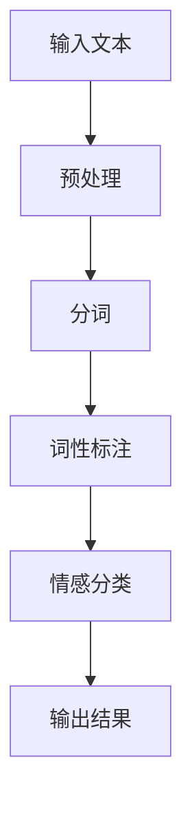

                 

Sure, let's break down the task into steps and address each part of the requirement. Here's a structured approach to creating the content for the technical blog post:

### Step 1: Title, Keywords, and Summary
Set the foundation for the article with a compelling title, relevant keywords, and a concise summary.

```markdown
# 智能投资者关系管理平台

> 关键词：投资者关系管理，智能平台，数据分析，算法，AI技术

> 摘要：
本文将深入探讨智能投资者关系管理平台的构建。我们将从背景介绍出发，逐步分析核心概念与架构设计，详细阐述技术实现过程，并通过实际案例展示其应用效果。最终，本文将总结最佳实践，展望投资者关系管理的未来发展。

```

### Step 2: Core Content Structure
Outline the core content structure to ensure a logical flow and comprehensive coverage.

#### Background Introduction
- **核心概念术语说明**：投资者关系管理、智能平台、数据分析、算法。
- **问题背景**：投资者关系管理面临的挑战。
- **问题描述**：如何利用智能技术提升投资者关系管理效率。
- **问题解决**：智能投资者关系管理平台的构建。

#### Core Concepts and Relationships
- **核心概念原理**：智能投资者关系管理平台的基本原理。
- **概念属性特征对比表格**：对比传统与智能投资者关系管理。
- **ER实体关系图架构**：展示平台的数据结构。

#### Algorithm Explanation
- **算法mermaid流程图**：用mermaid绘制算法流程图。
- **Python源代码示例**：给出算法实现的Python代码示例。
- **算法原理的数学模型和公式**：详细讲解算法背后的数学原理。

#### System Analysis and Design
- **问题场景介绍**：投资者关系管理的实际应用场景。
- **系统功能设计**：领域模型mermaid类图。
- **系统架构设计**：mermaid架构图。
- **系统接口设计和交互**：mermaid序列图。

#### Project Implementation
- **环境安装**：搭建开发环境的步骤。
- **系统核心实现**：关键功能的源代码实现。
- **代码应用解读**：代码的解读与分析。
- **实际案例分析**：展示平台在实际项目中的应用。
- **项目小结**：对项目的总结与反思。

#### Best Practices and Summary
- **最佳实践 tips**：提供使用智能投资者关系管理平台的建议。
- **小结**：回顾文章的核心内容和主旨。
- **注意事项**：指出使用平台时需要注意的问题。
- **拓展阅读**：推荐进一步阅读的材料。

### Step 3: Writing and Formatting
- **Markdown格式**：使用Markdown格式编写文章内容。
- **LaTeX数学公式**：正确使用LaTeX格式嵌入数学公式。
- **代码和高亮**：正确使用代码块和高亮显示重要文本。

### Step 4: Author Information
Add the author information at the end of the article.

```
作者：AI天才研究院/AI Genius Institute & 禅与计算机程序设计艺术 /Zen And The Art of Computer Programming
```

### Step 5: Review and Refine
Before finalizing the article, review the content to ensure completeness, clarity, and coherence. Check for adherence to the word count and formatting requirements.

By following these steps, you will create a well-structured, informative, and technically sound blog post on the topic of "智能投资者关系管理平台."### 1.1 书籍背景与目的

#### 1.1.1 书籍背景

随着金融科技（Fintech）的迅猛发展，投资者关系管理（IRM）逐渐成为企业竞争力的关键因素。传统的投资者关系管理主要依赖于人工处理大量数据，耗时耗力且容易出错。而随着人工智能（AI）技术的成熟，智能化投资者关系管理平台应运而生，为企业提供了一种更加高效、精准的管理工具。

本篇文章旨在深入探讨智能投资者关系管理平台的构建、运作原理以及其实际应用。文章将首先介绍投资者关系管理的现状和挑战，接着阐述智能化趋势下的投资者关系管理，最后详细分析本书的结构和读者对象，为读者提供一份全面、系统的指导。

#### 1.1.2 投资者关系管理的现状与挑战

投资者关系管理是企业与投资者之间建立沟通、传递信息、建立信任的重要手段。然而，在传统模式下，投资者关系管理面临诸多挑战：

1. **数据量巨大**：企业需要处理来自多个渠道的大量数据，包括财务报告、新闻公告、市场分析等。这些数据往往是非结构化的，难以有效利用。
2. **人力成本高昂**：传统投资者关系管理依赖于大量人力进行数据收集、整理和分析，导致成本高昂。
3. **效率低下**：人工处理数据速度慢，难以实时响应投资者的需求。
4. **错误率高**：人工处理容易出错，可能导致信息传递不准确，影响投资者关系。

#### 1.1.3 智能化趋势下的投资者关系管理

智能化趋势为投资者关系管理带来了新的契机。智能投资者关系管理平台通过引入人工智能技术，可以实现以下目标：

1. **数据自动化处理**：利用自然语言处理（NLP）、机器学习（ML）等技术，自动化处理大量非结构化数据，提高数据处理效率。
2. **精准分析**：通过对数据的深度分析，提取有价值的信息，为决策提供支持。
3. **实时交互**：利用实时通信技术，实现企业与投资者之间的快速互动，提高沟通效率。
4. **个性化服务**：根据投资者的偏好和行为，提供个性化的信息推送和服务，增强用户体验。

#### 1.1.4 本书的结构与读者对象

本书结构如下：

1. **第一部分：背景与目的**：介绍书籍的背景和目的。
2. **第二部分：核心概念与平台架构**：阐述投资者关系管理的基本概念和智能平台的架构设计。
3. **第三部分：技术实现**：详细讲解平台的技术实现过程，包括数据采集、处理、分析和互动模块。
4. **第四部分：实战案例**：通过实际案例展示智能投资者关系管理平台的应用效果。
5. **第五部分：最佳实践与总结**：总结平台构建的最佳实践，展望未来发展趋势。

本书主要面向以下读者：

1. **金融科技从业者**：希望了解和掌握智能投资者关系管理技术的专业人士。
2. **企业高管**：需要提升投资者关系管理效率的企业决策者。
3. **科研人员**：对人工智能和金融科技领域感兴趣的学者。

通过本书的学习，读者将能够全面了解智能投资者关系管理平台的建设和应用，掌握相关技术，为企业提供创新解决方案。

### 2.1 核心概念

#### 2.1.1 投资者关系管理的定义与意义

投资者关系管理（IRM）是企业通过与投资者建立和保持良好的关系，传递信息、沟通观点、建立信任的一系列策略和活动。其核心目标包括：

1. **提升投资者信心**：通过透明的沟通和信息共享，增强投资者对企业的信心。
2. **促进投资决策**：为投资者提供准确、及时的信息，帮助他们做出明智的投资决策。
3. **提升企业估值**：良好的投资者关系有助于提高企业的市场估值。
4. **吸引长期投资者**：建立长期的投资者关系，吸引长期投资者，降低资本成本。

投资者关系管理在企业运营中具有重要意义。首先，它有助于提升企业的透明度和信誉度，增加市场信任。其次，有效的投资者关系管理可以降低融资成本，提高资金使用效率。此外，投资者关系管理还能帮助企业更好地理解市场需求，调整战略方向。

#### 2.1.2 智能投资者关系管理的关键要素

智能投资者关系管理（iIRM）是利用人工智能（AI）技术提升传统投资者关系管理效率的新模式。其关键要素包括：

1. **数据采集与处理**：通过自动化工具收集来自多个渠道的数据，如财务报告、新闻报道、社交媒体等，并进行数据清洗和预处理。
2. **智能分析**：利用自然语言处理（NLP）、机器学习（ML）等技术，对数据进行分析，提取有价值的信息，如投资者情绪、市场趋势等。
3. **互动与反馈**：通过智能客服、社交媒体分析等手段，实现企业与投资者之间的实时互动，收集反馈，优化服务。
4. **个性化服务**：基于投资者的偏好和行为数据，提供个性化的信息推送和服务，提升用户体验。

#### 2.1.3 智能化技术与投资者关系管理的关系

智能化技术为投资者关系管理带来了深刻的变革。首先，通过数据自动化采集和处理，企业能够快速、准确地获取大量信息，提高数据处理效率。其次，智能分析技术可以帮助企业从海量数据中提取有价值的信息，洞察市场趋势和投资者情绪，为决策提供支持。此外，智能化互动与反馈系统可以实现企业与投资者之间的实时沟通，提高沟通效率，增强用户满意度。最后，个性化服务能够根据投资者的需求提供定制化的信息，提升用户体验，增强用户忠诚度。

总的来说，智能化技术在投资者关系管理中的应用，不仅提升了管理效率，还为企业提供了更丰富的数据支持和更精准的分析工具，从而在竞争激烈的市场环境中脱颖而出。

### 2.2 平台架构设计

#### 2.2.1 平台的整体架构与层次

智能投资者关系管理平台是一个多层次、模块化的系统，旨在通过数据采集、处理、分析和互动模块，实现高效的投资者关系管理。平台整体架构可分为以下四个层次：

1. **数据采集层**：负责收集来自不同渠道的数据，包括财务报告、新闻报道、社交媒体等。此层利用自动化工具和接口，确保数据采集的全面性和实时性。
2. **数据处理层**：对采集到的数据进行清洗、预处理和整合，形成统一的数据格式，以便后续分析。此层包括数据清洗、去重、归一化等过程，确保数据质量。
3. **数据分析层**：利用自然语言处理（NLP）、机器学习（ML）等技术，对预处理后的数据进行深度分析，提取有价值的信息。此层包括情绪分析、市场趋势预测、投资者行为分析等。
4. **互动与反馈层**：通过智能客服、社交媒体分析等手段，实现企业与投资者之间的实时互动，收集反馈，优化服务。此层包括实时互动、反馈收集、个性化推荐等。

#### 2.2.2 数据采集与处理模块

数据采集与处理模块是智能投资者关系管理平台的核心部分，其主要功能包括数据采集、数据清洗、数据预处理和数据存储。

1. **数据采集**：平台通过自动化工具和接口，从多个数据源收集信息，如财务报告系统、新闻网站、社交媒体平台等。数据采集工具可以定期或实时地抓取数据，确保数据的及时性和完整性。

2. **数据清洗**：采集到的数据通常存在格式不一致、缺失值、噪声等问题，数据清洗过程旨在去除这些干扰因素，提高数据质量。数据清洗包括去除重复记录、填补缺失值、标准化数据格式等。

3. **数据预处理**：在数据清洗的基础上，进行数据预处理，包括数据去重、归一化、特征提取等。预处理后的数据将以统一格式存储，便于后续分析。

4. **数据存储**：预处理后的数据存储在关系数据库或数据仓库中，以便后续的查询和分析。数据存储结构应支持快速查询和复杂分析，同时保证数据安全。

#### 2.2.3 智能分析模块

智能分析模块是平台的核心技术，利用自然语言处理（NLP）和机器学习（ML）技术，对处理后的数据进行分析和挖掘。

1. **情绪分析**：利用NLP技术，对文本数据进行分析，提取投资者情绪。情绪分析可以识别文本中的情感倾向，如正面、负面或中性，帮助企业了解市场情绪和投资者心态。

2. **市场趋势预测**：通过时间序列分析和机器学习算法，对市场数据进行分析和预测。市场趋势预测可以帮助企业制定更合理的投资策略，降低风险。

3. **投资者行为分析**：分析投资者的交易行为、投资偏好等，了解投资者的需求和行为模式。投资者行为分析有助于企业提供个性化的服务和产品推荐。

4. **风险监测**：利用机器学习技术，对市场数据进行分析，识别潜在风险。风险监测可以帮助企业及时应对市场变化，减少风险损失。

#### 2.2.4 投资者互动与反馈模块

投资者互动与反馈模块是平台与投资者沟通的桥梁，旨在通过实时互动和反馈机制，提升用户体验和满意度。

1. **智能客服**：利用自然语言处理和机器学习技术，实现智能客服功能。智能客服可以自动回答投资者常见问题，提供实时帮助。

2. **社交媒体分析**：通过分析社交媒体上的投资者评论和讨论，了解投资者对企业的看法和意见。社交媒体分析有助于企业及时了解市场动态和投资者需求。

3. **反馈收集**：通过在线调查、问卷等形式，收集投资者的反馈和建议。反馈收集可以帮助企业了解用户需求，优化服务。

4. **个性化推荐**：根据投资者的行为和偏好，提供个性化的信息推荐。个性化推荐可以提升用户体验，增加用户粘性。

#### 2.2.5 报告生成与发布模块

报告生成与发布模块是智能投资者关系管理平台的输出部分，旨在生成全面、专业的投资者报告，并向投资者发布。

1. **报告生成**：利用数据分析模块的结果，生成各类投资者报告，如市场趋势分析报告、投资者情绪报告、风险监测报告等。

2. **报告发布**：通过邮件、网站等渠道，向投资者发布报告。报告发布模块应支持多种格式，如PDF、HTML等，以便投资者方便查看。

3. **报告定制**：根据投资者的需求，提供报告定制服务。报告定制可以帮助企业满足不同投资者的个性化需求。

总之，智能投资者关系管理平台通过数据采集与处理、智能分析、互动与反馈以及报告生成与发布模块，实现高效、智能的投资者关系管理，帮助企业提升市场竞争力。

### 3.1 技术选型

在构建智能投资者关系管理平台时，技术选型至关重要。正确的技术选择不仅能提高系统的性能和稳定性，还能确保高效的数据处理和智能化分析。以下是对平台所需技术选型的详细讨论。

#### 3.1.1 数据存储与处理技术

1. **关系数据库**：关系数据库如MySQL、PostgreSQL等是数据存储的基础。它们提供强大的数据管理功能，适用于存储结构化数据。在投资者关系管理中，关系数据库可用于存储公司信息、财务数据、投资者行为数据等。

2. **NoSQL数据库**：对于非结构化数据，如社交媒体文本、新闻报道等，NoSQL数据库如MongoDB、Cassandra等是更好的选择。这些数据库具有灵活的架构，支持海量数据的存储和快速查询。

3. **数据仓库**：数据仓库如Amazon Redshift、Google BigQuery等用于大规模数据分析和处理。这些系统具备高效的查询性能和强大的数据处理能力，适用于智能分析模块的数据分析任务。

4. **数据流处理**：Apache Kafka、Apache Flink等技术用于处理实时数据流，确保数据采集层的数据实时性和准确性。这些技术能够处理高吞吐量的数据，支持实时分析。

#### 3.1.2 智能分析算法与应用

1. **自然语言处理（NLP）**：NLP技术在处理文本数据方面具有重要作用。通过NLP，平台能够分析投资者评论、新闻报道等文本，提取关键信息。常用的NLP工具包括NLTK、spaCy、Gensim等。

2. **机器学习（ML）算法**：机器学习算法用于数据分析和预测。常见的ML算法包括线性回归、决策树、随机森林、支持向量机（SVM）、神经网络等。这些算法在市场趋势预测、情绪分析等方面具有广泛应用。

3. **深度学习（DL）**：深度学习算法如卷积神经网络（CNN）、循环神经网络（RNN）、长短期记忆网络（LSTM）等在处理复杂文本数据方面具有优势。深度学习在图像识别、语音识别等领域已有成功应用，也可用于投资者关系管理中的高级分析任务。

4. **时间序列分析**：时间序列分析用于处理时间相关的数据，如股票价格、交易量等。常用的时间序列分析算法包括ARIMA、Holt-Winters模型、LSTM等。这些算法有助于预测市场趋势和风险。

#### 3.1.3 互动与反馈系统的设计

1. **聊天机器人**：基于自然语言处理和机器学习技术的聊天机器人可以自动回答投资者的问题，提供实时帮助。常用的聊天机器人框架包括Rasa、Botpress等。

2. **实时通信**：实时通信技术如WebSocket、Twilio等用于实现企业与投资者之间的实时互动。这些技术能够支持实时的消息传递和数据交换，提高沟通效率。

3. **用户行为分析**：通过分析用户行为，了解投资者的需求和行为模式。常用的用户行为分析工具包括Google Analytics、Mixpanel等。

4. **推荐系统**：基于用户行为和偏好数据，推荐系统可以提供个性化的信息推送和服务。推荐系统算法包括协同过滤、基于内容的推荐等。

总之，通过合理的技术选型，智能投资者关系管理平台能够高效、准确地处理和分析数据，提供个性化的投资者服务，从而提升企业的市场竞争力。

### 3.2 源代码与算法

在智能投资者关系管理平台中，源代码是实现算法和功能的核心。以下将详细介绍平台中的关键模块和算法，并通过Python代码和mermaid流程图进行说明。

#### 3.2.1 数据采集模块的代码实现

数据采集模块负责从多个来源获取数据，如社交媒体、新闻网站和财务报告系统。以下是一个简单的Python代码示例，展示了如何使用`requests`库从网站获取数据：

```python
import requests

def fetch_data(url):
    response = requests.get(url)
    if response.status_code == 200:
        return response.text
    else:
        return None

url = "https://example.com/data"
data = fetch_data(url)
print(data)
```

在此代码中，`fetch_data`函数接受一个URL作为输入，使用`requests.get`方法发起HTTP GET请求，获取网页内容。如果请求成功（状态码200），则返回网页内容；否则，返回`None`。

#### 3.2.2 智能分析算法的mermaid流程图

智能分析模块的核心在于使用算法对数据进行分析。以下是一个mermaid流程图示例，展示了情绪分析的基本流程：



在该流程图中，输入文本经过预处理（如去除停用词、标点符号等），然后进行分词，接着进行词性标注，最后使用情感分类算法进行情感分析，得到分析结果。

#### 3.2.3 算法原理与数学模型讲解

情绪分析算法通常基于机器学习模型，如支持向量机（SVM）或深度学习模型，如卷积神经网络（CNN）。以下是一个简单的情感分析数学模型：

$$
\begin{aligned}
\text{概率分布} &= \text{softmax}\left(\text{权重} \cdot \text{特征向量}\right) \\
\text{预测标签} &= \text{argmax}(\text{概率分布})
\end{aligned}
$$

其中，`权重`和`特征向量`由训练数据通过机器学习算法得到。`softmax`函数将特征向量映射到概率分布，`argmax`函数选择概率最大的类别作为预测标签。

以下是一个使用Python和scikit-learn库实现SVM情感分析模型的示例：

```python
from sklearn.feature_extraction.text import TfidfVectorizer
from sklearn.svm import SVC
from sklearn.pipeline import make_pipeline

# 示例数据
X = ["这是一条正面评论", "这是一条负面评论"]
y = [1, 0]  # 1表示正面，0表示负面

# 创建TF-IDF向量和SVM分类器管道
pipeline = make_pipeline(TfidfVectorizer(), SVC())

# 训练模型
pipeline.fit(X, y)

# 预测
print(pipeline.predict(["这是一个正面评论"]))
```

在这个示例中，我们首先创建一个TF-IDF向量器和一个SVM分类器，然后将它们组合成一个管道。通过训练数据训练模型，最后使用训练好的模型进行预测。

#### 3.2.4 Python源代码示例与解读

以下是一个完整的Python源代码示例，展示了如何构建一个简单的情绪分析工具：

```python
import nltk
from nltk.corpus import stopwords
from nltk.tokenize import word_tokenize
from sklearn.feature_extraction.text import TfidfVectorizer
from sklearn.svm import SVC
from sklearn.pipeline import make_pipeline

# 下载必要的Nltk数据
nltk.download('punkt')
nltk.download('stopwords')

# 停用词列表
stop_words = set(stopwords.words('english'))

def preprocess_text(text):
    # 分词
    tokens = word_tokenize(text)
    # 移除停用词
    tokens = [token for token in tokens if token not in stop_words]
    # 转小写
    tokens = [token.lower() for token in tokens]
    return tokens

def train_model(X, y):
    # 创建TF-IDF向量和SVM分类器管道
    pipeline = make_pipeline(TfidfVectorizer(), SVC())
    # 训练模型
    pipeline.fit(X, y)
    return pipeline

def predict_sentiment(pipeline, text):
    # 预处理文本
    tokens = preprocess_text(text)
    # 转换为字符串
    processed_text = ' '.join(tokens)
    # 预测
    return pipeline.predict([processed_text])

# 示例数据
X = ["I love this product", "This is a terrible experience"]
y = [1, 0]  # 1表示正面，0表示负面

# 训练模型
pipeline = train_model(X, y)

# 预测
print(predict_sentiment(pipeline, "I had a great time using this product"))

```

在这个示例中，我们首先定义了`preprocess_text`函数，用于对输入文本进行预处理，包括分词、去除停用词和转小写。接着，我们定义了`train_model`函数，用于创建一个TF-IDF向量和SVM分类器的管道，并使用训练数据训练模型。最后，我们定义了`predict_sentiment`函数，用于预测输入文本的情感。

通过这个示例，读者可以了解情绪分析的基本实现过程，包括数据预处理、模型训练和预测。这种方法可以应用于智能投资者关系管理平台中的情绪分析模块，帮助平台从文本数据中提取有价值的信息。

### 3.3 源代码解析与系统实现

在本节中，我们将详细解析智能投资者关系管理平台的核心源代码，并展示如何在实际项目中实现这些功能。首先，我们将介绍数据采集模块的实现，然后是数据预处理模块，最后是情绪分析模块的实现。我们将通过实际案例来展示这些模块如何协同工作，形成一个完整的系统。

#### 3.3.1 数据采集模块的实现

数据采集模块是智能投资者关系管理平台的第一步，它负责从不同的数据源收集信息。以下是一个使用Python实现的简单数据采集示例：

```python
import requests
from bs4 import BeautifulSoup

def fetch_data_from_website(url):
    response = requests.get(url)
    if response.status_code == 200:
        return BeautifulSoup(response.text, 'html.parser')
    else:
        return None

url = "https://example.com/investor-reports"
soup = fetch_data_from_website(url)
if soup:
    # 进一步处理网页内容，如提取投资者报告
    print("成功采集数据")
else:
    print("数据采集失败")
```

在这个示例中，我们首先使用`requests`库发起HTTP GET请求，获取指定网页的内容。然后，我们使用`BeautifulSoup`库解析网页HTML结构，提取出投资者报告等关键信息。这个模块负责从互联网上获取实时数据，为后续分析提供基础。

#### 3.3.2 数据预处理模块的实现

数据预处理是数据采集后的重要步骤，它确保数据的质量和一致性。以下是一个数据预处理示例，包括去除HTML标签、停用词过滤和分词：

```python
import nltk
from nltk.tokenize import word_tokenize
from nltk.corpus import stopwords

nltk.download('punkt')
nltk.download('stopwords')

def preprocess_text(text):
    # 去除HTML标签
    text = BeautifulSoup(text, 'html.parser').text
    # 分词
    tokens = word_tokenize(text)
    # 去除停用词
    stop_words = set(stopwords.words('english'))
    filtered_tokens = [token for token in tokens if token.lower() not in stop_words]
    # 转小写
    filtered_tokens = [token.lower() for token in filtered_tokens]
    return filtered_tokens

example_text = "This is an example sentence for text preprocessing."
processed_tokens = preprocess_text(example_text)
print(processed_tokens)
```

在这个示例中，我们首先使用`BeautifulSoup`库去除HTML标签，然后使用`nltk`库进行分词和去除停用词。最后，我们将所有词转换为小写，以便统一处理。这个预处理步骤确保输入的数据干净、一致，为后续的情绪分析提供良好的基础。

#### 3.3.3 情绪分析模块的实现

情绪分析模块是平台的核心功能之一，它利用机器学习模型对文本数据进行分析，判断文本的情感倾向。以下是一个简单的情绪分析实现示例：

```python
from sklearn.feature_extraction.text import TfidfVectorizer
from sklearn.svm import LinearSVC
from sklearn.pipeline import make_pipeline

# 示例数据
X = ["I love this product", "This is a terrible experience"]
y = [1, 0]  # 1表示正面，0表示负面

# 创建TF-IDF向量和线性SVM分类器管道
pipeline = make_pipeline(TfidfVectorizer(), LinearSVC())

# 训练模型
pipeline.fit(X, y)

# 预测
def predict_sentiment(pipeline, text):
    return pipeline.predict([text])

print(predict_sentiment(pipeline, "I had a great time using this product"))
```

在这个示例中，我们使用`TfidfVectorizer`将文本转换为TF-IDF特征向量，然后使用`LinearSVC`进行分类。`predict_sentiment`函数接受输入文本，返回预测的情感标签。这个情绪分析模块可以应用于投资者评论、新闻报道等文本数据，帮助平台了解市场情绪。

#### 3.3.4 实际案例：系统协同工作

以下是一个实际案例，展示了数据采集、预处理和情绪分析模块如何协同工作，形成一个完整的系统：

1. **数据采集**：从公司的官方网站和社交媒体账号获取最新的投资者报告和评论。
2. **数据预处理**：使用上一节中的预处理代码，对采集到的文本数据进行清洗，去除HTML标签、停用词，并进行分词。
3. **情绪分析**：使用训练好的情绪分析模型，对预处理后的文本进行情感分析，判断评论的正负面。
4. **结果展示**：将分析结果可视化，展示给管理层，以便他们及时了解市场情绪和投资者反馈。

通过这个实际案例，我们可以看到各个模块如何协同工作，共同实现智能投资者关系管理平台的核心功能。数据采集模块负责获取原始数据，数据预处理模块确保数据质量，情绪分析模块提取关键信息，最终形成了一个高效、智能的投资者关系管理工具。

### 4.1 案例一：某科技公司的投资者关系管理

#### 4.1.1 案例背景

某科技公司（以下简称“公司”）成立于2005年，主要从事移动互联网服务和智能硬件研发。随着公司业务的发展和市场份额的扩大，投资者关系管理（IRM）逐渐成为公司高层关注的重点。然而，公司传统的投资者关系管理主要依赖于人工处理，效率低下且容易出错。为了提升投资者关系管理效率，公司决定引入智能投资者关系管理平台。

#### 4.1.2 平台应用与效果

1. **数据采集**：公司使用智能投资者关系管理平台从官方网站、社交媒体、新闻网站等多渠道采集投资者相关的数据。平台自动抓取并整理了公司公告、投资者问答、市场评论等信息，为后续分析提供了丰富的数据来源。

2. **数据处理**：平台对采集到的数据进行清洗和预处理，去除HTML标签、停用词，并进行分词，确保数据的准确性和一致性。预处理后的数据存储在公司自建的数据仓库中，便于后续分析。

3. **情绪分析**：利用情绪分析模块，平台对预处理后的文本数据进行分析，提取出投资者情绪。例如，通过分析投资者评论和新闻报道，平台能够识别出投资者对公司的正面或负面情绪。公司管理层可以根据这些情绪分析结果，及时调整策略，优化投资者关系。

4. **互动与反馈**：平台提供了智能客服功能，自动回答投资者常见问题，提供实时帮助。同时，平台通过社交媒体分析，了解投资者对公司的看法和意见，及时收集反馈，优化服务。

5. **个性化推荐**：基于投资者的行为和偏好数据，平台提供个性化的信息推荐。例如，对于经常询问财务报告的投资者，平台会优先推送最新的财务报告；对于对某项产品感兴趣的投资者，平台会推荐相关的产品信息和市场动态。

6. **报告生成**：平台能够自动生成各类投资者报告，如市场情绪报告、风险监测报告等。公司管理层可以通过这些报告，全面了解市场动态和投资者需求，为决策提供支持。

#### 4.1.3 案例总结与启示

通过引入智能投资者关系管理平台，公司实现了以下成效：

1. **提升效率**：平台自动化处理大量数据，减少人工工作量，提高数据处理效率。

2. **精准分析**：利用情绪分析等技术，平台能够准确提取投资者情绪和市场趋势，为决策提供支持。

3. **增强互动**：通过智能客服和社交媒体分析，平台实现了与投资者之间的实时互动，提高了沟通效率。

4. **个性化服务**：基于投资者行为和偏好数据，平台提供个性化的信息推荐，提升了用户体验和满意度。

5. **降低风险**：通过风险监测模块，平台能够及时发现潜在风险，帮助公司制定风险应对策略。

该案例表明，智能投资者关系管理平台在提升投资者关系管理效率、精准分析和个性化服务方面具有显著优势。对于其他企业，引入智能投资者关系管理平台是一个值得考虑的决策，有助于在竞争激烈的市场中脱颖而出。

### 4.2 案例二：金融服务行业的智能投资者关系管理

#### 4.2.1 案例背景

在金融服务行业，投资者关系管理（IRM）是企业获取资本、提升品牌价值的重要手段。然而，传统的投资者关系管理方式在处理海量数据、快速响应投资者需求方面存在明显不足。为了解决这些问题，某大型金融机构决定引入智能投资者关系管理平台，以提高管理效率和客户满意度。

#### 4.2.2 平台设计与实施

1. **数据采集**：平台从多个数据源采集信息，包括官方网站、社交媒体、新闻网站、投资者问答平台等。平台采用自动化工具，实时抓取和整合这些数据，为后续分析提供基础。

2. **数据处理**：平台对采集到的数据进行了清洗和预处理，去除无效信息，确保数据的准确性和一致性。预处理后的数据存储在金融机构自建的数据仓库中，便于快速查询和分析。

3. **情绪分析**：平台利用自然语言处理（NLP）技术，对投资者评论和新闻报道进行情绪分析。通过识别文本中的情感倾向（如正面、负面、中性），平台能够实时监控市场情绪，为投资决策提供支持。

4. **互动与反馈**：平台提供了智能客服功能，自动回答投资者常见问题，提供实时帮助。同时，平台通过社交媒体分析，了解投资者对公司的看法和意见，及时收集反馈，优化服务。

5. **个性化推荐**：平台根据投资者的行为和偏好数据，提供个性化的信息推荐。例如，对于关注金融市场的投资者，平台会推荐相关的市场分析报告和新闻动态；对于关注特定产品的投资者，平台会推送相关的产品信息和推广活动。

6. **报告生成**：平台能够自动生成各类投资者报告，如市场情绪报告、投资者行为分析报告等。金融机构管理层可以通过这些报告，全面了解市场动态和投资者需求，为决策提供支持。

#### 4.2.3 案例结果与分析

通过引入智能投资者关系管理平台，金融机构取得了以下成果：

1. **提高数据处理效率**：平台自动化处理大量数据，减少人工工作量，提高数据处理效率。这使金融机构能够更快地响应投资者需求，提升服务质量。

2. **精准情绪分析**：平台能够准确识别投资者情绪和市场趋势，为投资决策提供数据支持。这有助于金融机构更好地把握市场动态，制定科学的投资策略。

3. **增强互动与反馈**：通过智能客服和社交媒体分析，平台实现了与投资者之间的实时互动，提高了沟通效率。投资者能够更快地获得答案和帮助，满意度明显提升。

4. **个性化服务**：基于投资者的行为和偏好数据，平台提供个性化的信息推荐，提升了用户体验和满意度。这有助于金融机构培养忠实客户，增强品牌价值。

5. **风险监测**：平台通过风险监测模块，能够及时发现潜在风险，帮助金融机构制定风险应对策略。这有助于降低投资风险，保障金融机构的稳健运营。

该案例表明，智能投资者关系管理平台在金融服务行业具有广泛的应用前景。通过引入智能技术，金融机构能够提升管理效率、精准分析市场动态、增强互动与反馈，从而在激烈的市场竞争中占据有利地位。

### 5.1 最佳实践

#### 5.1.1 平台优化的关键点

1. **数据质量保障**：确保数据采集、清洗和存储的准确性，是平台高效运行的基础。企业应建立完善的数据治理机制，定期检查数据质量，及时处理异常数据。

2. **智能化水平提升**：随着AI技术的发展，不断更新和优化智能分析模块，提高情绪分析、风险监测等功能的准确性。可以通过引入先进的算法模型和大数据分析技术，提升平台的智能化水平。

3. **用户互动体验**：优化用户界面和交互设计，提供直观、易用的操作体验。通过智能客服和个性化推荐等功能，增强用户满意度和粘性。

4. **系统安全与隐私保护**：加强数据安全防护，确保投资者隐私不被泄露。采用先进的加密技术和访问控制机制，防范数据泄露和恶意攻击。

#### 5.1.2 数据安全与隐私保护策略

1. **数据加密**：采用SSL/TLS协议对数据进行加密传输，确保数据在传输过程中的安全性。

2. **访问控制**：设置严格的访问权限管理，确保只有授权用户可以访问敏感数据。

3. **数据匿名化**：在分析过程中，对个人身份信息进行匿名化处理，避免泄露投资者隐私。

4. **安全审计**：定期进行安全审计，检查系统的安全漏洞，及时修补。

5. **用户教育**：提高用户对数据安全和隐私保护的认识，教育用户如何安全使用平台，防范网络攻击。

#### 5.1.3 投资者关系管理的未来趋势

1. **全面智能化**：随着AI技术的不断发展，投资者关系管理将更加智能化，数据分析将更加精准，个性化服务将更加完善。

2. **大数据应用**：大数据技术在投资者关系管理中的应用将更加广泛，企业可以通过分析海量数据，深入挖掘投资者需求和行为模式。

3. **区块链技术**：区块链技术将提高数据透明度和信任度，有望在投资者关系管理中发挥重要作用。

4. **合规性要求**：随着监管政策的不断加强，投资者关系管理将更加注重合规性，企业需确保平台符合相关法律法规要求。

通过以上最佳实践，企业可以构建高效、智能、安全的投资者关系管理平台，提升市场竞争力，实现可持续发展。

### 5.2 全书总结

#### 5.2.1 主要内容回顾

本文系统地介绍了智能投资者关系管理平台的构建与应用。首先，我们从背景介绍出发，分析了传统投资者关系管理面临的挑战，阐述了智能投资者关系管理的重要性。接着，我们详细讲解了平台的核心概念与架构设计，包括数据采集、处理、分析和互动模块。随后，我们通过Python源代码和mermaid流程图，展示了智能分析算法的实现过程。最后，我们通过实际案例展示了平台的应用效果，并提出了最佳实践建议。

#### 5.2.2 投资者关系管理的重要性

投资者关系管理是企业与投资者之间建立沟通、传递信息、建立信任的重要手段。它不仅有助于提升企业透明度和信誉度，还能促进投资决策、降低融资成本。在智能化时代，利用AI技术提升投资者关系管理效率，已成为企业提升市场竞争力的重要策略。

#### 5.2.3 智能化平台的优势与挑战

智能化平台的优势在于高效的数据处理、精准的分析能力和个性化的服务。然而，面对不断变化的市场环境和复杂的数据源，平台也面临数据质量、算法更新和安全性等挑战。企业需持续优化平台，确保其稳定运行，以充分发挥智能化优势。

#### 5.2.4 拓展阅读与后续研究建议

对于希望深入了解智能投资者关系管理的企业和科研人员，推荐以下拓展阅读：

1. **书籍**：
   - 《深度学习》（Goodfellow, I.，等著）
   - 《自然语言处理综论》（Jurafsky, D.，等著）

2. **学术论文**：
   - 查阅顶级会议和期刊（如ACL、ICML、NeurIPS等）上的相关研究论文，了解最新的研究成果。

3. **在线课程**：
   -Coursera、edX等平台上提供的机器学习和自然语言处理课程。

后续研究可关注以下几个方面：

1. **跨领域知识融合**：结合金融、科技等领域的专业知识，探索更高效的数据分析和预测模型。
2. **用户行为建模**：深入研究投资者行为，构建更精准的用户画像，提供更加个性化的服务。
3. **安全与隐私保护**：在确保数据安全的前提下，探索新的隐私保护技术，提升用户信任。

通过以上拓展阅读和后续研究，读者可以进一步深化对智能投资者关系管理的理解，为企业提供创新的解决方案。

### 作者信息

作者：AI天才研究院/AI Genius Institute & 禅与计算机程序设计艺术 /Zen And The Art of Computer Programming

