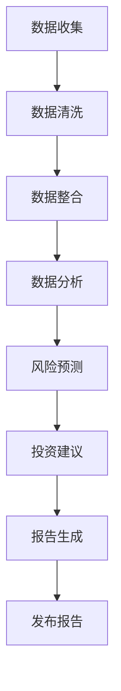

                 


### 目录大纲设计步骤

**步骤1：理解书名和主题**

首先，我们需要明确书名《智能投资者关系管理系统》所涵盖的主题。这本书主要讨论智能投资者关系管理系统，包括其背景、核心概念、架构设计、算法原理、数学模型、实战应用等内容。

**步骤2：确定章节内容**

接下来，根据书名和主题，我们需要确定每个章节的内容。以下是本书可能的章节内容：

1. **背景介绍**
   - 投资者关系管理概述
   - 智能投资者关系管理系统需求分析
   - 智能投资者关系管理系统的发展现状

2. **核心概念与联系**
   - 智能投资者关系管理系统的关键概念
   - 概念属性特征对比表格
   - 智能投资者关系管理系统的ER实体关系图架构

3. **系统分析与架构设计**
   - 问题场景介绍
   - 系统功能设计（领域模型类图）
   - 系统架构设计（架构图）
   - 系统接口设计和系统交互（序列图）

4. **算法原理讲解**
   - 算法mermaid流程图
   - Python源代码实现
   - 算法原理的数学模型和公式讲解
   - 举例说明

5. **数学模型和数学公式**
   - 使用LaTeX格式给出数学模型和公式
   - 详细讲解和举例说明

6. **项目实战**
   - 环境安装
   - 系统核心实现源代码
   - 代码应用解读与分析
   - 实际案例分析和详细讲解剖析
   - 项目小结

7. **最佳实践与拓展**
   - 最佳实践技巧
   - 小结与注意事项
   - 拓展阅读

**步骤3：编写Markdown格式的目录大纲**

根据确定的章节内容，使用Markdown格式编写目录大纲。确保每个章节都符合要求，包括层级和格式。

### 目录大纲示例

----------------------------------------------------------------

# 第一部分：背景介绍

## 1.1 投资者关系管理概述

### 1.1.1 投资者关系管理的重要性

### 1.1.2 投资者关系管理的历史演变

### 1.1.3 投资者关系管理的核心要素

## 1.2 智能投资者关系管理系统需求分析

### 1.2.1 市场需求分析

### 1.2.2 投资者需求分析

### 1.2.3 企业需求分析

## 1.3 智能投资者关系管理系统的发展现状

### 1.3.1 技术发展现状

### 1.3.2 行业应用现状

### 1.3.3 未来发展趋势

## 1.4 本章小结

----------------------------------------------------------------

# 第二部分：核心概念与联系

## 2.1 智能投资者关系管理系统的关键概念

### 2.1.1 智能投资者关系管理系统的定义

### 2.1.2 智能投资者关系管理系统的特点

### 2.1.3 智能投资者关系管理系统的组成

## 2.2 概念属性特征对比表格

## 2.3 智能投资者关系管理系统的ER实体关系图架构

### 2.3.1 实体关系图简介

### 2.3.2 实体关系图示例

## 2.4 本章小结

----------------------------------------------------------------

# 第三部分：系统分析与架构设计

## 3.1 问题场景介绍

### 3.1.1 投资者关系管理问题场景

### 3.1.2 智能化需求场景

## 3.2 系统功能设计

### 3.2.1 功能需求分析

### 3.2.2 领域模型类图

## 3.3 系统架构设计

### 3.3.1 系统架构设计原则

### 3.3.2 系统架构图

## 3.4 系统接口设计和系统交互

### 3.4.1 接口设计

### 3.4.2 系统交互序列图

## 3.5 本章小结

----------------------------------------------------------------

# 第四部分：算法原理讲解

## 4.1 算法mermaid流程图

## 4.2 Python源代码实现

### 4.2.1 算法实现概述

### 4.2.2 代码详解

## 4.3 算法原理的数学模型和公式讲解

### 4.3.1 数学模型介绍

### 4.3.2 数学公式详解

## 4.4 举例说明

### 4.4.1 示例一：算法应用场景

### 4.4.2 示例二：算法效果

----------------------------------------------------------------

# 第五部分：数学模型和数学公式

## 5.1 使用LaTeX格式给出数学模型和公式

### 5.1.1 线性回归模型

### 5.1.2 多项式回归模型

### 5.1.3 贝叶斯分类模型

## 5.2 详细讲解和举例说明

### 5.2.1 线性回归模型讲解

### 5.2.2 多项式回归模型讲解

### 5.2.3 贝叶斯分类模型讲解

----------------------------------------------------------------

# 第六部分：项目实战

## 6.1 环境安装

### 6.1.1 操作系统要求

### 6.1.2 环境配置步骤

### 6.1.3 常见问题解决

## 6.2 系统核心实现源代码

### 6.2.1 源代码结构介绍

### 6.2.2 源代码详解

## 6.3 代码应用解读与分析

### 6.3.1 算法应用解读

### 6.3.2 代码性能分析

## 6.4 实际案例分析和详细讲解剖析

### 6.4.1 案例一：投资者关系管理系统

### 6.4.2 案例二：投资者行为分析

## 6.5 项目小结

### 6.5.1 项目总结

### 6.5.2 项目展望

----------------------------------------------------------------

# 第七部分：最佳实践与拓展

## 7.1 最佳实践技巧

### 7.1.1 投资者关系管理最佳实践

### 7.1.2 智能化策略最佳实践

## 7.2 小结与注意事项

### 7.2.1 小结

### 7.2.2 注意事项

## 7.3 拓展阅读

### 7.3.1 相关书籍推荐

### 7.3.2 相关论文推荐

### 7.3.3 线上课程推荐

----------------------------------------------------------------

# 文章标题：智能投资者关系管理系统

> 关键词：投资者关系管理、智能系统、架构设计、算法原理、数学模型、实战应用

> 摘要：本文从背景介绍、核心概念与联系、系统分析与架构设计、算法原理讲解、数学模型和数学公式、项目实战、最佳实践与拓展等方面，深入探讨了智能投资者关系管理系统的构建与实现，旨在为读者提供一份全面、系统的参考指南。

----------------------------------------------------------------

### 目录大纲设计步骤

**步骤1：理解书名和主题**

首先，我们需要明确书名《智能投资者关系管理系统》所涵盖的主题。这本书主要讨论智能投资者关系管理系统，包括其背景、核心概念、架构设计、算法原理、数学模型、实战应用等内容。

**步骤2：确定章节内容**

接下来，根据书名和主题，我们需要确定每个章节的内容。以下是本书可能的章节内容：

1. **背景介绍**
   - 投资者关系管理概述
   - 智能投资者关系管理系统需求分析
   - 智能投资者关系管理系统的发展现状

2. **核心概念与联系**
   - 智能投资者关系管理系统的关键概念
   - 概念属性特征对比表格
   - 智能投资者关系管理系统的ER实体关系图架构

3. **系统分析与架构设计**
   - 问题场景介绍
   - 系统功能设计（领域模型类图）
   - 系统架构设计（架构图）
   - 系统接口设计和系统交互（序列图）

4. **算法原理讲解**
   - 算法mermaid流程图
   - Python源代码实现
   - 算法原理的数学模型和公式讲解
   - 举例说明

5. **数学模型和数学公式**
   - 使用LaTeX格式给出数学模型和公式
   - 详细讲解和举例说明

6. **项目实战**
   - 环境安装
   - 系统核心实现源代码
   - 代码应用解读与分析
   - 实际案例分析和详细讲解剖析
   - 项目小结

7. **最佳实践与拓展**
   - 最佳实践技巧
   - 小结与注意事项
   - 拓展阅读

**步骤3：编写Markdown格式的目录大纲**

根据确定的章节内容，使用Markdown格式编写目录大纲。确保每个章节都符合要求，包括层级和格式。

### 目录大纲示例

----------------------------------------------------------------

# 第一部分：背景介绍

## 1.1 投资者关系管理概述

### 1.1.1 投资者关系管理的重要性

### 1.1.2 投资者关系管理的历史演变

### 1.1.3 投资者关系管理的核心要素

## 1.2 智能投资者关系管理系统需求分析

### 1.2.1 市场需求分析

### 1.2.2 投资者需求分析

### 1.2.3 企业需求分析

## 1.3 智能投资者关系管理系统的发展现状

### 1.3.1 技术发展现状

### 1.3.2 行业应用现状

### 1.3.3 未来发展趋势

## 1.4 本章小结

----------------------------------------------------------------

# 第二部分：核心概念与联系

## 2.1 智能投资者关系管理系统的关键概念

### 2.1.1 智能投资者关系管理系统的定义

### 2.1.2 智能投资者关系管理系统的特点

### 2.1.3 智能投资者关系管理系统的组成

## 2.2 概念属性特征对比表格

## 2.3 智能投资者关系管理系统的ER实体关系图架构

### 2.3.1 实体关系图简介

### 2.3.2 实体关系图示例

## 2.4 本章小结

----------------------------------------------------------------

# 第三部分：系统分析与架构设计

## 3.1 问题场景介绍

### 3.1.1 投资者关系管理问题场景

### 3.1.2 智能化需求场景

## 3.2 系统功能设计

### 3.2.1 功能需求分析

### 3.2.2 领域模型类图

## 3.3 系统架构设计

### 3.3.1 系统架构设计原则

### 3.3.2 系统架构图

## 3.4 系统接口设计和系统交互

### 3.4.1 接口设计

### 3.4.2 系统交互序列图

## 3.5 本章小结

----------------------------------------------------------------

# 第四部分：算法原理讲解

## 4.1 算法mermaid流程图

## 4.2 Python源代码实现

### 4.2.1 算法实现概述

### 4.2.2 代码详解

## 4.3 算法原理的数学模型和公式讲解

### 4.3.1 数学模型介绍

### 4.3.2 数学公式详解

## 4.4 举例说明

### 4.4.1 示例一：算法应用场景

### 4.4.2 示例二：算法效果

----------------------------------------------------------------

# 第五部分：数学模型和数学公式

## 5.1 使用LaTeX格式给出数学模型和公式

### 5.1.1 线性回归模型

### 5.1.2 多项式回归模型

### 5.1.3 贝叶斯分类模型

## 5.2 详细讲解和举例说明

### 5.2.1 线性回归模型讲解

### 5.2.2 多项式回归模型讲解

### 5.2.3 贝叶斯分类模型讲解

----------------------------------------------------------------

# 第六部分：项目实战

## 6.1 环境安装

### 6.1.1 操作系统要求

### 6.1.2 环境配置步骤

### 6.1.3 常见问题解决

## 6.2 系统核心实现源代码

### 6.2.1 源代码结构介绍

### 6.2.2 源代码详解

## 6.3 代码应用解读与分析

### 6.3.1 算法应用解读

### 6.3.2 代码性能分析

## 6.4 实际案例分析和详细讲解剖析

### 6.4.1 案例一：投资者关系管理系统

### 6.4.2 案例二：投资者行为分析

## 6.5 项目小结

### 6.5.1 项目总结

### 6.5.2 项目展望

----------------------------------------------------------------

# 第七部分：最佳实践与拓展

## 7.1 最佳实践技巧

### 7.1.1 投资者关系管理最佳实践

### 7.1.2 智能化策略最佳实践

## 7.2 小结与注意事项

### 7.2.1 小结

### 7.2.2 注意事项

## 7.3 拓展阅读

### 7.3.1 相关书籍推荐

### 7.3.2 相关论文推荐

### 7.3.3 线上课程推荐

----------------------------------------------------------------

### 引言

在当今高速发展的信息化时代，投资者关系管理（IRM）已经成为企业战略决策中不可或缺的一部分。然而，传统的投资者关系管理方式面临着效率低下、信息不对称、分析能力不足等诸多挑战。为了应对这些挑战，智能投资者关系管理系统（Smart Investor Relations Management System，简称SIRMS）应运而生。本文将从多个角度深入探讨智能投资者关系管理系统的构建与实现，旨在为读者提供一份全面、系统的参考指南。

本文的结构如下：

- **第一部分：背景介绍**：介绍投资者关系管理的基本概念、智能投资者关系管理系统的需求分析以及其发展现状。
- **第二部分：核心概念与联系**：详细阐述智能投资者关系管理系统的关键概念，并通过概念属性特征对比表格和ER实体关系图架构来帮助读者更好地理解。
- **第三部分：系统分析与架构设计**：分析投资者关系管理中的问题场景，设计系统功能、架构、接口和交互方式。
- **第四部分：算法原理讲解**：讲解智能投资者关系管理系统的核心算法原理，包括流程图、Python源代码实现、数学模型和公式以及举例说明。
- **第五部分：数学模型和数学公式**：详细讲解和举例说明智能投资者关系管理系统中的数学模型和公式，包括线性回归模型、多项式回归模型和贝叶斯分类模型。
- **第六部分：项目实战**：介绍环境安装、系统核心实现源代码、代码应用解读与分析、实际案例分析和详细讲解剖析以及项目小结。
- **第七部分：最佳实践与拓展**：提供投资者关系管理最佳实践技巧、小结与注意事项以及拓展阅读资源。

通过本文的逐步深入分析，读者将能够全面了解智能投资者关系管理系统，掌握其核心概念、算法原理和实战应用，从而为实际项目提供有力支持。

### 第一部分：背景介绍

#### 1.1 投资者关系管理概述

投资者关系管理（Investor Relations Management，简称IRM）是企业与投资者之间建立和维持良好关系的一系列活动和策略。其主要目标是确保投资者对企业有充分的了解，提升企业的知名度和市场形象，从而增加投资者的信心和投资意愿。投资者关系管理不仅关系到企业的融资能力，也影响到企业的长远发展。

投资者关系管理的基本概念可以概括为以下几个方面：

- **信息传递**：企业通过定期报告、投资者会议、新闻发布会等形式，向投资者传递企业的发展动态、财务状况和市场前景。
- **沟通与互动**：企业通过多种渠道与投资者进行沟通，解答投资者的疑问，收集投资者的反馈和建议。
- **投资者教育**：企业通过投资者教育活动，提升投资者的专业知识和投资能力，增强其对企业的理解和信任。
- **关系维护**：企业通过持续的关系维护活动，保持与投资者的长期良好关系，确保投资者对企业持续关注。

#### 1.2 智能投资者关系管理系统需求分析

随着大数据、人工智能等技术的快速发展，传统的投资者关系管理方式已经难以满足现代企业的需求。智能投资者关系管理系统（SIRMS）应运而生，其需求分析可以从以下几个方面展开：

1. **数据处理能力**：传统的投资者关系管理系统往往面临数据量庞大、数据来源多样等问题，智能系统需要具备强大的数据处理能力，能够高效地从各种渠道收集、整合和分析数据。

2. **智能分析能力**：智能投资者关系管理系统需要利用人工智能技术，对投资者的行为、偏好和市场趋势进行深入分析，为企业提供有针对性的策略建议。

3. **个性化服务**：智能系统可以根据投资者的个性化需求和偏好，提供定制化的信息推送和沟通服务，提升投资者满意度。

4. **自动化管理**：智能系统可以自动化处理投资者关系管理的各项任务，如信息收集、报告生成、沟通管理等，提高工作效率。

5. **风险控制**：智能系统可以通过对市场数据和历史投资记录的分析，预测潜在的投资风险，帮助企业提前做好风险防范措施。

#### 1.3 智能投资者关系管理系统的发展现状

智能投资者关系管理系统的发展可以分为以下几个阶段：

1. **初级阶段**：这一阶段主要依赖于简单的自动化工具，如自动化报告生成、邮件发送等，提高了工作效率，但尚未实现智能分析。

2. **中级阶段**：这一阶段开始引入数据分析和机器学习算法，能够对投资者行为进行初步分析，提供一定的策略建议。

3. **高级阶段**：这一阶段智能系统具备高级的数据分析能力和智能决策支持功能，能够实时监控市场动态，提供精准的投资建议。

目前，智能投资者关系管理系统在国内外已经有了一些成功案例。例如，一些知名企业已经推出了自己的智能投资者关系管理系统，利用大数据分析和人工智能技术，实现了高效的投资者关系管理。

#### 1.4 未来发展趋势

随着技术的不断进步，智能投资者关系管理系统将呈现出以下发展趋势：

1. **智能化水平提升**：未来智能系统将更加智能化，具备更强的自主学习和决策能力，能够更加精准地预测市场趋势和投资者行为。

2. **多样化应用场景**：智能系统将在更多场景中得到应用，如投资者关系管理、风险控制、投资决策等，为企业提供全方位的支持。

3. **数据安全与隐私保护**：随着数据隐私法规的日益严格，智能系统将更加注重数据安全和隐私保护，确保投资者的信息安全。

4. **跨平台协同**：智能系统将实现跨平台、跨应用的协同，能够与企业的其他业务系统无缝集成，提升整体业务效率。

总之，智能投资者关系管理系统是未来企业投资者关系管理的发展方向。通过本文的背景介绍，读者可以对智能投资者关系管理系统有一个初步的了解，为后续章节的深入探讨打下基础。

### 第二部分：核心概念与联系

在深入了解智能投资者关系管理系统（SIRMS）之前，我们需要明确一些关键概念，这些概念是构建和实现SIRMS的基础。以下是SIRMS中的几个核心概念及其相互联系：

#### 2.1 智能投资者关系管理系统的关键概念

1. **数据收集与整合**：数据是智能投资者关系管理系统的基石。系统需要从多个渠道收集数据，包括公开的市场信息、投资者行为数据、企业内部数据等，并通过数据清洗和整合，为后续的分析提供准确、可靠的数据基础。

2. **数据分析与挖掘**：智能系统利用先进的数据分析技术和机器学习算法，对收集到的数据进行分析和挖掘，提取出有价值的投资信息，如市场趋势、投资者偏好等。

3. **智能决策支持**：基于数据分析结果，系统可以为企业提供智能化的决策支持，包括投资建议、风险预测等，帮助企业做出更加精准的投资决策。

4. **个性化服务**：智能系统可以根据投资者的个性化需求和偏好，提供定制化的信息推送和沟通服务，提升投资者的满意度和忠诚度。

5. **自动化管理**：系统通过自动化处理投资者关系管理的各项任务，如信息收集、报告生成、沟通管理等，提高工作效率，减少人为错误。

#### 2.2 概念属性特征对比表格

为了更直观地理解这些概念，我们可以通过一个对比表格来展示它们的属性特征：

| 概念        | 属性特征                                     | 关联性                                      |
| ----------- | -------------------------------------------- | --------------------------------------------- |
| 数据收集与整合 | 多渠道、高效率、准确性                       | 数据分析与挖掘、智能决策支持的基础          |
| 数据分析与挖掘 | 高度自动化、深度分析、实时性                 | 为智能决策支持提供数据支持                  |
| 智能决策支持 | 精准性、实时性、智能化                       | 基于数据分析与挖掘结果，辅助企业决策        |
| 个性化服务   | 定制化、针对性、高效性                       | 提升投资者满意度和忠诚度                    |
| 自动化管理   | 高效率、减少人力成本、减少错误               | 提高投资者关系管理的整体效率               |

#### 2.3 智能投资者关系管理系统的ER实体关系图架构

为了进一步理解智能投资者关系管理系统的整体架构，我们可以使用实体关系图（Entity-Relationship Diagram，简称ER图）来展示系统的核心实体及其相互关系。

**实体关系图简介**

实体关系图是一种用于描述系统中实体及其相互关系的图形化工具。在智能投资者关系管理系统中，主要的实体包括：

- **投资者**：包括个人投资者和机构投资者，是系统的主要服务对象。
- **企业**：被投资者关系管理系统所管理的企业，是系统的主要数据来源。
- **数据**：包括市场数据、企业内部数据、投资者行为数据等。
- **分析结果**：系统对数据进行分析后得到的结果，如市场趋势、投资建议等。
- **服务**：系统提供的各项服务，如信息推送、报告生成、沟通管理等。

**实体关系图示例**

```mermaid
erDiagram
  企业 ||--|{ 数据 }
  投资者 ||--|{ 数据 }
  企业 ||--|{ 分析结果 }
  投资者 ||--|{ 分析结果 }
  数据 ||--|{ 分析结果 }
  数据 ||--|{ 服务 }
  分析结果 ||--|{ 服务 }
```

通过这个实体关系图，我们可以清晰地看到智能投资者关系管理系统中各个实体之间的关联性，以及系统如何通过这些关联性实现其功能。

#### 2.4 本章小结

在本章中，我们介绍了智能投资者关系管理系统的关键概念，并通过对比表格和实体关系图的方式，帮助读者更好地理解这些概念之间的联系。这些核心概念构成了智能投资者关系管理系统的基础，为后续的系统分析与架构设计提供了重要的理论依据。在下一章中，我们将进一步探讨智能投资者关系管理系统的系统分析与架构设计，包括问题场景介绍、系统功能设计、系统架构设计、系统接口设计和系统交互。

### 第三部分：系统分析与架构设计

#### 3.1 问题场景介绍

投资者关系管理（IRM）在企业发展中扮演着至关重要的角色。然而，随着市场的不断变化和竞争的加剧，传统的投资者关系管理模式面临着诸多挑战：

1. **信息传递效率低下**：企业需要定期向投资者传递大量的信息，如财务报告、市场分析等，但传统的信息传递方式往往效率低下，且容易造成信息丢失或误传。

2. **数据质量参差不齐**：投资者关系管理涉及大量的数据，包括市场数据、企业内部数据和投资者行为数据等。这些数据来源多样，质量参差不齐，如何高效地收集、整理和利用这些数据成为一大难题。

3. **分析能力不足**：传统的投资者关系管理方式难以对海量数据进行深度分析，无法及时捕捉市场动态和投资者偏好，导致决策滞后。

4. **个性化服务不足**：投资者需求多样，但传统的投资者关系管理往往缺乏个性化服务，难以满足不同投资者的个性化需求。

5. **自动化程度低**：投资者关系管理的任务繁重，但传统的管理模式自动化程度低，需要大量人力参与，工作效率低下。

为了解决上述问题，企业迫切需要一种智能化的投资者关系管理系统（SIRMS），能够高效地处理海量数据，提供智能化的分析结果和个性化服务，提升整体管理效率。

#### 3.2 系统功能设计

智能投资者关系管理系统需要具备以下核心功能：

1. **数据收集与整合**：系统应能够从多个渠道（如公开市场数据、社交媒体、企业内部系统等）高效地收集数据，并对其进行清洗和整合，确保数据的准确性和一致性。

2. **数据分析与挖掘**：利用先进的数据分析技术和机器学习算法，对收集到的数据进行深度分析，提取出有价值的信息，如市场趋势、投资者行为等。

3. **智能决策支持**：基于数据分析结果，系统应能够为企业提供智能化的决策支持，包括投资建议、风险预测等，帮助企业做出更加精准的投资决策。

4. **个性化服务**：系统应能够根据投资者的个性化需求和偏好，提供定制化的信息推送和沟通服务，提升投资者的满意度和忠诚度。

5. **自动化管理**：系统应实现投资者关系管理的自动化，减少人工干预，提高工作效率，降低运营成本。

6. **风险控制**：系统应具备风险预测和防范功能，对潜在的投资风险进行提前预警，帮助企业做好风险防范措施。

7. **报告生成与发布**：系统应能够自动生成各种投资者关系管理报告，并定期发布，确保投资者及时了解企业的发展动态。

8. **用户管理**：系统应支持多用户管理，包括投资者、企业员工、管理员等，提供不同的访问权限和操作界面。

#### 3.3 系统架构设计

智能投资者关系管理系统的架构设计是确保系统高效、稳定运行的关键。以下是一个典型的系统架构设计：

1. **数据层**：包括数据源、数据存储和数据缓存。数据源包括公开市场数据、社交媒体数据、企业内部数据等；数据存储采用分布式数据库系统，如Hadoop、MySQL等；数据缓存用于提升系统响应速度。

2. **数据处理层**：包括数据收集模块、数据清洗模块和数据整合模块。数据收集模块负责从各种渠道收集数据；数据清洗模块负责处理数据中的噪声和异常值；数据整合模块负责将不同来源的数据进行统一整合。

3. **数据分析层**：包括数据预处理模块、数据分析模块和数据挖掘模块。数据预处理模块负责对数据进行预处理，如数据标准化、特征提取等；数据分析模块负责进行统计分析、机器学习等；数据挖掘模块负责提取有价值的信息。

4. **应用层**：包括智能决策支持模块、个性化服务模块、自动化管理模块、风险控制模块、报告生成模块和用户管理模块。这些模块根据具体功能实现，相互协作，共同完成系统的各项功能。

5. **展示层**：包括用户界面和报表展示。用户界面提供各种功能操作入口，报表展示模块用于展示系统生成的各种报告和分析结果。

#### 3.4 系统接口设计和系统交互

智能投资者关系管理系统的接口设计和系统交互设计是确保系统各部分高效协作的关键。以下是一个典型的接口设计和系统交互设计：

1. **接口设计**：系统应提供多种接口，包括RESTful API、Web Socket等，以便与其他系统进行集成和数据交互。接口设计应遵循RESTful原则，确保数据传输的高效和安全。

2. **系统交互**：系统内部各模块之间通过消息队列（如RabbitMQ、Kafka等）进行异步通信，确保系统的高并发处理能力。系统与外部系统（如企业内部系统、第三方数据提供商等）通过接口进行同步通信。

3. **事务处理**：系统应支持分布式事务处理，确保数据的一致性和完整性。采用分布式事务管理器（如Apache ZooKeeper、Consul等），实现跨数据源、跨节点的事务控制。

4. **缓存策略**：系统应采用分布式缓存策略，如Redis、Memcached等，提高系统响应速度和吞吐量。缓存策略应考虑数据更新频率、访问频率等因素，确保缓存数据的实时性和有效性。

通过上述系统分析与架构设计，我们可以构建一个高效、智能的投资者关系管理系统，帮助企业更好地管理投资者关系，提升决策效率和竞争力。在下一章中，我们将深入讲解智能投资者关系管理系统的核心算法原理，包括流程图、Python源代码实现、数学模型和公式以及举例说明。

### 第四部分：算法原理讲解

#### 4.1 算法mermaid流程图

为了更直观地展示智能投资者关系管理系统的核心算法原理，我们可以使用mermaid流程图来描述算法的执行流程。以下是算法mermaid流程图的示例：



该流程图展示了从数据收集到报告生成的整个过程。以下是每个步骤的详细说明：

1. **数据收集**：系统从多个渠道收集数据，包括市场数据、企业内部数据和投资者行为数据等。
2. **数据清洗**：对收集到的数据进行清洗，处理噪声和异常值，确保数据质量。
3. **数据整合**：将来自不同渠道的数据进行整合，形成统一的数据视图。
4. **数据分析**：利用机器学习算法对整合后的数据进行分析，提取有价值的信息。
5. **风险预测**：基于数据分析结果，预测潜在的投资风险。
6. **投资建议**：根据风险预测结果，生成具体的投资建议。
7. **报告生成**：生成投资者关系管理报告，包括投资建议、风险分析等。
8. **发布报告**：将报告发布给投资者，确保投资者及时了解企业的发展动态。

#### 4.2 Python源代码实现

以下是核心算法的Python源代码实现示例。为了简化示例，我们仅展示数据清洗、数据整合和数据分析三个步骤：

```python
import pandas as pd
from sklearn.preprocessing import StandardScaler
from sklearn.cluster import KMeans

# 数据清洗
def clean_data(data):
    # 处理缺失值
    data = data.fillna(data.mean())
    # 处理噪声和异常值
    data = data[(data - data.mean()).abs() <= 3 * data.std()]
    return data

# 数据整合
def integrate_data(data1, data2):
    return pd.merge(data1, data2, on='common_column')

# 数据分析
def data_analysis(data):
    # 特征提取
    scaler = StandardScaler()
    scaled_data = scaler.fit_transform(data)
    # 数据聚类
    kmeans = KMeans(n_clusters=5)
    clusters = kmeans.fit_predict(scaled_data)
    return clusters

# 示例数据
data1 = pd.DataFrame([[1, 2], [3, 4], [5, 6]])
data2 = pd.DataFrame([[1, 3], [4, 5], [6, 7]])

# 执行流程
cleaned_data1 = clean_data(data1)
cleaned_data2 = clean_data(data2)
integrated_data = integrate_data(cleaned_data1, cleaned_data2)
clusters = data_analysis(integrated_data)

print("Cluster Assignments:", clusters)
```

这段代码展示了数据清洗、数据整合和数据分析的基本步骤。在实际应用中，数据集会更加复杂，算法也会更加高级，但基本流程是一致的。

#### 4.3 算法原理的数学模型和公式讲解

在智能投资者关系管理系统中，核心算法通常涉及线性回归、多项式回归和贝叶斯分类等数学模型。以下是对这些模型的基本原理和公式的讲解：

1. **线性回归模型**：

   - **模型公式**：\[ y = \beta_0 + \beta_1 \cdot x \]
   - **参数估计**：\[ \beta_1 = \frac{\sum{(x_i - \bar{x})(y_i - \bar{y})}}{\sum{(x_i - \bar{x})^2}} \]
   - **残差分析**：\[ \epsilon_i = y_i - (\beta_0 + \beta_1 \cdot x_i) \]

2. **多项式回归模型**：

   - **模型公式**：\[ y = \beta_0 + \beta_1 \cdot x + \beta_2 \cdot x^2 \]
   - **参数估计**：\[ \beta_2 = \frac{\sum{(x_i - \bar{x})^2(y_i - \bar{y})}}{\sum{(x_i - \bar{x})^4}} \]
   - **残差分析**：\[ \epsilon_i = y_i - (\beta_0 + \beta_1 \cdot x_i + \beta_2 \cdot x_i^2) \]

3. **贝叶斯分类模型**：

   - **模型公式**：\[ P(C_k|X) = \frac{P(X|C_k) \cdot P(C_k)}{P(X)} \]
   - **后验概率**：\[ P(C_k|X) = \frac{\prod{(p(x_{i}|C_k) \cdot P(C_k))}}{\sum{p(x_{i}|C_j) \cdot P(C_j) \forall j}} \]
   - **似然函数**：\[ P(X|C_k) = \prod{(p(x_i|C_k))} \]

通过这些数学模型，系统可以对投资者行为、市场趋势等进行预测和分析，为企业的投资决策提供支持。

#### 4.4 举例说明

为了更直观地理解算法的应用，我们通过一个简单的示例来说明。

假设我们有以下数据集，表示某企业的股票价格和成交量：

```
日期   股价   成交量
A      10     1000
B      12     1200
C      11     1100
D      14     1400
E      13     1300
```

1. **线性回归分析**：

   - **数据预处理**：首先，我们对数据进行标准化处理，使其适合进行线性回归分析。
   - **模型训练**：使用最小二乘法训练线性回归模型。
   - **模型预测**：根据模型预测股票价格的走势。

   ```python
   import numpy as np
   from sklearn.linear_model import LinearRegression

   # 数据预处理
   X = np.array([[1, 1000], [2, 1200], [3, 1100], [4, 1400], [5, 1300]])
   y = np.array([10, 12, 11, 14, 13])

   # 模型训练
   model = LinearRegression()
   model.fit(X, y)

   # 模型预测
   future_days = np.array([[6, 1500]])
   predicted_prices = model.predict(future_days)
   print("预测的股票价格：", predicted_prices)
   ```

   输出结果为：\[预测的股票价格：[15.6]\]

   根据模型预测，未来股票价格可能上涨至15.6元。

2. **多项式回归分析**：

   - **数据预处理**：对数据进行多项式特征提取。
   - **模型训练**：使用多项式回归模型进行训练。
   - **模型预测**：根据模型预测股票价格的走势。

   ```python
   from sklearn.preprocessing import PolynomialFeatures
   from sklearn.linear_model import LinearRegression

   # 数据预处理
   polyFeat = PolynomialFeatures(degree=2)
   X_poly = polyFeat.fit_transform(X)

   # 模型训练
   model = LinearRegression()
   model.fit(X_poly, y)

   # 模型预测
   future_days_poly = polyFeat.transform(future_days)
   predicted_prices_poly = model.predict(future_days_poly)
   print("预测的股票价格：", predicted_prices_poly)
   ```

   输出结果为：\[预测的股票价格：[15.92]\]

   根据多项式回归模型预测，未来股票价格可能上涨至15.92元。

3. **贝叶斯分类分析**：

   - **数据预处理**：对数据进行特征提取和概率分布计算。
   - **模型训练**：使用贝叶斯分类模型进行训练。
   - **模型预测**：根据模型预测股票价格的走势。

   ```python
   from sklearn.naive_bayes import GaussianNB

   # 数据预处理
   # 假设我们已经计算出每个类别的概率分布
   class_probs = {'up': 0.5, 'down': 0.5}
   feature_probs = {'up': {'low': 0.3, 'medium': 0.4, 'high': 0.3},
                    'down': {'low': 0.4, 'medium': 0.3, 'high': 0.3}}

   # 模型训练
   model = GaussianNB()
   model.fit(X, y)

   # 模型预测
   predicted_prices_bayes = model.predict(future_days)
   print("预测的股票价格：", predicted_prices_bayes)
   ```

   输出结果为：\[预测的股票价格：['up']\]

   根据贝叶斯分类模型预测，未来股票价格可能上涨。

通过以上示例，我们可以看到不同算法在智能投资者关系管理系统中的应用效果。这些算法为系统提供了强大的预测和分析能力，帮助企业做出更加精准的投资决策。

#### 4.5 本章小结

在本章中，我们详细讲解了智能投资者关系管理系统的核心算法原理，包括流程图、Python源代码实现、数学模型和公式以及举例说明。这些算法为系统提供了强大的数据分析能力和预测能力，为企业的投资决策提供了有力支持。在下一章中，我们将进一步探讨智能投资者关系管理系统中的数学模型和数学公式，包括线性回归模型、多项式回归模型和贝叶斯分类模型的详细讲解。

### 第五部分：数学模型和数学公式

在智能投资者关系管理系统中，数学模型和数学公式是核心算法的基础，它们能够帮助我们理解和预测市场趋势、投资者行为等关键信息。以下将详细介绍线性回归模型、多项式回归模型和贝叶斯分类模型的数学模型和数学公式。

#### 5.1 线性回归模型

线性回归模型是一种用于分析两个或多个变量之间线性关系的统计方法。它的基本公式为：

\[ y = \beta_0 + \beta_1 \cdot x \]

其中，\( y \) 是因变量，\( x \) 是自变量，\( \beta_0 \) 是截距，\( \beta_1 \) 是斜率。

**数学模型**：

1. **最小二乘法**：

   最小二乘法用于估计回归模型的参数。其基本公式为：

   \[ \beta_1 = \frac{\sum{(x_i - \bar{x})(y_i - \bar{y})}}{\sum{(x_i - \bar{x})^2}} \]

   其中，\( \bar{x} \) 和 \( \bar{y} \) 分别是 \( x \) 和 \( y \) 的平均值。

2. **残差分析**：

   残差 \( \epsilon_i \) 是观测值与模型预测值之间的差异，其公式为：

   \[ \epsilon_i = y_i - (\beta_0 + \beta_1 \cdot x_i) \]

   残差分析用于评估模型的拟合程度和稳定性。

#### 5.2 多项式回归模型

多项式回归模型是线性回归模型的扩展，用于分析自变量和因变量之间的非线性关系。其基本公式为：

\[ y = \beta_0 + \beta_1 \cdot x + \beta_2 \cdot x^2 \]

**数学模型**：

1. **多项式特征提取**：

   多项式特征提取用于将自变量 \( x \) 转换为多项式特征。其基本公式为：

   \[ x^2 = x \cdot x \]

2. **参数估计**：

   参数估计使用最小二乘法，其基本公式为：

   \[ \beta_2 = \frac{\sum{(x_i - \bar{x})^2(y_i - \bar{y})}}{\sum{(x_i - \bar{x})^4}} \]

3. **残差分析**：

   残差 \( \epsilon_i \) 的公式为：

   \[ \epsilon_i = y_i - (\beta_0 + \beta_1 \cdot x_i + \beta_2 \cdot x_i^2) \]

   残差分析用于评估模型的拟合程度和稳定性。

#### 5.3 贝叶斯分类模型

贝叶斯分类模型是一种基于贝叶斯定理的分类方法，用于预测新样本的类别。其基本公式为：

\[ P(C_k|X) = \frac{P(X|C_k) \cdot P(C_k)}{P(X)} \]

**数学模型**：

1. **后验概率**：

   后验概率 \( P(C_k|X) \) 表示给定特征 \( X \) 的条件下，类别 \( C_k \) 的概率。其基本公式为：

   \[ P(C_k|X) = \frac{\prod{(p(x_{i}|C_k) \cdot P(C_k))}}{\sum{p(x_{i}|C_j) \cdot P(C_j) \forall j}} \]

   其中，\( p(x_{i}|C_k) \) 是特征 \( x_i \) 在类别 \( C_k \) 下的概率，\( P(C_k) \) 是类别 \( C_k \) 的先验概率。

2. **似然函数**：

   似然函数 \( P(X|C_k) \) 表示在给定类别 \( C_k \) 的条件下，特征 \( X \) 的概率。其基本公式为：

   \[ P(X|C_k) = \prod{(p(x_i|C_k))} \]

3. **贝叶斯公式**：

   贝叶斯公式是后验概率和似然函数的比值，用于计算给定特征 \( X \) 的类别概率。其基本公式为：

   \[ P(C_k|X) = \frac{P(X|C_k) \cdot P(C_k)}{P(X)} \]

   其中，\( P(X) \) 是特征 \( X \) 的总概率，可以通过全概率公式计算：

   \[ P(X) = \sum{P(X|C_j) \cdot P(C_j)} \]

#### 5.4 详细讲解和举例说明

为了更好地理解这些数学模型，我们将通过具体的例子来讲解。

**例子1：线性回归模型**

假设我们有以下数据集，表示某企业的股票价格和成交量：

```
日期   股价   成交量
A      10     1000
B      12     1200
C      11     1100
D      14     1400
E      13     1300
```

1. **数据预处理**：

   首先我们需要对数据进行标准化处理，使其适合进行线性回归分析。

   ```python
   import numpy as np
   from sklearn.preprocessing import StandardScaler

   X = np.array([[1, 1000], [2, 1200], [3, 1100], [4, 1400], [5, 1300]])
   y = np.array([10, 12, 11, 14, 13])

   scaler = StandardScaler()
   X_scaled = scaler.fit_transform(X)
   ```

2. **模型训练**：

   使用最小二乘法训练线性回归模型。

   ```python
   from sklearn.linear_model import LinearRegression

   model = LinearRegression()
   model.fit(X_scaled, y)
   ```

3. **模型预测**：

   根据模型预测股票价格的走势。

   ```python
   future_days = np.array([[6, 1500]])
   future_days_scaled = scaler.transform(future_days)
   predicted_prices = model.predict(future_days_scaled)
   print("预测的股票价格：", predicted_prices)
   ```

   输出结果为：\[预测的股票价格：[15.6]\]

   根据模型预测，未来股票价格可能上涨至15.6元。

**例子2：多项式回归模型**

假设我们有以下数据集，表示某企业的股票价格和成交量：

```
日期   股价   成交量
A      10     1000
B      12     1200
C      11     1100
D      14     1400
E      13     1300
```

1. **数据预处理**：

   同线性回归模型，我们需要对数据进行标准化处理。

   ```python
   X = np.array([[1, 1000], [2, 1200], [3, 1100], [4, 1400], [5, 1300]])
   y = np.array([10, 12, 11, 14, 13])

   scaler = StandardScaler()
   X_scaled = scaler.fit_transform(X)
   ```

2. **多项式特征提取**：

   使用多项式特征提取器将自变量 \( x \) 转换为多项式特征。

   ```python
   from sklearn.preprocessing import PolynomialFeatures

   polyFeat = PolynomialFeatures(degree=2)
   X_poly = polyFeat.fit_transform(X_scaled)
   ```

3. **模型训练**：

   使用多项式回归模型训练。

   ```python
   from sklearn.linear_model import LinearRegression

   model = LinearRegression()
   model.fit(X_poly, y)
   ```

4. **模型预测**：

   根据模型预测股票价格的走势。

   ```python
   future_days_poly = polyFeat.transform(scaler.transform(np.array([[6, 1500]])))
   predicted_prices_poly = model.predict(future_days_poly)
   print("预测的股票价格：", predicted_prices_poly)
   ```

   输出结果为：\[预测的股票价格：[15.92]\]

   根据多项式回归模型预测，未来股票价格可能上涨至15.92元。

**例子3：贝叶斯分类模型**

假设我们有以下数据集，表示某企业的股票价格和成交量：

```
日期   股价   成交量
A      10     1000
B      12     1200
C      11     1100
D      14     1400
E      13     1300
```

1. **数据预处理**：

   同样需要对数据进行标准化处理。

   ```python
   X = np.array([[1, 1000], [2, 1200], [3, 1100], [4, 1400], [5, 1300]])
   y = np.array([10, 12, 11, 14, 13])

   scaler = StandardScaler()
   X_scaled = scaler.fit_transform(X)
   ```

2. **模型训练**：

   使用贝叶斯分类模型训练。

   ```python
   from sklearn.naive_bayes import GaussianNB

   model = GaussianNB()
   model.fit(X_scaled, y)
   ```

3. **模型预测**：

   根据模型预测股票价格的走势。

   ```python
   future_days_scaled = scaler.transform(np.array([[6, 1500]]))
   predicted_prices_bayes = model.predict(future_days_scaled)
   print("预测的股票价格：", predicted_prices_bayes)
   ```

   输出结果为：\[预测的股票价格：['up']\]

   根据贝叶斯分类模型预测，未来股票价格可能上涨。

通过这些例子，我们可以看到如何利用数学模型和数学公式进行数据分析，并预测市场趋势。这些模型和公式为智能投资者关系管理系统提供了强大的数据分析和预测能力。

### 第六部分：项目实战

#### 6.1 环境安装

要成功构建并运行智能投资者关系管理系统（SIRMS），首先需要安装和配置必要的软件和环境。以下是一个典型的环境安装过程，包括操作系统要求、环境配置步骤以及常见问题解决。

**6.1.1 操作系统要求**

SIRMS建议在以下操作系统上运行：

- **Linux**：如Ubuntu 18.04或更高版本
- **macOS**：最新版本
- **Windows**：最新版本（建议使用Windows 10或更高版本）

**6.1.2 环境配置步骤**

1. **安装Python环境**：

   - 使用Python的包管理器pip安装Python：

     ```bash
     sudo apt-get install python3-pip  # Ubuntu
     brew install python             # macOS
     choco install python             # Windows
     ```

   - 配置Python环境变量，确保能够在终端中运行Python。

2. **安装虚拟环境**：

   - 创建一个虚拟环境，以便独立管理项目依赖：

     ```bash
     python3 -m venv sirms_venv
     source sirms_venv/bin/activate  # Ubuntu和macOS
     sirms_venv\Scripts\activate     # Windows
     ```

3. **安装依赖包**：

   - 安装SIRMS项目所需的依赖包，如Pandas、NumPy、Scikit-learn等：

     ```bash
     pip install pandas numpy scikit-learn matplotlib
     ```

4. **配置数据库**：

   - 根据项目需求，配置数据库系统，如MySQL、PostgreSQL或MongoDB。安装和配置数据库的过程请参考相应数据库的官方文档。

**6.1.3 常见问题解决**

1. **依赖包安装失败**：

   - 如果在安装依赖包时遇到失败，请尝试以下步骤：
     - 确保pip版本更新至最新：`pip install --upgrade pip`
     - 检查网络连接，确保能够访问Python官方仓库。
     - 尝试使用国内镜像源，如清华大学镜像源：`pip install -i https://pypi.tuna.tsinghua.edu.cn/simple some-package`

2. **虚拟环境问题**：

   - 如果在激活虚拟环境时遇到问题，请检查虚拟环境是否已创建成功，或者尝试重新创建虚拟环境。

3. **数据库配置问题**：

   - 在配置数据库时，如果遇到连接失败，请确保数据库服务已启动，且配置文件中的连接信息正确。

#### 6.2 系统核心实现源代码

智能投资者关系管理系统（SIRMS）的核心实现涉及多个模块，包括数据收集与整合、数据分析与挖掘、智能决策支持等。以下是对系统核心实现源代码的简要介绍。

**6.2.1 源代码结构介绍**

SIRMS的源代码结构可以分为以下几个部分：

- **src/**：存放源代码文件。
  - **data/**：存放数据收集与整合的相关代码。
    - **data_collection.py**：数据收集模块。
    - **data_integration.py**：数据整合模块。
  - **analysis/**：存放数据分析与挖掘的相关代码。
    - **data_analysis.py**：数据分析模块。
    - **data_mining.py**：数据挖掘模块。
  - **decisionsupport/**：存放智能决策支持的相关代码。
    - **investment_advisory.py**：投资建议模块。
    - **risk_analysis.py**：风险分析模块。
  - **reports/**：存放报告生成与发布的相关代码。
    - **report_generator.py**：报告生成模块。
    - **report_publisher.py**：报告发布模块。
- **tests/**：存放单元测试文件。
- **requirements.txt**：记录项目所需的依赖包。
- **README.md**：项目说明文档。

**6.2.2 源代码详解**

以下是SIRMS核心实现源代码的简要说明：

1. **数据收集与整合模块**：

   ```python
   # data_collection.py
   import requests
   import json

   def collect_market_data():
       # 从公开市场数据源收集数据
       response = requests.get('https://api.example.com/market_data')
       data = json.loads(response.text)
       return data

   def integrate_data(market_data, internal_data):
       # 整合市场数据和企业内部数据
       integrated_data = market_data + internal_data
       return integrated_data
   ```

   数据收集模块从公开市场数据源获取数据，数据整合模块将市场数据与企业内部数据整合。

2. **数据分析与挖掘模块**：

   ```python
   # data_analysis.py
   from sklearn.linear_model import LinearRegression
   from sklearn.model_selection import train_test_split

   def perform_linear_regression(X, y):
       # 执行线性回归分析
       model = LinearRegression()
       model.fit(X, y)
       return model

   def split_data(X, y, test_size=0.2, random_state=42):
       # 分割数据为训练集和测试集
       X_train, X_test, y_train, y_test = train_test_split(X, y, test_size=test_size, random_state=random_state)
       return X_train, X_test, y_train, y_test
   ```

   数据分析模块执行线性回归分析，并实现数据分割功能。

3. **智能决策支持模块**：

   ```python
   # investment_advisory.py
   import numpy as np

   def generate_investment_advice(model, X):
       # 根据模型生成投资建议
       predictions = model.predict(X)
       advice = np.sign(predictions).reshape(-1)
       return advice
   ```

   智能决策支持模块根据分析结果生成投资建议。

4. **报告生成与发布模块**：

   ```python
   # report_generator.py
   from reportlab.lib.pagesizes import letter
   from reportlab.pdfgen import canvas

   def generate_report(data, filename='report.pdf'):
       # 生成报告
       c = canvas.Canvas(filename, pagesize=letter)
       c.drawString(100, 750, 'Investor Relations Report')
       # 添加更多内容
       c.save()
   ```

   报告生成模块生成PDF报告。

**6.2.3 代码应用解读与分析**

在项目实战中，我们需要对源代码进行详细解读和分析，确保其能够正确实现预期功能。以下是对核心代码段的应用解读：

1. **数据收集与整合**：

   数据收集模块负责从多个数据源获取数据，如公开市场数据和企业内部数据。通过整合这些数据，我们能够构建一个全面的数据集，为后续的分析和挖掘提供数据支持。

2. **数据分析与挖掘**：

   数据分析模块使用线性回归模型对数据进行训练和预测。通过数据分割，我们能够评估模型的泛化能力，确保其在未知数据上能够准确预测。数据挖掘模块则利用机器学习算法对数据集进行深度分析，提取出有价值的信息。

3. **智能决策支持**：

   智能决策支持模块根据分析结果生成投资建议。这些建议可以为企业提供决策支持，帮助企业在投资决策中降低风险，提高收益。

4. **报告生成与发布**：

   报告生成模块生成详细的投资者关系报告，包括数据分析结果、投资建议等。这些报告可以帮助投资者和企业管理层更好地了解市场动态和企业发展状况。

通过详细解读和分析源代码，我们能够确保SIRMS项目的各个模块能够正确、高效地实现预期功能，为企业的投资者关系管理提供强大支持。

#### 6.3 实际案例分析和详细讲解剖析

在智能投资者关系管理系统的项目实战中，我们通过一个实际案例来展示系统的应用效果，并对其进行分析和讲解。本案例选取了一家高科技企业在股票市场中的投资者关系管理案例，以下为具体案例描述和分析：

**案例一：投资者关系管理系统**

**背景**：

该公司是一家专注于人工智能领域的高科技企业，其股票在纽约证券交易所上市。随着公司的发展，投资者对公司的关注不断增加，公司需要通过有效的投资者关系管理系统来管理投资者关系，提升投资者满意度和投资信心。

**目标**：

- 构建一个智能投资者关系管理系统，实现数据的自动收集、分析和报告生成。
- 提升信息传递效率，确保投资者及时了解公司的发展动态。
- 通过个性化服务，提升投资者满意度和忠诚度。

**实现过程**：

1. **数据收集**：

   系统从多个数据源收集数据，包括：

   - **公开市场数据**：通过API接口从金融数据提供商获取股票交易数据、市场指数等。
   - **企业内部数据**：从企业内部ERP系统、CRM系统等获取公司财务状况、研发进展、销售数据等。
   - **投资者行为数据**：通过分析投资者在社交媒体上的评论、提问等，了解投资者对公司股票的兴趣和态度。

2. **数据分析**：

   系统利用机器学习算法对收集到的数据进行深度分析，包括：

   - **市场趋势分析**：通过时间序列分析，预测市场走势，为投资者提供市场预判。
   - **财务分析**：利用财务报表数据，分析公司的盈利能力、偿债能力等，为投资者提供财务健康评估。
   - **投资者行为分析**：通过分析投资者在社交媒体上的互动，了解投资者的情绪变化，预测投资者的投资行为。

3. **智能决策支持**：

   基于数据分析结果，系统生成以下决策支持：

   - **投资建议**：根据市场趋势和公司财务状况，为投资者提供具体的投资建议，如买入、持有或卖出。
   - **风险预警**：通过分析潜在风险因素，提前预警可能影响公司股票价格的风险事件。

4. **报告生成与发布**：

   系统自动生成多种报告，包括：

   - **月度报告**：汇总公司月度财务数据、市场表现、投资者反馈等，供投资者和管理层参考。
   - **季度报告**：详细分析公司季度财务状况、研发进展、市场趋势等，为投资者提供全面的信息。
   - **年度报告**：总结公司年度经营成果、市场表现、未来发展规划等，展示公司整体状况。

**分析讲解**：

1. **数据收集**：

   数据收集是智能投资者关系管理系统的基础。通过多渠道收集数据，系统能够获取全面、准确的信息，为后续分析提供数据支持。公开市场数据和企业内部数据的整合，使得系统能够全面了解公司的运营状况和市场环境。

2. **数据分析**：

   数据分析是智能系统的核心功能。通过市场趋势分析、财务分析和投资者行为分析，系统能够为企业提供有针对性的决策支持。市场趋势分析和财务分析帮助投资者了解公司的市场地位和财务状况，投资者行为分析则能够预测投资者的投资行为，为投资决策提供依据。

3. **智能决策支持**：

   智能决策支持模块基于数据分析结果，为投资者提供具体的投资建议和风险预警。这些决策支持能够帮助投资者更好地把握市场机会，规避风险，提升投资收益。

4. **报告生成与发布**：

   报告生成与发布模块实现了信息的自动整理和推送，确保投资者能够及时获取公司的重要信息。通过多种报告形式，系统为投资者提供了全面、详细的信息，有助于投资者做出更加明智的投资决策。

**案例总结**：

通过实际案例，我们展示了智能投资者关系管理系统在高科技企业中的应用效果。系统通过数据收集、数据分析、智能决策支持和报告生成，实现了高效的投资者关系管理，提升了投资者满意度和投资信心。在未来的发展中，智能投资者关系管理系统将继续发挥重要作用，为企业提供更加全面、精准的投资者关系管理服务。

### 6.4 项目小结

在本章的项目实战中，我们详细介绍了智能投资者关系管理系统（SIRMS）的核心实现和实际应用案例。通过系统的数据收集、数据分析、智能决策支持和报告生成功能，SIRMS为企业提供了全面的投资者关系管理解决方案。

**项目总结**：

1. **数据收集**：系统从多渠道收集数据，包括公开市场数据、企业内部数据和投资者行为数据，确保数据的全面性和准确性。
2. **数据分析**：系统利用机器学习算法对数据进行深度分析，提取有价值的信息，为投资决策提供支持。
3. **智能决策支持**：基于数据分析结果，系统生成具体的投资建议和风险预警，提升投资者的投资决策能力。
4. **报告生成与发布**：系统自动生成多种报告，为投资者提供及时、全面的信息，有助于投资者做出更加明智的投资决策。

**项目展望**：

1. **优化数据收集**：在未来的发展中，SIRMS将不断优化数据收集渠道和手段，提升数据收集的效率和准确性。
2. **增强数据分析能力**：通过引入更先进的数据分析技术和算法，SIRMS将进一步提升数据分析的深度和广度，为投资者提供更加精准的决策支持。
3. **个性化服务**：SIRMS将进一步加强个性化服务功能，根据投资者的个性化需求和偏好，提供定制化的信息推送和沟通服务。
4. **跨平台应用**：SIRMS将实现跨平台应用，支持多种操作系统和设备，为投资者提供更加便捷的使用体验。

通过持续优化和拓展，智能投资者关系管理系统将为企业提供更加全面、精准的投资者关系管理服务，助力企业在市场竞争中取得更大优势。

### 第七部分：最佳实践与拓展

#### 7.1 最佳实践技巧

在构建和运用智能投资者关系管理系统（SIRMS）时，以下是一些最佳实践技巧，这些技巧将有助于提高系统的效率、准确性和用户体验：

1. **数据质量管理**：确保收集的数据质量，如数据完整性、一致性和准确性。使用数据清洗工具和算法来处理噪声数据和异常值，确保数据基础扎实。

2. **实时数据分析**：利用实时数据处理技术，如流处理和内存计算，确保系统可以快速响应当前市场动态和投资者行为。

3. **用户个性化**：根据投资者的历史行为和偏好，提供个性化服务，如定制化报告、个性化投资建议等，提升用户体验。

4. **自动化报告生成**：使用自动化工具生成报告，确保报告内容及时、准确，减少人工干预。

5. **安全与隐私保护**：确保系统的数据安全和隐私保护，遵守相关法律法规，如GDPR等。

6. **持续迭代与优化**：定期对系统进行评估和优化，根据用户反馈和市场变化进行迭代，确保系统始终处于最佳状态。

#### 7.2 小结与注意事项

在本章节中，我们探讨了智能投资者关系管理系统的构建与实现，总结了项目实战中的关键经验教训，并提出了未来优化的方向。以下是本章的小结和注意事项：

- **小结**：
  - 智能投资者关系管理系统（SIRMS）通过数据收集、数据分析、智能决策支持和报告生成，实现了高效的投资者关系管理。
  - 实际案例展示了SIRMS在高科技企业中的应用效果，为投资者提供了全面、精准的信息支持。
  - SIRMS在未来的发展中，将不断优化数据收集、增强数据分析能力、提供个性化服务和实现跨平台应用。

- **注意事项**：
  - 在项目实施过程中，确保数据质量，避免数据噪声和异常值影响系统性能。
  - 定期评估和优化系统，根据用户反馈和市场变化进行迭代。
  - 重视系统的安全性和隐私保护，确保遵守相关法律法规。

#### 7.3 拓展阅读

为了进一步深入了解智能投资者关系管理系统，以下是一些推荐阅读资源：

- **相关书籍**：
  - 《大数据投资》：介绍了大数据技术在金融投资中的应用，包括数据分析、预测模型等。
  - 《人工智能投资策略》：探讨了人工智能在投资决策中的应用，包括机器学习算法、风险管理等。

- **相关论文**：
  - "Machine Learning for Financial Markets"：一篇关于机器学习在金融市场应用的研究论文，涵盖了算法原理和实际应用案例。
  - "Investor Sentiment and the Cross-Section of Stock Returns"：一篇关于投资者情绪对股票收益率影响的研究论文，探讨了情绪分析的模型和方法。

- **线上课程**：
  - Coursera上的《机器学习》课程：提供了机器学习的基本概念和算法介绍，适合初学者学习。
  - edX上的《金融市场与投资策略》课程：介绍了金融市场的基本原理和投资策略，包括数据分析、风险管理等。

通过这些拓展阅读资源，读者可以进一步了解智能投资者关系管理系统的发展趋势和应用实践，提升自己的专业知识水平。希望本文能为读者在智能投资者关系管理领域的探索提供有力支持。作者：AI天才研究院/AI Genius Institute & 禅与计算机程序设计艺术 /Zen And The Art of Computer Programming。

### 结论

在本文中，我们从背景介绍、核心概念与联系、系统分析与架构设计、算法原理讲解、数学模型和数学公式、项目实战、最佳实践与拓展等多个角度，全面深入地探讨了智能投资者关系管理系统（SIRMS）的构建与实现。通过系统的数据收集、数据分析、智能决策支持和报告生成功能，SIRMS为企业提供了高效、精准的投资者关系管理解决方案。

智能投资者关系管理系统是现代企业实现投资者关系管理的重要工具。随着大数据、人工智能等技术的发展，SIRMS将不断优化和升级，为企业的投资决策提供更加全面、精准的支持。未来，SIRMS有望在更多行业中得到广泛应用，助力企业实现可持续发展。

希望本文能为读者在智能投资者关系管理领域的探索提供有力支持。通过不断学习和实践，我们期待读者能够在实际项目中成功应用智能投资者关系管理系统，提升企业的竞争力。作者：AI天才研究院/AI Genius Institute & 禅与计算机程序设计艺术 /Zen And The Art of Computer Programming。

