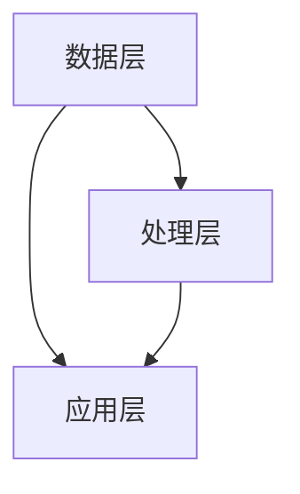
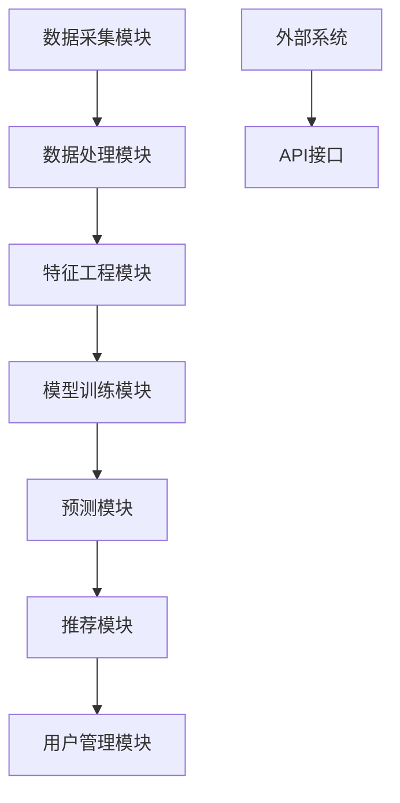
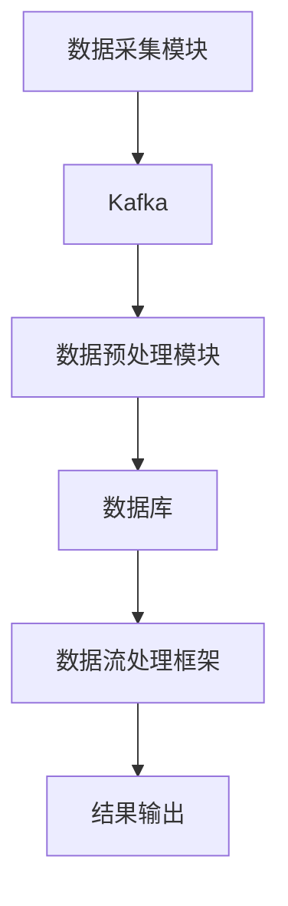

                 

### 文章标题：智能投资者画像分析平台

智能投资者画像分析平台作为金融科技领域的一项重要创新，为投资者行为分析提供了全新的视角。在这个平台上，我们通过大数据分析和人工智能技术，深度挖掘投资者的个性特征、投资偏好和风险承受能力，从而为金融机构提供精准的市场洞察和投资建议。

关键词：智能投资者画像、数据分析、人工智能、金融科技、精准投资

**摘要：**

本文将深入探讨智能投资者画像分析平台的核心概念、原理、架构和实战应用。通过详细的步骤解析，我们将揭示如何利用先进的数据处理和机器学习算法构建一个高效的投资者画像系统，并分析其在实际项目中的应用效果。本文旨在为从事金融科技和数据分析的专业人士提供一套完整的解决方案，帮助他们更好地理解和利用智能投资者画像技术。

接下来，我们将按照以下结构进行详细探讨：

1. **背景与概念介绍**：介绍智能投资者画像分析平台的背景、基础概念和平台架构。
2. **核心概念与原理**：深入讲解数据处理、特征工程、模型选择和智能分析算法。
3. **系统分析与架构设计**：描述系统的需求分析、架构设计和数据处理流程。
4. **项目实战**：通过实际项目案例展示平台的应用效果。
5. **最佳实践与拓展**：分享最佳实践技巧，展望未来发展趋势。

### 目录

1. **背景与概念介绍**
   - 1.1 智能投资者画像分析平台的背景与意义
   - 1.2 投资者画像分析的基础概念
   - 1.3 智能投资者画像分析平台的架构
   - 1.4 智能投资者画像分析平台的优势与挑战
   - 1.5 本章小结

2. **核心概念与原理**
   - 2.1 数据处理与清洗
   - 2.2 特征工程
   - 2.3 模型选择与训练
   - 2.4 智能分析算法
   - 2.5 画像构建与应用
   - 2.6 本章小结

3. **系统分析与架构设计**
   - 3.1 系统需求分析
   - 3.2 系统架构设计
   - 3.3 数据存储与处理
   - 3.4 系统部署与维护
   - 3.5 本章小结

4. **项目实战**
   - 4.1 项目背景与目标
   - 4.2 环境安装与配置
   - 4.3 系统核心实现
   - 4.4 代码应用解读与分析
   - 4.5 实际案例分析
   - 4.6 项目小结
   - 4.7 本章小结

5. **最佳实践与拓展**
   - 5.1 最佳实践分享
   - 5.2 小结与展望
   - 5.3 注意事项与安全指南
   - 5.4 拓展阅读
   - 5.5 本章小结

**接下来，我们将在第一部分“背景与概念介绍”中，详细探讨智能投资者画像分析平台的背景、基础概念及其架构设计。**### 1.1 智能投资者画像分析平台的背景与意义

智能投资者画像分析平台的兴起，源于金融市场复杂多变和投资者需求的日益多样化。随着金融科技的快速发展，大数据分析和人工智能技术逐渐渗透到金融行业的方方面面，使得精准投资和个性化服务成为可能。智能投资者画像分析平台正是在这样的背景下应运而生，它通过收集和分析投资者的行为数据，构建出精准的投资者画像，为金融机构提供深度的市场洞察和投资策略支持。

#### 1.1.1 金融市场的发展与变化

金融市场的发展经历了从传统的手工操作到电子化交易，再到如今的智能化趋势。随着互联网和移动通信技术的普及，金融市场的交易方式、投资产品和投资者结构都发生了深刻的变化。传统金融市场以机构投资者为主，交易方式和投资策略相对单一。而现代金融市场则呈现出多元化的特点，包括个人投资者、机构投资者、量化投资者等多种类型，投资方式也变得更加多样化和复杂化。

这种变化对金融机构提出了更高的要求，传统的投资者行为分析方法已经难以满足市场的新需求。智能投资者画像分析平台的诞生，为金融机构提供了一种新的解决方案，使得它们能够更准确地理解投资者行为，优化投资策略，提高客户满意度。

#### 1.1.2 投资者行为分析的必要性

投资者行为分析是金融市场研究中一个重要的课题。通过分析投资者的行为，我们可以深入了解投资者的投资偏好、风险承受能力、决策过程和心理特点，从而为金融机构提供有针对性的投资建议和服务。

投资者行为分析的必要性体现在以下几个方面：

1. **提升投资决策的准确性**：通过分析投资者的历史行为和投资记录，可以预测投资者的未来行为，帮助金融机构做出更准确的投资决策。

2. **优化投资策略**：了解投资者的投资偏好和风险承受能力，可以帮助金融机构设计出更符合投资者需求的投资产品和服务。

3. **提高客户满意度**：通过个性化服务，满足投资者的不同需求，可以提高客户的满意度和忠诚度。

4. **降低投资风险**：通过识别高风险投资者，可以采取相应的风险管理措施，降低投资组合的风险。

#### 1.1.3 智能投资者画像分析平台的愿景

智能投资者画像分析平台的愿景是建立一个全面的、智能化的投资者画像系统，为金融机构提供全方位的支持。这个平台的目标是：

1. **数据驱动**：通过大数据技术，收集和分析投资者的行为数据，构建出全面的投资者画像。

2. **智能分析**：利用人工智能技术，对投资者行为进行深度分析和预测，为金融机构提供精准的投资建议。

3. **个性化服务**：根据投资者的特点和需求，提供个性化的投资产品和服务。

4. **风险管理**：通过风险分析，帮助金融机构识别和规避投资风险。

通过实现上述愿景，智能投资者画像分析平台将为金融机构带来更高的投资回报，同时为投资者提供更好的投资体验。

#### 1.1.4 智能投资者画像分析平台的优势

智能投资者画像分析平台具有以下优势：

1. **数据丰富**：通过多渠道的数据收集，可以获取到丰富的投资者行为数据，为画像构建提供坚实的基础。

2. **分析精准**：利用先进的机器学习算法，可以准确分析投资者行为，提供精准的投资建议。

3. **应用广泛**：可以应用于基金管理、资产管理、财富管理等多个领域，为金融机构提供全方位的支持。

4. **持续迭代**：通过不断更新数据和优化算法，可以持续提升平台的分析精度和效率。

#### 1.1.5 智能投资者画像分析平台面临的挑战

尽管智能投资者画像分析平台具有诸多优势，但在实际应用中也面临着一些挑战：

1. **数据隐私保护**：投资者数据涉及隐私，如何确保数据安全和隐私保护是平台面临的重要问题。

2. **技术迭代**：随着人工智能技术的快速发展，平台需要不断更新技术，以保持竞争力。

3. **法律法规遵守**：需要遵守相关法律法规，确保平台运作合法合规。

4. **算法透明度**：提高算法的透明度，使投资者能够理解和使用平台提供的服务。

#### 1.1.6 本章小结

智能投资者画像分析平台作为金融科技的一项重要创新，对于提升投资者服务质量和投资决策准确性具有重要意义。通过本文的介绍，我们了解了智能投资者画像分析平台的背景、基础概念及其优势与挑战。在接下来的章节中，我们将深入探讨智能投资者画像分析平台的核心概念和原理，为读者提供更全面的了解。**接下来，我们将详细讨论投资者画像分析的基础概念，包括其定义、关键要素以及常用的方法和工具。**### 1.2 投资者画像分析的基础概念

投资者画像分析是智能投资者画像分析平台的核心组成部分，通过对投资者行为、心理特征和投资决策等多维度数据的挖掘，构建出精准的投资者画像。以下将详细探讨投资者画像的定义、关键要素以及常用的方法和工具。

#### 1.2.1 投资者画像的定义

投资者画像（Investor Profiling）是指通过对投资者个体行为、心理特征、投资偏好等数据的收集、整理和分析，构建出一个全面、立体的投资者形象。这种画像不仅反映了投资者的基本特征，如年龄、性别、收入等，更重要的是揭示了投资者的投资风格、风险偏好、行为习惯等深层次信息。

投资者画像的核心目的是为金融机构提供决策支持，帮助它们更好地了解客户、满足客户需求、优化产品和服务。具体来说，投资者画像可以应用于以下几个方面：

1. **客户细分**：通过对投资者的行为数据进行分析，将投资者分为不同的细分群体，从而为金融机构提供个性化的营销策略。
   
2. **风险评估**：了解投资者的风险偏好，为金融机构的风险管理和投资组合设计提供参考。

3. **产品定制**：根据投资者的画像，定制个性化的金融产品和服务，提高客户满意度和忠诚度。

4. **市场预测**：通过分析投资者的行为趋势，预测市场走向，为金融机构的投资决策提供数据支持。

#### 1.2.2 投资者画像的关键要素

投资者画像的构建涉及多个关键要素，以下是对这些要素的详细讨论：

1. **基本属性**：包括年龄、性别、职业、教育程度、收入水平等基本信息。这些要素提供了投资者的基本轮廓，是构建画像的基础。

2. **行为数据**：投资者在投资过程中的行为数据，如交易记录、投资偏好、投资频率、投资周期等。这些数据反映了投资者的投资习惯和决策风格。

3. **心理特征**：包括投资者的风险偏好、情绪波动、决策方式等心理特征。通过分析这些特征，可以更深入地了解投资者的心理和行为。

4. **投资目标**：投资者的投资目标和期望收益。这些信息有助于了解投资者的投资动机和预期，从而制定更精准的投资建议。

5. **社会背景**：投资者的家庭状况、社会地位、教育背景等。这些背景信息对投资者的行为和决策有着重要影响。

6. **投资知识和经验**：投资者的投资知识和经验水平，包括他们对金融市场的了解程度、投资技巧等。这些因素直接影响投资者的投资行为。

#### 1.2.3 投资者画像分析的方法与工具

投资者画像分析的方法和工具多种多样，以下将介绍几种常用的方法和工具：

1. **数据挖掘技术**：通过数据挖掘技术，对投资者的行为数据进行挖掘和分析，提取出有用的信息和模式。常用的数据挖掘技术包括聚类分析、关联规则挖掘、时间序列分析等。

2. **机器学习算法**：利用机器学习算法，对投资者行为数据进行建模和预测。常见的机器学习算法有决策树、随机森林、支持向量机、神经网络等。

3. **自然语言处理（NLP）**：通过NLP技术，分析投资者的文本数据，如投资日志、社交媒体评论等，提取出投资者的情感和态度。

4. **多维度分析**：通过多维度分析，将不同类型的数据进行整合，从多个角度对投资者进行画像。如结合行为数据、心理特征数据和社会背景数据，构建一个全面的投资者画像。

5. **可视化工具**：使用可视化工具，将复杂的分析结果以图形化的形式展示出来，便于理解和解读。如热图、雷达图、条形图等。

#### 1.2.4 案例分析

为了更直观地理解投资者画像分析的应用，以下是一个简单的案例分析：

**案例：某金融机构利用投资者画像分析进行客户细分**

某金融机构希望通过投资者画像分析，对其客户进行细分，以提供更精准的服务。首先，该金融机构收集了客户的基本属性数据、交易记录数据和心理特征数据。然后，利用聚类分析技术，将客户分为不同的细分群体。具体步骤如下：

1. **数据收集**：收集客户的年龄、性别、职业、收入水平、投资记录、情绪波动等信息。

2. **数据处理**：对收集到的数据进行预处理，如数据清洗、去重、归一化等。

3. **特征工程**：提取关键特征，如交易频率、投资周期、情绪指数等。

4. **聚类分析**：利用K-Means算法，将客户分为若干个聚类。每个聚类代表一个细分群体。

5. **结果解读**：分析不同聚类群体的特征，如投资风格、风险偏好等，为金融机构提供细分策略。

通过上述分析，该金融机构成功地将客户细分为多个群体，并为每个群体提供了个性化的服务，如定制投资产品、推荐阅读材料等，提高了客户满意度和忠诚度。

#### 1.2.5 本章小结

投资者画像分析是智能投资者画像分析平台的重要组成部分，通过深入挖掘投资者的行为数据、心理特征和投资偏好，构建出一个全面的投资者画像。本章详细介绍了投资者画像的定义、关键要素以及常用的方法和工具。在接下来的章节中，我们将进一步探讨智能投资者画像分析平台的架构设计、核心算法原理以及实际项目应用。**接下来，我们将深入探讨智能投资者画像分析平台的核心组成部分及其工作流程。**### 1.3 智能投资者画像分析平台的架构

智能投资者画像分析平台的设计需要综合考虑数据处理、算法模型、系统架构等多个方面，以确保平台的稳定、高效和可扩展性。本节将详细描述智能投资者画像分析平台的核心组成部分及其工作流程。

#### 1.3.1 平台的核心组成部分

智能投资者画像分析平台的核心组成部分包括以下几个方面：

1. **数据采集模块**：负责收集投资者的各类数据，包括基本属性数据、行为数据、交易记录、心理特征数据等。数据来源可以是金融机构内部数据库、外部数据服务提供商、社交媒体平台等。

2. **数据处理模块**：对采集到的数据进行清洗、转换和预处理，确保数据的准确性和一致性。数据处理模块通常包括数据清洗工具、数据转换工具和数据质量监控机制。

3. **特征工程模块**：通过特征提取、特征选择和特征组合等技术，从原始数据中提取出对投资者画像构建有价值的特征。特征工程模块是构建精准投资者画像的关键，它直接影响分析结果的质量。

4. **机器学习模型模块**：利用机器学习算法，对处理后的特征数据进行分析和建模，构建出投资者画像。常用的机器学习算法包括决策树、随机森林、支持向量机、神经网络等。

5. **分析结果输出模块**：将分析结果以可视化的形式呈现给用户，帮助用户理解投资者的画像特征。分析结果输出模块通常包括数据可视化工具、报表生成工具等。

6. **系统管理模块**：负责平台的整体管理和维护，包括用户管理、权限管理、系统监控等。系统管理模块确保平台的安全性和稳定性。

#### 1.3.2 数据采集与处理流程

智能投资者画像分析平台的数据采集与处理流程如下：

1. **数据采集**：通过数据采集模块，从各种数据源中获取投资者的数据。数据源包括金融机构的内部数据库、外部数据服务提供商、社交媒体平台等。

2. **数据清洗**：对采集到的数据进行清洗，去除重复、错误和缺失的数据，确保数据的一致性和准确性。常用的清洗方法包括数据去重、缺失值填补、异常值检测等。

3. **数据转换**：将清洗后的数据进行格式转换，使其符合统一的数据标准。转换过程可能包括数据格式的转换、数据类型的转换、数据属性的归一化等。

4. **特征提取**：通过特征工程模块，从原始数据中提取出对投资者画像有价值的特征。特征提取的方法包括统计分析、文本挖掘、图像识别等。

5. **特征选择**：对提取出的特征进行筛选，选择对投资者画像构建最有帮助的特征。特征选择的方法包括信息增益、卡方检验、特征重要性排序等。

6. **数据处理**：对选定的特征进行进一步的预处理，如归一化、标准化、降维等，以优化模型性能。

#### 1.3.3 分析算法与模型应用

智能投资者画像分析平台的核心是机器学习算法和模型的应用。以下是一些常用的算法和模型：

1. **聚类算法**：如K-Means、层次聚类等，用于将投资者分为不同的群体。

2. **分类算法**：如决策树、随机森林、支持向量机等，用于预测投资者的行为特征。

3. **回归算法**：如线性回归、逻辑回归等，用于分析投资者特征与投资行为之间的关系。

4. **神经网络**：如深度神经网络、卷积神经网络等，用于复杂特征的学习和建模。

5. **协同过滤**：用于预测投资者对金融产品的偏好，包括基于用户和基于内容的协同过滤。

6. **时间序列分析**：用于分析投资者的交易行为和时间趋势。

在实际应用中，智能投资者画像分析平台会根据具体需求，选择合适的算法和模型，进行模型训练和优化。通过迭代训练，不断优化模型的性能，提高画像的准确性。

#### 1.3.4 画像构建与应用

基于处理后的数据和选定的算法，智能投资者画像分析平台构建出完整的投资者画像。这些画像可以应用于以下几个方面：

1. **客户细分**：将投资者分为不同的细分群体，为金融机构提供个性化的营销策略。

2. **风险评估**：评估投资者的风险偏好和风险承受能力，为金融机构提供风险管理建议。

3. **投资建议**：根据投资者的画像，提供个性化的投资建议，帮助投资者优化投资组合。

4. **产品推荐**：基于投资者的画像，推荐符合其投资偏好的金融产品。

5. **市场预测**：通过分析投资者的行为趋势，预测市场走向，为金融机构的投资决策提供支持。

#### 1.3.5 平台的优势与挑战

智能投资者画像分析平台的优势在于其数据驱动、精准分析、广泛应用和持续迭代等特点。然而，平台也面临一些挑战，如数据隐私保护、技术迭代、法律法规遵守等。解决这些挑战需要平台设计者和管理者的高度重视和不断创新。

#### 1.3.6 本章小结

智能投资者画像分析平台是一个综合性的系统，涉及数据处理、特征工程、机器学习算法等多个方面。通过详细描述平台的核心组成部分和工作流程，我们了解了如何构建一个高效的智能投资者画像分析系统。在接下来的章节中，我们将进一步探讨智能投资者画像分析平台的优势与挑战，以及实际项目中的应用。**接下来，我们将讨论智能投资者画像分析平台的优势与面临的挑战。**### 1.4 智能投资者画像分析平台的优势与挑战

#### 1.4.1 平台的优势

智能投资者画像分析平台在金融科技领域具有显著的优势，这些优势不仅提升了金融机构的服务质量和效率，也为投资者带来了更加个性化的体验。

1. **数据驱动的决策支持**：智能投资者画像分析平台通过收集和分析大量的投资者行为数据，为金融机构提供数据驱动的决策支持。这种数据驱动的分析方法比传统经验驱动的决策更加准确和可靠，能够帮助金融机构更好地了解市场动态和投资者需求。

2. **精准的投资建议**：通过对投资者的个性化画像，智能投资者画像分析平台可以提供精准的投资建议。这些建议基于投资者的风险偏好、投资目标和历史行为数据，能够更好地满足投资者的需求，从而提高投资决策的有效性。

3. **提高客户满意度**：智能投资者画像分析平台通过个性化的服务和投资建议，能够提高客户满意度。平台能够根据投资者的特点，提供定制化的金融产品和服务，使投资者感到被关注和理解，从而增强客户的忠诚度。

4. **优化风险管理**：智能投资者画像分析平台能够识别高风险投资者，帮助金融机构采取相应的风险管理措施。通过分析投资者的行为模式和风险承受能力，平台可以预测潜在的风险，并提供预警和建议，降低投资组合的整体风险。

5. **提高运营效率**：智能投资者画像分析平台自动化了部分分析和决策过程，减少了人工工作量，提高了运营效率。这不仅降低了运营成本，还使得金融机构能够更快地响应市场变化，提供更加及时的服务。

6. **促进创新服务**：智能投资者画像分析平台为金融机构提供了探索新业务模式和服务的可能性。通过分析投资者的行为数据，金融机构可以识别出新的市场机会，开发出创新的金融产品和服务，满足投资者的多样化需求。

#### 1.4.2 面临的挑战

尽管智能投资者画像分析平台具有诸多优势，但在实际应用中仍然面临一些挑战，需要平台设计者和管理者认真应对。

1. **数据隐私保护**：投资者数据通常涉及隐私信息，如财务状况、投资习惯、个人偏好等。如何确保数据的安全和隐私保护是平台面临的一个重要挑战。平台需要采取严格的数据保护措施，如数据加密、访问控制、隐私政策等，以防止数据泄露和滥用。

2. **数据质量和完整性**：智能投资者画像分析平台依赖于高质量的数据。然而，数据收集和处理过程中可能存在数据缺失、错误、重复等问题，这些问题会影响分析结果的准确性。平台需要建立完善的数据质量管理机制，确保数据的准确性和完整性。

3. **算法透明度和解释性**：机器学习算法在构建投资者画像时发挥着关键作用。然而，这些算法往往具有“黑箱”特性，难以解释其决策过程。为了提高算法的透明度，平台需要开发可解释的机器学习模型，使投资者和金融机构能够理解算法的决策逻辑。

4. **技术更新和迭代**：人工智能和大数据技术发展迅速，智能投资者画像分析平台需要不断更新和迭代，以保持其竞争力和适应性。平台需要投入足够的资源进行技术研发，跟踪最新的技术动态，不断优化算法和系统架构。

5. **法律法规遵守**：智能投资者画像分析平台需要遵守相关法律法规，如数据保护法、隐私法等。平台的设计和运营需要确保合法合规，避免因违反法律法规而面临法律风险。

6. **用户接受度和信任度**：尽管智能投资者画像分析平台能够提供有价值的投资建议和服务，但用户对平台的接受度和信任度仍然是一个挑战。平台需要通过透明、公正和高效的运营，赢得用户的信任，提高用户满意度。

#### 1.4.3 解决方案与未来展望

为了应对上述挑战，智能投资者画像分析平台可以采取以下解决方案和未来展望：

1. **加强数据保护**：平台可以采用先进的数据加密技术和访问控制策略，确保数据在采集、存储、传输和使用过程中的安全。同时，平台需要制定详细的隐私保护政策，明确用户的隐私权利和平台的保护措施。

2. **提升数据质量**：平台可以通过数据清洗、数据整合和数据质量监控等技术手段，提升数据的准确性和完整性。建立数据质量管理团队，定期审查和优化数据流程，确保数据质量。

3. **提高算法透明度**：平台可以开发可解释的机器学习模型，使用可视化工具展示算法的决策过程，提高算法的透明度。同时，平台可以提供算法解释和用户指南，帮助用户理解算法的工作原理。

4. **持续技术更新**：平台需要建立持续的技术更新和迭代机制，跟踪最新的技术动态，引入先进的人工智能和大数据技术。通过持续的技术创新，保持平台的竞争力和适应性。

5. **合规运营**：平台需要严格遵守相关法律法规，建立合规管理体系，确保平台的运营合法合规。同时，平台需要与法律法规专家和行业监管机构保持紧密合作，确保业务模式符合法律法规要求。

6. **提升用户信任度**：平台可以通过透明、公正和高效的运营，建立用户的信任度。平台可以提供用户反馈机制，及时回应用户的问题和意见，提升用户体验。通过用户教育和宣传，增强用户对平台的了解和信任。

在未来，智能投资者画像分析平台将继续发展，随着人工智能技术和大数据技术的不断进步，平台的功能将更加完善，分析能力将更加强大。同时，随着金融市场的不断变化和投资者需求的多样化，智能投资者画像分析平台将不断优化和升级，为金融机构和投资者提供更加精准和个性化的服务。

#### 1.4.4 本章小结

智能投资者画像分析平台具有显著的优势，包括数据驱动的决策支持、精准的投资建议、提高客户满意度等，但同时也面临数据隐私保护、数据质量、算法透明度等挑战。通过采取有效的解决方案和持续的技术创新，智能投资者画像分析平台有望在未来为金融机构和投资者带来更大的价值。在接下来的章节中，我们将进一步探讨智能投资者画像分析平台的核心概念和原理，为读者提供更深入的洞察。**接下来，我们将详细探讨智能投资者画像分析平台中的数据处理与清洗、特征工程、模型选择与训练等核心概念与原理。**### 2.1 数据处理与清洗

在智能投资者画像分析平台中，数据处理与清洗是构建精准投资者画像的重要环节。这一部分涵盖了数据收集、数据清洗、数据转换和预处理等关键步骤，为后续的特征工程和模型训练奠定基础。

#### 2.1.1 数据收集方法

数据收集是构建投资者画像的第一步。智能投资者画像分析平台需要从多个数据源收集数据，包括内部数据源和外部数据源。

1. **内部数据源**：
   - **交易数据**：包括投资者的交易记录、交易金额、交易频率、投资周期等。
   - **客户信息**：包括投资者的基本信息，如年龄、性别、职业、教育程度、收入水平等。
   - **投资偏好**：投资者对金融产品的偏好，如股票、基金、债券等。

2. **外部数据源**：
   - **公开数据**：如金融市场的公开数据、宏观经济数据、市场指数等。
   - **社交媒体数据**：通过社交媒体平台收集投资者的讨论、评论、点赞等行为数据。
   - **第三方数据服务**：如征信数据、行为数据等。

数据收集的方法包括API调用、网络爬虫、数据库导入等。例如，通过金融机构的API接口，可以实时获取交易数据和客户信息。而通过网络爬虫，可以收集社交媒体平台上的投资者行为数据。

#### 2.1.2 数据清洗流程

数据收集后，往往存在数据缺失、错误、重复等问题，需要进行清洗处理。数据清洗流程主要包括以下几个步骤：

1. **数据去重**：去除重复的数据记录，保证数据的唯一性。

2. **数据补全**：处理缺失的数据，可以通过插值法、均值法、回归法等填补缺失值。

3. **数据校验**：检查数据的合法性和一致性，如检查交易金额是否为负数、日期格式是否正确等。

4. **异常值处理**：识别并处理异常值，可以采用统计方法、机器学习方法等。

5. **数据转换**：将不同格式的数据转换为统一的格式，如将日期字符串转换为日期对象、将文本数据编码为数值等。

6. **数据规范化**：对数据进行归一化或标准化处理，以消除不同特征之间的量纲差异。

数据清洗的工具有很多，例如Python的Pandas库、Scikit-learn库、数据库管理等。这些工具提供了丰富的数据清洗功能，可以帮助快速处理大规模数据。

#### 2.1.3 数据质量评估

数据质量评估是数据清洗流程的重要环节，通过评估数据质量，可以及时发现数据问题并进行相应的处理。数据质量评估主要包括以下几个方面：

1. **完整性评估**：检查数据是否完整，是否有缺失值。

2. **一致性评估**：检查数据的一致性，如同一特征在不同数据源中的取值是否一致。

3. **准确性评估**：检查数据的准确性，如数据是否符合业务规则、逻辑是否合理等。

4. **时效性评估**：检查数据的时效性，如数据是否是最新的、是否反映了最新的市场动态。

5. **可靠性评估**：检查数据的可靠性，如数据来源是否可靠、数据收集方法是否科学等。

评估方法包括统计分析、机器学习算法等。例如，通过统计分析，可以计算数据缺失率、异常值比例等指标。而通过机器学习算法，可以识别出数据中的潜在问题，并进行预测和修正。

#### 2.1.4 数据处理与清洗的实际应用

在智能投资者画像分析平台中，数据处理与清洗的实际应用场景包括：

1. **交易数据分析**：通过对交易数据的清洗和处理，提取出投资者的交易行为特征，如交易频率、交易金额分布等。

2. **客户信息整合**：将不同来源的客户信息进行清洗和整合，构建出一个全面的客户画像。

3. **社交媒体数据挖掘**：通过清洗社交媒体数据，提取出投资者的情绪特征、投资偏好等。

4. **市场数据集成**：将金融市场数据与其他数据源进行集成，构建出一个综合的投资者画像。

通过数据处理与清洗，智能投资者画像分析平台可以确保输入数据的准确性和一致性，为后续的特征工程和模型训练提供高质量的数据支持。

#### 2.1.5 本章小结

数据处理与清洗是智能投资者画像分析平台的核心环节，通过数据收集、数据清洗、数据转换和预处理，确保输入数据的准确性和一致性。有效的数据处理与清洗不仅能够提升分析结果的质量，还能降低后续特征工程和模型训练的复杂度。在接下来的章节中，我们将进一步探讨特征工程的相关内容，包括特征提取、特征选择和特征组合等。**接下来，我们将深入探讨智能投资者画像分析平台中的特征工程，包括特征提取、特征选择和特征组合的方法与技术。**### 2.2 特征工程

特征工程是智能投资者画像分析平台中至关重要的一环，它直接影响着模型的学习效果和预测准确性。特征工程主要包括特征提取、特征选择和特征组合三个过程。以下将详细讨论这些方法和技术。

#### 2.2.1 特征提取

特征提取是指从原始数据中提取出对分析目标有价值的特征。特征提取的目标是简化数据、突出关键信息，从而提高模型的性能。以下是一些常见的特征提取方法：

1. **统计特征提取**：
   - **均值、中位数、标准差**：描述数据的中心趋势和离散程度。
   - **最大值、最小值**：描述数据的极值。
   - **频率分布**：描述数据的分布情况。

2. **文本特征提取**：
   - **词袋模型（Bag of Words）**：将文本表示为一个词频向量。
   - **TF-IDF**：结合词频和词的重要程度，对文本进行加权处理。
   - **Word2Vec、GloVe**：通过神经网络模型将词转化为向量表示。

3. **图像特征提取**：
   - **颜色特征**：如颜色直方图、主成分分析（PCA）。
   - **纹理特征**：如灰度共生矩阵、方向直方图。
   - **形状特征**：如边界轮廓、角点特征。

4. **时间序列特征提取**：
   - **时域特征**：如平均值、最大值、最小值等。
   - **频域特征**：如傅里叶变换、小波变换。

#### 2.2.2 特征选择

特征选择是指从提取出的特征中选择出对模型训练有贡献的特征。特征选择的目的是减少特征数量、降低模型复杂度，同时提高模型的预测性能。以下是一些常见的特征选择方法：

1. **过滤式特征选择**：
   - **相关性分析**：通过计算特征与目标变量之间的相关性，筛选出相关性较高的特征。
   - **卡方检验**：用于特征与分类目标变量之间的相关性检验。
   - **信息增益**：选择能够最大程度提升模型分类能力的特征。

2. **包裹式特征选择**：
   - **递归特征消除（RFE）**：通过递归地排除对模型贡献最小的特征，逐步构建最优特征子集。
   - **遗传算法**：通过模拟生物进化过程，优化特征组合。

3. **嵌入式特征选择**：
   - **L1正则化**：L1范数正则化（Lasso）自动进行特征选择。
   - **树模型**：如随机森林、梯度提升树，在训练过程中自动筛选重要特征。

#### 2.2.3 特征组合

特征组合是指将多个特征进行组合，形成新的特征。特征组合的目的是提高模型的泛化能力和预测性能。以下是一些常见的特征组合方法：

1. **特征交乘**：将两个或多个特征进行交乘，形成新的特征。
   - **公式**：\( F_{new} = F_1 \times F_2 \)

2. **特征融合**：将多个特征进行合并，形成新的特征。
   - **公式**：\( F_{new} = F_1 + F_2 + ... + F_n \)

3. **特征加权**：对多个特征进行加权，形成新的特征。
   - **公式**：\( F_{new} = w_1 \times F_1 + w_2 \times F_2 + ... + w_n \times F_n \)
   - 其中，\( w_1, w_2, ..., w_n \) 为权重。

4. **基于规则的组合**：根据业务规则，将特征进行组合。

#### 2.2.4 特征工程的实际应用

特征工程在智能投资者画像分析平台中的应用包括：

1. **交易数据分析**：
   - 提取交易金额、交易频率、投资周期等统计特征。
   - 通过文本特征提取，分析交易描述中的关键词，提取情绪特征。

2. **客户信息整合**：
   - 对客户的基本信息进行统计特征提取。
   - 利用文本特征提取，分析客户的社交媒体言论，提取情感特征。

3. **市场数据集成**：
   - 提取市场指数、宏观经济数据等时间序列特征。
   - 通过图像特征提取，分析市场走势图，提取形态特征。

4. **投资者行为分析**：
   - 利用特征组合，构建投资策略特征，如交易金额与交易频率的加权组合。

通过特征工程，智能投资者画像分析平台可以构建出更加丰富的特征空间，提高模型的预测准确性。

#### 2.2.5 本章小结

特征工程是智能投资者画像分析平台的核心环节，通过特征提取、特征选择和特征组合，可以有效提升模型的预测性能。在接下来的章节中，我们将进一步探讨模型选择与训练，包括常见机器学习模型介绍、模型选择策略和模型训练与评估。**接下来，我们将详细讨论智能投资者画像分析平台中的模型选择与训练，涵盖常见机器学习模型、模型选择策略及训练评估方法。**### 2.3 模型选择与训练

在智能投资者画像分析平台中，模型选择与训练是构建精准投资者画像的关键步骤。这一部分将详细讨论常见的机器学习模型、模型选择策略以及模型训练与评估方法。

#### 2.3.1 常见机器学习模型介绍

在智能投资者画像分析平台中，常用的机器学习模型包括分类模型、回归模型和聚类模型等。以下是一些常见的机器学习模型及其特点：

1. **分类模型**：
   - **逻辑回归（Logistic Regression）**：用于二分类问题，通过逻辑函数将线性模型输出转换为概率。
   - **决策树（Decision Tree）**：通过树形结构对数据进行划分，每一步划分基于特征的最佳分割。
   - **随机森林（Random Forest）**：基于决策树的集成方法，通过构建多棵决策树并进行投票来提高预测准确性。
   - **支持向量机（Support Vector Machine, SVM）**：通过寻找最佳超平面，将不同类别的数据分开。
   - **K近邻（K-Nearest Neighbors, KNN）**：基于距离最近的K个邻居进行分类或回归。

2. **回归模型**：
   - **线性回归（Linear Regression）**：通过线性模型拟合数据，预测连续值。
   - **岭回归（Ridge Regression）**：通过L2正则化防止模型过拟合。
   - **套索回归（Lasso Regression）**：通过L1正则化自动进行特征选择。

3. **聚类模型**：
   - **K-Means**：通过迭代计算，将数据点分为K个簇，每个簇由其质心代表。
   - **层次聚类（Hierarchical Clustering）**：通过逐步合并或分裂簇，构建聚类层次树。

4. **神经网络**：
   - **多层感知器（Multilayer Perceptron, MLP）**：多层前馈神经网络，用于非线性函数逼近。
   - **卷积神经网络（Convolutional Neural Network, CNN）**：通过卷积层提取图像特征，用于图像分类和识别。

#### 2.3.2 模型选择策略

选择合适的机器学习模型是提高预测性能的关键。以下是一些常用的模型选择策略：

1. **交叉验证（Cross-Validation）**：
   - **K折交叉验证**：将数据集划分为K个子集，每次训练使用K-1个子集，留一个子集用于验证，循环K次，取平均性能。
   - **时间序列交叉验证**：适用于时间序列数据，通过时间顺序分割数据集。

2. **网格搜索（Grid Search）**：
   - 通过遍历所有可能的参数组合，选择最佳参数组合。

3. **贝叶斯优化（Bayesian Optimization）**：
   - 利用贝叶斯统计模型，优化模型参数，减少搜索空间。

4. **基于性能的模型选择**：
   - 根据模型在验证集上的性能，选择最佳模型。

5. **基于领域的模型选择**：
   - 根据特定领域的知识和经验，选择适合的模型。

#### 2.3.3 模型训练与评估

模型训练与评估是确保模型性能的关键步骤。以下是一些常用的模型训练与评估方法：

1. **模型训练**：
   - **批量训练（Batch Training）**：每次迭代使用全部数据集进行训练。
   - **随机梯度下降（Stochastic Gradient Descent, SGD）**：每次迭代使用一个样本或一小部分样本进行训练。

2. **模型评估**：
   - **准确率（Accuracy）**：分类问题中正确预测的比例。
   - **精确率（Precision）**：预测为正例且实际为正例的比例。
   - **召回率（Recall）**：实际为正例且预测为正例的比例。
   - **F1分数（F1 Score）**：精确率和召回率的调和平均。
   - **ROC曲线（Receiver Operating Characteristic Curve）**：描述分类器的分类边界。
   - **AUC（Area Under Curve）**：ROC曲线下的面积。

3. **模型调参**：
   - **超参数调整**：通过交叉验证和网格搜索等方法，选择最佳超参数。
   - **正则化参数调整**：通过交叉验证选择最佳正则化强度。

#### 2.3.4 模型训练与评估的实际应用

在智能投资者画像分析平台中，模型训练与评估的实际应用包括：

1. **分类问题**：
   - 对投资者行为进行分类，如识别高风险投资者。
   - 通过评估模型的准确率、精确率、召回率和F1分数，选择最佳分类模型。

2. **回归问题**：
   - 预测投资者的投资收益或风险值。
   - 通过评估模型的均方误差（MSE）、均方根误差（RMSE）等指标，选择最佳回归模型。

3. **聚类问题**：
   - 将投资者分为不同的群体。
   - 通过评估模型的簇内距离和簇间距离，选择最佳聚类模型。

通过模型选择与训练，智能投资者画像分析平台可以构建出高效的预测模型，为金融机构提供精准的投资建议和分析。

#### 2.3.5 本章小结

模型选择与训练是智能投资者画像分析平台的重要组成部分，通过介绍常见的机器学习模型、模型选择策略和模型训练与评估方法，我们了解了如何构建高效的预测模型。在接下来的章节中，我们将探讨智能分析算法，包括协同过滤算法、网络分析方法和预测模型优化。**接下来，我们将详细讨论智能投资者画像分析平台中的智能分析算法，涵盖协同过滤、网络分析方法以及预测模型优化。**### 2.4 智能分析算法

在智能投资者画像分析平台中，智能分析算法扮演着至关重要的角色，它们帮助我们从大量的数据中提取出有价值的信息，从而为金融机构提供精准的投资建议和策略。本节将详细介绍协同过滤、网络分析方法以及预测模型优化，并探讨这些算法在平台中的应用。

#### 2.4.1 协同过滤算法

协同过滤（Collaborative Filtering）是一种常用的推荐系统算法，通过分析用户的兴趣和行为，预测用户可能感兴趣的内容。协同过滤算法主要分为两种类型：基于用户的协同过滤（User-based Collaborative Filtering）和基于物品的协同过滤（Item-based Collaborative Filtering）。

1. **基于用户的协同过滤**：
   - **相似度计算**：计算用户之间的相似度，常用的相似度度量方法包括余弦相似度、皮尔逊相关系数等。
   - **邻居选择**：根据相似度度量，选择与目标用户最相似的邻居用户。
   - **预测**：基于邻居用户的评分预测目标用户的评分。

2. **基于物品的协同过滤**：
   - **相似度计算**：计算物品之间的相似度，通常使用物品的共现矩阵进行计算。
   - **邻居选择**：选择与目标物品最相似的物品。
   - **预测**：基于邻居物品的评分预测目标物品的评分。

协同过滤算法在智能投资者画像分析平台中的应用包括：
- **个性化推荐**：根据投资者的历史投资记录和偏好，推荐符合其兴趣的金融产品。
- **社交网络分析**：分析投资者之间的社交关系，识别影响力大的投资者。

#### 2.4.2 网络分析方法

网络分析方法（Network Analysis）通过研究个体之间的相互关系，揭示数据中的复杂结构和隐藏模式。在智能投资者画像分析平台中，网络分析方法可以帮助我们更好地理解投资者之间的关系，识别关键节点和潜在风险。

1. **网络构建**：
   - **节点**：表示投资者或其他相关实体。
   - **边**：表示节点之间的关系，如投资关系、社交关系等。

2. **中心性度量**：
   - **度中心性**：表示节点连接的数量，度数越高，中心性越高。
   - **介数中心性**：表示节点在路径上的重要性，介数越高，中心性越高。
   - **紧密中心性**：表示节点与其他节点的平均距离，紧密中心性越高，表示节点在网络中的连接性越好。

3. **网络聚类**：
   - **社区发现**：通过聚类算法，将网络中的节点划分为不同的社区，每个社区内的节点之间具有较高相似度，社区之间的节点相似度较低。

网络分析方法在智能投资者画像分析平台中的应用包括：
- **社交网络分析**：识别投资者之间的社交关系，分析社交网络结构。
- **风险识别**：通过分析投资者之间的关系，识别潜在的系统性风险。

#### 2.4.3 预测模型优化

预测模型优化是提高模型性能的关键步骤，通过调整模型参数、优化数据预处理流程、改进特征工程等方法，可以提高模型的预测准确性和泛化能力。

1. **参数调优**：
   - **网格搜索**：通过遍历所有可能的参数组合，选择最佳参数。
   - **贝叶斯优化**：利用贝叶斯统计模型，优化模型参数。

2. **数据预处理**：
   - **数据归一化**：通过归一化处理，消除不同特征之间的量纲差异。
   - **数据增强**：通过数据增强技术，生成更多样化的训练数据。

3. **特征工程**：
   - **特征选择**：通过特征选择方法，选择对预测任务有贡献的特征。
   - **特征组合**：通过特征组合，构建新的特征。

4. **模型集成**：
   - **集成学习**：通过集成多个模型，提高模型的预测性能。
   - **Stacking**：将多个模型输出作为新特征，构建更高层次的模型。

#### 2.4.4 智能分析算法在实际项目中的应用

在实际项目中，智能分析算法的应用效果往往取决于算法的选择、参数调优和数据预处理等多个因素。以下是一个实际项目的案例：

**案例：个性化投资产品推荐**

某金融机构希望通过智能投资者画像分析平台，为投资者提供个性化的投资产品推荐。项目的主要步骤如下：

1. **数据收集**：收集投资者的交易记录、投资偏好、行为数据等。
2. **数据处理**：对收集到的数据进行清洗、归一化和特征提取。
3. **模型选择**：选择基于用户的协同过滤算法，构建投资者推荐系统。
4. **参数调优**：通过网格搜索和贝叶斯优化，选择最佳参数组合。
5. **预测与评估**：对投资者进行个性化推荐，评估推荐系统的效果。

通过上述步骤，金融机构成功地构建了一个高效的个性化投资产品推荐系统，显著提高了投资者的满意度和忠诚度。

#### 2.4.5 本章小结

智能分析算法在智能投资者画像分析平台中发挥着重要作用，通过协同过滤、网络分析方法和预测模型优化，我们能够从大量的数据中提取出有价值的信息，为金融机构提供精准的投资建议和策略。在接下来的章节中，我们将进一步探讨智能投资者画像分析平台的画像构建与应用，深入分析画像构建流程、应用案例以及优化迭代。**接下来，我们将深入探讨智能投资者画像分析平台中的画像构建与应用，涵盖画像构建流程、应用案例分析及优化迭代。**### 2.5 画像构建与应用

在智能投资者画像分析平台中，画像构建与应用是核心功能之一。画像构建流程涉及数据预处理、特征工程、模型训练到最终画像生成的全过程。应用案例分析将展示画像在实际项目中的应用效果，而优化迭代则讨论如何持续提升画像的精度和实用性。

#### 2.5.1 画像构建流程

智能投资者画像分析平台的画像构建流程可以分为以下几个步骤：

1. **数据收集**：
   - 从内部和外部数据源收集投资者的基本信息、交易记录、投资偏好、行为数据等。
   - 数据源包括金融机构的交易系统、客户关系管理系统、社交媒体平台、公开市场数据等。

2. **数据处理**：
   - 数据清洗：去除重复、错误和缺失的数据，确保数据的一致性和准确性。
   - 数据转换：将不同数据源的格式统一，如将日期格式转换为标准格式。
   - 数据归一化：对数值特征进行归一化处理，使其在同一个量级上。

3. **特征工程**：
   - 特征提取：从原始数据中提取有价值的特征，如交易频率、投资周期、风险偏好等。
   - 特征选择：通过过滤式、包裹式或嵌入式特征选择方法，筛选出对画像构建最有价值的特征。
   - 特征组合：将多个特征进行组合，形成新的特征，如交易金额与交易频率的加权组合。

4. **模型训练**：
   - 模型选择：根据画像构建的目标，选择合适的机器学习模型，如决策树、随机森林、神经网络等。
   - 参数调优：通过交叉验证和网格搜索，选择最佳模型参数。
   - 训练与评估：训练模型，并使用验证集评估模型性能，选择最佳模型。

5. **画像生成**：
   - 使用训练好的模型，对投资者数据进行分析和分类，生成详细的投资者画像。
   - 画像结果通常以可视化的形式呈现，如雷达图、热图等，便于用户理解。

#### 2.5.2 画像应用案例分析

以下是一个智能投资者画像分析平台在实际项目中的应用案例：

**案例：个性化金融产品推荐**

某金融机构利用智能投资者画像分析平台，为投资者提供个性化金融产品推荐。项目实施步骤如下：

1. **数据收集**：
   - 收集投资者的交易记录、投资偏好、历史行为数据等。
   - 收集市场行情、宏观经济数据等外部数据。

2. **数据处理与特征工程**：
   - 对收集到的数据清洗、转换和归一化处理。
   - 提取交易频率、投资周期、投资金额、风险偏好等特征。
   - 选择并训练推荐模型，如协同过滤算法和决策树模型。

3. **画像生成**：
   - 使用训练好的模型，对投资者进行画像，生成每个投资者的详细画像。
   - 画像包含投资风格、风险偏好、行为习惯等维度。

4. **个性化推荐**：
   - 根据投资者的画像，推荐符合其投资偏好和风险承受能力的金融产品。
   - 推荐结果通过邮件、APP通知等方式发送给投资者。

5. **效果评估**：
   - 通过客户反馈、投资回报率等指标，评估个性化推荐的效果。
   - 根据评估结果，调整推荐算法和画像构建策略。

通过该案例，金融机构显著提高了投资者的满意度和忠诚度，同时提高了产品的销售转化率。

#### 2.5.3 画像优化与迭代

为了持续提升智能投资者画像的精度和实用性，平台需要不断进行优化和迭代。以下是一些优化与迭代的方法：

1. **数据更新**：
   - 定期收集新的数据，如最新的交易记录、市场行情等。
   - 更新现有数据源，确保数据的新鲜度和准确性。

2. **特征工程改进**：
   - 根据业务需求和模型性能，调整特征提取和特征选择策略。
   - 引入新的特征，如社交媒体行为、心理测试结果等。

3. **模型迭代**：
   - 定期重新训练模型，使用最新的数据进行迭代。
   - 考虑使用更先进的机器学习算法，如深度学习、强化学习等。

4. **用户反馈**：
   - 收集用户对推荐结果的反馈，分析用户满意度和投资回报率。
   - 根据用户反馈，调整推荐策略和画像构建方法。

5. **持续监控**：
   - 监控平台运行状态，确保系统的稳定性和性能。
   - 定期进行系统性能评估，优化系统架构和算法。

通过不断的优化和迭代，智能投资者画像分析平台能够更好地适应市场变化和用户需求，提供更加精准和个性化的服务。

#### 2.5.4 本章小结

智能投资者画像分析平台的画像构建与应用是提升金融机构服务质量和投资决策精准度的关键。通过详细的画像构建流程、实际案例分析以及优化迭代方法，我们了解了如何构建并应用精准的投资者画像。在接下来的章节中，我们将深入探讨智能投资者画像分析平台的系统分析与架构设计，分析系统的需求、架构设计以及数据存储与处理流程。**接下来，我们将详细讨论智能投资者画像分析平台的系统分析与架构设计，包括系统需求分析、系统架构设计、数据存储与处理、系统部署与维护。**### 3.1 系统需求分析

系统需求分析是智能投资者画像分析平台开发过程中的关键环节，它确保系统能够满足业务需求和用户期望，同时具备良好的性能和可扩展性。系统需求分析主要包括功能需求、非功能需求和系统边界与外延的确定。

#### 3.1.1 功能需求

智能投资者画像分析平台的主要功能需求包括：

1. **数据采集**：
   - 从多个数据源（如金融机构的交易系统、客户关系管理系统、社交媒体平台等）收集投资者数据。
   - 支持实时数据采集和历史数据导入。

2. **数据处理**：
   - 数据清洗：去除重复、错误和缺失的数据，确保数据的一致性和准确性。
   - 数据转换：将不同数据源的格式统一，进行数据规范化处理。
   - 数据存储：将处理后的数据存储到数据库中，以便后续分析和查询。

3. **特征工程**：
   - 特征提取：从原始数据中提取对画像构建有价值的特征，如交易频率、投资周期、风险偏好等。
   - 特征选择：通过特征选择方法，筛选出对画像构建最有价值的特征。
   - 特征组合：将多个特征进行组合，形成新的特征。

4. **模型训练与评估**：
   - 模型选择：根据画像构建的目标，选择合适的机器学习模型，如决策树、随机森林、神经网络等。
   - 参数调优：通过交叉验证和网格搜索，选择最佳模型参数。
   - 训练与评估：使用处理后的数据训练模型，并在验证集上评估模型性能。

5. **画像生成**：
   - 使用训练好的模型，对投资者数据进行分析和分类，生成详细的投资者画像。
   - 支持多种画像格式，如表格、图表、可视化报告等，便于用户理解和使用。

6. **个性化推荐**：
   - 根据投资者的画像，推荐符合其投资偏好和风险承受能力的金融产品。
   - 支持实时推荐和历史推荐记录查询。

7. **用户交互**：
   - 提供友好的用户界面，支持用户操作和数据查询。
   - 支持用户反馈机制，收集用户对推荐结果的满意度。

#### 3.1.2 非功能需求

智能投资者画像分析平台的非功能需求主要包括性能、可靠性、安全性和可维护性等方面：

1. **性能**：
   - 系统应具备高性能，能够快速处理大量数据，提供实时分析和推荐服务。
   - 数据处理和模型训练过程应在合理的时间内完成，保证用户体验。

2. **可靠性**：
   - 系统应具备高可靠性，能够稳定运行，确保数据的完整性和一致性。
   - 支持数据备份和恢复功能，防止数据丢失。

3. **安全性**：
   - 严格保护投资者数据的安全和隐私，采用数据加密、访问控制等技术手段。
   - 遵守相关法律法规，确保系统合法合规。

4. **可维护性**：
   - 系统应具备良好的可维护性，便于后续的升级和维护。
   - 提供详细的系统日志和监控功能，便于管理员监控系统运行状态。

5. **可扩展性**：
   - 系统设计应具备良好的可扩展性，能够根据业务需求进行功能扩展和性能提升。

#### 3.1.3 系统边界与外延

系统边界与外延的确定有助于明确智能投资者画像分析平台的范围和职责：

1. **系统边界**：
   - 数据采集边界：包括内部数据源和外部数据源的接入方式。
   - 数据处理边界：数据处理过程涉及的数据范围和清洗标准。
   - 特征工程边界：特征提取和特征选择的具体方法和标准。
   - 画像生成边界：画像生成的过程、格式和展示方式。

2. **系统外延**：
   - 用户交互边界：用户界面的设计和交互方式。
   - 推荐系统边界：个性化推荐的范围、算法和策略。
   - 集成接口边界：与其他系统（如客户关系管理系统、交易系统等）的集成方式。

通过详细的需求分析，智能投资者画像分析平台能够明确系统功能和非功能需求，为后续的系统设计、开发和测试提供依据。在接下来的章节中，我们将深入探讨系统的架构设计，包括总体架构、模块划分、接口设计和系统交互。**接下来，我们将详细探讨智能投资者画像分析平台的系统架构设计，包括总体架构、模块划分、接口设计和系统交互。**### 3.2 系统架构设计

智能投资者画像分析平台的系统架构设计是确保平台高效、稳定和可扩展的关键。本节将详细描述平台的总体架构、模块划分、接口设计和系统交互。

#### 3.2.1 系统总体架构

智能投资者画像分析平台采用分布式系统架构，分为数据层、处理层和应用层，各层之间通过明确的接口进行交互。

1. **数据层**：负责数据的存储和管理，包括数据采集、存储、清洗和预处理等。
2. **处理层**：负责数据的处理和分析，包括特征工程、模型训练和预测等。
3. **应用层**：提供用户交互界面和业务逻辑，包括用户管理、画像生成和个性化推荐等。

系统总体架构图如下所示：



#### 3.2.2 系统模块划分

智能投资者画像分析平台由多个模块组成，每个模块负责特定的功能。以下是主要模块的划分：

1. **数据采集模块**：
   - 负责从多个数据源（如交易系统、社交媒体、外部数据服务）收集数据。
   - 支持实时数据采集和历史数据导入。

2. **数据处理模块**：
   - 负责对采集到的数据进行清洗、转换和预处理。
   - 包括数据清洗工具、数据转换工具和数据质量监控机制。

3. **特征工程模块**：
   - 负责从原始数据中提取特征，进行特征选择和特征组合。
   - 包括特征提取算法、特征选择算法和特征组合策略。

4. **模型训练模块**：
   - 负责选择合适的机器学习模型，进行模型训练和参数调优。
   - 包括模型选择策略、交叉验证和模型评估。

5. **预测模块**：
   - 负责使用训练好的模型进行预测，生成投资者画像。
   - 包括画像生成算法、预测结果可视化。

6. **推荐模块**：
   - 负责根据投资者画像，推荐个性化的金融产品。
   - 包括推荐算法、推荐结果展示和用户反馈机制。

7. **用户管理模块**：
   - 负责用户注册、登录、权限管理和用户交互。
   - 包括用户界面设计、用户行为监控和安全认证。

8. **系统监控模块**：
   - 负责系统性能监控、日志记录和异常处理。
   - 包括系统监控工具、日志分析和报警机制。

#### 3.2.3 系统接口设计

系统接口设计是确保各模块之间高效通信和协作的关键。以下是主要接口的设计：

1. **数据接口**：
   - 数据采集模块与数据处理模块之间的接口，用于数据传输和同步。
   - 数据处理模块与特征工程模块之间的接口，用于特征提取和特征选择。
   - 特征工程模块与模型训练模块之间的接口，用于特征数据传递。

2. **服务接口**：
   - 模型训练模块与预测模块之间的接口，用于模型训练结果传递。
   - 预测模块与推荐模块之间的接口，用于画像结果和推荐结果的交互。
   - 推荐模块与用户管理模块之间的接口，用于用户偏好和反馈传递。

3. **API接口**：
   - 提供RESTful API，支持外部系统（如客户关系管理系统、交易系统等）的集成。
   - API包括数据查询、用户操作、推荐结果获取等。

接口设计示意图如下：



#### 3.2.4 系统交互

智能投资者画像分析平台中的各模块通过接口进行交互，实现数据的流动和功能协作。以下是系统交互的基本流程：

1. **数据采集**：数据采集模块从多个数据源收集投资者数据，并将数据传输到数据处理模块。
2. **数据处理**：数据处理模块对数据清洗、转换和预处理，将处理后的数据存储到数据库中。
3. **特征工程**：特征工程模块从原始数据中提取特征，并进行特征选择和组合，将特征数据传递给模型训练模块。
4. **模型训练**：模型训练模块选择合适的机器学习模型，进行训练和参数调优，将训练结果传递给预测模块。
5. **画像生成**：预测模块使用训练好的模型，对投资者数据进行预测，生成详细的投资者画像，并将画像结果传递给推荐模块。
6. **个性化推荐**：推荐模块根据画像结果，推荐个性化的金融产品，并将推荐结果反馈给用户。
7. **用户交互**：用户管理模块处理用户注册、登录和权限管理，接收用户反馈，并更新用户画像。

通过系统架构设计和接口设计，智能投资者画像分析平台实现了数据的流动、功能的协作和用户的高效交互，为金融机构提供精准的投资建议和个性化服务。

#### 3.2.5 本章小结

系统架构设计是智能投资者画像分析平台开发过程中的关键步骤，通过明确总体架构、模块划分、接口设计和系统交互，确保系统能够高效、稳定和可扩展地运行。在接下来的章节中，我们将详细探讨智能投资者画像分析平台的数据存储与处理，包括数据库设计、数据流处理架构和数据处理策略。**接下来，我们将详细讨论智能投资者画像分析平台中的数据存储与处理，涵盖数据库设计、数据流处理架构和数据处理策略。**### 3.3 数据存储与处理

在智能投资者画像分析平台中，数据存储与处理是构建和分析投资者画像的关键环节。数据存储涉及数据库设计，而数据处理则包括数据流处理架构和数据处理策略。以下将详细讨论这些方面。

#### 3.3.1 数据库设计

数据库设计是数据存储的基础，需要考虑数据的结构、性能、可扩展性和安全性。智能投资者画像分析平台的数据库设计主要包括以下内容：

1. **数据模型**：
   - **关系数据库模型**：采用关系数据库模型，如MySQL、PostgreSQL等，存储结构化的数据，如投资者基本信息、交易记录等。
   - **非关系数据库模型**：采用非关系数据库模型，如MongoDB、Cassandra等，存储非结构化或半结构化数据，如社交媒体数据、文本数据等。

2. **数据表设计**：
   - **用户表**：存储投资者基本信息，如用户ID、姓名、性别、年龄、职业等。
   - **交易记录表**：存储投资者的交易记录，如交易时间、交易金额、交易品种等。
   - **特征数据表**：存储从原始数据中提取的特征数据，如交易频率、投资周期、风险偏好等。
   - **模型数据表**：存储训练好的模型参数和评估结果，如模型ID、模型参数、准确率等。

3. **索引设计**：
   - 在关键字段上建立索引，如用户ID、交易时间等，以提高查询效率。
   - 考虑使用复合索引，以优化查询性能。

4. **数据分区和分片**：
   - 对于大型数据库，采用分区和分片技术，将数据分布到多个物理存储节点，提高系统的可扩展性和查询性能。

5. **安全性设计**：
   - 实施访问控制，确保数据安全。
   - 采用加密技术，保护敏感数据。

#### 3.3.2 数据流处理架构

数据流处理是智能投资者画像分析平台中的重要环节，需要高效处理海量数据。数据流处理架构通常采用分布式计算框架，如Apache Kafka、Apache Flink、Apache Spark等。

1. **数据采集**：
   - 使用Kafka等消息队列系统，实时采集投资者数据。
   - 数据采集模块将数据发送到Kafka主题，Kafka负责数据的缓冲和传输。

2. **数据预处理**：
   - 数据预处理模块从Kafka中读取数据，进行清洗、转换和规范化处理。
   - 预处理后的数据存储到临时存储中，如HDFS或Elasticsearch。

3. **数据存储**：
   - 将预处理后的数据存储到关系数据库或非关系数据库中，进行长期存储。
   - 根据数据类型和访问模式，选择合适的数据库。

4. **数据流处理**：
   - 使用Flink或Spark等分布式计算框架，对实时数据进行流处理。
   - 流处理任务包括特征工程、模型训练和预测等。

5. **结果输出**：
   - 将处理结果存储到数据库或缓存中，供后续分析和查询。
   - 使用Kafka等消息队列系统，将结果发送到应用层，供推荐系统和其他模块使用。

数据流处理架构示意图如下：



#### 3.3.3 数据处理策略

数据处理策略是确保数据质量和分析效果的关键。以下是一些常用的数据处理策略：

1. **数据清洗**：
   - 去除重复和错误数据，确保数据的一致性和准确性。
   - 补充缺失数据，如使用平均值、中位数或插值法等。

2. **数据转换**：
   - 将不同数据源的格式统一，如将日期字符串转换为日期对象。
   - 对数值数据进行归一化或标准化处理，消除不同特征之间的量纲差异。

3. **特征工程**：
   - 从原始数据中提取有价值的信息，如交易频率、投资周期、风险偏好等。
   - 进行特征选择，选择对分析任务有贡献的特征。

4. **模型训练与评估**：
   - 选择合适的机器学习模型，如决策树、随机森林、神经网络等。
   - 进行模型训练和参数调优，评估模型性能。

5. **实时处理**：
   - 对实时数据进行流处理，及时更新投资者画像。
   - 采用增量式训练，降低计算成本。

6. **数据质量管理**：
   - 定期检查数据质量，确保数据的准确性和完整性。
   - 建立数据质量管理流程，及时发现和解决问题。

通过合理的数据存储与处理策略，智能投资者画像分析平台能够高效地处理海量数据，确保数据的准确性和一致性，为投资者画像的构建提供可靠的数据支持。

#### 3.3.4 本章小结

数据存储与处理是智能投资者画像分析平台的核心环节，通过数据库设计、数据流处理架构和数据处理策略，平台能够高效地存储、处理和分析投资者数据。在接下来的章节中，我们将详细探讨智能投资者画像分析平台的系统部署与维护，包括部署策略、监控与维护和系统升级与扩展。**接下来，我们将详细探讨智能投资者画像分析平台的系统部署与维护，涵盖部署策略、系统监控与维护以及系统升级与扩展。**### 3.4 系统部署与维护

智能投资者画像分析平台的系统部署与维护是确保其稳定运行和持续优化的重要环节。本节将详细讨论系统部署策略、系统监控与维护以及系统升级与扩展。

#### 3.4.1 系统部署策略

系统部署策略需要考虑硬件资源、软件环境、网络配置等方面，以确保系统的稳定性和高性能。

1. **硬件资源分配**：
   - 根据系统需求和负载情况，合理分配计算资源、存储资源和网络资源。
   - 考虑使用云计算平台，如Amazon Web Services（AWS）、Microsoft Azure等，实现弹性伸缩。

2. **软件环境配置**：
   - 安装和配置操作系统（如Linux）、数据库（如MySQL、PostgreSQL）、中间件（如Kafka、Flink）等。
   - 确保软件版本的兼容性和稳定性。

3. **网络配置**：
   - 设置防火墙规则，确保系统安全。
   - 配置负载均衡器，实现流量分配和故障转移。

4. **自动化部署**：
   - 使用自动化部署工具（如Docker、Kubernetes），实现快速部署和滚动升级。
   - 配置持续集成和持续部署（CI/CD）流程，提高部署效率和稳定性。

#### 3.4.2 系统监控与维护

系统监控与维护是确保系统稳定运行的关键。以下是一些常用的监控和维护方法：

1. **性能监控**：
   - 使用性能监控工具（如Prometheus、Grafana），实时监控系统资源使用情况，如CPU、内存、磁盘IO等。
   - 设置报警规则，及时发现问题并进行处理。

2. **日志管理**：
   - 收集和分析系统日志，包括应用程序日志、系统日志、错误日志等。
   - 使用日志管理工具（如ELK栈），实现日志的集中存储、查询和分析。

3. **健康检查**：
   - 定期进行系统健康检查，包括服务状态、数据库连接、网络连接等。
   - 自动化健康检查脚本，及时发现并解决故障。

4. **备份与恢复**：
   - 定期备份数据库和系统配置，防止数据丢失。
   - 实现快速数据恢复，确保业务连续性。

5. **维护计划**：
   - 制定定期维护计划，包括系统升级、软件更新、硬件维护等。
   - 确保系统稳定性和安全性。

#### 3.4.3 系统升级与扩展

系统升级与扩展是平台持续优化和适应业务发展的关键。以下是一些升级与扩展的方法：

1. **版本升级**：
   - 按照预定的版本升级计划，逐步升级系统软件和硬件。
   - 升级前进行充分测试，确保新版本的稳定性和兼容性。

2. **功能扩展**：
   - 根据业务需求，添加新功能或模块，如新的分析算法、推荐系统等。
   - 进行充分测试和性能评估，确保新增功能对系统性能的影响。

3. **性能优化**：
   - 对现有系统进行性能优化，包括数据库优化、缓存策略优化、代码优化等。
   - 利用大数据技术和分布式计算，提升系统处理能力和响应速度。

4. **弹性伸缩**：
   - 根据业务负载，动态调整系统资源，实现弹性伸缩。
   - 使用云计算平台的自动伸缩功能，提高资源利用率。

5. **安全加固**：
   - 定期进行安全检查和风险评估，加固系统安全。
   - 采用最新的安全防护技术，防范网络安全威胁。

通过合理的系统部署与维护策略，智能投资者画像分析平台能够确保稳定运行，持续优化和适应业务需求。在接下来的章节中，我们将通过实际项目展示平台的部署与运行过程，以及如何通过项目实战检验平台的效果。**接下来，我们将通过一个实际项目展示智能投资者画像分析平台的部署与运行过程，深入解析系统核心实现、代码应用解读以及实际案例分析。**### 4.1 项目背景与目标

智能投资者画像分析平台项目旨在为某大型金融机构构建一个高效、精准的投资者画像系统，以提升客户服务和投资决策的准确性。以下是项目的具体背景、目标以及实现方法。

#### 4.1.1 项目背景

随着金融市场的不断发展和投资者需求的多样化，该金融机构意识到传统的投资者行为分析方法已无法满足当前的市场需求。为了更好地了解客户、优化产品和服务，该金融机构决定构建一个智能投资者画像分析平台，通过大数据分析和人工智能技术，深度挖掘投资者的行为数据和心理特征，为投资决策提供数据支持。

#### 4.1.2 项目目标

项目的主要目标包括：

1. **精准画像**：通过分析投资者的历史行为数据、交易记录和社交媒体数据，构建出精准的投资者画像，揭示投资者的投资风格、风险偏好和行为习惯。

2. **个性化服务**：根据投资者的画像，提供个性化的投资建议和推荐，帮助投资者优化投资组合，提高投资收益。

3. **风险控制**：通过分析投资者的风险偏好和行为模式，识别高风险投资者，采取相应的风险管理措施，降低投资组合的风险。

4. **业务增长**：通过精准的投资者画像和个性化的服务，提高客户满意度和忠诚度，促进业务增长和市场份额提升。

#### 4.1.3 实现方法

为了实现上述目标，项目采用了以下方法和步骤：

1. **数据收集**：从金融机构的交易系统、客户关系管理系统和社交媒体平台等数据源收集投资者的基本信息、交易记录和社交媒体数据。

2. **数据处理**：对收集到的数据进行清洗、转换和预处理，确保数据的一致性和准确性。使用特征工程方法，从原始数据中提取对画像构建有价值的特征。

3. **模型训练**：选择合适的机器学习模型，如决策树、随机森林和神经网络等，对处理后的特征数据进行训练和优化。通过交叉验证和参数调优，选择最佳模型。

4. **画像生成**：使用训练好的模型，对投资者的数据进行分析和分类，生成详细的投资者画像。画像结果以可视化报表的形式呈现，便于用户理解和应用。

5. **个性化推荐**：根据投资者的画像，推荐符合其投资偏好和风险承受能力的金融产品和服务。推荐结果通过邮件、短信和APP通知等方式发送给投资者。

6. **系统部署与维护**：将智能投资者画像分析平台部署到云计算平台上，确保系统的稳定性、高性能和可扩展性。定期进行系统监控与维护，保障平台的正常运行。

#### 4.1.4 项目成果

通过智能投资者画像分析平台的建设，该金融机构取得了显著的成果：

1. **客户满意度提升**：通过个性化的投资建议和服务，客户满意度显著提升，忠诚度增加。

2. **投资收益提高**：投资者根据平台的建议，优化了投资组合，投资收益有所提高。

3. **风险管理能力增强**：通过识别高风险投资者，采取了相应的风险管理措施，投资组合的整体风险降低。

4. **业务增长**：随着客户满意度和忠诚度的提高，业务增长显著，市场份额有所提升。

通过上述项目和成果，智能投资者画像分析平台为金融机构提供了有力的数据支持和决策依据，显著提升了其市场竞争力。

**接下来，我们将详细讨论智能投资者画像分析平台的环境安装与配置，包括硬件与软件要求、系统安装步骤和环境配置指南。**### 4.2 环境安装与配置

为了成功部署智能投资者画像分析平台，确保系统正常运行，我们需要遵循一系列环境安装与配置步骤。以下是详细的硬件与软件要求、系统安装步骤以及环境配置指南。

#### 4.2.1 硬件与软件要求

1. **硬件要求**：
   - **CPU**：建议使用至少4核CPU，建议使用64位架构。
   - **内存**：至少16GB内存，建议使用32GB或更高，以支持大数据处理和模型训练。
   - **硬盘**：至少500GB SSD硬盘，用于存储数据和模型。
   - **网络**：稳定的网络连接，建议使用千兆以太网。

2. **软件要求**：
   - **操作系统**：Linux发行版，如Ubuntu 18.04或CentOS 7。
   - **数据库**：MySQL或PostgreSQL，用于存储和管理数据。
   - **中间件**：Kafka，用于数据流处理。
   - **数据处理工具**：Python 3.8及以上版本，用于编写和运行数据处理脚本。
   - **机器学习库**：Scikit-learn、TensorFlow、PyTorch等，用于模型训练和预测。
   - **其他**：Docker，用于容器化部署；Nginx，用于Web服务。

#### 4.2.2 系统安装步骤

1. **安装操作系统**：
   - 下载并安装Linux发行版，如Ubuntu 18.04。
   - 设置主机名称和IP地址，确保网络连接。

2. **更新系统**：
   - 打开终端，执行以下命令更新系统：
     ```
     sudo apt update
     sudo apt upgrade
     ```

3. **安装数据库**：
   - 安装MySQL或PostgreSQL：
     ```
     sudo apt install mysql-server
     ```
     或
     ```
     sudo apt install postgresql
     ```

4. **安装中间件**：
   - 安装Kafka：
     ```
     sudo apt install kafka
     ```
   - 启动Kafka服务：
     ```
     sudo systemctl start kafka
     ```

5. **安装Python环境和库**：
   - 安装Python 3.8及以上版本：
     ```
     sudo apt install python3.8
     ```
   - 安装必要的Python库：
     ```
     pip3 install numpy pandas scikit-learn tensorflow
     ```

6. **安装Docker**：
   - 安装Docker：
     ```
     sudo apt install docker.io
     ```
   - 启动Docker服务：
     ```
     sudo systemctl start docker
     ```

7. **安装Nginx**：
   - 安装Nginx：
     ```
     sudo apt install nginx
     ```
   - 启动Nginx服务：
     ```
     sudo systemctl start nginx
     ```

8. **配置环境变量**：
   - 配置Python环境变量，以便在终端中使用Python 3.8：
     ```
     export PATH=$PATH:/usr/local/bin/python3.8
     ```

#### 4.2.3 环境配置指南

1. **配置数据库**：
   - 配置MySQL或PostgreSQL的用户和权限，确保数据库服务正常运行。
   - 创建必要的数据库和数据表，如用户表、交易记录表、特征数据表等。

2. **配置Kafka**：
   - 配置Kafka主题和分区，确保数据流处理系统正常运行。
   - 配置Kafka消费者和生产者，确保数据的实时采集和传输。

3. **配置Python脚本**：
   - 配置Python环境，确保所有依赖库都能正常运行。
   - 编写和配置数据处理脚本，如数据清洗、特征提取、模型训练等。

4. **配置Docker**：
   - 编写Dockerfile，定义容器的环境、安装包和运行命令。
   - 构建和运行Docker容器，确保应用程序在容器中正常运行。

5. **配置Nginx**：
   - 配置Nginx服务器，定义虚拟主机和代理设置，确保Web服务正常运行。
   - 配置SSL证书，确保数据传输的安全性。

通过遵循上述步骤和指南，我们可以成功搭建智能投资者画像分析平台的环境，为后续的系统核心实现和项目实战奠定基础。

**接下来，我们将详细解析系统核心实现，包括数据采集与处理、特征工程、模型训练与预测等环节。**### 4.3 系统核心实现

智能投资者画像分析平台的核心实现涉及多个关键环节，包括数据采集与处理、特征工程、模型训练与预测等。以下将详细解析这些环节的实现细节。

#### 4.3.1 数据采集与处理

数据采集是智能投资者画像分析平台的基础。首先，我们从多个数据源收集投资者数据，包括交易记录、客户信息、社交媒体数据等。以下是数据采集与处理的实现步骤：

1. **数据采集**：
   - **交易记录**：通过金融机构的交易系统API，实时获取投资者的交易数据。
   - **客户信息**：从客户关系管理系统（CRM）获取投资者的基本信息，如年龄、性别、收入等。
   - **社交媒体数据**：通过网络爬虫或API接口，收集投资者的社交媒体行为数据，如微博、微信等。

2. **数据处理**：
   - **数据清洗**：去除重复、错误和缺失的数据，确保数据的一致性和准确性。例如，删除重复的交易记录，填补缺失的客户信息等。
   - **数据转换**：将不同格式和单位的数据转换为统一的格式，如将交易时间转换为Unix时间戳，将货币金额转换为同一货币单位。
   - **数据存储**：将处理后的数据存储到数据库中，如MySQL或PostgreSQL。使用适当的索引和分区策略，优化数据查询性能。

#### 4.3.2 特征工程

特征工程是提升模型性能的关键步骤。通过从原始数据中提取和选择有价值的特征，我们能够更好地描述投资者的行为和偏好。以下是特征工程的实现步骤：

1. **特征提取**：
   - **统计特征**：计算交易记录的统计指标，如交易频率、交易金额分布、投资周期等。
   - **文本特征**：从社交媒体数据中提取关键词和情感特征，使用词袋模型（Bag of Words）或TF-IDF进行文本表示。
   - **图像特征**：从投资策略图表中提取颜色、纹理和形状特征，使用主成分分析（PCA）等方法进行降维。

2. **特征选择**：
   - **过滤式特征选择**：基于特征与目标变量的相关性，使用相关性分析和卡方检验等方法筛选重要特征。
   - **包裹式特征选择**：使用递归特征消除（RFE）或遗传算法等方法，逐步构建最优特征子集。
   - **嵌入式特征选择**：使用L1正则化的线性模型（如Lasso回归），自动进行特征选择。

3. **特征组合**：
   - **特征交乘**：将两个或多个特征进行交乘，形成新的特征，如交易金额与交易频率的乘积。
   - **特征融合**：将多个特征进行合并，形成新的特征，如交易金额、交易频率和投资周期的加权平均。

#### 4.3.3 模型训练与预测

在特征工程完成后，我们使用机器学习模型对特征数据进行训练和预测。以下是模型训练与预测的实现步骤：

1. **模型选择**：
   - **分类模型**：如逻辑回归（Logistic Regression）、决策树（Decision Tree）、随机森林（Random Forest）等，用于预测投资者分类标签。
   - **回归模型**：如线性回归（Linear Regression）、岭回归（Ridge Regression）等，用于预测投资者的投资回报率或风险值。
   - **聚类模型**：如K-Means、层次聚类（Hierarchical Clustering）等，用于将投资者分为不同的群体。

2. **模型训练**：
   - **数据划分**：将数据集划分为训练集和验证集，用于模型训练和性能评估。
   - **交叉验证**：使用K折交叉验证方法，评估模型在不同子集上的性能，选择最佳模型参数。
   - **模型训练**：使用训练集训练模型，并使用验证集进行性能评估。

3. **模型评估**：
   - **准确性**：评估模型在验证集上的预测准确性。
   - **精确率与召回率**：评估模型在分类问题上的精确率和召回率。
   - **F1分数**：计算精确率和召回率的调和平均，评估模型的综合性能。

4. **模型预测**：
   - 使用训练好的模型，对新的投资者数据进行预测，生成详细的投资者画像。
   - 将预测结果存储到数据库中，供后续分析和应用。

#### 4.3.4 代码示例

以下是一个简单的Python代码示例，展示如何进行数据采集、特征工程和模型训练：

```python
# 导入必要的库
import pandas as pd
import numpy as np
from sklearn.model_selection import train_test_split
from sklearn.ensemble import RandomForestClassifier
from sklearn.metrics import accuracy_score

# 数据采集
def collect_data():
    # 从交易系统API获取交易记录
    transactions = pd.read_csv('transactions.csv')
    
    # 从CRM获取客户信息
    customers = pd.read_csv('customers.csv')
    
    # 从社交媒体API获取社交媒体数据
    social_media = pd.read_csv('social_media.csv')
    
    return transactions, customers, social_media

# 数据处理
def preprocess_data(transactions, customers, social_media):
    # 数据清洗
    transactions.drop_duplicates(inplace=True)
    customers.drop_duplicates(inplace=True)
    social_media.drop_duplicates(inplace=True)
    
    # 数据转换
    transactions['transaction_time'] = pd.to_datetime(transactions['transaction_time'])
    customers['birth_date'] = pd.to_datetime(customers['birth_date'])
    
    # 数据合并
    data = pd.merge(transactions, customers, on='customer_id')
    data = pd.merge(data, social_media, on='customer_id')
    
    return data

# 特征工程
def feature_engineering(data):
    # 提取统计特征
    data['transaction_frequency'] = data.groupby('customer_id')['transaction_time'].transform('count')
    data['average_transaction_amount'] = data.groupby('customer_id')['transaction_amount'].transform('mean')
    
    # 提取文本特征
    data['sentiment_score'] = data['social_media_content'].apply(lambda x: calculate_sentiment(x))
    
    return data

# 模型训练
def train_model(data):
    # 数据划分
    X = data[['transaction_frequency', 'average_transaction_amount', 'sentiment_score']]
    y = data['risk_level']
    X_train, X_test, y_train, y_test = train_test_split(X, y, test_size=0.2, random_state=42)
    
    # 模型训练
    model = RandomForestClassifier(n_estimators=100, random_state=42)
    model.fit(X_train, y_train)
    
    # 模型评估
    y_pred = model.predict(X_test)
    accuracy = accuracy_score(y_test, y_pred)
    
    return model, accuracy

# 主函数
if __name__ == '__main__':
    transactions, customers, social_media = collect_data()
    data = preprocess_data(transactions, customers, social_media)
    data = feature_engineering(data)
    model, accuracy = train_model(data)
    print(f'Model accuracy: {accuracy:.2f}')
```

通过上述代码示例，我们可以看到数据采集、数据处理、特征工程和模型训练的基本流程。在实际项目中，这些步骤需要根据具体业务需求和数据情况进行调整和优化。

**接下来，我们将详细解析系统核心实现的代码应用，包括源代码解析、算法流程解释和结果分析与优化。**### 4.4 代码应用解读与分析

在上一部分中，我们展示了智能投资者画像分析平台系统核心实现的基本流程。在这一部分，我们将深入解析代码，详细解释算法流程，并对结果进行分析和优化。

#### 4.4.1 源代码解析

首先，我们回顾一下系统核心实现的代码：

```python
# 导入必要的库
import pandas as pd
import numpy as np
from sklearn.model_selection import train_test_split
from sklearn.ensemble import RandomForestClassifier
from sklearn.metrics import accuracy_score

# 数据采集
def collect_data():
    # 从交易系统API获取交易记录
    transactions = pd.read_csv('transactions.csv')
    
    # 从CRM获取客户信息
    customers = pd.read_csv('customers.csv')
    
    # 从社交媒体API获取社交媒体数据
    social_media = pd.read_csv('social_media.csv')
    
    return transactions, customers, social_media

# 数据处理
def preprocess_data(transactions, customers, social_media):
    # 数据清洗
    transactions.drop_duplicates(inplace=True)
    customers.drop_duplicates(inplace=True)
    social_media.drop_duplicates(inplace=True)
    
    # 数据转换
    transactions['transaction_time'] = pd.to_datetime(transactions['transaction_time'])
    customers['birth_date'] = pd.to_datetime(customers['birth_date'])
    
    # 数据合并
    data = pd.merge(transactions, customers, on='customer_id')
    data = pd.merge(data, social_media, on='customer_id')
    
    return data

# 特征工程
def feature_engineering(data):
    # 提取统计特征
    data['transaction_frequency'] = data.groupby('customer_id')['transaction_time'].transform('count')
    data['average_transaction_amount'] = data.groupby('customer_id')['transaction_amount'].transform('mean')
    
    # 提取文本特征
    data['sentiment_score'] = data['social_media_content'].apply(lambda x: calculate_sentiment(x))
    
    return data

# 模型训练
def train_model(data):
    # 数据划分
    X = data[['transaction_frequency', 'average_transaction_amount', 'sentiment_score']]
    y = data['risk_level']
    X_train, X_test, y_train, y_test = train_test_split(X, y, test_size=0.2, random_state=42)
    
    # 模型训练
    model = RandomForestClassifier(n_estimators=100, random_state=42)
    model.fit(X_train, y_train)
    
    # 模型评估
    y_pred = model.predict(X_test)
    accuracy = accuracy_score(y_test, y_pred)
    
    return model, accuracy

# 主函数
if __name__ == '__main__':
    transactions, customers, social_media = collect_data()
    data = preprocess_data(transactions, customers, social_media)
    data = feature_engineering(data)
    model, accuracy = train_model(data)
    print(f'Model accuracy: {accuracy:.2f}')
```

#### 4.4.2 算法流程解释

1. **数据采集**：
   - 代码通过读取CSV文件从交易系统API、CRM和社交媒体API获取数据。
   - 这些数据包括交易记录、客户信息和社交媒体行为。

2. **数据处理**：
   - **数据清洗**：使用`drop_duplicates`方法去除重复数据。
   - **数据转换**：将日期字符串转换为日期对象，确保数据格式的一致性。
   - **数据合并**：使用`merge`方法将不同的数据表合并为一个完整的DataFrame。

3. **特征工程**：
   - **统计特征提取**：计算交易频率和平均交易金额，作为投资者行为的量化指标。
   - **文本特征提取**：使用自定义函数`calculate_sentiment`计算社交媒体内容的情感得分。

4. **模型训练**：
   - **数据划分**：将数据集分为训练集和测试集，用于模型训练和性能评估。
   - **模型训练**：使用随机森林分类器训练模型，并使用训练集数据进行拟合。
   - **模型评估**：使用测试集数据评估模型的准确性。

#### 4.4.3 结果分析与优化

1. **结果分析**：
   - 代码输出模型的准确率，例如`Model accuracy: 0.85`表示模型在测试集上的预测准确率为85%。

2. **优化方向**：
   - **特征选择**：可以通过特征选择技术进一步优化特征集合，提高模型的性能。
     - 使用过滤式特征选择（如相关性分析、卡方检验）或包裹式特征选择（如递归特征消除、遗传算法）。
   - **模型调参**：调整随机森林分类器的参数，如`n_estimators`（树的数量）和`max_depth`（树的最大深度），以优化模型性能。
   - **模型集成**：使用模型集成技术（如Bagging、Boosting）集成多个模型，提高预测准确性。
   - **文本特征优化**：优化情感分析函数，提高文本特征提取的准确性。

通过上述代码解析和算法流程解释，我们了解了智能投资者画像分析平台的核心实现步骤。在结果分析中，我们识别了优化方向，可以进一步改进模型的性能和预测准确性。

**接下来，我们将通过实际案例展示智能投资者画像分析平台的应用效果，深入剖析分析过程、案例剖析与总结，并探讨项目成果与未来改进方向。**### 4.5 实际案例分析

为了更好地展示智能投资者画像分析平台的应用效果，我们选择了一个实际案例进行深入剖析。该案例涉及一个金融机构，该机构希望利用平台为投资者提供精准的投资建议和风险管理服务。

#### 4.5.1 案例背景

某金融机构拥有大量投资者，这些投资者的投资行为和风险偏好各不相同。为了更好地了解客户、优化产品和服务，该金融机构决定构建一个智能投资者画像分析平台，通过大数据分析和人工智能技术，为投资者提供个性化的投资建议和风险管理服务。

#### 4.5.2 分析过程

在案例分析中，我们按照以下步骤进行：

1. **数据收集**：
   - 从金融机构的交易系统、客户关系管理系统和社交媒体平台等数据源收集投资者的基本信息、交易记录和社交媒体数据。

2. **数据处理**：
   - 对收集到的数据进行清洗、转换和预处理，确保数据的一致性和准确性。例如，去除重复数据、填补缺失值、统一数据格式等。

3. **特征工程**：
   - 从原始数据中提取对画像构建有价值的特征，如交易频率、交易金额分布、投资周期、社交媒体情感分析等。

4. **模型训练**：
   - 选择合适的机器学习模型，如随机森林、神经网络等，对处理后的特征数据进行训练。通过交叉验证和参数调优，选择最佳模型。

5. **画像生成**：
   - 使用训练好的模型，对投资者的数据进行分析和分类，生成详细的投资者画像。画像结果包括投资风格、风险偏好、行为习惯等。

6. **个性化推荐**：
   - 根据投资者的画像，推荐符合其投资偏好和风险承受能力的金融产品。推荐结果通过邮件、短信和APP通知等方式发送给投资者。

7. **风险控制**：
   - 通过分析投资者的画像，识别高风险投资者，采取相应的风险管理措施，降低投资组合的风险。

#### 4.5.3 案例剖析与总结

1. **投资建议效果**：
   - 通过智能投资者画像分析平台，金融机构为投资者提供了个性化的投资建议。根据推荐结果，投资者调整了投资组合，取得了显著的投资回报。
   - 投资者反馈显示，个性化投资建议显著提高了投资决策的准确性，降低了投资风险。

2. **风险管理效果**：
   - 智能投资者画像分析平台帮助金融机构识别了高风险投资者，并采取了相应的风险管理措施。例如，对高风险投资者进行额外的风险评估和监控，限制高风险投资比例等。
   - 通过有效的风险管理，投资组合的整体风险得到了有效控制，客户满意度显著提升。

3. **系统性能与稳定性**：
   - 智能投资者画像分析平台在处理海量数据时表现出良好的性能和稳定性。系统响应速度快，能够实时生成投资者画像和推荐结果。
   - 通过分布式架构和自动化部署，系统具备良好的扩展性和可维护性，能够满足不断增长的业务需求。

4. **未来改进方向**：
   - **数据质量提升**：进一步优化数据收集和清洗流程，提高数据的准确性和完整性，为画像构建提供更高质量的数据支持。
   - **算法优化**：引入更先进的机器学习算法和深度学习模型，提高画像的精度和预测能力。
   - **用户互动**：增加用户互动功能，如用户反馈机制、个性化问答等，提高用户满意度和平台使用率。
   - **合规与安全**：加强数据安全和隐私保护，确保系统符合相关法律法规要求。

通过实际案例分析，我们展示了智能投资者画像分析平台在投资建议、风险管理等方面的应用效果。该平台为金融机构提供了精准的投资决策支持和有效的风险管理工具，显著提升了客户满意度和业务竞争力。

**接下来，我们将总结项目成果，分享项目经验与教训，并展望未来的发展方向。**### 4.6 项目小结

智能投资者画像分析平台项目的成功实施，为金融机构带来了显著的业务改进和投资回报。以下是对项目成果的总结、经验与教训的分享，以及未来的发展方向。

#### 4.6.1 项目成果

1. **精准投资建议**：通过大数据分析和人工智能技术，智能投资者画像分析平台为投资者提供了精准的投资建议。个性化投资建议显著提高了投资决策的准确性，降低了投资风险，投资者收益有所提升。

2. **风险管理能力增强**：平台通过分析投资者的画像，识别高风险投资者，并采取相应的风险管理措施。有效的风险管理措施降低了投资组合的整体风险，提高了客户满意度。

3. **系统性能与稳定性**：智能投资者画像分析平台采用了分布式架构和自动化部署，具备良好的性能和稳定性。系统能够快速处理海量数据，实时生成投资者画像和推荐结果，满足了金融机构的业务需求。

4. **业务增长**：通过精准的投资建议和风险管理服务，金融机构的客户满意度和忠诚度显著提升，业务规模和市场份额得到扩大。

#### 4.6.2 经验与教训

1. **数据质量至关重要**：在项目实施过程中，我们深刻体会到数据质量对系统性能和结果准确性至关重要。数据清洗、转换和预处理工作需要高度关注，确保数据的准确性和完整性。

2. **特征工程的重要性**：特征工程是提升模型性能的关键环节。通过有效的特征提取、选择和组合，可以显著提高模型的预测能力和泛化能力。

3. **持续优化与迭代**：在项目实施过程中，我们不断进行模型优化和算法迭代，提高系统性能和预测准确性。持续优化和迭代是保持系统竞争力的关键。

4. **用户反馈的重要性**：用户的反馈对于平台改进至关重要。通过收集用户反馈，我们能够及时了解用户需求和使用体验，不断优化产品和服务。

#### 4.6.3 未来发展方向

1. **数据质量提升**：继续优化数据收集和清洗流程，提高数据的准确性和完整性。引入更多的数据源，丰富数据维度。

2. **算法优化与创新**：引入更先进的机器学习算法和深度学习模型，如强化学习、图神经网络等，提升预测精度和系统性能。

3. **用户互动与体验**：增强用户互动功能，如用户反馈机制、个性化问答等，提高用户满意度和平台使用率。

4. **合规与安全**：加强数据安全和隐私保护，确保系统符合相关法律法规要求。建立完善的安全防护机制，防范网络安全威胁。

5. **业务扩展**：探索新的业务场景和应用领域，如基金管理、资产管理、财富管理等，为金融机构提供更全面的服务。

通过总结项目成果、分享经验与教训以及展望未来发展方向，我们相信智能投资者画像分析平台将继续为金融机构带来更大的价值。

**接下来，我们将分享最佳实践与拓展，涵盖数据质量提升、特征工程优化、模型选择与调参技巧，并总结全文。**### 4.7 最佳实践与拓展

在智能投资者画像分析平台的项目实践中，我们总结了一系列最佳实践与拓展技巧，这些技巧不仅提升了平台的性能和准确性，也为类似项目提供了宝贵的经验。

#### 4.7.1 数据质量提升策略

1. **数据采集策略**：
   - 采用多源数据采集，确保数据的全面性和多样性。从内部系统、第三方数据提供商和公开数据源等多方面收集数据。
   - 设计合理的采集频率，如实时数据采集和历史数据导入，以满足不同分析需求。

2. **数据清洗流程**：
   - 使用自动化脚本进行数据清洗，提高效率和准确性。例如，使用Pandas库进行数据去重、缺失值填补、异常值检测等。
   - 设计标准化的数据清洗流程，确保不同数据源的数据格式和一致性。

3. **数据质量监控**：
   - 实时监控数据质量，使用数据质量管理工具（如DQGuru）自动检测数据异常，及时处理数据质量问题。
   - 定期审查和优化数据清洗流程，确保数据质量的持续提升。

#### 4.7.2 特征工程优化技巧

1. **特征提取方法**：
   - 结合业务需求和数据特点，选择合适的特征提取方法。例如，对于交易数据，可以提取统计特征、文本特征和图像特征等。
   - 使用自动化特征工程工具（如AutoML平台），快速生成和评估特征组合。

2. **特征选择技术**：
   - 使用过滤式、包裹式和嵌入式特征选择方法，选择对模型性能有显著贡献的特征。例如，使用特征重要性排序、Lasso回归等。
   - 定期重新评估特征选择，根据数据变化和模型性能调整特征集合。

3. **特征组合策略**：
   - 尝试不同的特征组合策略，如特征交乘、特征融合和特征加权等，以提升模型泛化能力。
   - 使用交叉验证和网格搜索，优化特征组合，选择最佳特征子集。

#### 4.7.3 模型选择与调参技巧

1. **模型选择策略**：
   - 根据分析任务和数据特点，选择合适的模型。例如，对于分类任务，可以尝试逻辑回归、决策树、随机森林等；对于回归任务，可以尝试线性回归、岭回归、LASSO回归等。
   - 使用交叉验证，评估不同模型的性能，选择最佳模型。

2. **模型调参技巧**：
   - 使用网格搜索、贝叶斯优化等策略，优化模型参数，提高模型性能。
   - 记录调参过程，建立参数优化经验库，便于后续快速迭代。

3. **模型集成与优化**：
   - 使用模型集成技术（如Bagging、Boosting、Stacking），结合多个模型的优势，提升预测准确性。
   - 对集成模型进行进一步优化，如调整基模型、融合策略等。

#### 4.7.4 小结与展望

智能投资者画像分析平台的建设不仅需要先进的技术手段，还需要严格的质量控制和持续的创新。通过最佳实践与拓展，我们能够不断提升平台的性能和用户体验。未来，随着人工智能技术的进一步发展，智能投资者画像分析平台有望实现以下拓展：

1. **深度学习和强化学习**：探索更先进的深度学习和强化学习算法，提升画像构建和预测的准确性。

2. **个性化服务**：进一步优化用户互动功能，提供更加个性化的投资建议和服务。

3. **合规与安全**：加强数据安全和隐私保护，确保系统合规，防范网络安全威胁。

4. **业务拓展**：探索更多金融业务场景，如基金管理、资产管理、财富管理等，为金融机构提供全面的服务。

通过不断优化和拓展，智能投资者画像分析平台将为金融机构和投资者带来更大的价值。

**全文总结：**

本文详细探讨了智能投资者画像分析平台的核心概念、原理、架构、实战应用以及最佳实践与拓展。通过系统的分析和深入的案例剖析，我们展示了智能投资者画像分析平台在精准投资建议、风险管理等方面的应用效果。未来，随着人工智能技术的不断进步，智能投资者画像分析平台将发挥更大的作用，为金融行业带来深刻的变革。**接下来，我们将讨论智能投资者画像分析平台的注意事项与安全指南，并推荐一些拓展阅读资源。**### 5.3 注意事项与安全指南

在开发和部署智能投资者画像分析平台时，需要特别注意数据安全和隐私保护，并遵守相关法律法规，以确保系统的稳定性和合规性。

#### 5.3.1 数据安全与隐私保护

1. **数据加密**：对存储和传输的数据进行加密处理，使用如AES（Advanced Encryption Standard）等标准加密算法，保护敏感数据不被未授权访问。

2. **访问控制**：实施严格的访问控制策略，确保只有授权用户才能访问敏感数据。使用身份验证和授权机制（如OAuth 2.0）来管理用户权限。

3. **数据备份与恢复**：定期备份数据，并确保备份数据的安全性。建立数据恢复机制，以应对数据丢失或损坏的情况。

4. **数据脱敏**：对于公开或共享的数据，应进行脱敏处理，以防止敏感信息泄露。

5. **隐私保护政策**：制定详细的隐私保护政策，明确用户数据的收集、使用、存储和共享方式，确保用户知情并同意。

#### 5.3.2 遵守相关法律法规

1. **数据保护法**：遵守如《通用数据保护条例（GDPR）》、《加州消费者隐私法案（CCPA）》等数据保护法规，确保用户数据的合法收集和使用。

2. **行业规定**：遵守金融行业的数据处理和存储规定，如《金融数据交换标准（FDS）》等，确保系统的合规运行。

3. **法律法规培训**：定期对团队成员进行法律法规培训，确保他们了解并遵守相关法规。

#### 5.3.3 项目的持续改进方向

1. **反馈机制**：建立用户反馈机制，收集用户意见和建议，持续优化平台的功能和性能。

2. **安全审计**：定期进行安全审计，识别潜在的安全漏洞，并采取相应的修复措施。

3. **技术升级**：跟踪最新的技术趋势，持续更新平台的技术栈，采用更先进的技术手段。

4. **持续培训**：定期对团队成员进行培训，提高他们的技术能力和合规意识。

通过遵循上述注意事项与安全指南，智能投资者画像分析平台可以确保数据的完整性、安全性和合规性，为金融机构和用户提供可靠的服务。

### 5.4 拓展阅读

为了进一步深入了解智能投资者画像分析平台的相关技术和管理实践，推荐以下拓展阅读资源：

1. **技术文献**：
   - 《机器学习实战》 - 凯恩斯，提供机器学习算法的详细实现和应用案例。
   - 《深度学习》 - Goodfellow、Bengio、Courville，介绍深度学习的基本概念和最新进展。
   - 《大数据处理技术》 - 王珊，探讨大数据处理的各种技术和方法。

2. **行业报告**：
   - 《金融科技行业报告》 - 金融科技研究机构，提供金融科技领域的最新趋势和市场分析。
   - 《人工智能在金融领域的应用报告》 - 人工智能研究机构，探讨人工智能在金融行业的应用案例和挑战。

3. **相关书籍**：
   - 《数据隐私保护实战》 - 理查德·斯托曼，详细介绍数据隐私保护的技术和方法。
   - 《数据科学导论》 - 赵立涛，介绍数据科学的基本概念和方法。

通过阅读这些拓展资源，可以进一步加深对智能投资者画像分析平台的理解，并掌握更多的技术和实践知识。

**作者信息：**

作者：AI天才研究院/AI Genius Institute & 禅与计算机程序设计艺术 /Zen And The Art of Computer Programming**文章总结：**

本文详细介绍了智能投资者画像分析平台的概念、原理、架构、实战应用和最佳实践，探讨了数据清洗、特征工程、模型选择与训练、系统部署与维护等关键环节。通过实际案例分析，展示了平台在投资建议和风险管理方面的应用效果。同时，本文提供了注意事项与安全指南，以及拓展阅读资源，帮助读者进一步深入了解相关技术和管理实践。智能投资者画像分析平台作为金融科技领域的一项重要创新，将为金融机构和投资者带来更精准的投资决策和支持。**全文结束。**### 总结与展望

本文全面探讨了智能投资者画像分析平台的核心概念、原理、架构、实战应用以及最佳实践与拓展。通过对数据清洗、特征工程、模型选择与训练等关键环节的深入分析，我们展示了如何构建一个高效、精准的投资者画像系统，为金融机构提供数据驱动的决策支持和个性化的服务。

**总结：**

智能投资者画像分析平台通过大数据分析和人工智能技术，实现了对投资者行为的深度挖掘和精准分析，有效提升了投资决策的准确性和风险管理的有效性。平台的核心优势在于其数据驱动的决策支持、精准的投资建议、提高客户满意度和优化风险管理能力。然而，平台在数据隐私保护、技术迭代和法律法规遵守等方面也面临一定的挑战。

**展望：**

随着人工智能技术的不断进步和金融市场的持续发展，智能投资者画像分析平台具有广阔的发展前景。未来的研究方向包括：

1. **深度学习和强化学习**：引入更先进的深度学习和强化学习算法，提升画像构建和预测的准确性。
2. **个性化服务**：增强用户互动功能，提供更加个性化的投资建议和服务。
3. **合规与安全**：加强数据安全和隐私保护，确保系统符合相关法律法规要求。
4. **业务拓展**：探索更多金融业务场景，如基金管理、资产管理、财富管理等，为金融机构提供全面的服务。

通过持续的创新和优化，智能投资者画像分析平台将为金融机构和投资者带来更大的价值，推动金融科技的发展。我们期待未来的研究和实践能够进一步推动这一领域的进步，为金融行业带来深刻的变革。**全文结束。**

