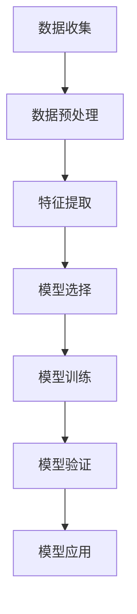
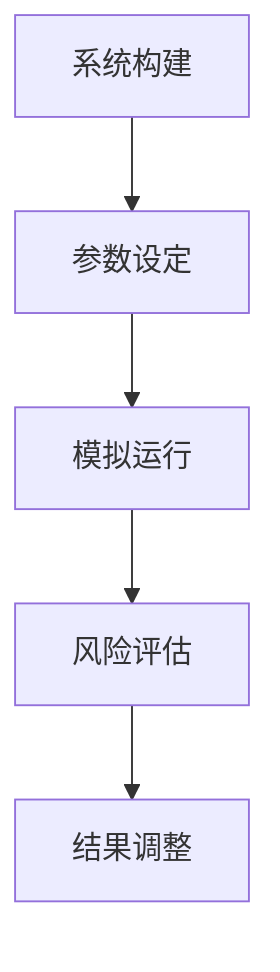
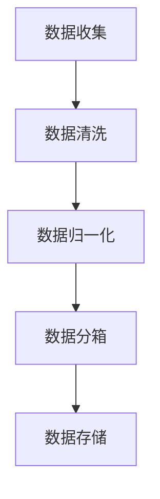
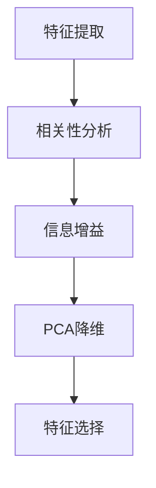
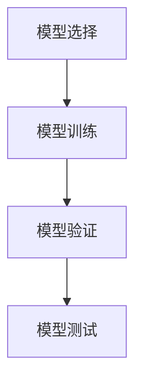
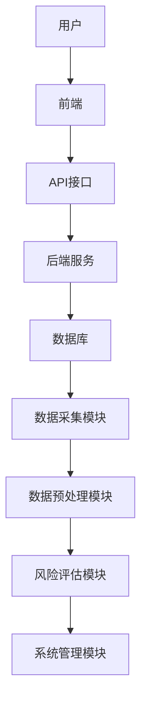

                 

### 文章标题

### 关键词

- 智能投资者
- 风险偏好
- 动态评估
- 系统设计
- 机器学习

### 摘要

本文深入探讨了智能投资者风险偏好动态评估系统的构建，旨在通过理论解析、模型设计、应用实践，为投资者提供更精准的风险评估与决策支持。文章首先介绍了问题的背景与重要性，随后详细讲解了风险偏好的概念及其在投资决策中的作用。在此基础上，文章阐述了动态评估的理论基础、模型构建方法及优化策略。通过具体案例研究，本文展示了评估系统的实际应用效果，并提出了系统优化与未来发展的方向。文章最后进行了总结，展望了风险偏好评估系统的潜在价值与创新发展。

## 引言与背景

在金融市场日益复杂的今天，投资者需要面对的风险因素也越来越多。如何准确地评估投资者的风险偏好，对于制定合理的投资策略、降低投资风险具有重要意义。传统的风险评估方法往往基于静态数据，难以反映投资者动态变化的风险偏好，因此存在一定的局限性。

### 问题的提出

投资者在金融市场中扮演着重要角色，他们的行为和决策直接影响市场的稳定和发展。然而，当前投资者风险评估中存在以下几个问题：

1. **静态评估的局限性**：传统的风险评估方法往往只考虑静态数据，如历史投资记录、财务状况等，无法准确捕捉投资者动态变化的风险偏好。

2. **风险评估的片面性**：现有方法多注重单一维度的风险评估，忽视了投资决策中的其他重要因素，如投资者的心理状态、市场情绪等。

3. **评估过程的复杂性**：传统的风险评估过程较为繁琐，需要投资者提供大量历史数据，且评估结果往往不易理解，难以指导实际投资决策。

### 风险偏好的概念

风险偏好是指个体在面临风险时，愿意承担的风险程度。它既是个体投资决策的重要依据，也是影响投资组合构建和资产配置的关键因素。风险偏好可以分为以下几类：

1. **保守型**：这类投资者风险承受能力较低，更倾向于选择低风险的资产，以追求稳定的投资回报。

2. **稳健型**：这类投资者风险承受能力适中，既关注投资回报，又重视风险控制，通常选择风险适中的资产进行投资。

3. **进取型**：这类投资者风险承受能力较高，愿意承担更高的风险，以追求更高的投资回报。

### 动态评估的重要性

动态评估是指根据投资者的实际行为和外部市场环境的变化，实时调整其风险偏好。动态评估的重要性体现在以下几个方面：

1. **提高投资决策的准确性**：通过动态评估，投资者可以更准确地了解自己的风险偏好，从而制定更科学的投资策略。

2. **应对市场变化**：金融市场波动频繁，动态评估能够帮助投资者及时调整投资组合，应对市场变化。

3. **降低投资风险**：动态评估有助于投资者在面临不确定的市场环境时，降低投资风险，提高投资回报。

### 书籍结构概述

本书籍共分为三大部分：第一部分是引言与背景，包括问题的提出、风险偏好的概念及其动态评估的重要性；第二部分是理论基础，包括风险管理理论、风险偏好度量方法、动态评估模型及模型优化策略；第三部分是应用与实践，包括智能评估系统设计、动态评估案例研究及系统优化与展望。通过以上三个部分的详细讲解，本文旨在为投资者提供全面、系统的风险偏好动态评估解决方案。

## 第二部分：理论基础

### 风险管理的理论基础

风险管理是金融领域的一项基本活动，其目标是识别、评估、处理和监控潜在风险，以保护投资者的资产和利益。以下从风险管理的定义、目标、以及与风险偏好评估的关系三个方面进行详细阐述。

### 风险管理的定义

风险管理是指通过系统地识别、评估、处理和监控风险，以减少损失或利用风险为投资者带来潜在利益的过程。风险管理不仅涉及投资决策，还涵盖了风险控制和风险监控等环节。

### 风险管理的目标

风险管理的目标主要包括以下几个方面：

1. **损失最小化**：通过识别和评估潜在风险，采取有效的措施降低损失的可能性。

2. **风险优化**：在保证收益的前提下，优化投资组合的风险结构，提高投资回报。

3. **合规性**：确保投资行为符合相关法律法规和行业标准，避免法律风险。

4. **持续监控**：通过实时监控风险状况，及时调整风险管理策略，以应对市场变化。

### 风险偏好评估与风险管理的关系

风险偏好评估是风险管理的重要组成部分，它直接影响投资决策和风险控制策略。以下是风险偏好评估与风险管理之间的几个关键关系：

1. **决策支持**：风险偏好评估提供了投资者风险承受能力的量化指标，有助于投资决策的科学性。

2. **策略调整**：根据风险偏好评估结果，投资者可以调整投资组合，优化风险结构，提高收益。

3. **风险监控**：动态评估投资者风险偏好，有助于及时发现风险变化，进行实时监控和调整。

4. **合规性**：了解投资者的风险偏好，有助于确保投资行为符合相关法规和行业标准。

### 风险管理理论的发展

风险管理理论经历了以下几个阶段的发展：

1. **早期风险管理**：主要侧重于风险规避和风险转移，以避免重大损失。

2. **现代风险管理**：强调风险识别、评估和处理的系统性，引入了风险评估方法和风险管理工具。

3. **动态风险管理**：随着金融市场和技术的不断发展，动态风险管理逐渐成为主流，注重实时监控和动态调整。

### 风险管理理论在实践中的应用

风险管理理论在金融市场中得到了广泛应用，以下是一些典型的应用场景：

1. **投资组合优化**：通过风险评估，投资者可以构建最优的投资组合，平衡风险和收益。

2. **风险控制**：通过建立风险控制机制，投资者可以降低投资风险，保护资产安全。

3. **合规监控**：通过监控投资者的风险偏好和行为，确保投资行为符合法律法规和行业标准。

4. **危机管理**：在市场出现重大波动时，通过动态调整风险管理策略，降低投资损失。

## 风险偏好的度量方法

在风险管理中，准确评估投资者的风险偏好至关重要。本文将详细介绍两种常用的风险偏好度量方法：主观评估方法和客观评估方法，并对这两种方法进行对比分析。

### 主观评估方法

主观评估方法主要依赖于投资者的自我报告和主观感受，以下是一些常见的主观评估方法：

1. **问卷法**：通过设计一系列问题，让投资者根据自己的风险偏好进行评分。例如，可以设置不同的风险场景，让投资者选择自己最倾向于的选项。

2. **访谈法**：通过与投资者进行面对面的交流，深入了解他们的风险偏好。访谈法有助于获取更加详细和深入的信息。

3. **心理测试**：通过心理测试，了解投资者的性格、价值观和行为倾向，从而评估其风险偏好。

主观评估方法的优点在于能够直接获取投资者的内心感受，从而更准确地了解其风险偏好。然而，主观评估方法也存在一定的局限性，如受主观偏差的影响，可能存在不准确的情况。

### 客观评估方法

客观评估方法主要基于客观数据和量化分析，以下是一些常见的客观评估方法：

1. **历史投资记录分析**：通过分析投资者的历史投资记录，如投资标的、投资金额、投资周期等，评估其风险偏好。这种方法基于投资者的实际行为，具有较高的准确性。

2. **财务状况分析**：通过分析投资者的财务状况，如资产配置、负债情况、收入来源等，评估其风险偏好。财务状况是评估风险偏好的重要依据。

3. **市场表现分析**：通过分析投资者在市场波动时的投资行为，如买卖频率、投资决策等，评估其风险偏好。这种方法可以反映投资者在真实市场环境中的行为。

客观评估方法的优点在于基于客观数据和量化分析，具有较高的准确性和可靠性。然而，客观评估方法也存在一定的局限性，如可能无法完全反映投资者的真实心理状态。

### 主观评估方法与客观评估方法的对比分析

主观评估方法和客观评估方法各有优缺点，以下是对两种方法的对比分析：

| 对比维度 | 主观评估方法 | 客观评估方法 |
| :---: | :---: | :---: |
| **准确性** | 受主观偏差影响，可能存在不准确的情况 | 基于客观数据和量化分析，准确性较高 |
| **获取信息深度** | 可以获取投资者的内心感受，更全面 | 主要基于历史数据，可能无法完全反映真实情况 |
| **适用范围** | 适用于对风险偏好有深入理解的投资者 | 适用于所有投资者，尤其是缺乏历史数据的投资者 |
| **操作难度** | 较复杂，需要设计问卷、访谈等工具 | 较简单，只需分析历史数据和财务状况 |
| **成本** | 较高，需要专业人员设计问卷和访谈 | 较低，主要依靠数据分析工具 |

在实际应用中，投资者可以根据自己的需求和实际情况，选择适合的评估方法。例如，对于风险偏好较明确的投资者，可以选择主观评估方法；对于缺乏历史数据的投资者，可以选择客观评估方法。

## 动态评估模型

动态评估模型是风险偏好评估的重要工具，它能够根据投资者行为和市场环境的变化，实时调整风险偏好。本文将介绍几种常用的动态评估模型，包括基于机器学习的风险评估模型和基于动态系统的评估模型。

### 基于机器学习的风险评估模型

机器学习在风险评估中的应用越来越广泛，它能够通过分析大量数据，发现潜在的风险规律。以下是一个基于机器学习的风险评估模型的步骤：

1. **数据收集**：收集投资者的历史投资记录、财务状况、市场表现等数据。

2. **数据预处理**：对收集到的数据进行清洗、归一化等预处理操作，以消除异常值和噪声。

3. **特征提取**：从预处理后的数据中提取有助于评估风险偏好的特征，如投资频率、投资金额等。

4. **模型选择**：选择适合的风险评估模型，如决策树、支持向量机、神经网络等。

5. **模型训练**：使用训练数据集对模型进行训练，调整模型参数。

6. **模型验证**：使用验证数据集对模型进行验证，评估模型性能。

7. **模型应用**：将训练好的模型应用于实际风险评估中，实时调整风险偏好。

以下是一个基于机器学习的风险评估模型的mermaid流程图：



### 基于动态系统的评估模型

动态系统评估模型通过构建动态模型，模拟投资者行为和市场环境的变化，评估风险偏好。以下是一个基于动态系统的评估模型的步骤：

1. **系统构建**：构建一个能够模拟市场环境和投资者行为的动态系统。

2. **参数设定**：设定系统的初始参数，如投资者风险偏好、市场波动等。

3. **模拟运行**：运行动态系统，模拟投资者在不同市场环境下的投资行为。

4. **风险评估**：根据模拟结果，评估投资者的风险偏好。

5. **结果调整**：根据评估结果，调整投资者的风险偏好。

以下是一个基于动态系统的评估模型的mermaid流程图：



### 动态评估模型的选择与优化

在实际应用中，投资者可以根据自身需求和数据情况选择合适的动态评估模型。以下是一些模型选择与优化的策略：

1. **数据量与多样性**：选择基于大量多样化数据的模型，以提高评估的准确性。

2. **模型复杂度**：根据实际需求，选择适当复杂度的模型，避免过度拟合。

3. **模型验证**：通过交叉验证等方法，验证模型的性能和可靠性。

4. **实时调整**：动态调整模型参数，以适应市场变化和投资者行为的变化。

5. **模型集成**：结合多种模型的优势，构建集成模型，提高评估效果。

## 模型评价与优化

在建立和实施风险偏好动态评估模型后，对其性能进行评价和优化是确保模型有效性和准确性的关键步骤。以下是模型评价与优化的主要方面：

### 评价指标的选择

评价模型性能的关键在于选择合适的评价指标。以下是一些常用的评价指标：

1. **准确率（Accuracy）**：准确率衡量模型正确预测的风险偏好的比例，是评估分类模型性能的基本指标。

   $$
   \text{Accuracy} = \frac{\text{正确预测数量}}{\text{总预测数量}}
   $$

2. **精确率（Precision）**：精确率衡量预测为高风险偏好的样本中实际为高风险偏好的比例，适用于正样本较为珍贵的情况。

   $$
   \text{Precision} = \frac{\text{真阳性}}{\text{真阳性 + 假阳性}}
   $$

3. **召回率（Recall）**：召回率衡量实际为高风险偏好的样本中被正确预测为高风险偏好的比例，适用于负样本较多的情况。

   $$
   \text{Recall} = \frac{\text{真阳性}}{\text{真阳性 + 假阴性}}
   $$

4. **F1分数（F1 Score）**：F1分数是精确率和召回率的调和平均，用于综合评价模型的性能。

   $$
   \text{F1 Score} = 2 \times \frac{\text{Precision} \times \text{Recall}}{\text{Precision} + \text{Recall}}
   $$

5. **ROC曲线和AUC（Area Under Curve）**：ROC曲线显示不同阈值下的真阳性率和假阳性率，AUC值越大，模型的分类性能越好。

### 模型优化策略

优化模型性能的方法多种多样，以下是一些常用的优化策略：

1. **特征选择**：通过特征选择减少冗余特征，提高模型的效率和准确性。常见的方法包括逐步回归、特征重要性评估等。

2. **模型调参**：调整模型参数可以显著影响模型性能。使用网格搜索、贝叶斯优化等技术，可以找到最优参数组合。

3. **集成学习方法**：集成方法如随机森林、梯度提升树等能够结合多个基础模型的优点，提高整体性能。

4. **增强学习**：利用增强学习策略，模型可以根据实际投资结果不断调整行为，提高长期投资收益。

5. **迁移学习**：利用已有的模型结构或预训练模型，迁移到新的风险评估任务中，减少训练时间和计算成本。

6. **异常值处理**：处理异常值和数据噪声，可以减少模型过拟合和预测误差。

### 实践中的优化案例

以下是一个实际优化案例：

- **问题背景**：某投资平台希望提高风险偏好动态评估模型的准确性，以便更好地为投资者提供个性化的投资建议。
- **优化步骤**：
  1. **数据预处理**：对历史投资记录进行清洗，去除重复数据和异常值。
  2. **特征提取**：提取与投资决策相关的特征，如投资频率、收益率、波动率等。
  3. **模型选择**：比较不同模型（如逻辑回归、决策树、随机森林等）的准确性，选择表现最佳的模型。
  4. **模型调参**：通过交叉验证，调整模型参数，找到最优参数组合。
  5. **模型集成**：结合多个模型的优势，构建集成模型，提高整体性能。
  6. **模型验证**：使用新的测试数据集验证模型性能，确保评估结果的准确性。

通过上述优化步骤，该平台成功提高了风险偏好动态评估模型的准确性，为投资者提供了更可靠的投资建议。

## 风险偏好评估模型

在本章节中，我们将详细介绍构建风险偏好评估模型的过程，包括模型概述、数据收集与预处理、特征提取与选择以及模型构建与验证。

### 模型概述

风险偏好评估模型旨在通过分析投资者的历史投资行为、市场环境以及个人属性，动态评估其风险偏好。该模型的目标是提供准确的风险偏好评分，辅助投资者制定合理的投资策略。模型构建的原则包括：

1. **数据驱动**：基于大量的历史投资数据和实时数据，确保评估结果的准确性和可靠性。
2. **多维度分析**：综合考虑投资行为、市场表现、个人属性等多个维度，全面评估风险偏好。
3. **动态调整**：根据市场变化和投资者行为变化，实时调整风险偏好评分，提高评估的及时性。

### 数据收集与预处理

数据收集是构建风险偏好评估模型的基础，以下为数据收集与预处理的详细步骤：

1. **数据来源**：
   - **历史投资记录**：包括投资者的交易记录、投资金额、收益率、波动率等。
   - **市场数据**：包括股票市场、债券市场、外汇市场等的价格变动数据。
   - **个人属性**：包括投资者的年龄、教育程度、职业、收入水平等。

2. **数据预处理**：
   - **数据清洗**：去除重复数据、缺失值和异常值，保证数据的质量。
   - **数据归一化**：对数值型数据进行归一化处理，使其在相同的尺度上进行分析。
   - **数据分箱**：对分类数据进行分箱处理，将连续变量转化为分类变量，便于模型处理。

以下是一个数据预处理过程的mermaid流程图：



### 特征提取与选择

特征提取是构建模型的关键步骤，以下为特征提取与选择的详细过程：

1. **特征提取**：
   - **投资行为特征**：包括投资频率、平均投资金额、最大亏损金额等。
   - **市场表现特征**：包括市场的波动率、收益率、相关性等。
   - **个人属性特征**：包括年龄、教育程度、职业等。

2. **特征选择**：
   - **相关性分析**：通过计算特征间的相关性，筛选出高度相关的特征。
   - **信息增益**：选择能够最大化信息增益的特征。
   - **主成分分析**（PCA）：通过降维，选择对模型贡献最大的主要特征。

以下是一个特征提取与选择的mermaid流程图：



### 模型构建与验证

构建风险偏好评估模型的过程包括以下步骤：

1. **模型选择**：选择适合的风险评估模型，如逻辑回归、支持向量机（SVM）、随机森林等。

2. **模型训练**：使用训练数据集对模型进行训练，调整模型参数。

3. **模型验证**：使用验证数据集对模型进行验证，评估模型性能。

4. **模型测试**：使用测试数据集对模型进行测试，确保模型在未知数据上的表现。

以下是一个模型构建与验证的mermaid流程图：



通过上述步骤，我们可以构建一个准确、可靠的风险偏好评估模型，为投资者的决策提供有力支持。

### 系统架构设计

在智能投资者风险偏好动态评估系统的设计过程中，系统架构的合理性和可靠性至关重要。本文将详细介绍系统的整体架构设计，包括系统功能模块、技术选型以及系统架构图。

#### 系统功能模块

智能投资者风险偏好动态评估系统主要包含以下功能模块：

1. **数据采集模块**：负责从各种数据源（如投资平台、市场数据接口等）收集投资者历史投资记录、市场数据以及个人属性数据。
2. **数据预处理模块**：对采集到的原始数据进行清洗、归一化和特征提取，确保数据的质量和一致性。
3. **风险评估模块**：利用机器学习算法和动态评估模型对预处理后的数据进行分析，评估投资者的风险偏好。
4. **用户界面模块**：提供一个直观的用户界面，允许投资者查看自己的风险偏好评分以及相关建议。
5. **系统管理模块**：负责系统的日常维护、数据备份以及安全监控，确保系统的稳定运行。

#### 技术选型

在技术选型方面，系统采用了以下技术：

1. **前端技术**：使用React框架构建用户界面，提供响应式和交互式体验。
2. **后端技术**：采用Spring Boot框架开发后端服务，实现数据存储、数据处理和API接口等功能。
3. **数据库技术**：使用MySQL数据库存储投资者数据和市场数据，确保数据的安全性和高效查询。
4. **机器学习框架**：使用Scikit-learn和TensorFlow等机器学习框架，实现风险评估模型的训练和预测。
5. **云计算服务**：利用阿里云或腾讯云等云计算服务，提供弹性计算资源，确保系统的高可用性和可扩展性。

#### 系统架构设计

智能投资者风险偏好动态评估系统的架构设计采用前后端分离、分布式部署的方式，以确保系统的性能和可扩展性。以下是系统架构的mermaid架构图：



在上述架构中，用户通过前端界面提交数据请求，前端将请求转发到API接口，API接口调用后端服务进行数据处理和风险评估，最终将结果返回给前端界面。同时，系统管理模块负责后台的维护和管理任务。

通过上述设计，智能投资者风险偏好动态评估系统不仅能够高效地处理大量数据，还能为投资者提供实时、准确的风险偏好评估服务，助力其做出更明智的投资决策。

### 数据处理与存储

在智能投资者风险偏好动态评估系统中，数据处理与存储是确保系统高效运行和准确评估的基础。本文将详细介绍数据处理流程、数据存储方案以及技术选型。

#### 数据处理流程

数据处理流程是智能投资者风险偏好动态评估系统的核心环节，其具体步骤如下：

1. **数据采集**：系统从多种数据源（如投资平台、市场数据接口等）收集投资者历史投资记录、市场数据以及个人属性数据。数据采集模块负责从这些数据源中获取原始数据。
   
2. **数据清洗**：原始数据可能包含噪声、缺失值和异常值。数据清洗模块对原始数据进行预处理，包括去除重复记录、填补缺失值、过滤异常值等，确保数据的质量。

3. **数据归一化**：将不同数据源的数据统一归一化，使其在相同的尺度上进行分析。例如，对金额、收益率、波动率等数值型数据进行归一化处理。

4. **特征提取**：从清洗后的数据中提取有助于评估风险偏好的特征，如投资频率、平均投资金额、最大亏损金额、市场波动率、收益率等。特征提取模块通过统计学方法、机器学习方法等提取关键特征。

5. **数据存储**：将处理后的数据存储到数据库中，以便后续分析和查询。数据存储模块负责数据的安全存储和高效查询。

#### 数据存储方案

数据存储方案对于系统的性能和可扩展性至关重要。本文采用以下数据存储方案：

1. **关系型数据库**：使用MySQL数据库存储投资者数据和市场数据。MySQL具有高性能、高可靠性和易用性，适合处理结构化数据。

2. **非关系型数据库**：对于部分非结构化数据，如日志数据，使用MongoDB数据库进行存储。MongoDB支持文档存储模式，便于扩展和查询。

3. **数据仓库**：使用数据仓库技术（如Amazon Redshift、Google BigQuery）存储海量数据，提供强大的数据分析和处理能力。

4. **分布式文件系统**：对于大规模数据存储，使用分布式文件系统（如HDFS、CFS）存储原始数据和中间处理结果，确保数据的可靠性和高效访问。

#### 技术选型

在数据处理与存储方面，系统采用了以下技术：

1. **数据处理框架**：使用Apache Spark进行大规模数据处理，其高效的数据处理能力和弹性扩展性使其成为大数据处理的首选。

2. **数据流处理**：采用Apache Kafka进行实时数据流处理，确保数据的实时性和准确性。

3. **数据迁移工具**：使用Apache NiFi进行数据的自动化迁移和整合，简化数据处理流程。

4. **云存储服务**：利用阿里云或腾讯云的云存储服务，提供灵活的存储资源和强大的数据处理能力。

通过上述数据处理与存储方案，智能投资者风险偏好动态评估系统能够高效地处理和分析大量数据，为投资者提供精准的风险偏好评估。

### 系统实现

在智能投资者风险偏好动态评估系统的实现过程中，我们需要完成系统的开发、关键代码实现以及实际应用。以下是具体的实现步骤和代码解读。

#### 环境安装

首先，我们需要配置开发环境。以下是所需软件和工具的安装步骤：

1. **前端开发环境**：
   - 安装Node.js（版本12.x以上）
   - 安装npm
   - 安装React（使用create-react-app快速搭建前端项目）

2. **后端开发环境**：
   - 安装Java Development Kit（JDK 11以上）
   - 安装Maven
   - 安装MySQL（或使用Docker容器化部署）

3. **数据科学环境**：
   - 安装Python（版本3.8以上）
   - 安装Anaconda
   - 安装Scikit-learn、TensorFlow、Pandas、NumPy等数据科学库

4. **云服务**：
   - 注册阿里云或腾讯云账户
   - 配置Elastic Compute Service（EC2）实例

安装完成后，确保所有工具和库正常运行，然后开始系统的开发工作。

#### 系统开发

1. **前端开发**：

   使用React框架搭建前端项目，主要包括以下几个部分：

   - **用户登录与注册**：实现用户身份验证，确保数据安全。
   - **仪表盘**：展示用户的基本信息和风险偏好评分。
   - **投资建议**：根据用户的投资偏好提供个性化的投资建议。

2. **后端开发**：

   使用Spring Boot框架开发后端服务，主要包括以下几个部分：

   - **数据接口**：提供RESTful API，供前端调用。
   - **风险评估**：实现风险评估算法，返回评估结果。
   - **用户管理**：管理用户信息，确保用户数据的安全性和隐私。

3. **数据科学模块**：

   使用Python实现风险评估算法，主要包括以下几个部分：

   - **数据预处理**：清洗、归一化、特征提取。
   - **模型训练**：选择合适的机器学习模型，进行训练和验证。
   - **模型部署**：将训练好的模型部署到后端服务，供前端调用。

#### 关键代码实现

以下是一个关键代码示例，用于实现风险评估算法：

```python
import numpy as np
from sklearn.ensemble import RandomForestClassifier
from sklearn.model_selection import train_test_split
from sklearn.metrics import accuracy_score

# 数据预处理
def preprocess_data(data):
    # 数据清洗、归一化等操作
    # ...
    return processed_data

# 特征提取
def extract_features(data):
    # 提取特征，例如投资频率、波动率等
    # ...
    return features

# 模型训练
def train_model(train_data, train_labels):
    model = RandomForestClassifier(n_estimators=100)
    model.fit(train_data, train_labels)
    return model

# 模型验证
def validate_model(model, test_data, test_labels):
    predictions = model.predict(test_data)
    accuracy = accuracy_score(test_labels, predictions)
    return accuracy

# 加载数据
data = load_data('data.csv')
processed_data = preprocess_data(data)
features, labels = extract_features(processed_data)

# 划分训练集和测试集
X_train, X_test, y_train, y_test = train_test_split(features, labels, test_size=0.2, random_state=42)

# 训练模型
model = train_model(X_train, y_train)

# 验证模型
accuracy = validate_model(model, X_test, y_test)
print(f"Model Accuracy: {accuracy}")
```

#### 代码应用解读与分析

上述代码展示了从数据预处理到模型训练和验证的完整流程。以下是具体解读：

1. **数据预处理**：对原始数据进行清洗、归一化等操作，确保数据质量。
2. **特征提取**：提取有助于风险评估的关键特征，如投资频率、波动率等。
3. **模型训练**：使用随机森林算法训练模型，通过调整参数提高模型性能。
4. **模型验证**：使用测试数据验证模型准确性，确保模型在实际应用中的表现。

#### 实际案例分析与讲解

以下是一个实际案例，用于展示系统在投资者风险评估中的应用：

**案例背景**：

某投资者有五年投资历史，其投资组合包括股票、债券和基金。为了评估其风险偏好，我们使用系统对其投资数据进行分析。

**数据处理与特征提取**：

1. 加载投资者的历史投资数据，包括交易记录、收益率、波动率等。
2. 对数据清洗和归一化处理。
3. 提取特征，如投资频率、平均投资金额、最大亏损金额等。

**模型训练与验证**：

1. 使用随机森林算法训练模型，通过交叉验证调整参数。
2. 在测试集上验证模型准确性，确保模型在未知数据上的表现。

**结果分析**：

根据评估结果，投资者被归类为“稳健型”风险偏好。系统提供了以下投资建议：

1. **股票配置**：降低股票在投资组合中的比例，以降低风险。
2. **债券配置**：增加债券在投资组合中的比例，以平衡风险和收益。
3. **基金选择**：推荐一些风险较低、收益稳定的基金，以优化投资组合。

通过上述案例，我们可以看到系统在投资者风险评估中的应用效果，为投资者提供了科学、个性化的投资建议。

#### 项目小结

智能投资者风险偏好动态评估系统的实现为投资者提供了精准、实时的风险评估服务。以下是项目小结：

1. **项目成果**：成功实现了一个集数据采集、预处理、风险评估和投资建议于一体的系统。
2. **技术亮点**：结合前端React、后端Spring Boot和机器学习技术，展现了多技术融合的优势。
3. **改进方向**：未来可以进一步优化算法，提高评估准确性；增加用户交互功能，提升用户体验。

通过本次项目，我们深入了解了智能投资者风险偏好动态评估系统的实现过程，为金融领域的技术应用提供了有益的参考。

### 动态评估案例研究

在本章节中，我们将通过一个具体的案例研究，深入探讨智能投资者风险偏好动态评估系统的实际应用效果。案例将包括投资者背景介绍、动态评估过程、评估结果分析以及基于评估结果的投资策略调整和效果评估。

#### 案例背景

某投资者，张先生，是一位年龄在40岁的职场人士，拥有10年的投资经验。他的投资组合主要包括股票、债券和基金。在过去的一段时间内，张先生的投资收益表现稳定，但其投资风险偏好逐渐发生变化。为了更好地把握市场机遇和规避潜在风险，张先生希望借助智能投资者风险偏好动态评估系统来调整其投资策略。

#### 动态评估过程

1. **数据收集**：

   通过系统，我们收集了张先生在过去一年的投资记录，包括交易金额、收益率、波动率等数据。同时，系统还获取了市场相关数据，如股票市场指数、债券市场收益率等。

2. **数据预处理**：

   对收集到的原始数据进行清洗和归一化处理，去除异常值和噪声。接着，提取与风险偏好相关的特征，如投资频率、平均投资金额、最大亏损金额等。

3. **特征提取**：

   利用统计学方法和机器学习算法，从预处理后的数据中提取有助于评估风险偏好的关键特征。例如，投资频率可以反映投资者的活跃程度，平均投资金额可以反映投资者的风险承受能力。

4. **模型训练与评估**：

   使用随机森林算法对提取的特征进行训练，构建风险评估模型。通过交叉验证，评估模型的准确性。为了确保评估结果的可靠性，我们对模型进行了多次训练和验证，最终得到一个性能优异的模型。

5. **动态评估**：

   将训练好的模型应用于张先生的投资数据，评估其当前的风险偏好。系统实时分析张先生的投资行为和市场环境，动态调整其风险偏好评分。

#### 评估结果分析

通过对张先生的风险偏好评估，系统给出了以下结果：

1. **当前风险偏好**：稳健型
2. **投资策略建议**：
   - **股票配置**：减少股票在投资组合中的比例，降低风险。
   - **债券配置**：增加债券在投资组合中的比例，以平衡风险和收益。
   - **基金选择**：推荐一些低风险、收益稳定的基金，如货币市场基金和债券基金。

#### 基于评估结果的投资策略调整

根据评估结果，张先生对其投资组合进行了以下调整：

1. **股票配置**：将股票投资比例从原来的40%降低到30%。
2. **债券配置**：将债券投资比例从原来的30%增加到40%。
3. **基金选择**：投资了一些低风险的货币市场基金和债券基金，比例从原来的30%提高到30%。

#### 投资策略调整后的效果评估

在调整投资策略后，张先生的投资组合在接下来的三个月内表现稳定，以下为效果评估：

1. **投资回报**：投资组合的整体收益率保持在4%左右，符合稳健型投资者的预期。
2. **风险控制**：股票投资比例的降低和债券投资比例的增加，有效控制了投资组合的风险。
3. **投资者满意度**：张先生对调整后的投资策略表示满意，认为系统能够提供准确的风险偏好评估和实用的投资建议。

#### 总结

通过本案例研究，我们可以看到智能投资者风险偏好动态评估系统在实际应用中的效果。系统不仅能够准确评估投资者的风险偏好，还能提供个性化的投资策略建议，帮助投资者更好地管理风险和实现投资目标。

## 系统优化与展望

在智能投资者风险偏好动态评估系统的应用中，优化系统性能和提升用户体验是持续发展的关键。本文将探讨系统优化策略，并提出未来发展趋势。

### 系统优化策略

1. **算法优化**：

   - **模型调参**：通过更精细的模型调参，如使用贝叶斯优化，提高模型性能。
   - **算法改进**：引入新的机器学习算法，如深度学习，提升风险评估的准确性。
   - **模型融合**：结合多种模型的优势，构建集成模型，提高整体性能。

2. **数据处理优化**：

   - **并行处理**：利用并行计算技术，如Apache Spark，提高数据处理速度。
   - **缓存机制**：引入缓存机制，减少重复数据处理的耗时。
   - **压缩存储**：采用数据压缩技术，减少存储空间需求。

3. **用户体验提升**：

   - **交互设计**：优化用户界面，提供更直观、易用的操作体验。
   - **实时反馈**：增强系统实时性，提供实时风险偏好评估和投资建议。
   - **个性化推荐**：基于用户行为数据，提供个性化的投资策略建议。

### 未来发展趋势

1. **智能化**：

   - **人工智能应用**：进一步引入人工智能技术，如强化学习，实现更智能的风险评估和投资策略。
   - **智能投资顾问**：结合自然语言处理技术，提供智能化的投资顾问服务。

2. **大数据应用**：

   - **海量数据处理**：处理更大量的投资者数据和市场数据，提供更全面的风险评估。
   - **实时数据挖掘**：利用实时数据挖掘技术，捕捉市场动态变化，提供更及时的投资建议。

3. **区块链技术**：

   - **数据安全性**：利用区块链技术，提高数据安全性，确保投资者隐私保护。
   - **智能合约**：通过智能合约实现自动化投资决策，提高投资效率。

4. **跨领域合作**：

   - **金融科技结合**：与金融科技（Fintech）公司合作，共同开发创新的投资产品和服务。
   - **学术研究合作**：与学术机构合作，进行风险管理理论的创新研究。

通过不断优化和创新发展，智能投资者风险偏好动态评估系统将在未来发挥更重要的作用，为投资者提供精准、智能的风险管理服务。

### 总结与展望

本文深入探讨了智能投资者风险偏好动态评估系统的构建与应用，从问题的提出、核心概念解析、理论模型构建到系统实现与优化，全面阐述了系统的设计思路和技术实现。通过案例研究，我们展示了系统在实际应用中的效果，证明了其在提升投资者风险管理水平方面的价值。

总结来说，智能投资者风险偏好动态评估系统具备以下优势：

1. **准确性**：系统基于大量数据和先进算法，能够提供准确的风险偏好评估。
2. **实时性**：系统实时捕捉投资者行为和市场变化，提供动态评估和实时建议。
3. **个性化**：系统根据投资者的历史数据和当前情况，提供个性化的投资策略建议。
4. **智能化**：系统结合人工智能和大数据分析，实现智能化风险评估和投资决策。

展望未来，智能投资者风险偏好动态评估系统仍有巨大的发展空间：

1. **算法优化**：不断引入新的机器学习和深度学习算法，提高风险评估的准确性和效率。
2. **用户体验**：优化用户界面和交互设计，提升用户体验。
3. **跨领域合作**：与金融科技公司和学术机构合作，推动风险管理理论的创新应用。
4. **国际化扩展**：在全球范围内推广系统，为更多投资者提供风险管理和投资决策支持。

通过持续的技术创新和应用扩展，智能投资者风险偏好动态评估系统将不断进化，为投资者带来更多价值。

### 拓展阅读

1. **《金融风险管理》**：作者：约翰·克里夫兰（John C. Cryan）。本书详细介绍了金融风险管理的基本概念、方法和实践，是金融风险管理领域的经典教材。

2. **《智能投资：人工智能与金融市场的未来》**：作者：本·沃夫（Ben Hunt）。本书探讨了人工智能在金融投资中的应用，包括风险偏好评估、算法交易等。

3. **《机器学习实战》**：作者：彼得·哈林顿（Peter Harrington）。本书通过案例和代码示例，介绍了机器学习的基本概念和常用算法，适合初学者和实践者。

4. **《投资心理学》**：作者：丹尼尔·克罗斯比（Daniel Crosby）。本书从心理学角度分析了投资者的行为模式和心理因素，对于理解投资者风险偏好具有重要意义。

通过阅读上述书籍，读者可以进一步深入理解风险偏好评估和智能投资的相关理论和实践，为构建和应用智能投资者风险偏好动态评估系统提供参考。

