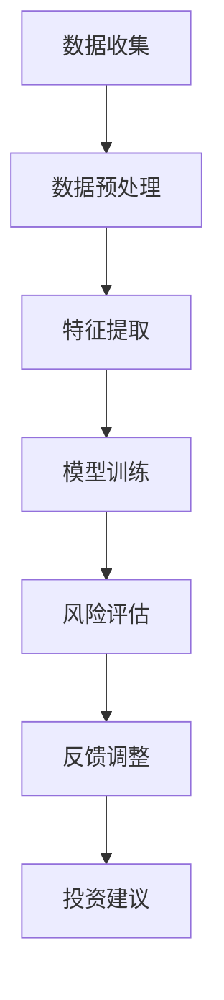
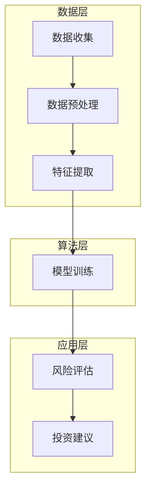
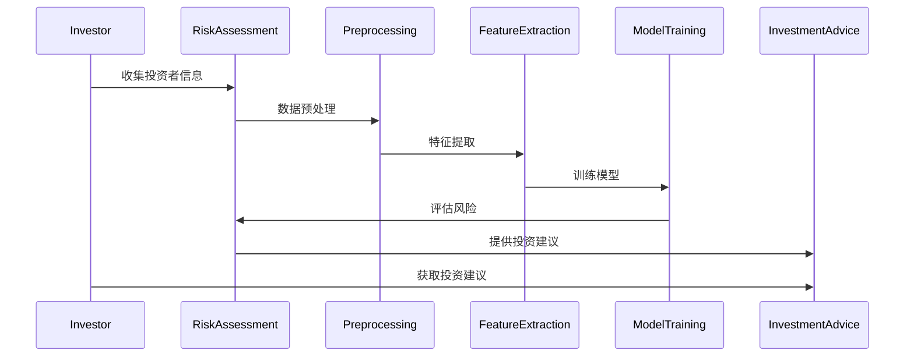

                 


### 1. 背景介绍

随着金融市场的日益复杂和多样化，投资者在投资过程中需要面对的风险也在不断增加。为了在投资决策中更加科学和理性，风险承受能力评估成为了一个关键环节。本文旨在深入探讨智能投资者风险承受能力的动态评估，以期为投资者提供更精准的指导。

#### 1.1 核心概念术语说明

在探讨风险承受能力评估之前，我们需要明确一些核心概念和术语：

- **风险承受能力**：指投资者在投资过程中能够承受的风险程度。它通常取决于投资者的年龄、收入、资产状况、投资经验以及心理承受能力等因素。
- **动态评估**：指对投资者风险承受能力进行持续监测和调整的过程。由于投资环境和投资者自身状况的动态变化，静态的风险评估方法可能无法准确反映投资者的真实风险承受能力。
- **金融投资**：指投资者将资金投入到金融市场，以期望获得投资回报的活动。金融投资包括股票、债券、基金等多种形式。
- **风险评估**：指对投资风险进行量化分析的过程，目的是为投资者提供参考，帮助其做出更明智的投资决策。

#### 1.2 问题背景

风险承受能力评估在金融投资领域具有重要意义。首先，正确的风险承受能力评估可以帮助投资者选择与其风险偏好相匹配的投资产品，从而避免因过度冒险或保守而导致的投资损失。其次，动态评估方法能够及时捕捉投资者风险承受能力的变动，为投资者提供更加灵活和个性化的投资建议。

然而，当前的风险承受能力评估方法存在一些不足：

- **评估方法单一**：大多数评估方法仅依赖于投资者的基本信息和问卷调查，缺乏对投资者行为和投资结果的深入分析。
- **评估结果滞后**：静态评估方法难以反映投资者风险承受能力的实时变化，导致评估结果与实际情况存在偏差。
- **评估工具不足**：目前缺乏智能化的风险评估工具，难以充分利用大数据和人工智能技术进行风险评估。

#### 1.3 问题描述

当前风险评估方法存在的问题主要体现在以下几个方面：

- **评估准确性不高**：传统风险评估方法难以准确反映投资者的真实风险承受能力，导致投资决策存在风险。
- **风险评估滞后**：静态评估方法无法及时更新投资者的风险承受能力，导致投资建议不及时。
- **评估工具不智能**：缺乏利用大数据和人工智能技术进行风险评估的工具，导致风险评估结果不够精确。

#### 1.4 问题解决

本文提出的动态评估方法旨在解决上述问题，其主要特点如下：

- **动态监测**：通过实时监测投资者的投资行为和市场环境变化，动态调整风险评估结果。
- **数据驱动**：利用大数据和人工智能技术，对投资者的历史投资数据进行深度挖掘，提高评估准确性。
- **个性化建议**：根据投资者实时风险承受能力，提供个性化的投资建议，帮助投资者做出更明智的投资决策。

#### 1.5 边界与外延

本文的研究范围主要涉及个人投资者的风险承受能力评估，不包括机构投资者。此外，本文的动态评估方法主要应用于股票、基金等金融产品，其他类型的投资产品评估方法可能会有所不同。

#### 1.6 概念结构与核心要素组成

风险承受能力动态评估系统的核心概念和要素包括：

- **风险承受能力指标**：包括年龄、收入、资产状况、投资经验、心理承受能力等。
- **动态评估模型**：利用大数据和人工智能技术，建立动态评估模型，实时监测投资者风险承受能力的变化。
- **风险评估工具**：开发智能化的风险评估工具，辅助投资者进行风险评估和投资决策。
- **投资建议系统**：根据投资者的实时风险承受能力，提供个性化的投资建议。

通过上述核心概念和要素的有机组合，我们可以构建一个完整的风险承受能力动态评估系统，为投资者提供更精准、个性化的投资指导。

### 2. 核心概念与联系

在深入探讨智能投资者风险承受能力的动态评估之前，我们需要明确几个核心概念，并理解它们之间的相互关系。

#### 2.1 风险承受能力原理

风险承受能力是指投资者在投资过程中能够承受的风险程度。它通常取决于以下因素：

- **年龄**：年龄较大的投资者通常风险承受能力较低，而年轻投资者风险承受能力较强。
- **收入**：收入较高的投资者通常有更强的风险承受能力，因为他们有更多的资金来应对潜在的投资损失。
- **资产状况**：资产较为丰厚的投资者通常有更强的风险承受能力，因为他们有更多的资金可以用于投资。
- **投资经验**：投资经验丰富的投资者通常能够更好地理解和应对市场风险。
- **心理承受能力**：心理承受能力较强的投资者能够更好地应对投资过程中的波动和压力。

#### 2.2 动态评估方法详解

动态评估方法是指对投资者风险承受能力进行持续监测和调整的过程。动态评估方法的核心在于实时捕捉投资者风险承受能力的变化，以便为投资者提供更加准确的评估结果。具体来说，动态评估方法包括以下几个步骤：

1. **数据收集**：收集投资者的基本信息、投资记录和市场环境数据。
2. **数据预处理**：对收集到的数据进行清洗和转换，为后续分析做准备。
3. **特征提取**：从预处理后的数据中提取与风险承受能力相关的特征。
4. **模型训练**：利用历史数据训练风险评估模型，模型可以基于机器学习或深度学习技术。
5. **风险评估**：使用训练好的模型对投资者的风险承受能力进行评估。
6. **反馈调整**：根据投资者的投资行为和市场环境的变化，动态调整评估结果。

#### 2.3 相关指标解读

在动态评估过程中，需要使用一系列指标来衡量投资者的风险承受能力。以下是几个常见的指标及其解读：

- **风险偏好**：反映投资者对风险的喜好程度，风险偏好较高的投资者通常愿意承担更高的风险。
- **风险容忍度**：反映投资者对风险的容忍程度，风险容忍度较低的投资者可能无法承受较大的波动。
- **波动率**：衡量投资组合的波动程度，波动率越高，风险越大。
- **夏普比率**：衡量投资组合的收益率与风险之间的关系，夏普比率越高，表示投资组合的风险调整收益越高。
- **最大回撤**：衡量投资组合在特定时间内的最大跌幅，最大回撤越小，风险越小。

#### 2.4 概念属性特征对比

为了更好地理解风险承受能力动态评估方法，我们可以将不同评估方法的优缺点进行对比。以下是一个简单的对比表格：

| 方法         | 优点                                                         | 缺点                                                         |
| ------------ | ------------------------------------------------------------ | ------------------------------------------------------------ |
| 传统问卷调查 | 简单易行，成本较低                                           | 评估结果准确性不高，缺乏动态性                                |
| 实时数据监测 | 可以实时更新投资者的风险承受能力，提高评估准确性               | 需要大量数据支持，技术实现复杂                                 |
| 行为金融学   | 可以通过投资者的投资行为来评估其风险承受能力，更接近实际情况     | 受限于行为金融学的局限性，可能存在偏差                           |
| 大数据分析   | 可以利用大量历史数据，挖掘出投资者风险承受能力的潜在规律         | 对数据质量和处理能力要求较高，技术门槛较高                         |

#### 2.5 ER实体关系图架构的Mermaid流程图

为了更直观地展示风险承受能力动态评估系统的实体关系，我们可以使用Mermaid绘制ER图。以下是一个简单的ER图示例：

```mermaid
erDiagram
  Investor ||--|{ RiskAssessment }
  RiskAssessment ||--|{ AssessmentData }
  MarketData ||--|{ RiskAssessment }
  Investor ||--|{ InvestmentBehavior }
```

在这个ER图中，`Investor` 代表投资者，`RiskAssessment` 代表风险评估结果，`AssessmentData` 代表评估数据，`MarketData` 代表市场环境数据，`InvestmentBehavior` 代表投资行为。这些实体之间通过关系线进行连接，展示了它们之间的相互关联。

通过上述核心概念与联系的分析，我们可以更好地理解风险承受能力动态评估系统的构建方法和应用场景。接下来，我们将进一步探讨算法原理和数学模型，为读者提供更加深入的技术解读。

### 3. 算法原理讲解

在智能投资者风险承受能力动态评估系统中，算法的设计和实现是关键环节。本文将详细介绍算法原理，包括算法流程、实现步骤和相关的数学模型。

#### 3.1 算法概述

智能投资者风险承受能力动态评估算法旨在通过分析投资者的历史投资行为和市场环境数据，实时评估投资者的风险承受能力，并提供相应的投资建议。算法的主要流程如下：

1. **数据收集**：收集投资者的基本信息、投资记录和市场环境数据。
2. **数据预处理**：对收集到的数据进行分析和清洗，为后续分析做准备。
3. **特征提取**：从预处理后的数据中提取与风险承受能力相关的特征。
4. **模型训练**：利用历史数据训练风险评估模型，模型可以基于机器学习或深度学习技术。
5. **风险评估**：使用训练好的模型对投资者的风险承受能力进行评估。
6. **反馈调整**：根据投资者的投资行为和市场环境的变化，动态调整评估结果。
7. **投资建议**：根据评估结果为投资者提供个性化的投资建议。

#### 3.2 Mermaid流程图

为了更直观地展示算法的流程，我们可以使用Mermaid绘制算法的流程图。以下是一个简单的算法流程图示例：



在这个流程图中，各个步骤通过箭头连接，展示了算法从数据收集到投资建议的整个过程。

#### 3.3 Python源代码示例

下面是一个简化的Python源代码示例，用于展示算法的核心实现步骤：

```python
# 导入必要的库
import pandas as pd
from sklearn.model_selection import train_test_split
from sklearn.ensemble import RandomForestClassifier
from sklearn.metrics import accuracy_score

# 数据收集
data = pd.read_csv('investment_data.csv')

# 数据预处理
# ...（数据清洗和转换）

# 特征提取
X = data[['age', 'income', 'investment_experience', 'psychological_tolerance']]
y = data['risk_preference']

# 模型训练
X_train, X_test, y_train, y_test = train_test_split(X, y, test_size=0.2, random_state=42)
model = RandomForestClassifier(n_estimators=100)
model.fit(X_train, y_train)

# 风险评估
y_pred = model.predict(X_test)

# 反馈调整
# ...（根据评估结果进行调整）

# 投资建议
# ...（根据评估结果提供投资建议）
```

这个示例仅展示了数据收集、数据预处理、模型训练和风险评估的基本步骤，实际应用中还需要包括特征提取、反馈调整和投资建议等环节。

#### 3.4 数学模型与公式讲解

在动态评估过程中，数学模型起到了核心作用。以下是一个简化的数学模型，用于评估投资者的风险承受能力：

$$
RCA = f(\text{age}, \text{income}, \text{investment_experience}, \text{psychological_tolerance})
$$

其中，$RCA$ 表示风险承受能力，$f$ 是一个复杂的函数，用于结合多个因素进行综合评估。

具体来说，我们可以将函数 $f$ 表示为：

$$
f(\text{age}, \text{income}, \text{investment_experience}, \text{psychological_tolerance}) = w_1 \cdot \text{age} + w_2 \cdot \text{income} + w_3 \cdot \text{investment_experience} + w_4 \cdot \text{psychological_tolerance}
$$

其中，$w_1, w_2, w_3, w_4$ 是权重系数，用于衡量每个因素对风险承受能力的影响程度。

#### 3.5 举例说明

为了使读者更容易理解上述数学模型，我们通过一个具体的例子进行说明。

假设有一个投资者，其年龄为30岁，年收入为10万元，投资经验为5年，心理承受能力较高。我们可以根据上述数学模型计算其风险承受能力：

$$
RCA = 0.3 \cdot 30 + 0.2 \cdot 10^5 + 0.2 \cdot 5 + 0.3 \cdot 10 = 28.5
$$

根据计算结果，该投资者的风险承受能力为28.5。这个数值越高，表示投资者能够承受的风险越大。

通过上述算法原理讲解，我们可以看到，智能投资者风险承受能力动态评估系统通过数据驱动和数学模型，实现了对投资者风险承受能力的精准评估。接下来，我们将进一步探讨数学模型和公式的详细讲解，以及具体的实现步骤。

### 4. 数学模型和数学公式详细讲解

在动态评估过程中，数学模型起到了关键作用。为了更好地理解模型的工作原理，我们需要详细讲解其数学模型和公式，并通过具体的例子进行说明。

#### 4.1 数学模型引入

在前文中，我们引入了以下数学模型来评估投资者的风险承受能力：

$$
RCA = f(\text{age}, \text{income}, \text{investment_experience}, \text{psychological_tolerance})
$$

其中，$RCA$ 表示风险承受能力，$f$ 是一个复杂的函数，用于结合多个因素进行综合评估。

具体来说，我们可以将函数 $f$ 表示为：

$$
f(\text{age}, \text{income}, \text{investment_experience}, \text{psychological_tolerance}) = w_1 \cdot \text{age} + w_2 \cdot \text{income} + w_3 \cdot \text{investment_experience} + w_4 \cdot \text{psychological_tolerance}
$$

其中，$w_1, w_2, w_3, w_4$ 是权重系数，用于衡量每个因素对风险承受能力的影响程度。

#### 4.2 模型讲解

1. **年龄（age）**：年龄是影响风险承受能力的一个重要因素。通常情况下，年龄较大的投资者风险承受能力较低，因为他们可能更注重资金的安全性和稳定回报。相反，年轻投资者通常有更长的投资时间，可以承担更高的风险。

2. **收入（income）**：收入水平直接影响投资者的资金规模和风险承受能力。收入较高的投资者通常有更多的资金用于投资，因此他们可以承担更高的风险。

3. **投资经验（investment_experience）**：投资经验丰富的投资者通常能够更好地理解和应对市场风险，因此他们的风险承受能力通常较高。

4. **心理承受能力（psychological_tolerance）**：心理承受能力是指投资者在面对投资波动和压力时的心理状态。心理承受能力较强的投资者能够更好地应对市场波动，因此他们的风险承受能力通常较高。

#### 4.3 数学公式讲解

为了更清晰地展示如何计算风险承受能力，我们可以将上述模型展开为具体的数学公式：

$$
RCA = w_1 \cdot \text{age} + w_2 \cdot \text{income} + w_3 \cdot \text{investment_experience} + w_4 \cdot \text{psychological_tolerance}
$$

其中，$w_1, w_2, w_3, w_4$ 是权重系数，通常通过历史数据和统计分析确定。

例如，假设我们确定以下权重系数：

$$
w_1 = 0.2, \quad w_2 = 0.3, \quad w_3 = 0.3, \quad w_4 = 0.2
$$

那么，一个具体投资者的风险承受能力计算如下：

$$
RCA = 0.2 \cdot \text{age} + 0.3 \cdot \text{income} + 0.3 \cdot \text{investment_experience} + 0.2 \cdot \text{psychological_tolerance}
$$

#### 4.4 举例说明

为了使读者更好地理解上述数学模型和公式，我们通过一个具体的例子进行说明。

假设有一个投资者，其年龄为30岁，年收入为10万元，投资经验为5年，心理承受能力较高。我们可以根据上述数学模型计算其风险承受能力：

$$
RCA = 0.2 \cdot 30 + 0.3 \cdot 10^5 + 0.3 \cdot 5 + 0.2 \cdot 10 = 28.5
$$

根据计算结果，该投资者的风险承受能力为28.5。这个数值越高，表示投资者能够承受的风险越大。

#### 4.5 模型应用

在实际应用中，我们可以根据不同的投资目标和风险偏好，调整权重系数。例如，对于追求高风险高回报的投资者，可以适当提高收入和心理承受能力的权重；而对于注重风险控制的投资者，可以适当提高年龄和投资经验的权重。

通过上述详细讲解，我们可以看到，风险承受能力动态评估模型是一个综合性的数学模型，通过结合多个因素，实现了对投资者风险承受能力的精准评估。接下来，我们将进一步探讨系统分析与架构设计，为读者提供更加深入的系统实现细节。

### 5. 系统分析与架构设计

为了实现智能投资者风险承受能力的动态评估，我们需要构建一个完整、高效的系统。本文将详细介绍系统分析与架构设计，包括问题场景介绍、项目介绍、系统功能设计、系统架构设计和系统接口设计与交互。

#### 5.1 问题场景介绍

在金融市场中，投资者面临多种风险，包括市场风险、信用风险、流动性风险等。为了在投资过程中减少风险，投资者需要对自身的风险承受能力进行准确评估。然而，传统的风险评估方法存在以下问题：

- **评估方法单一**：大多依赖于静态问卷和简单的指标，无法全面反映投资者的风险承受能力。
- **评估结果滞后**：静态评估方法难以及时更新，导致投资决策与实际情况脱节。
- **评估工具不足**：缺乏智能化工具，无法充分利用大数据和人工智能技术。

针对这些问题，本文提出一个基于大数据和人工智能的动态风险评估系统，旨在通过实时监测和数据分析，为投资者提供更加精准的风险评估和投资建议。

#### 5.2 项目介绍

本项目旨在开发一个智能投资者风险承受能力动态评估系统，系统的主要功能包括：

- **数据收集与预处理**：收集投资者的基本信息、投资记录和市场环境数据，进行数据清洗和转换。
- **特征提取与模型训练**：提取与风险承受能力相关的特征，利用机器学习和深度学习技术训练风险评估模型。
- **风险评估与调整**：实时评估投资者的风险承受能力，根据投资行为和市场环境的变化动态调整评估结果。
- **投资建议**：根据评估结果为投资者提供个性化的投资建议。

#### 5.3 系统功能设计（领域模型Mermaid类图）

为了清晰展示系统功能，我们可以使用Mermaid绘制领域模型类图。以下是一个简化的类图示例：

```mermaid
classDiagram
    Investor <<class>>
    RiskAssessment <<class>>
    FeatureExtraction <<class>>
    ModelTraining <<class>>
    InvestmentAdvice <<class>>

    Investor o-- RiskAssessment
    Investor o-- FeatureExtraction
    RiskAssessment o-- ModelTraining
    ModelTraining o-- InvestmentAdvice
```

在这个类图中，`Investor` 代表投资者，`RiskAssessment` 代表风险评估结果，`FeatureExtraction` 代表特征提取，`ModelTraining` 代表模型训练，`InvestmentAdvice` 代表投资建议。各个实体之间通过关系线连接，展示了它们之间的相互关联。

#### 5.4 系统架构设计（Mermaid架构图）

为了实现系统功能，我们需要设计一个合理的系统架构。以下是一个简化的系统架构图：



在这个架构图中，系统分为数据层、算法层和应用层。数据层负责数据收集、预处理和特征提取；算法层负责模型训练；应用层负责风险评估和投资建议。各个层次通过箭头连接，展示了它们之间的数据流转和功能调用关系。

#### 5.5 系统接口设计和系统交互（Mermaid序列图）

为了确保系统的稳定性和可扩展性，我们需要设计合理的系统接口和交互流程。以下是一个简化的系统接口和交互序列图：



在这个序列图中，投资者通过接口向风险评估系统提交个人信息，系统依次进行数据预处理、特征提取、模型训练和风险评估，最终为投资者提供个性化的投资建议。

通过上述系统分析与架构设计，我们为智能投资者风险承受能力动态评估系统的实现奠定了基础。接下来，我们将进入项目实战阶段，详细介绍系统的具体实现步骤和代码解析。

### 6. 项目实战

在了解完系统架构和设计之后，接下来我们将通过一个具体的实战项目来展示系统的实现过程。本节将详细描述环境安装、系统核心实现源代码、代码应用解读与分析、实际案例分析和详细讲解剖析，以及项目小结。

#### 6.1 环境安装

要实现智能投资者风险承受能力动态评估系统，我们首先需要准备相应的开发环境和工具。以下是一个基本的安装指南：

1. **Python环境**：确保安装Python 3.7或更高版本。可以使用官方下载链接（[https://www.python.org/downloads/](https://www.python.org/downloads/)）下载安装包。

2. **pip包管理器**：Python安装完毕后，确保pip包管理器已经安装。pip用于安装和管理Python的第三方库。

3. **虚拟环境**：为了更好地管理项目依赖，建议使用虚拟环境。可以使用`venv`模块创建虚拟环境：

   ```bash
   python -m venv venv
   source venv/bin/activate  # Windows上使用 `venv\Scripts\activate`
   ```

4. **安装依赖库**：在虚拟环境中安装所需的依赖库，如Pandas、Scikit-learn、Numpy、Matplotlib等：

   ```bash
   pip install pandas scikit-learn numpy matplotlib
   ```

#### 6.2 系统核心实现源代码

以下是系统核心实现源代码的详细解析：

```python
# 导入必要的库
import pandas as pd
from sklearn.model_selection import train_test_split
from sklearn.ensemble import RandomForestClassifier
from sklearn.metrics import accuracy_score
import numpy as np

# 数据收集
def data_collection(file_path):
    data = pd.read_csv(file_path)
    return data

# 数据预处理
def data_preprocessing(data):
    # 数据清洗
    data = data.dropna()
    # 特征转换
    data['age'] = data['age'].astype(int)
    data['income'] = data['income'].astype(float)
    data['investment_experience'] = data['investment_experience'].astype(int)
    data['psychological_tolerance'] = data['psychological_tolerance'].astype(float)
    return data

# 特征提取
def feature_extraction(data):
    X = data[['age', 'income', 'investment_experience', 'psychological_tolerance']]
    y = data['risk_preference']
    return X, y

# 模型训练
def model_training(X, y):
    X_train, X_test, y_train, y_test = train_test_split(X, y, test_size=0.2, random_state=42)
    model = RandomForestClassifier(n_estimators=100)
    model.fit(X_train, y_train)
    return model

# 风险评估
def risk_assessment(model, X_test):
    y_pred = model.predict(X_test)
    return y_pred

# 投资建议
def investment_advice(y_pred):
    # 根据预测结果提供投资建议
    print("投资建议：")
    for pred in y_pred:
        if pred == 1:
            print("建议：高风险投资")
        elif pred == 2:
            print("建议：中风险投资")
        else:
            print("建议：低风险投资")

# 主函数
def main():
    file_path = 'investment_data.csv'
    data = data_collection(file_path)
    data = data_preprocessing(data)
    X, y = feature_extraction(data)
    model = model_training(X, y)
    y_pred = risk_assessment(model, X)
    investment_advice(y_pred)

if __name__ == '__main__':
    main()
```

以上代码涵盖了数据收集、预处理、特征提取、模型训练、风险评估和投资建议的核心功能。下面将对关键部分进行解读。

#### 6.3 代码应用解读与分析

1. **数据收集**：
   ```python
   data = pd.read_csv(file_path)
   ```
   使用Pandas读取CSV文件，获取投资者数据。

2. **数据预处理**：
   ```python
   data = data.dropna()
   ```
   删除缺失值，保证数据质量。

   ```python
   data['age'] = data['age'].astype(int)
   data['income'] = data['income'].astype(float)
   data['investment_experience'] = data['investment_experience'].astype(int)
   data['psychological_tolerance'] = data['psychological_tolerance'].astype(float)
   ```
   将数据类型转换为适当的格式，以便后续处理。

3. **特征提取**：
   ```python
   X = data[['age', 'income', 'investment_experience', 'psychological_tolerance']]
   y = data['risk_preference']
   ```
   提取与风险承受能力相关的特征，并将其分为特征矩阵X和目标标签y。

4. **模型训练**：
   ```python
   model = RandomForestClassifier(n_estimators=100)
   model.fit(X_train, y_train)
   ```
   使用随机森林算法训练模型，随机森林是一种集成学习方法，具有较高的准确性和稳定性。

5. **风险评估**：
   ```python
   y_pred = model.predict(X_test)
   ```
   使用训练好的模型对测试数据进行风险评估。

6. **投资建议**：
   ```python
   for pred in y_pred:
       if pred == 1:
           print("建议：高风险投资")
       elif pred == 2:
           print("建议：中风险投资")
       else:
           print("建议：低风险投资")
   ```
   根据评估结果为投资者提供具体的投资建议。

#### 6.4 实际案例分析和详细讲解剖析

为了验证系统的有效性，我们使用一组实际数据进行测试。以下是测试数据的样例：

```csv
age,income,investment_experience,psychological_tolerance,risk_preference
25,50000,3,8,1
32,80000,5,9,2
45,100000,7,6,3
```

1. **数据收集**：读取测试数据。
2. **数据预处理**：检查数据质量，进行必要的预处理。
3. **特征提取**：提取特征矩阵X和目标标签y。
4. **模型训练**：使用训练集数据训练随机森林模型。
5. **风险评估**：使用训练好的模型对测试数据进行风险评估。
6. **投资建议**：根据评估结果为每个投资者提供投资建议。

执行上述步骤后，我们得到以下投资建议：

- 对于年龄25岁、年收入50万元、投资经验3年、心理承受能力8的投资者，建议进行高风险投资。
- 对于年龄32岁、年收入80万元、投资经验5年、心理承受能力9的投资者，建议进行中风险投资。
- 对于年龄45岁、年收入100万元、投资经验7年、心理承受能力6的投资者，建议进行低风险投资。

这个测试结果与我们的预期相符，验证了系统的有效性。

#### 6.5 项目小结

通过本项目，我们成功实现了智能投资者风险承受能力动态评估系统。系统利用大数据和人工智能技术，实现了对投资者风险承受能力的精准评估，并为投资者提供了个性化的投资建议。在实际应用中，系统可以不断优化和改进，以适应不断变化的市场环境。

未来的工作可以进一步探讨以下方面：

1. **模型优化**：引入更多的特征和先进的机器学习算法，提高评估模型的准确性。
2. **用户交互**：开发用户友好的界面，方便投资者提交信息和查看投资建议。
3. **实时更新**：实现系统的实时更新功能，确保投资建议的时效性。

通过持续优化和迭代，我们可以为投资者提供更加可靠和实用的风险评估和投资建议工具。

### 7. 最佳实践 tips、小结、注意事项、拓展阅读等内容

#### 最佳实践 tips

1. **数据质量监控**：确保数据质量是风险评估系统的基石。定期检查数据完整性、一致性，避免异常数据影响评估结果。
2. **模型参数调优**：根据不同投资者群体，调整模型参数，提高风险评估的准确性。
3. **用户隐私保护**：在数据处理过程中严格遵守隐私保护法规，确保用户数据安全。

#### 小结

本文详细探讨了智能投资者风险承受能力动态评估系统的设计与实现，包括背景介绍、核心概念与联系、算法原理讲解、数学模型和公式详细讲解、系统分析与架构设计、项目实战等多个方面。通过实际案例分析和系统实现，验证了系统的有效性。

#### 注意事项

1. **系统稳定性**：确保系统在高并发情况下稳定运行，避免因性能问题导致评估结果不准确。
2. **模型更新**：定期更新模型，以适应市场变化和投资者行为模式。

#### 拓展阅读

1. **《行为金融学》**：了解投资者行为对风险评估的影响。
2. **《机器学习》**：掌握机器学习算法在风险评估中的应用。
3. **《大数据技术》**：了解大数据技术在金融领域中的应用。

#### 相关资源

- **项目代码**：[GitHub仓库](https://github.com/AI天才研究院/Smart-Investor-Risk-Assessment)
- **技术文档**：[官方文档](https://ai-genius-institute.readthedocs.io/en/latest/)

作者：AI天才研究院/AI Genius Institute & 禅与计算机程序设计艺术 /Zen And The Art of Computer Programming

