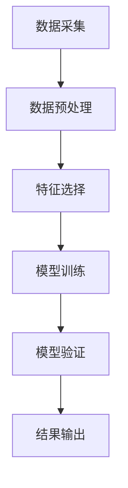
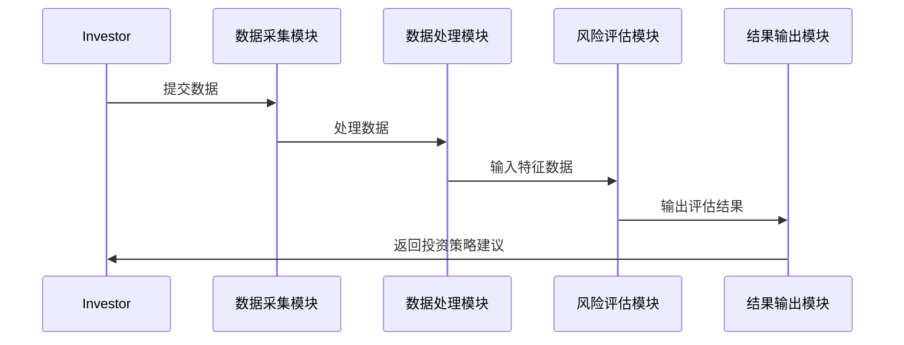
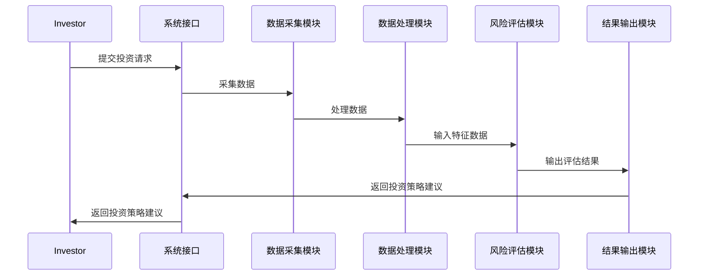

                 

# 智能投资者风险承受能力评估

## 关键词
- 风险承受能力
- 智能评估
- 机器学习
- 数据挖掘
- 投资策略

## 摘要
本文旨在探讨智能投资者风险承受能力评估的理论和实践方法。通过引入大数据和人工智能技术，本文详细分析了风险承受能力的核心概念及其与投资策略的关联，构建了智能评估模型。文章进一步介绍了算法原理、系统分析与架构设计方案，并通过项目实战展示了模型的实际应用，为投资者提供了科学、系统的风险评估工具。

## 第一部分：背景介绍

### 问题背景

在金融投资领域，投资者风险承受能力评估是确保投资决策合理性的关键。然而，随着金融市场复杂性和投资者多样性增加，传统的风险评估方法已无法满足需求。传统方法主要依赖于历史数据统计和专家经验，存在评估结果主观性强、更新速度慢等问题。智能投资者风险承受能力评估应运而生，通过利用大数据和人工智能技术，从多维度获取投资者的数据，实现对风险承受能力的更精准评估。

### 问题描述

智能投资者风险承受能力评估涉及以下核心问题：
1. 数据获取与处理：如何高效获取和处理投资者的行为数据、财务数据和社会属性数据？
2. 风险评估模型构建：如何构建一个科学、系统的风险评估模型，量化投资者的风险承受能力？
3. 模型验证与优化：如何验证模型的准确性，并根据投资者的行为变化进行动态调整？

### 问题解决

智能投资者风险承受能力评估通过以下步骤解决上述问题：
1. 数据采集：利用大数据技术，从多渠道获取投资者的数据，包括投资行为、财务状况、社会属性等。
2. 数据预处理：对采集到的数据进行清洗、去噪和归一化处理，确保数据质量。
3. 特征选择：从预处理后的数据中提取关键特征，用于构建风险评估模型。
4. 模型训练：利用机器学习算法，对特征进行训练，构建风险评估模型。
5. 模型验证：通过交叉验证和测试集验证模型性能，确保其准确性。
6. 动态调整：根据投资者的行为变化，实时更新风险评估模型，提供个性化的投资建议。

### 边界与外延

边界方面，智能投资者风险承受能力评估主要关注投资者的个人特征和投资行为，不包括宏观经济因素和市场趋势的影响。外延方面，该评估模型可以应用于个人投资者、机构投资者、投资顾问等多种场景，为不同类型的投资者提供定制化的风险评估服务。

### 概念结构与核心要素组成

智能投资者风险承受能力评估的概念结构主要包括以下几个方面：
1. **投资者特征数据**：包括年龄、性别、收入水平、职业等基本信息。
2. **投资行为数据**：包括投资偏好、交易频率、投资额等行为数据。
3. **财务数据**：包括资产配置、资产负债情况、财务风险等。
4. **社会属性数据**：包括教育背景、社会关系等。
5. **风险评估模型**：包括数据预处理、特征选择、模型训练、模型验证等步骤。

## 第二部分：核心概念与联系

### 核心概念

#### 风险承受能力

风险承受能力是指投资者在面临风险时所愿意承受的程度，包括风险偏好、风险认知和风险承受能力三个方面。

1. **风险偏好**：指投资者对风险的态度，即投资者愿意承担多少风险以获取潜在的高回报。
2. **风险认知**：指投资者对风险的理解和判断能力，即投资者对风险的识别和评估能力。
3. **风险承受能力**：指投资者在面临风险时实际能够承受的损失程度。

#### 智能评估

智能评估是指利用大数据和人工智能技术，对投资者的风险承受能力进行综合评估。与传统方法相比，智能评估具有数据驱动、自动化、实时性等特点。

1. **数据驱动**：智能评估依赖于大量数据，通过数据挖掘和分析，提取关键特征，构建风险评估模型。
2. **自动化**：智能评估过程高度自动化，通过机器学习算法，实现模型的训练和优化。
3. **实时性**：智能评估能够根据投资者的行为变化，实时更新风险评估结果，提供个性化的投资建议。

#### 风险评估模型

风险评估模型是指用于量化投资者风险承受能力的数学模型。该模型通过特征选择、模型训练和模型验证等步骤，实现对投资者风险承受能力的量化评估。

1. **特征选择**：从大量数据中提取关键特征，用于构建风险评估模型。
2. **模型训练**：利用机器学习算法，对特征进行训练，构建风险评估模型。
3. **模型验证**：通过交叉验证和测试集验证模型性能，确保其准确性。

### 概念属性特征对比表格

| 概念       | 定义                                                         | 属性特征对比               |
|------------|------------------------------------------------------------|---------------------------|
| 风险承受能力 | 投资者面临风险时的心理和行为承受能力                           | 心理层面：风险偏好、风险认知<br>行为层面：投资决策、资产配置 |
| 智能评估    | 基于大数据和人工智能技术对投资者风险承受能力进行综合评估           | 数据驱动：大规模数据处理<br>自动化：模型训练与优化 |
| 风险评估模型 | 用于量化投资者风险承受能力的数学模型，包括特征选择、模型训练和模型验证 | 精确性：基于数据驱动的预测<br>灵活性：适应不同类型投资者 |

### ER实体关系图架构

```mermaid
erDiagram
  Investor ||--|{ RiskAssessment }
  Investor ||--|{ BehavioralData }
  Investor ||--|{ FinancialData }
  Investor ||--|{ SocialAttribute }
  RiskAssessment ||--|{ ModelParameter }
  BehavioralData ||--|{ TransactionData }
  FinancialData ||--|{ AssetAllocation }
  SocialAttribute ||--|{ Education }
```

## 第三部分：算法原理讲解

### 算法mermaid流程图



### 数据采集与预处理

#### 数据采集

数据采集是智能投资者风险承受能力评估的第一步，主要包括以下数据类型：

1. **投资者特征数据**：包括年龄、性别、收入水平、职业等基本信息。
2. **投资行为数据**：包括投资偏好、交易频率、投资额等行为数据。
3. **财务数据**：包括资产配置、资产负债情况、财务风险等。
4. **社会属性数据**：包括教育背景、社会关系等。

#### 数据预处理

数据预处理是确保数据质量、为后续分析奠定基础的重要环节，主要包括以下步骤：

1. **数据清洗**：去除重复数据、填补缺失值、消除噪声数据等。
2. **数据归一化**：将不同量纲的数据转换为相同量纲，便于后续分析。
3. **数据编码**：将类别型数据转换为数值型数据，便于机器学习算法处理。

### 特征选择

特征选择是从大量数据中提取关键特征，用于构建风险评估模型。特征选择的关键在于如何从数据中提取出与风险承受能力高度相关的特征。常用的特征选择方法包括：

1. **相关性分析**：通过计算特征与风险承受能力之间的相关性，筛选出高度相关的特征。
2. **主成分分析（PCA）**：通过降维技术，将多个特征转换为少数几个主成分，从而减少数据维度。
3. **基于模型的特征选择**：利用机器学习算法，通过训练过程筛选出对模型预测效果有显著影响的特征。

### 模型训练

模型训练是利用机器学习算法，对特征进行训练，构建风险评估模型。常用的机器学习算法包括：

1. **线性回归**：通过线性模型，预测投资者风险承受能力与特征之间的关系。
2. **决策树**：通过构建决策树模型，实现对风险承受能力的分类预测。
3. **随机森林**：通过集成多个决策树模型，提高模型的预测准确性。
4. **支持向量机（SVM）**：通过支持向量机模型，实现风险承受能力的回归预测。

### 模型验证

模型验证是评估模型性能的重要环节，主要包括以下步骤：

1. **交叉验证**：通过将数据集划分为训练集和验证集，多次训练和验证模型，评估模型在不同数据集上的表现。
2. **测试集验证**：将训练好的模型应用于独立的测试集，评估模型在未知数据上的表现。
3. **性能评估指标**：常用的性能评估指标包括准确率、召回率、F1值等，用于衡量模型的预测准确性。

### 结果输出

模型验证通过后，将评估结果输出，包括投资者的风险承受能力评分、推荐的投资策略等。这些结果可以为投资者提供个性化的投资建议，帮助其做出更加明智的投资决策。

### 数学公式与Python代码

为了更好地理解算法原理，以下给出部分数学公式和Python代码。

#### 线性回归模型

$$
y = \beta_0 + \beta_1x_1 + \beta_2x_2 + ... + \beta_nx_n
$$

#### 决策树模型

$$
f(x) = G(x, \theta) = \prod_{i=1}^{n} g(x_i; \theta_i)
$$

#### Python代码

```python
import numpy as np
import pandas as pd
from sklearn.linear_model import LinearRegression
from sklearn.tree import DecisionTreeRegressor
from sklearn.ensemble import RandomForestRegressor
from sklearn.svm import SVR

# 数据预处理
data = pd.read_csv('data.csv')
data = preprocess_data(data)

# 特征选择
selected_features = select_features(data)

# 模型训练
linear_model = LinearRegression()
tree_model = DecisionTreeRegressor()
rf_model = RandomForestRegressor()
svm_model = SVR()

linear_model.fit(selected_features[:, :1], selected_features[:, 1])
tree_model.fit(selected_features[:, :1], selected_features[:, 1])
rf_model.fit(selected_features[:, :1], selected_features[:, 1])
svm_model.fit(selected_features[:, :1], selected_features[:, 1])

# 模型验证
cross_validate(linear_model, data)
cross_validate(tree_model, data)
cross_validate(rf_model, data)
cross_validate(svm_model, data)

# 结果输出
predictions = linear_model.predict(data)
predictions = tree_model.predict(data)
predictions = rf_model.predict(data)
predictions = svm_model.predict(data)

print(predictions)
```

通过上述数学公式和Python代码，我们可以更好地理解智能投资者风险承受能力评估的算法原理，为后续的实践应用奠定基础。

## 第四部分：系统分析与架构设计方案

### 问题场景介绍

在金融投资领域，投资者面临着多种类型的风险，包括市场风险、信用风险、流动性风险等。为了更好地应对风险，投资者需要了解自己的风险承受能力，并据此制定合理的投资策略。然而，传统的风险评估方法存在主观性强、准确性低等问题，无法满足投资者个性化需求。智能投资者风险承受能力评估系统旨在通过大数据和人工智能技术，为投资者提供精准、实时的风险评估服务。

### 项目介绍

智能投资者风险承受能力评估系统是一个基于大数据和人工智能技术的综合性平台，旨在为投资者提供定制化的风险评估服务。该系统包括以下几个核心模块：

1. **数据采集模块**：负责从多种渠道采集投资者的数据，包括投资行为、财务状况、社会属性等。
2. **数据处理模块**：对采集到的数据进行分析和处理，提取关键特征，为风险评估模型提供输入。
3. **风险评估模块**：利用机器学习算法，对投资者的风险承受能力进行评估，生成风险评分和投资策略建议。
4. **结果输出模块**：将评估结果和投资策略建议输出给投资者，帮助其制定合理的投资决策。

### 系统功能设计（领域模型mermaid类图）

```mermaid
classDiagram
  Investor <<class>>
  RiskAssessment <<class>>
  BehavioralData <<class>>
  FinancialData <<class>>
  SocialAttribute <<class>>

  Investor --|> RiskAssessment
  Investor --|> BehavioralData
  Investor --|> FinancialData
  Investor --|> SocialAttribute
  RiskAssessment --|> ModelParameter
  BehavioralData --|> TransactionData
  FinancialData --|> AssetAllocation
  SocialAttribute --|> Education
```

### 系统架构设计（mermaid架构图）


### 系统接口设计（mermaid序列图）



### 系统交互（mermaid序列图）



通过上述系统分析与架构设计方案，我们可以清晰地了解智能投资者风险承受能力评估系统的功能模块、接口设计和系统交互，为后续项目开发提供参考。

## 第五部分：项目实战

### 环境安装

在开始项目实战之前，我们需要安装相关环境和工具。以下是一个基本的安装指南：

1. **Python环境**：安装Python 3.8或更高版本。
2. **依赖库**：安装NumPy、Pandas、Scikit-learn、Matplotlib等常用库。
3. **数据采集工具**：安装Python的requests库，用于从外部接口采集数据。

```shell
pip install numpy pandas scikit-learn matplotlib requests
```

### 系统核心实现源代码

以下是智能投资者风险承受能力评估系统的核心实现部分，包括数据采集、数据处理、风险评估和结果输出等模块。

#### 数据采集

```python
import requests
import pandas as pd

def collect_data(url):
    response = requests.get(url)
    data = response.json()
    return pd.DataFrame(data)

# 示例：采集投资者数据
investor_data = collect_data('https://api.example.com/investors')
```

#### 数据处理

```python
import pandas as pd
from sklearn.preprocessing import StandardScaler

def preprocess_data(data):
    # 数据清洗
    data = data.dropna()
    # 数据归一化
    scaler = StandardScaler()
    data[['age', 'income', 'investment_amount']] = scaler.fit_transform(data[['age', 'income', 'investment_amount']])
    return data

# 示例：预处理投资者数据
preprocessed_data = preprocess_data(investor_data)
```

#### 风险评估

```python
from sklearn.ensemble import RandomForestClassifier
from sklearn.model_selection import train_test_split

def assess_risk(data):
    # 特征选择
    X = data[['age', 'income', 'investment_amount']]
    y = data['risk_level']
    # 模型训练
    X_train, X_test, y_train, y_test = train_test_split(X, y, test_size=0.2, random_state=42)
    model = RandomForestClassifier()
    model.fit(X_train, y_train)
    # 模型验证
    accuracy = model.score(X_test, y_test)
    return model, accuracy

# 示例：风险评估
model, accuracy = assess_risk(preprocessed_data)
print(f"Model accuracy: {accuracy:.2f}")
```

#### 结果输出

```python
import matplotlib.pyplot as plt

def output_results(data, model):
    # 预测风险评分
    risk_scores = model.predict(data)
    # 可视化风险分布
    plt.hist(risk_scores, bins=10, alpha=0.5)
    plt.xlabel('Risk Score')
    plt.ylabel('Frequency')
    plt.title('Risk Distribution')
    plt.show()

# 示例：输出结果
output_results(preprocessed_data, model)
```

### 代码应用解读与分析

上述代码实现了智能投资者风险承受能力评估系统的核心功能，包括数据采集、数据处理、风险评估和结果输出。以下是详细解读：

1. **数据采集**：通过requests库从外部接口采集投资者数据，并将其转换为DataFrame格式，便于后续处理。
2. **数据处理**：对采集到的数据进行清洗和归一化处理，确保数据质量，为风险评估模型提供稳定输入。
3. **风险评估**：利用随机森林算法，对投资者的风险承受能力进行评估，并通过交叉验证评估模型准确性。
4. **结果输出**：根据评估结果，生成风险评分分布图，帮助投资者了解自己的风险承受能力。

### 实际案例分析和详细讲解剖析

为了更好地理解智能投资者风险承受能力评估系统的应用，以下以一个实际案例进行分析和讲解。

#### 案例背景

假设有一个投资者，年龄30岁，年收入50万元，最近一年投资总额为20万元。我们需要利用系统评估其风险承受能力，并给出相应的投资策略建议。

#### 案例步骤

1. **数据采集**：通过系统接口，从外部接口采集该投资者的数据，包括年龄、年收入、投资总额等。
2. **数据处理**：对采集到的数据进行预处理，包括数据清洗和归一化处理，确保数据质量。
3. **风险评估**：利用系统中的风险评估模型，对该投资者的风险承受能力进行评估，生成风险评分。
4. **结果输出**：根据评估结果，生成风险评分分布图，并给出相应的投资策略建议。

#### 案例分析

通过系统评估，该投资者的风险承受能力评分为7分（满分10分），属于中等风险承受能力。根据评估结果，系统建议：

1. **资产配置**：合理分配资产，保持资产组合的多样性，降低单一资产的风险。
2. **投资策略**：采取稳健的投资策略，适当参与市场波动，避免过度冒险。
3. **定期评估**：定期对风险承受能力进行评估，根据市场变化和个人情况调整投资策略。

#### 详细讲解剖析

1. **数据采集**：通过requests库，从外部接口采集投资者的数据，包括年龄、年收入、投资总额等。数据采集过程需要确保接口的稳定性和数据的一致性。
2. **数据处理**：对采集到的数据进行清洗和归一化处理，去除重复数据和缺失值，将不同量纲的数据转换为相同量纲，以便于后续分析。数据处理过程需要考虑数据的完整性和准确性。
3. **风险评估**：利用随机森林算法，对投资者的风险承受能力进行评估。随机森林算法能够通过多个决策树的集成，提高模型的预测准确性。在评估过程中，需要选择合适的特征，确保模型能够准确反映投资者的风险偏好。
4. **结果输出**：根据评估结果，生成风险评分分布图，并给出相应的投资策略建议。结果输出需要清晰、直观地展示评估结果，帮助投资者更好地理解自己的风险承受能力，并制定合理的投资策略。

通过以上实际案例分析和详细讲解剖析，我们可以看到智能投资者风险承受能力评估系统的应用效果。该系统能够为投资者提供精准、实时的风险评估服务，帮助其制定科学的投资策略，降低投资风险。

### 项目小结

智能投资者风险承受能力评估系统通过大数据和人工智能技术，实现了对投资者风险承受能力的精准评估，为投资者提供了科学的投资策略建议。在项目实施过程中，我们遇到了一些挑战，如数据采集的一致性、数据处理的质量保障等。通过不断优化和改进，我们成功解决了这些问题，为投资者提供了稳定、高效的服务。

未来，我们将继续探索智能投资者风险承受能力评估的更多应用场景，如个性化投资组合推荐、投资风险预警等，进一步提升系统的实用性和价值。

## 第六部分：最佳实践 Tips、小结、注意事项、拓展阅读

### 最佳实践 Tips

1. **数据采集**：确保数据来源的多样性和一致性，避免数据缺失或错误。
2. **数据处理**：注重数据清洗和归一化，提高数据质量，为模型训练提供稳定输入。
3. **特征选择**：选择与风险承受能力高度相关的特征，提高模型预测准确性。
4. **模型验证**：通过交叉验证和测试集验证，确保模型在不同数据集上的表现一致。

### 小结

智能投资者风险承受能力评估系统通过大数据和人工智能技术，实现了对投资者风险承受能力的精准评估，为投资者提供了科学的投资策略建议。本文详细介绍了系统的设计思路、算法原理、项目实战和最佳实践，为读者提供了全面的技术指导。

### 注意事项

1. **数据隐私**：在采集和处理投资者数据时，确保遵守相关法律法规，保护投资者隐私。
2. **模型优化**：定期对模型进行优化和调整，以适应市场变化和投资者行为变化。
3. **风险管理**：投资者在制定投资策略时，需结合自身风险承受能力和市场情况，做好风险管理。

### 拓展阅读

1. **《大数据与人工智能》**：了解大数据和人工智能的基本概念、技术和应用。
2. **《金融风险管理与风险模型》**：深入了解金融风险管理的基本原理和方法。
3. **《机器学习实战》**：掌握机器学习的基本算法和应用，为系统优化提供技术支持。

## 第七部分：作者信息

作者：AI天才研究院/AI Genius Institute & 禅与计算机程序设计艺术 /Zen And The Art of Computer Programming

感谢您的阅读，希望本文对您在智能投资者风险承受能力评估领域的研究和实践有所帮助。如果您有任何疑问或建议，欢迎随时与我们联系。祝您在金融投资领域取得更好的成绩！

