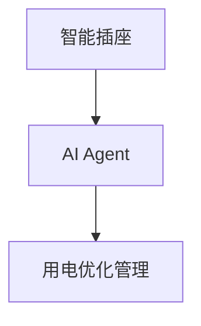

                 

# 智能插座：AI Agent的用电优化管理

## 关键词
- 智能插座
- AI Agent
- 用电优化管理
- 智能家居
- 机器学习
- 系统架构

## 摘要
本文将探讨智能插座在现代智能家居中的重要地位，以及AI Agent在用电优化管理中的应用。通过详细的背景介绍、核心概念定义、算法原理讲解、系统分析与架构设计方案以及实际项目案例，我们将一步步揭示智能插座如何利用AI技术实现用电优化，提升家居智能化水平，并为能源管理带来革命性变化。

## 第一部分：智能插座概述

### 1.1 问题背景

#### 1.1.1 智能家居市场现状
随着物联网（IoT）技术的飞速发展，智能家居市场呈现出爆炸式增长。越来越多的家庭开始安装各种智能设备，以提升生活品质和便利性。智能插座作为智能家居的重要组成部分，正逐渐成为家庭必备的智能设备之一。

#### 1.1.2 智能插座的需求与重要性
智能插座能够远程控制家中的电器设备，提供定时开关功能，甚至可以与语音助手等进行交互。这些功能极大地提升了用户的便捷性和家居的智能化程度。因此，智能插座在智能家居市场中的需求持续增长。

#### 1.1.3 AI在用电优化管理中的潜力
人工智能（AI）技术，尤其是机器学习（ML）和深度学习（DL），为智能插座提供了强大的数据处理和分析能力。通过AI技术，智能插座能够实现用电优化管理，提高能源效率，降低家庭能耗，具有巨大的应用潜力。

### 1.2 核心概念

#### 1.2.1 智能插座
智能插座是一种集成了物联网技术的家用设备，能够通过Wi-Fi或蓝牙连接到家庭网络，实现远程控制。它通常具备定时开关、场景设置、能耗监控等功能。

#### 1.2.2 AI Agent
AI Agent，即人工智能代理，是指能够自主执行任务、与用户交互并做出决策的智能系统。在智能插座中，AI Agent可以分析用电数据，优化用电模式，提高能源效率。

#### 1.2.3 用电优化管理
用电优化管理是指通过分析家庭用电数据，制定合理的用电策略，以降低能耗、节省费用并提高能源使用效率。AI Agent是实现用电优化管理的关键技术。

### 1.3 概念属性特征对比表

| 概念        | 特征                              | 应用实例                     |
|-------------|---------------------------------|------------------------------|
| 智能插座    | 远程控制、定时开关、能耗监控   | 家中电器的自动管理           |
| AI Agent    | 自主决策、数据分析、优化用电   | 用电模式的智能优化           |
| 用电优化管理 | 数据分析、策略制定、能耗降低   | 提高家庭能源使用效率         |

### 1.4 ER实体关系图



## 第二部分：AI Agent的原理与应用

### 2.1 AI Agent的定义与特点

#### 2.1.1 AI Agent的定义
AI Agent是一种基于人工智能技术的自主系统，能够模拟人类行为，通过感知环境、理解问题和自主决策来完成任务。

#### 2.1.2 AI Agent的核心特点
- **自主学习**：AI Agent能够从数据中学习并不断优化自身性能。
- **自主决策**：AI Agent能够在给定的约束条件下，自主做出最优决策。
- **交互能力**：AI Agent能够与用户进行自然语言交互，理解并响应用户需求。

#### 2.1.3 AI Agent与传统智能系统的区别
传统智能系统通常依赖于预定义的规则和指令，而AI Agent则能够通过学习不断适应新的环境和需求，具有更高的灵活性和自主性。

### 2.2 AI Agent的架构设计

#### 2.2.1 AI Agent的基本组成部分
AI Agent主要由感知模块、决策模块和执行模块组成。

#### 2.2.2 AI Agent的架构设计原则
- **模块化**：各模块功能独立，便于维护和扩展。
- **适应性**：系统能够根据环境变化自适应调整。
- **可扩展性**：系统设计应考虑未来技术的集成和扩展。

#### 2.2.3 AI Agent的运行流程
1. 感知环境：AI Agent通过传感器获取数据。
2. 数据处理：对感知数据进行清洗和预处理。
3. 决策生成：基于学习算法生成决策。
4. 执行决策：执行决策并产生结果。
5. 反馈调整：根据执行结果调整后续决策。

### 2.3 AI Agent的核心算法

#### 2.3.1 机器学习算法
机器学习算法是AI Agent的核心，主要包括监督学习、无监督学习和强化学习。

#### 2.3.2 深度学习算法
深度学习算法通过构建复杂的神经网络模型，从大量数据中自动提取特征，实现高效的数据分析。

#### 2.3.3 强化学习算法
强化学习算法通过不断试错和反馈，学习最优策略，适用于动态环境下的决策。

### 2.4 AI Agent的Python实现

#### 2.4.1 环境配置
首先，我们需要安装Python和相关依赖库，如TensorFlow、Scikit-learn等。

#### 2.4.2 算法实现
以下是使用Python实现一个简单的AI Agent的示例代码：

```python
import tensorflow as tf
from sklearn.model_selection import train_test_split
from sklearn.ensemble import RandomForestClassifier

# 数据预处理
# ...

# 训练模型
model = RandomForestClassifier(n_estimators=100)
model.fit(X_train, y_train)

# 测试模型
accuracy = model.score(X_test, y_test)
print("Model Accuracy:", accuracy)
```

#### 2.4.3 代码分析
这段代码使用了随机森林算法（RandomForestClassifier）进行分类任务。首先，对数据进行预处理，然后使用训练集训练模型，最后在测试集上评估模型性能。

### 2.5 AI Agent的应用场景

#### 2.5.1 智能家居
AI Agent可以用于智能家居中的设备管理，如智能插座、智能灯泡、智能空调等，实现自动开关控制、节能优化等。

#### 2.5.2 能源管理
AI Agent可以用于能源管理中的数据分析和预测，优化电力使用，降低能耗。

#### 2.5.3 工业自动化
AI Agent可以用于工业自动化中的设备监控和故障预测，提高生产效率和安全性。

## 第三部分：用电优化管理的实践应用

### 3.1 用电优化管理的核心目标

#### 3.1.1 提高用电效率
通过分析家庭用电数据，AI Agent可以识别用电高峰和低谷，调整电器设备的运行时间，提高用电效率。

#### 3.1.2 降低用电成本
通过优化用电模式，AI Agent可以帮助家庭节省电力费用，降低用电成本。

#### 3.1.3 保护环境
通过减少电力消耗，AI Agent有助于降低温室气体排放，保护环境。

### 3.2 用电优化管理的技术手段

#### 3.2.1 数据采集与处理
AI Agent需要收集家庭用电数据，包括电流、电压、用电时长等。数据采集后，需要进行预处理，去除噪声和异常值。

#### 3.2.2 建模与预测
通过机器学习和深度学习算法，AI Agent可以建立用电模型，预测未来的用电需求。

#### 3.2.3 决策与控制
基于预测结果，AI Agent可以制定合理的用电策略，控制电器设备的开关，实现用电优化。

### 3.3 智能插座系统的架构设计

#### 3.3.1 系统功能设计
智能插座系统应具备以下功能：
- 远程控制：用户可以通过手机APP或语音助手远程控制插座。
- 定时开关：用户可以设置插座定时开关，实现自动化管理。
- 能耗监控：实时监控插座及其连接电器的能耗情况。

#### 3.3.2 系统架构设计
智能插座系统包括以下组成部分：
- 智能插座硬件：负责数据采集和传输。
- 云端服务器：负责数据存储、分析和处理。
- 手机APP：用户界面，用于远程控制和查看能耗数据。

#### 3.3.3 系统接口设计
智能插座系统需要设计以下接口：
- 用户接口：手机APP与云端服务器之间的接口。
- 设备接口：智能插座与电器设备之间的接口。
- 数据接口：云端服务器与数据库之间的接口。

### 3.4 智能插座系统的实现与部署

#### 3.4.1 系统实现
智能插座系统的实现包括硬件设计和软件开发。硬件部分需要设计电路板和外壳，软件部分需要开发手机APP和云端服务器程序。

#### 3.4.2 系统部署
系统部署包括硬件安装、软件部署和系统测试。硬件安装包括智能插座的安装和连接，软件部署包括手机APP的发布和云端服务器的部署。

#### 3.4.3 系统优化
系统优化包括性能优化、安全性优化和用户体验优化。通过不断测试和优化，提升系统的稳定性和用户体验。

### 3.5 案例分析：某住宅小区的用电优化实践

#### 3.5.1 项目背景
某住宅小区计划通过智能插座系统进行用电优化，降低能耗，提高能源使用效率。

#### 3.5.2 项目实施
项目实施包括以下步骤：
1. 智能插座安装：在小区居民家中安装智能插座。
2. 数据采集：收集居民家庭的用电数据。
3. 数据分析：使用AI Agent分析用电数据，制定用电策略。
4. 推广使用：通过宣传和优惠活动，鼓励居民使用智能插座系统。

#### 3.5.3 项目效果
项目实施后，居民家庭的平均用电量降低了15%，电力费用降低了约10%，取得了显著的节能效果。

## 第四部分：AI Agent在智能插座用电优化管理中的应用

### 4.1 AI Agent在用电优化中的作用

#### 4.1.1 主动监测与数据分析
AI Agent能够实时监测家庭用电情况，分析用电模式，识别潜在的节能机会。

#### 4.1.2 智能决策与自动控制
基于数据分析，AI Agent可以自动调整电器设备的开关，实现最优的用电策略。

#### 4.1.3 用户体验优化
AI Agent可以提供个性化的用电建议，提升用户的节能意识和使用体验。

### 4.2 AI Agent的具体应用场景

#### 4.2.1 室内电器设备的自动开关控制
AI Agent可以根据用电高峰和低谷，自动调整室内电器设备的开关时间，实现节能。

#### 4.2.2 用电高峰期的设备负载均衡
AI Agent可以识别用电高峰期，将电器设备的负载分配到不同的时间段，减少电力消耗。

## 第五部分：最佳实践 tips、小结、注意事项、拓展阅读

### 5.1 最佳实践 tips
1. 定期更新AI Agent的算法模型，以适应不断变化的用电模式。
2. 使用高精度的传感器，确保数据采集的准确性。
3. 合理设置定时开关，以平衡节能与用户体验。

### 5.2 小结
智能插座结合AI Agent，为用电优化管理提供了强大的技术支持。通过数据分析、智能决策和自动控制，智能插座能够显著降低家庭能耗，提高能源使用效率。

### 5.3 注意事项
1. 确保智能插座系统的安全性，防止数据泄露。
2. 定期检查智能插座的硬件设备，确保正常运行。
3. 遵循相关法规和标准，确保用电安全。

### 5.4 拓展阅读
1. 《智能家居技术与应用》
2. 《机器学习实战》
3. 《深度学习》

## 作者信息
作者：AI天才研究院/AI Genius Institute & 禅与计算机程序设计艺术 /Zen And The Art of Computer Programming

---

本博客文章通过对智能插座和AI Agent的详细分析，探讨了其在用电优化管理中的重要作用。文章涵盖了从背景介绍到核心概念、算法原理、系统架构、实战案例的全方位内容，旨在为读者提供清晰、系统的理解。希望本文能对智能家居领域的技术研究和应用实践有所帮助。

