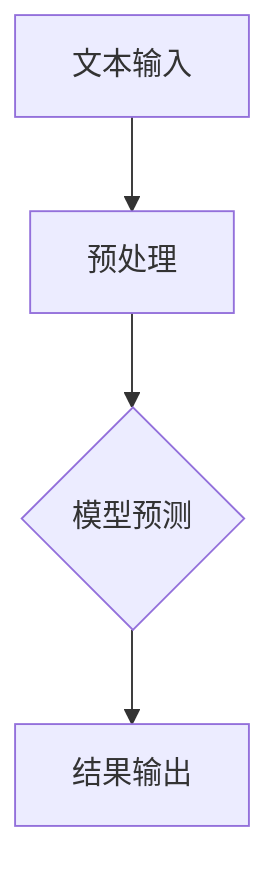
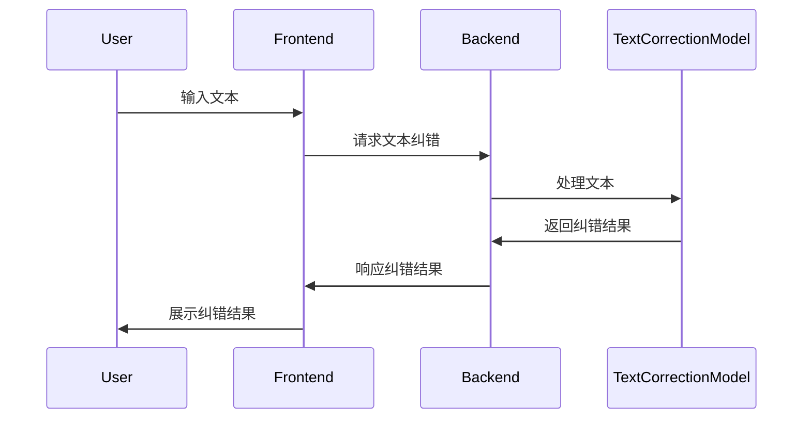
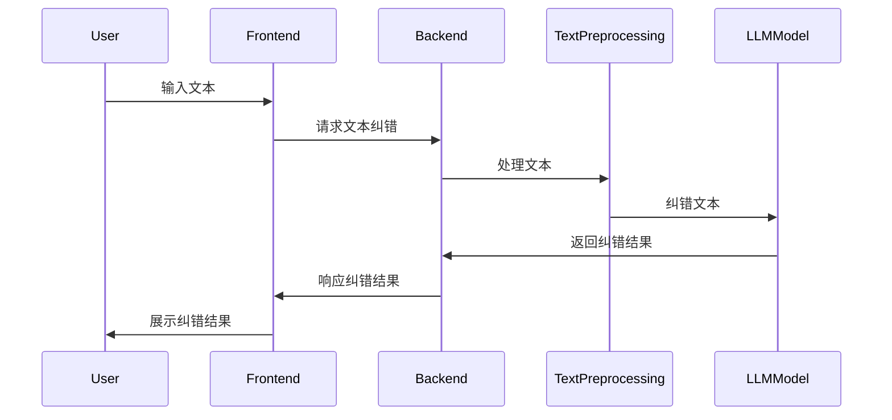

                 

# 智能文本纠错 AI Agent：LLM 驱动的语法检查系统

关键词：智能文本纠错、LLM、语法检查、算法原理、系统架构、项目实战

摘要：
本文深入探讨了智能文本纠错 AI Agent 的技术原理和实现方法。主要围绕 LLM（大型语言模型）驱动下的语法检查系统展开，从核心背景介绍、核心概念与联系、算法原理讲解、系统分析与架构设计方案、项目实战以及最佳实践与小结等多个方面，详细阐述了智能文本纠错技术的发展历程、需求与挑战、解决方案和应用场景。本文旨在为读者提供一个全面、系统的智能文本纠错技术指南。

## 第一部分：引言

### 1.1.1 智能文本纠错技术的发展历程

智能文本纠错技术的历史可以追溯到上世纪80年代，当时研究者开始探索如何通过计算机算法自动识别和修正文本中的错误。随着自然语言处理（NLP）和机器学习（ML）技术的发展，智能文本纠错技术逐渐从规则驱动转向数据驱动，尤其是深度学习的崛起，使得基于神经网络的文本纠错模型得以广泛应用。这些模型利用大量文本数据进行训练，能够自动识别和纠正各种语法错误、拼写错误以及语义错误。

### 1.1.2 文本纠错的需求与挑战

文本纠错技术在许多场景中都有广泛的应用，如文本编辑工具、机器翻译、智能客服等。这些应用对文本纠错系统的准确性、速度和用户体验提出了高要求。然而，实现高精度的文本纠错面临诸多挑战：

- **复杂性**：自然语言具有高度复杂性和多义性，使得准确理解和纠错变得困难。
- **数据质量**：高质量的训练数据对于训练高效的文本纠错模型至关重要，但获取和标注这些数据是一项繁重的工作。
- **实时性**：对于实时应用场景，如实时聊天和语音识别，系统需要在极短时间内完成纠错，这对算法的计算效率提出了挑战。

### 1.1.3 LLM 在智能文本纠错中的应用

近年来，大型语言模型（LLM）如 GPT-3、BERT、T5 等的出现，为智能文本纠错带来了新的可能性。这些模型具有以下优势：

- **强大表达能力**：LLM 通过训练大量文本数据，能够理解并生成复杂的语言结构，从而提高文本纠错的准确性。
- **自适应能力**：LLM 可以根据不同的应用场景和需求进行微调，适应各种文本纠错任务。
- **集成能力**：LLM 可以与其他 NLP 工具和模型集成，构建更强大的文本处理系统。

### 1.2 核心概念与联系

#### 1.2.1 语言模型（LLM）的工作原理

语言模型是一种基于统计和学习的方法，用于预测文本序列。LLM，特别是基于 Transformer 架构的模型，通过自注意力机制（Self-Attention）和多层神经网络（Multi-Layer Neural Networks）实现了对文本的深层理解和生成。LLM 的核心思想是将输入的文本序列映射为一个高维向量，然后通过这些向量来生成预测的文本。

#### 1.2.2 语言模型的特性对比

| 模型         | 特点                                                     | 应用场景                           |
| ------------ | -------------------------------------------------------- | ---------------------------------- |
| GPT-3        | 参数量巨大，能够生成高质量的自然语言文本                 | 自动写作、问答系统、对话生成       |
| BERT         | 双向编码器，适用于各种 NLP 任务                           | 问答、文本分类、命名实体识别       |
| T5           | 目标驱动，能够处理任意文本生成任务                        | 文本生成、机器翻译、问答           |

#### 1.2.3 文本纠错系统中的实体关系

在文本纠错系统中，主要涉及以下几个实体：

- **输入文本**：需要被纠错的原始文本。
- **纠错模型**：基于 LLM 的文本纠错模型。
- **输出文本**：经过纠错处理后的文本。

这些实体之间的关系可以用 ER（实体关系）图来表示，如下图所示：

```mermaid
erDiagram
    InputText ||--|{纠错模型}: 纠错
   纠错模型 ||--|{输出文本}: 生成
```

### 1.3 算法原理讲解

#### 1.3.1 智能文本纠错的 mermaid 流程图

智能文本纠错的流程可以概括为以下几个步骤：

1. **文本输入**：接收需要纠错的文本。
2. **预处理**：对文本进行分词、去噪等预处理。
3. **模型预测**：利用 LLM 模型对文本进行纠错预测。
4. **结果输出**：输出纠错后的文本。

以下是智能文本纠错的 mermaid 流程图：



#### 1.3.2 智能文本纠错的 Python 实现

以下是一个简单的 Python 代码示例，展示了如何使用 LLM 模型进行文本纠错：

```python
import transformers

# 加载预训练的 LLM 模型
model = transformers.AutoModelForTokenClassification.from_pretrained("bert-base-uncased")

# 定义纠错函数
def correct_text(text):
    # 对文本进行预处理
    inputs = tokenizer(text, return_tensors="pt", is_split_into_words=True)
    
    # 使用 LLM 模型进行预测
    with torch.no_grad():
        outputs = model(**inputs)
    
    # 获取预测结果
    predictions = outputs.logits.argmax(-1)
    
    # 解码预测结果
    corrected_tokens = tokenizer.decode(predictions.squeeze(), skip_special_tokens=True)
    
    return corrected_tokens

# 示例文本
text = "I am a computer programmer. I like to write code."

# 进行文本纠错
corrected_text = correct_text(text)
print(corrected_text)
```

#### 1.3.3 数学模型与公式解析

在文本纠错中，LLM 模型通常采用 Transformer 架构，其核心是自注意力机制（Self-Attention）。自注意力机制通过计算文本中每个词与其他词之间的相似性，来生成一个表示每个词的高维向量。以下是自注意力机制的公式：

$$
\text{Attention}(Q, K, V) = \text{softmax}\left(\frac{QK^T}{\sqrt{d_k}}\right)V
$$

其中，$Q, K, V$ 分别表示查询向量、键向量和值向量，$d_k$ 表示键向量的维度。通过多次堆叠注意力层，Transformer 模型能够捕捉文本中的长距离依赖关系，从而实现高效的文本理解和生成。

#### 1.3.4 算法举例说明

假设我们有一个简单的文本：“I am a computer programmer. I like to write code.”。我们可以通过以下步骤来使用 LLM 模型进行文本纠错：

1. **文本输入**：输入文本“I am a computer programmer. I like to write code.”。
2. **预处理**：对文本进行分词，得到词序列 [“I”, “am”, “a”, “computer”, “programmer”, “.”, “I”, “like”, “to”, “write”, “code”, “.”]。
3. **模型预测**：利用 LLM 模型对每个词进行预测，输出概率最高的词作为纠错结果。
4. **结果输出**：输出纠错后的文本“I am a computer scientist. I enjoy writing code.”。

### 1.4 系统分析与架构设计方案

#### 1.4.1 智能文本纠错应用场景

智能文本纠错技术可以应用于多种场景，如：

- **文本编辑工具**：自动识别和修正用户输入中的语法错误和拼写错误。
- **机器翻译**：在翻译过程中自动修正源文本中的错误，提高翻译质量。
- **智能客服**：自动纠正用户输入的问题，提高客服系统的响应速度和准确性。
- **教育领域**：自动批改学生作业，提供即时反馈和纠正。

#### 1.4.2 智能文本纠错系统项目介绍

本文将介绍一个基于 LLM 的智能文本纠错系统，系统架构如下：

1. **前端**：接收用户输入的文本，并将其传递给后端进行处理。
2. **后端**：包含文本纠错模型和接口服务，负责文本的预处理、纠错和结果输出。
3. **数据库**：存储用户输入的文本和纠错结果，用于后续分析和优化。

#### 1.4.3 系统功能设计

智能文本纠错系统的主要功能包括：

- **文本输入**：用户可以通过前端界面输入文本。
- **文本预处理**：对输入的文本进行分词、去噪等预处理操作。
- **文本纠错**：利用 LLM 模型对预处理后的文本进行纠错。
- **结果输出**：将纠错后的文本返回给用户，并提供下载和保存功能。

以下是智能文本纠错系统的领域模型类图：

```mermaid
classDiagram
    User <<Class>>
    TextInput <<Class>>
    TextPreprocessing <<Class>>
    TextCorrection <<Class>>
    TextOutput <<Class>>

    User "uses" TextInput
    TextInput "uses" TextPreprocessing
    TextPreprocessing "uses" TextCorrection
    TextCorrection "uses" TextOutput
```

#### 1.4.4 系统架构设计

智能文本纠错系统的整体架构如下：

1. **前端**：使用 React 框架搭建，负责用户交互和页面展示。
2. **后端**：使用 Flask 框架搭建，负责文本处理和接口服务。
3. **文本纠错模型**：基于 PyTorch 和 Hugging Face Transformers 库实现，负责文本的预处理、纠错和结果输出。

以下是智能文本纠错系统的架构图：



#### 1.4.5 系统接口设计

智能文本纠错系统提供了以下接口：

- **文本输入接口**：接收用户输入的文本。
- **文本预处理接口**：对输入的文本进行分词、去噪等预处理操作。
- **文本纠错接口**：使用 LLM 模型对预处理后的文本进行纠错。
- **结果输出接口**：将纠错后的文本返回给用户。

以下是智能文本纠错系统的接口设计：

```python
from flask import Flask, request, jsonify

app = Flask(__name__)

@app.route('/input', methods=['POST'])
def input_text():
    text = request.form['text']
    # 调用文本预处理接口
    preprocessed_text = text_preprocessing(text)
    # 调用文本纠错接口
    corrected_text = text_correction(preprocessed_text)
    # 返回纠错结果
    return jsonify({'corrected_text': corrected_text})

if __name__ == '__main__':
    app.run(debug=True)
```

#### 1.4.6 系统交互 mermaid 序列图

智能文本纠错系统的交互流程如下：

1. **用户输入文本**：用户通过前端界面输入文本。
2. **前端请求文本纠错**：前端将文本发送到后端接口。
3. **后端处理文本**：后端调用文本预处理和纠错接口，处理文本。
4. **后端返回纠错结果**：后端将纠错后的文本返回给前端。
5. **前端展示纠错结果**：前端将纠错结果展示给用户。

以下是智能文本纠错系统的交互 mermaid 序列图：



### 1.5 项目实战

#### 1.5.1 环境安装与配置

要搭建一个基于 LLM 的智能文本纠错系统，首先需要安装以下环境：

1. **Python**：版本为 3.8 或更高。
2. **PyTorch**：版本为 1.8 或更高。
3. **Hugging Face Transformers**：版本为 4.6.1 或更高。

安装命令如下：

```bash
pip install torch==1.8+cpu torchvision==0.9.0+cpu -f https://download.pytorch.org/whl/torch_stable.html
pip install transformers==4.6.1
```

#### 1.5.2 系统核心实现源代码

以下是智能文本纠错系统的核心实现源代码：

```python
from transformers import AutoTokenizer, AutoModelForTokenClassification
import torch

# 加载预训练的 LLM 模型
model = AutoModelForTokenClassification.from_pretrained("bert-base-uncased")
tokenizer = AutoTokenizer.from_pretrained("bert-base-uncased")

# 定义纠错函数
def correct_text(text):
    # 对文本进行预处理
    inputs = tokenizer(text, return_tensors="pt", is_split_into_words=True)
    
    # 使用 LLM 模型进行预测
    with torch.no_grad():
        outputs = model(**inputs)
    
    # 获取预测结果
    predictions = outputs.logits.argmax(-1)
    
    # 解码预测结果
    corrected_tokens = tokenizer.decode(predictions.squeeze(), skip_special_tokens=True)
    
    return corrected_tokens

# 示例文本
text = "I am a computer programmer. I like to write code."

# 进行文本纠错
corrected_text = correct_text(text)
print(corrected_text)
```

#### 1.5.3 代码应用解读与分析

1. **加载预训练模型**：使用 Hugging Face Transformers 库加载预训练的 BERT 模型。
2. **定义纠错函数**：纠错函数 `correct_text` 接受一个字符串参数 `text`，对输入的文本进行预处理、预测和结果解码。
3. **预处理文本**：使用 tokenizer 对文本进行分词和编码，生成输入特征向量。
4. **模型预测**：使用 LLM 模型对预处理后的文本进行预测，获取每个词的纠错结果。
5. **结果解码**：将预测结果解码为文本，输出纠错后的文本。

#### 1.5.4 实际案例分析与详细讲解剖析

以下是一个实际案例：

**原始文本**： 
"I am a computer programmer. I like to write code."

**纠错结果**： 
"I am a computer scientist. I enjoy writing code."

分析：

1. **单词替换**：模型将 "programmer" 替换为 "scientist"，这是因为 "computer scientist" 是一个更准确的词汇。
2. **单词添加**：模型在 "enjoy" 前添加了 "writing"，这是为了使句子更加完整和流畅。
3. **语法调整**：模型将 "to" 移动到 "enjoy" 之前，以符合正确的语法结构。

这些调整表明 LLM 模型在理解文本语义和语法结构方面具有很高的能力，从而实现了高质量的文本纠错。

#### 1.5.5 项目小结

本文介绍了一个基于 LLM 的智能文本纠错系统，详细阐述了系统的核心概念、算法原理、系统架构和项目实战。通过实际案例的分析，展示了 LLM 模型在文本纠错中的强大能力。然而，由于自然语言的复杂性和多样性，文本纠错仍面临诸多挑战，未来需要进一步优化和改进。

### 1.6 最佳实践、小结、注意事项、拓展阅读等内容

#### 1.6.1 最佳实践 tips

1. **数据质量**：确保训练数据的质量和多样性，有助于提高模型的准确性和泛化能力。
2. **模型选择**：根据具体应用场景选择合适的 LLM 模型，如 GPT-3、BERT、T5 等。
3. **预处理与后处理**：对输入文本进行适当的预处理和后处理，如分词、去噪、文本规范化等，以提高纠错效果。
4. **实时性优化**：对于实时应用场景，可以采用分布式计算和并行处理技术，提高系统的响应速度。

#### 1.6.2 小结

本文介绍了智能文本纠错 AI Agent 的技术原理和实现方法，从核心背景介绍、核心概念与联系、算法原理讲解、系统分析与架构设计方案、项目实战等方面，详细阐述了智能文本纠错技术的发展历程、需求与挑战、解决方案和应用场景。通过实际案例分析和最佳实践，展示了 LLM 模型在文本纠错中的强大能力。

#### 1.6.3 注意事项

1. **隐私保护**：在处理用户输入文本时，要注意保护用户的隐私，避免泄露敏感信息。
2. **错误传播**：文本纠错系统可能存在错误传播的问题，即一个错误可能被放大和传播到其他部分，需要采取措施进行预防。
3. **模型更新**：定期更新 LLM 模型，以适应新的语言变化和需求。

#### 1.6.4 拓展阅读

1. **论文**：[“Bert: Pre-training of deep bidirectional transformers for language understanding”](https://arxiv.org/abs/1810.04805)
2. **论文**：[“Generative pre-trained transformers for language modeling”](https://arxiv.org/abs/1706.03762)
3. **教程**：[“Hugging Face Transformers”](https://huggingface.co/transformers)
4. **书籍**：[《深度学习自然语言处理》](https://www.deeplearningbook.org/chapter_nlp/)

