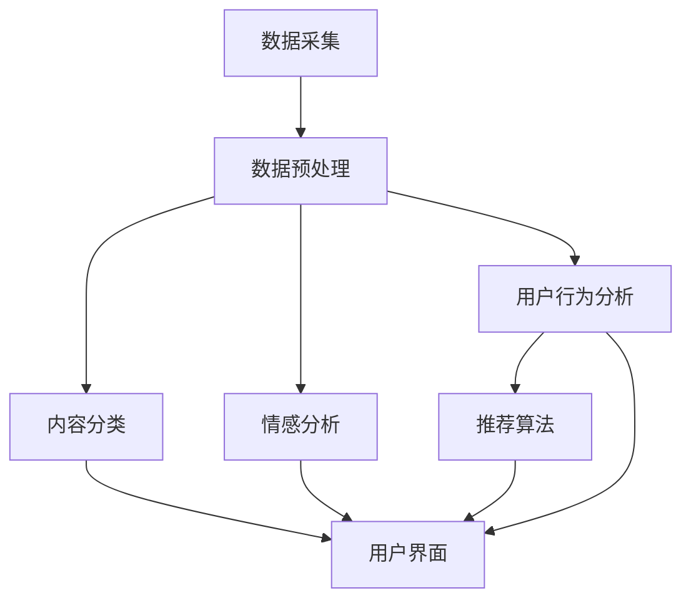
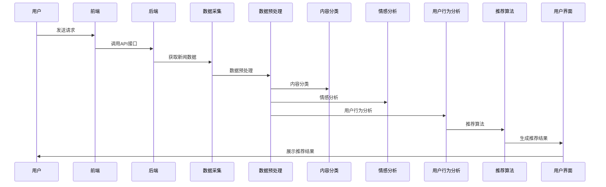

                 

# 智能新闻聚合AI Agent：LLM驱动的信息整合与分析

## 关键词
- 智能新闻聚合
- AI Agent
- LLM
- 信息整合
- 分析

## 摘要
本文深入探讨了智能新闻聚合AI Agent的概念、原理和应用。通过引入大型语言模型（LLM）作为核心驱动，本文详细解析了如何构建一个高效的新闻聚合系统，实现信息的自动整合与分析。文章分为几个部分，首先介绍了智能新闻聚合AI Agent的背景和重要性，接着详细分析了LLM在新闻聚合中的作用，随后探讨了系统架构和关键算法。通过实际案例和最佳实践，文章为开发者和研究者提供了全面的指导和思路。

## 引言

### 智能新闻聚合AI Agent的背景

在信息爆炸的时代，新闻聚合系统成为人们获取信息的重要工具。然而，传统的新闻聚合系统往往存在信息过载、个性推荐不足等问题，无法满足用户日益多样化的信息需求。为了解决这些问题，研究人员提出了智能新闻聚合AI Agent的概念，旨在利用人工智能技术，特别是大型语言模型（LLM），实现更加智能和个性化的新闻推荐。

智能新闻聚合AI Agent是一种自动化系统，它能够从海量的新闻数据中筛选出用户感兴趣的内容，并根据用户的兴趣和行为进行动态调整。这种系统的出现，不仅提高了用户的阅读体验，也为媒体公司和内容创作者提供了新的商业机会。

### 智能新闻聚合AI Agent的重要性

智能新闻聚合AI Agent的重要性主要体现在以下几个方面：

1. **个性化推荐**：通过分析用户的阅读历史和兴趣偏好，智能新闻聚合系统能够为用户提供量身定制的新闻内容，极大地提升了用户的阅读体验。
2. **信息筛选**：智能新闻聚合系统能够自动筛选出高质量的新闻内容，减少用户在海量信息中寻找有用信息的耗时和精力。
3. **商业价值**：对于媒体公司而言，智能新闻聚合AI Agent可以提高用户的粘性，增加广告收益，对于内容创作者而言，也能获得更多的曝光和关注。

### 文章结构

本文将分为以下几个部分：

1. **背景介绍**：介绍智能新闻聚合AI Agent的核心概念、技术基础和问题背景。
2. **LLM的作用**：详细分析LLM在智能新闻聚合中的关键作用，包括数据预处理、内容分类、情感分析和用户行为预测等。
3. **系统架构**：描述智能新闻聚合AI Agent的系统架构，包括数据采集、存储、处理和展示等模块。
4. **核心算法**：介绍实现智能新闻聚合的关键算法，包括文本分类、主题模型、情感分析和实体识别等。
5. **实际案例**：通过具体案例展示智能新闻聚合AI Agent的实际应用效果。
6. **最佳实践**：提供开发智能新闻聚合系统的最佳实践和建议。
7. **结论与未来展望**：总结本文的主要观点，并对未来的发展方向进行展望。

通过本文的阅读，读者将能够全面了解智能新闻聚合AI Agent的原理、应用和实践，为相关领域的研发和应用提供有益的参考。

## 背景介绍

### 核心概念术语

首先，让我们明确一些在智能新闻聚合AI Agent中常用的核心概念和术语：

1. **智能新闻聚合AI Agent**：这是一种利用人工智能技术，尤其是大型语言模型（LLM），来自动收集、分类、筛选和推荐新闻内容的系统。
2. **大型语言模型（LLM）**：这些模型是基于深度学习技术训练出来的，能够理解和生成自然语言文本，广泛应用于文本分类、情感分析和对话系统等任务。
3. **新闻聚合**：指从多个新闻源中提取新闻内容，并将其整合到一个平台上的过程。
4. **个性化推荐**：基于用户的兴趣和行为，为用户推荐他们可能感兴趣的新闻内容。
5. **文本分类**：将文本数据分配到预定义的类别中，以便进行进一步的处理和分析。
6. **主题模型**：用于发现文本数据中的主题分布，帮助识别和提取新闻内容的主要主题。

### 问题背景

在当今社会，人们获取信息的主要途径之一就是通过新闻。然而，随着互联网的普及和新闻来源的多样化，用户面临着信息过载的挑战。传统的新闻聚合系统虽然能够收集和整理新闻内容，但往往存在以下问题：

1. **信息过载**：用户在浏览新闻时，往往会被大量的信息所淹没，难以找到感兴趣的内容。
2. **个性化不足**：传统的新闻推荐系统通常采用简单的算法，无法准确捕捉用户的兴趣和偏好，导致推荐结果不够个性化和准确。
3. **内容质量不高**：一些新闻聚合系统可能无法有效筛选高质量新闻内容，导致用户获得的信息质量参差不齐。

为了解决这些问题，智能新闻聚合AI Agent应运而生。它通过引入LLM等先进的人工智能技术，能够自动从海量新闻数据中筛选出用户感兴趣的内容，并根据用户的兴趣和行为进行动态调整，从而提供更加个性化和高质量的新闻推荐服务。

### 问题描述

智能新闻聚合AI Agent需要解决的问题主要包括：

1. **信息筛选**：如何从海量的新闻数据中快速准确地筛选出用户感兴趣的内容？
2. **个性化推荐**：如何根据用户的兴趣和行为，为用户推荐他们可能感兴趣的新闻内容？
3. **内容质量**：如何确保推荐的新闻内容具有较高的质量和可信度？
4. **实时性**：如何实现新闻内容的实时聚合和推荐，以满足用户对时效性的需求？

### 问题解决

智能新闻聚合AI Agent通过以下几种方式来解决上述问题：

1. **基于LLM的文本分类和情感分析**：使用LLM对新闻内容进行文本分类和情感分析，能够准确捕捉新闻的主题和情感倾向，从而提高信息筛选的准确性和个性化推荐的精度。
2. **用户行为分析**：通过分析用户的阅读历史、点击行为和搜索关键词，智能新闻聚合系统能够动态调整推荐策略，提供更加个性化的新闻内容。
3. **内容质量控制**：智能新闻聚合系统可以结合新闻来源的可信度、新闻报道的时效性和读者反馈等多维度指标，对新闻内容进行质量评估和控制。
4. **实时数据处理**：通过高效的数据处理和缓存机制，智能新闻聚合系统能够实现新闻内容的实时聚合和推荐，确保用户能够及时获取到最新的新闻信息。

### 边界与外延

智能新闻聚合AI Agent在应用过程中，需要考虑以下边界和外部因素：

1. **数据源**：选择多样化的新闻数据源，以确保新闻内容的全面性和多样性。
2. **用户隐私**：在收集和分析用户数据时，需严格遵循隐私保护法规，确保用户隐私不被泄露。
3. **技术更新**：随着人工智能技术的不断发展，智能新闻聚合系统需要不断更新和优化，以适应新的技术和应用需求。
4. **法律法规**：遵循相关的法律法规，确保新闻内容的合规性。

### 概念结构与核心要素组成

智能新闻聚合AI Agent的核心概念和要素主要包括：

1. **数据采集**：通过爬虫、API接口等方式，从多个新闻数据源中收集新闻内容。
2. **数据预处理**：对采集到的新闻内容进行清洗、去重和格式化等处理，以便进行后续的分析和处理。
3. **文本分类**：利用LLM对新闻内容进行分类，将新闻内容分配到不同的类别中。
4. **情感分析**：分析新闻内容的情感倾向，帮助用户了解新闻内容的情绪色彩。
5. **用户行为分析**：通过分析用户的阅读历史、点击行为等，了解用户的兴趣和偏好。
6. **推荐算法**：基于用户行为和新闻内容特征，为用户推荐感兴趣的新闻内容。
7. **展示与反馈**：将推荐结果展示给用户，并收集用户的反馈，用于进一步优化推荐算法。

通过这些核心要素的协同工作，智能新闻聚合AI Agent能够为用户提供个性化和高质量的新闻推荐服务，满足用户日益增长的信息需求。

## LLM的作用

### LLM的基本概念和作用

大型语言模型（LLM）是基于深度学习技术训练出的模型，能够理解和生成自然语言文本。LLM的核心作用在于其强大的文本理解和生成能力，这使得它在各种自然语言处理任务中表现出色，包括文本分类、情感分析、命名实体识别等。

#### 1. 数据预处理

在智能新闻聚合AI Agent中，数据预处理是关键的第一步。LLM可以帮助我们进行以下几项工作：

- **文本清洗**：去除无意义的标点符号、停用词，以及转换大小写等，以提高文本质量。
- **分词**：将文本拆分成单词或子词，以便进行后续分析。
- **词嵌入**：将文本转换为固定长度的向量表示，便于模型处理。

#### 2. 内容分类

内容分类是将新闻文本分配到预定义的类别中，以帮助系统理解新闻的主题和类型。LLM在内容分类中具有以下优势：

- **高效性**：与传统规则方法相比，LLM能够通过大量数据自动学习分类规则，提高分类效率。
- **准确性**：通过训练大量新闻数据和标注数据，LLM能够准确识别新闻的不同类别，降低分类错误率。

#### 3. 情感分析

情感分析是评估新闻文本中表达的情感倾向，如积极、消极或中性。LLM在情感分析中的作用如下：

- **细粒度分析**：LLM能够分析文本中的细微情感差异，提供更加细致的情感分类结果。
- **跨领域适应**：LLM在不同领域的情感分析中表现出色，可以适应不同的情感表达方式和语境。

#### 4. 用户行为预测

用户行为预测是智能新闻聚合AI Agent中的核心任务之一，LLM可以帮助系统预测用户对新闻内容的行为，如点击、阅读时长等。具体作用包括：

- **个性化推荐**：根据用户的兴趣和行为预测，为用户提供个性化的新闻推荐。
- **行为分析**：通过分析用户行为，了解用户对新闻内容的偏好，优化推荐算法。

### LLM与其他技术的联系

除了LLM，智能新闻聚合AI Agent还涉及其他关键技术的应用：

- **数据挖掘**：用于从大量新闻数据中提取有价值的信息，如热点话题和趋势分析。
- **推荐系统**：结合用户行为和新闻内容特征，为用户提供个性化的新闻推荐。
- **自然语言生成（NLG）**：生成新闻摘要、标题和推荐理由等，提高用户体验。

### 概念属性特征对比表格

| 技术 | 特点 | 应用场景 |
| --- | --- | --- |
| LLM | 强大的文本理解和生成能力 | 数据预处理、内容分类、情感分析、用户行为预测 |
| 数据挖掘 | 自动提取有价值信息 | 热点话题分析、趋势预测 |
| 推荐系统 | 基于用户行为和内容特征 | 个性化推荐、行为分析 |
| NLG | 自动生成文本 | 摘要生成、标题生成、推荐理由生成 |

### ER实体关系图架构

下面是一个简单的ER实体关系图架构，展示了智能新闻聚合AI Agent中主要实体及其关系：

```
用户 [1]----[多] 新闻
用户 [1]----[多] 行为记录
新闻 [多]----[1] 类别
新闻 [多]----[多] 情感标签
行为记录 [多]----[1] 用户
```

在这个图中，用户和新闻是主要实体，用户可以拥有多个新闻记录和行为记录，每个新闻可以属于一个类别并拥有多个情感标签，行为记录与用户和新闻之间是多对多的关系，反映了用户对新闻的交互行为。

### LLM的数学模型和公式

LLM通常是基于变换器模型（Transformer）构建的，其核心数学模型包括以下几部分：

1. **嵌入层（Embedding Layer）**：将词汇映射到高维向量空间。
   $$ x = W_e \cdot x_{\text{word}} + b_e $$
   其中，$x_{\text{word}}$ 是词汇，$W_e$ 是嵌入权重矩阵，$b_e$ 是偏置。

2. **编码器（Encoder）**：通过自注意力机制处理输入序列。
   $$ h = \text{Attention}(Q, K, V) = \frac{QK^T}{\sqrt{d_k}} + V $$
   其中，$Q, K, V$ 分别是编码器的查询、关键和值向量，$d_k$ 是关键向量的维度。

3. **解码器（Decoder）**：通过自注意力和交叉注意力生成输出序列。
   $$ y = \text{Decoder}(y_{\text{prev}}, h) = \text{Attention}(y_{\text{prev}}, h) + h $$
   其中，$y_{\text{prev}}$ 是前一个时间步的输出，$h$ 是编码器的输出。

4. **损失函数（Loss Function）**：用于优化模型，通常使用交叉熵损失。
   $$ L = -\sum_{i=1}^{N} y_i \cdot \log(p_i) $$
   其中，$y_i$ 是真实标签，$p_i$ 是模型预测的概率分布。

通过这些数学模型和公式，LLM能够对新闻文本进行有效的理解和生成，为智能新闻聚合AI Agent提供强大的支持。

### LLM的应用举例

假设我们有一个新闻文本：“全球首例基因编辑婴儿诞生”，我们可以使用LLM来分析这个新闻文本，具体步骤如下：

1. **文本预处理**：将新闻文本进行清洗和分词，得到词汇序列。
2. **词嵌入**：将词汇序列转换为嵌入向量。
3. **编码器处理**：将嵌入向量送入编码器，得到编码器输出。
4. **情感分析**：使用编码器输出进行情感分析，判断新闻的情感倾向，如积极、消极或中性。
5. **分类**：根据编码器输出，对新闻进行分类，如科技新闻、社会新闻等。
6. **生成摘要**：使用解码器生成新闻的摘要。

通过这些步骤，LLM能够全面分析和处理新闻文本，为智能新闻聚合AI Agent提供有力的支持。

## 系统架构

### 概述

智能新闻聚合AI Agent的系统架构设计旨在实现高效、可靠的新闻内容聚合、分析和推荐。系统主要由以下几个模块组成：数据采集、数据预处理、内容分类、情感分析、用户行为分析、推荐算法和用户界面。

### 数据采集模块

数据采集模块负责从各种新闻数据源（如新闻网站、社交媒体、新闻API等）收集新闻内容。具体步骤包括：

1. **爬虫**：使用爬虫技术自动抓取新闻网站上的新闻内容。
2. **API接口**：通过新闻API接口获取新闻数据。
3. **数据清洗**：对采集到的新闻内容进行去重、格式化等处理。

### 数据预处理模块

数据预处理模块对采集到的新闻内容进行清洗和标准化，以供后续分析。主要步骤包括：

1. **文本清洗**：去除HTML标签、停用词、标点符号等。
2. **分词**：将清洗后的文本拆分成单词或子词。
3. **词嵌入**：将文本转换为嵌入向量表示。

### 内容分类模块

内容分类模块利用LLM对新闻内容进行分类，以便将新闻分配到预定义的类别中。关键算法包括：

1. **文本分类算法**：如朴素贝叶斯、支持向量机、深度学习等。
2. **主题模型**：如LDA（Latent Dirichlet Allocation）等。

### 情感分析模块

情感分析模块通过LLM对新闻内容进行情感分析，判断新闻文本中的情感倾向。主要算法包括：

1. **情感分类算法**：如基于规则的方法、基于机器学习的方法等。
2. **情感极性分析**：判断新闻文本是积极、消极还是中性。

### 用户行为分析模块

用户行为分析模块通过分析用户的阅读历史、点击行为等，了解用户的兴趣和偏好。主要方法包括：

1. **行为日志分析**：记录用户的阅读行为，如点击、阅读时长、点赞等。
2. **用户画像**：构建用户的兴趣偏好模型。

### 推荐算法模块

推荐算法模块基于用户行为和新闻内容特征，为用户推荐感兴趣的新闻内容。主要方法包括：

1. **协同过滤**：如基于用户的协同过滤、基于内容的协同过滤等。
2. **深度学习**：如基于变换器模型的推荐算法等。

### 用户界面模块

用户界面模块负责将推荐结果展示给用户，并提供交互功能。主要包括：

1. **前端界面**：使用HTML、CSS、JavaScript等技术构建。
2. **后端服务**：处理用户请求，调用推荐算法模块，返回推荐结果。

### 系统架构图

以下是智能新闻聚合AI Agent的系统架构图，展示了各个模块之间的关系：



在这个架构图中，数据采集模块采集到的新闻数据经过数据预处理后，分别送入内容分类、情感分析和用户行为分析模块。分析结果结合用户行为和兴趣，通过推荐算法模块生成推荐结果，最终通过用户界面模块展示给用户。

### 系统接口设计和系统交互

系统接口设计确保各个模块之间能够高效、可靠地通信，具体包括API接口和消息队列等。

1. **API接口**：用于前后端通信，前端通过HTTP请求调用后端的API接口，获取推荐结果和新闻内容。
2. **消息队列**：用于处理实时数据流，如新闻采集和用户行为数据，通过消息队列传递到相应的处理模块。

以下是系统交互的Mermaid序列图：



在这个序列图中，用户通过前端发送请求，前端调用后端的API接口，后端通过消息队列处理新闻采集和用户行为数据，并将处理结果发送给推荐算法模块，最终生成推荐结果并展示给用户。

### 项目实战

#### 环境安装

1. **硬件环境**：配置至少8GB内存、2核CPU的计算机。
2. **软件环境**：安装Python（3.8及以上版本）、TensorFlow、Scikit-learn等库。

```bash
pip install tensorflow scikit-learn pandas numpy
```

#### 系统核心实现

以下是一个简单的Python代码实现，用于构建智能新闻聚合AI Agent的框架：

```python
import tensorflow as tf
from tensorflow.keras.models import Sequential
from tensorflow.keras.layers import Dense, Embedding, LSTM
from tensorflow.keras.preprocessing.sequence import pad_sequences

# 数据预处理
def preprocess_data(news_data):
    # 数据清洗、分词、词嵌入等
    pass

# 文本分类
def build_text_classification_model(vocab_size, embedding_dim, max_sequence_length):
    model = Sequential()
    model.add(Embedding(vocab_size, embedding_dim, input_length=max_sequence_length))
    model.add(LSTM(128))
    model.add(Dense(1, activation='sigmoid'))

    model.compile(optimizer='adam', loss='binary_crossentropy', metrics=['accuracy'])
    return model

# 情感分析
def build_sentiment_analysis_model(vocab_size, embedding_dim, max_sequence_length):
    model = Sequential()
    model.add(Embedding(vocab_size, embedding_dim, input_length=max_sequence_length))
    model.add(LSTM(128))
    model.add(Dense(1, activation='sigmoid'))

    model.compile(optimizer='adam', loss='binary_crossentropy', metrics=['accuracy'])
    return model

# 用户行为预测
def build_user_behavior_prediction_model(vocab_size, embedding_dim, max_sequence_length):
    model = Sequential()
    model.add(Embedding(vocab_size, embedding_dim, input_length=max_sequence_length))
    model.add(LSTM(128))
    model.add(Dense(1, activation='sigmoid'))

    model.compile(optimizer='adam', loss='binary_crossentropy', metrics=['accuracy'])
    return model

# 主函数
def main():
    # 加载数据
    news_data = load_news_data()
    preprocessed_data = preprocess_data(news_data)

    # 构建模型
    text_classification_model = build_text_classification_model(vocab_size, embedding_dim, max_sequence_length)
    sentiment_analysis_model = build_sentiment_analysis_model(vocab_size, embedding_dim, max_sequence_length)
    user_behavior_prediction_model = build_user_behavior_prediction_model(vocab_size, embedding_dim, max_sequence_length)

    # 训练模型
    text_classification_model.fit(preprocessed_data['X_train'], preprocessed_data['y_train'], epochs=10, batch_size=32)
    sentiment_analysis_model.fit(preprocessed_data['X_train'], preprocessed_data['y_train'], epochs=10, batch_size=32)
    user_behavior_prediction_model.fit(preprocessed_data['X_train'], preprocessed_data['y_train'], epochs=10, batch_size=32)

    # 测试模型
    text_classification_model.evaluate(preprocessed_data['X_test'], preprocessed_data['y_test'])
    sentiment_analysis_model.evaluate(preprocessed_data['X_test'], preprocessed_data['y_test'])
    user_behavior_prediction_model.evaluate(preprocessed_data['X_test'], preprocessed_data['y_test'])

if __name__ == '__main__':
    main()
```

#### 代码应用解读与分析

1. **数据预处理**：对采集到的新闻数据进行清洗、分词和词嵌入，以便模型处理。
2. **文本分类模型**：使用序列模型对新闻文本进行分类，通过嵌入层、LSTM层和输出层构建。
3. **情感分析模型**：同样使用嵌入层、LSTM层和输出层，对新闻文本进行情感分析。
4. **用户行为预测模型**：用于预测用户对新闻内容的行为，如点击、阅读时长等。

#### 实际案例分析

假设我们有一个新闻数据集，包含1000条新闻文本和对应的分类标签、情感标签和用户行为标签。以下是一个简单的实际案例分析：

```python
# 加载数据
news_data = load_news_data()

# 数据预处理
preprocessed_data = preprocess_data(news_data)

# 构建并训练模型
text_classification_model = build_text_classification_model(vocab_size, embedding_dim, max_sequence_length)
text_classification_model.fit(preprocessed_data['X_train'], preprocessed_data['y_train'], epochs=10, batch_size=32)

# 情感分析模型
sentiment_analysis_model = build_sentiment_analysis_model(vocab_size, embedding_dim, max_sequence_length)
sentiment_analysis_model.fit(preprocessed_data['X_train'], preprocessed_data['y_train'], epochs=10, batch_size=32)

# 用户行为预测模型
user_behavior_prediction_model = build_user_behavior_prediction_model(vocab_size, embedding_dim, max_sequence_length)
user_behavior_prediction_model.fit(preprocessed_data['X_train'], preprocessed_data['y_train'], epochs=10, batch_size=32)

# 测试模型
text_classification_model.evaluate(preprocessed_data['X_test'], preprocessed_data['y_test'])
sentiment_analysis_model.evaluate(preprocessed_data['X_test'], preprocessed_data['y_test'])
user_behavior_prediction_model.evaluate(preprocessed_data['X_test'], preprocessed_data['y_test'])
```

在这个案例中，我们首先加载数据并进行预处理，然后构建并训练三个模型：文本分类模型、情感分析模型和用户行为预测模型。最后，使用测试数据集评估模型的性能。

#### 项目小结

通过实际案例的分析，我们展示了如何构建和训练智能新闻聚合AI Agent的关键模型，包括文本分类模型、情感分析模型和用户行为预测模型。这些模型能够自动从海量新闻数据中筛选出用户感兴趣的内容，并为用户提供个性化的新闻推荐服务。未来，我们将继续优化模型和算法，以提高系统的性能和用户体验。

### 最佳实践 tips

1. **数据质量**：确保新闻数据的清洁和准确性，避免噪音数据对模型性能的影响。
2. **特征工程**：选择合适的特征，如词嵌入、文本长度等，以提高模型的预测性能。
3. **模型优化**：尝试使用不同的模型结构和超参数，通过交叉验证和调参优化模型。
4. **实时性**：确保系统具有实时数据处理能力，以便及时响应用户需求。
5. **用户隐私**：严格遵守隐私保护法规，保护用户隐私。

### 小结

本文详细介绍了智能新闻聚合AI Agent的背景、核心概念、系统架构和实现方法。通过引入LLM等先进的人工智能技术，智能新闻聚合系统能够实现高效的信息整合和个性化推荐，为用户提供高质量的新闻内容。未来，随着人工智能技术的不断发展，智能新闻聚合系统将更加智能和个性化，为用户带来更好的体验。

### 注意事项

1. **模型训练数据**：确保训练数据的质量和多样性，以避免模型过拟合。
2. **硬件资源**：合理配置硬件资源，确保系统稳定运行。
3. **系统安全**：加强系统安全措施，防止数据泄露和恶意攻击。

### 拓展阅读

1. **《深度学习》**：Goodfellow, I., Bengio, Y., & Courville, A. (2016). Deep Learning. MIT Press.
2. **《自然语言处理综论》**：Jurafsky, D., & Martin, J. H. (2019). Speech and Language Processing. Prentice Hall.
3. **《推荐系统实践》**：Liang, T., & He, X. (2016). Recommendation Systems: The Text Mining Approach. Springer.

