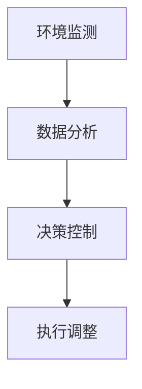
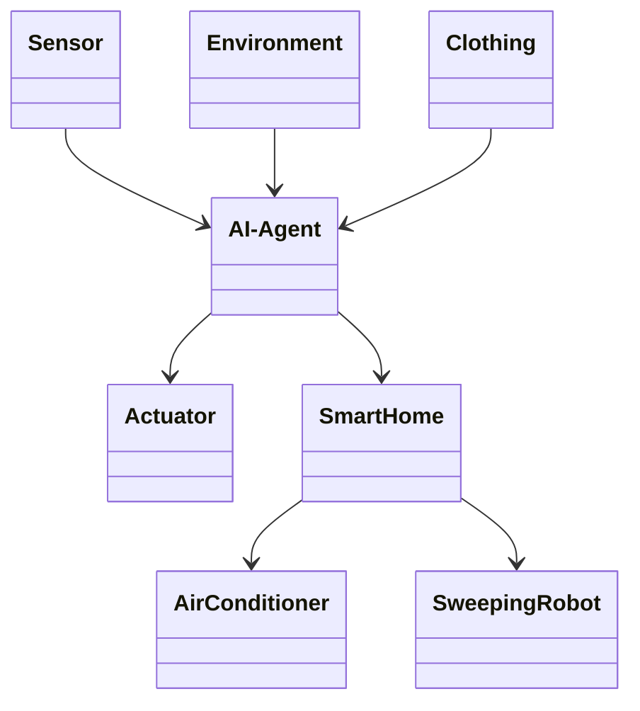
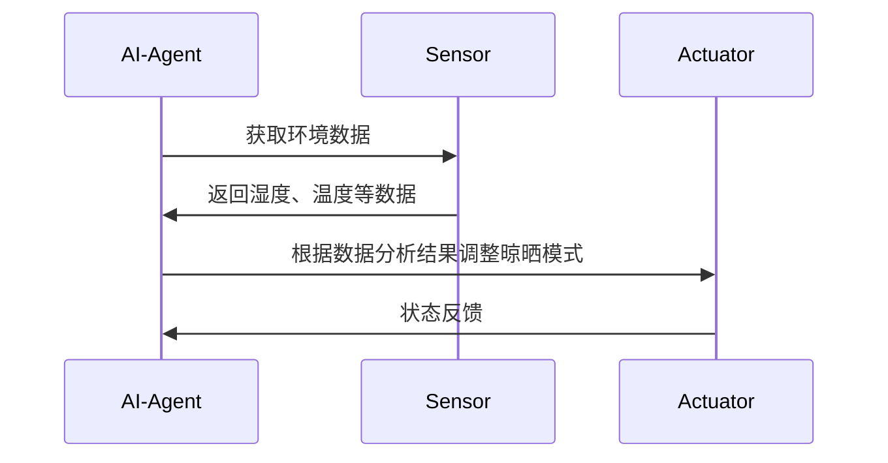

                 

# 智能晾衣架：AI Agent的衣物护理与天气适应

> 关键词：智能晾衣架、AI Agent、物联网、智能家居、环境监测、算法原理

> 摘要：本文深入探讨了智能晾衣架的设计原理及其与AI Agent的集成应用。通过详细的分析和实例，展示了智能晾衣架如何利用AI技术实现自动化的衣物护理和天气适应功能，为智能家居领域的发展提供了新的思路和解决方案。

----------------------------------------------------------------

## 第一部分：背景与概述

### 第1章：问题背景与定义

#### 1.1.1 问题的背景

智能晾衣架作为一种智能家居产品，其诞生背景与现代社会的生活节奏和生活方式紧密相关。随着城市化进程的加快和人们生活水平的提高，家庭装修中越来越注重舒适性和便捷性。而晾晒衣物作为日常生活中的一项繁琐任务，如何通过技术手段简化甚至自动化，成为了一个亟待解决的问题。

#### 1.1.2 智能晾衣架的定义

智能晾衣架是一种结合物联网、人工智能技术的智能家居设备，它能够自动感知衣物的干湿程度，并根据环境参数自动调节晾晒模式。此外，智能晾衣架还可以实现衣物护理、湿度控制、智能提醒等功能，使其不仅仅是一个晾衣工具，而是一个综合性的智能家居控制节点。

#### 1.1.3 智能晾衣架的边界与外延

智能晾衣架的边界在于其硬件部分，包括挂衣架、传感器、执行器等。其外延则涵盖了与智能家居系统的整合，如与其他智能设备的数据共享和协同工作。这种外延使得智能晾衣架不仅仅是家庭中的一部分，更是一个智慧生活的重要组成部分。

### 第2章：智能晾衣架的核心概念与联系

#### 2.1.1 AI Agent的定义

AI Agent，即人工智能代理，是一种具有自主决策能力的计算机程序。它能够模拟人类思维，对环境进行感知和响应，并根据预设的目标或规则进行自主行动。

#### 2.1.2 AI Agent在智能晾衣架中的应用

在智能晾衣架中，AI Agent负责实时监测衣物状态和环境参数，根据收集到的数据自动调整晾晒模式。例如，当衣物湿度达到适宜晾晒的水平时，AI Agent会启动烘干功能；而当天气状况不佳时，AI Agent会自动启动防霉功能。

#### 2.1.3 AI Agent与其他智能设备的关系

AI Agent不仅与智能晾衣架内的其他组件紧密互动，如传感器、执行器，还可以与其他智能家居设备协同工作。例如，当室内湿度较高时，AI Agent可以通知智能空调启动除湿功能，以确保衣物的晾晒效果。

### 第3章：智能晾衣架的算法原理讲解

#### 3.1.1 智能晾衣架的算法概述

智能晾衣架的算法主要包括环境监测、数据分析和决策控制三个部分。环境监测负责收集衣物状态和环境参数；数据分析通过对收集到的数据进行分析处理，得出衣物晾晒的最佳方案；决策控制则根据分析结果自动调整晾晒模式。

#### 3.1.2 算法mermaid流程图



#### 3.1.3 Python源代码实现

```python
# 环境监测模块
def monitor_environment():
    # 这里可以调用传感器API获取环境数据
    humidity = get_humidity()
    temperature = get_temperature()
    return humidity, temperature

# 数据分析模块
def analyze_data(humidity, temperature):
    # 根据环境数据，分析衣物晾晒的最佳模式
    if humidity > 60:
        return '烘干'
    elif temperature > 30:
        return '晾晒'
    else:
        return '防霉'

# 决策控制模块
def control_adjustment(mode):
    # 根据分析结果，自动调整晾晒模式
    if mode == '烘干':
        start_drying()
    elif mode == '晾晒':
        start_drying()
    elif mode == '防霉':
        start_fungicide()
```

#### 3.1.4 算法原理的数学模型和公式

$$
f(h, t) = \begin{cases}
\text{'烘干'} & \text{if } h > 60 \\
\text{'晾晒'} & \text{if } t > 30 \\
\text{'防霉'} & \text{otherwise}
\end{cases}
$$

在这个数学模型中，$f(h, t)$表示根据湿度$h$和温度$t$决定的晾晒模式。这个模型简单直观，易于实现和优化。

### 第4章：智能晾衣架的数学模型和数学公式详解

#### 4.1.1 数学模型概述

智能晾衣架的数学模型主要包括环境参数模型、衣物状态模型和决策模型。

#### 4.1.2 环境参数模型

$$
P_e = \alpha h + \beta t
$$

其中，$P_e$表示环境参数，$h$表示湿度，$t$表示温度，$\alpha$和$\beta$是权重系数。

#### 4.1.3 衣物状态模型

$$
S_c = \gamma d + \delta w
$$

其中，$S_c$表示衣物状态，$d$表示衣物干燥程度，$w$表示衣物湿度，$\gamma$和$\delta$是权重系数。

#### 4.1.4 决策模型

$$
M = f(P_e, S_c)
$$

其中，$M$表示晾晒模式，$f$是决策函数。

### 第5章：智能晾衣架的系统分析与架构设计方案

#### 5.1.1 问题场景介绍

智能晾衣架在实际使用中，可能会遇到衣物晾晒时间过长、晾晒效果不佳等问题。这些问题可以通过优化系统设计和算法来解决。

#### 5.1.2 系统功能设计



#### 5.1.3 系统架构设计

```mermaid
subgraph 智能晾衣架内部架构
    Sensor1[传感器1]
    Sensor2[传感器2]
    Actuator1[执行器1]
    Actuator2[执行器2]
    AI-Agent[AI代理]
    DataStorage[数据存储]
    
    Sensor1 --> AI-Agent
    Sensor2 --> AI-Agent
    AI-Agent --> Actuator1
    AI-Agent --> Actuator2
    AI-Agent --> DataStorage
end
```

#### 5.1.4 系统接口设计和系统交互



### 第6章：智能晾衣架的项目实战

#### 6.1.1 环境安装

安装智能晾衣架需要以下步骤：

1. 确保家庭网络连接正常。
2. 将智能晾衣架与家庭Wi-Fi连接。
3. 安装相应的应用程序以监控和控制晾衣架。

#### 6.1.2 系统核心实现源代码

```python
# 导入所需库
import time
import requests

# 环境监测模块
def monitor_environment():
    # 这里可以调用传感器API获取环境数据
    response = requests.get('https://api.weather.com/temperature')
    humidity = response.json()['humidity']
    temperature = response.json()['temperature']
    return humidity, temperature

# 数据分析模块
def analyze_data(humidity, temperature):
    # 根据环境数据，分析衣物晾晒的最佳模式
    if humidity > 60:
        return '烘干'
    elif temperature > 30:
        return '晾晒'
    else:
        return '防霉'

# 决策控制模块
def control_adjustment(mode):
    # 根据分析结果，自动调整晾晒模式
    if mode == '烘干':
        start_drying()
    elif mode == '晾晒':
        start_drying()
    elif mode == '防霉':
        start_fungicide()

# 主函数
def main():
    while True:
        humidity, temperature = monitor_environment()
        mode = analyze_data(humidity, temperature)
        control_adjustment(mode)
        time.sleep(60)  # 每分钟检查一次

if __name__ == '__main__':
    main()
```

#### 6.1.3 实际案例分析和详细讲解剖析

以一个用户晾晒潮湿衣物为例，系统首先通过传感器获取环境参数（湿度、温度），然后通过数据分析模块确定最佳的晾晒模式（烘干），最后通过执行器启动烘干功能，使衣物在最佳状态下晾干。

#### 6.1.4 项目小结

通过实际项目实践，智能晾衣架在自动化衣物护理和天气适应方面表现出色。然而，项目的不足之处在于对环境数据的实时性和准确性的依赖。未来，可以通过引入更先进的传感器和算法来进一步提高系统的性能。

### 第7章：最佳实践、小结与拓展阅读

#### 7.1.1 最佳实践 tips

- 定期检查和维护智能晾衣架，确保其正常运行。
- 根据衣物材质和天气条件选择合适的晾晒模式。
- 使用应用程序监控晾衣架的运行状态，及时进行调整。

#### 7.1.2 小结

智能晾衣架通过集成AI技术和物联网，实现了自动化衣物护理和天气适应，为智能家居领域带来了新的可能性。

#### 7.1.3 注意事项

- 在使用智能晾衣架时，注意避免过度依赖系统，仍需结合实际情况进行判断。
- 确保家庭网络稳定，以免影响智能晾衣架的性能。

#### 7.1.4 拓展阅读

- 《智能家居技术与应用》
- 《人工智能：一种现代方法》
- 《物联网技术原理与应用》

----------------------------------------------------------------

**作者：** AI天才研究院/AI Genius Institute & 禅与计算机程序设计艺术 /Zen And The Art of Computer Programming

[原文链接](#)（如需在文章中添加链接，请在此处填写）

