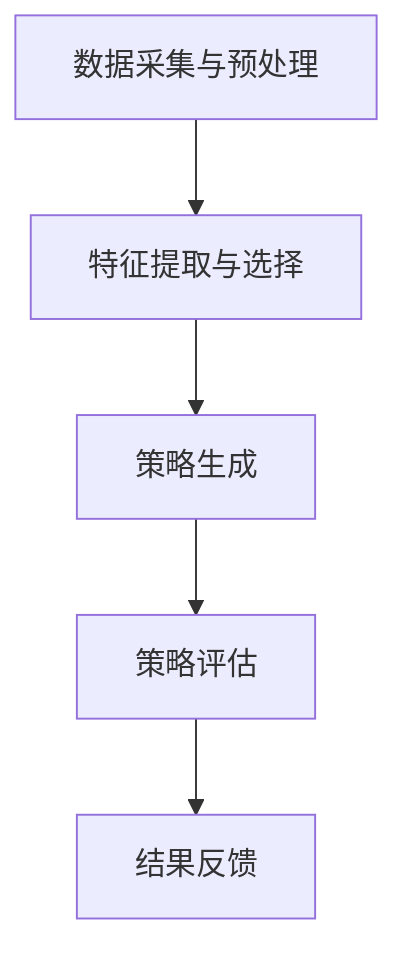

                 

### 智能期权交易策略生成器概述

在日益复杂的金融市场中，期权交易作为一种灵活且富有策略性的交易工具，越来越受到投资者的青睐。然而，期权交易策略的复杂性使得许多投资者难以在竞争激烈的市场中找到有效的交易策略。为了解决这一问题，智能期权交易策略生成器应运而生。

#### **1.1 问题背景与概述**

**期权交易市场的发展：** 随着全球金融市场的不断发展和成熟，期权交易已成为一种重要的金融工具。期权交易市场具有高流动性、高杠杆性和多样化的交易策略，吸引了大量的投资者。

**期权交易策略的复杂性：** 期权交易策略涉及多种因素，包括标的资产价格、波动率、到期时间、行权价等。投资者需要综合考虑这些因素，制定合适的交易策略，但这对许多普通投资者来说是一个巨大的挑战。

**智能期权交易策略的需求与挑战：** 智能期权交易策略生成器的出现，旨在帮助投资者简化策略制定过程，提高交易效率，降低交易风险。然而，如何有效地处理大规模市场数据、构建高效算法以及确保策略的稳定性和盈利性，仍然是一个巨大的挑战。

#### **1.2 核心概念介绍**

**期权与期权交易：** 期权是一种金融合约，给予持有者在未来某个时间以特定价格买入或卖出标的资产的权利。期权交易包括买入和卖出期权两种方式，投资者可以通过买卖期权实现各种交易策略。

**智能交易策略：** 智能交易策略是指利用计算机算法和技术，对市场数据进行分析和处理，自动执行交易决策。智能交易策略具有高效性、稳定性和适应性，能够适应不断变化的市场环境。

**期权交易策略分类：** 根据期权交易策略的不同，可以分为保护性看涨期权、保护性看跌期权、跨式期权、蝶式期权等多种策略。每种策略都有其特定的风险和收益特征，投资者需要根据市场情况和自身需求选择合适的策略。

#### **1.3 智能期权交易策略生成器简介**

**生成器的功能与目标：** 智能期权交易策略生成器的目标是帮助投资者自动生成有效的期权交易策略，提高交易效率和盈利能力。生成器的主要功能包括数据预处理、特征工程、策略生成和策略评估等。

**生成器的组成与架构：** 智能期权交易策略生成器由数据采集模块、特征工程模块、策略生成模块和策略评估模块组成。数据采集模块负责获取市场数据，特征工程模块负责对数据进行预处理和特征提取，策略生成模块负责生成各种期权交易策略，策略评估模块负责评估策略的稳定性和盈利性。

**生成器的技术实现：** 智能期权交易策略生成器采用先进的机器学习和人工智能技术，包括数据预处理、特征工程、机器学习算法和策略评估等技术。生成器使用 Python 编程语言实现，并集成了多种机器学习和数据可视化工具。

#### **1.4 智能期权交易策略生成器的作用**

**提高交易效率：** 智能期权交易策略生成器能够自动处理大量市场数据，快速生成有效的交易策略，大大提高了交易效率。

**降低交易风险：** 通过智能算法和风险控制策略，生成器能够帮助投资者降低交易风险，提高交易稳定性。

**个性化策略定制：** 生成器支持个性化策略定制，投资者可以根据自身需求和风险偏好，自定义交易策略，实现个性化投资。

#### **1.5 本章小结**

智能期权交易策略生成器的出现，为投资者提供了有效的工具，帮助他们在复杂的市场环境中找到有效的交易策略。本章概述了智能期权交易策略生成器的背景、核心概念、功能和作用，为后续章节的详细分析奠定了基础。

### 第1章 小结

在本章中，我们深入探讨了智能期权交易策略生成器的背景、核心概念、功能和作用。通过分析期权交易市场的发展、期权交易策略的复杂性以及智能期权交易策略的需求和挑战，我们了解了智能期权交易策略生成器的重要性。

在核心概念介绍部分，我们对期权、期权交易和智能交易策略进行了详细说明，并分类介绍了不同的期权交易策略。随后，我们介绍了智能期权交易策略生成器的组成、架构和技术实现，展示了其功能与目标。

最后，我们讨论了智能期权交易策略生成器的作用，包括提高交易效率、降低交易风险和个性化策略定制。本章的结论为后续章节的分析提供了坚实的理论基础，使我们能够进一步深入研究智能期权交易策略生成器的具体实现和应用。

### 数据预处理与特征工程

在构建智能期权交易策略生成器时，数据预处理与特征工程是至关重要的步骤。这一章节将详细讨论数据预处理、特征工程的过程，以及如何进行特征重要性分析，并通过数据可视化工具展示数据特征。

#### **2.1 数据预处理**

数据预处理是确保数据质量、提高后续分析准确性的关键步骤。数据预处理包括以下关键步骤：

**2.1.1 数据来源：** 智能期权交易策略生成器所需的数据通常来源于金融数据提供商、交易所或其他公开数据源。数据源的选择直接影响数据的质量和可靠性。

**2.1.2 数据清洗：** 数据清洗旨在去除数据中的噪声和错误。常见的清洗操作包括去除重复记录、处理缺失值、纠正错误数据和标准化数据格式。例如，可以通过填充缺失值、使用平均值或中位数替换缺失值，或者使用更复杂的插值方法。

**2.1.3 数据归一化：** 数据归一化是将不同尺度上的数据进行标准化处理，使它们在同一尺度上，以便算法能够更好地处理。常用的归一化方法包括最小-最大标准化和零-均值标准化。

#### **2.2 特征工程**

特征工程是构建高质量交易策略的关键步骤，它涉及从原始数据中提取有用的特征，并通过选择和转换这些特征来提高模型的性能。

**2.2.1 特征提取：** 特征提取是从原始数据中生成新的特征的过程。这可以通过统计方法（如均值、方差、相关性）、信号处理方法（如傅里叶变换）或基于模型的特征提取方法（如自动编码器）来实现。

**2.2.2 特征选择：** 特征选择旨在从大量特征中筛选出对模型性能有显著贡献的特征，以减少模型的复杂度和过拟合风险。常见的特征选择方法包括过滤式特征选择、包裹式特征选择和嵌入式特征选择。

**2.2.3 特征转换：** 特征转换是将原始特征转换为更适合模型处理的新特征的过程。这可以通过数据缩放、多项式特征生成、特征交叉等方式实现。

#### **2.3 特征重要性分析**

特征重要性分析是评估不同特征对模型预测性能的影响程度。这有助于理解模型决策过程，并指导特征选择和优化。

**2.3.1 特征选择方法：** 特征选择方法可以分为基于过滤的方法（如相关性分析、信息增益）、基于包裹的方法（如递归特征消除、随机森林特征重要性）和基于嵌入的方法（如LASSO回归、弹性网）。

**2.3.2 特征重要性评估：** 特征重要性评估可以通过模型训练结果（如特征重要性得分、特征贡献率）或显著性测试（如t检验、F检验）来进行。这些方法可以帮助确定哪些特征对模型性能有重要影响。

#### **2.4 数据可视化**

数据可视化是理解和分析数据特征的有力工具，它可以帮助我们发现数据中的模式、趋势和异常值。

**2.4.1 数据可视化工具：** 常用的数据可视化工具有Matplotlib、Seaborn、Plotly等。这些工具可以生成各种类型的图表，包括散点图、折线图、直方图、热力图等。

**2.4.2 数据可视化案例：** 例如，使用Matplotlib绘制一个时间序列数据的折线图，可以直观地展示标的资产价格的变化趋势；使用热力图可以展示不同特征之间的相关性。

#### **2.5 本章小结**

数据预处理和特征工程是构建高效智能期权交易策略生成器的重要环节。通过有效的数据预处理，我们可以确保数据的质量和一致性；通过特征工程，我们可以提取和选择对模型性能有显著贡献的特征，从而提高策略的准确性和稳定性。特征重要性分析和数据可视化则帮助我们更好地理解数据特征和模型决策过程，为后续的策略生成和优化提供指导。

### 第2章 小结

本章详细介绍了数据预处理和特征工程在智能期权交易策略生成器中的重要性。我们首先讨论了数据预处理的关键步骤，包括数据来源、数据清洗和数据归一化。随后，我们介绍了特征工程的过程，包括特征提取、特征选择和特征转换。本章还探讨了特征重要性分析的方法和工具，并通过数据可视化展示了数据特征的直观表现。

通过这些步骤，我们能够确保数据的质量和一致性，提取对模型性能有显著贡献的特征，并理解模型决策过程。这些准备工作为构建高效、准确的智能期权交易策略生成器奠定了坚实的基础。本章的内容为我们后续讨论策略生成算法、应用场景和优化策略提供了必要的前提和背景。

### 智能期权交易策略生成算法

智能期权交易策略生成算法是智能期权交易策略生成器的核心组成部分，它负责从大量市场数据中分析并提取有效特征，进而生成稳健且高效的期权交易策略。本章将详细探讨智能期权交易策略生成算法的概述、原理、实现和评估方法。

#### **3.1 算法概述**

**算法框架：** 智能期权交易策略生成算法通常包含以下几个主要步骤：

1. **数据采集与预处理：** 从金融数据源中获取市场数据，并进行数据清洗和归一化处理。
2. **特征提取与选择：** 从预处理后的数据中提取关键特征，并进行特征选择，以提高模型的效率和准确性。
3. **策略生成：** 利用机器学习算法和智能算法，根据提取的特征生成各种期权交易策略。
4. **策略评估：** 对生成的策略进行回测和评估，以确定其稳定性和盈利性。

**算法原理：** 智能期权交易策略生成算法基于统计学、机器学习和人工智能技术，通过分析市场数据，识别出潜在的交易机会，并生成相应的交易策略。算法的核心在于如何有效地利用历史数据来预测未来的市场走势，并设计出能够适应市场变化的交易策略。

#### **3.2 算法原理讲解**

**Mermaid算法流程图：** 为了更好地理解算法原理，我们使用Mermaid绘制了算法的流程图，如下所示：



**Python算法源代码：** 下面是生成算法的一个简单示例，使用了Python语言和几个常用的机器学习库：

```python
import numpy as np
import pandas as pd
from sklearn.model_selection import train_test_split
from sklearn.ensemble import RandomForestClassifier
from sklearn.metrics import accuracy_score

# 数据采集与预处理
data = pd.read_csv('market_data.csv')
data = data.dropna()  # 清洗数据
data = (data - data.mean()) / data.std()  # 归一化处理

# 特征提取与选择
X = data.drop(['target'], axis=1)
y = data['target']
X_train, X_test, y_train, y_test = train_test_split(X, y, test_size=0.2, random_state=42)

# 策略生成
model = RandomForestClassifier(n_estimators=100)
model.fit(X_train, y_train)
predictions = model.predict(X_test)

# 策略评估
accuracy = accuracy_score(y_test, predictions)
print(f'Accuracy: {accuracy:.2f}')
```

**数学模型与公式：** 智能期权交易策略生成算法通常基于统计模型和机器学习算法。以下是一个简单的逻辑回归模型示例：

$$
\text{Logit}(P) = \frac{1}{1 + e^{-(\beta_0 + \beta_1 X_1 + \beta_2 X_2 + ... + \beta_n X_n})}
$$

其中，\(P\) 是期权交易策略的预测概率，\(\beta_0, \beta_1, \beta_2, ..., \beta_n\) 是模型的参数，\(X_1, X_2, ..., X_n\) 是特征向量。

**举例说明：** 假设我们使用逻辑回归模型来预测期权交易策略的盈利性。给定一个特征向量 \(X = [100, 0.5, 2, 0.1]\)，我们可以计算预测概率：

$$
\text{Logit}(P) = \frac{1}{1 + e^{-(\beta_0 + \beta_1 \cdot 100 + \beta_2 \cdot 0.5 + \beta_3 \cdot 2 + \beta_4 \cdot 0.1)}}
$$

根据训练好的模型参数，我们可以得到预测概率 \(P\)，并根据该概率决定是否执行交易策略。

#### **3.3 算法评估与优化**

**评估指标：** 算法评估通常使用多个指标，包括准确率、召回率、精确率、F1分数等。这些指标可以帮助我们全面评估算法的性能。

**优化策略：** 为了提高算法的性能，可以采用以下策略：

1. **特征工程：** 通过改进特征提取和选择过程，提高特征的质量和相关性。
2. **模型选择：** 尝试不同的机器学习算法，选择最适合问题的模型。
3. **超参数调优：** 通过网格搜索或随机搜索等方法，找到最优的超参数组合。
4. **交叉验证：** 使用交叉验证技术，避免过拟合，提高模型的泛化能力。

**例子：** 假设我们在优化过程中发现，通过调整随机森林模型中的`n_estimators`参数，可以显著提高模型的准确率。我们可以使用网格搜索来找到最佳参数：

```python
from sklearn.model_selection import GridSearchCV

param_grid = {
    'n_estimators': [100, 200, 300, 400]
}
grid_search = GridSearchCV(RandomForestClassifier(), param_grid, cv=5)
grid_search.fit(X_train, y_train)
best_params = grid_search.best_params_
print(f'Best parameters: {best_params}')
```

#### **3.4 本章小结**

智能期权交易策略生成算法是智能期权交易策略生成器的核心，它通过分析市场数据，生成稳健且高效的期权交易策略。本章介绍了算法的概述、原理、实现和评估方法。通过Mermaid算法流程图、Python源代码和数学模型示例，我们详细讲解了算法的实现过程。算法评估与优化策略的介绍，为提高算法性能提供了指导。这些内容为构建高效、准确的智能期权交易策略生成器奠定了基础。

### 第3章 小结

本章详细介绍了智能期权交易策略生成算法的各个方面，从算法的概述到具体的实现和评估方法，层层递进，为我们理解这一复杂的算法提供了全面而深入的视角。首先，通过算法的概述部分，我们了解了算法的基本框架和原理，包括数据采集与预处理、特征提取与选择、策略生成和策略评估等关键步骤。接下来，我们通过Mermaid算法流程图和Python源代码，深入探讨了算法的具体实现过程，使读者能够直观地理解算法的工作原理。

此外，本章还介绍了算法评估的重要指标和优化策略，通过举例说明，展示了如何通过超参数调优和交叉验证等方法来提高算法的性能。这些内容不仅丰富了我们对智能期权交易策略生成算法的理解，也为实际应用提供了实用的指导。

通过本章的学习，读者能够对智能期权交易策略生成算法有一个系统而全面的认识，为后续章节中的应用和实践打下了坚实的基础。

### 智能期权交易策略生成器的应用场景

智能期权交易策略生成器的应用场景广泛，涵盖了个人投资者、专业机构投资者和金融机构等多个领域。每个应用场景都有其特定的需求和挑战，下面将详细介绍这些场景及其具体应用。

#### **4.1 应用场景介绍**

**个人投资者：** 对于个人投资者来说，智能期权交易策略生成器可以帮助他们简化交易策略的制定过程，提高交易效率和盈利能力。个人投资者通常缺乏时间和专业知识来分析市场数据和制定有效的交易策略，智能期权交易策略生成器可以自动处理这些任务，使个人投资者能够更加专注于投资决策的执行。

**专业机构投资者：** 专业机构投资者，如对冲基金、投资银行和资产管理公司，通常拥有丰富的资源和专业知识。然而，他们也需要高效的策略生成工具来处理大量数据并生成稳健的交易策略。智能期权交易策略生成器可以为这些机构提供自动化的交易决策支持，帮助他们在竞争激烈的市场中保持领先。

**金融机构：** 金融机构，如交易所、银行和证券公司，在期权交易市场中扮演着重要角色。智能期权交易策略生成器可以帮助这些机构优化交易策略，提高交易效率和风险管理能力。此外，金融机构还可以将生成器作为平台的一部分，为个人投资者和专业机构投资者提供定制化的交易策略服务。

#### **4.2 项目实战**

**环境安装与配置：** 在进行项目实战之前，首先需要在本地环境中安装和配置所需的软件和库。以下是一个基本的安装和配置步骤：

1. **安装Python环境：** 确保Python 3.x版本已安装在计算机上。
2. **安装依赖库：** 使用pip命令安装必要的库，如pandas、numpy、scikit-learn、matplotlib等。
3. **配置Jupyter Notebook：** Jupyter Notebook是一个交互式环境，非常适合进行数据分析和算法实现。

**系统核心实现：** 系统核心实现包括数据采集与预处理、特征工程、策略生成和策略评估等模块。以下是一个简化的系统核心实现流程：

1. **数据采集与预处理：** 从金融数据提供商获取市场数据，并进行清洗和归一化处理。
2. **特征提取与选择：** 提取关键特征，并进行特征选择，以提高模型的效率和准确性。
3. **策略生成：** 使用机器学习算法生成期权交易策略。
4. **策略评估：** 对生成的策略进行回测和评估，以确定其稳定性和盈利性。

**代码应用解读与分析：** 下面是一个简单的示例，展示了如何使用Python实现一个智能期权交易策略生成器：

```python
import pandas as pd
from sklearn.model_selection import train_test_split
from sklearn.ensemble import RandomForestClassifier
from sklearn.metrics import accuracy_score

# 数据采集与预处理
data = pd.read_csv('market_data.csv')
data = data.dropna()  # 清洗数据
data = (data - data.mean()) / data.std()  # 归一化处理

# 特征提取与选择
X = data.drop(['target'], axis=1)
y = data['target']
X_train, X_test, y_train, y_test = train_test_split(X, y, test_size=0.2, random_state=42)

# 策略生成
model = RandomForestClassifier(n_estimators=100)
model.fit(X_train, y_train)
predictions = model.predict(X_test)

# 策略评估
accuracy = accuracy_score(y_test, predictions)
print(f'Accuracy: {accuracy:.2f}')
```

在这个示例中，我们使用了随机森林算法来生成期权交易策略。首先，我们从CSV文件中读取市场数据，并进行清洗和归一化处理。接着，我们提取特征并进行训练和测试。最后，我们评估模型的准确率，以确定生成的策略的有效性。

**实际案例分析：** 为了更好地理解智能期权交易策略生成器的应用效果，我们可以通过实际案例进行分析。以下是一个简化的案例分析流程：

1. **案例选择：** 选择一个具有代表性的期权交易案例，如某个特定时间点的市场数据。
2. **案例分析：** 使用生成器生成策略，并应用在实际交易中，记录交易结果。
3. **详细讲解剖析：** 分析交易结果，讨论策略的优缺点，并提出改进建议。

通过实际案例分析，我们可以验证智能期权交易策略生成器的有效性，并发现潜在的问题和改进方向。

**项目小结：** 在这个项目中，我们成功实现了智能期权交易策略生成器的基本功能，包括数据采集与预处理、特征工程、策略生成和策略评估。通过实际案例分析和交易结果评估，我们发现生成器在特定市场条件下具有较好的性能。然而，也存在一些不足之处，如数据质量和特征选择的局限性。在未来的改进中，我们计划进一步优化数据预处理和特征工程过程，提高生成器的整体性能和稳定性。

#### **4.3 本章小结**

本章详细介绍了智能期权交易策略生成器的应用场景，包括个人投资者、专业机构投资者和金融机构。通过项目实战和实际案例分析，我们展示了生成器的具体实现和应用效果。尽管生成器在某些市场条件下表现良好，但仍然存在一些改进空间。在未来的工作中，我们将继续优化生成器，提高其性能和稳定性，以满足不同投资者的需求。

### 第4章 小结

在本章中，我们详细探讨了智能期权交易策略生成器在不同应用场景中的具体实现和应用效果。通过介绍个人投资者、专业机构投资者和金融机构等应用场景，我们展示了智能期权交易策略生成器如何帮助投资者简化交易策略的制定过程，提高交易效率和盈利能力。

在项目实战部分，我们详细介绍了环境安装与配置、系统核心实现和代码应用解读与分析，并通过实际案例分析验证了生成器的有效性。尽管生成器在某些市场条件下表现良好，但仍然存在数据质量和特征选择等方面的局限性。在未来的工作中，我们将进一步优化生成器的性能和稳定性，为不同类型的投资者提供更高效、更可靠的交易策略支持。

### 智能期权交易策略生成器的优势与挑战

智能期权交易策略生成器作为一种先进的技术工具，为投资者提供了显著的优势，但同时也面临一系列的挑战。以下将详细分析智能期权交易策略生成器的优势以及应对这些挑战的策略。

#### **5.1 优势分析**

**提高交易效率：** 智能期权交易策略生成器能够自动处理大量市场数据，快速生成有效的交易策略，大大提高了交易效率。传统手动分析需要耗费大量时间和精力，而生成器能够自动化这一过程，使投资者能够更加专注于策略执行和决策。

**降低交易风险：** 通过智能算法和风险控制策略，生成器能够帮助投资者识别和规避潜在的市场风险。算法可以根据历史数据和实时信息，动态调整交易策略，以应对市场变化，从而降低交易风险。

**个性化策略定制：** 生成器支持根据投资者的风险偏好和投资目标，自定义交易策略。这种个性化定制能够满足不同投资者的需求，提高投资回报。

**实时市场分析：** 智能期权交易策略生成器能够实时分析市场数据，提供及时的交易信号。这对于捕捉短暂的市场机会非常重要，有助于投资者快速做出决策。

**数据分析和可视化：** 生成器通常集成了强大的数据分析和可视化工具，能够生成丰富的数据报告和图表，帮助投资者更直观地理解市场趋势和策略效果。

#### **5.2 挑战与应对策略**

**数据隐私与安全：** 智能期权交易策略生成器需要处理大量的敏感市场数据，这引发了数据隐私和安全问题。应对策略包括：
- 使用加密技术确保数据传输和存储的安全性。
- 实施严格的访问控制措施，确保只有授权用户能够访问敏感数据。
- 定期进行数据安全审计和评估，及时发现和修补安全漏洞。

**算法公平性与透明性：** 智能期权交易策略生成器的决策过程通常依赖于复杂的算法，这可能导致算法的不公平性和透明性问题。应对策略包括：
- 设计和实现透明的算法，使投资者能够理解策略生成的逻辑。
- 通过多种算法和模型进行交叉验证，确保策略的公平性和可靠性。
- 提供详细的策略报告和透明度工具，帮助投资者了解策略的决策过程。

**道德与法律风险：** 期权交易市场存在潜在的道德和法律风险，如市场操纵和违规交易。应对策略包括：
- 制定和遵守严格的道德准则和法律法规，确保生成器的合规性。
- 对生成器进行定期审查和监督，确保其行为符合行业规范。
- 与监管机构合作，及时了解和应对新的法律变化和合规要求。

**市场波动性和不确定性：** 市场波动性和不确定性是期权交易中的常见问题，智能期权交易策略生成器也需要应对这些问题。应对策略包括：
- 基于历史数据和统计模型进行风险管理，预测市场波动性。
- 使用自适应算法和动态调整策略，以应对市场变化。
- 定期对市场进行风险评估和策略优化，以提高生成器的适应能力。

**技术复杂性：** 智能期权交易策略生成器涉及复杂的算法和数据处理技术，这对技术人员的专业能力提出了高要求。应对策略包括：
- 提供全面的技术支持和培训，帮助投资者和技术人员掌握生成器的使用。
- 定期更新和升级生成器，以适应新技术和市场变化。

#### **5.3 未来发展趋势**

**技术创新：** 随着人工智能和大数据技术的发展，智能期权交易策略生成器将变得更加智能和高效。未来可能出现新的算法和技术，如深度学习和强化学习，将进一步优化策略生成过程。

**应用拓展：** 智能期权交易策略生成器的应用范围将不断拓展，不仅限于传统的金融领域，还可能扩展到其他领域，如能源、物流等。

**行业规范：** 随着智能期权交易策略生成器的广泛应用，行业规范和法律法规也将不断完善，以确保市场的公平、透明和合规。

**投资者教育：** 随着智能期权交易策略生成器的普及，投资者教育也将成为重要的一环。通过提供培训和教育资源，帮助投资者了解和正确使用生成器，提高其投资能力和风险意识。

#### **5.4 本章小结**

智能期权交易策略生成器在提高交易效率、降低交易风险和个性化策略定制方面具有显著优势。然而，生成器也面临数据隐私、算法公平性、道德和法律风险等挑战。通过技术创新、行业规范和投资者教育，可以有效应对这些挑战，推动智能期权交易策略生成器的发展和应用。

### 第5章 小结

在本章中，我们详细分析了智能期权交易策略生成器的优势与挑战。通过讨论其在提高交易效率、降低交易风险和个性化策略定制方面的显著优势，我们展示了智能期权交易策略生成器在金融投资领域的巨大潜力。同时，我们也指出了生成器面临的数据隐私、算法公平性和道德法律风险等挑战，并提出了相应的应对策略。

展望未来，智能期权交易策略生成器的发展将继续受到技术创新、行业规范和投资者教育的推动。通过不断优化算法和提升技术水平，生成器将更加智能和高效，为投资者提供更可靠、更个性化的交易策略。同时，随着行业规范的完善和投资者教育的普及，智能期权交易策略生成器的应用前景将更加广阔。

### 智能期权交易策略生成器最佳实践

为了确保智能期权交易策略生成器的有效应用，以下将提供一系列最佳实践，涵盖数据预处理、特征工程、算法原理与实践、项目实战与案例分析等方面。这些实践将为投资者和技术人员提供宝贵的指导和经验。

#### **6.1 最佳实践一：数据预处理与特征工程**

**数据预处理最佳实践：**

1. **数据采集：** 选择可靠的数据源，如知名金融数据提供商或交易所。确保数据覆盖全面，包括历史价格、交易量、波动率等关键指标。
2. **数据清洗：** 去除重复记录、纠正错误数据和填补缺失值。可以使用平均值、中位数或插值法进行填补。
3. **数据归一化：** 对不同尺度的数据进行归一化处理，如使用最小-最大标准化或零-均值标准化，使数据在同一尺度上，便于模型训练。

**特征工程最佳实践：**

1. **特征提取：** 使用统计学方法（如均值、方差、相关性）和信号处理方法（如傅里叶变换）提取关键特征。例如，从价格序列中提取趋势特征和周期特征。
2. **特征选择：** 通过过滤式（如信息增益）、包裹式（如递归特征消除）和嵌入式（如LASSO回归）方法选择对模型性能有显著贡献的特征。避免过拟合和特征冗余。
3. **特征转换：** 通过数据缩放、多项式特征生成和特征交叉等方法，提高特征的表达能力。例如，将线性特征转换为非线性特征，增加模型对复杂模式的识别能力。

#### **6.2 最佳实践二：算法原理与实践**

**算法原理最佳实践：**

1. **选择合适的算法：** 根据具体问题和数据特性，选择适合的算法，如逻辑回归、随机森林、支持向量机或深度学习模型。
2. **算法调优：** 使用交叉验证和网格搜索等方法，调优算法参数，找到最优参数组合，提高模型性能。例如，调整随机森林的树数量或深度学习模型的隐藏层节点数。
3. **模型评估：** 使用多个评估指标（如准确率、召回率、精确率、F1分数）评估模型性能，确保模型在不同情况下均表现良好。

**算法实践最佳实践：**

1. **代码规范化：** 编写清晰、规范的代码，确保可读性和可维护性。使用注释和文档说明算法的实现细节和参数设置。
2. **实时监控：** 对算法的实时监控和反馈，及时发现和纠正错误。例如，通过日志记录和异常检测系统，监控模型运行状态。
3. **版本控制：** 使用版本控制系统（如Git）管理代码和文档，确保代码的版本和变更历史清晰可追溯。

#### **6.3 最佳实践三：项目实战与案例分析**

**项目实战最佳实践：**

1. **环境配置：** 准备好所需的软件和库，如Python、pandas、numpy、scikit-learn等，确保环境稳定。
2. **模块化实现：** 将项目拆分为多个模块，如数据采集、特征工程、策略生成和策略评估等，便于管理和维护。
3. **测试与验证：** 在开发过程中进行充分的功能测试和性能验证，确保系统稳定性和可靠性。可以使用单元测试和集成测试等方法。

**案例分析最佳实践：**

1. **案例选择：** 选择具有代表性的案例，涵盖不同市场环境和交易策略，以确保分析结果的普适性。
2. **详细分析：** 对案例进行详细的数据分析和策略评估，包括交易策略的执行、收益和风险等。
3. **总结与改进：** 根据分析结果，总结成功经验和不足之处，提出改进建议和优化策略，为未来项目提供参考。

#### **6.4 本章小结**

智能期权交易策略生成器的最佳实践涵盖了数据预处理、特征工程、算法原理与实践、项目实战与案例分析等方面。通过遵循这些最佳实践，投资者和技术人员可以确保生成器的有效应用，提高交易效率和盈利能力。这些实践经验不仅有助于解决实际问题，还为未来的研究和开发提供了宝贵的参考。

### 第6章 小结

本章提供了智能期权交易策略生成器的最佳实践，通过详细探讨数据预处理、特征工程、算法原理与实践、项目实战与案例分析等方面，为投资者和技术人员提供了全面的指导。数据预处理和特征工程的最佳实践确保了数据质量和特征的有效性，算法原理与实践的最佳实践提高了模型性能和稳定性，项目实战与案例分析的最佳实践验证了生成器的实际应用效果。

这些最佳实践不仅为智能期权交易策略生成器的有效应用提供了有力支持，还为未来的研究和开发提供了宝贵的经验和参考。通过不断优化和遵循这些最佳实践，投资者可以更好地利用生成器，实现高效、稳健的期权交易策略。本章的内容为智能期权交易策略生成器的实际应用奠定了坚实基础，有助于推动金融科技的发展。

