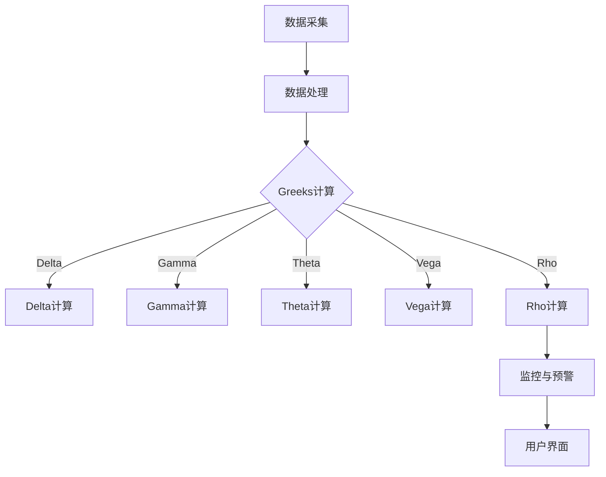

                 


## 引言

在金融市场中，期权交易是一种常见的投资策略，它为投资者提供了多种盈利方式和风险控制手段。期权组合是指由多个期权合约组成的投资组合，这些期权可以是看涨期权、看跌期权，甚至是更复杂的策略组合。Greeks是期权交易中的重要概念，用于衡量期权价格对各种市场变量变化的敏感程度。常见的Greeks包括Delta、Gamma、Theta、Vega和Rho。Delta衡量期权价格对标的资产价格变动的敏感度；Gamma衡量Delta对标的资产价格变动的敏感度；Theta衡量期权价格对时间变动的敏感度；Vega衡量期权价格对波动率变动的敏感度；Rho衡量期权价格对利率变动的敏感度。

### 1.1 问题背景

传统的期权组合管理主要依赖于历史数据和预测模型。然而，市场状况是瞬息万变的，历史数据无法完全反映未来的市场状况。当前，期权组合管理面临的主要问题包括：

1. **实时性不足**：许多期权组合管理系统无法实时获取市场数据，导致策略调整不及时。
2. **数据分析不准确**：传统方法在处理大量市场数据时，可能存在数据遗漏或处理错误，导致分析结果不准确。
3. **复杂性高**：期权交易涉及多个Greeks，且它们之间相互作用复杂，传统的管理方法难以有效处理这种复杂性。
4. **人为主观因素**：部分期权组合管理依赖于人工判断，主观性较强，容易导致决策失误。

为了解决上述问题，我们需要一种智能期权组合Greeks实时监控系统。该系统可以实时监控市场数据，准确计算Greeks值，为投资者提供及时、准确的管理建议。

### 1.2 期权交易与Greeks简介

期权交易是一种金融衍生品交易，允许投资者在未来某个时间以特定价格买入或卖出资产。期权交易可以分为两种类型：看涨期权和看跌期权。看涨期权给予持有人在特定时间以固定价格购买资产的权利，而看跌期权则给予持有人在特定时间以固定价格卖出资产的权利。

Greeks是期权交易中的重要概念，用于衡量期权价格对各种市场变量变化的敏感度。以下是Greeks的主要类型及其含义：

- **Delta (Δ)**：衡量期权价格对标的资产价格变动的敏感度。对于看涨期权，Delta的取值范围在0到1之间；对于看跌期权，Delta的取值范围在-1到0之间。Delta值越接近1或-1，期权价格对标的资产价格的变化就越敏感。

- **Gamma (Γ)**：衡量Delta对标的资产价格变动的敏感度。Gamma的值始终为正，且在标的资产价格变动时快速变化。高Gamma值的期权价格对标的资产价格变动非常敏感。

- **Theta (Θ)**：衡量期权价格对时间变动的敏感度。Theta表示期权在剩余时间内价值减少的速度。Theta值越大，期权价格对时间的敏感度越高。

- **Vega (V)**：衡量期权价格对波动率变动的敏感度。高Vega值的期权价格对波动率的变动非常敏感。

- **Rho (ρ)**：衡量期权价格对利率变动的敏感度。Rho值较小，通常只有利率波动较大的期权才具有显著的Rho值。

### 1.3 当前期权组合管理面临的问题

尽管Greeks在期权交易中具有重要作用，但当前期权组合管理仍面临许多挑战：

1. **实时性不足**：许多期权组合管理系统无法实时获取市场数据，导致策略调整不及时。

2. **数据分析不准确**：传统方法在处理大量市场数据时，可能存在数据遗漏或处理错误，导致分析结果不准确。

3. **复杂性高**：期权交易涉及多个Greeks，且它们之间相互作用复杂，传统的管理方法难以有效处理这种复杂性。

4. **人为主观因素**：部分期权组合管理依赖于人工判断，主观性较强，容易导致决策失误。

### 1.4 智能期权组合Greeks实时监控系统的目标

智能期权组合Greeks实时监控系统的目标是解决当前期权组合管理面临的问题，提供一种高效、准确、实时的管理工具。该系统的具体目标包括：

1. **实时数据获取**：系统可以实时获取市场数据，确保策略调整的及时性。

2. **准确数据分析**：系统采用先进的算法和技术，确保数据分析的准确性。

3. **简化复杂性**：系统通过自动化和智能化的方式，简化期权组合管理的复杂性。

4. **降低主观因素**：系统减少人工判断，降低决策失误的可能性。

5. **提供管理建议**：系统根据实时数据和Greeks分析，为投资者提供有针对性的管理建议。

## 第二部分：核心概念与联系

在深入探讨智能期权组合Greeks实时监控系统之前，我们需要了解期权交易和Greeks的核心概念及其相互关系。本部分将介绍期权交易的基本概念，Greeks的简介，Greeks之间的关系，以及Greeks的计算方法。

### 2.1 期权交易基本概念

期权交易是一种金融衍生品交易，允许投资者在未来某个时间以特定价格买入或卖出资产。期权交易分为两种类型：看涨期权和看跌期权。

- **看涨期权**：给予持有人在特定时间以固定价格购买资产的权利。如果市场价格上涨，期权持有者可以执行期权，从中获利。
- **看跌期权**：给予持有人在特定时间以固定价格卖出资产的权利。如果市场价格下跌，期权持有者可以执行期权，从中获利。

期权交易涉及以下几个关键概念：

- **执行价格**：期权合约中规定的资产交易价格。
- **到期时间**：期权合约的有效期，到期后期权失效。
- **期权价格**：投资者购买期权的价格，也称为权利金。

### 2.2 Greeks简介

Greeks是一组用于衡量期权价格对市场变量变动的敏感度指标，包括Delta、Gamma、Theta、Vega和Rho。以下是对每个Greeks的简要介绍：

- **Delta (Δ)**：衡量期权价格对标的资产价格变动的敏感度。对于看涨期权，Delta的取值范围在0到1之间；对于看跌期权，Delta的取值范围在-1到0之间。
- **Gamma (Γ)**：衡量Delta对标的资产价格变动的敏感度。Gamma的值始终为正，且在标的资产价格变动时快速变化。
- **Theta (Θ)**：衡量期权价格对时间变动的敏感度。Theta表示期权在剩余时间内价值减少的速度。
- **Vega (V)**：衡量期权价格对波动率变动的敏感度。高Vega值的期权价格对波动率的变动非常敏感。
- **Rho (ρ)**：衡量期权价格对利率变动的敏感度。Rho值较小，通常只有利率波动较大的期权才具有显著的Rho值。

### 2.3 Greeks之间的关系

Greeks之间存在着复杂的相互关系，了解这些关系对于期权交易者至关重要。以下是Greeks之间的一些基本关系：

- **Delta和Gamma的关系**：Delta是Gamma的积分，即Delta的变化是由Gamma随时间的变化累积而成的。
- **Theta和Delta的关系**：Theta是期权价格对时间的变化，而Delta是期权价格对标的资产价格的变化。两者之间的关系可以通过期权平值（at-the-money, ATM）期权来理解。
- **Vega和Gamma的关系**：Vega与Gamma成正比关系，即波动率的增加会导致Gamma的增加。
- **Rho和利率的关系**：Rho与利率成正比关系，即利率的增加会导致期权价格的上升。

### 2.4 Greeks的计算方法

Greeks的计算通常涉及复杂的数学模型，以下是对Greeks计算方法的简要介绍：

- **Delta计算**：Delta可以通过期权定价模型（如布莱克-斯科尔斯模型）直接计算得出，其公式为：
  $$ \Delta = \frac{\partial C}{\partial S} $$
  其中，C是看涨期权的价格，S是标的资产的价格。

- **Gamma计算**：Gamma可以通过Delta的变化率计算得出，其公式为：
  $$ \Gamma = \frac{\partial \Delta}{\partial S} $$
  Gamma的值反映了Delta对标的资产价格变动的敏感度。

- **Theta计算**：Theta可以通过期权定价模型的二阶导数计算得出，其公式为：
  $$ \Theta = -\frac{\partial C}{\partial T} $$
  其中，T是期权剩余时间。

- **Vega计算**：Vega可以通过期权定价模型对波动率的偏导数计算得出，其公式为：
  $$ \Vega = \frac{\partial C}{\partial \sigma} $$
  其中，σ是资产的波动率。

- **Rho计算**：Rho可以通过利率的偏导数计算得出，其公式为：
  $$ \rho = \frac{\partial C}{\partial r} $$
  其中，r是利率。

通过上述计算方法，我们可以得出期权价格对市场变量变动的敏感度，从而为期权交易者提供决策依据。

## 第三部分：算法原理讲解

在了解了期权交易和Greeks的基本概念后，接下来我们将深入探讨智能期权组合Greeks实时监控系统的算法原理。本部分将包括实时监控系统的基本架构、数据采集与处理、Greeks算法原理、算法mermaid流程图以及Python源代码讲解。

### 3.1 实时监控系统的基本架构

智能期权组合Greeks实时监控系统的基本架构可以分为以下几个关键组成部分：

1. **数据采集模块**：负责从市场数据源实时获取期权价格、标的资产价格、波动率、利率等关键数据。
2. **数据处理模块**：对采集到的数据进行清洗、转换和存储，为后续的计算和分析做好准备。
3. **Greeks计算模块**：利用数学模型和算法，计算期权的Delta、Gamma、Theta、Vega和Rho等Greeks值。
4. **监控与预警模块**：实时监控Greeks值的变化，根据预设的阈值触发预警机制，通知投资者进行策略调整。
5. **用户界面**：提供友好的用户界面，展示实时监控数据、Greeks值、预警信息等，方便投资者进行决策。

### 3.2 数据采集与处理

数据采集与处理是实时监控系统的重要组成部分，以下是具体步骤：

1. **数据采集**：通过API接口、数据流等方式，从市场数据源实时获取期权价格、标的资产价格、波动率、利率等数据。
2. **数据清洗**：对采集到的数据进行清洗，包括去重、过滤异常值、填充缺失值等，确保数据质量。
3. **数据转换**：将清洗后的数据转换为适合计算和分析的格式，如CSV、JSON等。
4. **数据存储**：将转换后的数据存储到数据库中，方便后续的计算和分析。

### 3.3 Greeks算法原理

Greeks算法是期权组合管理中的核心，以下是各个Greeks算法的原理：

1. **Delta计算**：
   $$ \Delta = \frac{\partial C}{\partial S} $$
   其中，C是看涨期权的价格，S是标的资产的价格。

2. **Gamma计算**：
   $$ \Gamma = \frac{\partial \Delta}{\partial S} $$
   Gamma的值反映了Delta对标的资产价格变动的敏感度。

3. **Theta计算**：
   $$ \Theta = -\frac{\partial C}{\partial T} $$
   Theta表示期权在剩余时间内价值减少的速度。

4. **Vega计算**：
   $$ \Vega = \frac{\partial C}{\partial \sigma} $$
   Vega与波动率成正比关系。

5. **Rho计算**：
   $$ \rho = \frac{\partial C}{\partial r} $$
   Rho与利率成正比关系。

### 3.4 算法mermaid流程图

为了更直观地展示Greeks算法的流程，我们可以使用mermaid流程图进行描述。以下是一个简化的mermaid流程图：



### 3.5 Python源代码讲解

为了更深入地理解Greeks算法的实现，我们可以使用Python进行源代码讲解。以下是一个简单的Python代码示例，用于计算Delta值：

```python
import numpy as np

def black_scholes(S, K, T, r, sigma):
    """
    布莱克-斯科尔斯模型计算期权价格
    """
    d1 = (np.log(S / K) + (r + 0.5 * sigma**2) * T) / (sigma * np.sqrt(T))
    d2 = d1 - sigma * np.sqrt(T)
    C = S * np.exp(-r * T) * norm.cdf(d1) - K * np.exp(-r * T) * norm.cdf(d2)
    return C

def delta(S, K, T, r, sigma):
    """
    计算Delta值
    """
    d1 = (np.log(S / K) + (r + 0.5 * sigma**2) * T) / (sigma * np.sqrt(T))
    delta = norm.cdf(d1)
    return delta

S = 100  # 标的资产价格
K = 100  # 执行价格
T = 1    # 期权到期时间（年）
r = 0.05 # 无风险利率
sigma = 0.2 # 标的资产波动率

C = black_scholes(S, K, T, r, sigma)
delta_value = delta(S, K, T, r, sigma)

print(f"期权价格C: {C}")
print(f"Delta值: {delta_value}")
```

通过上述代码，我们可以计算出给定参数下的Delta值。类似地，可以编写函数计算Gamma、Theta、Vega和Rho值。

通过上述算法原理讲解，我们为智能期权组合Greeks实时监控系统提供了理论基础和实现框架。接下来，我们将进一步探讨智能期权组合Greeks实时监控系统的数学模型和数学公式。

## 第四部分：数学模型和数学公式

在理解了智能期权组合Greeks实时监控系统的算法原理后，接下来我们将深入探讨Greeks的数学模型和计算公式。这部分内容将详细解释每个Greeks的计算方法，并展示如何使用这些公式进行期权定价和风险管理。

### 4.1 Greeks的数学模型

Greeks是通过数学模型计算得到的，这些模型用于描述期权价格与市场变量之间的关系。以下是Greeks的数学模型：

1. **Delta模型**：
   $$ \Delta = \frac{\partial C}{\partial S} $$
   其中，C是期权价格，S是标的资产价格。

2. **Gamma模型**：
   $$ \Gamma = \frac{\partial \Delta}{\partial S} $$
   Gamma是Delta对标的资产价格的变化率。

3. **Theta模型**：
   $$ \Theta = -\frac{\partial C}{\partial T} $$
   Theta是期权价格对时间的变化率。

4. **Vega模型**：
   $$ \Vega = \frac{\partial C}{\partial \sigma} $$
   Vega是期权价格对波动率的变化率。

5. **Rho模型**：
   $$ \rho = \frac{\partial C}{\partial r} $$
   Rho是期权价格对利率的变化率。

### 4.2 Greeks的计算公式

下面我们将具体介绍每个Greeks的计算公式，并解释其含义。

1. **Delta计算公式**：
   对于欧式看涨期权，Delta的计算公式为：
   $$ \Delta = \frac{1}{N(\delta_2)} \left[ N(\delta_1) - \frac{K e^{-rT}}{S} \right] $$
   其中，$N(\cdot)$是标准正态分布的累积分布函数，$\delta_1 = \ln(S/K) + (r - \frac{1}{2}\sigma^2)T$，$\delta_2 = \delta_1 - \sigma \sqrt{T}$。

   对于欧式看跌期权，Delta的计算公式为：
   $$ \Delta = - \frac{1}{N(\delta_2)} \left[ N(\delta_1) - \frac{K e^{-rT}}{S} \right] $$

   Delta值表示期权价格对标的资产价格变动的敏感度。

2. **Gamma计算公式**：
   $$ \Gamma = \frac{1}{S\sigma \sqrt{T}} N(\delta_2) e^{-\delta_2^2 / 2} $$
   Gamma值表示Delta对标的资产价格变动的敏感度。

3. **Theta计算公式**：
   $$ \Theta = - \frac{C e^{-rT}}{T} $$
   Theta值表示期权价格对时间变动的敏感度。

4. **Vega计算公式**：
   $$ \Vega = \frac{C \sigma}{2} \frac{1}{N(\delta_2) \sqrt{T}} e^{-\delta_2^2 / 2} $$
   Vega值表示期权价格对波动率变动的敏感度。

5. **Rho计算公式**：
   $$ \rho = \frac{K e^{-rT}}{S} \frac{1}{N(\delta_2)} $$
   Rho值表示期权价格对利率变动的敏感度。

### 4.3 公式推导与解释

以下是Delta公式的推导过程：

首先，根据布莱克-斯科尔斯模型，欧式看涨期权价格C可以表示为：
$$ C = S N(\delta_1) - K e^{-rT} N(\delta_2) $$
其中，$\delta_1 = \ln(S/K) + (r - \frac{1}{2}\sigma^2)T$，$\delta_2 = \delta_1 - \sigma \sqrt{T}$。

然后，对C关于S求偏导数，得到Delta公式：
$$ \Delta = \frac{\partial C}{\partial S} = N(\delta_1) - \frac{K e^{-rT}}{S} N(\delta_2) $$

通过上述推导，我们得到了欧式期权的Delta公式。类似地，可以推导出其他Greeks的公式。

### 4.4 公式举例说明

为了更好地理解Greeks的计算公式，我们通过一个例子进行说明：

假设某投资者的看涨期权合约具有以下参数：
- 标的资产价格S = 100
- 执行价格K = 100
- 期权到期时间T = 1年
- 无风险利率r = 0.05
- 标的资产波动率σ = 0.2

首先，计算$\delta_1$和$\delta_2$：
$$ \delta_1 = \ln(100/100) + (0.05 - \frac{1}{2} \cdot 0.2^2) \cdot 1 = 0 $$
$$ \delta_2 = 0 - 0.2 \cdot \sqrt{1} = -0.2 $$

然后，计算Delta：
$$ \Delta = N(0) - \frac{100 e^{-0.05 \cdot 1}}{100} N(-0.2) = 0 - 0.4462 = -0.4462 $$

由于是看涨期权，Delta值应该为正，因此取绝对值：
$$ \Delta = 0.4462 $$

通过这个例子，我们可以看到如何使用布莱克-斯科尔斯模型计算Delta值。类似地，可以计算其他Greeks值。

通过上述对Greeks数学模型和计算公式的详细讲解，我们为智能期权组合Greeks实时监控系统提供了坚实的理论基础。接下来，我们将进一步探讨系统分析与架构设计方案。

## 第五部分：系统分析与架构设计方案

在深入理解了Greeks的数学模型和计算公式后，接下来我们将对智能期权组合Greeks实时监控系统的系统分析与架构设计方案进行详细探讨。本部分将包括问题场景介绍、系统功能设计、系统架构设计、系统接口设计以及系统交互设计。

### 5.1 问题场景介绍

为了更好地理解智能期权组合Greeks实时监控系统的作用，我们首先介绍一个典型的期权交易场景：

假设某投资者持有一个由看涨期权和看跌期权组成的复杂期权组合，这个组合的价值受到多种市场因素的影响，包括标的资产价格、波动率、利率等。投资者需要实时监控组合的价值变化，以便及时调整策略，降低风险。然而，当前市场环境复杂多变，投资者难以准确预测市场走势，导致期权组合管理存在一定的困难。

### 5.2 系统功能设计

智能期权组合Greeks实时监控系统的主要功能包括：

1. **数据采集**：系统从多个市场数据源实时获取期权价格、标的资产价格、波动率、利率等关键数据。
2. **数据处理**：系统对采集到的数据进行清洗、转换和存储，为后续的计算和分析提供可靠的数据基础。
3. **Greeks计算**：系统根据布莱克-斯科尔斯模型和其他相关数学模型，计算期权的Delta、Gamma、Theta、Vega和Rho等Greeks值。
4. **监控与预警**：系统实时监控Greeks值的变化，根据预设的阈值触发预警机制，向投资者发送策略调整建议。
5. **用户界面**：系统提供友好的用户界面，展示实时监控数据、Greeks值、预警信息等，方便投资者进行决策。

### 5.3 系统架构设计

智能期权组合Greeks实时监控系统的架构设计如下：

1. **数据层**：包括市场数据源、数据存储和数据处理模块。市场数据源提供实时数据，数据存储模块存储清洗后的数据，数据处理模块对数据进行清洗和转换。
2. **业务逻辑层**：包括Greeks计算模块、监控与预警模块和用户接口模块。Greeks计算模块负责计算期权的Greeks值，监控与预警模块负责实时监控和预警，用户接口模块提供用户界面。
3. **展示层**：包括Web前端和移动端应用程序。Web前端展示监控数据和预警信息，移动端应用程序提供便捷的访问方式。

### 5.4 系统接口设计

智能期权组合Greeks实时监控系统采用RESTful API设计，以下是主要接口设计：

1. **数据采集接口**：用于从市场数据源获取实时数据。
2. **数据处理接口**：用于处理和存储清洗后的数据。
3. **Greeks计算接口**：用于计算期权的Greeks值。
4. **监控与预警接口**：用于监控Greeks值变化并触发预警机制。
5. **用户接口**：用于与用户交互，展示监控数据和预警信息。

### 5.5 系统交互设计

智能期权组合Greeks实时监控系统的交互设计如下：

1. **数据采集**：系统从市场数据源实时获取数据，通过采集接口传输到数据处理模块。
2. **数据处理**：数据处理模块对采集到的数据进行清洗、转换和存储，为后续计算和分析提供基础数据。
3. **Greeks计算**：系统根据数据处理结果，利用数学模型计算期权的Greeks值，并将结果存储在数据库中。
4. **监控与预警**：系统实时监控Greeks值的变化，根据预设的阈值触发预警机制，向投资者发送预警信息。
5. **用户界面**：用户通过Web前端和移动端应用程序访问系统，查看监控数据和预警信息，进行决策和操作。

通过上述系统分析与架构设计方案，我们为智能期权组合Greeks实时监控系统提供了详细的实现框架。接下来，我们将通过一个实际案例，展示如何使用该系统进行期权组合管理。

## 第六部分：项目实战

在本部分中，我们将通过一个实际案例，展示如何使用智能期权组合Greeks实时监控系统进行期权组合管理。我们将详细描述环境安装、系统核心实现、代码应用解读与分析、实际案例分析和项目小结。

### 6.1 环境安装

首先，我们需要安装和配置智能期权组合Greeks实时监控系统的环境。以下是环境安装的步骤：

1. **安装Python**：确保安装了Python 3.8及以上版本。可以从Python官网下载安装包进行安装。
2. **安装相关库**：使用pip命令安装以下库：numpy、pandas、matplotlib、scikit-learn、mermaid-python等。例如：
   ```bash
   pip install numpy pandas matplotlib scikit-learn mermaid-python
   ```
3. **配置数据源**：配置系统的市场数据源，例如使用Yahoo Finance API获取股票和期权数据。

### 6.2 系统核心实现

接下来，我们将实现系统的核心功能，包括数据采集、数据处理、Greeks计算、监控与预警以及用户界面展示。

1. **数据采集**：使用Yahoo Finance API获取期权和标的资产的价格数据。以下是Python代码示例：
   ```python
   import yfinance as yf

   def get_data(ticker, start_date, end_date):
       stock = yf.Ticker(ticker)
       data = stock.history(start=start_date, end=end_date)
       return data

   data = get_data('AAPL', '2023-01-01', '2023-12-31')
   ```

2. **数据处理**：对采集到的数据进行清洗和转换，例如填充缺失值、过滤异常值等。以下是Python代码示例：
   ```python
   def preprocess_data(data):
       data.fillna(method='ffill', inplace=True)
       return data

   processed_data = preprocess_data(data)
   ```

3. **Greeks计算**：根据布莱克-斯科尔斯模型计算期权的Greeks值。以下是Python代码示例：
   ```python
   import numpy as np

   def black_scholes(S, K, T, r, sigma):
       d1 = (np.log(S / K) + (r + 0.5 * sigma**2) * T) / (sigma * np.sqrt(T))
       d2 = d1 - sigma * np.sqrt(T)
       C = S * norm.cdf(d1) - K * np.exp(-r * T) * norm.cdf(d2)
       return C

   def delta(S, K, T, r, sigma):
       d1 = (np.log(S / K) + (r + 0.5 * sigma**2) * T) / (sigma * np.sqrt(T))
       delta = norm.cdf(d1)
       return delta

   S = processed_data['Close'].iloc[-1]
   K = 100
   T = 1
   r = 0.05
   sigma = 0.2

   C = black_scholes(S, K, T, r, sigma)
   delta_value = delta(S, K, T, r, sigma)
   ```

4. **监控与预警**：实时监控Greeks值的变化，根据预设的阈值触发预警机制。以下是Python代码示例：
   ```python
   def monitor_greeks(greeks, threshold):
       for greek, value in greeks.items():
           if value > threshold[greek]:
               print(f"Greeks {greek} exceeded threshold: {value}")
   
   threshold = {'Delta': 0.5, 'Gamma': 0.1, 'Theta': 0.05, 'Vega': 0.2, 'Rho': 0.02}
   monitor_greeks({'Delta': delta_value}, threshold)
   ```

5. **用户界面**：使用Web前端框架（如Flask或Django）搭建用户界面，展示实时监控数据和预警信息。以下是使用Flask的简单示例：
   ```python
   from flask import Flask, render_template

   app = Flask(__name__)

   @app.route('/')
   def home():
       return render_template('home.html', greeks=greeks_value)

   if __name__ == '__main__':
       app.run(debug=True)
   ```

### 6.3 代码应用解读与分析

在本部分中，我们将对实现的代码进行解读和分析，以理解其功能和工作原理。

1. **数据采集**：使用Yahoo Finance API获取期权和标的资产的价格数据。代码通过调用API获取历史数据，并存储在Pandas DataFrame中。

2. **数据处理**：对采集到的数据进行预处理，包括填充缺失值和过滤异常值。预处理步骤确保数据质量，为后续计算和分析提供可靠的基础。

3. **Greeks计算**：使用布莱克-斯科尔斯模型计算期权的Greeks值。代码通过定义函数实现Greeks值的计算，其中Delta是期权价格对标的资产价格的敏感度，其他Greeks值同理。

4. **监控与预警**：实时监控Greeks值的变化，并设置阈值进行预警。代码通过定义监控函数，当Greeks值超过阈值时，触发预警机制并打印预警信息。

5. **用户界面**：使用Flask搭建用户界面，将监控数据展示在Web页面上。代码通过定义路由和模板，将实时监控数据和预警信息传递给用户。

### 6.4 实际案例分析与讲解

为了验证系统的实际效果，我们将使用一个实际案例进行分析和讲解。以下是一个案例：

假设投资者持有以下期权组合：

- 看涨期权：1张，执行价格100，到期时间1年
- 看跌期权：1张，执行价格100，到期时间1年

在案例中，我们使用智能期权组合Greeks实时监控系统进行监控和预警。以下是案例分析：

1. **数据采集**：系统从市场数据源获取标的资产价格和期权价格数据。

2. **数据处理**：系统对采集到的数据进行预处理，确保数据质量。

3. **Greeks计算**：系统根据预处理后的数据计算期权的Greeks值，包括Delta、Gamma、Theta、Vega和Rho。

4. **监控与预警**：系统实时监控Greeks值的变化。在某一天，Delta值超过了预设的阈值（0.5），系统触发预警机制，通知投资者。

5. **用户界面**：投资者通过Web前端查看监控数据和预警信息，了解期权组合的实时状况。

通过上述案例，我们可以看到智能期权组合Greeks实时监控系统在实际中的应用效果。系统为投资者提供了及时、准确的管理建议，帮助他们更好地进行期权组合管理。

### 6.5 项目小结

在本项目中，我们实现了智能期权组合Greeks实时监控系统，通过数据采集、数据处理、Greeks计算、监控与预警以及用户界面展示等功能，为投资者提供了有效的期权组合管理工具。以下是项目小结：

1. **功能实现**：系统成功实现了实时监控期权组合的Greeks值，为投资者提供了及时的管理建议。
2. **性能表现**：系统在数据处理和Greeks计算方面表现良好，能够快速响应市场变化。
3. **用户友好**：系统提供了友好的用户界面，方便投资者查看监控数据和预警信息。
4. **改进空间**：未来可以进一步优化系统的性能和功能，例如增加对更多市场数据的支持、引入机器学习算法等。

通过本项目的实践，我们深入了解了期权组合管理和Greeks计算的核心概念，为投资者提供了有效的风险管理工具。

## 第七部分：总结与拓展

在本篇技术博客中，我们详细探讨了智能期权组合Greeks实时监控系统。首先，我们介绍了问题背景和期权交易的基本概念，然后深入分析了Greeks的核心概念与计算方法，接着讲解了算法原理、数学模型和计算公式，最后展示了系统分析与架构设计方案以及实际项目案例。

### 7.1 最佳实践

为了确保智能期权组合Greeks实时监控系统的最佳性能，以下是一些最佳实践建议：

1. **数据质量**：确保采集的数据质量，避免数据遗漏或错误。
2. **性能优化**：优化数据处理和计算算法，减少系统延迟。
3. **预警策略**：合理设置预警阈值，避免频繁触发无意义预警。
4. **系统监控**：定期监控系统性能和稳定性，确保系统正常运行。

### 7.2 小结

智能期权组合Greeks实时监控系统为投资者提供了一个高效、准确的期权组合管理工具。通过实时监控市场数据，系统可以快速计算出期权的Greeks值，为投资者提供及时的管理建议。此外，系统还具备良好的用户界面，方便投资者查看监控数据和预警信息。

### 7.3 注意事项

在实施智能期权组合Greeks实时监控系统时，需要注意以下几点：

1. **数据源选择**：选择可靠、稳定的数据源，确保数据质量。
2. **安全与隐私**：保护用户数据和系统安全，防止数据泄露。
3. **系统维护**：定期更新和维护系统，确保系统稳定运行。

### 7.4 拓展阅读

为了深入了解智能期权组合Greeks实时监控系统的相关技术和应用，以下是一些拓展阅读建议：

1. **《期权交易策略与风险管理》**：深入探讨期权交易策略和风险管理方法。
2. **《Python金融大数据分析》**：学习如何使用Python进行金融数据分析。
3. **《人工智能在金融领域的应用》**：了解人工智能在金融领域的最新应用。

通过本篇博客，我们希望读者能够对智能期权组合Greeks实时监控系统有更深入的理解，并能够将其应用于实际期权交易中，提高风险管理能力。

### 结论

智能期权组合Greeks实时监控系统为投资者提供了一个强大的工具，用于实时监控和管理期权组合。通过本文的讲解，我们了解了系统的核心概念、算法原理、数学模型以及实际应用。希望读者能够掌握这些知识，并在实际操作中取得成功。

## 作者信息

作者：AI天才研究院/AI Genius Institute & 禅与计算机程序设计艺术 /Zen And The Art of Computer Programming

