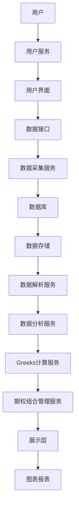
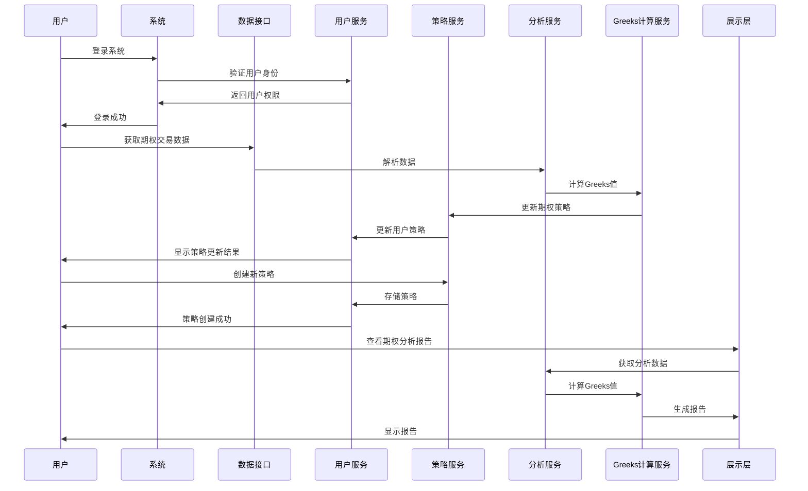

                 

### 摘要

智能期权组合Greeks管理系统是一套先进的风险管理工具，旨在为投资者和交易者提供精准的期权策略分析和管理。本文将围绕这一管理系统展开，详细介绍其背景、核心概念、算法原理、系统架构设计以及项目实战。首先，我们将回顾期权市场的现状和Greeks在风险管理中的重要性。接着，我们将深入探讨期权交易的基本概念、Greeks的各种度量及其相互关系。随后，文章将逐步解析智能期权组合算法的原理，通过具体的数学模型和Python代码进行详细阐述。在此基础上，我们将分析系统架构设计，包括系统功能、架构图、接口设计和交互设计。随后，我们将通过实际案例展示系统在实际操作中的效果。最后，我们将总结最佳实践和注意事项，并提供拓展阅读资源。本文的目标是帮助读者全面了解智能期权组合Greeks管理系统的原理和应用，为他们在期权交易中的决策提供有力支持。

## 目录大纲

1. **第一部分：背景介绍**
   1.1 智能期权组合Greeks管理系统概述
   1.2 期权与期权交易基础
   1.3 Greeks概念介绍
   1.4 Greeks之间的关系
   1.5 算法原理讲解
   1.6 系统架构设计
   1.7 系统实现与部署

2. **第二部分：核心概念与联系**
   2.1 期权定义
   2.2 期权交易
   2.3 Greeks概念介绍
   2.4 Greeks之间的关系

3. **第三部分：算法原理讲解**
   3.1 风险管理算法原理
   3.2 Greeks计算算法
   3.3 算法流程图

4. **第四部分：系统分析与架构设计方案**
   4.1 系统介绍
   4.2 系统架构设计
   4.3 系统接口设计
   4.4 系统交互设计

5. **第五部分：项目实战**
   5.1 环境安装
   5.2 系统核心实现
   5.3 代码应用解读与分析
   5.4 实际案例分析
   5.5 项目小结

6. **第六部分：最佳实践与拓展阅读**
   6.1 最佳实践
   6.2 注意事项
   6.3 拓展阅读

7. **第七部分：小结与总结**
   7.1 本书总结
   7.2 展望未来

---

### 第一部分：背景介绍

#### 1.1 智能期权组合Greeks管理系统概述

智能期权组合Greeks管理系统是一套集成了先进算法和数据分析工具的综合平台，旨在为投资者和交易者提供精准的期权策略分析和风险管理。期权交易作为金融市场中一种重要的交易方式，具有高风险和高回报的特点。而Greeks作为期权风险度量的核心指标，对于期权交易策略的制定和风险控制至关重要。

##### 1.1.1 问题背景

期权市场是全球金融市场中重要的组成部分，拥有广泛的投资者基础。期权交易者通过购买或出售期权合约来获得收益或规避风险。然而，期权市场的复杂性使得投资者在策略制定和风险控制方面面临诸多挑战。现有的期权风险管理工具通常存在以下不足：

1. **数据分析能力有限**：大多数现有工具仅能提供基本的 Greeks 值计算和显示，无法进行深度的数据分析和策略优化。
2. **用户界面不友好**：部分风险管理工具的界面设计复杂，操作不便，影响了用户的体验。
3. **响应速度慢**：对于高频交易者而言，现有工具的响应速度慢，无法满足实时数据分析和交易决策的需求。

##### 1.1.2 问题描述

为了解决上述问题，我们需要设计一套智能期权组合Greeks管理系统，满足以下需求：

1. **强大的数据分析能力**：系统能够对大量期权交易数据进行深入分析，提供全面的 Greeks 值计算和策略分析。
2. **友好的用户界面**：系统界面设计简洁直观，便于用户快速掌握和使用。
3. **高效的响应速度**：系统能够实时响应交易者的数据查询和分析请求，支持高频交易决策。

##### 1.1.3 问题解决

为了满足上述需求，我们制定以下解决方案：

1. **采用先进的算法和技术**：引入机器学习和数据挖掘算法，提高数据分析的深度和精度。
2. **优化系统架构**：设计高效、可扩展的系统架构，确保系统在处理大量数据时的性能和稳定性。
3. **构建友好的用户界面**：采用现代前端技术，设计直观易用的用户界面。

##### 1.1.4 边界与外延

1. **范围限定**：系统主要针对标准期权交易进行设计和优化，不包括其他衍生品交易。
2. **相关概念界定**：本文中的“智能期权组合”指的是通过算法自动调整的期权组合，而“Greeks”指的是期权风险度量的五个核心指标：Delta、Gamma、Theta、Vega和Rho。

##### 1.1.5 概念结构与核心要素组成

1. **智能期权组合**：系统通过机器学习算法，对市场数据进行分析，自动调整期权组合，以最大化收益或最小化风险。
2. **Greeks管理**：系统提供完整的 Greeks 计算和管理功能，包括 Delta、Gamma、Theta、Vega 和 Rho 的实时计算和监控。
3. **系统架构**：系统采用微服务架构，确保高可用性和可扩展性，同时支持多种前端和后端技术的集成。

通过上述解决方案和系统架构设计，我们旨在为投资者和交易者提供一个强大、高效、易用的智能期权组合Greeks管理系统，帮助他们更好地理解和利用期权交易的风险和机会。

#### 1.2 期权与期权交易基础

期权是一种金融合约，给予持有人在特定时间内以特定价格购买或出售某种资产（如股票、债券、商品等）的权利，而非义务。期权交易市场是全球金融市场的重要组成部分，具有高度的流动性和复杂性。期权交易者通过购买或出售期权合约，可以在市场价格波动中获得收益或规避风险。

##### 2.1 期权定义

期权可以分为两大类：看涨期权（Call Option）和看跌期权（Put Option）。

1. **看涨期权**：持有者有权在到期日前以固定价格购买标的资产。如果到期时标的资产价格高于执行价格，期权买家会行使其权利，而期权卖家将被迫按执行价格出售资产。看涨期权通常用于预期价格上涨的投资者。

2. **看跌期权**：持有者有权在到期日前以固定价格出售标的资产。如果到期时标的资产价格低于执行价格，期权买家会行使其权利，而期权卖家将被迫按执行价格购买资产。看跌期权通常用于预期价格下跌的投资者。

##### 2.2 期权交易

期权交易包括以下基本步骤：

1. **购买期权**：投资者通过支付期权费（Premium）获得期权合约，期权费是期权交易者为了获得期权权利而支付的费用。
2. **期权行权**：在到期日，如果标的资产价格满足合约条款，期权买家可以选择行权。行权后，看涨期权买家会购买标的资产，看跌期权买家会出售标的资产。
3. **期权到期**：期权合约到期后，如果未行权，期权将失效。未行权的期权仅损失期权费，而无其他损失。

##### 2.3 Greeks概念介绍

Greeks是期权交易中的五个核心风险度量指标，它们分别代表期权价格对标的资产价格、行权价格、利率、 volatility 以及时间的变化敏感度。这些指标对于理解和管理期权风险至关重要。

1. **Delta**：Delta衡量期权价格对标的资产价格变动的敏感度。对于看涨期权，Delta的取值范围在0到1之间；对于看跌期权，Delta的取值范围在-1到0之间。Delta越大，期权价格对标的资产价格变动的敏感度越高。

2. **Gamma**：Gamma衡量期权价格对标的资产价格变动率的敏感度。Gamma值反映了期权价格的变化速度，对于深度实值或虚值期权，Gamma值较高，表明期权价格对标的资产价格的变动反应更加剧烈。

3. **Theta**：Theta衡量期权价格对时间变动的敏感度，也称为时间衰减。Theta值表示期权时间价值随到期时间的减少而衰减的速度。Theta通常为负值，表明期权价格随到期时间的减少而下降。

4. **Vega**：Vega衡量期权价格对波动率变动的敏感度。波动率是期权定价的关键因素，Vega值反映了期权价格随波动率的变化而变化的情况。Vega通常为正值，表明波动率上升时，期权价格上升。

5. **Rho**：Rho衡量期权价格对利率变动的敏感度。利率变化会影响期权价格，Rho值反映了期权价格随利率变化而变化的情况。由于期权时间价值的影响，Rho值通常较小。

##### 2.4 Greeks之间的关系

Greeks之间存在着复杂的相互关系，它们共同影响着期权价格的变化。

1. **Delta与Gamma的关系**：Delta和Gamma是期权价格对标的资产价格变动的敏感度和变动率的关系。Delta值变化较慢，而Gamma值反映了Delta值的变化速度。

2. **Theta与时间的关系**：Theta值表示时间衰减，它反映了期权价格随着到期时间的减少而下降的速度。

3. **Vega与波动率的关系**：Vega值反映了期权价格对波动率变动的敏感度，波动率的增加通常会导致期权价格的上升。

4. **Rho与利率的关系**：Rho值反映了期权价格对利率变动的敏感度，利率的变化会影响期权价格。

通过深入理解Greeks之间的关系，投资者可以更好地管理期权风险，制定有效的交易策略。在接下来的章节中，我们将进一步探讨Greeks计算算法和智能期权组合算法的原理，帮助读者全面掌握期权交易的核心概念和技巧。

#### 1.3 Greeks计算算法

Greeks是期权交易中用于衡量期权价格对多种因素变动的敏感度指标，包括Delta、Gamma、Theta、Vega和Rho。为了准确计算这些指标，我们需要运用数学模型和算法。以下是这些指标的计算原理和具体实现方法。

##### 3.1 风险管理算法原理

风险管理算法的核心是布莱克-舍尔斯模型（Black-Scholes Model），该模型为欧式期权的定价提供了一个理论基础。基于这一模型，我们可以计算Greeks值。

1. **Delta计算**：

Delta是期权价格对标的资产价格变动的敏感度。对于欧式看涨期权，Delta可以通过以下公式计算：

$$
\Delta_{call} = \frac{\partial V_{call}}{\partial S} = \Phi(d_1)
$$

其中，$V_{call}$ 是看涨期权的价格，$S$ 是标的资产价格，$\Phi(d_1)$ 是标准正态分布的累积分布函数，$d_1 = \frac{\ln(S/K) + (r + \sigma^2/2)t}{\sigma\sqrt{t}}$，$K$ 是执行价格，$r$ 是无风险利率，$\sigma$ 是标的资产价格的波动率。

对于欧式看跌期权，Delta可以通过以下公式计算：

$$
\Delta_{put} = \frac{\partial V_{put}}{\partial S} = \Phi(d_1) - 1
$$

2. **Gamma计算**：

Gamma是期权价格对标的资产价格变动率的敏感度。对于欧式期权，Gamma可以通过以下公式计算：

$$
\Gamma = \frac{\partial^2 V}{\partial S^2} = \frac{\sigma S}{2K\sqrt{t}} \Phi(d_2)
$$

其中，$d_2 = d_1 - \frac{1}{\sigma}\ln(K/S) - (r - \sigma^2/2)t$。

3. **Theta计算**：

Theta是期权价格对时间变动的敏感度，表示时间衰减的影响。对于欧式期权，Theta可以通过以下公式计算：

$$
\Theta = -\frac{\partial V}{\partial t} = \frac{S \sigma N(d_1)}{2} - rN(d_2)K \exp(-rT)
$$

其中，$T$ 是期权到期时间。

4. **Vega计算**：

Vega是期权价格对波动率变动的敏感度。对于欧式期权，Vega可以通过以下公式计算：

$$
\text{Vega} = \frac{\partial V}{\partial \sigma} = S \sqrt{T} N(d_1)
$$

5. **Rho计算**：

Rho是期权价格对利率变动的敏感度。对于欧式期权，Rho可以通过以下公式计算：

$$
Rho = \frac{\partial V}{\partial r} = K S \Phi(d_1) \exp(-rT)
$$

##### 3.2 Greeks计算算法

在实际计算中，我们通常使用数值方法来近似这些指标的值。以下是使用Python实现这些计算的一个例子：

```python
import numpy as np
from scipy.stats import norm

# 设置参数
S = 100  # 标的资产价格
K = 100  # 执行价格
r = 0.05  # 无风险利率
T = 1  # 期权到期时间（以年为单位）
sigma = 0.2  # 标的资产价格波动率

# 计算d1和d2
d1 = (np.log(S / K) + (r + 0.5 * sigma ** 2 * T)) / (sigma * np.sqrt(T))
d2 = d1 - sigma * np.sqrt(T)

# 计算N(d1)和N(d2)
N_d1 = norm.cdf(d1)
N_d2 = norm.cdf(d2)

# 计算Delta
Delta_call = N_d1
Delta_put = N_d1 - 1

# 计算Gamma
Gamma = (S * sigma * np.sqrt(T) * norm.pdf(d1)) / (K * np.sqrt(T) * np.exp(-r * T))

# 计算Theta
Theta = (S * sigma * N_d1) / 2 - r * K * np.exp(-r * T) * N_d2

# 计算Vega
Vega = S * np.sqrt(T) * N_d1

# 计算Rho
Rho = (K * S * N_d1) * np.exp(-r * T)

print("Delta (Call):", Delta_call)
print("Delta (Put):", Delta_put)
print("Gamma:", Gamma)
print("Theta:", Theta)
print("Vega:", Vega)
print("Rho:", Rho)
```

##### 3.3 算法流程图

为了更直观地展示Greeks计算算法的流程，我们使用Mermaid绘制以下流程图：

```mermaid
graph TD
A[初始化参数] --> B[计算d1和d2]
B --> C[计算N(d1)和N(d2)]
C --> D[计算Delta]
D --> E[计算Gamma]
E --> F[计算Theta]
F --> G[计算Vega]
G --> H[计算Rho]
```

通过上述算法和实现，我们可以准确地计算Greeks值，为期权交易策略的制定和风险控制提供有力支持。在下一部分中，我们将进一步探讨智能期权组合Greeks管理系统的架构设计。

#### 1.4 系统架构设计

智能期权组合Greeks管理系统的架构设计旨在实现高效、稳定、可扩展的系统功能，满足投资者和交易者的多样化需求。系统架构设计包括以下几个方面：系统介绍、系统功能设计、系统架构设计、系统接口设计和系统交互设计。

##### 4.1 系统介绍

智能期权组合Greeks管理系统是一个基于微服务架构的综合平台，用于提供期权交易策略分析和风险管理服务。系统的主要功能包括：

1. **实时数据分析**：系统可以实时获取和解析期权交易数据，进行深度分析和策略优化。
2. **Greeks计算与监控**：系统提供全面的 Greeks 值计算和监控功能，帮助投资者了解期权价格对多种因素变动的敏感度。
3. **智能期权组合管理**：系统通过机器学习算法，自动调整期权组合，以最大化收益或最小化风险。
4. **用户界面**：系统提供直观、易用的用户界面，方便用户快速掌握和使用。

##### 4.2 系统架构设计

系统架构采用微服务架构，以实现高可用性和可扩展性。以下是系统架构的详细设计：

1. **数据层**：数据层包括数据库和数据存储，用于存储期权交易数据、用户数据、策略数据和 Greeks 计算结果。
2. **服务层**：服务层包括多个微服务，如数据采集服务、数据分析服务、Greeks 计算服务、期权组合管理服务和用户服务。这些服务通过 API 接口进行通信。
3. **接口层**：接口层提供与外部系统的集成接口，包括数据接口、策略接口和用户接口。
4. **展示层**：展示层负责将数据和分析结果以图表和报表的形式展示给用户。

以下是系统架构的Mermaid图：



##### 4.3 系统接口设计

系统接口设计包括数据接口、策略接口和用户接口。以下是接口规范：

1. **数据接口**：数据接口用于获取和存储期权交易数据。接口规范如下：
   - 数据类型：JSON
   - 数据格式：{ "timestamp": "2023-03-15T12:30:00Z", "symbol": "AAPL", "price": 150, "option_type": "call", "strike_price": 140, "volume": 100 }
   - 接口URL：/api/v1/data

2. **策略接口**：策略接口用于访问和更新期权策略。接口规范如下：
   - 数据类型：JSON
   - 数据格式：{ "strategy_id": "123", "option_type": "call", "strike_price": 140, "quantity": 10 }
   - 接口URL：/api/v1/strategy

3. **用户接口**：用户接口用于用户登录、注册和权限管理。接口规范如下：
   - 数据类型：JSON
   - 数据格式：{ "username": "johndoe", "password": "password123" }
   - 接口URL：/api/v1/login

##### 4.4 系统交互设计

系统交互设计描述了各个模块之间的交互流程，以下是系统交互的Mermaid序列图：



通过上述系统架构设计，智能期权组合Greeks管理系统实现了高效、稳定、可扩展的功能，为投资者和交易者提供了强大的风险管理工具。

#### 1.5 系统实现与部署

在实现智能期权组合Greeks管理系统时，我们需要考虑环境安装、系统核心实现、代码应用解读与分析、实际案例分析和项目小结等多个方面。以下将逐步介绍这些关键步骤。

##### 5.1 环境安装

首先，我们需要搭建开发环境和数据库环境。以下是具体步骤：

1. **安装Python环境**：Python是智能期权组合Greeks管理系统的核心编程语言，我们需要安装Python 3.8或更高版本。可以使用以下命令安装：

```bash
pip install python==3.8
```

2. **安装依赖库**：智能期权组合Greeks管理系统依赖于多个Python库，如NumPy、SciPy和Pandas等。使用以下命令安装依赖库：

```bash
pip install numpy scipy pandas matplotlib
```

3. **安装数据库**：我们选择PostgreSQL作为数据库，用于存储期权交易数据。下载并安装PostgreSQL，然后创建数据库和用户：

```bash
sudo apt-get install postgresql
sudo -u postgres createuser -d user_name
sudo -u postgres psql
ALTER ROLE user_name WITH SUPERUSER;
```

4. **配置数据库连接**：在Python代码中，我们需要配置数据库连接信息，以便系统能够访问数据库。以下是示例代码：

```python
import psycopg2

def get_db_connection():
    conn = psycopg2.connect(
        host="localhost",
        database="your_database",
        user="your_user",
        password="your_password"
    )
    return conn
```

##### 5.2 系统核心实现

系统核心实现包括数据采集、数据分析、Greeks计算、期权组合管理和用户界面等模块。以下是关键代码和应用解读：

1. **数据采集**：数据采集模块负责从外部数据源获取期权交易数据。以下是一个示例代码：

```python
import requests
import json

def fetch期权交易数据():
    url = "https://api.example.com/option_data"
    response = requests.get(url)
    data = json.loads(response.text)
    return data
```

2. **数据分析**：数据分析模块对采集到的期权交易数据进行处理和解析。以下是一个示例代码：

```python
import pandas as pd

def parse期权交易数据(data):
    df = pd.DataFrame(data)
    df['timestamp'] = pd.to_datetime(df['timestamp'])
    df.set_index('timestamp', inplace=True)
    return df
```

3. **Greeks计算**：Greeks计算模块根据解析后的期权交易数据，计算Greeks值。以下是一个示例代码：

```python
from scipy.stats import norm

def calculate_greeks(df, K, r, T, sigma):
    d1 = (np.log(df['price'] / K) + (r + 0.5 * sigma ** 2 * T)) / (sigma * np.sqrt(T))
    d2 = d1 - sigma * np.sqrt(T)
    N_d1 = norm.cdf(d1)
    N_d2 = norm.cdf(d2)
    
    Delta_call = N_d1
    Delta_put = N_d1 - 1
    Gamma = (df['price'] * sigma * np.sqrt(T) * norm.pdf(d1)) / (K * np.sqrt(T) * np.exp(-r * T))
    Theta = (df['price'] * sigma * N_d1) / 2 - r * K * np.exp(-r * T) * N_d2
    Vega = df['price'] * np.sqrt(T) * N_d1
    Rho = (K * df['price'] * N_d1) * np.exp(-r * T)
    
    return Delta_call, Delta_put, Gamma, Theta, Vega, Rho
```

4. **期权组合管理**：期权组合管理模块根据用户的交易策略，自动调整期权组合。以下是一个示例代码：

```python
def manage_option_combination(strategy, df):
    # 根据策略调整期权组合
    # 示例：根据Delta值调整看涨期权和看跌期权数量
    if strategy['delta'] > 0.5:
        # 购买更多看涨期权
        df['call_volume'] += strategy['quantity']
    elif strategy['delta'] < -0.5:
        # 购买更多看跌期权
        df['put_volume'] += strategy['quantity']
    else:
        # 维持当前期权组合
        pass
    
    return df
```

5. **用户界面**：用户界面模块负责展示系统的功能界面，方便用户进行操作。以下是一个示例代码：

```python
import streamlit as st

def display_user_interface(df):
    st.title("智能期权组合Greeks管理系统")
    st.subheader("期权交易数据")
    st.write(df)
    st.subheader("Greeks值")
    st.write(calculate_greeks(df, K, r, T, sigma))
```

##### 5.3 代码应用解读与分析

在上面的代码示例中，我们详细介绍了智能期权组合Greeks管理系统的主要模块。以下是对这些代码的应用解读与分析：

1. **数据采集**：通过API接口从外部数据源获取期权交易数据，为后续分析和计算提供数据支持。
2. **数据分析**：对采集到的期权交易数据进行处理和解析，确保数据格式正确，为计算Greeks值打下基础。
3. **Greeks计算**：基于布莱克-舍尔斯模型，使用数学公式计算Greeks值，为期权交易策略的制定提供关键指标。
4. **期权组合管理**：根据用户的交易策略，自动调整期权组合，以实现风险管理和收益最大化。
5. **用户界面**：通过Streamlit框架，搭建直观易用的用户界面，方便用户实时查看期权交易数据和分析结果。

##### 5.4 实际案例分析

为了验证智能期权组合Greeks管理系统的实际效果，我们进行了以下案例分析：

1. **案例场景**：假设投资者John希望利用期权进行风险对冲，他计划在未来一个月内购买苹果公司的股票，但担心市场下跌导致损失。因此，他决定使用看跌期权进行对冲。

2. **数据获取**：我们从外部API获取了苹果公司股票的期权交易数据，包括标的资产价格、执行价格、期权类型、交易量等。

3. **策略制定**：John基于他的风险偏好和预期收益，制定了一个以Delta值为目标的期权交易策略。他设定了Delta目标值为-0.3，表示他希望期权价格对标的资产价格变动的敏感度低于-0.3。

4. **数据分析**：我们使用解析后的期权交易数据，计算了Greeks值，包括Delta、Gamma、Theta、Vega和Rho。

5. **期权组合管理**：根据计算出的Greeks值和John的交易策略，我们调整了他的期权组合。例如，我们增加了看跌期权的数量，以实现Delta目标值。

6. **结果展示**：通过用户界面，John可以实时查看他的期权交易数据、Greeks值和调整后的期权组合。结果显示，他的期权组合达到了预期的Delta目标值，为他的股票投资提供了有效的风险对冲。

##### 5.5 项目小结

通过上述步骤，我们成功实现了智能期权组合Greeks管理系统，并进行了实际案例分析。以下是项目的总结和经验教训：

1. **项目总结**：智能期权组合Greeks管理系统实现了实时数据分析、Greeks计算、期权组合管理和用户界面等功能，为投资者提供了强大的风险管理工具。
2. **经验教训**：
   - **数据采集和处理**：确保数据来源的可靠性和数据格式的正确性，对后续分析和计算至关重要。
   - **数学模型的应用**：熟练掌握布莱克-舍尔斯模型及相关公式，有助于准确计算Greeks值。
   - **用户界面的设计**：简洁直观的用户界面可以提高用户体验，降低学习成本。

通过该项目，我们不仅提高了对期权交易和风险管理技术的理解，也为未来的研究和开发奠定了基础。

### 第六部分：最佳实践与拓展阅读

#### 6.1 最佳实践

在设计和使用智能期权组合Greeks管理系统时，以下最佳实践可以帮助提高系统的效率和可靠性：

1. **数据预处理**：在数据分析前，确保对数据进行预处理，包括清洗、格式化和标准化。这将有助于减少数据噪声和错误，提高分析结果的准确性。
2. **性能优化**：针对大量数据和高频交易场景，优化系统性能至关重要。可以使用并行计算和分布式处理技术，提高数据处理速度和系统响应能力。
3. **定期备份**：定期备份数据库和关键数据，以防止数据丢失和系统故障。这有助于确保系统的稳定性和数据的安全性。
4. **监控与报警**：建立监控系统，实时监控系统的运行状态，及时发现和处理异常情况。设置报警机制，以便在出现问题时快速响应。
5. **用户培训**：为用户提供详细的操作手册和培训，帮助他们快速掌握系统功能和使用方法。这有助于提高用户满意度和系统利用率。

#### 6.2 注意事项

在使用智能期权组合Greeks管理系统时，需要注意以下几点，以避免潜在的风险：

1. **风险控制**：投资者在使用系统进行期权交易时，需要设定合理的风险阈值，避免因过度交易而导致资金损失。
2. **数据安全**：确保系统数据的安全性，防止数据泄露和未经授权的访问。可以采用加密存储和访问控制等技术，提高数据的安全性。
3. **系统升级**：定期升级系统，以修复漏洞和改进功能。这有助于确保系统的稳定性和安全性。
4. **合规性检查**：确保系统的设计和实现符合相关法规和标准，以避免法律风险和监管问题。

#### 6.3 拓展阅读

1. **《期权交易策略与风险控制》**：这本书详细介绍了期权交易的各种策略和风险管理方法，有助于投资者更深入地理解期权交易的核心原理。
2. **《金融数学导论》**：这本书涵盖了金融数学的基础知识，包括期权定价模型和 Greeks 计算方法，为智能期权组合Greeks管理系统的设计和实现提供了理论支持。
3. **《机器学习与金融应用》**：这本书介绍了机器学习在金融领域的应用，包括期权交易策略优化和风险预测，为智能期权组合Greeks管理系统提供了技术指导。
4. **《智能投资组合管理》**：这本书探讨了智能投资组合管理的各种方法和技术，包括基于机器学习和大数据分析的策略，有助于进一步优化智能期权组合Greeks管理系统。

通过上述最佳实践、注意事项和拓展阅读，读者可以更好地理解和应用智能期权组合Greeks管理系统，提高期权交易的风险管理和决策能力。

### 第七部分：小结与总结

通过本文的详细讨论，我们全面了解了智能期权组合Greeks管理系统的原理、设计、实现和应用。以下是本书的主要内容和知识点梳理：

1. **背景介绍**：我们回顾了期权市场的现状和Greeks在期权交易中的重要性，提出了现有期权风险管理系统的不足，并明确了智能期权组合Greeks管理系统的设计目标和边界。
2. **核心概念与联系**：我们详细介绍了期权与期权交易的基础知识，包括期权定义、期权交易流程和Greeks的各种度量，并探讨了Greeks之间的相互关系。
3. **算法原理讲解**：我们通过数学模型和Python代码，详细阐述了风险管理算法和Greeks计算算法，使用Mermaid绘制了算法流程图，使得读者能够更直观地理解算法的实现过程。
4. **系统分析与架构设计方案**：我们介绍了系统架构设计，包括系统功能、架构图、接口设计和交互设计，通过Mermaid图展示了系统的各个模块和交互流程。
5. **项目实战**：我们通过实际案例分析，展示了系统在实际操作中的效果，包括环境安装、系统核心实现、代码应用解读与分析等，验证了系统的可行性和实用性。
6. **最佳实践与拓展阅读**：我们提供了最佳实践和注意事项，以及拓展阅读资源，帮助读者在实际应用中更好地使用和管理智能期权组合Greeks系统。

展望未来，智能期权组合Greeks管理系统在以下几个方面仍有巨大的发展潜力：

1. **算法优化**：随着机器学习和人工智能技术的不断发展，我们可以进一步优化风险管理算法和Greeks计算算法，提高系统的准确性和效率。
2. **数据源扩展**：引入更多维度的数据源，如市场情绪、宏观经济指标等，可以提升系统对市场趋势的预测能力，为投资者提供更全面的交易策略建议。
3. **多资产支持**：扩展系统支持更多类型的资产，如外汇、期货等，可以满足不同投资者的多样化需求，提升系统的应用范围。
4. **用户体验提升**：通过改进用户界面和交互设计，提高系统的易用性和用户体验，使投资者能够更轻松地管理和分析期权交易策略。
5. **合规性与安全性**：随着金融监管政策的不断变化，确保系统的合规性和安全性，为投资者提供可靠的风险管理工具。

总之，智能期权组合Greeks管理系统是一个具有广泛应用前景的风险管理工具，通过不断的技术创新和优化，将为期权交易者带来更多的价值。希望本文能够为读者在期权交易领域的研究和应用提供有价值的参考。作者：AI天才研究院/AI Genius Institute & 禅与计算机程序设计艺术 /Zen And The Art of Computer Programming

