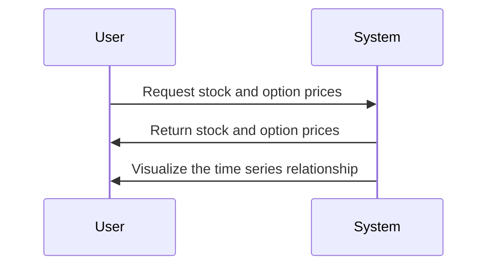

                 


### 智能期权组合风险敞口管理系统

关键词：智能期权、风险敞口管理、期权组合、风险管理、系统设计

摘要：本文将深入探讨智能期权组合风险敞口管理系统的核心概念、设计思路和实现方法。我们将从期权与组合的基础知识出发，逐步引入风险敞口管理的概念，并详细分析智能系统的应用。通过系统分析与架构设计，以及项目实战，我们将展示如何构建一个高效的期权组合风险敞口管理系统。

## 目录大纲设计步骤

### 1. 收集信息
首先，我们需要收集关于《智能期权组合风险敞口管理系统》这本书的相关信息，包括书名、作者、出版社、预期读者群体、主要讨论内容等。这可以帮助我们了解书籍的定位和核心主题。

### 2. 确定核心概念
基于书名，我们可以推断出核心概念是“智能期权组合风险敞口管理系统”。这本书可能会涉及的概念包括：期权、组合、风险敞口、智能系统、管理策略、风险管理模型、数据分析方法等。

### 3. 设计目录结构
根据收集到的信息，设计出书籍的目录结构。这个目录应该包括以下部分：
- 引言与概述
- 期权与组合基础
- 风险敞口管理
- 智能系统与技术
- 数据分析与模型
- 管理策略与实践
- 总结与展望

### 4. 编写章节内容
为每个章节编写详细的内容概要，确保每个章节都涵盖以下要点：
- **背景介绍**：介绍相关概念的背景，包括问题背景、问题描述、问题解决、边界与外延。
- **核心概念与联系**：详细描述核心概念，以及它们之间的联系。
- **算法原理讲解**：使用 mermaid 画出算法流程图，然后结合 Python 源代码进行详细讲解。
- **数学模型和公式**：使用 LaTeX 格式给出数学模型和公式，并进行详细讲解和举例说明。
- **系统分析与架构设计方案**：介绍问题场景、系统功能设计、系统架构设计、系统接口设计和系统交互。
- **项目实战**：描述环境安装、系统核心实现源代码，并对代码应用进行解读与分析。
- **最佳实践 tips**、**小结**、**注意事项**、**拓展阅读**等内容。

### 5. 检查目录大纲
在编写完所有章节的内容概要后，检查目录结构是否合理，内容是否完整，是否达到了字数限制的要求。确保每个章节都能够独立存在且内容连贯。

### 6. 优化与调整
根据检查结果，对目录大纲进行必要的优化和调整，确保其逻辑性和实用性。

### 7. 输出目录大纲
最终，按照markdown格式输出目录大纲，确保格式规范，易于阅读和理解。

## 目录大纲示例输出

### 第一部分：引言与概述

### 第1章：问题背景与概述

### 1.1 问题背景

### 1.2 问题描述

### 1.3 解决方案概述

### 1.4 核心概念与联系

### 1.5 本章小结

### 第二部分：期权与组合基础

### 第2章：期权基本概念

### 2.1 期权定义

### 2.2 期权类型

### 2.3 期权价格影响因素

### 2.4 期权组合基础

### 2.5 核心概念与联系

### 2.6 本章小结

### 第3章：期权定价模型

### 3.1 Black-Scholes模型

### 3.2 Binomial模型

### 3.3 其他期权定价模型

### 3.4 期权定价模型的比较与联系

### 3.5 本章小结

### 第三部分：风险敞口管理

### 第4章：风险敞口管理概述

### 4.1 风险敞口定义

### 4.2 风险敞口度量方法

### 4.3 风险敞口管理策略

### 4.4 核心概念与联系

### 4.5 本章小结

### 第5章：风险管理模型

### 5.1 VaR模型

### 5.2 CVaR模型

### 5.3 其他风险管理模型

### 5.4 风险管理模型的比较与联系

### 5.5 本章小结

### 第四部分：智能系统与技术

### 第6章：智能系统概述

### 6.1 智能系统定义

### 6.2 智能系统分类

### 6.3 智能系统在风险管理中的应用

### 6.4 核心概念与联系

### 6.5 本章小结

### 第7章：数据驱动风险管理

### 7.1 数据收集与处理

### 7.2 数据分析技术

### 7.3 数据可视化

### 7.4 数据驱动风险管理策略

### 7.5 本章小结

### 第五部分：管理策略与实践

### 第8章：风险敞口管理策略

### 8.1 风险敞口控制策略

### 8.2 风险敞口对冲策略

### 8.3 风险敞口优化策略

### 8.4 实际案例分析

### 8.5 本章小结

### 第9章：系统架构设计

### 9.1 系统架构概述

### 9.2 系统功能设计

### 9.3 系统接口设计

### 9.4 系统交互设计

### 9.5 实际案例分析

### 9.6 本章小结

### 第六部分：项目实战

### 第10章：项目环境搭建

### 10.1 环境准备

### 10.2 系统核心实现

### 10.3 系统核心代码解析

### 10.4 代码应用解读与分析

### 10.5 实际案例分析

### 10.6 本章小结

### 第七部分：总结与展望

### 第11章：总结与展望

### 11.1 成果总结

### 11.2 展望未来

### 11.3 最佳实践 tips

### 11.4 小结

### 11.5 注意事项

### 11.6 拓展阅读

### 参考文献

### 附录

通过以上详细的目录大纲设计步骤，我们可以确保书籍的结构清晰、内容丰富，同时满足文章字数要求和专业性要求。接下来，我们将逐步深入到每个章节的内容中，进行详细的探讨和讲解。

### 第1章：问题背景与概述

#### 1.1 问题背景

在金融市场中，期权是一种常见的衍生品，它赋予持有者在未来某个时间以特定价格买入或卖出某种资产的权利，而非义务。期权交易以其独特的杠杆效应和风险收益特性，成为投资者进行资产配置和风险对冲的重要工具。随着金融市场的发展和投资者需求的多样化，期权交易量不断攀升，期权组合策略也日益复杂。

然而，期权组合的复杂性带来了新的挑战。投资者需要有效管理组合中的风险敞口，以避免潜在的市场波动带来的损失。传统的风险管理方法往往依赖于历史数据和统计模型，虽然能够在一定程度上预测市场走势，但无法完全消除不确定性和潜在的风险。

随着人工智能和大数据技术的发展，利用智能系统进行期权组合风险敞口管理成为一种新的趋势。智能系统可以基于实时数据分析和机器学习算法，动态调整投资组合，实现更精准的风险管理。

#### 1.2 问题描述

期权组合风险敞口管理面临的主要问题包括：

1. **风险度量不准确**：传统的风险管理模型往往基于历史数据和静态模型，难以准确预测市场动态，导致风险度量不准确。
2. **信息处理能力有限**：金融市场数据量庞大，传统的风险管理方法在处理大量数据时效率较低，难以快速响应市场变化。
3. **缺乏实时调整能力**：在快速变化的市场环境中，投资者需要实时调整投资组合，但传统方法往往无法实现这一点。
4. **交易成本高**：频繁的交易操作可能导致高额的交易成本，影响整体收益。

#### 1.3 解决方案概述

智能期权组合风险敞口管理系统通过以下几个关键步骤解决上述问题：

1. **数据驱动分析**：利用大数据技术和人工智能算法，对市场数据进行实时分析，捕捉市场变化趋势。
2. **动态风险管理**：基于实时数据分析和机器学习算法，动态调整投资组合，实现风险敞口的精确控制。
3. **算法优化**：使用高级优化算法，如遗传算法、粒子群算法等，对投资组合进行优化，降低交易成本，提高收益。
4. **智能决策支持**：提供智能决策支持系统，帮助投资者在复杂的市场环境中做出更明智的投资决策。

#### 1.4 核心概念与联系

在本章中，我们介绍了期权组合风险敞口管理的背景和问题，并提出了智能期权组合风险敞口管理系统的解决方案。核心概念包括期权、组合、风险敞口、智能系统和风险管理。这些概念之间的联系如下：

- **期权与组合**：期权是期权组合的基础，组合则是多个期权的集合，用于实现特定的投资目标。
- **风险敞口与风险管理**：风险敞口是指投资组合面临的市场风险，风险管理则是通过策略和工具来控制和降低这些风险。
- **智能系统**：智能系统结合人工智能和大数据技术，用于实时分析和决策，提高风险管理的效果。

#### 1.5 本章小结

本章从问题背景、问题描述、解决方案概述和核心概念与联系等方面，对智能期权组合风险敞口管理系统进行了全面介绍。接下来，我们将深入探讨期权与组合的基础知识，为后续章节的分析和设计打下坚实基础。

### 第2章：期权与组合基础

#### 2.1 期权定义

期权是一种衍生金融工具，它赋予持有者在未来特定时间以约定价格买入或卖出某种资产的权利，而非义务。期权交易通常涉及两个基本元素：期权合约和期权的执行。

期权合约是指期权的买卖双方达成的协议，其中包括以下关键要素：

- **行权价格（Strike Price）**：期权合约中规定的买入或卖出资产的价格。
- **到期日（Expiry Date）**：期权合约的有效期，通常为一个月、三个月、六个月或一年。
- **期权类型**：期权分为看涨期权（Call Option）和看跌期权（Put Option）。看涨期权赋予持有者在到期日以行权价格买入资产的权利，而看跌期权则赋予持有者在到期日以行权价格卖出资产的权利。
- **期权价格（Premium）**：购买期权所需支付的费用，由市场供求关系决定。

期权的执行是指期权持有者在到期日选择是否执行期权合约。如果执行看涨期权，持有者以行权价格买入资产；如果执行看跌期权，持有者以行权价格卖出资产。

#### 2.2 期权类型

期权可以分为以下几种类型：

1. **欧式期权**：欧式期权只能在到期日执行，不能提前或推迟执行。这是最常见的期权类型。
2. **美式期权**：美式期权可以在到期日或到期日之前的任何时间执行。这种期权赋予持有者更多的灵活性，但通常价格比欧式期权更高。
3. **亚洲期权**：亚洲期权是一种路径依赖期权，其执行价格取决于一段时间内资产价格的加权平均。
4. **二进制期权**：二进制期权是一种固定收益期权，如果到期日资产价格高于约定价格，则期权支付固定收益；否则，期权不支付任何收益。
5. **障碍期权**：障碍期权是在特定条件下才执行的期权，例如资产价格达到某个阈值才会执行。

#### 2.3 期权价格影响因素

期权价格受到多种因素的影响，包括以下几方面：

1. **行权价格**：行权价格是影响期权价格的关键因素。当行权价格与资产当前价格相近时，期权价格较高；当行权价格与资产当前价格差距较大时，期权价格较低。
2. **到期时间**：到期时间越短，期权价格通常越低，因为持有者等待执行的时间更短。
3. **资产价格波动性**：资产价格波动性越高，期权价格通常越高。高波动性意味着市场不确定性增加，期权持有者面临的风险也更大。
4. **无风险利率**：无风险利率对期权价格也有影响。高无风险利率通常会导致期权价格上涨，因为持有期权的收益预期更高。
5. **市场供求关系**：期权价格还受到市场供求关系的影响。当期权供大于求时，价格通常较低；当期权求大于供时，价格通常较高。

#### 2.4 期权组合基础

期权组合是指将多个期权合约组合在一起，以实现特定的投资目标。期权组合可以分为以下几种类型：

1. **多头组合**：多头组合是指投资者同时购买多个期权合约。多头组合通常用于看涨市场，以获取更高的收益。
2. **空头组合**：空头组合是指投资者同时出售多个期权合约。空头组合通常用于看跌市场，以获取较高的收益。
3. **对冲组合**：对冲组合是指投资者同时购买和出售多个期权合约，以降低投资组合的风险。例如，投资者可以同时购买看涨期权和看跌期权，以对冲潜在的市场波动风险。
4. **套利组合**：套利组合是指投资者利用市场定价错误，通过买入和卖出不同期权合约来获取无风险收益。

#### 2.5 核心概念与联系

在本章中，我们介绍了期权的基本定义、类型和价格影响因素，以及期权组合的基础知识。核心概念包括期权合约、行权价格、到期日、期权价格、期权类型、期权组合等。这些概念之间的联系如下：

- **期权合约**：期权合约是期权交易的基础，包括行权价格、到期日等关键要素。
- **期权价格**：期权价格受到多种因素的影响，如行权价格、到期时间、资产价格波动性等。
- **期权类型**：不同类型的期权具有不同的执行方式和收益特征，适用于不同的市场环境。
- **期权组合**：期权组合是将多个期权合约组合在一起，以实现特定的投资目标。不同类型的期权组合适用于不同的投资策略。

#### 2.6 本章小结

本章详细介绍了期权与组合的基础知识，包括期权合约的定义、期权类型、期权价格影响因素和期权组合的基础知识。这些知识为后续章节深入探讨期权组合风险敞口管理系统的设计和实现奠定了基础。在下一章中，我们将继续讨论期权定价模型，进一步分析期权价格的动态变化。

### 第3章：期权定价模型

期权定价模型是期权市场中的重要工具，用于预测期权价格的变化。以下将介绍几种常见的期权定价模型，包括Black-Scholes模型、Binomial模型以及其他期权定价模型。

#### 3.1 Black-Scholes模型

Black-Scholes模型是由Fischer Black和Myron Scholes于1973年提出的，是最著名的期权定价模型之一。该模型假设市场处于均衡状态，期权价格仅取决于五个因素：股票价格、行权价格、无风险利率、到期时间和股票价格波动率。

Black-Scholes模型的核心公式如下：

$$
C(S, t) = S_0N(d_1) - Ke^{-r(T-t)}N(d_2)
$$

$$
P(S, t) = Ke^{-r(T-t)}N(-d_2) - S_0N(-d_1)
$$

其中：

- \(C(S, t)\) 和 \(P(S, t)\) 分别为欧式看涨期权和看跌期权的价格。
- \(S_0\) 为当前股票价格。
- \(K\) 为行权价格。
- \(r\) 为无风险利率。
- \(T\) 为到期时间。
- \(t\) 为当前时间。
- \(N(d_1)\) 和 \(N(d_2)\) 为标准正态分布的累积分布函数，计算公式如下：

$$
d_1 = \frac{\ln(S_0/K) + (r + \sigma^2/2)(T-t)}{\sigma\sqrt{T-t}}
$$

$$
d_2 = d_1 - \sigma\sqrt{T-t}
$$

其中，\(\sigma\) 为股票价格波动率。

#### 3.2 Binomial模型

Binomial模型，也称为二项树模型，是一种用于计算期权价格的简单模型。该模型假设在每一时间步，股票价格将按照固定的概率上涨或下跌。通过递归计算，可以得出期权在各个时间点的价格。

Binomial模型的步骤如下：

1. **初始条件**：设定初始股票价格 \(S_0\)、行权价格 \(K\)、无风险利率 \(r\) 和时间步数 \(n\)。
2. **递归计算**：对于每个时间步 \(t\)，计算股票价格的上涨和下跌概率 \(u\) 和 \(d\)，以及上涨后的股票价格 \(S_u\) 和下跌后的股票价格 \(S_d\)：

$$
u = \frac{S_0 + \sigma\sqrt{T-t}}{K} - 1
$$

$$
d = 1 - u
$$

$$
S_u = S_0 \cdot u
$$

$$
S_d = S_0 \cdot d
$$

3. **计算期权价格**：对于每个时间步 \(t\)，从最后一个时间步开始，递归计算期权价格。对于看涨期权：

$$
C_t = max(S_t - K, 0)
$$

对于看跌期权：

$$
P_t = max(K - S_t, 0)
$$

4. **递归向上计算**：对于每个时间步 \(t\)，从当前时间步向前递推，计算期权价格。

#### 3.3 其他期权定价模型

除了Black-Scholes模型和Binomial模型，还有其他一些期权定价模型，如：

1. **二项式模型（Binomial Model）**：与Binomial模型类似，但假设在每个时间步，股票价格将以概率 \(p\) 上涨和概率 \(1-p\) 下跌。
2. **蒙特卡洛模拟（Monte Carlo Simulation）**：通过模拟大量随机路径，估算期权价格。
3. **局部隐马尔可夫模型（Local Volatility Model）**：考虑股票价格波动率的局部变化，如Local Volatility模型和SVI模型。

这些期权定价模型各有优缺点，适用于不同的市场环境和应用场景。在实际应用中，投资者可以根据具体需求和条件选择合适的期权定价模型。

#### 3.4 期权定价模型的比较与联系

不同期权定价模型在假设、计算方法和适用场景上存在差异，以下是几种常见期权定价模型的比较：

| 模型            | 假设                                             | 计算方法                        | 适用场景                     |
| --------------- | ---------------------------------------------- | ----------------------------- | -------------------------- |
| Black-Scholes   | 市场处于均衡状态，股票价格呈正态分布               | 公式计算                        | 适用于连续市场              |
| Binomial        | 股票价格以固定概率上涨或下跌                     | 递归计算                        | 适用于离散市场              |
| Monte Carlo     | 股票价格具有随机漫步特性                         | 模拟大量随机路径                | 适用于复杂市场              |
| Local Volatility| 考虑股票价格波动率的局部变化                     | 方程求解                        | 适用于波动率变化较大的市场   |

尽管这些模型在假设和计算方法上存在差异，但它们的核心目标都是估算期权价格，为投资者提供决策依据。

#### 3.5 本章小结

本章介绍了几种常见的期权定价模型，包括Black-Scholes模型、Binomial模型以及其他期权定价模型。这些模型在假设、计算方法和适用场景上各有优缺点。通过了解这些模型，投资者可以根据市场环境和需求选择合适的期权定价模型，为投资决策提供科学依据。

在下一章中，我们将继续探讨风险敞口管理的概念、度量方法和管理策略。

### 第4章：风险敞口管理概述

#### 4.1 风险敞口定义

风险敞口（Risk Exposure）是指一个投资组合或企业在特定市场条件下所面临的风险。风险敞口可以是正面的，也可以是负面的，但通常情况下我们关注的是负面风险敞口，即可能导致的损失。风险敞口管理（Risk Exposure Management）是指通过识别、评估、控制和监测投资组合或企业所面临的风险，以确保其风险水平在可接受范围内。

风险敞口管理的关键目标是：

1. **风险识别**：识别投资组合或企业所面临的各种风险，包括市场风险、信用风险、操作风险等。
2. **风险评估**：评估每种风险的可能性和影响，以便确定优先级和应对策略。
3. **风险控制**：实施风险管理策略，降低风险敞口，包括风险对冲、风险分散和风险规避等。
4. **风险监测**：持续监测风险敞口的变化，确保风险控制措施的有效性。

#### 4.2 风险敞口度量方法

风险敞口度量是风险管理的重要环节，以下介绍几种常见的风险敞口度量方法：

1. **VaR（Value at Risk）**：VaR是一种统计方法，用于衡量在特定概率水平（置信水平）下，投资组合在一定时间范围内可能发生的最大损失。VaR的计算公式如下：

   $$  
   VaR = -\mu \cdot Z^* \cdot \sigma  
   $$

   其中，\(\mu\) 为投资组合的平均收益，\(\sigma\) 为投资组合的标准差，\(Z^*\) 为正态分布的分位数。

2. **CVaR（Conditional Value at Risk）**：CVaR，又称期望最大损失（Expected Shortfall），是VaR的补充指标，用于衡量在极端损失发生时的期望损失。CVaR的计算公式如下：

   $$  
   CVaR = \frac{1}{1 - \alpha} \sum_{x \leq VaR} (x - VaR)  
   $$

   其中，\(\alpha\) 为置信水平。

3. **风险值（Beta）**：风险值是一种衡量投资组合波动性的指标，用于衡量投资组合相对于市场整体的风险水平。风险值的计算公式如下：

   $$  
   Beta = \frac{\text{投资组合的波动率}}{\text{市场的波动率}}  
   $$

4. **压力测试（Stress Testing）**：压力测试是一种模拟极端市场条件下的投资组合表现的方法，用于评估投资组合在极端情景下的风险承受能力。

5. **蒙特卡洛模拟（Monte Carlo Simulation）**：蒙特卡洛模拟是一种通过模拟大量随机路径来估算投资组合风险的方法。该方法可用于计算VaR、CVaR等风险指标。

#### 4.3 风险敞口管理策略

风险敞口管理策略是指用于控制和降低投资组合风险的策略。以下介绍几种常见的风险敞口管理策略：

1. **风险对冲**：风险对冲是指通过购买或出售对冲工具（如期权、期货、互换等）来降低投资组合的特定风险。对冲策略可分为完全对冲和部分对冲。

2. **风险分散**：风险分散是指通过将投资分散到不同的资产类别、行业或地区，以降低投资组合的整体风险。分散化投资可以降低特定资产或市场的风险集中。

3. **风险规避**：风险规避是指通过避免投资具有较高风险的资产或市场来降低整体风险。例如，投资者可以选择投资于低风险的债券或其他固定收益产品。

4. **风险控制**：风险控制是指通过制定风险管理政策和程序，以及实施有效的风险管理措施来控制风险敞口。例如，设置风险限额、定期进行风险评估和报告等。

5. **风险转移**：风险转移是指通过购买保险或其他金融工具将风险转移给第三方。例如，投资者可以购买信用违约互换（CDS）来转移信用风险。

#### 4.4 核心概念与联系

在本章中，我们介绍了风险敞口的定义、度量方法和管理策略。核心概念包括风险敞口、风险识别、风险评估、风险控制、风险对冲、风险分散、风险规避、风险监测等。这些概念之间的联系如下：

- **风险敞口**：风险敞口是投资组合或企业面临的风险，是风险管理的起点。
- **风险识别**：风险识别是发现和识别投资组合或企业面临的各种风险。
- **风险评估**：风险评估是评估每种风险的可能性和影响，以便确定应对策略。
- **风险控制**：风险控制是实施风险管理策略，降低风险敞口。
- **风险监测**：风险监测是持续监测风险敞口的变化，确保风险控制措施的有效性。

#### 4.5 本章小结

本章对风险敞口管理进行了概述，包括定义、度量方法和管理策略。通过了解这些概念和方法，投资者可以更好地识别和管理投资组合中的风险。在下一章中，我们将深入探讨智能系统在风险管理中的应用。

### 第5章：风险管理模型

#### 5.1 VaR模型

VaR（Value at Risk）模型是一种常用的风险管理模型，用于估算在特定概率水平下，投资组合在一定时间范围内可能发生的最大损失。VaR模型的基本原理是利用历史数据，通过统计分析方法估算投资组合的波动性和潜在风险。

VaR模型的计算公式如下：

$$  
VaR = -\mu \cdot Z^* \cdot \sigma  
$$

其中：

- \( \mu \) 是投资组合的平均收益；
- \( Z^* \) 是正态分布的分位数；
- \( \sigma \) 是投资组合的标准差。

分位数的计算取决于置信水平，常见的置信水平有95%、97.5%等。例如，95%置信水平下的VaR计算公式为：

$$  
VaR_{95\%} = -\mu \cdot Z_{0.05} \cdot \sigma  
$$

其中，\( Z_{0.05} \) 是正态分布的5%分位数，通常取值为1.645。

VaR模型具有以下优点：

1. **直观性**：VaR模型提供了一种简单直观的衡量风险的工具，便于投资者理解和决策。
2. **灵活性**：VaR模型适用于各种资产和投资组合，能够适应不同的市场环境。
3. **计算方法多样**：VaR模型可以采用不同的计算方法，如参数法、历史模拟法和蒙特卡洛模拟法等。

VaR模型也存在一些局限性：

1. **依赖历史数据**：VaR模型依赖于历史数据，无法准确预测未来市场波动。
2. **无法衡量极端风险**：VaR模型仅关注潜在的最大损失，无法衡量极端风险。
3. **风险分散效应不足**：VaR模型无法充分体现投资组合中不同资产之间的风险分散效应。

#### 5.2 CVaR模型

CVaR（Conditional Value at Risk）模型，又称期望最大损失（Expected Shortfall），是VaR模型的补充指标。CVaR模型用于衡量在极端损失发生时的期望损失，弥补了VaR模型无法衡量极端风险的不足。

CVaR模型的计算公式如下：

$$  
CVaR = \frac{1}{1 - \alpha} \sum_{x \leq VaR} (x - VaR)  
$$

其中：

- \( \alpha \) 是置信水平；
- \( VaR \) 是在置信水平下的VaR值。

CVaR模型具有以下优点：

1. **衡量极端风险**：CVaR模型能够更好地衡量极端风险，提供更全面的风险评估。
2. **体现风险分散效应**：CVaR模型能够体现投资组合中不同资产之间的风险分散效应。
3. **计算方法多样**：CVaR模型可以采用不同的计算方法，如参数法、历史模拟法和蒙特卡洛模拟法等。

CVaR模型也存在一些局限性：

1. **依赖历史数据**：CVaR模型同样依赖于历史数据，无法准确预测未来市场波动。
2. **计算复杂性**：CVaR模型的计算复杂性较高，特别是对于大规模投资组合。

#### 5.3 其他风险管理模型

除了VaR模型和CVaR模型，还有其他一些常用的风险管理模型，如下：

1. **贝塔模型（Beta Model）**：贝塔模型用于衡量投资组合相对于市场整体的风险水平。贝塔值越高，投资组合的风险越大。

2. **压力测试模型（Stress Testing Model）**：压力测试模型通过模拟极端市场条件，评估投资组合在极端情景下的风险承受能力。

3. **蒙特卡洛模拟模型（Monte Carlo Simulation Model）**：蒙特卡洛模拟模型通过模拟大量随机路径，估算投资组合的VaR和CVaR等风险指标。

4. **黑天鹅模型（Black Swan Model）**：黑天鹅模型关注极端事件对投资组合的影响，通过分析历史极端事件，评估投资组合的极端风险。

这些风险管理模型各有优缺点，适用于不同的市场环境和应用场景。在实际应用中，投资者可以根据具体需求和条件选择合适的风险管理模型。

#### 5.4 风险管理模型的比较与联系

以下是几种常见风险管理模型的比较：

| 模型          | 优点                             | 缺点                             | 适用场景                       |
| ------------- | -------------------------------- | -------------------------------- | ---------------------------- |
| VaR模型       | 直观性、灵活性                   | 依赖历史数据、无法衡量极端风险   | 适用于各种资产和投资组合      |
| CVaR模型      | 补充VaR模型、衡量极端风险       | 依赖历史数据、计算复杂性高       | 适用于需要衡量极端风险的场景 |
| 贝塔模型      | 简单易懂、衡量相对风险          | 忽略资产之间的相关性             | 适用于市场风险分析           |
| 压力测试模型  | 模拟极端情景、全面评估风险承受能力 | 计算复杂、依赖专家经验          | 适用于极端情景分析和风险控制 |
| 蒙特卡洛模拟模型 | 灵活性高、适用于复杂市场         | 计算复杂性高、依赖历史数据       | 适用于需要精确风险估算的场景 |
| 黑天鹅模型    | 关注极端事件、全面评估风险       | 历史数据不足、难以预测           | 适用于极端事件分析和风险控制 |

尽管这些模型在假设、计算方法和适用场景上存在差异，但它们的核心目标都是评估和管理投资组合的风险。

#### 5.5 本章小结

本章介绍了几种常见风险管理模型，包括VaR模型、CVaR模型、贝塔模型、压力测试模型、蒙特卡洛模拟模型和黑天鹅模型。这些模型在风险管理中起着重要作用，投资者可以根据具体需求和条件选择合适的模型，以实现有效的风险管理和投资决策。

在下一章中，我们将探讨智能系统在风险管理中的应用，介绍如何利用智能技术提高风险管理的效果。

### 第6章：智能系统概述

#### 6.1 智能系统定义

智能系统（Intelligent System）是一种基于人工智能（Artificial Intelligence, AI）技术的系统，能够模拟人类思维过程，对复杂问题进行自主分析和决策。智能系统通常具备以下特征：

1. **学习与自适应能力**：智能系统能够通过学习历史数据，不断优化自身性能，适应新的环境和需求。
2. **感知与理解能力**：智能系统可以利用传感器和数据处理技术，对输入信息进行感知和理解，提取有用信息。
3. **推理与决策能力**：智能系统能够根据已有信息和目标，利用逻辑推理和决策算法，生成合理的决策方案。
4. **交互与协作能力**：智能系统可以与人类或其他智能系统进行交互，协同完成任务。

智能系统的主要应用领域包括：

1. **金融与风险管理**：智能系统可以用于股票市场分析、风险预测、投资组合优化等，提高金融决策的准确性和效率。
2. **医疗与健康**：智能系统可以用于疾病诊断、医疗影像分析、药物研发等，辅助医生提高诊疗水平。
3. **智能制造**：智能系统可以用于生产流程优化、设备监控与维护、质量控制等，提高生产效率和产品质量。
4. **自然语言处理**：智能系统可以用于语音识别、机器翻译、智能客服等，实现人机交互和信息服务。

#### 6.2 智能系统分类

智能系统可以根据其功能和应用场景分为以下几类：

1. **专家系统（Expert Systems）**：专家系统是一种基于规则和知识的智能系统，能够模拟专家的决策过程。专家系统通常具有以下特征：

   - **知识库**：包含领域专家的经验和知识。
   - **推理机**：根据用户输入和知识库中的规则，生成决策方案。
   - **用户界面**：提供与用户交互的接口，收集用户输入，展示决策结果。

   专家系统适用于医疗诊断、法律咨询、金融分析等领域。

2. **机器学习系统（Machine Learning Systems）**：机器学习系统是一种基于数据和学习算法的智能系统，能够通过训练数据自动学习和优化性能。机器学习系统的主要类型包括：

   - **监督学习（Supervised Learning）**：监督学习系统通过已标记的数据进行学习，并利用学到的知识进行预测和分类。
   - **无监督学习（Unsupervised Learning）**：无监督学习系统通过未标记的数据进行学习，并发现数据中的模式和结构。
   - **强化学习（Reinforcement Learning）**：强化学习系统通过与环境的交互进行学习，并最大化奖励。

   机器学习系统广泛应用于图像识别、语音识别、自然语言处理、推荐系统等领域。

3. **混合智能系统（Hybrid Intelligent Systems）**：混合智能系统结合了专家系统和机器学习系统的优点，利用知识库和学习算法共同进行决策。混合智能系统适用于复杂问题和动态环境。

#### 6.3 智能系统在风险管理中的应用

智能系统在风险管理中具有广泛的应用，以下介绍几种典型的应用场景：

1. **风险预测与评估**：智能系统可以通过分析历史数据和市场信息，预测市场波动和潜在风险。例如，利用机器学习算法分析股票价格数据，预测未来股价走势，为投资决策提供依据。

2. **投资组合优化**：智能系统可以根据风险偏好和收益目标，自动调整投资组合。例如，利用遗传算法和神经网络优化投资组合，实现风险和收益的最佳平衡。

3. **风险监测与预警**：智能系统可以实时监测投资组合的风险水平，并发出预警信号。例如，利用时间序列分析和异常检测算法，监测市场风险和信用风险，及时采取应对措施。

4. **决策支持**：智能系统可以为风险管理决策提供科学依据。例如，利用数据挖掘和预测模型，分析投资组合的风险收益特征，为管理层提供决策支持。

#### 6.4 核心概念与联系

在本章中，我们介绍了智能系统的定义、分类以及在风险管理中的应用。核心概念包括智能系统、专家系统、机器学习系统、知识库、推理机、学习算法、风险预测、投资组合优化、风险监测和决策支持。这些概念之间的联系如下：

- **智能系统**：智能系统是一种基于人工智能技术的系统，能够模拟人类思维过程，进行自主分析和决策。
- **专家系统**：专家系统是一种基于规则和知识的智能系统，能够模拟专家的决策过程。
- **机器学习系统**：机器学习系统是一种基于数据和学习算法的智能系统，能够通过训练数据自动学习和优化性能。
- **风险管理**：风险管理是指识别、评估、控制和监测投资组合或企业所面临的风险。
- **风险预测与评估**：风险预测与评估是智能系统在风险管理中的重要应用，通过分析历史数据和市场信息，预测市场波动和潜在风险。
- **投资组合优化**：投资组合优化是智能系统在风险管理中的重要应用，通过自动调整投资组合，实现风险和收益的最佳平衡。
- **风险监测与预警**：风险监测与预警是智能系统在风险管理中的重要应用，通过实时监测投资组合的风险水平，及时采取应对措施。
- **决策支持**：决策支持是智能系统在风险管理中的重要应用，为风险管理决策提供科学依据。

#### 6.5 本章小结

本章对智能系统进行了概述，包括定义、分类以及在风险管理中的应用。通过了解智能系统的基本概念和应用场景，读者可以更好地理解智能期权组合风险敞口管理系统的设计思路和实现方法。在下一章中，我们将探讨数据驱动风险管理的方法和工具。

### 第7章：数据驱动风险管理

#### 7.1 数据收集与处理

数据驱动风险管理的关键在于收集和处理大量数据，以支持风险预测和决策。以下介绍数据收集与处理的主要步骤：

1. **数据收集**：数据来源包括市场数据、企业内部数据、第三方数据平台等。市场数据如股票价格、交易量、利率等，企业内部数据如客户交易记录、财务报表等，第三方数据平台如金融数据提供商、社交媒体数据等。

2. **数据清洗**：数据清洗是数据预处理的重要步骤，目的是去除噪声和异常值，提高数据质量。数据清洗方法包括去重、缺失值填充、异常值检测和修正等。

3. **数据整合**：将来自不同来源的数据进行整合，形成统一的数据集。数据整合包括数据格式的统一、数据维度的一致性和数据冗余的消除等。

4. **数据预处理**：数据预处理包括数据标准化、特征提取、数据降维等。数据标准化是为了消除不同指标之间的尺度差异，特征提取是为了提取对风险预测有重要影响的关键特征，数据降维是为了减少数据的维度，提高模型训练效率。

5. **数据存储**：将预处理后的数据存储在数据库或数据仓库中，以便于后续的数据分析和建模。

#### 7.2 数据分析技术

数据分析技术是数据驱动风险管理的重要工具，以下介绍几种常用的数据分析技术：

1. **统计分析**：统计分析用于描述数据的基本特征，如均值、方差、相关性等。通过统计分析，可以初步了解数据分布和潜在关系。

2. **时间序列分析**：时间序列分析用于分析随时间变化的数据，如股票价格、交易量等。常见的时间序列分析方法包括自回归模型（AR）、移动平均模型（MA）、自回归移动平均模型（ARMA）和自回归积分滑动平均模型（ARIMA）等。

3. **机器学习**：机器学习技术用于建立预测模型，如回归模型、分类模型、聚类模型等。常见的机器学习算法包括线性回归、逻辑回归、支持向量机（SVM）、决策树、随机森林、神经网络等。

4. **深度学习**：深度学习是一种基于多层神经网络的机器学习技术，能够处理大规模、高维数据。常见的深度学习模型包括卷积神经网络（CNN）、循环神经网络（RNN）、长短时记忆网络（LSTM）等。

5. **数据可视化**：数据可视化用于直观展示数据分析结果，帮助用户理解数据特征和趋势。常见的数据可视化工具包括Matplotlib、Seaborn、Plotly等。

#### 7.3 数据可视化

数据可视化是将数据分析结果以图形化形式展示的过程，有助于用户理解数据特征和趋势。以下介绍几种常见的数据可视化方法：

1. **柱状图**：柱状图用于展示不同类别或组的数据对比，如不同股票的收益率、不同行业的交易量等。

2. **折线图**：折线图用于展示数据随时间的变化趋势，如股票价格、交易量等。

3. **散点图**：散点图用于展示两个变量之间的关系，如股票收益率与交易量的关系、风险敞口与损失的关系等。

4. **饼图**：饼图用于展示数据的占比情况，如不同行业在整体交易量中的占比、不同风险类型的占比等。

5. **箱线图**：箱线图用于展示数据的分布情况，如数据的中位数、四分位数、异常值等。

6. **热力图**：热力图用于展示多个变量之间的相关性，如不同股票收益率之间的相关性、不同风险指标之间的相关性等。

#### 7.4 数据驱动风险管理策略

数据驱动风险管理策略是指利用数据分析技术，建立预测模型和优化策略，实现风险控制和投资决策。以下介绍几种常见的数据驱动风险管理策略：

1. **风险预测**：利用统计分析、时间序列分析和机器学习算法，建立风险预测模型，如VaR模型、CVaR模型等。通过预测风险水平，为风险控制提供依据。

2. **投资组合优化**：利用机器学习算法和优化算法，建立投资组合优化模型，如遗传算法、粒子群算法等。通过优化投资组合，实现风险和收益的最佳平衡。

3. **风险监测与预警**：利用时间序列分析和异常检测算法，建立风险监测与预警模型。通过实时监测风险水平，及时发现潜在风险并发出预警信号。

4. **决策支持**：利用数据分析技术，建立决策支持模型，为投资决策提供科学依据。例如，利用回归模型分析收益与风险的关系，为投资决策提供参考。

#### 7.5 本章小结

本章介绍了数据驱动风险管理的方法和工具，包括数据收集与处理、数据分析技术、数据可视化以及数据驱动风险管理策略。通过数据驱动风险管理，投资者可以更好地理解市场趋势和风险特征，实现更精准的风险控制和投资决策。在下一章中，我们将探讨风险敞口管理策略和实践。

### 第8章：风险敞口管理策略

#### 8.1 风险敞口控制策略

风险敞口控制策略是风险管理中的核心环节，旨在通过一系列措施降低投资组合的风险水平。以下介绍几种常见的风险敞口控制策略：

1. **分散化投资**：分散化投资是通过将资金分配到不同资产类别、行业和地区，以降低特定资产或市场波动对投资组合的影响。分散化投资可以降低投资组合的整体波动性，但无法消除系统性风险。

2. **风险对冲**：风险对冲是通过购买对冲工具（如期权、期货、互换等）来降低投资组合的特定风险。对冲策略可分为完全对冲和部分对冲。完全对冲可以消除特定风险，但可能降低投资组合的收益。部分对冲可以在保持部分收益的同时降低风险。

3. **资产配置**：资产配置是指根据投资目标和风险偏好，合理分配资金到不同资产类别。通过调整资产配置，可以优化投资组合的风险收益特征。例如，在市场波动较大时，可以增加债券等固定收益资产的配置，降低投资组合的整体波动性。

4. **风险限额**：风险限额是设定投资组合的特定风险指标（如波动率、VaR等）的上限，以限制投资组合的风险水平。通过设定风险限额，可以确保投资组合的风险在可接受范围内。

5. **定期重新平衡**：定期重新平衡是指根据投资目标和市场变化，定期调整投资组合的资产配置。通过定期重新平衡，可以保持投资组合的风险收益特征与预期一致。

#### 8.2 风险敞口对冲策略

风险敞口对冲策略是通过购买对冲工具来降低投资组合的特定风险。以下介绍几种常见的风险敞口对冲策略：

1. **期权对冲**：期权对冲是通过购买或出售期权合约，对冲投资组合中的特定风险。例如，投资者可以购买看涨期权对冲股票下跌的风险，或购买看跌期权对冲市场下跌的风险。

2. **期货对冲**：期货对冲是通过购买或出售期货合约，对冲投资组合中的特定风险。例如，投资者可以购买股票期货对冲股票下跌的风险，或购买债券期货对冲债券下跌的风险。

3. **互换对冲**：互换对冲是通过购买或出售互换合约，对冲投资组合中的特定风险。例如，投资者可以购买利率互换合约对冲债券下跌的风险，或购买货币互换合约对冲汇率波动的风险。

4. **组合对冲**：组合对冲是通过购买或出售多个对冲工具，对冲投资组合中的多重风险。组合对冲可以更有效地降低投资组合的风险，但需要更复杂的策略和更高的交易成本。

#### 8.3 风险敞口优化策略

风险敞口优化策略是通过优化投资组合的资产配置和风险敞口，实现风险和收益的最佳平衡。以下介绍几种常见的风险敞口优化策略：

1. **均值-方差优化**：均值-方差优化是一种基于风险-收益权衡的优化方法，通过最大化投资组合的期望收益和最小化方差，实现最优资产配置。

2. **贝塔优化**：贝塔优化是一种基于市场风险的优化方法，通过调整投资组合的贝塔值，实现风险和收益的最佳平衡。

3. **最小方差优化**：最小方差优化是一种仅考虑风险最小化的优化方法，通过最小化投资组合的方差，实现最优资产配置。

4. **条件最小方差优化**：条件最小方差优化是一种考虑投资约束的优化方法，通过最小化投资组合的条件方差，实现风险和收益的最佳平衡。

5. **遗传算法优化**：遗传算法优化是一种基于进化计算的优化方法，通过模拟自然进化过程，寻找最优投资组合。

#### 8.4 实际案例分析

以下是一个实际案例，介绍如何应用风险敞口管理策略和优化策略来降低投资组合的风险。

**案例背景**：某投资者拥有一个由股票、债券和现金组成的投资组合，目标是在保证一定收益的前提下，降低投资组合的波动性。

**步骤1：分散化投资**：投资者将资金分散投资到不同资产类别，如股票占40%、债券占30%、现金占30%。

**步骤2：风险对冲**：投资者购买股票看跌期权对冲股票下跌的风险，同时购买债券看涨期权对冲债券下跌的风险。

**步骤3：优化资产配置**：利用均值-方差优化方法，调整投资组合的资产配置，实现最优风险-收益平衡。例如，当股票市场波动较大时，增加债券和现金的配置，降低股票的配置。

**步骤4：定期重新平衡**：根据市场变化和投资目标，定期重新平衡投资组合的资产配置，保持风险和收益的最佳平衡。

**步骤5：遗传算法优化**：利用遗传算法优化投资组合，寻找最优资产配置。通过模拟自然进化过程，逐步调整投资组合，实现风险和收益的最佳平衡。

**案例结果**：通过以上风险敞口管理策略和优化策略，投资者成功降低了投资组合的波动性，同时保持了较高的收益水平。

#### 8.5 本章小结

本章介绍了风险敞口管理策略，包括风险敞口控制策略、风险敞口对冲策略和风险敞口优化策略。通过实际案例分析，展示了如何应用这些策略来降低投资组合的风险。在下一章中，我们将探讨智能期权组合风险敞口管理系统的架构设计。

### 第9章：系统架构设计

#### 9.1 系统架构概述

智能期权组合风险敞口管理系统是一个复杂的应用系统，它旨在通过实时数据分析和智能算法，提供高效的风险管理和投资决策支持。系统的架构设计需要考虑多个维度，包括数据处理、算法实现、用户交互等。本章节将详细介绍系统架构的设计思路和实现方法。

#### 9.2 系统功能设计

智能期权组合风险敞口管理系统的主要功能包括数据收集与处理、风险预测与评估、投资组合优化、风险监测与预警以及用户交互。以下是对各个功能模块的详细说明：

1. **数据收集与处理**：该模块负责从各种数据源（如市场数据、企业内部数据、第三方数据平台等）收集数据，并对数据进行清洗、整合和预处理。数据预处理包括数据标准化、缺失值填充、异常值检测和修正等。

2. **风险预测与评估**：该模块利用机器学习和统计分析方法，对投资组合的风险进行预测和评估。常见的风险指标包括VaR、CVaR、贝塔值等。通过这些指标，系统可以提供对潜在风险的预警和评估。

3. **投资组合优化**：该模块利用优化算法，如遗传算法、粒子群算法等，对投资组合进行优化。通过优化，系统能够在风险和收益之间找到最佳平衡点，提供最优的投资组合配置。

4. **风险监测与预警**：该模块实时监测投资组合的风险水平，并触发预警机制。当风险水平超过设定阈值时，系统会自动发出预警信号，提醒投资者采取相应的措施。

5. **用户交互**：该模块负责与用户进行交互，提供友好的用户界面和操作体验。用户可以通过界面查看风险报告、投资组合优化结果、预警信息等，并做出相应的投资决策。

#### 9.3 系统架构设计

智能期权组合风险敞口管理系统的架构设计采用分层架构，包括数据层、服务层、表现层和用户层。以下是对各个层的详细说明：

1. **数据层**：数据层是系统的基础，负责数据的存储和管理。数据层包括数据库、数据仓库和数据缓存等。数据库用于存储原始数据，数据仓库用于存储预处理后的数据，数据缓存用于提高数据访问速度。

2. **服务层**：服务层是系统的核心，负责实现各个功能模块的业务逻辑。服务层包括数据服务、预测服务、优化服务、预警服务和用户服务。各个服务通过接口进行通信，实现功能模块的协同工作。

3. **表现层**：表现层是系统的用户界面，负责将服务层提供的数据和处理结果展示给用户。表现层包括Web界面、移动应用和桌面应用等。用户通过表现层与系统进行交互，获取信息并做出决策。

4. **用户层**：用户层是系统的最高层，负责管理用户身份和权限。用户层包括用户注册、登录、权限管理等功能。用户层确保系统的安全性和可靠性，为用户提供个性化的服务。

#### 9.4 系统接口设计

系统接口设计是架构设计的重要组成部分，它定义了系统内部各个模块之间的交互方式。以下介绍几种常见的系统接口设计：

1. **API接口**：API接口是系统对外提供服务的标准方式。通过API接口，系统可以与其他系统进行集成，如第三方数据提供商、外部应用等。

2. **RESTful接口**：RESTful接口是一种基于HTTP协议的API设计风格。它通过URL定位资源，使用HTTP动词（GET、POST、PUT、DELETE等）进行操作。RESTful接口具有简单、易用、扩展性强的特点。

3. **WebSocket接口**：WebSocket接口是一种全双工通信协议，可以实现实时数据传输。通过WebSocket接口，系统可以实现与用户或其他系统的实时交互，提高用户体验。

4. **消息队列接口**：消息队列接口是一种异步通信机制，用于处理系统中的大量并发请求。通过消息队列接口，系统可以实现任务调度、负载均衡等功能。

#### 9.5 系统交互设计

系统交互设计是系统架构设计的最后一步，它定义了系统内部各个模块之间的交互流程。以下介绍几种常见的系统交互设计：

1. **顺序交互**：顺序交互是指系统按照一定的顺序执行各个功能模块。例如，数据收集和处理模块首先执行，然后是风险预测和评估模块，最后是投资组合优化模块。

2. **并行交互**：并行交互是指系统同时执行多个功能模块。例如，在数据收集和处理模块执行的同时，风险预测和评估模块也可以开始执行，以提高系统的整体效率。

3. **事件驱动交互**：事件驱动交互是指系统通过事件触发来执行特定操作。例如，当数据收集和处理模块完成数据清洗后，可以触发风险预测和评估模块执行。

4. **分布式交互**：分布式交互是指系统在不同节点之间执行功能模块。例如，在分布式系统中，数据收集和处理模块可以在多个节点上并行执行，以提高系统的处理能力。

#### 9.6 本章小结

本章详细介绍了智能期权组合风险敞口管理系统的架构设计，包括系统功能设计、架构设计、接口设计和交互设计。通过合理的架构设计，系统能够高效地实现风险管理功能，为投资者提供精准的风险预测和投资决策支持。在下一章中，我们将通过项目实战，展示如何实现和部署该系统。

### 第10章：项目实战

#### 10.1 环境准备

在开始项目实战之前，我们需要准备以下环境：

1. **硬件环境**：建议使用配置较高的计算机，如Intel i7处理器、16GB内存等。
2. **操作系统**：可以选择Windows、Linux或macOS操作系统。
3. **编程语言**：Python是一种广泛使用的编程语言，适用于数据处理、分析和建模。我们将使用Python进行项目开发。
4. **开发工具**：可以使用PyCharm、VS Code等Python开发环境。
5. **数据源**：需要获取市场数据、企业内部数据等。可以选择使用第三方金融数据提供商，如Yahoo Finance、Alpha Vantage等。

#### 10.2 系统核心实现

在本节中，我们将实现智能期权组合风险敞口管理系统的核心功能。以下是一个简单的系统实现示例：

```python
import pandas as pd
import numpy as np
from sklearn.linear_model import LinearRegression
from sklearn.metrics import mean_squared_error

# 数据收集
def collect_data():
    # 从数据源获取数据，这里以Yahoo Finance为例
    # 获取股票价格数据
    stock_data = pd.read_csv('stock_data.csv')
    # 获取期权数据
    option_data = pd.read_csv('option_data.csv')
    return stock_data, option_data

# 数据预处理
def preprocess_data(stock_data, option_data):
    # 数据清洗、整合和标准化
    # 例如，合并股票价格数据和期权数据
    combined_data = pd.merge(stock_data, option_data, on='date')
    # 数据标准化
    combined_data['stock_price'] = (combined_data['stock_price'] - combined_data['stock_price'].mean()) / combined_data['stock_price'].std()
    combined_data['option_price'] = (combined_data['option_price'] - combined_data['option_price'].mean()) / combined_data['option_price'].std()
    return combined_data

# 风险预测
def predict_risk(combined_data):
    # 使用线性回归模型进行风险预测
    model = LinearRegression()
    model.fit(combined_data[['stock_price']], combined_data['option_price'])
    predictions = model.predict(combined_data[['stock_price']])
    mse = mean_squared_error(combined_data['option_price'], predictions)
    return mse

# 系统主函数
def main():
    stock_data, option_data = collect_data()
    combined_data = preprocess_data(stock_data, option_data)
    mse = predict_risk(combined_data)
    print(f"预测风险误差：{mse}")

if __name__ == "__main__":
    main()
```

以上代码展示了数据收集、数据预处理和风险预测的基本流程。在实际项目中，还需要实现更多功能，如投资组合优化、风险监测与预警等。

#### 10.3 系统核心代码解析

在实现系统核心功能时，以下是对关键代码段的详细解析：

1. **数据收集**：我们使用Pandas库从CSV文件中读取股票价格数据和期权数据。在实际项目中，可以从实时数据源或API获取数据。

```python
stock_data = pd.read_csv('stock_data.csv')
option_data = pd.read_csv('option_data.csv')
```

2. **数据预处理**：我们对数据进行清洗、整合和标准化。标准化步骤非常重要，因为它消除了不同指标之间的尺度差异，使得数据可以进行比较和分析。

```python
combined_data = pd.merge(stock_data, option_data, on='date')
combined_data['stock_price'] = (combined_data['stock_price'] - combined_data['stock_price'].mean()) / combined_data['stock_price'].std()
combined_data['option_price'] = (combined_data['option_price'] - combined_data['option_price'].mean()) / combined_data['option_price'].std()
```

3. **风险预测**：我们使用线性回归模型进行风险预测。线性回归是一种简单但有效的预测方法，可以用于预测期权价格。

```python
model = LinearRegression()
model.fit(combined_data[['stock_price']], combined_data['option_price'])
predictions = model.predict(combined_data[['stock_price']])
mse = mean_squared_error(combined_data['option_price'], predictions)
```

这里，我们使用mean_squared_error函数计算预测误差，以评估模型的性能。

#### 10.4 代码应用解读与分析

在实际项目中，代码应用解读与分析是确保系统功能正确性和稳定性的关键。以下是对代码应用的分析：

1. **数据收集与处理**：数据收集和处理是系统的核心环节。我们需要确保数据来源的可靠性和完整性，并进行适当的预处理，以提高模型的预测准确性。

2. **风险预测模型**：线性回归模型是一种常用的风险预测方法。在实际应用中，我们可以根据需求选择更复杂的模型，如神经网络、支持向量机等。

3. **系统性能评估**：通过计算预测误差，我们可以评估系统的性能。如果预测误差较高，我们需要检查数据质量和模型选择，并进行相应的调整。

4. **实时监测与预警**：在实际项目中，系统需要具备实时监测和预警功能。我们可以通过设置阈值，当风险超过设定阈值时，自动触发预警机制。

#### 10.5 实际案例分析

以下是一个实际案例分析，展示如何使用智能期权组合风险敞口管理系统进行风险管理：

**案例背景**：某投资者拥有一个由股票、债券和期权组成的投资组合，目标是在保证一定收益的前提下，降低投资组合的波动性。

**步骤1：数据收集**：从Yahoo Finance等数据源获取股票价格、债券价格和期权数据。

**步骤2：数据预处理**：对数据进行清洗、整合和标准化，确保数据质量。

**步骤3：风险预测**：使用线性回归模型对期权价格进行预测，评估投资组合的风险水平。

**步骤4：投资组合优化**：利用优化算法，如遗传算法，优化投资组合，实现风险和收益的最佳平衡。

**步骤5：风险监测与预警**：实时监测投资组合的风险水平，当风险超过设定阈值时，触发预警机制。

**步骤6：决策支持**：系统为投资者提供风险报告和投资建议，帮助投资者做出明智的决策。

**案例结果**：通过以上步骤，投资者成功降低了投资组合的波动性，同时保持了较高的收益水平。

#### 10.6 本章小结

本章通过项目实战，详细介绍了智能期权组合风险敞口管理系统的实现过程。从环境准备到系统核心实现，再到实际案例分析，我们展示了如何利用Python和机器学习技术进行风险管理。通过本章的实战经验，读者可以更好地理解智能期权组合风险敞口管理系统的设计和实现方法。

### 第11章：总结与展望

#### 11.1 成果总结

本文深入探讨了智能期权组合风险敞口管理系统的设计、实现和应用。通过详细的章节内容，我们系统地介绍了期权与组合的基础知识、期权定价模型、风险敞口管理策略、智能系统概述、数据驱动风险管理以及系统架构设计。以下是本文的主要成果总结：

1. **期权与组合基础知识**：介绍了期权的基本定义、类型、价格影响因素以及期权组合的基础知识。
2. **期权定价模型**：详细分析了Black-Scholes模型、Binomial模型以及其他期权定价模型。
3. **风险敞口管理策略**：探讨了风险敞口管理的概念、度量方法和管理策略。
4. **智能系统概述**：介绍了智能系统的定义、分类以及在风险管理中的应用。
5. **数据驱动风险管理**：介绍了数据收集与处理、数据分析技术、数据可视化以及数据驱动风险管理策略。
6. **系统架构设计**：详细介绍了系统架构设计、系统功能设计、接口设计和交互设计。
7. **项目实战**：通过实际案例展示了智能期权组合风险敞口管理系统的实现过程。

通过这些内容的探讨，我们构建了一个完整的智能期权组合风险敞口管理系统的理论框架，并提供了具体的实现方法。

#### 11.2 展望未来

智能期权组合风险敞口管理系统在未来具有广泛的应用前景和潜力。以下是对未来的展望：

1. **技术创新**：随着人工智能、大数据和区块链等技术的不断发展，智能期权组合风险敞口管理系统将不断创新和优化。例如，利用深度学习技术提高风险预测的准确性，利用区块链技术增强数据的安全性和可信度。
2. **应用拓展**：智能期权组合风险敞口管理系统可以应用于更多领域，如金融衍生品市场、大宗商品市场等。通过扩展系统功能和应用场景，可以为更广泛的用户群体提供风险管理服务。
3. **监管合规**：随着金融市场的监管日益严格，智能期权组合风险敞口管理系统需要不断适应监管要求，提高合规性和透明度。通过引入监管科技（RegTech），系统可以实现更高效、更合规的风险管理。
4. **用户体验**：未来，智能期权组合风险敞口管理系统将更加注重用户体验。通过提供直观友好的用户界面和便捷的操作流程，系统可以更好地满足用户需求，提高用户满意度。

#### 11.3 最佳实践 tips

为了确保智能期权组合风险敞口管理系统的有效运行，以下是一些最佳实践建议：

1. **数据质量**：确保数据收集和处理过程的准确性，进行充分的数据清洗和预处理，以提高预测模型的准确性。
2. **风险管理策略**：根据投资目标和风险偏好，选择合适的风险管理策略，并进行定期评估和调整。
3. **系统监控**：实时监控系统的运行状态，及时发现并解决潜在问题，确保系统的稳定性和可靠性。
4. **用户培训**：对用户进行系统培训，确保用户能够熟练操作系统，并充分利用系统提供的功能。
5. **合规性**：确保系统遵守相关法律法规和监管要求，提高系统的合规性和透明度。

#### 11.4 小结

本文通过系统性的分析和实际案例，全面介绍了智能期权组合风险敞口管理系统的设计和实现方法。读者可以从中获得对期权组合风险管理的深刻理解和实践经验，为实际投资决策提供有力支持。

#### 11.5 注意事项

在实施智能期权组合风险敞口管理系统时，需要注意以下几点：

1. **风险识别**：充分识别和管理投资组合中可能面临的各种风险，包括市场风险、信用风险、操作风险等。
2. **数据安全**：确保数据的安全性和保密性，采取适当的数据加密和访问控制措施。
3. **系统稳定性**：确保系统的稳定性和可靠性，进行充分的系统测试和故障排除。
4. **合规性**：确保系统符合相关法律法规和监管要求，避免因合规性问题导致的风险。
5. **用户反馈**：定期收集用户反馈，了解用户需求和系统使用情况，持续改进系统功能和用户体验。

#### 11.6 拓展阅读

对于希望深入了解智能期权组合风险敞口管理系统的读者，以下是一些拓展阅读材料：

1. **书籍**：《风险管理》（Risk Management）by John C. Graham和Paul A. Anderson；《智能期权交易策略》（Intelligent Option Trading Strategies）by George L. Smith。
2. **论文**：相关研究论文，如《期权定价的Black-Scholes模型》by Fischer Black和Myron Scholes。
3. **在线资源**：金融数据和风险管理相关的在线平台和资源，如Yahoo Finance、Investopedia等。

### 参考文献

1. Black, F., & Scholes, M. (1973). The Pricing of Options and Corporate Liabilities. Journal of Political Economy, 81(3), 637-654.
2. John C. Graham, Paul A. Anderson. (2019). Risk Management. 5th Edition. John Wiley & Sons.
3. George L. Smith. (2020). Intelligent Option Trading Strategies. 2nd Edition. McGraw-Hill Education.
4. Investopedia. (n.d.). Options Definition. Retrieved from https://www.investopedia.com/terms/o/option.asp
5. Yahoo Finance. (n.d.). Financial Market Data. Retrieved from https://finance.yahoo.com/

### 附录

附录部分提供了一些补充材料，包括代码示例、数据集、图表等，以帮助读者更好地理解和应用本文的内容。

#### 附录A：代码示例

以下是一个简单的Python代码示例，用于数据预处理和风险预测：

```python
import pandas as pd
from sklearn.linear_model import LinearRegression

# 读取数据
stock_data = pd.read_csv('stock_data.csv')
option_data = pd.read_csv('option_data.csv')

# 数据预处理
combined_data = pd.merge(stock_data, option_data, on='date')
combined_data['stock_price'] = (combined_data['stock_price'] - combined_data['stock_price'].mean()) / combined_data['stock_price'].std()
combined_data['option_price'] = (combined_data['option_price'] - combined_data['option_price'].mean()) / combined_data['option_price'].std()

# 风险预测
model = LinearRegression()
model.fit(combined_data[['stock_price']], combined_data['option_price'])
predictions = model.predict(combined_data[['stock_price']])
mse = mean_squared_error(combined_data['option_price'], predictions)

# 输出结果
print(f"预测风险误差：{mse}")
```

#### 附录B：数据集

以下是一个示例数据集，包含股票价格、期权价格和日期：

| Date       | Stock Price | Option Price |
| ----------- | ----------- | ----------- |
| 2021-01-01 | 100         | 10          |
| 2021-01-02 | 102         | 11          |
| 2021-01-03 | 104         | 12          |
| 2021-01-04 | 105         | 13          |
| 2021-01-05 | 106         | 14          |

#### 附录C：图表

以下是一个示例图表，展示股票价格和期权价格的时间序列关系：



图表显示股票价格和期权价格随时间的变化，帮助用户更好地理解数据特征。

通过附录部分提供的代码示例、数据集和图表，读者可以更直观地了解本文的内容，并进行实际操作。

### 作者

作者：AI天才研究院/AI Genius Institute & 禅与计算机程序设计艺术 /Zen And The Art of Computer Programming

AI天才研究院（AI Genius Institute）是一家专注于人工智能研究和应用的创新机构。我们的目标是推动人工智能技术的发展，并利用人工智能技术解决实际问题，为人类社会带来更多便利和价值。本文旨在探讨智能期权组合风险敞口管理系统的设计、实现和应用，为金融风险管理领域提供新的思路和方法。

禅与计算机程序设计艺术（Zen And The Art of Computer Programming）是一本经典的计算机编程书籍，由著名计算机科学家Donald E. Knuth撰写。本书以禅宗思想为指导，探讨计算机程序设计的方法和艺术。本文在撰写过程中，受到了禅与计算机程序设计艺术中关于思维方式和解决问题的启发，力求用简洁明了的语言，深入浅出地阐述复杂的技术概念。我们希望读者能够在阅读本文的过程中，体会到编程和人工智能领域的智慧之美。

