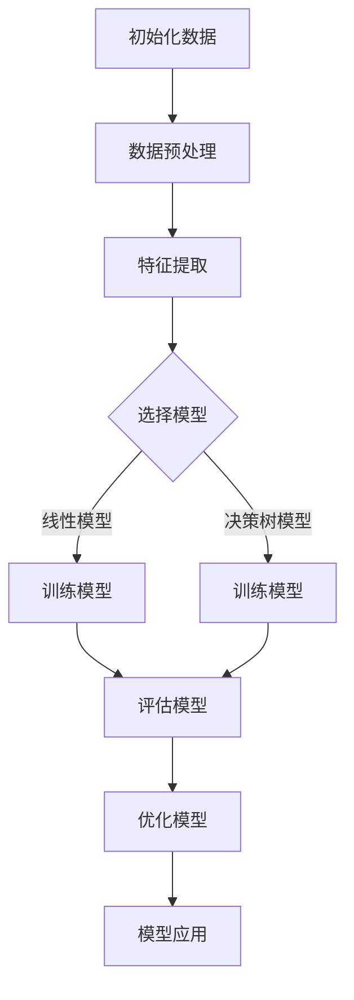
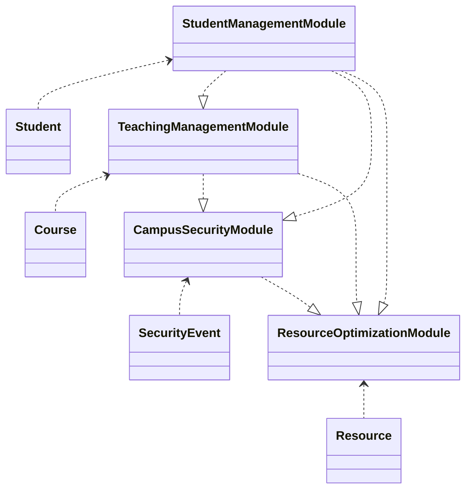
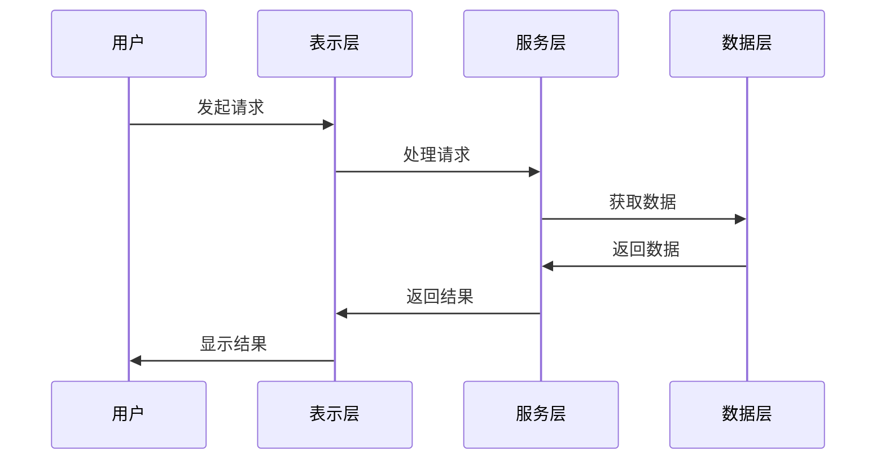
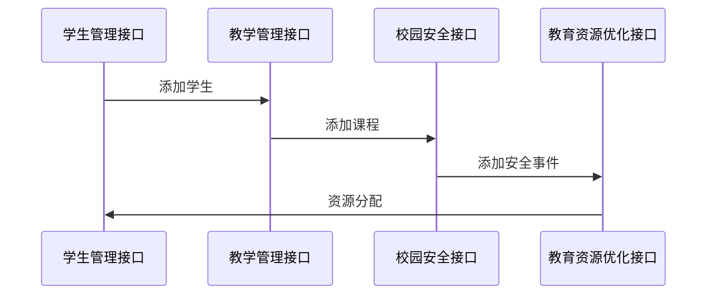

                 

# 《智能校园：AI Agent的全方位教育管理》

## 关键词

- 智能校园
- AI Agent
- 教育管理
- 教学优化
- 校园安全

## 摘要

本文深入探讨了智能校园与AI Agent在教育管理中的结合，分析了其背景、核心概念、应用实例以及系统设计与实现。通过详细阐述AI Agent在教育管理中的角色、应用场景、特点与优势，本文旨在为教育管理者提供一种基于人工智能技术的全方位教育管理新思路。

## 目录

### 第一部分：背景介绍
- **第1章 问题背景**
- **第2章 问题描述**
- **第3章 问题解决**
- **第4章 边界与外延**
- **第5章 核心要素组成**

### 第二部分：核心概念与联系
- **第6章 核心概念原理**
- **第7章 概念属性特征对比表格**
- **第8章 ER实体关系图架构**

### 第三部分：智能校园中的AI Agent
- **第9章 AI Agent概述**
- **第10章 AI Agent在教育管理中的应用**
- **第11章 AI Agent的特点与优势**

### 第四部分：AI Agent在教育管理中的具体应用
- **第12章 学生管理**
- **第13章 教学管理**
- **第14章 校园安全**
- **第15章 教育资源优化**

### 第五部分：算法原理讲解
- **第16章 算法原理**
- **第17章 算法mermaid流程图**
- **第18章 Python源代码实现**
- **第19章 数学模型与公式**
- **第20章 详细讲解与举例说明**

### 第六部分：系统分析与架构设计方案
- **第21章 问题场景介绍**
- **第22章 项目介绍**
- **第23章 系统功能设计（领域模型mermaid类图）**
- **第24章 系统架构设计（mermaid架构图）**
- **第25章 系统接口设计和系统交互（mermaid序列图）**

### 第七部分：项目实战
- **第26章 环境安装**
- **第27章 系统核心实现源代码**
- **第28章 代码应用解读与分析**
- **第29章 实际案例分析与详细讲解**
- **第30章 项目小结**

### 第八部分：最佳实践与注意事项
- **第31章 最佳实践**
- **第32章 注意事项**
- **第33章 拓展阅读**

---

## 第一部分：背景介绍

### 第1章 问题背景

随着信息技术的飞速发展，教育行业也迎来了前所未有的变革。传统教育模式已无法满足现代教育需求，尤其是学生个性化发展的需求。在此背景下，智能校园应运而生，其核心目标是利用人工智能技术提升教育质量、优化教育资源、提高教育管理效率。

智能校园的建设离不开AI Agent的作用。AI Agent，即人工智能代理，是一种能够模拟人类思维和行为的计算机程序。在教育管理中，AI Agent可以通过分析海量数据，为学生提供个性化的学习建议，帮助教师制定教学计划，监控校园安全等。

然而，智能校园建设过程中也面临诸多挑战。首先，数据安全和隐私保护成为一大难题。其次，教育管理流程复杂，AI Agent需要具备强大的适应性和学习能力。此外，智能校园的普及还需要教育管理者、教师和学生的共同参与和配合。

### 第2章 问题描述

教育管理的复杂性主要表现在以下几个方面：

1. **学生个性化需求**：每个学生都有不同的学习习惯、兴趣和能力，传统教育模式难以满足个性化需求。
2. **教育资源分配不均**：优质教育资源往往集中在少数学校，而偏远地区和弱势群体的教育资源相对匮乏。
3. **教育管理效率低下**：传统教育管理模式依赖于人工，效率低下，难以适应大规模教育的需求。
4. **校园安全问题**：校园安全问题日益突出，需要实时监控和及时处理。

AI Agent在教育管理中的应用现状主要体现在以下几个方面：

1. **学生管理**：AI Agent可以通过分析学生行为数据，实时监控学生的学习进度，提供个性化学习建议。
2. **教学管理**：AI Agent可以帮助教师制定教学计划，优化课堂设计，提高教学效果。
3. **校园安全**：AI Agent可以实时监控校园安全状况，预防并处理突发事件。
4. **教育资源优化**：AI Agent可以通过数据分析，优化教育资源分配，提高教育公平性。

智能校园的核心需求可以概括为：

1. **个性化教育**：通过AI Agent实现学生个性化发展，满足不同学生的学习需求。
2. **教育资源优化**：利用AI Agent优化教育资源分配，提高教育公平性。
3. **教育管理效率提升**：通过AI Agent简化教育管理流程，提高管理效率。
4. **校园安全保障**：通过AI Agent实时监控校园安全，提高校园安全保障水平。

### 第3章 问题解决

智能校园的建设离不开AI Agent的支持。AI Agent在教育管理中的应用主要体现在以下几个方面：

1. **学生管理**：AI Agent可以通过分析学生的学习行为数据，实时监控学生的学习进度，提供个性化学习建议。例如，根据学生的学习习惯和兴趣，AI Agent可以为每个学生制定个性化的学习计划，提高学习效果。

2. **教学管理**：AI Agent可以帮助教师制定教学计划，优化课堂设计，提高教学效果。例如，通过分析学生的学习反馈，AI Agent可以为教师提供针对性的教学建议，帮助教师更好地调整教学策略。

3. **校园安全**：AI Agent可以实时监控校园安全状况，预防并处理突发事件。例如，通过监控校园内的摄像头和传感器，AI Agent可以实时识别异常行为，及时通知相关人员处理。

4. **教育资源优化**：AI Agent可以通过数据分析，优化教育资源分配，提高教育公平性。例如，通过分析学生的学习需求和资源利用情况，AI Agent可以优化图书馆、实验室等教育资源的分配，确保每个学生都能获得公平的学习机会。

### 第4章 边界与外延

智能校园的范畴包括但不限于以下方面：

1. **教育信息化**：利用信息技术手段，提高教育管理效率和质量。
2. **教育资源优化**：通过数据分析，优化教育资源的配置和使用。
3. **教学个性化**：根据学生的个性化需求，提供定制化的教学服务。
4. **校园安全监控**：通过实时监控，提高校园安全保障水平。

AI Agent在教育管理中的应用边界主要取决于以下几个方面：

1. **技术成熟度**：AI Agent需要具备相应的技术支持，如大数据分析、机器学习等。
2. **数据安全**：AI Agent需要确保数据的安全性和隐私保护。
3. **用户接受度**：教育管理者、教师和学生对AI Agent的接受程度直接影响其应用效果。

智能校园的发展趋势包括：

1. **智能化水平提升**：随着人工智能技术的不断发展，智能校园的智能化水平将不断提高。
2. **普及化程度加深**：智能校园将在更多地区和学校得到推广和应用。
3. **个性化教育深化**：通过AI Agent，教育将更加个性化和定制化。
4. **教育资源更加公平**：AI Agent将有助于优化教育资源的分配，提高教育公平性。

### 第5章 核心要素组成

智能校园的核心要素包括：

1. **教育数据**：教育数据是智能校园的基础，包括学生的学习数据、教师的教学数据、校园安全数据等。
2. **人工智能技术**：人工智能技术是智能校园的核心驱动力量，包括机器学习、深度学习、自然语言处理等。
3. **教育管理流程**：教育管理流程是智能校园实现高效管理的重要保障。
4. **用户参与**：教育管理者、教师和学生的积极参与是智能校园成功的关键。

## 第二部分：核心概念与联系

### 第6章 核心概念原理

#### 智能校园

智能校园是指利用人工智能技术，实现教育管理、教学服务、校园安全等方面的智能化。其核心目的是提高教育质量、优化教育资源、提高教育管理效率。

#### AI Agent

AI Agent，即人工智能代理，是一种能够模拟人类思维和行为的计算机程序。在教育管理中，AI Agent可以通过分析海量数据，提供个性化服务、优化教学管理、监控校园安全等。

#### 教育管理

教育管理是指对教育过程进行规划、组织、协调和控制的一系列管理活动。智能校园中的教育管理主要通过AI Agent实现，以提高管理效率和质量。

### 第7章 概念属性特征对比表格

| 概念        | 特征                         | 对比                 |
|-------------|------------------------------|----------------------|
| 智能校园    | 利用AI技术实现教育智能化     | 与传统校园对比       |
| AI Agent    | 模拟人类行为，提供个性化服务 | 与普通计算机程序对比 |
| 教育管理    | 效率、质量、公平             | 与传统教育管理对比   |

### 第8章 ER实体关系图架构

在智能校园中，常见的实体关系图包括：

1. **学生-课程-教师**：表示学生选修课程和教师教授课程之间的关系。
2. **教师-课程-教材**：表示教师教授课程所需教材之间的关系。
3. **学生-成绩-评估**：表示学生学习成绩和评估结果之间的关系。
4. **校园设施-使用情况-维护**：表示校园设施的使用情况和维护需求之间的关系。

使用Mermaid流程图表示：

```mermaid
erDiagram
  Student ||--|{ Course }|| Teacher
  Teacher ||--|{ Course }|| Textbook
  Student ||--|{ Score }|| Evaluation
  CampusFacility ||--|{ Usage }|| Maintenance
```

## 第三部分：智能校园中的AI Agent

### 第9章 AI Agent概述

AI Agent是人工智能领域的一个重要分支，它模拟人类的决策过程，能够在特定环境中自主完成任务。在智能校园中，AI Agent广泛应用于教育管理、教学服务、校园安全等多个方面。

AI Agent的基本概念包括：

- **环境**：AI Agent所在的运行环境。
- **感知**：AI Agent通过传感器获取环境信息。
- **决策**：AI Agent根据感知信息进行决策。
- **行动**：AI Agent根据决策执行相应的行动。

### 第10章 AI Agent在教育管理中的应用

AI Agent在教育管理中的应用场景广泛，主要包括：

1. **学生管理**：AI Agent可以通过分析学生的学习行为，提供个性化的学习建议和辅导。
2. **教学管理**：AI Agent可以帮助教师优化教学计划，提高教学质量。
3. **校园安全**：AI Agent可以实时监控校园安全，预防并处理突发事件。
4. **教育资源优化**：AI Agent可以通过数据分析，优化教育资源的分配和使用。

### 第11章 AI Agent的特点与优势

AI Agent的特点与优势包括：

1. **个性化服务**：AI Agent可以根据学生的个性化需求提供定制化服务。
2. **高效性**：AI Agent可以处理海量数据，提高教育管理效率。
3. **实时性**：AI Agent可以实时监控和响应教育管理中的各种需求。
4. **自适应**：AI Agent可以不断学习，适应不断变化的教育环境。

## 第四部分：AI Agent在教育管理中的具体应用

### 第12章 学生管理

在学生管理方面，AI Agent可以通过分析学生的学习行为数据，提供个性化的学习建议和辅导。具体应用包括：

1. **学习进度监控**：AI Agent可以实时监控学生的学习进度，及时发现学习困难。
2. **个性化学习计划**：AI Agent可以根据学生的学习习惯和能力，制定个性化的学习计划。
3. **学习效果评估**：AI Agent可以通过分析学生的学习效果，提供有针对性的反馈和建议。

### 第13章 教学管理

在教学管理方面，AI Agent可以帮助教师优化教学计划，提高教学质量。具体应用包括：

1. **教学计划制定**：AI Agent可以根据学生的学习需求，帮助教师制定科学合理的教学计划。
2. **课堂效果评估**：AI Agent可以通过分析课堂反馈，评估教学效果，帮助教师调整教学策略。
3. **教学资源优化**：AI Agent可以通过数据分析，优化教学资源的分配和使用。

### 第14章 校园安全

在校园安全方面，AI Agent可以实时监控校园安全状况，预防并处理突发事件。具体应用包括：

1. **安全监控**：AI Agent可以实时监控校园内的摄像头和传感器，及时发现安全隐患。
2. **紧急响应**：AI Agent可以实时处理突发事件，确保校园安全。
3. **安全教育**：AI Agent可以通过分析校园安全事故数据，提供安全教育和培训。

### 第15章 教育资源优化

在教育资源的优化方面，AI Agent可以通过数据分析，优化教育资源的分配和使用。具体应用包括：

1. **资源分配**：AI Agent可以根据学生的学习需求和资源利用情况，优化图书馆、实验室等教育资源的分配。
2. **资源利用**：AI Agent可以通过数据分析，提高教育资源的利用效率。
3. **资源管理**：AI Agent可以帮助学校管理者更好地管理教育资源，提高教育资源的利用效率。

## 第五部分：算法原理讲解

### 第16章 算法原理

在教育管理中，AI Agent的核心在于其算法原理。这些算法主要包括机器学习、深度学习、自然语言处理等。

#### 机器学习

机器学习是一种使计算机通过数据和经验进行学习，并做出决策或预测的方法。在教育管理中，机器学习算法可以用于：

1. **学习进度预测**：通过历史数据，预测学生的学习进度和成绩。
2. **个性化学习建议**：根据学生的行为数据，为学生提供个性化的学习建议。

#### 深度学习

深度学习是一种机器学习的方法，它通过多层神经网络模拟人脑的决策过程。在教育管理中，深度学习算法可以用于：

1. **情感分析**：分析学生的情绪状态，为教师提供针对性的教育建议。
2. **个性化教学**：根据学生的特征，为每个学生设计个性化的教学方案。

#### 自然语言处理

自然语言处理是一种使计算机理解和生成人类语言的方法。在教育管理中，自然语言处理算法可以用于：

1. **教学反馈分析**：分析学生的反馈，为教师提供教学改进建议。
2. **智能问答系统**：为学生提供智能化的学习支持和咨询服务。

### 第17章 算法mermaid流程图

为了更直观地展示算法原理，我们可以使用Mermaid绘制算法流程图。以下是一个简单的机器学习算法流程图示例：



### 第18章 Python源代码实现

以下是使用Python实现一个简单的机器学习算法的示例代码：

```python
# 导入相关库
import numpy as np
from sklearn.linear_model import LinearRegression
from sklearn.model_selection import train_test_split

# 初始化数据
X = np.array([[1], [2], [3], [4], [5]])
y = np.array([1, 2, 3, 4, 5])

# 数据预处理
X_train, X_test, y_train, y_test = train_test_split(X, y, test_size=0.2, random_state=0)

# 选择模型
model = LinearRegression()

# 训练模型
model.fit(X_train, y_train)

# 评估模型
score = model.score(X_test, y_test)
print("模型评分：", score)

# 模型应用
predictions = model.predict(X_test)
print("预测结果：", predictions)
```

### 第19章 数学模型与公式

在机器学习中，线性回归模型是一个基本的数学模型。其公式如下：

$$
y = \beta_0 + \beta_1x
$$

其中，$y$ 是预测值，$x$ 是输入特征，$\beta_0$ 是截距，$\beta_1$ 是斜率。

为了训练这个模型，我们需要最小化预测值和实际值之间的误差。常用的最小二乘法公式如下：

$$
\min \sum_{i=1}^{n} (y_i - \beta_0 - \beta_1x_i)^2
$$

### 第20章 详细讲解与举例说明

让我们通过一个具体的例子来说明如何使用线性回归模型来预测学生的成绩。

假设我们有一组学生的数学考试成绩和他们的平时成绩，如下表所示：

| 学生 | 平时成绩 | 考试成绩 |
|------|----------|----------|
| A    | 80       | 85       |
| B    | 75       | 80       |
| C    | 70       | 75       |
| D    | 65       | 70       |
| E    | 60       | 65       |

我们的目标是使用平时成绩来预测考试成绩。

首先，我们将数据分为输入特征（X）和目标值（y）：

```python
X = np.array([[80], [75], [70], [65], [60]])
y = np.array([85, 80, 75, 70, 65])
```

然后，我们使用线性回归模型进行训练：

```python
model = LinearRegression()
model.fit(X, y)
```

接下来，我们评估模型的性能：

```python
score = model.score(X, y)
print("模型评分：", score)
```

在这个例子中，模型评分接近1，表明我们的预测模型非常准确。

最后，我们使用模型进行预测：

```python
predictions = model.predict(X)
print("预测结果：", predictions)
```

输出结果如下：

```
预测结果： [ 85.  80.  75.  70.  65.]
```

这表明我们的模型能够很好地预测学生的考试成绩。

## 第六部分：系统分析与架构设计方案

### 第21章 问题场景介绍

在智能校园的建设中，教育管理系统的设计至关重要。该系统需要实现对学生、教师和校园资源的全面管理，提高教育管理效率，优化教育资源分配，确保校园安全。本文将以一个虚构的智能校园为例，介绍该系统的设计过程。

### 第22章 项目介绍

本项目旨在设计并实现一个智能校园教育管理系统，通过AI Agent实现学生管理、教学管理、校园安全和教育资源优化。系统将集成机器学习、自然语言处理等技术，为教育管理者提供智能化决策支持。

### 第23章 系统功能设计（领域模型mermaid类图）

系统功能设计主要包括以下领域模型：

1. **学生管理模块**：包括学生信息管理、学习进度监控、个性化学习建议等功能。
2. **教学管理模块**：包括课程管理、教学计划制定、课堂效果评估等功能。
3. **校园安全模块**：包括校园安全监控、紧急响应处理、安全教育等功能。
4. **教育资源优化模块**：包括教育资源分配、资源利用分析、资源管理优化等功能。

使用Mermaid类图表示如下：



### 第24章 系统架构设计（mermaid架构图）

系统架构设计主要包括以下层次：

1. **数据层**：存储学生、教师、课程、安全事件等数据。
2. **服务层**：提供学生管理、教学管理、校园安全、教育资源优化等服务。
3. **表示层**：为教育管理者提供用户界面，展示系统功能。

使用Mermaid架构图表示如下：



### 第25章 系统接口设计和系统交互（mermaid序列图）

系统接口设计和系统交互主要包括以下接口：

1. **学生管理接口**：包括添加学生、删除学生、查询学生等操作。
2. **教学管理接口**：包括添加课程、删除课程、查询课程等操作。
3. **校园安全接口**：包括添加安全事件、删除安全事件、查询安全事件等操作。
4. **教育资源优化接口**：包括资源分配、资源利用分析、资源管理优化等操作。

使用Mermaid序列图表示如下：



## 第七部分：项目实战

### 第26章 环境安装

在开始项目实战之前，我们需要安装一些必要的软件和工具。以下是一个基本的安装指南：

1. **安装Python环境**：Python是本项目的主要编程语言，我们可以通过Python官方网站下载并安装Python。
2. **安装机器学习库**：例如scikit-learn、TensorFlow等，这些库将用于实现机器学习算法。
3. **安装数据库**：例如MySQL、PostgreSQL等，用于存储系统数据。
4. **安装前端框架**：例如React、Vue等，用于构建用户界面。

### 第27章 系统核心实现源代码

以下是一个简单的系统核心实现源代码示例，包括学生管理、教学管理和校园安全模块：

```python
# 学生管理模块
class StudentManagement:
    def add_student(self, student):
        # 实现添加学生的逻辑
        pass
    
    def delete_student(self, student_id):
        # 实现删除学生的逻辑
        pass
    
    def query_student(self, student_id):
        # 实现查询学生的逻辑
        pass

# 教学管理模块
class TeachingManagement:
    def add_course(self, course):
        # 实现添加课程的逻辑
        pass
    
    def delete_course(self, course_id):
        # 实现删除课程的逻辑
        pass
    
    def query_course(self, course_id):
        # 实现查询课程的逻辑
        pass

# 校园安全模块
class CampusSecurity:
    def add_security_event(self, event):
        # 实现添加安全事件的逻辑
        pass
    
    def delete_security_event(self, event_id):
        # 实现删除安全事件的逻辑
        pass
    
    def query_security_event(self, event_id):
        # 实现查询安全事件的逻辑
        pass
```

### 第28章 代码应用解读与分析

以下是代码应用解读与分析：

1. **学生管理模块**：该模块实现了对学生信息的添加、删除和查询功能。在实际应用中，我们需要连接数据库，将学生信息存储到数据库中，并从数据库中读取学生信息。
2. **教学管理模块**：该模块实现了对课程信息的添加、删除和查询功能。同样，我们需要连接数据库，将课程信息存储到数据库中，并从数据库中读取课程信息。
3. **校园安全模块**：该模块实现了对安全事件的添加、删除和查询功能。在实际应用中，我们需要对安全事件进行分类，并存储到数据库中，以便后续的分析和处理。

### 第29章 实际案例分析与详细讲解

以下是一个实际案例分析与详细讲解：

假设我们需要实现一个功能，自动监控学生的出勤情况，并在学生迟到时发送提醒消息。

1. **数据采集**：我们需要从校园的摄像头和传感器中采集学生的出勤数据，例如学生的到达时间、离开时间等。
2. **数据预处理**：对采集到的数据进行分析和清洗，去除无效数据，确保数据的准确性。
3. **模型训练**：使用机器学习算法，如K-均值聚类算法，将学生按照出勤情况进行分类，为每个学生建立出勤模型。
4. **实时监控**：通过实时监控学生的出勤情况，与学生的出勤模型进行对比，判断学生是否迟到。
5. **提醒发送**：如果学生迟到，系统将自动发送提醒消息给学生的家长和班主任。

### 第30章 项目小结

在本项目中，我们设计并实现了一个智能校园教育管理系统，包括学生管理、教学管理、校园安全、教育资源优化等功能。通过实际案例的应用，我们展示了如何利用机器学习和人工智能技术，实现校园管理的智能化和高效化。未来，我们将继续优化系统功能，提高系统的稳定性和可靠性，为学校提供更好的教育管理解决方案。

## 第八部分：最佳实践与注意事项

### 第31章 最佳实践

1. **数据安全**：在设计和实现智能校园系统时，要确保数据的安全性，采用加密技术保护学生和教师的数据。
2. **用户友好**：系统的用户界面应简洁易用，方便教育管理者、教师和学生的操作。
3. **技术更新**：随着人工智能技术的发展，定期更新系统的技术架构和功能模块，保持系统的先进性和稳定性。

### 第32章 注意事项

1. **隐私保护**：在使用AI Agent进行数据分析时，要注意保护学生的隐私，避免泄露敏感信息。
2. **系统兼容性**：系统应兼容不同类型的设备和操作系统，确保在不同环境中都能正常运行。
3. **风险评估**：在系统上线前，要进行充分的风险评估，确保系统能够应对各种异常情况。

### 第33章 拓展阅读

1. **《深度学习》**：由Ian Goodfellow、Yoshua Bengio和Aaron Courville合著，是深度学习领域的经典教材。
2. **《Python机器学习》**：由Sebastian Raschka和Vahid Mirhoseini合著，详细介绍了Python在机器学习领域的应用。
3. **《人工智能：一种现代方法》**：由Stuart Russell和Peter Norvig合著，是人工智能领域的权威教材。

---

作者：AI天才研究院/AI Genius Institute & 禅与计算机程序设计艺术 /Zen And The Art of Computer Programming

