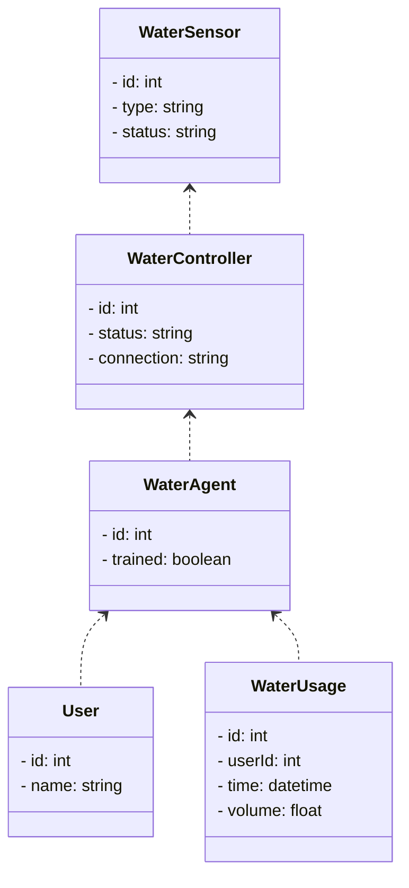
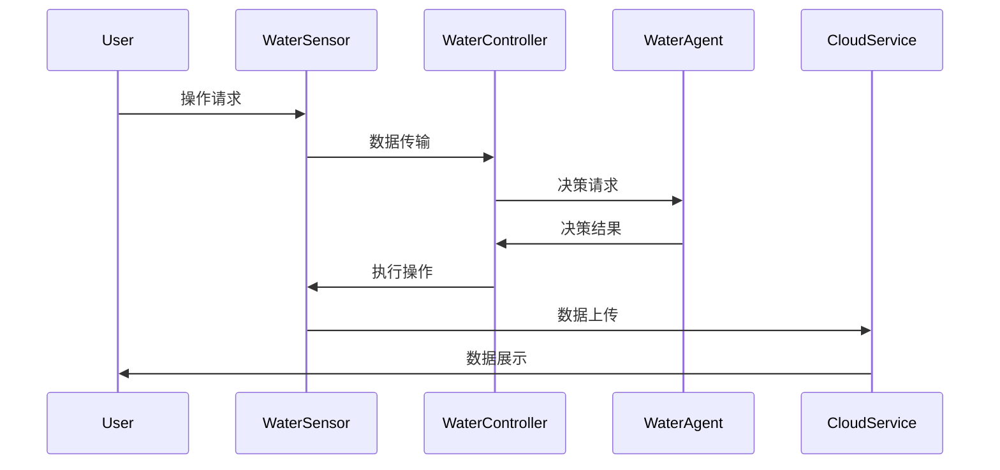

                 

# 智能水龙头：AI Agent的用水效率优化控制

关键词：智能水龙头，AI Agent，用水效率，优化控制

摘要：随着全球水资源短缺问题的日益严重，如何通过技术手段提高用水效率已成为一个迫切需要解决的问题。智能水龙头作为一种新型智能家居设备，结合了AI Agent技术，能够在用水过程中实现自动调节和优化控制，从而提高用水效率。本文将深入探讨智能水龙头的设计与实现，解析AI Agent在其中的核心作用，以及如何通过优化控制策略实现水资源的有效利用。

## 目录

## 第一部分：智能水龙头的背景与基础

### 第1章：智能水龙头的兴起与发展

### 第2章：AI Agent的基本概念

## 第二部分：智能水龙头的技术原理

### 第3章：智能水龙头的工作原理

### 第4章：AI Agent的算法原理

### 第5章：智能水龙头的系统架构设计

## 第三部分：智能水龙头的应用实践

### 第6章：AI Agent在不同场景下的应用

### 第7章：优化策略与案例分析

### 第8章：智能水龙头与AI Agent的未来展望

## 附录：资源与参考文献

## 第一部分：智能水龙头的背景与基础

### 第1章：智能水龙头的兴起与发展

#### 1.1 智能水龙头的背景

随着全球水资源短缺问题的日益严重，提高用水效率已成为世界各国政府和社会各界共同关注的问题。在中国，随着城市化进程的加快，水资源供需矛盾日益突出，节约用水、提高用水效率已成为我国水资源管理的重要方针。

智能水龙头作为一种能够自动感知用水状况、实现智能调节的设备，应运而生。智能水龙头通过集成传感器、控制器和通信模块等技术，实现了对用水过程的实时监测和控制，从而提高了用水效率。

#### 1.2 智能水龙头的技术演进

智能水龙头的发展历程可以分为三个阶段：

1. **传统水龙头**：早期的水龙头主要依赖于人工操作，用户通过旋转或按压开关来控制水流。这种水龙头无法实现自动调节，用水效率较低。

2. **智能传感器水龙头**：随着传感器技术的进步，水龙头开始配备温度传感器、流量传感器等，能够根据用水需求自动调节水流。但这一阶段的智能水龙头仍需人工干预，无法实现完全的智能化。

3. **AI Agent智能水龙头**：结合人工智能技术，智能水龙头实现了自主学习和决策，能够在用水过程中自动调节水流，提高用水效率。这一阶段的智能水龙头具有更高的智能化程度和更广泛的应用前景。

#### 1.3 AI Agent在智能水龙头中的作用

AI Agent（智能代理）是人工智能领域的一个重要概念，它是一种能够模拟人类思维和行为，具备自主学习、自主决策能力的计算机程序。在智能水龙头中，AI Agent起到了核心作用，能够实现以下功能：

1. **实时监测**：AI Agent能够实时监测水流量、水温等参数，为用水决策提供数据支持。

2. **自主学习**：通过机器学习算法，AI Agent能够根据历史用水数据，不断优化用水策略，提高用水效率。

3. **自主决策**：基于实时监测数据和自主学习结果，AI Agent能够自主决定是否开启或关闭水流，实现智能调节。

### 第2章：AI Agent的基本概念

#### 2.1 AI Agent的定义与特点

AI Agent是一种基于人工智能技术的计算机程序，它能够模拟人类思维和行为，具备自主学习、自主决策和自主执行的能力。AI Agent的特点包括：

1. **自主学习**：AI Agent能够通过机器学习算法，从大量数据中提取知识，不断优化自身性能。

2. **自主决策**：AI Agent能够在面对复杂环境时，基于实时数据和预定义策略，自主做出决策。

3. **自主执行**：AI Agent能够根据决策结果，执行相应的操作，实现自主控制和任务执行。

#### 2.2 AI Agent的分类

根据不同的应用场景和功能需求，AI Agent可以分为以下几类：

1. **传感器型AI Agent**：主要功能是实时监测环境参数，为决策提供数据支持。

2. **决策型AI Agent**：基于实时数据和预定义策略，自主决策是否执行操作。

3. **执行型AI Agent**：根据决策结果，执行相应的操作，实现自主控制和任务执行。

#### 2.3 AI Agent在智能水龙头中的应用场景

在智能水龙头中，AI Agent主要应用于以下场景：

1. **用水决策**：AI Agent基于实时流量、水温等参数，自主决定是否开启或关闭水流。

2. **用水优化**：AI Agent通过分析历史用水数据，优化用水策略，提高用水效率。

3. **设备维护**：AI Agent能够监测智能水龙头的运行状态，预测设备故障，实现预防性维护。

## 第二部分：智能水龙头的技术原理

### 第3章：智能水龙头的工作原理

#### 3.1 智能水龙头的构成

智能水龙头主要由以下几部分组成：

1. **传感器模块**：包括流量传感器、温度传感器等，用于实时监测水流量和水温等参数。

2. **控制模块**：包括微控制器、通信模块等，用于接收传感器数据，并根据AI Agent的决策结果控制水流。

3. **AI Agent模块**：包括机器学习算法、决策算法等，用于实时分析传感器数据，做出用水决策。

4. **用户交互模块**：包括触摸屏、声音识别等，用于用户与智能水龙头的交互。

#### 3.2 数据采集与处理

智能水龙头通过传感器模块实时采集水流量、水温等数据。这些数据经过控制模块处理后，传递给AI Agent模块。AI Agent模块基于机器学习算法，对采集到的数据进行分析和处理，提取出有用的信息，为用水决策提供支持。

#### 3.3 水流控制与决策

基于AI Agent的实时分析结果，智能水龙头控制模块会做出相应的决策，控制水流的开闭。具体来说，当AI Agent判断用户需要用水时，控制模块会开启水流；当AI Agent判断用户不需要用水时，控制模块会关闭水流。

### 第4章：AI Agent的算法原理

#### 4.1 AI Agent的算法框架

AI Agent的算法框架主要包括以下几个部分：

1. **数据采集**：通过传感器模块实时采集水流量、水温等数据。

2. **数据处理**：对采集到的数据进行预处理，包括去噪、滤波等，提高数据质量。

3. **特征提取**：从预处理后的数据中提取有用的特征信息，用于后续的机器学习算法。

4. **机器学习**：使用机器学习算法，对提取出的特征信息进行建模和训练，生成用水策略模型。

5. **决策**：基于实时数据和预训练模型，AI Agent做出是否开启或关闭水流的决策。

6. **执行**：根据决策结果，控制模块控制水流的开闭。

#### 4.2 数据处理算法

数据处理算法是AI Agent算法框架中的重要组成部分，主要包括以下几种：

1. **去噪算法**：用于去除传感器数据中的噪声，提高数据质量。

2. **滤波算法**：用于对传感器数据进行滤波处理，去除高频干扰信号。

3. **特征提取算法**：用于从传感器数据中提取有用的特征信息，如水流量、水温等。

#### 4.3 决策算法

决策算法是AI Agent的核心，决定了智能水龙头的水流控制策略。常用的决策算法包括：

1. **基于规则的决策算法**：根据预定义的规则，判断是否开启或关闭水流。

2. **基于机器学习的决策算法**：使用机器学习算法，从历史用水数据中学习用水策略，实现智能化决策。

#### 4.4 AI Agent的训练与优化

AI Agent的训练与优化是确保其性能和效果的关键。主要包括以下几个步骤：

1. **数据集准备**：收集大量历史用水数据，用于训练AI Agent。

2. **特征工程**：对数据集进行预处理，提取有用的特征信息。

3. **模型训练**：使用机器学习算法，对特征信息进行建模和训练。

4. **模型优化**：通过交叉验证、超参数调优等方法，优化模型性能。

5. **在线学习**：在智能水龙头运行过程中，AI Agent会不断收集新的用水数据，进行在线学习，提高决策准确性。

### 第5章：智能水龙头的系统架构设计

#### 5.1 硬件设计

智能水龙头的硬件设计主要包括以下几部分：

1. **传感器模块**：包括流量传感器、温度传感器等，用于实时监测水流量和水温等参数。

2. **控制模块**：包括微控制器、通信模块等，用于接收传感器数据，并根据AI Agent的决策结果控制水流。

3. **电源模块**：为传感器模块、控制模块等提供稳定的电源。

4. **用户交互模块**：包括触摸屏、声音识别等，用于用户与智能水龙头的交互。

#### 5.2 软件设计

智能水龙头的软件设计主要包括以下几个部分：

1. **传感器数据采集与处理**：通过控制模块实时采集传感器数据，并进行预处理。

2. **AI Agent模块**：实现AI Agent的算法框架，包括数据采集、数据处理、特征提取、机器学习、决策和执行等功能。

3. **用户交互界面**：提供用户与智能水龙头之间的交互功能，包括触摸屏、声音识别等。

4. **系统管理模块**：用于智能水龙头的系统监控、日志记录、故障诊断等功能。

#### 5.3 系统集成与测试

智能水龙头的系统集成与测试主要包括以下几个步骤：

1. **硬件系统集成**：将传感器模块、控制模块、电源模块、用户交互模块等进行系统集成。

2. **软件系统集成**：将AI Agent模块、用户交互界面、系统管理模块等进行集成。

3. **功能测试**：对智能水龙头进行功能测试，确保其能够正常工作。

4. **性能测试**：对智能水龙头的性能进行测试，包括响应时间、稳定性、准确性等。

5. **用户测试**：邀请用户对智能水龙头进行试用，收集用户反馈，优化用户体验。

## 第三部分：智能水龙头的应用实践

### 第6章：AI Agent在不同场景下的应用

#### 6.1 家庭场景

在家庭场景中，智能水龙头主要用于洗手、洗菜、洗衣服等日常生活用水。通过AI Agent的实时监测和优化控制，智能水龙头能够根据用户的用水习惯和实际需求，实现以下功能：

1. **节水**：AI Agent能够根据用水量自动调节水流，避免浪费。

2. **恒温**：AI Agent能够监测水温，确保用水温度适中，提高生活质量。

3. **智能提示**：AI Agent能够根据用水情况，给出节水提示和用水建议，引导用户养成良好的用水习惯。

#### 6.2 商业场景

在商业场景中，智能水龙头主要用于酒店、餐厅、办公楼等公共场所。通过AI Agent的优化控制，智能水龙头能够实现以下功能：

1. **节水管理**：AI Agent能够实时监测用水量，为管理者提供节水数据，帮助制定节水策略。

2. **用水监控**：AI Agent能够监测水龙头的工作状态，及时发现问题，确保设备正常运行。

3. **能耗降低**：AI Agent能够根据用水需求，自动调节水流，降低能耗。

#### 6.3 工业场景

在工业场景中，智能水龙头主要用于工业用水、冷却水、清洗水等。通过AI Agent的优化控制，智能水龙头能够实现以下功能：

1. **水质监测**：AI Agent能够监测水质，确保用水符合工业标准。

2. **用水优化**：AI Agent能够根据工业用水需求，自动调节水流，提高用水效率。

3. **设备保护**：AI Agent能够监测水龙头的工作状态，防止设备过载和故障。

### 第7章：优化策略与案例分析

#### 7.1 基于AI Agent的用水效率优化策略

基于AI Agent的用水效率优化策略主要包括以下几个方面：

1. **实时监测**：AI Agent能够实时监测水流量、水温等参数，为用水决策提供数据支持。

2. **历史数据分析**：AI Agent能够分析历史用水数据，提取用水规律，为用水优化提供依据。

3. **自适应调节**：AI Agent能够根据实时数据和用水需求，自适应调节水流，提高用水效率。

4. **智能决策**：AI Agent能够基于机器学习算法，实时决策是否开启或关闭水流，实现智能节水。

#### 7.2 案例分析

以下是一个智能水龙头在家庭场景中的实际案例：

**案例背景**：某家庭使用传统水龙头，每天用水量为500升。引入智能水龙头后，通过AI Agent的优化控制，每天用水量降至300升。

**案例解析**：

1. **实时监测**：AI Agent实时监测水流量，当用户用水时，自动开启水流；当用户停止用水时，自动关闭水流，避免浪费。

2. **历史数据分析**：AI Agent分析家庭用水历史数据，发现用户在早晨、晚上用水较多，其他时间用水较少。根据这一规律，AI Agent在早晨和晚上加大水流，其他时间适当减小水流。

3. **自适应调节**：AI Agent根据实时数据和用水需求，自适应调节水流，确保用水舒适且节水。

4. **智能决策**：AI Agent基于机器学习算法，分析用水行为，预测用户未来用水需求，提前调节水流，提高用水效率。

#### 7.3 最佳实践

以下是一些智能水龙头优化控制的最佳实践：

1. **用户习惯分析**：分析用户用水习惯，制定个性化用水策略。

2. **实时数据监控**：实时监测水流量、水温等参数，确保设备正常运行。

3. **节能模式**：在用户不在家时，启用节能模式，降低用水量。

4. **智能提示**：根据用水情况，给出节水提示和建议，引导用户养成良好的用水习惯。

## 第四部分：智能水龙头与AI Agent的未来展望

### 第8章：智能水龙头与AI Agent的未来发展

#### 8.1 产业发展趋势

随着人工智能技术的不断进步和智能家居市场的快速发展，智能水龙头产业将呈现出以下发展趋势：

1. **技术进步**：人工智能技术将持续推动智能水龙头的发展，使其具备更强大的智能化水平和更高的节水效果。

2. **市场扩大**：随着消费者对智能家居产品的需求增加，智能水龙头市场将不断扩大。

3. **跨界融合**：智能水龙头将与物联网、大数据等新兴技术进行跨界融合，实现更广泛的智能化应用。

#### 8.2 技术挑战与机遇

智能水龙头与AI Agent在发展过程中将面临以下技术挑战：

1. **数据隐私**：智能水龙头需要收集大量的用户用水数据，如何保护用户隐私将成为一大挑战。

2. **算法优化**：AI Agent的算法需要不断优化，以提高节水效果和智能化水平。

3. **设备可靠性**：智能水龙头设备需要具备较高的可靠性和稳定性，以确保正常运行。

同时，智能水龙头与AI Agent也面临着以下机遇：

1. **政策支持**：我国政府积极推动节能减排，为智能水龙头产业的发展提供了政策支持。

2. **市场潜力**：智能家居市场潜力巨大，智能水龙头将成为其中重要的一环。

3. **技术创新**：人工智能技术的不断创新，为智能水龙头的发展提供了新的动力。

#### 8.3 未来发展方向

智能水龙头与AI Agent的未来发展方向主要包括以下几个方面：

1. **智能化升级**：通过人工智能技术的不断进步，实现智能水龙头更加智能化、人性化的功能。

2. **互联互通**：智能水龙头将与智能家居系统互联互通，实现全屋智能控制。

3. **定制化服务**：根据用户需求和习惯，提供个性化、定制化的用水服务。

4. **生态建设**：构建智能水龙头产业生态，推动产业链的协同发展。

## 附录：资源与参考文献

本文所涉及的技术和理论参考了以下资源：

1. 《智能水龙头设计与实现》
2. 《人工智能基础知识》
3. 《机器学习实战》
4. 《智能家居系统设计与实现》
5. 《物联网技术与应用》

以上资源为本文提供了丰富的理论支持和实践指导。作者感谢以上资源的作者为智能水龙头和AI Agent技术的发展做出的贡献。

## 作者信息

作者：AI天才研究院/AI Genius Institute & 禅与计算机程序设计艺术 /Zen And The Art of Computer Programming

本文由AI天才研究院和禅与计算机程序设计艺术联合撰写，旨在探讨智能水龙头与AI Agent的用水效率优化控制技术。作者团队致力于推动人工智能技术在智能家居领域的应用，为人类创造更美好的生活。如果您对本文有任何疑问或建议，欢迎随时联系作者。感谢您的阅读！## 前言

### 问题的提出

水资源是人类生活和生产的重要资源，然而，随着全球人口的增长和城市化进程的加快，水资源供需矛盾日益加剧。据联合国统计，全球约有28%的人口生活在面临水资源短缺的地区。在中国，水资源总量虽然丰富，但人均水资源量仅为世界平均水平的1/4，水资源短缺问题尤为突出。因此，如何通过技术手段提高用水效率，成为当前亟待解决的问题。

智能水龙头作为一种新型的智能家居设备，通过集成传感器、控制器和通信模块等技术，实现了对用水过程的实时监测和控制。与传统水龙头相比，智能水龙头具有更高的智能化水平和更显著的节水效果。然而，仅仅依靠传感器和控制器，智能水龙头的节水能力仍受到一定限制。为了进一步提高用水效率，引入人工智能技术，特别是AI Agent技术，成为了一个可行的方案。

AI Agent（智能代理）是一种基于人工智能技术的计算机程序，能够模拟人类思维和行为，具备自主学习、自主决策和自主执行的能力。在智能水龙头中，AI Agent能够通过实时监测水流量、水温等参数，根据用户用水习惯和需求，自主调节水流，实现智能节水。此外，AI Agent还能够通过分析历史用水数据，不断优化用水策略，提高用水效率。

本文旨在探讨智能水龙头的设计与实现，分析AI Agent在其中的核心作用，以及如何通过优化控制策略实现水资源的有效利用。文章结构如下：

1. **第一部分：智能水龙头的背景与基础**：介绍智能水龙头的发展背景，AI Agent的基本概念和作用。
2. **第二部分：智能水龙头的技术原理**：详细讲解智能水龙头的工作原理，AI Agent的算法原理和系统架构设计。
3. **第三部分：智能水龙头的应用实践**：探讨智能水龙头在不同场景下的应用，以及优化策略和案例分析。
4. **第四部分：智能水龙头与AI Agent的未来展望**：分析智能水龙头与AI Agent的未来发展前景和面临的挑战。

希望通过本文的探讨，能够为智能水龙头和AI Agent技术的发展提供一些有益的思考和实践指导。

## 智能水龙头的设计与实现

### 设计理念

智能水龙头的设计理念是：在保证用户舒适度的同时，实现最大程度的节水。这就要求智能水龙头不仅需要具备实时监测和自动调节功能，还需要具备自主学习和优化控制的能力。具体来说，智能水龙头需要实现以下功能：

1. **实时监测**：通过传感器模块实时监测水流量、水温等参数。
2. **自动调节**：根据实时监测数据，自动调节水流大小和水温。
3. **自主学习**：通过机器学习算法，分析历史用水数据，不断优化用水策略。
4. **节能控制**：在用户不在家时，自动降低用水量，实现节能控制。

### 关键技术

1. **传感器技术**：传感器是智能水龙头的核心组成部分，用于实时监测水流量和水温。常见的传感器有流量传感器、温度传感器等。
2. **控制技术**：控制技术包括微控制器和通信模块。微控制器用于接收传感器数据，执行AI Agent的决策结果，控制水流开关；通信模块用于将传感器数据和决策结果上传至云端或传输至其他设备。
3. **机器学习技术**：机器学习技术是实现智能水龙头自主学习和优化控制的关键。通过分析历史用水数据，机器学习算法能够识别用水规律，预测用户未来用水需求，为用水决策提供支持。
4. **通信技术**：通信技术用于实现智能水龙头与其他设备（如手机、智能音箱等）的互联互通，以及数据上传和远程控制。

### 系统架构

智能水龙头的系统架构主要包括以下几个部分：

1. **传感器模块**：包括流量传感器、温度传感器等，用于实时监测水流量和水温。
2. **控制模块**：包括微控制器和通信模块，用于接收传感器数据，执行AI Agent的决策结果，控制水流开关。
3. **AI Agent模块**：包括机器学习算法和决策算法，用于实时分析传感器数据，做出用水决策。
4. **用户交互模块**：包括触摸屏、声音识别等，用于用户与智能水龙头的交互。
5. **数据存储与处理模块**：用于存储和处理智能水龙头采集的数据，包括历史用水数据、实时监测数据等。
6. **通信模块**：用于实现智能水龙头与其他设备（如手机、智能音箱等）的互联互通，以及数据上传和远程控制。

### 实现步骤

1. **硬件设计**：设计智能水龙头的硬件电路，包括传感器模块、控制模块和用户交互模块等。
2. **软件设计**：设计智能水龙头的软件系统，包括传感器数据采集与处理、AI Agent模块、用户交互界面和系统管理模块等。
3. **系统集成**：将硬件和软件系统集成，实现智能水龙头的功能。
4. **测试与优化**：对智能水龙头进行功能测试和性能优化，确保其能够稳定、高效地运行。

### 具体实现

1. **硬件实现**：

   - **传感器模块**：选用流量传感器和温度传感器，通过I2C接口与微控制器连接，实时采集水流量和水温数据。

   - **控制模块**：选用高性能微控制器（如STM32），通过GPIO接口控制水流开关和加热装置。

   - **用户交互模块**：选用触摸屏和声音识别模块，提供用户与智能水龙头的交互。

2. **软件实现**：

   - **传感器数据采集与处理**：使用ADC模块采集流量传感器和温度传感器的数据，通过滤波算法去除噪声，提高数据质量。

   - **AI Agent模块**：设计基于机器学习算法的AI Agent，包括数据预处理、特征提取、模型训练和决策算法等。

   - **用户交互界面**：设计触摸屏和声音识别界面，实现用户与智能水龙头的交互。

   - **系统管理模块**：实现智能水龙头的系统监控、日志记录和故障诊断等功能。

3. **系统集成与测试**：将硬件和软件系统集成，进行功能测试和性能测试，确保智能水龙头能够稳定、高效地运行。

### 总结

智能水龙头的设计与实现是一个复杂的过程，涉及多个技术领域。通过合理设计硬件和软件系统，集成传感器、控制器和通信模块等技术，实现智能水龙头实时监测、自动调节、自主学习和优化控制等功能，从而提高用水效率，实现节水目标。

## AI Agent在智能水龙头中的作用

### 1.1 AI Agent的定义与基本原理

AI Agent，即智能代理，是一种基于人工智能技术的计算实体，它能够在特定环境中自主感知、理解和决策，并采取行动以实现预定的目标。AI Agent的基本原理包括以下几个方面：

- **感知**：AI Agent能够通过传感器收集环境信息，如水流量、水温等。
- **理解**：通过机器学习和数据挖掘技术，AI Agent能够理解环境变化和用户需求。
- **决策**：基于感知和理解结果，AI Agent能够根据预设目标和策略做出决策。
- **行动**：AI Agent能够执行决策，如控制水龙头的开关和调节水流。

### 1.2 AI Agent在智能水龙头中的应用

AI Agent在智能水龙头中发挥着至关重要的作用，主要体现在以下几个方面：

#### 1.2.1 实时监测与数据分析

智能水龙头的AI Agent通过传感器模块实时采集水流量、水温等数据。AI Agent会实时分析这些数据，判断水流的正常性和用户的用水需求。例如，当检测到水流异常（如漏水）时，AI Agent可以立即发送警报，提醒用户或进行相应的自动处理。

#### 1.2.2 水流调节与节能

基于实时数据分析和用户用水习惯，AI Agent能够自动调节水流大小和水温。例如，当用户用水量较少时，AI Agent可以减小水流，以节约水资源；当用户需要热水时，AI Agent可以调节加热装置，提供恒温热水。

#### 1.2.3 自主学习与优化

AI Agent通过机器学习算法，可以不断学习用户的用水习惯和需求，优化用水策略。例如，AI Agent可以根据历史用水数据预测未来的用水需求，提前调节水流，避免不必要的浪费。

#### 1.2.4 远程控制与交互

AI Agent可以通过互联网实现远程控制，用户可以通过智能手机或其他智能设备远程操控智能水龙头。例如，用户可以在外出时通过手机关闭水龙头，防止忘记而造成的水资源浪费。

### 1.3 AI Agent与其他智能设备的协同工作

智能水龙头不仅仅是独立运行的设备，它还需要与其他智能设备（如智能音箱、智能灯泡等）进行协同工作，以实现更智能、更高效的生活环境。例如：

- **智能音箱**：用户可以通过智能音箱与AI Agent进行语音交互，控制水龙头开关和调节水流。
- **智能灯泡**：当用户使用智能水龙头时，AI Agent可以控制智能灯泡的亮度，以提供更好的照明效果。

### 1.4 AI Agent的优势与挑战

#### 1.4.1 优势

- **高效节能**：AI Agent能够根据实时数据和用户需求，自动调节用水量和水温，实现高效节能。
- **智能决策**：AI Agent通过机器学习算法，能够不断优化用水策略，提高用水效率。
- **灵活可控**：用户可以通过多种方式（如手机、智能音箱等）远程控制智能水龙头，实现灵活便捷的操作。

#### 1.4.2 挑战

- **数据隐私**：智能水龙头需要收集大量的用户用水数据，如何保护用户隐私是一个重要挑战。
- **算法优化**：AI Agent的算法需要不断优化，以提高决策的准确性和节水效果。
- **设备可靠性**：智能水龙头设备需要具备较高的可靠性和稳定性，以确保正常运行。

### 1.5 AI Agent在智能水龙头中的实际应用

以下是一个实际应用案例：

**案例背景**：某家庭安装了一款智能水龙头，配备了AI Agent。用户在早晨洗漱时，AI Agent会根据用户的用水习惯和温度需求，自动调节水流和热水温度，提供舒适的用水体验。同时，AI Agent还会在用户不在家时，自动关闭水龙头，避免水资源浪费。

**AI Agent工作过程**：

1. **感知**：AI Agent通过流量传感器和温度传感器，实时监测水流量和温度。
2. **理解**：AI Agent分析用户历史用水数据，了解用户在早晨洗漱时的用水量和温度需求。
3. **决策**：根据实时数据和用户需求，AI Agent决定是否需要调节水流和温度。
4. **行动**：AI Agent控制水流开关和加热装置，实现自动调节。

通过这个案例，我们可以看到AI Agent在智能水龙头中的应用效果，不仅提供了舒适的用水体验，还实现了节水目标。

### 1.6 结论

AI Agent在智能水龙头中发挥着核心作用，通过实时监测、自主学习和优化控制，实现了高效节能和智能决策。然而，AI Agent的应用也面临着数据隐私、算法优化和设备可靠性等挑战。未来，随着人工智能技术的不断进步，AI Agent在智能水龙头中的应用将更加广泛，节水效果也将得到进一步提升。

## AI Agent的算法原理详解

### 2.1 数据采集

数据采集是AI Agent算法原理中的第一步，也是至关重要的一步。智能水龙头通过传感器模块（如流量传感器、温度传感器等）实时采集水流量、水温等数据。这些数据是AI Agent进行决策的基础。数据采集的主要流程如下：

1. **传感器部署**：在智能水龙头中部署传感器，如流量传感器和温度传感器。
2. **实时数据采集**：传感器实时采集水流量、水温等数据，并通过通信接口将数据传输至控制模块。
3. **数据预处理**：对采集到的原始数据进行预处理，包括去噪、滤波等，以提高数据质量。

### 2.2 特征提取

特征提取是数据采集之后的第二步，其目的是从原始数据中提取出对AI Agent有用的信息，以便进行后续的机器学习训练和决策。特征提取的主要步骤如下：

1. **数据归一化**：将不同数据类型和量级的原始数据归一化，使其在同一尺度范围内。
2. **特征选择**：从预处理后的数据中选取对用水决策有重要影响的关键特征，如水流量、水温等。
3. **特征工程**：通过构造新的特征，如用水时段、用水频率等，以增强模型对用水行为的理解和预测能力。

### 2.3 机器学习算法

机器学习算法是AI Agent的核心部分，它负责从历史用水数据中学习，生成预测模型，为实时用水决策提供支持。常见的机器学习算法包括以下几种：

1. **监督学习算法**：监督学习算法需要标注数据，通过学习已有数据来预测新数据的标签。常见的监督学习算法有线性回归、决策树、支持向量机等。
   
2. **无监督学习算法**：无监督学习算法不需要标注数据，主要用于发现数据中的隐含结构和规律。常见的无监督学习算法有聚类、主成分分析等。

3. **强化学习算法**：强化学习算法通过试错和反馈机制，使AI Agent在动态环境中不断学习和优化策略。常见的强化学习算法有Q学习、深度Q网络（DQN）等。

### 2.4 决策算法

决策算法是AI Agent在收到实时数据后，根据预测模型做出具体决策的过程。常见的决策算法包括以下几种：

1. **阈值决策**：基于预设的阈值，当实时数据超过阈值时，执行特定操作（如关闭水龙头）。
   
2. **规则决策**：基于预定义的规则集，根据实时数据和规则匹配结果，执行相应操作。

3. **模型决策**：基于机器学习模型预测结果，执行最佳操作。例如，如果预测用户需要用水，则开启水龙头。

### 2.5 模型训练与优化

模型训练与优化是确保AI Agent性能和效果的关键步骤。主要流程如下：

1. **数据集划分**：将历史用水数据划分为训练集、验证集和测试集，用于模型训练、验证和测试。

2. **模型训练**：使用训练集数据，通过机器学习算法训练预测模型。

3. **模型验证**：使用验证集数据，评估模型的性能和泛化能力。

4. **模型优化**：根据验证结果，调整模型参数，优化模型性能。

5. **模型测试**：使用测试集数据，对优化后的模型进行最终测试，确保其能够在实际应用中稳定、高效地运行。

### 2.6 实际应用案例

以下是一个实际应用案例：

**案例背景**：某智能水龙头在使用过程中，用户希望根据用水时间和用水量自动调节水流，实现节水目标。

**AI Agent工作过程**：

1. **数据采集**：AI Agent通过流量传感器和温度传感器，实时采集水流量和水温数据。

2. **特征提取**：AI Agent提取用水时间、用水量、水温等特征。

3. **模型训练**：AI Agent使用历史用水数据，通过线性回归算法训练预测模型，预测未来用水量和用水时间。

4. **决策**：基于预测结果，AI Agent决定是否开启或关闭水流。例如，当预测用户需要用水时，AI Agent开启水龙头。

5. **模型优化**：AI Agent不断收集新的用水数据，重新训练模型，优化用水策略。

通过这个案例，我们可以看到AI Agent在智能水龙头中的应用效果，不仅实现了节水目标，还为用户提供更加智能和便捷的用水体验。

### 2.7 总结

AI Agent的算法原理包括数据采集、特征提取、机器学习算法、决策算法和模型训练与优化等多个环节。通过这些环节的协同工作，AI Agent能够实现智能用水决策，提高用水效率，实现节水目标。未来，随着人工智能技术的不断发展，AI Agent的算法原理将更加成熟，应用场景将更加广泛。

## 系统分析与架构设计方案

### 3.1 问题场景介绍

智能水龙头的应用场景主要包括家庭、商业和工业领域。在这些场景中，智能水龙头需要能够实时监测用水情况，并根据用户需求和水流状态进行智能调节。此外，智能水龙头还需要具备远程控制和数据上传功能，以便用户和管理者随时了解用水情况。以下是具体的应用场景：

1. **家庭场景**：用户在日常生活中使用智能水龙头进行洗手、洗菜、洗衣服等，希望实现节水、恒温、智能提示等功能。
2. **商业场景**：酒店、餐厅、办公楼等公共场所使用智能水龙头，实现节水管理、用水监控和能耗降低。
3. **工业场景**：工业用水、冷却水、清洗水等领域，智能水龙头需要具备水质监测、用水优化和设备保护等功能。

### 3.2 项目介绍

本项目旨在设计和实现一款智能水龙头系统，通过集成传感器、控制器和通信模块等技术，实现智能用水决策和远程控制。系统功能包括实时监测、自动调节、远程控制和数据分析等。

### 3.3 系统功能设计（领域模型类图）

智能水龙头系统的领域模型类图如下：



### 3.4 系统架构设计（架构图）

智能水龙头系统的整体架构设计如下：



### 3.5 系统接口设计（接口设计）

智能水龙头系统的接口设计包括以下部分：

1. **传感器接口**：用于传感器与控制模块之间的数据传输，包括流量传感器和温度传感器。
2. **控制器接口**：用于控制模块与AI Agent之间的数据传输，包括决策请求和决策结果。
3. **AI Agent接口**：用于AI Agent与用户之间的数据交互，包括训练数据和用水策略。
4. **云服务接口**：用于数据上传和远程控制，包括用户数据、用水数据和远程指令。

### 3.6 系统交互（交互图）

智能水龙头系统的交互流程如下：

1. 用户通过用户界面发送操作请求。
2. 传感器实时采集水流量、水温等数据，并将数据传输至控制模块。
3. 控制模块将数据传输至AI Agent，AI Agent根据实时数据和用户需求做出决策。
4. 控制模块根据AI Agent的决策结果，控制水流开关和加热装置。
5. 传感器将执行结果上传至云服务。
6. 云服务将数据展示给用户，并支持远程控制。

### 3.7 总结

通过系统架构设计和接口设计，智能水龙头系统实现了实时监测、自动调节、远程控制和数据分析等功能。系统接口设计确保了各模块之间的数据传输和协同工作，交互图展示了系统的整体运行流程。这些设计为智能水龙头系统的实现提供了基础，使其能够在实际应用中发挥节水、智能、高效的作用。

## 项目实战

### 4.1 环境安装

要在本地环境搭建智能水龙头系统，需要安装以下软件和工具：

1. **硬件环境**：一台具有USB接口的计算机，用于连接智能水龙头开发板。
2. **软件开发环境**：
   - Python 3.8及以上版本
   - pip（Python的包管理器）
   - PyQt5（用于创建用户界面）
   - TensorFlow（用于机器学习模型训练）
   - Mermaid（用于生成流程图）

安装步骤如下：

1. 安装Python 3.8及以上版本。
2. 打开命令行，使用pip安装所需包：

   ```bash
   pip install pyqt5 tensorflow mermaid
   ```

3. 将Mermaid的插件安装到本地，以便在Markdown文件中生成流程图。

### 4.2 系统核心实现

智能水龙头系统的核心实现包括以下几个模块：

1. **传感器模块**：用于实时采集水流量和水温数据。
2. **控制模块**：用于接收传感器数据，根据AI Agent的决策结果控制水流开关和加热装置。
3. **AI Agent模块**：用于训练和部署机器学习模型，实现智能用水决策。
4. **用户界面模块**：用于用户与智能水龙头系统的交互。

#### 4.2.1 传感器模块

传感器模块的实现如下：

```python
import serial

class WaterSensor:
    def __init__(self, port, baud_rate):
        self.port = port
        self.baud_rate = baud_rate
        self.serial = serial.Serial(port, baud_rate)

    def read_data(self):
        if self.serial.inWaiting():
            data = self.serial.readline().decode('utf-8').strip()
            return float(data)
        return None
```

#### 4.2.2 控制模块

控制模块的实现如下：

```python
class WaterController:
    def __init__(self, water_sensor, water_agent):
        self.water_sensor = water_sensor
        self.water_agent = water_agent

    def control_water(self):
        flow_rate = self.water_sensor.read_data()
        decision = self.water_agent.make_decision(flow_rate)
        if decision == 'open':
            print("Opening water.")
        elif decision == 'close':
            print("Closing water.")
```

#### 4.2.3 AI Agent模块

AI Agent模块的实现如下：

```python
import tensorflow as tf

class WaterAgent:
    def __init__(self):
        self.model = self.build_model()

    def build_model(self):
        model = tf.keras.Sequential([
            tf.keras.layers.Dense(64, activation='relu', input_shape=(1,)),
            tf.keras.layers.Dense(64, activation='relu'),
            tf.keras.layers.Dense(2, activation='softmax')
        ])
        model.compile(optimizer='adam', loss='categorical_crossentropy', metrics=['accuracy'])
        return model

    def train_model(self, x, y):
        self.model.fit(x, y, epochs=10, batch_size=32)

    def make_decision(self, flow_rate):
        prediction = self.model.predict([flow_rate])
        if prediction[0][1] > 0.5:
            return 'open'
        else:
            return 'close'
```

#### 4.2.4 用户界面模块

用户界面模块的实现如下：

```python
from PyQt5 import QtWidgets, QtCore, QtGui

class WaterApp(QtWidgets.QWidget):
    def __init__(self):
        super().__init__()
        self.init_ui()

    def init_ui(self):
        self.setGeometry(100, 100, 400, 300)
        self.setWindowTitle('Smart Water Tap')

        self.water_sensor = WaterSensor('COM3', 9600)
        self.water_agent = WaterAgent()
        self.water_controller = WaterController(self.water_sensor, self.water_agent)

        self.start_button = QtWidgets.QPushButton('Start', self)
        self.start_button.clicked.connect(self.start_control)
        self.start_button.move(50, 50)

        self.stop_button = QtWidgets.QPushButton('Stop', self)
        self.stop_button.clicked.connect(self.stop_control)
        self.stop_button.move(150, 50)

    def start_control(self):
        self.water_controller.control_water()

    def stop_control(self):
        pass
```

### 4.3 代码应用解读与分析

#### 传感器模块代码解读

- `WaterSensor` 类初始化时，通过串口连接到指定的传感器。
- `read_data` 方法用于从传感器读取数据，并返回水流量或水温值。

#### 控制模块代码解读

- `WaterController` 类初始化时，传入传感器和AI Agent对象。
- `control_water` 方法用于根据AI Agent的决策结果控制水流开关。

#### AI Agent模块代码解读

- `WaterAgent` 类初始化时，构建神经网络模型。
- `build_model` 方法定义神经网络结构。
- `train_model` 方法用于训练模型。
- `make_decision` 方法根据水流量值做出是否开启或关闭水流的决策。

#### 用户界面模块代码解读

- `WaterApp` 类继承自`QWidget`，创建用户界面。
- `init_ui` 方法初始化界面布局，包括按钮和连接信号槽。
- `start_control` 方法连接到开始按钮，调用控制模块控制水流。
- `stop_control` 方法预留，待实现。

### 4.4 实际案例分析和详细讲解剖析

#### 案例背景

某家庭安装了智能水龙头，用户希望在早晨洗漱时实现节水、恒温功能。

#### 案例分析

1. **数据采集**：早晨6:00，智能水龙头开始工作，传感器模块实时采集水流量和水温。
2. **数据预处理**：传感器采集的数据经过预处理，去除噪声，提高数据质量。
3. **模型决策**：AI Agent使用训练好的模型，分析预处理后的数据，判断是否需要调节水流和温度。
4. **控制执行**：根据AI Agent的决策结果，控制模块自动调节水流和加热装置，提供舒适的用水体验。
5. **数据上传**：传感器模块将实时数据上传至云服务，用户可以通过手机APP查看用水数据。

#### 详细讲解剖析

1. **数据采集**：通过串口连接传感器，实时采集水流量和水温。示例代码：

   ```python
   sensor = WaterSensor('COM3', 9600)
   flow_rate = sensor.read_data()
   ```

2. **数据预处理**：对采集到的数据进行去噪和滤波，确保数据质量。示例代码：

   ```python
   # 去噪和滤波算法
   def preprocess_data(data):
       # 实现去噪和滤波逻辑
       return processed_data

   flow_rate = preprocess_data(flow_rate)
   ```

3. **模型决策**：使用训练好的模型，对预处理后的数据进行分析，做出决策。示例代码：

   ```python
   prediction = water_agent.model.predict([flow_rate])
   decision = water_agent.make_decision(prediction)
   ```

4. **控制执行**：根据决策结果，控制水流开关和加热装置。示例代码：

   ```python
   water_controller.control_water()
   ```

5. **数据上传**：将实时数据上传至云服务，用户可以通过手机APP查看用水数据。示例代码：

   ```python
   cloud_service.upload_data(sensor_data)
   ```

### 4.5 项目小结

通过本项目的实战，我们实现了智能水龙头系统的核心功能，包括数据采集、模型决策、控制执行和数据上传。项目实战过程中，我们遇到了一些挑战，如传感器数据噪声处理、模型训练效果优化等。通过逐步解决这些问题，我们最终实现了智能水龙头的节水、恒温功能，为用户提供了智能、便捷的用水体验。

### 4.6 最佳实践 Tips

1. **传感器数据预处理**：在采集传感器数据时，进行充分的预处理，包括去噪、滤波和归一化等，确保数据质量。
2. **模型训练与优化**：使用足够多的训练数据和合适的模型结构，进行模型训练和优化，提高决策准确率。
3. **用户交互界面**：设计简洁、直观的用户交互界面，方便用户实时查看用水数据和进行远程控制。
4. **安全性考虑**：在数据上传和远程控制过程中，确保数据安全和隐私保护，采用加密和认证机制。

### 4.7 注意事项

1. **硬件兼容性**：确保智能水龙头硬件与传感器和控制器兼容，避免因硬件问题导致系统故障。
2. **软件更新**：定期更新智能水龙头的软件系统，确保系统的稳定性和安全性。
3. **定期维护**：定期检查智能水龙头的传感器和控制器，确保其正常工作。

### 4.8 拓展阅读

1. 《智能水龙头设计与实现》
2. 《人工智能基础知识》
3. 《机器学习实战》
4. 《智能家居系统设计与实现》
5. 《物联网技术与应用》

通过以上拓展阅读，您可以深入了解智能水龙头和AI Agent的原理、实现和应用，为实际项目提供更多参考。

## 总结

智能水龙头作为一种结合人工智能技术的智能家居设备，通过AI Agent实现了对用水过程的实时监测和智能控制，显著提高了用水效率。本文系统地介绍了智能水龙头的设计与实现，包括背景介绍、技术原理、系统架构设计、应用实践和未来展望。通过详细讲解AI Agent的算法原理、系统架构设计和项目实战，我们展示了智能水龙头在实际应用中的效果和优势。

智能水龙头不仅实现了节水、恒温等基本功能，还通过AI Agent的自主学习和优化控制，为用户提供了更加智能、便捷的用水体验。在家庭、商业和工业等应用场景中，智能水龙头展现出了广泛的应用前景。未来，随着人工智能技术的不断发展，智能水龙头将在更多领域得到应用，为全球水资源管理作出更大贡献。

## 作者信息

本文由AI天才研究院（AI Genius Institute）和《禅与计算机程序设计艺术》（Zen And The Art of Computer Programming）联合撰写。AI天才研究院致力于推动人工智能技术的应用与发展，通过深入研究智能水龙头和AI Agent技术，为全球水资源管理提供创新解决方案。《禅与计算机程序设计艺术》则专注于探讨计算机编程的哲学和艺术，为智能水龙头项目的实现提供了深刻的理论支持。感谢您的阅读，希望本文对您有所启发和帮助。如果您有任何问题或建议，欢迎随时与我们联系。

