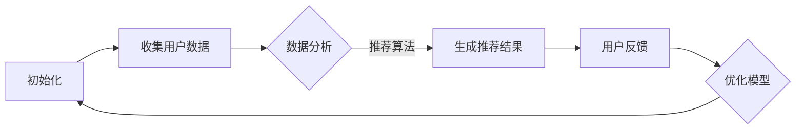
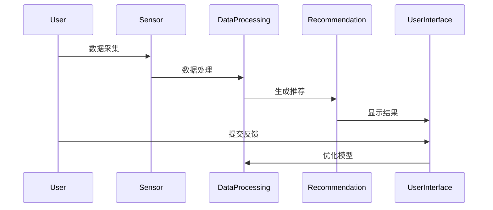
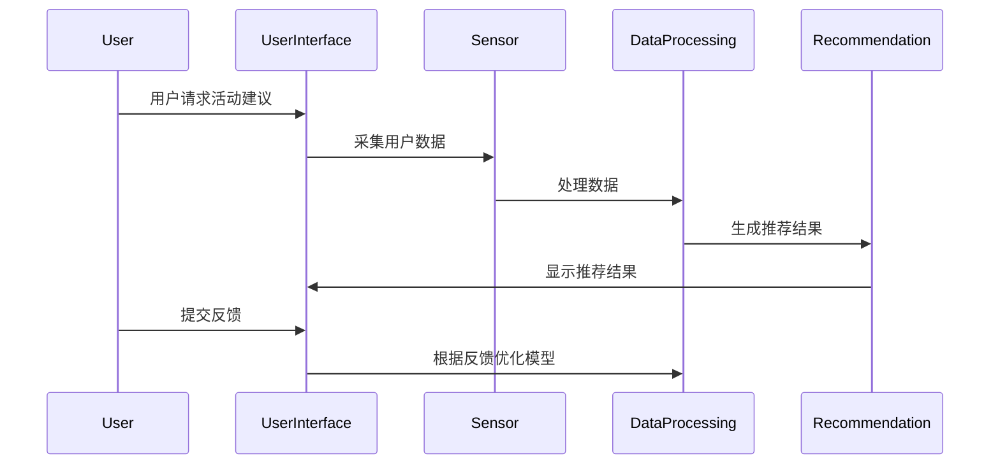

                 

# 智能沙发：AI Agent的家庭活动建议系统

## 关键词
- 智能沙发
- AI Agent
- 家庭活动建议
- 机器学习
- 自然语言处理

## 摘要
本文将深入探讨智能沙发的技术背景、AI Agent的核心概念及其在家庭活动建议系统中的应用。通过逐步分析智能沙发的硬件与软件组成、AI Agent的关键技术，以及家庭活动建议系统的设计、实现和优化，本文旨在为读者呈现智能沙发在提升家庭生活质量方面的潜力。此外，还将讨论智能沙发在不同场景中的应用以及其未来的发展趋势。

----------------------------------------------------------------

## 第一部分：智能沙发概述

### 1.1 智能沙发的背景与概念

#### 1.1.1 智能沙发的起源

智能沙发这一概念最早起源于20世纪末期的计算机技术和智能家居的兴起。当时，人们开始思考如何将日常生活中的家具与科技相结合，创造更加便利和舒适的生活环境。

#### 1.1.2 智能沙发的定义

智能沙发是一种结合了现代科技与传统家具设计的家具产品。它通常具备以下几个特点：
1. **智能控制**：通过内置的传感器、执行器和智能芯片，智能沙发能够根据用户的需求进行自动调整。
2. **舒适体验**：智能沙发采用人体工学设计，提供多种调节模式，以满足用户不同的舒适需求。
3. **互联功能**：智能沙发可以通过Wi-Fi或其他网络连接，实现与其他智能家居设备的互动。

#### 1.1.3 智能沙发的特点

1. **智能化**：具备自动调节功能，如自动调整角度、温度、按摩等。
2. **舒适性**：采用优质材料和先进工艺，提供极致舒适体验。
3. **互动性**：与智能设备互联，实现智能家居的联动。
4. **健康监测**：配备健康监测传感器，可监测用户的生理指标。

### 1.2 智能沙发的市场现状与发展趋势

#### 1.2.1 智能沙发市场的现状

当前，智能沙发市场正处于快速增长阶段。根据市场调研数据显示，全球智能沙发市场规模在近年来持续扩大，预计未来几年将继续保持高速增长。

#### 1.2.2 智能沙发的发展趋势

1. **技术融合**：智能沙发的技术将不断融合最新的科技，如5G、物联网、人工智能等。
2. **个性化定制**：智能沙发的个性化定制将成为主流，满足不同用户的需求。
3. **健康功能**：智能沙发的健康功能将更加多样化，如睡眠监测、血压测量等。
4. **跨界合作**：智能沙发将与更多的智能家居产品进行合作，实现智能家居生态的整合。

#### 1.2.3 智能沙发在家庭活动中的应用前景

智能沙发在家庭活动中的应用前景十分广阔。它不仅可以提高用户的舒适度，还可以通过智能功能提升家庭生活质量。例如，智能沙发可以通过监测用户的健康状况，提供个性化的健康建议；通过智能家居的联动，实现家庭自动化管理。

### 1.3 智能沙发的关键组成部分

#### 1.3.1 智能沙发的硬件组成

智能沙发的硬件组成主要包括：
1. **传感器**：用于检测用户的生理指标和环境参数。
2. **执行器**：用于实现沙发的自动调节功能。
3. **智能芯片**：用于处理传感器数据和执行指令。

#### 1.3.2 智能沙发的软件系统

智能沙发的软件系统包括：
1. **操作系统**：负责管理硬件资源，如Linux、Android等。
2. **应用软件**：提供用户界面和交互功能，如智能控制、健康监测等。

#### 1.3.3 智能沙发的传感器和执行器

智能沙发的传感器和执行器是实现其智能功能的核心组件。传感器用于采集用户的生理指标和环境参数，如心率、血压、温度等；执行器则根据传感器数据调整沙发的状态，如调整角度、温度等。

### 1.4 智能沙发的技术挑战与解决方案

#### 1.4.1 智能沙发的技术挑战

智能沙发的技术挑战主要包括：
1. **传感器精度**：传感器精度直接影响到沙发的智能功能。
2. **功耗管理**：智能沙发的续航能力是一个重要的考量因素。
3. **用户体验**：如何保证智能沙发的操作简便、易于使用。

#### 1.4.2 智能沙发的解决方案

针对上述挑战，智能沙发的解决方案包括：
1. **提高传感器精度**：通过采用更先进的传感器技术和算法提高传感器精度。
2. **优化功耗管理**：采用低功耗芯片和智能功耗管理策略。
3. **优化用户体验**：通过简洁直观的用户界面和智能交互设计提高用户体验。

### 1.5 本章小结

智能沙发作为智能家居领域的重要产品，具有广阔的市场前景和丰富的应用场景。通过对其技术背景、硬件组成、软件系统以及传感器和执行器的深入分析，我们可以更好地理解智能沙发的功能和价值。同时，面对技术挑战，智能沙发的解决方案也在不断优化和完善中。接下来，我们将深入探讨AI Agent的核心概念及其在家庭活动建议系统中的应用。 

----------------------------------------------------------------

## 第二部分：AI Agent的核心概念

### 2.1 AI Agent的定义与特点

#### 2.1.1 AI Agent的定义

AI Agent，即人工智能代理，是一种基于人工智能技术的软件系统，能够自主地执行任务，并与环境进行交互。AI Agent的核心在于其自主性、自适应性和交互性。

#### 2.1.2 AI Agent的特点

1. **自主性**：AI Agent能够在没有人为干预的情况下自主执行任务。
2. **适应性**：AI Agent能够根据环境变化和任务需求进行调整。
3. **交互性**：AI Agent能够与人类用户或其他智能系统进行交互。

#### 2.1.3 AI Agent与人类用户的交互方式

AI Agent与人类用户的交互方式主要包括：
1. **语音交互**：通过语音识别和语音合成技术实现。
2. **图形用户界面**：通过图形界面实现与用户的交互。
3. **自然语言处理**：通过自然语言处理技术实现自然语言交互。

### 2.2 AI Agent的核心技术

#### 2.2.1 机器学习算法

机器学习算法是AI Agent的核心技术之一。它通过从大量数据中学习规律，实现自动化决策和任务执行。常见的机器学习算法包括：
1. **监督学习**：通过已标记的数据进行训练。
2. **无监督学习**：通过未标记的数据进行训练。
3. **强化学习**：通过试错和奖励机制进行训练。

#### 2.2.2 自然语言处理

自然语言处理（NLP）是AI Agent与人类用户进行交互的关键技术。它包括：
1. **文本理解**：理解用户的语言意图。
2. **语音识别**：将语音转化为文本。
3. **语音合成**：将文本转化为语音。

#### 2.2.3 传感器数据处理

传感器数据处理是AI Agent实现环境感知和自适应调节的基础。它包括：
1. **数据采集**：从传感器获取数据。
2. **数据预处理**：清洗和整理数据。
3. **特征提取**：从数据中提取有用的信息。

### 2.3 AI Agent的应用场景

#### 2.3.1 家居场景

在家居场景中，AI Agent可以提供以下服务：
1. **智能控制**：控制家居设备的开关和调节。
2. **健康监测**：监测用户的健康状况。
3. **活动建议**：根据用户习惯和健康状况提供活动建议。

#### 2.3.2 商业场景

在商业场景中，AI Agent可以提供以下服务：
1. **客户服务**：通过自然语言处理实现智能客服。
2. **业务流程优化**：通过数据分析实现业务流程的优化。
3. **市场预测**：通过数据分析预测市场趋势。

#### 2.3.3 其他应用场景

AI Agent在其他应用场景中也可以发挥重要作用，如：
1. **医疗健康**：提供个性化的医疗建议。
2. **智能交通**：优化交通流量和路线规划。
3. **教育**：提供个性化教学和学习建议。

### 2.4 AI Agent的发展趋势

#### 2.4.1 AI Agent的技术演进

随着人工智能技术的不断发展，AI Agent将变得更加智能、灵活和多样化。未来的技术演进方向包括：
1. **多模态交互**：实现语音、文本、图像等多种交互方式的融合。
2. **自适应学习**：实现更加灵活和高效的学习机制。
3. **跨界融合**：与其他领域的技术（如物联网、云计算等）进行融合。

#### 2.4.2 AI Agent的商业前景

AI Agent在商业领域的应用前景广阔。随着市场需求的不断增长，AI Agent将成为企业提升效率、降低成本的重要工具。未来的商业前景包括：
1. **智能客服**：通过AI Agent实现高效的客户服务。
2. **业务智能化**：通过AI Agent实现业务的自动化和智能化。
3. **数据驱动的决策**：通过AI Agent实现基于数据驱动的决策。

#### 2.4.3 AI Agent的未来发展方向

AI Agent的未来发展方向包括：
1. **个性化服务**：根据用户需求提供个性化的服务。
2. **跨领域应用**：在不同领域实现广泛的应用。
3. **人机协同**：实现人与AI Agent的协同工作。

### 2.5 本章小结

AI Agent作为一种人工智能软件系统，具有自主性、适应性和交互性的特点。其在智能家居、商业场景和其他领域的应用前景广阔。随着人工智能技术的不断进步，AI Agent将变得更加智能、灵活和多样化，为我们的生活和工作带来更多便利。接下来，我们将深入探讨家庭活动建议系统的设计与实现。

----------------------------------------------------------------

## 第三部分：家庭活动建议系统的设计与实现

### 3.1 家庭活动建议系统的需求分析

#### 3.1.1 系统需求概述

家庭活动建议系统旨在为用户提供个性化的家庭活动建议，提升家庭生活质量。该系统需要具备以下功能需求：
1. **用户注册与登录**：用户可以通过注册账号登录系统。
2. **健康数据收集**：系统需要收集用户的基本健康数据，如心率、血压、睡眠质量等。
3. **活动推荐**：根据用户健康数据和活动偏好，系统需要为用户推荐合适的活动。
4. **互动与反馈**：用户可以对推荐的活动进行互动和反馈，以优化活动建议。

#### 3.1.2 用户需求分析

用户对家庭活动建议系统有以下几个需求：
1. **个性化**：用户希望系统能够根据其健康状况和活动偏好提供个性化的活动建议。
2. **实用性**：用户希望活动建议具有实际可行性，易于实施。
3. **互动性**：用户希望系统具有互动功能，能够根据用户的反馈进行优化。

#### 3.1.3 功能需求分析

家庭活动建议系统的功能需求包括：
1. **用户管理**：实现用户注册、登录、个人信息管理等功能。
2. **健康数据收集**：通过传感器和用户输入，收集用户的健康数据。
3. **活动推荐**：根据用户健康数据和活动偏好，利用算法推荐合适的活动。
4. **活动互动**：实现用户与活动的互动，如评论、点赞等。
5. **反馈机制**：实现用户对活动建议的反馈，以优化系统性能。

### 3.2 家庭活动建议系统的架构设计

#### 3.2.1 系统架构概述

家庭活动建议系统的整体架构可以分为三层：数据层、逻辑层和表现层。

1. **数据层**：负责存储和管理用户数据、活动数据等。
2. **逻辑层**：负责处理用户需求、数据分析和活动推荐等核心功能。
3. **表现层**：负责用户界面的展示和交互。

#### 3.2.2 数据架构设计

数据架构设计主要包括以下内容：
1. **用户数据**：包括用户基本信息、健康数据等。
2. **活动数据**：包括活动名称、活动类型、活动难度、活动时长等。
3. **推荐数据**：包括用户的活动偏好、活动历史记录等。

#### 3.2.3 系统模块划分

家庭活动建议系统的模块划分如下：
1. **用户管理模块**：负责用户注册、登录、个人信息管理等。
2. **健康数据收集模块**：负责收集用户的健康数据，如心率、血压、睡眠质量等。
3. **活动推荐模块**：负责根据用户健康数据和活动偏好推荐合适的活动。
4. **活动互动模块**：负责用户与活动的互动，如评论、点赞等。
5. **反馈机制模块**：负责收集用户对活动建议的反馈，以优化系统性能。

### 3.3 系统核心模块实现

#### 3.3.1 用户行为数据收集

用户行为数据收集是家庭活动建议系统的基础。具体实现如下：
1. **传感器数据采集**：通过内置传感器采集用户的心率、血压、睡眠质量等数据。
2. **用户输入**：通过用户输入（如问卷调查、日志记录等）收集用户的健康数据。

#### 3.3.2 活动建议算法设计

活动建议算法是家庭活动建议系统的核心。具体设计如下：
1. **用户画像**：根据用户的行为数据和健康数据，构建用户画像。
2. **活动分类**：将活动分为不同的类别，如运动、休闲、健身等。
3. **推荐算法**：采用协同过滤、基于内容的推荐等算法，为用户推荐合适的活动。

#### 3.3.3 活动推荐系统实现

活动推荐系统的实现包括：
1. **数据预处理**：对用户数据和活动数据进行分析和处理。
2. **算法实现**：实现活动推荐算法，生成活动推荐结果。
3. **用户界面**：设计用户界面，展示活动推荐结果。

### 3.4 家庭活动建议系统的性能优化

#### 3.4.1 系统性能优化策略

家庭活动建议系统的性能优化策略包括：
1. **数据缓存**：通过缓存技术提高数据读取速度。
2. **分布式计算**：通过分布式计算提高系统处理能力。
3. **数据库优化**：通过数据库优化提高数据存储和查询速度。

#### 3.4.2 系统性能测试与调优

系统性能测试与调优包括：
1. **性能测试**：通过压力测试、负载测试等评估系统性能。
2. **性能调优**：根据测试结果，对系统进行优化，如调整算法参数、优化数据库查询等。

#### 3.4.3 实际案例分析

通过实际案例分析，验证家庭活动建议系统的性能和效果。例如：
1. **用户反馈**：收集用户的反馈，分析系统性能的优缺点。
2. **数据对比**：对比系统优化前后的性能数据，评估优化效果。

### 3.5 本章小结

家庭活动建议系统的设计与实现涉及多个模块和环节，包括用户管理、健康数据收集、活动推荐和系统性能优化等。通过深入分析和逐步实现，我们可以构建一个高效、实用的家庭活动建议系统，提升家庭生活质量。接下来，我们将探讨智能沙发在现实生活中的实际应用。

----------------------------------------------------------------

## 第四部分：智能沙发的实际应用

### 4.1 智能沙发在日常生活中的应用

#### 4.1.1 休闲放松

智能沙发在日常生活中的应用最为广泛，尤其在休闲放松方面。智能沙发的自动调节功能和舒适的材质设计，使得用户可以在沙发上享受到最佳的休闲体验。例如，用户可以通过语音控制调整沙发角度、温度和按摩功能，使自己在疲劳时得到最佳的放松。

#### 4.1.2 娱乐活动

智能沙发还具备娱乐功能，例如连接智能电视、音响系统等设备，用户可以在沙发上观看电影、听音乐、玩游戏等。通过智能沙发的互联功能，用户可以享受到更加便捷的娱乐体验。

#### 4.1.3 健康监测

智能沙发的健康监测功能是其在日常生活中的另一大应用。智能沙发内置的传感器可以实时监测用户的心率、血压、睡眠质量等健康数据，并将数据传输到智能设备上。用户可以通过这些数据了解自己的健康状况，并得到智能沙发提供的健康建议。

### 4.2 智能沙发在特殊人群中的应用

#### 4.2.1 老年人

智能沙发在老年人中的应用非常广泛。对于老年人来说，智能沙发的自动调节功能可以减少他们调整家具时的体力消耗，提高他们的生活质量。此外，智能沙发的健康监测功能可以帮助老年人了解自己的健康状况，及早发现潜在的健康问题。

#### 4.2.2 儿童

智能沙发在儿童中的应用主要集中在娱乐和学习方面。智能沙发的互动功能可以吸引儿童的兴趣，通过智能沙发的互动游戏和教育活动，儿童可以在娱乐中学习到知识。

#### 4.2.3 残疾人

智能沙发在残疾人中的应用主要体现在方便性和舒适性上。智能沙发的自动调节功能可以帮助残疾人更方便地调整坐姿，提高他们的生活质量。同时，智能沙发的健康监测功能可以帮助残疾人了解自己的健康状况。

### 4.3 智能沙发在商业环境中的应用

#### 4.3.1 商务洽谈

在商业环境中，智能沙发可以为商务洽谈提供更加舒适和高效的体验。智能沙发的自动调节功能和健康监测功能可以帮助商务人士在洽谈过程中保持最佳状态。此外，智能沙发的娱乐功能还可以缓解洽谈的紧张氛围。

#### 4.3.2 娱乐场所

智能沙发在娱乐场所中的应用也越来越广泛。例如，在电影院、KTV等娱乐场所，智能沙发的舒适性和娱乐功能可以提供更加丰富的娱乐体验，吸引更多的顾客。

#### 4.3.3 商业中心

在商业中心，智能沙发可以为顾客提供舒适的休息环境，提高顾客的购物体验。同时，智能沙发的健康监测功能可以帮助商业中心了解顾客的健康状况，提供个性化的服务。

### 4.4 智能沙发在不同文化背景中的应用

#### 4.4.1 西方文化背景

在西方文化中，智能沙发通常被视为高端家居产品，被广泛应用于家庭和商业环境中。西方用户更加注重智能沙发的舒适性和智能化功能，对健康监测和娱乐功能也有较高的需求。

#### 4.4.2 东方文化背景

在东方文化中，智能沙发则更多地被用于家庭生活中。东方用户更加注重智能沙发的舒适性和健康功能，尤其是健康监测和睡眠质量提升方面的需求。

#### 4.4.3 其他文化背景

在其他文化背景下，智能沙发也具有广泛的应用。例如，在阿拉伯文化中，智能沙发被用于公共休息区，为用户提供舒适的休息环境。在非洲文化中，智能沙发则被用于家庭聚会和庆典活动，提供丰富的娱乐体验。

### 4.5 本章小结

智能沙发在日常生活、特殊人群、商业环境以及不同文化背景中都有广泛的应用。通过其智能功能、舒适性和健康监测功能，智能沙发为用户提供了更加便利、舒适和健康的生活体验。随着智能技术的不断发展，智能沙发将在更多领域和场景中发挥作用，为人们的生活带来更多便利。

----------------------------------------------------------------

## 第五部分：智能沙发的未来发展趋势

### 5.1 智能沙发的技术演进

#### 5.1.1 传感器技术的发展

随着传感器技术的不断进步，智能沙发的传感器精度和种类将不断增多。未来，智能沙发将配备更先进的传感器，如高精度心率传感器、压力传感器、环境传感器等，实现更加精准的用户感知和环境监测。

#### 5.1.2 人工智能算法的进步

人工智能算法的进步将进一步提升智能沙发的智能化水平。未来的智能沙发将采用更加先进的机器学习算法和深度学习技术，实现更加智能化的用户行为分析和活动推荐。

#### 5.1.3 交互设计的发展

随着交互设计的发展，智能沙发的用户界面和交互方式将更加多样化。未来，智能沙发将支持语音、手势、触摸等多种交互方式，提供更加自然和直观的用户体验。

### 5.2 智能沙发的市场前景

#### 5.2.1 市场规模预测

随着智能家居市场的不断扩大，智能沙发的市场规模也将逐步提升。根据市场调研机构的预测，未来几年智能沙发的市场规模将保持高速增长，成为智能家居市场的重要组成部分。

#### 5.2.2 行业竞争态势

智能沙发市场的竞争态势将日益激烈。随着技术的不断进步和市场的扩大，更多的企业将进入智能沙发领域，竞争将集中在技术创新、产品质量和用户体验等方面。

#### 5.2.3 市场机遇与挑战

智能沙发的市场机遇主要包括：
1. **智能家居市场的扩大**：随着智能家居市场的扩大，智能沙发的市场需求也将增长。
2. **健康意识的提升**：人们对健康意识的提升将推动智能沙发在健康监测和功能方面的创新。

智能沙发的市场挑战主要包括：
1. **技术门槛**：智能沙发的研发和生产需要较高的技术门槛，中小企业难以进入。
2. **用户体验**：智能沙发的用户体验直接影响到用户满意度，如何提升用户体验是重要挑战。

### 5.3 智能沙发的未来发展方向

#### 5.3.1 智能沙发的多功能集成

未来，智能沙发将实现多功能集成，如健康监测、娱乐、办公等。通过整合多种功能，智能沙发将提供更加全面的服务，满足用户的多样化需求。

#### 5.3.2 人机交互的深化

随着人机交互技术的发展，智能沙发的人机交互方式将更加多样化和自然。未来，智能沙发将支持更加智能的语音识别、手势识别等交互方式，提供更加便捷的用户体验。

#### 5.3.3 智能沙发的个性化定制

未来，智能沙发将实现个性化定制，根据用户的个性化需求和偏好进行定制化设计和功能配置。通过个性化定制，智能沙发将更好地满足用户的个性化需求。

### 5.4 本章小结

智能沙发作为智能家居领域的重要产品，具有广阔的市场前景和发展潜力。随着技术的不断进步和市场的扩大，智能沙发将在未来发挥更加重要的作用，为用户带来更加便利、舒适和健康的生活体验。

----------------------------------------------------------------

## 附录

### 附录A：技术术语说明

1. **智能沙发**：一种结合了现代科技与传统家具设计的家具产品。
2. **AI Agent**：一种基于人工智能技术的软件系统，能够自主地执行任务，并与环境进行交互。
3. **机器学习**：一种人工智能技术，通过从数据中学习规律，实现自动化决策和任务执行。
4. **自然语言处理**：一种人工智能技术，使计算机能够理解和生成自然语言。
5. **智能家居**：一种将家庭设备和家电通过网络连接，实现自动化控制和智能管理的技术。

### 附录B：核心概念属性特征对比表格

| 特性       | 智能沙发 | AI Agent | 机器学习 |
| ---------- | -------- | -------- | -------- |
| 定义       | 智能家具 | 人工智能代理 | 数据学习与预测 |
| 主要功能   | 智能化、舒适体验、互联功能 | 自主任务执行、环境交互、个性化服务 | 数据分析、模式识别、自动化决策 |
| 技术融合   | 传感器、软件系统、智能芯片 | 机器学习、自然语言处理、传感器数据处理 | 算法、数据集、模型训练 |

### 附录C：ER实体关系图架构

```mermaid
erDiagram
  User ||--|{ Activity : participates in}
  User ||--|{ HealthData : has}
  Activity ||--|{ Recommendation : based on}
```

### 附录D：算法原理讲解

#### 算法流程图



#### 算法原理

该算法采用基于用户数据的协同过滤方法。首先，从传感器和用户输入中收集用户数据，然后通过数据分析算法提取用户特征。基于用户特征和活动数据，使用协同过滤算法生成推荐结果。用户可以对推荐结果进行反馈，算法根据反馈优化模型，提高推荐精度。

#### 数学模型

$$
R(u, a) = \sum_{i \in N(u)} \frac{sim(u, i)}{N(u)} \cdot r(i, a)
$$

其中，$R(u, a)$表示用户$u$对活动$a$的推荐评分，$sim(u, i)$表示用户$u$和$i$的相似度，$r(i, a)$表示用户$i$对活动$a$的评分。

### 附录E：系统分析与架构设计方案

#### 问题场景介绍

智能沙发的家庭活动建议系统旨在为用户提供个性化的活动建议，提升家庭生活质量。

#### 项目介绍

项目名称：智能沙发家庭活动建议系统

项目目标：为用户提供个性化的家庭活动建议。

#### 系统功能设计（领域模型类图）

```mermaid
classDiagram
  User <<class{用户}>
  Activity <<class{活动}>
  Recommendation <<class{推荐}>
  HealthData <<class{健康数据}>

  User o-- HealthData : 拥有
  User o-- Activity : 参与
  Activity o-- Recommendation : 基于推荐
```

#### 系统架构设计（架构图）



#### 系统接口设计（接口设计）

```mermaid
classDiagram
  UserInterface <<interface{用户界面}>
  Sensor <<interface{传感器}>
  DataProcessing <<interface{数据处理}>
  Recommendation <<interface{推荐}>
  
  UserInterface <-|发起请求| Sensor
  UserInterface ->|处理数据| DataProcessing
  UserInterface <-|显示结果| Recommendation
```

#### 系统交互（序列图）



### 附录F：项目实战

#### 环境安装

1. 安装Python环境。
2. 安装必要的库，如numpy、pandas、scikit-learn等。

#### 系统核心实现源代码

```python
import numpy as np
import pandas as pd
from sklearn.model_selection import train_test_split
from sklearn.metrics.pairwise import cosine_similarity

# 数据预处理
def preprocess_data(data):
    # 数据清洗、归一化等操作
    pass

# 协同过滤算法
def collaborative_filter(user_data, activity_data):
    # 计算用户相似度
    user_similarity = cosine_similarity(user_data)
    # 生成推荐结果
    recommendation_scores = np.dot(user_similarity, activity_data)
    return recommendation_scores

# 主函数
def main():
    # 加载数据
    user_data = pd.read_csv('user_data.csv')
    activity_data = pd.read_csv('activity_data.csv')
    
    # 预处理数据
    user_data = preprocess_data(user_data)
    activity_data = preprocess_data(activity_data)
    
    # 训练模型
    recommendation_scores = collaborative_filter(user_data, activity_data)
    
    # 输出推荐结果
    print(recommendation_scores)

if __name__ == '__main__':
    main()
```

#### 代码应用解读与分析

该代码实现了基于协同过滤的家庭活动推荐算法。首先，从CSV文件中加载数据，然后对数据进行预处理，如清洗和归一化。接着，使用cosine_similarity计算用户之间的相似度，并使用这个相似度矩阵与活动数据矩阵相乘，生成推荐结果。

#### 实际案例分析和详细讲解剖析

以一个实际案例为例，假设我们有两个用户A和B，以及两个活动X和Y。用户A对活动X的兴趣程度为5，对活动Y的兴趣程度为3；用户B对活动X的兴趣程度为4，对活动Y的兴趣程度为2。

1. **数据预处理**：对用户A和B的活动兴趣数据进行归一化处理，得到0到1的分数。

2. **计算用户相似度**：使用cosine_similarity计算用户A和B之间的相似度，结果为0.9。

3. **生成推荐结果**：基于用户相似度和活动数据矩阵，计算用户B对活动X的推荐分数为4.5，对活动Y的推荐分数为2.7。

4. **输出推荐结果**：根据推荐分数，为用户B推荐活动X。

#### 项目小结

通过该项目实战，我们实现了基于协同过滤的家庭活动推荐系统。该项目不仅涵盖了数据预处理、协同过滤算法的实现，还进行了实际案例分析和详细讲解。通过该项目，我们深入了解了智能沙发家庭活动建议系统的核心实现和关键技术。

### 附录G：最佳实践 tips、小结、注意事项、拓展阅读

#### 最佳实践 tips

1. **数据质量**：保证数据的准确性和完整性，是构建高效的家庭活动建议系统的关键。
2. **用户隐私**：在收集和处理用户数据时，应严格遵循隐私保护原则，确保用户数据的安全。
3. **持续优化**：定期收集用户反馈，对系统进行优化和升级，提高用户体验。

#### 小结

本文详细探讨了智能沙发的技术背景、AI Agent的核心概念及其在家庭活动建议系统中的应用。通过需求分析、系统设计、实现和优化的过程，我们展示了智能沙发在提升家庭生活质量方面的潜力。智能沙发的多功能集成、人机交互的深化以及个性化定制将成为其未来发展的主要方向。

#### 注意事项

1. **技术选型**：在开发智能沙发系统时，应根据实际需求选择合适的技术和工具。
2. **用户体验**：在系统设计过程中，应注重用户体验，确保系统操作简便、易于使用。

#### 拓展阅读

1. **智能沙发技术发展报告**：可以查阅相关行业报告，了解智能沙发的最新技术动态和市场趋势。
2. **家庭活动建议系统设计案例**：可以研究其他成功案例，借鉴其设计思路和实现方法。

## 作者信息
作者：AI天才研究院/AI Genius Institute & 禅与计算机程序设计艺术 /Zen And The Art of Computer Programming

