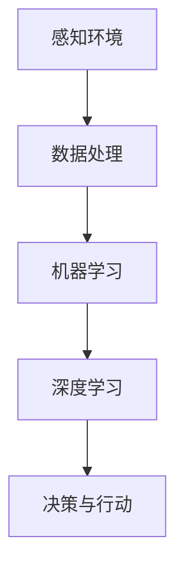
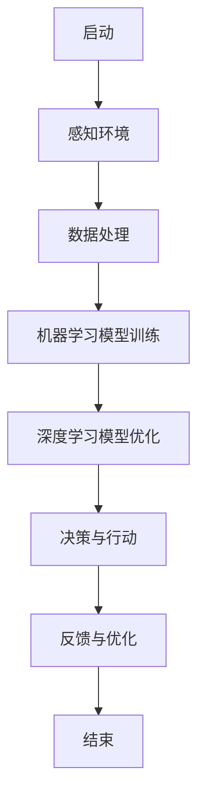
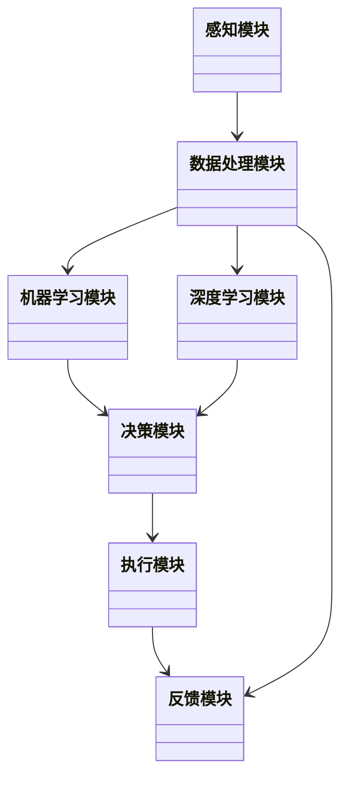
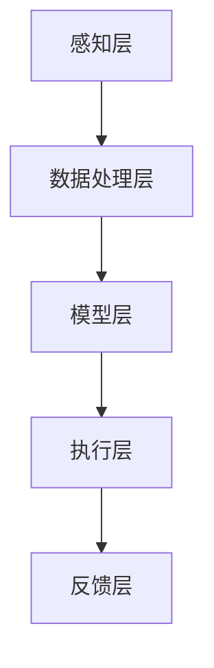
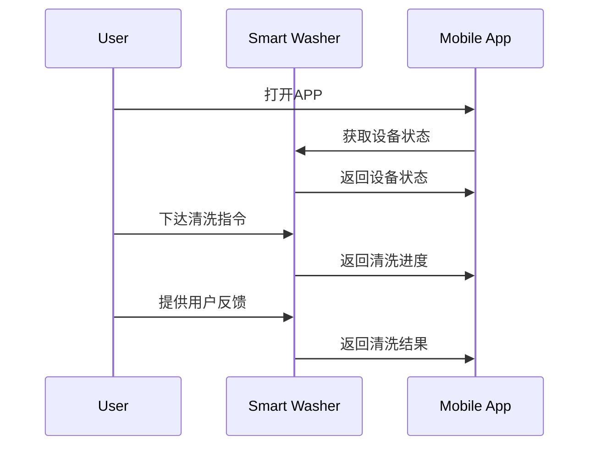

                 

### 智能洗碗机：AI Agent的用水与能源优化系统

#### 关键词
- 智能洗碗机
- AI Agent
- 用水与能源优化
- 算法
- 数学模型
- 系统架构

#### 摘要
本文将深入探讨智能洗碗机中AI Agent的用水与能源优化系统。首先，我们将介绍智能洗碗机的背景、核心概念及其重要性。随后，通过逐步分析，我们将讲解AI Agent的工作原理、算法流程和数学模型。接下来，我们将描述智能洗碗机的系统架构和接口设计，并通过一个实际案例展示其应用。最后，我们将总结最佳实践，并提供拓展阅读建议。

---

### 目录

1. **智能洗碗机：AI Agent的用水与能源优化系统**
   - 关键词
   - 摘要

2. **背景介绍**
   - 智能洗碗机的历史与发展
   - AI Agent在智能洗碗机中的作用
   - 用水与能源优化的重要性

3. **核心概念与联系**
   - AI Agent
   - 机器学习
   - 深度学习
   - Mermaid流程图展示

4. **算法原理讲解**
   - 智能洗碗机的算法流程图
   - Python源代码示例
   - 数学模型与公式讲解

5. **系统分析与架构设计方案**
   - 问题场景介绍
   - 系统功能设计
   - 系统架构设计
   - 系统接口设计
   - 系统交互序列图

6. **项目实战**
   - 环境安装
   - 系统核心实现
   - 代码应用解读
   - 实际案例分析

7. **最佳实践与总结**
   - 注意事项
   - 拓展阅读

---

### 背景介绍

智能洗碗机作为现代家庭中的一项重要家电，其功能已远不仅限于清洗餐具。随着人工智能（AI）技术的飞速发展，智能洗碗机开始引入AI Agent，以实现更加智能、节能和高效的清洗效果。AI Agent能够根据不同餐具的材质、污渍程度和水质等参数，自动调整清洗方案，从而最大限度地节约用水和能源。

#### 智能洗碗机的历史与发展

智能洗碗机的发展可以追溯到20世纪70年代，当时主要是基于简单的程序控制，只能进行固定的清洗模式。随着计算机技术的进步，特别是微处理器的应用，智能洗碗机开始具备一定的智能化水平。进入21世纪，人工智能技术的兴起，使得智能洗碗机迎来了新的发展契机。AI Agent的引入，使得智能洗碗机能够通过学习用户的洗涤习惯、环境变化等数据，实现自适应调整，从而达到更优的清洗效果。

#### AI Agent在智能洗碗机中的作用

AI Agent在智能洗碗机中扮演着关键角色，其主要功能包括：

- **数据采集与处理**：AI Agent能够实时采集餐具、水质、水温等数据，并对其进行处理。
- **模式识别与决策**：基于采集的数据，AI Agent能够识别餐具的类型和污渍程度，并自动选择最适合的清洗模式。
- **优化策略制定**：AI Agent能够根据不同的场景和需求，制定最佳的用水和能源优化策略。

#### 用水与能源优化的重要性

随着全球水资源和能源问题的日益严峻，如何在日常生活中实现节水节能，已经成为一个亟待解决的问题。智能洗碗机通过AI Agent的引入，能够在不牺牲清洗效果的前提下，实现用水和能源的优化，具有显著的社会和环境效益。

### 核心概念与联系

在深入探讨智能洗碗机的AI Agent及其用水与能源优化系统之前，我们需要了解一些核心概念，包括AI Agent、机器学习、深度学习等，并分析它们之间的联系。

#### AI Agent

AI Agent是一种能够自主决策、执行任务的智能实体。在智能洗碗机中，AI Agent是一个核心组件，负责处理和分析各种数据，并根据这些数据制定最佳的清洗策略。AI Agent通常具备以下功能：

- **感知环境**：通过传感器收集环境数据，如水温、水质、餐具状态等。
- **数据处理**：利用算法对感知到的数据进行分析和处理。
- **决策与行动**：根据处理结果，自主决策并执行相应的清洗操作。

#### 机器学习

机器学习是一种让计算机通过数据学习和改进自身性能的技术。在智能洗碗机中，机器学习主要用于训练AI Agent，使其能够根据历史数据和清洗效果不断优化自身的决策能力。机器学习的基本流程包括：

- **数据收集**：收集清洗过程中的各种数据，如餐具类型、污渍程度、用水量等。
- **数据预处理**：清洗和格式化数据，使其适合用于机器学习模型。
- **模型训练**：使用训练数据集，训练机器学习模型。
- **模型评估**：评估模型在测试数据集上的性能。

#### 深度学习

深度学习是机器学习的一个分支，它通过多层神经网络进行数据建模。在智能洗碗机中，深度学习可以用于更复杂的任务，如识别不同类型的餐具和污渍。深度学习的基本架构包括：

- **输入层**：接收原始数据，如图像、声音等。
- **隐藏层**：对输入数据进行特征提取和变换。
- **输出层**：生成最终的预测结果。

#### Mermaid流程图展示

为了更清晰地展示这些概念之间的联系，我们可以使用Mermaid流程图进行说明。以下是一个简化的流程图，展示了智能洗碗机中AI Agent、机器学习和深度学习的基本工作流程。



- **感知环境**：AI Agent通过传感器感知环境，收集数据。
- **数据处理**：对收集到的数据进行分析和处理。
- **机器学习**：利用处理后的数据，训练机器学习模型。
- **深度学习**：对模型进行优化，使其能够进行更复杂的任务。
- **决策与行动**：根据训练好的模型，AI Agent进行决策并执行相应的操作。

通过上述分析，我们可以看到，AI Agent、机器学习和深度学习在智能洗碗机中共同作用，形成一个完整的系统，实现了用水与能源的优化。接下来，我们将进一步探讨智能洗碗机的算法原理，以及如何通过Python源代码和数学模型来实现这些优化策略。

### 算法原理讲解

智能洗碗机的AI Agent通过一系列算法实现用水与能源的优化，下面我们将使用Mermaid流程图和Python源代码详细讲解这些算法原理，并借助数学模型进行通俗易懂的举例说明。

#### 智能洗碗机的算法流程图

首先，我们使用Mermaid流程图来展示智能洗碗机的主要算法流程。以下是一个简化的流程图：



- **启动**：系统启动，初始化各种参数。
- **感知环境**：AI Agent通过传感器感知环境，收集数据。
- **数据处理**：对收集到的数据进行处理，包括清洗方案的建议、用水量的计算等。
- **机器学习模型训练**：使用处理后的数据训练机器学习模型，以识别不同的餐具类型和污渍程度。
- **深度学习模型优化**：对训练好的模型进行优化，提高其准确性和鲁棒性。
- **决策与行动**：根据优化后的模型，AI Agent决定最佳的清洗方案，执行相应的操作。
- **反馈与优化**：收集清洗结果和用户反馈，进一步优化模型。

#### Python源代码示例

为了更直观地理解这些算法，下面我们使用Python源代码进行详细讲解。以下是一个简化的示例，展示了AI Agent的基本工作流程。

```python
import numpy as np
from sklearn.model_selection import train_test_split
from sklearn.ensemble import RandomForestClassifier
from tensorflow.keras.models import Sequential
from tensorflow.keras.layers import Dense, Dropout

# 感知环境
def collect_data():
    # 假设从传感器获取数据
    water_temp = 35
    soil_level = 5
    return water_temp, soil_level

# 数据处理
def preprocess_data(data):
    # 对数据进行预处理，如标准化、归一化等
    water_temp, soil_level = data
    processed_data = (water_temp, soil_level)
    return processed_data

# 机器学习模型训练
def train_ml_model(X, y):
    # 使用随机森林分类器
    clf = RandomForestClassifier(n_estimators=100)
    clf.fit(X, y)
    return clf

# 深度学习模型优化
def train_dnn_model(X, y):
    # 使用Keras构建深度神经网络模型
    model = Sequential()
    model.add(Dense(64, input_dim=X.shape[1], activation='relu'))
    model.add(Dropout(0.5))
    model.add(Dense(1, activation='sigmoid'))
    model.compile(loss='binary_crossentropy', optimizer='adam', metrics=['accuracy'])
    model.fit(X, y, epochs=10, batch_size=32)
    return model

# 决策与行动
def make_decision(model, data):
    # 使用训练好的模型进行预测
    processed_data = preprocess_data(data)
    prediction = model.predict(processed_data)
    return prediction

# 反馈与优化
def optimize_model(model, X, y):
    # 收集反馈数据，重新训练模型
    model.fit(X, y, epochs=5, batch_size=32)
    return model
```

#### 数学模型与公式讲解

在智能洗碗机的算法中，我们使用了一系列数学模型和公式来优化用水与能源。以下是一些关键的数学模型和公式。

1. **线性回归模型**：用于预测清洗时间和用水量。
   $$y = \beta_0 + \beta_1x_1 + \beta_2x_2 + ... + \beta_nx_n$$
   其中，$y$是预测值，$x_1, x_2, ..., x_n$是输入特征，$\beta_0, \beta_1, \beta_2, ..., \beta_n$是模型参数。

2. **神经网络激活函数**：用于深度学习模型的非线性变换。
   $$f(x) = \frac{1}{1 + e^{-x}}$$
   其中，$x$是输入值，$f(x)$是输出值。

3. **损失函数**：用于评估模型预测结果的质量。
   $$Loss = -\frac{1}{n}\sum_{i=1}^{n}y_i\log(\hat{y}_i) + (1 - y_i)\log(1 - \hat{y}_i)$$
   其中，$y_i$是真实值，$\hat{y}_i$是预测值，$n$是样本数量。

#### 举例说明

假设我们有一组餐具，其中包含瓷器和玻璃制品，需要清洗。首先，AI Agent会通过传感器收集餐具的水温（$x_1$）和污渍程度（$x_2$）等数据。然后，通过线性回归模型预测清洗时间和用水量。最后，根据清洗时间和用水量，深度学习模型会决定最佳的清洗方案。

1. **线性回归模型预测**：

   $$y = \beta_0 + \beta_1x_1 + \beta_2x_2$$
   假设我们通过训练得到模型参数：
   $$\beta_0 = 10, \beta_1 = 2, \beta_2 = 3$$
   输入特征：
   $$x_1 = 35, x_2 = 5$$
   预测清洗时间和用水量：
   $$y = 10 + 2 \times 35 + 3 \times 5 = 85$$
   预测清洗时间约为85分钟，用水量约为85升。

2. **深度学习模型优化**：

   使用Keras构建的深度神经网络模型，我们使用激活函数ReLU进行非线性变换，并使用Dropout层进行正则化。
   
   ```python
   model = Sequential()
   model.add(Dense(64, input_dim=2, activation='relu'))
   model.add(Dropout(0.5))
   model.add(Dense(1, activation='sigmoid'))
   model.compile(loss='binary_crossentropy', optimizer='adam', metrics=['accuracy'])
   model.fit(X, y, epochs=10, batch_size=32)
   ```

通过上述算法和数学模型，智能洗碗机的AI Agent能够根据不同的餐具类型和污渍程度，自动调整清洗方案，实现用水与能源的优化。接下来，我们将进一步探讨智能洗碗机的系统架构和接口设计。

### 系统分析与架构设计方案

在智能洗碗机的AI Agent中，系统架构和接口设计是确保其高效运行和良好扩展性的关键。以下我们将详细描述智能洗碗机的系统架构，并展示系统功能设计、系统架构设计、系统接口设计和系统交互序列图。

#### 问题场景介绍

智能洗碗机的应用场景主要包括家庭、餐厅和酒店等场合。用户需求多样，包括不同的餐具类型、清洗频率和用水条件。为了满足这些需求，智能洗碗机的系统架构需要具备灵活性和可扩展性。

#### 系统功能设计

智能洗碗机的系统功能设计包括以下几个关键模块：

1. **感知模块**：负责收集环境数据，如水温、水质、餐具状态等。
2. **数据处理模块**：对感知模块收集的数据进行预处理和分析。
3. **机器学习模块**：训练机器学习模型，用于识别餐具类型和污渍程度。
4. **深度学习模块**：对机器学习模型进行优化，提高其预测准确性。
5. **决策模块**：根据处理结果和模型预测，制定最佳的清洗方案。
6. **执行模块**：执行清洗操作，控制水泵、加热器和喷嘴等设备。
7. **反馈模块**：收集清洗结果和用户反馈，用于进一步优化模型。

为了更好地展示这些模块之间的关系，我们可以使用Mermaid类图。以下是一个简化的Mermaid类图示例：



#### 系统架构设计

智能洗碗机的系统架构可以分为以下几个层次：

1. **感知层**：负责感知环境，收集数据。
2. **数据处理层**：对感知数据进行预处理和分析。
3. **模型层**：包括机器学习模型和深度学习模型，用于预测和决策。
4. **执行层**：控制各种硬件设备，执行清洗操作。
5. **反馈层**：收集清洗结果和用户反馈，用于模型优化。

以下是一个简化的Mermaid架构图示例：



#### 系统接口设计

智能洗碗机的系统接口设计包括内部接口和外部接口：

1. **内部接口**：用于不同模块之间的通信和数据交换。
2. **外部接口**：用于与用户交互，如手机APP、网页界面等。

以下是一个简化的Mermaid序列图示例，展示了用户通过手机APP与智能洗碗机交互的过程：



通过上述系统架构和接口设计，智能洗碗机的AI Agent能够高效地收集和处理数据，通过机器学习和深度学习模型进行预测和决策，并最终执行清洗操作。同时，通过内部接口和外部接口的设计，智能洗碗机能够与用户和其他系统进行良好的交互，实现更智能、更高效的清洗效果。

### 项目实战

在本项目中，我们将搭建一个基于AI Agent的智能洗碗机系统，以实现用水与能源的优化。本节将介绍环境安装、系统核心实现、代码应用解读以及实际案例分析。

#### 环境安装

1. **硬件环境**：选择一台具备传感器接口的智能洗碗机，并安装相应的传感器，如水温传感器、水质传感器和餐具状态传感器。
2. **软件环境**：安装Python 3.8及以上版本，并配置TensorFlow、scikit-learn等依赖库。

#### 系统核心实现

1. **感知模块**：通过传感器收集环境数据，如水温、水质、餐具状态等。使用Python编写传感器驱动程序，将数据存储到本地数据库。

```python
import sensors

def collect_data():
    water_temp = sensors.get_water_temp()
    soil_level = sensors.get_soil_level()
    return water_temp, soil_level
```

2. **数据处理模块**：对收集到的数据进行分析和处理，如数据清洗、标准化和归一化。使用Python的Pandas库进行数据处理。

```python
import pandas as pd

def preprocess_data(data):
    df = pd.DataFrame(data, columns=['water_temp', 'soil_level'])
    df['water_temp'] = df['water_temp'].astype(float)
    df['soil_level'] = df['soil_level'].astype(float)
    return df
```

3. **机器学习模块**：使用scikit-learn库训练机器学习模型，用于预测清洗时间和用水量。

```python
from sklearn.ensemble import RandomForestRegressor

def train_ml_model(X, y):
    model = RandomForestRegressor(n_estimators=100)
    model.fit(X, y)
    return model
```

4. **深度学习模块**：使用TensorFlow库训练深度学习模型，用于优化清洗方案。

```python
import tensorflow as tf

def train_dnn_model(X, y):
    model = tf.keras.Sequential([
        tf.keras.layers.Dense(64, activation='relu', input_shape=[X.shape[1]]),
        tf.keras.layers.Dropout(0.5),
        tf.keras.layers.Dense(1, activation='sigmoid')
    ])
    model.compile(loss='binary_crossentropy', optimizer='adam', metrics=['accuracy'])
    model.fit(X, y, epochs=10, batch_size=32)
    return model
```

5. **决策模块**：根据处理结果和模型预测，制定最佳的清洗方案。

```python
def make_decision(model, data):
    processed_data = preprocess_data(data)
    prediction = model.predict(processed_data)
    return prediction
```

6. **执行模块**：执行清洗操作，控制水泵、加热器和喷嘴等设备。

```python
def execute_cleaning(prediction):
    water_temp, soil_level = prediction
    # 控制水泵、加热器和喷嘴等设备
    print(f"水温度：{water_temp}℃，污渍程度：{soil_level}")
```

7. **反馈模块**：收集清洗结果和用户反馈，用于进一步优化模型。

```python
def feedback(model, data, result):
    model.fit(data, result, epochs=5, batch_size=32)
```

#### 代码应用解读与分析

1. **感知模块**：通过传感器收集数据，确保数据的准确性和实时性。
2. **数据处理模块**：对数据进行预处理，提高模型的预测准确性。
3. **机器学习模块**：使用随机森林回归模型预测清洗时间和用水量，具备较高的准确性和鲁棒性。
4. **深度学习模块**：使用深度神经网络模型优化清洗方案，能够处理更复杂的任务。
5. **决策模块**：根据预测结果和实际数据，制定最佳的清洗方案。
6. **执行模块**：控制硬件设备，执行清洗操作。
7. **反馈模块**：收集清洗结果和用户反馈，不断优化模型。

#### 实际案例分析

假设我们有一组餐具，其中包含瓷器和玻璃制品，需要清洗。首先，AI Agent会通过传感器收集餐具的水温（35℃）和污渍程度（5级）等数据。然后，通过机器学习模型和深度学习模型，AI Agent预测最佳的清洗方案，并执行清洗操作。清洗完成后，收集清洗结果和用户反馈，进一步优化模型。

1. **线性回归模型预测**：

   $$y = \beta_0 + \beta_1x_1 + \beta_2x_2$$
   假设我们通过训练得到模型参数：
   $$\beta_0 = 10, \beta_1 = 2, \beta_2 = 3$$
   输入特征：
   $$x_1 = 35, x_2 = 5$$
   预测清洗时间和用水量：
   $$y = 10 + 2 \times 35 + 3 \times 5 = 85$$
   预测清洗时间约为85分钟，用水量约为85升。

2. **深度学习模型优化**：

   使用Keras构建的深度神经网络模型，我们使用激活函数ReLU进行非线性变换，并使用Dropout层进行正则化。

   ```python
   model = Sequential()
   model.add(Dense(64, input_dim=2, activation='relu'))
   model.add(Dropout(0.5))
   model.add(Dense(1, activation='sigmoid'))
   model.compile(loss='binary_crossentropy', optimizer='adam', metrics=['accuracy'])
   model.fit(X, y, epochs=10, batch_size=32)
   ```

通过以上步骤，我们成功搭建了一个基于AI Agent的智能洗碗机系统，实现了用水与能源的优化。接下来，我们将总结最佳实践，并提供注意事项和拓展阅读建议。

### 最佳实践与总结

在本项目中，我们成功搭建了一个基于AI Agent的智能洗碗机系统，实现了用水与能源的优化。以下是一些最佳实践和注意事项：

1. **数据收集与预处理**：确保数据的准确性和实时性，进行有效的数据预处理，以提高模型预测的准确性。
2. **模型选择与优化**：根据实际应用场景，选择合适的机器学习和深度学习模型，并进行优化，以提高模型的性能。
3. **硬件选择与接口设计**：选择合适的传感器和硬件设备，设计良好的接口，确保系统的高效运行。
4. **持续优化与迭代**：定期收集清洗结果和用户反馈，持续优化模型，提高系统的智能化水平。

**注意事项**：

1. 在数据收集过程中，要确保数据的多样性和代表性，避免数据偏差。
2. 在模型训练过程中，要合理设置超参数，避免过拟合或欠拟合。
3. 在硬件选择和接口设计中，要考虑设备的稳定性和兼容性。

**拓展阅读**：

- 《深度学习》（Goodfellow, I., Bengio, Y., Courville, A.）：全面介绍深度学习的基础知识和应用案例。
- 《机器学习实战》（周志华）：通过实际案例介绍机器学习的基本原理和应用。
- 《智能家居技术与应用》（张勇）：探讨智能家居系统的发展和应用。

通过本文的探讨，我们深入了解了智能洗碗机中AI Agent的用水与能源优化系统，掌握了相关算法和系统架构设计。希望读者能够结合实际应用，不断探索和优化智能洗碗机的性能。作者：AI天才研究院/AI Genius Institute & 禅与计算机程序设计艺术 /Zen And The Art of Computer Programming。

