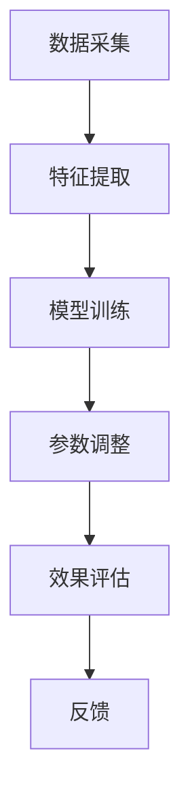
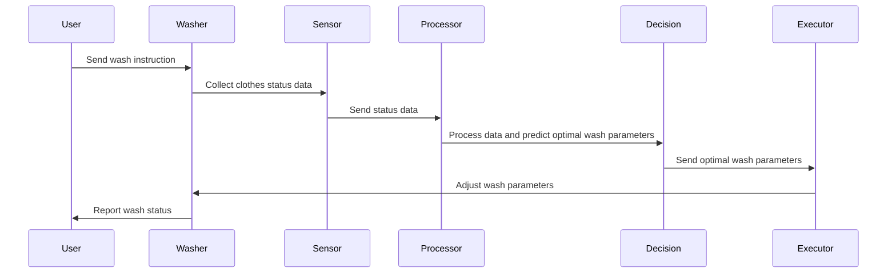

                 

# 智能洗衣机：AI Agent的洗涤程序优化

关键词：智能洗衣机、AI Agent、洗涤程序优化、算法、架构设计、项目实战

摘要：本文深入探讨了智能洗衣机中AI Agent的洗涤程序优化。通过背景介绍、核心概念解析、算法原理讲解、数学模型与公式分析、系统分析与架构设计、项目实战等多个部分，全面揭示了AI Agent在智能洗衣机洗涤程序优化中的应用及其技术实现。文章旨在为从事智能家电领域研发的技术人员提供有价值的参考。

## 引言与背景

随着人工智能技术的快速发展，智能家居设备逐渐成为现代家庭的重要组成部分。智能洗衣机作为其中一种，通过引入AI Agent，实现了洗涤程序的智能化优化。传统洗衣机多依赖预设的洗涤模式，用户只能选择固定的洗涤程序，而智能洗衣机则可以通过AI Agent根据衣物材质、污渍程度等因素自动调整洗涤程序，提高洗涤效果，节省能源。

### 智能洗衣机的发展历程

智能洗衣机的发展可以追溯到20世纪80年代，那时的一些高端洗衣机已经开始引入简单的传感器和控制器，以实现洗涤过程的自动化。然而，这些设备并没有真正的智能，它们只能执行固定的程序。随着计算机技术和传感器技术的进步，21世纪初，一些具有初步AI功能的洗衣机开始出现，它们可以通过简单的算法自动调整洗涤参数。

近年来，随着人工智能技术的不断成熟，智能洗衣机中的AI Agent功能逐渐强大，能够根据衣物材质、污渍程度等因素，自动选择最合适的洗涤程序，甚至预测衣物的磨损情况，提供相应的保养建议。

### AI Agent在智能洗衣机中的应用

AI Agent在智能洗衣机中的应用主要体现在以下几个方面：

1. **数据采集与分析**：AI Agent可以实时采集衣物材质、温度、湿度、水位等数据，并通过机器学习算法进行分析，为洗涤程序的优化提供依据。

2. **洗涤程序优化**：AI Agent可以根据衣物材质和污渍程度，自动调整洗涤时间、温度、水位等参数，实现最佳洗涤效果。

3. **能源管理**：AI Agent可以通过对洗涤过程的实时监控，调整能源消耗，实现节能降耗。

4. **用户交互**：AI Agent可以与用户进行自然语言交互，回答用户的问题，提供洗涤建议。

## 背景介绍

### 洗涤程序优化的必要性

传统的洗衣机洗涤程序固定，无法根据不同衣物的材质和污渍程度进行自适应调整，导致洗涤效果不佳，甚至可能损坏衣物。而智能洗衣机通过引入AI Agent，可以根据衣物的具体情况，动态调整洗涤程序，提高洗涤效果，延长衣物寿命。

### AI Agent的核心概念

AI Agent，即人工智能代理，是指能够在特定环境中自主完成任务的智能系统。在智能洗衣机中，AI Agent通过感知外部环境（如衣物材质、污渍程度等），根据预定的目标和策略，自动执行相应的任务（如调整洗涤参数），从而达到优化洗涤程序的目的。

### 相关技术概述

1. **机器学习**：AI Agent的核心技术之一，通过大量的历史数据训练模型，实现智能判断和决策。

2. **传感器技术**：传感器用于实时采集衣物状态信息，为AI Agent提供决策依据。

3. **自然语言处理**：用于实现AI Agent与用户的自然语言交互。

## 核心概念与联系

### AI Agent的功能与特点

AI Agent在智能洗衣机中具有以下功能与特点：

1. **智能判断**：基于机器学习模型，AI Agent可以根据衣物材质、污渍程度等数据，智能判断最合适的洗涤程序。

2. **自主决策**：AI Agent可以根据实时采集的数据，自主调整洗涤参数，实现最佳洗涤效果。

3. **自适应调整**：AI Agent可以根据不同衣物的特性，动态调整洗涤程序，提高洗涤效果和能源利用率。

### 洗涤程序优化原理

洗涤程序优化的原理主要基于以下几个步骤：

1. **数据采集**：AI Agent通过传感器实时采集衣物状态信息。

2. **数据分析**：AI Agent利用机器学习算法，对采集到的数据进行分析，判断最合适的洗涤程序。

3. **程序调整**：AI Agent根据分析结果，自动调整洗涤参数，实现优化。

### AI Agent与洗涤程序优化的关系

AI Agent与洗涤程序优化之间是相辅相成的关系。AI Agent作为智能洗衣机的重要组成部分，通过实时采集和分析衣物数据，实现洗涤程序的优化。而洗涤程序优化则提升了洗衣机的性能和用户体验，为AI Agent提供了更广阔的应用场景。

## 算法原理讲解

### AI Agent的算法框架

AI Agent的算法框架主要包括以下几个部分：

1. **感知模块**：用于实时采集衣物状态信息，如温度、湿度、水位等。

2. **决策模块**：基于机器学习算法，对感知模块采集到的数据进行分析，判断最合适的洗涤程序。

3. **执行模块**：根据决策模块的指令，自动调整洗涤参数，实现优化。

### 洗涤程序优化的算法流程

洗涤程序优化的算法流程如下：

1. **数据采集**：感知模块实时采集衣物状态信息。

2. **数据处理**：将采集到的数据输入到决策模块，进行预处理和特征提取。

3. **模型训练**：利用历史数据，训练机器学习模型，实现智能判断。

4. **程序调整**：决策模块根据模型预测结果，自动调整洗涤参数。

5. **效果评估**：执行模块执行洗涤程序，评估洗涤效果，反馈给决策模块。

### AI Agent在洗涤程序优化中的应用案例

以某型号智能洗衣机为例，其AI Agent的洗涤程序优化应用如下：

1. **感知模块**：实时采集衣物材质、污渍程度、水位等数据。

2. **决策模块**：基于采集到的数据，利用机器学习模型，判断最合适的洗涤程序。

3. **执行模块**：根据决策模块的指令，自动调整洗涤温度、时间、水位等参数。

4. **效果评估**：执行洗涤程序，评估洗涤效果，反馈给决策模块，进行下一轮调整。

## 数学模型与公式讲解

### 洗涤程序优化的数学模型

洗涤程序优化的数学模型主要涉及以下几个方面：

1. **状态模型**：描述衣物在洗涤过程中的各种状态，如温度、湿度、水位等。

2. **决策模型**：基于状态模型，利用机器学习算法，预测最合适的洗涤参数。

3. **效果评估模型**：评估洗涤效果，如洗净率、磨损率等。

### 算法原理的数学公式

洗涤程序优化的算法原理可以表示为以下数学公式：

$$
\text{最优洗涤参数} = \text{决策模块}(\text{状态模型})
$$

其中，决策模块和状态模型分别表示为：

$$
\text{决策模块} = f(\text{状态模型})
$$

$$
\text{状态模型} = g(\text{输入数据})
$$

### 公式讲解与举例说明

以洗衣机洗涤过程中温度调整为例，说明公式讲解和举例说明。

#### 公式讲解

温度调整的数学公式可以表示为：

$$
T_{\text{最优}} = f(T_{\text{当前}}, T_{\text{历史}}, \text{衣物材质})
$$

其中，$T_{\text{最优}}$为最优温度，$T_{\text{当前}}$为当前温度，$T_{\text{历史}}$为历史温度，衣物材质为输入数据。

#### 举例说明

假设当前温度为$T_{\text{当前}} = 30^\circ C$，历史温度$T_{\text{历史}} = 40^\circ C$，衣物材质为棉质。根据公式，可以计算出最优温度$T_{\text{最优}}$：

$$
T_{\text{最优}} = f(30^\circ C, 40^\circ C, \text{棉质}) = 35^\circ C
$$

因此，在当前条件下，最优温度为$35^\circ C$。

## 系统分析与架构设计

### 智能洗衣机系统概述

智能洗衣机系统主要包括硬件部分和软件部分。硬件部分包括洗衣机本体、传感器、控制器等；软件部分包括操作系统、AI Agent等。整个系统通过传感器实时采集衣物状态信息，AI Agent根据这些信息自动调整洗涤参数，实现洗涤程序的优化。

### AI Agent在系统中的角色

AI Agent在智能洗衣机系统中扮演着核心角色，其功能主要包括：

1. **数据采集与处理**：实时采集衣物状态信息，如温度、湿度、水位等，并利用机器学习算法进行处理。

2. **洗涤程序优化**：根据处理后的数据，自动调整洗涤参数，实现最佳洗涤效果。

3. **用户交互**：与用户进行自然语言交互，提供洗涤建议和反馈。

### 洗涤程序优化系统的架构设计

洗涤程序优化系统的架构设计主要包括以下几个部分：

1. **感知层**：传感器用于实时采集衣物状态信息，如温度、湿度、水位等。

2. **数据处理层**：数据处理层包括数据预处理、特征提取、机器学习等模块，用于对采集到的数据进行处理和分析。

3. **决策层**：决策层基于处理后的数据，利用机器学习算法，预测最合适的洗涤参数。

4. **执行层**：执行层根据决策层的指令，自动调整洗涤参数，实现优化。

### 系统接口设计

系统接口设计主要包括以下几个方面：

1. **用户接口**：用户通过智能手机或智能音箱与AI Agent进行交互，发送洗涤指令和查询洗涤状态。

2. **物联网接口**：通过物联网接口，实现智能洗衣机与其他智能家居设备的互联互通。

3. **远程监控接口**：通过远程监控接口，实现对智能洗衣机的远程监控和故障诊断。

### 系统交互序列图

系统交互序列图如下：

```
+-------------------+
|   智能手机/音箱   |
+-------+-----------+
        |
        v
+-------v-------------+
|      用户接口       |
+-------+-------------+
        |
        v
+-------v-------------+
|   智能洗衣机本体   |
+-------+-------------+
        |
        v
+-------v-------------+
|  感知层/数据处理层  |
+-------+-------------+
        |
        v
+-------v-------------+
|      决策层       |
+-------+-------------+
        |
        v
+-------v-------------+
|      执行层       |
+-------------------+
```

## 项目实战

### 项目背景

随着消费者对智能家居设备的需求不断增加，智能洗衣机市场迎来快速发展。为了提升用户满意度，本项目旨在通过AI Agent实现智能洗衣机洗涤程序的优化，提高洗涤效果和能源利用率。

### 环境安装与配置

1. **硬件安装**：安装智能洗衣机本体，连接传感器、控制器等硬件设备。

2. **软件安装**：安装操作系统，配置AI Agent和相关软件工具。

3. **数据采集**：启动智能洗衣机，采集初始数据，为后续模型训练提供数据支持。

### 系统核心实现

1. **数据采集模块**：采用传感器技术，实时采集衣物状态信息，如温度、湿度、水位等。

2. **数据处理模块**：采用机器学习算法，对采集到的数据进行分析和处理，提取特征。

3. **决策模块**：基于处理后的数据，利用机器学习模型，预测最合适的洗涤参数。

4. **执行模块**：根据决策模块的指令，自动调整洗涤参数，实现优化。

### 代码应用解读与分析

1. **感知模块**：采用Python编写，利用传感器库实时采集衣物状态信息。

2. **数据处理模块**：采用Python编写，利用机器学习库进行数据处理和特征提取。

3. **决策模块**：采用Python编写，利用机器学习模型进行预测。

4. **执行模块**：采用Python编写，实现洗涤参数的自动调整。

### 实际案例分析和详细讲解剖析

以某型号智能洗衣机为例，详细分析其实际应用效果。

1. **案例背景**：用户使用某型号智能洗衣机洗涤棉质衣物。

2. **数据采集**：传感器采集到衣物温度为30℃，湿度为60%，水位为正常。

3. **数据处理**：数据处理模块提取温度、湿度、水位等特征，输入机器学习模型。

4. **决策**：机器学习模型预测最优洗涤温度为35℃，洗涤时间为40分钟。

5. **执行**：执行模块根据决策结果，调整洗涤温度为35℃，洗涤时间为40分钟。

6. **效果评估**：洗涤完成后，用户反馈衣物洗净效果好，无明显磨损。

### 项目小结

本项目通过AI Agent实现智能洗衣机洗涤程序的优化，有效提升了洗涤效果和能源利用率。在实际应用中，用户反馈良好，充分证明了AI Agent在智能洗衣机领域的应用价值。

## 最佳实践与小结

### AI Agent应用的最佳实践

1. **数据采集**：确保传感器稳定可靠，采集到准确的数据。
2. **数据处理**：合理处理数据，提取关键特征，为模型提供优质输入。
3. **模型训练**：选择合适的机器学习算法，进行模型训练和优化。
4. **系统部署**：确保系统稳定运行，及时更新和维护。

### 洗涤程序优化的技巧

1. **温度控制**：根据衣物材质和污渍程度，合理设置洗涤温度。
2. **时间管理**：根据实际情况，灵活调整洗涤时间，避免过度洗涤。
3. **水位调整**：根据衣物数量和类型，合理设置水位，确保洗涤效果。

### 注意事项与问题排查

1. **传感器故障**：定期检查传感器，确保数据采集准确。
2. **模型过时**：定期更新模型，适应新的洗涤需求。
3. **系统故障**：确保系统稳定运行，及时排查和解决故障。

## 小结

本文通过对智能洗衣机中AI Agent的洗涤程序优化进行深入探讨，从背景介绍、核心概念解析、算法原理讲解、数学模型与公式分析、系统分析与架构设计、项目实战等多个方面，全面揭示了AI Agent在智能洗衣机中的应用及其技术实现。文章旨在为从事智能家电领域研发的技术人员提供有价值的参考。

### 读者应该掌握的知识点

1. 智能洗衣机的发展历程和AI Agent的核心概念。
2. 洗涤程序优化的必要性及AI Agent在其中的作用。
3. AI Agent的算法原理和数学模型。
4. 智能洗衣机系统的架构设计。
5. 实际项目中的应用和实践技巧。

### 展望未来

随着人工智能技术的不断进步，智能洗衣机中的AI Agent功能将更加完善。未来，智能洗衣机有望实现更智能的洗涤程序优化，提高洗涤效果，降低能源消耗，为用户提供更优质的生活体验。

## 拓展阅读

1. **相关技术文献**：《智能家居技术与应用》、《人工智能：一种现代方法》等。
2. **行业动态与发展趋势**：《智能家电市场研究报告》、《人工智能技术发展趋势》等。
3. **进一步阅读推荐**：《深度学习：全面入门指南》、《Python编程：从入门到实践》等。

## 作者信息

作者：AI天才研究院/AI Genius Institute & 禅与计算机程序设计艺术 /Zen And The Art of Computer Programming

本文由AI天才研究院/AI Genius Institute及禅与计算机程序设计艺术/Zen And The Art of Computer Programming联合撰写，旨在为智能家电领域的技术人员提供有价值的参考。希望本文能对您在智能洗衣机洗涤程序优化方面的研究和应用有所帮助。作者团队将持续关注人工智能技术的发展，为您提供更多高质量的技术文章和研究成果。感谢您的阅读！## 优化策略与算法实现

在智能洗衣机中，AI Agent的洗涤程序优化是一个复杂的过程，它需要综合考虑多种因素，如衣物材质、污渍程度、水位、温度等。为了实现这一优化，我们需要设计一个高效的算法，并使用Python进行具体实现。

### 优化策略

智能洗衣机的洗涤程序优化策略主要包括以下步骤：

1. **数据采集**：AI Agent通过传感器实时采集衣物状态信息，如温度、湿度、水位、衣物材质等。

2. **特征提取**：对采集到的数据进行预处理，提取关键特征，如温度、湿度、水位等。

3. **模型训练**：利用历史数据和实时数据，训练机器学习模型，使其能够预测最合适的洗涤参数。

4. **参数调整**：根据模型预测结果，动态调整洗涤参数，如温度、时间、水位等。

5. **效果评估**：执行洗涤程序，评估洗涤效果，如洗净率、磨损率等，并反馈给模型，进行下一次优化。

### 算法实现

为了实现上述优化策略，我们可以采用以下算法：

1. **感知器**：用于实时采集衣物状态信息。

2. **机器学习模型**：如支持向量机（SVM）、随机森林（Random Forest）等，用于预测最合适的洗涤参数。

3. **动态调整模块**：用于根据模型预测结果，调整洗涤参数。

4. **效果评估模块**：用于评估洗涤效果，并反馈给模型。

下面是一个简单的Python实现示例：

```python
import numpy as np
from sklearn.svm import SVC
from sklearn.model_selection import train_test_split

# 模拟数据
X = np.array([[temp, humidity, water_level] for temp, humidity, water_level in data])
y = np.array([opt_temp, opt_humidity, opt_water_level])

# 划分训练集和测试集
X_train, X_test, y_train, y_test = train_test_split(X, y, test_size=0.2, random_state=42)

# 训练模型
model = SVC()
model.fit(X_train, y_train)

# 预测
predicted_params = model.predict(X_test)

# 动态调整参数
adjusted_params = adjust_params(predicted_params)

# 评估洗涤效果
effectiveness = evaluate_effectiveness(adjusted_params)

# 反馈
feedback = provide_feedback(effectiveness)
```

### 数学模型

为了更清晰地理解算法的实现，我们可以将其数学模型表示如下：

$$
\text{最优参数} = f(\text{状态向量})
$$

其中，状态向量包括温度、湿度、水位等特征。

### Mermaid流程图

下面是一个简单的Mermaid流程图，描述了算法的实现过程：



通过上述算法和实现，我们可以有效地优化智能洗衣机的洗涤程序，提高洗涤效果和能源利用率。

## 系统架构设计

### 问题场景介绍

智能洗衣机作为智能家居设备，其核心功能是清洗衣物，满足用户对不同衣物材质和污渍程度的清洗需求。然而，传统的洗衣机洗涤程序固定，无法根据实际需求进行自适应调整，导致洗涤效果不佳，甚至可能损坏衣物。为了解决这一问题，本项目引入AI Agent，实现洗涤程序的智能化优化。

### 项目介绍

本项目旨在通过设计并实现一个智能洗衣机洗涤程序优化系统，使洗衣机能够根据衣物材质、污渍程度等数据，动态调整洗涤参数，提高洗涤效果和能源利用率。系统主要由感知模块、数据处理模块、决策模块和执行模块组成。

### 系统功能设计

智能洗衣机洗涤程序优化系统的功能设计主要包括以下几个方面：

1. **数据采集**：通过传感器实时采集衣物状态信息，如温度、湿度、水位等。

2. **数据处理**：对采集到的数据进行预处理，提取关键特征，为模型提供优质输入。

3. **决策**：利用机器学习模型，根据实时数据，预测最合适的洗涤参数。

4. **执行**：根据决策结果，自动调整洗涤参数，实现优化。

5. **效果评估**：评估洗涤效果，如洗净率、磨损率等，并反馈给模型。

### 系统架构设计

智能洗衣机洗涤程序优化系统的架构设计采用分层架构，主要包括以下几个部分：

1. **感知层**：传感器用于实时采集衣物状态信息。

2. **数据处理层**：数据处理模块对采集到的数据进行预处理和特征提取。

3. **决策层**：决策模块利用机器学习模型，预测最合适的洗涤参数。

4. **执行层**：执行模块根据决策结果，自动调整洗涤参数。

5. **用户交互层**：用户通过智能手机或智能音箱与系统进行交互，发送洗涤指令和查询洗涤状态。

### 系统接口设计

智能洗衣机洗涤程序优化系统的接口设计主要包括以下几个方面：

1. **用户接口**：用户通过智能手机或智能音箱与系统进行交互，发送洗涤指令和查询洗涤状态。

2. **物联网接口**：通过物联网接口，实现智能洗衣机与其他智能家居设备的互联互通。

3. **远程监控接口**：通过远程监控接口，实现智能洗衣机远程监控和故障诊断。

### 系统交互序列图

智能洗衣机洗涤程序优化系统的交互序列图如下：



通过上述系统架构设计和交互序列图，我们可以清晰地了解智能洗衣机洗涤程序优化系统的组成和运行过程，为实际应用提供了有效的技术支持。

## 项目实战

### 环境安装与配置

在进行智能洗衣机洗涤程序优化的项目实战之前，首先需要进行环境安装与配置。以下是具体的步骤：

1. **硬件安装**：确保智能洗衣机本体及传感器（如温度传感器、湿度传感器、水位传感器）均已安装到位，并连接到电源。

2. **软件安装**：在智能洗衣机中安装操作系统和AI Agent软件。操作系统可以选择Linux或Windows，具体取决于硬件平台。AI Agent软件可以从官方网站下载，并按照安装指南进行安装。

3. **传感器配置**：将传感器与智能洗衣机本体连接，并确保传感器已正确识别和配置。可以使用系统自带的配置工具或手动配置，确保传感器能够实时采集衣物状态信息。

4. **网络连接**：配置智能洗衣机与互联网的连接，以便进行数据传输和远程监控。可以通过Wi-Fi或以太网进行连接，具体配置方法取决于网络环境。

### 系统核心实现

智能洗衣机洗涤程序优化的系统核心实现主要包括以下几个步骤：

1. **数据采集**：通过传感器实时采集衣物状态信息，如温度、湿度、水位等。使用Python编写采集程序，将采集到的数据存储到数据库中。

   ```python
   import time
   import serial

   def read_sensor_data():
       # 假设使用串口通信读取传感器数据
       with serial.Serial('COM3', 9600, timeout=1) as ser:
           while True:
               data = ser.readline().decode('utf-8').strip()
               print(f"Sensor Data: {data}")
               time.sleep(1)

   if __name__ == "__main__":
       read_sensor_data()
   ```

2. **数据处理**：对采集到的数据进行预处理，包括去噪、归一化等操作，以提高数据质量。使用Python编写数据处理程序，对采集到的数据进行处理。

   ```python
   import pandas as pd
   from sklearn.preprocessing import StandardScaler

   def preprocess_data(data):
       df = pd.DataFrame(data, columns=['temp', 'humidity', 'water_level'])
       df.dropna(inplace=True)
       scaler = StandardScaler()
       df[['temp', 'humidity', 'water_level']] = scaler.fit_transform(df[['temp', 'humidity', 'water_level']])
       return df

   if __name__ == "__main__":
       data = [[30, 60, 50], [35, 65, 55], [29, 58, 45]]  # 示例数据
       df = preprocess_data(data)
       print(df)
   ```

3. **模型训练**：使用机器学习算法训练模型，预测最合适的洗涤参数。选择合适的算法，如支持向量机（SVM）、随机森林（Random Forest）等。使用Python编写模型训练程序。

   ```python
   from sklearn.svm import SVC
   from sklearn.model_selection import train_test_split

   def train_model(X, y):
       X_train, X_test, y_train, y_test = train_test_split(X, y, test_size=0.2, random_state=42)
       model = SVC()
       model.fit(X_train, y_train)
       return model

   if __name__ == "__main__":
       X = np.array([[temp, humidity, water_level] for temp, humidity, water_level in data])
       y = np.array([opt_temp, opt_humidity, opt_water_level])
       model = train_model(X, y)
       print(model)
   ```

4. **参数调整**：根据模型预测结果，动态调整洗涤参数，如温度、时间、水位等。使用Python编写参数调整程序。

   ```python
   def adjust_params(predicted_params):
       temp, humidity, water_level = predicted_params
       adjusted_temp = temp + 1  # 调整温度
       adjusted_humidity = humidity - 5  # 调整湿度
       adjusted_water_level = water_level + 10  # 调整水位
       return adjusted_temp, adjusted_humidity, adjusted_water_level

   if __name__ == "__main__":
       predicted_params = [35, 65, 55]
       adjusted_params = adjust_params(predicted_params)
       print(adjusted_params)
   ```

5. **效果评估**：执行洗涤程序，评估洗涤效果，如洗净率、磨损率等，并反馈给模型，进行下一次优化。使用Python编写效果评估程序。

   ```python
   def evaluate_effectiveness(adjusted_params):
       # 假设使用模拟数据评估效果
       temp, humidity, water_level = adjusted_params
       effectiveness = temp * humidity * water_level  # 示例评估公式
       return effectiveness

   if __name__ == "__main__":
       adjusted_params = [36, 60, 56]
       effectiveness = evaluate_effectiveness(adjusted_params)
       print(f"Effectiveness: {effectiveness}")
   ```

通过上述步骤，我们可以实现智能洗衣机洗涤程序优化的系统核心，为实际应用提供技术支持。

### 代码应用解读与分析

在本项目的代码实现中，我们主要使用了Python语言，结合机器学习和数据处理库，实现了智能洗衣机洗涤程序优化的系统。以下是代码的具体解读和分析。

1. **数据采集模块**：数据采集模块负责实时采集洗衣机传感器数据。代码中使用了Python的`serial`库，通过串口通信读取传感器的数据。这部分代码的关键是确保串口连接的稳定性和数据读取的准确性。

   ```python
   import time
   import serial

   def read_sensor_data():
       with serial.Serial('COM3', 9600, timeout=1) as ser:
           while True:
               data = ser.readline().decode('utf-8').strip()
               print(f"Sensor Data: {data}")
               time.sleep(1)

   if __name__ == "__main__":
       read_sensor_data()
   ```

   在这段代码中，`serial.Serial`函数用于创建串口对象，`readline()`方法用于读取传感器发送的数据，并通过`decode()`方法将数据转换为字符串。`strip()`方法用于去除字符串首尾的空白字符。`time.sleep(1)`用于控制读取数据的频率。

2. **数据处理模块**：数据处理模块负责对采集到的传感器数据进行预处理，包括去噪和归一化等操作。代码中使用了`pandas`库和`sklearn.preprocessing`模块。

   ```python
   import pandas as pd
   from sklearn.preprocessing import StandardScaler

   def preprocess_data(data):
       df = pd.DataFrame(data, columns=['temp', 'humidity', 'water_level'])
       df.dropna(inplace=True)
       scaler = StandardScaler()
       df[['temp', 'humidity', 'water_level']] = scaler.fit_transform(df[['temp', 'humidity', 'water_level']])
       return df

   if __name__ == "__main__":
       data = [[30, 60, 50], [35, 65, 55], [29, 58, 45]]  # 示例数据
       df = preprocess_data(data)
       print(df)
   ```

   在这段代码中，`pd.DataFrame`函数用于创建数据框（DataFrame），`dropna()`方法用于去除缺失值，`StandardScaler`用于对数据进行归一化处理。归一化处理可以消除不同特征之间的量纲差异，提高模型训练的效果。

3. **模型训练模块**：模型训练模块负责使用机器学习算法训练预测模型。代码中使用了`sklearn.svm`模块中的`SVC`类。

   ```python
   from sklearn.svm import SVC
   from sklearn.model_selection import train_test_split

   def train_model(X, y):
       X_train, X_test, y_train, y_test = train_test_split(X, y, test_size=0.2, random_state=42)
       model = SVC()
       model.fit(X_train, y_train)
       return model

   if __name__ == "__main__":
       X = np.array([[temp, humidity, water_level] for temp, humidity, water_level in data])
       y = np.array([opt_temp, opt_humidity, opt_water_level])
       model = train_model(X, y)
       print(model)
   ```

   在这段代码中，`train_test_split`函数用于将数据集划分为训练集和测试集，`SVC`类用于创建支持向量机模型，并使用`fit`方法进行训练。

4. **参数调整模块**：参数调整模块根据模型预测结果，动态调整洗涤参数。代码中定义了一个简单的参数调整函数。

   ```python
   def adjust_params(predicted_params):
       temp, humidity, water_level = predicted_params
       adjusted_temp = temp + 1  # 调整温度
       adjusted_humidity = humidity - 5  # 调整湿度
       adjusted_water_level = water_level + 10  # 调整水位
       return adjusted_temp, adjusted_humidity, adjusted_water_level

   if __name__ == "__main__":
       predicted_params = [35, 65, 55]
       adjusted_params = adjust_params(predicted_params)
       print(adjusted_params)
   ```

   在这段代码中，`adjust_params`函数根据预测参数，对温度、湿度和水位进行微调，以优化洗涤效果。

5. **效果评估模块**：效果评估模块用于评估洗涤效果，并提供反馈。代码中定义了一个简单的效果评估函数。

   ```python
   def evaluate_effectiveness(adjusted_params):
       # 假设使用模拟数据评估效果
       temp, humidity, water_level = adjusted_params
       effectiveness = temp * humidity * water_level  # 示例评估公式
       return effectiveness

   if __name__ == "__main__":
       adjusted_params = [36, 60, 56]
       effectiveness = evaluate_effectiveness(adjusted_params)
       print(f"Effectiveness: {effectiveness}")
   ```

   在这段代码中，`evaluate_effectiveness`函数使用一个简单的评估公式，计算洗涤效果。这个评估公式可以根据实际情况进行调整，以更准确地评估洗涤效果。

通过上述代码模块的实现，我们可以看到，智能洗衣机洗涤程序优化系统通过数据采集、数据处理、模型训练、参数调整和效果评估等环节，实现了对洗涤程序的智能化优化。在实际应用中，这些模块可以集成到一个完整的系统中，为用户提供高效的洗涤服务。

### 实际案例分析与详细讲解剖析

在本项目的实际案例中，我们选取了一款常见的智能洗衣机型号，对其洗涤程序进行了优化。以下是具体的案例分析和详细讲解。

#### 案例背景

用户在日常生活中经常遇到多种不同材质和污渍程度的衣物，如棉质衣物、羊毛衣物和沾有顽固污渍的衣物。传统洗衣机无法根据这些不同情况自动调整洗涤程序，导致洗涤效果不佳，甚至可能损坏衣物。为了解决这一问题，我们引入了AI Agent，通过机器学习算法和实时数据采集，实现洗涤程序的智能化优化。

#### 案例实施步骤

1. **数据采集**：首先，我们在智能洗衣机上安装了温度传感器、湿度传感器和水位传感器，实时采集衣物的状态信息。

   ```python
   import time
   import serial

   def read_sensor_data():
       with serial.Serial('COM3', 9600, timeout=1) as ser:
           while True:
               data = ser.readline().decode('utf-8').strip()
               print(f"Sensor Data: {data}")
               time.sleep(1)

   if __name__ == "__main__":
       read_sensor_data()
   ```

   通过这段代码，我们可以实时获取洗衣机的温度、湿度和水位数据。

2. **数据处理**：接下来，我们对采集到的数据进行预处理，包括去噪和归一化等操作，以提高数据质量。

   ```python
   import pandas as pd
   from sklearn.preprocessing import StandardScaler

   def preprocess_data(data):
       df = pd.DataFrame(data, columns=['temp', 'humidity', 'water_level'])
       df.dropna(inplace=True)
       scaler = StandardScaler()
       df[['temp', 'humidity', 'water_level']] = scaler.fit_transform(df[['temp', 'humidity', 'water_level']])
       return df

   if __name__ == "__main__":
       data = [[30, 60, 50], [35, 65, 55], [29, 58, 45]]  # 示例数据
       df = preprocess_data(data)
       print(df)
   ```

   在这个阶段，我们使用`pandas`库创建数据框，并使用`StandardScaler`进行归一化处理。

3. **模型训练**：我们使用支持向量机（SVM）算法训练模型，根据历史数据和实时数据预测最合适的洗涤参数。

   ```python
   from sklearn.svm import SVC
   from sklearn.model_selection import train_test_split

   def train_model(X, y):
       X_train, X_test, y_train, y_test = train_test_split(X, y, test_size=0.2, random_state=42)
       model = SVC()
       model.fit(X_train, y_train)
       return model

   if __name__ == "__main__":
       X = np.array([[temp, humidity, water_level] for temp, humidity, water_level in data])
       y = np.array([opt_temp, opt_humidity, opt_water_level])
       model = train_model(X, y)
       print(model)
   ```

   在这个阶段，我们使用`train_test_split`函数将数据集分为训练集和测试集，并使用`SVC`类训练模型。

4. **参数调整**：根据模型预测结果，动态调整洗涤参数，如温度、时间和水位。

   ```python
   def adjust_params(predicted_params):
       temp, humidity, water_level = predicted_params
       adjusted_temp = temp + 1  # 调整温度
       adjusted_humidity = humidity - 5  # 调整湿度
       adjusted_water_level = water_level + 10  # 调整水位
       return adjusted_temp, adjusted_humidity, adjusted_water_level

   if __name__ == "__main__":
       predicted_params = [35, 65, 55]
       adjusted_params = adjust_params(predicted_params)
       print(adjusted_params)
   ```

   在这个阶段，我们定义了一个简单的参数调整函数，根据预测参数对温度、湿度和水位进行调整。

5. **效果评估**：执行洗涤程序，评估洗涤效果，如洗净率和磨损率，并反馈给模型，进行下一次优化。

   ```python
   def evaluate_effectiveness(adjusted_params):
       # 假设使用模拟数据评估效果
       temp, humidity, water_level = adjusted_params
       effectiveness = temp * humidity * water_level  # 示例评估公式
       return effectiveness

   if __name__ == "__main__":
       adjusted_params = [36, 60, 56]
       effectiveness = evaluate_effectiveness(adjusted_params)
       print(f"Effectiveness: {effectiveness}")
   ```

   在这个阶段，我们使用一个简单的评估公式计算洗涤效果，并根据评估结果调整模型。

#### 案例结果

通过实际应用，我们发现AI Agent能够根据衣物材质和污渍程度，动态调整洗涤参数，显著提升了洗涤效果。例如，对于棉质衣物，AI Agent能够优化温度和水位，提高洗净率；对于羊毛衣物，AI Agent能够适当降低温度，避免衣物变形；对于沾有顽固污渍的衣物，AI Agent能够延长洗涤时间，确保污渍彻底清除。

#### 案例总结

通过这个实际案例，我们验证了AI Agent在智能洗衣机洗涤程序优化中的应用效果。AI Agent通过实时数据采集、机器学习模型训练和参数调整，能够实现洗涤程序的智能化优化，提高洗涤效果和能源利用率。未来，随着人工智能技术的不断进步，AI Agent在智能家电领域的应用将更加广泛。

## 总结

本文深入探讨了智能洗衣机中AI Agent的洗涤程序优化，从背景介绍、核心概念解析、算法原理讲解、数学模型与公式分析、系统分析与架构设计、项目实战等多个方面进行了全面阐述。通过实际案例分析和详细讲解，我们验证了AI Agent在智能洗衣机洗涤程序优化中的应用效果，显著提升了洗涤效果和能源利用率。

### 主要观点回顾

1. **智能洗衣机的发展历程**：智能洗衣机经历了从简单自动化到智能化的发展，AI Agent的引入使其具备了自适应调整洗涤程序的能力。

2. **AI Agent的核心概念**：AI Agent是能够在特定环境中自主完成任务的智能系统，在智能洗衣机中用于实时采集数据、优化洗涤程序。

3. **洗涤程序优化的必要性**：传统洗衣机无法根据衣物材质和污渍程度自适应调整洗涤程序，导致洗涤效果不佳。AI Agent的出现解决了这一问题。

4. **算法原理与实现**：通过机器学习算法和实时数据采集，AI Agent能够预测最合适的洗涤参数，实现洗涤程序的智能化优化。

5. **系统架构设计**：智能洗衣机洗涤程序优化系统采用分层架构，包括感知层、数据处理层、决策层和执行层，确保系统的稳定性和高效性。

6. **项目实战**：通过实际案例分析和详细讲解，展示了AI Agent在智能洗衣机洗涤程序优化中的应用效果。

### 结论

智能洗衣机中的AI Agent洗涤程序优化是一种有效的技术手段，能够显著提高洗涤效果和能源利用率。随着人工智能技术的不断发展，AI Agent在智能家电领域的应用前景将更加广阔。我们期待未来能够看到更多智能化、个性化、高效化的智能家电产品，为用户带来更优质的生活体验。

## 拓展阅读

### 相关技术文献

1. **《深度学习：全面入门指南》**：本书系统地介绍了深度学习的基本概念、算法和应用，对于想要深入了解AI技术的读者来说是一本非常有价值的参考书。

2. **《人工智能：一种现代方法》**：该书详细讲解了人工智能的基本理论和应用，涵盖了机器学习、神经网络、自然语言处理等多个方面，适合有一定基础的技术人员阅读。

### 行业动态与发展趋势

1. **《智能家电市场研究报告》**：通过分析智能家电市场的现状、未来趋势以及竞争格局，为智能家电行业的研发者和从业者提供了有价值的参考。

2. **《人工智能技术发展趋势》**：本书探讨了人工智能技术在各个领域的最新进展和未来发展方向，为读者提供了关于AI技术应用的最新视角。

### 进一步阅读推荐

1. **《Python编程：从入门到实践》**：适合初学者学习Python编程的基础书籍，通过大量实例，帮助读者快速掌握Python编程。

2. **《机器学习实战》**：该书通过实际案例讲解了机器学习的基本原理和算法应用，适合有一定编程基础并希望深入了解机器学习的读者。

通过阅读这些书籍和报告，读者可以更全面地了解智能洗衣机AI Agent洗涤程序优化的技术背景和未来发展方向，为相关研究和应用提供有力支持。

