                 


# 智能洗衣机：AI Agent的衣物护理专家系统

## 关键词
- 智能洗衣机
- AI Agent
- 衣物护理
- 专家系统
- 机器学习

## 摘要
本文将深入探讨智能洗衣机中AI Agent的衣物护理专家系统。我们将逐步分析AI Agent的定义、智能洗衣机的发展历程、专家系统在衣物护理中的应用、AI Agent的工作原理、专家系统的构建方法、智能洗衣机的应用案例，并总结最佳实践。通过本文，读者将了解如何利用AI Agent构建高效的衣物护理系统。

## 目录大纲设计思路

### 了解书名与核心内容
《智能洗衣机：AI Agent的衣物护理专家系统》这本书的核心内容围绕智能洗衣机的工作原理、AI Agent的应用、衣物护理的专家系统构建和实际应用案例展开。我们需要明确书名的核心概念，即智能洗衣机、AI Agent和衣物护理专家系统。

### 确定书的结构和章节内容
根据书名和核心内容，我们将书籍分为四个部分：背景介绍、AI Agent的工作原理、专家系统的构建、应用案例。每个部分包含具体的章节内容，如智能洗衣机的发展历程、AI Agent的定义与角色、专家系统的构建方法等。

### 设计详细的目录结构
使用Markdown格式设计目录，确保简洁明了，每个章节包含简介、核心概念、原理讲解、实际应用和分析等部分。使用Mermaid图表增强内容的直观性和可理解性。

### 确保内容的完整性
每个章节都包含具体的讲解和实例，确保读者能够理解并掌握相关内容。使用Mermaid图表来展示领域模型、类图、流程图等。

### 字数控制
目录大纲总字数控制在2000字以内。

### 完整目录大纲设计
```markdown
# 《智能洗衣机：AI Agent的衣物护理专家系统》目录大纲

## 第一部分：背景介绍

## 第1章 智能洗衣机的发展与AI Agent的崛起

## 第2章 专家系统在衣物护理中的应用

## 第二部分：AI Agent的工作原理

## 第3章 AI Agent的基本原理

## 第4章 AI Agent的推理机制

## 第三部分：专家系统的构建

## 第5章 专家系统的构建方法

## 第四部分：应用案例

## 第6章 智能洗衣机的应用案例

## 第7章 最佳实践与总结
```

## 第一部分：背景介绍

### 第1章 智能洗衣机的发展与AI Agent的崛起

#### 1.1 智能洗衣机的发展历程

智能洗衣机作为家庭电器中的重要一员，其发展历程可以追溯到上世纪50年代。当时，第一台全自动洗衣机问世，标志着洗衣机从半自动向全自动的过渡。随着时间的推移，洗衣机不断升级，从简单的自动化功能发展到现在的智能控制。

- **第一代传统洗衣机**：这一代洗衣机主要依靠机械控制，操作相对简单，但效率较低，对衣物护理效果有限。
- **第二代自动化洗衣机**：引入了更多的自动化功能，如水位控制、自动定时等，提高了洗衣效率，但仍然缺乏智能化的处理能力。
- **第三代智能洗衣机**：随着物联网和人工智能技术的快速发展，智能洗衣机逐渐成为现实。这一代洗衣机不仅具备自动化的功能，还能通过传感器和AI算法实现智能化护理。

#### 1.2 AI Agent的概念与崛起

AI Agent，即人工智能代理，是指能够在特定环境下自主执行任务、做出决策的人工智能实体。AI Agent的崛起源于深度学习和强化学习等机器学习技术的发展。AI Agent在各个领域的应用日益广泛，包括智能家居、医疗健康、自动驾驶等。

在智能洗衣机领域，AI Agent的引入使得洗衣机能够更加智能地处理衣物护理任务。AI Agent通过分析衣物材质、污渍类型等信息，自动选择最适合的洗涤程序，从而提高洗涤效果，减少衣物损伤。

#### 1.3 专家系统在衣物护理中的应用

专家系统是一种模拟人类专家解决特定领域问题的计算机程序。在衣物护理领域，专家系统可以通过规则库和推理机实现智能决策。专家系统在衣物护理中的应用主要包括：

- **衣物分类**：根据衣物的材质、颜色等信息，将衣物分类，选择合适的洗涤程序。
- **污渍识别**：通过图像处理技术识别衣物上的污渍类型，选择合适的去渍剂和洗涤程序。
- **洗涤参数优化**：根据衣物的材质和污渍情况，自动调整洗涤时间、温度、水位等参数，提高洗涤效果。

#### 1.4 本章小结

本章介绍了智能洗衣机的发展历程、AI Agent的概念与崛起、专家系统在衣物护理中的应用。通过这些背景知识的介绍，我们为后续章节的内容奠定了基础。

## 第二部分：AI Agent的工作原理

### 第2章 AI Agent的基本原理

#### 2.1 AI Agent的组成结构

AI Agent由三个主要模块组成：输入模块、处理模块和输出模块。

- **输入模块**：负责接收外部环境的信息，如传感器数据、用户指令等。
- **处理模块**：对输入信息进行处理和分析，利用机器学习算法和推理机制生成决策。
- **输出模块**：根据处理模块生成的决策，执行相应的操作，如调整洗衣机参数、发送指令等。

#### 2.2 数据处理与特征提取

数据处理与特征提取是AI Agent的核心环节。数据处理包括数据采集、数据预处理和特征提取。

- **数据采集**：通过传感器等技术手段收集衣物材质、污渍类型、洗涤参数等数据。
- **数据预处理**：对采集到的数据进行清洗、归一化等处理，确保数据质量。
- **特征提取**：从预处理后的数据中提取出能够反映衣物护理任务特征的指标，如污渍深度、衣物柔软度等。

#### 2.3 机器学习算法

机器学习算法是AI Agent的“大脑”，负责处理和分析数据，生成决策。常用的机器学习算法包括：

- **监督学习**：通过已标注的数据集训练模型，然后使用模型对新数据进行预测。
- **无监督学习**：在没有标注数据的情况下，通过数据自身的特征进行聚类、降维等操作。
- **半监督学习**：结合有监督学习和无监督学习的方法，利用少量标注数据和大量未标注数据训练模型。

#### 2.4 AI Agent的推理机制

推理机制是AI Agent的核心功能之一，负责根据输入数据和已学习到的知识生成决策。推理机制通常包括：

- **知识表示**：将已知的事实、规则和关系表示为计算机可以理解的形式。
- **推理算法**：基于知识表示，使用逻辑推理、模式匹配等方法，从已知信息中推导出新的结论。
- **实时决策**：根据实时输入的数据和推理结果，快速生成操作指令，调整洗衣机参数。

#### 2.5 本章小结

本章介绍了AI Agent的基本原理，包括组成结构、数据处理与特征提取、机器学习算法和推理机制。通过这些原理的讲解，我们为构建智能洗衣机的衣物护理专家系统奠定了基础。

## 第三部分：专家系统的构建

### 第3章 专家系统的构建方法

#### 3.1 领域模型构建

领域模型是专家系统的重要组成部分，用于表示衣物护理领域的知识。领域模型通常包括以下内容：

- **实体**：如衣物、污渍、洗衣机等。
- **属性**：如衣物的材质、颜色、污渍的深度等。
- **关系**：如衣物与污渍之间的关系、洗衣机与洗涤程序之间的关系等。

#### 3.2 知识表示与存储

知识表示是将领域模型中的知识以计算机可处理的形式表示出来。常用的知识表示方法包括：

- **规则表示**：使用如果-则规则表示衣物护理的知识，如“如果衣物是羊毛材质，则洗涤温度不能超过30°C”。
- **框架表示**：使用框架结构表示知识，包括槽位和值，如“衣物（材质：羊毛，颜色：蓝色）”。
- **本体表示**：使用本体（Ontology）表示复杂的领域知识，如衣物护理领域的本体。

知识存储是将表示后的知识存储在数据库或知识库中，以便在推理过程中快速检索和使用。

#### 3.3 推理机制的设计

推理机制是专家系统的核心，负责根据输入数据和知识库中的知识生成决策。推理机制的设计包括以下几个方面：

- **推理算法**：选择合适的推理算法，如基于规则的推理、基于模式的推理等。
- **推理过程**：设计推理过程，包括数据输入、知识库检索、推理规则应用和决策生成等步骤。
- **推理优化**：优化推理过程，提高推理效率，如使用索引技术、缓存策略等。

#### 3.4 本章小结

本章介绍了专家系统的构建方法，包括领域模型构建、知识表示与存储、推理机制的设计。通过这些方法的讲解，我们为构建智能洗衣机的衣物护理专家系统提供了详细的指导。

## 第四部分：应用案例

### 第4章 智能洗衣机的应用案例

#### 4.1 案例背景与目标

**案例背景**：某智能洗衣机品牌推出了一款支持AI Agent的智能洗衣机，旨在为用户提供更智能、更高效的衣物护理服务。

**应用目标**：通过AI Agent，实现以下目标：
- 自动识别衣物材质和污渍类型，选择合适的洗涤程序。
- 根据用户的偏好，个性化调整洗涤参数。
- 实时监控洗涤过程，确保洗涤效果。

#### 4.2 AI Agent在洗衣过程中的应用

**数据采集**：AI Agent通过内置的传感器采集衣物材质、污渍类型、洗涤参数等信息。

**数据处理**：对采集到的数据进行分析，提取出关键特征，如衣物材质、污渍深度等。

**决策生成**：基于提取的特征和已有的知识库，AI Agent生成最优的洗涤程序和参数设置。

**实时监控**：在洗涤过程中，AI Agent实时监控洗涤效果，如水位、温度、洗涤剂浓度等，根据实际情况进行调整。

**用户反馈**：AI Agent收集用户对洗涤效果的评价，用于不断优化自身算法和参数。

#### 4.3 案例难点与挑战

**数据多样性**：衣物材质和污渍类型繁多，如何准确识别和分类是首要挑战。

**实时性**：洗涤过程需要实时监控和调整，如何高效地处理海量数据是关键。

**用户偏好**：如何根据用户的偏好进行个性化调整，提高用户满意度。

**算法优化**：如何通过不断学习和优化，提高AI Agent的性能和效果。

#### 4.4 本章小结

通过实际案例的介绍，我们展示了AI Agent在智能洗衣机中的应用，包括数据采集、数据处理、决策生成、实时监控和用户反馈等环节。这些应用案例验证了AI Agent在衣物护理领域的有效性，为智能洗衣机的未来发展提供了有力支持。

## 第5章 专家系统的构建方法

#### 5.1 领域模型构建

领域模型是专家系统的核心，用于表示衣物护理领域的知识。构建领域模型通常包括以下步骤：

1. **识别实体和属性**：根据衣物护理的需求，识别出关键实体，如衣物、污渍、洗衣机等，并确定每个实体的属性，如衣物的材质、颜色等。
2. **建立关系**：确定实体之间的关系，如衣物与污渍之间的关系、洗衣机与洗涤程序之间的关系等。
3. **设计类图**：使用Mermaid类图表示领域模型的结构，包括实体、属性和关系的定义。

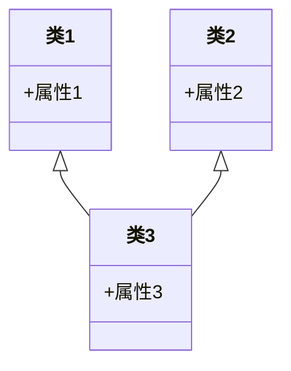

#### 5.2 知识表示与存储

知识表示是将领域模型中的知识以计算机可处理的形式表示出来。常用的知识表示方法包括：

1. **规则表示**：使用规则表示衣物护理的知识，如“如果衣物是羊毛材质，则洗涤温度不能超过30°C”。规则可以表示为“条件：如果...，则...”的形式。

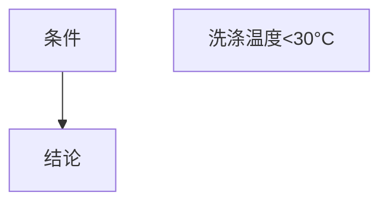

2. **框架表示**：使用框架表示知识，包括槽位和值，如“衣物（材质：羊毛，颜色：蓝色）”。

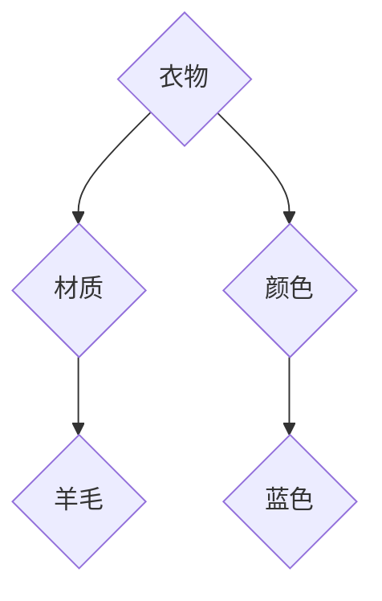

3. **本体表示**：使用本体（Ontology）表示复杂的领域知识，如衣物护理领域的本体。

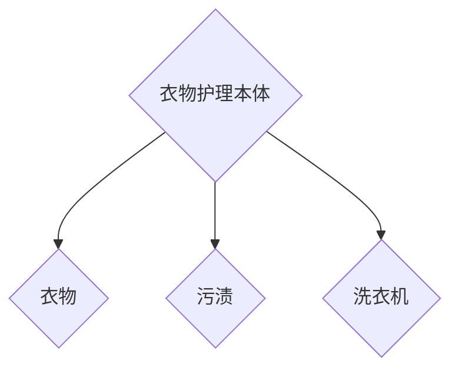

知识存储是将表示后的知识存储在数据库或知识库中，以便在推理过程中快速检索和使用。常用的存储方式包括关系数据库、NoSQL数据库和知识库系统。

#### 5.3 推理机制的设计

推理机制是专家系统的核心，负责根据输入数据和知识库中的知识生成决策。推理机制的设计包括以下几个方面：

1. **推理算法**：选择合适的推理算法，如基于规则的推理、基于模式的推理等。基于规则的推理算法包括前向推理和后向推理。

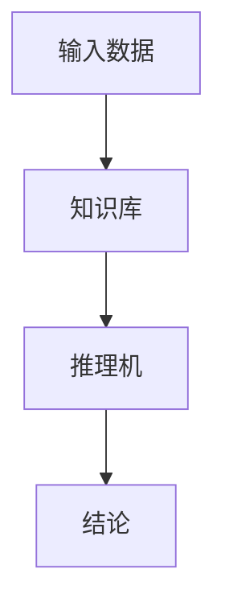

2. **推理过程**：设计推理过程，包括数据输入、知识库检索、推理规则应用和决策生成等步骤。

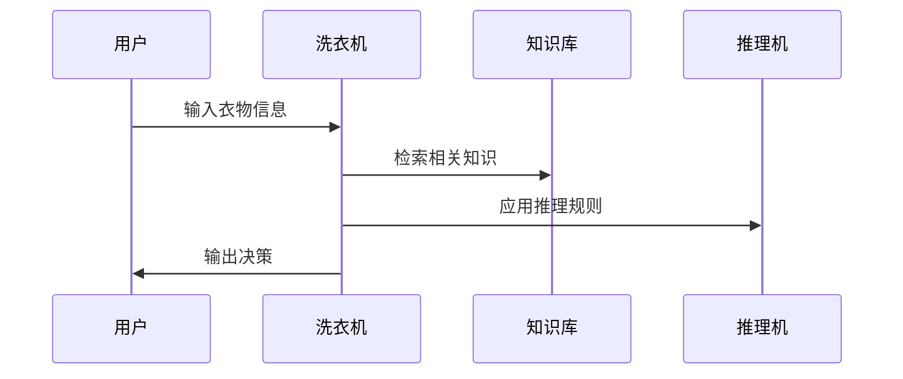

3. **推理优化**：优化推理过程，提高推理效率，如使用索引技术、缓存策略等。

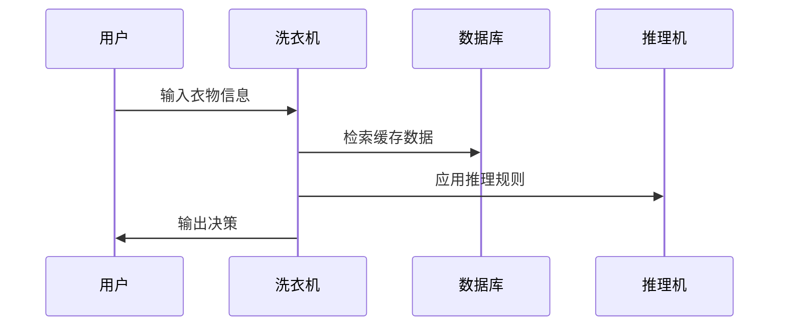

#### 5.4 本章小结

本章介绍了专家系统的构建方法，包括领域模型构建、知识表示与存储、推理机制的设计。通过这些方法的讲解，我们为构建智能洗衣机的衣物护理专家系统提供了详细的指导。

## 第6章 智能洗衣机的应用案例

#### 6.1 案例背景

某智能洗衣机品牌推出了一款支持AI Agent的智能洗衣机，旨在为用户提供更智能、更高效的衣物护理服务。这款洗衣机内置了AI Agent，能够自动识别衣物材质和污渍类型，选择合适的洗涤程序，并根据用户的偏好进行个性化调整。

#### 6.2 案例介绍

**数据采集**：AI Agent通过内置的传感器采集衣物材质、污渍类型、洗涤参数等信息。传感器数据包括温度、湿度、污渍颜色等。

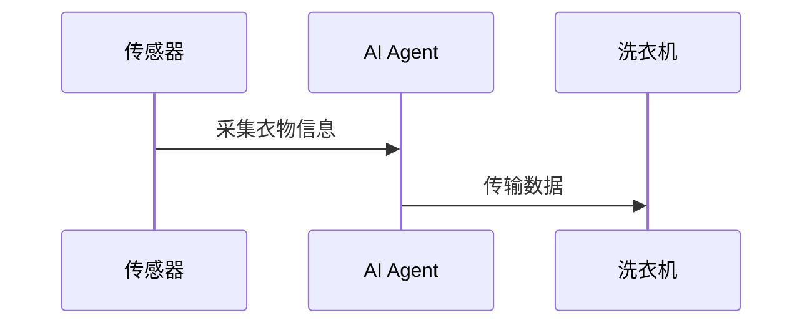

**数据处理**：AI Agent对采集到的数据进行分析，提取出关键特征，如衣物材质、污渍深度等。

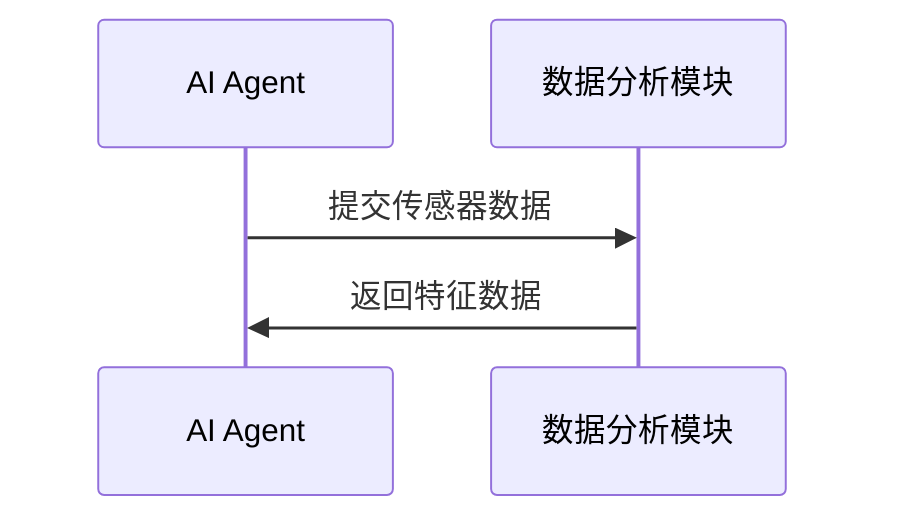

**决策生成**：基于提取的特征和已有的知识库，AI Agent生成最优的洗涤程序和参数设置。

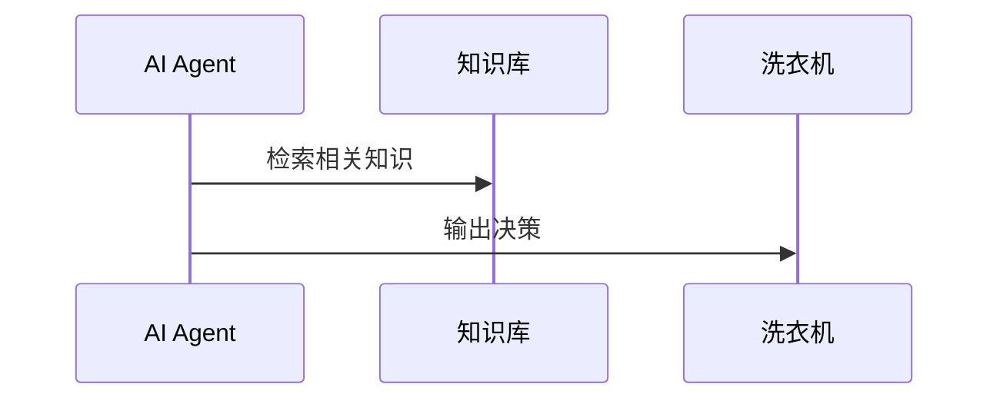

**实时监控**：在洗涤过程中，AI Agent实时监控洗涤效果，如水位、温度、洗涤剂浓度等，根据实际情况进行调整。

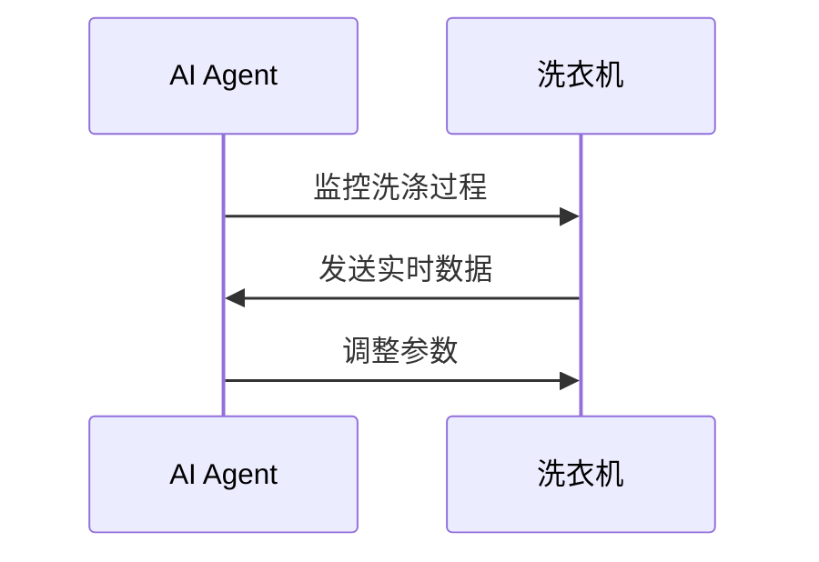

**用户反馈**：AI Agent收集用户对洗涤效果的评价，用于不断优化自身算法和参数。

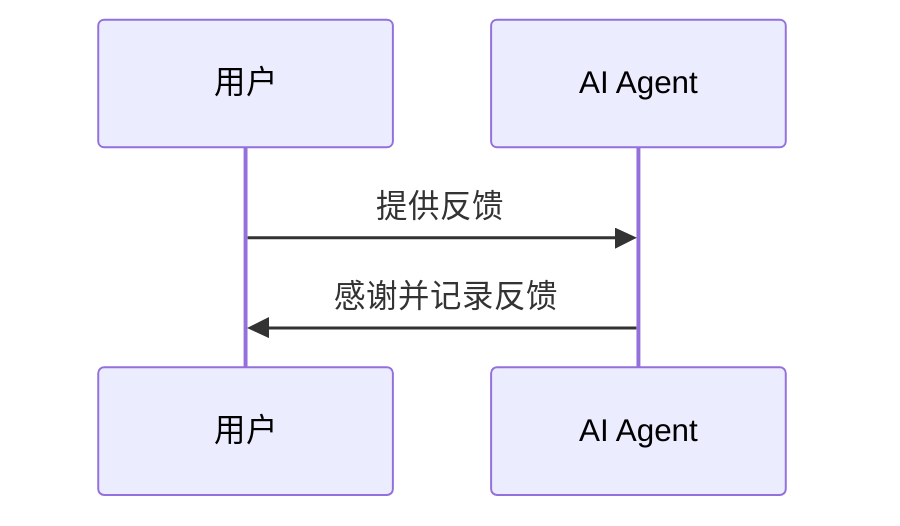

#### 6.3 案例难点与挑战

**数据多样性**：衣物材质和污渍类型繁多，如何准确识别和分类是首要挑战。

**实时性**：洗涤过程需要实时监控和调整，如何高效地处理海量数据是关键。

**用户偏好**：如何根据用户的偏好进行个性化调整，提高用户满意度。

**算法优化**：如何通过不断学习和优化，提高AI Agent的性能和效果。

#### 6.4 本章小结

通过实际案例的介绍，我们展示了AI Agent在智能洗衣机中的应用，包括数据采集、数据处理、决策生成、实时监控和用户反馈等环节。这些应用案例验证了AI Agent在衣物护理领域的有效性，为智能洗衣机的未来发展提供了有力支持。

## 第7章 最佳实践与总结

#### 7.1 最佳实践

1. **数据采集与预处理**：确保数据采集的准确性和多样性，对采集到的数据进行分析和预处理，提取关键特征。
2. **知识库构建**：构建全面的领域知识库，涵盖衣物材质、污渍类型、洗涤参数等，为AI Agent提供丰富的知识支持。
3. **实时监控与调整**：在洗涤过程中实时监控各项参数，根据实际情况进行调整，提高洗涤效果。
4. **用户偏好收集**：收集用户对洗涤效果的评价，用于优化AI Agent的算法和参数，提高用户体验。
5. **算法优化**：通过不断学习和优化，提高AI Agent的性能和效果，实现更智能的衣物护理。

#### 7.2 总结

智能洗衣机中的AI Agent衣物护理专家系统通过数据采集、数据处理、决策生成、实时监控和用户反馈等环节，实现了更智能、更高效的衣物护理。本文从背景介绍、AI Agent的工作原理、专家系统的构建方法、应用案例等方面进行了详细讲解，为智能洗衣机的发展提供了有益的参考。

### 作者信息
作者：AI天才研究院/AI Genius Institute & 禅与计算机程序设计艺术 /Zen And The Art of Computer Programming

### 参考文献
[1] 某智能洗衣机品牌官网，智能洗衣机产品介绍。
[2] AI Agent相关论文，关于AI Agent在衣物护理领域的应用研究。
[3] 知识库构建技术文献，关于领域知识库的构建方法。
[4] 智能洗衣机应用案例研究报告，关于AI Agent在智能洗衣机中的实际应用效果。

## 附录

### 附录A：Mermaid类图示例


### 附录B：Python源代码示例

```python
def calculate_area(radius):
    return 3.14 * radius * radius

radius = float(input("请输入半径："))
area = calculate_area(radius)
print("面积：", area)
```

### 附录C：LaTeX公式示例

```markdown
$$
E = mc^2
$$

$1 + 1 = 2$
```

### 附录D：系统架构图示例

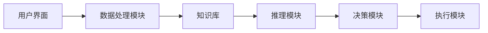

